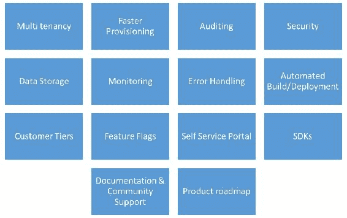

# 十、集成为服务

本章讨论了各种类型的**作为服务的任何东西**（**XaaS**），包括**作为服务的基础设施**（**IaaS**）、**作为服务的平台**（**PaaS**、**作为服务的集成平台**（【T14 iPaaS】）、**数据库即服务**（**DBaaS**），以及在将基础架构或平台元素作为服务公开时需要考虑的所有内容。在云原生模式下，您的应用可能与社交媒体 API 或 PaaS API 集成，或者您可以托管将由其他应用使用的服务。本章介绍了构建应用时需要解决的问题 n-XaaS 模型。

本章将涵盖以下主题：

*   构建自己的 XaaS 时的体系结构和设计问题
*   构建移动应用时的体系结构和设计问题
*   各种后端即服务提供商数据库、授权、云存储、分析等

# 哈斯

云计算开创了弹性、按量付费的按需 IT 托管服务的分发模式。作为服务交付的 IT 的任何部分都被广泛的云计算主题所覆盖。

在云计算主题中，根据 IT 服务的类型，云的特定服务有不同的术语。大多数术语都是术语 XaaS 的不同变体，其中 X 是一个占位符，可以更改为表示多个事物。

让我们看看最常见的云计算交付模型：

*   **IaaS**：当计算资源（计算、网络和存储）作为服务提供以部署和运行操作系统和应用时，称为 IaaS。如果公司不想投资建设数据中心、购买服务器和存储，那么这是一个值得利用的正确服务选择。**亚马逊网络服务****AWS**、Azure 和**谷歌云平台****GCP**是 IaaS 提供商的领先示例。在此模型中，您负责以下事项：
    *   管理、修补和升级所有操作系统、应用和相关工具、数据库系统等。
    *   从成本优化的角度来看，您将负责改善环境。
    *   计算资源的供应几乎是即时的。计算资源的弹性是 IaaS 供应商最大的销售因素之一。
    *   通常，服务器映像可以由云提供商进行备份，因此使用云提供商时可以轻松管理备份和恢复。
*   **PaaS**：一旦计算、网络和存储都被整理好，接下来就需要开发平台和相关环境来构建应用。PaaS 平台提供跨**软件开发生命周期**（**SDLC**的服务。运行时（如 Java 和.NET）、数据库（MySQL 和 Oracle）和 web 服务器（如 Tomcat 和 ApacheWeb 服务器）等服务被视为 PaaS 服务。概念是云计算供应商仍将管理运行时、中间件、操作系统、虚拟化、服务器、存储和网络的底层操作方面。在此模型中，您将负责以下事项：
    *   开发人员的关注点仅限于管理应用和相关数据。应用的任何更改/更新都需要由您管理。
    *   PaaS 的抽象是高层次的（消息传递、Lambda、容器等），允许团队专注于满足客户需求的核心能力。
*   **SaaS**：接下来是租用整个应用的模式。您不需要构建、部署或维护任何东西。您订阅了该应用，提供商将为您或您的组织提供该应用的实例以供使用。您可以通过浏览器访问应用，也可以与提供商提供的公共 API 集成。Gmail、Office 365 和 Salesforce 等服务就是 SaaS 服务的例子。在这个模型中，提供者为所有定制能力非常有限的租户提供特性/功能的标准版本。SaaS 供应商可能会提供一个安全模型，您可以使用**安全断言标记语言**（**SAML**或 OAuth 模型将您的**轻量级目录访问协议**（**LDAP**存储库与供应商集成。该模型非常适用于定制需求较低的标准软件。Office365 和 Salesforce 是 SaaS 供应商最大的招牌产品：

在构建组织及其应用组合时，您可能会向不同的供应商订阅各种类型的服务。现在，如果你正试图建立下一个 Facebook、Instagram 或 Uber，你将需要解决特定的架构问题，以满足数十亿用户的各种需求。

# 构建 XaaS 时的关键设计问题

让我们回顾一下在构建 XaaS 和提供消费服务时需要解决的关键设计问题：

*   **多租户**：当您开始为公众消费设计服务时，首要要求之一是能够支持多个租户或客户。随着人们开始注册使用您的服务，该服务需要提供支持，以便能够为客户数据提供安全边界。通常，SaaS 是多租户设计关注点的一个很好的候选者。对于每个租户，可能需要对数据和应用工作负载进行分区。租户请求在租户数据的范围内。要在应用中设计多租户，您需要查看以下内容：
    *   **隔离**：租户之间需要隔离数据。一个租户不能访问任何其他租户的数据。这种隔离不仅限于数据，还可以扩展到为每个租户标记的底层资源（包括计算、存储、网络等）和操作流程（备份、恢复、DevOps、管理功能、应用属性等）。
    *   **成本优化**：下一个大问题是如何优化设计，以降低云资源的总体成本，同时兼顾各类客户。您可以使用多种技术来管理成本。例如，对于免费层客户，您可以拥有基于租户 ID 的租赁模型。此模型允许您优化数据库许可证、总体计算和存储成本、DevOps 进程等。类似地，对于大型客户，您甚至可以查看专用基础设施，以提供有保证的**服务级别协议**（**SLA**。有许多小公司从少数几个大客户那里做了价值数百万美元的生意。另一方面，你有大公司，迎合数以百万计的小客户。
    *   **DevOps pipeline**：如果您最终为客户构建了同一服务的多个实例，当客户要求为其提供特定功能时，您将遇到问题。这很快会导致代码碎片，并成为不可管理的代码问题。问题变成了如何平衡为所有客户推出新特性/功能的能力，并且仍然能够提供每个客户所需的定制或个性化水平。DevOps 进程需要支持多租户隔离，并维护/监视每个租户进程和数据库模式，以便在所有服务实例中展开更改。除非对 DevOps 进行优化，否则在整个服务中进行更改可能会变得非常复杂和令人望而生畏。这一切都会导致成本增加和客户满意度降低。
    *   **可扩展性**：基本要求之一是能够注册新客户并扩展服务。随着客户规模的增长，预期成本/服务或总体服务成本应该下降。除非我们的服务建立时考虑到前面三种类型的租户，否则该服务将无法扩展并为您的商业模式提供人造护城河。

接下来，当您着手设计多租户服务时，您有以下设计选项：

*   **更快的供应**：在构建 XaaS 模型时，另一个关键问题是提供新客户的能力，这意味着客户入职应该是自助服务。注册后，客户应能立即开始使用该服务。所有这一切都需要一个模型，在这个模型中，新租户可以毫不费力地、非常快速地配置。提供底层计算资源、任何数据库模式创建和/或特定 DevOps 管道的能力应该是非常高效和完全自动化的。从客户体验的角度来看，向用户提供应用运行版本的能力也会有所帮助。对于任何面向大众市场的服务，都会提供更快的资源调配。但是，如果您提供的是非常特定的服务，并且需要与企业客户本地数据中心集成，则可能无法提供瞬间资源调配。在这种情况下，我们应该构建能够解决一些常见集成场景的工具/脚本，以便尽快为客户提供支持。
*   **审核**：安全性的另一个关键问题是审核对服务和底层数据存储的访问和更改的能力。所有审计跟踪都需要存储，以用于任何违规、安全问题或合规性目的。将需要一个集中的审计存储库来跟踪整个系统中生成的事件。您应该能够在审核存储库顶部运行分析，以标记任何异常行为，并采取预防或纠正措施：

您可以使用 Lamda 体系结构，该体系结构使用实时流和从历史数据生成的模型来标记异常行为。一些公共云提供商将此作为一项服务提供。

*   **安全**：根据服务的性质，租户需要安全访问其数据。该服务需要包含身份验证和授权的基本要求。所有客户都有一个安全的密钥和密码短语来连接和访问他们的信息。可能需要企业访问和多个用户。在这种情况下，您可能必须为企业构建委托管理模型。您还可以使用诸如 OAuth（通过 Google、Facebook 等）之类的安全机制来启用对该服务的访问。
*   **数据存储**：您的服务可能需要存储不同类型的数据；根据数据的类型，存储要求将有所不同。存储需求通常分为以下几个方面：
    *   **关系数据存储**：租户数据可能是关系数据，我们讨论了存储该数据的各种多租户策略。特定于租户的应用配置数据可能需要存储在关系模型中。
    *   **NoSQL 存储**：租户数据可能不是一直都是关系型的；它可能是一个列、键值、图形或面向文档的模型。在这种情况下，需要设计并构建适当的数据存储。
    *   **Blob 存储**：如果您的服务需要 Blob 存储或二进制数据存储，那么您将需要访问对象文件存储。您可以使用 AWS 或 Azure 之类的 Blob 存储来存储二进制文件：

*   **监控**：需要监控整个应用堆栈。您可以与客户签约，并向他们保证严格的 SLA。在这种情况下，监控不仅涉及服务或系统可用性，还涉及任何成本损失和声誉损失。有时，单个组件可能具有冗余性和高可用性，但在堆栈级别，所有故障率都可能会增加，从而降低堆栈的总体可用性。跨堆栈监控资源对于管理可用性和已定义的 SLA 变得非常重要和关键。监控包括硬件和软件。需要检测任何异常行为并自动执行纠正响应。通常，监控和自动化修复的能力需要多次迭代才能成熟。
*   **错误处理**：服务的一个关键方面是处理故障的能力以及如何响应服务消费者。故障可能发生在多个级别；数据存储不可用、表被锁定、查询超时、服务实例宕机、会话数据丢失等等都是您将遇到的一些问题。您的服务需要健壮，以处理所有这些以及更多的故障场景。诸如 CQR、断路器、散装、无功等模式需要整合到您的服务设计中。
*   **自动构建/部署**：随着服务消费者数量的增加，推出新功能和修复 bug 的能力将需要自动构建和部署模型。这类似于在汽车行驶时更换轮胎。升级软件和发布补丁/安全修补程序而不影响消费者的通话是一门微妙的艺术，需要时间来掌握。早些时候，我们可以在夜间流量下降时寻找一些系统停机时间，但是对于来自世界各地的客户来说，现在已经没有这样的时间了。蓝绿部署是一种有助于发布新更改的技术，对客户的影响最小，并降低总体风险：

*   **客户层级**：另一个关键问题是如何为不同的客户群构建服务并为其定价。公司一直在创建多个层次，以满足无数客户的需求。这些需求有助于公司确定客户层次，然后开始为服务成本定价。这些因素如下：
    *   **计算**：按小时/天/月限制通话次数。这允许您预测租户所需的容量以及网络带宽需求。
    *   **存储**：另一个参数是底层数据存储所需的存储。这允许您适当地平衡数据库碎片。
    *   **安全**：对于企业客户，使用 SAML 与企业安全模型集成可能有单独的要求。这可能需要额外的硬件和支持。
    *   **SLA/支持模型**：这是在决定客户层级时需要考虑的另一个方面。支持模型社区、随叫随到、专用等具有不同的成本结构。根据目标市场消费者或企业，您可以评估哪种支持模式最适合您的服务。
*   **功能标志**：构建 XaaS 模型时，关键问题之一是如何处理多租户的代码更改、功能发布等。我应该为每个客户提供多个代码分支，还是应该在所有客户中使用一个代码库？如果使用一个代码库，如何发布特定于一个租户的特性/功能？如果您的目标市场是 8-10 个客户，那么为每个客户提供特定的代码分支是一个潜在的可行选择。但是如果目标市场是数百个客户，那么代码分支是一个糟糕的选择。代码分支通常是个坏主意。为了处理不同客户在特性/功能方面的差异，或者管理尚未准备好发布的新特性，特性标志是处理此类需求的一种很好的方法：

功能标志允许您在生产中发布代码，而无需立即为用户发布功能。您可以使用功能标志向不同的客户提供/限制应用的某些功能，具体取决于他们购买的服务级别。您还可以将特性标志与 A/B 测试结合使用，向部分用户发布新特性/功能，以检查其响应和功能正确性，然后再向更广泛的受众发布。

*   **自助门户**：您服务的一个关键方面是自助门户，用户可以在这里注册、提供服务，并管理应用数据和服务的各个方面。门户允许用户管理企业方面，如身份验证/授权（使用委托管理模型），监控已配置的服务的可用性，在服务的关键指标上设置自定义警报/警报，并破译服务器端可能出现的任何问题。精心设计的门户有助于提高客户对服务性能的总体信心。您还可以基于客户层级为付费客户构建高级监控和分析服务。请记住，任何人都可以复制您的服务提供的特性/功能，但围绕您的服务构建附加的增值特性将成为您的服务的一个独特优势。
*   **软件开发工具包**（**SDK**）：作为让用户能够接受您的服务的关键措施之一，您可能希望为您的消费者构建和提供 SDK。这不是一个必须具备的功能，而是一个理想的功能，尤其是当客户以应用代码级别与您的服务集成时。在这种情况下，SDK 应该提供对多种语言的支持，并附带好的示例和文档，以帮助客户端的开发人员。如果您的应用或服务很复杂，那么拥有一个解释如何调用您的服务或在现有服务（如 SAML、OAuth 等）中集成的 SDK 就成为更快地采用您的服务的关键。
*   **文档和社区支持**：服务可采用性的另一个方面是文档的级别以及对产品/服务的社区支持。文件应至少包括以下几点：
    *   如何注册该服务
    *   如何调用和使用服务
    *   如何在客户环境和可集成的 SDK 中集成服务
    *   如何批量导入或批量导出数据
    *   如何安全地集成企业 LDAP/**Active Directory**（**AD**服务器）进行身份验证/授权

接下来你需要考虑的是建立一个积极的社区支持。你需要为人们提供适当的互动论坛。您需要有活跃的**主题专家**（**SME**）来回答来自不同论坛（内部和外部）的问题。堆栈溢出之类的问题很多；您应该设置警报、监视线程，并帮助回答用户的问题/查询。活跃的社区是对您的产品感兴趣的标志。许多组织也使用这个论坛来确定早期采用者，并在产品路线图中寻求他们的反馈。

*   **产品路线图**：一个好的产品可能从一个**最低可行产品**（**MVP**）开始，但它通常支持一个坚实的愿景和产品路线图。当您收到客户的反馈时，您可以不断更新产品路线图并重新确定待办事项的优先级。一个好的路线图表明了产品愿景的力量。当您与外部利益相关者、客户、合作伙伴、**风险资本家**（**风投**等会面时，他们首先要求的是产品路线图。
    路线图通常包括战略优先级和计划发布，以及维护/缺陷修复发布的高级功能和计划，等等：

我们已经讨论了在构建 XaaS 模型时需要考虑的一些设计问题。我们已经介绍了每个问题的基本知识。每一个关注点都保证至少有一章属于自己。希望它能让您了解在尝试围绕 XaaS 构建业务模型时需要考虑的各种其他非服务方面。该服务的实际设计和开发基于我们在[第 2 章](02.html)*编写您的第一个云原生应用*之后所讨论的问题。

# 与第三方 API 的集成

在上一节中，我们看到了构建自己的服务提供商时的设计问题。在本节中，我们将了解如果您试图构建消费者应用，如何利用第三方公司提供的 REST 服务。例如，您正在尝试构建一个漂亮的移动应用，您的核心能力是构建可视化设计和创建移动应用。您不希望管理托管/管理应用数据所带来的所有复杂性。该应用将需要包括存储、通知、位置、社交整合、用户管理、聊天功能和分析等在内的服务。所有这些提供商都集中在**后端即服务**（**BaaS**提供商）的保护伞下。这些服务无需与单一供应商签约；您可以选择适合您的业务需求和预算的提供商。每个提供商通常运行一个 freemium 模型（每月免费提供一定数量的 API 调用）和一个商业模型（收费）。这也属于构建无服务器应用的范畴，作为开发人员，您不需要维护任何运行任何软件的服务器。

在这方面，我们将研究构建完整的无服务器应用所需的第三方服务：

*   **Authentication services**: One of the first things any application requires is the ability to sign up or register users. A registered user allows the opportunity for application developer to provide personalized services and know his likes/dislikes. This data allows him to optimize the user experience and provide the necessary support to get maximum value out of the application.

    “身份验证即服务”侧重于围绕用户身份验证封装业务功能。身份验证需要身份提供程序。该提供商可以映射到您的应用或企业，或者您可以使用一些消费公司，如谷歌、Facebook、Twitter 等。有多个身份验证服务提供程序可用，例如 Auth0、Back&、AuthRocket 等。这些提供商应至少提供以下功能：

    *   **多因素认证**（**MFA**）（包括对社会身份提供者的支持）：主要要求之一，提供者应提供身份提供者实例，应用可在其中管理用户。该功能包括用户注册、通过短信或电子邮件进行双因素身份验证，以及与社交身份提供商的集成。大多数提供者都使用 OAuth2/OpenID 模型。
    *   **用户管理**：身份验证提供商应与 MFA 一起提供用户界面，允许已注册应用的用户管理。您应该能够提取电子邮件和电话号码，以便向客户发送推送通知。您应该能够通过使用安全领域或根据应用的需要将用户添加到某些预定义角色来重置用户凭据和保护资源。
    *   **插件/插件**：最后但并非最不重要的一点是，提供商应提供可嵌入到应用代码中的插件/插件，以作为无缝服务提供用户身份验证：

*   **无服务器服务**：您需要管理应用服务器和底层 VM 以部署代码的日子一去不复返了。抽象的层次已经转移到所谓的业务功能。您可以编写一个函数，将请求作为输入，处理请求，并输出响应。没有运行时，没有应用服务器，没有 web 服务器，什么都没有。只是一个函数！提供程序将自动设置运行时以与服务器一起运行该功能。作为开发人员，您不必担心任何事情。您将根据调用函数的次数和函数运行的时间收取费用，这意味着，在经济困难时期，您的成本为零。
    通过该功能，您可以访问数据存储并管理特定于用户和应用的数据。两个函数可以使用队列模型相互通信。可以使用提供程序的 API 网关将函数公开为 API。
    所有公共云供应商都有一个版本的无服务器模型 AWS 有 Lamda，Azure 有 Azure 功能，Google 有云功能，Bluemix 有 Openwhisk，等等：

*   **数据库/存储服务**：应用通常需要存储来管理客户数据。这可以是简单的用户配置文件信息（如照片、姓名、电子邮件 ID、密码和应用首选项）或用户特定数据（如消息、电子邮件和应用数据）。根据数据类型和存储格式，可以选择适当的数据库/存储服务。对于二进制存储，我们为所有类型的二进制文件提供了 AWS S3 和 Azure Blob 存储等服务。对于直接从移动应用以 JSON 格式存储数据，您可以使用云提供商，如 Google Firebase，也可以使用 MongoDB 作为服务（[www.mlab.com](https://mlab.com/)。AWS、Azure 和 GCP 提供了多种数据库模型，可用于管理各种不同的存储需求。您可能需要使用 AWS Lambda 或 Google Cloud 函数才能访问存储数据的数据库。例如，如果应用请求需要在存储数据之前进行一些验证或处理，则可以编写一个 Lambda 函数，该函数可以作为 API 公开。移动应用访问调用 Lambda 函数的 API，在请求处理之后，数据存储在数据存储中。
*   **通知服务**：应用通常注册用户和设备，以便能够向设备发送通知。AWS 提供了一种名为亚马逊**简单通知服务**（**SNS**）的服务，可用于注册和发送来自移动应用的通知。AWS 服务支持向 iOS、Android、Fire OS、Windows 和基于百度的设备推送通知。您还可以在 iOS 设备上向 macOS 台式机和**IP 语音**（**VoIP**）应用发送推送通知，并向 200 多个国家/地区的用户发送电子邮件和短信。
*   **分析服务**：一旦客户开始采用该应用，您将想知道该应用的哪些功能正在使用，用户在哪里面临问题或挑战，以及用户在哪里放弃。要了解所有这些，您需要订阅分析服务，该服务允许您跟踪用户操作，然后将这些操作整理到中央服务器。您可以转到该中央存储库，深入了解用户活动。您可以利用对客户行为的深入了解来改善总体客户体验。谷歌分析是这一领域的热门服务。您可以跟踪用户的总体多个参数，包括位置、使用的浏览器、使用的设备、时间、会话详细信息等。您还可以通过添加自定义参数来增强它。这些工具通常提供一定数量的固定报告。您还可以添加/设计自己的报告模板。
*   **定位服务**：应用使用的另一项服务是定位服务。您的应用可能需要一些功能，这些功能需要针对给定的上下文进行策划（在本例中，位置可以是上下文属性之一）。上下文感知功能允许您根据最终客户的需求对功能/服务进行个性化设置，并有助于改善总体客户体验。Google Play 服务位置 API 提供了这样的功能。位置服务有一整套服务/应用。例如，Uber、Lyft 和 Ola（印度）等公司就是围绕位置服务构建商业案例的绝佳例子。大多数物流企业（尤其是最后一英里）利用定位服务进行路线优化和配送等。
*   **社交整合服务**：您的应用可能需要与流行社交网络（Facebook、Twitter、Instagram 等）进行社交整合。您需要能够访问登录用户的社交提要、代表他们发布文章和/或访问他们的社交网络。有多种方式可以访问这些社交网络。这些网络中的大多数为其他应用提供访问权限，并公开一组 API 来连接它们。然后是聚合器，它允许您提供与一组现成的社交网络的集成。
*   **广告服务**：应用，尤其是移动应用使用的另一项关键服务是向用户提供广告服务。根据应用模型（免费/付费），您需要确定应用货币化的模型。要向用户提供广告（称为应用内广告），您需要向广告网络提供商注册并调用其 API 服务。谷歌的 AdMob 服务是这一领域的先驱之一。

在构建应用时，您可能需要查看许多其他服务提供商。我们涵盖了主要的突出类别。根据应用的需要，您可能希望搜索特定需求领域中的提供商。我相信已经有人提供了服务。有一些综合供应商称为 BaaS。这些 BaaS 提供商通常提供多种服务供使用，并减少应用端的总体集成工作。您不必与多个提供商打交道；相反，你和一个人一起工作。这一个供应商可以满足您的多种需求。

BaaS 作为一个细分市场具有很强的竞争力。随着多家供应商的竞争，你会发现在这一领域也有大量的合并和收购。最近发生了以下情况：

*   **解析**：被 Facebook 收购。Parse 提供了一个后端来存储数据，能够将通知推送到多个设备，并提供了一个社交层来集成应用。
*   **GoInstant**：被 Salesforce 收购。GoInstant 提供了一个 JavaScript API，用于将实时多用户体验集成到任何 web 或移动应用中。它易于使用并提供所需的完整堆栈，从客户端小部件到发布/订阅消息到实时数据存储。

有垂直和水平的 BaaS 提供商，它们围绕特定域提供服务或 API。电子商务领域、游戏领域、分析领域等都有供应商。

注册前，请记住检查提供商的可信度。请记住，如果提供者折叠，您的应用也会遇到麻烦。确保您了解他们的业务模式、产品路线图、融资模式（尤其是初创企业），以及他们听取客户意见的程度。你想和伙伴搭便车，他们会带你一路走。

# 总结

在本章中，我们讨论了构建 XaaS 提供程序时的一些关键问题。我们还讨论了另一方面，在这里我们看到了可用于构建应用的典型服务。

在下一章中，我们将介绍 API 最佳实践，其中我们将了解如何设计粒度和面向功能的以消费者为中心的 API。我们还将讨论 API 设计关注点中的最佳实践，例如如何识别将用于形成 API 的资源、如何对 API 进行分类、API 错误处理、API 版本控制等。