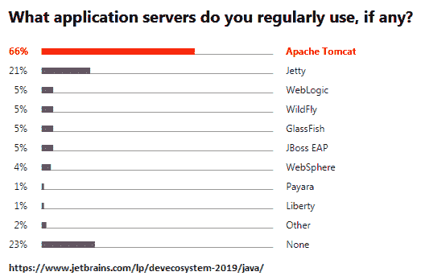
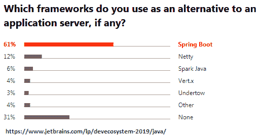

# 一、从何处开始以及如何准备面试

本章是一个全面的指南，介绍了 Java 面试的准备过程，从一开始到被录用。更准确地说，我们希望强调能够确保未来职业道路顺利和成功的主要检查点。当然，在阅读本书时，您可能会发现自己处于以下任何一个检查点：

*   尽早开始面试准备
*   获得正确的经验
*   向全世界展示你的作品
*   准备你的简历
*   接受采访

在本章结束时，您将清楚地了解如何根据当前状态实现前面的检查点。那么，让我们从第一个检查点开始，看看新手面试路线图。

# 新手面试路线图

让我们从一个基本事实开始，这对于成为一名成功的开发人员是绝对必要的，但还不够：最好的 Java 开发人员对他们的工作充满激情，随着时间的推移，真正的激情会变成职业。从长远来看，激情是无价的，它会让你从一群技术娴熟但冷静的人中脱颖而出。

既然你买了这本书，你想在 Java 软件开发事业上投入一些时间和金钱。主要是，您希望成为令人惊叹的 Java 生态系统的一部分！您已经感受到了专注于使用 Java 所带来的力量和能量，因此，即使您还没有积极地考虑它，您也已经开始为 Java 面试做好准备。

最可能的情况是，您是一名学生，或者刚刚获得 IT、计算机科学的学士学位，或者您只是发现了自己对 Java 语言的偏好。然而，既然您来到了这里，您对如何在 Java 生态系统中获得理想工作有很多疑问。

是时候为成功制定计划了！以下流程图表示希望成为 Java 生态系统一部分的学生或 Java 新手的面试路线图：

图 1.1–新手面试路线图

在本章中，我们将介绍前面图表中的每一项。让我们从第一项开始，*了解你自己*。

# 了解你自己

在找工作之前，了解自己很重要。这意味着你应该知道你是什么样的开发人员，你想要什么样的工作。

这对于获得合适的经验、发展技能和找到合适的雇主至关重要。最有可能的是，您可以涵盖范围广泛的 Java 编程任务，但您是否发现所有这些任务都具有同等的吸引力？在短时间内做一些你不喜欢的事情是可以的，但从长远来看是行不通的。

理想情况下，从长远来看，你必须专注于你最喜欢做的事情！这样，您就最大限度地提高了成为顶级 Java 开发人员的机会。但是，做你最喜欢做的事情应该结合 IT 市场提供的东西来考虑（短期而言，最重要的是长期而言）。一些 Java 技术被工作邀请广泛覆盖，而另一些可能需要很长时间才能找到工作，或者必须做出一些非常不愉快的权衡（例如，重新安置）。强烈建议定期咨询并参与（每次计票）由 blogs.oracle.com、snyk.io、jaxenter.com、codeburst.io、jetbrains.com 和 dzone.com 等网站进行的最相关的 Java 调查。从统计数据上看，拥有一系列可供选择的公司可以最大限度地为您找到合适的公司。这是问题的一半，而另一半是让自己做好准备，确保你想要的工作所在的公司会想要你。

现在，让我们检查 10 个问题，这些问题将帮助您确定您计划成为哪种类型的开发人员。在考虑以下问题和解释时，审视自己的内心，尝试重叠你的个性和技能：

1.  **您是否对开发用户界面或幕后执行的繁重业务逻辑感兴趣？**开发优秀的用户界面是图形界面的一个极其重要的方面。毕竟，图形界面是最终用户所看到和交互的。它需要创造力、创新、远见和心理学（例如，开发多设备接口非常具有挑战性）。它需要 JavaAWT、Swing、JavaFX、Vaadin 等方面的知识。另一方面，在后台执行的业务逻辑和对最终用户操作的响应是界面背后的引擎，但是，对于最终用户来说，大多数时候它是一个黑匣子。业务逻辑需要强大的编码技能和算法、数据结构、框架（如 Spring Boot、Jakarta EE 和 Hibernate）、数据库等方面的扎实知识。大多数 Java 开发人员选择在后台对业务逻辑进行编码（对于桌面和 web 应用程序）。
2.  **您认为哪种应用程序最吸引人**（桌面、手机、网络或其他）？每种类型的应用程序都有特定的挑战和专用的工具套件。今天，公司的目标是尽可能多的消费者，因此，现代应用程序应可用于多平台设备。最重要的是，您应该能够将应用程序暴露在不同的设备上并与其他系统交互的知识编码进来。
3.  **您是否对测试、调试和/或代码审查特别感兴趣？**在编写有价值的测试、发现错误和审查代码方面拥有很强的技能是保证高质量最终产品的最重要技能。在这三个领域中，我们应该关注测试，因为几乎所有 Java 开发人员的工作描述都要求应聘者在编写单元测试和集成测试方面具有很强的技能（最常用的首选工具是 JUnit、TestNG、Mockito 和 JVM）。尽管如此，试图找到一个专门的 Java 测试人员或 Java 代码审查员是一个相当具有挑战性的工作，通常在大公司（特别是在提供远程工作的公司，如 Upstack 或 Crossover）中会遇到。大多数公司更喜欢*对代码审查*，每个 Java 开发人员都应该编写有意义的测试，为他们编写的代码提供高覆盖率。因此，您必须能够同时完成这两项工作：编写令人惊讶的代码，并为该代码编写测试。
4.  **您是否对与数据库交互的应用程序感兴趣，还是尽量避免使用此类应用程序？**大多数 Java 应用程序使用数据库（关系数据库或 NoSQL 数据库）。广泛的 Java 开发人员工作迫切需要您具备通过对象关系映射框架（如 Hibernate）、JPA 实现（如 Hibernate JPA 或 Eclipse Link）或以 SQL 为中心的库（如 jOOQ）对数据库进行编码的丰富知识。大多数 Java 应用程序与关系数据库（如 MySQL、PostgreSQL、Oracle 或 SQL Server）交互。但 NoSQL 数据库，如 MongoDB、Redis 或 Cassandra，也在大量应用程序中遇到。试图避免开发与数据库交互的应用程序可能会严重限制提供的工作范围。如果这是你的情况，那么你应该从今天开始重新考虑这方面。
5.  **您对代码优化和性能有偏好吗？****关注代码的性能是一项备受赞赏的技能。这样的行为会把你归类为一个非常注重细节的完美主义者。拥有优化代码并提高其性能的解决方案将使您能够很快地参与功能需求解决方案的设计和架构。但是在面试阶段（代码挑战阶段），不要关注代码优化和性能！只需专注于提供一个有效的解决方案，并尽可能地提供干净的代码。**
***   **什么对你更有吸引力：专注于编码的工作还是软件架构师？**在您作为 Java 开发人员的职业生涯之初，您将专注于代码级别的编码和实现设计决策。随着时间的推移，一些开发人员发现了他们在构建大型应用程序方面的能力和兴趣。这意味着是时候从 Java 开发人员发展成为 Java 架构师，甚至是 Java 首席架构师了。虽然编码仍然是你工作的一部分，但作为一名架构师，你将在同一天戴上不同的帽子。您必须在会议、架构和编码之间分配时间。如果你觉得你有能力设计和架构一个项目的不同部分，那么最好在软件体系结构中考虑一些培训。此外，在专注于编码的工作中，挑战自己，看看能找到什么解决方案，并将它们与当前应用程序架构师实现的解决方案进行比较。*   **你的目标是小公司还是大公司？**选择小公司还是大公司是一个权衡问题。理想情况下，一家大公司（一个品牌）将提供稳定、职业道路和良好的薪酬计划。但你可能会被官僚主义、部门之间缺乏沟通和竞争以及冰冷僵硬的环境所窒息。在一家小公司里，你有机会更强烈地感觉到自己是成功的一部分，并会有一种成为小社区（甚至是家庭）一部分的美好、温暖的感觉。然而，小公司可能会很快倒闭，你可能会在一两年内被解雇，很可能没有任何补偿。*   **您的目标是一家软件公司（从事广泛的项目）还是某个行业（例如，石油行业、医药行业、汽车行业等）？**软件公司管理多个领域的项目（例如，软件公司可能同时为好莱坞明星开发网站、金融应用程序和航空交通管制应用程序）。从开发人员的角度来看，这意味着您需要多才多艺的思维，并且能够快速适应以了解不同业务领域的需求，而无需深入这些领域。另一方面，大型行业（例如石油行业）更喜欢创建自己的 IT 部门，开发和维护特定于该公司领域的应用程序。在这种情况下，你很可能也会在特定公司的领域接受一些培训。您将拥有成为特定领域应用程序开发专家的优势。*   **你喜欢远程工作吗？**在过去几年中，很多公司决定雇佣远程开发者。此外，Upwork、Remote | OK、X-Team 和 Crossover 等新公司都是 100%远程公司，只为远程职位招聘人才。在世界任何一个角落使用灵活的程序的优势都非常吸引人。这些公司为初级、中级和高级开发人员提供工作，其中一些（例如 Crossover）也提供远程管理职位。但是，您还必须了解这种安排的其他一些方面：有可能通过网络摄像头对您进行监控（例如，每 10 分钟拍摄一次快照）；您需要与来自不同时区的成员一起在一个完全远程的团队中工作（例如，在夜间参加会议可能会有挑战性）；您必须熟悉 JIRA、GitHub、Zoom、Slack、Meetup 和内部市场平台等工具；你可能会面临很多摩擦（大量电子邮件）和缺乏沟通；你需要纳税，最后但并非最不重要的一点是，你可能需要实现不真实的指标，以损害质量来维持你的地位。*   **Does management interest you?** Commonly, reaching a managerial position is a goal that requires leadership skills. In other words, you should be able to take important decisions at both the technical and human levels. From this perspective, you need to avoid companies that offer a solid technical career path but don’t provide opportunities to get promoted to the ranks of management.

    重要提示

    **了解自己是人生中做出最好决定所需的最困难的部分之一。有时候，征求别人的意见是消除你对自己主观看法的最好办法。大多数情况下，询问你的老师、父母和朋友会帮助你更好地了解自己的技能以及最适合自己的地方。单独做出重要决定是有风险的。**** 

 ****一旦你了解了自己，是时候了解市场了。

# 了解市场

知道自己想要什么固然好，但还不够。下一步，你应该研究市场对你的需求。目标是获得你想要的和市场提供的完美鸡尾酒。

重要提示

 **培养适销对路的技能是在不久的将来找到工作的一个重要方面。

首先，您必须检查哪些 Java 技术在过去几年中最受欢迎，以及未来的趋势可能是什么。随着时间的推移，保持相对稳定流行度的技术在公司中使用最多。

花点时间从 blogs.oracle.com、snyk.io、jaxenter.com、codeburst.io、jetbrains.com 和 dzone.com 等重要网站上阅读过去 2-3 年的几项调查。首先，您可以在谷歌上搜索*2019 年 java 技术调查*或类似的关键字组合。另外，不要忽略财务部分，所以一定要搜索*2019 年爪哇薪资调查*。

您将发现各种各样的调查很好地总结了最流行的技术，如下图所示。第一个显示了应用程序服务器的流行程度：

图 1.2–使用的应用程序服务器

下图显示了开发者更喜欢哪些框架：

图 1.3–开发人员喜欢使用的框架

阅读时，列一个清单，记下哪些 Java 技术最受欢迎，哪些技术目前不值得关注。它将是一个类似于以下内容的列表：

图 1.4——按流行程度划分的技术

这样，您可以快速筛选市场最需要的技术。学习流行的技术可以最大限度地增加你在不久的将来找到工作的机会。

此外，通过以下方式将市场的脉搏对准您添加到*热门*专栏的技术：

*   **社交网络**：大量社交网络包含关于技术和 IT 行业趋势的帖子。一些主要参与者是 LinkedIn、Stack Overflow、Twitter、Reddit 和 Facebook。
*   **书店**：图书出版商通过覆盖最流行的技术来满足编程社区的兴趣。他们开展认真的研究活动，筛选出应该在书中涵盖的主题。关于某一主题或技术的新书或大量书籍是编程社区对该主题感兴趣的良好指示器。然而，要注意那些突然成为主流的技术。大多数时候，这些技术并没有立即被公司采用。它们可能需要数年时间才能被采纳，也可能永远处于阴影之中。
*   **课程与培训**：除高校外，数吨网站致力于为热门话题提供课程与培训。

# 这一切都是为了获得正确的体验

你知道你想要什么，市场提供什么。这太酷了！现在是获得正确体验的时候了！没有经验就没有简历，没有简历就没有面试，因此，这是一个重大而艰难的步骤。以下小节将帮助您实现两个主要目标：

*   积累了大量的技术知识和技能。
*   在整个 Java 生态系统中获得信任和可见性。

请注意——这两个目标不会在一夜之间实现！这需要时间和毅力，但有一个明确和有保证的结果——你将成为顶级 Java 开发人员。那么，让我们开始做点什么吧！

## 开始做点什么

对于一个学生或刚毕业的人来说，要想获得经验和写简历，很难决定从哪里开始。你知道你应该*开始做某事，但你无法决定*某事*应该是什么。嗯，那个*什么*应该是**代码**。在你开始任何正式工作之前，先参与学校项目、实习、编程、志愿工作和任何实践经验。*

## 是时候在网上大放异彩了

必须尽早上网，向全世界展示你能做什么（例如，在学校）。公司和编程社区都期待着看到你如何在线成长。但在你加入之前，请确保你遵循以下两条黄金法则：

*   **注意用于在网上公开作品的身份是非常重要的。**不要使用虚拟凭证、化身、昵称、电子邮件、密码等。最有可能的是，您现在创建的帐户（在 GitHub、Stack Overflow、LinkedIn、YouTube、Twitter 等网站上）将在互联网上共享，并使您成名。始终使用您的全名（例如，Mark Janel，Joana Nimar），在您的个人资料中使用您的相关照片（如下图所示），并在帐户（例如，@markjanel，joananimar）和电子邮件地址（例如，Mark）中使用您的姓名。janel@gmail.com). 虚名、电子邮件和昵称更难与您和您的工作联系起来：

图 1.5–使用相关照片

*   **始终接受批评，保持礼貌。**在网上公开你的作品会吸引批评。你收到的极少数评论是真正的恶意评论，没有逻辑参数。在这种情况下，最好的做法是忽略这些评论。但大多数批评者都会持积极和建设性态度。对这样的评论，一定要用争论来回答，并且一定要有礼貌。**常识是最重要的技能！**敞开心扉，接受其他意见！

不要失望或沮丧。永不放弃！

### 为开源项目做出贡献

为开源项目做贡献是一种超音速的方法，用于衡量你的技能，并快速获得经验和对寻找候选人的公司的可见性。不要低估自己！小额捐款也很重要。即使是阅读和理解开源项目的代码，也是获得编码经验和学习编码技术的绝佳机会。

许多开源项目鼓励并支持开发人员做出贡献。例如，在以下屏幕截图中查看 Hibernate ORM 开源项目：

图 1.6——为开源项目做出贡献

您有机会将您的足迹添加到代码中，以便以后在日常工作中使用！它也被数以百万计的开发者所使用。多酷啊！？

### 启动您自己的 GitHub 帐户

除了为开源项目做出贡献外，建议您创建自己的 GitHub 帐户。雇主在见到你之前会评估你的 GitHub 档案的内容。不要忽视任何方面！花点时间清理 GitHub 配置文件，让它反映出您的最佳代码。请记住，最糟糕的 GitHub 帐户类型是空帐户或长期活动性较低的帐户，如以下屏幕截图左侧所示：

图 1.7-GitHub 在四个月内的贡献

展示对干净代码和有意义的**README.md**文件的偏好，并避免长期处于低活动期，如前一个屏幕截图所示。

### 启动自己的栈溢出帐户

栈溢出是评估您工作的公司的下一站。你关于栈溢出的问题和答案将出现在谷歌搜索中，因此，你必须特别注意你发布的内容（问题和答案）。根据经验，您的问题可能会显示您的知识水平，因此，*不要*发布简单的问题、文档中有简单答案的问题、存在于琐碎编程挑战背后的问题，等等。另一方面，确保提供有价值的答案，不要重复别人的答案。提供能给你带来徽章而不是否决票的内容。将您的 GitHub 配置文件链接到您的答案，以提供完整的解决方案。

### 创建自己的 YouTube 频道

除了娱乐，YouTube 也是技术知识的巨大来源。在 YouTube 上，你可以发布完整的编码解决方案，向人们展示如何编程以及如何成为更好的程序员。如果执行以下操作，您可以快速增加 YouTube 订户：

*   不要看长视频（坚持 10-20 分钟的课程）！
*   确保你有一个好的网络摄像头和麦克风。一个好的网络摄像头至少有 1080p 的分辨率，一个好的麦克风是雪球冰；对于录制，请使用免费或低成本工具，如 Free2X 网络摄像头录像机（Free2X.com/Webcam Recorder）和 Loom（Loom.com）；Camtasia Studio 也非常棒（techsmith.com/video editor.html）。
*   展示出色的英语技能（YouTube 上最常用英语）。
*   自我介绍（但要快）。
*   保持热情（向人们展示你喜欢你的工作，但不要夸大）。
*   实用（人们喜欢实时编码）。
*   抓住机会证明你的演讲技巧（这为你打开了技术会议的大门）。
*   推广您的工作（添加更多视频、源代码等的链接和提示）。
*   回应人们的反馈/问题（不要忽略人们对你的视频的评论）。
*   接受批评并保持礼貌。

将你的 GitHub 和 Stack Overflow 帐户链接到你的 YouTube 视频，以获得更多曝光率和关注者。

### 开始你的技术博客

你在 GitHub、Stack Overflow 和 YouTube 上的出色工作可以在技术博客的故事中轻松推广。写编程主题，特别是你解决的编程问题，写教程、技巧和窍门等等。不断的发帖和高质量的内容将增加你的流量，并在搜索引擎上索引你的博客。有朝一日，这些有价值的内容可以被用来写一本惊人的书，或者在 Udemy（Udemy.com）或 PluralSight（learn.PluralSight.com）上制作一个很棒的视频。

有很多博客平台，比如博客（Blogger.com）、WordPress（WordPress.org）和媒体（media.com）。选择一个你喜欢的开始吧。

### 写文章，吸引巨大的流量和/或获得报酬

如果你想发表技术文章、赚钱或吸引大量流量到你的工作中，那么个人博客将不会很有用，至少在相当长的时间内（1-2 年）不会。但是你可以为那些每天流量巨大的网站撰写技术文章。例如 DZone（DZone.com）是一个很好的技术平台，在这里你可以免费写作，也可以加入不同的项目，在那里你可以获得工作报酬。只需创建一个免费的 DZone 帐户，您就可以立即通过其在线编辑器发布技术文章。在 1-5 天内，他们将审查你的工作并将其发布到网上。几乎在瞬间，成千上万的人会阅读你的文章。除了 DZone，其他优秀的技术平台也会付钱给你为其写作（通常每篇文章的在 10-150 美元之间，具体取决于篇幅、主题、内部政策等）。其中一些平台包括 InformIT（InformIT.com）、InfoQ（InfoQ.com）、Mkyong（Mkyong.com）、developer.com（developer.com）、Java 代码极客（javacodegeks.com）、Geeksforgeks（geksforgeks.org）和 SitePoint（SitePoint.com）。

### 提升你自己和你的工作（投资组合）

工作很重要，但向人们展示你所做的事情并获得他们的反馈也很重要。

重要提示

*管理您的在线个人资料非常重要。*招聘人员使用在线个人资料来寻找理想的候选人，更好地了解你，并准备深入或定制的面试问题。

除了 GitHub、Stack Overflow 等，招聘人员还会在谷歌上搜索你的名字，并查看你的个人网站和社交网络档案。

个人网站

个人网站（或公文包）是展示你作品的网站。只需添加您制作/参与的应用程序的屏幕截图，并简要描述您的工作。解释您在每个项目中的角色，并提供项目链接。注意不要暴露私人和专有的公司信息。你可以快速从互联网上获得灵感（例如，codeburst.io/10-awesome-web-developer-portfolions-d266b32e6154）

为了建立你的个人网站，你可以依靠免费或低成本的网站建设者，比如谷歌网站（Sites.Google.com）和 Wix（Wix.com）。

#### 社交网络简介

推特是最重要的社交网络之一。在 Twitter 上，您可以在世界上最好的 Java 开发人员面前宣传您的工作。从第一天开始，搜索并关注最好的 Java 开发人员，很快他们也会关注你！作为提示，开始关注尽可能多的 Java 拥护者（世界上最好的 Java 开发人员的专属社区）。Twitter 上有一个庞大而有价值的 Java 开发人员社区。尽快了解他们！

其他社交网络如 Facebook 和 Instagram 也会被招聘人员扫描。注意你帖子的内容。显然，激进主义、种族主义、狂热、琐碎或色情内容、政治内容、口号和煽动暴力、诽谤和冒犯性内容等都会导致招聘人员退后一步。

#### 编码秩问题

CoderRank（coderRank.io/）是一个平台，它可以收集有关您工作的信息（例如，它从 GitHub、Stack Overflow、Bitbucket、Hakerank 等收集信息），并尝试将您与来自世界各地的数百万其他开发人员进行排名。在以下屏幕截图中，您可以看到开发人员的个人资料页面：

图 1.8–CodersRank 概要

这是招聘人员的另一个重要晴雨表。

学习，编码，学习，编码。。。

一旦你成为了一名开发人员，你必须遵循*学习—>代码*的实践，才能登上顶峰并保持在那里。永远不要停止学习，永远不要停止编码！根据经验，*学习->代码*实践可以通过*以身作则*或*教学来应用，这是我的学习方式*方法，或任何最适合你的其他方法。

### 认证怎么样？

访问 education.oracle.com/certification 后，您可以看到 oracle 提供了一套 Java 认证。虽然从甲骨文或其他方获得认证没有什么错，但在工作描述中并不需要这些认证。获得这些认证需要大量的金钱和时间，而大多数时候，他们并没有得到回报。您可以更明智地利用这段时间并参与项目（辅助项目、学校项目、开源项目等等）。这是给雇主留下深刻印象的更好方法。因此，证书的价值有限，获取证书需要大量资源。此外，证书是易腐的。想想今天，2020 年，通过 Java6 认证，或者 2030 年通过 Java12 认证，这是多么有用！

但是，如果你真的想考虑认证，那么这里是提供的顶级认证（更多信息，搜索谷歌，因为链接可以打破时间）：

*   OCAJP（Oracle 认证助理，Java 程序员 1）和 OCPJP（Oracle 认证专业人员，Java 程序员 2）
*   Spring 专业认证
*   OCEWCD（Oracle 认证专家、Java EE 6 Web 组件开发人员）
*   Apache Spark Cert HDPCD（HDP 认证开发者）
*   专业 Scrum 硕士
*   项目管理（PMP）
*   AWS 解决方案架构师
*   甲骨文认证硕士

在你的职业生涯中，在互联网上拥有丰富的经验和知名度（粉丝）是一个巨大的优势。但是你仍然需要一份有用的简历来申请 Java 工作。所以，是时候写你的简历了。

# 该写简历了

写一份令人印象深刻的简历并不容易。有很多平台向你保证，如果你让他们帮你写简历，你的简历会很棒。还有大量的简历模板，其中大多数都非常复杂和繁琐。另一方面，简历是个人的，最好自己写。记住以下几点就足以为招聘人员制作一份吸引人的简历。让我们看看这些要点以及如何处理它们。

## 简历筛选者在寻找什么

首先，简历筛选者想知道你是否是一名优秀的程序员，你是否聪明。其次，他们想知道你是否适合某个职位（他们会根据该职位所需的某些技术和工具检查你的经验）。

努力强调你是一名优秀的编码员，并且很聪明。这意味着以集中的形式尽可能地具有技术性。注意：太多的话会冲淡简历的精髓，导致注意力不集中。**技术性、清晰、简洁**。

## 简历需要多长时间

要回答简历应该多长时间，你必须回答另一个问题：你认为招聘人员花多长时间阅读简历？最有可能是 10-20 秒左右。换句话说，招聘人员阅读字里行间的内容，试图快速确定他们感兴趣的内容。

一般来说，简历不应该超过一页。如果你有 10 年以上的工作经验，那么你可以用 2 页纸。

你可能认为不可能将你的丰富经验浓缩在 1-2 页中，但事实并非如此。首先，确定内容的优先级，然后，添加此内容，直到覆盖 1-2 页。跳过剩余的内容。不要担心招聘人员不会知道你所做的一切！他们会对你的简历亮点留下深刻印象，并乐于在面试中发现你的其他经历。

**写一份适合一页纸的简历。**

如果你有 10 年以上的经验，那么考虑两页。请记住，有些招聘人员可能会跳过长简历而不看一行。他们想马上找到最令人印象深刻的物品。添加不太重要的项目和/或太多的单词会分散招聘人员的注意力，使他们浪费时间。

## 如何列出您的工作经历

如果你有短暂的工作经历（2-4 个职位），那么将其全部添加到简历中。如果你有一长串的角色（4 个以上的角色），不要去寻找你完整的工作经历。只需选择 4 个最令人印象深刻的角色（在重要公司中的角色、领导角色、您取得巨大成果和/或做出重大贡献的角色）。

对于每个角色，遵循*成就->行动->效果*模型。永远从成就开始！这将成为招聘人员的磁石。一旦他们阅读了成果，你就可以让他们继续阅读。

例如，假设您在*Foo*公司工作，通过调整连接池的参数，您成功地将连接池的性能提高了 30%。现在，应用程序可以容纳额外 15%的事务吞吐量。将这一成就添加到简历中的一句话中，如下所示：

*通过调整连接池的参数，将连接池的性能提高了 30%，从而使事务吞吐量提高了 15%。*

**通过成就->行动->效果陈述列出最相关的角色。**始终尝试衡量您创造的效益。不要说，*我通过压缩减少了内存占用。。。*，然后说，*我通过压缩将内存占用减少了 5%。。。*。

## 列出最相关的项目（前五名）

有些招聘人员喜欢直接进入你简历中的*我的项目*部分。他们遵循的是*没有绒毛，只有东西*声明。你不必列出你所有的项目！做一个前五名，只添加那些。不要将同一类别中的所有五个添加到一起。选择一个或两个独立的项目，一个或两个开源贡献，等等。一个具有高 GitHub 星级的独立项目将真正打动招聘人员。

**列出顶级项目及其相关细节。**这是一个适当的地方，让你失去谦虚，并尽你所能给人留下深刻印象。

## 提名您的技术技能

*技术技能*部分为必修课。在这里，您必须列出您知道的编程语言、软件和工具。它不必像一个命名法，但也不必是一个短小的部分。它必须与所列项目相关并协调一致。以下列表提到了在*技术技能*部分中要遵循的主要标准：

*   **不要列出所有 Java 风格**：不要添加 Spring MVC、Spring 数据、Spring 数据 REST、Spring 安全等列表。就说春天吧。或者，如果您是 JavaEE 爱好者，那么不要添加 JPA、EJB、JSF、JAX-RX、JSON-B、JSON-P、JASPIC 等的列表。就说 Java EE，雅加达 EE。或者，如果您在工作描述中看到它们以这种方式列出，则可以将它们添加到括号中。例如：*Spring（MVC，数据包括数据 REST、安全性）*或*JavaEE（JPA、EJB、JSF、JAX-RX、JSON-B、JSON-B、JASPIC）*。
*   **不要添加软件版本**：避免使用 Java 8、Spring Boot 2 或 Hibernate 5 等软件版本。如果这些细节是必要的，那么面试官会问你。
*   **不要列出实用技术**：避免列出项目中常用的实用程序库。例如，不要添加 apachecommons、googleguava、Eclipse 集合等等。招聘人员可能没有听说过他们。或者，如果有，他们会带着讽刺的微笑。
*   **不要列出你只是轻轻接触过的技术**：列出你很少和/或表面上使用过的技术是相当危险的。在面试中，你可能会被问到一些问题，这些问题会让你陷入困境。
*   **对于每种技术，添加您的经验**：例如，编写*Java（专家）、Spring Boot（高级）、Jakarta EE（精通）、Hibernate（专家）*。
*   **不要在几年内衡量你对某项技术的经验**：大多数情况下，这并不相关。这个指标对招聘人员来说没什么意义。你的经验通过你的项目来展示。
*   **避免使用常见技术**：不要列出操作系统、Microsoft Office、Gmail、Slack 等。列出这些事情对招聘人员来说只是噪音。
*   **再次检查你的英语**：如果简历有拼写错误，招聘人员可以扔掉它。如果你不是以英语为母语的人，那么找一个以英语为母语的人来校对你的简历。
*   不要列出一个单一的编程语言，如：理想的是，你应该列出两到三种编程语言（例如，To.T2java（专家），C++（Mead），Python（以前的经验））T3 T3，但是不要说你是所有这些专家中的专家。没有人会相信你！另一方面，一种编程语言可以解释为您不愿意学习新技术。
*   **Split technologies into categories**: Don’t add the technologies as a long, comma-separated list. For example, avoid something like *Java, Ruby, C++, Java EE, Spring Boot, Hibernate, JMeter, JUnit, MySQL, PostgreSQL, AWS, Ocean, and Vue.js.* Split them into categories and sort them by experience, as in the following example:

    A.编程语言 ALE T1：java（专家），露比（中间）和 C++（初学者）

    B**框架**：Java EE（专家版）、Spring Boot（高级版）

    C**对象关系映射**（**ORM**）：Hibernate（专家）

    D**测试**：JMeter（专家）、JUnit（高级）

    E**数据库**：MySQL（专家）、PostgreSQL（中级）

    F**云**：AWS（专家）、海洋（初学者）

    G**JavaScript 框架**：Vue.js（中级）

## 领英简历

最有可能的是，你的 LinkedIn 档案将是招聘人员的第一站。此外，当你试图申请一份工作时，很多电子工作平台都需要你的 LinkedIn 帐户。甚至在案例中，该账户是强制性的。

LinkedIn 是一个专门跟踪职业关系的社交网络。从本质上讲，LinkedIn 是一份类固醇在线简历。在 LinkedIn 上，你可以创建工作提醒，同事、客户和朋友可以支持你或你的工作，这可能非常有价值。

重要提示

注意保持 LinkedIn 简历与纸质简历同步。此外，如果你正在通过 LinkedIn 寻找工作，请注意，因为你的所有联系人都会收到关于你的更新的通知。这些联系人包括您当前公司的人员，很可能您不想让他们知道您正在寻找新工作。解决方案是在进行更新之前禁用这些通知。

现在，我们可以讨论工作申请流程。

# 工作申请流程

技术公司更喜欢多步骤面试。但是，在被邀请参加面试之前，你必须找到正在招聘的公司，申请他们的工作，然后最终与他们见面。

## 寻找正在招聘的公司

过去几年（2017 年）的调查估计，70%-85%的工作是通过网络来填补的（linkedin.com/pulse/new-survey-discovers-85-all-jobs-filled-via-networking-lou-adler/）。技术工作（特别是在 IT 领域）代表了利用网络优势的领先领域。

在几乎所有国家，都有多个电子就业平台。让我们称之为*本地*电子就业平台。通常情况下，*本地*电子就业平台会列出在该国活跃的公司或在全球招聘的公司提供的工作机会。

在全球范围内，我们拥有*全球*电子就业平台。这些平台包括几个主要参与者（所有这些网站都允许你上传简历或在线创建简历）：

*   **LinkedIn**（LinkedIn.com）：拥有超过 6.1 亿用户，覆盖全球 200 多个国家，是全球最大的专业网络和社交招聘平台。
*   **的确**（的确是。com）：这是一个领先的就业网站，从数千个网站上获得了数百万份工作。
*   **CareerBuilder**（CareerBuilder.com）：这是另一个巨大的平台，可以发布来自全球各地的大量工作岗位。
*   **Stack Overflow**（stackoverflow.com/jobs）：这是开发者学习、分享编程知识、建立职业生涯的最大、最值得信赖的在线社区。
*   **FlexJobs**（FlexJobs.com）和**Upwork**（Upwork.com）：这些平台专门为自由职业者提供优质、灵活的远程工作。

提供有助于找到工作的服务的其他平台包括：

*   **骰子**（Dice.com）：这是科技专家职业生涯各个阶段的主要职业目标。
*   **Glassdoor**（Glassdoor.com）：这是一个复杂的平台，包括公司特定的评级和评论。

除了这些平台之外，还有许多其他平台是你自己可以发现的。

## 提交简历

一旦你找到了你想申请的公司，是时候提交你的简历了。

首先，看看公司的网站。这有助于您了解以下内容：

*   看看你是否可以通过公司网站直接申请（通过绕过职业介绍所，你可以加快流程，公司可以直接聘用你，而无需向职业介绍所支付佣金）。
*   您可以在公司数据库中注册，以便在合适的职位空缺时联系。
*   你有机会了解更多关于公司历史、愿景、项目、文化等方面的信息。
*   您可以查找公司相关人员的联系人（例如，您可以查找详细信息和支持的电话号码）。

第二，仔细检查你的简历和网上档案。最有可能的是，如果你的简历给招聘人员留下深刻印象，他们会在谷歌上搜索你的名字，并检查你的社交活动。从技术内容到社交媒体，在向您发送面试邀请之前，所有内容都将被扫描。

第三，不要向所有公司发送完全相同的简历！对于每家公司，对简历进行调整，使其尽可能与工作描述相关。

# 我得到了一个面试机会！现在怎么办？

如果到目前为止你都遵循了路线图，那么几天之后你就会收到邀请你参加面试的电子邮件或电话。哦，等等。。。你是说你已经有面试了？凉的是时候让自己做好准备了！

## 电话筛选阶段

大多数 IT 公司更喜欢通过*电话屏幕*启动多步骤面试流程。手机屏幕通常通过 Skype、Zoom 或 Meetup（或类似平台）完成，您需要共享网络摄像头。还需要一个麦克风和一套耳机。如果你选择远程位置，手机屏幕非常流行，但最近，它们被用于各种位置。

公司通常采用两种方法：

*   **与人力资源或就业中介人员的电话屏幕**：这是一次 15-30 分钟的非技术性可选面试，旨在详细说明报价条款，揭示您的个性、担忧、您和他们的期望等。这可以在技术电话屏幕之前或之后进行。
*   **首先是技术电话屏幕**：有些公司会直接邀请您进入技术电话屏幕。在这种情况下，您可能会遇到几个技术问题，可能是一个测验，以及一个或多个编码挑战会话（解决编码挑战是本书的主要重点）。如果您通过技术电话屏幕，那么很可能会出现非技术性屏幕。

## 去面谈

除非你选择远程职位，否则下一步将包括面对面面试。有些情况下没有电话屏幕，这是面试的第一步。在这种情况下，人力资源部人员可能会对您进行面试，然后是技术面试。但是，如果你有一个手机屏幕，那么你可能会被联系，也可能不会被联系。这取决于公司如何评估手机屏幕。如果他们决定不进行下一阶段的面试，那么您可能会收到一些反馈，包括您的手机屏幕性能的优点和缺点。不要忽视反馈，请以客观的方式仔细阅读。这可能会帮助你避免重复同样的错误。说到错误。。。

## 避免常见错误

注意以下可能导致面试失败的常见错误：

*   **忽视信息的力量**：在有些情况下，面试失败后，我们会遇到一位朋友，告诉他们面试的情况。这时，你的朋友可能会说：*我的朋友，我认识一个人，他两个月前在这家公司面试成功！你以前为什么不告诉我？我相信他可以给你一些见解！*显然，现在这么做已经太晚了！避免此类情况，并尽量获取更多信息。**查看您或您的朋友是否在公司有联系人，询问社交媒体等。**通过这种方式可以获得非常有用的信息。
*   **答案缺乏清晰性和连贯性**：你的答案应该是技术性的、非常清晰的、有意义的、富有表现力的，并且始终围绕主题。**深思熟虑地回答问题**。口吃、回答不完整、感叹等都不为面试官所欣赏。
*   **考虑到形象无关紧要**：不要忽视你的形象！穿着专业，去理发店，闻起来很香！所有这些都是第一印象的一部分。**如果你看起来很邋遢，那么你的代码可能看起来是一样的。如果你穿着职业化，那么面试官会把你当成比其他人高出一个档次的人。**然而，职业化的着装并不意味着你应该富裕。
*   **自我推销不力**：面试官必须看到你的价值。没有人能比你更好地向他们传达你的价值。告诉他们你遇到的问题（在以前的公司，在某个项目中，等等），并解释你是如何与团队或独立解决的。雇主需要优秀的团队合作精神，但也能独立工作的人。遵循*情境【行动】结果（SAR）*方法。从描述情况开始。继续解释你采取的行动，最后描述结果。
*   **不练习编码挑战**：在某个时刻，您将被安排至少一次编码挑战。大多数时候，一般的编码技能是不够的！这些挑战是面试特有的，你必须在面试前进行练习。根据经验，解决编码挑战（问题）遵循*方法—>分解—>工艺*解决模式。显然，你不能记住答案，因此你需要尽可能多地练习。在本书的后面，我们将讨论解决编码难题的最佳方法。

一旦面试结束，是时候等待回复了。大多数公司会告诉你他们需要多少时间来提供一个最终答案，通常会提供一个代表录用、拒绝、下一个面试步骤或只是你的申请状态的答案。祝你好运！

# 总结

本章总结了在 Java 生态系统中获得工作应遵循的最佳实践。我们谈论了选择一份合适的工作和我们的资格，获得经验，写简历等等。这些建议大多针对学生或刚毕业的人。当然，不要把这些建议看作是一个详尽的列表或一个应该综合应用的列表。这些实践将帮助你挑选你认为吸引人的水果，并允许你在过程中加入你自己的触摸。

接下来，让我们看看大公司是如何进行面试的。******