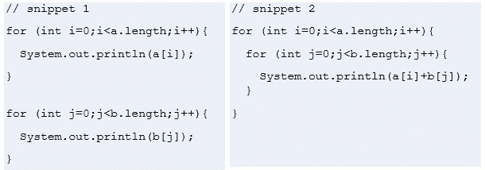
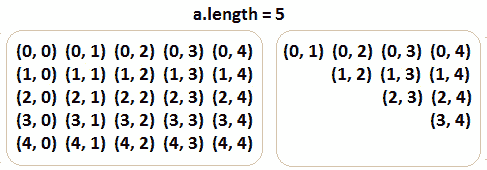

# 七、算法的大 O 分析

本章介绍了在技术访谈中分析算法的效率和可伸缩性的最常用的度量。

有很多文章专门讨论这个话题。其中一些是纯数学的（学术的），而另一些则试图用更友好的方式来解释。纯粹的数学方法很难理解，在面试中也不是很有用，所以我们会选择一种面试官和开发人员更熟悉的更友好的方法。

即便如此，这也不是一项容易的任务，因为除了作为衡量算法效率和可伸缩性的最常用指标外，大 O 符号往往也是你从未有足够的动力去学习的东西，尽管你知道它会在每次面试中出现。从年轻人到高级战士，大 O 符号可能是每个人最大的致命弱点。然而，让我们努力把这一致命弱点变成我们采访的一个重点。

我们将快速复习大 O 符号，并强调最重要的事情。接下来，我们将跳转到那些经过精心设计的示例中，这些示例涵盖了广泛的问题，因此在本章结束时，您将能够确定并表达几乎任何给定代码片段的大 O。我们的议程包括：

*   类比
*   大 O 复杂度时间
*   最佳情况、最坏情况和预期情况
*   大 O 的例子

那么，让我们开始我们的大 O 之旅吧！

# 类比

想象一个场景，你在互联网上找到了你最喜欢的电影之一。您可以订购或下载。既然你想尽快看到它，那最好的方法是什么？如果您点的话，那么需要一天时间才能到达。如果你下载它，那么需要半天时间下载。因此，下载它会更快。这就是路！

但是等等！就在你准备下载的时候，你发现了*指环王大师系列*，价格很高，所以你也考虑下载它。只有这一次，下载将需要 2 天。然而，如果你下订单，那么它仍然只需要一天的时间。所以，下订单更快！

现在，我们可以得出结论，无论我们订购多少商品，装运时间都是不变的。我们称之为 O（1）。这是一个常量运行时。

此外，我们得出结论，下载时间与文件大小成正比。我们称之为 O（n）。这是一个渐进运行时。

从日常观察中，我们还可以得出结论，在线订购比在线下载更具规模。

**这正是大 O 时间的含义：一个渐近运行时间度量或一个渐近函数。**

作为一种渐近度量，我们讨论的是大 O 复杂度时间（也可以是复杂度空间）。

# 大 O 复杂度时间

下图显示，在某个时刻，O（n）超过 O（1）。所以，在 O（n）超过 O（1）之前，我们可以说 O（n）的性能优于 O（1）：


图 7.1–渐近运行时（大 O 时间）

除了 O（1）-常数时间和 O（n）-线性时间运行时，我们还有许多其他运行时，例如 O（logn）、O（nlogn）-对数时间-O（n2）-二次时间、O（2n）-指数时间和 O（n！）-阶乘时间。这些是最常见的运行时，但也存在更多的运行时。

下图显示了大 O 复杂性图表：


图 7.2–大 O 复杂性图

正如您所看到的，并不是所有的 O 次都执行相同的操作。O（n！）、O（2n）和 O（n2）被认为是**可怕的**，我们应该努力编写在这一领域之外执行的算法。O（n logn）比 O（n！）好，但仍然是**坏**。O（n）被认为是**一般**，而 O（对数 n）和 O（1）被认为是**良好**。

有时，我们需要多个变量来表示运行时性能。例如，足球场割草的时间可以表示为 O（*wl*，其中*w*为足球场的宽度，*l*为足球场的长度。或者，如果你必须修剪*p*足球场，那么你可以将其表示为 O（*wlp*。

然而，这并不是时间的全部。我们也关心空间。例如，构建一个包含*n*元素的数组需要 O（n）空间。构建一个由*n*x*n*元素组成的矩阵需要 O（n2）空间。

# 最佳情况、最坏情况和预期情况

如果我们简化事情，那么我们可以从*最佳情况、最坏情况、*和*预期情况*来考虑我们算法的效率。最好的情况是，当我们的算法的输入满足一些特殊条件时，它可以发挥最佳性能。最坏的情况是在另一个极端，输入是在一个不利的形状，使我们的算法显示其最差的性能。然而，通常情况下，这些惊人或可怕的情况不会发生。因此，我们介绍了预期性能。

大多数时候，我们关心最坏的情况和预期的情况，在大多数算法的情况下，这些情况通常是相同的。最好的例子是理想主义的表演，因此它仍然是理想主义的。主要是，对于几乎任何算法，我们都可以找到一个特殊的输入，它将导致 O（1）最佳情况下的性能。

关于 Big O 的更多细节，我强烈建议您阅读 Big O 备忘单（[https://www.bigocheatsheet.com/](https://www.bigocheatsheet.com/) ）。

现在，让我们来看一组例子。

# 大 O 示例

我们将尝试为不同的代码片段确定大 O，正如您在访谈中所看到的，我们将学习一些需要学习的相关课程。换句话说，让我们采用*以身作则*的方法。

前六个示例将突出大 O 的基本规则，如下所示：

*   下降常数
*   删除非支配项
*   不同的输入意味着不同的变量
*   不同的步骤相加或相乘

让我们从尝试这些例子开始。

## 示例 1–O（1）

考虑下面三个代码片段，并计算它们的大 O：

```java
// snippet 1
return 23;
```

因为这段代码返回一个常量，所以大 O 就是 O（1）。无论代码的其余部分做什么，这行代码都将以恒定速率执行：

```java
// snippet 2 - 'cars' is an array 
int thirdCar = cars[3];
```

通过索引访问数组是通过 O（1）完成的。无论数组中有多少个元素，从特定索引获取元素都是一个常量操作：

```java
// snippet 3 - 'cars' is a 'java.util.Queue'
Car car = cars.peek();
```

**Queue#peek（）**方法检索但不删除此队列的头（第一个元素）。不管有多少元素跟随头部，通过**peek（）**方法检索头部的时间是 O（1）。

因此，前面代码块中的三个代码段的时间复杂度都是 O（1）。类似地，从队列中插入和移除、从栈中推送和弹出、在链表中插入节点以及检索存储在数组中的树节点的左/右子节点也是 O（1）时间的情况。

## 示例 2–O（n），线性时间算法

考虑下面的代码片段并计算大 O：

```java
// snippet 1 - 'a' is an array
for (int i = 0; i < a.length; i++) {
    System.out.println(a[i]);
}
```

为了确定这段代码的大 O 值，我们必须回答以下问题：*这***对***循环迭代了多少次？*答案是**长度**倍。我们不能确切地说这意味着多少时间，但我们可以说时间将随着给定数组（表示输入）的大小线性增长。因此，这段代码将有一个 O（**a.length**时间），称为线性时间。它被表示为 O（n）。

## 示例 3–O（n），删除常数

考虑下面的代码片段并计算大 O：

```java
// snippet 1 - 'a' is an array
for (int i = 0; i < a.length; i++) {
    System.out.println("Current element:");
    System.out.println(a[i]);
    System.out.println("Current element + 1:");
    System.out.println(a[i] + 1);
}
```

即使我们向循环中添加了更多的指令，我们仍将拥有与*示例 2 中*相同的运行时。运行时的输入大小仍然是线性的，**a.length**。在*示例 2 中*我们在一个循环中有一行代码，而在这里，我们在一个循环中有四行代码，您可能期望大 O 是 O（n+4）或类似的东西。然而，这种推理是不精确的，它只是错误的！这里的大 O 仍然是 O（n）。

重要提示

请记住，大 O 并不取决于代码行的数量。它取决于运行时的增长率，而不是由恒定时间操作修改。

为了增强这种场景，我们考虑下面两个代码片段，它们计算给定数组的最小值和最大值，席 T0。


7.3–代码比较

现在，这两个代码段中哪一个运行得更快？

第一个代码段使用一个循环，但它有两个**if**语句，而第二个代码段使用两个循环，但每个循环有一个**if**语句。

这样的想法打开了疯狂的大门！统计语句可以在更深的层次上继续。例如，我们可以继续在编译器级别计算语句（操作），或者考虑编译器优化。好吧，那不是大 O 的意思！

重要提示

BigO 不是计算代码语句。它的目标是表示输入大小的运行时增长，并表示运行时的扩展方式。简而言之，大 O 只是描述了运行时的增长率。

此外，不要陷入这样的陷阱：因为第一个代码段有一个循环，所以大 O 是 O（n），而在第二个代码段中，因为它有两个循环，所以大 O 是 O（2n）。只需从 2*n*中删除 2，因为 2 是一个常数！

重要提示

根据经验，当您表示大 O 时，请在运行时删除常量。

因此，前面的两个代码段都有一个很大的 O 值 O（n）。

示例 4–删除非主导项

考虑下面的代码片段，计算大 O（Apple T0.阿纳尔 T1 是数组）：


7.4–在 O（n）中执行的代码段

循环的第一个**在 O（n）中执行，而**循环的第二个**在 O（n2）中执行。所以，我们可以认为这个问题的答案是 O（n）+O（n2）=O（n+n2）。但事实并非如此！增长率由*n*2 给出，而*n*为非显性项。如果阵列的大小增加，则*n*2 对增加速率的影响远大于*n*，因此*n*不相关。再举几个例子：**

*   O（2n+2n）->下降常数和非显性项->O（2n）。
*   O（n+logn）->删除非支配项->O（n）。
*   O(3*n2 + n + 2*n) -> drop constants and non-dominant terms -> O(n2).

    重要提示

    根据经验，当你表达“大 O”时，去掉非主要术语。

接下来，让我们关注两个例子，它们是候选人常见的困惑来源。

示例 5–不同的输入意味着不同的变量

考虑下面两个代码片段（AutoT0}一个 Ty1 T1 和 PoT T2。应该使用多少变量来表示大 O？


7.5–代码片段 1 和 2

在第一个片段中，我们有两个**用于循环相同数组的**循环，**a**（两个循环的输入相同），因此大 O 可以表示为 O（n），其中*n*表示**a**。在第二个代码片段中，我们也有两个用于循环的**，但它们循环不同的数组（我们有两个输入，**a**和**b**。这一次，大 O 不是 O（n）！*n*指什么–**a**或**b**？假设*n*指**a**。如果我们增加**b**的大小，那么 O（n）并不反映运行时增加的速率。因此，Big O 是这两个运行时的总和（即**a**的运行时加上**b**的运行时）。这意味着大 O 必须同时引用两个运行时。为此，我们可以使用两个变量引用**a**和**b**。所以，大 O 表示为 O（a+b）。这一次，如果我们增加**a**和/或**b**的大小，那么 O（a+b）捕获运行时速率的增加。**

重要提示

根据经验，不同的输入意味着不同的变量。

接下来，让我们看看当我们将算法步骤相加和相乘时会发生什么。

## 示例 6–不同的步骤相加或相乘

考虑下面两个代码片段（AutoT0}一个 Ty1 T1 和 PoT T2。对于这些代码片段，如何表达大 O？



7.6–代码段 a 和 b

从前面的示例中我们已经知道，在第一个代码段中，大 O 是 O（a+b）。我们总结运行时，因为它们的工作不像第二个代码片段那样相互交织。因此，在第二个片段中，我们无法总结运行时，因为对于**a【i】**的每种情况，代码都循环**b**数组，所以大的 O 是 O（a*b）。

在决定运行时的求和和和相乘之前，请三思。这是面试中常见的错误。此外，不注意有多个输入（这里有两个）以及错误地使用单个变量表示大 O 也是很常见的。那就错了！始终注意存在多少输入。对于影响运行时增长率的每个输入，您应该有一个单独的变量（参见*示例 5*。

重要提示

根据经验，不同的步骤可以相加或相乘。运行时应根据以下两条语句求和或相乘：

如果您将算法描述为**它是 foos，当它完成时，它蜂鸣器**，然后对运行时求和。

如果您将算法描述为**，每次它发出 foos 时，它都会蜂鸣器**，然后乘以运行时。

现在，让我们讨论一下*log n*运行时。

## 示例 7–日志 n 运行时

编写一段伪代码，将大 O 作为 O（logn）。

为了理解 O（logn）运行时，让我们从二进制搜索算法开始。二进制搜索算法的详细内容和实现参见[*第 14 章*](14.html#_idTextAnchor340)、*排序和搜索*。该算法描述了在数组**a**中查找元素**x**的步骤。考虑一个排序的数组，如 16 个元素，如：


图 7.7–16 个元素的有序阵列

首先，我们将**x**与阵列的中点**p**进行比较。如果它们相等，则返回相应的数组索引作为最终结果。如果**x>p**，则我们在数组的右侧进行搜索。如果是**x<p**，则在数组左侧搜索。以下是用于查找数字 17 的二进制搜索算法的图形表示：


图 7.8–二进制搜索算法

请注意，我们以 16 个元素开始，以 1 结束。在第一步之后，我们减少到 16/2=8 个元素。在第二步中，我们减少到 8/2=4 个元素。在第三步中，我们将减少到 4/2=2 个元素。然后，在最后一步，我们找到搜索的数字 17。如果我们把这个算法翻译成伪代码，那么我们得到如下结果：

```java
search 17 in {1, 4, 5, 7, 10, 16, 17, 18, 20, 
              23, 24, 25, 26, 30, 31, 33}
    compare 17 to 18 -> 17 < 18
    search 17 in {1, 4, 5, 7, 10, 16, 17, 18}
        compare 17 to 7 -> 17 > 7
        search 17 in {7, 10, 16, 17}
            compare 17 to 16 -> 17 > 16
            search 17 in {16, 17}
                compare 17 to 17
                return
```

现在，让我们为这个伪代码表示大 O。我们可以观察到，该算法由阵列的连续半衰期组成，直到只剩下一个元素。因此，总运行时间取决于我们需要多少步骤才能在数组中找到某个数字。

在我们的示例中，我们有四个步骤（将数组减半 4 次），可以表示为：


或者，如果我们将其浓缩，则得到：


再进一步，对于一般情况，我们可以表示为（*n*是数组的大小，*k*是到达解的步数）：


但是，2k=n 正是对数的意思-*一个表示幂的量，该幂表示一个固定数字（基数）必须升高才能产生一个给定的数字*。因此，我们可以写以下内容：


在我们的例子中，2k=*n*表示 24=16，即 log216=4。

因此，二进制搜索算法的大 O 是 O（logn）。但是，对数的底在哪里？简单的回答是，表示大 O 不需要对数底，因为不同底的日志只有常数因子不同。

重要提示

根据经验，当你必须为一个在每一步/迭代中将其输入减半的算法表示大 O 时，很有可能是 O（logn）的情况。

接下来，让我们讨论为递归运行时计算大 O。

示例 8–递归运行时

以下代码片段的大 O 是什么？

```java
int fibonacci(int k) {
    if (k <= 1) {
        return k;
    }
    return fibonacci(k - 2) + fibonacci(k - 1);
}
```

在我们的第一印象中，我们可以将大 O 表示为 O（n2）。很可能，我们会得到这个结果，因为我们被来自**return**的**fibonacci（）**方法的两个调用误导了。但是，让我们给*k*赋值，并快速绘制运行时。例如，如果我们调用**斐波那契（7）**，并将递归调用表示为一棵树，则我们得到下图：


图 7.9–呼叫树

我们几乎立即注意到这棵树的深度等于 7，因此一般树的深度等于*k*。此外，除了终端层外，每个节点都有两个子节点，因此几乎每个节点的调用数量都是其上一个节点的两倍，这意味着我们可以将大 O 表示为 O（分支深度）。在我们的例子中，这是 O（2k），表示为 O（2n）。

在面试中，仅仅说 O（2n）应该是一个可以接受的答案。如果我们想更准确，那么我们应该考虑终端级别，特别是最后一个级别（或调用栈的底部），它有时可以包含单个调用。这意味着我们并不总是有两个分支。更准确的答案是 O（1.6n）。提到真实值小于 2 对任何面试官来说都足够了。

如果我们想用空间复杂度来表示大 O，那么我们得到 O（n）。不要被运行时复杂性为 O（2n）的事实所愚弄。在任何时候，我们的数量都不能超过*k*个。如果我们查看前面的树，我们只能看到从 1 到 7 的数字。

## 示例 9–按顺序遍历二叉树

考虑给定的完美二叉搜索树。如果你需要一个快速剩余的二叉树，那么考虑一下 To.T0.。

```java
void printInOrder(Node node) {
    if (node != null) {
       printInOrder(node.left);
       System.out.print(" " + node.element);
       printInOrder(node.right);
    }
}
```

一个完美的二叉搜索树是一个二叉搜索树，它的内部节点正好有两个子节点，并且所有的叶节点都在相同的层次或深度上。在下图中，我们有一个典型的完美二叉搜索树（同样，可视化运行时输入非常有用）：


图 7.10-高度平衡二叉搜索树

我们从经验中（更准确地说，从前面的示例中）知道，当我们面临分支的递归问题时，我们可能会遇到 O（分支深度）情况。在我们的例子中，我们有两个分支（每个节点有两个子节点），因此我们有 O（2 深度）。指数时间看起来很奇怪，但让我们看看节点数量和深度之间的关系。在上图中，我们有 15 个节点，深度为 4。如果我们有 7 个节点，那么深度将是 3，如果我们有 31 个节点，那么深度将是 5。现在，如果我们还没有从理论上知道完美二叉树的深度是对数的，那么我们也许可以观察到以下几点：

*   对于 15 个节点，我们的深度为 4；因此，我们有 24=16，相当于 log216=4。
*   对于 7 个节点，我们的深度为 3；因此，我们有 23=8，相当于 log28=3。
*   对于 31 个节点，我们的深度为 5；因此，我们有 25=32，相当于 log232=5。

根据前面的观察，我们可以得出结论，我们可以将大 O 表示为 O（2logN），因为深度大致为*logN*。因此，我们可以写以下内容：


图 7.11–大 O 形表达式

所以，这个例子中的大 O 是 O（n）。如果我们认识到这段代码实际上是二叉树的顺序遍历，并且在这种遍历（与前序和后序遍历完全相同）中，每个节点只访问一次，那么我们可以得出相同的结论。此外，对于每个被遍历的节点，有一个恒定的工作量，所以大的 O 是 O（n）。

## 示例 10–n 可能有所不同

以下代码片段的大 O 是什么？

```java
void printFibonacci(int k) {
    for (int i = 0; i < k; i++) {
        System.out.println(i + ": " + fibonacci(i));
    }
}
int fibonacci(int k) {
    if (k <= 1) {
        return k;
    }
    return fibonacci(k - 2) + fibonacci(k - 1);
}
```

从*例 8*我们已经知道**斐波那契（）**方法的大 O 值是 O（2n）。**printFibonacci（）**调用**fibonacci（）***n*次，因此很容易将总的大 O 值表示为 O（n）*O（2n）=O（n2n）。然而，这是真的，还是我们匆忙给出了一个明显简单的答案？

好的，这里的技巧是*n*变化。例如，让我们可视化运行时：


我们不能说我们执行相同的代码*n*次，所以这是 O（2n）。

## 示例 11–备忘录

以下代码片段的大 O 是什么？

```java
void printFibonacci(int k) {
    int[] cache = new int[k];
    for (int i = 0; i < k; i++) {
        System.out.println(i + ": " + fibonacci(i, cache));
    }
}
int fibonacci(int k, int[] cache) {
    if (k <= 1) {
        return k;
    } else if (cache[k] > 0) {
        return cache[k];
    }
    cache[k] = fibonacci(k - 2, cache) 
        + fibonacci(k - 1, cache);
    return cache[k];
}
```

这段代码通过递归计算斐波那契数。然而，该代码使用了一种称为*记忆化*的技术。主要的想法是缓存返回值并使用它来减少递归调用。从*例 8*我们已经知道**斐波那契方法**的大 O 是 O（2n）。由于*记忆化*应该减少递归调用（它引入了一种优化），我们可以猜测这段代码中的大 O 应该比 O（2n）做得更好。然而，这只是一种直觉，所以让我们设想一下*k*=7 的运行时：

```java
Calling fibonacci(0):
Result of fibonacci(0) is 0
Calling fibonacci(1):
Result of fibonacci(1) is 1
Calling fibonacci(2):
 fibonacci(0)
 fibonacci(1)
 fibonacci(2) is computed and cached at cache[2]
Result of fibonacci(2) is 1
Calling fibonacci(3):
 fibonacci(1)
 fibonacci(2) is fetched from cache[2] as: 1
 fibonacci(3) is computed and cached at cache[3]
Result of fibonacci(3) is 2
Calling fibonacci(4):
 fibonacci(2) is fetched from cache[2] as: 1
 fibonacci(3) is fetched from cache[3] as: 2
 fibonacci(4) is computed and cached at cache[4]
Result of fibonacci(4) is 3
Calling fibonacci(5):
 fibonacci(3) is fetched from cache[3] as: 2
 fibonacci(4) is fetched from cache[4] as: 3
 fibonacci(5) is computed and cached at cache[5]
Result of fibonacci(5) is 5
Calling fibonacci(6):
 fibonacci(4) is fetched from cache[4] as: 3
 fibonacci(5) is fetched from cache[5] as: 5
 fibonacci(6) is computed and cached at cache[6]
Result of fibonacci(6) is 8
```

每个**斐波那契（k）**方法都是从缓存的**斐波那契（k-1）**和**斐波那契（k-2）**方法中计算出来的。从缓存中获取计算值并对其求和是一项固定的工作。因为我们做了这项工作*k*次，这意味着大 O 可以表示为 O（n）。

除了*备忘*之外，我们还可以使用另一种方法，称为*制表*。更多详细信息请参见[*第 8 章*](08.html#_idTextAnchor161)、*递归和动态规划*。

示例 12–循环矩阵的一半

以下两段代码（**a**是数组）的的大 O 是什么？


7.12–大 O 的代码片段

这些代码片段几乎相同，除了第一个片段中，**j**从**0**开始，而在第二个片段中，它从**i+1**开始。

我们可以很容易地为数组大小赋值，并可视化这两段代码的运行时。例如，让我们考虑数组大小为 5。左侧矩阵是第一段代码的运行时，右侧矩阵对应于第二段代码的运行时：



图 7.13–可视化运行时

第一段代码的对应矩阵显示*n*n*大小，而第二段代码的对应矩阵大致显示*n*n*2 大小。因此，我们可以写以下内容：

*   代码段 1 运行时为：。
*   代码片段 2 的运行时是：，因为我们消除了常量。

因此，两段代码都有 O（n2）。

或者，您可以这样想：

*   对于第一个片段，内循环不工作，外循环运行*n*次，因此*n*n=n*2，结果为 O（n2）。
*   对于第二个片段，内循环大致做了*n*/2 工作，外循环运行*n*次，因此*n*n*/2=*n*2/2=*n*2*1/2，这导致（去掉常数后）O（n2）。

## 示例 13–识别 O（1）回路

下面的代码片段（**a**是数组）的大 O 是什么？

```java
for (int i = 0; i < a.length; i++) {
    for (int j = 0; j < a.length; j++) {
        for (int q = 0; q < 1_000_000; q++) {
            System.out.println(a[i] + a[j]);
        }
    }
}
```

如果我们忽略第三个循环（**q**循环），那么我们已经知道大 O 就是 O（n2）。那么，第三个循环如何影响总的大 O 值呢？第三个循环从 0 迭代到 100 万次，与数组大小无关，所以这个循环的大 O 是 O（1），它是一个常数。由于第三个循环不取决于输入大小的变化，我们可以按如下方式编写：

```java
for (int i = 0; i < a.length; i++) {
    for (int j = 0; j < a.length; j++) {
        // O(1)  
    }
}
```

现在，很明显，这个例子中的大 O 是 O（n2）。

## 示例 14–循环阵列的一半

下面的代码片段（**a**是数组）的大 O 是什么？

```java
for (int i = 0; i < a.length / 2; i++) {
    System.out.println(a[i]);
}
```

这里的混乱可能是因为这个片段只循环了数组的一半。不要犯将大 O 表示为 O（n/2）的常见错误。请记住，常数应该被删除，所以大 O 就是 O（n）。仅迭代数组的一半不会影响大 O 时间。

## 示例 15–减少大 O 表达式

以下哪项可以表示为 O（n）？

*   O（n+p）
*   O（n+logn）

答案是 O（n+logn）可以减少为 O（n），因为*log**n*是非显性项，可以删除。另一方面，O（n+p）不能简化为 O（n），因为我们对*p*一无所知。在我们确定什么是*p*以及*n*和*p*之间的关系之前，我们必须保留这两个。

## 示例 16–与 O（对数 n）循环

以下代码片段（**a**是数组）的大 O 是什么？

```java
for (int i = 0; i < a.length; i++) {
    for (int j = a.length; j > 0; j /= 2) {
        System.out.println(a[i] + ", " + j);
    }
}
```

让我们只关注外部循环。根据前面示例中的经验，我们可以快速地将大 O 表示为 O（n）。

内环呢？我们可以注意到，**j**从数组长度开始，在每次迭代中，它被减半。请记住*示例 7*中的重要注释：*当您必须为每一步都将其输入减半的算法表示大 O 时，很有可能出现 O（logn）情况*。

重要提示

当你认为有很大的机会是 O（对数 n）的情况时，建议你使用除数幂的测试数。如果输入除以 2（减半），则使用 2 的幂（例如，23=8、24=16、25=32 等）。如果输入除以 3，则使用 3 的幂（例如，32=9、33=27 等）。这样，很容易计算分区的数量。

因此，让我们为**a.length**赋值，并可视化运行时。假设**a.长度**为 16。这意味着**j**将取 12、8、4、2 和 1 的值。我们将**j**除以 2 正好四次，因此我们得到以下结果：


图 7.14–带 O（对数 n）的回路

所以，内部循环的大 O 是 O（logn）。为了计算总的大 O，我们认为外环是执行的，即 T0 0。所以，总的大 O 结果是 O（n）*O（logn）=O（n logn）。

作为提示，许多排序算法（例如，合并排序和堆排序）都有 O（n logn）运行时。此外，许多 O（nlogn）算法是递归的。一般来说，在算法的**分治**（**D&C**C 类别下分类的算法是 O（n logN）。希望在面试中记住这些技巧会非常方便。

## 示例 17–字符串比较

以下代码片段的大 O 是什么？（注意**a**是一个数组，请务必仔细阅读注释）：

```java
String[] sortArrayOfString(String[] a) {
    for (int i = 0; i < a.length; i++) {
        // sort each string via O(n log n) algorithm           
    }
    // sort the array itself via O(n log n) algorithm               
    return a;
}
```

**sortArrayOfString（）**接收**字符串**的数组并执行两个主要动作。它对这个数组和数组本身中的每个字符串进行排序。这两种排序都是通过运行时表示为 O（n logn）的算法完成的。

现在，让我们关注一下循环的**，看看考生通常给出的错误答案。我们已经知道，对单个字符串进行排序会得到 O（n logn）。对每个字符串执行此操作意味着 O（n）*（n logn）=O（n*n logn）=O（n2 logn）。接下来，我们对数组本身进行排序，它也以 O（n logn）的形式给出。综合所有结果，总的大 O 值是 O（n2 logn）+O（n logn）=O（n2 logn+n logn），这是 O（n2 logn），因为*n**log**n*是非显性项。然而，这是否正确？简而言之，答案是否定的！但为什么不呢？！我们犯了两个主要错误：我们使用*n*表示两件事（数组的大小和字符串的长度），并且我们假设比较**字符串**需要一个恒定的时间，就像固定宽度整数一样。**

让我们详细说明第一个问题。因此，对单个字符串进行排序得到 O（n logn），其中*n*表示该字符串的长度。我们对**a.length**字符串进行排序，因此*n*现在表示数组的大小。这就是混淆的原因，因为当我们说循环的**是 O（n2 logn），我们指的是*n*吗？因为我们使用的是两个变量，所以我们需要用不同的方式来表示它们。例如，我们可以考虑如下：**

*   *s*：最长**串**的长度。
*   *p*：**字符串**的数组大小。

在这些术语中，对单个字符串进行排序是 O（s log s），并将此*p*次运算得到 O（p）*O（s log s）=O（p*s log s）。

现在，让我们来解决第二个问题。在我们的新术语中，数组的排序是 O（p log p）–我刚刚用*p*替换了*n*。但是，与固定宽度整数的情况一样，**字符串**的比较是否需要一个恒定的时间？答案是否定的！字符串排序更改为 O（p log p），因为**字符串**比较本身具有可变成本。**字符串**的长度不同，因此比较时间也不同。因此，在我们的例子中，每个**字符串**比较取 O（s），并且由于我们有 O（p log p）比较，因此对字符串数组进行排序的结果是 O（s）*O（p log p）=O（s*p log p）。

最后，我们必须将 O（p*s logs）添加到 O（s*p logp）=O（s*p（logs+logp））。完成！

## 例 18——阶乘大 O

以下代码片段的大 O 是什么？

```java
long factorial(int num) {
    if (num >= 1) {
        return num * factorial(num - 1);
    } else {
        return 1;
    }
}
```

很明显，这段代码是计算阶乘的递归实现。不要犯那种认为大 O 就是 O（n！）的常见错误。这不是真的！始终仔细分析代码，无需事先假设。

递归过程遍历序列*n*-1、*n*-2、。。。1 次；因此，这是 O（n）。

## 示例 19–小心使用 n 符号

以下两段代码的大 O 是什么？


7.15–代码片段

第一个片段（左侧）持续工作**y**次。**x**输入不影响运行时增长率，因此大的 O 可以表示为 O（y）。请注意，我们不说 O（n），因为*n*也可能与**x**混淆。

第二个片段（右侧）递归遍历**y**-1、**y**-2、…，0。每个**y**输入只经过一次，所以大 O 可以表示为 O（y）。同样，**x**输入不会影响运行时的增长率。此外，我们避免说 O（n），因为有多个输入，O（n）会造成混淆。

示例 20–总和和计数

下面的代码片段（**x**和**y**为正）的的大 O 是什么？

```java
int div(int x, int y) {
    int count = 0;
    int sum = y;
    while (sum <= x) {
       sum += y;
       count++;
    }
    return count;
}
```

让我们给**x**和**y**赋值，并观察**count**变量，它统计迭代次数。考虑到它的 T6×x，ωT7＝10，和 T8，Y，T9，Ty＝2。对于此场景，**计数**将为 5（10/2=5）。按照同样的逻辑，我们有**x**=14、**y**=4、**计数**=3（14/4=3.5）、或**x**=22、**y**=3、或**计数**=7（22/3=7.3）。我们可以注意到，在最坏的情况下，**计数**是**x**/**y**，所以大的 O 可以表示为 O（x/y）。

## 示例 21–大 O 中的迭代计数数

下面的代码片段试图猜测一个数字的平方根。什么是大 O？

```java
int sqrt(int n) {
    for (int guess = 1; guess * guess <= n; guess++) {
        if (guess * guess == n) {
            return guess;
        }
    }
    return -1;
}
```

让我们考虑这个数（Po.t0} nOnt1）是一个完美的平方根，如 144，并且我们已经知道 SqRT（144）＝12。由于步骤 1 中的**guess**变量从 1 开始，并在**guess*guess<=n**处停止，因此计算**guess**将取值 1、2、3，…，非常简单，12 当**猜测**为 12 时，我们有 12*12=144，循环停止。我们有 12 次迭代，这就是 sqrt（144）。

对于非完美平方根，我们遵循相同的逻辑。让我们考虑一下，15。这次，**猜测**将取 1、2 和 3 个值。当**猜测**=4 时，我们有 4*4>15，循环停止。返回的值为-1。所以，我们有 3 次迭代。

总之，我们有 sqrt（**n**迭代，所以大 O 可以表示为 O（sqrt（n））。

## 示例 22–数字

下面的代码片段将整数的位数相加。什么是大 O？

```java
int sumDigits(int n) {
    int result = 0;
    while (n > 0) {
        result += n % 10;
        n /= 10;
    }
    return result;
}
```

在每次迭代中，**n**除以 10。这样，代码将在数字的右侧隔离一个数字（例如，56643/10=5664.3）。要遍历所有数字，**while**循环需要与数字数量相等的迭代次数（例如，对于 56643，需要 5 次迭代来隔离 3、4、6、6 和 5）。

然而，一个 5 位数的数字最多可以是 105=100000，这意味着 99999 次迭代。一般来说，这意味着一个数字（**n**）中有*d*位，最多可以是 10d。因此，我们可以说：


图 7.16–数字关系

## 示例 23–排序

以下代码片段的大 O 是什么？

```java
boolean matching(int[] x, int[] y) {
    mergesort(y);
    for (int i : x) {
        if (binarySearch(y, i) >= 0) {
            return true;
        }
    }
    return false;
}
```

在*示例 16*中，我们说过很多排序算法（包括合并排序）的运行时间为 O（n logn）。这意味着**合并排序（y）**的运行时为 O（y log y）。

在*E**示例 7*中，我们说二进制搜索算法的运行时间为 O（logn）。这意味着**二进制搜索（y，i）**的运行时为 O（logy）。在最坏情况下，循环的**将迭代整个**x**数组，因此二进制搜索算法将执行**x.length**次。**循环的**的运行时为 O（x logy）。**

因此，总的大 O 值可以表示为 O（y logy）+O（x logy）=O（y logy+x logy）。

完成！这是这里最后一个例子。接下来，让我们尝试提取几个关键提示，这些提示可以帮助您在面试中确定和表达大 O。

# 面试中需要寻找的关键提示

在面试中，时间和压力是影响注意力集中的重要因素。具有识别模板、识别特定案例、猜出正确答案等能力会给您带来很大的优势。正如我们在[*第 5 章*](05.html#_idTextAnchor072)*如何应对编码挑战*图 5.2*中的*所述，构建示例（或用例）是应对编码挑战的第二步。即使面试官给出了代码，构建一个示例对于确定大 O 还是非常有用的。

正如您可能注意到的，在我们介绍的几乎每一个非平凡的示例中，我们都倾向于为一个或多个具体案例可视化运行时。这样，您就可以真正理解代码的细节，识别输入，确定代码的静态（常量）和动态（变量）部分，并获得代码工作方式的总体视图。

以下是一个非详尽的关键提示列表，可以在面试中帮助您：

*   **如果算法做恒定功，那么大的 O 就是 O（1）**：这种示例使用输入来执行恒定功（例如，取三个整数，**x**、**y**、**w**，并进行一些计算，例如**x-y**和**y*w**。在某些情况下，为了制造混乱，它还添加了重复语句（例如，在**中为（int i=0；i<10；i++）**进行计算）。因此，从一开始就确定算法的输入是否影响其运行时是非常重要的。
*   **如果算法循环整个数组或列表，那么 O（n）可能涉及总的大 O 值**：通常，代码片段包含一个或多个循环整个输入的重复语句，通常是一个数组或列表（例如，**for（int i=0；i<a.length；i++）**，其中【T4 a 是一个数组）。通常，这些结构的运行时为 O（n）。在某些情况下，为了制造混乱，重复结构会添加一个条件来验证**中断**语句。记住，Big O 是最坏的情况，因此您应该评估运行时，记住验证**break**语句的条件可能永远不会发生，并且 Big O 仍然是 O（n）。
*   **如果在每次迭代中，算法将输入数据减半，那么 O（logn）可能涉及到总的大 O 值**：正如您在*示例 7*中看到的，二进制搜索算法是 O（logn）的一个著名案例。通常，您可以通过尝试可视化运行时来识别类似的情况。
*   **具有分支的递归问题是一个很好的信号，表明 O（分支**深度**）可能是总大 O 值**的一部分：遇到 O（2depth）的最常见情况是在操纵二叉树的代码片段中。还要注意如何确定*深度*。正如您在*示例 9*中看到的，*深度*会影响最终结果。在这种情况下，O（2logn）被还原为 O（n）。
*   **使用记忆化或制表的递归算法很适合将 O（n）作为其总的大 O 值**：通常，递归算法会暴露指数运行时（例如，O（2n）），但诸如*记忆化*和*制表*之类的优化可能会将运行时减少到 O（n）。
*   **排序算法通常在总的大 O 值**中引入 O（n log n）：请记住，许多排序算法（例如，堆排序、合并排序等）的运行时都是 O（n log n）。

我希望这些提示对您有所帮助，因为我们已经介绍了一些非常久经考验的示例。

# 总结

在本章中，我们讨论了采访中最主要的话题之一，Big O。有时，您必须为给定的代码确定 Big O，而其他时候，您必须为自己的代码确定 Big O。换句话说，在面试中绕过大 O 的机会很小。无论你如何努力训练，BigO 始终是一个困难的话题，即使是最优秀的开发人员也会遇到麻烦。幸运的是，这里涉及的案例是访谈中最受欢迎的，它们代表了许多衍生问题的完美模板。

在下一章中，我们将讨论访谈中的其他热门话题：递归和动态规划。