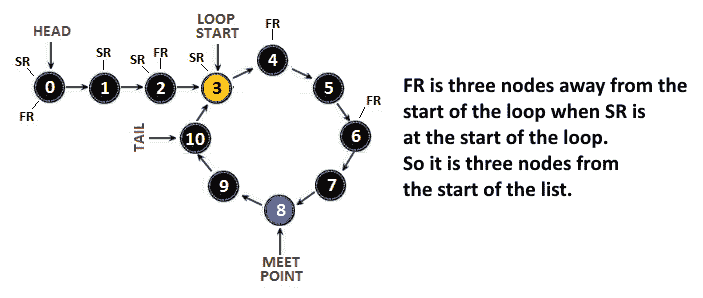
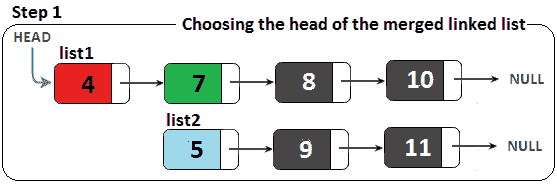
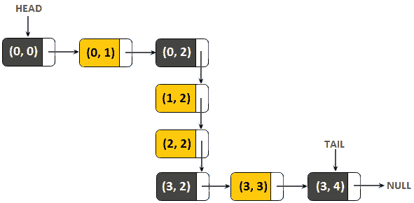
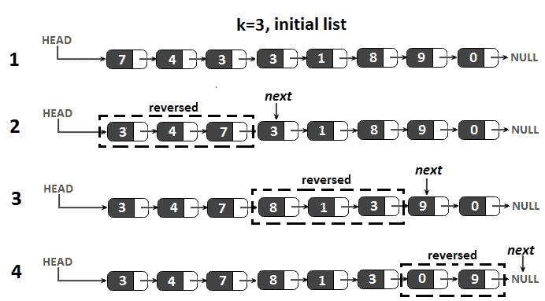
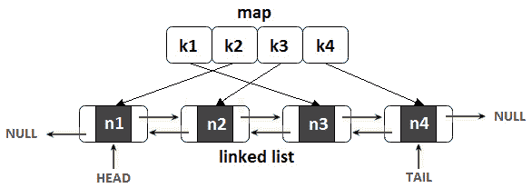

# 十一、链表和地图

本章介绍了最常见的编码挑战，包括您将在编码采访中遇到的地图和链表。由于在技术访谈中首选单链表，本章中的大多数问题都将利用它们。但是，您可以挑战自己，并尝试在双链接列表的上下文中解决每个此类问题。通常，对于双链接列表，问题变得更容易解决，因为双链接列表为每个节点维护两个指针，并允许我们在列表中来回导航。

到本章结束时，您将了解所有涉及链表和地图的常见问题，并且您将对许多技术有足够的知识和理解，以帮助您解决这一类别中的任何其他问题。我们的议程很简单；我们将介绍以下主题：

*   简而言之，链表
*   简而言之，地图
*   编码挑战

# 技术要求

本章中的所有代码文件都可以在 GitHub 上找到，可以在[上访问 https://github.com/PacktPublishing/The-Complete-Coding-Interview-Guide-in-Java/tree/master/Chapter11](https://github.com/PacktPublishing/The-Complete-Coding-Interview-Guide-in-Java/tree/master/Chapter11) 。

然而，在讨论编码挑战之前，让我们首先了解链表和地图。

# 简言之，链表

链表是一种表示一系列节点的线性数据结构。第一个节点通常称为头，而最后一个节点通常称为尾。当每个节点指向下一个节点时，我们有一个*单链表*，如下图所示：


图 11.1–单链表

当每个节点指向下一个节点和前一个节点时，我们有一个*双链表*，如下图所示：


图 11.2–双链接列表

让我们考虑一个单链表。如果尾部指向头部，则我们有一个*循环单链表*。另外，让我们考虑一个双链表。如果尾部指向头部，头部指向尾部，那么我们有一个*循环双链表*。

在单链表中，节点保存数据（例如，整数或对象）和指向下一个节点的指针。以下代码表示单链表的节点：

```java
private final class Node {
  private int data;
  private Node next;
}
```

双链接列表还需要指向上一个节点的指针：

```java
private final class Node {
  private int data;
  private Node next;
  private Node prev;
}
```

与数组不同，链表不提供访问第*n*个元素的固定时间。我们必须迭代*n*-1 个元素，才能得到*n*个元素。我们可以从链表的开始（单次和双次）以固定时间插入、删除和更新节点。如果我们的实现管理双链表（称为双头双链表）的尾部，那么我们也可以从链表的末尾以固定时间插入、移除和更新节点；否则，我们需要迭代链表直到最后一个节点。如果我们的实现管理单链表的尾部（称为双头单链表），那么我们可以在链表的末尾以固定时间插入节点；否则，我们需要迭代链表直到最后一个节点。

本书的代码包附带以下应用程序（每个应用程序公开了**insertFirst（）**、**insertLast（）**、**insertAt（）**、**delete（）**、**deleteByIndex（）**和**print（）**方法）：

*   *单链接列表*：双头单链接列表的实现
*   *单头单联列表*：单头单联列表的实现
*   *双链表*：双头双链表的实现
*   *双链表单头*：单头双链表的实现

强烈建议您自己对这些应用程序进行骨骼解剖。每个步骤都有大量的注释，以帮助您理解每个步骤。以下编码挑战依赖于这些链表实现。

# 简而言之，地图

想象一下，你正在字典里寻找一个单词。这个词本身是独一无二的，可以被认为是一个*键*。这个词的意义可以被视为*值*。因此，该词及其含义构成*键值对*。类似地，在计算中，键值对容纳一段数据，通过使用键进行搜索可以在其中找到值。换句话说，我们知道关键，我们可以用它来找到价值。

映射是一种**抽象数据类型**（**ADT**），它通过数组管理键值对（称为条目）。地图的特征包括：

*   密钥是唯一的（即不允许重复密钥）。
*   我们可以查看键列表和/或值列表。
*   使用地图最常用的方法是**get（）**、**put（）**和**remove（）**。

现在我们已经简要地概述了链表和地图的概念，让我们开始我们的编码挑战。

# 编码挑战

在下面的 17 个编码挑战中，我们将讨论一些涉及地图和链表的问题。由于链表在技术面试中更受欢迎，我们将为他们分配更多的问题。但是，为了掌握地图数据结构的概念，特别是内置 Java 地图实现，我强烈建议您购买 Packt Publishing（[出版的书*Java 编码问题*https://www.packtpub.com/programming/java-coding-problems](https://www.packtpub.com/programming/java-coding-problems) ）。除了是本书的绝妙伴侣外，*Java 编码问题*还包含以下地图问题（请注意，这不是一个完整的列表）：

*   创建不可修改/不可变的集合
*   映射默认值
*   计算**映射**中是否缺少/存在值
*   从**地图**中删除
*   替换**映射**中的条目
*   比较两张地图
*   排序一张**地图**
*   复制一个**哈希映射**
*   合并两张地图
*   删除集合中与谓词匹配的所有元素

现在我们有了关于链接列表和地图的基本概念，让我们来看看访谈中最流行的与地图和链表有关的问题。

## 编码挑战 1–映射放置、获取和移除

**问题**：编写地图数据结构的基本实现，允许您放置、获取和移除值。您应该有一个名为**put（kk，vv）**的方法，一个名为**get（kk）**的方法，还有一个名为**remove（kk）**的方法。

**解决方案**：如您所知，映射是一个键值对数据结构。每个键值对都是映射的一个条目。因此，在实现条目之前，我们无法实现映射的功能。因为一个条目包含两条信息，所以我们需要定义一个类，该类以通用方法包装键和值。

代码非常简单：

```java
private final class MyEntry<K, V> {
  private final K key;
  private V value;
  public MyEntry(K key, V value) {
    this.key = key;
    this.value = value;
  }
  // getters and setters omitted for brevity
}
```

现在我们有了一个条目，可以声明一个映射了。映射通过具有默认大小的条目数组进行管理，该数组称为映射容量。初始容量为 16 个元素的映射声明如下：

```java
private static final int DEFAULT_CAPACITY = 16;
private MyEntry<K, V>[] entries 
        = new MyEntry[DEFAULT_CAPACITY];
```

接下来，我们可以将重点放在使用此数组作为客户端的映射上。只有当条目的键在地图上是唯一的时，才能将条目放入地图。如果给定的键存在，那么我们只更新它的值。除此之外，只要没有超过地图容量，我们就可以添加一个条目。在这种情况下，典型的方法是将地图的大小增加一倍。基于这些语句的代码如下所示：

```java
private int size;
public void put(K key, V value) {
  boolean success = true;
  for (int i = 0; i < size; i++) {
    if (entries[i].getKey().equals(key)) {
      entries[i].setValue(value);
      success = false;
    }
  }
  if (success) {
    checkCapacity();
    entries[size++] = new MyEntry<>(key, value);
  }
}
```

以下帮助器方法用于将贴图的容量增加一倍。由于 Java 数组无法调整大小，我们需要通过创建初始数组的副本来解决此问题，但其大小是初始数组的两倍：

```java
private void checkCapacity() {
  if (size == entries.length) {
    int newSize = entries.length * 2;
    entries = Arrays.copyOf(entries, newSize);
  }
}
```

使用键获取值。如果找不到给定的密钥，则返回**null**。获取值不会从映射中删除条目。让我们看一下代码：

```java
public V get(K key) {
  for (int i = 0; i < size; i++) {
    if (entries[i] != null) {
      if (entries[i].getKey().equals(key)) {
        return entries[i].getValue();
      }
    }
  }
  return null;
}
```

最后，我们需要使用密钥删除一个条目。从数组中删除一个元素需要将其余元素移动一个位置。元素移位后，倒数第二个元素和最后一个元素相等。通过将数组的最后一个元素置零，可以避免内存泄漏。忘记这一步是一个常见的错误：

```java
public void remove(K key) {
  for (int i = 0; i < size; i++) {
    if (entries[i].getKey().equals(key)) {
      entries[i] = null;
      size--;
      condenseArray(i);
    }
  }
}
private void condenseArray(int start) {
  int i;
  for (i = start; i < size; i++) {
    entries[i] = entries[i + 1];
  }
  entries[i] = null; // don't forget this line
}
```

映射的生产实现比这里公开的要复杂得多（例如，映射使用 bucket）。然而，最有可能的是，在面试中，你不需要知道比这个实现更多的。然而，向面试官提及这一点是个好主意。通过这种方式，你可以向他们展示你理解问题的复杂性，并且你意识到了这一点。

完成！完整的应用程序名为*地图*。

## 编码挑战 2–映射密钥集和值

问题 T1：考虑以前的编码挑战作为地图数据结构的一种基本实现。使用返回一组键（**keySet（）**）的方法和返回一组值（**values（）**的方法来丰富此实现。

**解决方案**：返回一组密钥是一个简单的操作，包括循环地图的密钥并将它们逐个添加到**集**。以下代码不言自明：

```java
public Set<K> keySet() {
  Set<K> set = new HashSet<>();
  for (int i = 0; i < size; i++) {
    set.add(entries[i].getKey());
  }
  return set;
}
```

为了返回一组值，我们循环映射并将这些值逐个添加到**列表**中。我们使用**列表**，因为值可以包含重复项：

```java
public Collection<V> values() {
  List<V> list = new ArrayList<>();
  for (int i = 0; i < size; i++) {
    list.add(entries[i].getValue());
  }
  return list;
}
```

完成！这很简单；为生产实现的映射远比这里显示的复杂。例如，值被缓存，而不是每次提取。向面试官提及这一点，让他/她看到你知道生产图是如何工作的。慢慢来，查看 Java 内置的**映射**和**哈希映射**源代码。

完整的应用程序名为*地图*。

## 编码挑战 3–螺母和螺栓

**谷歌**、**Adobe**

问题 T1：给定的 T2，N，T3，螺母和 T4。编写一段代码，以最小迭代次数查找螺母和螺栓之间的所有匹配项。

解决办法：让我们考虑一下螺母和螺栓是由下面两个数组表示的：

```java
char[] nuts = {'$', '%', '&', 'x', '@'};
char[] bolts = {'%', '@', 'x', '$', '&'};
```

最直观的解决方案依赖于蛮力方法。我们可以选择一个螺母，然后迭代螺栓以找到它的配合。例如，如果我们选择**螺母【0】**，我们可以找到它与**螺栓【3】**的配合。另外，我们可以取**螺母【1】**与**螺栓【0】**匹配。该算法非常简单，可以通过两个语句的**来实现，复杂度时间为 O（n2）。**

另外，我们可以考虑对螺母和螺栓进行分类。这样，螺母和螺栓之间的匹配将自动对齐。这也会起作用，但不包括最小迭代次数。

为了获得最少的迭代次数，我们可以使用哈希映射。在这个哈希映射中，首先，我们将每个 nut 作为一个键，并将其在给定 nut 数组中的位置作为一个值。接下来，我们迭代螺栓，并检查哈希映射是否包含每个螺栓作为键。如果哈希映射包含当前螺栓的密钥，则我们找到了匹配项（一对）；否则，就没有与此螺栓匹配的螺栓。让我们看一下代码：

```java
public static void match(char[] nuts, char[] bolts) {
  // in this map, each nut is a key and 
  // its position is as value
  Map<Character, Integer> map = new HashMap<>();
  for (int i = 0; i < nuts.length; i++) {
    map.put(nuts[i], i);
  }
  //for each bolt, search a nut
  for (int i = 0; i < bolts.length; i++) {
    char bolt = bolts[i];
    if (map.containsKey(bolt)) {
      nuts[i] = bolts[i];
    } else {
      System.out.println("Bolt " + bolt + " has no nut");
    }
  }
  System.out.println("Matches between nuts and bolts: ");
  System.out.println("Nuts: " + Arrays.toString(nuts));
  System.out.println("Bolts: " +Arrays.toString(bolts));
}
```

此代码的运行时为 O（n）。完整的代码名为*NutsAndBolts*。

## 编码挑战 4–删除重复项

**亚马逊**、**谷歌**、**Adobe**、**微软**

问题 T1：考虑一个未经排序的整数单链表。编写一段删除重复项的代码。

**解决方案**：一个简单的解决方案包括迭代给定链表，并将每个节点的数据存储在**集合<整数>**中。但是，在将当前节点的数据添加到**集合**之前，我们将根据**集合**的当前内容检查数据。如果**集合**已经包含该数据，我们将从链表中删除该节点；否则，我们只需将其数据添加到**集合**。通过将上一个节点链接到当前节点的下一个节点，可以从单链接列表中删除节点。

下图说明了这一说法：


图 11.3–从单链表中删除节点

由于单链表只包含指向下一个节点的指针，因此我们无法知道当前节点之前的节点。技巧是跟踪两个连续的节点，从当前节点作为链表头开始，前一个节点作为**null**。当当前节点前进到下一个节点时，上一个节点前进到当前节点。让我们看看将这些语句粘在一起的代码：

```java
// 'size' is the linked list size
public void removeDuplicates() {
  Set<Integer> dataSet = new HashSet<>();
  Node currentNode = head;
  Node prevNode = null;
  while (currentNode != null) {
    if (dataSet.contains(currentNode.data)) {
      prevNode.next = currentNode.next;
      if (currentNode == tail) {
        tail = prevNode;
      }
      size--;
    } else {
      dataSet.add(currentNode.data);
      prevNode = currentNode;
    }
    currentNode = currentNode.next;
  }
}
```

此解决方案适用于 O（n）的时间和空间复杂度，其中*n*是链表中的节点数。我们可以尝试另一种方法，将空间复杂性降低到 O（1）。首先，我们考虑下面的图表作为下一步的指导：


图 11.4–从单链表中删除节点

此方法使用两个指针：

1.  当前节点，从链表的头部开始，逐节点遍历链表，直到到达尾部（例如，在上图中，当前节点是第二个节点）。
2.  runner 节点，从与当前节点相同的位置开始，即链表的头部。

此外，runner 节点遍历链表并检查每个节点的数据是否等于当前节点的数据。当运行程序代码遍历链表时，当前节点的位置保持不变。

如果 runner 节点检测到重复，则会将其从链接列表中删除。当 runner 节点到达链接列表的尾部时，当前节点前进到下一个节点，runner 节点从当前节点开始再次遍历链接列表。这是一个 O（n2）时间复杂度算法，但空间复杂度为 O（1）。让我们看一下代码：

```java
public void removeDuplicates() {
  Node currentNode = head;
  while (currentNode != null) {
    Node runnerNode = currentNode;
    while (runnerNode.next != null) {
      if (runnerNode.next.data == currentNode.data) {
        if (runnerNode.next == tail) {
          tail = runnerNode;
        }
        runnerNode.next = runnerNode.next.next;
        size--;
      } else {
        runnerNode = runnerNode.next;
      }
    }
    currentNode = currentNode.next;
  }
}
```

完整代码为名为*LinkedListRemoveDuplicates*。

## 编码挑战 5–重新排列链表

**Adobe**、**Flipkart**、**亚马逊**

问题 T1A:考虑一个未排序的 Ty2 T1 整数和一个给定的整数的单链表。编写一段代码，重新排列*n*周围的节点。换句话说，到最后，链表将包含小于*n*的所有值，后面是大于*n*的所有节点。节点的顺序可以改变，*n*本身可以在大于*n*的值之间的任意位置。

考虑到给定的链表为 1→ 5.→ 4.→ 3.→ 2.→ 7.→ 空，且*n*=3。因此，3 是我们的轴心。其余节点应围绕该轴重新排列，以符合问题要求。这个问题的一个解决方案是逐节点迭代链表，每个比枢轴小的节点放在头部，而每个比枢轴大的节点放在尾部。下图帮助我们可视化此解决方案：


图 11.5–链表重新排列

因此，值为 5、4 和 3 的节点移动到尾部，而值为 2 的节点移动到头部。最后，所有小于 3 的值都在虚线的左侧，而所有大于 3 的值都在虚线的右侧。我们可以将这个算法编码如下：

```java
public void rearrange(int n) {
  Node currentNode = head;
  head = currentNode;
  tail = currentNode;
  while (currentNode != null) {
    Node nextNode = currentNode.next;
    if (currentNode.data < n) {
      // insert node at the head
      currentNode.next = head;
      head = currentNode;
    } else {
      // insert node at the tail
      tail.next = currentNode;
      tail = currentNode;
    }
    currentNode = nextNode;
  }
  tail.next = null;
}
```

完整的应用程序名为名为*LinkedListRearranging*。

## 编码挑战 6–到最后一个节点的第 n 个

**Adobe**、**Flipkart**、**亚马逊**、**谷歌**、**微软**

问题 T1：考虑一个整数 T1 和一个给定的整数的单链表。编写一段代码，将第*n*个节点的值返回到最后一个节点。

**解决方案**：我们有一群节点，我们必须找到满足给定约束的*n*th 节点。根据我们在[*第 8 章*](08.html#_idTextAnchor161)*递归和动态规划*中的经验，我们可以直觉出这个问题有一个涉及递归的解决方案。但是我们也可以通过迭代的方法来解决。由于迭代解决方案更有趣，我将在这里介绍它，而递归解决方案在捆绑代码中可用。

让我们使用下图来展示算法（按照从上到下的图表）：


图 11.6–第 n 个到最后一个节点

我们得到了一个链表，2→ 1.→ 5.→ 9→ 8.→ 3.→ 7.→ null，我们希望找到第五个到最后一个节点的值，即 5（您可以在前面的图表顶部看到）。迭代解使用两个指针；让我们将它们表示为*runner1*和*runner2*。最初，它们都指向链接列表的头部。在步骤 1（上图中间），我们将*runner1*从头部移动到第五个到头部（或*n*第五个到头部）节点。对于从 0 到 5 的循环（或*n*，这很容易在**中实现。在步骤 2 中（上图底部），我们同时移动*runner1*和*runner2*，直到*runner1*为**空**。当*runner1*为**空**时，*runner2*将指向从头部到最后一个节点的第五个节点（或从头部到最后一个节点的*n*th）。在代码行中，我们按如下方式执行：**

```java
public int nthToLastIterative(int n) {
  // both runners are set to the start
  Node firstRunner = head;
  Node secondRunner = head;
  // runner1 goes in the nth position
  for (int i = 0; i < n; i++) {
    if (firstRunner == null) {
      throw new IllegalArgumentException(
             "The given n index is out of bounds");
    }
    firstRunner = firstRunner.next;
  }
  // runner2 run as long as runner1 is not null
  // basically, when runner1 cannot run further (is null), 
  // runner2 will be placed on the nth to last node
  while (firstRunner != null) {
    firstRunner = firstRunner.next;
    secondRunner = secondRunner.next;
  }
  return secondRunner.data;
}
```

完整的应用程序是名为*LinkedListToLastNode*。

## 编码挑战 7–环路启动检测

**Adobe**、**Flipkart**、**亚马逊**、**谷歌**、**微软**

问题 T1：考虑一个包含循环的整数 T3 的单链表。换句话说，链表的尾部指向定义循环或循环的先前节点之一。编写一段代码，检测循环的第一个节点（即循环开始的节点）。

**解决方案**：如果我们管理链表的尾部节点，那么很明显搜索到的节点（循环开始）位于**尾部。下一个**。如果我们不管理尾部，那么我们可以搜索有两个节点指向它的节点。这也很容易实现。如果我们知道链接的列表的大小，那么我们可以从 0 迭代到大小，最后一个**节点。下一个**指向标记循环开始的节点。

### 快跑者/慢跑者进近

然而，让我们尝试另一种需要更多想象力的算法。这种方法称为快跑/慢跑方法。它很重要，因为它可以用于涉及链表的某些问题。

快速运行/慢速运行方法主要涉及使用两个指针，它们从链表的开头开始，同时遍历链表，直到满足某个条件为止。一个指针被命名为**慢速运行器**（**SR**，因为它逐节点遍历列表。另一个指针名为**Fast Runner**（**FR**，因为它通过每次移动跳过下一个节点来迭代列表。下图是四个动作的示例：


图 11.7–快跑者/慢跑者示例

所以，在第一步，*FR*和*SR*指向*头部*。第二步，*SR*指向值为 1 的*head.next*节点，*FR*指向值为 4 的*head.next.next*节点。这些举措继续遵循这一模式。当*FR*到达链表尾部时，*SR*指向中间节点。

正如您将在下一个编码挑战中看到的，快速运行/慢速运行方法可用于检测链接列表是否为回文。然而，现在，让我们继续我们的问题。那么，我们可以使用这种方法来检测链表是否有循环，并找到这个循环的开始节点吗？这个问题产生了另一个问题。如果我们将快速运行/慢速运行方法应用于具有循环的链表，*FR*和*SR*指针是否冲突或相遇？答案是肯定的，它们会相互碰撞。

为了解释这一点，我们假设在开始循环之前，我们有*q*前面的节点（这些节点是在循环之外）。对于*SR*遍历的每*q*个节点，*FR*已经遍历了 2**q*个节点（这一点很明显，因为*FR*每次移动都会跳过一个节点）。因此，当*SR*进入循环（到达循环开始节点）时，*FR*已经穿越了 2 个**q*节点。换言之，*FR*位于环路部分的 2**q-q*节点；因此，它位于环路部分的*q*节点。让我们通过以下测试用例将其可视化：



图 11.8–带循环的链表

因此，当*SR*进入循环（到达第四个节点）时，*FR*进入循环的第四个节点。当然，我们需要考虑的是，前面的非循环节点的数量可能大于环路长度；因此，我们应该将 2**q-q*表示为*q=modulo（q，LOOP_SIZE）*。

例如，考虑 Endot0q q＝模 OrdT1（3, 8）＝3，其中，我们有三个非循环节点（Po.T2，q，Qo.T3，Type＝3），并且环的大小是八（Po.T4；在这种情况下，我们也可以应用 2**q-q*，因为 2*3-3=3。因此，我们可以得出结论，*SR*位于距离列表开始的三个节点处，*FR*位于距离循环开始的三个节点处。但是，如果链表在 7 个节点的循环之前有 25 个节点，那么*Q=modulo*（25，7）=4 个节点，而 2*25-25=25，这是错误的。

除此之外，*FR*和*SR*正在环路内移动。由于它们在一个圆圈中移动，这意味着当*FR*离开*SR*时也会靠近*SR*，反之亦然。下图隔离了循环，并显示了循环如何继续移动*FR*和*SR*直到它们碰撞：


图 11.9–FR 和 SR 碰撞

慢慢追踪*SR*和*FR*直到它们到达交汇点。我们知道*FR*在*FR*后面的*环路大小–Q*节点，*SR*在*FR*后面的*Q*节点。在我们的测试用例中，*FR*是*SR*后面的 8-3=5 个节点，*SR*是*FR*后面的 3 个节点。通过继续移动*SR*和*FR*，我们可以看到*FR*以每移动一步的速度追赶。

那么，他们在哪里见面？那么，如果*FR*以每次移动 1 步的速度追赶，并且*FR*是*循环的大小–在*SR*后面的 Q*节点，那么它们将在循环头之前满足*Q*步。在我们的测试用例中，它们将在值为 8 的节点处的循环头之前满足 3 个步骤。

如果汇合点位于循环头的*Q*节点处，我们可以通过回顾汇合点也位于循环头的*Q*节点处继续，因为*Q=模（Q，循环大小）*。这意味着我们可以开发以下四步算法：

1.  从链表开头的*FR*和*SR*开始。
2.  以 1 个节点的速率移动*SR*，以 2 个节点的速率移动*FR*。
3.  当它们碰撞（在交汇点）时，将*SR*移动到链表的头部，并将*FR*保持在原来的位置。
4.  以 1 个节点的速率移动*SR*和*FR*直到它们碰撞（这是代表循环头部的节点）。

让我们将其转化为代码：

```java
public void findLoopStartNode() {
  Node slowRunner = head;
  Node fastRunner = head;
  // fastRunner meets slowRunner
  while (fastRunner != null && fastRunner.next != null) {
    slowRunner = slowRunner.next;
    fastRunner = fastRunner.next.next;
    if (slowRunner == fastRunner) { // they met
      System.out.println("\nThe meet point is at 
        the node with value: " + slowRunner);
      break;
    }
  }
  // if no meeting point was found then there is no loop
  if (fastRunner == null || fastRunner.next == null) {
    return;
  }
  // the slowRunner moves to the head of the linked list
  // the fastRunner remains at the meeting point
  // they move simultaneously node-by-node and 
  // they should meet at the loop start
  slowRunner = head;
  while (slowRunner != fastRunner) {
    slowRunner = slowRunner.next;
    fastRunner = fastRunner.next;
  }
  // both pointers points to the start of the loop
  System.out.println("\nLoop start detected at 
      the node with value: " + fastRunner);
}
```

请注意，不要期望*FR*可以跳过*SR*，因此他们不会相遇。这种情况是不可能的。假设*FR*已经跳过*SR*并且它在节点*a*处，那么*SR*一定在节点*a*1 处。这意味着，在上一步骤中，*FR*位于节点*a*-2，*SR*位于节点*a*-1）-1=*a*-2；因此，它们发生了碰撞。

完整的应用程序名为*LinkedListLoopDetection*。在这段代码中，您将找到一个名为**generateLoop（）**的方法。调用此方法可生成带有循环的随机链表。

## 编码挑战 8–回文

**Adobe**、**Flipkart**、**亚马逊**、**谷歌**、**微软**

问题 T1：考虑一个整数的单链表。写一段代码，如果链表是回文，则返回**true**。解决方案应该包括快速运行/慢速运行方法（该方法在前面的编码挑战中有详细说明）。

**解决方案**：回文（无论是字符串、数字还是链表）在反转时看起来都没有变化，这只是一个快速提醒。这意味着可以从两个方向处理（读取）回文，并将获得相同的结果（例如，数字 12321 是回文，而数字 12322 不是）。

我们可以考虑一个解决方案，它涉及快速流道/慢速流道方法，认为当 T0 T0 FR SUTT1 到达链表的末尾时，ORT T2 SR AUTYT3T 位于链表的中间。

如果链接列表的前半部分与后半部分相反，则链接列表是回文。因此，如果在栈中存储*SR*遍历的所有节点，直到*FR*到达链表的末尾，则生成的栈将按相反顺序包含链表的前半部分。让我们通过下图将其可视化：


图 11.10–使用快速运行/慢速运行方法的链表回文

因此，当*FR*到达链表的端并且*SR*到达第四个节点（链表的中间）时，栈包含值 2、1 和 4。接下来，我们可以继续以 1 个节点的速率移动*SR*，直到链表结束。在每次移动时，我们从栈中弹出一个值，并将其与当前节点值进行比较。如果我们发现不匹配，那么链表就不是回文。在代码中，我们有以下内容：

```java
public boolean isPalindrome() {
  Node fastRunner = head;
  Node slowRunner = head;
  Stack<Integer> firstHalf = new Stack<>();
  // the first half of the linked list is added into the stack
  while (fastRunner != null && fastRunner.next != null) {
    firstHalf.push(slowRunner.data);
    slowRunner = slowRunner.next;
    fastRunner = fastRunner.next.next;
  }
  // for odd number of elements we to skip the middle node
  if (fastRunner != null) {
    slowRunner = slowRunner.next;
  }
  // pop from the stack and compare with the node by node of 
  // the second half of the linked list
  while (slowRunner != null) {
    int top = firstHalf.pop();
    // a mismatch means that the list is not a palindrome
    if (top != slowRunner.data) {
      return false;
    }
    slowRunner = slowRunner.next;
  }
  return true;
}
```

完整的应用程序名为名为*LinkedList 回文*。

## 编码挑战 9–两个链表相加

**Adobe**、**Flipkart**、**微软**

问题 T1：考虑两个积极的 T2 整数和两个单链表。第一个整数逐位存储在第一个链表中（第一个数字是第一个链表的头）。第二个整数逐位存储在第二个链表中（第一个数字是第二个链表的头）。编写一段代码，将两个数字相加，并以链表的形式返回总和，每个节点有一个数字。

**解决方案**：让我们从测试用例的可视化开始：


图 11.11–将两个数字相加为链表

如果我们根据前面的图表一步一步地计算总和，我们得到以下结果：

我们加上 7+7=14，所以我们写下 4 并携带 1：

得到的链表是 4→ ?

我们加上 3+9+1=13，所以我们写下 3 并携带 1：

得到的链表是 4→ 3.→ ?

我们加上 8+8+1=17，所以我们写下 7 并携带 1：

得到的链表是 4→ 3.→ 7.→ ?

我们加 9+4+1=14，所以我们写下 4 并携带 1

得到的链表是 4→ 3.→ 7.→ 4.→ ?

我们加上 4+1=5，所以我们写下 5，什么也不带：

得到的链表是 4→ 3.→ 7.→ 4.→ 5.→ ?

我们加 1+0=1，所以我们写下 1，不携带任何内容：

得到的链表是 4→ 3.→ 7.→ 4.→ 5.→ 1.→ ?

我们加上 2+0=2，所以我们写下 2，什么也不带：

得到的链表是 4→ 3.→ 7.→ 4.→ 5.→ 1.→ 2.

如果我们将结果链表写为一个数字，则得到 4374512；因此，我们需要将其逆转为 2154734。虽然在捆绑代码中可以找到反转结果链表的方法（其本身可以被视为编码挑战），但以下方法在递归方法中应用了前面的步骤（如果您不熟悉递归问题，请不要忘记介绍[*第 8 章*](08.html#_idTextAnchor161)，*递归和动态规划*。本质上，以下递归通过逐节点添加数据来工作，将多余的数据传递到下一个节点：

```java
private Node sum(Node node1, Node node2, int carry) {
  if (node1 == null && node2 == null && carry == 0) {
    return null;
  }
  Node resultNode = new Node();
  int value = carry;
  if (node1 != null) {
    value += node1.data;
  }
  if (node2 != null) {
    value += node2.data;
  }
  resultNode.data = value % 10;
  if (node1 != null || node2 != null) {
    Node more = sum(node1 == null
        ? null : node1.next, node2 == null
        ? null : node2.next, value >= 10 ? 1 : 0);
    resultNode.next = more;
  }
  return resultNode;
}
```

完整的应用程序名为*LinkedListSum*。

## 编码挑战 10–链表交叉

**Adobe**、**Flipkart**、**谷歌**、**微软**

问题 T1：考虑两个 T2 单链表。编写一段代码，检查两个列表是否相交。交叉点基于参考，而不是值，但是您应该返回交叉点节点的值。因此，通过引用检查交点并返回值。

**解决方案**：如果您不确定两个链表的*交集是什么意思，那么我们建议您绘制一个测试用例，并与面试官讨论细节。下图显示了这种情况：*


图 11.12–两个列表的交叉点

在这个图中，我们有两个列表，它们在值为 8 的节点处相交。因为我们讨论的是引用交集，这意味着值为 9 和值为 4 的节点指向值为 8 的节点的内存地址。

主要问题是这些列表的大小不一样。如果它们的大小相等，我们可以从头到尾逐点遍历它们，直到它们发生碰撞（直到*节点列表 1。下一步=节点列表 2。下一步*。如果我们可以跳过值为 2 和 1 的节点，我们的列表大小将相同（请参阅下图；由于第一个列表比第二个列表长，我们应该从标记为*虚拟头*的节点开始迭代）：


图 11.13–删除顶部列表的前两个节点

记住这句话，我们可以推断出以下算法：

1.  确定列表的大小。
2.  如果第一个列表（表示为*l1*）比第二个列表（表示为*l2*）长，则将第一个列表的指针移动到（*l1-l2*）。
3.  如果第一个列表比第二个列表短，则将第二个列表的指针移动到（*l2-l1*。
4.  逐点移动两个指针，直到到达终点或它们发生碰撞。

将这些步骤转化为代码非常简单：

```java
public int intersection() {
  // this is the head of first list
  Node currentNode1 = {head_of_first_list};
  // this is the head of the second list
  Node currentNode2 = {head_of_second_list};
  // compute the size of both linked lists
  // linkedListSize() is just a helper method
  int s1 = linkedListSize(currentNode1);
  int s2 = linkedListSize(currentNode2);
  // the first linked list is longer than the second one
  if (s1 > s2) {
    for (int i = 0; i < (s1 - s2); i++) {
      currentNode1 = currentNode1.next;
    }
  } else {
    // the second linked list is longer than the first one
    for (int i = 0; i < (s2 - s1); i++) {
      currentNode2 = currentNode2.next;
    }
  }
  // iterate both lists until the end or the intersection node
  while (currentNode1 != null && currentNode2 != null) {
    // we compare references not values!
    if (currentNode1 == currentNode2) {
      return currentNode1.data;
    }
    currentNode1 = currentNode1.next;
    currentNode2 = currentNode2.next;
  }
  return -1;
}
```

完整的应用程序名为*LinkedListInstituteSection*。在代码中，您将看到一个名为**GenerateToLinkedListWithInterection（）**的助手方法。用于生成具有交点的随机列表。

## 编码挑战 11–交换相邻节点

**亚马逊**、**谷歌**

问题 T1：考虑一个单独的 T2 链表。编写一段代码，交换相邻节点，以便创建一个列表，如 1→ 2.→ 3.→ 4.→ null 变为 2→ 1.→ 4.→ 3.→ 无效的考虑交换相邻节点，而不是它们的值！

**解决方案**：我们可以减少寻找交换两个连续节点*n1*和*n2*的解决方案的问题。交换两个值（例如，两个整数，*v1*和*v2*）的一种众所周知的技术依赖于一个辅助变量，可以按如下方式写入：

*aux=v1；v1=v2；v2=辅助；*

但是，我们不能将这种简单的方法应用于节点，因为我们必须处理它们的链接。仅写以下内容是不够的：

*aux=n1；n1=n2；n2=辅助；*

如果我们依靠这个简单的方法来交换*n1*和*n2*，那么我们将得到类似于下图的东西（注意，在交换*n1*和*n2*之后，我们有*n1。下一个*=*n3*和*n2。下一个*=*n1*，这是完全错误的）：


图 11.14–断开链接的普通交换（1）

但是我们可以修复链接，对吗？那么我们可以显式设置*n1.next*指向*n2*，设置*n2.next*指向*n3*：

*n1.next=n2*

*n2.next=n3*

现在应该好了！我们可以交换两个连续的节点。然而，当我们交换一对节点时，我们也中断了两个连续的节点对之间的链接。下图说明了此问题（我们交换并修复了*n1-n2*对和*n3-n4*对的链接）：


图 11.15–断开链接的普通交换（2）

注意在交换这两对之后，*n2.next*指向*n4*，这是错误的。因此，我们也必须修复这个链接。为此，我们可以存储*n2*，在交换*n3-n4*后，我们可以通过设置*n2 来修复链接。下一步=n3*。现在，一切看起来都很好，我们可以将其转化为代码：

```java
public void swap() {
  if (head == null || head.next == null) {
    return;
  }
  Node currentNode = head;
  Node prevPair = null;
  // consider two nodes at a time and swap their links
  while (currentNode != null && currentNode.next != null) {
    Node node1 = currentNode;           // first node
    Node node2 = currentNode.next;      // second node                    
    Node node3 = currentNode.next.next; // third node            
    // swap node1 node2
    Node auxNode = node1;
    node1 = node2;
    node2 = auxNode;
    // repair the links broken by swapping
    node1.next = node2;
    node2.next = node3;
    // if we are at the first swap we set the head
    if (prevPair == null) {
      head = node1;
    } else {
      // we link the previous pair to this pair
      prevPair.next = node1;
    }
    // there are no more nodes, therefore set the tail
    if (currentNode.next == null) {
      tail = currentNode;
    }
    // prepare the prevNode of the current pair
    prevPair = node2;
    // advance to the next pair
    currentNode = node3;
  }
}
```

完整的应用程序名为*LinkedListPairwiseSwap*。考虑挑战你自己的 To.t3。

## 编码挑战 12–合并两个已排序的链表

**亚马逊**、**谷歌**、**Adobe**、**微软**、**Flipkart**

问题 T1：考虑两个排序的 To2 T2 单链表。写一段代码，合并这两个列表，不需要额外的空间。

**解决方案**：我们有两个排序列表，*列表 1*：4→ 7.→ 8.→ 10→ 空和*列表 2*：5→ 9→ 11→ null，我们想要得到结果，4→ 5.→ 7.→ 8.→ 9→ 10→ 11→ 无效的此外，我们希望在不分配新节点的情况下获得此结果。

由于无法分配新节点，因此必须选择其中一个列表作为最终结果或合并的链表。也就是说，我们可以从*列表 1*开始作为合并链表，在*列表 1*的适当位置添加*列表 2*中的节点。在处理每个比较之后，我们将指针（*列表 1*移动到合并列表中的最后一个节点。

例如，我们首先比较这两个列表的标题。如果*列表 1*的头小于*列表 2*的头，我们选择*列表 1*的头作为合并列表的头。否则，如果*列表 1*的头大于*列表 2*的头，我们交换头。下图说明了此步骤：



图 11.16–合并两个排序的链表（步骤 1）

由于*列表 1*的头小于*列表 2*（4<5）的头，因此成为合并列表的头。我们说过*列表 1*将指向合并列表的最后一个节点；因此，比较的下一个节点应该是*列表 1.next*（值为 7 的节点）和*列表 2*（值为 5 的节点）。下图显示了此比较的结果：


图 11.17–合并两个排序的链表（步骤 2）

由于*列表 1*跟随合并列表（最终结果），我们必须将*列表 1.next*移动到值为 5 的节点，但我们不能直接移动。如果我们说*列表 1.next=list2*，那么我们就失去了*列表 1*的其余部分。因此，我们必须进行交换，如下所示：

```java
Node auxNode = list1.next; // auxNode = node with value 7
list1.next = list2;        // list1.next = node with value 5
list2 = auxNode;           // list2 = node with value 7
```

接下来，我们将*列表 1*移动到*列表 1.Next*，这是值为 9 的节点。我们比较*列表。接下来*与*列表 2*进行比较；因此，我们将 9 与 7 进行比较。下图显示了此比较的结果：


图 11.18–合并两个排序的链表（步骤 3）

因为*列表 1*跟随合并列表（最终结果），所以我们必须将*列表 1.next*移动到值为 7 的节点（从 7<9 开始），我们使用前面讨论的交换来完成。接下来，我们将*列表 1*移动到*列表 1.Next*，这是值为 8 的节点。我们比较*列表。接下来*与*列表 2*进行比较；因此，我们将 8 与 9 进行比较。下图显示了此比较的结果：


图 11.19–合并两个排序的链表（步骤 4）

因为需要 8< 9, no 交换。我们将*列表 1.next*移动到下一个节点（值为 10 的节点），并将 10 与 9 进行比较。下图显示了此比较的结果：


图 11.20–合并两个排序的链表（步骤 5）

由于*列表 1*跟随合并列表（最终结果），我们必须将*列表 1.next*移动到值为 9 的节点（从 9<10 开始），我们使用前面讨论的交换来完成。接下来，我们将*list1*移动到*list1.Next*，这是值为 11 的节点。我们比较*列表。下一步*与*列表 2*；因此，我们将 11 与 10 进行比较。下图显示了此比较的结果：


图 11.21–合并两个排序的链表（步骤 6）

因为*列表 1*遵循合并列表（最终结果），所以我们必须将*列表 1.next*移动到值为 10 的节点（从 10<11 开始），我们使用前面讨论的交换来完成。接下来我们将*列表 1*移动到*列表 1.Next*，即**空**；因此，我们从*列表 2*复制剩余部分。下一张图显示了此比较的结果：


图 11.22–合并两个排序的链表（最后一步）

此时，合并的链接列表已完成。是时候公开代码了（此方法被添加到著名的**SinglyLinkedList**中）：

```java
public void merge(SinglyLinkedList sll) {
  // these are the two lists
  Node list1 = head;      // the merged linked list 
  Node list2 = sll.head;  // from this list we add nodes at 
                          // appropriate place in list1
  // compare heads and swap them if it is necessary
  if (list1.data < list2.data) {
    head = list1;
  } else {
    head = list2;
    list2 = list1;
    list1 = head;
  }
  // compare the nodes from list1 with the nodes from list2
  while (list1.next != null) {
    if (list1.next.data > list2.data) {
      Node auxNode = list1.next;
      list1.next = list2;
      list2 = auxNode;
    }
    // advance to the last node in the merged linked list              
    list1 = list1.next;
  }
  // add the remaining list2
  if (list1.next == null) {
    list1.next = list2;
  }
}
```

完整的应用程序名为*LinkedListMergeTwoSorted*。类似的问题可能需要您通过递归合并两个已排序的链表。虽然您可以找到名为*LinkedListMergeTwoSortedRecursion 的应用程序，*我建议您挑战自己，尝试实现。此外，基于这种递归实现，挑战您自己合并*n*链表。完整的应用程序被命名为*LinkedListMergeNSortedRecursion。*

## 编码挑战 13–删除冗余路径

问题 T1：考虑在矩阵中存储路径的一个单独的 T2 链表。节点的数据类型为（*行、列*）或简言之（*r、c*）。路径只能是水平的（通过*列*）或垂直的（通过*行*）。完整的路径由所有水平和垂直路径的端点给出；因此，中间点（或中间点）是多余的。编写一段代码，删除冗余路径。

解决方案 To1 T1：让我们考虑一个包含以下路径的链表：（0, 0）→ (0, 1) → (0, 2) → (1, 2) → (2, 2) → (3, 2) → (3, 3) → (3, 4) → 无效的冗余路径包括以下节点：（0,1）、（1,2）、（2,2）和（3,3）。因此，在删除冗余路径后，我们应该保留一个包含四个节点的列表：（0，0）→ (0, 2) → (3, 2) → (3, 4) → 无效的下图表示冗余路径：



图 11.23–冗余路径

删除冗余路径后，我们得到下图：


图 11.24–删除冗余后的剩余路径

前面的图表应建议此问题的解决方案。请注意，定义垂直路径的节点具有相同的列，因为我们仅在行上向下/向上移动，而定义水平路径的节点具有相同的行，因为我们仅在列上向左/向右移动。这意味着，如果我们考虑三个连续的节点具有相同的值的列或行，那么我们可以删除中间节点。对相邻三元组重复此过程将删除所有冗余节点。代码应该很容易理解：

```java
public void removeRedundantPath() {
  Node currentNode = head;
  while (currentNode.next != null 
          && currentNode.next.next != null) {
    Node middleNode = currentNode.next.next;
    // check for a vertical triplet (triplet with same column)
    if (currentNode.c == currentNode.next.c
            && currentNode.c == middleNode.c) {
      // delete the middle node
      currentNode.next = middleNode;
    } // check for a horizontal triplet 
    else if (currentNode.r == currentNode.next.r
            && currentNode.r == middleNode.r) {
      // delete the middle node
      currentNode.next = middleNode;
    } else {
      currentNode = currentNode.next;
    }
  }
}
```

完整的申请为名为*LinkedListRemoveEdandPath*。

## 编码挑战 14–将最后一个节点移到前面

问题 T1：考虑一个单独的链表。编写一段代码，通过两种方法将最后一个节点移到前面。因此，链表的最后一个节点成为它的头。

**解决方案**：这类问题听起来很简单，而且很简单。第一种方法将遵循以下步骤：

1.  将指针移动到倒数第二个节点（将其表示为*currentNode*。
2.  存储*currentNode.next*（将其表示为*nextNode*——这是最后一个节点）。
3.  将**cu***rrentNode.next*设置为**null**（最后一个节点变为尾部）。
4.  将新的头设置为存储节点（这样，头变成*下一个节点*。

在代码行中，我们有以下内容：

```java
public void moveLastToFront() {      
  Node currentNode = head;
  // step 1
  while (currentNode.next.next != null) {
    currentNode = currentNode.next;
  }
  // step 2
  Node nextNode = currentNode.next;
  // step 3
  currentNode.next = null;
  // step 4
  nextNode.next = head;
  head = nextNode;
}
```

第二次进近可通过以下步骤进行：

1.  将指针移动到倒数第二个节点（将其表示为*currentNode*。
2.  将链表转换为循环列表（将*currentNode.next.next*链接到头部）。
3.  将新头设置为*currentNode.next*。
4.  通过将*currentNode.next*设置为**空**来打破循环。

在代码行中，我们有以下内容：

```java
public void moveLastToFront() {
  Node currentNode = head;
  // step 1
  while (currentNode.next.next != null) {
    currentNode = currentNode.next;
  }
  // step 2
  currentNode.next.next = head;
  // step 3
  head = currentNode.next;
  // step 4
 currentNode.next = null;
}
```

完整的申请为名为*LinkedListMoveLastToFront*。

## 编码挑战 15–以 k 为一组反转单个链表

**亚马逊**、**谷歌**、**Adobe**、**微软**

【问题】T1：考虑一个单链表和一个整数，即 To3 T3。编写一段代码，反转*k*组中链表的节点。

让我们考虑一下，给定的链表是 7。→ 4.→ 3.→ 1.→ 8.→ 2.→ 9→ 0→ 空且*k*=3。结果应该是 3→ 4.→ 7.→ 2.→ 8.→ 1.→ 0→ 9→ 无效的

让我们考虑给定的 To0t0，k，Ont1，t 等于链表的大小。在本例中，我们将问题简化为反转给定的链表。例如，如果给定的列表为 7→ 4.→ 3.→ null 且*k*=3，则结果应为 3→ 4.→ 7.→ 无效的那么，我们怎样才能得到这个结果呢？

为了反转节点，我们需要当前节点（*current*），当前节点旁边的节点（*next*），以及当前节点之前的节点（*previous*），并应用以下表示节点重排的算法：

1.  从 0 开始使用计数器。
2.  As the *current* node (initially the head) is not **null** and we haven't reached the given *k*, the following occurs:

    A.*下一个*节点（最初为**空**节点）成为*当前*节点（最初为头部）下一个节点。

    B*当前*节点旁边的节点（最初为头部）变为*之前的*节点（最初为**空**。

    C 之前的*节点成为*当前*节点（最初为头部）。*

    D*当前*节点成为*下一个*节点（来自*步骤 2a*的节点）。

    E 递增计数器。

因此，如果我们应用这个算法，我们可以反转整个列表。但我们需要在群体中扭转这种局面；因此，我们必须解决我们所做工作的*k*子问题。如果这听起来像是你的递归，那么你是对的。在上述算法的末尾，在*步骤 2a*（*下一步*中设置的节点也指向计数器所指向的节点。我们可以说我们已经反转了第一个*k*节点。接下来，我们从*下一个*节点开始，通过递归继续下一组*k*节点。下图说明了这一想法：



图 11.25–在 k 组中反转列表（k=3）

下面的代码实现了这个想法：

```java
public void reverseInKGroups(int k) {
  if (head != null) {
    head = reverseInKGroups(head, k);
  }
}
private Node reverseInKGroups(Node head, int k) {
  Node current = head;
  Node next = null;
  Node prev = null;
  int counter = 0;
  // reverse first 'k' nodes of linked list
  while (current != null && counter < k) {
    next = current.next;                        
    current.next = prev;            
    prev = current;
    current = next;
    counter++;
  }
  // 'next' points to (k+1)th node            
  if (next != null) {
    head.next = reverseInKGroups(next, k);
  }
  // 'prev' is now the head of the input list 
  return prev;
}
```

此代码以 O（n）运行，其中*n*是给定列表中的节点数。完整的应用程序名为*ReverseLinkedListingGroup*。

## 编码挑战 16–反转双链接列表

**微软**、**Flipkart**

问题 T1：考虑一个二元链表。编写一段代码，反转其节点。

**解决方案**：反转双链表可以利用双链表维护到前一节点的链接这一事实。这意味着我们可以简单地交换每个节点的上一个指针和下一个指针，如以下代码所示：

```java
public void reverse() {
  Node currentNode = head;
  Node prevNode = null;
  while (currentNode != null) {
    // swap next and prev pointers of the current node
    Node prev = currentNode.prev;
    currentNode.prev = currentNode.next;
    currentNode.next = prev;
    // update the previous node before moving to the next node
    prevNode = currentNode;
    // move to the next node in the doubly linked list            
    currentNode = currentNode.prev;
  }
  // update the head to point to the last node
  if (prevNode != null) {
    head = prevNode;
  }
}
```

完整的应用程序名为*双链接 ListReverse*。要对单链和双链表进行排序，请参见[*第 14 章*](14.html#_idTextAnchor340)、*排序和搜索*。

## 编码挑战 17–LRU 缓存

**亚马逊**、**谷歌**、**Adobe**、**微软**、**Flipkart**

**问题**：编写一段代码来实现固定大小的 LRU 缓存。LRU 缓存表示最近使用最少的缓存。这意味着，当缓存已满时，添加新条目将指示缓存自动退出最近使用最少的条目。

**解决方案**：任何缓存实现都必须提供快速有效的数据检索方式。这意味着我们的实施必须遵守以下限制：

*   **固定大小**：缓存必须使用有限的内存。因此，它需要有一些边界（例如，固定大小）。
*   **快速访问数据**：插入和搜索操作应快速；优选地，O（1）复杂度时间。
*   **快速逐出数据**：当缓存已满（已达到其分配的边界）时，缓存应提供有效的算法逐出条目。

在最后一点的上下文中，从 LRU 缓存中逐出意味着逐出最近使用最少的数据。要做到这一点，我们必须跟踪最近使用的条目和长时间未使用的条目。此外，我们必须确保插入和搜索操作的时间复杂性为 O（1）。Java 中没有内置的数据结构可以提供这种开箱即用的缓存。

但是我们可以从一个**HashMap**数据结构开始。在 Java 中，**哈希映射**允许我们在 O（1）时间内按键插入和搜索（查找）数据。因此，使用**哈希映射**解决了一半的问题。另一半，即跟踪最近使用的条目和长时间未使用的条目，无法通过**HashMap**完成。

然而，如果我们设想一个提供快速插入、更新和删除的数据结构，那么我们必须考虑一个双链表。本质上，如果我们知道双链表中某个节点的地址，那么可以在 O（1）中执行插入、更新和删除。

这意味着我们可以提供一个依赖于**HashMap**和双链表之间的共生关系的实现。本质上，对于 LRU 缓存中的每个条目（键值对），我们可以将条目的键和关联链表节点的地址存储在**HashMap**中，而该节点将存储条目的值。下图是该语句的直观表示：



图 11.26–使用 HashMap 和双链接列表的 LRU 缓存

但是，双链接列表如何帮助我们跟踪最近使用的条目呢？秘密在于以下几点：

*   在缓存中插入新的条目将导致将相应的节点添加到链表的头部（因此，链表的头部保存最近使用的值）。
*   当一个条目被访问时，我们将其对应的节点移动到链表的头部。
*   当我们需要逐出一个条目时，我们逐出链表的尾部（因此，链表的尾部包含最近使用最少的值）。

基于这些陈述，我们可以提供以下简单的实现：

```java
public final class LRUCache {
  private final class Node {
    private int key;
    private int value;
    private Node next;
    private Node prev;
  }
  private final Map<Integer, Node> hashmap;
  private Node head;
  private Node tail;
  // 5 is the maximum size of the cache
  private static final int LRU_SIZE = 5;
  public LRUCache() {
    hashmap = new HashMap<>();
  }
  public int getEntry(int key) {
    Node node = hashmap.get(key);
    // if the key already exist then update its usage in cache
    if (node != null) {
      removeNode(node);
      addNode(node);
      return node.value;
    }
    // by convention, data not found is marked as -1
    return -1;
  }
  public void putEntry(int key, int value) {
    Node node = hashmap.get(key);
    // if the key already exist then update 
    // the value and move it to top of the cache                 
    if (node != null) { 
      node.value = value;
      removeNode(node);
      addNode(node);
    } else {
      // this is new key
      Node newNode = new Node();
      newNode.prev = null;
      newNode.next = null;
      newNode.value = value;
      newNode.key = key;
      // if we reached the maximum size of the cache then 
      // we have to remove the  Least Recently Used
      if (hashmap.size() >= LRU_SIZE) { 
        hashmap.remove(tail.key);
        removeNode(tail);
        addNode(newNode);
      } else {
        addNode(newNode);
      }
      hashmap.put(key, newNode);
    }
  }
  // helper method to add a node to the top of the cache
  private void addNode(Node node) {
    node.next = head;
    node.prev = null;
    if (head != null) {
      head.prev = node;
    }
    head = node;
    if (tail == null) {
      tail = head;
    }
  }
  // helper method to remove a node from the cache
  private void removeNode(Node node) {
    if (node.prev != null) {
      node.prev.next = node.next;
    } else {
      head = node.next;
    }
    if (node.next != null) {
      node.next.prev = node.prev;
    } else {
      tail = node.prev;
    }
  }   
}
```

完整的申请被命名为*LRUCache*。

这是本章最后一次编码挑战。是时候总结这一章了！

# 总结

本章让您注意到最常见的问题，包括链表和地图。在这些问题中，涉及单链表的问题是首选问题；因此，本章主要关注这类编码挑战。

在下一章中，我们将解决与栈和队列相关的编码难题。