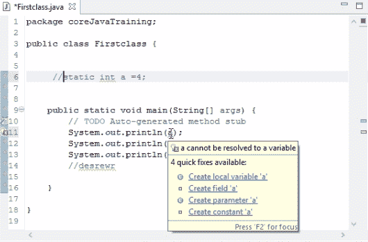
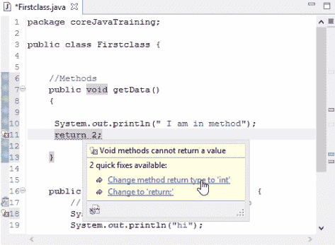

# 二、了解 Java 中的类、对象及其用法

在上一章中，我们简要介绍了 Java，以及如何安装我们将在其中键入代码的编辑器。我们还编写并在编辑器上执行了我们的第一个代码。

在本章中，我们将深入探讨一些基本概念，如字符串和变量，以及它们之间的区别。我们还将看到什么是方法，以及如何将它们用于不同的代码。我们将讨论为什么对象在代码中很重要，以及如何实现它们。

在本章中，我们将介绍以下主题：

*   字符串和变量之间的差异
*   使用方法
*   Java 中类和对象的重要性

# 字符串和变量之间的差异

在第一章，“Java 的第一个编程步骤”中，我们打印了一个字符串和变量。仔细看，当我们打印变量时，我们没有使用双引号，但当我们打印字符串时，我们使用双引号。这是因为变量中已经存在该值，因此我们不需要使用任何双引号。如果我们使用它们，Java 将其视为一个字符串，在下面的示例中，输出将被打印为字母`a`。如果我们运行此操作并观察输出，将打印字母`a`，如以下屏幕截图所示：


根据代码显示`a`值的输出

如果我们不使用双引号，Java 将检查是否有使用此字母定义的变量。如果是，则打印该变量中的值。如果没有定义变量，则会给出一个错误。如果我们注释掉变量声明，我们看到的是一个错误。将鼠标悬停在变量上，我们将得到一个提示，提示我们创建一个局部变量`a`，或者我们可以通过添加双引号来使用它：



“快速修复”下拉列表中包含更正代码错误的建议

简而言之，如果我们只使用双引号，变量将被视为字符串，但是如果我们不使用双引号，我们必须在某个地方声明变量。这就是打印字符串和打印变量之间的区别。

# 使用方法

基本上，方法是 Java 类中的块。让我们在这里写一个块作为示例，并观察开括号和闭括号的位置。以下示例显示了一个完整的块：

```java
public void getData()
{
    static int a=4;
}
```

在此代码中，我们将代码块命名为`getData()`，而`void`是此方法的返回类型。

如果我们希望从该方法返回一个数字，并且该数字是一个整数，那么我们必须写入`integer`来代替`void`。这同样适用于字符串；如果我们计划从`getData()`方法返回字符串，那么我们必须将其声明为`string`。如果我们不返回任何内容，也就是说，如果我们只是编写几行代码，那么我们将其保留为`void`。

请看以下屏幕截图：


返回类型为`void`的`getData()` 

在这里，我们不返回任何内容，因此我们将其保留为`void`。

让我们在`System.out.println(" I am in method");`下方添加一行`return 2;`。这里，我们返回一个整数。这就是为什么我们会在这里收到一个错误。如果我们将鼠标悬停在`return 2;`上显示的错误上，您将看到一个建议，将方法返回类型更改为`int`：



“快速修复”下拉列表中包含更正代码错误的建议

单击建议后，我们的 IDE 会自动将返回类型修改为整数，错误就会消失。字符串数据类型也是如此。

稍后我们将在第 10 章“最终关键字、包和修饰符”中讨论`public`访问修饰符的重要性。由于 Java 中有不同的访问修饰符，例如`public`、`private`、`protected`和`default`，因此有很多需要讨论的内容。我们将通过适当的示例来查看每个访问修饰符，以便对它们进行详细解释。现在，让我们接受所有访问修饰符为`public`。

现在您一定想知道为什么 Java 中会出现这些方法。它们有什么用？

假设我们正在执行一个 10 行代码块，例如，在一个页面上添加两个整数。现在，每当我们到达一个需要添加两个整数的页面时，我们必须再次编写 10 行代码。也许复制 10 行代码对于一个实例来说并不重要，但是如果我们在整个项目的 10 个实例中需要这段代码呢？因此，10 页 10 行代码构成了 100 行代码，我们在一个 Java 程序中复制这些代码。为了避免这种情况，我们把所有的 10 行代码都写到一个块中，然后我们把这个块命名为，例如，`getData`或其他任何东西。此后，每当我们需要输入 10 行代码时，我们可以简单地调用`getData`方法。所有的 10 行代码都将落入该特定块中，并将被执行。在这种情况下，我们避免编写代码 10 次；我们只在一个方法中编写一次，并在需要时调用该方法。

让我们用一个例子来解释这一点：

```java
package coreJavaTraining;

public class Firstclass {

    public void getData()
    {
        System.out.println(" I am in method")
    }
    public static void main(String[] args) {
        System.out.println(a);
        System.out.println("hi");
        System.out.println("hello world");
    }
}
```

在前一节中，我们将考虑作为前面提到的 10 行代码。我们想调用这个方法，但是这里的`getData()`块在`main`块之外，这意味着代码无法执行。要执行它，我们必须将它移动到`main`块中。在大多数情况下，人们只是在`main`块内复制代码，然后收到错误，因为`main`块内不允许使用任何方法。这个方法应该写在主块之外，但是在类内部。如果我们在类之外写东西，那就没有意义了，因为 Java 没有捕获它。但是如果我们在`main`块之外写方法，我们如何在`main`块内部得到它？为此，我们需要为定义方法的类创建一个对象。在这里，我们的方法是在`Firstclass`类中定义的，因此我们为这个类创建了一个对象，通过这个对象我们可以访问类中存在的方法和变量。

在下一节中，我们将看到对象是什么，在哪里使用它们，以及如何使用对象来调用方法和变量。

# Java 中类和对象的重要性

对象是类的实例或引用。所以我们可以通过对象的帮助来调用这个类中存在的方法和变量。我们不能直接调用方法和对象，我们只能通过对象的帮助来使用它们。所以首先，我们需要为类创建对象，然后我们可以在`main`类中调用方法。

让我们看一下前面的例子来解释这一点：

```java
package coreJavaTraining;

public class Firstclass {

    public void getData()
    {
        System.out.println(" I am in method");
    }
    public static void main(String[] args) 
    {
        System.out.println("hi");
        System.out.println("hello world");
    }
}
```

既然`main`块已经在类中，为什么我们需要为这个类再次创建一个对象并调用它？

答案是，`main`块不可能知道它之外的方法，除非我们创建一个对象来调用该方法。有一个例外，`static`变量表示该方法是静态的。因此，一般来说，访问其他方法只能使用对象。

# 在 Java 中创建对象

首先，我们需要为类中的对象分配一些内存。可以在`new`运算符的帮助下分配内存，后跟类名。然后我们为它定义一个对象名。返回类型应始终为类名。这是为类创建内存分配的语法。因此，前面示例中的内存分配代码如下所示：

```java
Firstclass fn=new Firstclass();
```

这里，我们说`fn`是`Firstclass`类的对象。现在我们已经创建了一个对象，让我们看看如何访问它。

# 在 Java 中访问对象

要访问该类的方法，我们先写对象名，然后写`.`（点）。所有符合该类条件的方法都显示在下拉列表中，这是 Eclipse 中的另一个重要特性。我们可以在下拉列表中查找方法，而不是在代码中搜索它。

在本例中，我们使用的是`getData()`方法。显示的其余方法都是内置 Java 方法。观察方法的显示方式：


显示编辑器可使用的所有类方法的下拉列表

点击`getData()`后，`getData()`块将被转移到调用对象的行，当我们运行程序时，代码将被执行，因为它是`main`块的一部分。访问代码最终将如下所示：

```java
fn.getData();
```

让我们看看这个示例的最终代码是什么样子的：

```java
package coreJavaTraining;

public class Firstclass {

    public void getData()
    {
        System.out.println(" I am in method")
    }
    public static void main(String[] args) 
    {
        Firstclass fn=new Firstclass();
        fn.getData();
        System.out.println("hi");
        System.out.println("hello world");
    }
}
```

因此，如果我们运行示例中给出的类，我们的结果如下：


根据代码输出显示我在方法中

`I am in method`是我们在输出中看到的；这是因为控件从内存分配行开始，创建一个对象，并使用我们称之为该类方法的对象。控件返回到`getData()`块并完成该特定块中存在的代码行；它执行`print`语句，我们看到它被打印出来了。这就是为什么对象在调用方法时功能强大。

同样的技术也可以用于调用整数。假设我们在`a`类中声明一个变量，并为其赋值。我们可以通过在`main`方法中添加以下行来打印变量值：

```java
System.out.println(fn.a);
```

这是在 Java 中使用类、对象和方法的一种方式；基本上我们是封装的。

# 访问不同类中的方法

比方说，我们面临这样一种情况：我们使用一个类，需要访问另一个类中的对象；这可以用 Java 实现。让我们用一个例子来帮助解释这一点。让我们使用两个类，`Firstclass()`（来自“访问  Java 中的对象”部分），我们将创建一个名为`secondclass()`的新类。在创建一个新类时，默认代码由编辑器创建，我们可以在其中添加代码。我们添加了一个随机方法`public void setData()`，在其中我们打印`I am in second class method`语句。

现在，我们需要`Firstclass()`类中的`setData()`方法。基本上我们想要执行`Firstclass()`中的`setData()`方法。方法只能用该特定类的对象调用。为此，我们在方法中创建一个对象来调用另一个类中的方法。我们使用与上一个示例中类似的代码为对象分配内存。在`Firstclass()`的`main`方法中增加以下代码：

```java
secondclass sn= new secondclass();
sn.setData();
```

在`main`类中键入代码时，当我们键入`sn.`调用该方法时，我们将再次获得 Java 中存在的所有方法选择。因为我们想调用`setData()`，所以我们从与我们共享的多个选项中选择它。这将通过为类创建对象成功地将`setData()`引入`Firstclass()`的`main`方法中。

如果我们运行代码，我们将得到以下输出：


输出显示我在第二类方法按照代码

# 总结

我们首先讨论了字符串和变量之间的区别，以及它们在代码中的显示方式。然后我们了解了什么是方法，以及如何使用它们来编写代码。之后，我们讨论了类和对象的重要性，以及如何使用它们调用执行类的方法。我们学习了如何为一个对象分配内存，并在执行代码时调用该对象的方法。最后，我们学习了如何使用对象访问另一个类中的方法。

在下一章中，我们将学习更多关于字符串的知识，并了解`String`类。