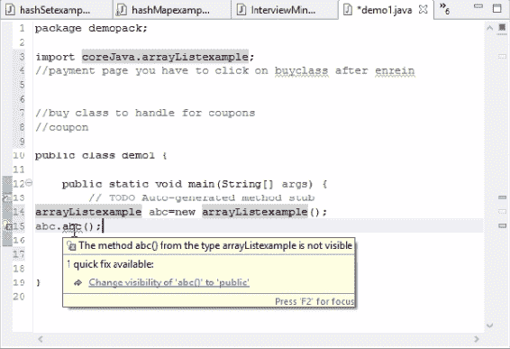

# 最终关键字、包和修饰符的重要性

这是我们这本书的最后一章。在这里，我们将讨论一些更重要的概念，这些概念将帮助我们编写和执行更好的代码

在本章中，我们将了解以下概念：

*   最后一个关键字
*   包装
*   Java 中的修饰符

# 最后一个关键字

首先，我们将创建一个新类。如果我们将任何变量声明为`final`，则表示该值不能再次更改。让我们考虑以下代码：

```java
package coreJava;

public class finaldemo {

    public static void main(String[] args) {
        //TODO Auto-generated method stub
        final int i=4; //constant variables
    }
}
```

如您所见，我们已将整数值声明为`4`。这意味着我们不能将此值更改为其他数字。如果我们尝试这样做，它会抛出一个错误，说`Remove 'final' modifier of 'i'`。如果希望值为常量，则该关键字很有用

如果我们将一个类标记为`final`，它将抛出一个错误，因为当我们将访问模式更改为`final`时，我们无法将其用作父类。换句话说，我们将无法从中继承我们的财产。如果我们想要继承我们的财产，我们需要将其更改回`public`。最后一个关键字的关键逻辑是，一旦编写，我们就不能重写`final`方法。因此，它们是唯一的，不能用相同的名称再次使用。

`final`关键字可以在方法级别使用，以确保该方法未被重写。它用于变量级别以确保我们没有更改它，也可以用于类级别以确保我们没有继承父类。

但请记住不要混淆`final`和`finally`。`finally`是与`try...catch`异常相关的东西，一旦执行`try`或`catch`块，并预告任何错误，无论脚本通过还是失败，控制器都会来到该日志并执行代码。`finally`都是关于限制访问的，比如我们不能使用它，不能继承它，甚至不能更改值。我们探讨了包，以及如何将包导入其他类。我们已经探索了接口的继承、运行时多态、字符串等。这都是关于关键词的。

在下一节中，我们将学习包。

# 包装

当为每个 Java 类编写脚本时，会自动出现一个预填充行。是`package coreJava`。因为我们已经用 Java 创建了一个包，并将所有 Java 类放入了这个`coreJava`包中，所以我们将其视为`package coreJava`。

包只是一组类和接口。例如，Java 附带了一些内置包，如`java.length`；如果我们导入这个包，只有这样我们才能访问一个基本方法，比如`public static void main`、整数或数组。所有这些类都来自这个`java.lang`包。定义包名很重要，因为没有它，我们无法访问包中的类。这是因为`java.lang`是一个默认包，它位于 Java 编译器本身中。

我们还有另一个包裹，`java.util`。我们在收集资料时使用了这个软件包；我们进口了一个`java.util`包装。为了在`ArrayList`上工作，这个类在`java.util`包中存在。因此，如果我们删除`import java.util.ArrayList`，它会抛出一个错误，因为它不属于`java.lang`。所有采集接口均来自`util`包。

但是我们如何知道使用什么关键字呢？下面的屏幕截图显示了如果我们悬停鼠标，Eclipse 将显示的内容：


“快速修复”下拉列表中包含更正代码错误的建议

我们正在进口`java.util`包装。从这个包中，我们导入了`ArrayList`类。它的语法将是：

```java
import package.classname
```

在这里，我们之所以在这个 Java 类中使用`ArrayList`是因为我们知道`ArrayList`在`java.util`包中。但在使用 Eclipse 时，我们不需要记住它。当你只需悬停鼠标，它建议我们导入包，我们可以点击它。它将自动导入该特定测试。

`HashSet`从同一`util`包导入`HashSet`类。如果我们去`HashMap`，它会带来`HashMap`。因此，每当我们想要处理某些测试时，我们都需要导入该包或类。`System.out.println()`也只来自一个包，但它们来自`java.lang`，这是一个内置编译器。这些都内置在 Java 包中。

同时，我们还可以定义一个用户定义的 Java 包。在本例中，我们所有的测试用例都位于一个名为`coreJava`的不同包中。如果有人想使用我们的类，他们只需要运行`import coreJava.classname`。

在下一节中，我们将研究`public`修饰符

# Java 中的修饰符

有四种类型的访问修饰符：

*   `public`
*   `private`
*   `protected`
*   `default`

我们不会在这里讨论这个理论，因为你可以在谷歌上找到它。我们需要一种实用的方法来确定这些访问修饰符的具体使用位置，或者包的具体导入位置。每当我们在本书中创建了一种方法时，每次我们只是使用`public`并编写了该方法。其他三个访问修饰符的工作方式类似。

现在，让我们试着了解这些访问修饰符是如何帮助我们的。

# 违约

如果我们没有提到任何访问修饰符，我们的 Java 类会自动认为它有一个`default`访问修饰符。如果是`default`，则意味着您可以在包中的任何位置访问此方法。但是如果您退出此包，则无法访问此方法。即使我们将`package.classname`导入到我们的新包中，如果我们没有将其指定为`public`，我们也将无法访问此方法。如果您没有指定它，那么默认情况下它认为它是一个`default`访问修饰符。`default`访问修饰符可以在包中的任何位置访问，但不能在包外访问。

在“包”部分，我们导入了这个包，并尝试使用它。正如您在下面的屏幕截图中所看到的，第 15 行显示了一个错误：



“快速修复”下拉列表，提供更正默认代码错误的建议

如果不指定任何内容，则无法访问它，因此它与默认功能的相同。这也适用于变量：

```java
public class arrayListexample {
    // can accept duplicate values
    //ArrayList, LinkedList, vector- Implementing List interface
    //array has fixed size where arraylist can grow dynamically
    //you can access and insert any value in any index
    int i=5;
```

如我们所见，在前面的代码中，我们声明了一个整数。但不会是`public`；它是`default`。因此，我们无法访问包外的变量。如果我们导入它，我们将可以访问类，但不能访问方法。如果我们想要访问，我们必须将其写为`public`。那么`public`访问修饰符做什么呢？

# 公众的

在创建方法或变量`public`时，我们可以在所有包中访问它。这意味着基本上到处都是。这个类的这个包没有限制。前面的截图中观察到的错误也会在我们创建方法/变量`public`后消失。

下面的屏幕截图显示了我们制作`public`后的`int`值：


“快速修复”下拉列表，其中包含更正公用程序代码错误的建议

在下一节课中，我们将了解什么是`private`和`protected`访问修饰符。在这一个之后还有两个访问修饰符，让我们看看它们的作用。

# 私有的

如果我们将方法或变量标记为`private`，那么我们无法在类外访问它们中的任何一个。不能在包外部或同一类外部访问它们。如果我们想在`ArraysDemo`示例中访问它，我们不能这样做。即使我们尝试，它也会抛出一个错误，如以下屏幕截图所示：


“快速修复”下拉列表中提供了更正私人计算机代码错误的建议

这是因为，如果我们将任何方法或变量标记为`private`，我们就无法在该特定类之外访问它。除非我们把它改成别的东西，否则它会抛出一个错误。这也适用于变量。

如果你想要一个实时场景，假设你正在付款并购买一个产品；所有的信用卡详细信息都将作为`private`，因为它们在`Buy`类之外无法访问。如果可以访问，那就是安全漏洞，对吗？因此，为了使信用卡详细信息仅限于该特定类，开发人员将`private`变量赋予所有信用卡详细信息，以便其他类无法使用它。即使他们使用了继承或导入了一个包，他们也无法访问这些敏感的细节；如果您正在测试框架上工作，那么可能存在一些您不应该更改的变量，并且始终保持其私有性。

# 受保护的

如果我们将变量或方法定义为`private`，则只能在子类中访问它们。这意味着如果我们将其定义为`protected`；然后，无论哪个类继承父类，只有那些子类可以访问该方法，而没有其他类。这可以通过以下代码片段理解：

```java
protected void abc() {
    //TODO Auto-generated method stub
    System.out.println("Hello");
    }
```

`default`与`protected`的区别在于`default`中只能访问同一类包中的类。即使是`protected`也可以访问同一个包中的所有类，只是它有一个附加功能。这个附加特性表示，如果我们想在其他包中访问它，只有继承父类属性的子类才能访问它。

同样的概念也适用于变量

# 总结

在本章中，我们学习了一些概念，这些概念帮助我们理解包、修饰符和`final`关键字在 Java 中的重要性。

我希望你已经阅读了所有章节，对这些概念有了更好的理解