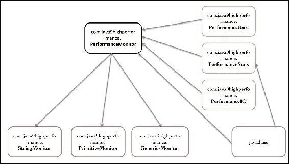

# 一、学习 Java 9 底层性能改进

当您认为自己掌握了 Lambdas 和 Java8 的所有与性能相关的特性时，Java9 就出现了。以下是将其转化为 Java 9 的几个功能，您可以使用这些功能来帮助提高应用程序的性能。这些变化超出了字节级别的变化，比如字符串存储或垃圾收集的变化，而您几乎无法控制这些变化。另外，忽略实现更改，例如加快对象锁定的更改，因为您不必做任何不同的事情，您会自动获得这些改进。相反，新的库功能和全新的命令行工具将帮助您快速创建应用程序。

在本课中，我们将介绍以下主题：

*   模块化开发及其对性能的影响
*   各种与字符串相关的性能改进，包括压缩字符串和独立字符串连接
*   并发性进展
*   各种底层编译器改进，如分层属性和提前编译（**AOT**）等
*   安全管理器改进
*   图形光栅化器的增强功能

# 介绍 Java 9 的新特性

在本课程中，我们将探讨通过在新环境中运行应用程序而自动获得的许多性能改进。在内部，当字符串中不需要全面的 Unicode 支持时，字符串更改还可以大大减少内存占用需求。如果您的大多数字符串都可以被编码为 ISO-8859-1 或拉丁语-1（每个字符 1 字节），那么它们在 Java9 中的存储效率将大大提高。因此，让我们深入研究核心库并了解底层性能改进。

# 模块化开发及其影响

在软件工程中，模块化是一个重要的概念。从性能和可维护性的角度来看，创建称为**模块**的自治单元非常重要。这些模块可以连接在一起构成一个完整的系统。模块提供封装，其中实现对其他模块隐藏。每个模块都可以公开不同的 API，这些 API 可以充当连接器，以便其他模块可以与其通信。这种类型的设计很有用，因为它促进了松散耦合，有助于关注单一功能以使其具有内聚性，并支持单独测试。它还降低了系统复杂性并优化了应用程序开发过程。提高每个模块的性能有助于提高应用程序的总体性能。因此，模块化开发是一个非常重要的概念。

我知道你可能在想，等等，Java 不是已经模块化了吗？Java 的面向对象特性是否已经提供了模块化操作？好的，面向对象当然会在数据封装的同时施加唯一性。它只建议松耦合，但不严格执行。此外，它无法在对象级别提供标识，也没有任何接口版本控制规定。现在您可能会问，JAR 文件呢？它们不是模块化的吗？嗯，虽然 JAR 在某种程度上提供了模块化，但它们没有模块化所需的唯一性。他们确实有一个规定来指定版本号，但很少使用，而且还隐藏在 JAR 的清单文件中。

因此，我们需要一种与现有设计不同的设计。简单地说，我们需要一个模块化系统，其中每个模块可以包含多个包，并且与标准 JAR 文件相比提供了健壮的封装。

这就是 Java9 的模块化系统所提供的。除此之外，它还通过显式声明依赖项来替换易出错的类路径机制。这些增强提高了应用程序的整体性能，因为开发人员现在可以在不影响整个系统的情况下优化单个独立单元。

这也使得应用程序更具可扩展性，并提供了高完整性。

让我们看一下模块系统的一些基础知识，以及它是如何结合在一起的。首先，您可以运行以下命令来查看模块系统的结构：

```java
$java --list-modules

```


如果您对特定模块感兴趣，只需在命令末尾添加模块名称，如下命令所示：

```java
$java --list-modules java.base

```


前面的命令将以包的形式显示来自基本模块的所有导出。`java.base`是系统的核心。

这将显示所有图形用户界面包。这也将显示`requires`哪些是依赖项：

```java
$java --list-modules java.desktop

```


到目前为止还不错，对吧？现在你可能想知道，我开发了我的模块，但是如何将它们集成在一起？让我们调查一下。Java9 的模块化系统附带了一个名为**JLink**的工具。我知道你能猜出我现在要说什么。没错，它链接了一组模块并创建了一个运行时映像。现在想象一下它能提供的可能性。您可以使用自己的自定义模块创建自己的可执行系统。我希望你的生活会更有趣！哦，另一方面，您将能够控制执行并删除不必要的依赖项。

让我们看看如何将模块链接在一起。嗯，很简单。只需运行以下命令：

```java
$jlink --module-path $JAVA_HOME/jmods:mlib --add-modules java.desktop --output myawesomeimage

```

此链接器命令将为您链接所有模块并创建运行时映像。您需要提供一个模块路径，然后添加要生成图形并给出名称的模块。这不是很简单吗？

现在，让我们检查前一个命令是否正常工作。让我们从图中验证模块：

```java
$myawesomeimage/bin/java --list-modules

```

输出如下所示：


有了它，您现在就可以在应用程序中分发快速运行时了。太棒了，不是吗？现在你可以看到我们是如何从一个有点单一的设计转变为一个自足的内聚设计的。每个模块都包含自己的导出和依赖项，JLink 允许您创建自己的运行时。有了这个，我们就有了我们的模块化平台。

请注意，本节的目的只是向您介绍模块化系统。还有很多东西需要探索，但这超出了本书的范围。在本书中，我们将重点介绍性能增强领域。

## 模块快速介绍

我确信，在阅读了模块化平台之后，您一定会对深入研究模块体系结构并了解如何开发模块体系结构感到兴奋。请不要激动，我将很快带你踏上一段通往模块激动人心世界的旅程。

正如您一定猜到的，每个模块都有一个属性`name`，并且是由包组织的。每个模块都充当一个独立的单元，可能有本机代码、配置、命令、资源等。模块的详细信息存储在名为`module-info.java`的文件中，该文件位于模块源代码的根目录中。在该文件中，模块可定义如下：

```java
module <name>{
}
```

为了更好地理解它，让我们看一个例子。比方说，我们的模块名是`PerformanceMonitor`。本模块的目的是监控应用程序性能。输入连接器将接受方法名称和该方法所需的参数。此方法将从我们的模块中调用，以监视模块的性能。输出连接器将为给定模块提供性能反馈。让我们在性能应用程序的根目录中创建一个`module-info.java`文件，并插入以下部分：

```java
module com.java9highperformance.PerformanceMonitor{
}
```

令人惊叹的！你得到了你的第一个模块声明。但是等一下，它什么也没做。别担心，我们刚刚为此创建了一个框架。让我们在骨架上放些肉。让我们假设我们的模块需要与我们已经创建并命名为--`PerformanceBase`、`StringMonitor`、`PrimitiveMonitor`、`GenericsMonitor`等的其他（出色的）模块进行通信。换句话说，我们的模块具有外部依赖性。您可能想知道，我们如何在模块声明中定义这种关系？好的，耐心点，这就是我们现在要看到的：

```java
module com.java9highperformance.PerformanceMonitor{
    exports com.java9highperformance.StringMonitor;
    exports com.java9highperformance.PrimitiveMonitor;
    exports com.java9highperformance.GenericsMonitor;
    requires com.java9highperformance.PerformanceBase;
    requires com.java9highperformance.PerformanceStat;
    requires com.java9highperformance.PerformanceIO;
}
```

是的，我知道你发现了两个条款，那就是，`exports`和`requires`。我相信你们一定很想知道它们的意思，以及为什么我们要把它们放在那里。我们将首先讨论这些子句以及它们在模块声明中的含义：

*   `exports`：当您的模块依赖于另一个模块时，使用此子句。它表示此模块仅向其他模块公开公共类型，并且内部包都不可见。在我们的例子中，模块`com.java9highperformance.PerformanceMonitor`依赖于`com.java9highperformance.StringMonitor`、`com.java9highperformance.PrimitiveMonitor`和`com.java9highperformance.GenericsMonitor`。这些模块分别导出其 API 包`com.java9highperformance.StringMonitor`、`com.java9highperformance.PrimitiveMonitor`和`com.java9highperformance.GenericsMonitor`。
*   `requires`：此子句表示模块在编译和运行时都依赖于声明的模块。在我们的例子中，`com.java9highperformance.PerformanceBase`、`com.java9highperformance.PerformanceStat`和`com.java9highperformance.PerformanceIO`模块是我们的`com.java9highperformance.PerformanceMonitor`模块所需要的。然后，模块系统定位所有可观察模块，以递归方式解决所有依赖关系。这个传递闭包为我们提供了一个模块图，它显示了两个依赖模块之间的有向边。

### 注

**注**：即使没有明确声明，每个模块都依赖于`java.base`。正如您已经知道的，Java 中的一切都是对象。

现在您了解了模块及其依赖关系。所以，让我们画一个模块表示法来更好地理解它。下图显示了依赖于`com.java9highperformance.PerformanceMonitor`的各种包。


底部模块为`exports`模块，右侧模块为`requires`模块。

现在，让我们探讨一个称为**可读性关系**的概念。可读性关系是两个模块之间的关系，其中一个模块依赖于另一个模块。这种可读性关系是可靠配置的基础。所以在我们的例子中，我们可以说`com.java9highperformance.PerformanceMonitor`读`com.java9highperformance.PerformanceStat`。

我们来看看`com.java9highperformance.PerformanceStat`模块的描述文件`module-info.java`：

```java
module com.java9highperformance.PerformanceStat{
    requires transitive java.lang;
}
```

此模块依赖于`java.lang module`。让我们详细看一下`PerformanceStat`模块：

```java
package com.java9highperformance.PerformanceStat;
import java.lang.*;

public Class StringProcessor{
    public String processString(){...}
}
```

在这种情况下，`com.java9highperformance.PerformanceMonitor`只依赖于`com.java9highperformance.PerformanceStat`，而`com.java9highperformance.PerformanceStat`依赖于`java.lang`。`com.java9highperformance.PerformanceMonitor`模块不知道`com.java9highperformance.PerformanceStat`模块的`java.lang`依赖关系。此类问题由模块系统处理。它添加了一个名为**传递性**的新修饰语。如果你看`com.java9highperformance.PerformanceStat`，你会发现它需要及物`java.lang`。这意味着依赖于`com.java9highperformance.PerformanceStat`的任何一个都可以读取`java.lang`。

请参见下图，其中显示了可读性图：



现在，为了编译`com.java9highperformance.PerformanceMonitor`模块，系统必须能够解析所有依赖项。可以从模块路径中找到这些依赖项。这很明显，不是吗？但是，不要误解类路径和模块路径。这是一个完全不同的品种。它没有软件包存在的问题。

# 串操作性能

若你们不是编程新手，那个么到目前为止，字符串一定是你们最好的朋友。在许多情况下，你可能比你的配偶或伴侣更喜欢它。我们都知道，没有字符串是无法生存的，事实上，如果不使用字符串，您甚至无法完成应用程序。好了，关于字符串已经说得够多了，我已经对字符串的使用感到头晕目眩，就像早期版本中的 JVM 一样。除了笑话之外，让我们来谈谈 Java 9 中的哪些变化将帮助您的应用程序更好地执行。虽然这是一个内部变化，但作为一名应用程序开发人员，理解这一概念非常重要，这样您就可以知道在哪里重点改进性能。

Java9 朝着提高字符串性能迈出了一步。如果您曾经遇到 JDK 6 的失败尝试`UseCompressedStrings`，那么您必须寻找提高字符串性能的方法。因为`UseCompressedStrings`是一个实验性的特性，容易出错，而且设计得不是很好，所以它在 JDK 7 中被删除。不要为此感到难过，我知道这很糟糕，但黄金岁月终将到来。JEP 团队经历了巨大的痛苦，添加了一个紧凑的字符串特性，可以减少字符串及其相关类的占用空间。

压缩字符串将改善字符串的占用空间，并有助于高效地使用内存空间。它还保留了所有相关 Java 和本机接口的兼容性。第二个重要特性是**指示字符串串联**，它将在运行时优化字符串。

在本节中，我们将结束介绍这两个特性及其对整体应用程序性能的影响。

## 紧凑型串

在我们讨论这个特性之前，了解我们为什么关心这个特性是很重要的。让我们深入到 JVM 的地下世界（或者像任何一个星球大战迷所说的，原力的黑暗面）。让我们首先了解 JVM 是如何对待我们喜爱的字符串的，这将帮助我们理解这个新的闪亮紧凑的字符串改进。让我们进入堆的神奇世界。事实上，如果没有对这个神秘世界的讨论，没有一本表演书是完整的。

### 堆的世界

每次 JVM 启动时，它都会从底层操作系统获得一些内存。它被分为两个不同的区域，称为**堆空间**和**永久代**。这些是应用程序所有资源的所在地。就像生活中所有美好的事物一样，这个家的大小是有限的。这个大小是在 JVM 初始化期间设置的；但是，您可以通过指定 JVM 参数`-Xmx`和`-XX:MaxPermSize`来增加或减少该值。

堆大小分为两个区域，托儿所或幼年空间和旧空间。顾名思义，年轻的空间是新物体的家园。这一切听起来很不错，但每个房子都需要清理。因此，JVM 有一个最高效的清洁器，名为**垃圾收集器**（最高效？好吧……我们现在还不谈这个）。正如任何高效的清洁器一样，垃圾收集器有效地收集所有未使用的对象并回收内存。当这个年轻的空间被新的对象填满时，垃圾收集器负责将在这个年轻空间中生活了足够长时间的任何人转移到旧空间。这样，在年轻的空间里总是有空间容纳更多的物体。

同样，如果旧空间被填满，垃圾收集器将回收所使用的内存。

## 为什么要压缩字符串？

现在您对堆有了一点了解，让我们看看`String`类以及字符串是如何在堆上表示的。如果您仔细分析应用程序的堆，您会注意到有两个对象，一个是 Java 语言`String`对象，它引用了实际处理数据的第二个对象`char[]`。`char`数据类型为 UTF-16，因此最多占用 2 个字节。让我们看一下以下两个不同语言字符串的外观示例：

```java
2 byte per char[]
Latin1 String : 1 byte per char[]
```

您可以看到，`Latin1 String`只消耗 1 字节，因此我们损失了大约 50% 的空间。有机会以更密集的形式表示它，并改进足迹，这最终将有助于加快垃圾收集。

现在，在对此进行任何更改之前，了解它对实际应用程序的影响非常重要。必须知道应用程序是每`char[]`字符串使用 1 字节还是每`char[]`字符串使用 2 字节。

为了得到答案，JPM 团队分析了大量实际数据的堆转储。结果突出显示，大多数堆转储占`chars[]`消耗的整个堆的 18% 到 30% 左右，它们来自字符串。此外，值得注意的是，大多数字符串由每个`char[]`的一个字节表示。因此，很明显，如果我们试图改善单字节字符串的占用空间，它将显著提高许多实际应用程序的性能。

### 他们做了什么？

在经历了许多不同的解决方案之后，JPM 团队最终决定提出一种在构建字符串期间压缩字符串的策略。首先，乐观地尝试压缩 1 字节，如果不成功，则将其复制为 2 字节。有一些捷径是可能的，例如，使用像 ISO-8851-1 这样的特殊情况编码器，它总是会吐出 1 个字节。

这个实现比 JDK 6 的`UseCompressedStrings`实现要好得多，后者只对少数应用程序有用，因为它通过在每个实例上重新打包和解包来压缩字符串。因此，性能增益来自这样一个事实，即它现在可以在两种形式上工作。

### 逃生路线是什么？

尽管听起来很棒，但如果每个`char[]`字符串只使用 2 个字节，可能会影响应用程序的性能。在这种情况下，不使用前面提到的、检查并直接将字符串存储为每`char[]`2 个字节是有意义的。因此，JPM 团队提供了一个杀死它的开关`--XX: -CompactStrings`，您可以使用它禁用此功能。

### 性能增益是多少？

前面的优化会影响堆，正如我们前面看到的，字符串在堆中表示。因此，它会影响应用程序的内存占用。为了评估性能，我们确实需要关注垃圾收集器。稍后我们将探讨垃圾收集主题，但现在，让我们只关注运行时性能。

## 指示字符串串联

我相信你一定会被我们刚刚学习到的紧凑弦功能的概念所震撼。现在让我们看一下字符串最常见的用法，即连接。你有没有想过当我们尝试连接两个字符串时会发生什么？让我们来探索一下。以以下为例：

```java
public static String getMyAwesomeString(){
    int javaVersion = 9;
    String myAwesomeString = "I love " + "Java " + javaVersion + " high       performance book by Mayur Ramgir";
    return myAwesomeString;
}
```

在前面的示例中，我们试图将几个字符串与`int`值连接起来。然后，编译器将获取您的令人敬畏的字符串，初始化一个新的`StringBuilder`实例，然后附加所有这些单独的字符串。请看下面由`javac`生成的字节码。我已经使用了**Eclipse**的**字节码大纲**插件来可视化这种方法的反汇编字节码。您可以从[这里](http://andrei.gmxhome.de/bytecode/index.html)下载：

```java
// access flags 0x9
public static getMyAwesomeString()Ljava/lang/String;
  L0
  LINENUMBER 10 L0
  BIPUSH 9
  ISTORE 0
  L1
  LINENUMBER 11 L1
  NEW java/lang/StringBuilder
  DUP
  LDC "I love Java "
  INVOKESPECIAL java/lang/StringBuilder.<init> (Ljava/lang/String;)V
  ILOAD 0
  INVOKEVIRTUAL java/lang/StringBuilder.append (I)Ljava/lang/StringBuilder;
  LDC " high performance book by Mayur Ramgir"
  INVOKEVIRTUAL java/lang/StringBuilder.append (Ljava/lang/String;)Ljava/lang/StringBuilder;
  INVOKEVIRTUAL java/lang/StringBuilder.toString ()Ljava/lang/String;
  ASTORE 1
  L2
  LINENUMBER 12 L2
  ALOAD 1
  ARETURN
  L3
  LOCALVARIABLE javaVersion I L1 L3 0
  LOCALVARIABLE myAwesomeString Ljava/lang/String; L2 L3 1
  MAXSTACK = 3
  MAXLOCALS = 2
```

快速提示：我们如何解释这一点？

*   `INVOKESTATIC`：这对于调用静态方法很有用
*   `INVOKEVIRTUAL`：使用动态调度调用公共和受保护的非静态方法
*   `INVOKEINTERFACE`：与`INVOKEVIRTUAL`非常相似，只是方法分派是基于接口类型的
*   `INVOKESPECIAL`：这对于调用构造函数、超类的方法和私有方法非常有用

但是，在运行时，由于在 JIT 编译器中包含了`-XX:+-OptimizeStringConcat`，它现在可以识别`StringBuilder`和`toString`链的附加。如果识别出匹配项，则生成用于优化处理的低级代码。计算所有参数的长度，计算出最终容量，分配存储，复制字符串，并执行原语的就地转换。在此之后，将此阵列移交给`String`实例，无需复制。这是一个有利可图的优化。

但这在连接方面也有一些缺点。一个例子是，在使用`long`或`double`连接字符串的情况下，它将无法正确优化。这是因为编译器必须先执行`.getChar`，这会增加开销。

另外，如果你在`String`后面加上`int`，那么它的效果非常好；但是，如果您有一个像`i++`这样的增量运算符，那么它将中断。这背后的原因是您需要返回到表达式的开头并重新执行，因此实际上您要执行两次`++`。现在是 Java9 压缩字符串中最重要的变化。像`value.length >> coder`这样的长度拼写；`C2`无法优化，因为它不知道 IR。

因此，为了解决编译器优化和运行时支持的问题，我们需要控制字节码，而我们不能指望`javac`来处理这个问题。

我们需要延迟决定在运行时可以进行哪种连接。因此，我们可以有一种方法`String.concat`来实现这个神奇的效果。好吧，现在还不要急于讨论这个问题，因为你会如何设计方法`concat`。让我们看一看。一种方法是接受`String`实例的数组：

```java
public String concat(String... n){
    //do the concatenation
}
```

但是，这种方法不适用于原语，因为您现在需要将每个原语转换为`String`实例，而且，正如我们前面看到的，问题是长字符串和双字符串连接不允许我们对其进行优化。我知道，我能感觉到你脸上的光芒，就像你有一个解决这个痛苦问题的绝妙主意一样。您正在考虑使用`Object`实例而不是`String`实例，对吗？正如您所知，`Object`实例是包罗万象的。让我们看看你的绝妙想法：

```java
public String concat(Object... n){
    //do the concatenation
}
```

首先，如果您使用的是`Object`实例，那么编译器需要进行自动装箱。此外，您正在传递`varargs`数组，因此它不会以最佳方式执行。那么，我们被困在这里了吗？这是否意味着我们不能将卓越的紧凑字符串功能用于字符串连接？让我们多想一想；也许不使用`runtime`方法，让`javac`处理级联，只给我们优化的字节码。听起来是个好主意。等等，我知道你也在想同样的事情。如果 JDK10 进一步优化了它呢？这是否意味着，当我升级到新的 JDK 时，我必须重新编译代码并再次部署它？在某些情况下，这不是一个问题，在其他情况下，这是一个大问题。所以，我们回到了原点。

我们需要一些可以在运行时处理的东西。好的，这意味着我们需要一些动态调用方法的东西。嗯，听起来不错。如果我们回到我们的时间机器，在 JDK 7 时代的黎明，它给了我们`invokedynamic`。我知道你能看到解决方案，我能感觉到你眼中闪烁的光芒。是的，你是对的，`invokedynamic`可以在这里帮助我们。如果您不知道`invokedynamic`，让我们花一些时间来理解它。对于那些已经掌握了这个主题的人，你可以跳过它，但我建议你再重复一遍。

### 调用动力学

`invokedynamic`特性是 Java 历史上最显著的特性。我们现在可以定义自己的操作方式，而不是限制 JVM 字节码。那么什么是`invokedynamic`？简单来说，它是用户可定义的字节码。这个字节码（而不是 JVM）决定了执行和优化策略。它以方法处理 API 的形式提供了各种方法指针和适配器。JVM 然后处理字节码中给出的指针，并使用类似反射的方法指针对其进行优化。这样，作为开发人员，您可以完全控制代码的执行和优化。

它本质上是用户定义字节码（称为**字节码+引导**）和方法句柄的混合体。我知道你也在想方法句柄——它们是什么以及如何使用它们？好的，我听到了，让我们来谈谈方法句柄。

方法句柄提供各种指针，包括字段、数组和方法，用于传递数据并返回结果。有了它，您可以进行参数操作和流控制。从 JVM 的角度来看，这些是本机指令，它可以像字节码一样进行优化。但是，您可以选择以编程方式生成此字节码。

让我们放大方法句柄，看看它们是如何联系在一起的。主包名称为`java.lang.invoke`，有`MethodHandle`、`MethodType`和`MethodHandles`。`MethodHandle`是将用于调用函数的指针。`MethodType`表示一组参数和来自该方法的返回值。实用程序类`MethodHandles`将充当指向方法的指针，该方法将获取`MethodHandle`的实例并映射参数。

本节我们将不深入讨论，因为目的只是让您了解`invokedynamic`功能是什么以及它是如何工作的，以便您了解字符串连接解决方案。这就是我们回到字符串连接讨论的地方。我知道，您很喜欢`invokedynamic`的讨论，但我想我能够给您足够的洞察力，让您理解 Indify String 串联的核心思想。

让我们回到连接部分，在那里我们正在寻找一个解决方案来连接我们令人敬畏的紧凑字符串。对于连接紧凑字符串，我们需要考虑方法的类型和类型数量，`invokedynamic`给出了这一点。

那么让我们用`invokedynamic`来表示`concat`。好吧，别那么快，我的朋友。这种方法存在一个根本问题。我们不能仅仅使用`invokedynamic`来解决这个问题。为什么？因为有一个循环引用。`concat`功能需要`java.lang.invoke`，使用`concat`。这样继续下去，最终你会得到`StackOverflowError`。

请看下面的代码：

```java
String concat(int i, long l, String s){
    return s + i + l
}
```

因此，如果我们在这里使用`invokedynamic`，则`invokedynamic`调用将如下所示：

```java
InvokeDynamic #0: makeConcat(String, int, long)
```

有必要打破循环引用。但是，在当前的 JDK 实现中，您无法控制`java.invoke`从完整的 JDK 库调用什么。此外，从`java.invoke`中删除完整的 JDK 库引用会产生严重的副作用。我们只需要`java.base`模块来指示字符串连接，如果我们能够找到一种方法来调用`java.base`模块，那么它将显著提高性能并避免不愉快的异常。我知道你在想什么。我们刚刚研究了 Java9 中最酷的一个新功能，**项目 Jigsaw**。它提供了模块化的源代码，现在我们只能接受`java.base`模块。这解决了我们在连接两个字符串、原语等方面面临的最大问题。

在经历了两种不同的策略之后，Java 性能管理团队确定了以下策略：

1.  对所有参考参数调用`toString()`方法。
2.  调用`tolength()`方法，或者因为所有底层方法都是公开的，所以只需在每个参数上调用`T.stringSize(T t)`。
3.  找出编码者并为所有参考参数调用`coder()`。
4.  分配`byte[]`存储，然后复制所有参数。然后，就地转换基本体。
5.  通过移交数组进行连接来调用私有构造函数`String`。

这样，我们就可以在相同的代码中获得优化的字符串连接，而不是在`C2 IR`中。此策略使我们的性能提高了 2.9 倍，垃圾减少了 6.4 倍。

# 在 CD 档案中存储插入的字符串

此功能的主要目标是减少由于在每个 JVM 进程中创建新的字符串实例而造成的内存占用。任何 JVM 进程中加载的所有类都可以通过**类数据共享**（**CD**）存档与其他 JVM 进程共享。

哦，我没有告诉你关于 CD 的事。我认为花一些时间了解 CD 是什么很重要，这样您就可以了解潜在的性能改进。

很多时候，尤其是小型应用程序在启动操作上花费了相对较长的时间。为了缩短启动时间，引入了一个称为 CDS 的概念。CDS 支持在 JRE 安装期间将从系统 JAR 文件加载到私有内部表示中的一组类共享。这非常有帮助，因为任何进一步的 JVM 调用都可以利用这些加载的类在共享归档中的表示，而不是再次加载这些类。与这些类相关的元数据在多个 JVM 进程之间共享。

CD 在常量池中以 UTF-8 的形式存储字符串。当这些加载类中的类开始初始化过程时，这些 UTF-8 字符串将根据需要转换为`String`对象。在这种结构中，每个受限字符串中的每个字符在`String`对象中占用 2 个字节，在 UTF-8 中占用 1 到 3 个字节，这实际上是在浪费内存。由于这些字符串是动态创建的，不同的 JVM 进程不能共享这些字符串。

共享字符串需要一个名为**固定区域**的特性，以便使用垃圾收集器。因为唯一支持固定的热点垃圾收集器是 G1；它只适用于 G1 垃圾收集器。

# 并发性能

多线程是一个非常流行的概念。它允许程序同时运行多个任务。这些多线程程序可能有多个可以并发运行的单元。每个单位可以处理不同的任务，保持可用资源的最佳利用。这可以由多个并行运行的线程来管理。

Java9 改进了争用锁定。您可能想知道什么是竞争锁定。让我们来探索一下。每个对象都有一个监视器，一次只能由一个线程拥有。监视器是并发的基本构建块。为了让线程在对象或对象声明的同步方法上执行标记为已同步的代码块，它必须拥有该对象的监视器。由于有多个线程试图访问上述监视器，JVM 需要协调进程，一次只允许一个线程。这意味着其余线程处于等待状态。然后，此监视器称为竞争监视器。由于这一规定，程序在等待状态下浪费时间。

另外，**Java 虚拟机**（**JVM**）进行了一些协调锁争用的工作。此外，它还必须管理线程，因此一旦现有线程完成其执行，就可以允许新线程进入。这无疑会增加开销并对性能产生不利影响。Java9 在这方面采取了一些改进措施。该条款细化了 JVM 的编排，这将最终导致高度争议代码的性能改进。

以下基准测试和测试可用于检查内容化 Java 对象监视器的性能改进：

*   `CallTimerGrid`（与其说是基准测试，不如说是压力测试）
*   `Dacapo-bach`（2009 年早些时候）
*   `_ avrora`
*   `_ batik`
*   `_ fop`
*   `_ h2`
*   `_ luindex`
*   `_ lusearch`
*   `_ pmd`
*   `_ sunflow`
*   `_ tomcat`
*   `_ tradebeans`
*   `_ tradesoap`
*   `_ xalan`
*   `DerbyContentionModelCounted`
*   `HighContentionSimulator`
*   `LockLoops-JSR166-Doug-Sept2009`（早期锁定回路）
*   `PointBase`
*   `SPECjbb2013-critical`（早期规范 JBB2005）
*   `SPECjbb2013-max`
*   `specjvm2008`
*   `volano29`（之前的 volano2509）

# 编译器改进

为了提高编译器的性能，已经做了一些努力。在本节中，我们将重点介绍编译器方面的改进。

## 分层归属

提供编译器改进的首要变化与**分层归属**（**TA**）相关。此更改与 Lambda 表达式更相关。目前，poly 表达式的类型检查是通过针对不同目标对同一棵树进行多次类型检查来完成的。这个过程被称为**推测归属**（**SA**），它允许使用不同的重载解析目标来检查 Lambda 表达式。

这种类型检查方法虽然是一种健壮的技术，但对性能有很大的负面影响。例如，使用这种方法，`n`个重载候选者针对相同的参数表达式检查一次，最多为`n*3`个重载阶段，严格、松散和变参数。除此之外，还有一个最终检查阶段。当 Lambda 返回一个 poly 方法调用时，会导致属性调用的组合爆炸，这会导致巨大的性能问题。因此，我们当然需要一种不同的多边形表达式类型检查方法。

其核心思想是确保方法调用为每个多边形参数表达式创建具有每个细节的自底向上结构类型，在执行重载解析之前，执行重载解析适用性检查将需要这些类型。

总之，性能改进能够通过减少总尝试次数来实现给定表达式的属性。

## 提前编译

编译器改进的第二个显著变化是提前编译。如果您不熟悉这个术语，让我们看看 AOT 是什么。您可能知道，任何语言中的每个程序都需要运行时环境来执行。Java 也有自己的运行时，称为**Java 虚拟机**（**JVM**）。我们大多数人使用的典型运行时是字节码解释器，它也是 JIT 编译器。此运行时称为**HotspotJVM**。

这个 HotspotJVM 以通过 JIT 编译和自适应优化提高性能而闻名。到现在为止，一直都还不错。然而，这在实践中并不适用于每个应用程序。如果您有一个非常轻的程序，比如说，一个方法调用，该怎么办？在这种情况下，JIT 编译对您帮助不大。你需要一些能更快加载的东西。这就是 AOT 将帮助您的地方。使用 AOT 而不是 JIT，您可以编译为本机机器代码，而不是编译为字节码。然后，运行时使用此本机代码管理对`malloc`中新对象的调用以及对系统调用的文件访问。这可以提高性能。

# 安全管理器改进

好的，我们来谈谈安全问题。如果你不是那种关心应用程序安全而不是在发布中推出更多功能的人，那么你脸上的表情可能会像**嗯！那是什么**？如果你是其中之一，那么首先让我们了解安全的重要性，并在应用程序开发任务中找到一种方法来考虑这一点。在当今 SaaS 主导的世界中，一切都暴露于外部世界。一个有决心的人（用一种很好的方式来形容，**恶意黑客**）可以访问您的应用程序，并利用您的疏忽可能引入的安全漏洞。我想深入讨论应用程序安全性，因为这是我非常感兴趣的另一个领域。但是，应用程序安全性不在本书的范围之内。我们在这里讨论它的原因是 JPM 团队已经采取了一项主动措施来改进现有的安全管理器。因此，在谈论安全管理器之前，首先了解安全的重要性是很重要的。

希望这一行描述能够激发您对安全编程的兴趣。然而，我确实理解，由于时间紧迫，有时您可能没有足够的时间来实现完整的安全编程模型。所以，让我们找到一种适合你紧张的日程安排的方法。让我们思考一下；有没有办法自动化安全性？我们能否有一种方法来创建一个蓝图，并要求我们的计划保持在界限之内？好吧，你很幸运，Java 确实有一个名为**安全管理器**的功能。它只是一个为应用程序定义安全策略的策略管理器。听起来很刺激，不是吗？但这项政策是什么样的呢？它包含什么？这两个问题都可以问。该安全政策基本上规定了危险或敏感的行为。如果您的应用程序不符合此策略，则安全管理器将抛出`SecurityException`。另一方面，您可以让应用程序调用此安全管理器来了解允许的操作。现在，让我们详细了解一下安全管理器。

对于 Web 小程序，浏览器提供安全管理器，或者 Java web Start 插件运行此策略。在许多情况下，Web 小程序以外的应用程序运行时没有安全管理器，除非这些应用程序实现了安全管理器。毫无疑问，如果没有安全管理器和附加的安全策略，那么应用程序的行为将不受限制。

现在我们对安全管理器有了一点了解，让我们看看这方面的性能改进。根据 Java 团队的说法，在安装了安全管理器的情况下运行的应用程序可能会降低 10% 到 15% 的性能。但是，不可能消除所有性能瓶颈，但缩小这一差距不仅有助于提高安全性，而且有助于提高性能。

Java9 团队研究了一些优化，包括安全策略的实施和权限的评估，这将有助于提高使用安全管理器的总体性能。在性能测试阶段，有人强调，尽管权限类是线程安全的，但它们显示为热点。为了减少线程争用和提高吞吐量，已经进行了许多改进。

计算`java.security.CodeSource`的`hashcode`方法已得到改进，以使用代码源 URL 的字符串形式，避免潜在的昂贵 DNS 查找。此外，对包含包检查算法的`java.lang.SecurityManager`的`checkPackageAccess`方法进行了改进。

安全管理器改进中的其他一些值得注意的变化如下：

*   第一个明显的变化是使用`ConcurrentHashMap`代替`Collections.synchronizedMap`有助于提高`Policy.implie`方法的吞吐量。 看下图，取自 OpenJDK 站点，它突出显示了使用`ConcurrentHashMap`显着增加的吞吐量：

    

*   除此之外，在`java.security.SecureClassLoader`中用于维护`CodeSource`内部采集的`HashMap`已被`ConcurrentHashMap`取代。
*   还有其他一些小的改进，比如通过从同步身份的`getPermissions`方法（`CodeSource`中删除兼容代码，提高吞吐量。
*   另一个显著的性能提升是使用权限检查代码中由同步块包围的`ConcurrentHashMap`而不是`HashMap`，这产生了更高的线程性能。

# 图形光栅化器

如果您对 Java2D 感兴趣并使用 OpenJDK，您将感谢 Java9 团队所做的努力。Java9 主要与图形光栅化器相关，它是当前 JDK 的一部分。OpenJDK 使用双鱼座，而 Oracle JDK 使用导管。Oracle 的封闭源代码导管光栅化器的性能优于 OpenJDK 的双鱼座。

这些图形光栅化器对于除字体外的抗锯齿渲染非常有用。因此，对于图形密集型应用程序，此光栅化器的性能非常重要。然而，双鱼座在很多方面都失败了，它的表现问题非常明显。因此，该团队决定用另一种称为 Marlin Graphics Renderer 的光栅化器来取代它。

马林鱼是用 Java 开发的，最重要的是，它是双鱼座光栅器的叉。已经对其进行了各种测试，结果非常有希望。它的表现总是比双鱼座的好。它展示了多线程的可伸缩性，甚至在单线程应用程序中优于封闭源代码的 Ductus 光栅化器。

# 总结

在本课程中，我们已经看到了一些激动人心的特性，这些特性可以在不付出任何努力的情况下提高应用程序的性能。

在下一课中，我们将学习 JShell 和提前（**AOT**）编译器。我们还将学习**读取求值打印循环**（**REPL**）工具。

# 评估

1.  JLink 是 Java 9 模块化系统的一部分。
2.  当一个模块依赖于另一个模块时，两个模块之间的关系是什么？

    1.  可读性关系
    2.  可操作性关系
    3.  模块化关系
    4.  实体关系

3.  说明是真是假：每次 JVM 启动时，它都会从底层操作系统获得一些内存。
4.  以下哪项执行一些编排锁争用的工作？

    1.  固定区域
    2.  可读性关系
    3.  Java 虚拟机
    4.  类数据共享

5.  以下哪项允许使用不同的重载解析目标来检查 Lambda 表达式？

    1.  分层归属
    2.  HotspotJVM
    3.  推测归属
    4.  Permgen