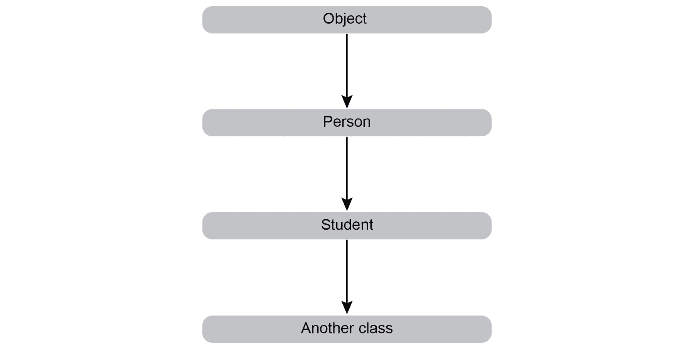

# 五、深入 OOP

## 学习目标

本课程结束时，您将能够：

*   用 Java 实现接口
*   打字
*   利用**对象**类
*   使用抽象类和方法

## 导言

在上一课中，我们研究了面向对象编程的基础知识，如类和对象、继承、多态性和重载。

我们看到了类如何作为我们可以创建对象的蓝图，并看到了方法如何定义类的行为，而字段保持状态。

我们研究了一个类如何通过继承从另一个类获取属性，从而使我们能够重用代码。然后，我们学习了如何通过重载重用方法名——也就是说，只要它们具有不同的签名。最后，我们看了一下子类如何通过重写超类中的方法来重新定义自己独特的行为。

在本课中，我们将深入探讨面向对象编程的原理以及如何更好地构造 Java 程序。

我们将从接口开始，接口是允许我们定义任何类都可以实现的通用行为的结构。然后，我们将学习一个称为**类型转换**的概念，通过这个概念，我们可以将变量从一种类型更改为另一种类型，然后再更改。同样，我们将使用 Java 提供的包装器类将原始数据类型作为对象处理。最后，我们将详细介绍抽象类和方法，这是一种让继承您的类的用户运行自己独特实现的方法。

在本课中，我们将使用上一课中创建的**动物**类完成三个活动。我们还将使用**Person**类来演示其中一些概念。

让我们开始吧！

## 接口

在 Java 中，您可以使用接口提供一组方法，类必须实现这些方法才能使它们一致。

让我们以我们的**人**班为例。我们想要定义一组行为，这些行为定义了任何人的行为，而不管他们的年龄或性别。

这些动作的几个例子包括睡眠、呼吸和移动/行走。我们可以将所有这些常见操作放在一个接口中，并让任何声称是个人的类实现它们。实现此接口的类通常被称为类型为**Person**。

在 Java 中，我们使用关键字 interface 来表示下面的块将是一个接口。接口中的所有方法都是空的，并且没有实现。这是因为任何将实现此接口的类都将提供其唯一的实现细节。因此，接口本质上是一组没有实体的方法。

让我们创建一个界面来定义一个人的行为：

```java
public interface PersonBehavior {
   void breathe();
   void sleep();
   void walk(int speed);
}
```

这个接口称为**PersonBehavior**，它包含三种方法：一种是呼吸，另一种是睡眠，另一种是以给定速度行走。实现此接口的每个类都必须实现这三个方法。

当我们想要实现一个给定的接口时，我们在类名之后使用**implements**关键字，后跟接口名。

让我们看一个例子。我们将创建一个名为**医生**的新类来表示医生。此类将实现**PersonBehavior**接口：

```java
public class Doctor implements PersonBehavior {
}
```

因为我们已经声明要符合**PersonBehavior**接口，如果我们不在接口中实现这三种方法，编译器会给我们一个错误：

```java
public class Doctor implements PersonBehavior {
   @Override
   public void breathe() {

   }
   @Override
   public void sleep() {
   }
   @Override
   public void walk(int speed) {
   }
```

我们使用**@Override**注释来表示此方法来自接口。在这些方法中，我们可以自由执行与我们的**博士**课程相关的任何类型的操作。

本着同样的精神，我们还可以创建一个实现相同接口的**工程师**类：

```java
public class Engineer implements PersonBehavior {
   @Override
   public void breathe() {

   }
   @Override
   public void sleep() {
   }
   @Override
   public void walk(int speed) {
   }
}
```

在*第 1 课**Java 简介*中，我们提到抽象是 OOP 的基本原则之一。抽象是我们为类提供一致接口的一种方式。

让我们以手机为例。有了手机，你可以给朋友打电话和发短信。打电话时，按下呼叫按钮，立即与朋友建立连接。这个呼叫按钮在你和你的朋友之间形成了一个界面。我们真的不知道当我们按下按钮时会发生什么，因为所有这些细节都是从我们身上抽象（隐藏）出来的。

您经常会听到术语**API**，它代表应用程序编程接口。这是不同软件之间和谐对话的一种方式。例如，当您想使用 Facebook 或 Google 登录应用程序时。该应用程序将调用 Facebook 或 Google API。然后，Facebook API 将定义登录时要遵循的规则。

Java 中的一个类可以实现多个接口。这些额外的接口用逗号分隔。该类必须为其承诺在接口中实现的所有方法提供实现：

```java
public class ClassName implements  InterfaceA, InterfaceB, InterfaceC {

}
```

### 用例：侦听器

接口最重要的用途之一是为程序中的条件或事件创建侦听器。基本上，当某个操作发生时，侦听器会通知您任何状态的更改。侦听器也被称为回调（callbacks）——一个源于过程语言的术语。

例如，可以在单击或悬停按钮时调用事件侦听器。

这种事件驱动编程在使用 Java 制作 Android 应用程序时非常流行。

想象一下，我们想知道一个人什么时候走路或睡觉，这样我们就可以执行其他一些动作。我们可以通过使用监听此类事件的接口来实现这一点。我们将在下面的练习中研究这一点。

### 练习 13：实现接口

我们将创建一个名为**PersonListener**的接口，用于侦听两个事件：**onPersonWalking**和**onPersonSleeping**。调用**walk（int speed）**方法时，我们将调度**onPersonWalking**事件，调用**sleep（）**时，将调用**onPersonSleeping**：

1.  创建一个名为**PersonListener**的接口，并在其中粘贴以下代码：

    ```java
    public interface PersonListener {
       void onPersonWalking();
       void onPersonSleeping();
    }
    ```

2.  打开我们的**医生**类，在**PersonBehavior**接口后添加**PersonListener**接口，以逗号分隔：

    ```java
    public class Doctor implements PersonBehavior, PersonListener {
    ```

3.  在我们的**PersonListener**接口中实现这两种方法。当医生行走时，我们将执行一些动作并引发**onPersonWalking**事件，让其他听众知道医生正在行走。当医生睡觉时，我们将启动**个人睡眠**事件。修改**walk（）**和**sleep（）**方法如下：

    ```java
    @Override
    public void breathe() {
    }
    @Override
    public void sleep() {
        //TODO: Do other operations here
        // then raise event
        this.onPersonSleeping();
    }
    @Override
    public void walk(int speed) {
        //TODO: Do other operations here
        // then raise event
        this.onPersonWalking();
    }
    @Override
    public void onPersonWalking() {
        System.out.println("Event: onPersonWalking");
    }
    @Override
    public void onPersonSleeping() {
        System.out.println("Event: onPersonSleeping");
    } 
    ```

4.  通过调用**walk（）**和**sleep（）**：

    ```java
    public static void main(String[] args){
       Doctor myDoctor = new Doctor();
       myDoctor.walk(20);
       myDoctor.sleep();
    }
    ```

    添加测试代码的主要方法
5.  运行**博士**类，在控制台中查看输出。您应该看到如下内容：


###### 图 5.1:Doctor 类的输出

完整的**博士**课程如下：

```java
public class Doctor implements PersonBehavior, PersonListener {

   public static void main(String[] args){
       Doctor myDoctor = new Doctor();
       myDoctor.walk(20);
       myDoctor.sleep();
   }
   @Override
   public void breathe() {
   }
   @Override
   public void sleep() {
       //TODO: Do other operations here
       // then raise event
       this.onPersonSleeping();
   }
   @Override
   public void walk(int speed) {
       //TODO: Do other operations here
       // then raise event
       this.onPersonWalking();
   }
   @Override
   public void onPersonWalking() {
       System.out.println("Event: onPersonWalking");
   }
   @Override
   public void onPersonSleeping() {
       System.out.println("Event: onPersonSleeping");
   }
}
```

#### 笔记

因为一个类可以实现多个接口，所以我们可以使用 Java 中的接口来模拟多重继承。

### 活动 16：用 Java 创建和实现接口

场景：在上一课的动物农场中，我们希望所有动物都必须拥有共同的行为，无论它们是什么类型。我们还想知道动物何时移动或发出声音。一个动作可以帮助我们跟踪每一只动物的位置，声音可以表示痛苦。

目标：我们将实现两个接口：一个包含所有动物都必须拥有的两个动作，**移动（）**和**发出声音（）**，另一个监听动物的动作和声音。

目的：了解如何用 Java 创建接口并实现它们。

以下步骤将帮助您完成此活动：

1.  打开上一课中的**动物**项目。
2.  创建一个名为**动物行为**的新接口。
3.  在此创建两种方法：**void move（）**和**void makeSound（）**
4.  创建另一个名为**AnimalListener**的接口，使用**onAnimalMoved（）**和**onAnimalSound（）**方法。
5.  创建一个名为**Cow**的新公共类，并实现**AnimalHavior**和**AnimalListener**接口。
6.  在**Cow**类中创建实例变量 sound 和**movementType**。
7.  重写**move（）**，使**movementType**为“Walking”，并调用**onAnimalMoved（）**方法。
8.  重写**makeSound（）**，使**movementType**为“Moo”，并调用**onAnimalMoved（）**方法。
9.  覆盖**onAnimalMoved（）**和**inAnimalMadeSound（）**方法。
10.  创建一个**main（）**来测试代码。

输出应类似于以下内容：

```java
Animal moved: Walking
Sound made: Move
```

#### 笔记

此活动的解决方案可在第 323 页上找到。

## 铸型

我们已经看到，当我们写入**int a=10**时，**a**是整数数据类型，通常大小为 32 位。当我们写**字符 c='a'**时，**c**有一个字符的数据类型。这些数据类型被称为基元类型，因为它们可以用来保存简单信息。

对象也有类型。对象的类型通常是该对象的类。例如，当我们创建一个对象，如**医生 myDoctor=new Doctor（）**时，**医生**对象的类型为**医生**。**myDoctor**变量通常被称为参考类型。如前所述，这是因为**myDoctor**变量不包含对象本身。相反，它将对象的引用保存在内存中。

类型转换是我们将类或接口从一种类型更改为另一种类型的一种方法。需要注意的是，只有属于同一超类或实现同一接口（即具有父子关系）的类或接口（一起称为类型）才能强制转换或转换为彼此。

让我们回到我们的**人**例子。我们创建了**学生**类，该类继承自该类。这本质上意味着**学生**班属于**人**家庭，从**人**班继承的任何其他班也属于**人**家庭：


###### 图 5.2：从基类继承子类

我们在 Java 中通过在对象前面使用括号进行类型转换：

```java
Student student = new Student();
Person person = (Person)student;
```

在本例中，我们创建了一个名为**Student**的类型为**Student**的对象。然后我们使用**（Person）student**语句将其键入**Person**。本声明将 s**学生**标记为**人**类型，而不是**学生**类型。这种类型的类型转换，我们将子类标记为超类，称为上转换。此操作不会更改原始对象；它仅将其标记为不同的类型。

向上转换减少了我们可以访问的方法的数量。例如，**student**变量无法再访问**student**类中的方法和字段。

我们通过向下投射将**学生**转换回**学生**类型：

```java
Student student = new Student();
Person person = (Person)student;
Student newStudent = (Student)person;
```

向下转换是将超类类型转换为子类类型。此操作允许我们访问子类中的方法和字段。例如，**newStudent**现在可以访问**Student**类中的所有方法。

要使向下转换工作，对象必须最初是子类类型。例如，无法执行以下操作：

```java
Student student = new Student();
Person person = (Person)student;
Lecturer lecturer = (Lecturer) person;
```

如果尝试运行此程序，将出现以下异常：


###### 图 5.3：向下广播时的异常消息

这是因为**人**原本不是**讲师**类型，而是**学生**类型。在接下来的课程中，我们将更多地讨论异常。

为了避免此类异常，您可以使用操作符的**instanceof 首先检查对象是否属于给定类型：**

```java
if (person instanceof  Lecturer) {
  Lecturer lecturer() = (Lecturer) person;
}
```

如果**人员**原本属于**讲师**类型，则操作符的**实例返回**true**，否则返回 false。**

### 活动 17：使用 instanceof 和 Typecasting

在上一个活动中，您使用接口在 Employee 接口上声明了有关工资和税收的常用方法。随着 JavaWorks 有限公司的扩张，销售人员开始获得佣金。这意味着您现在需要编写一个新类：**SalesWithCommission**。该类将从**Sales**扩展而来，这意味着它拥有员工的所有行为，但也将有一个额外的方法：**getCommission**。此新方法返回此员工的总销售额（将在构造函数中传递）乘以销售佣金，即 15%。

作为此活动的一部分，您还将编写一个类，该类具有生成 employees 的方法。这将作为此活动和其他活动的**数据源**。这个**EmployeeLoader**类将有一个方法：**getEmployee（）**，它返回一个 Employee。在该方法中，您可以使用任何方法返回新生成的员工。使用**java.util.Random**类可能有助于实现这一点，如果需要，还可以获得一致性。

使用您的数据源和新的**SalesWithCommission**，您将编写一个应用程序，使用**for**循环多次调用**EmployeeLoader.getEmployee**方法。对于每个生成的员工，它将打印他们的净工资和他们支付的税款。它还将检查该员工是否是**SalesWithCommission**的实例，将其转换并打印其佣金。

要完成此活动，您需要：

1.  创建一个扩展**Sales**的**SalesWithCommission**类。添加一个构造函数，将总销售额作为 double 接收，并将其存储为字段。还添加一个名为**getCommission**的方法，该方法返回一个 double，即总销售额乘以 15%（0.15）。
2.  创建另一个类作为数据源，生成雇员。此类有一个方法**getEmployee（）**，该方法将创建 Employee 实现之一的实例并返回该实例。方法返回类型应为 Employee。
3.  Write an application that calls **getEmployee()** repeatedly inside a **for** loop and print the information about the Employee salary and tax. And if the employee is an instance of **SalesWithCommission**, also print his commission.

    #### 笔记

    此活动的解决方案见第 325 页。

## 对象类

Java 提供了一个名为**对象**的特殊类，所有类都从该类隐式继承。您不必手动从此类继承，因为编译器会为您执行此操作。**对象**是所有类的超类：



###### 图 5.4：超类对象

这意味着 Java 中的任何类都可以向上转换为**对象**：

```java
Object object = (Object)person;
Object object1 = (Object)student;
```

同样，您可以向下转换到原始类：

```java
Person newPerson = (Person)object;
Student newStudent  = (Student)object1;
```

当您想要传递您不知道其类型的对象时，可以使用这个**对象**类。当 JVM 想要执行垃圾收集时，也可以使用它。

## 自动装箱和拆箱

有时，我们需要在只接受对象的方法中处理基元类型。这方面的一个很好的例子是当我们想在 ArrayList 中存储整数时（我们将在后面讨论）。此类**ArrayList**只接受对象，不接受原语。幸运的是，Java 提供了所有基本类型作为类。包装类可以保存原语值，我们可以像处理普通类一样处理它们。

**整数**类的一个例子，它可以保存一个**整数**，如下所示：

```java
Integer a = new Integer(1);
```

我们也可以跳过**new**关键字，编译器将为我们隐式包装它：

```java
Integer a = 1;
```

然后，我们可以像使用任何其他对象一样使用该对象。我们可以将其向上投射到**对象**，然后向下投射回**整数**。

将基元类型转换为对象（引用类型）的操作称为自动装箱。

我们还可以将对象转换回原语类型：

```java
Integer a = 1;
int b = a;
```

这里，**b**原语被分配了**a**的值，即 1。将引用类型转换回原语的操作称为取消装箱。编译器为我们自动执行自动装箱和取消装箱。

除了**整数**之外，Java 还为以下原语提供了以下包装类：


###### 表 5.1：表示原语包装类的表

### 活动 18：理解 Java 中的类型转换

场景：让我们使用我们一直使用的**动物**类来理解类型转换概念。

目标：我们将为我们的**动物**类创建一个测试类，并向上和向下投射**奶牛**和**猫**类。

目标：内化类型转换的概念。

以下步骤将帮助您完成此活动：

执行以下步骤：

1.  打开**动物**项目。
2.  创建一个名为**AnimalTest**的新类，并在其中创建**main**方法
3.  在**main（）**方法中，创建**Cat**和**Cow**类的对象。
4.  打印**Cat**对象的所有者。
5.  将**猫**类的对象向上投射到**动物**并再次尝试打印所有者。请注意错误。
6.  打印**Cow**类对象的声音。
7.  将**Cow**类的对象向上投射到**Animal**并再次尝试打印所有者。请注意错误。
8.  Downcast the object of Animal class to the new object of **Cat** class and print the owner again.

    输出应与此类似：


###### 图 5.5:AnimalTest 类的输出

#### 笔记

有关此活动的解决方案，请参见第 327 页。

## 抽象类和方法

前面，我们讨论了接口，以及当我们希望与类就它们必须实现的方法达成协议时，接口如何发挥作用。然后我们看到了如何只能强制转换共享同一层次结构树的类。

Java 还允许我们拥有抽象方法的类，所有从 Java 继承的类都必须实现这些抽象方法。这样的类称为**抽象类**，在访问修饰符后使用**抽象**关键字表示。

当我们将一个类声明为**抽象**时，从它继承的任何类都必须在其中实现**抽象**方法。我们无法实例化抽象类：

```java
public abstract class AbstractPerson {
     //this class is abstract and cannot be instantiated
}
```

因为**抽象**类最初仍然是类，它们可以有自己的逻辑和状态。与方法为空的接口相比，这赋予了它们更多的优势。此外，一旦我们从**抽象**类继承，我们就可以沿着该类层次结构执行类型转换。

Java 还允许我们拥有**抽象方法**。抽象方法不包含主体，任何从其类继承的类也必须实现它们。此外，任何包含至少一个**抽象**方法的类也必须声明为**抽象**。

我们在 access 修饰符后面使用**abstract**关键字来声明一个方法**abstract**。

当我们从**抽象**类继承时，我们必须实现其中的所有**抽象**方法：

```java
public class SubClass extends  AbstractPerson {
       //TODO: implement all methods in AbstractPerson
}
```

### 活动 19：用 Java 实现抽象类和方法

场景：假设您被当地医院委托开发一个软件来管理使用该设施的不同类型的人。你必须找到一种方式来代表医生、护士和病人。

目标：我们将创建三个类：一个是抽象的，代表任何人，另一个代表医生，最后一个代表患者。所有类都将从抽象人类继承。

目的：了解 Java 中**抽象**类和方法的这些概念。

以下步骤将帮助您完成活动：

1.  创建一个名为**医院**的新项目并打开它。
2.  在**src**文件夹中，创建一个名为**Person**：

    ```java
    public abstract class Patient {
    }
    ```

    的抽象类
3.  Create an **abstract** method that returns the type of person in the hospital. Name this method String **getPersonType()**, returning a String:

    ```java
    public abstract String getPersonType();
    ```

    我们已经完成了我们的**摘要**类和方法。现在，我们将继续从中继承并实现这个**抽象**方法。

4.  创建一个名为**医生**的新类，该类继承自**Person**类：

    ```java
    public class Doctor extends Patient {
    }
    ```

5.  重写我们的**博士**类中的**getPersonType**抽象方法。返回“**Arzt**”字符串。这是医生的德语：

    ```java
    @Override
    public String getPersonType() {
       return "Arzt";
    }
    ```

6.  Create another class called **Patient** to represent the patients in the hospital. Similarly, make sure that the class inherits from **Person** and overrides the **getPersonType** method. Return "**Kranke**". This is German for patient:

    ```java
    public class People extends Patient{
       @Override
       public String getPersonType() {
           return "Kranke";
       }
    }
    ```

    现在我们有两个类，我们将使用第三个测试类测试代码。

7.  创建名为**HospitalTest**的第三个类。我们将使用这个类来测试前面创建的两个类。
8.  在**HospitalTest**类中，创建**主**方法：

    ```java
    public class HospitalTest {
       public static void main(String[] args){

       }
    }
    ```

9.  在**主**方法中，创建**医生**的一个实例和**患者**的另一个实例：

    ```java
    Doctor doctor = new Doctor();
    People people = new People();
    ```

10.  Try calling the **getPersonType** method for each of the objects and print it out to the console. What is the output?

    ```java
    String str = doctor.getPersonType();
    String str1 = patient.getPersonType();
    System.out.println(str);
    System.out.println(str1);
    ```

    结果如下：


###### 图 5.6：调用 getPersonType（）时的输出

#### 笔记

有关此活动的解决方案，请参见第 329 页。

### 活动 20：使用抽象类封装公共逻辑

JavaWorks 不断增长。现在他们有了很多员工，他们注意到以前构建的应用程序不支持薪资变化。到目前为止，每个工程师的工资都必须和其他工程师一样。同样适用于经理、销售人员和佣金销售人员。为了解决这个问题，您将使用一个抽象类来封装基于税收计算净工资的逻辑。为此，抽象类将有一个接收总工资的构造函数。它不会实现**getTax（）**方法，将其委托给子类。使用通用员工的新子类，将总工资作为构造函数的参数。

您还将向**EmployeeLoader****getEmployeeWithSalary（）**添加一个新方法，该方法将生成一个新的普通员工，并随机生成总工资。

最后，在您的应用程序中，您将像以前一样打印工资信息和税款，如果该员工是**GenericAleswithCommission**的实例，也将打印其佣金。

要完成此活动，您需要：

1.  创建一个抽象类**GenericEmployee**，该类具有一个构造函数，该构造函数接收工资总额并将其存储在字段中。应该实现 Employee 接口，有两种方法：**GetGrossalary（）**和**getNetSalary（）**。第一个将只返回传递给构造函数的值。后者将返回工资总额减去调用**getTax（）**方法的结果。
2.  创建每种类型员工的新通用版本：**通用工程师**、**通用经理**、**通用销售**和**通用销售佣金**。他们都需要一个获得总工资并将其传递给超级构造函数的构造函数。他们还需要实现**getTax（）**方法，为每个类返回正确的税值。记住在**GenericSalesWithCommission**类中也要接收销售总额，并添加计算佣金的方法。
3.  将新方法**GetEmployeeWithAlary**添加到您的**EmployeeLoader**类中。此方法将生成 70000 到 120000 之间的随机薪资，并在返回之前分配给新创建的员工。请记住，在创建**GenericSalesWithCommission**员工时，还要提供销售总额。
4.  Write an application that calls the **getEmployeeWithSalary** method multiple times from inside a **for** loop. This method will work like the one in the previous activity: print the net salary and tax for all employees. If the employee is an instance of **GenericSalesWithCommission** also print his commission.

    #### 笔记

    此活动的解决方案可在第 331 页上找到。

## 总结

在本文中，我们了解到接口是我们定义一组方法的一种方式，所有实现它们的类都必须为其提供特定的实现。接口可用于在发生特定操作时在代码中实现事件和侦听器。

然后我们了解到类型转换是一种将一种类型的变量更改为另一种类型的方法，只要它们位于同一层次结构树上或实现公共接口。

我们还研究了在 Java 中使用操作符的**实例和**对象**类，并学习了 Java 中的自动装箱、取消装箱、抽象类和抽象方法的概念。**

在下一课中，我们将介绍 Java 附带的一些常见类和数据结构。