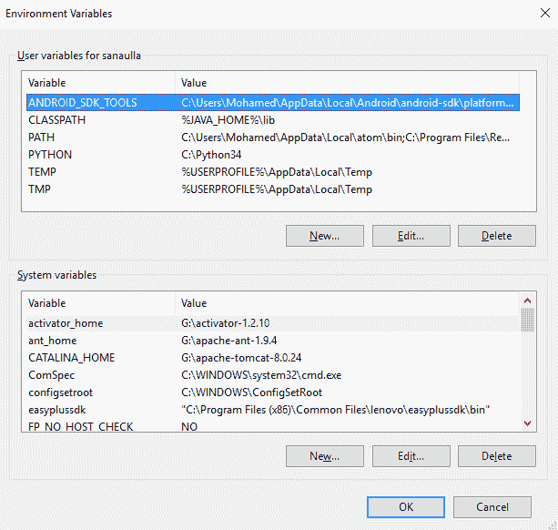
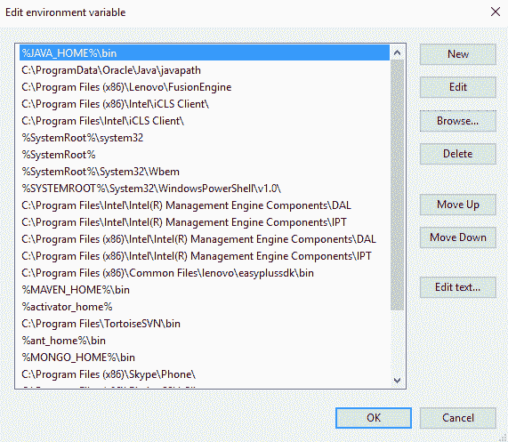
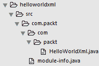

# 安装和对 Java11 的窥探

在本章中，我们将介绍以下配方：

*   在 Windows 上安装 JDK 18.9 并设置`PATH`变量
*   在 Linux（Ubuntu，x64）上安装 JDK 18.9 并配置`PATH`变量
*   编译和运行 Java 应用程序
*   JDK 18.9 的新增功能
*   使用应用程序类数据共享

# 介绍

每一次学习编程语言的探索都是从建立一个实验环境开始的。为了与这一理念保持同步，在本章中，我们将向您展示如何设置开发环境，然后运行一个简单的模块化应用程序来测试我们的安装。之后，我们将向您介绍 JDK18.9 中的新特性和工具。然后，我们将比较 JDK9、18.3 和 18.9。在本章的结尾，我们将介绍 JDK18.3 中引入的一个新特性，该特性允许应用程序类数据共享。

# 在 Windows 上安装 JDK 18.9 并设置`PATH`变量

在本教程中，我们将介绍如何在 Windows 上安装 JDK，以及如何设置`PATH`变量，以便能够从命令 Shell 中的任何位置访问 Java 可执行文件（如`javac`、`java`和`jar`）。

# 怎么做。。。

1.  访问[这里](http://jdk.java.net/11/) 并接受早期采用者许可协议，如下所示：


2.  接受许可证后，您将获得一个基于操作系统和体系结构（32/64 位）的可用 JDK 捆绑包网格。单击下载适用于 Windows 平台的相关 JDK 可执行文件（`.exe`。
3.  运行 JDK 可执行文件（`.exe`，并按照屏幕上的说明在系统上安装 JDK。
4.  如果您在安装过程中选择了所有默认值，您会发现在`C:/Program Files/Java`中安装的 JDK 为 64 位，在`C:/Program Files (x86)/Java`中安装的 JDK 为 32 位。

现在我们已经完成了 JDK 的安装，让我们看看如何设置`PATH`变量。

JDK 提供的工具，即`javac`、`java`、`jconsole`和`jlink`，可在 JDK 安装的`bin`目录中找到。有两种方法可以从命令提示符下运行这些工具：

1.  导航到安装并运行工具的目录，如下所示：

```java
 cd "C:\Program Files\Java\jdk-11\bin"
      javac -version
```

2.  将路径导出到目录，以便可以从命令提示符中的任何目录使用工具。为了实现这一点，我们必须在`PATH`环境变量中添加 JDK 工具的路径。命令提示符将在`PATH`环境变量中声明的所有位置搜索相关工具。

让我们看看如何将 JDK `bin`目录添加到`PATH`变量中：

1.  右键单击我的电脑，然后单击属性。您将看到您的系统信息。搜索高级系统设置并单击它以获得一个窗口，如以下屏幕截图所示：


2.  单击环境变量以查看系统中定义的变量。您将看到，已经定义了很多环境变量，如下面的屏幕截图所示（这些变量在不同的系统中会有所不同；在下面的屏幕截图中，有一些预定义的变量和我添加的一些变量）：



在系统变量下定义的变量可在系统的所有用户中使用，在<user name="">的用户变量下定义的变量仅对特定用户可用。</user>

3.  一个名为`JAVA_HOME`的新变量，其值作为 JDK 9 安装的位置。例如，它将是`C:\Program Files\Java\jdk-11`（64 位）或`C:\Program Files (x86)\Java\jdk-11`（32 位）：


4.  使用 JDK 安装的`bin`目录的位置（在`JAVA_HOME`环境变量中定义）更新`PATH`环境变量。如果您已经看到列表中定义的`PATH`变量，则需要选择该变量并单击编辑。如果没有看到`PATH`变量，请单击新建。
5.  上一步中的任何操作都将弹出窗口，如以下屏幕截图所示（在 Windows 10 上）：



以下屏幕截图显示了其他 Windows 版本：


6.  您可以在第一个屏幕截图中单击“新建”并插入`%JAVA_HOME%\bin`值，也可以通过添加`; %JAVA_HOME%\bin`将该值附加到变量值字段中。Windows 中的分号（`;`用于分隔给定变量名的多个值。
7.  设置完值后，打开命令提示符，运行`javac -version`。您应该能够将`javac 11-ea`视为输出。如果您没有看到它，则表示您的 JDK 安装的`bin`目录没有正确添加到`PATH`变量中。

# 在 Linux（Ubuntu，x64）上安装 JDK 18.9 并配置`PATH`变量

在本食谱中，我们将介绍如何在 Linux（Ubuntu，x64）上安装 JDK，以及如何配置`PATH`变量，以使 JDK 工具（如`javac`、`java`和`jar`可从终端内的任何位置使用。

# 怎么做。。。

1.  按照“在 Windows 上安装 JDK 18.9 并设置路径变量”配方的步骤 1 和步骤 2 进入下载页面。
2.  从下载页面复制 Linux x64 平台 JDK 的下载链接（`tar.gz`。
3.  使用`$> wget <copied link>`下载 JDK，例如`$> wget https://download.java.net/java/early_access/jdk11/26/BCL/jdk-11-ea+26_linux-x64_bin.tar.gz`。

4.  下载完成后，您应该有相关的 JDK 可用，例如，`jdk-11-ea+26_linux-x64_bin.tar.gz`。您可以使用`$> tar -tf jdk-11-ea+26_linux-x64_bin.tar.gz`列出内容。您甚至可以通过管道将其连接到`more`对输出进行分页：`$> tar -tf jdk-11-ea+26_linux-x64_bin.tar.gz | more`。
5.  使用`$> tar -xvzf jdk-11-ea+26_linux-x64_bin.tar.gz -C /usr/lib`提取`/usr/lib`下`tar.gz`文件的内容。这将把内容提取到目录`/usr/lib/jdk-11`中。然后可以使用`$> ls /usr/lib/jdk-11`列出 JDK 11 的内容。

6.  通过编辑 Linux 主目录中的`.bash_aliases`文件来更新`JAVA_HOME`和`PATH`变量：

```java
 $> vim ~/.bash_aliases
      export JAVA_HOME=/usr/lib/jdk-11
      export PATH=$PATH:$JAVA_HOME/bin
```

来源`.bashrc`文件以应用新别名：

```java
 $> source ~/.bashrc
      $> echo $JAVA_HOME
      /usr/lib/jdk-11
      $>javac -version
      javac 11-ea
      $> java -version
      java version "11-ea" 2018-09-25
 Java(TM) SE Runtime Environment 18.9 (build 11-ea+22)
 Java HotSpot(TM) 64-Bit Server VM 18.9 (build 11-ea+22, mixed 
      mode)
```

本书中的所有示例都是针对安装在 Linux（Ubuntu，x64）上的 JDK 运行的，除了我们特别提到的在 Windows 上运行的地方。我们已经尝试为这两种平台提供运行脚本。

# 编译和运行 Java 应用程序

在这个配方中，我们将编写一个非常简单的模块化`Hello world`程序来测试我们的 JDK 安装。这个简单的示例以 XML 打印`Hello world`；毕竟，这是 Web 服务的世界。

# 准备

您应该安装了 JDK，并且更新了`PATH`变量以指向 JDK 安装。

# 怎么做。。。

1.  让我们使用将序列化为 XML 的相关属性和注释定义模型对象：

```java
        @XmlRootElement
        @XmlAccessorType(XmlAccessType.FIELD) 
        class Messages{     
          @XmlElement 
          public final String message = "Hello World in XML"; 
        }
```

在前面的代码中，`@XmlRootElement`用于定义根标记，`@XmlAccessorType`用于定义标记名和标记值的源类型，`@XmlElement`用于标识 XML 中成为标记名和标记值的源。

2.  让我们使用 JAXB 将`Message`类的一个实例序列化为 XML：

```java
public class HelloWorldXml{
  public static void main(String[] args) throws JAXBException{
    JAXBContext jaxb = JAXBContext.newInstance(Messages.class);
    Marshaller marshaller = jaxb.createMarshaller();
    marshaller.setProperty(Marshaller.JAXB_FRAGMENT,Boolean.TRUE);
    StringWriter writer = new StringWriter();
    marshaller.marshal(new Messages(), writer);
    System.out.println(writer.toString());
  } 
}
```

3.  现在我们将创建一个名为`com.packt`的模块。要创建模块，我们需要创建一个名为`module-info.java`的文件，其中包含模块定义。模块定义包含模块的依赖项以及模块导出到其他模块的包：

```java
    module com.packt{
      //depends on the java.xml.bind module
      requires java.xml.bind;
      //need this for Messages class to be available to java.xml.bind
      exports  com.packt to java.xml.bind;
    }
```

我们将在第三章、“模块化编程”中详细介绍模块。但这个示例只是让您体验一下模块化编程，并测试您的 JDK 安装。

包含上述文件的目录结构如下所示：



4.  让我们编译并运行代码。在`hellowordxml`目录中，创建一个新目录，用于放置编译的类文件：

```java
      mkdir -p mods/com.packt
```

将源代码`HelloWorldXml.java`和`module-info.java`编译到`mods/com.packt`目录中：

```java
 javac -d mods/com.packt/ src/com.packt/module-info.java
      src/com.packt/com/packt/HelloWorldXml.java
```

5.  使用`java --module-path mods -m com.packt/com.packt.HelloWorldXml`运行编译后的代码。您将看到以下输出：

```java
<messages><message>Hello World in XML</message></messages>
```

如果您无法理解通过`java`或`javac`命令传递的选项，请不要担心。您将在第 3 章、“模块化编程”中了解它们。

# Java11 有什么新功能？

Java9 的发布是 Java 生态系统中的一个里程碑。在 Jigsaw 项目下开发的模块化框架成为 JavaSE 版本的一部分。另一个主要特性是 JShell 工具，它是 Java 的 REPL 工具。发行说明中列出了 [Java 9 引入的许多其他新特性](http://www.oracle.com/technetwork/java/javase/9all-relnotes-3704433.html)。

在本教程中，我们将列举并讨论 JDK18.3 和 18.9（Java10 和 Java11）引入的一些新特性。

# 准备

Java10 发行版（JDK18.3）在每年 3 月和 9 月开始为期六个月的发行周期，并采用了新的发行编号系统。它还引入了许多新功能，其中（对于应用程序开发人员）最重要的功能如下：

*   允许使用保留的`var`类型声明变量的局部变量类型推断（参见第 15 章、“Java 10 和 Java 11 编码的新方式”）
*   G1 垃圾回收器的并行完全垃圾回收，提高了最坏情况下的延迟
*   一种新方法`Optional.orElseThrow()`，现在是现有`get()`方法的首选替代方法
*   用于创建不可修改集合的新 API：`java.util`包的`List.copyOf()`、`Set.copyOf()`和`Map.copyOf()`方法以及`java.util.stream.Collectors`类的新方法：`toUnmodifiableList()`、`toUnmodifiableSet()`、`toUnmodifiableMap()`（参见第 5 章、“流和管道”）
*   一组默认的根证书颁发机构，使 OpenJDK 构建对开发人员更具吸引力
*   一个新的 Javadoc 命令行选项`--add-stylesheet`支持在生成的文档中使用多个样式表
*   扩展现有的类数据共享功能，允许将应用程序类放置在共享存档中，从而缩短启动时间并减少占用空间（请参阅“使用应用程序类数据共享”配方）

*   可以在 Linux/x64 平台上使用实验性即时编译器 Graal
*   一个干净的垃圾收集器（GC）接口，它使在不干扰当前代码库的情况下向热点添加新的 GC 变得更简单，并使从 JDK 构建中排除 GC 变得更容易
*   启用 HotSpot 在用户指定的备用内存设备（如 NVDIMM 内存模块）上分配对象堆
*   线程本地握手，用于在线程上执行回调而不执行全局 VM 安全点
*   Docker 感知：JVM 将知道它是否在 Linux 系统上的 Docker 容器中运行，并且可以提取特定于容器的配置信息，而不是查询操作系统
*   三个新的 JVM 选项，使 Docker 容器用户能够更好地控制系统内存

[请参见发行说明中 Java 10 新特性的完整列表](https://www.oracle.com/technetwork/java/javase/10-relnote-issues-4108729.html)。

我们将在下一节更详细地讨论 JDK18.9 的新特性。

# 怎么做。。。

我们选择了一些我们认为对应用程序开发人员来说最重要、最有用的特性。

# JEP 318–ε

Epsilon 是一个所谓的无操作垃圾收集器，基本上什么也不做。它的用例包括性能测试、内存压力测试和虚拟机接口测试。它还可以用于短期作业或不消耗太多内存且不需要垃圾收集的作业。

我们在第 11 章、“内存管理和调试”中的“了解低开销垃圾收集器”配方中详细讨论了此功能。

# JEP 321–HTTP 客户端（标准）

JDK 18.9 标准化了 JDK 9 中引入并在 JDK 10 中更新的孵化 HTTP API 客户端。基于`CompletableFuture`，它支持非阻塞请求和响应。新的实现是异步的，提供了更好的可跟踪数据流。

第 10 章“网络”在几个食谱中更详细地解释了这一特性。

# JEP 323–Lambda 参数的局部变量语法

Lambda 参数的局部变量语法与使用 Java11 中引入的保留`var`类型的局部变量声明的语法相同。详见第 15 章中的“对 Lambda 参数使用局部变量语法”配方、“Java 10 和 Java 11 编码的新方式”。

# JEP 333–ZGC

**Z 垃圾收集器**（**ZGC**）是一个实验性的低延迟垃圾收集器。它的暂停时间不应超过 10 毫秒，与使用 G1 收集器相比，应用程序吞吐量减少不应超过 15%。ZGC 还为将来的特性和优化奠定了基础。Linux/x64 将是第一个获得 ZGC 支持的平台。

# 新 API

标准 Java API 增加了以下几个功能：

*   `Character.toString(int codePoint)`：返回一个`String`对象，表示所提供的 Unicode 码点指定的字符：

```java
var s = Character.toString(50);
System.out.println(s);  //prints: 2

```

*   `CharSequence.compare(CharSequence s1, CharSequence s2)`：按字典顺序比较两个`CharSequence`实例。返回排序列表中第二个参数的位置与第一个参数的位置之间的差值：

```java
var i = CharSequence.compare("a", "b");
System.out.println(i);   //prints: -1

i = CharSequence.compare("b", "a");
System.out.println(i);   //prints: 1

i = CharSequence.compare("this", "that");
System.out.println(i);   //prints: 8

i = CharSequence.compare("that", "this");
System.out.println(i);   //prints: -8

```

*   `String`类的`repeat(int count)`方法：返回由`String`源值中重复的`count`次组成的`String`值：

```java
String s1 = "a";
String s2 = s1.repeat(3); //prints: aaa
System.out.println(s2);

String s3 = "bar".repeat(3);
System.out.println(s3); //prints: barbarbar

```

*   `String`类的`isBlank()`方法：如果`String`值为空或只包含空格，则返回`true`，否则返回`false`。在我们的示例中，我们将其与`isEmpty()`方法进行了对比，该方法返回`true`如果且仅当`length()`为零：

```java
String s1 = "a";
System.out.println(s1.isBlank());  //false
System.out.println(s1.isEmpty());  //false

String s2 = "";
System.out.println(s2.isBlank());  //true
System.out.println(s2.isEmpty());  //true

String s3 = "  ";
System.out.println(s3.isBlank());  //true
System.out.println(s3.isEmpty());  //false
```

*   `String`类的`lines()`方法：返回一个`Stream`对象，该对象发射从源`String`值提取的线，由线终止符分隔—`\n`、`\r`或`\r\n`：

```java
String s = "l1 \nl2 \rl3 \r\nl4 ";
s.lines().forEach(System.out::print); //prints: l1 l2 l3 l4 

```

*   `String`类的三种方法从源`String`值中删除前导空格、尾随空格或两者：

```java
String s = " a b ";
System.out.println("'" + s.strip() + "'");        // 'a b'
System.out.println("'" + s.stripLeading() + "'"); // 'a b '
System.out.println("'" + s.stripTrailing() + "'");// ' a b'

```

*   构造`java.nio.file.Path`对象的两种`Path.of()`方法：

```java
Path filePath = Path.of("a", "b", "c.txt");
System.out.println(filePath);     //prints: a/b/c.txt

try {
    filePath = Path.of(new URI("file:/a/b/c.txt"));
    System.out.println(filePath);  //prints: /a/b/c.txt
} catch (URISyntaxException e) {
    e.printStackTrace();
}
```

*   `java.util.regex.Pattern`类的`asMatchPredicate()`方法，它创建`java.util.function.Predicate`函数接口的对象，然后允许我们测试`String`值以匹配编译的模式。在下面的示例中，我们测试`String`值是否以`a`字符开头，以`b`字符结尾：

```java
Pattern pattern = Pattern.compile("^a.*z$");
Predicate<String> predicate = pattern.asMatchPredicate();
System.out.println(predicate.test("abbbbz")); // true
System.out.println(predicate.test("babbbz")); // false
System.out.println(predicate.test("abbbbx")); // false

```

# 还有更多。。。

JDK 18.9 中还引入了许多其他更改：

*   JavaEE 和 CORBA 模块被删除
*   JavaFX 从 Java 标准库中分离和删除
*   `util.jar`中的 Pack200 和 UNCAP200 工具以及 Pack200 API 已弃用
*   Nashorn JavaScript 引擎以及 JJS 工具都不推荐使用，目的是将来删除它们
*   Java 类文件格式被扩展以支持新的常量池形式`CONSTANT_Dynamic`
*   Aarch64 内部函数得到了改进，在 Aarch64 处理器 JEP 309 动态类文件常量上为`java.lang.Math`的`sin`、`cos`和`log`函数实现了新的内部函数
*   飞行记录器提供了一个低开销的数据收集框架，用于对 Java 应用程序和 HotSpot JVM 进行故障排除
*   Java 启动器现在可以运行作为单个 Java 源代码文件提供的程序，因此这些程序可以直接从源代码运行
*   通过 JVM 工具接口可以访问低开销堆评测，它提供了一种对 Java 堆分配进行采样的方法
*   **传输层安全**（**TLS**）1.3 增加了安全性并提高了性能
*   在`java.lang.Character`、`java.lang.String`、`java.awt.font.NumericShaper`、`java.text.Bidi,java.text.BreakIterator`和`java.text.Normalizer`类中支持 Unicode 版本 10.0

阅读 Java11（JDK18.9）发行说明了解更多详细信息和其他更改。

# 使用应用程序类数据共享

这个特性自 Java5 以来就存在于 Java 中。它在 Java9 中作为一个商业特性进行了扩展，不仅允许引导类，还允许将应用程序类放在 JVM 共享的归档文件中。在 Java10 中，此功能成为开放 JDK 的一部分。它减少了启动时间，并且当多个 JVM 在同一台机器上运行且部署了相同的应用程序时，减少了内存消耗。

# 准备

从共享存档加载类的优点之所以成为可能，有两个原因：

*   存储在归档文件中的类经过预处理，这意味着 JVM 内存映射也存储在归档文件中。它减少了 JVM 实例启动时类加载的开销。
*   内存区域甚至可以在同一台计算机上运行的 JVM 实例之间共享，这样就不需要在每个实例中复制相同的信息，从而减少了总体内存消耗。

新的 JVM 功能允许我们创建一个要共享的类列表，然后使用该列表创建一个共享归档，并使用共享归档将归档的类快速加载到内存中。

# 怎么做。。。

1.  默认情况下，JVM 可以使用 JDK 附带的类列表创建归档。例如，运行以下命令：

```java
java -Xshare:dump
```

它将创建一个`classes.jsa`文件的共享存档。在 Linux 系统上，此文件位于以下文件夹中：

```java
/Library/Java/JavaVirtualMachines/jdk-11.jdk/Contents/Home/lib/server
```

在 Windows 系统上，它位于以下文件夹中：

```java
C:\Program Files\Java\jdk-11\bin\server
```

如果此文件夹仅可由系统管理员访问，请以管理员身份运行该命令。

请注意，并非所有类都可以共享。例如，位于类路径上的目录中的`.class`文件和自定义类加载器加载的类不能添加到共享存档中。

2.  要告诉 JVM 使用默认共享归档，请使用以下命令：

```java
java -Xshare:on -jar app.jar
```

前面的命令将存档内容映射到固定地址。当所需的地址空间不可用时，此内存映射操作有时可能会失败。如果在使用`-Xshare:on`选项时发生这种情况，JVM 将退出并出错。或者，也可以使用`-Xshare:auto`选项，如果出于任何原因无法使用共享存档，则只需禁用该功能并从类路径加载类。

3.  创建已加载应用程序类列表的最简单方法是使用以下命令：

```java
java -XX:+UseAppCDS -XX:DumpLoadedClassList=classes.txt -jar app.jar
```

前面的命令将所有加载的类记录在`classes.txt`文件中。如果希望使应用程序加载更快，请在应用程序启动后立即停止 JVM。如果您需要它更快地加载某些类，但这些类不会在应用程序启动时自动加载，请确保执行需要这些类的用例。

4.  或者，您可以手动编辑`classes.txt`文件，并添加/删除需要放入共享存档中的任何类。自动创建此文件一次并查看其格式。它是一个简单的文本文件，每行列出一个类。
5.  创建列表后，使用以下命令生成共享存档：

```java
java -XX:+UseAppCDS -Xshare:dump -XX:SharedClassListFile=classes.txt -XX:SharedArchiveFile=app-shared.jsa --class-path app.jar
```

请注意，共享存档文件的名称不是`classes.jsa`，因此不会覆盖默认的共享存档。

6.  通过执行以下命令使用创建的存档：

```java
java -XX:+UseAppCDS -Xshare:on -XX:SharedArchiveFile=app-shared.jsa -jar app.jar
```

同样，您可以使用`-Xshare:auto`选项来避免 JVM 意外退出。

共享归档使用的效果取决于其中类的数量和应用程序的其他细节。因此，我们建议您在提交到生产中的特定类列表之前，先试验和测试各种配置。