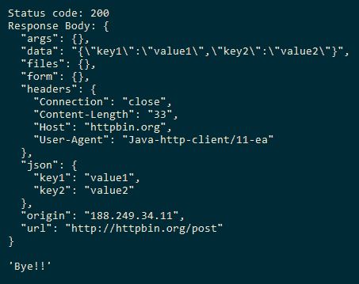
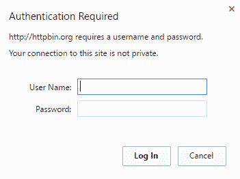
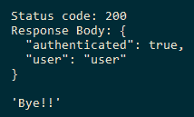
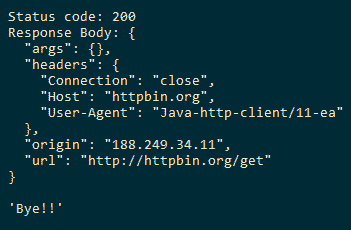
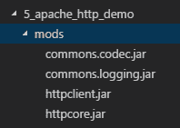
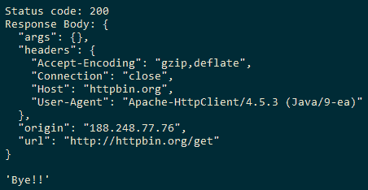

# 网络

在本章中，我们将介绍以下配方：

*   发出 HTTP GET 请求
*   发出 HTTP POST 请求
*   对受保护的资源发出 HTTP 请求
*   发出异步 HTTP 请求
*   使用 ApacheHttpClient 发出 HTTP 请求
*   使用 Unirest HTTP 客户端库发出 HTTP 请求

# 介绍

Java 对与 HTTP 特定特性交互的支持非常原始。`HttpURLConnection`类自 JDK1.1 开始提供，它提供了用于与具有 HTTP 特定功能的 URL 交互的 API。因为这个 API 在 HTTP/1.1 之前就已经存在，所以它缺乏高级特性，使用起来很麻烦。这就是为什么开发人员大多求助于使用第三方库，如**ApacheHttpClient**、SpringFramework 和 HTTPAPI。

在 JDK 9 中，在 [JEP 110](http://openjdk.java.net/jeps/110) 中引入了一个新的 HTTP 客户端 API 作为孵化器模块。同一孵化器模块已在 [JEP 321](http://openjdk.java.net/jeps/321) 中以`java.net.http`的名称提升为标准模块，这是最新 JDK 11 版本的一部分。

关于孵化器模块的一个注意事项：孵化器模块包含非最终 API，这些 API 非常大，并且不够成熟，无法包含在 JavaSE 中。这是 API 的一种 beta 版本，因此开发人员可以更早地使用 API。但问题是，在较新版本的 JDK 中，这些 API 不支持向后兼容。这意味着依赖于孵化器模块的代码可能会与较新版本的 JDK 冲突。这可能是由于孵化器模块被升级为 Java SE 或从孵化器模块中无声地删除。

在本章中，我们将介绍如何在 JDK 11 中使用 HTTP 客户机 API 的一些方法，然后介绍使用一些其他 API，如 [Apache HttpClient](http://hc.apache.org/httpcomponents-client-ga/) API 和 [Unirest Java HTTP 库](http://unirest.io/java.html)。

# 发出 HTTP GET 请求

在本配方中，我们将研究如何使用 JDK 11 HTTP 客户端 API 向[`http://httpbin.org/get`](http://httpbin.org/get)发出`GET`请求。

# 怎么做。。。

1.  使用`java.net.http.HttpClient`的生成器`java.net.http.HttpClient.Builder`创建`java.net.http.HttpClient`的实例：

```java
        HttpClient client = HttpClient.newBuilder().build();
```

2.  使用`java.net.http.HttpRequest`的生成器`java.net.http.HttpRequest.Builder`创建`java.net.http.HttpRequest`的实例。请求的 URL 应作为`java.net.URI`的实例提供：

```java
        HttpRequest request = HttpRequest
                    .newBuilder(new URI("http://httpbin.org/get"))
                    .GET()
                    .version(HttpClient.Version.HTTP_1_1)
                    .build();
```

3.  使用`java.net.http.HttpClient`的`send`API 发送 HTTP 请求。此 API 以`java.net.http.HttpRequest`为例，以`java.net.http.HttpResponse.BodyHandler`为实现：

```java
        HttpResponse<String> response = client.send(request,
                             HttpResponse.BodyHandlers.ofString());
```

4.  打印`java.net.http.HttpResponse`状态码和响应体：

```java
        System.out.println("Status code: " + response.statusCode());
        System.out.println("Response Body: " + response.body());
```

完整的代码可在`Chapter10/1_making_http_get`中找到。您可以使用运行脚本`run.bat`或`run.sh`来编译和运行代码：


# 它是如何工作的。。。

对 URL 进行 HTTP 调用有两个主要步骤：

*   创建 HTTP 客户端以启动调用
*   设置目标 URL、所需的 HTTP 头和 HTTP 方法类型，即`GET`、`POST`或`PUT`

Java HTTP 客户端 API 提供了一个构建器类`java.net.http.HttpClient.Builder`，可以同时构建`java.net.http.HttpClient`实例，利用构建器 API 设置`java.net.http.HttpClient`。下面的代码片段显示了如何使用默认配置获取`java.net.http.HttpClient`的实例：

```java
HttpClient client = HttpClient.newHttpClient();
```

以下代码段使用生成器配置并创建`java.net.http.HttpClient`的实例：

```java
HttpClient client = HttpClient
                    .newBuilder()
                    //redirect policy for the client. Default is NEVER
                    .followRedirects(HttpClient.Redirect.ALWAYS) 
                    //HTTP client version. Defabult is HTTP_2
                    .version(HttpClient.Version.HTTP_1_1)
                    //few more APIs for more configuration
                    .build();
```

构建器中有更多的 API，例如用于设置身份验证、代理和提供 SSL 上下文，我们将在不同的食谱中介绍这些 API。

设置目标 URL 无非是创建一个`java.net.http.HttpRequest`实例，使用其生成器和 API 对其进行配置。下面的代码片段显示了如何创建`java.net.http.HttpRequest`的实例：

```java
HttpRequest request = HttpRequest
                .newBuilder()
                .uri(new URI("http://httpbin.org/get")
                .headers("Header 1", "Value 1", "Header 2", "Value 2")
                .timeout(Duration.ofMinutes(5))
                .version(HttpClient.Version.HTTP_1_1)
                .GET()
                .build();
```

`java.net.http.HttpClient`对象提供两个 API 来进行 HTTP 调用：

*   您可以使用`HttpClient#send()`方式同步发送
*   您可以使用`HttpClient#sendAsync()`方法异步发送

`send()`方法接受两个参数：HTTP 请求和 HTTP 响应的处理程序。响应的处理程序由`java.net.http.HttpResponse.BodyHandlers`接口的实现表示。有几个可用的实现，例如将响应体读取为`String`的`ofString()`和将响应体读取为字节数组的`ofByteArray()`。我们将使用`ofString()`方法，该方法以字符串形式返回响应`Body`：

```java
HttpResponse<String> response = client.send(request,
                                HttpResponse.BodyHandlers.ofString());
```

`java.net.http.HttpResponse`的实例表示来自 HTTP 服务器的响应。它为以下内容提供 API：

*   获取响应主体（`body()`）
*   HTTP 头文件（`headers()`）
*   初始 HTTP 请求（`request()`）
*   响应状态代码（`statusCode()`）
*   用于请求的 URL（`uri()`

传递给`send()`方法的`HttpResponse.BodyHandlers`实现有助于将 HTTP 响应转换为兼容格式，如`String`或`byte`数组。

# 发出 HTTP POST 请求

在这个配方中，我们将看到通过请求主体将一些数据发布到 HTTP 服务。我们将把数据发布到`http://httpbin.org/post`URL。

我们将跳过类的包前缀，因为它被假定为`java.net.http`。

# 怎么做。。。

1.  使用`HttpClient.Builder`生成器创建`HttpClient`实例：

```java
        HttpClient client = HttpClient.newBuilder().build();
```

2.  创建要传递到请求正文中的所需数据：

```java
        Map<String, String> requestBody = 
                    Map.of("key1", "value1", "key2", "value2");
```

3.  创建一个`HttpRequest`对象，请求方法为 POST，请求主体数据为`String`。我们将使用 Jackson 的`ObjectMapper`将请求主体`Map<String, String>`转换为普通 JSON`String`，然后使用`HttpRequest.BodyPublishers`处理`String`请求主体：

```java
        ObjectMapper mapper = new ObjectMapper();
        HttpRequest request = HttpRequest
                   .newBuilder(new URI("http://httpbin.org/post"))
                   .POST(
          HttpRequest.BodyPublishers.ofString(
            mapper.writeValueAsString(requestBody)
          )
        )
        .version(HttpClient.Version.HTTP_1_1)
        .build();
```

4.  使用`send(HttpRequest, HttpRequest.BodyHandlers)`方法发送请求并获得响应：

```java
        HttpResponse<String> response = client.send(request, 
                             HttpResponse.BodyHandlers.ofString());
```

5.  然后打印服务器发送的响应状态代码和响应正文：

```java
        System.out.println("Status code: " + response.statusCode());
        System.out.println("Response Body: " + response.body());
```

完整的代码可在`Chapter10/2_making_http_post`中找到。确保`Chapter10/2_making_http_post/mods`中有以下杰克逊罐：

*   `jackson.databind.jar`
*   `jackson.core.jar`
*   `jackson.annotations.jar`

另外，注意模块定义`module-info.java`，可在`Chapter10/2_making_http_post/src/http.client.demo`中找到。

要了解 Jackson JARs 在该模块化代码中的使用方式，请参考第 3 章、“模块化编程”中的*自下而上迁移*和*自上而下迁移*配方。

提供运行脚本`run.bat`和`run.sh`，以方便代码的编译和执行：



# 对受保护的资源发出 HTTP 请求

在本配方中，我们将研究如何调用受用户凭据保护的 HTTP 资源。[HttpBin](http://httpbin.org/basic-auth/user/passwd) 已经受到 HTTP 基本身份验证的保护。基本身份验证要求以纯文本形式提供用户名和密码，然后 HTTP 资源使用该用户名和密码来决定用户身份验证是否成功。

如果您在浏览器中打开[这里](http://httpbin.org/basic-auth/user/passwd)，会提示您输入用户名和密码：



输入用户名为`user`和密码为`passwd`，您将被验证为显示 JSON 响应：

```java
{
  "authenticated": true,
  "user": "user"
}
```

让我们使用`HttpClient`API 实现同样的事情。

# 怎么做。。。

1.  我们需要扩展`java.net.Authenticator`并覆盖其`getPasswordAuthentication()`方法。此方法应返回一个`java.net.PasswordAuthentication`实例。让我们创建一个类`UsernamePasswordAuthenticator`，它扩展了`java.net.Authenticator`：

```java
        public class UsernamePasswordAuthenticator 
          extends Authenticator{
        }
```

2.  我们将在`UsernamePasswordAuthenticator`类中创建两个实例变量来存储用户名和密码，并提供一个构造函数来初始化它：

```java
        private String username;
        private String password;

        public UsernamePasswordAuthenticator(){}
        public UsernamePasswordAuthenticator ( String username, 
                                               String password){
          this.username = username;
          this.password = password;
        }
```

3.  然后我们将覆盖`getPasswordAuthentication()`方法，返回`java.net.PasswordAuthentication`的实例，并使用用户名和密码初始化：

```java
        @Override
        protected PasswordAuthentication getPasswordAuthentication(){
          return new PasswordAuthentication(username, 
                                            password.toCharArray());
        }
```

4.  然后我们将创建一个`UsernamePasswordAuthenticator`的实例：

```java
        String username = "user";
        String password = "passwd"; 
        UsernamePasswordAuthenticator authenticator = 
                new UsernamePasswordAuthenticator(username, password);
```

5.  我们在初始化`HttpClient`时提供`UsernamePasswordAuthenticator`的实例：

```java
        HttpClient client = HttpClient.newBuilder()
                                      .authenticator(authenticator)
                                      .build();
```

6.  创建相应的`HttpRequest`对象来调用[受保护的 HTTP 资源](http://httpbin.org/basic-auth/user/passwd)：

```java
        HttpRequest request = HttpRequest.newBuilder(new URI(
          "http://httpbin.org/basic-auth/user/passwd"
        ))
        .GET()
        .version(HttpClient.Version.HTTP_1_1)
        .build();
```

7.  我们通过执行请求获得`HttpResponse`，并打印状态码和请求正文：

```java
        HttpResponse<String> response = client.send(request,
        HttpResponse.BodyHandlers.ofString());

        System.out.println("Status code: " + response.statusCode());
        System.out.println("Response Body: " + response.body());
```

完整的代码可在`Chapter10/3_making_http_request_protected_res`中找到。您可以使用运行脚本`run.bat`或`run.sh`运行代码：



# 它是如何工作的。。。

网络调用使用`Authenticator`对象获取认证信息。开发人员通常扩展`java.net.Authenticator`类并重写其`getPasswordAuthentication()`方法。用户名和密码可从用户输入或配置中读取，并由扩展类用于创建`java.net.PasswordAuthentication`的实例。

在配方中，我们创建了`java.net.Authenticator`的扩展，如下所示：

```java
public class UsernamePasswordAuthenticator 
  extends Authenticator{
    private String username;
    private String password;

    public UsernamePasswordAuthenticator(){}

    public UsernamePasswordAuthenticator ( String username, 
                                           String password){
        this.username = username;
        this.password = password;
    }

    @Override
    protected PasswordAuthentication getPasswordAuthentication(){
      return new PasswordAuthentication(username, 
                         password.toCharArray());
    }
}
```

然后将`UsernamePasswordAuthenticator`的实例提供给`HttpClient.Builder`API。`HttpClient` 实例在调用受保护的 HTTP 请求时使用此验证器获取用户名和密码。

# 发出异步 HTTP 请求

在本食谱中，我们将了解如何发出异步`GET`请求。在异步请求中，我们不等待响应；相反，只要客户端接收到响应，我们就处理它。在 jQuery 中，我们将发出一个异步请求并提供一个负责处理响应的回调，而在 Java 中，我们得到一个实例`java.util.concurrent.CompletableFuture`，然后调用`thenApply`方法来处理响应。让我们看看这一行动。

# 怎么做。。。

1.  使用`HttpClient`的生成器`HttpClient.Builder`创建`HttpClient`的实例：

```java
        HttpClient client = HttpClient.newBuilder().build();
```

2.  使用`HttpRequest.Builder`生成器创建`HttpRequest`的实例，表示要使用的 URL 和相应的 HTTP 方法：

```java
        HttpRequest request = HttpRequest
                        .newBuilder(new URI("http://httpbin.org/get"))
                        .GET()
                        .version(HttpClient.Version.HTTP_1_1)
                        .build();
```

3.  使用`sendAsync`方法发出异步 HTTP 请求，并保留对我们获得的`CompletableFuture<HttpResponse<String>>`对象的引用。我们将使用它来处理响应：

```java
        CompletableFuture<HttpResponse<String>> responseFuture = 
                  client.sendAsync(request, 
                         HttpResponse.BodyHandlers.ofString());
```

4.  我们提供`CompletionStage`以在前一阶段完成后处理响应。为此，我们使用了采用 lambda 表达式的`thenAccept`方法：

```java
        CompletableFuture<Void> processedFuture = 
                   responseFuture.thenAccept(response -> {
          System.out.println("Status code: " + response.statusCode());
          System.out.println("Response Body: " + response.body());
        });
```

5.  等待将来完成：

```java
        CompletableFuture.allOf(processedFuture).join();
```

此配方的完整代码可在`Chapter10/4_async_http_request`中找到。我们提供了`run.bat`和`run.sh`脚本来编译和运行配方：



# 使用 ApacheHttpClient 发出 HTTP 请求

在这个配方中，我们将使用 [ApacheHttpClient](https://hc.apache.org/httpcomponents-client-4.5.x/index.html) 库来进行一个简单的 HTTP`GET`请求。当我们使用 Java9 时，我们希望使用模块路径而不是类路径。因此，我们需要模块化 ApacheHttpClient 库。实现这一点的一种方法是使用自动模块的概念。让我们看看如何设置配方的依赖项。

# 准备

`Chapter10/5_apache_http_demo/mods`中已经存在所有需要的JAR：



一旦这些 JAR 位于模块路径上，我们就可以在`module-info.java`中声明对这些 JAR 的依赖关系，该依赖关系出现在`Chapter10/5_apache_http_demo/src/http.client.demo`中，如下面的代码片段所示：

```java
module http.client.demo{
  requires httpclient;
  requires httpcore;
  requires commons.logging;
  requires commons.codec;
}
```

# 怎么做。。。

1.  使用`org.apache.http.impl.client.HttpClients`工厂创建`org.http.client.HttpClient`的默认实例：

```java
        CloseableHttpClient client = HttpClients.createDefault();
```

2.  创建一个`org.apache.http.client.methods.HttpGet`的实例以及所需的 URL。这表示 HTTP 方法类型和请求的 URL：

```java
        HttpGet request = new HttpGet("http://httpbin.org/get");
```

3.  使用`HttpClient`实例执行 HTTP 请求，获取`CloseableHttpResponse`实例：

```java
        CloseableHttpResponse response = client.execute(request);
```

执行 HTTP 请求后返回的`CloseableHttpResponse`实例可用于获取`HttpEntity`实现实例中嵌入的响应状态码等响应内容的详细信息。

4.  我们利用`EntityUtils.toString()`获取嵌入`HttpEntity`实现实例中的响应体，并打印状态码和响应体：

```java
        int statusCode = response.getStatusLine().getStatusCode();
        String responseBody = 
                       EntityUtils.toString(response.getEntity());
        System.out.println("Status code: " + statusCode);
        System.out.println("Response Body: " + responseBody);
```

此配方的完整代码可在`Chapter10/5_apache_http_demo`中找到。我们提供了`run.bat`和`run.sh`来编译和执行配方代码：



# 还有更多。。。

我们可以在调用`HttpClient.execute`方法时提供一个自定义响应处理程序，如下所示：

```java
String responseBody = client.execute(request, response -> {
  int status = response.getStatusLine().getStatusCode();
  HttpEntity entity = response.getEntity();
  return entity != null ? EntityUtils.toString(entity) : null;
});
```

在本例中，响应由响应处理程序处理并返回响应体字符串。完整的代码可在`Chapter10/5_1_apache_http_demo_response_handler`中找到。

# 使用 Unirest HTTP 客户端库发出 HTTP 请求

在这个配方中，我们将使用 [Unirest HTTP](http://unirest.io/java.html) 访问 HTTP 服务的 Java 库。UnirestJava 是一个基于 Apache 的 HTTP 客户端库的库，它提供了一个用于发出 HTTP 请求的流畅 API。

# 准备

由于 Java 库不是模块化的，我们将使用自动模块的概念，如第 3 章、“模块化编程”中所述。属于库的 JAR 被放置在应用程序的模块路径上，然后应用程序通过使用 JAR 的名称作为其模块名来声明对 JAR 的依赖关系。这样，JAR 文件自动成为一个模块，因此称为自动模块。

Java 库的 Maven 依赖项如下所示：

```java
<dependency>
  <groupId>com.mashape.unirest</groupId>
  <artifactId>unirest-java</artifactId>
  <version>1.4.9</version>
</dependency>
```

由于我们的示例中没有使用 Maven，因此我们已将 JAR 下载到`Chapter10/6_unirest_http_demo/mods`文件夹中。

模块定义如下：

```java
module http.client.demo{
  requires httpasyncclient;
  requires httpclient;
  requires httpmime;
  requires json;
  requires unirest.java;
  requires httpcore;
  requires httpcore.nio;
  requires commons.logging;
  requires commons.codec;
}
```

# 怎么做。。。

Unirest 为进行 HTTP 请求提供了一个非常流畅的 API。我们可以提出如下`GET`请求：

```java
HttpResponse<JsonNode> jsonResponse = 
  Unirest.get("http://httpbin.org/get")
         .asJson();
```

可从`jsonResponse`对象获取响应状态和响应体，如下所示：

```java
int statusCode = jsonResponse.getStatus();
JsonNode jsonBody = jsonResponse.getBody();
```

我们可以发出`POST`请求并传递一些数据，如下所示：

```java
jsonResponse = Unirest.post("http://httpbin.org/post")
                      .field("key1", "val1")
                      .field("key2", "val2")
                      .asJson();
```

我们可以调用受保护的 HTTP 资源，如下所示：

```java
jsonResponse = Unirest.get("http://httpbin.org/basic-auth/user/passwd")
                      .basicAuth("user", "passwd")
                      .asJson();
```

此代码可在`Chapter10/6_unirest_http_demo`中找到。

我们提供了`run.bat`和`run.sh`脚本来执行代码。

# 还有更多。。。

UnirestJava 库提供了更高级的功能，如异步请求、文件上传和使用代理。建议您试用图书馆的这些不同功能。