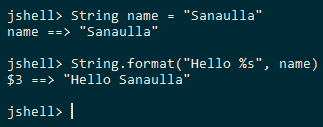
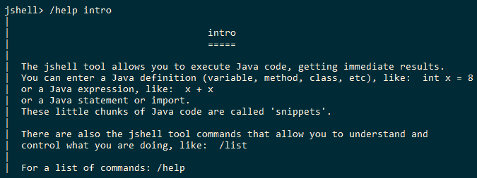
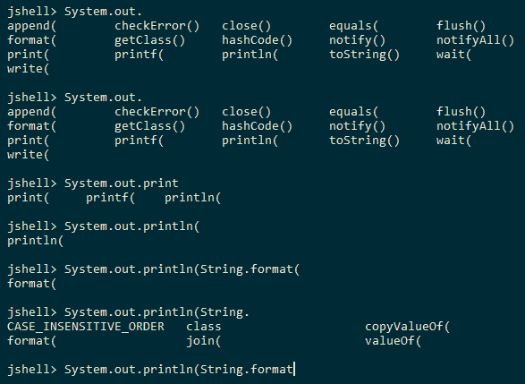
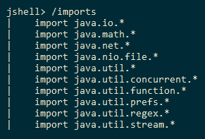
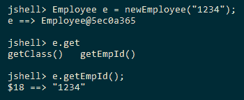
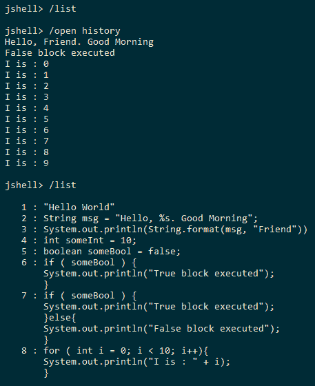

# 使用JShell的读取-计算打印循环（REPL）

在本章中，我们将介绍以下配方：

*   熟悉REPL
*   导航JShell及其命令
*   评估代码片段
*   JShell中的面向对象编程
*   保存和恢复JShell命令历史记录
*   使用JShellJavaAPI

# 介绍

**REPL**代表**读取评估打印循环**，如名称所示，它读取在命令行上输入的命令，对其进行评估，打印评估结果，并对输入的任何命令继续此过程。

所有主要语言，如Ruby、Scala、Python、JavaScript和Groovy，都有REPL工具。Java缺少急需的REPL。如果我们必须尝试一些示例代码，比如说使用`SimpleDateFormat`解析字符串，我们必须编写一个包含所有仪式的完整程序，包括创建一个类、添加一个主方法，然后是我们想要尝试的一行代码。然后，我们必须编译并运行代码。这些仪式使得实验和学习语言的特点变得更加困难。

使用REPL，您只能键入您感兴趣的代码行，并且您将立即得到有关表达式语法是否正确以及是否给出所需结果的反馈。REPL是一个非常强大的工具，特别是对于第一次使用这种语言的人来说。假设您想展示如何用Java打印*Hello World*；为此，您必须开始编写类定义，然后编写`public static void main(String [] args)`方法，最后，您将解释或尝试解释许多新手难以理解的概念。

无论如何，有了Java9和更高版本，Java开发人员现在可以不再抱怨没有REPL工具了。一个名为JShell的新REPL正在与JDK安装捆绑在一起。因此，我们现在可以自豪地编写*Hello World*作为我们的第一个*Hello World*代码。

在本章中，我们将探索JShell的特性，并编写真正让我们感到惊讶和欣赏REPL功能的代码。我们还将看到如何使用JShellJavaAPI创建自己的REPL。

# 熟悉REPL

在本教程中，我们将介绍一些基本操作，以帮助我们熟悉JShell工具。

# 准备

确保安装了最新的JDK版本，其中包含JShell。JShell从JDK 9开始提供。

# 怎么做。。。

1.  您应该将`%JAVA_HOME%/bin`（在Windows上）或`$JAVA_HOME/bin`（在Linux上）添加到您的`PATH`变量中。如果没有，请访问*在Windows上安装JDK 18.9并设置路径变量*和*在Linux（Ubuntu，x64）上安装JDK 18.9并在[第一章](01.html)*中配置路径变量*配方、*安装和偷窥Java 11*。*
2.  在命令行上，键入`jshell`并按*输入*。

3.  您将看到一条消息和一个`jshell>`提示：


4.  正斜杠**`/`**、**后跟JShell支持的命令，帮助您与JShell交互。就像我们尝试`/help intro`获得以下内容：**

 **

5.  让我们打印一条`Hello World`消息：


6.  让我们打印一条定制的`Hello World`消息：



7.  您可以使用向上和向下箭头键浏览已执行的命令。

# 它是如何工作的。。。

在`jshell`提示符处输入的代码片段被包装成刚好足够执行它们的代码。因此，变量、方法和类声明被包装在类中，表达式被包装在方法中，而方法又被包装在类中。其他东西，例如导入和类定义，保持原样是因为它们是顶级实体，也就是说，不需要在另一个类中包装类定义，因为类定义是可以自身存在的顶级实体。类似地，在Java中，import语句可以自己出现，它们出现在类声明之外，因此不需要包装在类中。

在接下来的菜谱中，我们将看到如何定义方法、导入其他包和定义类。

在前面的配方中，我们看到了`$1 ==> "Hello World"`。如果我们有一个没有任何相关变量的值，`jshell`会给它一个变量名，比如`$1`或`$2`。

# 导航JShell及其命令

为了利用工具，我们需要熟悉如何使用它，它提供的命令，以及我们可以用来提高效率的各种快捷键。在本教程中，我们将介绍在JShell中导航的不同方式，以及在使用JShell时提供的不同快捷键。

# 怎么做。。。

1.  通过在命令行上键入`jshell`生成JShell。您将收到一条欢迎信息，其中包含入门说明。

2.  键入`/help intro`获取JShell的简要介绍：



3.  键入`/help`以获取支持的命令列表：


4.  要获取有关命令的更多信息，请键入`/help <command>`。例如，要获取关于`/edit`的信息，请键入`/help /edit`：


5.  JShell中支持自动完成。这使Java开发人员感到宾至如归。您可以使用*选项卡*键调用自动完成：



6.  您可以使用`/!`执行先前执行的命令，`/line_number`在行号处重新执行表达式。
7.  要在命令行中导航光标，请使用*Ctrl*+*A*到达行的开头，使用*Ctrl*+*E*到达行的结尾。

# 评估代码片段

在此配方中，我们将查看执行以下代码段：

*   导入语句
*   类声明
*   接口声明
*   方法声明
*   字段声明
*   声明

# 怎么做。。。

1.  打开命令行并启动JShell。
2.  默认情况下，JShell导入一些库。我们可以通过发出`/imports`命令来检查：



3.  让我们通过发出`import java.text.SimpleDateFormat`命令来导入`java.text.SimpleDateForm`。这将导入`SimpleDateFormat`类。
4.  让我们宣布一个`Employee`类。我们将在每一行中发布一条语句，这样它就是一条不完整的语句，我们将以与任何普通编辑器相同的方式进行处理。下图将阐明这一点：

```
        class Employee{
          private String empId;
          public String getEmpId() {
            return empId;
          }
          public void setEmpId ( String empId ) {
            this.empId = empId;
          }
        }

```

您将获得以下输出：


5.  让我们声明一个`Employability`接口，它定义了一个方法`employable()`，如下面的代码片段所示：

```
        interface Employability { 
          public boolean employable();
        }
```

前面的界面通过`jshell`创建时，如下图所示：


6.  让我们声明一个`newEmployee(String empId)`方法，它用给定的`empId`构造一个`Employee`对象：

```
        public Employee newEmployee(String empId ) {
          Employee emp = new Employee();
          emp.setEmpId(empId);
          return emp;
        }
```

JShell中定义的上述方法如下所示：


7.  我们将使用上一步中定义的方法创建一个声明`Employee`变量的语句：

```
        Employee e = newEmployee("1234");
```

下面的屏幕截图显示了前面的语句及其在JShell中执行时的输出。代码段`e.get + Tab`键生成IDE支持的自动完成：



# 还有更多。。。

我们可以调用一个未定义的方法。请看以下示例：

```
public void newMethod(){
  System.out.println("New  Method");
  undefinedMethod();
}
```

下图显示了`newMethod()`调用`undefinedMethod()`的定义：


但是，在定义所使用的方法之前，无法调用该方法：

```
public void undefinedMethod(){
  System.out.println("Now defined");
}
```

下图显示了正在定义的方法`undefinedMethod()`，然后可以成功调用`newMethod()`：


只有在定义了`undefinedMethod()`之后才能调用`newMethod()`。

# JShell中的面向对象编程

在这个方法中，我们将使用预定义的Java类定义文件，并将它们导入JShell。然后，我们将在JShell中使用这些类。

# 怎么做。。。

1.  我们将在本食谱中使用的类定义文件在本书的代码下载中的`Chapter12/4_oo_programming`中提供。
2.  有三个类定义文件：`Engine.java`、`Dimensions.java`和`Car.java`。
3.  导航到这三个类定义文件所在的目录。
4.  `/open`命令允许我们从文件中加载代码。
5.  加载`Engine`类定义并创建`Engine`对象：


6.  加载`Dimensions`类定义并创建`Dimensions`对象：


7.  加载`Car`类定义并创建`Car`对象：


# 保存和恢复JShell命令历史记录

我们想在`jshell`中尝试一些代码片段，作为向新手解释Java编程的一种方法。此外，某种形式的代码片段执行记录对于学习该语言的人来说非常有用。

在这个配方中，我们将执行一些代码片段并将它们保存到一个文件中。然后，我们将从保存的文件中加载代码段。

# 怎么做。。。

1.  让我们执行一系列代码片段，如下所示：

```
        "Hello World"
        String msg = "Hello, %s. Good Morning"
        System.out.println(String.format(msg, "Friend"))
        int someInt = 10
        boolean someBool = false
        if ( someBool ) {
          System.out.println("True block executed");
        }
        if ( someBool ) {
          System.out.println("True block executed");
        }else{
          System.out.println("False block executed");
        }
        for ( int i = 0; i < 10; i++ ){
          System.out.println("I is : " + i );
        }
```

您将获得以下输出：


2.  使用`/save history`命令将执行的代码片段保存到名为`history`的文件中。
3.  使用`/exit`退出shell，并根据操作系统的不同，使用`dir`或`ls`列出目录中的文件。列表中将有一个`history`文件。
4.  打开`jshell`并检查使用`/list`执行的代码段的历史记录。您将看到没有执行任何代码段。
5.  使用`/open history`加载`history`文件，然后检查使用`/list`执行的代码段的历史记录。您将看到正在执行并添加到历史记录中的所有以前的代码段：



# 使用JShellJavaAPI

JDK 11提供了Java API，用于创建用于评估Java代码片段的工具，如`jshell`。此Java API存在于`jdk.jshell`模块（[中http://cr.openjdk.java.net/~rfield/arch/doc/jdk/jshell/package-summary.html](http://cr.openjdk.java.net/~rfield/arch/doc/jdk/jshell/package-summary.html)。因此，如果您想在应用程序中使用API，则需要声明对`jdk.jshell`模块的依赖关系。

在这个方法中，我们将使用JShellJDKAPI来评估简单的代码片段，您还将看到不同的API来获取JShell的状态。这个想法不是要重新创建JShell，而是要展示如何使用它的JDKAPI。

对于这个配方，我们不会使用JShell；相反，我们将遵循使用`javac`编译和使用`java`运行的常规方法。

# 怎么做。。。

1.  我们的模块将依赖于`jdk.jshell`模块。因此，模块定义如下所示：

```
        module jshell{
          requires jdk.jshell;
        }
```

2.  使用`create()`方法或`jdk.jshell.JShell.Builder`中的生成器API创建`jdk.jshell.JShell`类的实例：

```
        JShell myShell = JShell.create();
```

3.  使用`java.util.Scanner`阅读`System.in`中的代码片段：

```
        try(Scanner reader = new Scanner(System.in)){
          while(true){
            String snippet = reader.nextLine();
            if ( "EXIT".equals(snippet)){
              break;
            }
          //TODO: Code here for evaluating the snippet using JShell API
          }
        }
```

4.  使用`jdk.jshell.JShell#eval(String snippet)`方法评估输入。评估将产生一个`jdk.jshell.SnippetEvent`列表，其中包含评估的状态和输出。前面代码段中的`TODO`将替换为以下行：

```
        List<SnippetEvent> events = myShell.eval(snippet);
        events.stream().forEach(se -> {
          System.out.print("Evaluation status: " + se.status());
          System.out.println(" Evaluation result: " + se.value());
        });
```

5.  评估完成后，我们将打印使用`jdk.jshell.JShell.snippets()`方法处理的片段，该方法将返回`Snippet`处理的`Stream`。

```
        System.out.println("Snippets processed: ");
        myShell.snippets().forEach(s -> {
          String msg = String.format("%s -> %s", s.kind(), s.source());
          System.out.println(msg);
        });
```

6.  同样，我们可以打印活动方法和变量，如下所示：

```
        System.out.println("Methods: ");
        myShell.methods().forEach(m -> 
          System.out.println(m.name() + " " + m.signature()));

        System.out.println("Variables: ");
        myShell.variables().forEach(v -> 
          System.out.println(v.typeName() + " " + v.name()));
```

7.  在应用程序退出之前，我们通过调用`JShell`实例的`close()`方法关闭`JShell`实例：

```
        myShell.close();
```

此配方的代码可在`Chapter12/6_jshell_api`中找到。您可以使用同一目录中可用的`run.bat`或`run.sh`脚本来运行该示例。示例执行和输出如下所示：


# 它是如何工作的。。。

API中的中心类是`jdk.jshell.JShell`类。此类是求值状态引擎，其状态随代码段的每次求值而修改。正如我们前面看到的，代码片段是使用`eval(String snippet)`方法进行评估的。我们甚至可以使用`drop(Snippet snippet)`方法删除先前评估的代码段。这两种方法都会导致`jdk.jshell.JShell`维持的内部状态发生变化。

传递给`JShell`评估引擎的代码片段分类如下：

*   **错误**：语法输入错误
*   **表达式**：可能产生或不产生某些输出的输入
*   **进口**：进口对账单
*   **方法**：方法声明
*   **声明**：声明
*   **类型声明**：一种类型，即类/接口声明
*   **变量声明**：变量声明

所有这些类别都包含在`jdk.jshell.Snippet.Kind`枚举中。

我们还看到了不同的API来执行经过评估的代码段、创建的方法、变量声明和其他特定的代码段类型。每个代码段类型都有一个扩展`jdk.jshell.Snippet`类的类作为支持。**