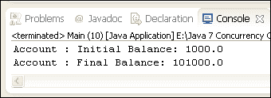
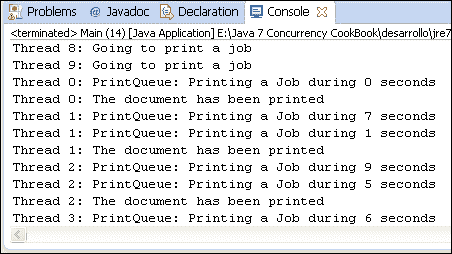

# 二、线程基本同步

在本章中，我们将介绍：

*   同步方法
*   在同步类中排列独立属性
*   在同步代码中使用条件
*   将代码块与锁同步
*   使用读/写锁同步数据访问
*   修改锁公平性
*   在锁中使用多个条件

# 导言

并发编程中最常见的情况之一是多个执行线程共享一个资源。在并发应用中，多个线程读取或写入相同的数据或访问相同的文件或数据库连接是正常的。这些共享资源可能引发错误情况或数据不一致，我们必须实现避免这些错误的机制。

这些问题的解决方案来自于**临界截面**的概念。关键部分是访问共享资源的代码块，不能由多个线程同时执行。

为了帮助程序员实现关键部分，Java（以及几乎所有编程语言）提供了**同步**机制。当一个线程想要访问一个关键部分时，它会使用其中一个同步机制来确定是否有其他线程执行该关键部分。否则，螺纹进入临界段。否则，线程将被同步机制挂起，直到执行临界段的线程结束它。当多个线程正在等待一个线程完成一个关键部分的执行时，JVM 会选择其中一个线程，其余线程等待轮到它们执行。

本章介绍了一些方法，教您如何使用 Java 语言提供的两种基本同步机制：

*   关键词`synchronized`
*   `Lock`接口及其实现

# 同步方法

在本食谱中，我们将学习如何使用 Java 中最基本的同步方法之一，即使用`synchronized`关键字来控制对方法的并发访问。只有一个执行线程将访问使用`synchronized`关键字声明的对象的其中一个方法。如果另一个线程试图访问使用同一对象的`synchronized`关键字声明的任何方法，它将被挂起，直到第一个线程完成该方法的执行。

换句话说，每个用`synchronized`关键字声明的方法都是一个关键部分，Java 只允许执行对象的一个关键部分。

静态方法具有不同的行为。只有一个执行线程将访问使用`synchronized`关键字声明的一个静态方法，但另一个线程可以访问该类对象的其他非静态方法。在这一点上你必须非常小心，因为两个线程可以访问两个不同的`synchronized`方法，如果一个是静态的，另一个不是。如果两种方法更改相同的数据，则可能会出现数据不一致错误。

为了学习这个概念，我们将实现一个示例，其中两个线程访问一个公共对象。我们将有一个银行账户和两个线程；一个向账户转账的人和另一个从账户取款的人。如果没有同步方法，我们可能会得到错误的结果。同步机制确保帐户的最终余额是正确的。

## 准备好了吗

此配方的示例已使用 EclipseIDE 实现。如果您使用 Eclipse 或其他 IDE（如 NetBeans），请打开它并创建一个新的 Java 项目。

## 怎么做。。。

按照以下步骤来实现该示例：

1.  创建一个名为`Account`的类，该类将模拟我们的银行帐户。它只有一个`double`属性，名为`balance`。

    ```java
    public class Account {
          private double balance;
    ```

2.  执行`setBalance()`和`getBalance()`方法写入和读取属性值。

    ```java
      public double getBalance() {
        return balance;
      }

      public void setBalance(double balance) {
        this.balance = balance;
      }
    ```

3.  实现一个名为`addAmount()`的方法，该方法将余额的值增加一定量，并传递给该方法。只有一个线程应该更改余额的值，因此使用`synchronized`关键字将此方法转换为临界部分。

    ```java
      public synchronized void addAmount(double amount) {
        double tmp=balance;
        try {
          Thread.sleep(10);
        } catch (InterruptedException e) {
          e.printStackTrace();
        }
        tmp+=amount;
        balance=tmp;
      }
    ```

4.  实现一个名为`subtractAmount()`的方法，该方法将余额的值递减一定量，并传递给该方法。只有一个线程应该更改余额的值，因此使用`synchronized`关键字将此方法转换为临界部分。

    ```java
      public synchronized void subtractAmount(double amount) {
        double tmp=balance;
        try {
          Thread.sleep(10);
        } catch (InterruptedException e) {
          e.printStackTrace();
        }
        tmp-=amount;
        balance=tmp;
      }
    ```

5.  实现一个模拟 ATM 的类。它将使用`subtractAmount()`方法减少账户余额。此类必须实现要作为线程执行的`Runnable`接口。

    ```java
    public class Bank implements Runnable {
    ```

6.  向该类添加一个`Account`对象。实现初始化该`Account`对象的类的构造函数。

    ```java
      private Account account;

      public Bank(Account account) {
        this.account=account;
      }
    ```

7.  执行`run()`方法。它对账户的`subtractAmount()`方法进行`100`调用，以减少余额。

    ```java
      @Override
       public void run() {
        for (int i=0; i<100; i++){
          account.sustractAmount(1000);
        }
      }
    ```

8.  实现一个模拟公司的类，使用`Account`类的`addAmount()`方法增加账户余额。此类必须实现要作为线程执行的`Runnable`接口。

    ```java
    public class Company implements Runnable {
    ```

9.  将`Account`对象添加到此类。实现初始化 account 对象的类的构造函数。

    ```java
      private Account account;

      public Company(Account account) {
        this.account=account;
      }
    ```

10.  执行`run()`方法。它通过`100`调用账户的`addAmount()`方法来增加余额。

    ```java
      @Override
       public void run() {
        for (int i=0; i<100; i++){
          account.addAmount(1000);
        }
      }
    ```

11.  通过创建一个名为`Main`的类来实现应用的主类，该类包含`main()`方法。

    ```java
    public class Main {

      public static void main(String[] args) {
    ```

12.  创建一个`Account`对象，并将其余额初始化为`1000`。

    ```java
        Account  account=new Account();
        account.setBalance(1000);
    ```

13.  创建一个`Company`对象并`Thread`运行它。

    ```java
        Company  company=new Company(account);
        Thread companyThread=new Thread(company);  
    ```

14.  创建一个`Bank`对象并`Thread`运行它。

    ```java
        Bank bank=new Bank(account);
        Thread bankThread=new Thread(bank);
    ```

15.  将初始余额写入控制台。

    ```java
        System.out.printf("Account : Initial Balance: %f\n",account.getBalance());
    Start the threads.
        companyThread.start();
        bankThread.start();
    ```

16.  使用`join()`方法等待两个线程完成，并在控制台中打印帐户的最终余额。

    ```java
        try {
          companyThread.join();
          bankThread.join();
          System.out.printf("Account : Final Balance: %f\n",account.getBalance());
        } catch (InterruptedException e) {
          e.printStackTrace();
        }
    ```

## 它是如何工作的。。。

在这个配方中，您已经开发了一个应用，可以对模拟银行账户的类的余额进行增减。程序对`addAmount()`方法进行`100`调用，该方法在每次调用中将余额增加`1000`，并对`subtractAmount()`方法进行`100`调用，该方法在每次调用中将余额减少`1000`。您应该期望最终余额和初始余额相等。

您试图使用名为`tmp`的变量来存储帐户余额的值，从而强制出现错误情况，因此您读取帐户余额，增加时间变量的值，然后再次建立帐户余额的值。此外，您使用`Thread`类的`sleep()`方法引入了一点延迟，将执行该方法的线程休眠 10 毫秒，因此如果另一个线程执行该方法，它可以修改引发错误的帐户余额。是`synchronized`关键字机制避免了这些错误。

如果您想查看并发访问共享数据的问题，请删除`addAmount()`和`subtractAmount()`方法的`synchronized`关键字并运行程序。如果没有`synchronized`关键字，当线程在读取帐户余额值后处于休眠状态时，另一个方法将读取帐户余额，因此两个方法都将修改相同的余额，并且其中一个操作不会反映在最终结果中。

正如您在以下屏幕截图中所看到的，您可能会得到不一致的结果：



如果你经常运行这个程序，你会得到不同的结果。JVM 不能保证线程的执行顺序。因此，每次执行它们时，线程将以不同的顺序读取和修改帐户余额，因此最终结果将不同。

现在，按照之前的学习添加`synchronize`关键字，然后再次运行程序。正如您在下面的屏幕截图中所看到的，现在您获得了预期的结果。如果你经常运行这个程序，你会得到同样的结果。请参阅以下屏幕截图：


使用`synchronized`关键字，我们保证在并发应用中正确访问共享数据。

正如我们在这个配方的介绍中提到的，只有线程才能访问在声明中使用`synchronized`关键字的对象的方法。如果一个线程（a）正在执行一个`synchronized`方法，而另一个线程（B）想要执行同一对象的其他`synchronized`方法，它将被阻塞，直到线程（a）结束。但如果 threadB 可以访问同一类的不同对象，则不会阻止任何对象。

## 还有更多。。。

`synchronized`关键字会影响应用的性能，因此您只能在并发环境中修改共享数据的方法上使用它。如果有多个线程调用`synchronized`方法，则一次只有一个线程执行它们，而其他线程将等待。如果操作不使用`synchronized`关键字，则所有线程可以同时执行该操作，从而减少总执行时间。如果您知道一个方法不会被多个线程调用，请不要使用`synchronized`关键字。

您可以将递归调用与`synchronized`方法一起使用。由于线程可以访问对象的`synchronized`方法，因此可以调用该对象的其他`synchronized`方法，包括正在执行的方法。它不必再次访问`synchronized`方法。

我们可以使用`synchronized`关键字来保护对代码块的访问，而不是对整个方法的访问。我们应该以这种方式使用`synchronized`关键字来保护对共享数据的访问，将其余操作排除在该块之外，从而获得更好的应用性能。目标是使关键部分（一次只能由一个线程访问的代码块）尽可能短。我们使用了`synchronized`关键字来保护对更新大楼中人数的指令的访问，省去了该块不使用共享数据的长时间操作。以这种方式使用`synchronized`关键字时，必须将对象引用作为参数传递。只有一个线程可以访问该对象的`synchronized`代码（块或方法）。通常，我们将使用`this`关键字引用正在执行该方法的对象。

```java
    synchronized (this) {
      // Java code
    }
```

# 在同步类中排列独立属性

使用关键字`synchronized`保护代码块时，必须将对象引用作为参数传递。通常，您将使用`this`关键字引用执行该方法的对象，但您可以使用其他对象引用。通常，将专门为此目的创建这些对象。例如，如果一个类中有两个独立的属性由多个线程共享，则必须同步对每个变量的访问，但如果一个线程访问其中一个属性，而另一个线程同时访问另一个属性，则没有问题。

在本食谱中，您将学习如何通过一个示例来解决这种情况，该示例模拟了一个具有两个屏幕和两个售票处的电影院。当售票处售票时，它们是两个电影院中的一个，但不是两个都有，因此每个电影院的免费座位数是独立的属性。

## 准备好了吗

此配方的示例已使用 EclipseIDE 实现。如果您使用 Eclipse 或其他 IDE（如 NetBeans），请打开它并创建一个新的 Java 项目。

## 怎么做。。。

按照以下步骤来实现该示例：

1.  创建一个名为`Cinema`的类，并向其添加两个名为`vacanciesCinema1`和`vacanciesCinema2`的`long`属性。

    ```java
    public class Cinema {

      private long vacanciesCinema1;
      private long vacanciesCinema2;
    ```

2.  在`Cinema`类中添加两个名为`controlCinema1`和`controlCinema2`的额外`Object`属性。

    ```java
      private final Object controlCinema1, controlCinema2;
    ```

3.  实现初始化类的所有属性的`Cinema`类的构造函数。

    ```java
      public Cinema(){
        controlCinema1=new Object();
        controlCinema2=new Object();
        vacanciesCinema1=20;
        vacanciesCinema2=20;
      }
    ```

4.  实现第一家影院的部分门票售出时调用的`sellTickets1()`方法。它使用`controlCinema1`对象控制对`synchronized`代码块的访问。

    ```java
      public boolean sellTickets1 (int number) {
        synchronized (controlCinema1) {
          if (number<vacanciesCinema1) {
            vacanciesCinema1-=number;
            return true;
          } else {
            return false;
          }
        }
      }
    ```

5.  实现第二家影院的部分门票售出时调用的`sellTickets2()`方法。它使用`controlCinema2`对象控制对`synchronized`代码块的访问。

    ```java
      public boolean sellTickets2 (int number){
        synchronized (controlCinema2) {
          if (number<vacanciesCinema2) {
            vacanciesCinema2-=number;
            return true;
          } else {
            return false;
          }
        }
      }
    ```

6.  实现返回第一家影院的一些票时调用的`returnTickets1()`方法。它使用`controlCinema1`对象控制对`synchronized`代码块的访问。

    ```java
      public boolean returnTickets1 (int number) {
        synchronized (controlCinema1) {
          vacanciesCinema1+=number;
          return true;
        }
      }
    ```

7.  实现返回第二家影院的一些票时调用的`returnTickets2()`方法。它使用`controlCinema2`对象控制对`synchronized`代码块的访问。

    ```java
      public boolean returnTickets2 (int number) {
        synchronized (controlCinema2) {
          vacanciesCinema2+=number;
          return true;
        }
      }
    ```

8.  实现另外两种返回每家影院空位数的方法。

    ```java
      public long getVacanciesCinema1() {
        return vacanciesCinema1;
      }

      public long getVacanciesCinema2() {
        return vacanciesCinema2;
      }
    ```

9.  实现类`TicketOffice1`并指定它实现`Runnable`接口。

    ```java
    public class TicketOffice1 implements Runnable {
    ```

10.  声明一个`Cinema`对象并实现初始化该对象的类的构造函数。

    ```java
      private Cinema cinema;

      public TicketOffice1 (Cinema cinema) {
        this.cinema=cinema;
      }
    ```

11.  实施`run()`方法，模拟两个影院的一些操作。

    ```java
      @Override
       public void run() {
        cinema.sellTickets1(3);
        cinema.sellTickets1(2);
        cinema.sellTickets2(2);
        cinema.returnTickets1(3);
        cinema.sellTickets1(5);
        cinema.sellTickets2(2);
        cinema.sellTickets2(2);
        cinema.sellTickets2(2);
      }
    ```

12.  实现类`TicketOffice2`并指定它实现`Runnable`接口。

    ```java
    public class TicketOffice2 implements Runnable {
    ```

13.  声明一个`Cinema`对象，并实现初始化该对象的类的构造函数。

    ```java
      private Cinema cinema;

      public TicketOffice2(Cinema cinema){
        this.cinema=cinema;
      }
    ```

14.  实施`run()`方法，模拟两个影院的一些操作。

    ```java
      @Override
      public void run() {
        cinema.sellTickets2(2);
        cinema.sellTickets2(4);
        cinema.sellTickets1(2);
        cinema.sellTickets1(1);
        cinema.returnTickets2(2);
        cinema.sellTickets1(3);
        cinema.sellTickets2(2);
        cinema.sellTickets1(2);
      }
    ```

15.  通过创建一个名为`Main`的类并向其添加`main()` 方法来实现示例的主类。

    ```java
    public class Main {

      public static void main(String[] args) {
    ```

16.  声明并创建一个`Cinema`对象。

    ```java
        Cinema cinema=new Cinema();
    ```

17.  创建一个`TicketOffice1`对象并`Thread`执行它。

    ```java
        TicketOffice1 ticketOffice1=new TicketOffice1(cinema);
        Thread thread1=new Thread(ticketOffice1,"TicketOffice1");
    ```

18.  创建一个`TicketOffice2`对象并`Thread`执行它。

    ```java
        TicketOffice2 ticketOffice2=new TicketOffice2(cinema);
        Thread thread2=new Thread(ticketOffice2,"TicketOffice2");
    ```

19.  启动两个线程。

    ```java
        thread1.start();
        thread2.start();
    ```

20.  等待线程的完成。

    ```java
        try {
          thread1.join();
          thread2.join();
        } catch (InterruptedException e) {
          e.printStackTrace();
        }
    ```

21.  向控制台写信告知两家电影院的空置情况。

    ```java
        System.out.printf("Room 1 Vacancies: %d\n",cinema.getVacanciesCinema1());
        System.out.printf("Room 2 Vacancies: %d\n",cinema.getVacanciesCinema2());
    ```

## 它是如何工作的。。。

当您使用`synchronized`关键字来保护代码块时，您使用对象作为参数。JVM 保证只有一个线程可以访问由该对象保护的所有代码块（注意，我们总是谈论对象，而不是类）。

### 注

在本例中，我们有一个对象控制对`vacanciesCinema1`属性的访问，因此每次只有一个线程可以修改该属性，另一个对象控制对`vacanciesCinema2`属性的访问，因此每次只有一个线程可以修改该属性。但是可能有两个线程同时运行，一个修改`vacancesCinema1`属性，另一个修改`vacanciesCinema2`属性。

运行此示例时，您可以看到最终结果始终是每个电影院的预期空缺数。在以下屏幕截图中，您可以看到应用执行的结果：


## 还有更多。。。

`synchronize`关键字还有其他重要用途。请参见*部分，另请参见*部分，了解解释此关键字用法的其他食谱。

## 另见

*   [第 2 章](2.html "Chapter 2. Basic Thread Synchronization")*基本线程同步*中的*同步码*配方中的*使用条件*

# 同步代码中的使用条件

并发编程中的一个经典问题是**生产者-消费者**问题。我们有一个数据缓冲区，一个或多个数据生产者将其保存在缓冲区中，一个或多个数据消费者将其从缓冲区中取出。

由于缓冲区是一个共享数据结构，我们必须使用同步机制（如`synchronized`关键字）来控制对它的访问，但我们有更多的限制。如果缓冲区已满，生产者无法将数据保存在缓冲区中；如果缓冲区为空，消费者无法从缓冲区中提取数据。

对于这些类型的情况，Java 提供了在`Object`类中实现的`wait()`、`notify()`和`notifyAll()`方法。线程可以在`synchronized`代码块内调用`wait()`方法。如果在`synchronized`代码块之外调用`wait()`方法，JVM 将抛出`IllegalMonitorStateException`异常。当线程调用`wait()`方法时，JVM 将线程置于睡眠状态，并释放控制其正在执行的`synchronized`代码块的对象，并允许其他线程执行受该对象保护的`synchronized`代码块。要唤醒线程，必须在受同一对象保护的代码块内调用`notify()`或`notifyAll()`方法。

在本配方中，您将学习如何使用`synchronized`关键字和`wait()`、`notify()`和`notifyAll()`方法实现生产者-消费者问题。

## 准备好了吗

此配方的示例已使用 EclipseIDE 实现。如果您使用 Eclipse 或其他 IDE（如 NetBeans），请打开它并创建一个新的 Java 项目。

## 怎么做。。。

按照以下步骤来实现该示例：

1.  创建一个名为`EventStorage`的类。它有两个属性：一个名为`maxSize`的`int`属性和一个名为`storage`的`LinkedList<Date>`属性。

    ```java
    public class EventStorage {

      private int maxSize;
      private List<Date> storage;
    ```

2.  实现初始化类属性的类的构造函数。

    ```java
      public EventStorage(){
        maxSize=10;
        storage=new LinkedList<>();
      }
    ```

3.  执行`synchronized`方法`set()`在存储器中存储事件。首先，检查存储是否已满。如果已满，则调用`wait()`方法，直到存储空间为空。在方法的末尾，我们调用`notifyAll()`方法来唤醒`wait()`方法中睡眠的所有线程。

    ```java
      public synchronized void set(){
          while (storage.size()==maxSize){
            try {
              wait();
            } catch (InterruptedException e) {
              e.printStackTrace();
            }
          }
          storage.offer(new Date());
          System.out.printf("Set: %d",storage.size());
          notifyAll();
      }
    ```

4.  执行`synchronized`方法`get()`获取存储的事件。首先，检查存储器是否有事件。如果没有事件，则调用`wait()`方法，直到存储器有一些事件。在方法的末尾，我们调用`notifyAll()`方法来唤醒`wait()`方法中睡眠的所有线程。

    ```java
      public synchronized void get(){
          while (storage.size()==0){
            try {
              wait();
            } catch (InterruptedException e) {
              e.printStackTrace();
            }
          }
           System.out.printf("Get: %d: %s",storage.size(),((LinkedList<?>)storage).poll());
          notifyAll();
      }
    ```

5.  创建一个名为`Producer`的类，并指定它实现`Runnable`接口。它将实现示例的生产者。

    ```java
    public class Producer implements Runnable {
    ```

6.  声明一个`EventStore`对象并实现初始化该对象的类的构造函数。

    ```java
      private EventStorage storage;

      public Producer(EventStorage storage){
        this.storage=storage;
      }
    ```

7.  实现调用`100`乘以`EventStorage`对象的`set()`方法的`run()`方法。

    ```java
       @Override
      public void run() {
        for (int i=0; i<100; i++){
          storage.set();
        }
      }
    ```

8.  创建一个名为`Consumer`的类，并指定它实现`Runnable`接口。它将实现示例中的消费者。

    ```java
    public class Consumer implements Runnable {
    ```

9.  声明一个`EventStorage`对象，并实现初始化该对象的类的构造函数。

    ```java
      private EventStorage storage;

      public Consumer(EventStorage storage){
        this.storage=storage;
      }
    ```

10.  `run()`实现方法。调用`EventStorage`对象的`get()`方法的`100`倍。

    ```java
      @Override
       public void run() {
        for (int i=0; i<100; i++){
          storage.get();
        }
      }
    ```

11.  通过实现名为`Main`的类来创建示例的主类，并向其添加`main()`方法。

    ```java
    public class Main {

      public static void main(String[] args) {
    ```

12.  创建一个`EventStorage`对象。

    ```java
        EventStorage storage=new EventStorage();
    ```

13.  创建一个`Producer`对象并`Thread`运行它。

    ```java
        Producer producer=new Producer(storage);
        Thread thread1=new Thread(producer);
    ```

14.  创建一个`Consumer`对象并`Thread`运行它。

    ```java
        Consumer consumer=new Consumer(storage);
        Thread thread2=new Thread(consumer);
    ```

15.  启动两个线程。

    ```java
        thread2.start();
        thread1.start();
    ```

## 它是如何工作的。。。

这个例子的关键是`EventStorage`类的`set()`和`get()`方法。首先，`set()`方法检查存储属性中是否有可用空间。如果已满，则调用`wait()`方法等待可用空间。当另一个线程调用`notifyAll()`方法时，该线程将唤醒并再次检查条件。`notifyAll()`方法不能保证线程会被唤醒。重复此过程，直到存储器中有可用空间，它可以生成一个新事件并存储它。

`get()`方法的行为类似。首先，它检查存储器上是否有事件。如果`EventStorage`类为空，则调用`wait()`方法等待事件。当另一个线程调用`notifyAll()`方法时，该线程将唤醒并再次检查条件，直到存储器中出现一些事件。

### 注

您必须不断检查条件并在`while`循环中调用`wait()`方法。在条件为`true.`之前，您无法继续

如果您运行此示例，您将看到生产者和消费者是如何设置和获取事件的，但存储器中的事件从不超过 10 个。

## 还有更多。。。

`synchronized`关键字还有其他重要用途。请参见*部分，另请参见*部分，了解解释此关键字用法的其他食谱。

## 另见

*   [第 2 章](2.html "Chapter 2. Basic Thread Synchronization")*基本线程同步*中的*在同步类*配方中安排独立属性

# 将代码块与锁同步

Java 为代码块的同步提供了另一种机制。这是一种比`synchronized`关键字更强大、更灵活的机制。它基于`Lock`接口和实现它的类（如`ReentrantLock`）。该机制具有以下优点：

*   它允许以更灵活的方式构造同步块。使用`synchronized`关键字，您必须以结构化的方式获得并释放对同步代码块的控制。`Lock`接口允许您获得更复杂的结构来实现关键部分。
*   `Lock`接口通过`synchronized`关键字提供附加功能。其中一项新功能是通过`tryLock()`方法实现的。这个方法试图获得锁的控制权，如果不能，因为它被其他线程使用，它将返回锁。使用`synchronized`关键字，当一个线程（a）尝试执行一个同步的代码块时，如果有另一个线程（B）执行它，线程（a）将被挂起，直到线程（B）完成同步块的执行。使用锁，您可以执行`tryLock()`方法。此方法返回一个`Boolean`值，指示是否有另一个线程运行受此锁保护的代码。
*   `Lock`接口允许读写操作分离，具有多个读卡器和一个修饰符。
*   `Lock`接口提供比`synchronized`关键字更好的性能。

在本配方中，您将学习如何使用锁来同步代码块，并使用接口和实现它的`ReentrantLock`类创建关键部分，实现模拟打印队列的程序。

## 准备好了。。。

此配方的示例已使用 EclipseIDE 实现。如果您使用 Eclipse 或其他 IDE（如 NetBeans），请打开它并创建一个新的 Java 项目。

## 怎么做。。。

按照以下步骤来实现该示例：

1.  创建一个名为`PrintQueue`的类，该类将实现打印队列。

    ```java
    public class PrintQueue {
    ```

2.  声明一个`Lock`对象并用`ReentrantLock`类的新对象初始化它。

    ```java
      private final Lock queueLock=new ReentrantLock();
    ```

3.  执行`printJob()`方法。它将接收`Object`作为参数，不会返回任何值。

    ```java
      public void printJob(Object document){
    ```

4.  在`printJob()`方法中，获取调用`lock()`方法的`Lock`对象的控制权。

    ```java
        queueLock.lock();
    ```

5.  然后，包含以下代码来模拟文档的打印：

    ```java
        try {
          Long duration=(long)(Math.random()*10000);
          System.out.println(Thread.currentThread().getName()+ ": PrintQueue: Printing a Job during "+(duration/1000)+ 
    " seconds");
          Thread.sleep(duration);
        } catch (InterruptedException e) {
          e.printStackTrace();
        }
    ```

6.  最后，使用`unlock()`方法释放`Lock`对象的控制。

    ```java
    finally {
          queueLock.unlock();
        }    
    ```

7.  创建一个名为`Job`的类，并指定它实现`Runnable`接口。

    ```java
    public class Job implements Runnable {
    ```

8.  声明`PrintQueue`类的一个对象，并实现初始化该对象的类的构造函数。

    ```java
      private PrintQueue printQueue;

      public Job(PrintQueue printQueue){
        this.printQueue=printQueue;
      }
    ```

9.  执行`run()`方法。它使用`PrintQueue`对象发送要打印的作业。

    ```java
      @Override
      public void run() {
        System.out.printf("%s: Going to print a document\n", Thread.currentThread().getName());
        printQueue.printJob(new Object());
        System.out.printf("%s: The document has been printed\n", Thread.currentThread().getName());    
      }
    ```

10.  通过实现名为`Main`的类来创建应用的主类，并向其添加`main()`方法。

    ```java
    public class Main {

      public static void main (String args[]){
    ```

11.  创建一个共享的`PrintQueue`对象。

    ```java
        PrintQueue printQueue=new PrintQueue();
    ```

12.  创建 10 个`Job`对象和 10 个线程来运行它们。

    ```java
        Thread thread[]=new Thread[10];
        for (int i=0; i<10; i++){
          thread[i]=new Thread(new Job(printQueue),"Thread "+ i);
        }
    ```

13.  启动 10 个线程。

    ```java
        for (int i=0; i<10; i++){
          thread[i].start();
        }
    ```

## 它是如何工作的。。。

在下面的屏幕截图中，您可以看到此示例的一次执行的部分输出：


示例的关键在于`PrintQueue`类的`printJob()`方法。当我们想要使用锁实现一个关键部分并保证只有一个执行线程运行一个代码块时，我们必须创建一个`ReentrantLock`对象。在临界段开始时，我们必须使用`lock()`方法控制锁。当一个线程（a）调用此方法时，如果没有其他线程控制锁，则该方法会将锁的控制权交给线程（a），并立即返回以允许执行此线程的关键部分。否则，如果有另一个线程（B）执行此锁控制的关键部分，`lock()`方法会将线程（A）置于睡眠状态，直到线程（B）完成关键部分的执行。

在临界段结束时，我们必须使用`unlock()`方法释放锁的控制，并允许其他线程运行该临界段。如果不在关键部分末尾调用`unlock()`方法，等待该块的其他线程将永远等待，从而导致死锁情况。如果您在关键部分使用 try-catch 块，请不要忘记将包含`unlock()`方法的句子放在`finally`部分中。

## 还有更多。。。

`Lock`接口（和`ReentrantLock`类）包含另一种获取锁控制的方法。这是`tryLock()`方法。与`lock()`方法最大的区别在于，如果使用该方法的线程无法获得`Lock`接口的控制，则该方法会立即返回，并且不会使线程进入睡眠状态。此方法返回一个`boolean`值，如果线程获得了锁的控制，则返回`true`，否则返回`false`。

### 注

考虑到程序员有责任考虑此方法的结果并采取相应的行动。如果该方法返回`false`值，则您的程序将不会执行临界段。如果是这样，您的应用中可能会出现错误的结果。

`ReentrantLock`类还允许使用递归调用。当线程控制锁并进行递归调用时，它将继续控制锁，因此对`lock()`方法的调用将立即返回，线程将继续执行递归调用。此外，我们还可以调用其他方法。

### 更多信息

您必须非常小心使用`Locks`以避免**死锁**。当两个或多个线程被阻塞，等待永远不会解锁的锁时，就会发生这种情况。例如，线程（a）锁定锁（X），线程（B）锁定锁（Y）。如果现在线程（A）尝试锁定锁（Y），线程（B）同时尝试锁定锁（X），这两个线程将被无限期阻塞，因为它们正在等待永远不会释放的锁。请注意，出现这个问题是因为两个线程都试图以相反的顺序获得锁。附录*并发编程设计*解释了充分设计并发应用和避免这些死锁问题的一些好技巧。

## 另见

*   [第 2 章](2.html "Chapter 2. Basic Thread Synchronization")*基本线程同步*中的*同步方法*配方
*   [第 2 章](2.html "Chapter 2. Basic Thread Synchronization")*基本线程同步*中的*在锁*配方中使用多个条件
*   [第 8 章](8.html "Chapter 8. Testing Concurrent Applications")*测试并发应用*中的*监控锁*接口配方

# 使用读写锁同步数据访问

锁提供的最重要的改进之一是`ReadWriteLock`接口和`ReentrantReadWriteLock`类，这是实现它的唯一类。这个类有两个锁，一个用于读操作，一个用于写操作。可以有多个线程同时使用读操作，但只有一个线程可以使用写操作。当线程执行写操作时，不能有任何线程执行读操作。

在本食谱中，您将学习如何使用`ReadWriteLock`接口实现一个程序，该程序使用该接口控制对存储两种产品价格的对象的访问。

## 准备好了。。。

您应该阅读*同步代码块与锁*的配方，以便更好地理解此配方。

## 怎么做。。。

按照以下步骤来实现该示例：

1.  创建一个名为`PricesInfo`的类，该类存储两种产品的价格信息。

    ```java
    public class PricesInfo {
    ```

2.  声明两个名为`price1`和`price2`的`double`属性。

    ```java
      private double price1;
      private double price2;
    ```

3.  声明一个名为`lock`的`ReadWriteLock`对象。

    ```java
      private ReadWriteLock lock;
    ```

4.  实现初始化三个属性的类的构造函数。对于`lock`属性，我们创建一个新的`ReentrantReadWriteLock`对象。

    ```java
      public PricesInfo(){
        price1=1.0;
        price2=2.0;
        lock=new ReentrantReadWriteLock();
      }
    ```

5.  实现返回`price1`属性值的`getPrice1()`方法。它使用读锁控制对此属性值的访问。

    ```java
      public double getPrice1() {
        lock.readLock().lock();
        double value=price1;
        lock.readLock().unlock();
        return value;
      }
    ```

6.  实现返回`price2`属性值的`getPrice2()`方法。它使用读锁控制对此属性值的访问。

    ```java
      public double getPrice2() {
        lock.readLock().lock();
        double value=price2;
        lock.readLock().unlock();
        return value;
      }
    ```

7.  执行`setPrices()`方法建立两个属性的值。它使用写锁来控制对它们的访问。

    ```java
      public void setPrices(double price1, double price2) {
        lock.writeLock().lock();
        this.price1=price1;
        this.price2=price2;
        lock.writeLock().unlock();
      }
    ```

8.  创建一个名为`Reader`的类，并指定它实现`Runnable`接口。此类实现了`PricesInfo`类属性值的读取器。

    ```java
    public class Reader implements Runnable {
    ```

9.  声明一个`PricesInfo`对象并实现初始化该对象的类的构造函数。

    ```java
      private PricesInfo pricesInfo;

      public Reader (PricesInfo pricesInfo){
        this.pricesInfo=pricesInfo;
      }
    ```

10.  为这个类实现`run()`方法。它的读数是这两种价格的 10 倍。

    ```java
      @Override
      public void run() {
        for (int i=0; i<10; i++){
          System.out.printf("%s: Price 1: %f\n", Thread.currentThread().getName(),pricesInfo.getPrice1());
          System.out.printf("%s: Price 2: %f\n", Thread.currentThread().getName(),pricesInfo.getPrice2());
        }
      }
    ```

11.  创建一个名为`Writer`的类，并指定它实现`Runnable`接口。这个类实现了`PricesInfo`类属性值的修饰符。

    ```java
    public class Writer implements Runnable {
    ```

12.  声明一个`PricesInfo`对象并实现初始化该对象的类的构造函数。

    ```java
      private PricesInfo pricesInfo;

      public Writer(PricesInfo pricesInfo){
        this.pricesInfo=pricesInfo;
      }
    ```

13.  执行`run()`方法。它修改两个价格值的三倍，这两个价格在修改之间休眠两秒钟。

    ```java
      @Override
      public void run() {
        for (int i=0; i<3; i++) {
          System.out.printf("Writer: Attempt to modify the prices.\n");
          pricesInfo.setPrices(Math.random()*10, Math.random()*8);
          System.out.printf("Writer: Prices have been modified.\n");
          try {
            Thread.sleep(2);
          } catch (InterruptedException e) {
            e.printStackTrace();
          }
        }
      }  
    ```

14.  通过创建名为`Main`的类来实现示例的主类，并向其添加`main()`方法。

    ```java
    public class Main {

      public static void main(String[] args) {
    ```

15.  创建一个`PricesInfo`对象。

    ```java
        PricesInfo pricesInfo=new PricesInfo();
    ```

16.  创建五个`Reader`对象和五个`Threads`执行它们。

    ```java
        Reader readers[]=new Reader[5];
        Thread threadsReader[]=new Thread[5];

        for (int i=0; i<5; i++){
          readers[i]=new Reader(pricesInfo);
          threadsReader[i]=new Thread(readers[i]);
        }
    ```

17.  创建一个`Writer`对象并`Thread`执行。

    ```java
        Writer writer=new Writer(pricesInfo);
          Thread  threadWriter=new Thread(writer);
    ```

18.  启动线程。

    ```java
        for (int i=0; i<5; i++){
          threadsReader[i].start();
        }
        threadWriter.start();
    ```

## 它是如何工作的。。。

在以下屏幕截图中，您可以看到此示例的一次执行的部分输出：


如前所述，`ReentrantReadWriteLock`类有两个锁，一个用于读操作，一个用于写操作。读取操作中使用的锁是通过`ReadWriteLock`接口中声明的`readLock()`方法获得的。这个锁是实现`Lock`接口的对象，所以我们可以使用`lock()`、`unlock()`和`tryLock()`方法。写入操作中使用的锁是通过`ReadWriteLock`接口中声明的`writeLock()`方法获得的。这个锁是实现`Lock`接口的对象，所以我们可以使用`lock()`、`unlock()`、和`tryLock()`方法。程序员有责任确保这些锁的正确使用，使用它们的目的与设计它们的目的相同。当您获得`Lock`接口的读取锁时，您不能修改变量的值。否则，您可能会有不一致的数据错误。

## 另见

*   [第 2 章](2.html "Chapter 2. Basic Thread Synchronization")*基本线程同步*中的*用锁同步代码块*配方
*   [第 8 章](8.html "Chapter 8. Testing Concurrent Applications")*测试并发应用*中的*监控锁接口*配方

# 修改锁的公平性

类的`ReentrantLock`和`ReentrantReadWriteLock`类的构造函数允许一个名为`fair` 的`boolean`参数，允许您控制这两个类的行为。`false`值为默认值，称为**非公平模式**。在此模式下，当有一些线程等待锁定（`ReentrantLock`或`ReentrantReadWriteLock`，并且锁必须选择其中一个线程才能访问关键部分时，它会选择一个没有任何条件的线程。该`true`值称为**公平模式**。在该模式下，当有一些线程等待锁（`ReentrantLock`或`ReentrantReadWriteLock`）并且锁必须选择一个线程才能访问关键部分时，它会选择等待时间最长的线程。考虑到前面解释的行为仅用于`lock()`和`unlock()`方法。由于如果使用了`Lock`接口，`tryLock()`方法不会使线程休眠，因此 fair 属性不会影响其功能。

在此配方中，我们将修改在*同步代码块与锁*配方中实现的示例，以使用此属性，并查看公平模式和非公平模式之间的差异。

## 准备好了。。。

我们将修改在*同步代码块与锁*配方中实现的示例，因此请阅读该配方以实现此示例。

## 怎么做。。。

按照以下步骤来实现该示例：

1.  实现*同步代码块与锁*配方中解释的示例。
2.  在`PrintQueue`类中，修改`Lock`对象的构造。新指令如下所示：

    ```java
      private Lock queueLock=new ReentrantLock(true);
    ```

3.  修改`printJob()`方法。将打印模拟分为两块代码，释放它们之间的锁。

    ```java
      public void printJob(Object document){
        queueLock.lock();
        try {
          Long duration=(long)(Math.random()*10000);
          System.out.println(Thread.currentThread().getName()+": PrintQueue: Printing a Job during "+(duration/1000)+" seconds");
          Thread.sleep(duration);
        } catch (InterruptedException e) {
          e.printStackTrace();
        } finally {
           queueLock.unlock();
        }
        queueLock.lock();
        try {
          Long duration=(long)(Math.random()*10000);
          System.out.println(Thread.currentThread().getName()+": PrintQueue: Printing a Job during "+(duration/1000)+" seconds");
          Thread.sleep(duration);
        } catch (InterruptedException e) {
          e.printStackTrace();
        } finally {
              queueLock.unlock();
           } 
      }
    ```

4.  在`Main`类中修改启动线程的代码块。新的代码块如下所示：

    ```java
        for (int i=0; i<10; i++){
          thread[i].start();
          try {
            Thread.sleep(100);
          } catch (InterruptedException e) {
            e.printStackTrace();
          }
        }
    ```

## 它是如何工作的。。。

在以下屏幕截图中，您可以看到此示例的一次执行的部分输出：


所有线程的创建时间相差 0.1 秒。请求锁控制的第一个线程是**线程 0**，然后是**线程 1**，依此类推。当**线程 0**正在运行受锁保护的第一个代码块时，我们有九个线程正在等待执行该代码块。当**线程 0**释放锁时，它会立即再次请求锁，因此我们有 10 个线程试图获取锁。由于启用了公平模式，`Lock`接口将选择**线程 1**，因此该线程等待锁的时间更长。然后选择**线程 2**，然后选择**线程 3**等等。在所有线程都通过锁保护的第一个块之前，它们都不会执行锁保护的第二个块。

一旦所有线程都执行了锁保护的第一个代码块，就再次轮到**线程 0**。然后，轮到**线程 1**了，依此类推。

要查看与非公平模式的差异，请更改传递给锁构造函数的参数，并输入`false`值。在以下屏幕截图中，您可以看到一次执行修改后的示例的结果：



在这种情况下，线程按照创建的顺序执行，但每个线程执行两个受保护的代码块。但是，这种行为不能得到保证，因为正如前面所解释的，锁可以选择任何线程来访问受保护的代码。在这种情况下，JVM 不能保证线程的执行顺序。

## 还有更多。。。

读/写锁的构造函数中也有 fair 参数。此参数在此类锁中的行为与我们在介绍此配方时解释的相同。

## 另见

*   [第 2 章](2.html "Chapter 2. Basic Thread Synchronization")*基本线程同步*中的*用锁同步代码块*配方
*   [第 2 章](2.html "Chapter 2. Basic Thread Synchronization")*基本线程同步*中的*使用读写锁同步数据访问*配方
*   [第 7 章](7.html "Chapter 7. Customizing Concurrency Classes")*定制并发类*中*实现自定义锁类*配方

# 在锁中使用多个条件

锁可能与一个或多个条件相关联。这些条件在`Condition`接口中声明。这些条件的目的是允许线程控制锁，并检查条件是否为`true`，如果是`false`，则暂停，直到另一个线程唤醒它们。`Condition`接口提供挂起线程和唤醒挂起线程的机制。

并发编程中的一个经典问题是**生产者-消费者**问题。我们有一个数据缓冲区，一个或多个**生产者**将数据保存在缓冲区中，一个或多个**消费者**将数据从缓冲区中取出，如本章前面所述

在本教程中，您将学习如何使用锁和条件实现生产者-消费者问题。

## 准备好了。。。

您应该阅读*同步代码块与锁*的配方，以便更好地理解此配方。

## 怎么做。。。

按照以下步骤来实现该示例：

1.  首先，让我们实现一个模拟文本文件的类。创建一个名为`FileMock`的类，该类有两个属性：名为`content`的`String`数组和名为`index`的`int`数组。它们将存储文件的内容和将被检索的模拟文件的行。

    ```java
    public class FileMock {

      private String content[];
      private int index;
    ```

2.  实现用随机字符初始化文件内容的类的构造函数。

    ```java
      public FileMock(int size, int length){
        content=new String[size];
        for (int i=0; i<size; i++){
          StringBuilder buffer=new StringBuilder(length);
          for (int j=0; j<length; j++){
            int indice=(int)Math.random()*255;
            buffer.append((char)indice);
          }
          content[i]=buffer.toString();
        }
        index=0;
      }
    ```

3.  实现方法`hasMoreLines()`，如果文件有更多行要处理，则返回`true`，如果我们已经完成了模拟文件的结尾，则返回`false`。

    ```java
      public boolean hasMoreLines(){
        return index<content.length;
      }
    ```

4.  执行方法`getLine()`返回索引属性确定的行并增加其值。

    ```java
      public String getLine(){
        if (this.hasMoreLines()) {
          System.out.println("Mock: "+(content.length-index));
          return content[index++];
        } 
        return null;
      }
    ```

5.  现在，实现一个名为`Buffer`的类，该类将实现生产者和消费者共享的缓冲区。

    ```java
    public class Buffer {
    ```

6.  此类有六个属性：
    *   一个名为`buffer`的`LinkedList<String>`属性，用于存储共享数据
    *   一个名为`maxSize`的`int`类型，用于存储缓冲区的长度
    *   一个名为`lock`的`ReentrantLock`对象，控制对修改缓冲区的代码块的访问
    *   两个名为`lines`和`space`的`Condition`属性
    *   一个名为`pendingLines`的`boolean`类型，指示缓冲区

        ```java
          private LinkedList<String> buffer;

          private int maxSize;

          private ReentrantLock lock;

          private Condition lines;
          private Condition space;

          private boolean pendingLines;
        ```

        中是否有行
7.  实现类的构造函数。它初始化前面描述的所有属性。

    ```java
      public Buffer(int maxSize) {
        this.maxSize=maxSize;
        buffer=new LinkedList<>();
        lock=new ReentrantLock();
        lines=lock.newCondition();
        space=lock.newCondition();
        pendingLines=true;
      }
    ```

8.  执行`insert()`方法。它接收`String`作为参数，并尝试将其存储在缓冲区中。首先，它获得锁的控制权。当它拥有它时，它会检查缓冲区中是否有空的空间。如果缓冲区已满，则在`space`条件下调用`await()`方法等待空闲空间。当另一个线程调用空间`Condition`中的`signal()`或`signalAll()`方法时，该线程将被唤醒。当这种情况发生时，线程将该行存储在缓冲区中，并通过`lines`条件调用`signallAll()`方法。稍后我们将看到，这种情况将唤醒所有在缓冲区中等待行的线程。

    ```java
      public void insert(String line) {
        lock.lock();
        try {
          while (buffer.size() == maxSize) {
            space.await();
          }
          buffer.offer(line);
          System.out.printf("%s: Inserted Line: %d\n", Thread.currentThread().getName(),buffer.size());
          lines.signalAll();
        } catch (InterruptedException e) {
          e.printStackTrace();
        } finally {
          lock.unlock();
        }
      }
    ```

9.  执行`get()`方法。它返回存储在缓冲区中的第一个字符串。首先，它获得锁的控制权。当它拥有它时，它会检查缓冲区中是否有行。如果缓冲区为空，则在`lines`条件下调用`await()`方法等待缓冲区中的行。当另一个线程在 lines 条件下调用`signal()`或`signalAll()`方法时，该线程将被唤醒。当它发生时，该方法获取缓冲区中的第一个行，通过空格条件调用`signalAll()`方法并返回`String`。

    ```java
      public String get() {
        String line=null;
        lock.lock();    
        try {
          while ((buffer.size() == 0) &&(hasPendingLines())) {
            lines.await();
          }

          if (hasPendingLines()) {
            line = buffer.poll();
            System.out.printf("%s: Line Readed: %d\n",Thread.currentThread().getName(),buffer.size());
            space.signalAll();
          }
        } catch (InterruptedException e) {
          e.printStackTrace();
        } finally {
          lock.unlock();
        }
        return line;
      }
    ```

10.  实现`setPendingLines()`方法建立属性`pendingLines`的值。当它没有更多的生产线时，它将被生产商调用。

    ```java
      public void setPendingLines(boolean pendingLines) {
        this.pendingLines=pendingLines;
      }
    ```

11.  执行`hasPendingLines()`方法。如果有更多行需要处理，则返回`true`，否则返回`false`。

    ```java
      public boolean hasPendingLines() {
        return pendingLines || buffer.size()>0;
      }
    ```

12.  现在轮到制片人了。实现一个名为`Producer`的类，并指定它实现`Runnable`接口。

    ```java
    public class Producer implements Runnable {
    ```

13.  声明两个属性：`FileMock`类的一个对象和`Buffer`类的另一个对象。

    ```java
      private FileMock mock;

      private Buffer buffer;
    ```

14.  实现初始化这两个属性的类的构造函数。

    ```java
      public Producer (FileMock mock, Buffer buffer){
        this.mock=mock;
        this.buffer=buffer;  
      }
    ```

15.  实现读取`FileMock`对象中创建的所有行的`run()`方法，并使用`insert()`方法将它们存储在缓冲区中。一旦完成，使用方法`setPendingLines()`提醒缓冲区它不会生成更多行。

    ```java
       @Override
      public void run() {
        buffer.setPendingLines(true);
        while (mock.hasMoreLines()){
          String line=mock.getLine();
          buffer.insert(line);
        }
        buffer.setPendingLines(false);
      }
    ```

16.  接下来轮到消费者了。实现一个名为`Consumer`的类，并指定它实现`Runnable`接口。

    ```java
    public class Consumer implements Runnable {
    ```

17.  声明一个`Buffer`对象并实现初始化它的类的构造函数。

    ```java
      private Buffer buffer;

      public Consumer (Buffer buffer) {
        this.buffer=buffer;
      }
    ```

18.  执行`run()`方法。当缓冲区有挂起的行时，它会尝试获取一行并处理它。

    ```java
       @Override  
      public void run() {
        while (buffer.hasPendingLines()) {
          String line=buffer.get();
          processLine(line);
        }
      }
    ```

19.  执行辅助方法`processLine()`。它只休眠 10 毫秒，以模拟对该行的某种处理。

    ```java
      private void processLine(String line) {
        try {
          Random random=new Random();
          Thread.sleep(random.nextInt(100));
        } catch (InterruptedException e) {
          e.printStackTrace();
        }    
      }
    ```

20.  通过创建名为`Main`的类来实现示例的主类，并向其添加`main()` 方法。

    ```java
    public class Main {

      public static void main(String[] args) {
    ```

21.  创建一个`FileMock`对象。

    ```java
        FileMock mock=new FileMock(100, 10);
    ```

22.  创建一个`Buffer`对象。

    ```java
        Buffer buffer=new Buffer(20);
    ```

23.  创建一个`Producer`对象并`Thread`运行它。

    ```java
        Producer producer=new Producer(mock, buffer);
        Thread threadProducer=new Thread(producer,"Producer");
    ```

24.  创建三个`Consumer`对象和三个线程来运行它。

    ```java
        Consumer consumers[]=new Consumer[3];
        Thread threadConsumers[]=new Thread[3];

        for (int i=0; i<3; i++){
          consumers[i]=new Consumer(buffer); 
          threadConsumers[i]=new Thread(consumers[i],"Consumer "+i);
        }
    ```

25.  启动生产者和三个消费者。

    ```java
        threadProducer.start();
        for (int i=0; i<3; i++){
          threadConsumers[i].start();
        }
    ```

## 它是如何工作的。。。

所有的`Condition`对象都与一个锁关联，并使用`Lock`接口中声明的`newCondition()`方法创建。在我们可以对条件执行任何操作之前，您必须控制与条件相关联的锁，因此，对条件的操作必须在一个代码块中，该代码块以对`Lock`对象的`lock()`方法的调用开始，以同一`Lock` 对象的`unlock()`方法结束。

当一个线程调用一个条件的`await()`方法时，它会自动释放对锁的控制，以便另一个线程可以获得它并开始执行相同的或受该锁保护的另一个关键部分。

### 注

当一个线程调用某个条件的`signal()`或`signallAll()`方法时，等待该条件的一个或所有线程都会被唤醒，但这并不保证使它们睡眠的条件现在是`true`，因此必须将`await()`调用放入`while`循环中。在条件为`true`之前，您不能离开该循环。当条件为`false`时，您必须再次呼叫`await()`。

您必须小心使用`await()`和`signal()`。如果在某个条件下调用`await()`方法，而在此条件下从未调用`signal()`方法，则线程将永远处于休眠状态。

调用`await()`方法后，线程在睡眠时可能会被中断，因此您必须处理`InterruptedException`异常。

## 还有更多。。。

`Condition`接口有`await()`方法的其他版本，如下所示：

*   `await(long time, TimeUnit unit)`：线程将处于休眠状态，直到：
    *   中断了
    *   另一个线程调用条件中的`singal()`或`signalAll()`方法
    *   指定的时间过去了
    *   `TimeUnit`类是具有以下常量的枚举：`DAYS`、`HOURS`、`MICROSECONDS`、`MILLISECONDS`、`MINUTES`、`NANOSECONDS`和`SECONDS`
*   `awaitUninterruptibly()`：该线程将一直处于休眠状态，直到另一个线程调用`signal()`或`signalAll()`方法，这是无法中断的
*   `awaitUntil(Date date)`：线程将休眠，直到：
    *   中断了
    *   另一个线程调用条件中的`singal()`或`signalAll()`方法
    *   指定的日期到达

您可以使用读/写锁的`ReadLock`和`WriteLock`锁的条件。

## 另见

*   [第 2 章](2.html "Chapter 2. Basic Thread Synchronization")*基本线程同步*中的*用锁同步代码块*配方
*   [第 2 章](2.html "Chapter 2. Basic Thread Synchronization")*基本线程同步*中的*使用读写锁同步数据访问*配方