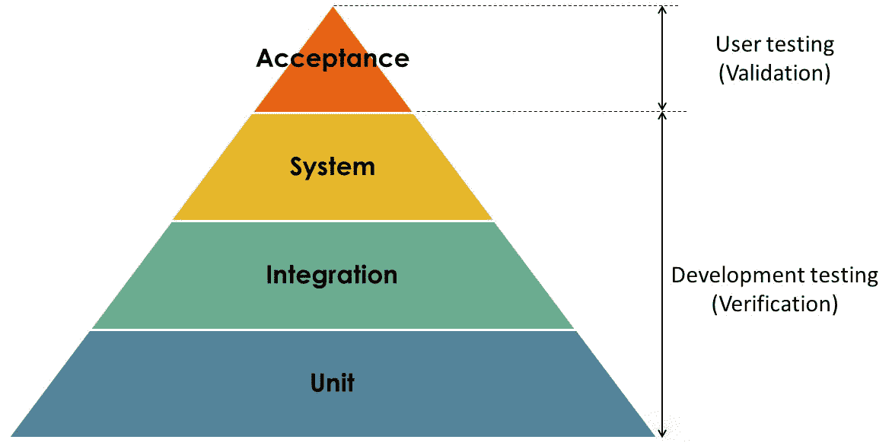
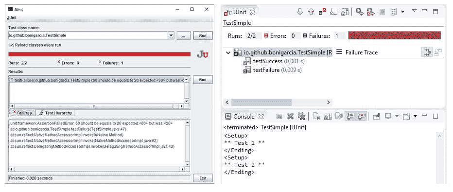
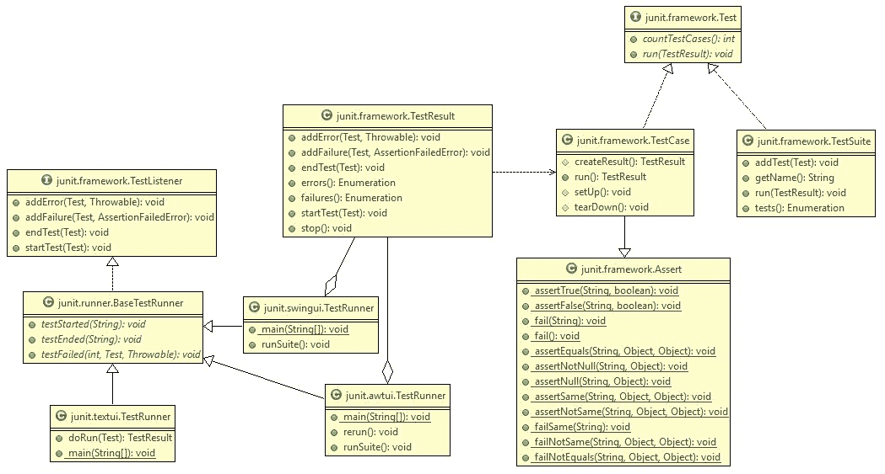
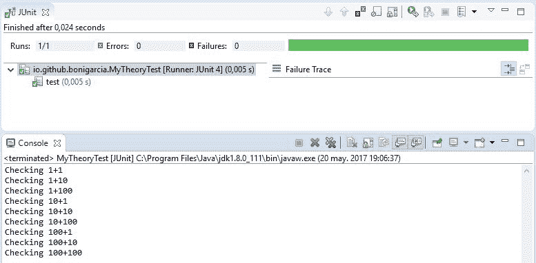

# 软件质量与 Java 测试回顾

In order to make an apple pie from scratch, you must first invent the universe.
*- Carl Sagan*

著名的测试框架 JUnit 自 1995 年诞生以来已经走过了漫长的道路。2017 年 9 月 10 日，项目生命周期中的一个重要里程碑发生了，即 JUnit 5.0.0 的发布。在深入了解 JUnit5 的细节之前，有必要回顾一下软件测试的现状，以便了解我们的发展方向。为了达到这个目的，本章对软件质量、软件测试和 Java 测试的背景进行了高层次的回顾。具体而言，本章由三节组成：

*   **软件质量**：第一节回顾了质量工程的现状：质量保证、ISO/IEC-2500、**V****验证&验证**（**V&V**）和软件缺陷（*bug*）。
*   **软件测试**：这是保证软件质量、减少软件缺陷数量最常用的活动。本节提供了软件测试级别（单元、集成、系统和验收）、方法（黑盒、白盒和非功能）、自动化和手动软件测试的理论背景。
*   **针对****Java 虚拟机**（**JVM**）的测试框架：本节总结了 JUnit 框架遗留版本（即版本 3 和版本 4）的主要特性。最后，简要描述了 JUnit 的替代测试框架和增强器。

# 软件质量

软件是为特定客户或一般市场开发的计算机程序、相关数据和相关文档的集合。它是现代世界的一个重要组成部分，在电信、公用事业、商业、文化、娱乐等领域已经变得无处不在。问题*什么是软件质量？*可以根据相关从业者在软件系统中的角色生成不同的答案。软件产品或服务涉及两个主要群体：

*   **消费者**：使用软件的人。在该组中，我们可以区分*客户*（即负责购买软件产品或服务的人员）和*用户*（即出于各种目的使用软件产品或服务的人员）。然而，客户和用户的双重角色非常常见。
*   **生产者**：从事软件产品开发、管理、维护、营销和服务的人员。

消费者的质量期望是软件系统按照规定执行有用的功能。对于软件生产商来说，基本的质量问题是通过生产符合**服务水平协议**（**SLA**的软件产品来履行其合同义务。著名软件工程师 Roger Pressman 对软件质量的定义包括两种观点：

以创建有用产品的方式应用的有效软件过程，为生产和使用该产品的人提供可测量的价值。

# 质量工程

质量工程（也称为质量管理）是一个评估、评估和改进软件质量的过程。质量工程过程中有三大类活动：

1.  **质量策划**：该阶段通过在项目成本和预算约束下管理客户期望，建立整体质量目标。该质量计划还包括策略，即选择要执行的活动以及提供反馈和评估的适当质量度量。

2.  **质量保证（QA）**：通过规划和执行一系列活动，确保项目生命周期中的软件产品和过程满足其规定的要求，以提供足够的信心，确保软件中存在质量。主要的 QA 活动是验证&确认，但也有其他活动，如软件质量度量、质量标准的使用、配置管理、文档管理或专家意见。
3.  **QA 后**：该阶段包括质量量化和改进测量、分析、反馈和后续活动。这些活动的目的是提供产品质量的定量评估和改进机会的识别。

这些阶段如下图所示：


软件质量工程过程

# 要求和规格

需求是质量工程领域的一个关键主题。需求是一种声明，它确定了一种能力、物理特性或质量因素，该能力、物理特性或质量因素限制了产品或过程的需求，并将寻求解决方案。需求开发（也称为需求工程）是产生和分析客户、产品和产品组件需求的过程。支持需求开发的一组过程，包括规划、可追溯性、影响分析、变更管理等，称为需求管理。有两种软件需求：

*   **功能需求**是产品为了对用户有用而必须采取的行动。它们产生于利益相关者需要做的工作。几乎任何动作，如检查、发布或大多数其他主动动词，都可能是功能需求。
*   **非功能性需求**是产品必须具备的特性或品质。例如，它们可以描述性能、可用性或安全性等属性。它们通常被称为*质量属性*。

与需求密切相关的另一个重要主题是规范，规范是一份以完整、准确、可验证的方式规定系统的需求、设计、行为或其他特征的文件，通常还规定了确定是否满足这些规定的程序。

# 质量管理

**质量保证****质量保证**主要涉及定义或选择应用于软件开发过程或软件产品的标准。《软件质量保证》*（2004）一书的作者 Daniel Galin 将质量保证定义为：*

 *系统的、有计划的一组必要行动，以提供足够的信心，确保软件系统产品的软件开发和维护过程符合既定规范以及保持进度和在预算范围内运行的管理要求。

质量保证过程选择验证和确认活动、工具和方法，以支持选定的质量标准。V&V 是一系列活动，其主要目的是在产品不合格的情况下扣留产品。相比之下，QA 旨在通过在整个开发和维护过程中引入各种活动来最小化质量成本，以防止错误的原因，检测错误，并在开发的早期阶段纠正错误。因此，QA 大大降低了不合格产品的比率。总之，V&V 活动只是 QA 活动总范围的一部分。

# ISO/IEC-25000

提出了各种质量标准，以适应这些不同的质量观点和期望。标准**ISO/IEC-9126**是软件工程界最具影响力的标准之一。然而，研究人员和从业者发现了该标准中的一些问题和弱点。因此，ISO/IEC-9126 国际标准被关于**软件产品质量要求和评估**（**广场**的**ISO/IEC-25000**系列国际标准所取代。本节提供了本标准的高级概述。

ISO/IEC-2500 质量参考模型区分了软件质量的不同观点：

*   **内部质量**：这涉及到系统的属性，可以在不执行它的情况下进行测量。
*   **外部质量**：这涉及系统的性能，在执行过程中可以观察到。
*   **使用中的质量**：这与用户在系统运行和维护期间所体验到的性能有关。

理想情况下，开发（*过程质量*影响内部质量；然后，内部质量决定了外部质量。最后，外部质量决定使用中的质量。此链如下图所示：


ISO/IEC-2500 产品质量参考模型

ISO/IEC-25000 的质量模型将产品质量模型（即内部和外部属性）划分为八个顶级质量特征：*功能适用性、**性能效率、兼容性*、*可用性*、*可靠性*、*安全性**可维护性*和*可移植性*。以下定义直接取自本标准：

*   **功能适用性：**这表示产品或系统在特定条件下使用时提供满足规定和隐含需求的功能的程度。
*   **性能效率：**表示在规定条件下相对于所使用资源量的性能。
*   **兼容性：**这是指产品、系统或组件在共享相同硬件或软件环境的情况下，与其他产品、系统或组件交换信息和/或执行其所需功能的程度。
*   **可用性：**指产品或系统在特定的使用环境下，被特定的用户使用以实现特定目标的有效性、效率和满意度。
*   **可靠性：**这是指系统、产品或组件在特定条件下在特定时间段内执行特定功能的程度。
*   **安全性：**这是指产品或系统保护信息和数据的程度，以使个人或其他产品或系统具有与其授权类型和级别相适应的数据访问程度
*   **可维护性：**这表示产品或系统可被修改以改进、纠正或适应环境和需求变化的有效性和效率程度
*   **可移植性：**这是系统、产品或组件可以从一个硬件、软件或其他操作或使用环境转移到另一个硬件、软件或其他操作或使用环境的有效性和效率

另一方面，使用中的质量属性可分为以下五个特征：

*   **有效性：**这是用户实现特定目标的准确性和完整性。
*   **效率：**这些是与用户实现目标的准确性和完整性相关的资源消耗。
*   **满意度：**当产品或系统在特定的使用环境中使用时，满足用户需求的程度。
*   **无风险：**这是指产品或系统减轻经济状况、人类生命、健康或环境潜在风险的程度。
*   **上下文覆盖率：**这是指产品或系统在指定使用上下文和最初明确确定的上下文以外的上下文中能够有效、高效、无风险和满意地使用的程度。

# 验证和确认

验证和确认（也称为软件质量控制）涉及评估正在开发的软件是否符合其规范，并提供消费者期望的功能。这些检查过程在需求可用时立即开始，并持续到开发过程的所有阶段。验证不同于验证，尽管它们经常被混淆。

杰出的计算机科学教授巴里·博姆（Barry Boehm）早在 1979 年就表达了他们之间的差异：

*   **验证***我们是否在正确构建产品？*验证的目的是检查软件是否满足其规定的功能和非功能需求（即规范）。
*   **验证***我们是否在生产正确的产品？*验证的目的是确保软件满足消费者的期望。这是一个比验证更一般的过程，因为规范并不总是反映消费者的真实愿望或需求。

验证和确认活动包括一系列广泛的质量保证活动。尽管软件测试在 V&V 中扮演着极其重要的角色，但其他活动也是必要的。在验证和确认过程中，可使用两大类系统检查和分析技术：

*   **软件测试**：这是 QA 中最常执行的活动。给定一段代码，软件测试（或简单的测试）包括观察执行（测试用例）的样本，并对它们做出判断。因此，测试是基于执行的 QA 活动，因此先决条件是要测试的已实现软件单元、组件或系统的存在。由于这个原因，它有时被称为动态分析。
*   **静态分析**：这是 V&V 的一种形式，不需要执行软件。静态分析工作在软件的源代码表示上：设计规范的模型或源代码或程序。也许，最常用的是检查和评审，其中规范、设计或程序由一群人检查。可以使用其他静态分析技术，例如自动软件分析（检查程序的源代码是否存在已知的潜在错误模式）。

应该注意的是，对于什么类型的测试构成验证或验证，存在着强烈的意见分歧。一些作者认为，所有的测试都是验证，验证是在需求得到审查和批准时进行的。其他作者将单元和集成测试视为验证，将高阶测试（例如，系统或用户测试）视为验证。为了解决这一分歧，V&V 可以被视为一个单独的主题，而不是两个独立的主题。

# 软件缺陷

验证与确认正确性方面的关键是软件缺陷的概念。术语**缺陷**（也称为*缺陷*）是指一个通用软件问题。IEEE 标准 610.12 提出了以下与软件缺陷相关的分类法：

*   **错误**：产生错误结果的人为行为。错误可分为两类：
    1.  语法错误（违反所用语言的一条或多条规则的程序语句）。
    2.  逻辑错误（不正确的数据字段、超出范围的术语或无效的组合）。
*   **故障**：软件系统中出现错误的表现称为故障。例如，错误的步骤、过程或数据定义。
*   **故障**：软件系统无法执行其所需功能称为（系统）故障。

术语*bug*最早由软件先驱格蕾丝·霍珀（Grace Hooper）于 1946 年提出，当时一只蛾子被困在机电计算机中导致系统故障。在这十年中，术语*调试*也被引入，作为检测和纠正系统缺陷的过程。

除了缺陷的粒度级别外，还可以将**事件**视为与软件消费者感知到的故障相关的症状。总之，错误、故障、失败和事件是软件缺陷的不同方面。缺陷的这四个方面之间存在因果关系。错误可能会导致将故障注入软件，并且在执行软件时，故障可能会导致故障。最后，当最终用户或客户遇到故障时，就会发生事故。可以执行不同的 QA 活动，以尽量减少软件系统中的缺陷数量。根据 Jeff Tian 在其著作*软件质量工程*（2005）中的定义，备选方案可分为以下三类：

*   通过错误消除预防缺陷：例如，使用某些过程和产品标准可以帮助将某些类型的故障注入软件的可能性降至最低。
*   通过故障检测和排除减少缺陷：传统的测试和静态分析活动就是这一类的例子。我们将在本章正文中发现这些机制的具体类型。
*   通过故障预防控制缺陷：这些活动通常不在软件系统的范围内。安全壳的目标是最大限度地减少软件系统故障造成的损害（例如，在反应堆故障的情况下，容纳放射性物质的墙壁）。


软件缺陷链和相关的 QA 活动

# 静力分析

软件的静态分析是在不执行代码的情况下执行的。与测试相比，软件分析有几个优点：

1.  在测试期间，错误可以隐藏其他错误。这种情况不会发生在静态分析中，因为它与错误之间的交互无关。
2.  系统的不完整版本可以静态分析，无需额外成本。在测试中，如果程序不完整，则必须开发测试线束。
3.  静态分析可以考虑软件系统的更广泛的质量属性，例如符合标准、可移植性和可维护性。

有不同的方法可以被识别为静态分析：

*   **检查**（Michael Fagan 于 1976 年首次提出）是由人工检查员对软件工件进行的检查，旨在发现和修复软件系统中的故障。所有类型的软件资产都要接受检查，例如规范、设计模型等。存在检查的主要原因是，在开始执行检查之前，没有等待可执行程序（如在测试中）的可用性。
*   **评审**是一组人员检查软件及其相关文档，寻找潜在问题和不符合标准以及其他潜在问题或遗漏的过程。如今，在合并到共享源代码存储库之前，经常会对新代码进行审查。通常，评审由同一团队中的不同人员对代码作者进行（**同行评审**。这个过程在时间和精力上都非常昂贵，但另一方面，当正确执行时，它有助于确保较高的内部代码质量，从而降低潜在风险。

**演练**是一种特殊形式的复习。根据 IEEE 软件评审标准，演练是软件同行评审的一种形式，其中设计师或程序员通过软件产品带领开发团队成员和其他相关方，参与者就可能出现的错误、违反开发标准的情况提出问题和评论，以及其他问题。

*   **自动软件分析**使用已知具有潜在危险的模式评估源代码。此技术通常作为商业或开源工具和服务提供，通常称为**lint**或**linter**。这些工具可以定位许多常见的编程错误，在测试之前分析源代码，并识别潜在的问题，以便在它们显示为失败之前对它们重新编码。此 linting 过程的目的是让代码读取器注意程序中的错误，例如：
    1.  数据错误：这可能包括已声明但从未使用的变量、已分配两次但从未在分配之间使用的变量，等等。
    2.  控制错误：这可能包括无法访问的代码或循环中的无条件分支。
    3.  输入/输出故障：这可能包括变量输出两次，没有中间赋值。
    4.  接口故障：这可能包括参数类型不匹配、参数不匹配、未使用函数结果、未调用的函数和过程等。
    5.  存储管理故障：这可能包括未分配的指针、指针算法等。

在静态分析和动态测试之间，我们发现了一种特殊的软件评估方法，称为**形式验证**。这种评估提供了检查系统是否按照其正式规范运行的机制。为此，软件被视为一个数学实体，其正确性可以通过逻辑运算证明，并结合不同类型的静态和动态评估。目前，主要由于可伸缩性问题，形式化方法没有被广泛采用。使用这些技术的项目大多相对较小，例如关键的内核系统。随着系统的发展，开发正式规范和验证所需的工作量会过度增加。

# 软件测试

软件测试包括在有限的测试用例集上对程序的行为进行动态评估，这些测试用例从通常无限的执行域中选择，与预期的行为相对应。该定义的关键概念描述如下：

*   **动态**：测试中的**系统**（**SUT**以特定的输入值执行，以发现其行为中的故障。因此，实际的 SUT 应该确保设计和代码是正确的，同时还要确保环境（如库、操作系统和网络支持等）是正确的。
*   **有限**：对于大多数实际程序，穷举测试是不可能的或不实用的。它们通常对每个操作都有大量允许的输入，加上更多无效或意外的输入，并且可能的操作序列通常也是无限的。测试人员必须选择一些测试，以便我们能够在可用时间内运行测试。
*   **选择**：由于存在大量或无限可能的测试，我们只能运行其中的一小部分，因此测试的关键挑战是如何选择最有可能暴露系统故障的测试。
*   **预期**：每次测试执行后，必须确定观察到的系统行为是否为故障。

软件测试是一个广泛的术语，包含了各种不同的概念。文献中没有针对所有不同测试形式的通用分类。为了清晰起见，在本书中，我们使用三个轴对不同形式的测试进行分类，即测试级别（单元、集成、系统和验收）、测试方法（黑盒、白盒和非功能测试）和测试类型（手动和自动）。

下一节将提供有关所有这些概念的更多详细信息，在下图中进行了总结：


三类软件测试的分类：级别、方法和类型

例如，我们将发现，根据函数行为在类中执行方法的 JUnit 测试可以被视为自动单元黑盒测试。当最终消费者使用软件产品验证是否按预期工作时，根据分类法，我们才能将其视为手动黑盒验收测试。应该注意的是，并非所有这三个轴的可能组合总是有意义的。例如，非功能性测试（例如，性能）通常在系统级别自动执行（不太可能手动或在单元级别执行）。

# 测试级别

根据 SUT 的大小和使用它的场景，可以在不同的级别上进行测试。在本书中，我们将不同的测试级别分为四个阶段：

*   **单元测试**：这里测试单个程序单元。单元测试应该关注对象或方法的功能。
*   **集成测试**：在这里，单元被组合以创建复合组件。集成测试应侧重于测试组件、接口。
*   **系统测试**：在这里，所有组件都是集成的，系统作为一个整体进行测试。
*   **验收测试**：在这里，用户决定系统是否准备好部署到用户环境中。它可以被看作是最终用户或客户在系统级执行的高级功能测试。

在许多不同形式的测试中没有通用的分类。关于测试级别，在本书中，我们使用上述四个级别的分类。然而，文献中还存在其他层次或方法（例如，*系统集成测试*或*回归测试*。在本节的最后一部分，我们可以看到对不同测试方法的回顾。

前三个层次（单元、集成和系统）通常在软件生命周期的开发阶段执行。这些测试通常由软件工程师的不同角色（即程序员、测试人员、QA 团队等）执行。这些测试的目的是验证系统。另一方面，第四级（验收）是一种用户测试，潜在或真实用户通常参与其中（验证）。下图提供了这些概念的图形说明：



测试水平及其与 V&V 的关系

# 单元测试

单元测试是一种方法，通过这种方法，可以测试单个源代码片段，以验证该单元的设计和实现是否已正确实现。单元测试用例中按顺序执行四个阶段，如下所示：

*   **设置**：测试用例初始化*测试夹具*，即 SUT 显示预期行为所需的图片之前的*。*
*   **练习**：测试用例与 SUT 交互，从而从中获得一些结果。SUT 通常查询另一个组件，名为**依赖于组件**（**文档**）。
*   **验证**：测试用例确定是否使用断言（也称为谓词）获得了预期结果。
*   **拆卸**：测试用例撕裂测试夹具，使 SUT 回到初始状态。

这些阶段及其与 SUT 和 DOC 的关系如下所示：


单元测试通用结构

单元测试是与被测单元隔离进行的，也就是说，不与其文档交互。为此，使用*测试双精度*替换 SUT 所依赖的任何组件。有几种类型的双重测试：

*   **虚拟**对象仅满足真实对象 API，但从未实际使用过。虚拟对象的典型用例是当它们作为参数传递以满足方法签名时，但是虚拟对象没有实际使用。
*   一个**假**对象用一个更简单的实现（例如，内存中的数据库）替换了真实对象。
*   **存根**对象替换提供硬编码值作为响应的真实对象。
*   一个**模拟**对象也替换了真实对象，但这次用编程期望作为响应。
*   **spy**对象是一个部分模拟对象，这意味着它的一些方法是按照预期编程的，而其他方法使用真实对象的实现。

# 集成测试

集成测试应暴露接口中的缺陷，以及集成组件或模块之间的交互。执行集成测试有不同的策略。这些策略描述了单元集成的顺序，假设单元已经单独测试过。常见的集成策略示例如下：

*   **自上而下集成**：该策略从主单元（模块）开始，即过程树的根。主单元调用的任何较低级别模块都应替换为测试双精度模块。一旦测试人员确信主单元逻辑是正确的，存根就会逐渐被实际代码所取代。对于程序树中较低单元的其余部分，重复此过程。这种方法的主要优点是更容易发现缺陷。
*   **自底向上集成**：该策略以最基本的单元开始测试过程。较大的子系统由测试组件组装而成。这种类型的主要优点是不需要双重测试。
*   **即席集成**：组件按照完成的自然顺序进行集成。它允许对系统进行早期测试。通常需要双倍测试。
*   **主干集成**：构建组件骨架，其他组件逐步集成。这种方法的主要缺点是创建主干，这可能是劳动密集型的。

文献中通常提到的另一种策略是**大爆炸整合**。在这种策略中，测试人员要等到所有或大部分单元都开发出来并集成。因此，所有故障都是同时发现的，因此纠正潜在故障非常困难且耗时。如果可能的话，应该避免这种策略。

# 系统测试

开发过程中的系统测试包括集成组件以创建系统版本以及测试集成系统。它验证组件是否兼容、正确交互以及在正确的时间通过其用户界面局部传输正确的数据。它显然与集成测试重叠，但这里的区别在于系统测试应该包括所有系统组件以及最终用户（通常是模拟的）。

有一种特殊类型的系统测试称为*端到端测试*。在这种方法中，最终用户通常是模拟的，也就是说，使用自动化技术进行模拟。

# 测试方法

测试方法（或策略）定义了设计测试用例的方法。它们可以是基于责任的（**黑框**）、基于实现的（**白框**）或**非功能性**。黑盒技术基于待测试项的指定功能设计测试用例。白盒测试依赖于源代码分析来开发测试用例。混合技术（灰盒）测试使用基于责任和基于实现的方法设计测试用例。

# 黑盒测试

**黑盒测试**（也称为**功能**或**行为**测试）基于需求，不了解内部程序结构或数据。黑盒测试依赖于正在测试的系统或组件的规范，以派生测试用例。系统是一个黑箱，其行为只能通过研究其输入和相关输出来确定。有很多特定的黑盒测试技术；以下是一些最著名的例子：

*   **系统测试**：这是指一种完整的测试方法，在这种方法中，SUT 完全符合规范，符合测试假设。它只在每个域点都是一个单子域的有限意义上生成测试用例。在这一类别中，最常用的是*等价划分*和*边界值分析*，以及基于逻辑的技术，如*因果图*、*决策表*或*成对测试*。
*   **随机测试**：这实际上是系统测试的对立面——抽样覆盖整个输入域。*模糊测试*是黑盒随机测试的一种形式，它随机变异格式良好的输入，并在结果数据上测试程序。它将随机顺序和/或结构错误的数据发送到系统，以查看是否发生故障。
*   **图形用户界面****GUI****测试**：这是通过与用户交互的图形界面来确保软件规范的过程。GUI 测试是事件驱动的（例如，鼠标移动或菜单选择），并通过消息或方法调用为底层应用程序代码提供前端。单元级的 GUI 测试通常用于按钮级。系统级 GUI 测试练习 SUT 的事件驱动特性。
*   **基于模型的测试**（**MBT**）：这是一种测试策略，其中测试用例部分源自描述 SUT 某些（如果不是全部）方面的模型。MBT 是黑盒测试的一种形式，因为测试是从一个模型生成的，该模型来自需求文档。它可以在不同的层次上完成（单元、集成或系统）。
*   **烟雾测试**：这是确保 SUT 关键功能的过程。冒烟测试用例是测试人员在接受构建进行进一步测试之前运行的第一个测试用例。烟雾测试用例的失败将意味着软件构建被拒绝。*冒烟测试*的名称来源于电气系统测试，第一个测试是打开电源，看看它是否冒烟。

*   **健全性测试**：这是确保 SUT 基本功能的过程。与烟雾测试类似，卫生测试在测试过程开始时进行，但其目标不同。在进行更详尽的测试之前，健全性测试应确保 SUT 的基本功能继续按预期工作（即 SUT 的*合理性*。

在软件测试社区中，冒烟测试和健全测试通常是令人困惑的术语。通常认为，这两种测试的执行都是为了避免在这些测试失败时在严格测试中浪费精力，这是它们的主要区别（关键功能与基本功能）。

# 白盒试验

**白盒****测试**（也称为**结构**测试）基于对应用程序代码内部逻辑的了解。它确定程序代码结构和逻辑是否有故障。只有当测试人员知道程序应该做什么时，白盒测试用例才是准确的。

黑盒测试仅使用规范来识别用例，而白盒测试使用程序源代码（实现）作为测试用例识别的基础。为了为 SUT 选择一组好的测试用例，结合使用这两种方法是必要的。一些最重要的白盒技术如下：

*   **代码覆盖率**定义了源代码的程度，例如，已测试的 LOC 百分比。代码覆盖率有几个标准：
    1.  语句覆盖率：代码覆盖粒度的一行。
    2.  决策（分支）覆盖：控制结构（例如，if-else）覆盖粒度。
    3.  条件覆盖率：布尔表达式（真-假）覆盖粒度。
    4.  路径覆盖：每个可能的路由覆盖粒度。
    5.  函数覆盖：程序函数覆盖粒度。
    6.  进入/退出覆盖：调用和返回覆盖粒度。
*   **故障注入**是将故障注入软件的过程，以确定某些 SUT 的性能如何。缺陷可以说是传播的，在这种情况下，它们的影响在程序状态中是可见的，超出了错误存在的状态（故障变成了故障）。
*   **突变测试**通过对包含不同、单一和故意插入的变化的 SUT 的多个副本运行测试及其数据来验证测试及其数据。变异测试有助于识别代码中的遗漏。

# 非功能测试

系统的**非功能**方面可能需要进行大量的测试。在该组中，可以找到不同的测试方法，例如，为评估 SUT 是否符合规定的性能要求而进行的性能测试。这些需求通常包括关于时间行为和资源使用的约束。*性能测试*可以测量单个用户操作系统或多个用户操作系统的响应时间。*负载测试*的重点是将系统上的负载增加到某个规定或暗示的最大负载，以验证系统能够处理定义的系统边界。*容量测试*通常被认为是负载测试的同义词，但容量测试侧重于数据。*压力测试*超出正常操作能力进行测试，直至系统出现故障，确定系统出现故障的实际边界。压力测试的目的是观察系统如何失败以及瓶颈在哪里。

*安全测试*试图确保以下概念：机密性（防止信息泄露）、完整性（确保信息的正确性）、身份验证（确保用户的身份）、授权（确定允许用户接收服务或执行操作），可用性（确保系统在需要时执行其功能）和不可否认性（确保拒绝执行某个操作）。评估系统基础设施安全性的授权尝试通常被称为*渗透测试*。

*可用性测试*的重点是发现用户界面问题，这些问题可能导致软件难以使用或可能导致用户误解输出。*可访问性测试*是确保我们的产品符合可访问性（访问系统功能的能力）的技术。

# 测试类型

执行软件测试主要有两种类型：

*   **手动测试**：这是评估 SUT 的过程，由人工完成，通常是软件工程师或最终消费者。在这种类型的测试中，我们可以找到所谓的*探索性测试*，这是一种手动测试，其中人类测试人员通过调查和自由评估系统，使用其个人感知来评估系统。
*   **自动测试**：这是评估 SUT 的过程，测试过程（测试执行、报告等）使用专用软件和测试基础设施进行。Elfriede Dustin，在其著作*实施自动化软件测试：如何在提高质量的同时节省时间和降低成本*（2009）*中将**自动化软件测试**（**AST**定义为：*

 *在整个软件测试生命周期中应用和实施软件技术，以提高效率和有效性。

AST 的主要好处是：预期成本节约、缩短测试持续时间、提高测试的彻底性、提高测试准确性、改进结果报告和统计处理以及后续报告。

自动测试通常在**持续集成**（**CI**过程的上下文中在构建服务器中执行。更多详情请参见[第 7 章](7.html#4OIQ00-ef8404ed083f459d860f84cc8198f8bb)、*测试管理。*

AST 在*框架*中实现时最有效。测试框架可以定义为一组抽象概念、过程、过程和环境，在这些抽象概念、过程、过程和环境中设计、创建和实现自动化测试。该框架定义包括用于测试创建和实现的物理结构，以及这些组件之间的逻辑交互。

严格地说，框架的定义与我们对图书馆的理解相差不远。为了使差异更清楚，考虑下面的报价从著名软件工程大师 Martin Folwer：

库本质上是一组可以调用的函数，现在通常被组织成类。每个调用都会执行一些工作，并将控制权返回给客户端。框架体现了一些抽象的设计，并内置了更多的行为。为了使用它，您需要通过子类化或插入您自己的类，将您的行为插入框架中的各个位置。然后，框架的代码在这些点调用您的代码。


图书馆与框架区别的直观解释

框架在现代软件开发中变得越来越重要。它们提供了在软件密集型系统中非常需要的功能：可重用性。这样，大型应用程序最终将由相互协作的框架层组成。

# 其他测试方法

正如本节开头所介绍的，对于不同形式的测试没有一个通用的定义。在本节中，我们回顾了一些文献中迄今未涉及的最常见的测试类型。例如，当执行测试过程以确定系统是否符合其规范时，称为*一致性测试*。当一个新特性或功能被引入一个系统时（我们可以称之为构建），测试这个新特性的方法称为*渐进测试*。除此之外，为了检查新引入的更改是否不会影响系统其余部分的正确性，将使用现有的测试用例。这种方法通常被称为*回归测试*。

当系统与任何外部或第三方系统交互时，可以进行另一项测试，称为*系统集成测试*。此类测试验证系统是否正确集成到任何外部系统。

*用户或客户测试*是测试过程中的一个阶段，用户或客户为系统测试提供输入和建议。*验收测试*是一种用户测试，但也可以有不同类型的*用户测试*：

*   **阿尔法测试**：在软件发布给外部用户或客户之前，在开发人员的网站上与软件的消费者一起进行测试。
*   **Beta 测试**：在客户现场进行测试，包括一群客户在自己的位置使用系统并提供反馈，然后再将系统发布给其他客户。
*   **运行测试**：由最终用户在其正常运行环境下进行。

最后，*发布测试*是指由开发团队之外的独立团队对系统的特定发布进行测试的过程。发布测试过程的主要目标是使系统供应商确信该系统足够好，可以使用。

# JVM 的测试框架

JUnit 是一个允许创建自动化测试的测试框架。JUnit 的开发由 Kent Beck 和 Erich Gamma 于 1995 年底开始。自那时以来，该框架的受欢迎程度不断提高。如今，它被广泛认为是测试 Java 应用程序的*事实上的*标准。

JUnit 被设计成一个单元测试框架。然而，它不仅可以用于实现单元测试，还可以用于实现其他类型的测试。正如我们将在本书正文中发现的，根据测试逻辑如何操作被测软件，使用 JUnit 实现的测试用例可以被视为单元、集成、系统甚至验收测试。总之，我们可以将 JUnit 看作是 Java 的多用途测试框架。

# 少年 3

由于 JUnit3 的早期版本，该框架可以与 Java2 及更高版本一起工作。JUnit3 是开源软件，在**公共许可证**（**CPL**版本）1.0 下发布，托管在 SourceForge（[上 https://sourceforge.net/projects/junit/](https://sourceforge.net/projects/junit/) ）。JUnit3 的最新版本是 JUnit3.8.2，发布于 2007 年 5 月 14 日。JUnit 在测试框架领域引入的主要需求如下：

1.  定义将运行哪些测试应该很容易。
2.  框架应该能够独立于所有其他测试运行测试。
3.  框架应该逐个测试检测和报告错误。

# JUnit3 中的标准测试

在 JUnit3 中，为了创建测试用例，我们需要扩展类`junit.framework.TestCase`。这个基类包括 JUnit 自动运行测试所需的框架代码。然后，我们只需确保方法名称遵循`testXXX()`模式。这种命名约定使框架清楚地认识到，该方法是一个单元测试，可以自动运行。

试验生命周期通过`setup()`和`tearDown()`方法进行控制。`TestCase`在运行每个测试之前调用`setup()`，然后在每个测试完成后调用`teardown()`。将多个测试方法放在同一个测试用例中的一个原因是共享同一个测试夹具。

最后，为了在测试用例中实现验证阶段，JUnit3 在名为`junit.framework.Assert`的实用程序类中定义了几个断言方法。下表总结了此类提供的主要断言：

| **方法** | **说明** |
| `assertTrue` | 断言某个条件为真。如果不是，则该方法抛出一个带有给定消息（如果有）的`AssertionFailedError`。 |
| `assertFalse` | 断言某个条件为假。如果不是，则该方法抛出一个带有给定消息（如果有）的`AssertionFailedError`。 |
| `assertEquals` | 断言两个对象相等。如果没有，该方法将抛出一个带有给定消息（如果有）的`AssertionFailedError`。 |
| `assertNotNull` | 断言对象不为 null。如果是，该方法抛出一个带有消息的`AssertionFailedError`（如果有）。 |
| `assertNull` | 断言对象为空。如果不是，则该方法抛出一个带有给定消息（如果有）的`AssertionFailedError`。 |
| `assertSame` | 断言两个对象引用同一个对象。如果没有，该方法将抛出一个带有给定消息（如果有）的`AssertionFailedError`。 |
| `assertNotSame` | 断言两个对象不引用同一个对象。如果有，该方法将抛出一个带有给定消息（如果有）的`AssertionFailedError`。 |
| `fail` | 测试失败（抛出带有给定消息的`AssertionFailedError`（如果有）。 |

下面的类显示了使用 JUnit3.8.2 实现的一个简单测试。正如我们所看到的，这个测试用例包含两个测试。在每次测试之前，框架将调用方法`setUp()`，在每次测试执行之后，也将调用方法`tearDown()`。此示例已编码，以便第一个名为`testSuccess()`的测试正确完成，第二个名为`testFailure()`的测试以错误结束（断言引发异常）：

```java
package io.github.bonigarcia;

import junit.framework.TestCase;

public class TestSimple extends TestCase {

    // Phase 1: Setup (for each test)
    protected void setUp() throws Exception {
        System.*out*.println("<Setup>");
    }

    // Test 1: This test is going to succeed
    public void testSuccess() {
        // Phase 2: Simulation of exercise
        int expected = 60;
        int real = 60;
        System.*out*.println("** Test 1 **");

        // Phase 3: Verify
        *assertEquals*(expected + " should be equals to " 
         + real, expected, real);
    }

    // Test 2: This test is going to fail
    public void testFailure() {
        // Phase 2: Simulation of exercise
        int expected = 60;
        int real = 20;
        System.*out*.println("** Test 2 **");

        // Phase 3: Verify
        *assertEquals*(expected + " should be equals to " 
         + real, expected, real);
    }

    // Phase 4: Teardown (for each test)
    protected void tearDown() throws Exception {
        System.*out*.println("</Ending>");
    }

}
```

本书中介绍的所有代码示例都可以在 GitHub 存储库[上找到 https://github.com/bonigarcia/mastering-junit5](https://github.com/bonigarcia/mastering-junit5) 。

# JUnit3 中的测试执行

JUnit3 允许通过称为 TestRunner 的 Java 应用程序运行测试用例。JUnit3.8.2 提供了三种不同的开箱即用的测试运行程序：两个图形（基于 Swing 和 AWT）和一个可从命令行使用的文本。JUnit 框架为每个测试提供单独的类装入器，以避免测试之间的副作用。

构建工具（如 Ant 或 Maven）和**集成开发环境**-**IDE**-（如 Eclipse 和 IntelliJ）实现自己的 JUnit 测试运行程序是一种常见做法。

下图显示了当我们使用 JUnit Swing runner 时，以及当我们使用 Eclipse 运行相同的测试用例时，前面的测试是什么样子的。



使用图形化 Swing 测试运行程序和 Eclipse 测试运行程序执行 JUnit3 测试用例

当 JUnit 中的测试未成功时，可能有两个原因：失败或错误。一方面，失败是由不满足的断言（`Assert`类）引起的。另一方面，错误是测试无法预料的意外情况，例如被测软件中的常规异常。

JUnit3 的另一个重要贡献是测试套件的概念，它是对相关测试进行分组的方便方法。测试套件通过 JUnit 类`junit.framework.TestSuite`实现。此类以与`TestCase`相同的方式实现框架接口`junit.framework.Test`。

包含 JUnit 3 的主要类和方法的图表如下所示：



核心 JUnit3 类

下面的代码片段显示了在 JUnit3 中使用测试套件的示例。简而言之，我们可以简单地实例化一个`TestSuite`对象创建一组测试，然后使用`addTestSuite()`方法添加单个测试用例：

```java
package io.github.bonigarcia;

import junit.framework.Test;
import junit.framework.TestSuite;

public class TestAll {

    public static Test suite() {
        TestSuite suite = new TestSuite("All tests");
        suite.addTestSuite(TestSimple.class);
        suite.addTestSuite(TestMinimal.class);
        return suite;
    }
}
```

稍后可以使用测试运行程序执行此测试套件。例如，我们可以使用命令行测试运行程序（`junit.textui.TestRunner`和命令行，如下所示：


使用文本测试运行程序和命令行执行测试套件

# 少年 4

JUnit4 仍然是一个开源框架，尽管许可证相对于 JUnit3 有所改变，从 CPL 到**Eclipse 公共许可证**（**EPL**版本 1.0。JUnit4 的源代码托管在 GitHub 上（[https://github.com/junit-team/junit4/](https://github.com/junit-team/junit4/) ）。

2006 年 2 月 18 日，JUnit4.0 发布。它遵循与 JUnit3 相同的高级指导原则，即轻松定义测试，框架独立运行测试，框架通过测试检测和报告错误。

JUnit4 与 JUnit3 的主要区别之一是 JUnit4 允许定义测试的方式。在 JUnit4 中，Java 注释用于将方法标记为测试。因此，JUnit4 只能用于 Java5 或更高版本。正如 JUnit 4.0 的文档在 2006 年所述：

JUnit4.0 的体系结构与早期版本的体系结构有很大的不同。不再通过子类化 junit.framework.TestCase 来标记测试类，也不再通过以“test”开头的名称来标记测试方法，而是使用@test 注释来标记测试方法。

# JUnit4 中的标准测试

在 JUnit4 中，`@Test`注释（包含在包`org.junit`中）表示测试。任何公共方法都可以用`@Test`注释，使其成为测试方法。

为了设置测试夹具，JUnit4 提供了`@Before`注释。此注释可以在任何公共方法中使用。类似地，在每次测试方法执行之后，都会执行任何带有`@After`注释的公共方法。JUnit4 提供了另外两个注释来增强测试生命周期：`@BeforeClass`和`@AfterClass`。在所有测试之前和之后，每个测试类只执行一次。下图描述了 JUnit 4 测试用例的生命周期：


JUnit4 测试生命周期

`@Before` and `@After` can be applied to any public void methods. `@AfterClass` and `@BeforeClass` can be applied to only public static void methods.

下表总结了迄今为止 JUnit 3 和 JUnit 4 之间的主要差异：

| **特征** | **JUnit 3** | **JUnit 4** |
| 测试定义 | `testXXX`模式 | `@Test`注释 |
| 在第一次测试之前运行 | 不支持 | `@BeforeClass`注释 |
| 完成所有测试后运行 | 不支持 | `@AfterClass`注释 |
| 在每次测试之前运行 | 超越`setUp()`方法 | `@Before`注释 |
| 每次测试后运行 | 超越`tearDown()`方法 | `@After`注释 |
| 忽略测试 | 不支持 | `@Ignore`注释 |

`org.junit.Assert`类提供了执行断言（谓词）的静态方法。以下是最有用的断言方法：

*   `assertTrue`：如果条件变为 false，则断言失败并抛出`AssertionError`。
*   `assertFalse`：如果条件变为 true，则断言失败并抛出`AssertionError`。
*   `assertNull`：检查参数是否为空，如果参数不是`null`则抛出`AssertionError`。
*   `assertNotNull`：检查参数是否为空；否则抛出`AssertionError`
*   `assertEquals`：比较两个对象或原语类型。此外，如果实际值与预期值不匹配，则抛出`AssertionError`。
*   `assertSame`：仅支持对象，并使用`==`操作符检查对象引用。
*   `assertNotSame`：这是`assertSame`的反面。

下面的代码片段提供了一个 JUnit4 测试用例的简单示例。我们可以看到，这是上一节中看到的等效测试用例，这次使用 JUnit 4 编程模型，即使用`@Test`注释来识别测试和其他注释（`@AfterAll`、`@After`、`@BeforeAll`、`@Before`）来实现测试生命周期（设置和拆卸测试夹具）：

```java
package io.github.bonigarcia;

import static org.junit.Assert.*assertEquals*;

import org.junit.After;
import org.junit.AfterClass;
import org.junit.Before;
import org.junit.BeforeClass;
import org.junit.Test;

public class TestSimple {

    // Phase 1.1: Setup (for all tests)
    @BeforeClass
    public static void setupAll() {
        System.*out*.println("<Setup Class>");
    }

    // Phase 1.2: Setup (for each test)
    @Before
    public void setupTest() {
        System.*out*.println("<Setup Test>");
    }

    // Test 1: This test is going to succeed
    @Test
    public void testSuccess() {
        // Phase 2: Simulation of exercise
        int expected = 60;
        int real = 60;
        System.*out*.println("** Test 1 **");

        // Phase 3: Verify
        *assertEquals*(expected + " should be equals to " 
          + real, expected, real);
    }

    // Test 2: This test is going to fail
    @Test
    public void testFailure() {
        // Phase 2: Simulation of exercise
        int expected = 60;
        int real = 20;
        System.*out*.println("** Test 2 **");

        // Phase 3: Verify
        *assertEquals*(expected + " should be equals to " 
          + real, expected, real);
    }

    // Phase 4.1: Teardown (for each test)
    @After
    public void teardownTest() {
        System.*out*.println("</Ending Test>");
    }

    // Phase 4.2: Teardown (for all test)
    @AfterClass
    public static void teardownClass() {
        System.*out*.println("</Ending Class>");
    }

}
```

# JUnit4 中的测试执行

测试运行程序的概念也出现在 JUnit4 中，但是相对于 JUnit3 它有了一些改进。在 JUnit4 中，测试运行程序是一个 Java 类，用于管理测试的生命周期：实例化、调用 setup 和 teardown 方法、运行测试、处理异常、发送通知等等。默认的 JUnit4 测试运行程序名为`BlockJUnit4ClassRunner`，它实现 JUnit4 标准测试用例类模型。

在 JUnit4 测试用例中使用的测试运行程序可以简单地使用注释`@RunWith`进行更改。JUnit4 提供了一个内置测试运行程序的集合，允许更改测试类的性质。在本节中，我们将回顾最重要的部分。

*   为了运行一组测试（即测试套件），JUnit4 提供了`Suite`运行程序。除了 runner 之外，`Suite.SuiteClasses`类还允许定义属于该套件的各个测试类。例如：

```java
 package io.github.bonigarcia;

 import org.junit.runner.RunWith;
 import org.junit.runners.Suite;

     @RunWith(Suite.class)
     @Suite.SuiteClasses({ TestMinimal1.class, TestMinimal2.class })
 public class MySuite {
     }
```

*   参数化测试用于指定将在同一测试逻辑中使用的不同输入数据。为了实现这种测试，JUnit4 提供了`Parameterized`运行程序。要定义此类测试中的数据参数，我们需要用注释`@Parameters`注释类的静态方法。此方法应返回二维数组的`Collection`，为测试提供输入参数。现在，将有两个选项将输入数据注入测试：
    1.  使用构造函数类。
    2.  使用注释`@Parameter`注释类属性。

以下代码段显示了后者的一个示例：

```java
package io.github.bonigarcia;

import static org.junit.Assert.assertTrue;

import java.util.Arrays;
import java.util.Collection;
import org.junit.Test;
import org.junit.runner.RunWith;
import org.junit.runners.Parameterized;
import org.junit.runners.Parameterized.Parameter;
import org.junit.runners.Parameterized.Parameters;

@RunWith(Parameterized.class)
public class TestParameterized {

    @Parameter(0)
    public int input1;

    @Parameter(1)
    public int input2;

    @Parameter(2)
    public int sum;

    @Parameters(name = "{index}: input1={0} input2={1} sum={2}?")
    public static Collection<Object[]> data() {
        return Arrays.*asList*(
                new Object[][] { { 1, 1, 2 }, { 2, 2, 4 }, { 3, 3, 9 } });
    }

    @Test
    public void testSum() {
        *assertTrue*(input1 + "+" + input2 + " is not " + sum,
                input1 + input2 == sum);
    }

}
```

在 Eclipse 上执行此测试的步骤如下：


在 Eclipse 中执行参数化测试

*   JUnit 理论是 JUnit 参数化测试的替代方法。JUnit 理论预计适用于所有数据集。因此，在 JUnit 理论中，我们有一种提供数据点（即用于测试的输入值）的方法。然后，我们需要指定一个带参数的方法，该方法用`@Theory`注释。类中的理论通过数据点的每个可能组合来执行：

```java
 package io.github.bonigarcia;

 import static org.junit.Assert.assertTrue;

 import org.junit.experimental.theories.DataPoints;
 import org.junit.experimental.theories.Theories;
 import org.junit.experimental.theories.Theory;
 import org.junit.runner.RunWith;

      @RunWith(Theories.class)
 public class MyTheoryTest {

         @DataPoints
         public static int[] positiveIntegers() {
             return new int[] { 1, 10, 100 };
         }

         @Theory
         public void testSum(int a, int b) {
             System.out.println("Checking " + a + "+" + b);
             *assertTrue*(a + b > a);
             *assertTrue*(a + b > b);
         }
     }
```

再次在 Eclipse 中查看此示例的执行情况：



在 Eclipse 中执行 JUnit4 理论

# JUnit4 的高级特性

JUnit4 中引入的最重要的创新之一是使用了*规则*。规则允许灵活地添加或重新定义测试类中每个测试方法的行为。应通过使用注释`@Rule`注释类属性，将规则包括在测试用例中。此属性的类型应继承 JUnit 接口`org.junit.rulesTestRule`。JUnit 4 提供了以下开箱即用的规则：

*   `ErrorCollector`：此规则允许在发现第一个问题后继续执行测试
*   `ExpectedException`：此规则允许验证测试是否引发特定异常
*   `ExternalResource`：此规则为在测试之前设置外部资源（文件、套接字、服务器、数据库连接等）并保证在测试之后将其拆除的规则提供基类
*   `TestName`：此规则使当前测试名称在测试方法中可用
*   `TemporaryFolder`：此规则允许创建测试方法完成时应删除的文件和文件夹
*   `Timeout`：此规则对类中的所有测试方法应用相同的超时
*   `TestWatcher`：它是规则的基类，将记录每次通过和失败的测试

JUnit 4 的另一项高级功能允许：

*   执行测试是一个给定的顺序，使用注释`@FixMethodOrder`。
*   使用“假定”类创建假定。这个类提供了很多静态方法，比如`assumeTrue(condition)`、`assumeFalse(condition)`、`assumeNotNull(condition)`和`assumeThat(condition)`。在执行测试之前，JUnit 检查测试中存在的假设。如果其中一个假设失败，JUnit 运行程序将忽略假设失败的测试。
*   JUnit 在`@Test`注释中提供了一个超时值（以毫秒为单位），以确保如果测试运行的时间超过指定的值，则测试失败。
*   使用测试运行者`Categories`对测试进行分类，并识别使用注释`Category`注释测试方法的测试类型。

可以在 GitHub 存储库（[中找到前面提到的每个功能的有意义的示例 https://github.com/bonigarcia/mastering-junit5](https://github.com/bonigarcia/mastering-junit5) ）。

# JUnit 生态系统

JUnit 是 JVM 最流行的测试框架之一，被认为是软件工程中最有影响力的框架之一。我们可以找到几个在 JUnit 之上提供附加功能的库和框架。这些生态系统增强剂的一些例子如下：

*   莫基托（[http://site.mockito.org/](http://site.mockito.org/) ：这是模拟框架，可以与 JUnit 结合使用。
*   资产 J（[http://joel-costigliola.github.io/assertj/](http://joel-costigliola.github.io/assertj/) ：这是 Java 的 fluent 断言库。
*   汉克雷斯特（[http://hamcrest.org/](http://hamcrest.org/) ：这是一个带有匹配器的库，可以组合这些匹配器来创建灵活且可读的断言。
*   黄瓜（[https://cucumber.io/](https://cucumber.io/) ：这是一个测试框架，允许运行以**行为驱动开发**（**BDD**风格编写的自动验收测试。
*   FitNesse（[http://www.fitnesse.org/](http://www.fitnesse.org/) ：这是一个测试框架，旨在通过促进系统功能的详细可读描述来支持验收测试。

虽然 JUnit 是 JVM 最大的测试框架，但它不是唯一的。JVM 还可以使用其他几个测试框架。例如：

*   TestNG（[http://testng.org/](http://testng.org/) ：这是受 JUnit 和 NUnit 启发的测试框架。
*   斯波克（[http://spockframework.org/](http://spockframework.org/) ：这是 Java 和 Groovy 应用程序的测试和规范框架。
*   Jtest（[https://www.parasoft.com/product/jtest/](https://www.parasoft.com/product/jtest/) ：这是 Parasoft 公司制作和发布的自动化 Java 测试和静态分析框架。
*   缩放测试（[http://www.scalatest.org/](http://www.scalatest.org/) ：这是针对 Scala、Scala.js（JavaScript）和 Java 应用程序的测试框架。

多亏了 JUnit，测试已经转移到编程的核心部分。因此，在 JUnit 中实现的底层测试模型已被移植到 JVM 边界之外的一组测试框架中，即所谓的 xUnit 系列。在这个模型中，我们找到了测试用例、运行器、夹具、套件、测试执行、报告和断言的概念。举几个例子，考虑以下框架。他们都属于 xUnit 家族：

*   谷歌测试（[https://github.com/google/googletest 谷歌的 C++测试框架。](https://github.com/google/googletest)
*   JSUnit（[http://www.jsunit.net/](http://www.jsunit.net/) ：JavaScript 的单元测试框架。
*   摩卡咖啡（[https://mochajs.org/](https://mochajs.org/) ：运行在 Node.js 上的单元测试框架。
*   努尼特（[https://www.nunit.org/](https://www.nunit.org/) ：微软.NET 的单元测试框架。
*   PHPUnit（[https://phpunit.de/](https://phpunit.de/) ：PHP 的单元测试框架。
*   SimplyVBUnit（[http://simplyvbunit.sourceforge.net/](http://simplyvbunit.sourceforge.net/) ：VB.NET 的单元测试框架。
*   单元测试（[https://docs.python.org/3/library/unittest.html](https://docs.python.org/3/library/unittest.html) ：Python 的单元测试框架。

# 总结

*软件质量*是软件工程中的一个关键概念，因为它决定了软件系统满足其需求和用户期望的程度。验证和确认是用于评估软件系统的一组活动的名称。V&V 的目标是确保软件的质量，同时减少缺陷的数量。V&V 中的两项核心活动是*软件测试*（对运行中的软件进行评估）和*静态分析*（对未执行的软件人工制品进行评估）。

*自动化软件测试*在过去几十年中取得了最大的进步。在这个领域，*JUnit 框架*有着显著的地位。JUnit 被设计为 JVM 的单元框架。现在，JUnit 是 Java 社区中最流行的测试框架，它提供了一个全面的编程模型来创建和执行测试用例。在下一节中，我们将发现新版本的框架 JUnit5 提供的特性和功能。**