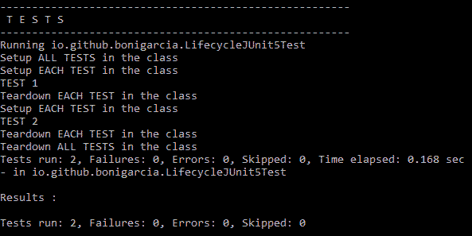
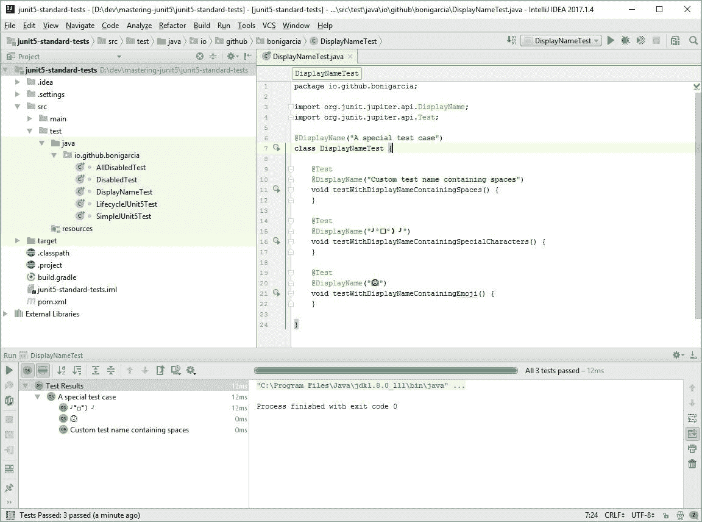
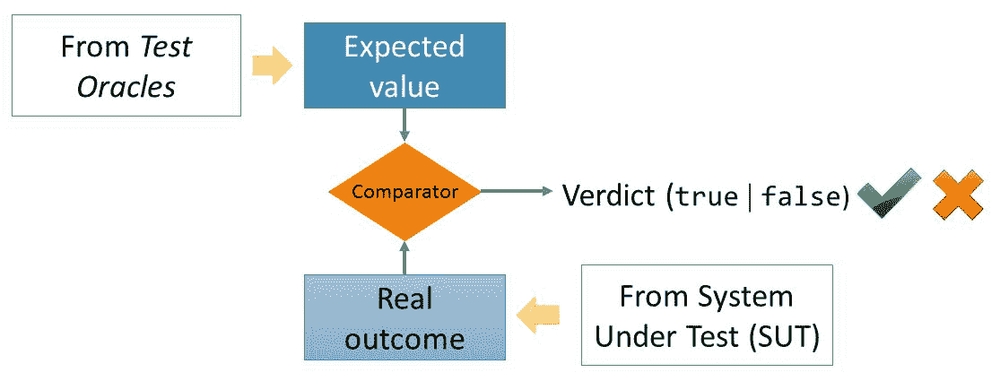
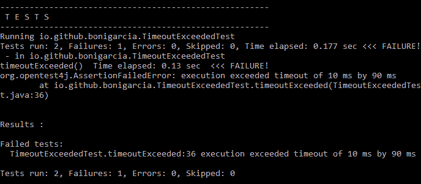
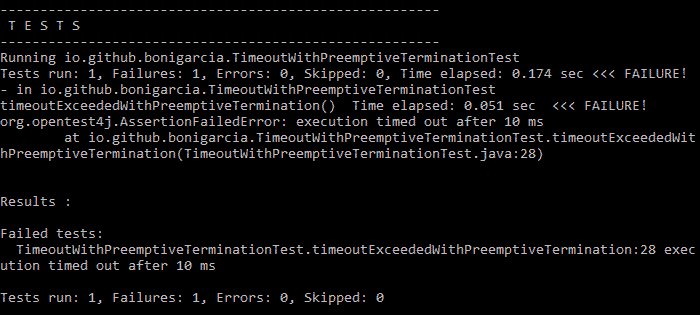
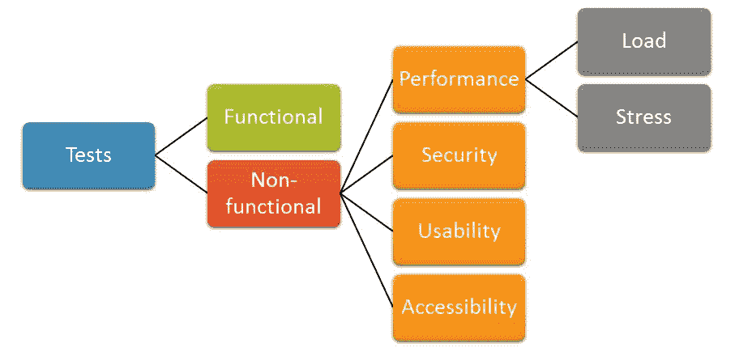
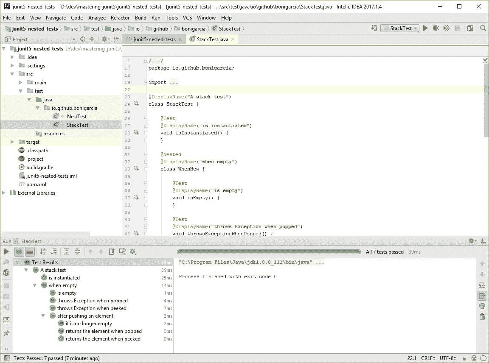

# JUnit5 标准测试

Talk is cheap. Show me the code.
*- Linus Torvalds*

JUnit5 提供了一个名为 Jupiter 的全新编程模型。我们可以将此编程模型视为软件工程师和测试人员的 API，允许创建 JUnit5 测试。这些测试稍后在 JUnit 平台上执行。我们将发现，Jupiter 编程模型允许创建许多不同类型的测试。本章介绍木星的基本知识。为此，本章的结构如下：

*   **测试生命周期**：在本节中，我们分析 Jupiter 测试的结构，描述 JUnit 5 编程模型中管理测试生命周期所涉及的注释。然后，我们将了解如何跳过测试，以及如何使用自定义显示名称注释测试。
*   **断言**：在本节中，我们首先简要介绍验证资产，称为断言（也称为谓词）。其次，我们研究 Jupiter 中如何实现断言。最后，我们介绍了几个关于断言的第三方库，并为 Hamcrest 提供了一些示例。
*   **标记和过滤测试**：在本节中，首先我们将学习如何标记 Jupiter 测试，即如何在 JUnit 5 中创建标记。然后，我们将学习如何使用 Maven 和 Gradle 过滤测试。最后，我们将分析如何使用 Jupiter 创建元注释。
*   **条件测试执行**：在本节中，我们将学习如何基于给定条件禁用测试。之后，我们回顾了 Jupiter 中的所谓假设，这是 Jupiter 提供的一种开箱即用的机制，只有在某些条件如预期的情况下才能运行测试。
*   **嵌套测试**：本节介绍 Jupiter 如何表达一组测试之间的关系，称为嵌套测试。
*   **重复测试**：本节回顾 Jupiter 如何提供重复测试指定次数的能力。
*   **从 JUnit 4 到 JUnit 5 的迁移**：本节提供了一组关于 JUnit 5 和它的直接前身 JUnit 4 之间主要区别的提示。然后，本节介绍 Jupiter 测试中对几个 JUnit4 规则的支持。

# 测试生命周期

正如我们在[第一章](1.html#K0RQ0-ef8404ed083f459d860f84cc8198f8bb)*软件质量与 Java 测试回顾*中看到的，单元测试用例由四个阶段组成：

1.  **设置**（可选）：首先，测试初始化测试夹具（在 SUT 图片之前）。
2.  **练习**：第二，测试与 SUT 互动，从中获得一些结果。
3.  **验证**：第三，使用一个或多个断言（也称为谓词）将被测系统的结果与预期值进行比较。因此，将创建一个测试裁决。
4.  **拆卸**（可选）：最后，测试释放测试夹具，使 SUT 回到初始状态。

在 JUnit4 中，有不同的注释来控制这些测试阶段。JUnit5 遵循相同的方法，即 Java 注释用于识别 Java 类中的不同方法，实现测试生命周期。在 Jupiter 中，所有这些注释都包含在包`org.junit.jupiter.api`中。

最基本的 JUnit 注释是`@Test`，它标识了必须作为测试执行的方法。因此，使用`org.junit.jupiter.api.Test`注释的 Java 方法将被视为测试。这个注释与 JUnit4 的`@Test`的区别是两个方面。一方面，Jupiter`@Test`注释没有声明任何属性。在 JUnit4 中，`@Test`可以声明测试超时（以毫秒为单位的 long 属性），另一方面，在 JUnit5 中，测试类和测试方法都不需要公开（这是 JUnit4 中的一个要求）。

看看下面的 Java 类。可能，这是我们可以用 Jupiter 创建的最简单的测试用例。它只是一个带有`@Test`注释的方法。测试逻辑（即前面描述的练习和验证阶段）将包含在方法`myTest`中。

```java
package io.github.bonigarcia;

import org.junit.jupiter.api.Test;

class SimpleJUnit5Test {

    @Test
    void mySimpleTest() {
          // My test logic here
    }

}
```

Jupiter 注释（也位于包`org.junit.jupiter.api`中）旨在控制 JUnit 5 测试中的设置和拆卸阶段，如下表所示：

| **JUnit 5 注释** | **说明** | **JUnit 4 的等价物** |
| --- | --- | --- |
| `@BeforeEach` | 在当前类中每个`@Test`之前执行的方法 | `@Before` |
| `@AfterEach` | 方法在当前类中的每个`@Test`之后执行 | `@After` |
| `@BeforeAll` | 方法在当前类中所有`@Test`之前执行 | `@BeforeClass` |
| `@AfterAll` | 方法在当前类中的所有`@Test`之后执行 | `@AfterClass` |

用这些注释（`@BeforeEach`、`@AfterEach`、`@AfterAll`和`@BeforeAll`注释的方法总是遗传的。

下图描述了 Java 类中这些注释的执行顺序：


Jupiter 注释来控制测试周期

让我们回到我们在本节开头看到的测试的通用结构。现在，我们能够映射 Jupiter 注释，以控制测试用例不同部分的测试生命周期。如下图所示，我们通过使用`@BeforeAll`和`@BeforeEach`注释方法来执行设置阶段。然后，我们使用`@Test`注释的方法进行练习和验证阶段。最后，我们使用`@AfterEach`和`@AfterAll`的方法执行拆卸过程。


单元测试用例阶段与 Jupiter 注释之间的关系

让我们看一个简单的例子，它在一个 Java 类中使用所有这些注释。本例定义了两个测试（即，两个用`@Test`注释的方法），我们用注释`@BeforeAll`、`@BeforeEach`、`@AfterEach`和`@AfterAll`为测试生命周期的其余部分定义了其他方法：

```java
package io.github.bonigarcia;

import org.junit.jupiter.api.AfterAll;
import org.junit.jupiter.api.AfterEach;
import org.junit.jupiter.api.BeforeAll;
import org.junit.jupiter.api.BeforeEach;
import org.junit.jupiter.api.Test;

class LifecycleJUnit5Test {

      @BeforeAll
      static void setupAll() {
            System.*out*.println("Setup ALL TESTS in the class");
      }

      @BeforeEach
      void setup() {
            System.*out*.println("Setup EACH TEST in the class");
      }

      @Test
      void testOne() {
            System.*out*.println("TEST 1");
      }

      @Test
      void testTwo() {
            System.*out*.println("TEST 2");
      }

      @AfterEach
      void teardown() {
            System.*out*.println("Teardown EACH TEST in the class");
      }

      @AfterAll
      static void teardownAll() {
            System.*out*.println("Teardown ALL TESTS in the class");
      }

}
```

如果我们运行这个测试类，首先执行`@BeforeAll`。然后，两种测试方法将依次执行，即第一种和另一种。在每次执行中，将在测试前执行标注有`@BeforeEach`的设置方法，然后执行`@AfterEach`方法。以下屏幕截图显示了使用 Maven 和命令行执行测试的情况：



执行控制其生命周期的 Jupiter 测试

# 测试实例生命周期

为了提供隔离执行，JUnit 5 框架在执行实际测试之前创建了一个新的测试实例（即，用`@Test`注释的方法）。此*每个方法*测试实例生命周期是 Jupiter 测试中的行为，也是它的前置程序（JUnit 3 和 4）中的行为。在 JUnit5 中，这种默认行为可以更改，只需用`@TestInstance(Lifecycle.PER_CLASS)`注释一个`test`类即可。使用此模式，将为每个类创建一次测试实例，而不是为每个测试方法创建一次。

每类的*行为意味着可以将`@BeforeAll`和`@AfterAll`方法声明为非静态。这有利于与一些高级功能结合使用，例如嵌套测试或默认测试接口（将在下一章中解释）。*

综上所述，考虑到扩展回调（如第 2 章*JUnit 5*的扩展模型部分*JUnit 5*的新增内容所述），用户代码和扩展的相对执行顺序如下图所示：


用户代码和扩展的相对执行顺序

# 跳过测试

Jupiter 注释`@Disabled`（位于包`org.junit.jupiter.api`中）可用于跳过测试。它可以在类级别或方法级别使用。以下示例在方法级别使用注释`@Disabled`，因此强制跳过测试：

```java
package io.github.bonigarcia;

import org.junit.jupiter.api.Disabled;
import org.junit.jupiter.api.Test;

class DisabledTest {

    @Disabled
    @Test
    void skippedTest() {
    }

}
```

如以下屏幕截图所示，当我们执行此示例时，测试将被视为跳过：


禁用的测试方法控制台输出

在另一个示例中，注释`@Disabled`位于类级别，因此将跳过类中包含的所有测试。请注意，可以在注释中指定自定义消息（通常是由于禁用的原因）：

```java
package io.github.bonigarcia;

import org.junit.jupiter.api.Disabled;
import org.junit.jupiter.api.Test;

@Disabled("All test in this class will be skipped")
class AllDisabledTest {

    @Test
    void skippedTestOne() {
    }

    @Test
    void skippedTestTwo() {
    }

}
```

以下屏幕截图显示了执行测试用例时如何跳过它（在本例中使用 Maven 和命令行）：


禁用测试类控制台输出

# 显示名称

JUnit4 基本上用方法名`@Test`来标识测试。这对名称测试施加了限制，因为这些名称受 Java 中声明方法的方式的约束。

为了克服这个问题，Jupiter 提供了为测试声明自定义显示名称（与测试名称不同）的功能。这是通过注释`@DisplayName`完成的。此注释声明测试类或测试方法的自定义显示名称。此名称将由测试运行程序和报告工具显示，它可以包含空格、特殊字符甚至表情符号。

看看下面的例子。我们正在使用`@DisplayName`注释测试类，以及使用自定义测试名称在类内声明的三种测试方法：

```java
package io.github.bonigarcia;

import org.junit.jupiter.api.DisplayName;
import org.junit.jupiter.api.Test;

@DisplayName("A special test case")
class DisplayNameTest {

    @Test
    @DisplayName("Custom test name containing spaces")
    void testWithDisplayNameContainingSpaces() {
    }

    @Test
    @DisplayName("(╯°Д°)╯")
    void testWithDisplayNameContainingSpecialCharacters() {
    }

    @Test
    @DisplayName("")
    void testWithDisplayNameContainingEmoji() {
    }

}
```

因此，在 JUnit5 兼容 IDE 中执行此测试时，我们会看到这些标签。下图显示了 IntelliJ 2016.2+上示例的执行情况：



在 IntelliJ 中使用*@DisplayName*执行测试用例

另一方面，在 Eclipse 4.7（氧气）或更新版本中也可以看到显示名称：


在 Eclipse 中使用*@DisplayName*执行测试用例

# 断言

正如我们所知，测试用例的一般结构由四个阶段组成：设置、练习、验证和分解。实际测试发生在第二和第三阶段，当测试逻辑与被测系统交互时，从中获得某种结果。将该结果与验证阶段的预期结果进行比较。在这个阶段，我们找到了我们称之为断言的东西。在本节中，我们将更仔细地了解它们。

断言（也称为谓词）是一种`boolean`语句，通常用于对软件正确性进行推理。从技术角度来看，断言由三部分组成（请参见列表后的图片）：

1.  首先，我们找到期望值，它来自我们称之为测试预言。测试 oracle 是预期输出的可靠来源，例如，系统规范。
2.  第二，我们找到了真实的结果，它来自于针对 SUT 的测试所做的练习阶段。

3.  最后，使用一些逻辑比较器比较这两个值。这种比较可以通过许多不同的方式进行，例如，我们可以比较对象标识（等于或不等于）、大小（较高或较低的值），等等。结果，我们得到了一个测试结论，它最终将定义测试是成功还是失败。



断言的示意图

# 朱庇特断言

让我们继续讨论 JUnit5 编程模型。Jupiter 附带了许多断言方法，如 JUnit4 中的断言方法，还添加了一些可用于 Java8Lambdas 的断言方法。所有 JUnit Jupiter 断言都是位于`org.junit.jupiter package`中的`Assertions`类中的静态方法。

下图显示了这些方法的完整列表：


Jupiter 断言的完整列表（类*org.junit.Jupiter.assertions*）

下表回顾了 Jupiter 中不同类型的基本断言：

| **断言** | **说明** |
| --- | --- |
| `fail` | 使用给定消息和/或异常使测试失败 |
| `assertTrue` | 断言提供的条件为真 |
| `assertFalse` | 断言提供的条件为假 |
| `assertNull` | 断言提供的对象是`null` |
| `assertNotNull` | 断言提供的对象不是`null` |
| `assertEquals` | 断言提供的两个对象相等 |
| `assertArrayEquals` | 断言提供的两个数组相等 |
| `assertIterableEquals` | 断言两个 iterable 对象完全相等 |
| `assertLinesMatch` | 断言两个字符串列表相等 |
| `assertNotEquals` | 断言提供的两个对象不相等 |
| `assertSame` | 与`==`相比，断言两个对象是相同的 |
| `assertNotSame` | 与`!=`相比，断言两个对象不同 |

对于表中包含的每个断言，可以提供可选的失败消息（字符串）。此消息始终是断言方法中的最后一个参数。这与 JUnit4 有一点不同，JUnit4 中此消息是方法调用的第一个参数。

下面的示例显示了使用`assertEquals`、`assertTrue`和`assertFalse` 断言的测试。注意，我们在类的开头导入静态断言方法，以提高测试逻辑的可读性。在本例中，我们找到了`assertEquals` 方法，在本例中比较了两种基本类型（也可以用于对象）。第二，`assertTrue`方法评估`boolean`表达式是否为真。第三，方法`assertFalse`计算布尔表达式是否为 false。在本例中，请注意消息是作为 Lamdba 表达式创建的。这样，断言消息将被延迟评估，以避免不必要地构造复杂消息：

```java
package io.github.bonigarcia;

import static org.junit.jupiter.api.Assertions.assertEquals;
import static org.junit.jupiter.api.Assertions.assertFalse;
import static org.junit.jupiter.api.Assertions.assertTrue;

import org.junit.jupiter.api.Test;

class StandardAssertionsTest {

    @Test
    void standardAssertions() {
          *assertEquals*(2, 2);
          *assertTrue*(true,
          "The optional assertion message is now the last parameter");
          *assertFalse*(false, () -> "Really " + "expensive " + "message" 
            + ".");
    }

}
```

本节的以下部分回顾了 Jupiter 提供的 advance 断言：`assertAll`、`assertThrows`、`assertTimeout`和`assertTimeoutPreemptively`。

# 断言组

一个重要的木星断言是`assertAll`。此方法允许同时对不同的断言进行分组。在分组断言中，始终执行所有断言，任何失败都将一起报告。

方法`assertAll`接受 lambda 表达式的 vargargs（`Executable…`）或这些表达式的流（`Stream<Executable>`）。可选地，`assertAll`的第一个参数可以是用于标记断言组的字符串消息。

让我们看一个例子。在下面的测试中，我们使用 lambda 表达式将几个`assertEquals`分组：

```java
package io.github.bonigarcia;

import static org.junit.jupiter.api.Assertions.assertAll;
import static org.junit.jupiter.api.Assertions.assertEquals;

import org.junit.jupiter.api.Test;

class GroupedAssertionsTest {

    @Test
    void groupedAssertions() {
          Address address = new Address("John", "Smith");
          // In a grouped assertion all assertions are executed, and any
          // failures will be reported together.
          *assertAll*("address", () -> *assertEquals*("John", 
          address.getFirstName()),
              () -> *assertEquals*("User", address.getLastName()));
    }

}
```

执行此测试时，将评估组的所有断言。由于第二个断言失败（`lastname`不匹配），因此在最终裁决中报告了一个失败，如以下屏幕截图所示：


分组断言的控制台输出示例

# 断言异常

另一个重要的木星断言是`assertThrows`。此断言允许验证代码段中是否引发了给定的异常。为此，方法`assertThrows`接受两个参数。第一个是预期的异常类，第二个是预期发生异常的可执行对象（lambda 表达式）：

```java
package io.github.bonigarcia;

import static org.junit.jupiter.api.Assertions.assertEquals;
import static org.junit.jupiter.api.Assertions.assertThrows;

import org.junit.jupiter.api.Test;

class ExceptionTest {

    @Test
    void exceptionTesting() {
          Throwable exception = 
            *assertThrows*(IllegalArgumentException.class,
            () -> {
               throw new IllegalArgumentException("a message");});
          *assertEquals*("a message", exception.getMessage());
    }

}
```

希望抛出`IllegalArgumentException`，这实际上是在这个 lambda 表达式中发生的。以下屏幕截图显示测试实际成功：


*资产抛出*示例的控制台输出

# 断言超时

为了评估 JUnit5 测试中的超时，Jupiter 提供了两个断言：`assertTimeout`和`assertTimeoutPreemptively`。一方面，`assertTimeout`允许我们验证给定操作的超时。在此断言中，使用标准 Java 包`java.time`的类`Duration`定义预期时间。

我们将看到几个正在运行的示例，以澄清此断言方法的使用。在下面的类中，我们发现两个测试使用了`assertTimeout`。第一个测试是为了成功而设计的，因为我们期望一个给定的操作花费不到 2 分钟，而我们在那里什么也不做。另一方面，第二个测试将失败，因为我们预期给定的操作最长需要 10 毫秒，而我们强制它持续 100 毫秒。

```java
package io.github.bonigarcia;

import static java.time.Duration.ofMillis;
import static java.time.Duration.ofMinutes;
import static org.junit.jupiter.api.Assertions.assertTimeout;

import org.junit.jupiter.api.Test;

class TimeoutExceededTest {

    @Test
    void timeoutNotExceeded() {
          *assertTimeout*(*ofMinutes*(2), () -> {
              // Perform task that takes less than 2 minutes
          });
    }

    @Test
    void timeoutExceeded() {
          *assertTimeout*(*ofMillis*(10), () -> {
              Thread.*sleep*(100);
          });
    }
}
```

**当我们执行此测试时，第二个测试被宣布为失败，因为在 90 毫秒内超时：**



*assertTimeout*第一例控制台输出

让我们看看更多使用`assertTimeout`的测试。在第一个测试中，`assertTimeout`在给定的超时时间内将一段代码作为 lambda 表达式进行求值，得到结果。在第二个测试中，`assertTimeout`在给定的超时时间内评估一个方法，获得其结果：

```java
package io.github.bonigarcia;

import static java.time.Duration.ofMinutes;
import static org.junit.jupiter.api.Assertions.assertEquals;
import static org.junit.jupiter.api.Assertions.assertTimeout;

import org.junit.jupiter.api.Test;

class TimeoutWithResultOrMethodTest {

    @Test
    void timeoutNotExceededWithResult() {
          String actualResult = *assertTimeout*(*ofMinutes*(1), () -> {
              return "hi there";
          });
          *assertEquals*("hi there", actualResult);
    }

    @Test
    void timeoutNotExceededWithMethod() {
          String actualGreeting = *assertTimeout*(*ofMinutes*(1),
              TimeoutWithResultOrMethodTest::*greeting*);
          *assertEquals*("hello world!", actualGreeting);
    }

    private static String greeting() {
          return "hello world!";
    }

}
```

在这两种情况下，测试所用的时间都比预期的少，因此两种测试都成功：


*assertTimeout*第二例控制台输出

另一个 Jupiter 超时断言称为`assertTimeoutPreemptively`。与`assertTimeoutPreemptively`关于`assertTimeout`的区别在于`assertTimeoutPreemptively`没有等到操作结束，当超过预期超时时，执行被中止。

在本例中，测试将失败，因为我们正在模拟持续 100 毫秒的操作，并且我们定义了 10 毫秒的超时：

```java
package io.github.bonigarcia;

import static java.time.Duration.ofMillis;
import static org.junit.jupiter.api.Assertions.assertTimeoutPreemptively;

import org.junit.jupiter.api.Test;

class TimeoutWithPreemptiveTerminationTest {

      @Test
      void timeoutExceededWithPreemptiveTermination() {
            *assertTimeoutPreemptively*(*ofMillis*(10), () -> {
                 Thread.*sleep*(100);
            });
      }

}
```

在本例中，当达到 10 ms 的超时时，测试立即被宣布为失败：



*AssertTimeOutpumptive*示例的控制台输出

# 第三方断言库

正如我们所看到的，为 Jupiter 提供的开箱即用的内置断言对于许多测试场景来说已经足够了。然而，有时可能需要更多的附加功能，例如匹配器。在这种情况下，JUnit 团队建议使用以下第三方断言库：

*   [Hamcrest](http://hamcrest.org/)：一个断言框架，用于编写 matcher 对象，允许以声明方式定义规则。
*   [AssertJ](http://joel-costigliola.github.io/assertj/)：流畅的 Java 断言。
*   [Truth](https://google.github.io/truth/)：一个断言 Java 库，旨在使测试断言和失败消息更具可读性。

在本节中，我们将简要回顾 Hamcrest。这个库提供了断言`assertThat`，它允许创建可读的高度可配置的断言。方法`assertThat`接受两个参数：第一个是实际对象，第二个是`Matcher`对象。此匹配器实现接口`org.hamcrest.Matcher`，并启用预期的部分或精确匹配。Hamcrest 提供不同的 matcher 实用程序，例如`is`、`either`、`or`、`not`和`hasItem`。Matcher 方法使用生成器模式，允许组合一个或多个 Matcher 来构建 Matcher 链。

为了使用 Hamcrest，首先我们需要在项目中导入依赖项。在 Maven 项目中，这意味着我们必须在`pom.xml`文件中包含以下依赖项：

```java
<dependency>
      <groupId>org.hamcrest</groupId>
      <artifactId>hamcrest-core</artifactId>
      <version>${hamcrest.version}</version>
      <scope>test</scope>
</dependency>
```

如果我们使用 Gradle，我们需要在`build.gradle`文件中添加等效配置：

```java
dependencies {
      testCompile("org.hamcrest:hamcrest-core:${hamcrest}")
}
```

通常，建议使用最新版本的 Hamcrest。我们可以在 Maven central 网站（[上查看 http://search.maven.org/](http://search.maven.org/) ）。

下面的示例演示如何在 Jupiter 测试中使用 Hamcrest。具体来说，本测试使用断言`assertThat`和匹配符`containsString`、`equalTo`和`notNullValue`：

```java
package io.github.bonigarcia;

import static org.hamcrest.CoreMatchers.containsString;
import static org.hamcrest.CoreMatchers.equalTo;
import static org.hamcrest.CoreMatchers.notNullValue;
import static org.hamcrest.MatcherAssert.assertThat;

import org.junit.jupiter.api.Test;

class HamcrestTest {

    @Test
    void assertWithHamcrestMatcher() {
          *assertThat*(2 + 1, *equalTo*(3));
          *assertThat*("Foo", *notNullValue*());
          *assertThat*("Hello world", *containsString*("world"));
    }

}
```

如以下屏幕截图所示，执行此测试时没有失败：


使用 Hamcrest 断言库的示例控制台输出

# 标记和过滤测试

可以通过注释`@Tag`（包`org.junit.jupiter.api`在 JUnit 5 编程模型中标记测试类和方法。这些标记稍后可用于过滤测试发现和执行。在下面的示例中，我们看到了`@Tag`在类级别和方法级别的使用：

```java
package io.github.bonigarcia;

import org.junit.jupiter.api.Tag;
import org.junit.jupiter.api.Test;

@Tag("simple")
class SimpleTaggingTest {

      @Test
      @Tag("taxes")
      void testingTaxCalculation() {
      }

}
```

从 JUnit 5 M6 开始，标记测试的标签应满足以下语法规则：

*   标记不能为 null 或空白。
*   修剪过的标记（即删除了前导和尾随空格的标记）不得包含空格。
*   修剪后的标签不得包含 ISO 控制字符或以下保留字符：`,`、`(`、`)`、`&`、`|`和`!`。

# 用 Maven 进行过滤测试

我们已经知道，我们需要在 Maven 项目中使用`maven-surefire-plugin`来执行 Jupiter 测试。此外，该插件允许我们以几种方式过滤测试执行：通过 JUnit 5 标记过滤，以及使用`maven-surefire-plugin`的常规包含/排除支持。

为了按标签过滤，应该使用`maven-surefire-plugin`配置的属性`includeTags`和`excludeTags`。让我们看一个例子来演示如何。考虑同一个 Maven 项目中包含的下列测试。一方面，这个类中的所有测试都标有`functional`这个词。

```java
package io.github.bonigarcia;

import org.junit.jupiter.api.Tag;
import org.junit.jupiter.api.Test;

@Tag("functional")
class FunctionalTest {

    @Test
    void testOne() {
        System.*out*.println("Functional Test 1");
    }

    @Test
    void testTwo() {
        System.*out*.println("Functional Test 2");
    }

}
```

另一方面，第二类中的所有测试都标记为`non-functional`，每个单独的测试也标记有更多的标记（`performance`、`security`、`usability`等等）：

```java
package io.github.bonigarcia;

import org.junit.jupiter.api.Tag;
import org.junit.jupiter.api.Test;

@Tag("non-functional")
class NonFunctionalTest {

    @Test
    @Tag("performance")
    @Tag("load")
    void testOne() {
        System.*out*.println("Non-Functional Test 1 (Performance/Load)");
    }

    @Test
    @Tag("performance")
    @Tag("stress")
    void testTwo() {
        System.*out*.println("Non-Functional Test 2 (Performance/Stress)");
    }

    @Test
    @Tag("security")
    void testThree() {
        System.*out*.println("Non-Functional Test 3 (Security)");
    }

    @Test
    @Tag("usability")
    void testFour() {
        System.*out*.println("Non-Functional Test 4 (Usability)");    }

}
```

如前所述，我们在 Maven`pom.xml`文件中使用配置关键字`includeTags`和`excludeTags`。在本例中，我们包括标签为`functional`的测试，并排除`non-functional`：

```java
    <build>
        <plugins>
            <plugin>
                <artifactId>maven-surefire-plugin</artifactId>
                <version>${maven-surefire-plugin.version}</version>
                <configuration>
                    <properties>
                        <includeTags>functional</includeTags>
                        <excludeTags>non-functional</excludeTags>
                    </properties>
                </configuration>
                <dependencies>
                    <dependency>
                        <groupId>org.junit.platform</groupId>
                        <artifactId>junit-platform-surefire-provider</artifactId>
                        <version>${junit.platform.version}</version>
                    </dependency>
                    <dependency>
                        <groupId>org.junit.jupiter</groupId>
                        <artifactId>junit-jupiter-engine</artifactId>
                        <version>${junit.jupiter.version}</version>
                    </dependency>
                </dependencies>
            </plugin>
        </plugins>
    </build>
```

因此，当我们尝试执行项目内的所有测试时，只会执行两个测试（标记为`functional`的测试），其余测试不被视为测试：


Maven 通过标记执行测试筛选

# Maven 定期支持

Maven 插件的常规包含/排除支持仍然可以用于选择`maven-surefire-plugin`将执行哪些测试。为此，我们使用关键字`includes`和`excludes`来配置用于过滤插件执行的测试名模式。请注意，对于包含和排除，可以使用正则表达式指定测试文件名的模式：

```java
<configuration>
   <includes>
      <include>**/Test*.java</include>
      <include>**/*Test.java</include>
      <include>**/*TestCase.java</include>
   </includes>
</configuration>
<configuration>
   <excludes>
      <exclude>**/TestCircle.java</exclude>
      <exclude>**/TestSquare.java</exclude>
   </excludes>
</configuration>
```

这三种模式，即包含单词*Test*或以*TestCase*结尾的 Java 文件，默认情况下由*maven surefire 插件*包含。

# 梯度滤波试验

现在让我们转到格拉德尔。正如我们已经知道的，我们还可以使用 Gradle 来运行 JUnit5 测试。关于过滤过程，我们可以根据以下内容选择要执行的测试：

*   测试引擎：使用关键字引擎，我们可以包括或排除要使用的测试引擎（即`junit-jupiter`或`junit-vintage`。
*   Jupiter 标签：使用关键字`tags`。
*   Java 包：使用关键字`packages`。
*   类名模式：使用关键字`includeClassNamePattern`。

默认情况下，所有引擎和标签都包含在测试计划中。仅应用包含单词`Tests`的类名。让我们看一个工作示例。我们重用了前 Maven 项目中提供的相同测试，但这次是在 Gradle 项目中：

```java
junitPlatform {
      filters {
            engines {
                  include 'junit-jupiter'
                  exclude 'junit-vintage'
            }
            tags {
                  include 'non-functional'
                  exclude 'functional'
            }
            packages {
                  include 'io.github.bonigarcia'
                  exclude 'com.others', 'org.others'
            }
            includeClassNamePattern '.*Spec'
            includeClassNamePatterns '.*Test', '.*Tests'
      }
}
```

请注意，我们包括了标签`non-functional`而不包括`functional`，因此我们执行了四个测试：


按标记分级执行测试筛选

# 元注释

本节的最后一部分是关于元注释的定义。JUnit Jupiter 注释可以用于其他注释的定义中（也就是说，可以用作元注释）。这意味着我们可以定义自己的组合注释，该注释将自动继承其元注释的语义。通过重用 JUnit5 注释`@Tag`，该特性非常方便地创建我们的自定义测试分类法。

让我们看一个例子。考虑下面的测试用例分类，我们将所有测试归类为功能性的和非功能性的，然后在非功能性测试下再做一个级别：



测试分类示例（功能性和非功能性）

考虑到该方案，我们将为该树结构的叶子创建自定义元注释：`@Functional`、`@Security`、`@Usability`、`@Accessiblity`、`@Load`和`@Stress`。请注意，根据之前定义的结构，我们在每个注释中使用一个或多个`@Tag`注释。首先，我们可以看到`@Functional`的声明：

```java
package io.github.bonigarcia;

import java.lang.annotation.ElementType;
import java.lang.annotation.Retention;
import java.lang.annotation.RetentionPolicy;
import java.lang.annotation.Target;
import org.junit.jupiter.api.Tag;

@Target({ ElementType.***TYPE**, ElementType.**METHOD** })* @Retention(RetentionPolicy.***RUNTIME**)* @Tag("functional")
public @interface Functional {
}
```

然后，我们用标签`non-functional`和`security`定义注释`@Security`：

```java
package io.github.bonigarcia;

import java.lang.annotation.ElementType;
import java.lang.annotation.Retention;
import java.lang.annotation.RetentionPolicy;
import java.lang.annotation.Target;
import org.junit.jupiter.api.Tag;

@Target({ ElementType.***TYPE**, ElementType.**METHOD** })* @Retention(RetentionPolicy.***RUNTIME**)* @Tag("non-functional")
@Tag("security")
public @interface Security {
}
```

同样，我们定义了注释`@Load`，但这次用`non-functional`、`performance`和`load`标记：

```java
package io.github.bonigarcia;

import java.lang.annotation.ElementType;
import java.lang.annotation.Retention;
import java.lang.annotation.RetentionPolicy;
import java.lang.annotation.Target;
import org.junit.jupiter.api.Tag;

@Target({ ElementType.***TYPE**, ElementType.**METHOD** })* @Retention(RetentionPolicy.***RUNTIME**)* @Tag("non-functional")
@Tag("performance")
@Tag("load")
public @interface Load {
}
```

最后我们创建注释`@Stress`（带有标签`non-functional`、`performance`和`stress`：

```java
package io.github.bonigarcia;

import java.lang.annotation.ElementType;
import java.lang.annotation.Retention;
import java.lang.annotation.RetentionPolicy;
import java.lang.annotation.Target;
import org.junit.jupiter.api.Tag;

@Target({ ElementType.***TYPE**, ElementType.**METHOD** })* @Retention(RetentionPolicy.***RUNTIME**)* @Tag("non-functional")
@Tag("performance")
@Tag("stress")
public @interface Stress {
}
```

现在，我们可以使用注释来标记（以及以后的过滤器）测试。例如，在下面的示例中，我们在类级别使用注释`@Functional`：

```java
package io.github.bonigarcia;

import org.junit.jupiter.api.Test;

@Functional
class FunctionalTest {

      @Test
      void testOne() {
            System.*out*.println("Test 1");
      }

      @Test
      void testTwo() {
            System.*out*.println("Test 2");
      }

}
```

我们还可以在方法级别输出注释。在下面的测试中，我们用不同的注释（`@Load`、`@Stress`、`@Security`、`@Accessibility`对不同的测试（方法）进行注释：

```java
package io.github.bonigarcia;

import org.junit.jupiter.api.Test;

class NonFunctionalTest {

    @Test
    @Load
    void testOne() {
        System.*out*.println("Test 1");
    }

    @Test
    @Stress
    void testTwo() {
        System.*out*.println("Test 2");
    }

    @Test
    @Security
    void testThree() {
        System.*out*.println("Test 3");
    }

    @Test
    @Usability
    void testFour() {
        System.*out*.println("Test 4");    }

}
```

总之，我们可以通过简单地更改包含的标记来过滤测试。一方面，我们可以通过标签`functional`进行过滤。注意，在这种情况下，只执行两个测试。以下代码段显示了使用 Maven 进行此类筛选的输出：


使用 Maven 和命令行按标签（功能）过滤测试

另一方面，我们也可以使用不同的标签进行过滤，例如`non-functional`。下图显示了这种类型的过滤示例，这次使用 Gradle。通常，我们可以通过分叉 GitHub 存储库（[来处理这些示例 https://github.com/bonigarcia/mastering-junit5](https://github.com/bonigarcia/mastering-junit5)：


使用 Gradle 和命令行按标签（非功能性）筛选测试

# 条件测试执行

为了建立测试执行的自定义条件，我们需要使用 JUnit 5 扩展模型（在第 2 章中介绍，*JUnit 5*中的新增内容，在*JUnit 5*的扩展模型一节中介绍）。具体来说，我们需要使用名为`ExecutionCondition`的条件扩展点。此扩展可用于停用类中的所有测试或单个测试。

我们将看到一个工作示例，其中我们创建了一个自定义注释来禁用基于操作系统的测试。首先，我们创建一个自定义实用程序枚举来选择一个操作系统（`WINDOWS`、`MAC`、`LINUX`和`OTHER`：

```java
package io.github.bonigarcia;

public enum Os {
    ***WINDOWS***, ***MAC***, ***LINUX***, ***OTHER***;

    public static Os determine() {
        Os out = ***OTHER***;
        String myOs = System.*getProperty*("os.name").toLowerCase();
        if (myOs.contains("win")) {
            out = ***WINDOWS***;
        } 
        else if (myOs.contains("mac")) {
            out = ***MAC***;
        } 
        else if (myOs.contains("nux")) {
            out = ***LINUX***;
        }
        return out;
    }
}
```

然后，我们创建`ExecutionCondition`的扩展。在本例中，通过检查是否存在自定义注释`@DisabledOnOs`来进行评估。当注释`@DisabledOnOs`存在时，将操作系统的值与当前平台进行比较。根据该条件的结果，测试被禁用或启用。

```java
package io.github.bonigarcia;

import java.lang.reflect.AnnotatedElement;
import java.util.Arrays;
import java.util.Optional;
import org.junit.jupiter.api.extension.ConditionEvaluationResult;
import org.junit.jupiter.api.extension.ExecutionCondition;
import org.junit.jupiter.api.extension.ExtensionContext;
import org.junit.platform.commons.util.AnnotationUtils;

public class OsCondition implements ExecutionCondition {

    @Override
    public ConditionEvaluationResult evaluateExecutionCondition(
            ExtensionContext context) {
          Optional<AnnotatedElement> element = context.getElement();
          ConditionEvaluationResult out = ConditionEvaluationResult
                .*enabled*("@DisabledOnOs is not present");
          Optional<DisabledOnOs> disabledOnOs = AnnotationUtils
                .*findAnnotation*(element, DisabledOnOs.class);
          if (disabledOnOs.isPresent()) {
             Os myOs = Os.*determine*();
             if(Arrays.asList(disabledOnOs.get().value())
                 .contains(myOs)) {
             out = ConditionEvaluationResult
               .*disabled*("Test is disabled on " + myOs);
             } 
 else {
               out = ConditionEvaluationResult
                .*enabled*("Test is not disabled on " + myOs);
             }
           }
           System.*out*.println("--> " + out.getReason().get());
           return out;
    }

}
```

此外，我们需要创建自定义注释`@DisabledOnOs`，该注释还带有指向扩展点的`@ExtendWith`注释。

```java
package io.github.bonigarcia;

import java.lang.annotation.ElementType;
import java.lang.annotation.Retention;
import java.lang.annotation.RetentionPolicy;
import java.lang.annotation.Target;
import org.junit.jupiter.api.extension.ExtendWith;

@Target({ ElementType.*TYPE*, ElementType.*METHOD* })
@Retention(RetentionPolicy.*RUNTIME*)
@ExtendWith(OsCondition.class)
public @interface DisabledOnOs {
    Os[] value();
}
```

最后，我们在 Jupiter 测试中使用注释`@DisabledOnOs`。

```java
import org.junit.jupiter.api.Test;

import static io.github.bonigarcia.Os.*MAC*;
import static io.github.bonigarcia.Os.*LINUX*;

class DisabledOnOsTest {

    @DisabledOnOs({ *MAC*, *LINUX* })
    @Test
    void conditionalTest() {
        System.*out*.println("This test will be disabled on MAC and LINUX");
    }

}
```

如果我们在 Windows 计算机上执行此测试，则不会跳过该测试，正如我们在该快照中看到的：


条件测试示例的执行

# 假设

本节的这一部分是关于所谓的假设。假设只允许我们在某些条件符合预期的情况下运行测试。所有 JUnit Jupiter 假设都是`Assumptions`类中的静态方法，位于`org.junit.jupiter`包中。以下屏幕截图显示了此类的所有方法：


*org.junit.jupiter.aspections*类的方法

一方面，方法`assumeTrue`和`assumeFalse`可用于跳过不满足前提条件的测试。另一方面，方法`assumingThat`用于在测试中调节零件的执行：

```java
package io.github.bonigarcia;

import static org.junit.jupiter.api.Assertions.*fail*;
import static org.junit.jupiter.api.Assumptions.*assumeFalse*;
import static org.junit.jupiter.api.Assumptions.*assumeTrue*;
import static org.junit.jupiter.api.Assumptions.*assumingThat*;

import org.junit.jupiter.api.Test;

class AssumptionsTest {

    @Test
    void assumeTrueTest() {
        *assumeTrue*(false);
        *fail*("Test 1 failed");
    }

    @Test
    void assumeFalseTest() {
        *assumeFalse*(this::getTrue);
        *fail*("Test 2 failed");
    }

    private boolean getTrue() {
        return true;
    }

    @Test
    void assummingThatTest() {
        *assumingThat*(false, () -> *fail*("Test 3 failed"));
    }

}
```

请注意，在本例中，由于未满足假设，因此跳过了前两个测试（`assumeTrueTest`和`assumeFalseTest`。然而，在`assummingThatTest`测试中，只有这部分测试（本例中为 lambda 表达式）没有执行，但整个测试没有跳过：


假设的执行测试示例

# 嵌套测试

嵌套测试为测试编写器提供了更多的功能来表示一组测试中的关系和顺序。JUnit5 可以轻松地嵌套测试类。我们只需要用`@Nested`注释内部类，其中的所有测试方法也将执行，从常规测试（在顶级类中定义）到每个内部类中定义的测试。

我们需要考虑的第一件事是，只有非静态嵌套类（即内部类）可以用作`@Nested`测试。嵌套可以是任意深度，每个测试（即，`@BeforeEach`和`@AfterEach`方法）的设置和分解在嵌套测试中继承。然而，内部类不能定义`@BeforeAll`和`@AfterAll`方法，因为 Java 不允许内部类中存在静态成员。但是，使用测试类中的注释`@TestInstance(Lifecycle.PER_CLASS)`可以避免此限制。如本章*测试实例生命周期*一节所述，此注释强制每个类实例化一个测试实例，而不是每个方法实例化一个测试实例（默认行为）。这样，方法`@BeforeAll`和`@AfterAll`不需要是静态的，因此可以在嵌套测试中使用。

让我们看一个简单的例子，它由一个 Java 类组成，有两个级别的内部类，即该类包含两个嵌套的内部类，并用`@Nested`注释。正如我们所看到的，这门课有三个等级的考试。请注意，顶级类定义了一个设置方法（`@BeforeEach`，也是第一个嵌套类（在本例中称为`InnerClass1`）。在顶级类中，我们定义了一个测试（称为`topTest`），在每个嵌套类中，我们找到了另一个测试（分别称为`innerTest1`和`innerTest2`：

```java
package io.github.bonigarcia;

import org.junit.jupiter.api.BeforeEach;
import org.junit.jupiter.api.Nested;
import org.junit.jupiter.api.Test;

class NestTest {

    @BeforeEach
    void setup1() {
        System.*out*.println("Setup 1");
    }

    @Test
    void topTest() {
       System.*out*.println("Test 1");
    }

    @Nested
    class InnerClass1 {

        @BeforeEach
        void setup2() {
            System.*out*.println("Setup 2");
        }

        @Test
        void innerTest1() {
            System.*out*.println("Test 2");
        }

        @Nested
        class InnerClass2 {

            @Test
 void innerTest2() {
                System.*out*.println("Test 3");
            }
        } 
    }

}
```

如果执行这个示例，只需查看控制台跟踪，就可以跟踪嵌套测试的执行。请注意，每次测试前都会执行 top`@BeforeEach`方法（称为`setup1`）。因此，在实际测试执行之前，跟踪`Setup 1`始终存在于控制台中。每个测试还向控制台写入一行代码。我们可以看到，第一个测试记录了`Test 1`。然后，执行内部类中定义的测试。第一个内部类执行测试`innerTest1`，但之后，执行顶级类和第一个内部类的设置方法（分别记录`Setup 1`和`Setup 2`。

最后，执行最后一个内部类（`innerTest2`中定义的测试，但通常在测试之前执行设置方法的级联：


执行嵌套测试示例的控制台输出

嵌套测试可以与显示名称（即注释`@DisplayName`）结合使用，以帮助生成可读性良好的测试输出。下面的示例演示了如何。此类包含测试堆栈实现的结构，即*后进先出*（LIFO）集合。该类被设计为在堆栈刚刚实例化时首先测试堆栈（方法`isInstantiatedWithNew`。之后，第一个内部类（`WhenNew`应该将堆栈作为一个空集合进行测试（方法`isEmpty`、`throwsExceptionWhenPopped`和`throwsExceptionWhenPeeked`。最后，第二个内部类应该在堆栈不为空时进行测试（方法`isNotEmpty`、`returnElementWhenPopped`和`returnElementWhenPeeked`：

```java
package io.github.bonigarcia;

import org.junit.jupiter.api.DisplayName;
import org.junit.jupiter.api.Nested;
import org.junit.jupiter.api.Test;

@DisplayName("A stack test")

 class StackTest {

     @Test
     @DisplayName("is instantiated")
     void isInstantiated() {
     }

     @Nested
     @DisplayName("when empty")
     class WhenNew {

         @Test
         @DisplayName("is empty")
         void isEmpty() {
         }

         @Test
         @DisplayName("throws Exception when popped")
         void throwsExceptionWhenPopped() {
         }

         @Test
         @DisplayName("throws Exception when peeked")
         void throwsExceptionWhenPeeked() {
         }

         @Nested
         @DisplayName("after pushing an element")
         class AfterPushing {

             @Test
             @DisplayName("it is no longer empty")
             void isNotEmpty() {
             }

             @Test
             @DisplayName("returns the element when popped")
             void returnElementWhenPopped() {
             }

             @Test
             @DisplayName("returns the element when peeked")
             void returnElementWhenPeeked() {
             }

         }
     }
 }
```

这类测试的目的是双重的。一方面，类结构提供了执行测试的顺序。另一方面，`@DisplayName`的使用提高了测试执行的可读性。我们可以看到，当测试在 IDE 中执行时，具体地说是在 IntelliJ IDEA 中。



在 Intellij IDEA 上使用*@DisplayName*执行嵌套测试

# 反复试验

JUnit Jupiter 提供了重复测试指定次数的能力，只需用`@RepeatedTest`注释一个方法，指定所需的总重复次数。每次重复测试的行为与常规`@Test`方法完全相同。此外，每个重复测试保留相同的生命周期回调（`@BeforeEach`、`@AfterEach`等等）。

以下 Java 类包含一个将重复五次的测试：

```java
package io.github.bonigarcia;

import org.junit.jupiter.api.RepeatedTest;

class SimpleRepeatedTest {

    @RepeatedTest(5)
    void test() {
        System.*out*.println("Repeated test");
    }

}
```

由于此测试只在标准输出中写入一行（`Repeated test`），因此在控制台中执行此测试时，我们将看到五次跟踪：


在控制台中执行重复测试

除了指定重复次数外，还可以通过`@RepeatedTest`注释的名称属性为每次重复配置自定义显示名称。显示名称可以是由静态文本和动态占位符组合而成的模式。目前支持以下各项：

*   `{displayName}`：这是`@RepeatedTest`方法的名称。
*   `{currentRepetition}`：这是当前的重复次数。
*   `{totalRepetitions}`：这是重复的总次数。

以下示例显示了一个具有三个重复测试的类，其中显示名称配置为属性名称`@RepeatedTest`：

```java
package io.github.bonigarcia;

import org.junit.jupiter.api.DisplayName;
import org.junit.jupiter.api.RepeatedTest;
import org.junit.jupiter.api.TestInfo;

class TunningDisplayInRepeatedTest {

    @RepeatedTest(value = 2, name = "{displayName} 
    {currentRepetition}/{totalRepetitions}")
    @DisplayName("Repeat!")
    void customDisplayName(TestInfo testInfo) {
        System.*out*.println(testInfo.getDisplayName());
    }

    @RepeatedTest(value = 2, name = RepeatedTest.*LONG_DISPLAY_NAME*)
    @DisplayName("Test using long display name")
    void customDisplayNameWithLongPattern(TestInfo testInfo) {
        System.*out*.println(testInfo.getDisplayName());
    }

    @RepeatedTest(value = 2, name = RepeatedTest.*SHORT_DISPLAY_NAME*)
    @DisplayName("Test using short display name")
    void customDisplayNameWithShortPattern(TestInfo testInfo) {
        System.*out*.println(testInfo.getDisplayName());
    }

}
```

在本测试中，这些重复测试的显示名称如下：

*   对于测试`customDisplayName`，显示名称将遵循长显示格式：
    *   `Repeat 1 out of 2`。
    *   `Repeat 2 out of 2`。
*   对于测试`customDisplayNameWithLongPattern`，显示名称将遵循长显示格式：
    *   `Repeat! 1/2`。
    *   `Repeat! 2/2`。
*   对于测试`customDisplayNameWithShortPattern`，本测试中的显示名称将遵循简短的显示格式：
    *   `Test using long display name :: repetition 1 of 2`。
    *   `Test using long display name :: repetition 2 of 2`。


结合*@DisplayName*执行重复测试示例

# 从 JUnit4 迁移到 JUnit5

JUnit5 本机不支持 JUnit4 特性，例如规则和运行程序。尽管如此，JUnit 5 通过 JUnit Vintage 测试引擎提供了一条温和的迁移路径，它允许我们在 JUnit 平台的顶部执行遗留测试用例（包括 JUnit 4 和 JUnit 3）。

下表可用于总结 JUnit 4 和 JUnit 5 之间的主要差异：

| **特征** | **JUnit 4** | **JUnit 5** |
| --- | --- | --- |
| 注释包 | `org.junit` | `org.junit.jupiter.api` |
| 声明测试 | `@Test` | `@Test` |
| 所有测试的预备 | `@BeforeClass` | `@BeforeAll` |
| 每次测试的预备 | `@Before` | `@BeforeEach` |
| 每次测试的收尾 | `@After` | `@AfterEach` |
| 所有测试的收尾 | `@AfterClass` | `@AfterAll` |
| 标记和过滤 | `@Category` | `@Tag` |
| 禁用测试方法或类 | `@Ignore` | `@Disabled` |
| 嵌套测试 | NA | `@Nested` |
| 重复测试 | 使用自定义规则 | `@Repeated` |
| 动态测试 | NA | `@TestFactory` |
| 测试模板 | NA | `@TestTemaplate` |
| 运行器 | `@RunWith` | 此功能被扩展模型（`@ExtendWith`替代） |
| 规则 | `@Rule`和`@ClassRule` | 此功能被扩展模型（`@ExtendWith`替代） |

# Jupiter 中的规则支持

如前所述，Jupiter 本机不支持 JUnit4 规则。然而，JUnit 5 团队意识到 JUnit 4 规则现在在许多测试代码库中被广泛采用。为了提供从 JUnit4 到 JUnit5 的无缝迁移，JUnit5 团队实现了`junit-jupiter-migrationsupport`模块。如果要在项目中使用此模块，则应导入模块依赖项。Maven 的示例如下所示：

```java
<dependency>
   <groupId>org.junit.jupiter</groupId>
   <artifactId>junit-jupiter-migrationsupport</artifactId>
   <version>${junit.jupiter.version}</version>
   <scope>test</scope>
</dependency>
```

此依赖项的 Gradle 声明如下所示：

```java
dependencies {
      testCompile("org.junit.jupiter:junit-jupiter-
      migrationsupport:${junitJupiterVersion}")
}
```

JUnit 5 中的规则支持仅限于那些语义上与 Jupiter 扩展模型兼容的规则，包括以下规则：

*   `junit.rules.ExternalResource`（包括`org.junit.rules.TemporaryFolder`）。
*   `junit.rules.Verifier`（包括`org.junit.rules.ErrorCollector`）。
*   `junit.rules.ExpectedException`。

为了在 Jupiter 测试中启用这些规则，测试类应该使用类级注释`@EnableRuleMigrationSupport`（位于包`org.junit.jupiter.migrationsupport.rules`中）进行注释。让我们看几个例子。首先，以下测试用例在 Jupiter 测试中定义并使用了一个`TemporaryFolder`JUnit4 规则：

```java
package io.github.bonigarcia;

import java.io.IOException;
import org.junit.Rule;
import org.junit.jupiter.api.AfterEach;
import org.junit.jupiter.api.BeforeEach;
import org.junit.jupiter.api.Test;
import org.junit.jupiter.migrationsupport.rules.EnableRuleMigrationSupport;
import org.junit.rules.TemporaryFolder;

@EnableRuleMigrationSupport
class TemporaryFolderRuleTest {

    @Rule
    TemporaryFolder temporaryFolder = new TemporaryFolder();

    @BeforeEach
    void setup() throws IOException {
        temporaryFolder.create();
    }

    @Test
    void test() {
        System.*out*.println("Temporary folder: " +         
            temporaryFolder.getRoot());
    }

    @AfterEach
    void teardown() {
        temporaryFolder.delete();
    }

}
```

执行此测试时，临时文件夹的路径将记录在标准输出中：


使用 JUnit 4*临时文件夹*规则执行 Jupiter 测试

下面的测试演示了在 Jupiter 测试中使用`ErrorCollector`规则。请注意，收集器规则允许在发现一个或多个问题后继续执行测试：

```java
package io.github.bonigarcia;

import static org.hamcrest.CoreMatchers.equalTo;

import org.junit.Rule;
import org.junit.jupiter.api.Test;
import org.junit.jupiter.migrationsupport.rules.EnableRuleMigrationSupport;
import org.junit.rules.ErrorCollector;

@EnableRuleMigrationSupport
class ErrorCollectorRuleTest {

    @Rule
    public ErrorCollector collector = new ErrorCollector();

    @Test
    void test() {
        collector.checkThat("a", *equalTo*("b"));
        collector.checkThat(1, *equalTo*(2));
        collector.checkThat("c", *equalTo*("c"));
    }

}
```

这些问题在测试结束时一起报告：


使用 JUnit 4*ErrorCollector*规则执行 Jupiter 测试

最后，`ExpectedException`规则允许我们配置测试，以预期在测试逻辑中抛出的给定异常：

```java
package io.github.bonigarcia;

import org.junit.Rule;
import org.junit.jupiter.api.Test;
import org.junit.jupiter.migrationsupport.rules.EnableRuleMigrationSupport;
import org.junit.rules.ExpectedException;

@EnableRuleMigrationSupport
class ExpectedExceptionRuleTest {

    @Rule
    ExpectedException thrown = ExpectedException.*none*();

    @Test
    void throwsNothing() {
    }

    @Test
    void throwsNullPointerException() {
        thrown.expect(NullPointerException.class);
        throw new NullPointerException();
    }

}
```

在本例中，即使当第二个测试引发`NullPointerException`时，该测试也将被标记为已成功，因为该异常是预期的。


使用 JUnit 4*ExpectedException*规则执行 Jupiter 测试

# 总结

在本章中，我们介绍了 JUnit5 框架的全新编程模型 Jupiter 的基础知识。这个编程模型提供了一个丰富的 API，从业者可以使用它来创建测试用例。Jupiter 最基本的元素是注释`@Test`，它标识了被视为测试的 Java 类中的方法（即练习和验证 SUT 的逻辑）。此外，可以使用不同的注释来控制测试生命周期，即，`@BeforeAll`、`@BeforeEach`、`@AfterEach`和`@AfterAll`。其他有用的 Jupiter 注释有`@Disabled`（跳过测试）、`@DisplayName`（提供测试名称）、`@Tag`（标记和过滤测试）。

Jupiter 提供了一组丰富的断言，这些断言是类`Assertions`中的静态方法，用于验证从 SUT 获得的结果是否符合某些预期值。我们可以通过几种方式为测试执行施加条件。一方面，如果某些条件符合预期，我们可以使用`Assumptions`只运行测试（或部分测试）。

我们已经了解了如何使用`@Nested`简单地注释内部 Java 类来创建嵌套测试。这可用于按照给定嵌套类关系的顺序创建测试执行。我们还研究了使用 JUnit5 编程模型创建重复测试的容易程度。注释`@RepeatedTest`用于该目的，提供重复测试指定次数的能力。最后，我们已经了解了 Jupiter 如何为几个遗留的 JUnit4 测试规则提供支持，包括`ExternalResource`、`Verifier`和`ExpectedException`。

在第 4 章中*使用高级 JUnit 特性简化测试*我们继续发现 JUnit 编程模型。具体地说，我们回顾了 JUnit5 的高级特性，即依赖注入、动态测试、测试接口、测试模板、参数化测试、JUnit5 和 Java9 的兼容性。最后，我们回顾了 JUnit5.1 积压工作中计划的一些特性，在撰写本文时这些特性尚未实现。**