# 使用高级 JUnit 特性简化测试

Simplicity is the ultimate sophistication.
- Leonardo da Vinci

到目前为止，我们已经发现了 Jupiter 的基础知识，Jupiter 是 JUnit5 框架提供的全新编程模型。此外，Jupiter 提供了丰富的可能性，允许创建不同类型的测试用例。在本章中，我们将回顾这些高级功能。为此，本章的结构如下：

*   **依赖注入**：本节首先介绍测试类中构造函数和方法的依赖注入。然后，回顾 Jupiter 中提供的三参数解析器。这些解析器允许在测试内部注入`TestInfo`、`RepetitionInfo`和`TestReporter`对象。
*   **动态测试**：本节讨论如何使用`dynamicTest`和`stream`方法在 JUnit 5 中实现动态测试。
*   **测试接口**：本节回顾了可以在测试接口和默认方法上声明的 Jupiter 注释。
*   **测试模板**：JUnit5 引入了测试用例模板的概念。这些模板将被多次调用，具体取决于调用上下文。
*   **参数化测试**：与 JUnit 4 一样，JUnit 5 提供了创建由不同输入数据驱动的测试的功能，即参数化测试。我们将发现，在 Jupiter 编程模型中，对这种测试的支持已经得到了显著增强。
*   **Java 9**：2017 年 9 月 21 日，Java 9 发布。我们将发现，JUnit5 的实现与 Java9 兼容，特别强调 Java9 的模块化特性。

# 依赖注入

在以前的 JUnit 版本中，测试构造函数和方法不允许有参数。JUnit5 中的一个主要变化是现在允许测试构造函数和方法都包含参数。此功能支持构造函数和方法的依赖项注入。

正如本书 JUnit 5 中的[第 2 章](2.html#1GKCM0-ef8404ed083f459d860f84cc8198f8bb)*所介绍的，扩展模型有一个扩展，为 Jupiter 测试提供依赖注入，名为`ParameterResolver`，它为希望在运行时动态解析参数的测试扩展定义了一个 API。*

如果测试构造函数或带有`@Test,``@TestFactory`、`@BeforeEach`、`@AfterEach`、`@BeforeAll`或`@AfterAll`注释的方法接受一个参数，则该参数在运行时由解析器解析（具有父类`ParameterResolver`的对象）。JUnit5 中有三个自动注册的内置解析器：`TestInfoParameterResolver`和`RepetitionInfoParameterResolver``TestReporterParameterResolver`。我们将在本节中回顾这些解析器中的每一个。

# 睾丸参数溶出器

给定一个测试类，如果方法参数的类型为`TestInfo`，JUnit 5 解析器`TestInfoParameterResolver`会提供一个与当前测试对应的`TestInfo`实例作为声明参数的值。`TestInfo`对象用于检索有关当前测试的信息，例如测试显示名称、测试类、测试方法或相关标记。

`TestInfo` acts as a drop-in replacement for the `TestName` rule from JUnit 4.

类`TestInfo`放在包`org.junit.jupiter.api`中，提供以下 API：

*   `String getDisplayName()`：返回测试或容器的显示名称。
*   `Set<String> getTags()`：获取当前测试或容器的所有标签集。
*   `Optional<Class<?>> getTestClass()`：获取与当前测试或容器关联的类（如果可用）。
*   `Optional<Method> getTestMethod()`：获取与当前测试关联的方法（如果可用）。

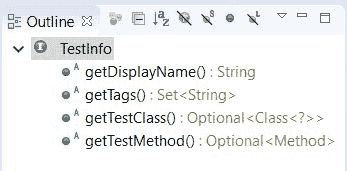

*TestInfo* API

让我们看一个例子。请注意，在下面的类中，用`@BeforeEach`和`@Test`注释的两个方法都接受一个参数`TestInfo`。此参数由`TestInfoParameterResolver`注入：

```java
package io.github.bonigarcia;

import org.junit.jupiter.api.BeforeEach;
import org.junit.jupiter.api.DisplayName;
import org.junit.jupiter.api.Tag;
import org.junit.jupiter.api.Test;
import org.junit.jupiter.api.TestInfo;

class TestInfoTest {

    @BeforeEach
    void init(TestInfo testInfo) {
        String displayName = testInfo.getDisplayName();
        System.*out*.printf("@BeforeEach %s %n", displayName);
    }

    @Test
    @DisplayName("My test")
    @Tag("my-tag")
    void testOne(TestInfo testInfo) {
        System.*out*.println(testInfo.getDisplayName());
        System.*out*.println(testInfo.getTags());
        System.*out*.println(testInfo.getTestClass());
        System.*out*.println(testInfo.getTestMethod());
    }

    @Test
    void testTwo() {
    }

}
```

因此，在每个方法的主体中，我们都能够使用`TestInfo`API 在运行时获取测试信息，如下截图所示：


*TestInfo*对象依赖注入控制台输出

# 重复信息参数 Terresolver

JUnit5 中开箱即用的第二个解析器称为`RepetitionInfoParameterResolver`。给定一个测试类，如果`@RepeatedTest`、`@BeforeEach`或`@AfterEach`方法中的方法参数类型为`RepetitionInfo`，则`RepetitionInfoParameterResolver`将提供`RepetitionInfo`的实例。

`RepetitionInfo`可用于检索当前重复信息以及对应`@RepeatedTest`的总重复次数。`RepetitionInfo`的 API 提供了两种方式，如列表后的截图所示：

*   `int getCurrentRepetition()`：获取对应`@RepeatedTest`方法的当前重复次数
*   `int getTotalRepetitions()`：获取对应`@RepeatedTest`方法的总重复次数


*RepetitionInfo* API

这里的类包含一个使用`RepetitionInfo`的简单示例：

```java
package io.github.bonigarcia;

import org.junit.jupiter.api.RepeatedTest;
import org.junit.jupiter.api.RepetitionInfo;

class RepetitionInfoTest {

    @RepeatedTest(2)
    void test(RepetitionInfo repetitionInfo) {
        System.*out*.println("** Test " + 
            repetitionInfo.getCurrentRepetition()
            + "/" + repetitionInfo.getTotalRepetitions());
    }

}
```

从测试输出中可以看出，我们能够在运行时读取有关重复测试的信息：


*RepetitionInfo*对象依赖注入的控制台输出。

# TestReporterParameterResolver

JUnit5 中最后一个内置解析器是`TestReporterParameterResolver`。同样，给定一个测试类，如果方法参数的类型为`TestReporter`，则`TestReporterParameterResolver`提供`TestReporter`的实例。

`TestReporter`用于发布有关测试执行的附加数据。数据可以通过`reportingEntryPublished`方法消耗，然后由 IDE 请求或包含在测试报告中。每个`TestReporter`对象将信息存储为地图，即键值集合：


*TestReporter* API

本测试提供了一个简单的`TestReporter`示例。如我们所见，我们使用注入的`testReporter`对象使用键值对添加自定义信息：

```java
package io.github.bonigarcia;

import java.util.HashMap;
import org.junit.jupiter.api.Test;
import org.junit.jupiter.api.TestReporter;

class TestReporterTest {

    @Test
    void reportSingleValue(TestReporter testReporter) {
        testReporter.publishEntry("key", "value");
    }

    @Test
    void reportSeveralValues(TestReporter testReporter) {
        HashMap<String, String> values = new HashMap<>();
        values.put("name", "john");
        values.put("surname", "doe");
        testReporter.publishEntry(values);
    }

}
```

# 动态测试

正如我们所知，在 JUnit3 中，我们通过解析方法名并检查它们是否以单词 test 开头来识别测试。然后，在 JUnit4 中，我们通过收集带`@Test`注释的方法来识别测试。这两种技术共享相同的方法：测试在编译时定义。这个概念就是我们所说的静态测试。

静态测试被认为是一种有限的方法，特别是对于常见的场景，在这种场景中，相同的测试应该针对各种输入数据执行。在 JUnit4 中，通过几种方式解决了这个限制。这个问题的一个非常简单的解决方案是循环输入测试数据并执行相同的测试逻辑（这里的 JUnit4 示例）。按照这种方法，执行一个测试，直到第一个断言失败：

```java
package io.github.bonigarcia;

import org.junit.Test;

public class MyTest {

    @Test
    public void test() {
        String[] input = { "A", "B", "C" };
        for (String s : input) {
            exercise(s);
        }
    }

    private void exercise(String s) {
        System.*out.*println*(s);
*    }

}
```

更详细的解决方案是使用 JUnit4 支持参数化测试，使用参数化运行程序。这种方法也不会在运行时创建测试，它只是根据参数将同一测试重复几次：

```java
package io.github.bonigarcia;

import java.util.Arrays;
import java.util.Collection;
import org.junit.Test;
import org.junit.runner.RunWith;
import org.junit.runners.Parameterized;
import org.junit.runners.Parameterized.Parameter;
import org.junit.runners.Parameterized.Parameters;

@RunWith(Parameterized.class)
public class ParameterizedTest {

    @Parameter(0)
    public Integer input1;

    @Parameter(1)
    public String input2;

    @Parameters(name = "My test #{index} -- input data: {0} and {1}")
    public static Collection<Object[]> data() {
        return Arrays
           .*asList*(new Object[][] { { 1, "hello" }, { 2, "goodbye" } });
    }

    @Test
    public void test() {
        System.*out*.println(input1 + " " + input2);
    }
}
```

我们可以在 Eclipse IDE 中看到前面示例的执行：


在 Eclipse 中执行 JUnit4 的参数化测试

另一方面，JUnit5 允许在运行时通过一个工厂方法生成测试，该工厂方法带有`@TestFactory`注释。与`@Test`相比，`@TestFactory`方法不是测试，而是工厂。`@TestFactory`方法必须返回`DynamicTest`实例的`Stream`、`Collection`、`Iterable`或`Iterator`。这些`DynamicTest`实例是惰性执行的，可以动态生成测试用例。

为了创建动态测试，我们可以使用`org.junit.jupiter.api`包中`DynamicTest`类的静态方法`dynamicTest`。如果我们检查这个类的源代码，我们可以看到一个`DynamicTest`由一个字符串形式的显示名和一个可执行对象组成，可以作为 lambda 表达式或方法引用提供。

让我们看几个动态测试的例子。在下面的示例中，由于我们没有返回预期的`DynamicTests`集合，第一个动态测试将失败。接下来的三种方法是非常简单的示例，演示了`DynamicTest`实例的`Collection`、`Iterable`和`Iterator`的生成：

```java
package io.github.bonigarcia;

import static org.junit.jupiter.api.Assertions.assertEquals;
import static org.junit.jupiter.api.Assertions.assertTrue;
import static org.junit.jupiter.api.DynamicTest.dynamicTest;

import java.util.Arrays;
import java.util.Collection;
import java.util.Iterator;
import java.util.List;
import org.junit.jupiter.api.DynamicTest;
import org.junit.jupiter.api.TestFactory;

class CollectionTest {

    // Warning: this test will raise an exception
    @TestFactory
    List<String> dynamicTestsWithInvalidReturnType() {
        return Arrays.*asList*("Hello");
    }

    @TestFactory
    Collection<DynamicTest> dynamicTestsFromCollection() {
        return Arrays.*asList*(
                *dynamicTest*("1st dynamic test", () -> 
 *assertTrue*(true)),
                *dynamicTest*("2nd dynamic test", () -> *assertEquals*(4, 2 
                     * 2)));
    }

    @TestFactory
    Iterable<DynamicTest> dynamicTestsFromIterable() {
        return Arrays.*asList*(
                *dynamicTest*("3rd dynamic test", () -> 
 *assertTrue*(true)),
                *dynamicTest*("4th dynamic test", () -> *assertEquals*(4, 2 
                    * 2)));
    }

    @TestFactory
    Iterator<DynamicTest> dynamicTestsFromIterator() {
        return Arrays.*asList*(
                *dynamicTest*("5th dynamic test", () -> 
 *assertTrue*(true)),
                *dynamicTest*("6th dynamic test", () -> *assertEquals*(4, 2 
                     * 2))).iterator();
    }

}
```

这些示例并没有真正展示动态行为，只是演示了支持的返回类型。注意，由于`JUnitException`的原因，第一次测试将失败：


用于动态测试执行的第一个示例的控制台输出

以下示例演示了为给定的输入数据集生成动态测试是多么容易：

```java
package io.github.bonigarcia;

import static org.junit.jupiter.api.DynamicTest.dynamicTest;

import java.util.stream.Stream;
import org.junit.jupiter.api.DynamicTest;
import org.junit.jupiter.api.TestFactory;

class DynamicExampleTest {

    @TestFactory
    Stream<DynamicTest> dynamicTestsFromStream() {
        Stream<String> inputStream = Stream.*of*("A", "B", "C");
        return inputStream.*map*(
                input -> *dynamicTest*("Display name for input " + input, 
                () -> {
                     System.*out*.println("Testing " + input);
                }));
    }

}
```

请注意，最后执行了三个测试，这三个测试是由 JUnit 5 在运行时创建的：

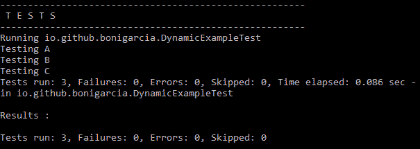

用于动态测试执行的第二个示例的控制台输出

在 JUnit5 中还可以使用类`DynamicTest`的静态方法`stream`创建动态测试。此方法需要一个输入生成器、一个基于输入值生成显示名称的函数和一个测试执行器。

让我们看另一个例子。我们创建了一个测试工厂，将输入数据提供为一个`Iterator`、一个使用 lambda 表达式的显示名称函数，最后是一个使用另一个 lambda 表达式实现的测试执行器。在本例中，测试执行器基本上判断输入整数是偶数还是奇数：

```java
package io.github.bonigarcia;

import static org.junit.jupiter.api.Assertions.assertTrue;
import static org.junit.jupiter.api.DynamicTest.stream;

import java.util.Arrays;
import java.util.Iterator;
import java.util.function.Function;
import java.util.stream.Stream;
import org.junit.jupiter.api.DynamicTest;
import org.junit.jupiter.api.TestFactory;
import org.junit.jupiter.api.function.ThrowingConsumer;

class StreamExampleTest {

    @TestFactory
    Stream<DynamicTest> streamTest() {
        // Input data
        Integer array[] = { 1, 2, 3 };
        Iterator<Integer> inputGenerator = Arrays.*asList*(array).iterator();

        // Display names
        Function<Integer, String> displayNameGenerator = (
                input) -> "Data input:" + input;

        // Test executor
        ThrowingConsumer<Integer> testExecutor = (input) -> {
            System.*out*.println(input);
            *assertTrue*(input % 2 == 0);
        };

        // Returns a stream of dynamic tests
        return *stream*(inputGenerator, displayNameGenerator, 
            testExecutor);
    }

}
```

对于奇数输入，测试将失败。正如我们所看到的，三分之二的测试将失败：


动态测试执行的控制台输出（示例三）

# 测试接口

在 JUnit5 中，对于 Java 接口中注释的使用有不同的规则。首先，我们需要知道，`@Test`、`@TestFactory`、`@BeforeEach`和`@AfterEach`可以在接口默认方法上声明。

默认方法是版本 8 中引入的 Java 的一个特性。这些方法（使用 reserve 关键字`default`声明）允许在 Java 接口中为给定方法定义默认实现。此功能对于与现有接口的向后兼容性非常有用。

关于 JUnit5 和接口的第二条规则是可以在测试接口的`static`方法上声明`@BeforeAll`和`@AfterAll`。此外，如果实现给定接口的测试类用`@TestInstance(Lifecycle.PER_CLASS)`注释，则接口上声明的方法`@BeforeAll`和`@AfterAll`不需要是`static`，而是`default`方法。

JUnit5 中关于接口的第三条也是最后一条规则是`@ExtendWith`和`@Tag`可以在测试接口上声明，以配置扩展和标记。

让我们看一些简单的例子。在下面的类中，我们创建的是一个接口，而不是一个类。在这个界面中，我们使用注释`@BeforeAll`、`@AfterAll`、`@BeforeEach`和`@AfterEach`。一方面，我们将`@BeforeAll`、`@AfterAll`定义为静态方法。另一方面，我们将`@BeforeEach`和`@AfterEach`定义为 Java 8 默认方法：

```java
package io.github.bonigarcia;

import org.junit.jupiter.api.AfterAll;
import org.junit.jupiter.api.AfterEach;
import org.junit.jupiter.api.BeforeAll;
import org.junit.jupiter.api.BeforeEach;
import org.junit.jupiter.api.TestInfo;
import org.slf4j.Logger;
import org.slf4j.LoggerFactory;

public interface TestLifecycleLogger {

 static final Logger ***log*** = LoggerFactory
            .getLogger(TestLifecycleLogger.class.getName());

    @BeforeAll
    static void beforeAllTests() {
        ***log***.info("beforeAllTests");
    }

    @AfterAll
    static void afterAllTests() {
        ***log***.info("afterAllTests");
    }

    @BeforeEach
    default void beforeEachTest(TestInfo testInfo) {
        ***log***.info("About to execute {}", testInfo.getDisplayName());
    }

    @AfterEach
    default void afterEachTest(TestInfo testInfo) {
        ***log***.info("Finished executing {}", testInfo.getDisplayName());
    }

}
```

在本例中，我们使用库 Simple Logging Facade for Java（SLF4J）。看看 GitHub（[上的代码 https://github.com/bonigarcia/mastering-junit5](https://github.com/bonigarcia/mastering-junit5) 了解依赖项声明的详细信息。

在本例中，我们使用注释`TestFactory`在 Java 接口中定义默认方法：

```java
package io.github.bonigarcia;

import static org.junit.jupiter.api.Assertions.assertTrue;
import static org.junit.jupiter.api.DynamicTest.dynamicTest;

import java.util.Arrays;
import java.util.Collection;
import org.junit.jupiter.api.DynamicTest;
import org.junit.jupiter.api.TestFactory;

interface TestInterfaceDynamicTestsDemo {

    @TestFactory
    default Collection<DynamicTest> dynamicTestsFromCollection() {
        return Arrays.*asList*(
                *dynamicTest*("1st dynamic test in test interface",
                        () -> *assertTrue*(true)),
                *dynamicTest*("2nd dynamic test in test interface",
                        () -> *assertTrue*(true)));
    }

}
```

最后，我们在另一个界面中使用注释`@Tag`和`@ExtendWith`：

```java
package io.github.bonigarcia;

import org.junit.jupiter.api.Tag;
import org.junit.jupiter.api.extension.ExtendWith;

@Tag("timed")
@ExtendWith(TimingExtension.class)
public interface TimeExecutionLogger {
}
```

总之，我们可以在 Jupiter 测试中使用这些接口：

```java
package io.github.bonigarcia;

import static org.junit.jupiter.api.Assertions.*assertEquals*;

import org.junit.jupiter.api.Test;

class TestInterfaceTest implements TestLifecycleLogger, 
        TimeExecutionLogger, 
        TestInterfaceDynamicTestsDemo {

    @Test
    void isEqualValue() {
        *assertEquals*(1, 1);
    }

}
```

在本测试中，实现所有先前定义的接口将提供默认方法中实现的日志功能：


实现多个接口的测试的控制台输出

# 测试模板

`@TestTemplate`方法不是常规的测试用例，而是测试用例的模板。根据注册的提供程序返回的调用上下文，这样注释的方法将被多次调用。因此，测试模板与注册的`TestTemplateInvocationContextProvider`扩展一起使用。

让我们看一个测试模板的简单示例。在下面的代码片段中，我们可以看到一个用`@TestTemplate`注释的方法，并且还声明了一个`MyTestTemplateInvocationContextProvider`类型的扩展：

```java
package io.github.bonigarcia;

import org.junit.jupiter.api.TestTemplate;
import org.junit.jupiter.api.extension.ExtendWith;

class TemplateTest {

    @TestTemplate
    @ExtendWith(MyTestTemplateInvocationContextProvider.class)
    void testTemplate(String parameter) {
        System.*out*.println(parameter);
    }

}
```

需要提供的实现 Jupiter 接口`TestTemplateInvocationContextProvider`。查看这个类的代码，我们可以看到两个`String`参数是如何提供给测试模板的（在这种情况下，这些参数的值是`parameter-1`和`parameter-2`：

```java
package io.github.bonigarcia;

import java.util.Collections;
import java.util.List;
import java.util.stream.Stream;
import org.junit.jupiter.api.extension.Extension;
import org.junit.jupiter.api.extension.ExtensionContext;
import org.junit.jupiter.api.extension.ParameterContext;
import org.junit.jupiter.api.extension.ParameterResolver;
import org.junit.jupiter.api.extension.TestTemplateInvocationContext;
import org.junit.jupiter.api.extension.TestTemplateInvocationContextProvider;

public class MyTestTemplateInvocationContextProvider
        implements TestTemplateInvocationContextProvider {

    @Override
    public boolean supportsTestTemplate(ExtensionContext context) {
        return true;
    }

    @Override
    public Stream<TestTemplateInvocationContext> 
        provideTestTemplateInvocationContexts(
       ExtensionContext context) {
        return Stream.*of*(invocationContext("parameter-1"),
                invocationContext("parameter-2"));
    }

    private TestTemplateInvocationContext invocationContext(String parameter) {
        return new TestTemplateInvocationContext() {
            @Override
            public String getDisplayName(int invocationIndex) {
                return parameter;
            }

            @Override
            public List<Extension> getAdditionalExtensions() {
                return Collections.singletonList(new ParameterResolver() {
                    @Override
                    public boolean supportsParameter(
                            ParameterContext parameterContext,
                            ExtensionContext extensionContext) {
                        return parameterContext.getParameter().getType()
                             .equals(String.class);
                    }

                    @Override
                    public Object resolveParameter(
                            ParameterContext parameterContext,
                            ExtensionContext extensionContext) {
                        return parameter;
                    }
                });
            }
        };
    }

}
```

当执行测试时，测试模板的每次调用行为都像一个常规的`@Test`。在本例中，测试仅在标准输出中写入参数。


测试模板示例的控制台输出

# 参数化测试

参数化测试是一种特殊类型的测试，其中数据输入被注入测试中，以便重用相同的测试逻辑。这个概念已经在 JUnit4 中讨论过，如[第 1 章](1.html#K0RQ0-ef8404ed083f459d860f84cc8198f8bb)、*软件质量和 Java 测试回顾*中所述。正如我们所期望的，参数化测试也在 JUnit5 中实现。

首先，为了在 Jupiter 中实现参数化测试，我们需要将`junit-jupiter-params`添加到我们的项目中。使用 Maven 时，这意味着添加以下依赖项：

```java
<dependency>
    <groupId>org.junit.jupiter</groupId>
    <artifactId>junit-jupiter-params</artifactId>
    <version>${junit.jupiter.version}</version>
    <scope>test</scope>
</dependency>
```

通常，作为一般规则，建议使用最新版本的工件。要了解这一点，我们可以查看 [Maven 中央存储](http://search.maven.org/)。

使用 Gradle 时，`junit-jupiter-params dependency`可以声明如下：

```java
dependencies {
      testCompile("org.junit.jupiter:junit-jupiter-
      params:${junitJupiterVersion}")
}
```

然后，我们需要使用注释`@ParameterizedTest`（位于包`org.junit.jupiter.params`中）将 Java 类中的方法声明为参数化测试。这种类型的测试的行为与常规的`@Test`完全相同，这意味着所有生命周期回调（`@BeforeEach`、`@AfterEach`等等）和扩展都以相同的方式继续工作。

然而，使用`@ParameterizedTest`不足以实现参数化测试。与`@ParameterizedTest`一起，我们需要指定至少一个参数提供程序。正如我们将在本节中发现的，JUnit5 实现了不同的注释，以提供来自不同来源的数据输入（即测试参数）。下表总结了这些参数提供程序（在 JUnit 5 中实现为注释）（每个注释都位于包`org.junit.jupiter.params.provider`中）：

| **参数提供者注释** | **说明** |
| `@ValueSource` | 用于指定文字值数组`String`、`int`、`long`或`double` |
| `@EnumSource` | 指定枚举（`java.lang.Enum`的常量的参数源 |
| `@MethodSource` | 提供对声明此注释的类的静态方法返回的值的访问 |
| `@CsvSource` | 从属性中读取逗号分隔值（CSV）的参数源 |
| `@CsvFileSource` | 用于从一个或多个类路径资源加载 CSV 文件的参数源 |
| `@ArgumentsSource` | 用于指定自定义参数提供程序（即实现接口的 Java 类）`org.junit.jupiter.params.provider.ArgumentsProvider` |

# @价值来源

注释`@ValueSource`与`@ParameterizedTest`一起用于指定参数化测试，其中参数源是`String`、`int`、`long`或`double`的文字值数组。这些值在注释中使用元素`strings`、`ints`、`longs`或`doubles`指定。考虑下面的例子：

```java
package io.github.bonigarcia;

import static org.junit.jupiter.api.Assertions.*assertNotNull*;

import org.junit.jupiter.params.ParameterizedTest;
import org.junit.jupiter.params.provider.ValueSource;
 class ValueSourceStringsParameterizedTest {

    @ParameterizedTest
    @ValueSource(strings = { "Hello", "World" })
    void testWithStrings(String argument) {
      System.*out*.println("Parameterized test with (String) parameter:  "             
        + argument);
      *assertNotNull*(argument);
    }
}
```

此类的方法（`testWithStrings`定义了一个参数化测试，其中指定了字符串数组。由于注释`@ValueSource`（在本例中为`"Hello"`和`"World"`中指定了两个字符串参数，测试逻辑将执行两次，每个值一次。此数据使用方法的参数注入测试方法，在本例中，通过名为 argument 的`String`变量注入。总之，当执行该测试类时，输出如下：


使用*@ValueSource*和字符串参数提供程序执行参数化测试

我们还可以在`@ValueSource`注释中使用整数基元类型（`int`、`long`和`double`。下面的示例演示了如何。这个示例类的方法（名为`testWithInts`、`testWithLongs`和`testWithDoubles`分别使用原语类型 int、long 和 double，使用注释`@ValueSource`以整数值的形式定义参数。为此，需要指定`@ValueSource`的`ints`、`longs`和`doubles`元素：

```java
package io.github.bonigarcia;

import static org.junit.jupiter.api.Assertions.*assertNotNull*;

import org.junit.jupiter.params.ParameterizedTest;
import org.junit.jupiter.params.provider.ValueSource;

class ValueSourcePrimitiveTypesParameterizedTest {

   @ParameterizedTest
    @ValueSource(ints = { 0, 1 })
    void testWithInts(int argument) {
        System.*out*.println("Parameterized test with (int) argument: " + 
            argument);
        *assertNotNull*(argument);
    }

    @ParameterizedTest
    @ValueSource(longs = { 2L, 3L })
    void testWithLongs(long argument) {
        System.*out*.println(
        "Parameterized test with (long) 
              argument: " + argument);
        *assertNotNull*(argument);
    }

    @ParameterizedTest
    @ValueSource(doubles = { 4d, 5d })
    void testWithDoubles(double argument) {
        System.*out*.println("Parameterized test with (double)
              argument: " + argument);
        *assertNotNull*(argument);
    }

}
```

如图所示，每个测试执行两次，因为在每个`@ValueSource`注释中，我们指定了两个不同的输入参数（分别为`int`、`long`和`double`类型）。

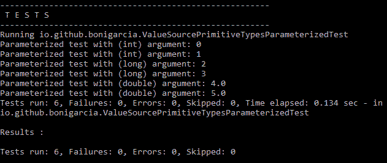

使用*@ValueSource*和基元类型执行参数化测试

# @枚举源

注释`@EnumSource`允许指定参数化测试，其中参数源是 Java 枚举类。默认情况下，枚举的每个值都将用于为参数化测试提供数据，每次一个。

例如，在下面的测试类中，方法`testWithEnum`被注释为`@ParameterizedTest`与`@EnumSource`结合。正如我们所看到的，这个注释的值是`TimeUnit.class`，这是一个标准的 Java 注释（包 Java.util.concurrent），用于表示持续时间。此枚举中定义的可能值为`NANOSECONDS`、`MICROSECONDS`、`MILLISECONDS`、`SECONDS`、`MINUTES`、`HOURS`和`DAYS`：

```java
package io.github.bonigarcia;

import static org.junit.jupiter.api.Assertions.*assertNotNull*;

import java.util.concurrent.TimeUnit;
import org.junit.jupiter.params.ParameterizedTest;
import org.junit.jupiter.params.provider.EnumSource;

class EnumSourceParameterizedTest {

    @ParameterizedTest
    @EnumSource(TimeUnit.class)
    void testWithEnum(TimeUnit argument) {
        System.*out*.println("Parameterized test with (TimeUnit)         
            argument: " + argument);
        *assertNotNull*(argument);
    }

}
```

因此，本试验将执行七次，即每`TimeUnit`枚举值执行一次。我们可以在执行测试时在输出控制台的跟踪中检查这一点：

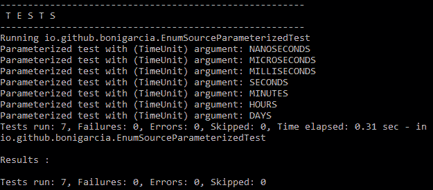

使用*@EnumSource*和*TimeUnit.class*执行参数化测试

此外，`@EnumSource`注释允许以多种方式过滤枚举的成员。要实现此选择，可以在`@EnumSource`注释中指定以下元素：

*   `mode`：确定过滤类型的常数值。定义为内部类`org.junit.jupiter.params.provider.EnumSource.Mode`中的枚举，可能值为：
    *   `INCLUDE`：用于选择通过`names`元素提供名称的值。这是默认选项。
    *   `EXCLUDE`：用于选择`names`元素提供的值以外的所有值。
    *   `MATCH_ALL`：用于选择名称与`names`元素中模式匹配的值。
    *   `MATCH_ANY`：用于选择名称与`names`元素中任何模式匹配的值。
*   `names`：允许选择一组`enum`常量的字符串数组。包含/排除标准与模式值直接关联。此外，该元素还允许定义正则表达式来选择要匹配的`enum`常量的名称。

考虑下面的例子。在这个类中，有三个参数化测试。第一个名为`testWithFilteredEnum`，使用类`TimeUnit`为`@EnumSource`参数提供程序提供数据。此外，使用元素名称过滤枚举常量集。如我们所见，只有常数`"DAYS"`和`"HOURS"`将用于为该测试提供数据（考虑到默认模式为`INCLUDE`：

```java
package io.github.bonigarcia;

import static org.junit.jupiter.api.Assertions.*assertNotNull*;
import static org.junit.jupiter.params.provider.EnumSource.Mode.*EXCLUDE*;
import static org.junit.jupiter.params.provider.EnumSource.Mode.*MATCH_ALL*;

import java.util.concurrent.TimeUnit;
import org.junit.jupiter.params.ParameterizedTest;
import org.junit.jupiter.params.provider.EnumSource;

class EnumSourceFilteringParameterizedTest {

    @ParameterizedTest
    @EnumSource(value = TimeUnit.class, names = { "DAYS", "HOURS" })
    void testWithFilteredEnum(TimeUnit argument) {
        System.*out*.println("Parameterized test with some (TimeUnit) 
            argument: "+ argument);
        *assertNotNull*(argument);
    }

    @ParameterizedTest
    @EnumSource(value = TimeUnit.class, mode = *EXCLUDE*, names = { 
    "DAYS", "HOURS" })
    void testWithExcludeEnum(TimeUnit argument) {
        System.*out*.println("Parameterized test with excluded (TimeUnit) 
            argument: " + argument);
        *assertNotNull*(argument);
    }

    @ParameterizedTest
    @EnumSource(value = TimeUnit.class, mode = *MATCH_ALL*, names = 
    "^(M|N).+SECONDS$")
    void testWithRegexEnum(TimeUnit argument) {
        System.*out*.println("Parameterized test with regex filtered 
            (TimeUnit) argument: " + argument);
        *assertNotNull*(argument);
    }

}
```

因此，在控制台中执行此类时，我们获得的输出如下。关于第一次测试，我们可以看到只有`"DAYS"`和`"HOURS"`的痕迹存在：

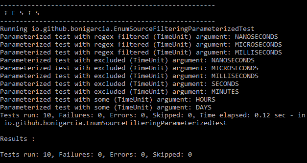

使用*@EnumSource*使用过滤功能执行参数化测试

现在考虑第二种测试方法，名为`testWithExcludeEnum.`该测试与之前完全相同，但有一点不同：这里的模式是`EXCLUSION`（而不是`INCLUSION`，在之前的测试中默认选择）。总之，在执行过程中（参见前面的屏幕截图），可以看到此测试执行了五次，每个枚举常量不同于`DAYS`和`HOURS`。要检查这一点，请使用句子`"Parameterized test with excluded (TimeUnit) argument"`跟踪这些痕迹。

该类的第三个也是最后一个方法（称为`testWithRegexEnum`）定义了一个包含模式`MATCH_ALL`，使用正则表达式过滤枚举（在本例中，它也是`TimeUnit`。本例中使用的具体正则表达式为`^(M|N).+SECONDS$`，这意味着只有以`M`或`N`开头并以`SECONDS`结尾的枚举常量才会包含该正则表达式。如执行屏幕截图中所示，有三个`TimeUnit`常量与这些条件匹配：`NANOSECONDS`、`MICROSECONDS`和`MILISECONDS`。

# @方法源

注释`@MethodSource`允许定义静态方法的名称，其中测试的参数作为 Java 8`Stream.`提供。例如，在下面的示例中，我们可以看到一个参数化测试，其中参数提供程序是一个名为`stringProvider`的静态方法。在本例中，此方法返回一个`String`的`Stream`，因此测试方法的参数（被调用的`testWithStringProvider`接受一个`String`参数：

```java
package io.github.bonigarcia;

import static org.junit.jupiter.api.Assertions.*assertNotNull*;

import java.util.stream.Stream;
import org.junit.jupiter.params.ParameterizedTest;
import org.junit.jupiter.params.provider.MethodSource;

class MethodSourceStringsParameterizedTest {

    static Stream<String> stringProvider() {
        return Stream.*of*("hello", "world");
    }

    @ParameterizedTest
    @MethodSource("stringProvider")
    void testWithStringProvider(String argument) {
        System.*out*.println("Parameterized test with (String) argument: "
           + argument);
        *assertNotNull*(argument);
    }

}
```

当运行这个示例时，我们可以看到测试是如何执行两次的，每`Stream`中包含的`String`执行一次。


使用*@MethodSource*和字符串参数提供程序执行参数化测试

`Stream`中包含的对象类型不需要是`String`。事实上，这种类型可以是任何类型。让我们考虑另一个例子，`@MethodSource`链接到一个静态方法，该方法返回自定义对象的`Stream`。在本例中，该类型被命名为`Person`，在这里它被实现为一个具有两个属性的内部类（`name`和`surname`。

```java
package io.github.bonigarcia;

import static org.junit.jupiter.api.Assertions.*assertNotNull*;

import java.util.stream.Stream;
import org.junit.jupiter.params.ParameterizedTest;
import org.junit.jupiter.params.provider.MethodSource;

class MethodSourceObjectsParameterizedTest {

    static Stream<Person> personProvider() {
        Person john = new Person("John", "Doe");
        Person jane = new Person("Jane", "Roe");
        return Stream.*of*(john, jane);
    }

    @ParameterizedTest
    @MethodSource("personProvider")
    void testWithPersonProvider(Person argument) {
        System.*out*.println("Parameterized test with (Person) argument: " + 
                argument);
        *assertNotNull*(argument);
    }

    static class Person {
        String name;
        String surname;

        public Person(String name, String surname) {
            this.name = name;
            this.surname = surname;
        }

        public String getName() {
            return name;
        }

        public void setName(String name) {
            this.name = name;
        }

        public String getSurname() {
            return surname;
        }

        public void setSurname(String surname) {
            this.surname = surname;
        }

        @Override
        public String toString() {
            return "Person [name=" + name + ", surname=" + surname + "]";
        }

    }

}
```

如下面的屏幕截图所示，在执行本例时，参数化测试是练习两次，每`Stream`（`"John Doe"`和`"Jane Roe"`中包含的`Person`对象一次。


使用*@MethodSource*和自定义对象参数提供程序执行参数化测试

我们还可以使用`@MethodSource`指定包含整数基元类型的参数提供程序，具体为`int`、`double`和`long`。下面的类包含一个示例。我们可以看到三个参数化测试。第一个（名为`testWithIntProvider`）使用注释`@MethodSource`与静态方法`intProvider`链接。在这个方法的主体中，我们使用标准 Java 类`IntStream`返回`int`值流。第二次和第三次测试（称为`testWithDoubleProvider`和`testWithLongProvider`非常相似，但分别使用`double`和`long`的`Stream`值：

```java
package io.github.bonigarcia;

import static org.junit.jupiter.api.Assertions.*assertNotNull*;

import java.util.stream.DoubleStream;
import java.util.stream.IntStream;
import java.util.stream.LongStream;
import org.junit.jupiter.params.ParameterizedTest;
import org.junit.jupiter.params.provider.MethodSource;

class MethodSourcePrimitiveTypesParameterizedTest {

    static IntStream intProvider() {
        return IntStream.*of*(0, 1);
    }

    @ParameterizedTest
    @MethodSource("intProvider")
    void testWithIntProvider(int argument) {
        System.*out*.println("Parameterized test with (int) argument: " + 
            argument);
        *assertNotNull*(argument);
    }

    static DoubleStream doubleProvider() {
        return DoubleStream.*of*(2d, 3d);
    }

    @ParameterizedTest
    @MethodSource("doubleProvider")
    void testWithDoubleProvider(double argument) {
        System.*out*.println(
            "Parameterized test with (double) argument: " + argument);
        *assertNotNull*(argument);
    }

    static LongStream longProvider() {
        return LongStream.*of*(4L, 5L);
    }

    @ParameterizedTest
    @MethodSource("longProvider")
    void testWithLongProvider(long argument) {
        System.*out*.println(
            "Parameterized test with (long) argument: " + argument);
        *assertNotNull*(argument);
   }

}
```

因此，在执行此类时，将执行六个测试（三个参数化测试，每个测试有两个参数）。

在下面的屏幕截图中，我们可以通过跟踪每个测试写入标准输出的跟踪来检查这一点：

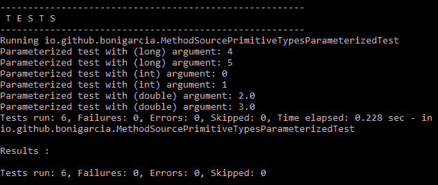

使用*@MethodSource*和原语类型参数提供程序执行参数化测试

最后，关于`@MethodSource`参数化测试，值得一提的是，允许方法提供者返回不同类型（对象或基本类型）的流。这对于真实世界的测试用例非常方便。例如，下面的类实现了一个参数化测试，其中参数提供程序是一个返回混合类型参数的方法：`String`和`int`。这些参数作为方法参数（在示例中称为 first 和 second）注入测试中。

```java
package io.github.bonigarcia;

import static org.junit.jupiter.api.Assertions.*assertNotEquals*;
import static org.junit.jupiter.api.Assertions.*assertNotNull*;

import java.util.stream.Stream;
import org.junit.jupiter.params.ParameterizedTest;
import org.junit.jupiter.params.provider.Arguments;
import org.junit.jupiter.params.provider.MethodSource;

class MethodSourceMixedTypesParameterizedTest {

    static Stream<Arguments> stringAndIntProvider() {
        return Stream.*of*(Arguments.*of*("Mastering", 10),
            Arguments.*of*("JUnit 5", 20));
    }

    @ParameterizedTest
    @MethodSource("stringAndIntProvider")
    void testWithMultiArgMethodSource(String first, int second) {
        System.*out*.println("Parameterized test with two arguments: 
            (String) " + first + " and (int) " + second);
        *assertNotNull*(first);
        *assertNotEquals*(0, second);
    }
}
```

与往常一样，将有测试执行作为包含在流中的条目。在这种情况下，有两个：`"Mastertering"`和`10`，然后是`"JUnit 5"`和`20`。


使用具有不同类型参数的*@MethodSource*执行参数化测试

# @CsvSource 和@CsvFileSource

为参数化测试指定参数源的另一种方法是使用逗号分隔值（CSV）。这可以使用注释`@CsvSource`完成，该注释允许将 CSV 内容作为字符串嵌入注释的值中。

考虑下面的例子。它包含一个 Jupiter 参数化测试（名为`testWithCsvSource`，使用注释`@CsvSource`。此批注包含字符串数组。在数组的每个元素中，我们可以看到有一个由逗号分隔的不同值。

CSV 的内容自动转换为字符串和 int。要了解 JUnit 5 在参数中进行的隐式类型转换的更多信息，请参阅本章中的*参数转换*一节。

```java
package io.github.bonigarcia;

import static org.junit.jupiter.api.Assertions.*assertNotEquals*;
import static org.junit.jupiter.api.Assertions.*assertNotNull*;

import org.junit.jupiter.params.ParameterizedTest;
import org.junit.jupiter.params.provider.CsvSource;

class CsvSourceParameterizedTest {

    @ParameterizedTest
    @CsvSource({ "hello, 1", "world, 2", "'happy, testing', 3" })
    void testWithCsvSource(String first, int second) {
        System.*out*.println("Parameterized test with (String) " + first
            + " and (int) " + second);
        *assertNotNull*(first);
        *assertNotEquals*(0, second);
    }

}
```

总之，当执行这个测试类时，将有三个单独的测试，每个测试都是数组中的每个条目。每次执行都将被调用，并向测试传递两个参数。第一个名为`first`，类型为`String`，第二个名为`second`，类型为`int`。

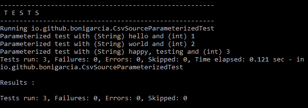

使用*@CsvSource*执行参数化测试

如果 CSV 数据量大，使用注释`@CsvFileSource`可能更方便。此注释允许向参数化测试提供位于项目类路径中的 CSV 文件。在下面的示例中，我们使用文件`input.csv`：

```java
package io.github.bonigarcia;

import static org.junit.jupiter.api.Assertions.*assertNotEquals*;
import static org.junit.jupiter.api.Assertions.*assertNotNull*;

import org.junit.jupiter.params.ParameterizedTest;
import org.junit.jupiter.params.provider.CsvFileSource;

class CsvFileSourceParameterizedTest {

    @ParameterizedTest
    @CsvFileSource(resources = "/input.csv")
    void testWithCsvFileSource(String first, int second) {
        System.*out*.println("Yet another parameterized test with 
            (String) " + first + " and (int) " + second);
        *assertNotNull*(first);
        *assertNotEquals*(0, second);
    }

}
```

在内部，注释`@CsvFileSource`使用标准 Java 类`java.lang.Class`的方法`getResourceAsStream()`定位文件。因此，文件的路径被解释为我们从中调用它的包类的本地路径。由于我们的资源位于类路径的根目录中（在本例中，它位于文件夹`src/test/resources`中），因此我们需要将其定位为`/input.csv`。


示例*@CsvFileSource*中 input.csv 的位置和内容

下面的屏幕截图显示了使用 Maven 执行测试时的输出。由于 CSV 有三行数据，因此有三个测试执行，每个测试执行有两个参数（第一个参数为`String`，第二个参数为`int`：

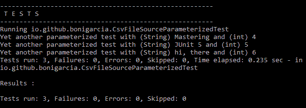

使用*@CsvFileSource*执行参数化测试

# @论据来源

最后一个注释的目的是指定 JUnit5 中参数化测试的参数源是`@ArgumentsSource`。通过这个注释，我们可以指定一个自定义（并且在不同测试中可重用）类，该类将包含测试的参数。此类必须实现接口`org.junit.jupiter.params.provider.ArgumentsProvider`。

让我们看一个例子。下面的类实现了一个 Jupiter 参数化测试，其中参数源将在类`CustomArgumentsProvider1`中定义：

```java
package io.github.bonigarcia;

import static org.junit.jupiter.api.Assertions.*assertNotNull*;
import static org.junit.jupiter.api.Assertions.*assertTrue*;

import org.junit.jupiter.params.ParameterizedTest;
import org.junit.jupiter.params.provider.ArgumentsSource;

class ArgumentSourceParameterizedTest {

    @ParameterizedTest
    @ArgumentsSource(CustomArgumentsProvider1.class)
    void testWithArgumentsSource(String first, int second) {
        System.*out*.println("Parameterized test with (String) " + first
             + " and (int) " + second);
        *assertNotNull*(first);
        *assertTrue*(second > 0);
    }

}
```

该类（名为`CustomArgumentsProvider1`）已经在我方实现，由于它实现了接口`ArgumentsProvider`，必须覆盖方法`provideArguments`，在该方法中实现了测试参数的实际定义。看看这个例子的代码，我们可以看到这个方法返回一个`Stream`的`Arguments`。在本例中，我们在`Stream`中返回了几个条目，每个条目都有两个参数（`String`和`int`）：

```java
package io.github.bonigarcia;

import java.util.stream.Stream;
import org.junit.jupiter.api.extension.ExtensionContext;
import org.junit.jupiter.params.provider.Arguments;
import org.junit.jupiter.params.provider.ArgumentsProvider;
 public class CustomArgumentsProvider1 implements ArgumentsProvider {

    @Override
    public Stream<? extends Arguments> provideArguments(
            ExtensionContext context) {
        System.*out*.println("Arguments provider to test "
            + context.getTestMethod().get().getName());
        return Stream.*of*(Arguments.*of*("hello", 1), 
            Arguments.*of*("world", 2));
    }

}
```

还要注意，此参数有一个类型为`ExtensionContext`（包`org.junit.jupiter.api.extension`）的参数。此参数对于了解执行测试的上下文非常有用。如这里的屏幕截图所示，`ExtensionContext`API 提供了不同的方法来查找测试实例的不同属性（测试方法名称、显示名称、标记等）。

在我们的示例（`CustomArgumentsProvider1`中），上下文用于在标准输出中写入测试方法名称：

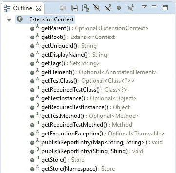

*ExtensionContext* API

因此，在执行这个示例时，我们可以看到正在执行两个测试。此外，由于`ExtensionContext`对象在`ArgumentsProvider`实例中，我们可以使用测试方法检查日志跟踪：

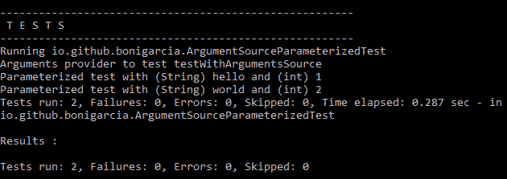

使用*@ArgumentsSource*执行参数化测试

多个参数源可以应用于同一个参数化测试。事实上，在 Jupiter 编程模型中，这可以通过两种不同的方式实现：

*   将`@ArgumentsSource`的多个注释与同一`@ParameterizedTest`一起使用。这可以做到，因为`@ArgumentsSource`是`java.lang.annotation.Repeatable`注释。
*   使用注释`@ArgumentsSources`（注意这里的来源是复数）。此注释只是一个或多个`@ArgumentsSource`的容器。下面的类显示了一个简单的示例：

```java
package io.github.bonigarcia;

import static org.junit.jupiter.api.Assertions.*assertNotNull*;
import static org.junit.jupiter.api.Assertions.*assertTrue*;

import org.junit.jupiter.params.ParameterizedTest;
import org.junit.jupiter.params.provider.ArgumentsSource;
import org.junit.jupiter.params.provider.ArgumentsSources;

class ArgumentSourcesParameterizedTest {

    @ParameterizedTest
    @ArgumentsSources({ 
    @ArgumentsSource(CustomArgumentsProvider1.class),
    @ArgumentsSource(CustomArgumentsProvider2.class) })
    void testWithArgumentsSource(String first, int second) {
        System.*out*.println("Parameterized test with (String) " + first
            + " and (int) " + second);
        *assertNotNull*(first);
        *assertTrue*(second > 0);
    }

}
```

假设第二个参数提供程序（`CustomArgumentsProvider2.**class**`指定了两组或多组参数，则在执行测试类时，将有四个测试执行：


使用*@ArgumentsSources*执行参数化测试

# 参数转换

为了支持`@CsvSource`和`@CsvFileSource`等用例，Jupiter 提供了许多内置隐式转换器。此外，这些转换器可以根据具体需要通过显式转换器实现。本节介绍这两种类型的转换。

# 隐式转换

JUnit5 在内部处理一组规则，用于将参数从`String`转换为实际参数类型。例如，如果`@ParameterizedTests`声明了一个类型为`TimeUnit`的参数，但声明的源是一个`String`，则在内部该`String`将转换为`TimeUnit`。下表总结了 JUnit 5 中参数化测试参数的隐式转换规则：

| **目标类型** | **示例** |
| `boolean/Boolean` | `"false"`->`false` |
| `byte/Byte` | `"1"`->`(byte) 1` |
| `char/Character` | `"a"`->`'a'` |
| `short/Short` | `"2"`->`(short) 2` |
| `int/Integer` | `"3"`->`3` |
| `long/Long` | `"4"`->`4L` |
| `float/Float` | `"5.0"`->`5.0f` |
| `double/Double` | `"6.0"`->`6.0d` |
| `Enum subclass` | `"SECONDS"`->`TimeUnit.SECONDS` |
| `java.time.Instant` | `"1970-01-01T00:00:00Z"`->`Instant.ofEpochMilli(0)` |
| `java.time.LocalDate` | `"2017-10-24"`->`LocalDate.of(2017, 10, 24)` |
| `java.time.LocalDateTime` | `"2017-03-14T12:34:56.789"`->`LocalDateTime.of(2017, 3, 14, 12, 34, 56, 789_000_000)` |
| `java.time.LocalTime` | `"12:34:56.789"`->`LocalTime.of(12, 34, 56, 789_000_000)` |
| `java.time.OffsetDateTime` | `"2017-03-14T12:34:56.789Z"`->`OffsetDateTime.of(2017, 3, 14, 12, 34, 56, 789_000_000, ZoneOffset.UTC)` |
| `java.time.OffsetTime` | `"12:34:56.789Z"`->`OffsetTime.of(12, 34, 56, 789_000_000, ZoneOffset.UTC)` |
| `java.time.Year` | `"2017"`->`Year.of(2017)` |
| `java.time.YearMonth` | `"2017-10"`->`YearMonth.of(2017, 10)` |
| `java.time.ZonedDateTime` | `"2017-10-24T12:34:56.789Z"`->`ZonedDateTime.of(2017, 10, 24, 12, 34, 56, 789_000_000, ZoneOffset.UTC)` |

以下示例显示了隐式转换的几个示例。第一个测试（`testWithImplicitConversionToBoolean`将`String`源声明为`"true"`，但随后，预期的参数类型为`Boolean`。类似地，第二个测试（`"testWithImplicitConversionToInteger"`进行了从`String`到`Integer`的隐式转换。第三个测试（`testWithImplicitConversionToEnum`将输入`String`转换为`TimeUnit`（枚举），最后第四个测试（`testWithImplicitConversionToLocalDate`生成到`LocalDate`的转换：

```java
package io.github.bonigarcia;

import static org.junit.jupiter.api.Assertions.*assertNotNull*;
import static org.junit.jupiter.api.Assertions.*assertTrue*;

import java.time.LocalDate;
import java.util.concurrent.TimeUnit;
import org.junit.jupiter.params.ParameterizedTest;
import org.junit.jupiter.params.provider.ValueSource;

class ImplicitConversionParameterizedTest {

    @ParameterizedTest
    @ValueSource(strings = "true")
    void testWithImplicitConversionToBoolean(Boolean argument) {
        System.*out*.println("Argument " + argument + " is a type of "
            + argument.getClass());
        *assertTrue*(argument);
    }

    @ParameterizedTest
    @ValueSource(strings = "11")
    void testWithImplicitConversionToInteger(Integer argument) {
        System.*out*.println("Argument " + argument + " is a type of "
            + argument.getClass());
        *assertTrue*(argument > 10);
    }

    @ParameterizedTest
    @ValueSource(strings = "SECONDS")
    void testWithImplicitConversionToEnum(TimeUnit argument) {
        System.*out*.println("Argument " + argument + " is a type of "
            + argument.getDeclaringClass());
        *assertNotNull*(argument.name());
    }

    @ParameterizedTest
    @ValueSource(strings = "2017-07-25")
    void testWithImplicitConversionToLocalDate(LocalDate argument) {
        System.*out*.println("Argument " + argument + " is a type of "
            + argument.getClass());
        *assertNotNull*(argument);
    }

}
```

我们可以在控制台中检查参数的实际类型。每个测试在标准输出中写入一行，其中包含每个参数的值和类型：

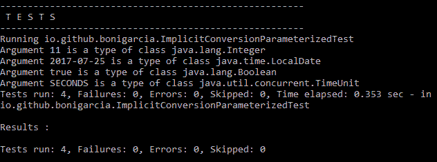

使用隐式参数转换执行参数化测试

# 显式转换

如果 JUnit5 提供的隐式转换不足以满足我们的需要，我们可以使用显式转换功能。由于这个特性，我们可以指定一个类来进行参数类型的自定义转换。此自定义转换器由注释`@ConvertWith`标识，该注释引用要转换的参数。考虑下面的例子。此参数化测试为其测试方法参数声明一个自定义转换器：

```java
package io.github.bonigarcia;

import static org.junit.jupiter.api.Assertions.*assertNotNull*;

import java.util.concurrent.TimeUnit;
import org.junit.jupiter.params.ParameterizedTest;
import org.junit.jupiter.params.converter.ConvertWith;
import org.junit.jupiter.params.provider.EnumSource;

class ExplicitConversionParameterizedTest {

    @ParameterizedTest
    @EnumSource(TimeUnit.class)
    void testWithExplicitArgumentConversion(
            @ConvertWith(CustomArgumentsConverter.class) String 
            argument) {
          System.*out*.println("Argument " + argument + " is a type of "
              + argument.getClass());
          *assertNotNull*(argument);
    }

}
```

我们的自定义转换是一个扩展 JUnit5 的`SimpleArgumentConverter`的类。此类重写实际转换发生的 convert 方法。在本例中，我们只需将任何参数源转换为`String`。

```java
package io.github.bonigarcia;

import org.junit.jupiter.params.converter.SimpleArgumentConverter;
 public class CustomArgumentsConverter extends SimpleArgumentConverter {

    @Override
    protected Object convert(Object source, Class<?> targetType) {
          return String.*valueOf*(source);
    }
}
```

总之，在执行测试时，`TimeUnit`中定义的七个枚举常量将作为参数传递给测试，然后转换为`CustomArgumentsConverter`中的`String`：


使用显式参数转换执行参数化测试

# 自定义名称

JUnit5 中与参数化测试相关的最后一个特性与每次执行测试的显示名称有关。正如我们所了解的，参数化测试通常作为几个单独的测试执行。因此，为了保证可追溯性，最好将每个测试执行与参数源链接起来。

为此，注释`@ParameterizedTest`接受一个名为 name 的元素，我们可以在其中为测试执行指定一个自定义名称（`String`。此外，在这个字符串中，我们可以使用几个内置占位符，如下表所述：

| **占位符** | **说明** |
| `{index}` | 当前调用索引（第一个是 1，第二个是 2，…） |
| `{arguments}` | 逗号分隔参数完整列表 |
| `{0}, {1}, …` | 单个参数的值（第一个是 0，第二个是 2，…） |

让我们看一个简单的例子。下面的类包含一个参数化测试，其参数是使用`@CsvSource`注释定义的。测试方法接受两个参数（`String`和`int`。此外，我们正在使用自定义消息指定注释`@ParameterizedTest`的元素名称，为当前测试调用（`{index}`）以及每个参数的值使用占位符：第一个（`{0}`）和第二个（`{1}`）：

```java
package io.github.bonigarcia;

import org.junit.jupiter.api.DisplayName;
import org.junit.jupiter.params.ParameterizedTest;
import org.junit.jupiter.params.provider.CsvSource;
 class CustomNamesParameterizedTest {

    @DisplayName("Display name of test container")
    @ParameterizedTest(name = "[{index}] first argument=\"{0}\", second                 
       argument={1}")
    @CsvSource({ "mastering, 1", "parameterized, 2", "tests, 3" })
    void testWithCustomDisplayNames(String first, int second) {
        System.*out*.println("Testing with parameters: " + first + " and " +       
           second);
    }

}
```

在 IDE 中执行此测试时（以下屏幕截图中的 IntelliJ），我们可以看到每个测试执行的显示名称是如何不同的：


在 IntelliJ IDE 中使用自定义名称执行参数化测试

# 爪哇 9

Java 9 于 2017 年 9 月 21 日发布供**通用**（**GA**）使用。Java9 附带了许多新特性。其中，模块化是 Java9 的定义特性。

到目前为止，Java 中存在一个模块化问题，对于大型代码库来说尤其重要。每个公共类都可以被类路径中的任何其他类访问，从而导致类的意外使用。此外，类路径还存在潜在的问题，例如无法知道是否存在重复的 JAR。为了解决这些问题，Java9 提供了 Java 平台模块系统，它允许创建模块化 JAR 文件。这种类型的模块包含一个名为`module-info.java`的附加模块描述符。这些文件的内容非常简单：它使用关键字 requires 声明对其他模块的依赖关系，并使用关键字`exports`导出自己的包。默认情况下，所有未导出的包都封装在模块中，例如：

```java
module mymodule {
  exports io.github.bonigarcia;

  requires mydependency;
}
```

我们可以将这些模块之间的关系表示为：


Java 9 中模块之间的关系示例

以下列表总结了 Java 9 的其他新功能：

*   使用模块允许创建针对给定应用程序优化的最小运行时 JDK，而不是使用完全 JDK 安装。这可以使用 JDK 9 附带的工具*jlink*实现。
*   Java9 提供了一个交互环境，可以直接从 shell 执行 Java 代码。这种类型的实用程序通常称为**读取评估打印循环**（**REPL**），在 JDK 9 中称为**JShell**。
*   集合工厂方法，Java 9 提供了创建集合（例如，列表或集合）并在一行中填充它们的功能：

```java
      Set<Integer> ints = Set.of(1, 2, 3);
      List<String> strings = List.*of*("first", "second");
```

*   **流 API 改进**：流是在 Java8 中引入的，它们允许在集合上创建转换的声明性管道。在 Java 9 中，将方法`dropWhile`、`takeWhile`和`ofNullable`添加到流 API 中。
*   **私有接口方法**：Java 8 提供了接口的默认方法。到目前为止的限制是 Java8 中的默认方法必须是公共的。现在，在 Java9 中，这些默认方法也可以是私有的，这有助于更好地构造它们的实现。
*   **HTTP/2**：Java 9 支持开箱即用、HTTP 版本 2 以及 WebSocket。
*   **多版本 JAR**：此功能允许创建类的替代版本，具体取决于执行 JAR 的 JRE 版本。为此，在文件夹`META-INF/versions/<java-version>`下，我们可以指定编译类的不同版本，只有当 JRE 版本与版本匹配时才会使用。
*   **改进的 Javadoc**：最后但并非最不重要的一点是，Java9 允许创建兼容 HTML5 的 Javadoc，并具有集成搜索功能。

# JUnit5 和 Java9 的兼容性

自 M5 以来，所有 JUnit5 工件都附带了 Java 9 的编译模块描述符，在其 JAR 清单（文件`MANIFEST.MF`中声明。例如，工件`junit-jupiter-api`M6 的清单内容如下：

```java
Manifest-Version: 1.0
Implementation-Title: junit-jupiter-api
Automatic-Module-Name: org.junit.jupiter.api
Build-Date: 2017-07-18
Implementation-Version: 5.0.0-M6
Built-By: JUnit Team
Specification-Vendor: junit.org
Specification-Title: junit-jupiter-api
Implementation-Vendor: junit.org
Build-Revision: 3e6482ab8b0dc5376a4ca4bb42bef1eb454b6f1b
Build-Time: 21:26:15.224+0200
Created-By: 1.8.0_131 (Oracle Corporation 25.131-b11)
Specification-Version: 5.0.0
```

关于 Java9，有趣的是声明`Automatic-Module-Name`。这允许测试模块需要 JUnit 5 模块，只需将以下行添加到其模块描述符文件（`module-info.java`中）：

```java
module foo.bar {
      requires org.junit.jupiter.api;
}
```

# 超越 JUnit5.0

JUnit 5.0 GA（通用性）于 2017 年 9 月 10 日发布。此外，JUnit 是一个活生生的项目，计划在下一个版本，即 5.1 中提供新功能（在编写本文时没有计划发布日程）。JUnit5 下一版本的积压工作[可以在 GitHub 上看到](https://github.com/junit-team/junit5/milestone/3)。除此之外，JUnit 5.1 还计划了以下功能：

*   场景测试：这个特性与在一个类中排序不同测试方法的能力有关。为此，计划使用以下注释：
    *   `@ScenarioTest`：类级注释，用于表示测试类包含组成单个场景测试的步骤。
    *   `@Step`：方法级注释，用于表示测试方法是场景测试中的单个步骤。
    *   支持并行测试执行：并发性是 JUnit5.1 中需要改进的主要方面之一，因此计划支持开箱即用的并发测试执行。
*   提前终止动态测试的机制：这是 JUnit 5.0 对动态测试支持的一个增强，引入了一个超时来在执行终止之前停止执行（以避免不受控制的非确定性执行）。
*   测试报告中的一些改进，如捕获`stdout`/`stderr`并包含在测试报告中，提供了可靠的方法来获取已执行测试方法的类（类名），或在测试报告中指定测试顺序等。

# 总结

本章全面总结了编写由示例驱动的丰富 Jupiter 测试的高级功能。首先，我们了解到可以在构造函数中注入参数，在测试类中注入方法。JUnit 5 提供了三个现成的参数解析器，即用于`TestInfo`类型参数的解析器（用于检索当前测试的信息）、用于`RepetitionInfo`类型参数的解析器（用于检索当前重复的信息）和用于`TestReporter`类型参数的解析器（发布有关当前测试运行的其他数据）。

Jupiter 中实现的另一个新特性是动态测试的概念。到目前为止，在 JUnit3 和 JUnit4 中，测试是在编译时定义的（即静态测试）。Jupiter 引入了注释`@TestFactory`，允许在运行时生成测试。Jupiter 编程模型提供的另一个新概念是测试模板。这些模板使用注释`@TestTemplate`重新定义，不是常规测试用例，而是测试用例的模板。

JUnit5 实现了对参数化测试的增强支持。为了实施此类测试，必须使用注释`@ParameterizedTest`。与此注释一起，还应指定参数提供程序。为此，Jupiter 中提供了几种注释：`@ValueSource`、`@EnumSource`、`@MethodSource`、`@CsvSource`、`@CsvFileSource`和`@ArgumentSource`。

在[第 5 章](5.html#3KB4K0-ef8404ed083f459d860f84cc8198f8bb)*JUnit 5 与外部框架的集成*中，我们将学习 JUnit 5 如何与外部框架交互。具体来说，我们将回顾几个 JUnit5 扩展，它提供了使用 Mockito、Spring、Selenium、Cucumber 或 Docker 的功能。此外，我们还提供了一个 Gradle 插件，它允许在 Android 项目中执行测试。最后，我们将了解如何使用几个 REST 库（例如，REST Assured 或 WireMock）来测试 REST 式服务。