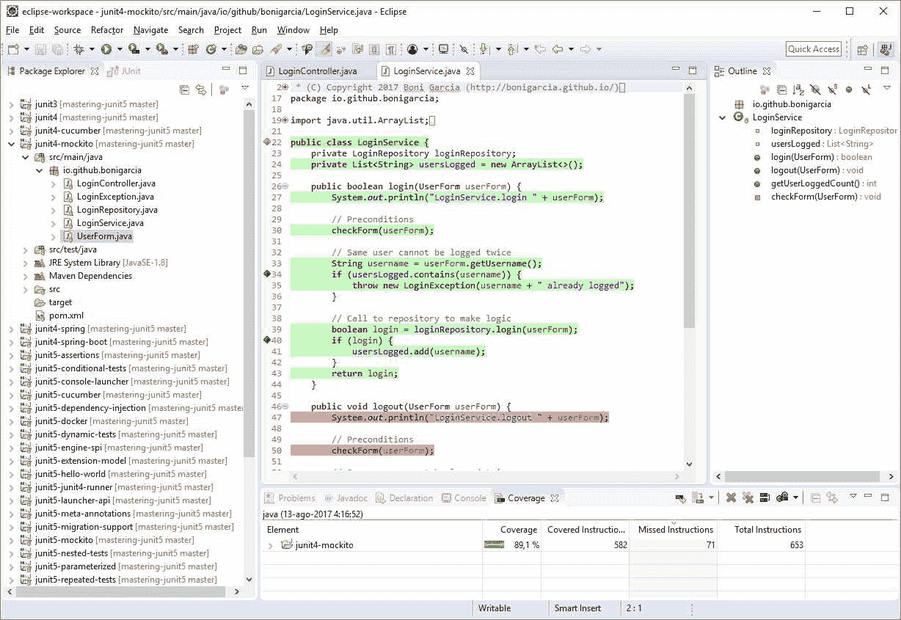

# 从需求到测试用例

程序测试可用于显示错误的存在，但绝不能显示错误的不存在！

——埃兹格尔·迪克斯特拉

本章提供了一个知识库，旨在帮助软件工程师编写有意义的测试用例。该过程的起点是理解被测试系统的需求。没有这些信息，设计或实施有价值的测试是不可行的。之后，在测试的实际编码之前可能会执行一些操作，即测试规划和测试设计。一旦我们开始测试编码过程，我们需要记住一套正确编写代码的原则，同时还要避免一套反模式和不良气味。本章以以下章节的形式提供了所有这些信息：

*   **需求的重要性**：本节概述了软件开发过程，首先陈述了软件系统需要涵盖的一些需求，然后是几个阶段，通常包括分析、设计、实现和测试。
*   **测试计划**：在软件项目开始时可以生成名为*测试计划*的文档。本节根据 IEEE 829 测试文件标准审查测试计划的结构。正如我们将发现的，测试计划的完整陈述是一个非常细粒度的过程，特别推荐用于大型项目，其中团队之间的沟通是项目成功的关键方面。
*   **测试设计**：在开始测试编码之前，考虑这些测试的蓝图始终是一个很好的实践。在本节中，我们将回顾正确设计测试所需考虑的主要方面。我们将重点放在测试数据（预期结果）上，这些数据为测试断言提供了依据。在这方面，我们回顾了一些黑盒数据生成技术（等价划分和边界分析）和白盒（测试覆盖率）。
*   **软件测试原则**：本节提供了一套最佳实践，可以帮助我们编写测试。
*   **测试反模式**：最后，还回顾了另一面：编写测试用例时需要避免的模式和代码气味是什么。

# 需求的重要性

软件系统是为了满足一组消费者（最终用户或客户）的某种需求而构建的。理解这些需求是软件工程中最具挑战性的问题之一，因为消费者需求模糊不清（特别是在项目的早期阶段）是很常见的。此外，在整个项目生命周期中，这些需求可能会发生深刻的变化，这一点也很常见。著名软件工程师、计算机科学家弗雷德·布鲁克斯（Fred Brooks）在其开创性著作《人月神话》（1975）中定义了这个问题：

构建软件系统最困难的部分是准确决定要构建的内容。 概念性工作的任何其他部分都没有建立详细的技术要求那么困难……如果做错了，工作的其他部分不会如此削弱最终的系统。 没有其他部分在以后更难纠正。

在任何情况下，消费者的需求都是任何软件项目的试金石。根据这些需求，可以出现一系列功能。我们将特性定义为软件系统功能的高级描述。从每个特性中，应导出一个或多个需求（功能性和非功能性）。需求是软件的一切真实性，以满足消费者的期望。场景（现实生活中的示例而不是抽象描述）对于向需求描述中添加细节非常有用。软件系统的需求组和/或特性列表通常称为规范。

在软件工程中，定义需求的阶段称为**需求引出**。在这个阶段，软件工程师需要澄清*他们试图解决的*问题。在这个阶段结束时，通常的做法是开始系统建模。为此，使用建模语言（通常是 UML）来创建一组图。通常适合于启发阶段的 UML 图是用例图（系统功能的模型及其与相关参与者的关系）。

建模并非总是在所有软件项目中进行。例如，敏捷方法论更多地基于草图原理，而不是形式化建模策略。

启发后，应在**分析**阶段细化需求。在这一阶段，对所述需求进行分析，以解决不完整、模棱两可的矛盾问题。因此，在这个阶段，它可能会继续建模，例如使用尚未链接到任何特定技术的高级类图。一旦分析清楚了（即系统的*什么*），我们需要了解*如何*实现它。此阶段称为**设计**。在设计阶段，应制定项目指南。为此，软件系统的体系结构通常是从需求中派生出来的。同样，建模技术被广泛应用于设计的不同方面。此时可以使用一组 UML 图，包括结构图（组件、部署、对象、包和概要图）和行为图（活动、通信、序列或状态图）。从设计上可以开始实际的**实现**（即编码）。

根据不同的因素，在设计阶段进行的建模量会有很大差异，包括生产软件的公司的类型和规模（跨国公司、中小企业、政府等）、开发过程（瀑布式、螺旋式、原型、敏捷等）、项目类型（企业、开源等）、软件类型（定制软件、现成商业软件等），甚至是相关人员的背景（经验、职业等）总之，设计需要被理解为参与项目的软件工程师不同角色之间的沟通方式。通常，项目越大，就越需要基于不同建模图的细粒度设计。

关于**测试**，为了制定适当的测试计划（更多细节见下一节），我们同样需要使用需求获取数据，即需求和/或特性列表。换句话说，为了验证我们的系统，我们需要事先知道我们对它的期望。使用 Barry Boehm 提出的经典定义（参见第 1 章、“软件质量和 Java 测试回顾”），验证用于回答问题“我们是否构建了正确的产品？”要做到这一点，我们需要了解需求，或者至少了解期望的特性。除了验证之外，还需要进行一些验证（根据 Boehm 的说法：“我们是否在生产正确的产品？”。这是必要的，因为有时在指定的内容（特性和要求）和消费者的实际需求之间存在差距。因此，验证是一种高级评估方法，要执行它，最终消费者可以参与其中（一旦部署软件系统，就要对其进行验证）。下图描述了所有这些想法：

软件工程通用开发过程

到目前为止，没有通用的工作流程来描述这些术语（通信、需求获取、分析、设计、实现/测试和部署）。在前面的图中，它遵循线性流程，然而，在实践中，它可以遵循迭代、进化或并行工作流。

为了说明软件工程中不同阶段（分析、设计、实现等）所涉及的潜在问题，有必要回顾一下经典漫画“项目到底是如何工作的？”这张照片的原始来源不详（有 20 世纪 60 年代的版本）。2007 年，[出现了一个名为*卡通工程*的网站](http://www.projectcartoon.com/)，允许使用新场景定制原创卡通。下图是该网站提供的卡通 1.5 版：

项目如何真正工作，版本 1.5（由[www.projectcartoon.com](http://www.projectcartoon.com)创建）

如果我们考虑一下这幅图，我们会发现问题的根源来自需求，客户在开始时解释得不好，项目负责人理解得最差。从那时起，整个软件工程过程就变成了*中文低语*儿童游戏。解决所有这些问题超出了本书的范围，但作为一个良好的开端，我们需要特别注意指导整个过程的需求，当然包括测试。

# 测试计划

测试路径的第一步可以是生成名为*测试计划*的文档，这是进行软件测试的蓝图。本文档描述了测试工作的目标、范围、方法、重点和分布。准备此类文档的过程是考虑软件系统验证需求的有用方法。同样，当 SUT 和相关团队规模较大时，本文件尤其有用，因为不同角色的工作分离使得沟通成为项目成功的潜在障碍。

创建测试计划的一种方法是遵循 IEEE 829 测试文档标准。尽管对于大多数软件项目来说，该标准可能过于正式，但可能值得审查该标准中提出的指南，并在我们的软件项目中使用所需的部分（如果有）。IEEE 829 中提出的步骤如下：

1.  **分析产品**：这一部分强化了从消费者需求中提取对系统需求的理解。如前所述，如果没有可用的软件信息，则不可能对其进行测试。
2.  **设计测试策略**：本部分计划包含几个部分，包括：
    *   定义测试范围，即待测试的系统组件（范围内）和未测试的部件（范围外）。正如后面解释的，穷举测试是不可行的，我们需要仔细选择要测试的内容。这不是一个简单的选择，它可以由不同的因素决定，例如精确的客户请求、项目预算和时间安排，以及相关软件工程师的技能。
    *   确定测试类型，即应执行哪些级别的测试（单元、集成、系统、验收）以及哪些测试策略（黑盒、白盒、非功能）。
    *   记录风险，即可能导致项目中不同问题的潜在问题。
3.  **定义测试目标**：在计划的这一部分中，列出了要测试的特性列表以及每个特性的测试目标。

4.  **定义测试标准**：这些标准通常由两部分组成，即：
    *   暂停标准，例如，在团队解决所有失败之前暂停开发新功能的失败测试百分比。
    *   退出标准，例如，进入下一个开发阶段应通过的关键测试的百分比。
5.  **资源规划**：该部分计划用于总结开展测试活动所需的资源。可能是人员、设备或基础设施。
6.  **计划测试环境**：包括要执行测试的软件和硬件设置。
7.  **进度计划和估算**：在这个阶段，管理者应该将整个项目分解成小任务，估算工作量（人月）。
8.  **确定测试可交付成果**：确定支持测试活动必须维护的所有文件。

可以看出，测试计划是一项复杂的任务，通常由经理在大型项目中执行。在本章的其余部分中，我们将继续探索如何编写测试用例，但下文将从最接近实际测试编码的角度出发。

# 试验设计

为了正确地设计测试，我们需要明确定义需要实现什么。为此，重要的是记住测试的一般结构是什么，已经在第 1 章、“软件质量和 Java 测试回顾”中解释过。因此，对于每个测试，我们需要定义：

*   什么是测试夹具，即 SUT 中执行测试所需的状态？这是在测试开始时在称为设置的阶段完成的。在测试结束时，测试夹具可能会在称为拆卸的阶段释放。
*   什么是 SUT，如果我们正在进行单元测试，哪些是它的文档？单元测试应该是独立的，因此我们需要为 DOC 定义替身测试（通常是 mock 或 spie）。
*   这些主张是什么？这是测试的关键部分。如果没有断言，我们就不能声称实际进行了测试。为了设计断言，值得回忆一下它的一般结构。简言之，断言包括一些预期值（测试数据）和从 SUT 获得的实际结果的比较。如果任何断言为否定，测试将被宣布为失败（测试裁决）：

测试用例和断言通用模式

测试数据在测试过程中起着至关重要的作用。测试数据的来源通常称为测试预言，通常可以从需求中提取。然而，还有一些其他常用的测试资源，例如：

*   一个不同的程序，它产生预期的输出（反向关系）。
*   提供近似结果的启发式或统计预言。
*   基于人类专家经验的价值观。

此外，根据底层测试技术，可以导出测试数据。当使用黑盒测试时，也就是说，基于使用一些输入和期望一些输出来执行一些特定的需求，可以使用不同的技术，例如等价划分或边界分析。另一方面，如果我们使用白盒测试，结构是我们测试的基础，因此测试覆盖率将是选择最大化这些覆盖率的测试输入的关键。在下面的章节中，将对这些技术进行回顾。

# 等价划分

等价分区（也称为等价类分区）是一种黑盒技术（即，它依赖于系统的需求），旨在减少应针对 SUT 执行的测试数量。1978 年，Glenford Myers 首次将该技术定义为：

“一种将程序的输入域划分为有限数量的类【集合】的技术，然后识别一组最小的精心挑选的测试用例来表示这些类。”

换句话说，等价划分提供了一个标准来回答问题*我们需要多少测试**？*这个想法是将所有可能的输入测试数据（通常是大量的组合）划分为一组值，我们假设 SUT 以相同的方式处理这些值。我们称这些值集为等价类。其思想是测试等价类内的一个有代表性的值被认为是足够的，因为假定所有的值都以相同的方式被 SUT 处理。

通常，给定 SUT 的等价类可以分为两种类型：有效输入和无效输入。等价分区测试理论确保每个分区只需要一个测试用例来评估相关分区（有效类和无效类）的程序行为。以下过程描述了如何系统地执行给定 SUT 的等价划分：

1.  首先，我们确定 SUT 的所有可能有效输入的域。为了找出这些值，我们依赖于规范（特性或功能需求）。我们的 SUT 应该正确处理这些值（有效的等价类）。
2.  如果我们的规范确定等价类的某些元素的处理方式不同，那么它们应该分配给另一个等价类。
3.  这个域之外的值可以看作是另一个等价类，这一次是针对无效输入的。

4.  对于每个等价类，选择一个代表值。该决策是一个启发式过程，通常基于测试人员的经验。
5.  对于每个测试输入，也会选择适当的测试输出，通过这些值，我们将能够完成我们的测试用例（测试练习和断言）。

# 边界分析

任何程序员都知道，错误通常出现在等价类的边界上（例如，数组的初始值、给定范围的最大值等等）。边界值分析是一种通过查看测试输入的边界来补充等价划分的方法。1981 年，国家标准与技术研究所（NIST）将其定义为：

“一种选择技术，其中选择的测试数据位于类、数据结构和程序参数的输入或输出范围“边界”上。”

总之，为了在我们的测试中应用边界值分析，我们需要在等价类的边界中准确地评估 SUT。因此，通常使用这种方法导出两个测试用例：等价类的上边界和下边界。

# 测试覆盖率

测试覆盖率是 SUT 中为其任何测试执行的代码的比率。测试覆盖率对于查找 SUT 的未测试部分非常有用。因此，它可以是完美的白盒技术（结构）来补充黑盒（功能）。一般来说，80% 或以上的测试覆盖率是合理的。

有不同的 Java 库，允许以简单的方式进行测试覆盖，例如：

*   [Cobertura](http://cobertura.github.io/cobertura/)：它是一个开源报告工具，可以使用 Ant、Maven 或直接使用命令行执行。
*   [EclEmma](http://www.eclemma.org/)：它是 Eclipse 的开源代码覆盖工具。从 Eclipse4.7（Oxygen）开始，EclEmma 就在 IDE 中进行了开箱即用的集成。以下屏幕截图显示了 EclEmma 如何突出显示 Eclipse 中 Java 类的代码覆盖率的示例：

Eclipse4.7 中 EclEmma 的测试覆盖率（氧气）

*   [Jacoco](http://www.jacoco.org/jacoco/)：它是一个开源代码覆盖库，由 EclEmma 团队在其他旧覆盖库 [EMMA](http://emma.sourceforge.net/) 的基础上创建。JaCoCo 作为 Maven 依赖项提供。
*   [Codecov](https://codecov.io/)：这是一个云解决方案，提供友好的代码覆盖率 web 仪表板。它对开源项目是免费的。

# 软件测试原则

穷举测试是一种测试方法的名称，它使用所有可能的测试输入组合来验证软件系统。这种方法仅适用于可能操作和允许数据数量非常有限的微型软件系统或组件。在大多数软件系统中，验证每个可能的排列和输入组合是不可行的，因此穷举测试只是一种理论方法。

因此，据说软件系统中不存在缺陷是无法证明的。这是由计算机科学先驱 Edsger W.Dijkstra 所说的（见本章开头的引文）。因此，测试充其量只是抽样，必须在任何软件项目中进行，以降低系统故障的风险（参见第 1 章、“软件质量和 Java 测试回顾”、回顾软件缺陷分类法）。因为我们不能测试所有的东西，所以我们需要正确地测试。在本节中，我们将回顾一组编写高效测试用例的最佳实践，即：

*   **测试应该简单**：编写测试的软件工程师（打电话给他或她的测试人员、程序员、开发人员或其他人）应该避免尝试测试他或她的程序。关于测试，问题“是谁在看看守员？”的正确答案应该是无名小卒。我们的测试逻辑应该足够简单，以避免任何类型的元测试，因为这将导致任何逻辑的递归问题。间接地说，如果我们保持测试简单，我们还可以获得另一个理想的特性：测试将易于维护。
*   **不要实现简单测试**：一件事是进行简单测试，另一件非常不同的事情是实现伪代码，比如 getter 或 setter。正如前面介绍的，测试充其量只是抽样，我们不能浪费宝贵的时间来评估代码库的这类部分。
*   **易读**：第一步是为我们的测试方法提供一个有意义的名称。此外，由于 JUnit 5`@DisplayName`注释，我们可以提供丰富的文本描述，它在没有 Java 命名约束的情况下定义了测试的目标。
*   **单一责任原则**：这是计算机编程的一般原则，规定每个类都应该对单一功能负责。它与内聚度密切相关。这一原则在编写测试代码时非常重要：单个测试只应引用给定的系统需求。
*   **测试数据是关键**：如前一节所述，SUT 的预期结果是测试的核心部分。正确管理这些数据对于创建有效的测试至关重要。幸运的是，JUnit 5 提供了一个丰富的工具箱来处理测试数据（参见第 4 章“使用高级 JUnit 特性简化测试”中的“参数化测试”。
*   **单元测试应该执行得非常快**：对于单元测试的持续时间，一个普遍接受的经验法则是一个单元测试最多只能持续一秒钟。为了实现这一目标，还需要单元测试正确地隔离 SUT，正确地加倍其文档。
*   **测试必须是可重复的**：缺陷应根据需要重复多次，以便开发人员找到缺陷的原因。这是理论，但不幸的是，这并不总是适用的。例如，在多线程 SUT（实时或服务器端软件系统）中，可能会出现争用情况。在这些情况下，可能会遇到非确定性缺陷（通常称为*海森堡*）。
*   **我们应该测试正面和负面场景**：这意味着我们需要使用输入条件编写测试，以评估预期结果，但我们还需要验证程序不应该做什么。除了满足其要求外，还必须对程序进行测试，以避免不必要的副作用。
*   **测试不能仅仅为了覆盖而进行**：仅仅因为代码的所有部分都被一些测试所触及，我们无法保证这些部分已经过彻底的测试。为了做到这一点，测试必须从降低风险的角度进行分析。

# 测试心理学

从心理学的角度来看，测试的目标应该是为了发现缺陷而执行软件系统。理解这种说法的动机可以使我们的测试成功率有所不同。

人类倾向于以目标为导向。如果我们执行测试以证明程序没有错误，我们将倾向于执行测试，选择导致程序失败的概率较低的测试数据。另一方面，如果目标是证明程序存在错误，我们将增加发现错误的概率，从而比前一种方法为程序增加更多的价值。因此，测试通常被认为是一个破坏性的过程，因为测试人员应该证明 SUT 有错误。

此外，试图证明软件中存在错误是一个可行的目标，而如前所述，试图证明软件中没有错误是不可能的。心理学研究再次告诉我们，当人们知道某项任务不可行时，他们的表现很差。

# 测试反模式

在软件设计中，模式是解决重复出现问题的可重用解决方案。它们有很多，包括例如 singleton、factory、builder、facade、proxy、decorator 或 adapter 等等。反模式也是模式，但不受欢迎。关于测试，有必要了解一些反模式，以便在我们的测试中避免它们：

*   **二等公民**：测试代码中含有大量重复代码，维护困难。
*   **搭便车**（也称为*背驮*）：不编写新方法来验证另一个特性/需求，而是在现有测试中添加新断言。
*   **快乐路径**：只验证预期结果，不测试边界和异常。
*   **局部英雄**：依赖于特定当地环境的测试。这个反模式可以用短语“它在我的机器中工作”来概括。
*   **隐藏依赖项**：在测试运行之前，需要在某处填充一些现有数据的测试。
*   **链组**：必须按一定顺序运行的测试，例如，将 SUT 更改为下一个 SUT 预期的状态。
*   **滑稽**：一种单元测试，它包含太多的测试替身，以至于 SUT 根本没有被测试，而不是从测试替身返回数据。
*   **静默捕手**：即使实际发生意外异常也能通过的测试。
*   **窥探者**：违反封装的测试，SUT 中的任何重构都需要在测试中反映这些更改。
*   **过度设置**：需要大量设置才能开始练习阶段的测试。
*   **肛门探头**：必须使用不健康的方式来执行任务的测试，例如使用反射读取私有字段。
*   **无名测试**：测试方法名称，没有关于测试内容的明确指示器（例如，bug 跟踪工具中的标识符）。
*   **呆呆兽**：持续数秒的单元测试。
*   **闪烁测试**：在适当的测试中包含竞争条件的测试，使其不时失败。
*   **观望**：需要等待一定时间（例如`Thread.sleep()`）才能验证某些预期行为的测试。
*   **不适当共享夹具**：使用测试夹具而不需要设置/拆卸的测试。
*   **巨人**：一个包含大量测试方法（上帝对象）的测试类。
*   **湿地板**：一种创建持久数据但在完成时未清理的测试。
*   **布谷鸟**：一种单元测试，在实际测试之前建立某种固定装置，但测试不知何故丢弃了固定装置。
*   **秘密捕手**：一种不做任何断言的测试，依赖于要抛出的异常并由测试框架报告为失败。
*   **环境破坏**：要求使用给定环境变量（例如，允许同时执行的自由端口号）的测试。
*   **Doppelganger**：将被测代码的一部分复制到一个新类中，以使测试可见。
*   **母鸡**：一种性能超过测试需要的夹具。
*   **全方位测试**：不应违反单一责任原则的测试。
*   **线击球手**：未对 SUT 进行任何实际验证的测试。
*   **连体双胞胎**：称为*单元测试*，但实际上是集成测试的测试，因为 SUT 和 DOC 之间没有隔离。
*   **撒谎者**：不测试本应测试内容的测试。

# 代码气味

代码气味（当提到软件时也称为*臭味*是源代码中的不良症状。代码气味本身并没有问题，但它们可以证明附近存在某种问题。

如前几节所述，测试应该简单易读。有了这些承诺，代码气味在任何情况下都不应该出现在我们的测试中。总而言之，在我们的测试中可以避免泛型代码的气味。以下是一些最常见的代码气味：

*   **重复代码**：克隆代码在软件中总是一个坏主意，因为它打破了原则**不要重复自己**（**干**。这个问题在测试中甚至是最糟糕的，因为测试逻辑必须非常清晰。
*   **高复杂性**：太多的分支或循环可能被简化为更小的部分。
*   **过长方法**：长得太大的方法总是有问题的，当这种方法是一种测试时，它是一种非常糟糕的症状。
*   **不合适的命名约定**：变量、类、方法名称要简洁。使用很长的标识符，但也使用过短（或无意义）的标识符，这被认为是一种不好的味道。

# 总结

测试设计的起点应该是需求列表。如果这些需求尚未正式引出，至少我们需要了解反映软件需求的 SUT 特性。从这一点出发，可以采取几种策略。像往常一样，没有一条独特的道路可以实现我们的目标，这最终应该是降低项目的风险。

本章回顾了旨在创建有效测试用例的过程。这个过程包括需求分析、测试计划的定义、测试用例的设计，最后编写测试用例。我们应该意识到，尽管软件测试是一项技术任务，但它涉及到一些重要的人类心理因素。软件工程师和测试人员应该了解这些因素，以便遵循已知的最佳实践并避免常见错误。

在第 7 章“测试管理”中，我们将了解在一个活的软件项目中如何管理软件测试活动。为此，我们首先回顾在常见的软件开发过程中何时以及如何执行测试，如瀑布式、螺旋式、迭代式、螺旋式、敏捷式或测试驱动开发。然后，回顾了服务器端基础设施（如 Jenkins 或 Travis），其目的是在 JUnit 5 的上下文中自动化软件开发过程。最后，我们将学习如何使用所谓的问题跟踪系统和测试报告库跟踪 Jupiter 测试中发现的缺陷。