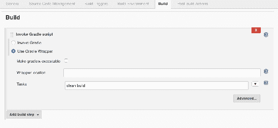

# 通过实施连续交付利用TDD

“没有什么比结果更能说明问题。如果你想建立一种与人们联系的可信度，那么在传递信息之前先传递结果。走出去，做你建议别人做的事。从经验中交流。”

–约翰·C·麦克斯韦

在本书中，概念和良好实践都以孤立的例子呈现。本章的目标是通过将这些概念应用到更现实的场景中，将其中的一些概念付诸实践。

为了实现这一点，我们引入了一家虚构的公司，名为Awesome赌博公司。这家公司在其软件开发生命周期中遇到了一些问题，这些问题可以通过应用我们在本书中学到的一些知识轻松解决。作为免责声明，与真实公司的任何相似之处纯属巧合。此外，为了简洁起见，代码库不是很广泛，一些问题被夸大了，以便更好地表示需要解决的问题。

不一定按顺序涵盖的主题包括：

*   连续积分
*   连续交付
*   测试驱动开发的好处
*   确定快速胜利

# 案例研究-可怕的赌博公司

您是Alice，一名软件开发人员，刚刚加入Awesome赌博公司的软件开发团队。您的队友正试图在尽可能短的时间内让您跟上进度。这是你的第一天，你的队友约翰被指定为你的导师，他将在公司的头几个小时指导你。

在一杯愉快的咖啡之后，他迅速地将你谈话的主题设定为构成你日常工作的所有任务和程序。您的团队正在开发和维护一个非常简单的`thimblerig-service`。一旦你听到“顶针钻”这个词，你就不好意思地承认这是你第一次听到这个词。约翰笑着说他两年前加入公司时也不知道这一点

顶针游戏，也称为**三壳一豆**，是一种古老的赌博游戏。规则很简单，有三个壳，豌豆被三个壳中的一个覆盖着。三个贝壳以非常高的速度被洗牌，当完成时，玩家必须猜测哪一个贝壳隐藏了豌豆。

在解释之后，他很乐意帮助您从存储库下载代码项目，并简要地向您解释总体概念。

一旦他完成了解释，他会要求你自己阅读代码。他还告诉你，如果你有任何问题或顾虑，他是你可以去的人。你对他的时间表示感谢，然后开始浏览这个项目。

# 探索代码库

当您开始浏览项目时，您会意识到应用程序并不十分复杂。事实上，该项目包含大约12个Java类，当您开始打开并查看这些文件时，您会注意到它们都不超过100行。这很好，代码库很小，因此您可以在短时间内开发新功能。

如果这是一个Gradle项目，您可以快速打开`build.gradle`文件，确认项目中使用的框架和库：

```java
apply plugin: 'java'
apply plugin: 'org.springframework.boot'

sourceCompatibility = 1.8
targetCompatibility = 1.8

bootRepackage.executable = true

repositories {
  mavenLocal()
  mavenCentral()
}

dependencies {
  compile 'org.springframework.boot:spring-boot-starter-actuator'
  compile 'org.springframework.boot:spring-boot-starter-web'

  testCompile 'junit:junit:4.12'
  testCompile 'org.hamcrest:hamcrest-all:1.3'
  testCompile 'org.mockito:mockito-core:1.10.19'
}
```

Gradle建筑场地看起来不错。您将要从事的项目是一个基于Spring的web服务。它使用了`spring-boot-starter-web`，因此您很可能可以在本地轻松运行它。此外，还有一些测试依赖项，这意味着测试文件夹中也应该有一些测试。

几分钟后，您已经有了应用程序的心智图。有一个名为`ThimblerigService`的类处理游戏的逻辑。它依赖于一个`RandomNumberGenerator`并且只有一个公共方法，即`placeBet`。方法和类有一个可理解的名称，因此不难理解它们的作用：

```java
@Service
public class ThimblerigService {
  private RandomNumberGenerator randomNumberGenerator;

  @Autowired
  ThimblerigService(RandomNumberGenerator randomNumberGenerator) {
    this.randomNumberGenerator = randomNumberGenerator;
  }

  public BetResult placeBet(int position, BigDecimal betAmount) {
    ...
  }
}
```

除了该类之外，只有一个控制器类实现了API：它是`ThimblerigAPI`。它只公开了一种方法，即`placeBet`。其他公司服务调用该`POST`方法，以便在此服务中玩一个游戏。该服务解决下注问题，并在响应中包含详细信息，如是否中奖、金额等：

```java
@RestController
@RequestMapping("/v1/thimblerig")
public class ThimblerigAPI {
  private ThimblerigService thimblerigService;

  @Autowired
  public ThimblerigAPI(ThimblerigService thimblerigService) {
    this.thimblerigService = thimblerigService;
  }

  @ResponseBody
  @PostMapping(value = "/placeBet",
      consumes = MediaType.APPLICATION_JSON_VALUE)
  public BetReport placeBet(@RequestBody NewBet bet) {
    BetResult betResult =
        thimblerigService.placeBet(bet.getPick(), bet.getAmount());
    return new BetReport(betResult);
  }
}
```

这是一个相当简单的设置，一切都非常清晰，因此您决定继续并开始查看测试。

当您打开`test`文件夹并开始查找测试时，您会非常惊讶地发现只有一个测试类：`ThimblerigServiceTest`。一个好的测试胜过一百个坏的测试，但您仍然认为此应用程序的单元测试很差：

```java
public class ThimblerigServiceTest {
  @Test
  public void placingBetDoesNotAcceptPositionsLessThanOne() {
    ...
  }

  @Test
  public void placingBetDoesNotAcceptPositionsGreaterThan3() {
    ...
  }

  @Test
  public void placingBetOnlyAcceptsAmountsGreaterThanZero() {
    ...
  }

  @Test
  public void onFailedBetThePrizeIsZero() {
    ...
  }

  @Test
  public void whenThePositionIsGuessedCorrectlyThePrizeIsDoubleTheBet() {
    ...
  }
}
```

在打开这个类并检查它包含的所有测试之后，您的印象会有轻微的改变。这些测试完全覆盖了核心服务，它们看起来很有意义，而且非常详尽。但尽管如此，你还是忍不住转头问约翰为什么只有一个测试。他告诉你，他们没有太多时间创建测试，因为他们很匆忙，所以只有关键部分有测试。一段代码是否关键是非常主观的，但您了解情况；事实上，你已经多次遇到这种情况。

仅仅过了一秒钟，在你有时间回到你的任务之前，John在他的回答中添加了另一个有趣的点：**质量保证**（**质量保证**部门）。该部门的目标是在所有候选版本到达生产环境之前对其进行测试。他们的任务是发现可能影响应用程序的错误和bug并报告它们。在某些情况下，如果发现的任何错误非常严重，则会停止发布，并且永远不会将其部署到生产环境中。这个过程通常需要三到五天。您认为在某些情况下，这可能是一个瓶颈，因此您要求他向您提供发布过程的进一步细节。

# 释放程序

如果项目是一个简单的**代表性状态转移**（**REST**服务），那么发布的创建一点也不复杂。根据当前过程，开发人员编译代码并将工件发送给管理所有部署的团队。该团队与客户和QA部门协调测试和生产部署。

你决定问约翰对这个过程是否满意。在你得到答案之前，你知道约翰一点也不高兴。你可以从他的脸上看出他在努力掩饰自己对此事的感受。约翰抑制住自己的情绪，开始描述球队的现状。

事实证明，在开发团队中，并不是一切都是快乐和糖果。所有开发人员在开始编码时，都会从存储库中的主分支创建自己的分支。这一点也不坏，但一些分支在几周后被合并回主分支。问题是主分支自那时以来发生了很大的变化，代码库也发生了很大的分歧，这意味着合并非常困难、不愉快且容易出错。

除了偶尔出现的合并问题外，一个开发人员错误地编译了他的本地分支，并将其部署到生产环境中，在短时间内造成了混乱、混乱和不确定性。

除此之外，客户对新功能的实施时间不是很满意。他们不时对此抱怨，说每一个微小的改变都至少需要一周的时间。

你很困惑这怎么会发生在一个非常小的REST服务上，但当然John指的是公司中其他更大的项目。您知道，通过实施**持续集成**（**CI**）和持续交付，可以解决或至少缓解此类问题。事实上，通过尽可能地自动化流程，您可以通过消除那些琐碎的问题来关注其他问题。

经过这个小小的思考，您现在知道您需要有关部署过程的更多信息，并且您也知道John愿意向您提供详细信息

# 部署到生产环境

随着发布过程的结束，John开始向您解释如何将服务部署到生产环境中。这是非常手工的工作：**基础设施团队**（**It**部门）的一名成员将工件复制到服务器上，并执行一些命令以使其运行。

John还借此机会补充了他们过去遇到的一些错误，比如基础设施运营商没有部署最新版本，而是错误地重新部署了旧版本。一堆老臭虫再次出现，并一直在生产中，直到有人发现发生了什么。

在听这些故事时，你会情不自禁地开始思考你从以前的项目和公司中学到了什么。你知道，把代码放入生产环境可能是一个非常简单而直接的任务，一个永无休止的噩梦，或者中间的东西。这取决于许多因素，有时我们无法改变它。在某些场景中，将应用程序部署到生产环境需要得到有权决定何时部署以及部署什么的人员的认可。在另一些国家，有严格的规定，把本应是简单的程序变成冗长乏味的任务。

此外，自动化部署是减少人机交互可能增加的风险因素的一种方法。创建一个可重复的流程非常简单，只需在脚本中编写所有必要的步骤并安排其执行。众所周知，任何一个脚本都不能完全取代人，但是，不用说，目标不是用脚本取代人。它的主要目的是提供一种可以自动执行的工具，并且人类可以监督它，在必要时进行手动干预。为此，实施连续交付非常合适。

在约翰简短而激烈的介绍之后，你觉得你已经准备好开始自己的工作了。你的头脑中有许多可能的改进，你肯定渴望实现它们。

# 增加测试覆盖率

在衡量代码质量的指标中，有一个指标尤其难以理解，那就是测试覆盖率。测试覆盖率是一个危险的指标，因为真正高的覆盖率并不意味着代码经过了良好的测试。顾名思义，它只考虑一段代码是否已被触发并因此被测试执行。因此，测试的目标基本上是良好测试和良好覆盖的组合。总之，重要的是测试的质量，其次是代码覆盖率。

不过，在某些情况下，代码覆盖率确实是一个很好的指标。这些是代码覆盖率非常低的时候。在这些情况下，这个数字意味着大部分代码库没有被测试，因此测试不能确保我们没有引入错误。

此外，创建良好的自动化测试可以减少QA团队在执行回归测试上花费的时间。这很可能会减少他们反复测试相同代码的时间，从而提高团队的交付速度。

# 结论

尽管出于说教的目的，这家公司的情况被夸大了，但仍有一些公司在与这些问题作斗争。事实上，Alice知道Awesome赌博公司的软件开发人员的工作方式并不理想。有许多技巧，其中一些在本书中介绍，可以帮助公司停止关注无意识的错误，开始关注其他可以为最终产品增加更多价值的东西。

在下一节中，我们将通过提出一种可能的解决方案来解决所描述的一些问题。这不是唯一的解决方案；实际上，建议的解决方案包括一些工具，并且对于所使用的每个工具都有许多选项。此外，每家公司都有自己的文化和限制，因此，拟议的解决方案可能并不完全合适。

# 可能的改进

在本节和下面的小节中，我们将处理Alice故事中描述的一些问题。因为我们从示例继承的代码已经实现，所以我们不能在这里应用TDD。相反，我们将为未来的发展奠定基础，为应用TDD变得非常有用奠定基础。

尽管总是有很多事情可以改进，但要解决的难点是代码合并问题、大量手动测试、手动发布以及开发更改或新功能所需的时间。

对于前两个，我们将增加应用程序的测试覆盖率并实现CI。Jenkins服务器将被配置为解决第三个问题，即手动版本。最后，最后一个问题，即长的**上市时间**（**TTM**），将通过实施其余解决方案来缓解。

# 实施持续集成

在有多个团队并行工作的大公司中，经常会出现大量的集成冲突。当代码库正在进行大量开发时，这种情况会更频繁地发生。

为了缓解这种情况，强烈建议使用CI。其主要思想是开发分支不应该与主分支有太大的分歧。一种方法是将更改或新功能拆分为非常小的块，这样它们就可以很快完成并合并回来。另一种方式是定期合并；当功能很难分解为小功能时，这更合适。

当面对不可分割的功能时，如架构更改，功能切换非常有用。通过要素切换，可以合并未完成的要素，并且在启用标志之前无法访问这些要素。

# 走向持续交付

开发人员在这个故事中面临的问题之一是手动创建版本。有很多工具可以帮助自动化这些任务，比如Jenkins、Travis或Bambon，仅举几个例子。作为建议解决方案的一部分，我们将配置Jenkins的一个实例来自动运行所有这些任务。每次执行Jenkins作业时，都会创建一个新版本的`thimblerig-service`。

此外，由于我们已经转移到CI，主分支的状态应该随时准备好进行生产。而且，如果某些未完成的功能被合并，它们将由于功能切换而隐藏。

此时，为了解决发布问题，我们可以实现连续交付或**连续部署**（**CD**），但为了简单起见，我们将实现连续交付。让我们开始吧。

# 詹金斯装置

詹金斯是一个非常强大的工具，易于学习。在本节中，我们将准备环境，该环境由运行Jenkins Docker映像的虚拟机组成。此设置用于演示目的；对于真实的场景，最好将其安装在一个具有更多资源的专用服务器上，或者从CloudBees这样的公司获得服务。在这种特殊情况下，所有配置都位于`Vagrantfile`：

```java
Vagrant.configure("2") do |config|

  config.vm.box = "ubuntu/trusty64"
  config.vm.box_check_update = false

  config.vm.network "forwarded_port", guest: 8080, host: 9090

  config.vm.provider "virtualbox" do |vb|
    vb.gui = false
    vb.memory = 2048
  end

  config.vm.provision "docker" do |d|
    d.run "jenkins/jenkins",
      args: "-p 8080:8080 -p 50000:50000 -v jenkins_home:/var/jenkins_home"
  end
end
```

因此，要使其启动并运行，我们只需要执行以下命令：

```java
$> vagrant up
```

If, after a restart or whatever the reason might be, Jenkins appears offline or you can't reach it, try running the same command with provision flag:
**`$> vagrant up --provision`**

完成后，我们可以在我们喜爱的浏览器中打开`http://localhost:9090`继续安装：


因为我们不是在服务器上安装它，而是在Docker映像中运行它，所以获取这个密码有点棘手。可能最简单的方法是访问Docker机器并从文件中获取密码，可以这样做：

```java
$> vagrant ssh
$> docker exec jenkins-jenkins cat /var/jenkins_home/secrets/initialAdminPassword
```

复制密码，粘贴到密码字段，然后我们进入下一步，即配置插件。现在，我们只安装推荐的。其他插件可以稍后在管理面板中安装：


然后，当安装程序安装完插件后，将显示另一个屏幕。这是配置的最后一步，创建管理员用户。建议使用易于记忆的密码创建用户：


可以跳过此步骤，但管理员密码将与初始密码保持不变，这确实很难记住。现在我们已经准备好使用全新的Jenkins装置。

# 自动化构建

一旦我们让Jenkins开始运行，就应该开始使用它了。我们将在Jenkins上创建一个任务，该任务将下载`thimblerig-service`主分支，执行测试，构建它，并归档生成的工件。

让我们从创建一个自由式项目开始：


我们必须告诉Jenkins存储库的位置。在本例中，我们不需要身份验证，但在现实场景中很可能需要身份验证：


`thimblerig-service`项目为渐变项目。我们将使用Jenkins Gradle插件来编译、测试和构建我们的服务：



最后，我们必须指定测试报告和构建的工件的位置：


我们完成了。与我们通常在当地环境中所做的相比，这并没有太大的不同。它从主分支下载代码，并使用Gradle构建服务，正如开发人员所做的那样，John在故事中说。

# 第一次执行

在Jenkins创建了我们的项目之后，现在是测试它的时候了。我们从未配置过触发执行，因此Jenkins没有监视存储库中的更改。对于本例，手动启动构建就足够了，但在实际场景中，我们希望在主分支中的每次更改时自动触发它：


构建已成功完成；我们可以在摘要中看到，测试已经执行，但没有一个失败。我们已经准备好下载工件并尝试在本地执行它：

```java
$> chmod u+x thimblerig-service.jar
$> ./thimblerig-service.jar 
```

在某些时候，日志会显示一条类似于`Tomcat started on port(s): 8080 (http)`的消息。这意味着我们的服务已经准备好，我们可以开始使用它。为确保安全，我们始终可以通过运行以下命令来检查服务的运行状况：

```java
$> curl http://localhost:8080/health
{"status":"UP"}
```

这就是连续交付的例子。尽管这个示例功能齐全，但Jenkins并不是存储服务版本的最佳场所。对于真实世界的用例，有更强大的替代方案，例如Artifactory，或者简单地将服务Dockerize并将新版本推送到私有Docker注册表。

# 下一步是什么？

这里的示例纯粹是学术性的，部分解决方案有点粗糙。在一家真正的公司中，Jenkins将安装在一台专用服务器上，并将有更多的任务需要构建和发布。为了协调所有这些，需要对生成的工件进行适当的管理。如前所述，公司正在采用的一些解决方案是用于存储服务的Docker映像的工具，如Artifactory或Docker Registry的私有实例。无论选择何种存储，该过程都将保持编译、测试、构建和归档不变。这只是一个配置问题。

为了简洁起见，省略了一些需要新代码的部分，留给读者作为练习来完成。以下是一些如何继续的想法：

*   为REST控制器创建一些测试。
*   随机数生成器中存在一个问题—它根本不是随机的。分叉`thimblerig-service`项目，创建一个测试来重现问题，修复问题，并使用最近在Jenkins上创建的构建项目发布新版本的服务。
*   使用Docker。

所有代码片段和所需的其他项目文件都可以在以下存储库中在线找到：[https://bitbucket.org/alexgarcia/tdd-java-thimblerig-service](https://bitbucket.org/alexgarcia/tdd-java-thimblerig-service)

# 这仅仅是开始

您可能已经预料到，当您读到本书的末尾时，您已经了解了关于测试驱动开发（TDD）的所有知识。如果是这样的话，我们很抱歉，我们将不得不让你失望。掌握任何工艺都需要大量的时间和练习，TDD也不例外。继续，把你学到的知识应用到你的项目中。与同事分享知识。最重要的是，练习，练习，再练习。和空手道一样，只有通过不断的练习和重复才能完全掌握TDD。我们已经使用它很长一段时间了，我们仍然经常面临新的挑战，学习新的方法来改进我们的工艺。

# 这不一定是结束

写这本书是一次充满了许多冒险的长途旅行。我们希望你喜欢读它就像我们喜欢写它一样。

我们在我们的博客[上分享我们在各种主题上的经验http://technologyconversations.com](http://technologyconversations.com) 。

# 总结

在Alice虚构的故事中，公司目前面临的一些常见问题被呈现出来。其中之一就是时间不够。在这种特殊情况下，在大多数情况下，人们缺乏时间，因为他们被困在重复的任务中，无法增加价值，因此人们经常感到不可能实现更雄心勃勃的目标。当被问及为什么不练习TDD时，开发人员给出的一个主要借口是没有时间编写测试。

本章讨论了一种可能的解决方案，即使用Jenkins。一个带有Jenkins实例的虚拟机被配置为自动执行一些从团队中消耗时间的重复任务。

一旦问题得到解决，TDD就变得非常方便。以TDD方式开发的每一个新特性都将被测试覆盖，然后该特性的未来更改将针对测试套件运行，如果其中一个测试不满足，这将失败。