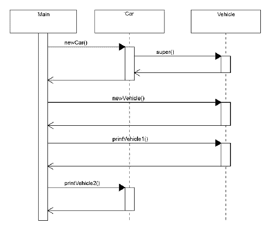
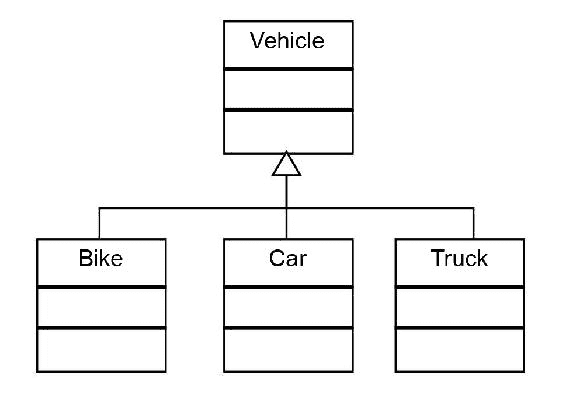
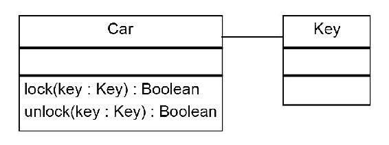
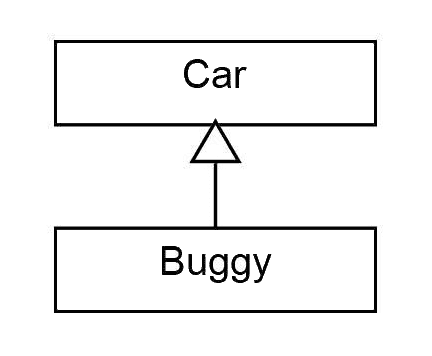
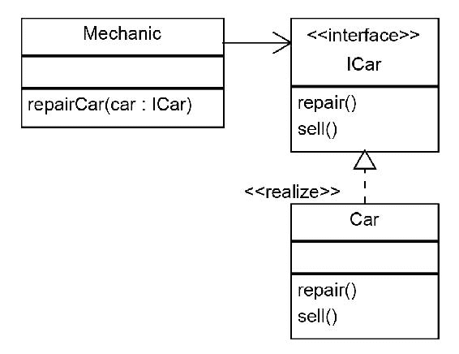
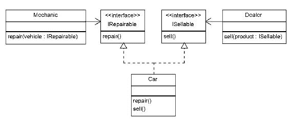

# 从对象导向到功能编程

本章的目的是将读者介绍了使用设计模式和 Java 中可用的最新功能的编写强大，可维护和可扩展的代码的基本概念。 为了实现我们的目标，我们将涵盖以下主题：

*   什么是编程范式？
*   势在必行的范式
*   陈述和功能范式
*   面向对象的范式
*   统一建模语言概述
*   面向对象的设计原则

# Java - 介绍

1995 年，发布了一种新的编程语言，灵感来自众所周知的 C ++和较少的已知 **SmallTalk** 。 Java 是这种新语言的名称，它试图修复其前辈们的大部分限制。 例如，使其流行的 Java 的一个重要特征是写一次并在任何地方运行; 也就是说，您可以在 Windows 计算机上开发代码并在 Linux 或任何其他计算机上运行它，您所需要的只是 JVM。 它提供了额外的功能，如垃圾收集，从而使开发人员释放到需要维护内存分配和裁量分配; **只是时间编译器**（ **giit** ）制作了 Java 智能和快速，删除了指针的删除功能使其更加安全。 所有上述功能和后来的 Web 支持添加了 Java 在开发人员之间成为流行的选择。 大约 22 年后，在几年内新语言消失的世界中，Java 版本已经成功推出并由社区调整，这对 Java 的成功表示了很多。

# Java 编程范式

什么是编程范式？ 由于软件开发开始，设计了不同的方法来设计编程语言。 对于每个编程语言，我们有一组概念，原则和规则。 这一组概念，原则和规则称为编程范例。 从理论上讲，语言被认为只属于一个范例，但在实践中，编程范式大多用一种语言组合。

在以下部分中，我们将突出显示 Java 编程语言所基于的编程范例，以及描述这些范式的主要概念。 这些是势在必行的，面向对象，声明性和功能规划。

# 命令编程

命令编程是一个编程范例，其中编写了语句以改变程序的状态。 这个概念在计算开始时出现，并且非常接近计算机的内部结构。 该程序是在处理单元上运行的一组指令，并且它以势在必行的方式将状态（其作为变量存储在存储器中）。 命名*命令*意味着执行的指令决定了程序如何运行。

今天的大多数最受欢迎的编程语言是基于势在必行范式的基础。 主要是令人遗憾的语言的最佳例子是 C.

# 现实生活势在必行例子

为了更好地了解命令规划范式的概念，让我们参加以下例子：你正在遇到一个朋友在你的城镇的一个哈克干，但他不知道如何到达那里。 我们将向他解释如何以必要的方式到达那里：

1.  从中央车站，乘坐电车 1。
2.  在第三站下车。
3.  走向右边，走向六大道，直到你到达第三章。

# 面向对象的范式

面向对象的范例通常与命令规划相关联，但在实践中，既有功能和面向对象的范例都可以共存。 Java 是支持这一协作的生活证明。

在以下部分中，我们将简要介绍以 Java 语言实现的主要面向对象的概念。

# 对象和课程

对象是**面向对象编程**的主要元素（ **OOP** ）语言。 一个对象保持状态和行为。

如果我们将类视为模板，则对象是模板的实现。 例如，如果人类是定义人类可以拥有的行为和属性的类，那么您和我就是这个人类类的对象，因为我们满足了作为人类的所有要求。 或者，如果我们认为汽车作为一堂课，特定的本田公民车将成为这一课程的对象。 它将满足汽车的所有属性和行为，例如它具有发动机，方向盘，前灯等，并且它具有向前移动，向后移动等行为。 我们可以看到面向对象的范式如何与现实世界有关。 现实世界中的几乎所有内容都可以在课堂和物体方面被认为，它使 OOP 轻松和流行。

面向对象的编程基于四个基本原则：

*   封装
*   抽象
*   遗产
*   多态性（亚型多态性）。

# 封装

**封装**基本上意味着属性和行为的结合。 这个想法是将物体的属性和行为保持在一个地方，使其易于维护和扩展。 封装还提供了一种隐藏来自用户的不必要细节的机制。 在 Java 中，我们可以为方法和属性提供访问指定符，以管理类的用户可见的内容以及隐藏的内容。

封装是面向对象语言的基本原则之一。 它有助于不同模块的去耦。 可以更独立地开发和维持去耦模块。 通过该技术通过该技术在内部改变了内部而不影响其外部暴露行为的代码重构。

# 抽象

抽象与封装密切相关，在某种程度上，它与它重叠。 简而言之，抽象提供了一种暴露*的机制，该机制是对象*并隐藏*对象如何做到它应该做的事情*。

一个真实的抽象示例是汽车。 为了开车，我们真的不需要知道汽车在引擎盖下的内容，但我们需要了解它向我们提供的数据和行为。 数据暴露在汽车的仪表板上，并且该行为由我们可以使用的控件来表示的行为。

# 遗产

继承是能够在另一个对象或类基础上。 有一个父或基类，它为实体提供了顶级行为。 每个子类实体或符合标准的子类实体或子类是父类的一部分可以从父类继承并根据需要添加其他行为。

让我们参加一个真实的例子。 如果我们认为 A `Vehicle`作为父类，我们知道`Vehicle`可以具有某些属性和行为。 例如，它有一个引擎，门等，它可以移动的行为。 现在，所有满足这些标准的实体 - 例如`Car`，`Truck`，`Bike`，依靠 - 可以从`Vehicle`继承，并在给定属性和行为的顶部添加。 换句话说，我们可以说`Car`是的 `Vehicle`。

让我们看看这将如何看作代码; 我们将首先创建一个名为`Vehicle`的基类。 该类具有单个构造函数，接受`String`（车辆名称）：

```
public class Vehicle 
{
  private Stringname;
  public Vehicle(Stringname)
  { 
    this.name=name;
  }
}
```

现在我们可以使用构造函数创建一个`Car`类。 `Car`类是从`Vehicle`类的派生，所以它继承并可以访问在基类中声明为受保护或公共声明的所有成员和方法：

```
public class Car extends Vehicle
{
  public Car(String name)
  {
    super(name)
  }
}
```

# 多态性

在广泛的术语中，多态使我们可以选择使用与不同类型的实体相同的接口。 有两种主要类型的多态性，编译时间和运行时。 假设您有一个有两个区域方法的`Shape`类。 一个返回圆的区域，它接受单个整数; 也就是说，输入半径并返回该区域。 另一种方法计算矩形的区域，并采用两个输入，长度和宽度。 编译器可以根据呼叫中的参数数来决定，调用哪个区域方法。 这是多态性的编译时类型。

有一组技术人员只考虑运行时多态性作为真正的多态性。 运行时多态性，也有时称为亚型多态性，当子类继承超类并覆盖其方法时发挥作用。 在这种情况下，编译器无法决定是否最终执行子类实现或超类实现，因此在运行时拍摄决定。

要详细说明，请允许我们的上一个示例并将新方法添加到车型中以打印对象的类型和名称：

```
public String toString()
{
  return "Vehicle:"+name;
}
```

我们在派生`Car`类中覆盖相同的方法：

```
public String toString()
{ 
  return "Car:"+name;
}
```

现在我们可以看到亚型多态性在行动中。 我们创建一个`Vehicle`对象和一个`Car`对象。 我们将每个对象分配给`Vehicle`变量类型，因为`Car`也是`Vehicle`。 然后我们为每个对象调用`toString`方法。 对于`vehicle1`，它是`Vehicle`类的实例，它将调用`Vehicle.toString()`类。 对于`vehicle2`，这是`Car`类的实例，`Car`类的`toString`方法将被调用：

```
Vehicle vehicle1 = new Vehicle("A Vehicle");
Vehicle vehicle2 = new Car("A Car")
System.out.println(vehicle1.toString());
System.out.println(vehicle2.toString());
```

# 陈述方案制作

让我们回到真实的势在必行例子，我们向朋友提供了如何到达一个地方的朋友。 当我们在陈述方案的范式方面进行思考时，而不是告诉我们的朋友如何到达特定地点，我们可以简单地给他地址，让他弄清楚如何到达那里。 在这种情况下，我们告诉他要做什么，我们真的不在乎他是否使用地图或 GPS，或者如果他向某人询问某人：*在第五大道和第九大道之间的交界处： 早上 30 点。*

与必要的编程相反，声明性编程是一个编程范例，它指定了程序应该做的事情，而无需指定如何执行此操作。 在纯粹的陈述语言中，是数据库查询语言，例如 SQL 和 XPath 和正则表达式。

与必要的申示性编程语言更加抽象。 它们不模仿硬件结构，因此，它们不会改变程序状态，而是将它们转换为新状态，并且更接近数学逻辑。

通常，不必要的编程样式被认为是在声明性类别中落入。 这就是为什么在声明类别下有许多类型的范式。 在我们的追求中，我们将看看唯一与我们旅程范围相关的唯一一个：功能规划。

# 功能规划

功能编程是声明性编程的子范式。 与必要的编程相反，功能编程不会改变程序的内部状态。

在命令设计中，该功能可以被视为指令，例程或程序的序列。 它们不仅依赖于存储在内存中的状态，而且还可以更改该状态。 这样，调用具有相同参数的命令命令的命令函数可以根据当前程序的状态产生不同的结果，同时执行执行的函数可以更改程序的变量。

在功能编程术语中，函数类似于数学函数，并且函数的输出仅取决于其参数，无论程序的状态如何，同时仍未受到函数的执行不受影响。

矛盾的是，而在首次创建计算机以来，势在必行的编程已经存在，函数编程的基本概念在此之前返回。 大多数功能语言都是基于 Lambda Calculus，是 Mathematician Alonzo 教堂 20 世纪 30 年代创建的数学逻辑的正式系统。

功能语言在那些日子中变得如此流行的原因之一是他们可以轻松地在并行环境中运行。 这不应该与多线程混淆。 允许运行语言并行运行的主要功能是它们所在的基本原理：函数仅依赖于输入参数而不是程序状态。 也就是说，它们可以在任何地方运行，然后再加入多个并行执行的结果并进一步使用。

# 使用集合而与流合作

所有与 Java 一起使用的人都知道收藏品。 我们以必要的方式使用集合：我们告诉计划如何做到它应该做的事情。 让我们参加以下示例，其中我们将 10 个整数的集合分别为 1 到 10：

```
List<Integer> list = new ArrayList<Integer>();
for (int i = 0; i < 10; i++)
{
  list.add(i);
}
```

现在，我们将创建另一个集合，我们将仅在奇数中过滤：

```
List<Integer> odds = new ArrayList<Integer>();
for (int val : list)
{
  if (val % 2 == 0)
  odds.add(val);
}
```

最后，我们要打印结果：

```
for (int val : odds)
{
  System.out.print(val);
}
```

如您所见，我们编写了相当多的代码来执行三个基本操作：创建一个数字集合，以过滤奇数，然后打印结果。 当然，我们只能在一个循环中完成所有操作，但如果我们可以在不使用循环的情况下做到这一点怎么办？ 毕竟，使用循环意味着我们告诉程序如何执行任务。 从 Java 8 开始，我们已经能够在单行代码中使用 Streams 进行同样的事情：

```
IntStream
.range(0, 10)
.filter(i -> i % 2 == 0)
.forEach( System.out::print );
```

流在`java.util.stream`包中定义，并且用于管理可以执行功能式操作的对象流。 Streams 是集合的功能记者，并为地图减少操作提供支持。

我们将在后面的章节中进一步讨论 Java 中的 Stream 和功能编程支持。

# 统一建模语言介绍

**统一建模语言**（ **UML** ）是一种建模语言，有助于我们表示软件结构的结构; 如何不同的模块，类和对象相互交互，以及它们之间的关系是什么。

UML 经常与面向对象设计相关联，但它具有更广泛的范围。 但是，这超出了本书的范围，因此，在下一节中，我们将突出显示与本书相关的 UML 功能。

在 UML 中，我们可以定义系统的结构和行为，我们可以通过图表可视化其模型或其部分。 有两种类型的图表：

*   结构图用于表示系统的结构。 有许多类型的结构图，但我们只对类图感兴趣。 对象，包和组件图类似于类图。
*   行为图用于描述系统的行为。 交互图是行为图的子集，用于描述系统的不同组件之间的控制和数据的流程。 在行为图中，序列图在面向对象的设计中广泛使用。

类图是面向对象设计和开发阶段最多的图表。 它们是一种结构图，用于说明类的结构和它们之间的关系：


类图对于描述类别在应用程序中是有用的。 大多数时候，只是看着结构足以能够了解类的互动，但有时这还不够。 对于这些情况，我们可以使用行为和交互图，其中序列图用于描述类和对象交互。 让我们使用序列图来展示 **CAR** 和**车辆**对象在继承和多态性示例中互动：



# 课堂关系

在面向对象的编程中，除了代表一个基本概念之一的继承关系之外，还有一些其他阶级关系，帮助我们建模和开发复杂的软件系统：

*   泛化与实现
*   依赖性
*   协会，聚合和组成

# 概括

继承也称为**是-a** 关系，因为从另一个类继承的类可以用作超类。

当一个类代表多个类的共享特征时，它被称为**概括**; 例如，**载体**是**自行车**， **CAR** 和**卡车**的概括。 同样，当类代表一般类的特殊实例时，它被称为**专业化**，因此 **CAR** 是**车辆**的专业化，如图所示 下图：



在 UML 术语中，描述继承的关系称为泛化。

# 实现

如果泛化是 UML 中的相应术语，则面向对象的继承，在 UML 中实现，表示由面向对象编程中的类的接口的实现。

假设我们创建一个名为**可锁定**的接口，该接口仅由可以锁定的**的车辆**实现。 在这种情况下，实现**可锁定** Car Class 的上一图的版本将如下所示：


# 依赖性

依赖性是最通用的类​​型的 UML 关系之一。 它用于定义一个类在另一个类上以某种方式或其他类别取决于另一类，而另一类类可以或可能不依赖于第一类。 依赖关系用于表示不属于以下部分中描述的一个情况的关系。 依赖性有时被称为**使用-a** 关系。

通常，在面向对象的编程语言中，依赖性用于描述一个类是否包含方法的签名中的第二类参数，或者它是通过将它们传递给其他类而不使用它们来创建第二类的实例（ 不调用其方法）：


# 协会

一个关联代表两个实体之间的关系。 有两种类型的关联，即组成和聚合。 通常，一个关联由箭头表示，如下图所示：


# 聚合

聚合是一种特殊类型的关联。 如果继承被认为是 IS-A 的关系，聚合可以被认为是**具有-**关系。

聚合用于描述两个或多个类之间的关系，当一个类从逻辑角度包含另一个类时，但包含的类的实例可以独立于其上下文之外独立地生活，或者可以在其中共享 其他课程。 例如，a **部门** have-a **老师; 另外，每一个**教师**必须属于**部门**，但如果 A **部门**不再存在，则 A **教师**仍然可以激活 如下图所示：**


# 作品

顾名思义，一类是另一个组成。 这有点类似于聚合，差异是当主类不再存在时，依赖类不再存在。 例如，a **房屋**由**室**组成，但如果**房屋**被破坏，则**房间**停止存在，如图所示 在下图中：


在实践中，特别是在诸如 Java 的语言中具有垃圾收集器，构图与聚合之间的边界并不明确定义。 物体不会手动销毁; 当他们不再引用时，它们会被垃圾收集器自动摧毁。 出于这个原因，从编码角度来看，如果我们处理组成或聚合关系，我们不应该担心，但如果我们希望在 UML 中具有明确定义的模型，这是重要的。

# 设计模式和原则

软件开发是一个不仅仅是编写代码的过程，无论您是在大型团队还是在一个人的项目中工作。 应用程序构造的方式对软件应用程序的成功产生了巨大影响。

当我们谈论一个成功的软件申请时，我们不仅讨论了应用程序如何做到它应该做的事情，而且还有多少努力，我们投入开发它，如果它很容易测试和维护。 如果这不是正确的方式完成的，则飙升的开发成本将导致任何没有人想要的应用程序。

创建软件应用程序以满足需求，这些需要不断变化和不断变化。 成功的应用程序还应提供一种简单的方法，可以扩展到满足不断变化的期望。

幸运的是，我们不是第一个遇到这些问题的问题。 一些问题已经面临和处理。 如果在设计和开发软件时应用一组面向对象的设计原则和模式，可以避免或解决这些常见问题。

面向对象的设计原理也称为**实体**。 这些原则是一组规则，可以在设计和开发软件时应用，以创建易于维护和开发的程序。 他们首先由罗伯特 C. Martin 介绍，他们是敏捷软件开发过程的一部分。 坚实的原则包括单一责任原理，开放式/封闭的原则，利斯科夫替代原理，界面隔离原则，以及依赖反演原则。

除了设计原则外，还有面向对象的设计模式。 设计模式是一般可重用的解决方案，可以应用于常见问题。 在克里斯托弗亚历山大的概念之后，首先将设计模式应用于 Kent Beck 和 Ward Cunningham 的编程，并通过 1994 年的四个**（ **gof** ）的所谓 **gang 推广。 在以下部分中，我们将介绍实体的设计原则，后面将在下一章中进行设计模式。****

# 单一责任原则

单一责任原则是面向对象的设计原则，指出软件模块应该只有一个原因要改变。 在大多数情况下，在编写 Java 代码时，我们会将其应用于课程。

单一责任原则可以被视为使封装工作的良好做法。 改变的原因是触发更改代码的需要。 如果一个类受到多个改变的一个原因，它们中的每一个可能会引入影响他人的更改。 当这些更改分别进行管理但影响相同的模块时，一组更改可能会破坏与其他原因相关的功能。

另一方面，每个责任/改变的原因都会添加新的依赖项，使得代码更强大，更难更改。

在我们的示例中，我们将使用数据库持续到对象。 让我们假设，对于 **car** 类，我们将添加方法来处理创建，读取，更新和删除的数据库操作，如下图所示：


在这种情况下， **car** 不仅封装逻辑，还不会封装数据库操作（两个责任是改变的两个原因）。 这将使我们的课程更难维护和测试，因为代码紧密耦合。 **car** 类将取决于数据库，因此如果在将来我们想要更改数据库系统，我们必须更改 **car** 代码。 这可能会在 **CAR** 逻辑中生成错误。

相反，更改 **CAR** 逻辑可能会在数据持久性中生成错误。

解决方案将创建两个类：一个封装 **car** 逻辑，另一个类逻辑，另一个封装逻辑，另一个类逻辑才负责持久性：


# 开放式/封闭原则

这一原则如下：

“模块，类和函数应打开扩展，但关闭修改。”

应用此原则将帮助我们开发复杂和强大的软件。 我们必须想象我们开发的软件正在构建复杂的结构。 一旦我们完成其中的一部分，我们就不会再修改它，而是在它的顶部构建。

开发软件时，它是一样的。 一旦我们开发并测试了一个模块，如果我们想更改它，我们不仅可以测试我们正在更改的功能，而是对其负责的整个功能。 这涉及许多额外的资源，可能无法从一开始估计，也可以带来额外的风险。 一个模块的更改可能会影响其他人或整体上的功能。 以下是一个图形表示：


因此，最好的做法是尝试将模块保持不变，通过使用继承和多态性扩展它们来添加新功能。 开放式/封闭的原则是大多数设计模式的最重要的设计原则之一。

# Liskov Experations 原则

Barbara Liskov 指出，*派生类型必须完全替代它们的基础类型*。 **LISKOV 取代原理**（ **LSP** ）与亚型多态性强烈相关。 基于面向对象语言的亚型多态性，可以用其父类型代替派生对象。 例如，如果我们有一个`Car`对象，它可以用在代码中作为`Vehicle`。

LSP 指出，在设计模块和类时，我们必须确保派生类型从行为的角度来替换。 当派生类型用其超级类型替换时，其余的代码将与其一起运行，因为它是子类型。 从这个角度来看，派生类型应该表现为它的超级类型，不应该破坏其行为。 这被称为强烈的行为亚型。

为了理解 LSP，让我们举个例子，其中原则被侵犯。 虽然我们正在进行汽车服务软件，但我们发现我们需要建模以下方案。 当汽车留出服务时，业主离开汽车。 服务助理采取关键，当业主离开时，他去检查他有右键，他已经发现了右车。 他只是去解锁并锁上了汽车，然后他把钥匙放在一个指定的地方，有一张笔记，所以机械师可以在他必须检查汽车时轻松捡起它。

我们已经确定了一个`Car`类。 我们现在正在创建一个`Key`类并将两种方法添加到 Car 类中：锁定和解锁。 我们添加了相应的方法，因此助手检查键匹配汽车：

```
public class Assistant
{
  void checkKey(Car car, Key key)
  {
    if ( car.lock(key) == false ) System.out.println("Alert! Wrong 
    key, wrong car or car lock is broken!");
  }  
}
```

该图如下：



在进行我们的软件时，我们意识到 Buggies 有时会通过汽车服务进行修复。 由于 Buggies 是四轮汽车，我们创建了一个 **MADGY** 类，其继承自 **CAR** ：



Buggies 没有门，所以他们不能被锁定或解锁。 我们相应地实施我们的代码：

```
public bool lock(Key key)
{
  // this is a buggy so it can not be locked return false;
}
```

我们设计我们的软件来与汽车一起使用，无论它们是否是短语，所以在未来我们可能会用其他类型的汽车扩展它。 可能会出现一个问题，因为汽车预计被锁定和解锁。

# 界面隔离原则

以下引用来自 [https://www.oodeSign.com/Interface-Segregation-principle.html](https://www.oodesign.com/interface-segregation-principle.html) 链接：

“客户不应被迫依赖他们不使用的界面。”

当应用时，**界面隔离原理**（ **ISP** ）减少了代码耦合，使软件更加强大，更容易维护和扩展。 ISP 首次由 Robert Martin 宣布，当他意识到，如果原则被破坏并且客户被迫依赖他们不使用的接口，则代码变得如此紧密耦合，这几乎不可能为其添加新功能。

为了更好地理解这一点，让我们再次采取汽车服务示例（参见下图）。 现在我们需要实现一个名为**修理**的类。 机械修理汽车，所以我们添加了一种维修汽车的方法。 在这种情况下，**机械师**类取决于 *I* 类。 但是， **CAR** 类公开了比 **Mechanic** 类需求的更丰富的方法集：



这是一个糟糕的设计，因为如果我们希望用另一辆车替换汽车，我们需要在**机械师**类中进行更改，违反开放/关闭原理。 相反，我们必须创建一个接口，该接口仅暴露**修理程序**类所需的相关方法，如下图所示：



# 依赖反演原则

“高级模块不应依赖于低级模块。两者都应该取决于抽象。”

“抽象不应该依赖细节。细节应该取决于抽象。”

为了理解这一原则，我们必须解释耦合和去耦的重要概念。 耦合是指软件系统模块彼此依赖的程度。 依赖性越低，维护和扩展系统的更容易。

有不同的方法来解耦系统的组件。 其中一个是将高级逻辑与低电平模块分开，如下图所示。 这样做时，我们应该尝试通过使其取决于抽象来减少两个之间的依赖性。 这样，任何一个都可以在不影响其他模块的情况下替换或延长它们：


# 概括

在本章中，我们介绍了 Java 中使用的主要编程范例。 我们了解到，两种不同的范式，例如势在必行的编程和功能编程，可以以相同的语言共存; 我们已经了解了 Java 如何从纯粹，势在必行的面向对象编程中集成到集成功能编程元素。

虽然 Java 引入了新的功能元素，但从版本 8 开始，它仍然是一种面向对象的语言。 为了编写易于扩展和维护的坚实和强大的代码，我们了解了面向对象编程语言的基本原则。

开发软件的一个重要部分是设计了我们程序组件的结构和所需行为。 这样，我们可以在大队中的大型系统上工作，在团队中或在团队之间分享我们面向对象的设计。 为了能够这样做，我们突出了与面向对象的设计和编程相关的主要 UML 图和概念。 我们还在本书中广泛使用 UML 来描述示例。

在介绍课堂关系并展示如何在图表中表示它们后，我们进入下一节，我们描述了面向对象的设计模式和原则，我们提出了主要原则。

在下一章中，我们将继续介绍处理对象创建的设计模式组，以便我们的代码强大且可扩展。