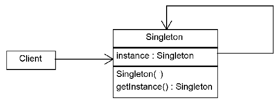
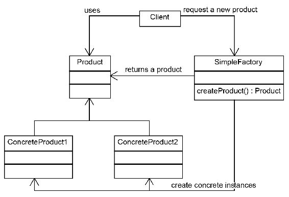
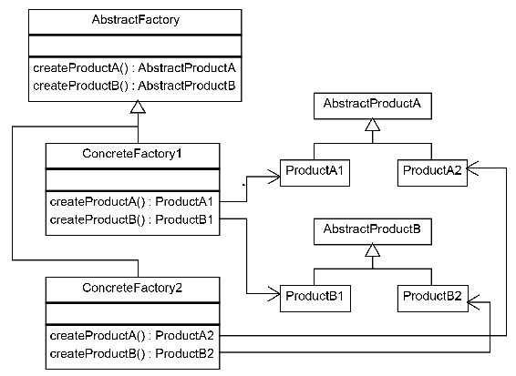
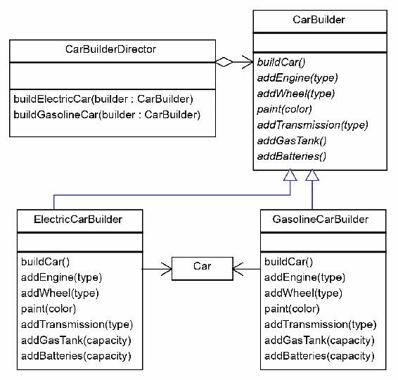
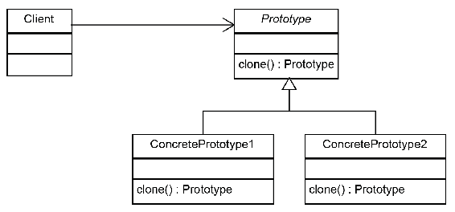
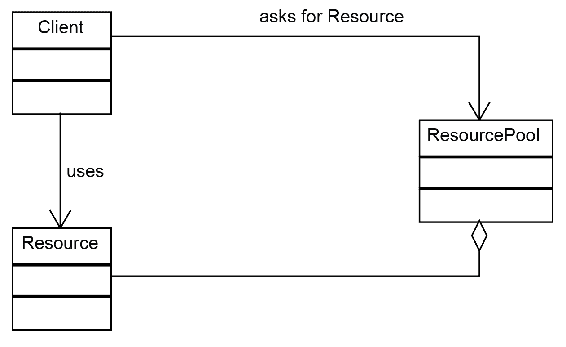

# 创造模式

本章的目的是了解有关创建创造模式。 创造模式是处理对象创建的模式。 在本章中，我们将涵盖以下主题：

*   单身图案
*   简单的工厂模式
*   工厂方法模式
*   抽象的工厂模式
*   建造者模式
*   原型模式
*   对象池模式

# 单身图案

自从 java 成立以来，Singleton 模式可能是最广泛使用的设计模式。 这是一个简单的模式，易于理解和使用。 有时它以多余的方式使用，并且在不需要的情况下。 在这种情况下，使用它超过它带来的优点的缺点。 因此，单身人士有时被认为是一种反模式。 但是，有许多场景是必要的。

随着其名称的表明，Singleton 模式用于确保只能创建一个对象的单个实例。 除此之外，它还提供对该实例的全局访问权限。 在以下类图中描述了单例模式的实现：



Singleton 模式的实现非常简单，包括单个类。 为确保 Singleton 实例是唯一的，所有单例构造函数都应私密。 全局访问是通过静态方法完成的，可以全局访问以获取单例实例，如以下代码所示：

```
public class Singleton
{
  private static Singleton instance;
  private Singleton()
  {
    System.out.println("Singleton is Instantiated.");
  }
  public static Singleton getInstance()
  {
    if (instance == null)
    instance = new Singleton();
    return instance;
  }
  public void doSomething()
  {
    System.out.println("Something is Done.");
  }
}
```

当我们需要在我们的代码某处使用 Singleton 对象时，我们只需调用它：

```
Singleton.getInstance().doSomething();
```

在`getInstance`方法中，我们检查实例是 null。 如果实例不是 null，则表示以前创建的对象; 否则，我们使用新的运算符创建它。 之后，在任何一种情况下，它都不是 null，所以我们可以返回实例对象。

# 同步单身人士

同步单身的代码简单富有高效，但有一种情况我们应该考虑。 如果我们在多线程应用程序中使用我们的代码，可能是两个线程在实例为 null 时同时调用`getInstance`方法的情况。 当发生这种情况时，可能是第一个线程继续使用新操作员实例化单例的情况，并且在完成之前，第二个线程检查单例是否为空。 由于第一个线程未完成实例化，因此第二个线程会发现实例为 null，因此它将开始实例化。

这种情况似乎几乎是不可能的，但如果需要很长时间才能实例化单例，它发生的可能性高，以至于它不能被忽视。

解决这个问题的解决方案非常简单。 我们必须使块检查实例是否为空线程安全。 这可以通过以下两种方式进行：

*   通过将`synchronized`关键字添加到其声明，使`getInstance`方法进行线程安全：

```
public static synchronized Singleton getInstance()
```

*   在`synchronized`块中包装`if (instance == null)`条件。 当我们在此上下文中使用`synchronized`块时，我们需要指定提供锁定的对象。 我们使用`Singleton.class`对象为此，如以下代码片段所示：

```
synchronized (SingletonSync2.class) 
{
  if (instance == null)
  instance = new SingletonSync2();
}
```

# 同步单例具有双重锁定机构

以前的实现是线程安全，但它引入了不必要的延迟：检查是否已创建实例的块是同步的。 这意味着块可以一次仅由一个线程执行，但仅在未创建实例时锁定是有道理的。 当已创建单个例子实例时，每个线程都可以以不同步的方式获取当前实例。

在`synchronized`块之前添加额外条件，只有当单例尚未实例化时，才会移动线程安全锁定：

```
if (instance == null)
{
  synchronized (SingletonSync2.class) 
  {
    if (instance == null)
    instance = new SingletonSync2();
  }
}
```

请注意，检查`instance == null`两次。 这是必要的，因为我们必须确保在`synchronized`块中完成检查。

# 无锁螺纹安全单身

Java 中单身模式的最佳实现之一依赖于类被加载单次的事实。 通过直接在声明时直接实例化静态成员，我们确保我们有一个单一的类实例。 此实现避免了锁定机制和附加检查，以查看实例是否已创建：

```
public class LockFreeSingleton
{
  private static final LockFreeSingleton instance = new 
  LockFreeSingleton();
  private LockFreeSingleton()
  {
    System.out.println("Singleton is Instantiated."); 
  }
  public static synchronized LockFreeSingleton getInstance()
  {
    return instance;
  }
  public void doSomething()
  {
    System.out.println("Something is Done.");
  }
}
```

# 早期和懒​​惰的装载

单例可以分为两类，具体取决于创建实例对象时。 如果在启动应用程序时创建单例，则被认为是**早期/渴望实例化**。 否则，如果在第一次调用`getInstance`方法时调用单例构造函数，则被认为是**延迟加载单例**。

在前面示例中呈现的无锁线线安全单例被认为是在 java 的第一个版本中的早期装载单例。 但是，在最新版本的 Java 中，需要在需要时加载类，因此该版本也是一个懒惰加载版本。 此外，加载类的那一刻取决于 JVM 实现，可能与一个版本不同于另一个版本。 应避免基于 JVM 实现的设计决策。

目前，Java 中没有可靠的选项，用于创建早期装载单例。 如果我们真的需要早期实例化，我们应该通过简单地调用`getInstance()`方法在应用程序开始时执行它，如下代码所示：

```
Singleton.getInstance();
```

# 工厂模式

如前一章所述，继承是面向对象编程中的基本概念之一。 随着亚型多态性，它给了我们是/一种关系。 可以将`Car`对象作为`Vehicle`对象处理。 A `Truck`对象也可以作为`Vehicle`对象处理。 一方面，这种抽象使我们的代码更薄，因为同一段代码可以处理`Car`和`Truck`对象的操作。 另一方面，它使我们可以选择将代码扩展到新类型的`Vehicle`对象的类型，只需添加新类，例如`Bike`和`Van`而不修改它。

当我们处理这种情况时，其中一个最棘手的部分是创建对象。 在面向对象的编程中，使用特定类的构造函数实例化每个对象，如以下代码所示：

```
Vehicle vehicle = new Car();
```

这段代码暗示了实例化对象和实例化对象的类之间的类之间的依赖关系。 此类依赖项使我们的代码紧密地耦合，更难地延伸而不修改它。 例如，如果我们需要用另一种类型替换`Car`，我们会说`Truck`，我们需要相应地更改代码：

```
Vehicle vehicle = new Truck();
```

但这里有两个问题。 首先，我们的班级应开放扩展，但关闭修改（开放/关闭原则）。 其次，每个班级都应该只有一个原因改变（单一责任原则）。 每次添加新类时更改主代码将打破打开/关闭原理，并具有负责实例化`vehicle`对象的主类，除了其功能将打破单一责任原则。

在这种情况下，我们需要为我们的代码提出更好的设计。 我们可以添加一个负责实例化`vehicle`对象的新类。 我们将根据此`SimpleFactory`类来调用模式。

# 简单的工厂模式

工厂模式用于封装逻辑以实例化通过公共接口引用的对象。 可以添加新的类，更严重的更改。

以下类图中描述了一个简单工厂的实现：



`SimpleFactory`类实现了用于实例化`ConcreteProduct1`和`ConcreteProduct2`的代码。 当客户端需要一个对象时，它会使用指示它所需的对象类型的参数调用`SimpleFactory`的`createProduct()`方法。 `SimpleFactory`实例化相应的混凝土产品并返回它。 返回的产品被投射到基类类型，以便客户端将以相同的方式处理任何`Product`，无论是`ConcreteProduct1`还是`ConcreteProduct2`。

# 静态工厂

让我们写一个简单的工厂来创造车辆的实例。 我们有一个摘要`Vehicle`类和三个混凝土类，其中包括：`Bike`，`Car`和`Truck`。 工厂，也称静电工厂，看起来像这样：

```
public class VehicleFactory 
{
  public enum VehicleType
  {
    Bike,Car,Truck
  }
  public static Vehicle create(VehicleType type)
  {
    if (type.equals(VehicleType.Bike))
    return new Bike();
    if (type.equals(VehicleType.Car))
    return new Car();
    if (type.equals(VehicleType.Truck))
    return new Truck();
    else return null;
  }
}
```

本厂看起来很简单，负责`vehicle`课程的实例化，符合单一责任原则。 它有助于我们降低耦合，因为客户端只取决于`Vehicle`界面，符合依赖性反演原理。 如果我们需要添加一个新的`vehicle`类，我们需要更改`VehicleFactory`类，因此打开/关闭原理被打破。

我们可以提高简单的工厂模式，使其打开扩展，但通过使用机制注册需要在需要时立即实例化的新类进行修改。 有两种方法可以实现这一目标：

*   注册产品类对象并使用反射实例化它们
*   注册产品对象并将`newInstance`方法添加到每个返回与本身的同一类的新实例的产品中

# 简单的工厂与课程注册使用反思

对于此方法，我们将使用地图与其相应的类一起保留产品 ID：

```
private Map<String, Class> registeredProducts = new HashMap<String,Class>();
```

然后，我们添加一种注册新车辆的方法：

```
public void registerVehicle(String vehicleId, Class vehicleClass)
{
  registeredProducts.put(vehicleId, vehicleClass);
}
```

`create`方法成为以下内容：

```
public Vehicle createVehicle(String type) throws InstantiationException, IllegalAccessException
{
  Class productClass = registeredProducts.get(type);
  return (Vehicle)productClass.newInstance();
}
```

在某些情况下，使用反思是不可能或气馁的。 反射需要在某些环境中不存在的运行时许可。 如果性能是一个问题，反射可能会减慢程序，因此应该避免。

# 简单的工厂使用 Product.newinstance 使用课程注册

在以前的代码中，我们使用反思来实例化新车。 如果我们必须避免反思，我们可以使用类似的工厂在哪里注册新车类工厂应该能够创建。 我们将要添加我们要注册的每种对象的实例，而不是向地图添加类。 每个产品都能够创建新的自身实例。

我们首先在基础`Vehicle`类中添加一个抽象方法：

```
abstract public Vehicle newInstance();
```

对于每个产品，必须实施该方法在基类中声明的摘要：

```
@Override
public Car newInstance() 
{
  return new Car();
}
```

在`factory`类中，我们将更改地图以将对象的 ID 与`vehicle`对象一起保持：

```
private Map<String, Vehicle> registeredProducts = new HashMap<String,Vehicle>();
```

然后我们通过传递它的实例注册新类型的车辆：

```
public void registerVehicle(String vehicleId, Vehicle vehicle)
{
  registeredProducts.put(vehicleId, vehicle);
}
```

我们相应地更改`createVehicle`方法：

```
public AbstractProduct createVehicle(String vehicleId) 
{
  return registeredProducts.get(vehicleId).newInstance();
}
```

# 工厂方法模式

工厂方法模式是静态工厂的改进。 `factory`类是抽象的，并且将特定产品的代码移动到实现抽象方法的子类。 这样，可以在不被修改的情况下扩展`factory`类。 在以下类图中描述了工厂方法模式的实现：


现在是一些示例代码的时候了。 让我们假设我们有一家汽车厂。 目前，我们生产两辆车型：小型跑车和一辆大型家用汽车。 在我们的软件中，客户可以决定他们是否想要一辆小型车或一辆大型车。 首先，我们正在创建一个带有两个子类的`Vehicle`类：`SportCar`和`SedanCar`。

现在我们有车辆结构，让我们建立抽象的工厂。 请注意，工厂没有任何代码以创建新实例：

```
public abstract class VehicleFactory 
{
  protected abstract Vehicle createVehicle(String item);
  public Vehicle orderVehicle(String size, String color) 
  {
    Vehicle vehicle = createVehicle(size);
    vehicle.testVehicle();
    vehicle.setColor(color);
    return vehicle;
  }
}
```

要添加代码来创建汽车实例，我们将`VehicleFactory`组在组中，创建`CarFactory`。 汽车工厂必须实现`createVehicle`抽象方法，该方法从父类中调用。 实际上，`VehicleFactory`将混凝土车辆的实例化委托给子类：

```
public class CarFactory extends VehicleFactory 
{
  @Override
  protected Vehicle createVehicle(String size) 
  {
    if (size.equals("small"))
    return new SportCar();
    else if (size.equals("large"))
    return new SedanCar();
    return null;
  }
}
```

在客户端中，我们只需创建工厂并创建订单：

```
VehicleFactory carFactory = new CarFactory();
carFactory.orderVehicle("large", "blue");
```

此时，我们意识到汽车厂可以带来多少利润。 是时候扩大我们的业务，我们的市场研究告诉我们对卡车的需求很高。 所以让我们建立一个`TruckFactory`：

```
public class TruckFactory extends VehicleFactory 
{
  @Override
  protected Vehicle createVehicle(String size) 
  {
    if (size.equals("small"))
    return new SmallTruck();
    else if (size.equals("large"))
    return new LargeTruck();
    return null;
  }
}
```

启动订单时，我们使用以下代码：

```
VehicleFactory truckFactory = new TruckFactory();
truckFactory.orderVehicle("large", "blue");
```

# 匿名混凝土厂

我们通过添加一个`BikeFactory`从客户可以选择一辆小型自行车或大型自行车的地方继续前面的代码。 我们可以在不创建单独的类文件的情况下执行此操作; 我们可以简单地创建一个匿名类，即在客户端代码中直接扩展`VehicleFactory`：

```
VehicleFactory bikeFactory = new VehicleFactory() 
{
  @Override
  protected Vehicle createVehicle(String size) 
  {
    if (size.equals("small"))
    return new MountainBike();
    else if (size.equals("large"))
    return new CityBike();
    return null; 
  }
};
bikeFactory.orderVehicle("large", "blue");
```

# 抽象工厂

抽象工厂是工厂方法的扩展版本。 它而不是创建单个对象，它用于创建一个相关对象的系列。 如果工厂方法有一个`AbstractProduct`，则抽象工厂有几个`AbstractProduct`课程。

工厂方法具有抽象的方法，由每个混凝土工厂实现，其中代码实例化抽象产品。 Abstract Factory 有一种用于每个抽象产品的方法。

如果我们采取抽象的工厂模式，我们将其应用于包含单个对象的*系列，那么我们有一个工厂方法模式。 工厂方法只是抽象工厂的特定情况。*

在以下类图中描述了抽象工厂模式的实现：



抽象的工厂模式由以下类组成：

*   `AbstractFactory`：这是声明创建产品类型的方法的抽象类。 它包含必须创建的每个`AbstractProduct`的方法。
*   `ConcreteFactories`：在`AbstractFactory`基类中，实现所声明的方法的具体类。 每组混凝土产品有一家工厂。
*   `AbstractProducts`：所需对象的基本接口或类。 一系列相关产品由来自每个层次结构的类似产品组成：`ProductA1`和`ProductB1`来自第一类类，由`ConcreteFactory1`实例化; 第二个家庭`ProductA2`和`ProductB2`，由`ConcreteFactory2`实例化。

# 简单的工厂与出厂方法与抽象厂

我们谈到了三种方法来实现工厂模式，即简单的工厂，工厂方法和抽象的工厂模式。 如果您对这三种实现感到困惑，则不会归咎于它们，因为它们之间存在很多重叠。 此外，这些模式没有单一的定义，专家可能会如何实现它们的实施方式。

这个想法是理解核心概念。 在其核心，我们可以说出厂模式是关于委派对工厂类创建适当对象的责任。 如果我们的工厂很复杂，就是它应该提供多种类型的对象或工厂，我们可以相应地修改我们的代码。

# 建造者模式

构建器模式与其他创造模式相同的目的，但它以不同的方式和不同的原因这样做。 在开发复杂的应用程序时，代码往往会变得更加复杂。 类倾向于封装更多功能，同时，类结构变得更加复杂。 随着功能的增长，需要覆盖更多场景，对于这些，需要不同的类别。

当我们有一个复杂的类时，我们需要将不同的对象实例化到具有不同的结构或不同的内部状态，我们可以使用单独的类来封装实例化逻辑。 这些类被称为**构建器**。 每次需要具有不同结构的同一类的对象，我们都可以创建另一个生成器以创建此类实例。

相同的概念不仅可以用于我们需要不同表示的类，而且可以使用不同的概念，而是用于由其他对象组成的复杂对象。

创建构建器类以将逻辑封装到实例化复杂对象的符合单一责任原理和开放/关闭原则。 要实例化复杂对象的逻辑将移动到单独的**构建器**类。 当我们需要具有不同结构的对象时，我们可以添加新的构建器类，因此代码已关闭以进行修改并打开扩展，如图所示：


以下类涉及构建器模式：

*   `Product`：我们必须构建的对象的类。 它是一个复杂或复合对象，我们需要不同的表示。
*   `Builder`：声明构建产品的零件的抽象类或接口。 它的作用是仅揭示构建`Product`所需的功能，隐藏`Product`功能的其余部分; 它从构建它的高级类中解耦`Product`。
*   `ConcreteBuilder`：一种实现`Builder`界面中声明的方法的具体构建器。 除了在`Builder`抽象类中声明的方法外，它还具有`getResult`方法，返回内置产品。
*   `Director`：指示如何构建对象的类。 在构建器模式的某些变体中，此类被删除，其角色由客户端或构建器拍摄。

# 汽车建设者例子

在本节中，我们将将 Builder 模式应用于我们的汽车软件。 我们有一个`Car`类，我们需要创建它的实例。 根据我们添加到汽车的组件，我们可以建造轿车和跑车。 我们开始设计我们的软件时，我们实现了以下内容：

*   `Car`类非常复杂，创建类对象也是一个复杂的操作。 添加`Car`构造函数中的所有实例逻辑将使类相当大。
*   我们需要建造几种类型的汽车。 通常，对于这种情况，我们添加了几个不同的构造函数，但我们的直觉告诉我们这不是最好的解决方案。
*   在未来，我们可能需要建立不同类型的汽车对象。 对半自动汽车的需求已经很高，所以在不久的将来，我们应该准备好扩展我们的代码而无需修改它。

我们将创建以下类结构：



`CarBuilder`是 Builder 基类，它包含四种抽象方法。 我们创建了两个混凝土建筑商：`ElectricCarBuilder`和`GasolineCarBuilder`。 每个混凝土制造商都必须实施所有抽象方法。 不需要的方法，例如`ElectricCarBuilder`，例如`ElectricCarBuilder`，留空，或者它们可以抛出异常。 电动和汽油车有不同的内部结构。

`Director`类使用 Builders 创建新的汽车对象。 `buildElectricCar`和`buildGasolineCar`可能是相似的，具有轻微的差异：

```
public Car buildElectricCar(CarBuilder builder)
{
  builder.buildCar();
  builder.addEngine("Electric 150 kW");
  builder.addBatteries("1500 kWh");
  builder.addTransmission("Manual");
  for (int i = 0; i < 4; i++)
  builder.addWheel("20x12x30");
  builder.paint("red");
  return builder.getCar();
}
```

但我们假设我们希望用电动和汽油发动机建造混合动力汽车：

```
public Car buildHybridCar(CarBuilder builder)
{
  builder.buildCar();
  builder.addEngine("Electric 150 kW");
  builder.addBatteries("1500 kWh");
  builder.addTransmission("Manual");
  for (int i = 0; i < 4; i++)
  builder.addWheel("20x12x30");
  builder.paint("red");
  builder.addGasTank("1500 kWh");
  builder.addEngine("Gas 1600cc");
  return builder.getCar();
}
```

# 简化的构建器模式

在构建器模式的一些实现中，可以删除`Director`类。 在我们的类示例中，它封装的逻辑非常简单，所以在这种情况下，我们并不真正需要导演。 在这种情况下，简化的构建器模式将如下所示：


`Director`类中实现的代码只需移动到`Client`。 当`Builder`和`Product`类太复杂或使用 Builder 用于从数据流构建对象时，不建议使用此更改。

# 具有方法链接的匿名建设者

如前所述，处理来自同一类的对象的最直观的方法应该采用不同的形式，用于创建多个构造函数，以便为每个方案实例化它们。 使用 Builder 模式来避免这是一个很好的做法。 在*有效的 Java 中，* Joshua Bloch 建议使用内部构建器类和方法链接替换多个构造函数。

方法链接是一种从某些方法返回当前对象（`this`）的技术。 这样，可以在链中调用该方法。 例如：

```
public Builder setColor()
{
  // set color
  return this;
}
```

在我们确定了这样的方法之后，我们可以在链中调用它们：

```
builder.setColor("Blue")
.setEngine("1500cc")
.addTank("50")
.addTransmission("auto")
.build();
```

但是，在我们的情况下，我们将制作`builder`的`Car`对象的内部类。 因此，当我们需要一个新客户端时，我们可以执行以下操作：

```
Car car = new Car.Builder.setColor("Blue")
.setEngine("1500cc")
.addTank("50")
.addTransmission("auto")
.build();
```

# 原型模式

原型模式是一种似乎比真正复杂的模式。 实际上，它只是一种克隆对象的方法。 我们为什么需要克隆对象，这些天时，实例化对象在性能方面不是太昂贵？ 有几种情况，其中需要克隆已经实例化的对象：

*   当创建一个新对象依赖于外部资源或硬件密集型操作时
*   当我们需要具有相同状态的同一个对象的副本时，而无需重新将所有操作重做以获得该状态
*   当我们需要一个对象的实例而不知道它所属的具体类别

让我们来看看以下类图：



在原型模式中，涉及以下类：

*   `Prototype`：这是基类，或声明派生对象必须实现的`clone()`方法的接口。 在一个简单的场景中，我们可能没有基本类，直接的具体类就足够了。
*   `ConcretePrototype`：这些类实现或扩展`clone()`方法。 应始终实现此方法，因为它返回其类型的新实例。 如果在基类中实现了`clone()`方法，并且在`ConcretePrototype`中未实现它，当我们在`ConcretePrototype`对象上调用`clone()`方法时，它将返回基本`Prototype`对象。

可以在接口中声明`clone()`方法所以实现该方法的类必须实现该方法。 此强制执行在编译时完成。 但是，它不强制于从类中继承的类中实现的类，该类在具有多个级别的层次结构中实现`clone()`方法。

# 浅克隆与深克隆

克隆物体时，我们应该意识到克隆的深度。 当我们克隆一个包含简单数据类型的对象时，例如`int`和`float`或不可变的对象，如字符串，我们应该简单地将这些字段复制到新对象，这就是它。

当我们的对象包含对其他对象的引用时出现问题。 例如，如果我们必须为`Car`类的克隆方法有一个引擎和四个车轮列表，那么我们不仅应该创建一个新的`Car`对象，还应创建一个新的`Engine`和四个新的`Wheel`对象。 毕竟，两辆汽车不能共用相同的发动机和相同的轮子。 这被称为**深克隆**。

浅克隆是一种克隆的方法，只克隆到克隆的主题的物体。 例如，如果我们必须为`Student`对象实现克隆方法，我们不会克隆它指向的`Course`对象。 多个`Student`对象可以指向相同的`Course`对象。

在实践中，我们应该根据每种情况决定我们是否需要深度，浅或混合克隆。 通常，浅克隆对应于[第 1 章](1.html)，*中描述的聚合关系，从对象导向到功能编程*，以及对组合关系的深克隆。

# 对象池模式

对象的实例化是性能方面最昂贵的操作之一。 虽然在过去这可能是一个问题，但如今我们不应该关注它。 但是，当我们处理封装外部资源的对象（例如数据库连接）时，创建新对象变得昂贵。

该解决方案是实现一种重用和共享创建昂贵的对象的机制。 此解决方案称为对象池模式，它具有以下结构：



对象池模式中使用的类是以下内容：

*   `ResourcePool`：封装逻辑以保存和管理资源列表的类。
*   `Resource`：封装有限资源的类。 `Resource`类始终由`ResourcePool`引用，因此只要没有解除分配`ResourcePool`，它们永远不会收集垃圾。
*   `Client`：使用资源的类。

当`Client`需要一个新的`Resource`时，它会从`ResourcePool`询问它。 池检查并拍摄第一个可用资源并将其返回给客户端：

```
public Resource acquireResource()
{
  if ( available.size() <= 0 )
  {
    Resource resource = new Resource();
    inuse.add(resource);
    return resource; 
  }
  else
  {
    return available.remove(0); 
  }
}
```

然后，当`Client`使用`Resource`完成时，它会释放它。 该资源被添加回工具，以便可以重用它。

```
public void releaseResource(Resource resource)
{
  available.add(resource);
}
```

资源池的最佳示例之一是数据库连接池。 我们维护一个数据库连接池，让代码从此池中使用连接。

# 概括

在本章中，我们涵盖了创造设计模式。 我们讨论了单身，工厂，建筑，原型和对象池模式的变体。 所有这些模式都用于实例化新对象，并在创建对象时提供代码灵活性和可重用性。 在下一章中，我们将涵盖行为模式。 虽然创造模式可以帮助我们管理对象的创建，但行为模式提供了一种管理对象行为的简单方法。