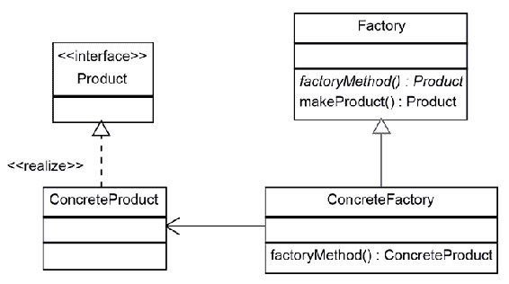
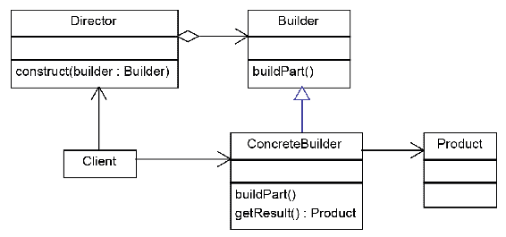
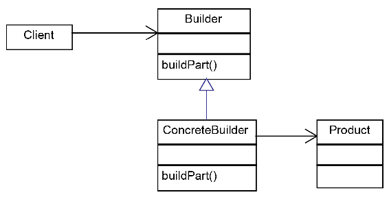

# 创建型模式

本章的目的是学习创造模式。创造模式是处理对象创造的模式。在本章中，我们将介绍以下主题：

*   单例模式
*   简单工厂模式
*   工厂方法模式
*   抽象工厂模式
*   建造者模式
*   原型模式
*   对象池模式

# 单例模式

singleton 模式可能是自 Java 诞生以来使用最广泛的设计模式。这是一个简单的模式，易于理解和使用。有时它被过度使用，在不需要它的情况下。在这种情况下，使用它的缺点大于它带来的好处。因此，单例有时被认为是反模式。然而，有许多场景需要单例。

顾名思义，singleton 模式用于确保只能创建对象的单个实例。除此之外，它还提供对该实例的全局访问。下面的类图描述了单例模式的实现：


singleton 模式的实现非常简单，只包含一个类。为了确保 singleton 实例是唯一的，所有 singleton 构造函数都应该是私有的。全局访问是通过一个静态方法完成的，可以全局访问该方法来获取 singleton 实例，如下代码所示：

```
public class Singleton
{
  private static Singleton instance;
  private Singleton()
  {
    System.out.println("Singleton is Instantiated.");
  }
  public static Singleton getInstance()
  {
    if (instance == null)
    instance = new Singleton();
    return instance;
  }
  public void doSomething()
  {
    System.out.println("Something is Done.");
  }
}
```

当我们需要在代码中的某个地方使用 singleton 对象时，我们只需这样调用它：

```
Singleton.getInstance().doSomething();
```

在`getInstance`方法中，我们检查实例是否为 null。如果实例不为 null，则表示该对象是在之前创建的；否则，我们将使用 new 操作符创建它。之后，无论哪种情况，它都不再为 null，因此我们可以返回 instance 对象。

# 同步单态

同步单例的代码简单而有效，但是有一种情况我们应该考虑。如果我们在多线程应用程序中使用我们的代码，则可能是两个线程在实例为 null 时同时调用[0]方法。当发生这种情况时，可能是第一个线程继续使用 new 操作符实例化 singleton，在完成之前，第二个线程检查 singleton 是否为 null。因为第一个线程没有完成实例化，所以第二个线程会发现实例为空，所以它也会开始实例化它。

这种情况看起来几乎不可能，但是如果需要很长时间来实例化单例，那么发生这种情况的可能性就非常大，不可忽视。

这个问题的解决办法很简单。我们必须创建一个检查实例是否为空线程安全的块。这可以通过以下两种方式实现：

*   通过在其声明中添加`synchronized`关键字，使`getInstance`方法线程安全：

```
public static synchronized Singleton getInstance()
```

*   将`if (instance == null)`条件包装在`synchronized`块中。当我们在这个上下文中使用`synchronized`块时，我们需要指定一个提供锁的对象。我们使用`Singleton.class`对象，如下代码片段所示：

```
synchronized (SingletonSync2.class) 
{
  if (instance == null)
  instance = new SingletonSync2();
}
```

# 同步单重锁紧机构

前面的实现是线程安全的，但它引入了不必要的延迟：检查实例是否已创建的块是同步的。这意味着块一次只能由一个线程执行，但只有在实例尚未创建时锁定才有意义。当单例实例已经创建时，每个线程都可以以不同步的方式获取当前实例。

在`synchronized`块前增加一个附加条件，只有当单例还没有实例化时，才会移动线程安全锁：

```
if (instance == null)
{
  synchronized (SingletonSync2.class) 
  {
    if (instance == null)
    instance = new SingletonSync2();
  }
}
```

注意，`instance == null`被检查了两次。这是必要的，因为我们必须确保在`synchronized`块中也进行了检查。

# 免锁线程安全单例

Java 中单例模式的最佳实现之一依赖于一个类是一次加载的事实。通过在声明时直接实例化静态成员，我们可以确保只有一个类实例。此实现避免了锁定机制和查看实例是否已创建的附加检查：

```
public class LockFreeSingleton
{
  private static final LockFreeSingleton instance = new 
  LockFreeSingleton();
  private LockFreeSingleton()
  {
    System.out.println("Singleton is Instantiated."); 
  }
  public static synchronized LockFreeSingleton getInstance()
  {
    return instance;
  }
  public void doSomething()
  {
    System.out.println("Something is Done.");
  }
}
```

# 提前和延迟加载

根据创建实例对象的时间，单例可以分为两类。如果单例是在应用程序启动时创建的，则认为它是一个**早/急实例化**。否则，如果在第一次调用`getInstance`方法时调用了单例构造函数，则认为它是一个**懒加载单例**。

上一个示例中提供的无锁线程安全单例被认为是 Java 第一个版本中的早期加载单例。然而，在最新版本的 Java 中，类是在需要时加载的，所以这个版本也是一个延迟加载版本。此外，类被加载的时刻取决于 JVM 实现，不同版本的类可能不同。应该避免基于 JVM 实现做出设计决策。

目前，Java 中没有可靠的选项来创建早期加载的单例。如果我们真的需要一个早期的实例化，我们应该在应用程序开始时强制它，只需调用`getInstance()`方法，如下代码所示：

```
Singleton.getInstance();
```

# 工厂模式

如前一章所讨论的，继承是面向对象编程的基本概念之一。与亚型多态性一起，它给出了 is/a 关系。一个`Car`对象可以作为一个`Vehicle`对象来处理。一个`Truck`对象也可以作为`Vehicle`对象来处理。一方面，这种抽象使我们的代码更薄，因为同一段代码可以处理`Car`和`Truck`对象的操作。另一方面，它给我们提供了一个选项，可以通过简单地添加新类（如`Bike`和`Van`，而不修改它，将代码扩展到新类型的`Vehicle`对象。

当我们处理这样的场景时，最棘手的部分之一就是对象的创建。在面向对象编程中，使用特定类的构造函数实例化每个对象，如下代码所示：

```
Vehicle vehicle = new Car();
```

这段代码意味着实例化对象的类和实例化对象的类之间的依赖关系。这样的依赖关系使得我们的代码紧密耦合，在不修改代码的情况下很难扩展。例如，如果我们需要用另一个类型替换`Car`，比如说`Truck`，我们需要相应地更改代码：

```
Vehicle vehicle = new Truck();
```

但这里有两个问题。首先，我们的类应该为扩展而开放，为修改而关闭（open/closed 原则）。第二，每个班级应该只有一个改变的理由（单一责任原则）。每次添加新类时更改主代码都将打破打开/关闭原则，让主类除了功能之外还负责实例化`vehicle`对象将打破单一责任原则。

在这种情况下，我们需要为代码提供更好的设计。我们可以添加一个新类来负责实例化`vehicle`对象。我们将基于这个`SimpleFactory`类来调用模式。

# 简单工厂模式

工厂模式用于封装逻辑，以实例化通过公共接口引用的对象。只需稍作改动就可以添加新类。

下面的类图描述了简单工厂的实现：


`SimpleFactory`类实现实例化`ConcreteProduct1`和`ConcreteProduct2`的代码。当客户端需要一个对象时，它调用`SimpleFactory`的`createProduct()`方法，参数指示它需要的对象的类型。`SimpleFactory` 实例化相应的具体产品并返回它。返回的产品被转换为基类类型，因此客户端将以相同的方式处理任何`Product`，而不管它是`ConcreteProduct1`还是`ConcreteProduct2`。

# 静态工厂

让我们编写一个简单的工厂来创建车辆实例。我们有一个抽象的`Vehicle`类和从中继承的三个具体类：`Bike`、`Car`和`Truck`。工厂，也称为静态工厂，将如下所示：

```
public class VehicleFactory 
{
  public enum VehicleType
  {
    Bike,Car,Truck
  }
  public static Vehicle create(VehicleType type)
  {
    if (type.equals(VehicleType.Bike))
    return new Bike();
    if (type.equals(VehicleType.Car))
    return new Car();
    if (type.equals(VehicleType.Truck))
    return new Truck();
    else return null;
  }
}
```

工厂看起来非常简单，负责实例化`vehicle`类，遵循单一责任原则。它帮助我们减少耦合，因为客户机只依赖于`Vehicle`接口，符合依赖倒置原则。如果我们需要添加一个新的`vehicle`类，我们需要更改`VehicleFactory`类，这样就打破了开/关原则。

我们可以改进这个简单的工厂模式，通过使用一种机制来注册新的类，在需要时实例化这些类，从而使它在扩展时打开，在修改时关闭。有两种方法可以实现这一点：

*   注册产品类对象并使用反射实例化它们
*   注册产品对象并向每个产品添加一个`newInstance`方法，该方法返回一个与其自身相同类的新实例

# 使用反射进行类注册的简单工厂

对于此方法，我们将使用一个映射来保留产品 ID 及其相应的类：

```
private Map<String, Class> registeredProducts = new HashMap<String,Class>();
```

然后，我们添加了一个注册新车的方法：

```
public void registerVehicle(String vehicleId, Class vehicleClass)
{
  registeredProducts.put(vehicleId, vehicleClass);
}
```

`create`方法如下：

```
public Vehicle createVehicle(String type) throws InstantiationException, IllegalAccessException
{
  Class productClass = registeredProducts.get(type);
  return (Vehicle)productClass.newInstance();
}
```

在某些情况下，进行反思要么是不可能的，要么是不鼓励的。反射需要在某些环境中可能不存在的运行时权限。如果性能是一个问题，反射可能会减慢程序，因此应该避免。

# 使用类注册的简单工厂产品.newInstance

在前面的代码中，我们使用反射来实例化新的车辆。如果我们必须避免反射，我们可以使用一个类似的工厂来注册工厂应该能够创建的新车辆类。我们将不向映射中添加类，而是添加要注册的每种类型的对象的实例。每个产品将能够创建自己的新实例。

我们首先在基类`Vehicle`中添加一个抽象方法：

```
abstract public Vehicle newInstance();
```

对于每个产品，必须实现基类中声明为 abstract 的方法：

```
@Override
public Car newInstance() 
{
  return new Car();
}
```

在`factory`类中，我们将更改映射以保留对象的 ID 以及`vehicle`对象：

```
private Map<String, Vehicle> registeredProducts = new HashMap<String,Vehicle>();
```

然后我们通过传递一个实例来注册一个新类型的车辆：

```
public void registerVehicle(String vehicleId, Vehicle vehicle)
{
  registeredProducts.put(vehicleId, vehicle);
}
```

我们对`createVehicle`方法做了相应的修改：

```
public AbstractProduct createVehicle(String vehicleId) 
{
  return registeredProducts.get(vehicleId).newInstance();
}
```

# 工厂方法模式

工厂方法模式是对静态工厂的改进。`factory`类是抽象的，实例化特定产品的代码被移动到实现抽象方法的子类中。这样，`factory`类就可以扩展而不需要修改。工厂方法模式的实现在以下类图中描述：



现在是编写示例代码的时候了。假设我们有一个汽车工厂。目前，我们生产两种车型：小型跑车和大型家用车。在我们的软件中，客户可以决定他们是想要一辆小型车还是一辆大型车。首先，我们正在创建一个包含两个子类的`Vehicle`类：`SportCar`和`SedanCar`。

现在我们有了车辆结构，让我们建立抽象工厂。请注意，工厂没有创建新实例的任何代码：

```
public abstract class VehicleFactory 
{
  protected abstract Vehicle createVehicle(String item);
  public Vehicle orderVehicle(String size, String color) 
  {
    Vehicle vehicle = createVehicle(size);
    vehicle.testVehicle();
    vehicle.setColor(color);
    return vehicle;
  }
}
```

为了添加代码来创建 car 实例，我们将`VehicleFactory`子类化，创建一个`CarFactory`。汽车工厂必须实现从父类调用的`createVehicle`抽象方法。实际上，`VehicleFactory`将具体车辆的实例化委托给子类：

```
public class CarFactory extends VehicleFactory 
{
  @Override
  protected Vehicle createVehicle(String size) 
  {
    if (size.equals("small"))
    return new SportCar();
    else if (size.equals("large"))
    return new SedanCar();
    return null;
  }
}
```

在客户机中，我们只需创建工厂并创建订单：

```
VehicleFactory carFactory = new CarFactory();
carFactory.orderVehicle("large", "blue");
```

在这一点上，我们意识到一个汽车厂能带来多少利润。是时候扩展我们的业务了，我们的市场调查告诉我们，卡车的需求量很大。那么我们来构建一个`TruckFactory`：

```
public class TruckFactory extends VehicleFactory 
{
  @Override
  protected Vehicle createVehicle(String size) 
  {
    if (size.equals("small"))
    return new SmallTruck();
    else if (size.equals("large"))
    return new LargeTruck();
    return null;
  }
}
```

启动订单时，我们使用以下代码：

```
VehicleFactory truckFactory = new TruckFactory();
truckFactory.orderVehicle("large", "blue");
```

# 匿名混凝土厂

我们继续前面的代码，添加了一个`BikeFactory`，客户可以从中选择一辆小自行车或一辆大自行车。我们不需要创建单独的类文件就可以做到这一点；我们只需创建一个匿名类，直接在客户机代码中扩展[1]：

```
VehicleFactory bikeFactory = new VehicleFactory() 
{
  @Override
  protected Vehicle createVehicle(String size) 
  {
    if (size.equals("small"))
    return new MountainBike();
    else if (size.equals("large"))
    return new CityBike();
    return null; 
  }
};
bikeFactory.orderVehicle("large", "blue");
```

# 抽象工厂

抽象工厂是工厂方法的扩展版本。它不是创建单一类型的对象，而是用于创建相关对象的族。如果工厂方法有一个`AbstractProduct`，则抽象工厂有几个`AbstractProduct`类。

factory 方法有一个抽象方法，由每个具体的工厂用代码来实例化抽象产品。抽象工厂对每个抽象产品都有一种方法。

如果我们采用抽象工厂模式并将其应用于包含单个对象的*族，那么我们就有了工厂方法模式。工厂方法只是抽象工厂的一个特例。*

抽象工厂模式的实现在以下类图中描述：


抽象工厂模式由以下类组成：

*   `AbstractFactory`：这个抽象类声明了创建产品类型的方法。它包含每个要创建的`AbstractProduct`的方法。
*   `ConcreteFactories`：实现`AbstractFactory`基类中声明的方法的具体类。每套混凝土产品都有一个工厂。
*   `AbstractProducts`：需要的对象的基本接口或类。一个相关产品系列由每个层次结构中的相似产品组成：`ProductA1`和`ProductB1`来自第一个类系列，由`ConcreteFactory1`实例化；第二个类系列`ProductA2`和`ProductB2`由`ConcreteFactory2`实例化。

# 简单工厂与工厂方法与抽象工厂

我们讨论了实现工厂模式的三种方法，即简单工厂、工厂方法和抽象工厂模式。如果您对这三种实现感到困惑，就不必责怪您，因为它们之间有很多重叠。此外，这些模式没有一个单一的定义，专家们在如何实现这些模式上可能存在分歧。

其思想是理解核心概念。我们可以说，工厂模式的核心是将创建适当对象的责任委托给工厂类。如果我们的工厂很复杂，也就是说，它应该服务于多种类型的对象或工厂，我们可以相应地修改代码。

# 建造者模式

builder 模式的作用与其他创造性模式相同，但它以不同的方式和出于不同的原因。在开发复杂的应用程序时，代码往往变得更加复杂。类倾向于封装更多的功能，同时，类结构变得更加复杂。随着功能的增长，需要覆盖更多的场景，对于这些场景，需要不同的类表示。

当我们有一个复杂的类需要实例化为具有不同结构或不同内部状态的不同对象时，我们可以使用不同的类来封装实例化逻辑。这些类称为**构建器**。每次我们需要来自同一类的具有不同结构的对象时，我们都可以创建另一个生成器来创建这样的实例。

同样的概念不仅可以用于需要不同表示的类，也可以用于由其他对象组成的复杂对象。

创建生成器类来封装实例化复杂对象的逻辑符合单一责任原则和打开/关闭原则。实例化一个复杂对象的逻辑被移到一个单独的**生成器**类中。当我们需要不同结构的对象时，我们可以添加新的构建器类，这样代码就可以关闭进行修改，打开进行扩展，如图所示：



生成器模式中涉及以下类：

*   `Product`：我们必须构建其对象的类。它是一个复杂的或复合的对象，我们需要不同的表示。
*   `Builder`：一个抽象类或接口，它声明了构建产品的各个部分。它的作用是只公开构建`Product`所需的功能，隐藏`Product`功能的其余部分；它将`Product`与构建它的高级类分离。
*   `ConcreteBuilder`：实现`Builder`接口中声明的方法的具体生成器。除了在`Builder`抽象类中声明的方法外，它还有一个返回生成产品的`getResult`方法。
*   `Director`：一个类，指导如何构建对象。在生成器模式的某些变体中，这个类被删除，它的角色由客户端或生成器承担。

# 汽车制造商示例

在本节中，我们将把 builder 模式应用到汽车软件中。我们有一个[0]类，需要创建它的实例。根据我们在汽车上添加的部件，我们可以制造轿车和跑车。当我们开始设计软件时，我们意识到：

*   [0]类非常复杂，创建类对象也是一个复杂的操作。在`Car`构造函数中添加所有实例化逻辑将使类变得相当大。
*   我们需要制造几种类型的汽车。通常，对于这个场景，我们会添加几个不同的构造函数，但是我们的直觉告诉我们这不是最好的解决方案。
*   在未来，我们可能需要建立不同类型的汽车对象。对半自动汽车的需求已经相当高了，所以在不久的将来，我们应该准备好在不修改代码的情况下扩展我们的代码。

我们将创建以下类结构：


`CarBuilder`是生成器基类，包含四个抽象方法。我们创造了两个混凝土建筑商：`ElectricCarBuilder`和`GasolineCarBuilder`。每个具体的建设者都必须实现所有的抽象方法。不需要的方法，例如`ElectricCarBuilder`的`addGasTank`被保留为空，或者它们可以抛出异常。电动汽车和汽油汽车有不同的内部结构。

[0]类使用生成器创建新的 car 对象。`buildElectricCar` 与`buildGasolineCar`可能相似，但略有不同：

```
public Car buildElectricCar(CarBuilder builder)
{
  builder.buildCar();
  builder.addEngine("Electric 150 kW");
  builder.addBatteries("1500 kWh");
  builder.addTransmission("Manual");
  for (int i = 0; i < 4; i++)
  builder.addWheel("20x12x30");
  builder.paint("red");
  return builder.getCar();
}
```

但假设我们想制造一辆混合动力汽车，配备电动和汽油发动机：

```
public Car buildHybridCar(CarBuilder builder)
{
  builder.buildCar();
  builder.addEngine("Electric 150 kW");
  builder.addBatteries("1500 kWh");
  builder.addTransmission("Manual");
  for (int i = 0; i < 4; i++)
  builder.addWheel("20x12x30");
  builder.paint("red");
  builder.addGasTank("1500 kWh");
  builder.addEngine("Gas 1600cc");
  return builder.getCar();
}
```

# 简化的生成器模式

在生成器模式的某些实现中，`Director`类可以被删除。在我们的类示例中，它封装的逻辑非常简单，因此在这种情况下，我们实际上不需要控制器。在本例中，简化的生成器模式如下所示：



在`Director`类中实现的代码只需移动到`Client`。当`Builder`和`Product`类太复杂或使用生成器从数据流构建对象时，不建议进行此更改。

# 具有方法链接的匿名生成器

如前所述，处理来自同一类且应采用不同形式的对象的最直观方法是为每个场景创建几个构造函数来实例化它们。使用生成器模式来避免这种情况是一种很好的做法。在*有效的 Java 中，*Joshua Bloch 建议使用内部生成器类和方法链接来替换多个构造函数。

方法链接是从某些方法返回当前对象（`this`）的技术。这样，可以在链中调用这些方法。例如：

```
public Builder setColor()
{
  // set color
  return this;
}
```

在我们定义了更多这样的方法之后，我们可以在一个链中调用它们：

```
builder.setColor("Blue")
.setEngine("1500cc")
.addTank("50")
.addTransmission("auto")
.build();
```

但是，在本例中，我们将使`builder`成为`Car`对象的内部类。因此，当我们需要新客户时，我们可以执行以下操作：

```
Car car = new Car.Builder.setColor("Blue")
.setEngine("1500cc")
.addTank("50")
.addTransmission("auto")
.build();
```

# 原型模式

原型模式是一种看起来比实际更复杂的模式。实际上，它只是一种克隆对象的方法。如今，实例化对象在性能上并不太昂贵，为什么我们需要克隆对象呢？有几种情况需要克隆已实例化的对象：

*   当新对象的创建依赖于外部资源或硬件密集型操作时
*   当我们需要一个具有相同状态的同一对象的副本，而不必重做所有操作以达到该状态时
*   当我们需要一个对象的实例而不知道它属于哪个具体类时

让我们看看下面的类图：


在原型模式中，涉及以下类：

*   `Prototype`：这是基类，或声明派生对象必须实现的`clone()`方法的接口。在一个简单的场景中，我们可能没有基类，直接的具体类就足够了。
*   `ConcretePrototype`：这些类实现或扩展了`clone()`方法。应该始终实现此方法，因为它返回其类型的新实例。如果`clone()`方法是在基类中实现的，而我们没有在`ConcretePrototype`中实现，那么当我们在`ConcretePrototype`对象上调用`clone()`方法时，它会返回一个基类`Prototype`对象。

[0]方法可以在接口中声明，因此实现该方法的类必须实现该方法。这种强制是在编译时完成的。但是，对于继承自在具有多个级别的层次结构中实现`clone()`方法的类的类，它不会强制执行。

# 浅克隆与深克隆

在克隆物体时，我们应该意识到克隆的深度。当我们克隆一个包含简单数据类型（如[0]和[1]）的对象，或者不可变对象（如字符串）的对象时，我们应该简单地将这些字段复制到新对象，就这样。

当我们的对象包含对其他对象的引用时，问题就出现了。例如，如果我们必须为一个有引擎和四个轮子列表的`Car`类实现一个克隆方法，我们不仅要创建一个新的`Car`对象，还要创建一个新的`Engine`和四个新的`Wheel`对象。毕竟，两辆车不能共用同一台发动机和同一个车轮。这叫做**深克隆**。

浅层克隆是一种只克隆被克隆对象的方法。例如，如果我们必须为一个`Student`对象实现一个 clone 方法，我们就不会克隆它指向的`Course`对象。多个`Student`对象可以指向同一`Course`对象。

在实践中，我们应该根据每个场景来决定是需要深度克隆、浅层克隆还是混合克隆。通常，浅层克隆对应于[第一章](1.html)中描述的聚合关系，从面向对象到函数式编程的*，从深层克隆到组合关系。*

# 对象池模式

就性能而言，对象的实例化是最昂贵的操作之一。虽然在过去这可能是一个问题，但现在我们不应该担心它。但是，当我们处理封装外部资源的对象（如数据库连接）时，创建新对象的成本会很高。

解决方案是实现一种机制，可以重用和共享创建成本高昂的对象。此解决方案称为对象池模式，它具有以下结构：


对象池模式中使用的类如下：

*   `ResourcePool`：封装逻辑的类，用于保存和管理资源列表。
*   `Resource`：封装有限资源的类。`Resource`类总是被`ResourcePool`引用，所以只要`ResourcePool`没有被反分配，它们就永远不会被垃圾回收。
*   `Client`：使用资源的类。

当一个`Client`需要一个新的`Resource`时，它会向`ResourcePool`请求。池检查并获取第一个可用资源并将其返回给客户端：

```
public Resource acquireResource()
{
  if ( available.size() <= 0 )
  {
    Resource resource = new Resource();
    inuse.add(resource);
    return resource; 
  }
  else
  {
    return available.remove(0); 
  }
}
```

然后，当`Client`使用完`Resource`后，它将其释放。资源被添加回工具，以便可以重用。

```
public void releaseResource(Resource resource)
{
  available.add(resource);
}
```

资源池的最佳示例之一是数据库连接池。我们维护一个数据库连接池，并让代码使用这个池中的连接。

# 摘要

在这一章中，我们讨论了创造性的设计模式。我们讨论了 singleton、factory、builder、prototype 和对象池模式的变体。所有这些模式都用于实例化新对象，并在创建对象时提供代码灵活性和可重用性。在下一章中，我们将介绍行为模式。虽然创建模式帮助我们管理对象的创建，但行为模式提供了管理对象行为的简单方法。