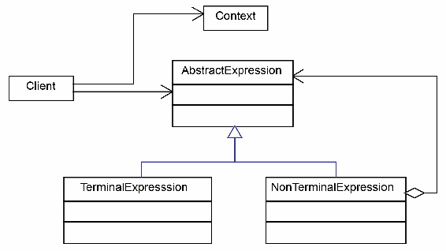
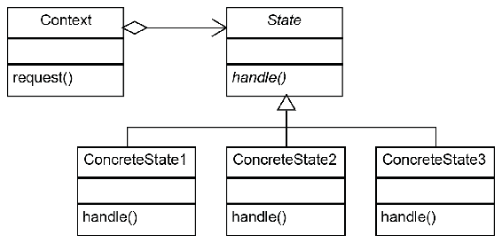
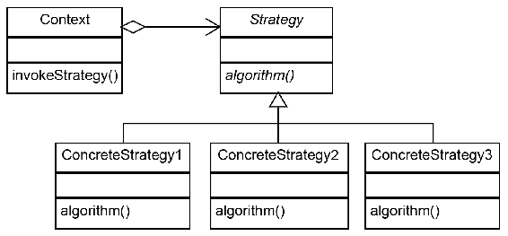

# 行为模式

本章的目的是了解行为模式。 行为模式是专注于对象交互，通信和控制流的模式。 大多数行为模式都基于组成和委派而不是继承。 我们将在本章中查看以下行为模式：

*   责任链模式
*   命令模式
*   口译模式
*   迭代器模式
*   观察者模式
*   介质模式
*   纪念模式
*   国家模式
*   战略模式
*   模板方法模式
*   null 对象模式
*   访客模式

# 责任链模式

计算机软件用于处理信息，并且有不同的结构化和处理该信息。 我们已经知道，当我们谈论面向对象的编程时，我们应该为每个班级分配单一责任，以使我们的设计易于扩展和维护。

考虑一个场景，其中可以对客户端请求的一组数据执行多种类型的操作。 我们可以维护负责不同类型的操作的不同类别来维护不同类型的操作。 这有助于我们保持我们的代码松散地耦合和清洁。

这些类被称为处理程序。 第一个处理程序将收到请求并拨打电话，如果需要执行操作，或将其传递到第二个处理程序。 同样，第二个处理程序检查并可以将请求传递给链中的下一个处理程序。

# 意图

责任链模式以这样的方式链接处理程序，即他们将能够处理请求或通过它，如果他们无法执行此操作。

# 执行

以下类图描述了责任链模式的结构和演员：


以下类涉及前图：

*   **客户端**：这是使用模式的应用程序的主要结构。 它负责实例化一个处理程序，然后在第一个对象上调用`handleRequest`方法。
*   **处理程序**：这是抽象类，所有混凝土处理程序必须继承。 它具有`handleRequest`方法，该方法接收应处理的请求。
*   **ConcretyHandlers** ：这些是为每种情况实现`handleRequest`方法的具体类别。 每个`ConcreteHandler`都会对链中的下一个`ConcreteHandler`的引用一致，并且必须检查它是否可以处理请求; 否则，它必须将其传递到链中的下一个`ConcreteHandler`。

每个处理程序都应该实现客户端使用的方法，以便在无法处理它的情况下设置它应该通过请求的下一个处理程序。 可以将此方法添加到基础`Handler`类：

```
protected Handler successor;
public void setSuccessor(Handler successor)
{
  this.successor = successor;
}
```

在每个`ConcreteHandler`类中，我们有以下代码，检查它是否可以处理请求; 否则，它将通过它：

```
public void handleRequest(Request request)
{
  if (canHandle(request))
  {
    //code to handle the request 
  }
  else
  {
    successor.handleRequest();
  }
}
```

在调用链条之前，客户负责构建处理程序链条。 调用将传播，直到它找到可以处理请求的正确处理程序。

让我们拍摄我们的汽车服务应用程序示例。 我们意识到每次一辆破碎的汽车进来，它首先由机械师检查，如果问题在于他们的专业领域，那么就解决了它。 如果他们无法，他们将其发送到电工。 如果他们无法解决它，他们将它传递给下一个专家。 这是图表的样子：


# 适用性和例子

以下是责任链模式的适用性和例子：

*   **事件处理程序**：例如，大多数 GUI 框架使用责任链模式来处理事件。 假设例如，窗口包含包含某些按钮的面板。 我们必须编写按钮的事件处理程序。 如果我们决定跳过并传递它，链条中的下一个将能够处理请求：面板。 如果面板跳过它，它将进入窗口。
*   **日志处理程序**：类似于事件处理程序，每个日志处理程序都会根据其状态记录特定请求，或者它将将其传递到下一个处理程序。
*   **servlet** ：在 java，`javax.servlet.Filter`（ [http://docs.oracle.com/javaee/7/api/javax/servlet/filter.html](http://docs.oracle.com/javaee/7/api/javax/servlet/Filter.html) ）用于过滤请求 或回复。 `doFilter`方法还将滤波链作为参数接收，它可以通过请求。

# 命令模式

面向对象的编程中最重要的事情之一是采用一个让我们解耦代码的设计。 例如，让我们想象我们需要开发一个复杂的应用程序，我们可以绘制图形形状：点，线条，段，圆，矩形等等。

除了绘制各种形状的代码外，我们需要实现许多操作来处理菜单操作。 为了使我们的应用程序可维护，我们将创建一个统一的方法来定义所有那些*命令*，这样它将隐藏应用程序的其余部分（播放客户端角色 ）。

# 意图

命令模式执行以下操作：

*   提供统一的方法来封装命令以及执行操作的所需参数
*   允许处理命令，例如将它们存储在队列中

# 执行

命令模式的类图如下：


我们可以将以下参与者区分开在前面的实施图中：

*   **命令**：这是表示命令封装的抽象。 它声明所执行的抽象方法，应该由所有具体命令实现。
*   **conrictecommand** ：这是**命令**的实际实现。 它必须执行命令并处理与每个具体命令关联的参数。 它将命令委托给接收者。
*   **接收器**：这是负责执行与命令关联的操作的类。
*   **调用**：这是触发命令的类。 这通常是外部事件，例如用户动作。
*   **客户端**：这是实际类实例，实例化了具体命令对象及其接收器。

最初，我们的脉冲是处理大`if-else`块中的所有可能命令：

```
public void performAction(ActionEvent e)
{
  Object obj = e.getSource();
  if (obj = fileNewMenuItem)
  doFileNewAction();
  else if (obj = fileOpenMenuItem)
  doFileOpenAction();
  else if (obj = fileOpenRecentMenuItem)
  doFileOpenRecentAction();
  else if (obj = fileSaveMenuItem)
  doFileSaveAction();
}
```

但是，我们可能决定应用绘图应用程序的命令模式。 我们首先创建命令界面：

```
public interface Command
{
  public void execute();
}
```

下一步是定义所有对象，例如菜单项和按钮，如类，实现命令接口和`execute()`方法：

```
public class OpenMenuItem extends JMenuItem implements Command
{
  public void execute()  
  {
    // code to open a document
  }
}
```

在我们重复上一个操作后，为每个可能的操作创建一个类，我们将`if-else`块从 Naive 实现中替换为以下一个：

```
public void performAction(ActionEvent e)
{
  Command command = (Command)e.getSource();
  command.execute();
}
```

我们可以从我们的代码中看到调用（触发`performAction`方法的客户端）和接收器（实现命令接口的类）都会分离。 我们可以轻松扩展我们的代码而无需更改它。

# 适用性和例子

命令模式的适用性和示例如下：

*   **撤消/重做操作**：命令模式允许我们将命令对象存储在队列中。 这样，我们可以实施撤消和重做操作。
*   **复合命令**：复杂命令可以使用复合模式组成简单命令，并以顺序运行。 通过这种方式，我们可以以面向对象的设计方式构建宏。
*   **异步方法调用**：命令模式用于多线程应用程序。 可以在单独的线程中在后台执行命令对象。 java.lang.runnable 是一个命令界面。

在以下代码中，可追踪的接口充当命令界面，并由`RunnableThread`实现：

```
class RunnableThread implements Runnable
{
  public void run() 
  {
    // the command implementation code
  }
}
```

客户端调用命令以启动新线程：

```
public class ClientThread 
{
  public static void main(String a[])
  {
    RunnableThread mrt = new RunnableThread();
    Thread t = new Thread(mrt);
    t.start();
  }
}
```

# 口译模式

计算机应该解释句子或评估表达式。 如果我们必须编写一系列应该处理此类要求的代码，首先，我们需要了解该结构; 我们需要有表达式或句子的内部表示。 在许多情况下，使用最合适的结构是基于复合模式的复合材料。 我们将进一步讨论[第 4 章](4.html)，*结构模式*的复合模式，我们可以将综合表示作为类似性的分组对象。

# 意图

解释器模式定义了语法的表示以及解释。

# 执行

解释器模式使用复合模式来定义对象结构的内部表示。 除此之外，它还添加了实现来解释表达式并将其转换为内部结构。 因此，解释器模式属于行为模式类别。 类图如下：



解释器模式由以下类组成：

*   **上下文**：这用于封装全局的信息，以通过所有具体解释器访问。
*   **abstractexpression** ：一个抽象的类或接口，声明被执行的解释方法，它应该由所有具体解释器实现。
*   **终端表达**：一种实现与语法的终端符号相关联的操作的解释器类。 必须始终实现和实例化此类，因为它表示表达式的结尾。
*   **nonterminalexpression** ：这些是实现语法的不同规则或符号的类。 对于每个人，应该有一个类创建。

在实践中使用解释器模式来解释正则表达式。 实现这种情况的解释器模式是一个很好的练习; 但是，我们将为我们的榜样选择一个简单的语法。 我们将应用它来解析一个变量的简单功能：`f(x)`。

为了使其更加简单，我们将选择反向波兰的符号。 这是一个表示法，其中操作数在运营商的末尾添加。 *1 + 2* 变为 *1 2* *+* ; *（1 + 2）* 3* 变为 *1 2 + 3 ** 。 优点是我们不再需要括号，因此它简化了我们的任务。

以下代码为表达式创建一个接口：

```
public interface Expression 
{
  public float interpret();
}
```

现在我们需要实施具体课程。 我们需要以下元素：

*   **数字**：这将解释数字
*   **操作员类** **（+， - ，*，/）**：对于以下示例，我们将使用加（+）和 minus（ - ）：

```
public class Number implements Expression 
{
  private float number;
  public Number(float number) 
  {
    this.number = number; 
  }
  public float interpret() 
  {
    return number;
  }
}
```

现在我们到达困难的部分。 我们需要实施运营商。 运营商是复合表达式，由两个表达式组成：

```
public class Plus implements Expression 
{
  Expression left;
  Expression right;
  public Plus(Expression left, Expression right) 
  {
    this.left = left;
    this.right = right; 
  }
  public float interpret() 
  {
    return left.interpret() + right.interpret();
  }
}
```

同样，我们的实施减少了如下：

```
public class Minus implements Expression 
{
  Expression left;
  Expression right;
  public Minus(Expression left, Expression right) 
  {
    this.left = left;
    this.right = right;
  }
  public float interpret() 
  {
    return right.interpret() - left.interpret();
  }
}
```

我们现在可以看到我们创建了允许我们构建一个树节点的树的类，并且变量和数字是叶子。 结构可以是非常复杂的并且可用于解释表达式。

现在我们必须编写代码来使用我们创建的类构建树：

```
public class Evaluator
{ 
  public float evaluate(String expression) 
  { 
    Stack<Expression> stack = new Stack<Expression>(); 
    float result =0; 
    for (String token : expression.split(" ")) 
    { 
      if  (isOperator(token)) 
      { 
        Expression exp = null; 
        if(token.equals("+")) 
        exp = stack.push(new Plus(stack.pop(), stack.pop())); 
        else if (token.equals("-")) 
        exp = stack.push(new Minus(stack.pop(), stack.pop())); 
        if(null!=exp) 
        { 
          result = exp.interpret(); 
          stack.push(new Number(result)); 
        } 
      } 
      if  (isNumber(token)) 
      { 
        stack.push(new Number(Float.parseFloat(token))); 
      } 
    } 
    return result; 
  } 
  private boolean isNumber(String token) 
  { 
    try 
    { 
      Float.parseFloat(token); 
      return true; 
    } 
    catch(NumberFormatException nan) 
    { 
      return false; 
    } 
  } 
  private boolean isOperator(String token) 
  { 
    if(token.equals("+") || token.equals("-")) 
    return true; 
    return false; 
  } 
  public static void main(String s[]) 
  { 
    Evaluator eval = new Evaluator(); 
    System.out.println(eval.evaluate("2 3 +")); 
    System.out.println(eval.evaluate("4 3 -")); 
    System.out.println(eval.evaluate("4 3 - 2 +")); 
  } 
} 
```

# 适用性和例子

只要表达式解释并转换为其内部表示，就可以使用解释器模式。 由于内部表示基于复合模式，因此不能将图案应用于复杂语法。

Java 实现了`java.util.Parser`中的解释器模式，它用于解释正则表达式。 首先，当解释正则表达式时，返回匹配对象。 匹配器使用基于正则表达式的模式类创建的内部结构：

```
Pattern p = Pattern. compile("a*b");
Matcher m = p.matcher ("aaaaab");
boolean b = m.matches();
```

# 迭代器模式

迭代器模式可能是 Java 中最着名的模式之一。 一些 Java 程序员正在使用它而不知道收集包是迭代器模式的实现，无论集合的类型如何：数组，列表，设置或任何其他类型。

事实上，我们可以以相同的方式与集合交易，无论是列表还是数组，都是因为它提供了一个机制来迭代其元素而不暴露其内部结构。 更重要的是，相同的统一机制由不同类型的集合使用。 该机制称为迭代器模式。

# 意图

迭代器模式提供了一种方法来顺序地遍历聚合对象的元素而不暴露其内部表示。

# 执行

迭代器模式基于两个抽象类或接口，可以通过对混凝土类对实现。 类图如下：


迭代器模式中使用以下类：

*   **聚合**：应该由所有类实现的抽象类，可以由迭代器遍历。 这对应于`java.util.Collection`界面。
*   **迭代器**：这是迭代器抽象，它定义了遍历聚合对象以及返回对象的操作的操作。
*   **ConcreteaggreggeGregate** ：混凝土聚集体可以实施内部不同的结构，但揭示了混凝土迭代器，该迭代器涉及穿过汇总。
*   **混凝土仪**：这是处理特定混凝土骨料类的混凝土迭代器。 在实践中，对于每个 **Concreteaggregate，**我们必须实现 **COMITREITILERAR** 。

在 Java 中使用迭代器可能是每个程序员在日常生活中的一件事之一。 让我们看看我们如何实现迭代器。 首先，我们应该定义一个简单的迭代器界面：

```
public interface Iterator
{
  public Object next();
  public boolean hasNext();
}
We create the aggregate:
public interface Aggregate
{
public Iterator createIterator();
}
```

然后我们实现一个简单的`Aggregator`，它维护一个字符串值数组：

```
public class StringArray implements Aggregate 
{ 
  private String values[]; 
  public StringArray(String[] values) 
  { 
    this.values = values; 
  } 
  public Iterator createIterator() 
  { 
    return (Iterator) new StringArrayIterator(); 
  } 
  private class StringArrayIterator implements Iterator 
  { 
    private int position; 
    public boolean hasNext() 
    { 
      return (position < values.length); 
    }  
    public String next() 
    { 
      if (this.hasNext()) 
      return values[position++]; 
      else 
      return null; 
    } 
  } 
} 
```

我们嵌套聚合中的迭代器类。 这是最好的选择，因为迭代器需要访问聚合器的内部变量。 我们可以在这里看到它看起来如何：

```
String arr[]= {"a", "b", "c", "d"};
StringArray strarr = new StringArray(arr);
for (Iterator it = strarr.createIterator(); it.hasNext();)
System.out.println(it.next());
```

# 适用性和例子

这些天，迭代器在大多数编程语言中都很受欢迎。 它可能是 Java 最广泛使用的，以及集合包。 当使用以下循环构造时，它也会以语言级别实现：

```
for (String item : strCollection)
System.out.println(item);
```

可以使用泛型机制来实现迭代器模式。 这样，我们可以确保我们可以避免强制铸件生成的运行时错误。

在 Java 中实现新的容器和迭代器时，良好的做法是实现现有的`java.util.Iterator<E>`和`java.util.Collection<E>`类。 当我们需要具有特定行为的聚合器时，我们还应该考虑扩展在`java.collection`包中实现的类之一，而不是创建新的类。

# 观察者模式

当我们在本书中推出时，我们一直提到解耦的重要性。 当我们减少依赖项时，我们可以扩展，开发和测试不同的模块，而无需了解其他模块的实现细节。 我们所要知道的只是他们实施的抽象。

但是，模块应该在实践中一起工作。 它并不罕见，另一个对象的变化是另一个对象所知的。 例如，如果我们在游戏中实现`car`类，则汽车的引擎应该知道加速器何时改变其位置。 天真的解决方案是具有`engine`类，从时刻检查加速器位置，看看它是否已改变。 更聪明的方法是使加速器呼叫发动机以通知其变化。 但如果我们想要精心设计的代码，这还不够。

如果`Accelerator`类保持对`Engine`类的引用，如果我们需要在屏幕上显示`Accelerator`的位置时会发生什么？ 这是最好的解决方案：而不是使加速器依赖于发动机，我们应该使它们依赖于抽象。

# 意图

观察者模式使得一个对象的状态变化可观察到被告知的其他对象。

# 执行

观察者模式的类图如下：


观察者模式依赖于以下类：

*   **主题**：这通常是必须由类实现的接口，并且应该是可观察的。 应该使用**附加**方法登记应通知的观察者。 当他们不再需要通知更改时，使用**分离**方法对它们进行注册。
*   **conricteSubject** ：这是实现主题界面的类。 它处理观察者列表，并更新它们有关更改的更新。
*   **观察者**：这是一个由应由主题的更改更新的对象实现的接口。 每个观察者都应该实现**更新**方法，该方法通知它们关于新状态的变化。

# 介质模式

在许多情况下，当我们设计和开发软件应用程序时，我们遇到了许多方案，我们有多个方案，我们有必须彼此通信的模块和对象。 最简单的方法是使它们以这样的方式使他们彼此认识并且可以直接发送消息。

但是，这可能会产生一团糟。 例如，如果我们想象出一个通信应用程序，其中每个客户端必须连接到另一个客户端，它没有意义为客户管理许多连接。 更好的解决方案是连接到中央服务器和服务器来管理客户端之间的通信。 客户端向服务器发送消息，服务器将连接保持对所有客户端，并且它可以将消息广播到所有所需的收件人。

另一个例子是，在图形界面中需要在不同的控件（例如按钮，下拉列表和列表控件）之间调解专用类。 例如，GUI 中的图形控件可以彼此相互掌握，以便互相调用它们的方法。 但显然，这将创建一个极其耦合的代码，其中每个控制都取决于所有其他控制。 更好的方法是使父母在需要完成某些事情时使负责广播消息的广播消息。 当某些内容在控件中修改时，它将通知窗口，这将检查需要通知哪些控件，然后通知它们。

# 意图

中介模式定义了一个对象，该对象封装了一组对象的交互方式，彼此依赖于依赖性。

# 执行

介体模式基于两种抽象：**介体**和**同事**，如下类图所示：


中介模式依赖于以下类：

*   **介体**：这定义了参与者如何交互。 在此接口或抽象类中声明的操作是特定于每个方案的。
*   **COMICTEMEDIANTIATIATIATIATER** ：这实现了由调解员声明的操作。
*   **同事**：这是一个抽象类或界面，它定义了需要调解的参与者应该是互动的。
*   **CONTRETECOLLEAGUE** ：这些是实施**同事**界面的具体课程。

# 适用性和例子

当有许多实体以类似的方式交互而且应该解耦这些实体时，应使用介体模式。

介体模式用于 Java 库以实现`java.util.Timer`。 `timer`类可用于安排线程以运行一次或以规则的间隔重复。 线程对象对应于`ConcreteColleague`类。 `timer`类实现管理背景任务的执行方法。

# 纪念模式

封装是面向对象设计的基本原则之一。 我们也知道每个班级都应该有一个单一的责任。 当我们为我们的对象添加功能时，我们可能会意识到我们需要保存其内部状态，以便能够在稍后阶段恢复。 如果我们直接在类中执行此类功能，则该类可能变得过于复杂，我们可能最终会破坏单一责任原则。 同时，封装可以防止我们直接访问我们需要记忆的对象的内部状态。

# 意图

Memento 模式用于保存物体的内部状态而不破坏其封装，并在稍后阶段恢复其状态。

# 执行

Memento 模式依赖于三类：**发起者**， **MEMENTO** 和**看护人**，如下类图所示：


Memento 模式依赖于以下类：

*   **发起者**：发起者是我们需要记住该状态的对象，以防我们需要在某个时候恢复它。
*   **看护人**：这是负责触发发起者的更改或触发发起者返回以前状态的动作的类。
*   **memento** ：这是负责存储发起者内部状态的类。 MEMEMENO 提供了两种方法来设置和获得状态，但这些方法应该隐藏在看守者中。

在实践中，Memento 比听起来更容易。 让我们将其应用于我们的汽车服务应用程序。 我们的机械师必须测试每辆车。 它们使用自动设备，用于测量汽车的所有输出，用于不同的参数（速度，齿轮，制动器等）。 他们执行所有测试，并必须重新检查那些看起来可疑的测试。

我们首先创建`originator`类。 我们将命名为`CarOriginator`，我们将添加两个成员变量。 `state`表示测试运行时汽车的参数。 这是我们想要保存的对象的状态; 结果是第二个成员变量。 这是汽车的测量输出，我们不需要在纪念品中存储这一点。 以下是具有空嵌套纪念品的发起人：

```
public class CarOriginator 
{
  private String state;
  public void setState(String state) 
  {
    this.state = state;
  }
  public String getState() 
  {
    return this.state;
  }
  public Memento saveState() 
  {
    return new Memento(this.state);
  }
  public void restoreState(Memento memento) 
  {
    this.state = memento.getState();
  }
  /**
  * Memento class
  */
  public static class Memento 
  {
    private final String state;
    public Memento(String state) 
    {
      this.state = state;
    }
    private String getState() 
    {
      return state;
    }
  }
}
```

现在我们运行不同状态的汽车测试：

```
public class CarCaretaker 
{
  public static void main(String s[]) 
  {
    new CarCaretaker().runMechanicTest(); 
  }
  public void runMechanicTest() 
  {
    CarOriginator.Memento savedState = new CarOriginator.
    Memento("");
    CarOriginator originator = new CarOriginator();
    originator.setState("State1");
    originator.setState("State2");
    savedState = originator.saveState();
    originator.setState("State3");
    originator.restoreState(savedState);
    System.out.println("final state:" + originator.getState());
  }
}
```

# 适用性

每当需要实现回滚操作时，使用 MEMEMO 模式。 它可以用于各种原子事务，其中如果其中一个操作失败，则必须将对象恢复到初始状态。

# 国家模式

有限状态机是计算机科学的重要概念。 它具有强大的数学基础，它代表了一个抽象机器，可以是有限数量的状态。 有限状态机用于计算机科学的所有领域。

状态模式只是面向对象设计中有限状态机的实现。 类图如下：



# 战略模式

特定于行为模式的特定情况是我们需要改变解决另一个问题的方法。 随着我们在第一章中学到的，改变是不好的，同时延伸很好。 所以，我们可以用另一个代码用另一部分替换一部分，而是可以将其封装在一个类中。 然后我们可以创建一个抽象的代码所取决于该类。 从那时起，我们的代码变得非常灵活，因为我们现在可以使用实现我们刚刚创建的抽象的任何类。

# 意图

该策略模式定义了一系列算法，封装了每个算法，使它们可互换。

# 执行

策略模式的结构实际上与状态模式相同。 但是，实施和意图完全不同：



战略模式非常简单：

*   **策略**：特定策略的抽象
*   **CONRETSTRATGERT** ：实施抽象策略的课程
*   **上下文**：运行特定策略的类

# 模板方法模式

当名称建议时，模板方法模式提供了代码的模板，该模板可以由实现不同功能的开发人员填充。 理解这一点的最简单方法是在 HTML 模板方面进行思考。 您访问的大多数网站跟随某种模板。 例如，通常存在标题，页脚和侧边栏，并且在其间，我们具有核心内容。 这意味着模板是用标题，页脚和侧边定义的，并且每个内容编写者都可以使用此模板来添加其内容。

# 意图

使用模板方法模式的想法是避免编写重复的代码，以便开发人员可以专注于核心逻辑。

# 执行

模板方法模式最佳使用抽象类实现。 我们将提供我们了解实施的领域; 默认实现和要保持开放的区域是标记为摘要。

例如，请在非常高级别的数据库获取查询。 我们需要执行以下步骤：

1.  创建连接
2.  创建一个查询
3.  执行查询
4.  解析并返回数据
5.  关闭连接

我们可以看到创建和关闭连接部分将始终保持不变。 因此，我们可以将其添加为模板实现的一部分。 剩下的方法可以独立实现，以便不同的需求。

# null 对象模式

null 对象模式是本书中涵盖的最轻的模式之一。 有时，鉴于它在实践中的重要性，它被认为是策略模式的特定情况，但它有自己的部分。

如果我们使用测试驱动方法开发程序，或者我们只是想在没有其余应用程序的情况下开发模块，我们只需替换我们没有模拟类的类，其具有相同的结构但是 什么也没做。

# 执行

在下图中，我们可以看到我们只需创建一个 **nullclass** ，可以替换我们程序中的真实类。 如前所述，这只是一个特定的策略模式的案例，我们选择无所事事的策略。 类图如下：


# 访客模式

让我们回到我们在谈论命令模式时介绍的形状应用程序。 我们应用了命令模式，因此我们必须重做实现的操作。 是时候添加一个节省功能了。

我们可能会认为如果我们向基本形状类添加一个抽象`Save`方法，如果我们为每个形状扩展，我们都解决了问题。 这个解决方案可能是最直观的，但不是最好的。 首先，每个班级都应该有一个责任。

其次，如果我们需要更改我们想要保存每个形状的格式，会发生什么？ 如果我们正在实现生成 XML 的相同方法，我们是否必须更改为 JSON 格式？ 这种设计绝对不会遵循开放/关闭原则。

# 意图

访客模式将操作与其操作的对象结构分开，允许在不改变结构类的情况下添加新操作。

# 执行

访问者模式在单个类中定义了一组操作：它定义了从结构上的结构中的每种类型对象的一种方法。 可以简单地通过创建另一个访问者添加新的操作集。 类图如下：


访客模式基于以下类：

*   **元素**：这表示对象结构的基类。 结构中的所有类都来自它，它们必须实现**接受（访客：访客）**方法。
*   **CONRIRITEELEMENTA 和 CONRITEELEMENTB** ：这些是我们希望在**访问者**类中实现的外部操作的具体类别。
*   **访客**：这是基础**访问者**类，它声明了对应于每个 **CONRITHEELEMENTA** 的方法。 该方法的名称是相同的，但每个方法都是由它接受的类型的分化。 我们可以采用此解决方案，因为在 Java 中，我们可以拥有具有相同名称和不同签名的方法; 但是，如果需要，我们可以声明具有不同名称的方法。
*   **COMIRTETEVISITOR** ：这是访问者的实施。 当我们需要单独的操作集时，我们只需创建另一个访问者。

# 概括

在本节中，我们讨论了各种行为模式。 我们研究了一些最常用的行为模式，例如责任的责任，命令模式，解释器模式等。 这些模式有助于我们以受控方式管理对象的行为。 在下一章中，我们将调查结构模式，帮助我们管理复杂的结构。