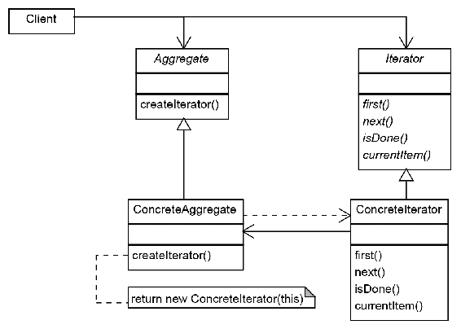
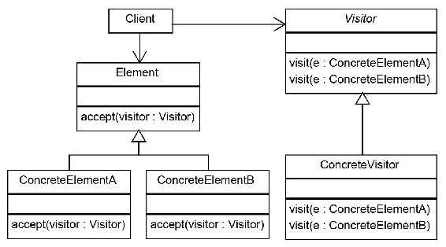

# 行为模式

本章的目的是学习行为模式。行为模式是关注对象交互、通信和控制流的模式。大多数行为模式是基于组合和委托而不是继承的。我们将在本章中了解以下行为模式：

*   责任链模式
*   命令模式
*   解释器模式
*   迭代器模式
*   观察者模式
*   中介模式
*   纪念图案
*   国家模式
*   战略模式
*   模板方法模式
*   空对象模式
*   访客模式

# 责任链模式

计算机软件是用来处理信息的，构造和处理这些信息有不同的方法。我们已经知道，当我们谈论面向对象编程时，我们应该为每个类分配一个单独的职责，以便使我们的设计易于扩展和维护。

考虑一个场景，其中可以对客户机请求附带的一组数据执行多种类型的操作。我们可以维护负责不同类型操作的不同类，而不是在单个类中添加有关所有操作的信息。这有助于我们保持代码松散耦合和干净。

这些类称为处理程序。第一个处理程序将接收请求并在需要执行操作时进行调用，或者将其传递给第二个处理程序。类似地，第二个处理程序检查并可以将请求传递给链中的下一个处理程序。

# 意图

责任链模式以这样一种方式将处理者链接起来：如果处理者不能处理请求，他们将能够处理请求或传递请求。

# 实施

下面的类图描述了责任链模式的结构和参与者：


在前面的图表中涉及以下类：

*   **客户端**：这是使用该模式的应用程序的主要结构。它负责实例化一系列处理程序，然后在第一个对象上调用`handleRequest`方法。
*   **Handler**：这个抽象类继承了所有具体的 Handler。它有一个`handleRequest`方法，接收应该处理的请求。
*   **ConcreteHandlers**：这些是具体的类，为每个案例实现一个`handleRequest`方法。每个`ConcreteHandler`都保留一个对链中下一个`ConcreteHandler`的引用，并且必须检查它是否能够处理请求；否则，它必须将其传递给链中的下一个`ConcreteHandler`。

每个处理程序都应该实现一个方法，客户机使用该方法设置下一个处理程序，如果无法处理请求，则应该将请求传递给该处理程序。此方法可以添加到基`Handler`类中：

```
protected Handler successor;
public void setSuccessor(Handler successor)
{
  this.successor = successor;
}
```

在每个`ConcreteHandler`类中，我们都有下面的代码，检查它是否能够处理请求；否则，它将传递请求：

```
public void handleRequest(Request request)
{
  if (canHandle(request))
  {
    //code to handle the request 
  }
  else
  {
    successor.handleRequest();
  }
}
```

客户机负责在调用链的头之前构建处理程序链。调用将被传播，直到找到可以处理请求的正确处理程序。

让我们以汽车服务应用程序为例。我们意识到，每一次一辆坏了的车进来，它都会首先由技工检查，如果问题在他们的专业领域，技工就会修理它。如果他们做不到，就把它交给电工。如果他们不能修复它，他们会把它传给下一位专家。下面是图表的外观：


# 适用性和示例

以下是责任链模式的适用性和示例：

*   **事件处理程序**：例如，大多数 GUI 框架使用责任链模式来处理事件。比方说，一个窗口包含一个包含一些按钮的面板。我们必须编写按钮的事件处理程序。如果我们决定跳过它并传递它，那么链中的下一个将能够处理请求：面板。如果面板跳过它，它将转到窗口。
*   **日志处理程序**：与事件处理程序类似，每个日志处理程序都会根据自己的状态记录一个特定的请求，或者传递给下一个处理程序。
*   **servlet**：在 Java 中，`javax.servlet.Filter`（[http://docs.oracle.com/javaee/7/api/javax/servlet/Filter.html](http://docs.oracle.com/javaee/7/api/javax/servlet/Filter.html)用于过滤请求或响应。`doFilter`方法还接收过滤链作为参数，并将请求传递给其他方法。

# 命令模式

在面向对象编程中要做的最重要的事情之一就是采用一种可以使代码解耦的设计。例如，假设我们需要开发一个复杂的应用程序，在其中我们可以绘制图形形状：点、线、线段、圆、矩形等等。

随着代码绘制各种形状，我们需要实现许多操作来处理菜单操作。为了使我们的应用程序具有可维护性，我们将创建一个统一的方法来定义所有这些*命令*，这样它将对应用程序的其余部分（扮演客户端角色）隐藏实现细节。

# 意图

命令模式执行以下操作：

*   提供一种统一的方法来封装命令以及执行操作所需的参数
*   允许处理命令，例如将命令存储在队列中

# 实施

命令模式的类图如下：


在前面的实现图中，我们可以区分以下参与者：

*   **命令**：这是表示命令封装的抽象。它声明执行的抽象方法，该方法应由所有具体命令实现。
*   **具体命令**：这是**命令**的实际执行。它必须执行命令并处理与每个具体命令相关联的参数。它将命令委托给接收器。
*   **接收者**：负责执行与命令相关联的动作的类。
*   **调用方**：触发命令的类。这通常是一个外部事件，例如用户操作。
*   **客户端**：这是实例化具体命令对象及其接收者的实际类。

最初，我们的冲动是在一个大的`if-else`块中处理所有可能的命令：

```
public void performAction(ActionEvent e)
{
  Object obj = e.getSource();
  if (obj = fileNewMenuItem)
  doFileNewAction();
  else if (obj = fileOpenMenuItem)
  doFileOpenAction();
  else if (obj = fileOpenRecentMenuItem)
  doFileOpenRecentAction();
  else if (obj = fileSaveMenuItem)
  doFileSaveAction();
}
```

但是，我们可以决定将命令模式应用于绘图应用程序。我们首先创建一个命令界面：

```
public interface Command
{
  public void execute();
}
```

下一步是将菜单项、按钮等所有对象定义为类，实现命令界面和`execute()`方法：

```
public class OpenMenuItem extends JMenuItem implements Command
{
  public void execute()  
  {
    // code to open a document
  }
}
```

在我们重复前面的操作，为每个可能的操作创建一个类之后，我们将 naive 实现中的`if-else`块替换为以下块：

```
public void performAction(ActionEvent e)
{
  Command command = (Command)e.getSource();
  command.execute();
}
```

我们可以从代码中看到，调用程序（触发`performAction`方法的客户机）和接收器（实现命令接口的类）是解耦的。我们可以很容易地扩展我们的代码而不必更改它。

# 适用性和示例

命令模式的适用性和示例如下：

*   **撤销/重做操作**：命令模式允许我们将命令对象存储在队列中。这样，我们就可以实现撤消和重做操作。
*   **复合命令**：复合命令可以由使用复合模式的简单命令组成，并按顺序运行。这样，我们就可以以面向对象的设计方式构建宏。
*   **异步方法调用**：命令模式用于多线程应用。命令对象可以在后台单独的线程中执行。这个 java.lang.Runnable 是一个命令接口。

在下面的代码中，runnable 接口作为命令接口，由`RunnableThread`实现：

```
class RunnableThread implements Runnable
{
  public void run() 
  {
    // the command implementation code
  }
}
```

客户端调用命令以启动新线程：

```
public class ClientThread 
{
  public static void main(String a[])
  {
    RunnableThread mrt = new RunnableThread();
    Thread t = new Thread(mrt);
    t.start();
  }
}
```

# 解释器模式

计算机应该用来解释句子或评估表达式。如果我们必须编写一系列代码来处理这样的需求，首先，我们需要知道结构；我们需要有表达式或句子的内部表示。在许多情况下，最适合使用的结构是基于复合模式的复合结构。我们将在[第 4 章](4.html)、*结构模式*中进一步讨论复合模式，目前我们可以将复合表示看作是将性质相似的对象分组在一起。

# 意图

解释器模式定义了语法的表示和解释。

# 实施

解释器模式使用复合模式来定义对象结构的内部表示。除此之外，它还添加了解释表达式并将其转换为内部结构的实现。因此，解释器模式属于行为模式范畴。类图如下：


解释器模式由以下类组成：

*   **上下文**：用于封装对口译员来说是全局的，需要所有具体口译员访问的信息。
*   **AbstractExpression**：一个抽象类或接口，声明执行的解释方法，由所有具体的解释程序实现。
*   **TerminalExpression**：一个解释器类，实现与语法的终端符号相关的操作。这个类必须始终被实现和实例化，因为它标志着表达式的结束。
*   **非终端表达式**：这些类实现不同的语法规则或符号。对于每个类，应该创建一个类。

解释器模式在实际中用于解释正则表达式。对于这样的场景，实现解释器模式是一个很好的练习；但是，我们将选择一个简单的语法作为示例。我们将应用它来解析一个带有一个变量的简单函数：`f(x)`。

为了使它更简单，我们将选择反向波兰符号。这是一种将操作数加到运算符末尾的表示法。*1+2*变为*12**+*；*（1+2）*3*变为*12+3**。优点是我们不再需要括号，所以它简化了我们的任务。

以下代码为表达式创建接口：

```
public interface Expression 
{
  public float interpret();
}
```

现在我们需要实现具体的类。我们需要以下要素：

*   **数字**：解释数字
*   **运算符类****（+，-，*，/）**：对于下面的示例，我们将使用加号（+）和减号（-）：

```
public class Number implements Expression 
{
  private float number;
  public Number(float number) 
  {
    this.number = number; 
  }
  public float interpret() 
  {
    return number;
  }
}
```

现在我们到了困难的部分。我们需要实施运营商。运算符是复合表达式，由两个表达式组成：

```
public class Plus implements Expression 
{
  Expression left;
  Expression right;
  public Plus(Expression left, Expression right) 
  {
    this.left = left;
    this.right = right; 
  }
  public float interpret() 
  {
    return left.interpret() + right.interpret();
  }
}
```

类似地，我们有一个负实现，如下所示：

```
public class Minus implements Expression 
{
  Expression left;
  Expression right;
  public Minus(Expression left, Expression right) 
  {
    this.left = left;
    this.right = right;
  }
  public float interpret() 
  {
    return right.interpret() - left.interpret();
  }
}
```

现在我们可以看到，我们已经创建了类，这些类允许我们构建一个树，其中操作是节点，变量和数字是叶子。这个结构可能非常复杂，可以用来解释一个表达式。

现在我们必须编写代码，使用我们创建的类来构建树：

```
public class Evaluator
{ 
  public float evaluate(String expression) 
  { 
    Stack<Expression> stack = new Stack<Expression>(); 
    float result =0; 
    for (String token : expression.split(" ")) 
    { 
      if  (isOperator(token)) 
      { 
        Expression exp = null; 
        if(token.equals("+")) 
        exp = stack.push(new Plus(stack.pop(), stack.pop())); 
        else if (token.equals("-")) 
        exp = stack.push(new Minus(stack.pop(), stack.pop())); 
        if(null!=exp) 
        { 
          result = exp.interpret(); 
          stack.push(new Number(result)); 
        } 
      } 
      if  (isNumber(token)) 
      { 
        stack.push(new Number(Float.parseFloat(token))); 
      } 
    } 
    return result; 
  } 
  private boolean isNumber(String token) 
  { 
    try 
    { 
      Float.parseFloat(token); 
      return true; 
    } 
    catch(NumberFormatException nan) 
    { 
      return false; 
    } 
  } 
  private boolean isOperator(String token) 
  { 
    if(token.equals("+") || token.equals("-")) 
    return true; 
    return false; 
  } 
  public static void main(String s[]) 
  { 
    Evaluator eval = new Evaluator(); 
    System.out.println(eval.evaluate("2 3 +")); 
    System.out.println(eval.evaluate("4 3 -")); 
    System.out.println(eval.evaluate("4 3 - 2 +")); 
  } 
} 
```

# 适用性和示例

解释器模式可以在表达式需要解释并转换为其内部表示时使用。模式不能应用于复杂语法，因为内部表示是基于复合模式的。

Java 实现了`java.util.Parser`中的解释器模式，用于解释正则表达式。首先，在解释正则表达式时，将返回 matcher 对象。匹配器使用模式类基于正则表达式创建的内部结构：

```
Pattern p = Pattern. compile("a*b");
Matcher m = p.matcher ("aaaaab");
boolean b = m.matches();
```

# 迭代器模式

迭代器模式可能是 Java 中最著名的模式之一。一些 Java 程序员在使用它时，并不知道集合包是迭代器模式的实现，而不管集合的类型是：数组、列表、集合或任何其他类型。

不管集合是列表还是数组，我们都可以用同样的方式处理它，这是因为它提供了一种在不暴露其内部结构的情况下遍历其元素的机制。此外，不同类型的集合使用相同的统一机制。这种机制称为迭代器模式。

# 意图

迭代器模式提供了一种顺序遍历聚合对象的元素而不暴露其内部表示的方法。

# 实施

迭代器模式基于两个抽象类或接口，可以通过一对具体类来实现。类图如下：



迭代器模式中使用了以下类：

*   **聚合**：应该由所有类实现的抽象类，可以由迭代器遍历。这对应于`java.util.Collection`接口。
*   **迭代器**：迭代器抽象定义了遍历聚合对象的操作和返回对象的操作。
*   **ConcreteAggregate**：Concrete aggregates 可以实现内部不同的结构，但是暴露了 Concrete 迭代器，该迭代器负责遍历聚合。
*   **混凝土迭代器**：这是处理特定混凝土骨料类的混凝土迭代器。实际上，对于每个**ConcreteAggregate，**我们必须实现一个**ConcreteIterator**。

在 Java 中使用迭代器可能是每个程序员在日常生活中都要做的事情之一。让我们看看如何实现迭代器。首先，我们应该定义一个简单的迭代器接口：

```
public interface Iterator
{
  public Object next();
  public boolean hasNext();
}
We create the aggregate:
public interface Aggregate
{
public Iterator createIterator();
}
```

然后我们实现一个简单的`Aggregator`，它维护一个字符串值数组：

```
public class StringArray implements Aggregate 
{ 
  private String values[]; 
  public StringArray(String[] values) 
  { 
    this.values = values; 
  } 
  public Iterator createIterator() 
  { 
    return (Iterator) new StringArrayIterator(); 
  } 
  private class StringArrayIterator implements Iterator 
  { 
    private int position; 
    public boolean hasNext() 
    { 
      return (position < values.length); 
    }  
    public String next() 
    { 
      if (this.hasNext()) 
      return values[position++]; 
      else 
      return null; 
    } 
  } 
} 
```

我们在聚合中嵌套了迭代器类。这是最好的选择，因为迭代器需要访问聚合器的内部变量。我们可以在这里看到它的样子：

```
String arr[]= {"a", "b", "c", "d"};
StringArray strarr = new StringArray(arr);
for (Iterator it = strarr.createIterator(); it.hasNext();)
System.out.println(it.next());
```

# 适用性和示例

迭代器现在在大多数编程语言中都很流行。它可能与 collections 包一起在 Java 中使用最广泛。当使用以下循环构造遍历集合时，它也在语言级别实现：

```
for (String item : strCollection)
System.out.println(item);
```

迭代器模式可以使用泛型机制实现。这样，我们就可以确保避免强制转换产生的运行时错误。

在 Java 中实现新的容器和迭代器的好方法是实现现有的`java.util.Iterator<E>`和`java.util.Collection<E>`类。当我们需要具有特定行为的聚合器时，我们还应该考虑扩展`java.collection`包中实现的一个类，而不是创建一个新的类。

# 观察者模式

在本书中，我们不断提到解耦的重要性。当我们减少依赖性时，我们可以扩展、开发和测试不同的模块，而不必知道其他模块的实现细节。我们只需要知道它们实现的抽象。

然而，模块在实践中应该协同工作。一个对象中的变化被另一个对象知道，这并不少见。例如，如果我们在一个游戏中实现了一个`car`类，那么汽车的引擎应该知道油门何时改变位置。最简单的解决方案是有一个`engine`类，它会不时检查加速器的位置，看它是否发生了变化。一个更聪明的方法是让加速器给引擎打电话，让它知道这些变化。但是如果我们想拥有设计良好的代码，这是不够的。

如果`Accelerator`类保留了对`Engine`类的引用，那么当我们需要在屏幕上显示`Accelerator`的位置时会发生什么？这是最好的解决方案：与其让加速器依赖于引擎，不如让它们都依赖于抽象。

# 意图

观察者模式使一个对象的状态变化可以被其他对象观察到，这些对象被注册为被通知。

# 实施

观察者模式的类图如下：


观察者模式依赖于以下类：

*   **主题**：这通常是一个必须由类实现的接口，应该是可观察的。应通知的观察员使用**附加**方法注册。当不必再通知他们更改时，将使用**分离**方法取消注册。
*   **ConcreteSubject**：实现 subject 接口的类。它处理观察者列表，并更新他们关于更改的信息。
*   **观察者**：这是一个由对象实现的接口，对象的变化需要更新这个接口。每个观察者都应该实现**更新**方法，该方法会通知他们新的状态变化。

# 中介模式

在许多情况下，当我们设计和开发软件应用程序时，我们会遇到许多场景，其中我们有必须相互通信的模块和对象。最简单的方法是让他们彼此了解，并且可以直接发送消息。

然而，这可能会造成混乱。例如，如果我们设想一个通信应用程序，其中每个客户端都必须连接到另一个客户端，那么客户端管理多个连接就没有意义了。更好的解决方案是连接到中央服务器，并由服务器管理客户机之间的通信。客户机将消息发送到服务器，服务器保持与所有客户机的连接处于活动状态，并且可以向所有所需的收件人广播消息。

另一个例子是需要一个专门的类在图形界面中的不同控件（如按钮、下拉列表和列表控件）之间进行中介。例如，GUI 中的图形控件可以相互引用，以便交互调用它们的方法。但显然，这将创建一个极为耦合的代码，其中每个控件都依赖于所有其他控件。更好的方法是让父级负责在需要执行某些操作时将消息广播到所有必需的控件。当控件中有修改时，它将通知窗口，窗口将检查哪些控件需要被通知，然后通知它们。

# 意图

中介模式定义了一个对象，该对象封装了一组对象如何交互，从而减少了它们之间的依赖性。

# 实施

中介模式基于两种抽象：**中介**和**同事**，如下图所示：


中介模式依赖于以下类：

*   **中介者**：这定义了参与者是如何互动的。此接口或抽象类中声明的操作特定于每个场景。
*   **ConcreteMediator**：实现中介声明的操作。
*   **同事**：这是一个抽象类或接口，定义了需要中介的参与者应该如何进行交互。
*   **具体同事**：这些是实现**同事**接口的具体类。

# 适用性和示例

当有许多实体以类似的方式交互时，应该使用中介模式，并且这些实体应该解耦。

中介模式在 Java 库中用于实现`java.util.Timer`。`timer`类可以用来安排线程以固定的间隔运行一次或多次。thread 对象对应于`ConcreteColleague`类。`timer`类实现了管理后台任务执行的方法。

# 纪念图案

封装是面向对象设计的基本原则之一。我们也知道每个班级都应该有一个单一的责任。当我们向对象添加功能时，我们可能会意识到我们需要保存其内部状态，以便能够在稍后的阶段恢复它。如果我们直接在类中实现这样的功能，那么类可能会变得太复杂，最终可能会打破单一责任原则。同时，封装阻止我们直接访问需要记忆的对象的内部状态。

# 意图

memento 模式用于保存对象的内部状态而不破坏其封装，并在后期恢复其状态。

# 实施

memento 模式依赖于三个类：**发起人**、**memento**、**看守人**，如下图所示：


memento 模式依赖于以下类：

*   **发起者**：发起者是我们需要记忆状态的对象，以备在某个时候需要恢复状态。
*   **看守者**：这个类负责触发发端人的变化，或者触发一个动作，发端人通过这个动作返回到以前的状态。
*   **Memento**：这个类负责存储发起者的内部状态。Memento 提供了两种设置和获取状态的方法，但是这些方法应该对管理员隐藏。

实际上，纪念品比听起来容易得多。让我们把它应用到我们的汽车服务应用程序中。我们的机修工必须测试每辆车。他们使用一个自动装置来测量不同参数（速度、档位、刹车等）下汽车的所有输出。他们执行所有的测试，必须重新检查那些看起来可疑的。

我们首先创建`originator`类。我们将其命名为`CarOriginator`，并添加两个成员变量。`state`表示测试运行时车辆的参数。这是我们要保存的对象的状态；第二个成员变量是 result。这是测得的汽车输出，我们不需要存储在纪念品。这是一个空巢纪念品的发起者：

```
public class CarOriginator 
{
  private String state;
  public void setState(String state) 
  {
    this.state = state;
  }
  public String getState() 
  {
    return this.state;
  }
  public Memento saveState() 
  {
    return new Memento(this.state);
  }
  public void restoreState(Memento memento) 
  {
    this.state = memento.getState();
  }
  /**
  * Memento class
  */
  public static class Memento 
  {
    private final String state;
    public Memento(String state) 
    {
      this.state = state;
    }
    private String getState() 
    {
      return state;
    }
  }
}
```

现在我们对不同的州进行汽车测试：

```
public class CarCaretaker 
{
  public static void main(String s[]) 
  {
    new CarCaretaker().runMechanicTest(); 
  }
  public void runMechanicTest() 
  {
    CarOriginator.Memento savedState = new CarOriginator.
    Memento("");
    CarOriginator originator = new CarOriginator();
    originator.setState("State1");
    originator.setState("State2");
    savedState = originator.saveState();
    originator.setState("State3");
    originator.restoreState(savedState);
    System.out.println("final state:" + originator.getState());
  }
}
```

# 适用性

只要需要实现回滚操作，就使用 memento 模式。它可以用于所有类型的原子事务中，在这些事务中，如果其中一个操作失败，则必须将对象还原为初始状态。

# 国家模式

有限状态机是计算机科学中的一个重要概念。它有一个强大的数学基础，它代表了一个抽象的机器，可以在有限的状态数。有限状态机应用于计算机科学的所有领域。

状态模式只是面向对象设计中有限状态机的一种实现。类图如下：


# 战略模式

特定于行为模式的一种特殊情况是，当我们需要改变解决另一个问题的方式时。正如我们在第一章已经学到的，改变是不好的，而扩展是好的。因此，我们可以将它封装在一个类中，而不是将代码的一部分替换为另一部分。然后我们可以创建代码所依赖的类的抽象。从那时起，我们的代码变得非常灵活，因为我们现在可以使用任何实现我们刚刚创建的抽象的类。

# 意图

策略模式定义了一系列算法，将每个算法封装起来，并使它们可以互换。

# 实施

战略模式的结构实际上与状态模式相同。然而，实施和意图完全不同：


战略模式非常简单：

*   **策略**：对特定策略的抽象
*   **具体策略**：实现抽象策略的类
*   **上下文**：运行特定策略的类

# 模板方法模式

顾名思义，模板方法模式为代码提供了一个模板，可以由实现不同功能的开发人员填写。理解这一点最简单的方法是从 HTML 模板的角度来考虑。你访问的大多数网站都遵循某种模板。例如，通常有一个页眉、一个页脚和一个侧边栏，在它们之间，我们有核心内容。这意味着模板是用页眉、页脚和侧边栏定义的，每个内容编写器都可以使用此模板添加内容。

# 意图

使用模板方法模式的想法是避免编写重复的代码，这样开发人员就可以专注于核心逻辑。

# 实施

模板方法模式最好使用抽象类实现。我们所知道的关于实现的区域将被提供；默认实现和保持开放以供实现的区域被标记为抽象的。

例如，设想一个非常高级别的数据库获取查询。我们需要执行以下步骤：

1.  创建连接
2.  创建查询
3.  执行查询
4.  解析并返回数据
5.  关闭连接

我们可以看到，创建和关闭连接部分将始终保持不变。因此，我们可以将其添加为模板实现的一部分。其余的方法可以根据不同的需要独立实现。

# 空对象模式

空对象模式是本书中介绍的最轻的模式之一。有时，它被认为只是战略模式的一个特例，但考虑到它在实践中的重要性，它有自己的部分。

如果我们使用测试驱动的方法开发程序，或者如果我们只是想开发一个模块而不需要应用程序的其余部分，我们可以简单地用一个 mock 类来替换我们没有的类，mock 类具有相同的结构，但什么也不做。

# 实施

在下图中，我们可以看到我们只是创建了一个**NullClass**，它可以替换程序中的实际类。如前所述，这只是战略模式的一个特例，在这种模式中，我们选择无所事事的战略。类图如下：


# 访客模式

让我们回到我们在讨论命令模式时介绍的 shapes 应用程序。我们应用了命令模式，所以我们必须重做所实现的操作。是时候添加保存功能了。

我们可能会认为，如果我们向基 shape 类添加一个抽象的`Save`方法，并对每个形状进行扩展，那么问题就解决了。这个解决方案也许是最直观的，但不是最好的。首先，每个班级应该有一个单一的职责。

其次，如果需要更改保存每个形状的格式，会发生什么情况？如果我们要实现相同的方法来生成 XML 输出，那么我们是否必须更改为 JSON 格式？这种设计绝对不遵循开/关原则。

# 意图

visitor 模式将操作与其操作的对象结构分离，允许添加新操作而不更改结构类。

# 实施

visitor 模式在一个类中定义了一组操作：它为要操作的结构中的每种类型的对象定义了一个方法。只需创建另一个访问者，就可以添加一组新的操作。类图如下：



访问者模式基于以下类：

*   **元素**：表示对象结构的基类。结构中的所有类都是从它派生的，它们必须实现**accept（visitor:visitor）**方法。
*   **ConcreteElementA 和 ConcreteElementB**：这些都是具体的类，我们想向它们添加在**Visitor**类中实现的外部操作。
*   **Visitor**：这是基础**Visitor**类，它声明了每个**具体元素**对应的方法。方法的名称是相同的，但每个方法都根据其接受的类型进行区分。我们可以采用这种解决方案，因为在 Java 中，我们可以使用相同名称和不同签名的方法；但是，如果需要，我们可以使用不同的名称声明方法。
*   **具体访问者**：这是访问者的实现。当我们需要一组单独的操作时，我们只需创建另一个访问者。

# 摘要

在本节中，我们讨论了各种行为模式。我们研究了一些最常用的行为模式，如责任链模式、命令模式、解释器模式等等。这些模式帮助我们以可控的方式管理对象的行为。在下一章中，我们将研究有助于我们管理复杂结构的结构模式。