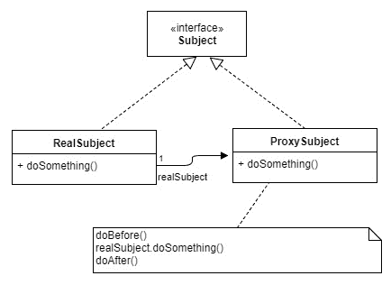
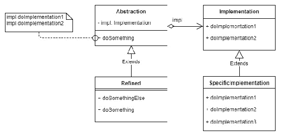
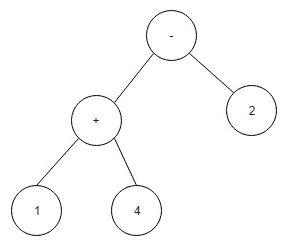
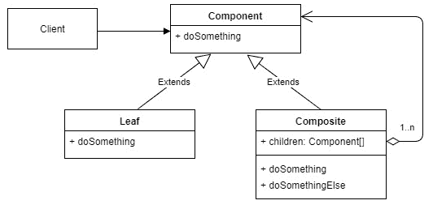
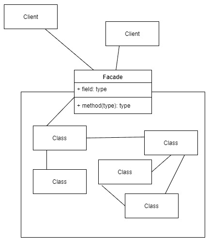
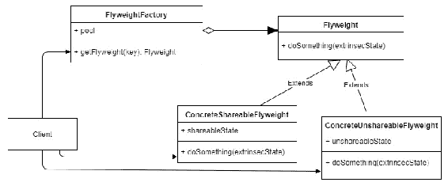

# 结构模式

本章的目的是了解结构模式。 结构模式是通过利用物体和类之间的关系来创建复杂结构的模式。 大多数结构模式都基于继承。 在本章中，我们只关注以下 GOF 模式：

*   适配器图案
*   代理模式
*   桥梁模式
*   装饰师模式
*   复合模式
*   外墙模式
*   飞脂的模式

还有其他识别的结构模式，我们可能无法详细介绍，但值得了解它们。 这些是以下内容：

*   **标记接口**：这使用空界面标记特定类（例如序列化），从而通过接口名称进行搜索。 有关更多信息，请阅读文章*项 37 - 使用标记接口定义*，在 [http://thefinestartart.com/effective-java/37](http://thefinestartist.com/effective-java/37) ，这是参考 *有效的 Java（第 2 版）*，由 Joshua Bloch 编写。
*   **模块**：此组一起为软件模块进行概念。 模块化架构包含多个模式，这些模式以 kirk knoernschild 在 [https://dzone.com/refcardz/patterns-modular-architecture](https://dzone.com/refcardz/patterns-modular-architecture) 中以 kirk knoernschild 解释。 Java 9 模块是此模式的示例 - 在 [https://labs.consol.de/development/2017/02/13/getting-started-with-java9-modules.html](https://labs.consol.de/development/2017/02/13/getting-started-with-java9-modules.html) 中阅读更多。
*   **扩展对象**：运行时在现有对象界面处发生变化。 更多信息在 [http://www.brockmann-consult.de/beam-wiki/display/beam/extension vikiobject +pattern](http://www.brockmann-consult.de/beam-wiki/display/BEAM/Extension+Object+Pattern) 。
*   **双**：这增加了不支持它的语言的多种继承功能。 Java 8 支持通过添加默认方法支持类型的多重继承。 即便如此，在某些情况下，双方模式仍然有用。 Java Design Pattern Com 网站在 [http://java-design-patterns.com/patterns/twin/](http://java-design-patterns.com/patterns/twin/) 中具有很好的描述。

# 适配器模式

适配器图案提供用于代码可重用性的解决方案; 它适应/包装到新的接口，在原始代码的设计时间内未知的接口。 1987 年，设计了 PS / 2 端口时，没有人想象它将与九年设计的 USB 总线连接。 然而，我们仍然可以通过将其连接到 USB 端口来在我们最新计算机中使用旧的 PS / 2 键盘。

使用遗留代码时常用适配器图案，因为通过将现有代码包装并将其调整为新代码接口，因此我们立即访问旧的，已测试的功能。 这可以通过使用多个继承来完成默认接口实现中的 java 8 中可能的多个继承，或者使用旧对象成为类属性的组合来完成。 适配器图案也称为**包装器**。

在旧代码需要利用新代码的情况下，反之亦然，我们需要使用称为双向适配器的特殊适配器，该适配器实现两个接口（旧和新的）。

来自 JDK 的`java.io.InputStreamReader`和`java.io.OutputStreamWriter`类是适配器，因为它们在 JDK1.1 中将 jdk1.0 的输入/输出流对象调整到稍后定义的读取器/写器对象。

# 意图

意图是将现有的旧接口采用新的客户端界面。 目标是尽可能多地重用旧的和已经测试的代码，同时可以自由地对新接口进行更改。

# 执行

以下 UML 图模拟了新客户端代码和调整的互动。 适配器模式通常通过使用多重继承以其他语言实现，这些语言是从 Java 8 开始的部分可能的。我们将使用其他方法，该方法也与较旧的 Java 版本一起使用; 我们将使用聚合。 它比继承更严格，因为我们不会访问受保护的内容，只是适配器公共界面：


我们可以从实施图中区分以下参与者：

*   客户端：代码客户端
*   适配器：将呼叫转发给 Adapeee 的适配器类
*   Adaptee：需要调整的旧代码
*   目标：支持的新界面

# 例子

以下代码模拟 USB 总线中 PS / 2 键盘的使用。 它定义了 PS / 2 键盘（AdapeEED），USB 设备接口（目标），PS2TOUSBADAPTER（ADAPTER）和链接的电线，以便使设备工作：

```
package gof.structural.adapter;
import java.util.Arrays;
import java.util.Collections;
import java.util.List;
class WireCap 
{
  WireCap link = WireCap.LooseCap;
  private Wire wire;
  publicstatic WireCap LooseCap = new WireCap(null);
  public WireCap(Wire wire) 
  {
    this.wire = wire; 
  }
  publicvoid addLinkTo(WireCap link) 
  {
    this.link = link;
  }
  public Wire getWire() 
  {
    return wire;
  }
  public String toString() 
  {
    if (link.equals(WireCap.LooseCap))
    return "WireCap belonging to LooseCap";
    return "WireCap belonging to " + wire + " is linked to " + 
    link.getWire();
  }
  public WireCap getLink() 
  {
    return link;
  }
}
```

`WireCap`类模型，如名称所示，每根电线的末端。 默认情况下，所有电线都松动; 因此，我们需要一种发出信号的方法。 这是通过使用空对象模式 - `LooseCap`完成的是我们的 null 对象（null 替换，不会抛出`NullPointerException`）。 看看这段代码：

```
class Wire 
{
  private String name;
  private WireCap left;
  private WireCap right;
  public Wire(String name) 
  {
    this.name = name;
    this.left = new WireCap(this);
    this.right = new WireCap(this);
  }
  publicvoid linkLeftTo(Wire link) 
  {
    left.addLinkTo(link.getRightWireCap());
    link.getRightWireCap().addLinkTo(left);
  }
  public WireCap getRightWireCap() 
  {
    return right;
  }
  publicvoid printWireConnectionsToRight() 
  {
    Wire wire = this;
    while (wire.hasLinkedRightCap()) 
    {
      wire.printRightCap();
      wire = wire.getRightLink();
    }
  }
  public Wire getRightLink() 
  {
    return getRightWireCap().getLink().getWire();
  }
  publicvoid printRightCap() 
  {
    System.out.println(getRightWireCap());
  }
  publicboolean hasLinkedRightCap() 
  {
    return !getRightWireCap().link.equals(WireCap.LooseCap);
  }
  public String getName() 
  {
    return name;
  }
  public String toString() 
  {
    return "Wire " + name;
  }
}
```

`Wire`类从 USB 或 PS / 2 设备模拟电线。 它有两端，默认情况下松动，如以下代码所示：

```
class USBPort 
{
  publicfinal Wire wireRed = new Wire("USB Red5V");
  publicfinal Wire wireWhite = new Wire("USB White");
  publicfinal Wire wireGreen = new Wire("USB Green");
  publicfinal Wire wireBlack = new Wire("USB Black");
}
```

根据 USB 规范的 USBport 有四个电线：5V 红色，绿色和白色电线用于数据，以及用于地面的黑线，如以下代码所示：

```
interface PS2Device
{
  staticfinal String GND = "PS/2 GND";
  staticfinal String BLUE = "PS/2 Blue";
  staticfinal String BLACK = "PS/2 Black";
  staticfinal String GREEN = "PS/2 Green";
  staticfinal String WHITE = "PS/2 White";
  staticfinal String _5V = "PS/2 5V";
  public List<Wire> getWires();
  publicvoid printWiresConnectionsToRight();
}
class PS2Keyboard implements PS2Device 
{
  publicfinal List<Wire> wires = Arrays.asList(
  new Wire(_5V),
  new Wire(WHITE),
  new Wire(GREEN),
  new Wire(BLACK),
  new Wire(BLUE),
  new Wire(GND));
  public List<Wire> getWires() 
  {
    return Collections.unmodifiableList(wires); 
  }
  publicvoid printWiresConnectionsToRight() 
  {
    for(Wire wire : wires)
    wire.printWireConnectionsToRight();
  }
}
```

`PS2Keyboard`是适配器。 这是我们需要使用的旧设备，如以下代码所示：

```
interface USBDevice 
{
  publicvoid plugInto(USBPort port);
}
```

`USBDevice`是目标接口。 它知道如何与`USBPort`接口，如以下代码所示：

```
class PS2ToUSBAdapter implements USBDevice 
{
  private PS2Device device;
  public PS2ToUSBAdapter(PS2Device device) 
  {
    this.device = device;
  }
  publicvoid plugInto(USBPort port) 
  {
    List<Wire> ps2wires = device.getWires();
    Wire wireRed = getWireWithNameFromList(PS2Device._5V, 
    ps2wires);
    Wire wireWhite = getWireWithNameFromList(PS2Device.WHITE,
    ps2wires);
    Wire wireGreen = getWireWithNameFromList(PS2Device.GREEN,
    ps2wires);
    Wire wireBlack = getWireWithNameFromList(PS2Device.GND, 
    ps2wires);
    port.wireRed.linkLeftTo(wireRed);
    port.wireWhite.linkLeftTo(wireWhite);
    port.wireGreen.linkLeftTo(wireGreen);
    port.wireBlack.linkLeftTo(wireBlack);
    device.printWiresConnectionsToRight();
  }
  private Wire getWireWithNameFromList(String name, List<Wire>
  ps2wires) 
  {
    return ps2wires.stream()
    .filter(x -> name.equals(x.getName()))
    .findAny().orElse(null);
  }
}
```

`PS2ToUSBAdapter`是我们的适配器类。 它知道如何进行布线，以便旧设备仍然可以由新的`USBPort`使用，如以下代码所示：

```
publicclass Main
{
  publicstaticvoid main (String[] args)
  {
    USBDevice adapter = new PS2ToUSBAdapter(new PS2Keyboard());
    adapter.plugInto(new USBPort());
  }
}
```

输出如下：


正如预期的那样，我们的设备连接到 USB 端口并准备使用。 所有接线都已完成，例如，如果 USB 端口将红色电线设置为 5 伏，则该值达到键盘，如果键盘通过绿色电线发送数据，则它将到达 USB 端口。

# 代理模式

每当您使用企业或 Spring Bean，模拟实例和实现 AOP 时，将 RMI 或 JNI 调用与具有相同接口的另一个对象，或直接/间接使用`java.lang.reflect.Proxy`，涉及一个代理对象。 其目的是为真实物体提供代理，具有完全相同的占地面积。 它将工作委托给它，同时在呼叫之前或之后做别的东西。 代理类型包括以下内容：

*   **远程代理**：例如，将工作委托给远程对象（不同的过程，不同的机器），例如企业 bean。 使用 JNI 包装现有的非 Java 旧代码（例如，C / C ++）手动或自动（例如，通过使用 SWIG 生成胶水码 - 见 [http://www.swig.org/ doc1.3 / java.html＃imclass](http://www.swig.org/Doc1.3/Java.html#imclass) ）是一种远程代理模式的形式，因为它使用句柄（C / C ++中的指针）来访问实际对象。
*   **保护代理**：这是安全/权限检查。
*   **Cache Proxy** ：这使用记忆来加快呼叫。 最好的例子之一是 Spring `@Cacheable`方法，它缓存了特定参数的方法的结果，并且不调用实际代码，但从高速缓存返回先前计算的结果。
*   **虚拟和智能代理**。 这些为方法添加功能（例如日志记录性能指标）（创建`@Aspect`，为所需的方法和定义`@Around`建议）或执行延迟初始化。

适配器和代理之间的主要区别在于代理提供完全相同的界面。 装饰器模式增强了接口，适配器更改接口。

# 意图

意图是为真实对象提供代理，以便更好地控制它。 它是一个句柄到一个真实对象的行为，从而使客户端代码能够像使用真实对象一样使用它。

# 执行

下图模拟了代理模式。 请注意，由于实际和代理主题都实现了相同的界面，因此它们可以是可互换的：



我们可以区分以下参与者在实施图中：

*   **主题**：客户使用的现有接口
*   **realsubject** ：真正的对象的课程
*   **proxysubject** ：代理类

# 例子

以下代码模拟了远程代理从 localhost ejb 上下文查找 bean。 我们的远程代理是一个在另一个 JVM 中运行的几何计算器。 我们将使用工厂方法来制作我们的代理和真实对象，以证明它们是可互换的。 代理版本需要更长的时间来计算，因为我们还模拟了 JNI 查找部分并发送/检索结果。 看看代码：

```
package gof.structural.proxy;
publicclass Main
{
  publicstaticvoid main (String[] args) throws java.lang.Exception
  {
    GeometryCalculatorBean circle = GeometryCalculatorBeanFactory.
    REMOTE_PROXY.makeGeometryCalculator();
    System.out.printf("Circle diameter %fn",    
    circle.calculateCircleCircumference(new Circle()));
  }
}
class Circle 
{}
interface GeometryCalculatorBean 
{
  publicdouble calculateCircleCircumference(Circle circle);
}
```

这是我们的主题，我们想要实现的界面。 它模拟`@RemoteInterface`和`@LocalInterface`接口的建模，如以下代码所示：

```
class GeometryBean implements GeometryCalculatorBean 
{
  publicdouble calculateCircleCircumference(Circle circle) 
  {
    return 0.1f;
  }
}
```

这是我们的真实主题，知道如何执行实际几何计算的真实主题，如以下代码所示：

```
class GeometryBeanProxy implements GeometryCalculatorBean 
{
  private GeometryCalculatorBean bean;
  public GeometryBeanProxy() throws Exception 
  {
    bean = doJNDILookup("remote://localhost:4447", "user", 
    "password");
  }
  private GeometryCalculatorBean doJNDILookup
  (final String urlProvider, final String securityPrincipal, final  
  String securityCredentials)
  throws Exception 
  {
    System.out.println("Do JNDI lookup for bean");
    Thread.sleep(123);//simulate JNDI load for the remote location
    return GeometryCalculatorBeanFactory.LOCAL.
    makeGeometryCalculator();
  }
  publicdouble calculateCircleCircumference(Circle circle) 
  {
    return bean.calculateCircleCircumference(circle);
  }
}
```

这是我们的代理主题。 请注意，它没有业务逻辑; 它将其委托到真实主题以便建立句柄后，如下代码所示：

```
enum GeometryCalculatorBeanFactory 
{
  LOCAL 
  {
    public GeometryCalculatorBean makeGeometryCalculator() 
    {
      returnnew GeometryBean();
    }
  },
  REMOTE_PROXY 
  {
    public GeometryCalculatorBean makeGeometryCalculator() 
    {
      try 
      {
        returnnew GeometryBeanProxy();
      } 
      catch (Exception e) 
      {
        // TODO Auto-generated catch block
        e.printStackTrace();
      }
      returnnull;
    }
  };
  publicabstract GeometryCalculatorBean makeGeometryCalculator();
}
```

以下输出显示代理程序要链接到实际对象并执行所需的计算：


# 装饰图案

有时我们需要添加或删除来自现有代码的功能，而不会影响它，并且当制作子类时不实用。 在这些情况下，装饰器在方便中，因为它允许在不改变现有代码的情况下这样做。 它通过实现相同的界面来实现这一点，会聚它要装饰的对象，委派所有公共接口调用，并在子类中实现新功能。 使用轻量级界面将此模式应用于类。 在其他情况下，通过将所需的策略注入组件（策略模式）来扩展功能是更好的选择。 这将保持本地的更改为特定方法，而无需重新实现其他方法。

装饰物体及其装饰仪应互换。 装饰器的界面必须完全符合装饰的对象界面。

由于它使用递归，因此可以通过构思装饰器来实现新功能。 在这方面，它类似于复合模式，其构成多个对象，其意图形成充当作为一个的复杂结构。 装饰器可以被视为一块玻璃或纸张从传球板（*一张玻璃和一张卡片和一张卡片之间的照片*），其中图片/照片本身是 装饰物体。 另一方面，策略可以被视为该图片/照片上的艺术家的签名。

`JScrollPane` swing 类是装饰器的示例，因为它允许添加新功能，例如滚动条，如现有容器，它可以多次完成，如本代码所示：

```
JTextArea textArea = new JTextArea(10, 50);
JScrollPane scrollPane1 = new JScrollPane(textArea);
JScrollPane scrollPane2 = new JScrollPane(scrollPane1);
```

# 意图

意图是为了在不改变其代码的情况下动态扩展现有对象的功能。 它符合原始界面，并且能够通过使用组成而不是子类来扩展功能上的功能。

# 执行

下图模拟了装饰器模式。 它表明，可以更换延伸部件和装饰部件，一个与另一个。 装饰员可以递归应用; 它可以应用于现有组件实现，而且应用于另一个装饰器，甚至自身。 装饰界面不固定到组件接口; 它可以添加额外的方法，该方法可以由装饰者的子项使用，如本图所示


我们可以区分以下参与者在实施图中：

*   **组件**：这是抽象组件（它可以是一个接口）
*   **componentimplingation** ：这是我们想要装饰的组件之一
*   **装饰员**：这是一个抽象的组件装饰器
*   **扩展名录**：这是组件装饰器，它增加了额外的功能

# 例子

以下代码显示，除了实际文本之外，如何增强如何增强单个打印 ASCII 文本以打印输入的十六进制等效字符串：

```
package gof.structural.decorator;
import java.util.stream.Collectors;
publicclass Main
{
  publicstaticvoid main (String[] args) throws java.lang.Exception
  {
    final String text = "text";
    final PrintText object = new PrintAsciiText();
    final PrintText printer = new PrintTextHexDecorator(object);
    object.print(text);
    printer.print(text);
  }
}
interface PrintText 
{
  publicvoid print(String text);
}
PrintText is the component interface:
class PrintAsciiText implements PrintText 
{
  publicvoid print(String text) 
  {
    System.out.println("Print ASCII: " + text); 
  }
}
```

`PrintASCIIText`是装饰的组件。 请注意，它只知道如何打印`ASCII`文本。 我们希望在十六进制中打印它; 我们可以使用此代码执行此操作

```
class PrintTextHexDecorator implements PrintText 
{
  private PrintText inner;
  public PrintTextHexDecorator(PrintText inner) 
  {
    this.inner = inner;
  }  
  publicvoid print(String text) 
  {
    String hex = text.chars()
    .boxed()
    .map(x -> "0x" + Integer.toHexString(x))
    .collect(Collectors.joining(" "));
    inner.print(text + " -> HEX: " + hex);
  }
}
```

`PrintTextHexDecorator`是装饰员。 它也可以应用于其他`PrintText`组件。 假设我们希望实现一个组件`PrintToUpperText`。 我们仍然可能使用现有的装饰器，也可以使其打印十六进制。

以下输出显示当前功能（ASCII）加上新添加的功能（十六进制显示）：


# 桥梁模式

在软件设计期间，我们可能面临相同抽象可以具有多种实现的问题。 在进行跨平台开发时，这主要是可见的。 示例可以包括 Linux 上的行馈送线或 Windows 上的注册表的存在。 通过运行特定的操作系统调用需要获得特定系统信息的 Java 实现肯定需要能够改变实现。 这样做的一种方法是通过使用继承，但这将使孩子绑定到特定的界面，这可能不存在于不同的平台上。

在这些情况下，建议使用桥接模式，因为它允许远离扩展特定抽象的类的扩散到*嵌套概念*，这是由 rumbauge 创建的术语，在那里我们处理第一概括 然后是另一个，从而乘以所有组合。 如果所有子类都同样重要，并且多个接口对象使用相同的实现方法，则此工作正常。 如果，由于某种原因，很多代码被复制，这个模式不是特定问题的正确选择。

# 意图

意图是从实现中解耦了抽象，以允许它们独立不同。 它通过使用公共接口和实施中的继承来实现这一点。

# 执行

下图显示了可能的桥接实现。 请注意，抽象和实现都可以改变，不仅可以改变界面，还可以改变，还可以改变实现代码。 例如，精细抽象可以利用`doImplementation3()`，只有`SpecificImplementation`提供：



我们可以区分以下参与者在实施图中：

*   **抽象**：这是抽象组件
*   **实现**：这是抽象的实现
*   **精制**：这是精制组件
*   **特异性拼接**：这是具体实现

# 例子

以下代码显示了一个电子邮件客户端，该客户端是基于运行平台使用实现的。 可以通过工厂方法模式增强它来创建特定平台实现：

```
package gof.structural.bridge;
publicclass Main
{
  publicstaticvoid main (String[] args) 
  {
    new AllMessageClient(new WindowsImplementation())
    .sendMessageToAll("abc@gmail.com", "Test");
  }
}
interface PlatformBridge 
{
  publicvoid forwardMessage(String msg);
}
```

`PlatformBridge`是我们的实现抽象类。 它指定了每个实现需要提供 - 在我们的情况下，转发文本给出的消息。 以下实现，Windows 和 POSIX 都知道如何执行任务：

```
class WindowsImplementation implements PlatformBridge 
{
  publicvoid forwardMessage(String msg) 
  {
    System.out.printf("Sending message n%s nFrom the windows 
    machine", msg);
  }
}
class PosixImplementation implements PlatformBridge 
{
  publicvoid forwardMessage(String msg) 
  {
    System.out.printf("Sending message n%s nFrom the linux 
    machine", msg);
  }
}
class MessageSender 
{
  private PlatformBridge implementation;
  public MessageSender(PlatformBridge implementation) 
  {
    this.implementation = implementation;
  }
  publicvoid sendMessage(String from, String to, String body) 
  {
    implementation.forwardMessage(String.format("From : 
    %s nTo : %s nBody : %s", from, to, body));
  }
}
```

抽象`MessageSender`，使用特定于平台的实现发送消息。 `AllMessageClient`精细抽象向特定组 - `development_all@abc.com`发送消息。 其他可能的精细抽象可能包括特定于平台的代码并调用平台实现。 这是代码：

```
class AllMessageClient extends MessageSender 
{
  private String to = "development_all@abc.com";
  public MyMessageClient(PlatformBridge implementation) 
  {
    super(implementation);
  }
  publicvoid sendMessageToAll(String from, String body) 
  {
    sendMessage(from, to, body);
  }
}
```

以下输出显示所有消息客户端使用 Windows 实现发送消息：


# 复合模式

当名称建议的复合模式时，将对象构成对象以充当作为一个的复杂结构（参见下图）。 在内部，它使用数据结构，例如树，图形，阵列或链接列表来表示模型：



JVM 提供了复合模式的最佳示例，因为它通常以堆栈机器实现（用于可移植性原因）。 从当前线程堆栈按下和弹出操作。 例如，要计算哪个 *1 + 4 - 2* 等于，它按下 1，按 4，并执行添加。 堆栈现在只有 5，按 2，并执行减号。 现在堆栈只有值 3，弹出。 操作 *1 + 4 + 2 -* （反向波兰符号）可以使用复合模式容易地建模，其中每个节点是值，复数或操作数。 每个节点都具有执行操作的执行方法（根据类型）执行操作（推送，执行和弹出或组合或组合）。

Composite 利用递归组合物，其中每个部分，叶子或节点由客户端代码以相同的方式处理。

# 意图

意图是使对象的建模能够进入树或图形结构并以相同的方式处理它们。 客户端代码不需要知道节点是否是单个对象（叶节点）或对象的组成（具有子节点的节点，例如根节点）; 客户端代码可以对这些细节进行抽象，并统一对待它们。

# 执行

下图显示了客户端使用组件接口`doSomething()`方法。 该方法在根和叶节点中不同地实现。 根节点可以具有 *1 至 N* 儿童; 叶节点没有。 当孩子们的数量是 2 并且没有周期时，我们有一个二叉树的情况：



我们可以区分以下参与者在实施图中：

*   **客户端**：客户端代码
*   **组件**：抽象节点
*   **叶子**：叶节点
*   **复合**：具有可以是复合或叶节点的子的复合节点

# 例子

以下代码模拟算术表达式计算器。 表达式被构造为复合材料，只有一种方法 - `getValue`。 这给出了当前值; 对于叶片，它是叶数值，以及复合节点，它是子组成的值：

```
package gof.structural.composite;
publicclass Main
{
  publicstaticvoid main (String[] args) throws java.lang.Exception
  {
    ArithmeticComposite expr = new MinusOperand(
    new PlusOperand(new NumericValue(1), new NumericValue(4)),
    new NumericValue(2));
    System.out.printf("Value equals %dn", expr.getValue());
  }
}
```

客户端代码创建一个*（1 + 4）-2* 算术表达式，并打印其值，如以下代码所示：

```
interface ArithmeticComposite 
{
  publicint getValue();
}
```

`ArithmeticComposite`是我们的复合界面; 它只知道如何返回整数值，这表示算术表达式（组成 - `ArithmeticOperand`）或保持值（Leaf-[Htg2]）的值，如以下代码所示：

```
class NumericValue implements ArithmeticComposite 
{
  privateint value;
  public NumericValue(int value) 
  {
    this.value = value;
  }
  publicint getValue() 
  {
    return value;
  }
}
abstractclass ArithmeticOperand implements ArithmeticComposite 
{
  protected ArithmethicComposite left;
  protected ArithmethicComposite right;
  public ArithmethicOperand(ArithmeticComposite left,   
  ArithmeticComposite right) 
  {
    this.left = left;
    this.right = right;
  }
}
class PlusOperand extends ArithmeticOperand 
{
  public PlusOperand(ArithmeticComposite left, 
  ArithmeticComposite right) 
  {
    super(left, right);
  }
  publicint getValue()  
  {
    return left.getValue() + right.getValue();
  }
}
class MinusOperand extends ArithmeticOperand 
{
  public MinusOperand(ArithmeticComposite left, 
  ArithmeticComposite right) 
  {
    super(left, right); 
  }
  publicint getValue() 
  {
    return left.getValue() - right.getValue();
  }
}
```

`PlusOperand`和`MinusOperand`是当前支持的算术类型。 他们知道如何表示加（+）和减号（ - ）算术表达式。

正如预期的那样，*（1 + 4）-2* 算术表达式返回 3，值将值打印到控制台，如以下屏幕截图所示：


# 外墙模式

许多复杂的系统可通过子系统公开几个使用案例，仅降低了几个用例。 通过这样做，客户端代码不需要了解子系统的内部结构。 换句话说，客户端代码与它分离，开发人员使用它需要更少的时间。 这被称为外立模式，外观对象负责暴露所有子系统的功能。 此概念类似于封装，我们隐藏了对象的内部。 通过外观，我们隐藏了子系统的内部，并仅曝光了必需品。 结果是用户限于外观暴露的功能，并且不能从子系统使用/重用特定功能。

外墙模式需要采用内部子系统接口（许多接口）到客户端代码接口（一个界面）。 它通过创建新接口来实现这一点，而适配器模式适应现有接口（有时需要多个旧类别以为新代码提供所需的功能）。 外观为结构进行了调解器为对象通信所做的 - 它统一并简化使用。 在第一种情况下，客户端代码通过使用 FAÇADE 对象访问子系统的功能; 在第二种情况下，不知道彼此（松动耦合）的对象可以通过使用介体/辅助程序进行交互。

# 意图

意图是为复杂子系统提供一个统一接口。 这通过为最重要的用例提供界面来简化大型和复杂系统的使用。

# 执行

下图显示了如何从客户端代码中简化和解耦子系统的使用方式。 外立面是对子系统的入学点; 因此，子系统代码可以容易地切换到不同的实现。 也可以更容易地管理客户端依赖性并且更可见：



我们可以将以下演员区分开在实施图中：

*   **客户端**：子系统客户端代码
*   **façade**：子系统接口
*   **子系统**：子系统中定义的类

# 例子

咖啡机就像咖啡磨床和咖啡酿酒师的外墙一样，因为它们隐藏了他们的功能。 以下代码模拟了一台咖啡机，研磨咖啡豆，酿造咖啡，并将其放在咖啡杯中。

问题，正如您将从以下代码中发现的那样，我们无法获得细小的磨碎咖啡（我们必须长时间磨削豆类），因为`serveCoffee()`方法只知道如何制作粗大的地面 咖啡。 这对一些咖啡饮用者来说可能会很好：

```
package gof.structural.facade;
publicclass Main
{
  publicstaticvoid main (String[] args) throws java.lang.Exception
  {
    CoffeeMachineFacade facade = new SuperstarCoffeeMachine();
    facade.serveCoffee();
  }
}
class GroundCoffee 
{}
class Water 
{}
class CoffeeCup 
{}
```

`GroundCoffee`，`Water`和`CoffeeCup`是我们将要使用的项目类：

```
interface CoffeeMachineFacade 
{
  public CoffeeCup serveCoffee() throws Exception;
}
```

`CoffeeMachineFacade`是我们的外观。 它提供了一种方法，返回包含`Coffee`的`CoffeCup`：

```
interface CoffeeGrinder 
{
  publicvoid startGrinding();
  public GroundCoffee stopGrinding();
}
interface CoffeeMaker 
{
  publicvoid pourWater(Water water);
  publicvoid placeCup(CoffeeCup cup);
  publicvoid startBrewing(GroundCoffee groundCoffee);
  public CoffeeCup finishBrewing();
}
class SuperstarCoffeeGrinder implements CoffeeGrinder 
{
  publicvoid startGrinding() 
  {
    System.out.println("Grinding...");
  }
  public GroundCoffee stopGrinding () 
  {
    System.out.println("Done grinding");
    returnnew GroundCoffee();
  }
}
class SuperstarCoffeeMaker implements CoffeeMaker 
{
  public CoffeeCup finishBrewing() 
  {
    System.out.println("Done brewing. Enjoy!");
    returnnull;
  }
  @Override
  publicvoid pourWater(Water water) 
  {
    System.out.println("Pouring water...");
  }
  @Override
  publicvoid placeCup(CoffeeCup cup) 
  { 
    System.out.println("Placing the cup...");
  }
  @Override
  publicvoid startBrewing(GroundCoffee groundCoffee) 
  {
    System.out.println("Brewing...");
  }
}
```

为了煮咖啡，我们使用不同的机器，例如咖啡研磨机和咖啡机。 它们是 Superstar Inc.产品。 外墙机是虚拟机; 它只是我们现有机器的界面，并知道如何利用它们。 不幸的是，它不是高度可配置的，但它可以为大多数现有的咖啡饮用者完成工作。 让我们来看看这个代码：

```
class SuperstarCoffeeMachine implements CoffeeMachineFacade 
{
  public CoffeeCup serveCoffee() throws InterruptedException 
  {
    CoffeeGrinder grinder = new SuperstarCoffeeGrinder();
    CoffeeMaker brewer = new SuperstarCoffeeMaker();
    CoffeeCup cup = new CoffeeCup();
    grinder.startGrinding();
    Thread.sleep(500);//wait for grind size coarse
    brewer.placeCup(cup);
    brewer.pourWater(new Water());
    brewer.startBrewing(grinder.stopGrinding());
    Thread.sleep(1000);//wait for the brewing process
    return brewer.finishBrewing();
  }
}
```

以下输出显示我们的外观管理我们的早晨咖啡：


# Flyweight Pattern.

创建对象成本时间和资源。 最佳示例是 Java 常量字符串创建，`Boolean.valueOf(boolean b)`或`Character valueOf(char c)`，因为它们永远不会创建实例; 他们返回不可改变的缓存的实例。 加快（并保持内存占用低电平），应用程序使用对象池。 对象池模式和飞级模式之间的区别在于，第一（创建模式）是保持可变域对象的容器，而 Flypeight（结构模式）是不可变域对象。 由于它们是不可变的，因此在创建时设定了它们的内部状态，因此外部状态从外部给出每个方法调用。

大多数 Web 应用程序使用连接池 - 创建/获取，使用数据库连接，并将其发送回池。 由于此模式非常常见，它有一个名称：连接 flyweight（参见 [http://wiki.c2.com/?connectionflyweight](http://wiki.c2.com/?ConnectionFlyweight) ）。 其他资源（例如套接字或线程）（螺纹池模式）也使用对象池。

Flyweight 和 Faceade 之间的区别在于，首先知道如何制作许多小物体，而后者使单一对象简化并隐藏了由许多对象制成的子系统的复杂性。

# 意图

意图是通过在类似对象之间共享状态来减少内存占用空间。 只有在可以将大量对象减少到代表的少数代表的少数，那么它就可以完成，这些对象不依赖于对象平等，并且它们的状态可以是外部化的。

# 执行

下图显示从池返回 flyweight 对象，并且函数，需要将外部状态（外在）传递为参数。 一些 Flyweights 可以与他人共享状态，但这不是强制规则：



我们可以将以下演员区分开在实施图中：

*   **客户端**：客户端代码。
*   **flyweightfactory** ：如果它们不存在，这会创建 Flyweights，如果存在，则从池中返回它们。
*   **flyweight** ：抽象的飞重。
*   **ContreateShareableFlyweight** ：翼型设计为具有同行的共享状态。
*   **ConcreateUnshareableFlyweight** ：不共享其状态的 Flyweight。 它可以由多个混凝土飞重组成 - 例如，由 3D 立方体和球体制成的结构。

# 例子

以下代码模拟带有附加物理引擎的 3D 世界。 由于创建新的 3D 对象在内存方面繁重且昂贵，因此一旦创建它们就会相同并且刚从一个地方移动到另一个地方。 想象一个带有很多岩石，树木，灌木和不同纹理的 3D 世界。 通过只有一个岩石，一棵树，树，布什（他们可以分享一些纹理），只是记住他们所在的地方，我们节省了很多内存，我们仍然能够填充它们相当大的大型地形：

```
package gof.structural.flyweight;
import java.util.ArrayList;
import java.util.List;
import java.util.Map;
import java.util.concurrent.ConcurrentHashMap;
import java.util.stream.Collectors;
publicclass Main
{
  publicstaticvoid main (String[] args) throws java.lang.Exception
  {
    World world = new World();
    world.get3DObject(_3DObjectTypes.Cube).makeVisible().
    move(10d, -13.3d, 90.0d);
    world.get3DObject(_3DObjectTypes.Sphere).makeVisible().
    move(11d, -12.9d, 90.0d);
    world.get3DObject(_3DObjectTypes.Cube).makeVisible().
    move(9d, -12.9d, 90.0d);
  }
}
enum _3DObjectTypes 
{
  Cube,
 Sphere
}
```

我们的 3D 世界目前只能从立方体和球体构建。 它们可以将它们分组以形成更复杂的形式，如以下代码所示：

```
class PhysicsEngine 
{
  publicvoid animateCollision(_3DObject collider, _3DObject 
  collidee) 
  {
    System.out.println("Animate Collision between " + collider +
    " and " + collidee);
  }
}
class World 
{
  private PhysicsEngine engine = new PhysicsEngine();
  private Map<String, _3DObject> objects = new ConcurrentHashMap<>();
  private Map<String, Location> locations = new ConcurrentHashMap<>();
  public _3DObject get3DObject(_3DObjectTypes type) 
  {
    String name = type.toString();
    if (objects.containsKey(name))
    return objects.get(name);
    _3DObject obj = make3DObject(type);
    objects.put(obj.getName(), obj);
    return obj;
  }
  private _3DObject make3DObject(_3DObjectTypes type) 
  {
    switch (type) 
    {
      caseCube:
      returnnew Cube(this, type.toString());
      caseSphere:
      returnnew Sphere(this, type.toString());
      default:
      returnnew _3DObject(this, type.toString());
    }
  }
  publicvoid move(_3DObject obj, Location location) 
  {
    final List<String> nearObjectNames = getNearObjects(location);
    locations.put(obj.getName(), location);
    for (String nearObjectName: nearObjectNames) 
    {
      engine.animateCollision(objects.get(nearObjectName), obj);
    }
  }
  private List<String> getNearObjects(Location location) 
  {
    if (objects.size() < 2)
    returnnew ArrayList<>();
    return objects.values().stream()
    .filter(obj -> 
    {
      Location loc = locations.get(obj.getName());
      return loc != null && loc.isNear(location, 1);
    }) 
    .map(obj -> obj.getName())
    .collect(Collectors.toList());
  }
}
```

`World`类代表飞脂工厂。 它知道如何构建它们并传递自己和外在状态。 除了渲染部分之外，`World`类是利用所知道如何模拟冲突的昂贵物理引擎。 让我们看看代码：

```
class _3DObject 
{
  private World world;
  private String name;
  public _3DObject(World world, String name) 
  { 
    this.world = world;
    this.name = name;
  }
  public String getName() 
  {
    return name;
  }
  @Override
  public String toString() 
  {
    return name;
  }
  public _3DObject makeVisible() 
  {
    returnthis;
  }
  publicvoid move(double x, double y, double z) 
  {
    System.out.println("Moving object " + name + " in the world");
    world.move(this, new Location(x, y, z));
  }
}
class Cube extends _3DObject 
{
  public Cube(World world, String name) 
  {
    super(world, name);
  }
}
class Sphere extends _3DObject 
{
  public Sphere(World world, String name) 
  {
    super(world, name);
  }
}
```

3D 对象，`Sphere`和`Cube`是 flyweights，它们没有身份。 `World`类了解他们的身份和属性（位置，颜色，纹理和大小）。 看看这段代码：

```
class Location 
{
  public Location(double x, double y, double z) 
  {
    super();
  }
  publicboolean isNear(Location location, int radius) 
  {
    returntrue;
  }
}
```

以下输出显示，即使 3D 世界上已有多维数据集，也将添加另一个，使其与现有对象 - 另一个多维数据集和球体碰撞。 他们都没有身份; 他们是他们类型的代表：


# 概括

在本章中，我们了解了 GOF 结构模式。 我们查看了他们的描述和意图，并说明了他们与示例代码的用途。 我们学到了为什么，何时以及如何应用它们，并且还看着它们之间的微妙差异。 我们还简要介绍了其他较少的已知结构模式。

在以下章节中，我们将看到这些模式如何在功能和反应世界中发生变化。