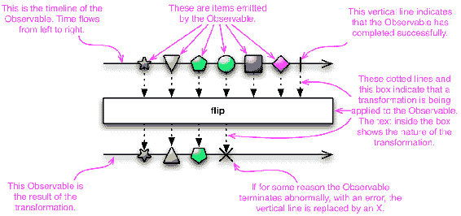
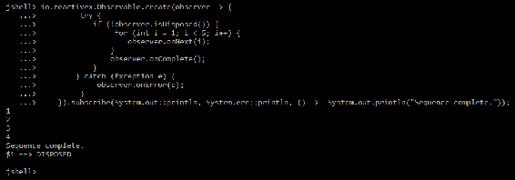
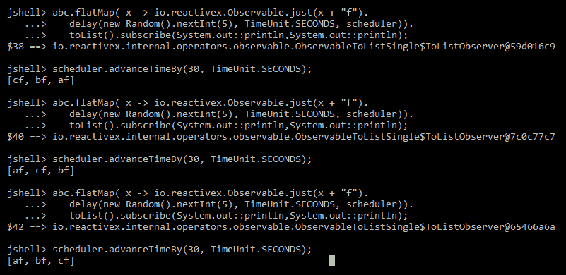
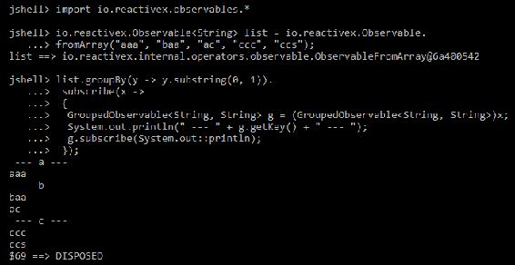
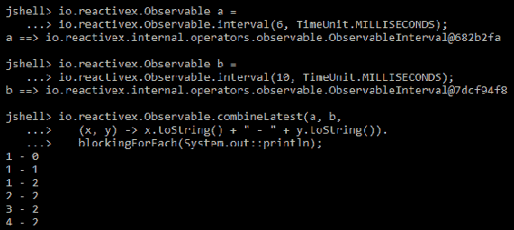
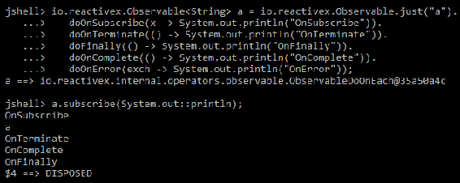
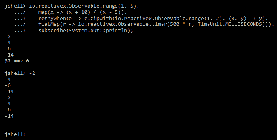

# 让我们得到反应

本章将描述反应性编程范例，为什么它适用于具有功能元素的语言。 读者将熟悉反应性编程后面的概念。 我们将介绍观察者模式和迭代器模式中使用的元素在创建反应应用程序时。 这些示例将利用反应框架和一个名为 **rxjava** （2.0 版）的 Java 实现。

我们将涵盖以下主题：

*   什么是反应性编程？
*   rxjava 介绍
*   安装 rxjava.
*   可观察，可流动，观察者和订阅
*   创建观察到
*   转换可观察品
*   过滤可观察到
*   组合可观察品
*   处理错误
*   调度员
*   主题
*   示例项目

# 什么是反应性编程？

根据*反应性宣言*（ [http://www.reacectivemanifesto.org/](http://www.reactivemanifesto.org/) ），反应系统具有以下属性：

*   **响应**：系统以及时和可预测的方式及时响应。
*   **弹性**：系统对故障有弹性，可以快速恢复它们。
*   **Elastic** ：系统通过增加或减少分配的资源来维持其在不同的工作负载下的响应能力。 这是通过动态查找和修复瓶颈来完成的。 这不与可扩展性混淆。 弹性系统需要根据需要可扩展 - 参见 [http://www.reacectivemanifesto.org/glossary 排版](http://www.reactivemanifesto.org/glossary#Elasticity)。
*   **消息驱动**：它们依赖于异步消息传递，可确保松散的耦合，隔离，位置透明度和容错。

需要是真实的。 如今，非响应系统被认为是错误的，并将被客户避免。 根据 [https://developers.google.com/search/mobile-sites/mobile-seo/](https://developers.google.com/search/mobile-sites/mobile-seo/)

*"responsive design is Google's recommended design pattern"*

反应性系统是通过使用元素构成复杂系统的架构风格，其中一些由反应性编程技术构建。

反应性编程是依赖异步数据流的范例。 它是一个事件驱动的异步编程子集。 相反，反应系统是消息驱动的，这意味着接收者通过前端已知，而对于事件，接收者可以是任何观察者。

无功编程不仅仅是基于事件的编程，因为它利用数据流动 - 它强调数据流而不是控制流程。 之前，鼠标或键盘事件（如服务器上的新套接字连接）等事件将在线程事件循环（执行线程）中处理等事件。 现在一切都可用于创建数据流; 想象一下，来自后端端点之一的 JSON 休息响应变为数据流，可以等待，过滤或与来自不同端点的一些其他响应合并。 这种方法通过删除开发人员明确创建处理多核和多 CPU 环境中的异步呼叫的所有样板代码来提供大量的灵活性。

反应性编程示例的最佳和最过度使用的例子之一是电子表格示例。 定义流（流量）类似于声明 Excel 的 C1 单元的值等于 B1 小区的内容以及 A1 单元格。 每当更新 A1 或 B1 细胞时，观察到并对变化进行反应，并且副作用是 C1 值更新。 现在想象一下，C2 至 CN 细胞等于 A2 的含量为加上 B2 至 BN; 相同的规则适用于所有规则。

使用以下一些编程抽象应用了反应性编程，其中一些采用了功能编程世界：

*   **期货/承诺**：这些提供了对在不久的将来提供的价值观上的手段。
*   **流**：这提供了数据流水线，就像一个火车轨道，它为火车运行的基础设施提供了运行。
*   **dataflow 变量**：这些是应用于流函数的输入变量的函数的结果，就像通过在两个给定的输入参数上应用加上数学函数来设置的电子表格单元格。
*   **限制**：该机制用于实时处理环境，包括诸如**数字信号处理器**（ **DSP** ）的硬件，以调节输入处理的速度 通过丢弃元件以赶上输入速度; 它被用作背压策略。
*   **推动机制**：这类似于好莱坞原则，因为它逆转呼叫方向。 一旦数据可用，将调用流程中的相关观察者进行数据处理; 相比之下，拉动机制以同步方式抓取信息。

有许多 Java 库和框架，允许程序员编写反应代码，例如 Reactor，Ratpack，Rxjava，Spring Framework 5 和 Vert.x. 随着 JDK 9 流 API 的添加，可以为开发人员提供无功编程，而无需安装额外的 API。

# rxjava 介绍

rxjava 是反应扩展的实现（通过使用从 Microsoft .Net World 的可观察序列编写基于异步和基于事件的程序的库）。 2012 年，Netflix 意识到他们需要一个范式转变，因为他们的架构无法应对他们庞大的客户群，因此他们决定通过将反应扩展到 JVM 世界的力量来实现反应; 这就是 rxjava 出生的。 除 Rxjava 之外还有其他 JVM 实现，例如 rxandroid，rxjavavafx，rxkotlin 和 rxscale。 这种方法给了他们所需的提升，并通过公开可用，它还为我们提供了使用它的机会。

RXJava jar 在 Apache 软件许可证版本中获得许可，版本 2.0，并在中央 Maven 存储库中提供。

有几个外部图书馆利用 rxjava：

*   `hystrix`：延迟和容错库旨在隔离对远程系统的访问点
*   `rxjava-http-tail`：http log-with 的库以与`tail -f`相同的方式可用
*   `rxjava-jdbc`：这将使用 rxjava 与 jdbc 连接到`ResultSets`流

# 安装 rxjava 框架

在本节中，我们将介绍从 Maven（Gradle，SBT，Ivy，葡萄，leinineen 或 Buildr 步骤类似）的 Rxjava 安装和 java 9's Repl Jshell 的用途。

# 胃安装

安装 rxjava 框架很容易。 jar 文件和依赖项目的反应流在 [http://central.maven.org/maven2/io/reactivex/rxjava2/rxjava/2.1.3/rxjava-2.1.3.jar](http://central.maven.org/maven2/io/reactivex/rxjava2/rxjava/2.1.3/rxjava-2.1.3.jar) 。

要使用它，请在`pom.xml`文件中包含此 Maven 依赖项：

```
<project  xmlns:xsi="http://www.w3.org/2001/XMLSchema-instance" xsi:schemaLocation="http://maven.apache.org/POM/4.0.0 http://maven.apache.org/xsd/maven-4.0.0.xsd">
  <modelVersion>4.0.0</modelVersion>
  <groupId>com.packt.java9</groupId>
  <artifactId>chapter6_client</artifactId>
  <version>0.0.1-SNAPSHOT</version>
  <properties>
    <maven.compiler.source>1.8</maven.compiler.source>
    <maven.compiler.target>1.8</maven.compiler.target>
  </properties>
  <dependencies>
    <!-- https://mvnrepository.com/artifact/io.reactivex.
    rxjava2/rxjava -->
    <dependency>
      <groupId>io.reactivex.rxjava2</groupId>
      <artifactId>rxjava</artifactId>
      <version>2.1.3</version>
    </dependency>
    <!-- https://mvnrepository.com/artifact/org.
    reactivestreams/reactive-streams -->
    <dependency>
      <groupId>org.reactivestreams</groupId>
      <artifactId>reactive-streams</artifactId>
      <version>1.0.1</version>
    </dependency>
  </dependencies>
</project>
```

在 Gradle，SBT，IVY，葡萄，leinineen 或 Buildr 安装中是相似的; 签出 [https://mvnrepository.com/artifact/io.reactivex.rxjava2/rxjava/2.1.3](https://mvnrepository.com/artifact/io.reactivex.rxjava2/rxjava/2.1.3) 有关需要添加到`configuration`文件中的信息。

# JShell 安装

我们将详细讨论 JShell 在[第 9 章](9.html)，*在 Java* 中，现在，让我们从 rxjava 的角度看看它。 通过将类路径设置为 rxjava 和反应流 jar 文件来完成 jshell 中的 rxjava 框架。 请注意，在 Windows 上使用 Colon 在 Windows 上的 Semi-Colon 作为文件路径分隔符：

```
"c:Program FilesJavajdk-9binjshell" --class-path D:Kitsrxjavarxjava-2.1.3.jar;D:Kitsrxjavareactive-streams-1.0.1.jar
```

屏幕上会显示以下错误：


前面的错误发生了，因为我们忘记导入相关的 Java 类。

以下代码处理此错误：


现在我们设法创建了我们的第一个可观察。 在以下部分中，我们将学习它的作用以及如何使用它。

# 可观察，可流动，观察者和订阅

在 Reactivex 中，观察者订阅可观察到的。 当可观察到的发射数据时，观察者通过消耗或转换数据来反应。 此模式有助于并发操作，因为它不需要阻止等待可观察到发出对象。 相反，它以观察者的形式创建一个哨兵，该哨兵在可用的形式的新数据可用时，可以随时适当地反应。 该模型被称为反应器图案。 从 [http://reactivex.io/img/operators/Legend.png](http://reactivex.io/img/operators/legend.png) 拍摄的下图，解释了观察到的流程：



反应性的可观察者类似于必要的迭代。 它解决了同样的问题，但策略是不同的。 可观察的作品通过推动更改，一旦可用，即可以同步方式拉动更改机制。 处理错误的方法也不同; 一个人使用错误回调，而另一个使用副作用，例如投掷异常。 下表显示了差异：

| 事件 | 迭代 | 可观察到的 |
| 获取数据 | `T next()` | `onNext(T)` |
| 错误 | `throw new Exception` | `onError(Exception)` |
| 完毕 | `Return` | `onCompleted()` |

通过使用订阅（`onNextAction`，`onErrorAction`，`onCompletedAction`）方法将观察者连接到可观察者。 观察者实现以下方法的一些子集（仅限`onNext`是强制性的）：

*   `onNext`：只要可观察到的发出项目并且该方法都将被可观察到的项目作为参数发出的项目
*   `onError`：调用这一点以指示它未能生成预期数据或遇到一些其他错误，并将异常/错误作为其参数。
*   `onCompleted`：当没有更多的数据发射时，调用这一点

从设计角度来看，反应性可观察到通过使用`onError`和`onCompleted`回调来增强四个观察者模式的协调。

有两种类型的反应性可观察结果：

*   **HOT** ：即使没有附加订阅者，也可以尽快发出。
*   **冷**：等待至少一个订户在开始发射数据之前附加，因此至少一个用户可以从头到子地看到序列。 它们被称为“可连接”观察到，Rxjava 具有启用此类可观察的运算符。

RXJava 2.0 推出了一种新型可观察，称为可流动。 新的`io.reactivex.Flowable`是一种支持背部压力的基础反应类，而可观察到的是不再是。 后压是用于应对当观察者发出更多数据可以处理的数据时的情况的一系列策略。

rxjava 可观察到的 rxjava 应该用于小组数据（最长的 1,000 个元素），以防止`OutOfMemoryError`或 GUI 事件，例如鼠标移动或触摸小频率（1,000 Hz 或更少） 。

在处理超过 10,000 元的元素时，将使用从磁盘读取（解析）文件的流动卷，这与背部压力均匀，通过 JDBC 读取数据库，或执行阻塞和/或基于拉动的数据读取。

# 创建观察到

以下运算符用于从划痕，从现有对象，其他数据结构阵列或序列或计时器创建可观察到。

# 创建运营商

可以通过调用以下`io.reactivex.Observable`方法（运算符）之一来完成从头开始创建可观察到：

*   创造
*   产生
*   unsfaceecre.

以下示例显示了如何从头开始构造可观察到的。 呼叫`onNext()`直到不编程观察者`onComplete()`和`onError()`，以便获得 1 到 4 个数字：



正如我们在上面的屏幕截图中看到的，输出正如预期的那样，范围为 1 到 4，并且序列被处理在使用之后。

# 推迟运营商

一旦观察者连接可以通过调用`defer`方法，为每个观察者创建一个新的可观察到。 以下代码显示了`defer`的用法，因为我们提供数字：


控制台打印线方法输出 123，即可观察包装的整数。

# 空的运营商

创建空，永不发送项目，可以通过调用`empty()`或`never() io.reactivex.Observable`方法来完成。

# 来自运营商

可以通过调用以下方法之一来完成从数组，期货或其他对象和数据结构的转换：

*   `fromArray`：将数组转换为可观察到的
*   `fromCallable`：转换可调用的可调用值到可观察到的值
*   `fromFuture`：将未来提供的值转换为可观察的值
*   `fromIterable`：将迭代转换为可观察到的
*   `fromPublisher`：将反应性发布者流转换为可观察到的
*   `just`：将给定对象转换为可观察到的

以下示例从字母列表中创建一个可观察到的（`abc`）：


通过`System.out.println`方法消耗和打印到控制台的`a`，`b`和`c`的整个阵列。

# 间隔运营商

通过使用`interval`方法，创建发出由特定时间间隔间隔开的整数序列的可观察者。 以下示例永远不会停止; 它每隔一秒连续打印勾号：

**** 

试图停止计时器不会有帮助（甚至不是 *ctrl* c *c *c* ，只需关闭窗口），它将继续每隔一秒打印到控制台的递增号码 按照指示。*

# 定时器运营商

可以通过使用定时器方法在给定延迟之后发出单个项目。

# 范围运营商

通过使用以下方法可以实现序号的范围​​：

*   `intervalRange`：信号信号一系列长值，首先在一些初始延迟和以下定期下降
*   `range`：在指定范围内发出一系列整数

# 重复运算符

要重复特定项目或特定序列使用：

*   `repeat`：重复给定可观察源发出的物品序列多次或永久（取决于输入）
*   `repeatUntil`：重复可观察源发出的项目序列，直到所提供的停止函数返回 true
*   `repeatWhen`：除了`onComplete`之外，将与初始可观察相同的值相同。

以下代码重复了`a`的给定值，直到满足条件：


它将`a`重复到控制台三次，直到`x`具有大于 2.作为练习的值 3，用`++x`更换`x++`并检查控制台。

# 转换可观察品

这些是转换可观察物发出的项目的操作员。

# 订阅运营商

这些是用户使用的方法，以从可观察到的，例如`onNext`，`onError`和`onCompleted`中消耗排放和通知。 用于订阅的可观察方法是：

*   `blockingForEach`：消耗该可观察到的每个物品和块，直到可观察到的完成。
*   `blockingSubscribe`：订阅可观察到的，消耗当前线程的事件。
*   `forEachWhile`：订阅可观察到的，为每个元素接收通知，直到`onNext`谓词返回 false。
*   `forEach`：订阅可观察到的，接收每个元素的通知。
*   `subscribe`：订阅给定观察者的观察者。 观察者可以作为回调，观察者实现或抽象`io.reactivex.subscribers.DefaultSubscriber<T>`类的子类型给出。

# 缓冲运营商

`buffer`方法用于创建给定大小的捆绑包，然后将其包装为列表。 以下代码显示了 10 个数字，我们创建了两个捆绑包，一个六个，另一个剩余的四个项目：


# Flatmap 运营商

通过到达订单（`flatMap`）将给定可观察到的单个可观察者转换为单个可观察，保持最后的发射（`switchMap`），或通过保留原始顺序（`concatMap`）可以通过使用以下操作符之一来完成 ：`concatMap`，`concatMapDelayError`，`concatMapEager`，`concatMapEagerDelayError`，`concatMapIterable`，`flatMap`，`flatMapIterable`，`switchMap`或`switchMapDelayError`。 以下示例显示了如何随机选择可观察到的顺序，输出变化的内容。 （`flatMap`，`concatMap`和`switchMap`）：


`concatMap`实现是将`c`字符串附加到给定的`a`，`b`和`c`字符串中的每一个，因此，输出是`ac`，`bc`和`cc`。

`flatMap`实现将`f`字符串附加到给定`a`，`b`和`c`字符串中的每一个，如下所示：



由于随机延迟，顺序与预期的`af`，`bf`和`cf`不同; 运行几次将输出预期的订单。

以下代码段显示出不同的输出。


`switchMap`实现是将`s`字符串附加到给定`a`，`b`和`c`字符串列表的最后一个元素。

注意`advanceTimeBy`的用法。 如果没有此通话，由于排放延迟，因此无法打印任何内容。

# Groupby 运营商

`groupBy`用于将可观察到的观察到分割成一组可观察到，每个可观察可观察到不同的项目。 以下代码组由起始字母字符串，然后打印特定密钥的键和组数据。 请注意，该组是可观察到的，可用于构造其他数据流。

以下输出显示第一个字母作为组的组，也显示了组密钥，这是第一个字母：



# 地图运营商

可以实现对变换可观察到可观察到的每个项目的功能：

*   `cast`：将结果投递给给定类型
*   `map`：将指定的函数应用于发出的每个项目

# 扫描操作员

使用累积的变换可以使用`scan`方法来完成。 以下代码通过发出当前元素和：


# 窗户运营商

`window`方法用于定期将可观察到的窗口中的可观察到的项目和突发发出这些窗口。 以下代码显示，使用一个元素的窗口无效，同时一次使用三个元素输出它们的总和：


# 过滤可观察到

这些是根据给定条件/约束选择性地从给定可观察的项目发出项目的操作员。

# 去诉诉委员会

只有在使用特定时间纪念品后发出可以使用这些方法完成：

*   `debounce`：镜像初始可观察到，除了它丢弃由源之后的源发出的物品在一段时间内
*   `throttleWithTimeout`：仅排放在指定时间窗口中的其他发出项目的那些项目

在以下示例中，我们将在我们的去诉时次数之前删除被解雇的物品; 在我们的情况下，它只是终止的终止价值。 再次，通过使用测试调度程序，我们推进时间：


# 独特的运营商

这可以使用以下方法删除可观察到的不同项目：

*   `distinct`：仅发出不同的元素
*   `distinctUntilChanged`：只排出与他们的直系统前身不同的元素

在以下代码中，我们将看到如何使用`distinct`方法以从给定顺序删除重复项：


我们可以看到复制`aaa`字符串已从输出中删除。

# 元素运营商

要通过索引获取元素，请使用`elementAt`方法。 以下代码在列表中打印第三个元素：


# 过滤器运营商

使用以下方法允许仅从通过测试（谓词/型测试）的可观察到可观察项目的这些项目：

*   `filter`：仅发出满足指定谓词的元素
*   `ofType`：仅发出指定类型的那些元素

以下代码显示了`filter`方法的使用，用于过滤 OUT OUTER OUT OUTENT NOT OR LETTER `a`：

**** 

# 第一个/最后一次运营商

这些方法用于基于给定条件返回项目的第一和最后一次发生。 还有阻塞版本也可用。 可用的`io.reactivex.Observable methods`是：

*   `blockingFirst`：返回可观察到的第一个项目
*   `blockingSingle`：返回可观察到的第一个`Single`项目
*   `first`：返回可观察到的第一个项目
*   `firstElement`：返回仅发出第一项的`Maybe`
*   `single`：返回仅发出第一项的`Single`
*   `singleElement`：返回一个`Maybe`，只发出第一单个
*   `blockingLast`：返回可观察到的最后一个项目
*   `last`：返回可观察到的最后一个项目
*   `lastElement`：返回一个`Maybe`，只发出最后一个单曲

# 示例运营商

使用此运算符以发出特定项（由采样时间段或节气门持续时间指定）。 `io.reactivex.Observable`提供以下方法：

*   `sample`：发出在给定时间段内发出的最近发出的项目（如果有的话）
*   `throttleFirst`：仅发出在给定的连续时间窗口期间发出的第一个项目
*   `throttleLast`：仅发出在给定的连续时间窗口期间发出的最后一项

# 跳过运营商

从输出可观察到的输出中删除第一个和最后一个*元素。 以下代码显示了如何从给定输入跳过前三个元素：*


调用`skipLast`方法仅输出 1 和 2。

# 采取运营商

这仅发出来自给定可观察到的第一和最后一个*元素。 以下示例显示了如何仅从可观察数字范围内使用前三个元素：*


使用具有相同参数的`takeLast`方法将输出 3,4 和 5。

# 组合可观察品

这些是用于组合多个可观察到的操作符。

# 联合运营商

通过调用其中一种方法，通过两个或多个可观察到的最新发出的值组合：

*   `combineLatest`：发出聚合每个源的最新值的项目
*   `withLatestFrom`：将可观察到的可观察到当前实例合并

以下示例（永久运行）显示了将两个间隔观察的结果与不同的时间表组合 - 首先发出每 6 毫秒，另一个 10 ms：

**** 

通过按 *Ctrl* C *C* 需要停止执行前述代码，因为它创建无限列表。 输出正如预期的那样，它包含基于创建时间戳的两个序列的组合值。

# 加入运营商

可以通过调用以下方法之一来完成基于给定窗口的两个可观察到：

*   `join`：基于使用聚合函数的重叠持续时间加入两个可观察到发出的项目
*   `groupJoin`：将两个可观察到发出的项目基于使用聚合函数的重叠持续时间连接到组中

以下示例使用连接组合两个可观察到，每 100 毫秒一次发射，另一个 160 毫秒，并从第一个每 55 毫秒拍摄值，从第二毫秒开始，每 85 毫秒


前面的代码永远执行，需要手动停止。

# 合并运营商

将多个可观察者合并为单个可观察到的，所有给定排放的所有排放都可以通过呼叫来实现：

*   `merge`：将许多输入源达到一个可观察到的，没有任何转换
*   `mergeArray`：达到作为一个可观察到的阵列给出的许多输入源，没有任何转换
*   `mergeArrayDelayError`：将许多输入源变平到一个可观察到的阵列中，没有任何转换，而不被错误中断
*   `mergeDelayError`：将许多输入源达到一个可观察到的，没有任何转换，而不被错误中断
*   `mergeWith`：将此和给定的源达到一个可观察到的，没有任何转换

在以下示例中，我们将以它包含所有条目的方式合并原始 1 到 5 个范围的部分，但是以不同的顺序：


# 邮政运营商

将多个可观察结果组合成基于组合器功能的单个可观察到，可以通过呼叫来完成：

*   `zip`：发出应用于给定可观察到发出的多个项目的组合的指定组合器功能的结果
*   `zipIterable`：发出应用于给定可观察到可迭代的多个项目的组合的指定组合器功能的结果
*   `zipWith`：发出应用于该组合和给定可观察到的指定组合器功能的结果

以下代码示出了如何基于字符串级联组合器将`zip`应用于从 1 到 5 到 16（更多元素）的范围内的元素。 请注意，额外的排放（16 号）未申请，因为没有适用于：


# 误差处理

该观察到包含几个操作员，允许错误处理，吞咽异常，转换异常，呼叫 - 最终块，即使发生错误，即使发生错误也是即使发生的情况也是如此。

# 捕获运营商

这些运算符通过继续顺序启用从错误恢复：

*   `onErrorResumeNext`：指示可观察到的控制到供应商给出的另一个可观察者，而不是在出现问题时调用`onError`
*   `onErrorReturn`：指示可观察到的函数发出默认，在错误的情况下
*   `onErrorReturnItem`：指示可观察到的默认值，以防错误
*   `onExceptionResumeNext`：指示可观察到的控制到另一个可观察到的，而不是调用`onError`，以防出现问题

以下示例显示了如何使用`onErrorReturnItem`方法; 在没有`flatMap`的情况下调用它会在最后停止流量和输出`Default`。 通过推迟对外抛出代码并在其中应用`onErrorReturnItem`，我们可以继续序列并使用默认提供的值：


# 做操作员

这些用于注册采取的动作以取决于特定的生命周期事件。 我们可以使用它们来模仿最终的语句行为，释放资源，分配上游，做性能测量，或者做其他不依赖于当前呼叫成功的任务。 rxjava 可观察到通过提供以下方法来实现此操作：

*   `doFinally`：当当前可观察到的调用`onComplete`或`onError`或被设置时，寄存要调用的动作
*   `doAfterTerminate`：在当前可观察到的调用`onComplete`或`onError`后注册要调用的动作
*   `doOnDispose`：在序列设置时寄存要调用的动作
*   `doOnLifecycle`：根据序列的生命周期事件注册适当的`onXXX`方法的回调（订阅，取消，请求）
*   `doOnTerminate`：当当前可观察到的调用`onComplete`或`onError`时，注册要调用的动作

以下代码段显示前面提到的命令的用法：



在前面的示例中，我们可以看到生命周期事件顺序是：订阅，终止，填写或错误，最后通过对每个事件注册打印来控制控制台操作。

# 使用操作员

使用操作员在 Java 中具有一个名为 Try-with 的 Java 的对应物。 它基本上是相同的，使得能够在给定时间（当可观察到的释放时）产生的一次性资源。 rxjava 2.0 方法`using`实现此行为。

# 重试运营商

这些是在可恢复的故障的情况下使用的操作员，例如暂时关闭的服务。 他们通过重新提交的工作，希望这次没有错误。 可用的 rxjava 方法如下：

*   `retry`：在它成功之前重放相同的流动，直到它成功
*   `retryUntil`：重试，直到给定的停止函数返回 true
*   `retryWhen`：在错误的情况下重放相同的流程，直到它基于接收错误/异常的重试逻辑函数成功

在以下示例中，我们使用`zip`，它仅包含两个值来创建重试逻辑，以在时间段或 500 乘以重试计数后重试两次运行失败序列。 连接到无响应 Web 服务时，可以使用此方法，尤其是每个重试消耗设备电池的移动设备：



# 调度员

观察到在线程调度方面是不可知论的 - 在多线程环境中，这是调度程序的作业。 一些运算符呈现可以将调度程序作为参数呈现的变体。 有特定的呼叫允许从下游观察流程（使用操作员的点，这是`observeOn`的情况）或无论呼叫位置如何（呼叫位置无关紧要，就像这样的情况 `subscribeOn`方法）。 在以下示例中，我们将从上游和下游打印当前线程。 请注意，在`subscribeOn`的情况下，线程始终相同：


注意`map`方法的主题主要用法：


请注意，从`map`方法中不再使用线程。

RXJava 2.0 提供更多从`io.reactivex.schedulers.Schedulers`工厂提供的调度员，每一个服务于特定目的：

*   `computation()`：返回用于计算工作的`Scheduler`实例
*   `io()`：返回用于 I / O 工作的`Scheduler`实例
*   `single()`：返回一个`Scheduler`实例，以便在同一背景线程上需要强烈连续执行的工作
*   `trampoline()`：返回一个`Scheduler`实例，以在其中一个参与线程上以 fifo 方式执行给定的工作
*   `newThread()`：返回一个`Scheduler`实例，为每个工作单位创建一个新线程
*   `from(Executor executor)`：将`Executor`转换为新的`Scheduler`实例，并将工作委托给它

仅用于特殊测试目的的`Scheduler`，称为`io.reactivex.schedulers.TestScheduler`。 我们已经使用它已经使用它，因为它允许手动推进虚拟时间，从而使其完美地适用于测试流量，而无需等待通过时间（例如，单元测试）。

# 主题

受试者是可观察和用户混合动力，因为它们都接收和发出事件。 RXJava 2.0 有五个主题：

*   `AsyncSubject`：仅发出源可观察的最后值，然后完成完成
*   `BehaviorSubject`：发出最新的发射值，然后发出源可观察的任何值
*   `PublishSubject`：仅向订户发出用户在订阅时间后由源发出的项目
*   `ReplaySubject`：发出任何订户，即使没有订阅，也是源所发出的所有项目
*   `UnicastSubject`：只允许单个订阅者在其寿命期间订阅它

# 示例项目

在以下示例中，我们将在从多个传感器接收的温度的实时处理中显示 RXJava 的用法。 通过弹簧引导服务器提供（随机生成）传感器数据。 服务器配置为接受传感器名称作为配置，以便我们可以为每个实例更改它。 如果其中一个传感器输出超过 80 摄氏度，我们将在客户端开始五个实例并显示警告。

使用以下命令从 Bash 轻松完成启动多个传感器：


服务器端代码很简单，我们只有一个休息控制器，被配置为将传感器数据输出为 JSON，如以下代码所示：

```
@RestController
publicclass SensorController 
{
  @Value("${sensor.name}")
  private String sensorName;
  @RequestMapping(value="/sensor", method=RequestMethod.GET,   
  produces=MediaType.APPLICATION_JSON_VALUE)
  public ResponseEntity<SensorData> sensor() throws Exception 
  {
    SensorData data = new SensorData(sensorName);
    HttpHeaders headers = new HttpHeaders();
    headers.set(HttpHeaders.CONTENT_LENGTH, String.valueOf(new     
    ObjectMapper().writeValueAsString(data).length()));
    returnnew ResponseEntity<SensorData>(data, headers,     
    HttpStatus.CREATED);
  }
}
```

传感器数据在`SensorData`构造函数中是随机生成的（注意 LOMBOCK 库的使用以摆脱 Setter / Getter 代码）：

```
@Data
publicclass SensorData 
{
  @JsonProperty
  Double humidity;
  @JsonProperty
  Double temperature;
  @JsonProperty
  String sensorName;
  public SensorData(String sensorName) 
  {
    this.sensorName = sensorName;
    humidity = Double.valueOf(20 + 80 * Math.random());
    temperature = Double.valueOf(80 + 20 * Math.random()); 
  }
}
```

现在我们已启动我们的服务器，我们可以从启用 rxjava 的客户端连接到它。

客户端代码使用 rxapache-http 库：

```
publicclass Main 
{
  @JsonIgnoreProperties(ignoreUnknown = true)
  staticclass SensorTemperature 
  {
    Double temperature;
    String sensorName;
    public Double getTemperature() 
    {
      return temperature;
    }
    publicvoid setTemperature(Double temperature) 
    {
      this.temperature = temperature;
    }
    public String getSensorName() 
    {
      return sensorName;
    }
    publicvoid setSensorName(String sensorName) 
    {
      this.sensorName = sensorName;
    }
    @Override
    public String toString() 
    {
      return sensorName + " temperature=" + temperature;
    }
  }  
}
```

`SensorTemperature`是我们的客户数据。 它是服务器可以提供的快照。 Jackson Data Binder 忽略了其余信息：

```
publicstaticvoid main(String[] args) throws Exception 
{
  final RequestConfig requestConfig = RequestConfig.custom()
  .setSocketTimeout(3000)
  .setConnectTimeout(500).build();
  final CloseableHttpAsyncClient httpClient = HttpAsyncClients.custom()
  .setDefaultRequestConfig(requestConfig)
  .setMaxConnPerRoute(20)
  .setMaxConnTotal(50)
  .build();
  httpClient.start();
```

在前面的代码中，我们通过设置 TCP / IP 超时和允许的连接数来设置并启动 HTTP 客户端：

```
Observable.range(1, 5).map(x ->
Try.withCatch(() -> new URI("http", null, "127.0.0.1", 8080 + x, "/sensor", null, null), URISyntaxException.class).orElse(null))
.flatMap(address -> ObservableHttp.createRequest(HttpAsyncMethods.createGet(address), httpClient)
.toObservable())
.flatMap(response -> response.getContent().map(bytes -> new String(bytes)))
.onErrorReturn(error -> "{"temperature":0,"sensorName":""}")
.map(json ->
Try.withCatch(() -> new ObjectMapper().readValue(json, SensorTemperature.class), Exception.class)
.orElse(new SensorTemperature()))
.repeatWhen(observable -> observable.delay(500, TimeUnit.MILLISECONDS))
.subscribeOn(Schedulers.io())
.subscribe(x -> {
if (x.getTemperature() > 90) {
System.out.println("Temperature warning for " + x.getSensorName());
} else {
System.out.println(x.toString());
}
}, Throwable::printStackTrace);
}
}
```

前面的代码基于范围创建一个 URL 列表，将其转换为响应列表，将响应字节达到响应到字符串，将字符串转换为 JSON，并将结果打印到控制台。 在温度大于 90 的情况下，它将打印警告消息。 它通过在 I / O 调度程序中运行，重复每 500 毫秒重复一次，并且在错误的情况下，它会返回默认值。 请注意尝试 Monad 的使用，因为兰姆达代码抛出了检查的异常，需要通过转换为未选中的表达式来处理，该表达式可以通过`onError`中的 rxjava 或在 lambda 块中本地处理它。

由于客户端旋转，部分输出如下：

```
NuclearCell2 temperature=83.92902289170053
Temperature warning for NuclearCell1
Temperature warning for NuclearCell3
Temperature warning for NuclearCell4
NuclearCell5 temperature=84.23921169948811
Temperature warning for NuclearCell1
NuclearCell2 temperature=83.16267124851476
Temperature warning for NuclearCell3
NuclearCell4 temperature=81.34379085987851
Temperature warning for NuclearCell5
NuclearCell2 temperature=88.4133065761349
```

# 概括

在本章中，我们了解了反应性编程，然后专注于可用的最常用的反应库之一 - rxjava。 我们了解了反应性编程抽象及其在 rxjava 的实现。 通过了解观察，调度员和订阅如何工作，最常用的方法以及它们如何使用，我们通过具体示例使 RXJava World 的第一步与具体示例进行了具体的例子。

在下一章中，我们将了解最常用的无功编程模式以及如何在我们的代码中应用它们。