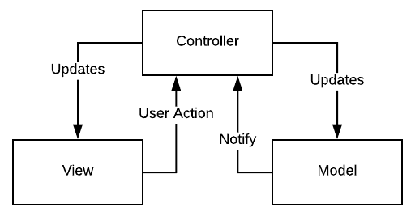
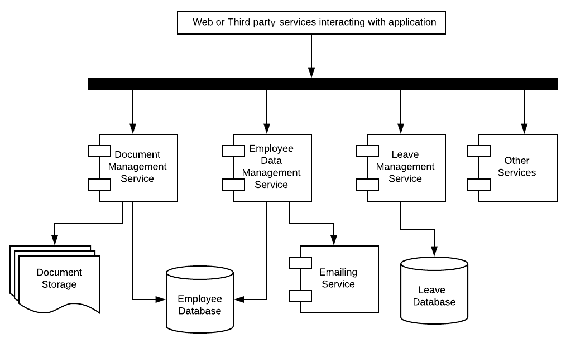
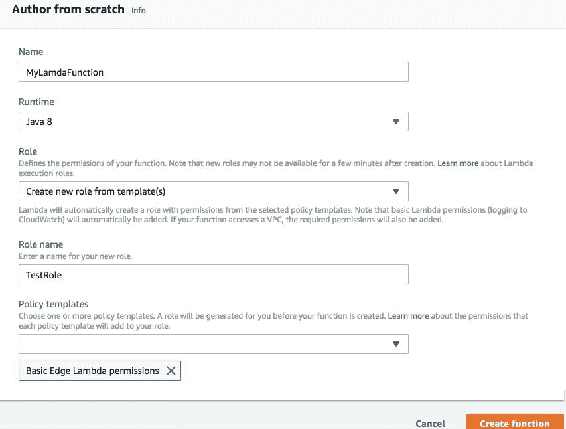
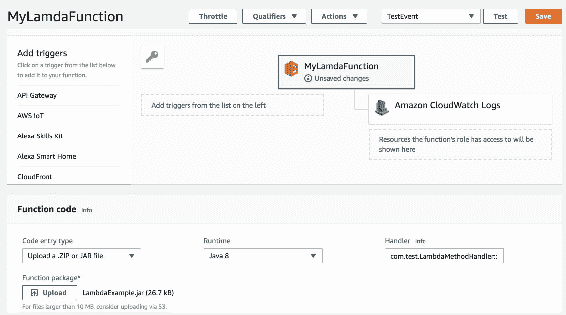
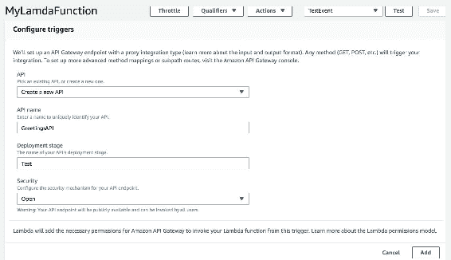

# 应用架构的趋势

每当我们开始在应用程序上工作时，我们需要决定的第一件事就是我们要使用的设计或架构。 由于软件行业在过去几十年中成熟，我们曾经设计过系统的方式也发生了变化。 在本章中，我们将讨论我们最近看到的一些重要建筑趋势，并且仍然与日期相关。 我们将尝试分析这些架构模式的好坏，丑陋，并弄清楚哪种模式将能够解决什么类型的问题。 我们将在本章中介绍以下主题：

*   什么是应用架构？
*   分层架构
*   模型视图控制器架构
*   面向服务的架构
*   基于微服务的架构
*   无服务器架构

# 什么是应用架构？

当我们开始构建应用程序时，我们有一系列要求，我们试图设计一个我们认为将满足所有要求的解决方案。 该设计称为**应用架构**。 需要考虑的一个重要因素是，您的架构不仅应当照顾当前的要求，但也应该预测预期的未来变化，并考虑到它们。 通常，有一些未指明的要求，称为**非功能性要求**，您需要照顾。 将作为要求文件的一部分给出功能要求，但建筑师或高级开发人员预计将弄清楚非功能性要求。 性能需求，可扩展性需求，安全要求，可维护性，且应用可用性等，是在架构解决方案时需要考虑的一些重要的非功能要求。

使应用程序架构技巧既有有趣和具有挑战性的事实就是没有固定规则集。 为一个应用程序工作的架构或设计可能不适用于另一个应用程序; 例如，银行解决方案架构可能看起来与电子商务解决方案架构不同。 此外，在一个解决方案中，不同的组件可能需要遵循不同的设计方法。 例如，您可能希望其中一个组件来支持基于 HTTP-REST 的通信，而对于另一个组件，您可以访问消息队列进行通信。 这个想法是确定当前问题的最佳方法。

在以下部分中，我们将讨论 Jee 应用程序中的一些最常见和有效的架构风格。

# 分层架构

我们尝试将代码和实现划分为不同的图层，每层都会有固定责任。 没有固定的一组分层，可以应用于所有项目，因此您可能需要考虑在手中为项目工作的类型。

下图显示了一个常见的分层体系结构，当思考典型的 Web 应用程序时，这可能是一个很好的起点：


该设计具有以下图层：

*   介绍层
*   控制器/ Web 服务层
*   服务层
*   商业层
*   数据访问层

**表示层**是保存您的 UI 的图层，即 HTML / JavaScript / JSP 等。 这是最终用户可以直接与之交互的图层。

**控制器/ Web 服务层**是来自第三方的请求的入口点。 此请求可以来自演示层（主要是）或从另一个服务; 例如，移动或桌面应用程序。 由于这是任何请求的入口点，因此此图层将适用于任何初始级别检查，数据清理，验证，安全要求，如身份验证和授权，等等。 一旦满足该层，请求被接受并处理。

**服务层**，也称为**应用** **，负责提供不同的服务，例如添加记录，发送电子邮件，下载文件，生成 报告，等等。 在一个小规模的应用程序中，我们可以使用 Web 服务层合并服务层，尤其是当我们知道服务层只处理来自 Web 的请求时。 如果可以从其他服务调用当前服务，最好保持与 Web 服务或控制器分开的服务。**

**业务层**持有所有与业务相关的逻辑。 例如，在员工数据管理服务中，如果系统试图将员工推广为经理，则该图层有责任应用所有的业务检查，包括员工是否具有相关的经验，无论它们是否已经服用 一位副经理，是去年的评估评级与所需规则等等。 有时，如果有问题的应用程序或服务没有强烈的业务规则，则业务层与应用程序层合并。 另一方面，如果您的申请要求强大执行业务规则，您可能希望将业务层划分为子层。 同样，在实现分层设计时，您需要遵循的固定指南，并且实现可以根据应用程序或服务需求进行更改。

**数据访问层**是负责管理所有数据相关操作的层，例如获取数据，以所需的格式表示数据，清洁数据，存储数据，更新数据等。 在创建此图层时，我们可以使用**对象关系映射**（ **orm** ）框架或创建自己的处理程序。 这里的想法是让其他层无担心数据处理，即如何存储数据。 它来自另一个第三方服务还是在本地存放？ 这些和类似的担忧是该层的责任。

**交叉切割问题**是每层需要处理的担忧; 例如，每个层都负责检查请求是否来自适当的频道，并且没有提供未经授权的请求。 每层可能希望通过记录每条消息来记录请求的条目和退出。 这些问题可以通过在层上使用和扩散的常用实用程序来处理，或者可以独立地处理每个层。 通过诸如**面向方面的编程**（ **AOP** ），通常是一个好主意，使这些问题保持独立于核心业务或应用程序逻辑。

# 分层架构与一个例子

要进一步了解分层体系结构风格，让我们来看看代码和设计示例。 让我们来到一个非常简单的要求，我们需要从数据库中获取员工列表。

首先，让我们尝试通过查看该图来可视化图层的要求：


在这种情况下，我们创建了四层。 演示层可以被认为是具有 JavaScript 的简单 HTML。 您可能想要使用复杂的框架，如 Reactjs 或 AngularJS，以保持在演示层中组织的东西，但在此示例中，我们有一个简单的演示层，例如，在单击“显示员工列表”按钮时，AJAX 调用是 对控制器层进行，并获取员工数据。

这是一个简单的 JavaScript 函数，可以为员工获取数据，并在 UI 上显示它：

```
function getEmployeeData() 
{
  var xhttp = new XMLHttpRequest();
  xhttp.onreadystatechange = function() 
  {
    if (this.readyState == 4 && this.status == 200) 
    {
      document.getElementById("demo").innerHTML = this.responseText;
    }
  };
  xhttp.open("GET", "/LayeredEmployeeExample/service/employees/", true);
  xhttp.send();
}
```

您可以看到表示层不知道下一层的实现; 所有它都知道是应该提供所需数据的 API。

接下来，我们移动到 Web 服务或控制器层。 此图层的责任是确保请求以适当的格式和正确的来源。 Java 中有许多框架，例如 Spring Security 和 Java Web 令牌，帮助我们实现每个请求的授权和身份验证。 此外，我们可以为此目的创建拦截器。 为了保持本章简单，我们将专注于核心功能，即从下一个图层获取数据并将其返回给呼叫函数。 看看这段代码：

```
/**
* This method returns List of all the employees in the system.
*
* @return Employee List
* @throws ServletException
* @throws IOException
*/
@RequestMapping(method = RequestMethod.GET, value = "/")
public List<Employee> EmployeeListService() throws ServletException, IOException 
{
  List<Employee> empList = new ArrayList<Employee>();
  // Let's call Employee service which will return employee list
  EmployeeService empService = new EmployeeService();
  empList = empService.getEmployeeList();
  return empList;
}
```

再次，我们可以看到当前层不知道谁在调用它并且不知道下一层的实现。

同样，我们有一个服务层：

```
/**
* This methods returns list of Employees
* @return EmployeeList
*/
public List<Employee> getEmployeeList()
{
  // This method calls EmployeeDAL and gets employee List
  EmployeeDAL empDAL = new EmployeeDAL();
  return empDAL.getEmployeeList();
}
```

为了这个例子，我们嘲笑这一层很简单。 您可以问，为什么我们需要一个额外的层，而不是从控制器本身调用**数据访问层**（ **dal** ）吗？ 如果您确定获取员工数据是通过控制器的唯一方法，可以完成这一点。 但是我们建议使用服务层，因为有些其他服务需要调用我们的服务时，我们将不需要重复业务或 DAL 调用。

如果您仔细观察，我们跳过了业务层。 这个想法是，你不需要只有所有的层。 同时，您可以根据手中的要求将图层分成多层或引入新图层。 在这种情况下，我们没有实施任何业务规则，因此我们省略了该图层。 另一方面，如果我们想要实现一些业务规则，例如一些员工记录应该隐藏在某些特定角色，或者在向最终用户显示之前应该修改，我们将实现一个业务层。

让我们继续前进到我们的最后一层 - 数据访问层。 在我们的示例中，我们的 DAL 负责获取数据并返回调用层。 看看这段代码：

```
/**
* This methods fetches employee list and returns to the caller.
* @return EmployeeList
*/
public List<Employee> getEmployeeList()
{
  List<Employee> empList = new ArrayList<Employee>();
  // One will need to create a DB connection and fetch Employees
  // Or we can use ORM like hibernate or frameworks like mybatis
  ...
  return empList;
}
```

# 层与层数

在现实世界中，我们看到 *tier* 和*层*互换使用。 例如，您必须听到术语*呈现*或*呈现层*，参考相同的代码集。 虽然在提及一组代码时易于互换术语时，您需要了解当我们基于物理部署要求的分割代码时使用术语 *Tier* ，并且图层更关注 逻辑隔离。

# 分层架构保证是什么？

分层架构保证我们以下内容：

*   **代码组织**：分层体系结构可帮助我们以独立实现每个代码层的方式实现代码。 代码更可读; 例如，如果您想查看从数据库访问特定数据，可以直接查看 DAL 并忽略其他层。
*   **易于开发**：由于代码以不同的图层实现，我们可以以类似的方式组织我们的团队，其中一个团队正在在演示层上工作，另一个团队在 DAL 上工作。

# 分层架构有哪些挑战？

分层架构的挑战如下：

*   **部署**：由于代码仍然是紧密耦合的，我们无法保证我们可以彼此独立地部署每个图层。 我们仍然最终可以完成单片部署。
*   **可伸缩性**：因为我们仍然将整个应用程序视为单片部署，我们无法互相缩放组件。

# 模型视图控制器架构

组织代码的另一个广泛使用的标准是通过遵循**模型视图控制器**（ **MVC** ）架构设计模式。 顾名思义，我们正在考虑将我们的应用组织成三部分，即模型，视图和控制器。 以下 MVC 帮助我们保持关注的分离，并允许我们更好地组织我们的代码。 看看以下内容：

*   **型号**：模型是数据的表示。 数据是任何应用程序的关键部分。 模型层有责任组织和实现逻辑以正确管理和修改数据。 在修改某些数据时，它需要需要发生的任何事件。 简而言之，该模型具有核心业务实施。
*   **查看**：任何应用程序的另一个重要部分是视图，即最终用户交互的部分。 该视图负责将信息显示为最终用户并从用户获取输入。 此图层需要确保最终用户能够获得预期功能。
*   **控制器**：顾名思义，控制器控制流程。 当视图中发生某些动作时，它将让控制器知道，这反过来将召集呼叫来确定此动作是否会影响模型或视图。

由于 MVC 是一种旧的模式，由架构师和开发人员以不同的方式解释和使用，您可以找到可用 MVC 模式的不同实现。 我们将以非常简化的实现方式开始，然后移动到特定于 Java 的实现。

下图给了我们对 MVC 流的基本了解：


正如我们所看到的，最终用户在操作方面与控制器进行交互，例如表单提交或单击按钮。 该控制器采用此请求并更新模型中的数据。 最后，View 组件基于模型上发生的操作来获取更新。 更新的视图是为用户呈现和执行进一步操作的更新视图。

如上所述，MVC 是旧模式，其初始使用桌面和静态应用程序。 这些模式已被许多 Web 框架解释并以不同方式实现。 在 Java 中，也有许多提供 Web MVC 实现的框架。 Spring MVC 是最常用的框架之一，所以值得一看一下。

下图解释了在高级春季 MVC 中的控制流程：


让我们仔细看看流程：

*   **1** ：Spring MVC 遵循前控制器模式，这意味着所有请求最初都必须流过单点，在这种情况下，Dispatcher Servlet
*   **2** ：前面控制器然后将请求委托给控制器，该控制器旨在处理特定请求
*   **3** ：然后控制器根据给定的请求操纵或更新模型，并返回最终用户请求的模型
*   **4** ：该框架然后选择要处理当前请求的视图并将模型传递给它
*   **5** ：View，一般 JSP，基于提供的模型呈现数据
*   **6** ：最终响应，通常是 HTML，被发送回调用代理或浏览器

# MVC 架构与示例

为了进一步澄清事物，让我们来看看样本实现。 首先，我们将添加以下内容`web.xml`：

```
<servlet>
  <servlet-name>springmvc</servlet-name>
  <servlet-class>org.springframework.web.servlet.
  DispatcherServlet</servlet-class>
  <init-param>
    <param-name>contextClass</param-name>
    <param-value>org.springframework.web.context.support.
    AnnotationConfigWebApplicationContext</param-value>
  </init-param>
  <init-param>
    <param-name>contextConfigLocation</param-name>
    <param-value>com.employee.config.EmployeeConfig</param-value>
  </init-param>
  <load-on-startup>1</load-on-startup>
</servlet>
<servlet-mapping>
  <servlet-name>springmvc</servlet-name>
  <url-pattern>/mvc/*</url-pattern>
</servlet-mapping>
```

我们已经告诉我们的`web.xml`，所有与`/mvc/`模式的请求应重定向到我们的前控制器，即 Spring MVC 的`DispatcherServlet`。 我们还提到了配置类文件的位置。 这是我们的配置文件：

```
@EnableWebMvc
@Configuration
@ComponentScan(basePackages = "com.employee.*")
/**
* The main Configuration class file.
*/
public class EmployeeConfig 
{
  @Bean
  /**
  * Configuration for view resolver
  */
  public ViewResolver viewResolver() 
  {
    InternalResourceViewResolver viewResolver = new 
    InternalResourceViewResolver();
    viewResolver.setViewClass(JstlView.class);
    viewResolver.setPrefix("/WEB-INF/pages/");
    viewResolver.setSuffix(".jsp");
    return viewResolver;
  }
}
```

我们已经告诉我们的应用程序，我们将使用 WebMVC 框架以及我们组件的位置。 此外，我们通过视图解析器让应用程序知道我们的视图的位置和格式。

这是一个示例控制器类：

```
@Controller
@RequestMapping("/employees")
/**
* This class implements controller for Employee Entity
*/
public class EmployeeController 
{
  /**
  * This method returns view to display all the employees in the system.
  *
  * @return Employee List
  * @throws ServletException
  * @throws IOException
  */
  @RequestMapping(method = RequestMethod.GET, value = "/")
  public ModelAndView getEmployeeList(ModelAndView modelView) throws 
  ServletException, IOException 
  {
    List<Employee> empList = new ArrayList<Employee>();
    EmployeeDAL empDAL = new EmployeeDAL();
    empList = empDAL.getEmployeeList();
    modelView.addObject("employeeList", empList);
    modelView.setViewName("employees");
    return modelView;
  }
}
```

我们可以看到该控制器以模型的形式获取数据，并允许应用程序知道适当的视图以响应当前请求。 返回`ModelAndView`对象，该对象具有有关视图和模型的信息。

控制器传递给视图，在这种情况下是员工.jsp：

```
<%@ page language="java" contentType="text/html; charset=UTF-8" pageEncoding="UTF-8" %>
<!DOCTYPE html PUBLIC "-//W3C//DTD HTML 4.01 Transitional//EN" "http://www.w3.org/TR/html4/loose.dtd">
<html>
  <head>
    <meta http-equiv="Content-Type" content= text/html; charset=UTF-8">
    <title>Welcome to Spring</title>
    <%@ taglib uri="http://java.sun.com/jsp/jstl/core" prefix="c" %>
  </head>
  <body>
    <table>
      <th>Name</th>
      <th>Email</th>
      <th>Address</th>
      <th>Telephone</th>
      <th>Action</th>
      <c:forEach var="employee" items="${employeeList}">
        <tr>
          <td>${employee.id}</td>
          <td>${employee.name}</td>
          <td>${employee.designation}</td>
        </tr>
      </c:forEach>
    </table>
  </body>
</html>
```

正如我们所看到的，所有这些视图 JSP 正在进行的是创建一个以表格形式显示员工详细信息的 HTML。

Spring MVC 更多的是实现 MVC 的经典方式。 在最近一次，我们试图远离 JSP，以保持关注的分离。 在现代应用中，视图通常独立于服务器端代码，并且使用 JavaScript 框架（如 Reactjs，AngularJ）等）完全呈现在前端。 虽然 MVC 的核心原则仍然保持为真，但通信可能看起来不同。

# 一种更现代的 MVC 实现

对于丰富的 Internet 应用程序，MVC 实现可能看起来更像是这个图：



核心思想是模型和视图是完全独立的。 控制器从视图和模型接收通信，并根据触发的操作更新它们。 例如，当用户单击“提交新员工记录的按钮时，控制器接收此请求，然后更新模型。 同样，当更新模型时，它会通知控制器，然后更新视图以反映正确的模型状态。

# MVC 架构保证是什么？

MVC 架构保证以下内容：

*   **分离问题**：类似于分层架构，MVC 保证了对关切的分离，即可以查看需要开发和维护的不同组件，即视图，模型和控制器。
*   **易于部署**：应用程序的不同方面，即，模型，视图和控制器可以由不同的团队开发。 虽然您需要集成这些组件以获取完整的图片。

# MVC 架构有哪些挑战？

MVC 架构的挑战如下：

*   **可伸缩性**：因为我们仍需要将整个应用程序部署为单个单元，因此 MVC 无法保证可伸缩性。 由于我们不能仅扩展与性能相关的部件，因此需要将应用程序整体缩放。
*   **可测试性**：应用程序的可测试性与 MVC 不直接。 虽然我们可以独立测试一个组件，但我们需要在我们可以测试一个功能结束之前集成所有零件。

# 面向服务的架构

当我们谈论**面向服务的架构**（ **SOA** ）的方法，我们正在谈论我们的应用程序，以方面的各种服务或可重复使用的单位。 例如，让我们来看看电子商务购物系统，如亚马逊。 它可以被认为是多个服务而不是单个应用程序的组合。 我们可以考虑负责实施产品搜索的搜索服务，该购物车将实现购物车维护的购物车服务，这是独立处理付款的支付处理服务等。 该想法是将您的应用程序突破到可以开发，部署和彼此独立维护的服务中。

要了解面向服务的架构方法的优势，让我们考虑我们能够将应用程序划分为 10 个独立服务的情况。 因此，我们将架构的复杂性降低了 10 次。 我们能够将团队分为 10 个部分，我们知道维护小组更容易。 此外，它使我们自由地为架构师，实现，部署和维护每个服务。 如果我们知道一个特定的服务可以以一种语言或框架更好地实现，而另一项服务可以以完全不同的语言或框架实现，我们可以轻松地实现。 通过独立部署，我们具有基于其使用独立缩放每个服务的优势。 此外，我们可以确保如果一个服务倒闭或面对任何问题，则其他服务仍然能够在没有任何问题的情况下响应。 例如，如果出于某种原因，我们有一个没有反应的搜索服务，它不应该影响正常的购物车和购买功能。

# 以服务为导向的架构

假设我们正在创建一个员工管理系统，负责创建，编辑和删除记录，并管理员工文件，留计划，评估，运输等。 从这个单片定义开始，让我们开始将其分成不同的服务。 我们最终将有一个核心`EmployeeRecordManagement`服务，a `LeaveManagement`服务，a `DocumentManagement`服务等。 这种分解为较小服务的第一个优势意味着我们现在可以独立地设计和发展。 因此，大大 50 人团队可分为 8-10 名较小，易于管理的团队，每个团队都拥有自己的服务。 我们有松散耦合的服务，这意味着更改也更容易，因为休假规则的变化并不意味着您需要更新整个代码。 如果需要，这种 SOA 方法也有助于我们分阶段交付; 例如，如果我不想立即实现休假管理服务，它可以等到第二个版本。

下图应在视觉上解释 SOA 设计想要查找前一个示例的内容：



我们可以看到每个服务都有独立的身份。 但如果需要，服务可以相互交互。 此外，共享资源（如数据库和存储）并不罕见。

对于每个服务，我们需要了解三个核心组件：

*   **服务提供商**：提供服务的组件。 服务提供商将服务与服务目录注册。
*   **服务消费者**：正在消耗服务的组件。 服务消费者可以查找服务目录中的服务。
*   **服务目录**：服务目录包含服务列表。 它与提供者和消费者交互以更新和共享服务数据。

# 网页服务

Web 服务，顾名思义，是 Web 或 Internet 提供的服务。 Web 服务已帮助推广面向服务的架构，因为它们使其在通过互联网暴露的服务方面易于考虑应用程序。 通过互联网进行许多方法，**简单的对象访问协议**（ **soap** ），休息是两个最常见的实现方式。

# 肥皂与休息

SOAP 和休息帮助在互联网上曝光服务，但它们的性质非常不同。

SOAP 数据包是基于 XML，需要以非常特定的格式。 以下是 SOAP 数据包的主要组件：

*   **信封**：将 XML 数据包识别为 SOAP 消息
*   **标题**：可选元素提供标题信息
*   **body** ：包含服务的请求和响应
*   **故障**：可选元素提及状态和错误

这就是 SOAP 数据包的样子：

```
<?xml version="1.0"?>
<soap:Envelope
xmlns:soap="http://www.w3.org/2003/05/soap-envelope/"
soap:encodingStyle="http://www.w3.org/2003/05/soap-encoding">
  <soap:Header>
    ...
  </soap:Header>
  <soap:Body>
    ...
    <soap:Fault>
      ...
    </soap:Fault>
  </soap:Body>
</soap:Envelope>
```

休息没有这么多的规则和格式。 可以通过支持 HTTP 的一个或多个方法，通过支持 HTTP 的一个或多个方法来实现 REST 服务。

`POST`请求的示例 JSON REST 有效载荷将如下所示：

```
{
  "employeeId":"1",
  "employeeName":"Dave",
  "department":"sales",
  ...
}
```

正如我们所看到的，没有开销，例如定义适当的数据包结构，例如 SOAP。 由于其简单性，基于休息的 Web 服务在过去几年中变得流行。

# 企业服务巴士

虽然我们正在讨论面向服务的架构，但重要的是要了解**企业服务总线**（ **ESB** ）可以播放以改善通信。 您最终可能会在为您的组织开发不同的应用程序时创建几个不同的服务。 在某些级别，这些服务需要另一个互动互动。 这可以添加很多并发症。 例如，一个服务理解基于 XML 的通信，而另一个服务期望 JSON 中的所有通信，并且另一个服务期望基于 FTP 的输入。 此外，我们需要添加安全性，请求排队，数据清理，格式等功能。 ESB 是我们所有问题的解决方案。

下图显示了不同的服务如何独立地与 ESB 通信：


我们可以看到任何数量的服务都与 ESB 交互。 可以用 java，另一个服务在.NET 中编写一个服务，以及其他语言的其他服务。 类似地，一个服务可能期望基于 JSON 的数据包，而另一个服务可能需要 XML。 ESB 有责任确保这些服务正在顺利互动。 ESB 还有助于服务编排，即我们可以控制排序和流量。

# 面向服务的架构保证是什么？

面向服务的架构保证以下内容：

*   **轻松发展**：正如我们可以将应用程序划分为各种服务，那么团队就会容易地在不同的服务上工作而不影响另一个工作。
*   **松散耦合**：每个服务都独立于另一个服务，因此如果我们更改服务实现，保持 API 请求和响应相同，用户无需知道已更改的内容。 例如，早些时候，服务正在从数据库中获取数据，但我们引入了缓存并进行了更改，以便服务首先从缓存中获取数据。 来电服务甚至不知道是否在服务中发生了更改。
*   **可测试性**：可以独立测试每个服务。 因此，要测试一个服务，您无需等待完整的代码就绪。

# 面向服务的架构有哪些挑战？

面向服务的架构的挑战如下：

*   **部署**：虽然我们在服务方面思考，但我们仍然在逻辑级别架构，而不是考虑独立部署这些服务。 最后，我们最终可能会处理难以提高和维护的单片应用的部署。
*   **可扩展性**：可扩展性仍然是 SOA 的主要挑战。 我们仍然处理更大的服务，主要是服务隔离是逻辑层，而不是物理级别。 因此，缩放单个服务或服务的一部分是艰难的。 最重要的是，如果我们使用的是 ESB，它本身就是一大件部署，缩放它可以是噩梦。

# 基于微服务的架构

基于微服务的架构，顾名思义，建议将您的服务划分为细粒度水平。 在微服务上有不同的思想学院; 有些人认为它只是面向服务的架构的花哨的名称。 我们肯定可以将微服务视为面向服务的架构的扩展，但是有许多功能使微服务不同。

MICORServices 将面向服务的架构带到一个下一个级别。 SOA 在特征级别思考服务，而微服务将其带到任务级别。 例如，如果我们有用于发送和接收电子邮件的电子邮件服务，我们可以拥有微服务，例如拼写检查，垃圾邮件过滤器等，每个都可以处理一个专门的任务。

关于 SOA 的微野跑概念引入的重要因素是 SOA 的概念是每个微服务应该是独立的可测试和可部署的事实。 虽然 SOA 所需的这些特征是希望的，但它们是基于微服务的架构强制性的。

# 微服务与一个例子

让我们来看看一个简单的例子来了解微服务如何帮助我们。 假设我们需要在电子商务网站上建立一个功能，您可以在那里上传产品的图片。 上传产品的图像时，服务需要保存图像并创建缩放版本（假设我们希望以 1,280×720 的标准分辨率保留所有产品图像）。 此外，我们还需要创建图像的缩略图版本。 简而言之，我们正在尝试在单一服务中进行以下任务。

图像上传服务可帮助您执行以下操作：

1.  收到产品图像。
2.  将图像上传到存储。
3.  使用相关信息更新数据库。
4.  将图像缩放到标准分辨率（1,280 * 720）。
5.  将缩放图像上传到存储。
6.  生成图像的缩略图版本。
7.  将缩略图上传到存储。
8.  返回成功。

嗯，所有上述任务都很重要，对要上传的产品图像很重要，但这对服务来说看起来太多了。 微服务架构可以帮助我们在这种情况下。 例如，我们可以将服务重新考虑为以下微服务。

图像上传服务可帮助您执行以下操作：

1.  收到产品图像。
2.  将图像上传到存储。
3.  使用相关信息更新数据库。
4.  返回成功。

缩放的图像服务可帮助您执行以下操作：

1.  将图像缩放到标准分辨率（1,280 * 720）。
2.  将缩放图像上传到存储。

缩略图服务可帮助您执行以下操作：

1.  生成图像的缩略图版本。
2.  将缩略图上传到存储。

您仍然可以继续创建上载以独立存储服务。 所以你希望你的服务有多精细，这将取决于你的系统。 找到正确的粒度水平非常重要，以及棘手的任务。 如果您未正确地将更大的服务妥善打入 MicroServices，您将无法实现微服务的优势，例如可扩展性，易于部署，可测试性等。 另一方面，如果您的微服务太精细，您将不必要地最终保持太多服务，这也意味着使这些服务互相通信并处理性能问题。

# 在服务中沟通

看前面的例子，一个明显的问题是：这是：如何触发缩放的图像服务和缩略图服务？ 好吧，有很多选择。 最常见的是基于 REST 的通信，其中上载服务可以恢复到其他两个服务或基于消息队列的通信，其中上载服务将为可以由其他服务处理的队列添加消息 或者是一个上载服务将在数据库中设置状态的状态（例如，*准备好缩放*），这些工作流程将被其他服务读取和处理。

根据应用程序需求，您可以呼叫您首选的通信方法。

# 基于微服务的架构保证是什么？

基于微服务的架构保证以下内容：

*   **可扩展性**：我们面临的所有架构都是可扩展性的一个主要挑战。 微服务帮助我们实现分布式架构，从而支持松动的耦合。 更容易扩展这些松散耦合的服务，因为可以独立地部署和缩放每个服务。
*   **连续交货**：在当今的快节奏需求的业务需求中，连续交付是应用所需的一个重要方面。 正如我们处理许多服务，而不是单一的单片应用程序，因此根据要求修改和部署服务要容易得多。 简而言之，随着不需要部署整个应用程序，可以轻松推动生产的变化。
*   **放松部署**：可以独立地开发和部署微服务。 所以我们不需要 Bing Bang 部署整个应用程序; 只能部署所做的服务。
*   **可测试性**：可以独立测试每个服务。 如果我们已正确定义每个服务的请求和响应结构，我们可以在不担心其他服务的情况下将服务作为独立实体测试。

# 基于微服务的架构有什么挑战？

基于微服务的架构的挑战如下：

*   **依赖于 devops** ：因为我们需要通过消息维护彼此交互的多个服务，我们需要确保所有服务都可用并正确监控。
*   **维持余额**：保持适量的微服务本身是一个挑战。 如果我们的服务过于精细，我们有挑战，如部署和维护太多服务。 另一方面，如果我们有太少的服务，我们将最终失去微野营服务提供的优势。
*   **重复代码**：正如我们所有的服务都是独立开发和部署的，所以需要将一些常用的实用程序复制到不同的服务。

# 无服务器架构

在我们到目前为止讨论的所有架构风格中，有一个共同因素：对基础设施的依赖。 每当我们设计应用程序时，我们都需要考虑重要因素，例如：系统将如何扩展或缩小？ 系统的性能需求将如何满足？ 如何部署服务？ 我们需要多少实例和服务器？ 他们的身份会有什么？ 等等。

这些问题很重要，同时回答棘手。 我们已经从专用硬件移动到基​​于云的部署，这缓解了我们的部署，但我们仍需要计划基础设施要求并回答所有上述问题。 一旦收购硬件，无论是在云端还是其他方式，我们都需要维护它的健康，并确保服务根据其需要进行缩放，因为需要重大 DevOps 参与。 另一个重要问题是基础设施的险峻或过度。 如果您有一个简单的网站，您不会期待太多流量，您仍然需要提供一些基础架构能力来处理请求。 如果您知道在当天只有几个小时内预计高流量，则需要智能地管理基础架构以上下扩展。

为了解决所有上述问题，完全新的思维方式已经发展出来，它被称为**无服务员部署**，或者换句话说，提供作为服务的功能。 这个想法是，开发团队应该只担心代码，云服务提供商将负责基础架构的需求，包括缩放功能。

如果您只能支付使用的计算能力的费用，怎么办？ 如果您预先不需要提供任何基础架构容量，该怎么办？ 如果服务提供商本身负责缩放所需的计算能力，管理是否每小时单个请求或每秒单一的每秒请求？

# 无服务器架构与示例

如果我们已经注意到了你的注意，让我们拍摄一个非常简单的例子来带来点回家。 我们将尝试创建一个简单的问候语，其中函数作为服务实现将迎接用户。 我们将在此示例中使用 AWS Lambda 函数。

让我们用一个例子问候函数创建我们的类：

```
/**
* Class to implement simple hello world example
*
*/
public class LambdaMethodHandler implements RequestStreamHandler 
{
  public void handleRequest(InputStream inputStream, OutputStream
  outputStream, Context context) throws IOException 
  {
    BufferedReader reader = new BufferedReader(new InputStreamReader
    (inputStream));
    JSONObject responseJson = new JSONObject();
    String name = "Guest";
    String responseCode = "200";
    try 
    {
      // First parse the request
      JSONParser parser = new JSONParser();
      JSONObject event = (JSONObject)parser.parse(reader);
      if (event.get("queryStringParameters") != null) 
      {
        JSONObject queryStringParameters = (JSONObject)event.get
        ("queryStringParameters");
        if ( queryStringParameters.get("name") != null) 
        {
          name = (String)queryStringParameters.get("name");
        }
      }
      // Prepare the response. If name was provided use that 
      else use default.
      String greeting = "Hello "+ name;
      JSONObject responseBody = new JSONObject();
      responseBody.put("message", greeting);
      JSONObject headerJson = new JSONObject();
      responseJson.put("isBase64Encoded", false);
      responseJson.put("statusCode", responseCode);
      responseJson.put("headers", headerJson);
      responseJson.put("body", responseBody.toString());
    }   
    catch(ParseException parseException) 
    {
      responseJson.put("statusCode", "400");
      responseJson.put("exception", parseException);
    }
    OutputStreamWriter writer = new OutputStreamWriter
    (outputStream, "UTF-8");
    writer.write(responseJson.toJSONString());
    writer.close();
  }
}
```

此简单函数从查询字符串读取输入参数，并创建一个问候消息，嵌入到 JSON 的消息标记中并返回到呼叫者。 我们需要创建一个 jar 文件。 如果您使用的是 Maven，可以简单地使用诸如 *MVN 清洁包装阴影的阴影包：SHADE* 。

一旦准备好 JAR 文件，下一步是创建 Lambda 函数并上传 jar。 转到 AWS 帐户，选择 Lambda 服务| 创建功能| 从头开始作者，并提供所需的值。 看看这个截图：



您需要提供名称和运行时环境。 根据您的兰德函数应该做的事情，您将赋予 IT 权限。 例如，您可以从存储，访问队列或数据库等读取。

接下来，我们上传 JAR 文件并将其保存到 Lambda 函数，如以下屏幕截图所示。 提供处理程序功能的完全限定路径 - `com.test.LambdaMethodHandler::handleRequest`：



现在，我们通过设置测试事件来测试我们的功能。 看看这个截图：


最后，单击“测试”按钮将显示响应，如下所示：

```
*{* 
 *"isBase64Encoded": false,* 
 *"headers": {},* 
 *"body": "{"message":"Hello Guest"}",* 
 *"statusCode": "200"
 }*
```

我们创建了一个成功的 lambda 函数，但我们需要了解如何调用它。 让我们创建一个用于调用此功能的 API。 亚马逊为此提供了 API 网关的目的。 从设计人员，在添加触发器下，选择 API 网关，如本屏幕截图所示：


最后，添加 API 网关配置。 看看这个截图：



添加配置后，您将提供 API 链接，当命中时，将打印所需的 JSON：

```
*{"message":"Hello Guest"}*
```

或者，如果提供了名称查询参数，则会打印`Hello {name}`。

# 独立于基础设施规划

整个练习的一个重要和核心思想是意识到我们在不设置任何机器或服务器的情况下创建了 API。 我们只需创建一个 jar 文件并在 Amazon 上上传。 我们不再担心负载或性能了。 我们不考虑我们是否会使用 Tomcat 或 JBoss 或任何其他服务器。 我们没有考虑 API 在一天内达到一百万次击中。 我们只需支付请求的数量和所使用的计算能力。

请注意，我们使用 API​​调用该函数并返回简单的消息。 轻松支持更复杂的实现。 例如，可以从消息队列，数据库更改或存储中触发功能，同样，可以访问其他云提供商服务，例如数据库，存储，消息传递，电子邮件等以及第三方服务 。

虽然我们在本书中使用了 Amazon Lambda 示例，但我们不推荐任何特定的供应商。 这个想法是为了解释无服务器架构的用法。 所有主要的云播放器，例如 Microsoft，Google，IBM 等，提供自己的无服务器函数作为服务部署。 在比较他们的选择供应商之后，建议读者选择他们的需求和使用。

# 无服务体系结构保证是什么？

无刀架架构保证以下内容：

*   **自由自行于基础设施规划**：嗯，如果没有完全，在很大程度上，无服务器架构有助于我们专注于代码并让服务提供商照顾基础架构。 您不需要考虑上下缩放服务并添加自动缩放或负载平衡逻辑。
*   **成本效益**：当您只支付实际使用或实际流量时，您并不担心维护最低的基础架构级别。 如果您的网站未收到任何命中，则您不会为基础架构支付任何费用（根据您的云服务提供商条件）。
*   **下一步从微服务**：如果您已经实现了基于微服务的架构，那将是无服务器架构的简单进展。 使用基于功能的无服务器实现，更容易部署以函数的形式实现的服务。
*   **连续交货**：如微服务，我们可以通过无服务体系结构实现连续交付，因为一个功能更新不会影响整个应用程序。

# 无服务架构有哪些挑战？

无服务器架构的挑战如下：

*   **基于供应商的限制**：当各种供应商提供作为服务的功能时可能存在限制。 例如，与亚马逊，服务器可以执行的最大持续时间为 5 分钟。 因此，如果您需要创建正在进行的繁重处理的函数并且可能需要更多的时间而不是施加的限制，Lambda 函数可能不适合您。
*   **管理分布式架构**：维护大量函数可能会棘手。 您需要跟踪所有实现的功能，并确保在一个功能 API 中升级不会破坏其他调用函数。

# 概括

我们在本章中讨论了本章的各种架构风格，从分层架构，MVC 架构，面向服务的架构，微服务，以及最终，无服务器架构。 一个明显的问题是：这是设计应用程序的最佳状态。 这个问题的答案也很明显 - 这取决于手头的问题。 好吧，如果有一个可以适用于所有问题的架构，每个人都将使用它，我们将仅讨论那种特定的架构风格。

这里有一件重要的是，这些架构风格不是互斥的; 事实上，他们互相补充。 所以，大多数时候，你最终可能会使用这些架构风格的混合动力。 例如，如果我们正在研究面向服务的基于体系结构的设计，我们可能会看到这些服务的内部实现可以基于分层或 MVC 架构来完成。 此外，我们最终可能会将一些服务分解为微服务，并且在这些微服务中，有些可以以无服务器方式实现为函数。 CRUX 是，您必须根据您尝试解决的当前问题选择设计或架构。

在下一章中，我们将专注于最近近期 Java 版本升级的最新趋势和更新。