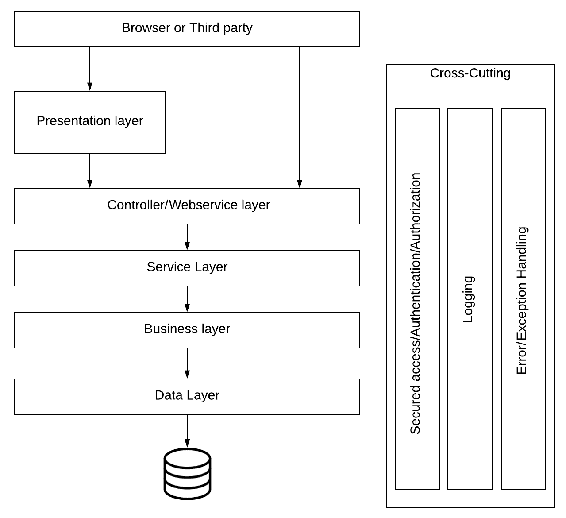
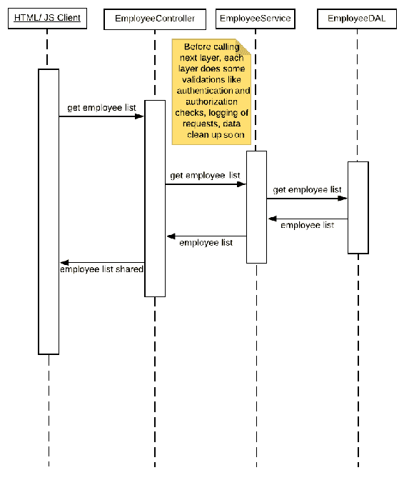
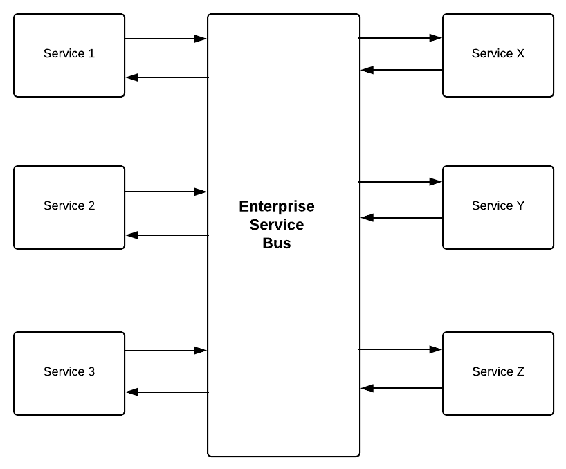

# 八、应用架构的发展趋势

每当我们开始开发一个应用时，我们首先需要确定的是我们将要使用的设计或架构。随着软件行业在过去几十年的成熟，我们用来设计系统的方式也发生了变化。在本章中，我们将讨论我们在最近的过去看到的一些重要的架构趋势，这些趋势至今仍然相关。我们将尝试分析这些架构模式的好、坏和丑，并找出哪种模式能够解决哪种类型的问题。本章将介绍以下主题：

*   什么是应用架构？
*   分层架构
*   模型-视图-控制器架构
*   面向服务的架构
*   基于微服务的架构
*   无服务器架构

# 什么是应用架构？

当我们开始构建一个应用时，我们有一组需求，我们试图设计一个我们认为能够满足所有需求的解决方案。这种设计被称为**应用架构**。需要考虑的一个重要因素是，您的架构不仅应该考虑当前的需求，还应该预测预期的未来变化并将其考虑在内。通常，有一些未指定的需求，称为**非功能性需求**，您需要处理。功能需求将作为需求文档的一部分给出，但是架构师或高级开发人员需要自己解决非功能需求。性能需求、可伸缩性需求、安全性需求、可维护性、可增强性、应用的可用性等等，是在设计解决方案时需要考虑的一些重要的非功能性需求。

使应用架构的技巧既有趣又富有挑战性的事实是，没有固定的规则集。适用于一个应用的架构或设计可能不适用于另一个应用；例如，银行解决方案架构可能看起来与电子商务解决方案架构不同。另外，在一个解决方案中，不同的组件可能需要遵循不同的设计方法。例如，您可能希望其中一个组件支持基于 HTTP-REST 的通信，而对于另一个组件，您可以使用消息队列进行通信。这样做的目的是找出解决当前问题的最佳可行方法。

在下面的部分中，我们将讨论 JEE 应用中最常见和最有效的架构样式。

# 分层架构

我们尝试将代码和实现划分为不同的层，每一层都有固定的职责。没有一套固定的层次结构可以应用于所有的项目，因此您可能需要考虑什么样的层次结构将适用于手头的项目。

下图显示了一个常见的分层架构，在考虑典型的 Web 应用时，这是一个很好的起点：



设计有以下几层：

*   表示层
*   控制器/Web 服务层
*   服务层
*   业务层
*   数据访问层

**表示层**是保存 UI 的层，即 HTML/JavaScript/JSP 等。这是最终用户可以直接与之交互的层。

**控制器/ Web 服务层**是第三方请求的入口点。此请求可以来自表示层（主要）或其他服务；例如，移动或桌面应用。因为这是任何请求的入口点，所以这一层将应用于任何初始级别的检查、数据清理、验证、安全需求，例如认证和授权等。一旦这个层得到满足，请求就被接受和处理。

**服务层**又称**应用层**，负责提供不同的服务，如添加记录、发送邮件、下载文件、生成报告等。在小型应用中，我们可以将服务层与 Web 服务层合并，特别是当我们知道服务层只处理来自 Web 的请求时。如果当前服务也可以从其他服务调用，那么最好将服务与 Web 服务或控制器分开。

**业务层**保存所有与业务相关的逻辑。例如，在员工数据管理服务中，如果系统试图将某个员工提升为经理，则该层负责应用所有业务检查，包括该员工是否具有相关经验、是否已担任副经理、去年的考核等级是否与目标相匹配必需的规则，等等。有时，如果所讨论的应用或服务没有一组强大的业务规则，那么业务层将与应用层合并。另一方面，您可能希望进一步将业务层划分为子层，以防应用需要强大的业务规则实现。同样，在实现分层设计时，不需要遵循固定的指导原则，而且实现可以根据应用或服务的需要进行更改。

**数据访问层**负责管理所有与数据相关的操作，如获取数据、以所需格式表示数据、清理数据、存储数据、更新数据等。在创建这个层时，我们可以使用一个**对象关系映射**（**ORM**）框架或者创建我们自己的处理器。这里的想法是让其他层不必担心数据处理，也就是数据的存储方式。它是来自另一个第三方服务还是存储在本地？这些和类似的问题仅由该层负责。

**横切关注点**是每一层需要处理的关注点，例如，每一层负责检查请求是否来自正确的通道，没有未经授权的请求得到服务。每个层可能希望通过记录每条消息来记录请求的进入和退出。这些问题可以通过跨层使用和分布的公共工具来处理，也可以由每个层独立处理。通常，使用诸如**面向切面编程**（**AOP**）之类的技术，使这些关注点独立于核心业务或应用逻辑是一个好主意。

# 分层架构及其应用实例

为了进一步理解分层架构风格，让我们看一下代码和设计示例。让我们做一个非常简单的需求，我们需要从数据库中获取员工列表。

首先，让我们通过查看此图，尝试从层的角度来可视化需求：



在本例中，我们创建了四个层。表示层可以看作是一个简单的带有 JavaScript 的 HTML。您可能希望使用复杂的框架（如 ReactJS 或 AngularJS）来保持表示层的组织，但是在本例中，我们有一个简单的表示层，例如，单击“Show Employee List”按钮时，会对控制器层进行 AJAX 调用，并获取员工数据。

下面是一个简单的 JavaScript 函数，用于获取员工的数据并将其显示在 UI 上：

```java
function getEmployeeData() 
{
  var xhttp = new XMLHttpRequest();
  xhttp.onreadystatechange = function() 
  {
    if (this.readyState == 4 && this.status == 200) 
    {
      document.getElementById("demo").innerHTML = this.responseText;
    }
  };
  xhttp.open("GET", "/LayeredEmployeeExample/service/employees/", true);
  xhttp.send();
}
```

您可以看到，表示层并不知道下一层的实现；它所知道的只是一个 API，该 API 应该为它提供所需的数据。

接下来，我们转到 Web 服务或控制器层。这一层的职责是确保请求以正确的格式来自正确的源。Java 中有很多可用的框架，比如 SpringSecurity 和 JavaWebToken，它们帮助我们实现每个请求的授权和认证。另外，我们可以为此创建拦截器。为了简化本章，我们将重点介绍核心功能，即从下一层获取数据并将其返回给调用函数。请看下面的代码：

```java
/**
* This method returns List of all the employees in the system.
*
* @return Employee List
* @throws ServletException
* @throws IOException
*/
@RequestMapping(method = RequestMethod.GET, value = "/")
public List<Employee> EmployeeListService() throws ServletException, IOException 
{
  List<Employee> empList = new ArrayList<Employee>();
  // Let's call Employee service which will return employee list
  EmployeeService empService = new EmployeeService();
  empList = empService.getEmployeeList();
  return empList;
}
```

同样，我们可以看到当前层不知道谁在调用它，也不知道下一层的实现。

类似地，我们有一个服务层：

```java
/**
* This methods returns list of Employees
* @return EmployeeList
*/
public List<Employee> getEmployeeList()
{
  // This method calls EmployeeDAL and gets employee List
  EmployeeDAL empDAL = new EmployeeDAL();
  return empDAL.getEmployeeList();
}
```

为了这个例子，我们将这个层保持得非常简单。你可能会问，为什么我们需要一个额外的层而不从控制器本身调用**数据访问层**（**DAL**）？如果您确定获取员工数据的唯一方法是通过控制器，则可以这样做。但是我们建议使用服务层，因为在某些情况下其他服务需要调用我们的服务，因此我们不需要重复的业务或 DAL 调用。

如果你仔细看，我们已经跳过了业务层。这个想法是，你不需要所有的层只是为了它。同时，您可以根据手头的需求将一个层分解为多个层或引入新层。在本例中，我们没有任何要实现的业务规则，因此省略了层。另一方面，如果我们想要实现一些业务规则，比如一些员工记录应该对某些特定角色隐藏，或者应该在向最终用户显示之前进行修改，那么我们将实现一个业务层。

让我们转到最后一层，数据访问层。在我们的示例中，我们的 DAL 负责获取数据并返回到调用层。请看下面的代码：

```java
/**
* This methods fetches employee list and returns to the caller.
* @return EmployeeList
*/
public List<Employee> getEmployeeList()
{
  List<Employee> empList = new ArrayList<Employee>();
  // One will need to create a DB connection and fetch Employees
  // Or we can use ORM like hibernate or frameworks like mybatis
  ...
  return empList;
}
```

# 分层与分层

在现实世界中，*层*和*层*可以互换使用。例如，您一定听说过术语*表示层*或*表示层*指的是同一组代码。尽管在引用一组代码时交换术语并没有什么坏处，但您需要了解，当我们根据物理部署需求划分代码时，使用术语*层*，而层更关心逻辑隔离。

# 分层架构能保证什么？

分层架构为我们提供了以下保障：

*   **代码组织**：分层架构帮助我们实现代码，每个代码层都是独立实现的。代码更具可读性；例如，如果您想查看如何从数据库访问特定数据，可以直接查看 DAL 而忽略其他层。
*   **易开发性**：由于代码是在不同的层中实现的，我们可以用类似的方式组织我们的团队，一个团队在表示层工作，另一个团队在 DAL 上工作。

# 分层架构面临哪些挑战？

分层架构的挑战如下：

*   **部署**：由于代码仍然是紧密耦合的，我们不能保证我们可以独立地部署每一层。我们最终可能还是会进行整体部署。
*   **可伸缩性**：由于我们仍将整个应用视为一个整体部署，因此我们无法独立地伸缩组件。

# 模型-视图-控制器架构

另一个广泛使用的组织代码的标准是遵循**模型视图控制器**（**MVC**）架构设计模式。顾名思义，我们正在考虑将应用组织为三个部分，即模型、视图和控制器。遵循 MVC 有助于我们保持关注点的分离，并允许我们更好地组织代码。请看以下内容：

*   **模型**：模型是数据的表示。数据是任何应用的关键部分。模型层负责组织和实现逻辑，以便正确地管理和修改数据。它负责处理在某些数据被修改时需要发生的任何事件。总之，该模型具有核心业务实现。
*   **视图**：任何应用的另一个重要部分是视图，即最终用户与之交互的部分。视图负责向最终用户显示信息并获取用户的输入。该层需要确保最终用户能够获得预期的功能。
*   **控制器**：顾名思义，控制器控制流量。当视图上发生某些操作时，它会让控制器知道，然后控制器会调用来确定此操作是影响模型还是视图。

由于 MVC 是一个古老的模式，架构师和开发人员以不同的方式解释和使用它，您可能会发现 MVC 模式的不同实现可用。我们将从一个非常简化的实现开始，然后转向特定于 Java 的实现。

下图为我们提供了 MVC 流程的基本理解：


如我们所见，最终用户通过一个动作与控制器交互，比如表单提交或按钮点击。控制器接受此请求并更新模型中的数据。最后，视图组件根据模型上发生的操作获取更新。更新后的视图将呈现给用户以供查看和执行进一步操作。

如前所述，MVC 是一种旧模式，最初用于桌面和静态应用。许多 Web 框架对该模式的解释和实现都有所不同。在 Java 中，也有许多框架提供了 Webmvc 实现。springmvc 是最常用的框架之一，因此值得一看。

下图从较高的层次解释了 Spring MVC 中的控制流：


让我们仔细看看流程：

*   `1`：Spring MVC 遵循前置控制器模式，这意味着所有请求最初都必须通过一个点，在本例中是一个分发 Servlet
*   `2`：然后，前端控制器将请求委托给要处理特定请求的控制器
*   `3`：控制器根据给定的请求操作或更新模型，并返回最终用户请求的模型
*   `4`：然后框架选择要处理当前请求的视图，并将模型传递给它
*   `5`：视图通常是 JSP，根据提供的模型呈现数据
*   `6`：最后的响应通常是 HTML，发送回调用代理或浏览器

# MVC 架构及其应用实例

为了进一步澄清问题，让我们看一个示例实现。首先，我们将在`web.xml`中添加以下内容：

```java
<servlet>
  <servlet-name>springmvc</servlet-name>
  <servlet-class>org.springframework.web.servlet.
  DispatcherServlet</servlet-class>
  <init-param>
    <param-name>contextClass</param-name>
    <param-value>org.springframework.web.context.support.
    AnnotationConfigWebApplicationContext</param-value>
  </init-param>
  <init-param>
    <param-name>contextConfigLocation</param-name>
    <param-value>com.employee.config.EmployeeConfig</param-value>
  </init-param>
  <load-on-startup>1</load-on-startup>
</servlet>
<servlet-mapping>
  <servlet-name>springmvc</servlet-name>
  <url-pattern>/mvc/*</url-pattern>
</servlet-mapping>
```

我们已经告诉我们的`web.xml`，所有具有`/mvc/`模式的请求都应该重定向到我们的前端控制器，即 Spring MVC 的`DispatcherServlet`。我们还提到了配置类文件的位置。这是我们的配置文件：

```java
@EnableWebMvc
@Configuration
@ComponentScan(basePackages = "com.employee.*")
/**
* The main Configuration class file.
*/
public class EmployeeConfig 
{
  @Bean
  /**
  * Configuration for view resolver
  */
  public ViewResolver viewResolver() 
  {
    InternalResourceViewResolver viewResolver = new 
    InternalResourceViewResolver();
    viewResolver.setViewClass(JstlView.class);
    viewResolver.setPrefix("/WEB-INF/pages/");
    viewResolver.setSuffix(".jsp");
    return viewResolver;
  }
}
```

我们已经告诉我们的应用，我们将使用 WebMVC 框架和组件的位置。此外，我们通过视图解析器让应用知道视图的位置和格式。

下面是一个示例控制器类：

```java
@Controller
@RequestMapping("/employees")
/**
* This class implements controller for Employee Entity
*/
public class EmployeeController 
{
  /**
  * This method returns view to display all the employees in the system.
  *
  * @return Employee List
  * @throws ServletException
  * @throws IOException
  */
  @RequestMapping(method = RequestMethod.GET, value = "/")
  public ModelAndView getEmployeeList(ModelAndView modelView) throws 
  ServletException, IOException 
  {
    List<Employee> empList = new ArrayList<Employee>();
    EmployeeDAL empDAL = new EmployeeDAL();
    empList = empDAL.getEmployeeList();
    modelView.addObject("employeeList", empList);
    modelView.setViewName("employees");
    return modelView;
  }
}
```

我们可以看到，这个控制器以模型的形式获取数据，并让应用知道响应当前请求的适当视图。返回一个`ModelAndView`对象，其中包含有关视图和模型的信息。

控制器被传递给视图，在本例中是员工.jsp:

```java
<%@ page language="java" contentType="text/html; charset=UTF-8" pageEncoding="UTF-8" %>
<!DOCTYPE html PUBLIC "-//W3C//DTD HTML 4.01 Transitional//EN" "http://www.w3.org/TR/html4/loose.dtd">
<html>
  <head>
    <meta http-equiv="Content-Type" content= text/html; charset=UTF-8">
    <title>Welcome to Spring</title>
    <%@ taglib uri="http://java.sun.com/jsp/jstl/core" prefix="c" %>
  </head>
  <body>
    <table>
      <th>Name</th>
      <th>Email</th>
      <th>Address</th>
      <th>Telephone</th>
      <th>Action</th>
      <c:forEach var="employee" items="${employeeList}">
        <tr>
          <td>${employee.id}</td>
          <td>${employee.name}</td>
          <td>${employee.designation}</td>
        </tr>
      </c:forEach>
    </table>
  </body>
</html>
```

如我们所见，JSP 所做的所有这些视图都是创建一个以表格形式显示员工详细信息的 HTML。

springmvc 更像是实现 MVC 的一种经典方式。在最近一段时间里，我们试图摆脱 jsp，以保持关注点的分离。在现代应用中，视图通常独立于服务器端代码，并使用 ReactJS、AngularJS 等 JavaScript 框架在前端完全呈现。尽管 MVC 的核心原则仍然成立，但是通信可能看起来不同。

# 更现代的 MVC 实现

对于富互联网应用，MVC 实现可能更像下图：


其核心思想是模型和视图是完全独立的。控制器接收来自视图和模型的通信，并根据触发的操作更新它们。例如，当用户单击 SubmitNewEmployeeRecord 上的一个按钮时，控制器接收到这个请求，并更新模型。类似地，当模型更新时，它会通知控制器，然后控制器会更新视图以反映正确的模型状态。

# MVC 架构保证了什么？

MVC 架构保证了以下几点：

*   **关注点分离**：与分层架构类似，MVC 保证了关注点的分离，即视图、模型和控制器可以看作是需要独立开发和维护的不同组件。
*   **易部署性**：应用有不同的方面，即模型、视图和控制器可以由不同的团队独立开发。尽管您需要集成这些组件才能获得完整的图像。

# MVC 架构有哪些挑战？

MVC 架构的挑战如下：

*   **可扩展性**：由于我们仍然需要将整个应用作为一个单元来部署，MVC 不能保证可扩展性。由于我们不能仅扩展与性能相关的部分，因此应用需要作为一个整体进行扩展。
*   **可测试性**：应用的可测试性在 MVC 中并不简单。虽然我们可以独立地测试一个组件，但是在我们可以端到端地测试一个功能之前，我们需要集成所有的部分。

# 面向服务的架构

当我们谈论**面向服务架构**（**SOA**）方法时，我们谈论的是各种服务或可重用单元的应用。例如，让我们来看一个电子商务购物系统，比如 Amazon。可以将其视为多个服务的组合，而不是单个应用。我们可以考虑一个负责实现产品搜索的搜索服务，一个将实现购物车维护的购物车服务，一个独立处理支付的支付处理服务，等等。这样做的目的是将您的应用分解为可以独立开发、部署和维护的服务。

为了理解面向服务的架构方法的优势，让我们考虑这样一种情况：我们能够将应用划分为 10 个独立的服务。因此，我们将架构的复杂性降低了 10 倍。我们能够将团队分成 10 个部分，我们知道维持较小的团队更容易。此外，它还为我们提供了独立构建、实现、部署和维护每个服务的自由。如果我们知道一个特定的服务可以用一种语言或框架更好地实现，而另一个服务可以用一种完全不同的语言或框架实现，那么我们可以很容易地做到这一点。通过独立部署，我们可以根据每个服务的使用情况独立地扩展它们。此外，我们可以确保，如果一个服务出现故障或遇到任何问题，其他服务仍然能够响应而不出现任何问题。例如，如果由于某种原因，在电子商务系统中，我们有一个无响应的搜索服务，它不应该影响正常的购物车和购买功能。

# 面向服务的架构及其应用实例

假设我们正在创建一个员工管理系统，该系统负责创建、编辑和删除记录，并管理员工文档、休假计划、评估、运输等。从这个单一的定义开始，让我们开始将它划分为不同的服务。我们最终将拥有一个核心的`EmployeeRecordManagement`服务，一个`LeaveManagement`服务，一个`DocumentManagement`服务，等等。这种拆分成更小的服务的第一个好处是，我们现在可以独立设计和开发这些服务了。因此，50 人的大型团队可以分成 8-10 个规模较小、易于管理的团队，每个团队拥有自己的服务。我们有松散耦合的服务，这意味着进行更改也更容易，因为更改休假规则并不意味着您需要更新整个代码。如果需要，这种 SOA 方法还可以帮助我们分阶段交付；例如，如果我现在不想实现休假管理服务，可以等到第二个版本。

下面的图表应该直观地解释 SOA 设计对于前面的示例的期望：


我们可以看到每个服务都有一个独立的标识。但如果需要，服务可以相互交互。此外，服务共享资源（如数据库和存储）也很常见。

对于每项服务，我们都需要了解三个核心组件：

*   **服务提供者**：提供服务的组件。服务提供者向服务目录注册服务。
*   **服务使用者**：使用服务的组件。服务使用者可以在 services 目录中查找服务。
*   **服务目录**：服务目录包含服务列表。它与提供者和使用者交互以更新和共享服务数据。

# Web 服务

顾名思义，Web 服务是通过 Web 或互联网提供的服务。Web 服务有助于普及面向服务的架构，因为它们使人们很容易从互联网上公开的服务的角度来考虑应用。在因特网上公开服务的方式有很多种，**简单对象访问协议**（**SOAP**）和 REST 是最常见的两种实现方式。

# SOAP 和 REST

SOAP 和 REST 都有助于在互联网上公开服务，但它们的性质截然不同。

SOAP 数据包是基于 XML 的，需要采用非常特定的格式。以下是 SOAP 数据包的主要组件：

*   **信封**：将 XML 包标识为 SOAP 消息
*   **头部**：提供头信息的可选元素
*   **正文**：包含对服务的请求和响应
*   **故障**：表示状态和错误的可选元素

这就是 SOAP 数据包的外观：

```java
<?xml version="1.0"?>
<soap:Envelope
xmlns:soap="http://www.w3.org/2003/05/soap-envelope/"
soap:encodingStyle="http://www.w3.org/2003/05/soap-encoding">
  <soap:Header>
    ...
  </soap:Header>
  <soap:Body>
    ...
    <soap:Fault>
      ...
    </soap:Fault>
  </soap:Body>
</soap:Envelope>
```

REST 没有那么多规则和格式。REST 服务可以通过 HTTP 支持`GET`、`POST`、`PUT`和`DELETE`中的一个或多个方法来实现。

`POST`请求的示例 JSON REST 负载如下所示：

```java
{
  "employeeId":"1",
  "employeeName":"Dave",
  "department":"sales",
  ...
}
```

如我们所见，没有开销，比如定义一个合适的包结构，比如 SOAP。由于其简单性，基于 REST 的 Web 服务在过去几年中变得很流行。

# 企业服务总线

在我们讨论面向服务的架构时，理解**企业服务总线**（**ESB**）在改善通信方面所起的作用是很重要的。在为您的组织开发不同的应用时，您可能会创建几个不同的服务。在某些级别上，这些服务需要与其他服务交互。这会增加很多并发症。例如，一个服务理解基于 XML 的通信，而另一个服务期望所有通信都使用 JSON，而另一个服务期望基于 FTP 的输入。此外，我们还需要添加诸如安全性、请求排队、数据清理、格式化等特性。ESB 是我们所有问题的解决方案。

下图显示了不同的服务如何独立地与 ESB 通信：



我们可以看到任何数量的服务都在与 ESB 交互。一个服务可以用 Java 编写，另一个用.Net 编写，其他的用其他语言编写。类似地，一个服务可能需要基于 JSON 的数据包，而另一个服务可能需要 XML。ESB 的职责是确保这些服务能够顺利地相互交互。ESB 还有助于服务编排，即我们可以控制排序和流。

# 面向服务的架构能保证什么？

面向服务的架构保证了以下几点：

*   **易开发性**：由于我们可以将应用划分为不同的服务，因此团队可以在不影响彼此工作的情况下轻松处理不同的服务。
*   **松耦合**：每个服务都是相互独立的，所以如果我们改变一个服务实现，保持 API 请求和响应相同，用户就不需要知道发生了什么变化。例如，在前面，一个服务正在从数据库中获取数据，但是我们引入了缓存并进行了更改，以便该服务首先从缓存中获取数据。调用方服务甚至不需要知道服务中是否发生了更改。
*   **可测试性**：每个服务都可以独立测试。因此，要测试一个服务，不需要等待完整的代码准备就绪。

# 面向服务的架构面临哪些挑战？

面向服务架构的挑战如下：

*   **部署**：虽然我们是从服务的角度来考虑的，但是我们还是在逻辑层面进行架构，没有考虑这些服务的独立部署。最后，我们可能会处理难以增强和维护的单片应用的部署。
*   **可伸缩性**：可伸缩性仍然是 SOA 的主要挑战。我们仍在处理更大的服务，而且大部分服务分离是在逻辑级别，而不是在物理级别。因此，扩展单个服务或服务的一部分是困难的。最重要的是，如果我们使用的是 ESB（ESB 本身是部署的一大块），那么扩展它可能是一场噩梦。

# 基于微服务的架构

顾名思义，基于微服务的架构建议将服务划分为细粒度级别。当提到微服务时，有不同的思想流派；有些人会认为它只是面向服务架构的一个别致的名字。我们当然可以将微服务视为面向服务架构的扩展，但是有许多特性使微服务与众不同。

微服务将面向服务的架构提升到了一个新的层次。SOA 将服务考虑在功能级别，而微服务将其考虑到任务级别。例如，如果我们有一个用于发送和接收电子邮件的电子邮件服务，我们就可以有诸如拼写检查、垃圾邮件过滤器等微服务，每个微服务都处理一个专门的任务。

相对于 SOA，微服务概念带来的一个重要区别因素是，每个微服务都应该是可独立测试和可部署的。尽管这些特性在 SOA 中是可取的，但在基于微服务的架构中它们是必需的。

# 微服务架构及其应用实例

让我们看一个简单的例子来了解微服务是如何帮助我们的。假设我们需要在一个电子商务网站上建立一个功能，在那里你可以上传产品的图片。当上传一个产品的图片时，服务需要保存图片并创建一个缩放版本（假设我们希望所有的产品图片保持`1280×720`的标准分辨率）。此外，我们还需要创建图像的缩略图版本。简而言之，我们尝试在单个服务中执行以下任务。

图像上传服务可帮助您执行以下操作：

1.  接收产品图像。
2.  将图像上传到存储器。
3.  用相关信息更新数据库。
4.  将图像缩放到标准分辨率（`1280*720`）。
5.  将缩放后的图像上传到存储器。
6.  生成图像的缩略图版本。
7.  将缩略图上传到存储器。
8.  返回成功。

好吧，上面提到的所有任务对于上传产品图片来说都很重要，但是对于服务来说这看起来太多了。微服务架构可以帮助我们解决这种情况。例如，我们可以将服务重新考虑为以下微服务。

图像上传服务可帮助您执行以下操作：

1.  接收产品图像。
2.  将图像上传到存储器。
3.  用相关信息更新数据库。
4.  返回成功。

缩放图像服务可帮助您执行以下操作：

1.  将图像缩放到标准分辨率（`1280*720`）。
2.  将缩放后的图像上传到存储器。

缩略图服务可帮助您执行以下操作：

1.  生成图像的缩略图版本。
2.  将缩略图上传到存储器。

您仍然可以继续独立地创建一个 UploadToStore 服务。因此，您希望服务的细粒度如何取决于您的系统。找到合适的粒度级别是非常重要的，也是一项棘手的任务。如果您不将更大的服务正确地分解为微服务，您将无法实现微服务的优势，例如可伸缩性、易部署性、可测试性等等。另一方面，如果您的微服务粒度太细，您将不必要地维护太多的服务，这也意味着要努力使这些服务相互通信并处理性能问题。

# 服务间通信

在前面的例子中，一个显而易见的问题是：如何触发缩放图像服务和缩略图服务？嗯，有很多选择。最常见的是基于 REST 的通信，其中上传服务可以对其他两个服务进行 REST 调用，或者基于消息队列的通信，其中上传服务将向队列中添加可由其他服务处理的消息，或者基于状态的工作流，其中上传服务将在数据库中设置一个状态（例如，*准备好缩放*），该状态将被其他服务读取和处理。

根据应用的需要，您可以调用哪个通信方法是首选的。

# 基于微服务的架构能保证什么？

基于微服务的架构保证了以下几点：

*   **可伸缩性**：我们在之前所有架构中面临的一个主要挑战是可伸缩性。微服务帮助我们实现分布式架构，从而支持松散耦合。更容易扩展这些松散耦合的服务，因为每个服务都可以独立部署和扩展。
*   **持续交付**：在业务快速发展的今天，持续交付是应用需求的一个重要方面。由于我们处理的是许多服务，而不是单一的单一应用，因此根据需求修改和部署服务要容易得多。简而言之，将更改推送到生产环境很容易，因为不需要部署整个应用。
*   **易部署**：微服务可以独立开发和部署。因此，我们不需要对整个应用进行 bing-bang 部署；只能部署受影响的服务。
*   **可测试性**：每个服务都可以独立测试。如果我们正确地定义了每个服务的请求和响应结构，我们就可以将服务作为一个独立的实体进行测试，而不用担心其他服务。

# 基于微服务的架构面临哪些挑战？

基于微服务架构的挑战如下：

*   **依赖 devops**：由于我们需要维护多个通过消息相互作用的服务，因此我们需要确保所有服务都可用并受到适当的监控。
*   **保持平衡**：维持适量的微服务本身就是一个挑战。如果我们有太细粒度的服务，我们就会面临部署和维护太多服务等挑战。另一方面，如果我们拥有的大型服务太少，我们最终会失去微服务所提供的优势。
*   **重复代码**：由于我们所有的服务都是独立开发和部署的，一些常用的工具需要复制到不同的服务中。

# 无服务器架构

到目前为止，在我们讨论的所有架构样式中，有一个共同的因素：对基础结构的依赖性。每当我们为一个应用设计时，我们都需要考虑一些重要的因素，例如：系统将如何放大或缩小？如何满足系统的性能需求？这些服务将如何部署？我们需要多少实例和服务器？他们的能力是什么？等等。

这些问题很重要，同时也很难回答。我们已经从专用硬件转向基于云的部署，这使得我们的部署更加轻松，但我们仍然需要规划基础设施需求，并回答前面提到的所有问题。一旦获得了硬件，无论是在云端还是其他地方，我们都需要维护它的健康，并确保服务能够根据需求进行扩展，这就需要 devops 的大量参与。另一个重要问题是基础设施的使用不足或过度使用。如果你有一个简单的网站，在那里你不希望有太多的流量，你仍然需要提供一些基础设施的能力来处理请求。如果您知道一天中只有几个小时的时间会有很高的流量，那么您需要智能地管理您的基础结构，以便进行上下扩展。

为了解决上述问题，出现了一种全新的思维方式，即所谓的**无服务器部署**，也就是说，将功能作为服务提供。其想法是开发团队应该只关心代码，云服务提供商将负责基础设施需求，包括功能的扩展。

如果你能只为你使用的计算能力付费呢？如果不需要预先提供任何基础设施容量，该怎么办？如果服务提供商自己负责扩展所需的计算能力，自行管理每小时是否有一个请求或每秒是否有一百万个请求呢？

# 无服务器架构及其应用实例

如果我们已经引起你的注意，让我们举一个非常简单的例子来说明这一点。我们将尝试创建一个简单的问候语示例，其中作为服务实现的函数将问候用户。我们将在本例中使用 AWS Lambda 函数。

让我们用一个示例问候语函数来创建我们的类：

```java
/**
* Class to implement simple hello world example
*
*/
public class LambdaMethodHandler implements RequestStreamHandler 
{
  public void handleRequest(InputStream inputStream, OutputStream
  outputStream, Context context) throws IOException 
  {
    BufferedReader reader = new BufferedReader(new InputStreamReader
    (inputStream));
    JSONObject responseJson = new JSONObject();
    String name = "Guest";
    String responseCode = "200";
    try 
    {
      // First parse the request
      JSONParser parser = new JSONParser();
      JSONObject event = (JSONObject)parser.parse(reader);
      if (event.get("queryStringParameters") != null) 
      {
        JSONObject queryStringParameters = (JSONObject)event.get
        ("queryStringParameters");
        if ( queryStringParameters.get("name") != null) 
        {
          name = (String)queryStringParameters.get("name");
        }
      }
      // Prepare the response. If name was provided use that 
      else use default.
      String greeting = "Hello "+ name;
      JSONObject responseBody = new JSONObject();
      responseBody.put("message", greeting);
      JSONObject headerJson = new JSONObject();
      responseJson.put("isBase64Encoded", false);
      responseJson.put("statusCode", responseCode);
      responseJson.put("headers", headerJson);
      responseJson.put("body", responseBody.toString());
    }   
    catch(ParseException parseException) 
    {
      responseJson.put("statusCode", "400");
      responseJson.put("exception", parseException);
    }
    OutputStreamWriter writer = new OutputStreamWriter
    (outputStream, "UTF-8");
    writer.write(responseJson.toJSONString());
    writer.close();
  }
}
```

这个简单的函数从查询字符串中读取输入参数并创建一条问候语消息，该消息嵌入到 JSON 的`message`标记中并返回给调用者。我们需要从中创建一个 JAR 文件。如果您使用的是 Maven，那么只需使用一个 shade 包，比如`mvn clean package shade:shade`。

一旦准备好 JAR 文件，下一步就是创建 Lambda 函数并上传 JAR。转到您的 AWS 帐户，选择“Lambda service | Create function | Author from scratch”，并提供所需的值。看看这个截图：


您需要提供名称和运行时环境。根据 Lambda 函数应该执行的操作，您将授予它权限。例如，您可能正在读取存储、访问队列或数据库等。

接下来，我们上传 JAR 文件并将其保存到 Lambda 函数，如下面的屏幕截图所示。为处理函数提供完全限定的路径-`com.test.LambdaMethodHandler::handleRequest`：


现在，我们通过设置一个测试事件来测试我们的函数。看看这个截图：


最后，单击“Test”按钮将显示如下响应：

```java
{ 
 "isBase64Encoded": false, 
 "headers": {}, 
 "body": "{"message":"Hello Guest"}", 
 "statusCode": "200"
 }
```

我们已经创建了一个成功的 Lambda 函数，但是我们需要了解如何调用它。让我们创建一个 API 来调用这个函数。Amazon 为此向我们提供了 API 网关。在 Designer 的“Add triggers”下，选择“API Gateway”，如下屏幕截图所示：


最后，添加 API 网关配置。看看这个截图：


添加配置后，系统将为您提供一个 API 链接，点击该链接后，将打印所需的 JSON：

```java
{"message":"Hello Guest"}
```

或者，如果提供名称查询参数，则打印`Hello {name}`。

# 基础设施规划独立

整个练习的一个重要核心思想是认识到我们创建了一个 API，而没有设置任何机器或服务器。我们只是创建了一个 JAR 文件并上传到 Amazon 上。我们不再担心负载或性能。我们不考虑是否使用 Tomcat、Jboss 或任何其他服务器。我们并没有考虑这个 API 在一天内会得到一次点击还是一百万次点击。我们将只支付请求的数量和使用的计算能力。

请注意，我们使用 API 调用函数并返回了一条简单的消息。更复杂的实现很容易得到支持。例如，可以从消息队列、数据库更改或存储触发功能，并且类似地，可以访问其他云提供商服务，例如数据库、存储、消息、电子邮件等，以及第三方服务。

尽管我们在本书中使用了 amazonLambda 示例，但我们不推荐任何特定的供应商。这个想法只是解释无服务器架构的用法。所有主要的云玩家，如微软、谷歌、IBM 等，都提供了自己的无服务器功能实现作为服务部署。建议读者根据自己的需要和使用情况，在比较所选供应商后进行选择。

# 无服务器架构能保证什么？

无服务器架构保证了以下几点：

*   **从基础设施规划中解放出来**：好吧，如果不是完全的话，在很大程度上，无服务器架构帮助我们关注代码，让服务提供商来管理基础设施。您不必考虑上下扩展服务和添加自动扩展或负载平衡逻辑。
*   **成本效益**：由于您只为实际使用或实际流量付费，因此您不必担心维护最低的基础设施级别。如果你的网站没有受到任何影响，你就不会为基础设施支付任何费用（基于你的云服务提供商的条件）。
*   **微服务的下一步**：如果您已经实现了基于微服务的架构，那么将很容易发展到无服务器架构。使用基于函数的无服务器实现，部署以函数形式实现的服务更容易。
*   **持续交付**：与微服务一样，我们可以通过无服务器架构实现持续交付，因为一次功能更新不会影响整个应用。

# 无服务器架构面临哪些挑战？

无服务器架构的挑战如下：

*   **基于供应商的限制**：不同供应商在提供功能作为服务时可能会受到限制。例如，对于 Amazon，服务器可以执行的最大持续时间是 5 分钟。因此，如果您需要创建一个正在进行繁重处理的函数，并且可能需要比所施加的限制更多的时间，Lambda 函数可能不适合您。
*   **管理分布式架构**：维护大量功能可能会变得棘手。您需要跟踪所有实现的函数，并确保一个函数 API 中的升级不会破坏其他调用函数。

# 总结

在本章中，我们讨论了各种架构风格，从分层架构、MVC 架构、面向服务架构、微服务开始，最后是无服务器架构。我想到的一个明显的问题是：在这些设计应用的风格中，哪一种是最好的。这个问题的答案也很明显，这取决于手头的问题。好吧，如果有一个架构可以应用于所有的问题，每个人都会使用它，我们只会讨论那个特定的架构风格。

这里需要注意的一点是，这些架构风格并不是相互排斥的；事实上，它们是相辅相成的。因此，大多数时候，您可能会使用这些架构风格的混合体。例如，如果我们正在进行基于面向服务架构的设计，我们可能会看到这些服务的内部实现可能是基于分层或 MVC 架构的。此外，我们可能最终将一些服务分解为微服务，而在这些微服务中，一些可能以无服务器的方式实现为函数。关键是，您必须根据当前要解决的问题选择设计或架构。

在下一章中，我们将重点介绍最近 Java 版本升级中的一些最新趋势和更新。