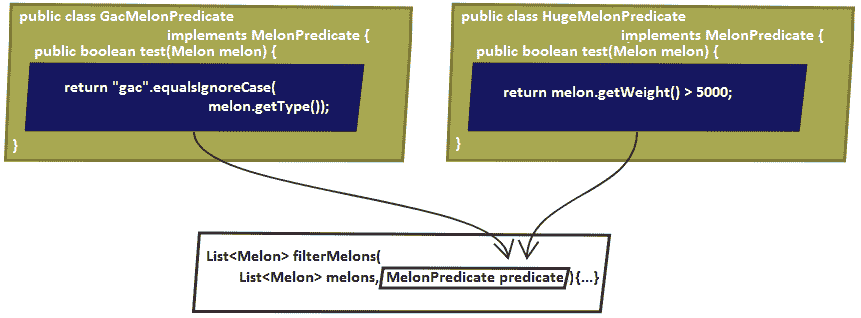
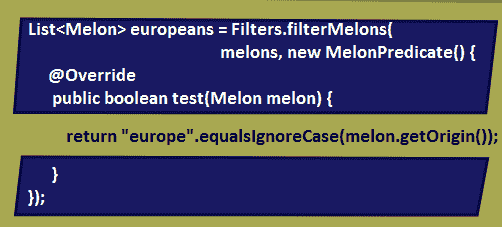

# 函数式编程-基础和设计模式

本章包括 11 个涉及 Java 函数式编程的问题。我们将从一个问题开始，这个问题旨在提供从 0 到函数式接口的完整过程。然后，我们将继续研究 GoF 中的一套设计模式，我们将用 Java 函数风格来解释这些模式。

在本章结束时，您应该熟悉函数式编程，并准备好继续处理一组问题，这些问题允许我们深入研究这个主题。您应该能够使用一堆以函数式风格编写的常用设计模式，并且非常了解如何开发代码以利用函数式接口。

# 问题

使用以下问题来测试您的函数式编程能力。我强烈建议您在使用解决方案和下载示例程序之前，先尝试一下每个问题：

166.  *“编写函数式接口”*：编写一个程序，通过一组有意义的例子定义从 0 到函数式接口的路径。
167.  **Lambda 概述**：解释什么是 Lambda 表达式。
168.  **实现环绕执行模式**：基于 Lambda 编写实现环绕执行模式的程序。
169.  **实现工厂模式**：基于 Lambda 编写一个实现工厂模式的程序。
170.  **实现策略模式**：基于 Lambda 编写一个实现策略模式的程序。
171.  **实现模板方法模式**：基于 Lambda 编写一个实现模板方法模式的程序。
172.  **实现观察者模式**：基于 Lambda 编写一个实现观察者模式的程序。
173.  **实现借贷模式**：基于 Lambda 编写实现借贷模式的程序。
174.  **实现装饰器模式**：基于 Lambda 编写一个实现装饰器模式的程序。
175.  **实现级联生成器模式**：基于 Lambda 编写一个实现级联生成器模式的程序。
176.  **实现命令模式**：基于 Lambda 编写一个实现命令模式的程序。

以下各节介绍上述问题的解决方案。记住，通常没有一个正确的方法来解决一个特定的问题。另外，请记住，这里显示的解释仅包括解决这些问题所需的最有趣和最重要的细节。您可以[下载示例解决方案以查看更多详细信息并尝试程序](https://github.com/PacktPublishing/Java-Coding-Problems)。

# 166 编写函数式接口

在这个解决方案中，我们将强调函数式接口的用途和可用性，并与几种替代方案进行比较。我们将研究如何将代码从基本的、严格的实现发展到基于函数式接口的灵活实现。为此，让我们考虑以下`Melon`类：

```java
public class Melon {

  private final String type;
  private final int weight;
  private final String origin;

  public Melon(String type, int weight, String origin) {
    this.type = type;
    this.weight = weight;
    this.origin = origin;
  }

  // getters, toString(), and so on omitted for brevity
}
```

假设我们有一个客户——我们叫他马克——他想开一家卖瓜的公司。我们根据他的描述塑造了前面的班级。他的主要目标是拥有一个库存应用程序来支持他的想法和决策，因此需要创建一个必须基于业务需求和发展的应用程序。我们将在下面几节中查看每天开发此应用程序所需的时间。

# 第 1 天（按瓜类过滤）

有一天，马克让我们提供一个功能，可以按瓜的类型过滤瓜。因此，我们创建了一个名为`Filters`的实用程序类，并实现了一个`static`方法，该方法将瓜列表和要过滤的类型作为参数。

得到的方法非常简单：

```java
public static List<Melon> filterByType(
    List<Melon> melons, String type) {

  List<Melon> result = new ArrayList<>();

  for (Melon melon: melons) {
    if (melon != null && type.equalsIgnoreCase(melon.getType())) {
      result.add(melon);
    }
  }

  return result;
}
```

完成！现在，我们可以很容易地按类型过滤西瓜，如下例所示：

```java
List<Melon> bailans = Filters.filterByType(melons, "Bailan");
```

# 第 2 天（过滤一定重量的瓜）

虽然马克对结果很满意，但他要求另一个过滤器来获得一定重量的瓜（例如，所有 1200 克的瓜）。我们刚刚对甜瓜类型实现了这样一个过滤器，因此我们可以为一定重量的甜瓜提出一个新的`static`方法，如下所示：

```java
public static List<Melon> filterByWeight(
    List<Melon> melons, int weight) {

  List<Melon> result = new ArrayList<>();

  for (Melon melon: melons) {
    if (melon != null && melon.getWeight() == weight) {
      result.add(melon);
    }
  }

  return result;
}
```

这与`filterByType()`类似，只是它有不同的条件/过滤器。作为开发人员，我们开始明白，如果我们继续这样做，`Filters`类最终会有很多方法，这些方法只是重复代码并使用不同的条件。我们非常接近一个*样板代码*案例。

# 第 3 天（按类型和重量过滤西瓜）

事情变得更糟了。马克现在要求我们添加一个新的过滤器，按类型和重量过滤西瓜，他需要这个很快。然而，最快的实现是最丑陋的。过来看：

```java
public static List<Melon> filterByTypeAndWeight(
    List<Melon> melons, String type, int weight) {
  List<Melon> result = new ArrayList<>();

  for (Melon melon: melons) {
    if (melon != null && type.equalsIgnoreCase(melon.getType()) 
        && melon.getWeight() == weight) {
      result.add(melon);
    }
  }

  return result;
}
```

在我们的情况下，这是不可接受的。如果我们在这里添加一个新的过滤条件，代码将变得很难维护并且容易出错。

# 第 4 天（将行为作为参数）

会议时间到了！我们不能继续像这样添加更多的过滤器；我们能想到的每一个属性的过滤器最终都会出现在一个巨大的`Filters`类中，这个类有大量复杂的方法，其中包含太多的参数和大量的*样板*代码。

主要的问题是我们在*样板*代码中有不同的行为。因此，只编写一次*样板*代码并将行为作为一个参数来推送是很好的。这样，我们就可以将任何选择条件/标准塑造成行为，并根据需要对它们进行处理。代码将变得更加清晰、灵活、易于维护，并且具有更少的参数。

这被称为**行为参数化**，如下图所示（左侧显示我们现在拥有的；右侧显示我们想要的）：


如果我们将每个选择条件/标准看作一种行为，那么将每个行为看作一个接口的实现是非常直观的。基本上，所有这些行为都有一个共同点——选择条件/标准和返回`boolean`类型（这被称为**谓词**）。在接口的上下文中，这是一个可以按如下方式编写的合同：

```java
public interface MelonPredicate {
  boolean test(Melon melon);
}
```

此外，我们可以编写`MelonPredicate`的不同实现。例如，过滤`Gac`瓜可以这样写：

```java
public class GacMelonPredicate implements MelonPredicate {
  @Override
  public boolean test(Melon melon) {
    return "gac".equalsIgnoreCase(melon.getType());
  }
}
```

或者，过滤所有重量超过 5000 克的西瓜可以写：

```java
public class HugeMelonPredicate implements MelonPredicate {
  @Override
  public boolean test(Melon melon) {
    return melon.getWeight() > 5000;
  }
}
```

这种技术有一个名字——策略设计模式。根据 GoF 的说法，这可以“*定义一系列算法，封装每个算法，并使它们可以互换。策略模式允许算法在客户端之间独立变化*”。

因此，主要思想是在运行时动态选择算法的行为。`MelonPredicate`接口统一了所有用于选择西瓜的算法，每个实现都是一个策略。

目前，我们有策略，但没有任何方法接收到一个`MelonPredicate`参数。我们需要一个`filterMelons()`方法，如下图所示：



所以，我们需要一个参数和多个行为。让我们看看`filterMelons()`的源代码：

```java
public static List<Melon> filterMelons(
    List<Melon> melons, MelonPredicate predicate) {

  List<Melon> result = new ArrayList<>();

  for (Melon melon: melons) {
    if (melon != null && predicate.test(melon)) {
      result.add(melon);
    }
  }

  return result;
}
```

这样好多了！我们可以通过以下不同的行为重用此方法（这里，我们传递`GacMelonPredicate`和`HugeMelonPredicate`：

```java
List<Melon> gacs = Filters.filterMelons(
  melons, new GacMelonPredicate());

List<Melon> huge = Filters.filterMelons(
  melons, new HugeMelonPredicate());
```

# 第 5 天（实施另外 100 个过滤器）

马克要求我们再安装 100 个过滤器。这一次，我们有足够的灵活性和支持来完成这项任务，但是我们仍然需要为每个选择标准编写 100 个实现`MelonPredicate`的策略或类。此外，我们必须创建这些策略的实例，并将它们传递给`filterMelons()`方法。

这意味着大量的代码和时间。为了保存这两者，我们可以依赖 Java 匿名类。换句话说，同时声明和实例化没有名称的类将导致如下结果：

```java
List<Melon> europeans = Filters.filterMelons(
    melons, new MelonPredicate() {
    @Override
    public boolean test(Melon melon) {
      return "europe".equalsIgnoreCase(melon.getOrigin());
    }
});
```

在这方面取得了一些进展，但这并不是很重要，因为我们仍然需要编写大量代码。检查下图中突出显示的代码（此代码对每个实现的行为重复）：



在这里，代码不友好。匿名类看起来很复杂，而且它们看起来有些不完整和奇怪，特别是对新手来说。

# 第 6 天（匿名类可以写成 Lambda）

新的一天，新的想法！任何智能 IDE 都可以为我们指明前进的道路。例如，NetbeansIDE 将不连续地警告我们，这个匿名类可以作为 Lambda 表达式编写。

如以下屏幕截图所示：


这个消息非常清楚——这个匿名的内部类创建可以转换成 Lambda 表达式。在这里，手工进行转换，或者让 IDE 为我们做。

结果如下：

```java
List<Melon> europeansLambda = Filters.filterMelons(
  melons, m -> "europe".equalsIgnoreCase(m.getOrigin()));
```

这样好多了！Java8Lambda 表达式这次做得很好。现在，我们可以以更灵活、快速、干净、可读和可维护的方式编写马克的过滤器。

# 第 7 天（抽象列表类型）

马克第二天带来了一些好消息——他将扩展业务，销售其他水果和瓜类。这很酷，但是我们的谓词只支持`Melon`实例。

那么，我们应该如何继续支持其他水果呢？还有多少水果？如果马克决定开始销售另一类产品，如蔬菜，该怎么办？我们不能简单地为它们中的每一个创建谓词。这将带我们回到起点。

显而易见的解决方案是抽象`List`类型。我们首先定义一个新接口，这次将其命名为`Predicate`（从名称中删除`Melon`）：

```java
@FunctionalInterface
public interface Predicate<T> {
  boolean test(T t);
}
```

接下来，我们重写`filterMelons()`方法并将其重命名为`filter()`：

```java
public static <T> List<T> filter(
    List<T> list, Predicate<T> predicate) {

  List<T> result = new ArrayList<>();

  for (T t: list) {
    if (t != null && predicate.test(t)) {
      result.add(t);
    }
  }

  return result;
}
```

现在，我们可以为`Melon`编写过滤器：

```java
List<Melon> watermelons = Filters.filter(
  melons, (Melon m) -> "Watermelon".equalsIgnoreCase(m.getType()));
```

我们也可以对数字做同样的处理：

```java
List<Integer> numbers = Arrays.asList(1, 13, 15, 2, 67);
List<Integer> smallThan10 = Filters
  .filter(numbers, (Integer i) -> i < 10);
```

退后一步，看看我们的起点和现在。由于 Java8 函数式接口和 Lambda 表达式，这种差异是巨大的。你注意到`Predicate`界面上的`@FunctionalInterface`注释了吗？好吧，这是一个信息注释类型，用于标记函数式接口。如果标记的接口不起作用，则发生错误是很有用的。

从概念上讲，函数式接口只有一个抽象方法。此外，我们定义的`Predicate`接口已经作为`java.util.function.Predicate`接口存在于 Java8 中。`java.util.function`包包含 40 多个这样的接口。因此，在定义一个新的包之前，最好检查这个包的内容。大多数情况下，六个标准的内置函数式接口就可以完成这项工作。具体如下：

*   `Predicate<T>`
*   `Consumer<T>`
*   ``Supplier<T>``
*   `Function<T, R>`
*   `UnaryOperator<T>`
*   `BinaryOperator<T>`

函数式接口和 Lambda 表达式是一个很好的团队。Lambda 表达式支持直接内联实现函数式接口的抽象方法。基本上，整个表达式被视为函数式接口的具体实现的实例，如以下代码所示：

```java
Predicate<Melon> predicate = (Melon m) 
  -> "Watermelon".equalsIgnoreCase(m.getType());
```

# 167 简而言之就是兰博达斯

剖析 Lambda 表达式将显示三个主要部分，如下图所示：


以下是 Lambda 表达式每个部分的说明：

*   在箭头的左侧，我们有 Lambda 主体中使用的参数。这些是`FilenameFilter.accept​(File folder, String fileName)`方法的参数。
*   在箭头的右侧，我们有 Lambda 主体，在本例中，它检查找到文件的文件夹是否可以读取，以及文件名是否以`.pdf`后缀结尾。
*   箭头只是 Lambda 参数和主体的分隔符。

此 Lambda 的匿名类版本如下所示：

```java
FilenameFilter filter = new FilenameFilter() {
  @Override
  public boolean accept(File folder, String fileName) {
    return folder.canRead() && fileName.endsWith(".pdf");
  }
};
```

现在，如果我们看 Lambda 和它的匿名版本，那么我们可以得出结论，Lambda 表达式是一个简明的匿名函数，可以作为参数传递给方法或保存在变量中。我们可以得出结论，Lambda 表达式可以根据下图中所示的四个单词来描述：


Lambda 支持行为参数化，这是一个很大的优点（查看前面的问题以获得对此的详细解释）。最后，请记住 Lambda 只能在函数式接口的上下文中使用。

# 168.实现环绕执行模式

环绕执行模式试图消除围绕特定任务的*样板*代码。例如，为了打开和关闭文件，特定于文件的任务需要被代码包围。

主要地，环绕执行模式在暗示在资源的开-关生命周期内发生的任务的场景中很有用。例如，假设我们有一个`Scanner`，我们的第一个任务是从文件中读取一个`double`值：

```java
try (Scanner scanner = new Scanner(
    Path.of("doubles.txt"), StandardCharsets.UTF_8)) {

  if (scanner.hasNextDouble()) {
    double value = scanner.nextDouble();
  }
}
```

稍后，另一项任务包括打印所有`double`值：

```java
try (Scanner scanner = new Scanner(
    Path.of("doubles.txt"), StandardCharsets.UTF_8)) {
  while (scanner.hasNextDouble()) {
    System.out.println(scanner.nextDouble());
  }
}
```

下图突出了围绕这两项任务的*样板*代码：


为了避免这个*样板*代码，环绕执行模式依赖于行为参数化（在“编写函数式接口”一节中进一步详细说明）。实现这一点所需的步骤如下：

1.  第一步是定义一个与`Scanner -> double`签名匹配的函数式接口，该接口可能抛出一个`IOException`：

```java
@FunctionalInterface
public interface ScannerDoubleFunction {
  double readDouble(Scanner scanner) throws IOException;
}
```

声明函数式接口只是解决方案的一半。

2.  到目前为止，我们可以编写一个`Scanner -> double`类型的 Lambda，但是我们需要一个接收并执行它的方法。为此，让我们考虑一下`Doubles`实用程序类中的以下方法：

```java
public static double read(ScannerDoubleFunction snf)
    throws IOException {

  try (Scanner scanner = new Scanner(
      Path.of("doubles.txt"), StandardCharsets.UTF_8)) {

    return snf.readDouble(scanner);
  }
}
```

传递给`read()`方法的 Lambda 在这个方法的主体中执行。当我们传递 Lambda 时，我们提供了一个称为直接内联的`abstract`方法的实现。主要是作为函数式接口`ScannerDoubleFunction`的一个实例，因此我们可以调用`readDouble()`方法来获得期望的结果。

3.  现在，我们可以简单地将任务作为 Lambda 传递并重用`read()`方法。例如，我们的任务可以包装在两个`static`方法中，如图所示（这种做法是为了获得干净的代码并避免大 Lambda）：

```java
private static double getFirst(Scanner scanner) {
  if (scanner.hasNextDouble()) {
    return scanner.nextDouble();
  }

  return Double.NaN;
}

private static double sumAll(Scanner scanner) {
  double sum = 0.0d;
  while (scanner.hasNextDouble()) {

    sum += scanner.nextDouble();
  }

  return sum;
}
```

4.  以这两个任务为例，我们还可以编写其他任务。让我们把它们传递给`read()`方法：

```java
double singleDouble 
  = Doubles.read((Scanner sc) -> getFirst(sc));
double sumAllDoubles 
  = Doubles.read((Scanner sc) -> sumAll(sc));
```

环绕执行模式对于消除特定于打开和关闭资源（I/O 操作）的*样板*代码非常有用。

# 169 实施工厂模式

简而言之，工厂模式允许我们创建多种对象，而无需向调用者公开实例化过程。通过这种方式，我们可以隐藏创建对象的复杂和/或敏感过程，并向调用者公开直观且易于使用的对象工厂

在经典实现中，工厂模式依赖于实习生`switch()`，如下例所示：

```java
public static Fruit newInstance(Class<?> clazz) {
  switch (clazz.getSimpleName()) {
    case "Gac":
      return new Gac();
    case "Hemi":
      return new Hemi();
    case "Cantaloupe":
      return new Cantaloupe();
    default:
      throw new IllegalArgumentException(
        "Invalid clazz argument: " + clazz);
  }
}
```

这里，`Gac`、`Hemi`、`Cantaloupe`实现相同的`Fruit`接口，并有空构造器。如果该方法生活在名为`MelonFactory`的实用类中，则可以调用如下：

```java
Gac gac = (Gac) MelonFactory.newInstance(Gac.class);
```

但是，Java8 函数样式允许我们使用*方法引用*技术引用构造器。这意味着我们可以定义一个`Supplier<Fruit>`来引用`Gac`空构造器，如下所示：

```java
Supplier<Fruit> gac = Gac::new;
```

那么`Hemi`、`Cantaloupe`等呢？好吧，我们可以简单地把它们都放在一个`Map`中（注意这里没有实例化甜瓜类型；它们只是懒惰的*方法引用*）：

```java
private static final Map<String, Supplier<Fruit>> MELONS 
  = Map.of("Gac", Gac::new, "Hemi", Hemi::new,
     "Cantaloupe", Cantaloupe::new);
```

此外，我们可以重写`newInstance()`方法来使用这个映射：

```java
public static Fruit newInstance(Class<?> clazz) {

    Supplier<Fruit> supplier = MELONS.get(clazz.getSimpleName());

    if (supplier == null) {
      throw new IllegalArgumentException(
        "Invalid clazz argument: " + clazz);
    }

    return supplier.get();
  }
```

调用方代码不需要进一步修改：

```java
Gac gac = (Gac) MelonFactory.newInstance(Gac.class);
```

然而，很明显，构造器并不总是空的。例如，下面的`Melon`类公开了一个具有三个参数的构造器：

```java
public class Melon implements Fruit {

  private final String type;
  private final int weight;
  private final String color;

  public Melon(String type, int weight, String color) {
    this.type = type;
    this.weight = weight;
    this.color = color;
  }
}
```

无法通过空构造器获取创建此类的实例。但如果我们定义了一个支持三个参数和一个返回的函数式接口，那么我们就回到了正轨：

```java
@FunctionalInterface
public interface TriFunction<T, U, V, R> {
  R apply(T t, U u, V v);
}
```

这一次，下面的语句将尝试获取具有三个参数的构造器，这三个参数分别是`String`、`Integer`和`String`类型：

```java
private static final
  TriFunction<String, Integer, String, Melon> MELON = Melon::new;
```

专门为`Melon`类制作的`newInstance()`方法是：

```java
public static Fruit newInstance(
    String name, int weight, String color) {
  return MELON.apply(name, weight, name);
}
```

一个`Melon`实例可以创建如下：

```java
Melon melon = (Melon) MelonFactory.newInstance("Gac", 2000, "red");
```

完成！现在，我们有一个工厂的`Melon`通过函数式接口。

# 170 实施策略模式

经典的策略模式非常简单。它由一个表示一系列算法（策略）的接口和该接口的几个实现（每个实现都是一个策略）组成。

例如，以下接口统一了从给定字符串中删除字符的策略：

```java
public interface RemoveStrategy {
  String execute(String s);
}
```

首先，我们将定义从字符串中删除数值的策略：

```java
public class NumberRemover implements RemoveStrategy {
  @Override
  public String execute(String s) {
    return s.replaceAll("\\d", "");
  }
}
```

然后，我们将定义一种从字符串中删除空格的策略：

```java
public class WhitespacesRemover implements RemoveStrategy {
  @Override
  public String execute(String s) {
    return s.replaceAll("\\s", "");
  }
}
```

最后，让我们定义一个实用程序类作为策略的入口点：

```java
public final class Remover {

  private Remover() {
    throw new AssertionError("Cannot be instantiated");
  }

  public static String remove(String s, RemoveStrategy strategy) {
    return strategy.execute(s);
  }
}
```

这是一个简单而经典的策略模式实现。如果要从字符串中删除数值，可以按以下操作：

```java
String text = "This is a text from 20 April 2050";
String noNr = Remover.remove(text, new NumberRemover());
```

但是我们真的需要`NumberRemover`和`WhitespacesRemover`类吗？我们是否需要为进一步的策略编写类似的类？显然，答案是否定的。

再次查看我们的界面：

```java
@FunctionalInterface
public interface RemoveStrategy {
  String execute(String s);
}
```

我们刚刚添加了`@FunctionalInterface`提示，因为`RemoveStrategy`接口定义了一个抽象方法，所以它是一个函数式接口。

我们可以在函数式接口的上下文中使用什么？嗯，显而易见的答案是兰巴斯。此外，在这种情况下，Lambda 能为我们做些什么？它可以删除*样板文件*代码（在本例中是表示策略的类），并将策略封装在其主体中：

```java
String noNr = Remover.remove(text, s -> s.replaceAll("\\d", ""));
String noWs = Remover.remove(text, s -> s.replaceAll("\\s", ""));
```

所以，这就是通过 Lambda 的策略模式。

# 171 实现模板方法模式

模板方法是 GoF 的一个经典设计模式，它允许我们在方法中编写一个算法的框架，并将该算法的某些步骤推迟到客户机子类。

例如，做比萨饼需要三个主要步骤——准备面团、添加配料和烘烤比萨饼。虽然第一步和最后一步对于所有比萨饼来说都是相同的（固定步骤），但是对于每种比萨饼来说，第二步是不同的（可变步骤）。

如果我们通过模板方法模式将其放入代码中，那么我们会得到如下结果（方法`make()`表示模板方法，并以明确定义的顺序包含固定和可变的步骤）：

```java
public abstract class PizzaMaker {

  public void make(Pizza pizza) {
    makeDough(pizza);
    addTopIngredients(pizza);
    bake(pizza);
  }

  private void makeDough(Pizza pizza) {
    System.out.println("Make dough");
  }

  private void bake(Pizza pizza) {
    System.out.println("Bake the pizza");
  }

  public abstract void addTopIngredients(Pizza pizza);
}
```

固定步骤有默认实现，而可变步骤由一个名为`addTopIngredients()`的`abstract`方法表示。这个方法是由这个类的子类实现的。例如，那不勒斯比萨饼的抽象形式如下：

```java
public class NeapolitanPizza extends PizzaMaker {

  @Override
  public void addTopIngredients(Pizza p) {
    System.out.println("Add: fresh mozzarella, tomatoes,
      basil leaves, oregano, and olive oil ");
  }
}
```

另一方面，希腊披萨将如下：

```java
public class GreekPizza extends PizzaMaker {

  @Override
  public void addTopIngredients(Pizza p) {
    System.out.println("Add: sauce and cheese");
  }
}
```

因此，每种类型的披萨都需要一个新类来重写`addTopIngredients()`方法。最后，我们可以这样做比萨饼：

```java
Pizza nPizza = new Pizza();
PizzaMaker nMaker = new NeapolitanPizza();
nMaker.make(nPizza);
```

这种方法的缺点在于*样板文件*代码和冗长。但是，我们可以通过 Lambda 解决这个缺点。我们可以将模板方法的可变步骤表示为 Lambda 表达式。根据具体情况，我们必须选择合适的函数式接口。在我们的情况下，我们可以依赖于`Consumer`，如下所示：

```java
public class PizzaLambda {

  public void make(Pizza pizza, Consumer<Pizza> addTopIngredients) {
    makeDough(pizza);
    addTopIngredients.accept(pizza);
    bake(pizza);
  }

  private void makeDough(Pizza p) {
    System.out.println("Make dough");
  }

  private void bake(Pizza p) {
    System.out.println("Bake the pizza");
  }
}
```

这一次，不需要定义子类（不需要有`NeapolitanPizza`、`GreekPizza`或其他）。我们只是通过 Lambda 表达式传递变量`step`。让我们做一个西西里比萨饼：

```java
Pizza sPizza = new Pizza();
new PizzaLambda().make(sPizza, (Pizza p) 
    -> System.out.println("Add: bits of tomato, onion,
      anchovies, and herbs "));
```

完成！不再需要*样板*代码。Lambda 解决方案大大改进了解决方案。

# 172 实现观察者模式

简言之，观察者模式依赖于一个对象（称为**主体**），当某些事件发生时，该对象会自动通知其订户（称为**观察者**）。

例如，消防站总部可以是*主体*，地方消防站可以是*观察者*。火灾发生后，消防局总部通知所有当地消防局，并向他们发送火灾发生的地址。每个*观察者*分析接收到的地址，并根据不同的标准决定是否灭火。

所有本地消防站通过一个名为`FireObserver`的接口进行分组。此方法定义一个由消防站指挥部调用的抽象方法（*主体*）：

```java
public interface FireObserver {
  void fire(String address);
}
```

各地方消防站（*观察者*）实现此接口，并在`fire()`实现中决定是否灭火。在这里，我们有三个本地站（`Brookhaven`、`Vinings`和`Decatur`）：

```java
public class BrookhavenFireStation implements FireObserver {

  @Override
  public void fire(String address) {
    if (address.contains("Brookhaven")) {
      System.out.println(
        "Brookhaven fire station will go to this fire");
    }
  }
}

public class ViningsFireStation implements FireObserver {
  // same code as above for ViningsFireStation
}

public class DecaturFireStation implements FireObserver {
  // same code as above for DecaturFireStation
}
```

一半的工作完成了！现在，我们需要注册这些*观察者*，由*接收器*通知。也就是说，每个地方消防站都需要注册为消防站总部的*观察者*（*主体*）。为此，我们声明了另一个接口，它定义了*主体*合同，用于注册和通知其*观察者*：

```java
public interface FireStationRegister {
  void registerFireStation(FireObserver fo);
  void notifyFireStations(String address);
}
```

最后，我们可以写消防站指挥部（*主体*）：

```java
public class FireStation implements FireStationRegister {

  private final List<FireObserver> fireObservers = new ArrayList<>();

  @Override
  public void registerFireStation(FireObserver fo) {
    if (fo != null) {
      fireObservers.add(fo);
    }
  }

  @Override
  public void notifyFireStations(String address) {
    if (address != null) {
      for (FireObserver fireObserver: fireObservers) {
        fireObserver.fire(address);
      }
    }
  }
}
```

现在，让我们把我们的三个本地站（*观察者*）登记到消防站总部（*主体*）：

```java
FireStation fireStation = new FireStation();
fireStation.registerFireStation(new BrookhavenFireStation());
fireStation.registerFireStation(new DecaturFireStation());
fireStation.registerFireStation(new ViningsFireStation());
```

现在，当发生火灾时，消防局总部将通知所有注册的当地消防局：

```java
fireStation.notifyFireStations(
  "Fire alert: WestHaven At Vinings 5901 Suffex Green Ln Atlanta");
```

观察者模式在那里成功实现。

这是*样板*代码的另一个经典案例。每个地方消防站都需要一个新的类和实现`fire()`方法。

不过，兰博达斯可以再次帮助我们！查看`FireObserver`界面。它只有一个抽象方法；因此，这是一个函数式接口：

```java
@FunctionalInterface
public interface FireObserver {
  void fire(String address);
}
```

这个函数式接口是`Fire.registerFireStation()`方法的一个参数。在此上下文中，我们可以将 Lambda 传递给此方法，而不是本地消防站的新实例。Lambda 将在其主体中包含行为；因此，我们可以删除本地站类并依赖 Lambda，如下所示：

```java
fireStation.registerFireStation((String address) -> {
  if (address.contains("Brookhaven")) {
    System.out.println(
      "Brookhaven fire station will go to this fire");
  }
});

fireStation.registerFireStation((String address) -> {
  if (address.contains("Vinings")) {
    System.out.println("Vinings fire station will go to this fire");
  }
});

fireStation.registerFireStation((String address) -> {
  if (address.contains("Decatur")) {
    System.out.println("Decatur fire station will go to this fire");
  }
});
```

完成！不再有*样板*代码。

# 173 实施借贷模式

在这个问题上，我们将讨论如何实施借贷模式。假设我们有一个包含三个数字的文件（比如说，`double`），每个数字都是一个公式的系数。例如，数字`x`、`y`、`z`是以下两个公式的系数：`x + y - z`和`x - y * sqrt(z)`。同样的，我们也可以写出其他的公式。

在这一点上，我们有足够的经验来认识到这个场景听起来很适合行为参数化。这一次，我们没有定义自定义函数式接口，而是使用一个名为`Function<T, R>`的内置函数式接口。此函数式接口表示接受一个参数并生成结果的函数。其抽象方法的签名为`R apply(T t)`。

这个函数式接口成为一个`static`方法的参数，该方法旨在实现借贷模式。让我们把这个方法放在一个名为`Formula`的类中：

```java
public class Formula {
  ...
  public static double compute(
      Function<Formula, Double> f) throws IOException {
    ...
  }
}
```

注意，`compute()`方法在`Formula`类中声明时接受`Formula -> Double`类型的 Lambda。让我们来展示一下`compute()`的全部源代码：

```java
public static double compute(
    Function<Formula, Double> f) throws IOException {

  Formula formula = new Formula();
  double result = 0.0 d;

  try {
    result = f.apply(formula);
  } finally {
    formula.close();
  }

  return result;
}
```

这里应该强调三点。首先，当我们创建一个新的`Formula`实例时，我们实际上在我们的文件中打开了一个新的`Scanner`（检查这个类的`private`构造器）：

```java
public class Formula {

  private final Scanner scanner;
  private double result;

  private Formula() throws IOException {
    result = 0.0 d;

    scanner = new Scanner(
      Path.of("doubles.txt"), StandardCharsets.UTF_8);
  }
  ...
}
```

第二，当我们执行 Lambda 时，我们实际上是在调用`Formula`的实例链方法来执行计算（应用公式）。每个方法都返回当前实例。应该调用的实例方法在 Lambda 表达式的主体中定义。

我们只需要以下计算，但可以添加更多计算：

```java
public Formula add() {
  if (scanner.hasNextDouble()) {
    result += scanner.nextDouble();
  }

  return this;
}

public Formula minus() {
  if (scanner.hasNextDouble()) {
    result -= scanner.nextDouble();
  }

  return this;
}

public Formula multiplyWithSqrt() {
  if (scanner.hasNextDouble()) {
    result *= Math.sqrt(scanner.nextDouble());
  }

  return this;
}
```

由于计算结果（公式）是一个`double`，我们需要提供一个终端方法，返回最终结果：

```java
public double result() {
  return result;
}
```

最后，我们关闭`Scanner`并重置结果。这在`private close()`方法中发生：

```java
private void close() {
  try (scanner) {
    result = 0.0 d;
  }
}
```

这些片段已经粘在一个名为`Formula`的类下与本书捆绑在一起的代码中。

你还记得我们的公式吗？我们有`x + y - z`和`x - y * sqrt(z)`。第一个可以写如下：

```java
double xPlusYMinusZ = Formula.compute((sc)
  -> sc.add().add().minus().result());
```

第二个公式如下：

```java
double xMinusYMultiplySqrtZ = Formula.compute((sc)
  -> sc.add().minus().multiplyWithSqrt().result());
```

注意，我们可以专注于我们的公式，而不必费心打开和关闭文件。此外，流利的 API 允许我们形成任何公式，并且很容易用更多的操作来丰富它。

# 174 实现装饰器模式

装饰器模式更喜欢组合而不是继承；因此，它是子类化技术的优雅替代方案。因此，我们主要从基本对象开始，以动态方式添加其他特性。

例如，我们可以用这个图案来装饰蛋糕。装饰过程并没有改变蛋糕本身——它只是添加了一些坚果、奶油、水果等。

下图说明了我们将实现的功能：


首先，我们创建一个名为`Cake`的接口：

```java
public interface Cake {
 String decorate();
}
```

然后，我们通过`BaseCake`实现这个接口：

```java
public class BaseCake implements Cake {

  @Override
  public String decorate() {
    return "Base cake ";
  }
}
```

之后，我们为这个`Cake`创建一个抽象的`CakeDecorator`类。这个类的主要目标是调用给定的`Cake`的`decorate()`方法：

```java
public class CakeDecorator implements Cake {

  private final Cake cake;

  public CakeDecorator(Cake cake) {
    this.cake = cake;
  }

  @Override
  public String decorate() {
    return cake.decorate();
  }
}
```

下一步，我们重点写我们的装饰。

每个装饰器扩展`CakeDecorator`并修改`decorate()`方法来添加相应的装饰。

例如，`Nuts`装饰器如下所示：

```java
public class Nuts extends CakeDecorator {

  public Nuts(Cake cake) {
    super(cake);
  }

  @Override
  public String decorate() {
    return super.decorate() + decorateWithNuts();
  }

  private String decorateWithNuts() {
    return "with Nuts ";
  }
}
```

为了简洁起见，我们跳过了`Cream`修饰符。然而，凭直觉很容易看出这个装饰器与`Nuts`基本相同。

同样，我们有一些*样板*代码。

现在，我们可以创建一个用坚果和奶油装饰的`Cake`，如下所示：

```java
Cake cake = new Nuts(new Cream(new BaseCake()));
// Base cake with Cream with Nuts

System.out.println(cake.decorate());
```

因此，这是装饰器模式的一个经典实现。现在，让我们来看一看基于 Lambda 的实现，它大大减少了代码。尤其是当我们有大量的装饰师时。

这次我们将`Cake`接口转换成一个类，如下所示：

```java
public class Cake {

  private final String decorations;

  public Cake(String decorations) {
    this.decorations = decorations;
  }

  public Cake decorate(String decoration) {
    return new Cake(getDecorations() + decoration);
  }

  public String getDecorations() {
    return decorations;
  }
}
```

这里的高潮是`decorate()`方法。这种方法主要是将给定的装饰应用到现有装饰的旁边，并返回一个新的`Cake`。

作为另一个例子，让我们考虑一下`java.awt.Color`类，它有一个名为`brighter()`的方法。这个方法创建了一个新的`Color`，它是当前`Color`的一个更亮的版本。类似地，`decorate()`方法创建了一个新的`Cake`，它是当前`Cake`的一个更加修饰的版本。

此外，不需要将装饰器作为单独的类来编写。我们将依靠 Lambda 将装饰人员传递给`CakeDecorator`：

```java
public class CakeDecorator {

  private Function<Cake, Cake> decorator;

  public CakeDecorator(Function<Cake, Cake>... decorations) {
    reduceDecorations(decorations);
  }

  public Cake decorate(Cake cake) {
    return decorator.apply(cake);
  }

  private void reduceDecorations(
      Function<Cake, Cake>... decorations) {

    decorator = Stream.of(decorations)
      .reduce(Function.identity(), Function::andThen);
  }
}
```

这门课主要完成两件事：

*   在构造器中，它调用`reduceDecorations()`方法。此方法将通过`Stream.reduce()`和`Function.andThen()`方法链接传递的`Function`数组。结果是由给定的`Function`数组组成的单个`Function`。
*   当组合的`Function`的`apply()`方法从`decorate()`方法调用时，它将逐一应用给定函数的链。由于给定数组中的每一个`Function`都是一个修饰符，因此合成的`Function`将逐个应用每个修饰符。

让我们创建一个`Cake`用坚果和奶油装饰：

```java
CakeDecorator nutsAndCream = new CakeDecorator(
  (Cake c) -> c.decorate(" with Nuts"),
  (Cake c) -> c.decorate(" with Cream"));

Cake cake = nutsAndCream.decorate(new Cake("Base cake"));

// Base cake with Nuts with Cream
System.out.println(cake.getDecorations());
```

完成！考虑运行本书附带的代码来检查输出。

# 175 实现级联生成器模式

我们已经在第 2 章、“对象、不变性和`switch`表达式”中讨论过这个模式，“通过构建器模式编写一个不可变类”部分。处理这个问题是明智的，就像快速提醒构建器模式一样。

在我们的工具带下面有一个经典的生成器，假设我们想编写一个传递包裹的类。主要是设置收件人的名字、姓氏、地址和包裹内容，然后交付包裹。

我们可以通过构建器模式和 Lambda 实现这一点，如下所示：

```java
public final class Delivery {

  public Delivery firstname(String firstname) {
    System.out.println(firstname);

    return this;
  }

  //similar for lastname, address and content

  public static void deliver(Consumer<Delivery> parcel) {
    Delivery delivery = new Delivery();
    parcel.accept(delivery);

    System.out.println("\nDone ...");
  }
}
```

对于递送包裹，我们只需使用 Lambda：

```java
Delivery.deliver(d -> d.firstname("Mark")
  .lastname("Kyilt")
  .address("25 Street, New York")
  .content("10 books"));
```

显然，`Consumer<Delivery>`参数有助于使用 Lambda。

# 176 实现命令模式

简而言之，命令模式用于将命令包装在对象中的场景。可以在不知道命令本身或命令接收器的情况下传递此对象。

此模式的经典实现由几个类组成。在我们的场景中，我们有以下内容：

*   `Command`接口负责执行某个动作（在这种情况下，可能的动作是移动、复制和删除）。该接口的具体实现为`CopyCommand`、`MoveCommand`、`DeleteCommand`。
*   `IODevice`接口定义支持的动作（`move()`、`copy()`、`delete()`）。`HardDisk`类是`IODevice`的具体实现，代表*接收器*。
*   `Sequence`类是命令的*调用方*，它知道如何执行给定的命令。*调用方*可以以不同的方式进行操作，但是在这种情况下，我们只需记录命令，并在调用`runSequence()`时成批执行它们。

命令模式可以用下图表示：


因此，`HardDisk`实现了在`IODevice`接口中给出的动作。作为*接收器*，`HardDisk`负责在调用某个命令的`execute()`方法时运行实际动作。`IODevice`的源代码如下：

```java
public interface IODevice {
  void copy();
  void delete();
  void move();
}
```

`HardDisk`是`IODevice`的具体实现：

```java
public class HardDisk implements IODevice {

  @Override
  public void copy() {
    System.out.println("Copying ...");
  }

  @Override
  public void delete() {
    System.out.println("Deleting ...");
  }

  @Override
  public void move() {
    System.out.println("Moving ...");
  }
}
```

所有具体的命令类都实现了`Command`接口：

```java
public interface Command {
  public void execute();
}

public class DeleteCommand implements Command {

  private final IODevice action;

  public DeleteCommand(IODevice action) {
    this.action = action;
  }

  @Override
  public void execute() {
    action.delete()
  }
}
```

同样，为了简洁起见，我们实现了`CopyCommand`和`MoveCommand`，并跳过了它们。

此外，`Sequence`类充当*调用方*类。*调用方*知道如何执行给定的命令，但对命令的实现没有任何线索（它只知道命令的接口）。在这里，我们将命令记录在一个`List`中，并在调用`runSequence()`方法时批量执行这些命令：

```java
public class Sequence {

  private final List<Command> commands = new ArrayList<>();

  public void recordSequence(Command cmd) {
    commands.add(cmd);
  }

  public void runSequence() {
    commands.forEach(Command::execute);
  }

  public void clearSequence() {
    commands.clear();
  }
}
```

现在，让我们看看它的工作。让我们在`HardDisk`上执行一批操作：

```java
HardDisk hd = new HardDisk();
Sequence sequence = new Sequence();
sequence.recordSequence(new CopyCommand(hd));
sequence.recordSequence(new DeleteCommand(hd));
sequence.recordSequence(new MoveCommand(hd));
sequence.recordSequence(new DeleteCommand(hd));
sequence.runSequence();
```

显然，我们这里有很多*样板*代码。查看命令类。我们真的需要所有这些课程吗？好吧，如果我们意识到`Command`接口实际上是一个函数式接口，那么我们可以删除它的实现并通过 Lambda 提供行为（命令类只是行为块，因此它们可以通过 Lambda 表示），如下所示：

```java
HardDisk hd = new HardDisk();
Sequence sequence = new Sequence();
sequence.recordSequence(hd::copy);
sequence.recordSequence(hd::delete);
sequence.recordSequence(hd::move);
sequence.recordSequence(hd::delete);
sequence.runSequence();
```

# 总结

我们现在已经到了这一章的结尾。使用 Lambda 来减少甚至消除*样板*代码是一种技术，也可以用于其他设计模式和场景。拥有迄今为止积累的知识应该为你相应地调整案例提供坚实的基础。

从本章下载应用程序以查看结果和其他详细信息。******