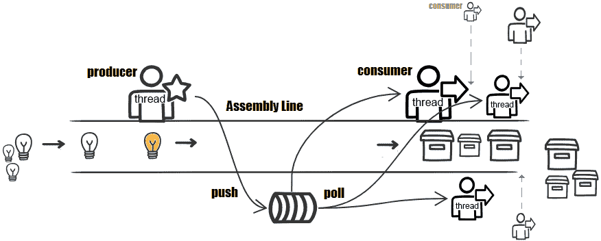
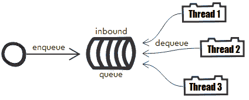
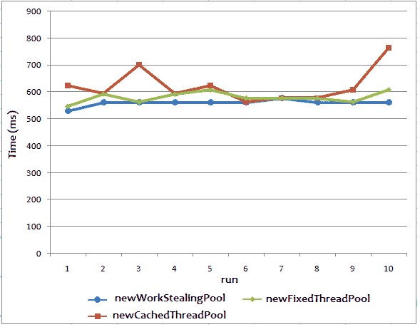
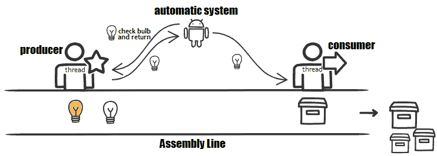
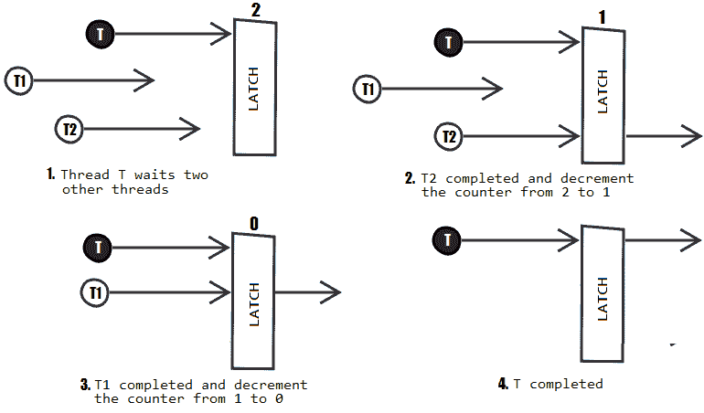
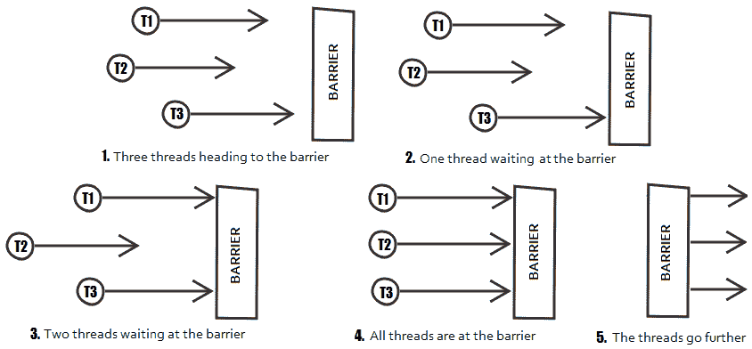

# 并发 - 线程池，可调用可和同步器

本章包括 14 个涉及 Java 并发的问题。 我们将从关于线程生命周期和对象和类级锁定的几个基本问​​题。 然后，我们在 Java 中继续有一堆关于线程池的问题，包括 JDK 8 工作窃取线程池。 之后，我们有专用于`Callable`和`Future`的问题。 然后，我们将几个问题致力于 Java Synchronizer（例如，屏障，信号量和交换机）。 到本章末尾，您应该熟悉 Java 并发的主要坐标，并准备继续使用一组高级问题。

# 问题

使用以下问题测试您的并发规划实力。 我强烈建议您在转向解决方案并下载示例程序之前尝试举出每个问题：

199.  **螺纹生命周期状态状态**：写几个程序捕获线程的每个生命周期状态。
200.  **对象 - 与类级别锁定**：写几个例子通过线程同步举例说明对象与类级锁定的示例。
201.  **Java** 中的线程池：简要概述 Java 中的线程池。
202.  **带有单个线程的线程池**：编写一个程序，用于模拟用于使用两个工人检查和打包灯泡的装配线。
203.  **带有固定数量的线程**的线程池：写一个程序，用于模拟使用多个工人检查和打包灯泡的装配线。

204.  **缓存** **和计划的线程池**：编写一个程序，用于根据需要使用工人检查和打包灯泡的程序集（例如，调整包装数量（增加或减少） 摄取由检查器产生的进入的助焊剂）。
205.  **工作窃取线程池**：写一个依赖于窃取的线程池的程序。 更确切地说，写一个程序，用于模拟用于检查和打包灯泡的装配线，如下所示：在白天进行检查，并在夜间进行包装。 检查过程每天都会导致 1500 万个灯泡。
206.  **`Callable`和`Future`** ：写一个程序，该程序模拟使用`Callable`和`Future`检查和打包灯泡的程序集。
207.  **调用多个`Callable`任务**：写一个程序，用于模拟用于检查和打包灯泡的装配线，如下所示：在白天进行检查，并在晚上进行包装。 检查过程每天都会导致 100 个灯泡的队列。 包装过程应打包并立即返回所有灯泡。 换句话说，我们应该提交所有`Callable`任务并等待所有这些任务以完成。
208.  **锁存**：写一个依赖于`CountDownLatch`的程序来模拟启动服务器的过程。 在其内部服务启动后，服务器被视为已启动。 可以同时启动服务，并且彼此独立。
209.  **障碍**：写一个依赖于`CyclicBarrier`的程序来模拟启动服务器的过程。 在其内部服务启动后，服务器被视为已启动。 服务可以编辑准备（这是耗时的），但它们运行相互依赖 - 因此，一旦他们准备开始，他们必须立即启动。
210.  **交换机**：写一个使用`Exchanger`模拟模拟的程序，用于使用两个工人检查和打包灯泡的装配线。 工人（检查员）正在检查灯泡并在篮子里添加它们。 当篮子满了时，工人将其赋予其他工作人员（包装机）从他们收到空篮子。 该过程重复直到装配线停止。
211.  **信号量**：写一个程序，用于在理发店使用每天使用一个`Semaphore`。 主要是，我们的理发店一次最多可为三个人提供服务（它只有三个席位）。 当一个人到达理发店时，他们试图坐下。 在他们被理发师提供服务之后，该人释放座位。 如果一个人到达理发店，当所有三个席位都被采取时，他们必须等待一定的时间。 如果这次经过时间，并且没有座位被释放，他们会离开理发店。

212.  **pheras** **s** ：写一个依赖于`Phaser`的程序来模拟三相启动服务器的过程。 在五个内部服务启动后，服务器被视为已被视为已启动。 在第一阶段，我们需要同时启动三个服务。 在第二阶段，我们需要同时启动两种服务（只有前三个已经运行时才可以启动）。 在第三阶段，服务器执行最终登记入住并被视为已启动。

# 解决方案

以下部分描述了前一个问题的解决方案。 请记住，通常不仅仅是解决特定问题的正确方法。 此外，请记住，这里所示的解释仅包括解决问题所需的最有趣和重要的细节。 下载示例解决方案以查看其他详细信息，并在 [https://github.com/packtpublishing/java-coding-problems](https://github.com/PacktPublishing/Java-Coding-Problems) 上进行实验。

# 线程生命周期状态

Java 线程的状态通过`Thread.State`枚举表示。 Java 线程的可能状态显示在下图中：


不同的生命周期状态如下：

*   **new** 状态
*   **可运行的**状态
*   **阻止**状态
*   **等待**状态
*   **timed_waiting** 状态
*   **终止**状态

让我们了解以下部分中的所有不同状态。

# 新的状态

如果创建但未启动，则 Java 线程在**新的**状态（线程构造函数在 **new** 状态）中创建线程）。 这是它状态，直到调用`start()`方法。 本书捆绑的代码包含多个代码代码，这些代码通过不同的施工技术，包括 Lambdas。 对于简洁起见，以下是以下结构之一：

```
public class NewThread {

  public void newThread() {
    Thread t = new Thread(() -> {});
    System.out.println("NewThread: " + t.getState()); // NEW
  }
}

NewThread nt = new NewThread();
nt.newThread();
```

# 可抵押州

通过调用`start()`方法获得从**新的**至 **RUNATNABLE** 的转换。 在此状态下，线程可以运行或准备运行。 当它准备好运行时，线程正在等待 JVM 线程调度程序来分配所需的资源和运行时间。 一旦处理器可用，线程调度程序将运行线程。

以下代码片段应打印 **Runnable** ，因为我们在调用`start()`后打印线程的状态。 但由于线程调度程序内部机制，这不是保证：

```
public class RunnableThread {

  public void runnableThread() {
    Thread t = new Thread(() -> {});
    t.start();

    // RUNNABLE
    System.out.println("RunnableThread : " + t.getState()); 
 }
}

RunnableThread rt = new RunnableThread();
rt.runnableThread();
```

# 被封锁的状态

当线程尝试执行 I / O 任务或同步块时，它可以进入**阻塞**状态。 例如，如果线程`t1`，尝试进入已被另一个线程访问的同步代码块`t2`，则将`t1`保持在**阻塞的**状态 它可以获得锁定。

此方案在以下代码片段中塑造：

1.  创建两个线程：`t1`和`t2`。
2.  通过`start()`方法启动`t1`：
    1.  `t1`将执行`run()`方法，并将获取同步方法的锁，`syncMethod()`。
    2.  `syncMethod()`将永远保持`t1`，因为它具有无限循环。
3.  经过两秒钟（任意时间），通过`start()`方法启动`t2`：
    1.  `t2`将执行`run()`代码，并将在**中最终封锁**状态，因为它无法获取`syncMethod()`的锁定。

代码片段如下：

```
public class BlockedThread {

  public void blockedThread() {

    Thread t1 = new Thread(new SyncCode());
    Thread t2 = new Thread(new SyncCode());

    t1.start();
    Thread.sleep(2000);
    t2.start();
    Thread.sleep(2000);

    System.out.println("BlockedThread t1: " 
      + t1.getState() + "(" + t1.getName() + ")");
    System.out.println("BlockedThread t2: " 
      + t2.getState() + "(" + t2.getName() + ")");

    System.exit(0);
  }

  private static class SyncCode implements Runnable {

    @Override
    public void run() {
      System.out.println("Thread " + Thread.currentThread().getName() 
        + " is in run() method");
      syncMethod();
    }

    public static synchronized void syncMethod() {
      System.out.println("Thread " + Thread.currentThread().getName() 
        + " is in syncMethod() method");

      while (true) {
        // t1 will stay here forever, therefore t2 is blocked
      }
    }
  }
}

BlockedThread bt = new BlockedThread();
bt.blockedThread();
```

这是一个可能的输出（线程的名称可能与此处不同）：

```
Thread Thread-0 is in run() method
Thread Thread-0 is in syncMethod() method
Thread Thread-1 is in run() method
BlockedThread t1: RUNNABLE(Thread-0)
BlockedThread t2: BLOCKED(Thread-1)
```

# 等待状态

一个线程`t1`，等待（没有超时时段）的`t2`，完成在**中等待**状态。

此方案在以下代码片段中塑造：

1.  创建一个线程：`t1`。
2.  通过`start()`方法启动`t1`。
3.  在`run()`的`run()`方法中：
    1.  创建另一个线程：`t2`。
    2.  通过`start()`方法启动`t2`。
    3.  虽然`t2`正在运行，但调用`t2.join()` -since `t2`需要加入`t1`（或者，换句话说，`t1`需要等待`t2`死），`t1`在**等待**状态。
4.  在`t2`的`run()`方法中，`t2`打印`t1`的状态，应该是**等待**（在打印`t1`状态时，`t2`正在运行，因此`t1` 在等待）。

代码片段如下：

```
public class WaitingThread {

  public void waitingThread() {
    new Thread(() -> {
      Thread t1 = Thread.currentThread();
      Thread t2 = new Thread(() -> {

        Thread.sleep(2000);
        System.out.println("WaitingThread t1: " 
          + t1.getState()); // WAITING
      });

      t2.start();

      t2.join();

    }).start();
  }
}

WaitingThread wt = new WaitingThread();
wt.waitingThread();
```

# 时间 _waiting 状态

在`t2`中，等待用于另一个线程的显式时间的线程`t1`，以完成 **timed_waiting** 状态。

此方案在以下代码片段中塑造：

1.  创建一个线程：`t1`。
2.  通过`start()`方法启动`t1`。
3.  在`t1`的`run()`方法中，添加两秒钟（任意时间）的睡眠时间。
4.  虽然`t1`正在运行，主线程打印`t1`状态 - 状态应该是 **timed_waiting** ，因为`t1`是在两秒钟后到期的`sleep()`。

代码片段如下：

```
public class TimedWaitingThread {

  public void timedWaitingThread() {
    Thread t = new Thread(() -> {
      Thread.sleep(2000);
    });

    t.start();

    Thread.sleep(500);

    System.out.println("TimedWaitingThread t: " 
      + t.getState()); // TIMED_WAITING
  }
}

TimedWaitingThread twt = new TimedWaitingThread();
twt.timedWaitingThread();
```

# 终止的状态

成功完成其作业或异常中断的线程在**终止**状态。 这是非常简单的模拟，如在以下代码片段中（应用程序的主线程打印线程的状态，`t` - 当发生这种情况时，线程，`t`，已完成其工作）：

```
public class TerminatedThread {

  public void terminatedThread() {
    Thread t = new Thread(() -> {});
    t.start();

    Thread.sleep(1000);

    System.out.println("TerminatedThread t: " 
      + t.getState()); // TERMINATED
  }
}

TerminatedThread tt = new TerminatedThread();
tt.terminatedThread();
```

要编写线程安全类，我们可以考虑以下技术：

*   没有*状态*（没有实例的类和`static`变量）
*   具有*状态，*但不共享它（例如，通过`Runnable`，`ThreadLocal`等，使用实例变量）
*   具有*状态，*，但是一个不可变的*状态*
*   使用消息传递（例如，作为 Akka 框架）
*   使用`synchronized`块
*   使用`volatile`变量
*   使用`java.util.concurrent`包中的数据结构
*   使用 Synchronizer（例如，`CountDownLatch`和`Barrier`）
*   使用`java.util.concurrent.locks`包中的锁定

# 200.对象 - 与类级锁定

在 Java 中，一个标记为`synchronized`的代码块可以一次由一个线程执行。 由于 Java 是多线程环境（它支持并发），因此需要一个同步机制来避免特定于并发环境的问题（例如，死锁和内存一致性）。

线程可以在对象级别或在类级别实现锁定。

# 锁定对象级别

通过标记非`static`代码块或非`static`方法（该方法的对象的锁对象）与`synchronized`，可以实现对象级别的锁定。 在以下示例中，将允许在类的给定实例上执行一次的一个线程，以执行`synchronized`方法/块：

*   同步方法案例：

```
public class ClassOll {
  public synchronized void methodOll() {
    ...
  }
}
```

*   同步代码块：

```
public class ClassOll {
  public void methodOll() {
    synchronized(this) {
      ...
    }
  }
}
```

*   另一个同步代码块：

```
public class ClassOll {

  private final Object ollLock = new Object();
  public void methodOll() {
    synchronized(ollLock) {
      ...
    }
  }
}
```

# 锁定课程级别

为了保护`static`数据，可以通过标记`static`方法/块或获取`synchronized`的`.class`参考的锁定来实现在类级别的锁定。 在以下示例中，将仅允许在运行时执行一个可用实例的一个线程一次执行`synchronized`块：

*   `synchronized static`方法：

```
public class ClassCll {

  public synchronized static void methodCll() {
    ...
  }
}
```

*   同步块并锁定`.class`：

```
public class ClassCll {

  public void method() {
    synchronized(ClassCll.class) {
      ...
    }
  }
}
```

*   同步代码块并锁定其他一些`static`对象：

```
public class ClassCll {

  private final static Object aLock = new Object();

  public void method() {
    synchronized(aLock) {
      ...
    }
  }
}
```

# 很高兴知道

以下是一些常见的案例意味着同步：

*   两个线程可以同时执行`synchronized static`方法和同一类的非`static`方法（参见`P200_ObjectVsClassLevelLocking`应用程序的`OllAndCll`类）。 这有效，因为线程在不同对象上获取锁。

*   两个线程不能同时执行同一类的两个不同的`synchronized static`方法（或检查`P200_ObjectVsClassLevelLocking`应用程序的`TwoCll`类）。 这不起作用，因为第一个线程获取类级锁。 因此，以下组合将输出`staticMethod1(): Thread-0`，因此只有一个线程执行一个`static synchronized`方法：

```
TwoCll instance1 = new TwoCll();
TwoCll instance2 = new TwoCll();
```

*   两个线程，两个实例：

```
new Thread(() -> {
  instance1.staticMethod1();
}).start();

new Thread(() -> {
  instance2.staticMethod2();
}).start();
```

*   两个线程，一个实例：

```
new Thread(() -> {
  instance1.staticMethod1();
}).start();

new Thread(() -> {
  instance1.staticMethod2();
}).start();
```

*   两个线程可以同时执行非`synchronized`，`synchronized static`和`synchronized`非`static`方法（检查`P200_ObjectVsClassLevelLocking`应用程序的`OllCllAndNoLock`类）。

*   从需要相同锁的同一类的另一个`synchronized`方法呼叫`synchronized`方法是安全的。 这是因为`synchronized`是*重新参加者*（只要它是相同的锁，就在第二种方法中使用了为第一种方法获取的锁定）。 检查`P200_ObjectVsClassLevelLocking`应用程序的`TwoSyncs`类。

作为经验的规则，`synchronized`关键字可以仅使用`static` / non-`static`方法（不是构造函数）/代码块使用。 避免同步非`final`字段和`String`文字（通过`new`创建的`String`的实例是 OK）。

# 201\. Java 中的线程池

线程池是可用于执行任务的线程集合。 线程池负责管理其线程的创建，分配和生命周期，并有助于更好的性能。 现在，让我们谈谈执行者。

# 执行者

在`java.util.concurrent`包中，有一堆专用于执行任务的接口。 最简单的一个名为`Executor`。 此接口公开了一个名为`execute​(Runnable command)`的单个方法。 以下是使用此方法执行单个任务的示例：

```
public class SimpleExecutor implements Executor {

  @Override
  public void execute(Runnable r) {
    (new Thread(r)).start();
  }
}

SimpleExecutor se = new SimpleExecutor();

se.execute(() -> {
  System.out.println("Simple task executed via Executor interface");
});
```

# Executorservice.

提供许多其他方法的更复杂和全面的界面是`ExecutorService`。 这是`Executor`的丰富版本。 Java 附带了`ExecutorService`的完全成熟的实现，名为`ThreadPoolExecutor`。 这是一个线程池，可以用一堆参数实例化，如下所示：

```
ThreadPoolExecutor​(
  int corePoolSize,
  int maximumPoolSize,
  long keepAliveTime,
  TimeUnit unit,
  BlockingQueue<Runnable> workQueue,
  ThreadFactory threadFactory,
  RejectedExecutionHandler handler)
```

以下是前面代码中实例化的每个参数的简短描述：

*   `corePoolSize`：保持池中的线程数，即使它们是空闲的（除非设置`allowCoreThreadTimeOut`）
*   `maximumPoolSize`：允许的线程的最大数量
*   `keepAliveTime`：经过此时间后，将从池中删除空闲线程（这些是超过`corePoolSize`的空闲线程）
*   `unit`：`keepAliveTime`参数的时间单位
*   `workQueue`：用于保存`Runnable`实例的队列（仅在执行`execute()`方法之前仅由`execute()`方法提交的`Runnable`任务）
*   `threadFactory`：当 executor 创建新线程时，使用此工厂
*   `handler`：当`ThreadPoolExecutor`由于饱和度而无法执行`Runnable`时，这是线程限制和队列容量已满（例如，`workQueue`具有固定尺寸，并且也设置了`maximumPoolSize`） - 它为此处理程序提供了控制和决定

为了优化池大小，我们需要收集以下信息：

*   CPU 数量（`Runtime.getRuntime().availableProcessors()`）
*   目标 CPU 利用率（范围，[0,1]）

*   等待时间（w）
*   计算时间（c）

以下公式有助于我们确定池的最佳大小：

```
Number of threads 
  = Number of CPUs * Target CPU utilization * (1 + W/C)
```

作为一项经验法则，对于计算密集型任务（通常是小型任务），它可以是一个好主意，将线程池基准，其中线程数与处理器数量或处理器数量+ 1 相等（以防止潜在的暂停 ）。 对于耗时和阻塞任务（例如，I / O），较大的池更好，因为线程不会以高速速率调度。 此外，请注意与其他池的干扰（例如，数据库连接池和套接字连接池）。

让我们看一下`ThreadPoolExecutor`的示例：

```
public class SimpleThreadPoolExecutor implements Runnable {

  private final int taskId;

  public SimpleThreadPoolExecutor(int taskId) {
    this.taskId = taskId;
  }

  @Override
  public void run() {
    Thread.sleep(2000);
    System.out.println("Executing task " + taskId 
      + " via " + Thread.currentThread().getName());
  }

  public static void main(String[] args) {

    BlockingQueue<Runnable> queue = new LinkedBlockingQueue<>(5);
    final AtomicInteger counter = new AtomicInteger();

    ThreadFactory threadFactory = (Runnable r) -> {
      System.out.println("Creating a new Cool-Thread-" 
        + counter.incrementAndGet());

      return new Thread(r, "Cool-Thread-" + counter.get());
    };

    RejectedExecutionHandler rejectedHandler
      = (Runnable r, ThreadPoolExecutor executor) -> {
        if (r instanceof SimpleThreadPoolExecutor) {
          SimpleThreadPoolExecutor task=(SimpleThreadPoolExecutor) r;
          System.out.println("Rejecting task " + task.taskId);
        }
    };

    ThreadPoolExecutor executor = new ThreadPoolExecutor(10, 20, 1,
      TimeUnit.SECONDS, queue, threadFactory, rejectedHandler);

    for (int i = 0; i < 50; i++) {
      executor.execute(new SimpleThreadPoolExecutor(i));
    }

    executor.shutdown();
    executor.awaitTermination(
      Integer.MAX_VALUE, TimeUnit.MILLISECONDS);
  }
}
```

`main()`方法触发`Runnable`的 50 个实例。 每个`Runnable`睡眠两秒钟并打印一条消息。 工作队列限制为`Runnable` - 核心线程的五个实例，到 10，最大线程数为 20，以及空闲超时到一秒钟。 可能的输出将如下所示：

```
Creating a new Cool-Thread-1
...
Creating a new Cool-Thread-20
Rejecting task 25
...
Rejecting task 49
Executing task 22 via Cool-Thread-18
...
Executing task 12 via Cool-Thread-2
```

# scheduledexecutorservice.

`ScheduledExecutorService`是一个`ExecutorService`，其可以在给定延迟之后计划执行任务，或者周期性地执行。 在这里，我们具有诸如`schedule()`，`scheduleAtFixedRate()`和`scheduleWithFixedDelay​()`的方法。 虽然`schedule()`用于单次任务，但是`scheduleAtFixedRate()`和`scheduleWithFixedDelay()`用于定期任务。

# 通过 executors 进行线程池

进一步一步，我们介绍了辅助级`Executors`。 此类使用以下方法公开多种类型的线程池：

*   `newSingleThreadExecutor()`：这是一个带有无界队列的一个线程管理一个线程的线程池，只有一次执行一个任务：

```
ExecutorService executor 
  = Executors.newSingleThreadExecutor();
```

*   `newCachedThreadPool()`：这是一个线程池，它创建新线程，并在需要时删除空闲线程（60 秒后）; 核心池大小为 0，最大池大小为`Integer.MAX_VALUE`（当需求在需求减少时需求增加和收缩时，此螺纹池扩展）：

```
ExecutorService executor = Executors.newCachedThreadPool();
```

*   `newFixedThreadPool()`：这是一个带有固定数量的线程和无界限队列的线程池，它会创建无限超时的效果（核心池大小，最大池大小等于指定大小）：

```
ExecutorService executor = Executors.newFixedThreadPool(5);
```

*   `newWorkStealingThreadPool()`：这是一个基于工作窃取算法的线程池（它用作叉/加入框架的图层）：

```
ExecutorService executor = Executors.newWorkStealingPool();
```

*   `newScheduledThreadPool()`：一个线程池，可以在给定延迟之后调度命令，或定期执行（我们可以指定核心池大小）：

```
ScheduledExecutorService executor 
  = Executors.newScheduledThreadPool(5);
```

# 202.带有单个线程的线程池

为了展示如何使用单个线程的线程池是如何运作的，假设我们想编写模拟用于使用两个工人检查和打包灯泡的装配线（或传送器）的程序。

通过*检查*，我们了解工作人员测试是否灯泡亮起。 通过*包装*，我们了解工作人员拍摄验证灯泡并将其放在一个框中。 这种过程几乎在任何工厂都很常见。

这两名工人如下：

*   一个所谓的生产者（或检查器），负责测试每个灯泡，以查看灯泡是否亮起
*   一个所谓的消费者（或包装机），负责将每个被检查的灯泡打包到一个框中

这种问题是完美的适用于下图所示的生产者 - 消费者设计模式：


最常见的是，在这种模式中，生产者和消费者通过队列（生产者划分数据和消费者出席数据数据）进行通信。 此队列称为*数据缓冲区*。 当然，根据过程设计，其他数据结构也可以播放数据缓冲区的作用。

现在，让我们看看我们如何在生产者等待消费者可用的情况下实现这种模式。

后来，我们将为不等待消费者的制作人实施这种模式。

# 生产者等待消费者可用

当装配线启动时，生产者将一个接一个地检查入射灯泡，而消费者将它们包装（一个灯泡进入每个框）。 该流程重复，直到装配线停止。

下图是**生产者**和**消费者之间的该流程的图形表示**：


我们可以考虑装配线我们工厂的助手，因此它可以作为助手或实用类实现（当然，它也可以很容易地切换到非`static`实现，因此随时可以自由地进行开关 如果它对您的案例更有意义）：

```
public final class AssemblyLine {

  private AssemblyLine() {
    throw new AssertionError("There is a single assembly line!");
  }
  ...
}
```

当然，有很多方法可以实现这种方案，但我们有兴趣使用 Java `ExecutorService`，更准确地说`Executors.newSingleThreadExecutor()`。 使用此方法创建使用从未绑定的队列运行的单个 Worker 线程的`Executor`。

我们只有两名工人，所以我们可以使用两个`Executor`的实例（`Executor`会向生产者提供电，另一个会向消费者提供电）。 因此，生产者将是一个线程，消费者将是另一个线程：

```
private static ExecutorService producerService;
private static ExecutorService consumerService;
```

自从生产者和消费者是好朋友，他们决定基于一个简单的场景：

*   制作人只有在消费者不忙的情况下才能检查灯泡并将其传递给消费者（如果消费者忙，则生产者将等待一段时间，直到消费者是免费的）
*   生产者不会检查下一个灯泡，直到他们设法将当前灯泡传递给消费者
*   消费者会尽快打包每个进入的灯泡

此方案适用于`TransferQueue`或`SynchronousQueue`，该过程执行与上述场景非常相似的过程。 让我们使用`TransferQueue`。 这是一个`BlockingQueue`，生产者可以等待消费者接收元素。 `BlockingQueue`实现是线程安全的：

```
private static final TransferQueue<String> queue 
  = new LinkedTransferQueue<>();
```

制作人和消费者之间的工作流程是**首先在首先**类型（ **FIFO** ：第一个灯泡被选中是第一个灯泡包装）因此`LinkedTransferQueue`可以是一个不错的选择。

一旦装配线开始，生产者将连续检查灯泡，因此我们可以将其作为一个如下实施：

```
private static final int MAX_PROD_TIME_MS = 5 * 1000;
private static final int MAX_CONS_TIME_MS = 7 * 1000;
private static final int TIMEOUT_MS = MAX_CONS_TIME_MS + 1000;
private static final Random rnd = new Random();
private static volatile boolean runningProducer;
...
private static class Producer implements Runnable {

  @Override
  public void run() {
    while (runningProducer) {
      try {
        String bulb = "bulb-" + rnd.nextInt(1000);

        Thread.sleep(rnd.nextInt(MAX_PROD_TIME_MS));

        boolean transfered = queue.tryTransfer(bulb,
          TIMEOUT_MS, TimeUnit.MILLISECONDS);

        if (transfered) {
          logger.info(() -> "Checked: " + bulb);
        }
      } catch (InterruptedException ex) {
        Thread.currentThread().interrupt();
        logger.severe(() -> "Exception: " + ex);
        break;
      }
    }
  }
}
```

因此，生产者通过`tryTransfer()`方法将被检查的灯泡传送到消费者。 如果在超时过去之前可以将元素传输到消费者，则此方法将执行此操作。

避免使用`transfer()`方法，该方法可以无限期地阻止线程。

为了模拟所花费的生产者检查灯泡的时间，相应的线程将睡眠在 0 到 5 之间的随机数（5 秒是检查灯泡所需的最长时间）。 如果在此之后不可用消费者，则会花更多的时间（在`tryTransfer()`中），直到消费者可用或超时时间。

另一方面，消费者使用另一个类实施，如下所示：

```
private static volatile boolean runningConsumer;
...
private static class Consumer implements Runnable {

  @Override
  public void run() {
    while (runningConsumer) {
      try {
        String bulb = queue.poll(
          MAX_PROD_TIME_MS, TimeUnit.MILLISECONDS);

        if (bulb != null) {
          Thread.sleep(rnd.nextInt(MAX_CONS_TIME_MS));
          logger.info(() -> "Packed: " + bulb);
        }
      } catch (InterruptedException ex) {
        Thread.currentThread().interrupt();
        logger.severe(() -> "Exception: " + ex);
        break;
      }
    }
  }
}
```

消费者可以通过`queue.take()`方法从生产者中占用灯泡。 此方法检索并删除此队列的头部，等待必要时，直到灯泡可用。 或者它可以调用`poll()`方法，其中检索和删除队列的头，或者如果此队列为空，则返回`null`。 但这两者都不适合我们。 如果生产者不可用，则消费者可能会保持在`take()`方法中。 另一方面，如果队列为空（制作人现在正在检查当前灯泡），则将再次调用`poll()`方法，并重要，导致虚拟重复。 对此的解决方案是`poll​(long timeout, TimeUnit unit)`。 此方法检索并删除此队列的头部，并在需要时等待指定的等待时间，以便灯泡可用。 只有在等待时间经过后队列时才会返回`null`。

为了模拟消费者花费灯泡的时间，相应的线程将睡觉在 0 到 7 之间的随机秒数（7 秒是打包灯泡所需的最长时间）。

启动 Producer 和 Consumer 是一个非常简单的任务，在命名为`startAssemblyLine()`的方法中，如下所示：

```
public static void startAssemblyLine() {

  if (runningProducer || runningConsumer) {
    logger.info("Assembly line is already running ...");
    return;
  }

  logger.info("\n\nStarting assembly line ...");
  logger.info(() -> "Remaining bulbs from previous run: \n"
    + queue + "\n\n");

  runningProducer = true;
  producerService = Executors.newSingleThreadExecutor();
  producerService.execute(producer);

  runningConsumer = true;
  consumerService = Executors.newSingleThreadExecutor();
  consumerService.execute(consumer);
}
```

停止装配线是一种精致的过程，可以通过不同的场景来解决。 主要是，当装配线停止时，生产者应检查当前灯泡，因为最后一个灯泡，消费者必须包装它。 生产者可能需要等待消费者在转移最后一个灯泡之前装箱他们的当前灯泡; 此外，消费者也必须打包这个灯泡。

为了遵循这种情况，我们首先停止制作人和消费者的第二名：

```
public static void stopAssemblyLine() {

  logger.info("Stopping assembly line ...");

  boolean isProducerDown = shutdownProducer();
  boolean isConsumerDown = shutdownConsumer();

  if (!isProducerDown || !isConsumerDown) {
    logger.severe("Something abnormal happened during
      shutting down the assembling line!");

    System.exit(0);
  }

  logger.info("Assembling line was successfully stopped!");
}

private static boolean shutdownProducer() {
  runningProducer = false;
  return shutdownExecutor(producerService);
}

private static boolean shutdownConsumer() {
  runningConsumer = false;
  return shutdownExecutor(consumerService);
}
```

最后，我们对生产者和消费者提供足够的时间，以正常停止（没有线程的中断）。 这在`shutdownExecutor()`方法中发生，如下：

```
private static boolean shutdownExecutor(ExecutorService executor) {

  executor.shutdown();

  try {
    if (!executor.awaitTermination(TIMEOUT_MS * 2,
        TimeUnit.MILLISECONDS)) {
      executor.shutdownNow();
      return executor.awaitTermination(TIMEOUT_MS * 2,
        TimeUnit.MILLISECONDS);
    }

    return true;
  } catch (InterruptedException ex) {
    executor.shutdownNow();
    Thread.currentThread().interrupt();
    logger.severe(() -> "Exception: " + ex);
  }

  return false;
}
```

我们确实的第一件事是将`runningProducer` `static`变量设置为`false`。 这将破坏`while(runningProducer)`，因此这将是最后一个灯泡检查。 此外，我们启动了生产者的关机程序。

在消费者的情况下，我们确实的第一件事就是将`runningConsumer` `static`变量设置为`false`。 这将破坏`while(runningConsumer)`，因此这将是最后一个灯泡包装。 此外，我们启动消费者的关机程序。

让我们看看可以执行装配行的执行（运行 10 秒）：

```
AssemblyLine.startAssemblyLine();
Thread.sleep(10 * 1000);
AssemblyLine.stopAssemblyLine();
```

可能的输出将如下：

```
Starting assembly line ...
...
[2019-04-14 07:39:40] [INFO] Checked: bulb-89
[2019-04-14 07:39:43] [INFO] Packed: bulb-89
...
Stopping assembly line ...
...
[2019-04-14 07:39:53] [INFO] Packed: bulb-322
Assembling line was successfully stopped!
```

一般来说，如果需要花费大量的时间来停止装配线（它就像它被阻止一样），那么生产者和消费者数量之间可能是不平衡的速率和/或生产和消费时间。 您可能需要添加或减去生产者或消费者。

# 生产者不等待消费者可用

如果生产者可以快速地检查灯泡比消费者包装它们，那么最可能他们会决定有以下工作流程：

*   生产者将一个接一个地检查灯泡，然后将它们推入队列中
*   消费者将从队列中调查并打包灯泡

由于消费者比生产者慢，因此队列将被检查但未包装的灯泡（我们可能认为有一个空队列的机会很低）。 在下图中，我们拥有生产者，消费者和用于存储检查但未包装灯泡的队列：


为了塑造这种情况，我们可以依赖于`ConcurrentLinkedQueue`（或`LinkedBlockingQueue`）。 这是一个基于链接节点的无限线程安全队列：

```
private static final Queue<String> queue 
  = new ConcurrentLinkedQueue<>();
```

为了在队列中推灯泡，生产者调用`offer()`方法：

```
queue.offer(bulb);
```

另一方面，消费者使用`poll()`方法从队列中处理灯泡（由于消费者比生产商慢，因此当`poll()`将返回`null`时，应该是一个罕见的情况：

```
String bulb = queue.poll();
```

让我们第一次启动装配线 10 秒钟。 这将输出以下内容：

```
Starting assembly line ...
...
[2019-04-14 07:44:58] [INFO] Checked: bulb-827
[2019-04-14 07:44:59] [INFO] Checked: bulb-257
[2019-04-14 07:44:59] [INFO] Packed: bulb-827
...
Stopping assembly line ...
...
[2019-04-14 07:45:08] [INFO] Checked: bulb-369
[2019-04-14 07:45:09] [INFO] Packed: bulb-690
...
Assembling line was successfully stopped!
```

此时，装配线停止，在队列中，我们有以下（这些灯泡已被检查，但未打包）：

```
[bulb-968, bulb-782, bulb-627, bulb-886, ...]
```

我们重新启动装配线并检查突出显示的线路，揭示消费者从他们停止的地方恢复工作：

```
Starting assembly line ...
[2019-04-14 07:45:12] [INFO ] Packed: bulb-968 [2019-04-14 07:45:12] [INFO ] Checked: bulb-812
[2019-04-14 07:45:12] [INFO ] Checked: bulb-470
[2019-04-14 07:45:14] [INFO ] Packed: bulb-782 [2019-04-14 07:45:15] [INFO ] Checked: bulb-601
[2019-04-14 07:45:16] [INFO ] Packed: bulb-627 ...
```

# 203.带有固定数量的线程的线程池

此问题重新使用单个线程部分的*线程池的方案。 这次，装配线使用三个生产商和两个消费者，如下图所示：*


我们可以依靠`Executors.newFixedThreadPool​(int nThreads)`来模拟固定数量的生产者和消费者。 我们每种生产商分配一个线程（分别为消费者），因此代码非常简单：

```
private static final int PRODUCERS = 3;
private static final int CONSUMERS = 2;
private static final Producer producer = new Producer();
private static final Consumer consumer = new Consumer();
private static ExecutorService producerService;
private static ExecutorService consumerService;
...
producerService = Executors.newFixedThreadPool(PRODUCERS);
for (int i = 0; i < PRODUCERS; i++) {
  producerService.execute(producer);
}

consumerService = Executors.newFixedThreadPool(CONSUMERS);
for (int i = 0; i < CONSUMERS; i++) {
  consumerService.execute(consumer);
}
```

生产者可以添加所检查的灯泡的队列可以是`LinkedTransferQueue`或`ConcurrentLinkedQueue`类型，等等。

可以在与本书捆绑在一起的代码中找到基于`LinkedTransferQueue`和`ConcurrentLinkedQueue`的完整源代码。

# 204.缓存和计划的线程池

此问题重新使用单个线程部分的*线程池的方案。 这一次，我们假设生产者（也可以使用多个生产者）检查灯泡不超过一秒钟。 此外，消费者（包装机）最多需要 10 秒钟来包装灯泡。 生产者和消费者时代可以塑造如下：*

```
private static final int MAX_PROD_TIME_MS = 1 * 1000;
private static final int MAX_CONS_TIME_MS = 10 * 1000;
```

显然，在这些条件下，一个消费者不能面对进入的助焊剂。 用于存储灯泡的队列，直到它们被包装将不断增加。 生产者将比消费者的轮询更快地添加到此队列。 因此，需要更多的消费者，如下图所示：



由于有一个生产商，我们可以依赖`Executors.newSingleThreadExecutor()`：

```
private static volatile boolean runningProducer;
private static ExecutorService producerService;
private static final Producer producer = new Producer();
...
public static void startAssemblyLine() {
  ...
  runningProducer = true;
  producerService = Executors.newSingleThreadExecutor();
  producerService.execute(producer);
  ...
}
```

除了`extraProdTime`变量之外，`Producer`几乎与先前问题相同：

```
private static int extraProdTime;
private static final Random rnd = new Random();
...
private static class Producer implements Runnable {

  @Override
  public void run() {
    while (runningProducer) {
      try {
        String bulb = "bulb-" + rnd.nextInt(1000);
        Thread.sleep(rnd.nextInt(MAX_PROD_TIME_MS) + extraProdTime);
        queue.offer(bulb);

        logger.info(() -> "Checked: " + bulb);
      } catch (InterruptedException ex) {
        Thread.currentThread().interrupt();
        logger.severe(() -> "Exception: " + ex);
        break;
      }
    }
  }
}
```

`extraProdTime`变量最初为 0.当我们减慢生产者时，将需要：

```
Thread.sleep(rnd.nextInt(MAX_PROD_TIME_MS) + extraProdTime);
```

在高速运行后，生产者会累了，需要更多的时间来检查每个灯泡。 如果生产者减缓生产率，消费者的数量也应该减少。

当生产者以高速运行时，我们需要更多的消费者（包装机）。 但有多少？ 使用固定数量的消费者（`newFixedThreadPool()`）将介绍至少两个缺点：

*   如果生产者在某时慢慢减速，一些消费者将仍然没有工作，并将简单地坚持下去
*   如果生产者变得更有效，则需要更多的消费者来面对进入的助焊剂

基本上，我们应该根据生产者效率来改变消费者的数量。

对于这些工作，我们有`Executors.newCachedThreadPool​()`。 缓存的线程池将重用现有线程，并根据需要创建新的线程（我们可以添加更多的消费者）。 如果尚未使用 60 秒（我们可以删除消费者），则线程从缓存中终止并从缓存中删除。

让我们从一个活跃的消费者开始：

```
private static volatile boolean runningConsumer;
private static final AtomicInteger 
  nrOfConsumers = new AtomicInteger();
private static final ThreadGroup threadGroup 
  = new ThreadGroup("consumers");
private static final Consumer consumer = new Consumer();
private static ExecutorService consumerService;
...
public static void startAssemblyLine() {
  ...
  runningConsumer = true;
  consumerService = Executors
    .newCachedThreadPool((Runnable r) -> new Thread(threadGroup, r));
  nrOfConsumers.incrementAndGet();
  consumerService.execute(consumer);
  ...
}
```

因为我们希望能够看到一个时刻有效的线程（消费者）是有效的，我们通过自定义`ThreadFactory`将它们添加在`ThreadGroup`中：

```
consumerService = Executors
  .newCachedThreadPool((Runnable r) -> new Thread(threadGroup, r));
```

稍后，我们将使用以下代码获取活动消费者的数量：

```
threadGroup.activeCount();
```

了解活动消费者的数量是一个良好的指示器，可以与灯泡队列的当前大小组合，以确定是否需要更多的消费者。

消费者实现列出如下：

```
private static class Consumer implements Runnable {

  @Override
  public void run() {

    while (runningConsumer && queue.size() > 0
                           || nrOfConsumers.get() == 1) {
      try {
        String bulb = queue.poll(MAX_PROD_TIME_MS 
           + extraProdTime, TimeUnit.MILLISECONDS);

        if (bulb != null) {
          Thread.sleep(rnd.nextInt(MAX_CONS_TIME_MS));
          logger.info(() -> "Packed: " + bulb + " by consumer: " 
            + Thread.currentThread().getName());
        }
      } catch (InterruptedException ex) {
        Thread.currentThread().interrupt();
        logger.severe(() -> "Exception: " + ex);
        break;
      }
    }

    nrOfConsumers.decrementAndGet();
    logger.warning(() -> "### Thread " +
      Thread.currentThread().getName() 
        + " is going back to the pool in 60 seconds for now!");
  }
}
```

假设装配线正在运行，只要队列不为空，消费者将继续打包灯泡，或者它们是唯一的消费者（我们不能拥有 0 个消费者）。 我们可以解释一个空队列意味着太多的消费者在那里。 因此，当消费者看到队列是空的并且它们不是唯一的工作消费者时，它们变得空闲（在 60 秒内，它们将自动从缓存的线程池中删除）。

不要将`nrOfConsumers`混淆`threadGroup.activeCount()`。 `nrOfConsumers`变量存储现在包装灯泡的消费者（线程）的数量，而`threadGroup.activeCount()`表示所有活动的消费者（线程），包括现在不工作的活动（空闲），只是等待重复使用或派遣 从缓存。

现在，在一个真正的情况下，一个主管将监控装配线，当他们注意到当前的消费者数量不能面对传入的流入时，他们会称之为更多的消费者加入（最多允许 50 个消费者）。 此外，当他们注意到一些消费者只是坚持下去，他们会向其他工作派遣他们。 下图是此方案的图形表示：


出于测试目的，我们的主管`newSingleThreadScheduledExecutor()`将是一个单线程的 executor，可以在指定的延迟之后安排给定的命令。 它也可以定期执行命令：

```
private static final int MAX_NUMBER_OF_CONSUMERS = 50;
private static final int MAX_QUEUE_SIZE_ALLOWED = 5;
private static final int MONITOR_QUEUE_INITIAL_DELAY_MS = 5000;
private static final int MONITOR_QUEUE_RATE_MS = 3000;
private static ScheduledExecutorService monitorService;
...
private static void monitorQueueSize() {

  monitorService = Executors.newSingleThreadScheduledExecutor();

  monitorService.scheduleAtFixedRate(() -> {
    if (queue.size() > MAX_QUEUE_SIZE_ALLOWED 
        && threadGroup.activeCount() < MAX_NUMBER_OF_CONSUMERS) {
      logger.warning("### Adding a new consumer (command) ...");

      nrOfConsumers.incrementAndGet();
      consumerService.execute(consumer);
    }

    logger.warning(() -> "### Bulbs in queue: " + queue.size() 
      + " | Active threads: " + threadGroup.activeCount() 
      + " | Consumers: " + nrOfConsumers.get() 
      + " | Idle: " + (threadGroup.activeCount() 
        - nrOfConsumers.get()));
  }, MONITOR_QUEUE_INITIAL_DELAY_MS, MONITOR_QUEUE_RATE_MS,
        TimeUnit.MILLISECONDS);
}
```

我们依靠`scheduleAtFixedRate()`以每三秒钟监控装配行，初始延迟五秒钟。 因此，在每三秒钟中，主管检查灯泡队列大小。 如果队列中有超过五个灯泡，并且监督员少于 50 个消费者，请求新的消费者加入装配线。 如果队列包含五个或更少的灯泡或已经有 50 个消费者，则主管不会采取任何行动。

如果我们立即启动装配线，我们可以看到消费者数量如何增加，直到队列尺寸少于六个。 可能的快照将如下：

```
Starting assembly line ...
[11:53:20] [INFO] Checked: bulb-488
...
[11:53:24] [WARNING] ### Adding a new consumer (command) ...
[11:53:24] [WARNING] ### Bulbs in queue: 7 
                       | Active threads: 2 
                       | Consumers: 2 
                       | Idle: 0
[11:53:25] [INFO] Checked: bulb-738
...
[11:53:36] [WARNING] ### Bulbs in queue: 23 
                       | Active threads: 6
                       | Consumers: 6
                       | Idle: 0
...
```

当有更多的线程时，它们中的一些人变得空闲。 如果 60 秒，他们没有收到作业，则从缓存中删除它们。 如果在没有空闲线程时发生作业，则将创建一个新线程。 此过程不断重复，直到我们注意到装配线中的余额。 过了一会儿，事情开始冷静下来，适当数量的消费者将处于一个小范围（小波动）。 这发生了，因为生产者以最多一秒的随机速度输出。

过了一段时间（例如 20 秒后），让我们放慢四秒（这样，灯泡可以在最多五秒钟现在选中）生产商：

```
private static final int SLOW_DOWN_PRODUCER_MS = 20 * 1000;
private static final int EXTRA_TIME_MS = 4 * 1000;
```

这可以使用另一个`newSingleThreadScheduledExecutor()`，如下所示：

```
private static void slowdownProducer() {

  slowdownerService = Executors.newSingleThreadScheduledExecutor();

  slowdownerService.schedule(() -> {
    logger.warning("### Slow down producer ...");
    extraProdTime = EXTRA_TIME_MS;
  }, SLOW_DOWN_PRODUCER_MS, TimeUnit.MILLISECONDS);
}
```

启动装配线后，这将仅发生一次。 由于生产速度减少了四秒钟，因此不需要具有相同数量的消费者来维持五个灯泡的队列。

这在输出中揭示，如图所示（注意，在某些时刻，只有一个消费者来处理队列）：

```
...
[11:53:36] [WARNING] ### Bulbs in queue: 23 
                       | Active threads: 6
                       | Consumers: 6
                       | Idle: 0
...
[11:53:39] [WARNING] ### Slow down producer ...
...
[11:53:56] [WARNING] ### Thread Thread-5 is going
                         back to the pool in 60 seconds for now!
[11:53:56] [INFO] Packed: bulb-346 by consumer: Thread-2
...
[11:54:36] [WARNING] ### Bulbs in queue: 1 
                       | Active threads: 12
                       | Consumers: 1
                       | Idle: 11
...
[11:55:48] [WARNING] ### Bulbs in queue: 3 
                       | Active threads: 1
                       | Consumers: 1 
                       | Idle: 0
...
Assembling line was successfully stopped!
```

启动主管在启动装配线后发生：

```
public static void startAssemblyLine() {
  ...
  monitorQueueSize();
  slowdownProducer();
}
```

完整的应用程序可在本书捆绑的代码中使用。

使用缓存线程池时，请注意创建的线程数以适应提交的任务数量。 虽然对于单线程和固定线程池，我们控制创建的线程的数量，缓存池可以决定创建太多线程。 基本上，无法控制地创建线程可以快速地耗尽资源。 因此，在易于过载的系统中，最好依赖固定线程池更好。

# 205.工作窃取线程池

让我们专注于包装过程，应该通过工作窃取线程池来实现。 要开始，让我们讨论窃取线程池的内容是什么，让我们通过与经典线程池进行比较来进行操作。 下图描绘了经典线程池的工作原理：



因此，线程池依赖于内部入站队列来存储任务。 每个线程必须排除任务并执行它。 这适用于当任务耗时时的情况，并且它们的数量相对较低。 另一方面，如果这些任务很多并且很小（它们需要少量时间），那么会有很多符号。 这不好，即使这是一个锁定的队列，问题并不完全解决。

为了减少争论和提高性能，线程池可以依赖于工作窃取算法和每个线程的队列。 在这种情况下，有一个中心站队列所有任务，并为每个线程（工作线程）的额外队列（被称为本地任务队列），如下图所示：


因此，每个线程将从中央队列中断任务并在自己的队列中浏览它们。 每个线程都有自己的本地任务队列。 此外，当线程想要处理任务时，它只是从其本地队列中排出任务。 只要其本地队列不为空，线程将继续从中处理任务而不打扰其他线程（没有其他线程的符号）。 当其本地队列为空时（如前图中的**线程 2** ），它试图从属于其他线程的本地队列中窃取（通过工作窃取算法）任务（例如 ，**螺纹 2** 从**螺纹 3** 窃取任务。 如果没有任何窃取任何窃取，它会访问共享中央入站队列。

每个本地队列实际上是 **DEQUE** （对于**的短端队列**），因此可以有效地从两端访问。 该线程将其排除为堆栈，这意味着它将从一端延时（添加新任务）和 Dequeue（拿走处理的任务）。 另一方面，当线程尝试从另一个线程的队列窃取时，它将访问另一端（例如，从**线程 3** 窃听**队列 结尾）。 因此，任务从一端处理并从另一端偷来。**

如果两个线程尝试从同一本地队列中窃取那么争用，但通常这应该是微不足道的。

我们刚刚描述的是在 JDK 7 中引入的叉子/加入框架，并在*中示例了 Fork / Join Framework* 部分。 从 JDK 8 开始，使用可用处理器的数量作为其目标并行级别，通过窃取工作窃取线程池中丰富的`Executors`类。 这通过`Executors.newWorkStealingPool()`和`Executors.newWorkStealingPool​(int parallelism)`可用。

让我们看看此线程池的源代码：

```
public static ExecutorService newWorkStealingPool() {

  return new ForkJoinPool(Runtime.getRuntime().availableProcessors(),
    ForkJoinPool.defaultForkJoinWorkerThreadFactory,
      null, true);
}
```

因此，在内部，此线程池通过以下构造函数实例化`ForkJoinPool`：

```
public ForkJoinPool​(int parallelism,
  ForkJoinPool.ForkJoinWorkerThreadFactory factory,
  Thread.UncaughtExceptionHandler handler,
  boolean asyncMode)
```

我们将并行性级别设置为`availableProcessors()`，默认的线程工厂返回新线程`Thread.UncaughtExceptionHandler`，传递为`null`，`asyncMode`设置为`true`。 将`asyncMode`设置为`true`意味着它首先授予本地**（**（ **fifo** ）调度模式，用于分叉，从未加入的任务。 此模式可能比依赖于工人线程仅处理事件样式异步任务的程序中的默认值（基于本地堆栈的）。****

尽管如此，否才会忘记当地任务队列和工作窃取算法仅在当工作线程在自己的本地队列中计划新任务时才能授权。 否则，`ForkJoinPool`只是一个`ThreadPoolExecutor`，额外的开销。

当我们直接使用`ForkJoinPool`时，我们可以指示任务在使用`ForkJoinTask`执行期间（通常，通过`RecursiveTask`或`RecursiveAction`）在执行期间明确安排新任务。

但由于`newWorkStealingPool()`是`ForkJoinPool`的更高级别的抽象，我们无法指示任务在执行期间明确安排新任务。 因此，`newWorkStealingPool()`将根据我们通过的任务来决定如何工作。 我们可以尝试在`newWorkStealingPool()`，`newCachedThreadPool()`和`newFixedThreadPool()`之间进行比较，并查看它们在两个方案中的执行方式：

*   对于大量的小任务
*   对于少量耗时的任务

让我们来看看下一节中这两个方案的解决方案。

# 大量的小任务

由于生产者（跳棋）和消费者（包装机）同时工作，我们可以通过琐碎的`for`循环轻松填充 15,000,000 灯泡的队列（我们对装配线的这一部分并不英比非常感兴趣 ）。 这在以下代码片段中显示：

```
private static final Random rnd = new Random();
private static final int MAX_PROD_BULBS = 15_000_000;
private static final BlockingQueue<String> queue 
  = new LinkedBlockingQueue<>();
...
private static void simulatingProducers() {
  logger.info("Simulating the job of the producers overnight ...");
  logger.info(() -> "The producers checked " 
    + MAX_PROD_BULBS + " bulbs ...");

  for (int i = 0; i < MAX_PROD_BULBS; i++) {
    queue.offer("bulb-" + rnd.nextInt(1000));
  }
}
```

此外，让我们创建一个默认的工作窃取线程池：

```
private static ExecutorService consumerService 
  = Executors.newWorkStealingPool();
```

有关比较，我们还将使用以下线程池：

*   一个缓存的线程池：

```
private static ExecutorService consumerService 
  = Executors.newCachedThreadPool();
```

*   使用可用处理器的数量作为线程数的固定线程池（默认工作窃取线程池作为并行级别使用处理器的数量）：

```
private static final Consumer consumer = new Consumer();
private static final int PROCESSORS 
  = Runtime.getRuntime().availableProcessors();
private static ExecutorService consumerService 
  = Executors.newFixedThreadPool(PROCESSORS);
```

而且，让我们开始 15,000,000 个小型任务：

```
for (int i = 0; i < queueSize; i++) {
  consumerService.execute(consumer);
}
```

`Consumer`包装简单的`queue.poll()`操作，因此它应该快速运行，如以下片段所示：

```
private static class Consumer implements Runnable {

  @Override
  public void run() {
    String bulb = queue.poll();

    if (bulb != null) {
      // nothing
    }
  }
}
```

以下图表表示 10 个运行的收集数据：


即使这不是专业的基准，我们也可以看到工作窃取的线程池已经获得了最佳结果，而缓存的线程轮询则具有更糟糕的结果。

# 少量耗时的任务

而不是用 15,000,000 灯泡填充队列，让我们填写 15 个队列，每个灯泡都有 1,000,000 灯泡：

```
private static final int MAX_PROD_BULBS = 15 _000_000;
private static final int CHUNK_BULBS = 1 _000_000;
private static final Random rnd = new Random();
private static final Queue<BlockingQueue<String>> chunks 
  = new LinkedBlockingQueue<>();
...
private static Queue<BlockingQueue<String>> simulatingProducers() {
  logger.info("Simulating the job of the producers overnight ...");
  logger.info(() -> "The producers checked " 
    + MAX_PROD_BULBS + " bulbs ...");

  int counter = 0;
  while (counter < MAX_PROD_BULBS) {
    BlockingQueue chunk = new LinkedBlockingQueue<>(CHUNK_BULBS);

    for (int i = 0; i < CHUNK_BULBS; i++) {
      chunk.offer("bulb-" + rnd.nextInt(1000));
    }

    chunks.offer(chunk);
    counter += CHUNK_BULBS;
  }

  return chunks;
}
```

而且，让我们使用以下代码启动 15 个任务：

```
while (!chunks.isEmpty()) {
  Consumer consumer = new Consumer(chunks.poll());
  consumerService.execute(consumer);
}
```

每个`Consumer`使用此代码循环 1,000,000 灯泡：

```
private static class Consumer implements Runnable {

  private final BlockingQueue<String> bulbs;

  public Consumer(BlockingQueue<String> bulbs) {
    this.bulbs = bulbs;
  }

  @Override
  public void run() {
    while (!bulbs.isEmpty()) {
      String bulb = bulbs.poll();

      if (bulb != null) {}
    }
  }
}
```

以下图表表示 10 个运行的收集数据：



这次，它看起来像是偷工的线程池作为常规线程池。

# 206.可谴责和未来

此问题重新使用单个线程部分的*线程池的方案。 我们希望单一的生产者和消费者遵循这种情况：*

1.  一个自动系统向生产者发送请求，说，*检查这个灯泡，如果没关系，那就返回给我，否则告诉我这个灯泡的出现问题*。
2.  自动系统等待生产者检查灯泡。

3.  当自动系统接收到检查的灯泡时，然后将其进一步传递给消费者（包装器）并重复该过程。
4.  如果灯泡具有缺陷，则生产者抛出异常（`DefectBulbException`），并且自动系统将检查问题的原因。

此方案在下图中示出：



为了塑造这种情况，生产者应该能够返回结果并抛出异常。 由于我们的生产者是`Runnable`，因此它不能做到任何一个。 但 Java 定义了一个名为`Callable`的接口。 这是一个功能界面，其方法名为`call()`。 与`Runnable`的`run()`方法相比，`call()`方法可以返回结果，甚至抛出异常`V call() throws Exception`。

这意味着生产者（Checker）可以写如下：

```
private static volatile boolean runningProducer;
private static final int MAX_PROD_TIME_MS = 5 * 1000;
private static final Random rnd = new Random();
...
private static class Producer implements Callable {

  private final String bulb;

  private Producer(String bulb) {
    this.bulb = bulb;
  }

  @Override
  public String call() 
      throws DefectBulbException, InterruptedException {

    if (runningProducer) {
      Thread.sleep(rnd.nextInt(MAX_PROD_TIME_MS));

      if (rnd.nextInt(100) < 5) {
        throw new DefectBulbException("Defect: " + bulb);
      } else {
        logger.info(() -> "Checked: " + bulb);
      }

      return bulb;
    }

    return "";
  }
}
```

执行器服务可以通过`submit()`方法将任务提交给`Callable`，但它不知道提交任务的结果将可用。 因此，`Callable`立即返回一个特殊类型，`Future`。 异步计算结果由 A `Future`表示--VIA `Future`我们可以在可用时获取任务的结果。 概念上讲，我们可以将`Future`视为 JavaScript 承诺，或者作为计算的计算结果将在稍后及时完成。 现在，让我们创建一个`Producer`并将其提交给`Callable`：

```
String bulb = "bulb-" + rnd.nextInt(1000);
Producer producer = new Producer(bulb);

Future<String> bulbFuture = producerService.submit(producer);
// this line executes immediately
```

由于`Callable`立即返回一个`Future`，我们可以在等待提交的任务结果的同时执行其他任务（如果完成此任务，则返回`isDone()`标志方法返回`true`，如果完成此任务）：

```
while (!future.isDone()) {
  System.out.println("Do something else ...");
}
```

检索`Future`的结果可以使用阻塞方法`Future.get()`来完成。 此方法块直到结果可用或已过时的指定超时（如果在超时之前不可用，则抛出 A `TimeoutException`）：

```
String checkedBulb = bulbFuture.get(
  MAX_PROD_TIME_MS + 1000, TimeUnit.MILLISECONDS);

// this line executes only after the result is available
```

结果可用后，我们可以将其传递给`Consumer`并将另一个任务提交给`Producer`。 只要消费者和生产者正在运行，这个循环重复。 以下代码如下：

```
private static void automaticSystem() {

  while (runningProducer &amp;&amp; runningConsumer) {
    String bulb = "bulb-" + rnd.nextInt(1000);

    Producer producer = new Producer(bulb);
    Future<String> bulbFuture = producerService.submit(producer);
    ...
    String checkedBulb = bulbFuture.get(
      MAX_PROD_TIME_MS + 1000, TimeUnit.MILLISECONDS);

    Consumer consumer = new Consumer(checkedBulb);
    if (runningConsumer) {
      consumerService.execute(consumer);
    }
  }
  ...
}
```

`Consumer`仍然是一个`Runnable`，因此它无法返回结果或抛出异常：

```
private static final int MAX_CONS_TIME_MS = 3 * 1000;
...
private static class Consumer implements Runnable {

  private final String bulb;

  private Consumer(String bulb) {
    this.bulb = bulb;
  }

  @Override
  public void run() {
    if (runningConsumer) {
      try {
        Thread.sleep(rnd.nextInt(MAX_CONS_TIME_MS));
        logger.info(() -> "Packed: " + bulb);
      } catch (InterruptedException ex) {
        Thread.currentThread().interrupt();
        logger.severe(() -> "Exception: " + ex);
      }
    }
  }
}
```

最后，我们需要启动自动系统。 以下代码如下：

```
public static void startAssemblyLine() {
  ...
  runningProducer = true;
  consumerService = Executors.newSingleThreadExecutor();

  runningConsumer = true;
  producerService = Executors.newSingleThreadExecutor();

  new Thread(() -> {
    automaticSystem();
  }).start();
}
```

请注意，我们不想阻止主线程，因此我们在新线程中启动自动系统。 这样，主线程可以控制装配线的起始过程。

让我们运行装配线几分钟才能收集一些输出：

```
Starting assembly line ...
[08:38:41] [INFO ] Checked: bulb-879
...
[08:38:52] [SEVERE ] Exception: DefectBulbException: Defect: bulb-553
[08:38:53] [INFO ] Packed: bulb-305
...
```

好的，工作完成了！ 让我们解决最后一个主题。

# 取消将来

可以取消`Future`。 这是使用`cancel​(boolean mayInterruptIfRunning)`方法完成的。 如果我们将其传递为`true`，则执行任务的线程被中断，否则，线程可以完成任务。 如果任务成功取消，则此方法返回`true`，否则返回`false`（通常，因为它已正常完成）。 以下是一个简单的示例，如果需要超过一秒钟运行，则取消任务：

```
long startTime = System.currentTimeMillis();

Future<String> future = executorService.submit(() -> {
  Thread.sleep(3000);

  return "Task completed";
});

while (!future.isDone()) {
  System.out.println("Task is in progress ...");
  Thread.sleep(100);

  long elapsedTime = (System.currentTimeMillis() - startTime);

  if (elapsedTime > 1000) {
    future.cancel(true);
  }
}
```

如果在正常完成之前取消任务，则`isCancelled()`方法将返回`true`：

```
System.out.println("Task was cancelled: " + future.isCancelled() 
  + "\nTask is done: " + future.isDone());
```

输出将如下：

```
Task is in progress ...
Task is in progress ...
...
Task was cancelled: true
Task is done: true
```

以下是一些奖励示例：

*   使用`Callable`和 lambdas：

```
Future<String> future = executorService.submit(() -> {
  return "Hello to you!";
});
```

*   获取返回`null`的`Callable`通过`Executors.callable​(Runnable task)`：

```
Callable<Object> callable = Executors.callable(() -> {
  System.out.println("Hello to you!");
});

Future<Object> future = executorService.submit(callable);
```

*   获取返回结果（`T`）的`Callable`通过`Executors.callable​(Runnable task, T result)`：

```
Callable<String> callable = Executors.callable(() -> {
  System.out.println("Hello to you!");
}, "Hi");

Future<String> future = executorService.submit(callable);
```

# 207.调用多个可调用的任务

由于生产者（跳棋）与消费者（包装机）同时工作，我们可以通过 A `for`模拟其工作，该工作在队列中添加 100 个选中灯泡：

```
private static final BlockingQueue<String> queue 
  = new LinkedBlockingQueue<>();
...
private static void simulatingProducers() {

  for (int i = 0; i < MAX_PROD_BULBS; i++) {
    queue.offer("bulb-" + rnd.nextInt(1000));
  }
}
```

现在，消费者必须打包每个灯泡并返回它。 这意味着`Consumer`是`Callable`：

```
private static class Consumer implements Callable {

  @Override
  public String call() throws InterruptedException {
    String bulb = queue.poll();

    Thread.sleep(100);

    if (bulb != null) {
      logger.info(() -> "Packed: " + bulb + " by consumer: " 
        + Thread.currentThread().getName());

      return bulb;
    }

    return "";
  }
}
```

但请记住，我们应该提交所有`Callable`任务并等待所有这些任务，并等待所有这些任务。 这可以通过`ExecutorService.invokeAll()`方法来实现。 此方法采用 TASKS `(Collection<? extends Callable<T>>)`的集合，并返回`Future`（`List<Future<T>>`）作为参数的实例列表。 对`Future.get()`的任何呼叫将被阻止，直到`Future`的所有实例都完成。

所以，首先我们创建 100 个任务的列表：

```
private static final Consumer consumer = new Consumer();
...
List<Callable<String>> tasks = new ArrayList<>();
for (int i = 0; i < queue.size(); i++) {
  tasks.add(consumer);
}
```

此外，我们执行所有这些任务并获取`Future`的列表：

```
private static ExecutorService consumerService
  = Executors.newWorkStealingPool();
...
List<Future<String>> futures = consumerService.invokeAll(tasks);
```

最后，我们处理（在这种情况下，显示）结果：

```
for (Future<String> future: futures) {
  String bulb = future.get();
  logger.info(() -> "Future done: " + bulb);
}
```

请注意，第一次调用`future.get()`语句块，直到`Future`的所有实例都完成。 这将导致以下输出：

```
[12:06:41] [INFO] Packed: bulb-595 by consumer: ForkJoinPool-1-worker-9
...
[12:06:42] [INFO] Packed: bulb-478 by consumer: ForkJoinPool-1-worker-15
[12:06:43] [INFO] Future done: bulb-595
...
```

有时，我们希望提交几个任务并等待其中任何一个完成。 这可以通过`ExecutorService.invokeAny()`来实现。 与`invokeAll()`完全符合`invokeAll()`，此方法作为参数作为一个任务集合（`Collection<? extends Callable<T>>`）。 但它返回最快的任务（不是`Future`）的结果，并取消尚未完成的所有其他任务，例如：

```
String bulb = consumerService.invokeAny(tasks);
```

如果您不想等待所有`Future`完成，请按以下步骤操作：

```
int queueSize = queue.size();
List<Future<String>> futures = new ArrayList<>();
for (int i = 0; i < queueSize; i++) {
  futures.add(consumerService.submit(consumer));
}

for (Future<String> future: futures) {
  String bulb = future.get();
  logger.info(() -> "Future done: " + bulb);
}
```

这将不会阻止，直到所有任务完成。 看看以下输出样本：

```
[12:08:56] [INFO ] Packed: bulb-894 by consumer: ForkJoinPool-1-worker-7
[12:08:56] [INFO ] Future done: bulb-894
[12:08:56] [INFO ] Packed: bulb-953 by consumer: ForkJoinPool-1-worker-5
...
```

# 208.闩锁

A *锁存器*是 Java 同步器，允许一个或多个线程等待，直到其他线程中的一堆事件已经完成。 它从给定计数器开始（通常代表应该等待的事件数），并且每个完成的事件都负责递减计数器。 当计数器达到零时，所有等待线程都可以通过。 这是锁存器的终端状态。 锁存器无法重置或重复使用，因此等待的事件只能发生一次。 下图以四个步骤显示，有三个线程的锁存器有效：



在 API 术语中，使用`java.util.concurrent.CountDownLatch`实现锁存器。

初始计数器在`CountDownLatch`构造函数中设置为整数。 例如，具有等于`3`的计数器的`CountDownLatch`可以定义如下：

```
CountDownLatch latch = new CountDownLatch(3);
```

调用`await()`方法的所有线程将被阻止，直到计数器达到零。 因此，想要被阻止直到锁存器达到终端状态的线程将调用`await()`。 完成的每个事件都可以调用`countDown()`方法。 该方法用一个值递减计数器。 直到计数器变为零，仍然阻止称为`await()`的线程。

闩锁可用于各种问题。 目前，让我们专注于我们的问题，这应该模拟启动服务器的过程。 在其内部服务启动后，服务器被视为已启动。 可以同时启动服务，并且彼此独立。 启动服务器是一个需要一段时间的过程，并要求我们启动该服务器的所有基础服务。 因此，最终确定和验证服务器启动的线程应该等到所有服务器服务（事件）已启动其他线程。 如果我们假设我们有三个服务，我们可以编写一个`ServerService`课程如下：

```
public class ServerInstance implements Runnable {

  private static final Logger logger =
    Logger.getLogger(ServerInstance.class.getName());

  private final CountDownLatch latch = new CountDownLatch(3);

  @Override
  public void run() {
    logger.info("The server is getting ready to start ");
    logger.info("Starting services ...\n");

    long starting = System.currentTimeMillis();

    Thread service1 = new Thread(
      new ServerService(latch, "HTTP Listeners"));
    Thread service2 = new Thread(
      new ServerService(latch, "JMX"));
    Thread service3 = new Thread(
      new ServerService(latch, "Connectors"));

    service1.start();
    service2.start();
    service3.start();

    try {
      latch.await();
      logger.info(() -> "Server has successfully started in " 
        + (System.currentTimeMillis() - starting) / 1000 
        + " seconds");
    } catch (InterruptedException ex) {
      Thread.currentThread().interrupt();
      // log ex
    }
  }
}
```

首先，我们用三个柜台定义一个`CountDownLatch`。 其次，我们在三个不同的线程中开始服务。 最后，我们通过`await()`阻止此线程。 现在，以下类通过随机睡眠模拟服务的起始过程：

```
public class ServerService implements Runnable {

  private static final Logger logger =
    Logger.getLogger(ServerService.class.getName());

  private final String serviceName;
  private final CountDownLatch latch;
  private final Random rnd = new Random();

  public ServerService(CountDownLatch latch, String serviceName) {
    this.latch = latch;
    this.serviceName = serviceName;
  }

  @Override
  public void run() {

    int startingIn = rnd.nextInt(10) * 1000;

    try {
      logger.info(() -> "Starting service '" + serviceName + "' ...");

      Thread.sleep(startingIn);

      logger.info(() -> "Service '" + serviceName 
        + "' has successfully started in " 
        + startingIn / 1000 + " seconds");

    } catch (InterruptedException ex) {
      Thread.currentThread().interrupt();
      // log ex
    } finally {
      latch.countDown();

      logger.info(() -> "Service '" + serviceName + "' running ...");
    }
  }
}
```

成功启动（或失败）的每个服务都将通过`countDown()`递减锁存器。 一旦计数器达到零，服务器就被视为启动。 让我们称之为：

```
Thread server = new Thread(new ServerInstance());
server.start();
```

以下是一种可能的输出：

```
[08:49:17] [INFO] The server is getting ready to start

[08:49:17] [INFO] Starting services ...
[08:49:17] [INFO] Starting service 'JMX' ...
[08:49:17] [INFO] Starting service 'Connectors' ...
[08:49:17] [INFO] Starting service 'HTTP Listeners' ...

[08:49:22] [INFO] Service 'HTTP Listeners' started in 5 seconds
[08:49:22] [INFO] Service 'HTTP Listeners' running ...
[08:49:25] [INFO] Service 'JMX' started in 8 seconds
[08:49:25] [INFO] Service 'JMX' running ...
[08:49:26] [INFO] Service 'Connectors' started in 9 seconds
[08:49:26] [INFO] Service 'Connectors' running ...

[08:49:26] [INFO] Server has successfully started in 9 seconds
```

为了避免无限期等待，`CountDownLatch`类具有接受超时的`await()`味道`await​(long timeout, TimeUnit unit)`。 如果在计数达到零之前经过的等待时间，则此方法返回`false`。

# 209.障碍

A *屏障*是 Java 同步器，允许一组线程（称为*派对*）达到共同的阻挡点。 基本上，一组螺纹互相等待，以便在屏障中满足。 这就像一群决定一个会议点的朋友，当他们所有人都有这一点时，他们竟然在一起。 他们不会离开会议点，直到他们所有人到达或直到他们觉得他们一直在等待太久。

此同步器适用于依赖可分为子机构的任务的问题。 每个子任务都在不同的线程中运行，等待其余线程。 当所有线程完成时，它们会在单个结果中结合它们的结果。

以下图显示了具有三个线程的障碍流的示例：



在 API 术语中，使用`java.util.concurrent.CyclicBarrier`实现屏障。

可以通过两个构造函数构建`CyclicBarrier`：

*   其中一个允许我们指定派对的数量（这是一个整数）
*   另一个人允许我们添加一个应该在所有各方在障碍物旁边发生的动作（这是`Runnable`）

当聚会中的所有线程到达时，此操作会发生，但在发布任何线程之前。

当线程准备好在屏障时等待时，它只是调用`await()`方法。 此方法可以无限期地等待或直到指定的超时（如果指定的超时或线程中断，则此线程以`TimeoutException`释放;屏障被认为*破碎*，以及所有等待线程 屏障用`BrokenBarrierException`释放。 我们可以了解通过`getParties()`方法追踪该障碍所需的各方以及目前通过`getNumberWaiting()`方法等待多少派对。

`await()`方法返回一个整数，表示当前线程的到达索引，其中索引`getParties()` - 1 或 0 分别表示第一个或最后一个到达。

让我们假设我们要启动服务器。 在其内部服务启动后，服务器被视为已启动。 服务可以同时准备（这是耗时的），但它们运行相互依赖，因此，一旦他们准备开始，它们必须立即启动。

因此，可以准备每个服务在单独的线程中开始。 一旦它准备开始，线程将在其余服务的障碍处等待。 当所有人都准备好开始时，他们越过障碍并开始运行。 让我们考虑三个服务，所以`CyclicBarrier`可以定义如下：

```
Runnable barrierAction
  = () -> logger.info("Services are ready to start ...");

CyclicBarrier barrier = new CyclicBarrier(3, barrierAction);
```

并且，让我们通过三个线程准备服务：

```
public class ServerInstance implements Runnable {

  private static final Logger logger
    = Logger.getLogger(ServerInstance.class.getName());

  private final Runnable barrierAction
    = () -> logger.info("Services are ready to start ...");

  private final CyclicBarrier barrier 
    = new CyclicBarrier(3, barrierAction);

  @Override
  public void run() {
    logger.info("The server is getting ready to start ");
    logger.info("Starting services ...\n");

    long starting = System.currentTimeMillis();

    Thread service1 = new Thread(
      new ServerService(barrier, "HTTP Listeners"));
    Thread service2 = new Thread(
      new ServerService(barrier, "JMX"));
    Thread service3 = new Thread(
      new ServerService(barrier, "Connectors"));

    service1.start();
    service2.start();
    service3.start();

    try {
      service1.join();
      service2.join();
      service3.join();

      logger.info(() -> "Server has successfully started in " 
        + (System.currentTimeMillis() - starting) / 1000 
        + " seconds");
    } catch (InterruptedException ex) {
      Thread.currentThread().interrupt();
      logger.severe(() -> "Exception: " + ex);
    }
  }
}
```

`ServerService`负责准备每个服务以通过`await()`在屏障处启动和阻止它：

```
public class ServerService implements Runnable {

  private static final Logger logger =
    Logger.getLogger(ServerService.class.getName());

  private final String serviceName;
  private final CyclicBarrier barrier;
  private final Random rnd = new Random();

  public ServerService(CyclicBarrier barrier, String serviceName) {
    this.barrier = barrier;
    this.serviceName = serviceName;
  }

  @Override
  public void run() {

    int startingIn = rnd.nextInt(10) * 1000;

    try {
      logger.info(() -> "Preparing service '" 
        + serviceName + "' ...");

      Thread.sleep(startingIn);
      logger.info(() -> "Service '" + serviceName 
        + "' was prepared in " + startingIn / 1000 
        + " seconds (waiting for remaining services)");

      barrier.await();

      logger.info(() -> "The service '" + serviceName 
        + "' is running ...");
    } catch (InterruptedException ex) {
      Thread.currentThread().interrupt();
      logger.severe(() -> "Exception: " + ex);
    } catch (BrokenBarrierException ex) {
      logger.severe(() -> "Exception ... barrier is broken! " + ex);
    }
  }
}
```

现在，让我们运行它：

```
Thread server = new Thread(new ServerInstance());
server.start();
```

这是一个可能的输出（请注意，线程如何释放到跨国屏障）：

```
[10:38:34] [INFO] The server is getting ready to start

[10:38:34] [INFO] Starting services ...
[10:38:34] [INFO] Preparing service 'Connectors' ...
[10:38:34] [INFO] Preparing service 'JMX' ...
[10:38:34] [INFO] Preparing service 'HTTP Listeners' ...

[10:38:35] [INFO] Service 'HTTP Listeners' was prepared in 1 seconds
                  (waiting for remaining services)
[10:38:36] [INFO] Service 'JMX' was prepared in 2 seconds
                  (waiting for remaining services)
[10:38:38] [INFO] Service 'Connectors' was prepared in 4 seconds
                  (waiting for remaining services)

[10:38:38] [INFO] Services are ready to start ...

[10:38:38] [INFO] The service 'Connectors' is running ...
[10:38:38] [INFO] The service 'HTTP Listeners' is running ...
[10:38:38] [INFO] The service 'JMX' is running ...

[10:38:38] [INFO] Server has successfully started in 4 seconds
```

`CyclicBarrier`是循环的，因为它可以重置和重复使用。 为此，在释放屏障等待的所有线程之后调用`reset()`方法，否则将被抛出`BrokenBarrierException`。

在*中破碎的屏障*状态将导致`isBroken()`标志方法返回`true`。

# 210.交易所

*交换器*是一个 Java 同步器，允许两个线程在交换机或同步点处交换对象。

主要是，这种同步器充当屏障。 两个线程在障碍物上互相等待。 它们交换对象并在两者到达时继续惯常任务。

下图描绘了交换机流量的四个步骤：


在 API 术语中，此同步器由`java.util.concurrent.Exchanger`暴露。

可以通过空构造函数创建`Exchanger`并公开两个`exchange()`方法：

*   只能获得它将提供的对象
*   获取超时的一个（在另一个线程进入交换之前，如果指定的等待时间经过，将被抛出`TimeoutException`）。

记住我们的装配线为灯泡？ 嗯，让我们假设生产者（检查器）将被检查的灯泡添加到篮子中（例如，`List<String>`）。 当篮子充满时，生产者用消费者（包装器）与空篮子（例如，另一个`List<String>`）交换。 只要装配线正在运行，过程重复。

下图表表示此流程：


所以，首先我们需要`Exchanger`：

```
private static final int BASKET_CAPACITY = 5;
...
private static final Exchanger<List<String>> exchanger 
  = new Exchanger<>();
```

生产者填补了篮子，等待消费者的交换点：

```
private static final int MAX_PROD_TIME_MS = 2 * 1000;
private static final Random rnd = new Random();
private static volatile boolean runningProducer;
...
private static class Producer implements Runnable {

  private List<String> basket = new ArrayList<>(BASKET_CAPACITY);

  @Override
  public void run() {

    while (runningProducer) {
      try {
        for (int i = 0; i < BASKET_CAPACITY; i++) {

          String bulb = "bulb-" + rnd.nextInt(1000);
          Thread.sleep(rnd.nextInt(MAX_PROD_TIME_MS));
          basket.add(bulb);

          logger.info(() -> "Checked and added in the basket: " 
            + bulb);
        }

        logger.info("Producer: Waiting to exchange baskets ...");

        basket = exchanger.exchange(basket);
      } catch (InterruptedException ex) {
        Thread.currentThread().interrupt();
        logger.severe(() -> "Exception: " + ex);
        break;
      }
    }
  }
}
```

另一方面，消费者等待交换点，以从生产者那里接收充满灯泡的篮子，并在换货上给出空的篮子。 此外，虽然生产者再次填满了篮子，但消费者将灯泡从接收的篮子上包装。 当他们完成后，他们会再次进入交换点等待另一个完整的篮子。 因此，`Consumer`可以写如下：

```
private static final int MAX_CONS_TIME_MS = 5 * 1000;
private static final Random rnd = new Random();
private static volatile boolean runningConsumer;
...
private static class Consumer implements Runnable {

  private List<String> basket = new ArrayList<>(BASKET_CAPACITY);

  @Override
  public void run() {

    while (runningConsumer) {
      try {
        logger.info("Consumer: Waiting to exchange baskets ...");
        basket = exchanger.exchange(basket);
        logger.info(() -> "Consumer: Received the following bulbs: " 
          + basket);

        for (String bulb: basket) {
          if (bulb != null) {
            Thread.sleep(rnd.nextInt(MAX_CONS_TIME_MS));
            logger.info(() -> "Packed from basket: " + bulb);
          }
        }

        basket.clear();
      } catch (InterruptedException ex) {
        Thread.currentThread().interrupt();
        logger.severe(() -> "Exception: " + ex);
        break;
      }
    }
  }
}
```

为简洁起见，省略了其余代码。

现在，让我们看看可能的输出：

```
Starting assembly line ...
[13:23:13] [INFO] Consumer: Waiting to exchange baskets ...
[13:23:15] [INFO] Checked and added in the basket: bulb-606
...
[13:23:18] [INFO] Producer: Waiting to exchange baskets ...
[13:23:18] [INFO] Consumer: Received the following bulbs:
[bulb-606, bulb-251, bulb-102, bulb-454, bulb-280]
[13:23:19] [INFO] Checked and added in the basket: bulb-16
...
[13:23:21] [INFO] Packed from basket: bulb-606
...
```

# 211.信号群

A *信号量*是 Java 同步器，允许我们控制可以在任何时间访问资源的线程数。 概念上，该同步器管理一堆*允许*（例如，类似于令牌）。 需要访问资源的线程必须从同步器获取许可证。 在线程与资源结束作业后，它必须通过将其返回到信号量来释放许可，以便另一个线程可以获取它。 线程可以立即获取许可证（如果许可证是免费的），可以等待一定的时间，或者可以等到许可证是免费的。 此外，线程可以一次获取和释放多个许可，即使它没有获取一个，线程也可以释放许可。 这将为信号量添加许可证; 因此，信号量可以从一个允许的允许并与另一个允许开始。

在 API 术语中，此同步器由`java.util.concurrent.Semaphore`表示。

创建`Semaphore`可以像调用其两个构造函数之一一样简单：

*   `public Semaphore​(int permits)`
*   `public Semaphore​(int permits, boolean fair)`

公平`Semaphore`担保 FIFO 在争论下授予许可。

可以使用`acquire()`方法来完成获取许可证。 该过程可以由以下项目符号表示：

*   没有参数，此方法将获取来自此信号量的许可，阻止直到可用，或线程中断
*   要获取多个许可证，请使用`acquire​(int permits)`
*   要尝试立即获取许可证并立即返回标志值，请使用`tryAcquire()`或`tryAcquire​(int permits)`
*   通过等待一个在给定的等待时间内可用（当前线程未被中断）来获取许可，请使用`tryAcquire​(int permits, long timeout, TimeUnit unit)`
*   要从该信号量获取许可证，可通过`acquireUninterruptibly()`和`acquireUninterruptibly(int permits)`获得直到可用的允许直到可用
*   要释放许可证，请使用`release()`

现在，在我们的场景中，理发店有三个座位，并以 FIFO 的方式为客户服务。 客户尝试五秒钟才能坐下。 最后，它释放获得的座位。 查看以下代码以查看如何获取和发布座位：

```
public class Barbershop {

  private static final Logger logger =
    Logger.getLogger(Barbershop.class.getName());

  private final Semaphore seats;

  public Barbershop(int seatsCount) {
    this.seats = new Semaphore(seatsCount, true);
  }

  public boolean acquireSeat(int customerId) {
    logger.info(() -> "Customer #" + customerId 
      + " is trying to get a seat");

    try {
      boolean acquired = seats.tryAcquire(
        5 * 1000, TimeUnit.MILLISECONDS);

      if (!acquired) {
        logger.info(() -> "Customer #" + customerId 
          + " has left the barbershop");

        return false;
      }

      logger.info(() -> "Customer #" + customerId + " got a seat");

      return true;
    } catch (InterruptedException ex) {
      Thread.currentThread().interrupt();
      logger.severe(() -> "Exception: " + ex);
    }

    return false;
  }

  public void releaseSeat(int customerId) {
    logger.info(() -> "Customer #" + customerId 
      + " has released a seat");
    seats.release();
  }
}
```

如果在这五秒上没有释放座位，那么该人将离开理发店。 另一方面，成功坐在座位上的顾客由理发师提供（这将在 0 到 10 之间的随机秒数）。 最后，客户释放座位。 在代码行中，这可以写如下：

```
public class BarbershopCustomer implements Runnable {

  private static final Logger logger =
    Logger.getLogger(BarbershopCustomer.class.getName());
  private static final Random rnd = new Random();

  private final Barbershop barbershop;
  private final int customerId;

  public BarbershopCustomer(Barbershop barbershop, int customerId) {
    this.barbershop = barbershop;
    this.customerId = customerId;
  }

  @Override
  public void run() {

    boolean acquired = barbershop.acquireSeat(customerId);

    if (acquired) {
      try {
        Thread.sleep(rnd.nextInt(10 * 1000));
      } catch (InterruptedException ex) {
        Thread.currentThread().interrupt();
        logger.severe(() -> "Exception: " + ex);
      } finally {
        barbershop.releaseSeat(customerId);
      }
    } else {
      Thread.currentThread().interrupt();
    }
  }
}
```

让我们将 10 家客户带到我们的理发店：

```
Barbershop bs = new Barbershop(3);

for (int i = 1; i <= 10; i++) {
  BarbershopCustomer bc = new BarbershopCustomer(bs, i);
  new Thread(bc).start();
}
```

以下是可能的输出的快照：

```
[16:36:17] [INFO] Customer #10 is trying to get a seat
[16:36:17] [INFO] Customer #5 is trying to get a seat
[16:36:17] [INFO] Customer #7 is trying to get a seat
[16:36:17] [INFO] Customer #5 got a seat
[16:36:17] [INFO] Customer #10 got a seat
[16:36:19] [INFO] Customer #10 has released a seat
...
```

**A permit is not acquired on a thread basis.**

This means that the `T1` thread can acquire a permit from a `Semaphore` and the `T2` thread can release it. Of course, the developer is responsible for managing the process.

# 212.相分类

a *phaser* 是一个灵活的 Java 同步器，它在以下上下文中结合了`CyclicBarrier`和`CountDownLatch`的功能：

*   相位器由一种或多个阶段制成，其充当动态各方（线程）的屏障。
*   在相位器寿命期间，可以动态地修改同步方（线程）的数量。 我们可以注册/取消缔约方。
*   当前注册的缔约方必须在当前阶段（屏障）等待之前的下一个执行（下一阶段） - 在`CyclicBarrier`的情况下。
*   相对于从 0 开始的相关数/索引可以通过相关的数量/索引识别相位器的每个阶段。第一阶段为 0，下一阶段为 1，下一阶段为 2，直到`Integer.MAX_VALUE`。
*   Phaser 可以在任何阶段中有三种类型的缔约方：*登记*，*到达*（这些是在当前阶段/屏障时等待的已登记的方），并且*未造成* ]（这些是在当前阶段的途中的注册方）。
*   缔约方有三种类型的动态计数器：注册缔约方的柜台，抵达缔约方的柜台，以及一名柜台。 当所有各方到达当前阶段时（注册方的数量等于到达缔约方的数量），Phaser 将推进下一阶段。
*   可选地，我们可以在前进到下一阶段之前执行一个动作（代码片段）（当所有各方到达阶段/屏障时）。
*   相位器具有终端状态。 注册缔约方的计数不受终止的影响，但在终止之后，所有同步方法都会立即返回，而不等待进入另一个阶段。 同样，在终止时注册的尝试没有效果。

在下图中，我们可以看到一个相隔阶段的四个注册缔约方的相互作用者，以及第 1 阶段的三个注册派对。我们还有一些进一步讨论的 API 味道：


通常，通过派对，我们理解线程（一个方=一个线程），但是一个 phaser 不会在一方和特定线程之间执行关联。 Phaser 只是计算并管理注册和注销的缔约方的数量。

在 API 术语中，此同步器由`java.util.concurrent.Phaser`表示。

可以使用零派对创建[H​​TG0]，通过空构造函数或采用整数参数的构造函数，`Phaser​(int parties)`，将零派对的显式数量。 `Phaser`还可以具有通过`Phaser​(Phaser parent)`或`Phaser​(Phaser parent, int parties)`指定的父级。 使用单个方启动`Phaser`，称为控制器或控制派对。 通常，该方在`Phaser`寿命期间生活是最长的。

可以通过`register()`方法（在前图中，在阶段 0 和阶段 1 之间，寄存器 **T5 **T6** ）进行一方。 我们还可以通过`bulkRegister​(int parties)`注册大部分派对。 可以通过`arriveAndDeregister()`无法等待其他方，注册一方。 该方法允许一方到达当前屏障（`Phaser`）和丢人的情况，而不等待其他方向到达（在前图中， **T4** ， **T3** ，以及 **T2** 缔约方逐一取消注册）。 每个注销的党都会减少注册缔约方的数量。**

为了到达当前阶段（屏障）并等待其他方到达，我们需要调用`arriveAndAwaitAdvance()`方法。 此方法块，直到所有注册的各方都到达当前阶段。 一旦最后一名注册方到达当前阶段，所有各方都将前进到这一`Phaser`的下一阶段。

可选地，当所有已注册的方面到达当前阶段时，我们可以通过覆盖`onAdvance()`方法`onAdvance​(int phase, int registeredParties)`来运行特定操作。 如果我们要触发`Phaser`的终止，则此方法返回`boolean`值，该值是`true`。 此外，我们可以通过`forceTermination()`强制终止，我们可以通过标志方法`isTerminated()`来测试它。 覆盖`onAdvance()`方法要求我们扩展`Phaser`类（通常通过匿名类）。

此时，我们应该有足够的细节来解决我们的问题。 因此，我们必须在`Phaser`的三个阶段中模拟服务器的开始过程。 在其五个内部服务启动后，服务器被视为启动和运行。 在第一阶段，我们需要同时启动三个服务。 在第二阶段，我们需要同时启动两个服务（只有在前三个已经运行时才能启动这些服务）。 在第三阶段，服务器执行最终登记，并考虑启动和运行。

因此，管理服务器启动过程的线程（一方）可以考虑控制线程（方）其余部分的线程。 这意味着我们可以通过`Phaser`构造函数来创建`Phaser`并注册此控制线程（或，控制器）：

```
public class ServerInstance implements Runnable {

  private static final Logger logger =
    Logger.getLogger(ServerInstance.class.getName());

  private final Phaser phaser = new Phaser(1) {

    @Override
    protected boolean onAdvance(int phase, int registeredParties) {
      logger.warning(() -> "Phase:" + phase 
        + " Registered parties: " + registeredParties);

      return registeredParties == 0;
    }
  };
  ...
}
```

使用匿名类，我们创建此`Phaser`对象并覆盖其`onAdvance()`方法来定义具有两种主要目的的操作：

*   打印快速状态的当前阶段和注册派对的数量
*   如果没有更多注册派对，则触发`Phaser`终止

当所有当前注册的各方到达当前屏障（电流阶段）时，将为每个阶段调用此方法。

管理服务器服务的线程需要启动这些服务并从`Phaser`中注册自己。 因此，每个服务都在一个单独的线程中启动，该线程将通过`arriveAndDeregister()`在其作业结束时注册。 为此，我们可以使用以下`Runnable`：

```
public class ServerService implements Runnable {

  private static final Logger logger =
    Logger.getLogger(ServerService.class.getName());

  private final String serviceName;
  private final Phaser phaser;
  private final Random rnd = new Random();

  public ServerService(Phaser phaser, String serviceName) {
    this.phaser = phaser;
    this.serviceName = serviceName;
    this.phaser.register();
  }

  @Override
  public void run() {

    int startingIn = rnd.nextInt(10) * 1000;

    try {
      logger.info(() -> "Starting service '" + serviceName + "' ...");
      Thread.sleep(startingIn);
      logger.info(() -> "Service '" + serviceName 
        + "' was started in " + startingIn / 1000 
        + " seconds (waiting for remaining services)");
    } catch (InterruptedException ex) {
      Thread.currentThread().interrupt();
      logger.severe(() -> "Exception: " + ex);
    } finally {
      phaser.arriveAndDeregister();
    }
  }
}
```

现在，控制线程可以触发`service1`，`service2`和`service3`的开始过程。 该过程以以下方法形状为：

```
private void startFirstThreeServices() {

  Thread service1 = new Thread(
    new ServerService(phaser, "HTTP Listeners"));
  Thread service2 = new Thread(
    new ServerService(phaser, "JMX"));
  Thread service3 = new Thread(
    new ServerService(phaser, "Connectors"));

  service1.start();
  service2.start();
  service3.start();

  phaser.arriveAndAwaitAdvance(); // phase 0
}
```

请注意，在此方法结束时，我们调用`phaser.arriveAndAwaitAdvance()`。 这是控制方，等待其余的注册缔约方到达。 剩下的注册派对（`service1`，`service2`和`service3`）将在一个接一个地注销，直到控制方是`Phaser`中唯一剩下的。 此时，是时候前进到下一阶段了。 因此，控制派对是唯一一个推进下一阶段的人。

类似于此实现，控制线程可以触发`service4`和`service5`的开始过程。 该过程以以下方法形状为：

```
private void startNextTwoServices() {

  Thread service4 = new Thread(
    new ServerService(phaser, "Virtual Hosts"));
  Thread service5 = new Thread(
    new ServerService(phaser, "Ports"));

  service4.start();
  service5.start();

  phaser.arriveAndAwaitAdvance(); // phase 1
}
```

最后，在启动这五个服务之后，控制线程执行以下列方法实现的最后一个检查，作为虚拟`Thread.sleep()`。 请注意，在此操作结束时，已启动服务器的控制线程从`Phaser`上注销。 发生这种情况时，它意味着没有更多的注册派对，并且由于从`onAdvance()`方法返回`true`的结果，终止`Phaser`：

```
private void finalCheckIn() {

  try {
    logger.info("Finalizing process (should take 2 seconds) ...");
    Thread.sleep(2000);
  } catch (InterruptedException ex) {
    Thread.currentThread().interrupt();
    logger.severe(() -> "Exception: " + ex);
  } finally {
    phaser.arriveAndDeregister(); // phase 2
  }
}
```

控制线程的作业是以正确的顺序调用前面的三种方法。 其余的代码包括一些日志; 因此它被跳过了简洁。 此问题的完整源代码与本书捆绑在一起。

我们可以通过`getRegisteredParties()`，通过`getArrivedParties()`，通过`getArrivedParties()`以及通过`getUnarrivedParties()`的未经丧生派对的数量来了解注册派对的数量。 您可能还想检查`arrive()`，`awaitAdvance​(int phase)`和`awaitAdvanceInterruptibly​(int phase)`方法。

# 概括

本章概述了 Java 并发的主要坐标，并应为下一章做好准备。 我们涵盖了关于线程生命周期，对象和类级锁定，线程池和`Callable`和`Future`的基本问题。

从本章下载应用程序以查看结果并查看一些其他详细信息。