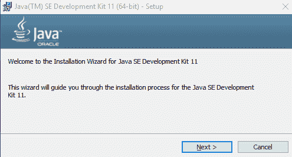
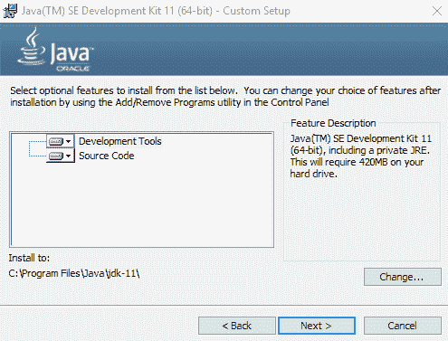
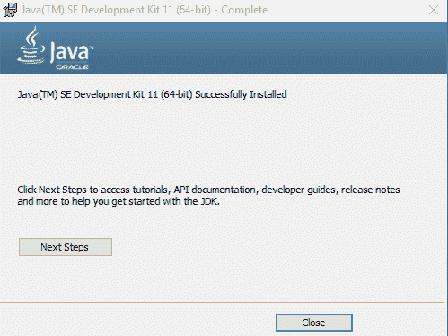
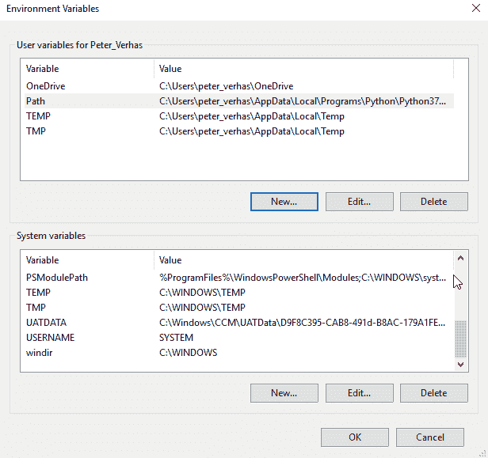
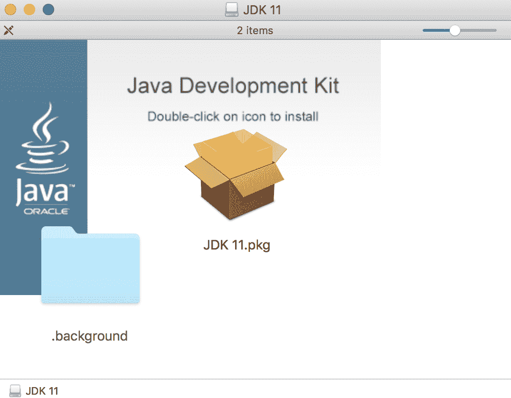
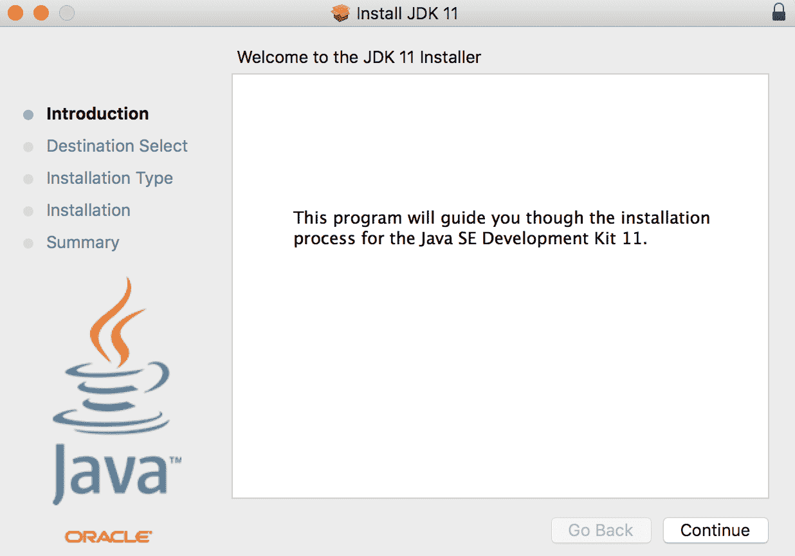
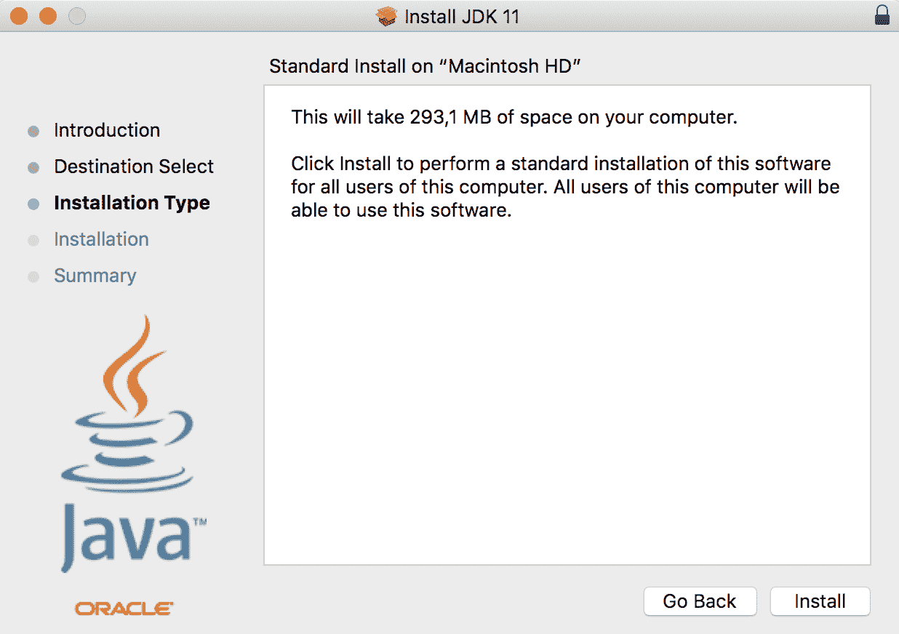
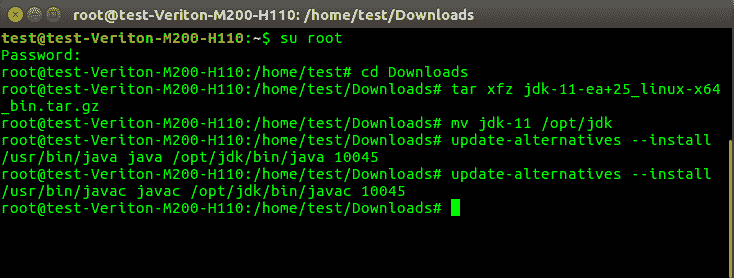
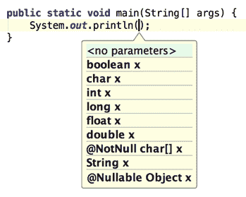

# Java 11 开始了

你想学习 Java，你有一个充分的理由。 Java 是一种现代化和良好的应用程序编程语言，广泛应用于许多行业，如电信，金融等等。 Java 开发人员职位最多，而且，可能是最好的付费。 除其他事物之外，这使得语言利润为年轻专业人士来学习。

另一方面，这不是没有理由的。 Java 语言，工具和整个基础架构周围都很复杂和复杂。 成为 Java Professional 不会在一天或一周内发生; 这是多年的工作。 要成为 Java 专家，您不需要了解编程语言，也需要了解面向对象的编程原则，开源库，应用服务器，网络，数据库以及许多其他事情。 然而，学习语言是绝对的最低限度。 所有其他实践都在上面建立。 在整本书中，您将学习 Java 版本 18.9，也称为 Java 11 等事情。 您不仅可以学习语言，还要学习 Maven，Gradle，Spring，Guice，Soapui 等最重要的工具; 类似 HTTP / 2，SOAP，休息的协议; 如何在敏捷的专业团队中工作; 以及团队应该使用的工具合作。 在最后一章中，您甚至会学会如何计划您打算以 Java 开发人员启动的职业生涯。

在本章中，您将被引入 Java 环境，并且您将有关如何安装它的分步说明，编辑示例代码，编译和运行 Java。 您将熟悉帮助开发的基本工具，无论是 Java 的一部分还是由其他供应商提供。 我们将在本章中介绍以下主题：

*   Java 介绍
*   在 Windows，Linux 和 MacOS 上安装
*   执行`jshell`
*   使用其他 Java 工具
*   使用集成开发环境

# java 入门

这就像经历森林的道路。 你可以专注于道路的砾石，但它是毫无意义的。 相反，您可以享受景色，树木，鸟类和您周围的环境，这更令人愉快。 本书类似，因为我不会仅关注语言。 不时，我将涵盖靠近道路的主题，并将在您完成本书之后，您可以在您完成一些概述和方向。 我不仅会教你语言，还要谈谈算法，面向对象的编程原则，环绕着 Java 开发的工具以及专业人士如何工作。 这将与我们将遵循的编码例子混合。 最后，最后一章将完全致力于主题，下一步学习，以及如何进一步成为专业的 Java 开发人员。

当本书进入打印时，Java 将完成 22 年（ [http://www.oracle.com/technetwork/java/javase/overview/javahistory-index-198355.html](http://www.oracle.com/technetwork/java/javase/overview/javahistory-index-198355.html) ）。 在此期间，语言发生了很大的变化，变得更好。 要问的真正问题不是它在这里有多长时间，但它会留下多长时间？ 它仍然值得学习这种语言吗？ 自 java 出生以来，存在许多新语言（ [http://blog.takipi.com/java-vs-net-vs-python-vs-ruby-vs-node-js-who -reigns - 就业市场/](http://blog.takipi.com/java-vs-net-vs-python-vs-ruby-vs-node-js-who-reigns-the-job-market/) ）。 这些语言更现代化，并且具有功能编程功能，顺便说一下，java 自版本 8.许多人说 Java 是过去 - 未来是 Scala，Swift，Go，Kotlin，JavaScript 等。 您可以在此列表中添加许多其他语言，以及每个其他语言，您可以找到庆祝 Java 埋葬的博客文章。 这个问题有两个答案：一个是务实的商业方法，另一个是更多关于工程：

*   考虑到 COBOL 仍然积极用于金融业，COBOL 开发人员可能比 Java 开发人员更好地支付，这是一个不太冒险，因为 Java 开发人员，您将在未来 40 年内找到职位。 就个人而言，我会敢打赌，超过 100 年，但考虑到我的年龄，它不会公平预测超过 20 到 40 年。
*   Java 不仅是一种语言，它也是一种技术，您将从这本书中学到一下。 该技术包括 **Java 虚拟机**（ **JVM** ），其通常被称为 JVM，并为许多语言提供运行时环境; 例如，kotlin 和 scala 无法在没有 JVM 的情况下运行。 即使 Java 将归结，JVM 仍将是企业场景中的一个播放器。

要了解和了解 JVM 的基本操作几乎与语言本身一样重要。 Java 是一个编译和解释的语言。 这是一个特别的野兽，迫使两个世界上最好的野兽。 在 Java 之前，有解释和编译的语言。

解释语言由解释器读取源代码，然后解释器执行代码。 在每种语言中，有一些初步的词法和语法分析步骤; 然而，之后，解释器作为程序本身由处理器执行，并且解释器不断解释程序代码以了解该做什么。 编译语言不同。 在这种情况下，源代码被编译为 Windows 平台上的二进制（`.exe`文件），操作系统加载和处理器直接执行。 编译的程序通常运行速度更快，但通常可能使得开发速度较慢，并且执行环境并不灵活。 Java 组合两种方法。

要执行 Java 程序，必须将 Java 源代码编译为 JVM 字节码（`.class`文件），该码由 JVM 加载并被解释或编译。 嗯......它被解释或编译了吗？ java 附带的东西是**及时（JIT）**编译器。 这使得编译的阶段是计算密集型和编译语言的编译相对较慢。 JVM 首先开始解释 Java 字节码，同时执行此操作，它会跟踪执行统计信息。 当它收集有关代码执行的足够统计信息时，它将它编译成本机代码（例如，在英特尔/ amd 平台上的 x86 代码），以便直接执行经常执行的代码的部分，并保留解释很少使用的代码片段 。 毕竟，为什么浪费昂贵的 CPU 时间来编译一些难以使用的代码？ （例如，在启动期间读取配置的代码，除非将应用程序服务器重新启动，否则不会再次执行。）对字节码的编译是快速的，并且代码生成仅对退还的段完成。

这也很有趣的是，JIT 使用代码执行的统计信息来优化代码。 例如，如果它可以看到某些条件分支在 99％的情况下执行，则另一个分支仅在 1％中执行，它将生成快速运行的本机代码，从而有利于频繁的分支。 如果程序的那部分程序的行为按时间变化，统计量显示比率更改，则 JIT 会自动从时间重新编译字节码。 这都是幕后的全部和幕后。

除了自动编译之外，还有一个非常重要的 JVM - 它可以管理 Java 程序的内存。 现代语言的执行环境确实如此，Java 是具有自动垃圾收集（GC）的第一个主流语言。 在 Java 之前，我在 C 中编程了 20 年，并且跟踪所有内存分配是一种很大的痛苦，而不是忘记在程序不再需要时释放内存。 忘记代码中单点的内存分配，并且长时间运行的程序缓慢地享受所有内存。 这些问题几乎不存在于 Java 中。 我们必须为 IT-GC 需求处理器容量和一些额外的内存支付价格，但这是我们在大多数企业应用程序中的内容。 一些特殊程序，如实时嵌入式系统，控制重型卡车的制动器，可能没有那种奢侈品。

那些仍然在装配或 C.在我们其他人中编程，我们有 Java，虽然许多专业人士似乎很奇怪，甚至是*几乎实时*程序，如高频交易应用程序 ，是用 java 编写的。

这些应用程序通过网络连接到证券交易所，并销售并购买股票响应市场变化以毫秒为单位。 Java 能够这样做。 Java 的运行时环境您需要执行编译的 Java 代码，其中还包括 JVM 本身，包含允许 Java 程序访问磁盘上的文件以及其他资源的代码。 为此，运行时包含代码可以实例化，执行的高级类，并且执行低级别作业。 你也会这样做。 这意味着当它想要在某些微服务架构中使用或提供休息服务时，实际的 Java 代码不需要处理 IP 数据包，TCP 连接或偶数 HTTP 处理。 它已经在运行时库中实现，并且所有应用程序员都必须包括代码中的类，并使用它们提供与程序匹配的抽象级别的 API。 当您在 Java 中编程时，您可以专注于您要解决的实际问题，这是*业务*代码而不是低级系统代码。 如果它不在标准库中，您将在某些外部库中找到它在某些产品中，并且您也很可能找到问题的开源解决方案。

这也是 Java 的强烈点。 有大量的开源库可用于所有不同的目的。 如果找不到符合您的问题的库，并且您开始代码一些低级代码，那么您可能正在做错事。 本书中有主题是重要的，例如类加载器或反射，不是因为您必须每天都使用它们，而是因为它们被框架使用，并且了解它们可以帮助您了解这些框架如何工作。 如果您无法在不使用反射或编写自己的类装载机或直接编写的程序或程序多线程的情况下解决您的问题，那么您可能选择了错误的框架。 几乎肯定是一个好人; Apache 项目，谷歌和软件行业中许多重要的参与者将其 Java 库作为开源发布。

对于多线程编程，这也是如此。 Java 是一开始的多线程编程环境。 执行代码的 JVM 和运行时支持程序。 执行在多个线程上并行运行。 有运行时语言构造支持程序并行执行程序。 其中一些构建体是非常低的水平，其他结构处于高抽象水平。 多线程代码利用多核处理器，这些处理器更有效。 这些处理器越来越普遍。 20 年前，只有高端服务器拥有多个处理器，只有数字 alpha 处理器有 64 位架构和高于 100 MHz 的 CPU 时钟。 10 年前，多处理器结构在服务器端很常见，大约 5 年前，多核处理器在一些台式机上以及笔记本上; 今天，即使是手机也有它们。 当 Java 于 1995 年开始时，创造它的天才已经看到了这个未来。

他们设想 Java 是一个*写一次，运行任何*语言。 此时，语言的第一个目标是在浏览器中运行的 applet。 今天，许多人认为（而且我也分享了这种意见）小程序是一个错误的目标，或者至少事情没有以正确的方式完成。 截至目前，您将遇到互联网上的小猫，而不是闪存应用程序或恐龙。 更重要的是，Applet 接口已经在 Java 9 中弃用，创建了 applet 不正式良好的意见。

但是，同时，Java 解释器还在没有任何浏览器的情况下执行服务器和客户端应用程序。 此外，随着语言和开发的执行环境，这些应用领域变得越来越相关。 今天，Java 的主要使用是企业计算和主要用于 Android 平台的移动应用程序。 对于未来，环境的使用在嵌入式系统中，作为**的信息**（ **IOT** ）越来越多地进入图片。

# 版本号

Java 版本控制正在不断变化。 它不仅意味着版本号从一个版本转换为另一个版本。 那种明显的; 这就是毕竟版本号。 但是，在 Java 的情况下，版本号的结构也在发生变化。 Java 开始于 1.0 版（惊喜！），然后短暂跟随 1.1 版。 下一个版本为 1.2，与以前的版本与人们开始调用它 Java 2.然后，我们有 Java 1.3 直到 Java 1.8。 据我们考虑版本号的结构，这是一个稳定的时期。 但是，下一个 Java 版本被命名为 Java 9 而不是去年的 1.9。它是有道理的，因为经过 22 年的开发和九个版本，`1.`的版本号的一部分并没有真正有意义。 没有人期待一个“真正的”Java 2.0 与任何其他版本不同，它应该得到`2.`版本前缀。 实际上，Java 版本真的是 1,2,3 等; 它们刚刚被命名为 1.1,1.2,1.3 等。

你可以期待在释放号码格式的这种巨大变化之后，java 的下一个发布将是 Java 10.根本没有。 Oracle 决定使用基于日期的版本号。 在点之前的释放号码之前的第一部分是两位数，如`18`，适用于 2018 年发布的版本。该部分在该点是 3 月份和`9`的月份，通常是`3`的月份 九月。 因此，当您查看 Java 版本号 18.3 时，您立即知道此版本于 2018 年 3 月发布，其实际上是 Java 10 遵循旧命名法。

# 安装 Java.

要开发，编译和执行 Java 程序，您将需要 Java 执行环境。 作为我们通常用于软件开发的操作系统不包含预装的语言，您将不得不下载它。 虽然有多种语言实现，但我建议您从 Oracle 下载软件的官方版本。 Java 的官方网站是 [http://java.com](http://java.com) ，这是可以下载语言的最新版本的网站。 在撰写本书时，第 11 版 Java 尚未发布。 通过 [http://jdk.java.net/11/](http://jdk.java.net/11/) 下载，可以访问早期预发布版本。 稍后，发布版本也将可从这里使用：


您可以从这里下载的是一个所谓的早期访问版本，该代码仅适用于实验，没有专业人士应该使用它以用于商业目的。

在页面上，您必须单击单选按钮接受，但许可证。 之后，您可以单击直接启动安装套件下载的链接。 许可证是一个特殊的早期访问许可证版本，您作为一名专业人士，才能仔细阅读，理解，并接受您的术语。

有一个单独的安装套件适用于 Windows 32 和 64 位系统，麦斯卡斯特，Linux 32 和 64 位版本，用于 ARM 处理器的 Linux，用于 SPARC 处理器系统的 Solaris 和 Solaris x86 版本。 由于您不太可能使用 Solaris，我将为 Windows，Linux 和 MacOS 进行详细说明安装过程。 在后来的章节中，样本总是是麦克斯，但由于 Java 是一个*写一次，运行任何*语言，安装后没有区别。 目录分隔符可以不同地划分，类路径分隔符字符是窗口上的分号而不是冒号，终端或命令应用的外观和感觉也不同。 但是，重要的是，我会尽量不要忘记提。

要使您混淆，Java 下载每个操作系统版本都列出了 JRE 的链接和一个用于 JDK 的链接。 **JRE** 代表 **Java Runtime 环境**，它包含运行 Java 程序所需的所有工具和可执行文件。 **JDK** 是 **Java 开发套件**，其中包含开发 Java 程序所需的所有工具和可执行文件，包括执行 Java 程序。 换句话说，JDK 包含自己的 JRE。 目前，您需要做的就是下载 JDK。

安装在三种操作系统中的每一个都有一个重要的位置，您必须在安装之前为安装 Java 准备，您应该具有管理权限。

# 在 Windows 上安装

Windows 上的安装过程首先双击下载的文件。 它将启动安装程序，并将为您提供欢迎屏幕。 Windows 10 可能会询问您的管理权限才能安装 Java：



按下下一个按钮获取一个窗口，您可以在其中选择要安装的零件，以及我们可以更改将安装 Java 的位置：



让我们在此留下默认设置，这意味着我们安装 Java 的所有下载部分，然后按下：


Java 安装时，我们进入一个进度屏幕。 这是一个相当快的过程，不超过 10 秒的过程。 安装 Java 后，我们收到确认屏幕：



我们可以按下。 可以按下一个下一个步骤按钮，打开浏览器并将我们带到一个页面，该页面描述我们可以使用 Java 执行的下一步。 使用 Prerelease 版本导致 HTTP 404 错误。 当您阅读本书时，希望如此固定。

最后一步是设置环境变量`JAVA_HOME`。 为此，在 Windows 中，我们必须打开控制中心，然后为您的帐户菜单选择编辑环境变量：


这将打开一个新窗口，我们应该用于为当前用户创建新的环境变量：



新变量的名称必须是`JAVA_HOME`，值应该指向 jdk 的安装目录：


大多数系统上的该值是`C:\Program Files\Java\jdk-11`。 这是由许多 Java 程序和工具使用以找到 Java 运行时使用。

# 在 MacOS 上安装

在本节中，我们将仔细研究如何在麦斯科斯平台上逐步安装 Java。 我将描述在撰写本书时可用的发布版本的安装过程。 截至目前，Java 18.9 早期访问版本有点棘手才能安装。 很可能是 Java 18.9 的释放版本将具有与 Java 9 相似或相同的安装步骤。

Java 的 MacOS 版本以`.dmg`文件的形式出现。 这是宏的包装格式。 要打开它，只需双击`Download`文件夹中的文件，其中浏览器保存它，操作系统将文件安装为只读磁盘映像：



此磁盘上只有一个文件 - 安装映像。 双击 Finder 应用程序中的文件名或图标，安装过程将启动：



第一个屏幕是一个欢迎屏幕。 单击继续，您将看到显示将安装的内容的摘要页面。

您将看到标准的 Java 安装并不令人惊讶。 这次，按钮称为安装。 单击它，您将看到以下内容：



这是您必须为管理用户提供的登录参数 - 用户名和密码提供的时间：


提供后，安装开始，在几秒钟内，您将看到一个摘要页面：


点击关闭，您就绪。 您的 Mac 上安装了 Java。 可选地，您可以卸下安装磁盘，稍后，您还可以删除`.dmg`文件。 您不需要，如果您这样做，您可以从 Oracle 下载它。

最后一件事是检查安装是否正常。 布丁的证据正在吃它。 启动终端窗口并在提示处键入`java -version`; Java 将告诉您已安装的版本。

在以下屏幕截图中，您可以在 Workstation 上看到输出，也可以帮助切换在不同版本的 Java 之间的麦克斯命令：


在上面的屏幕截图中，您可以看到我已安装了 Java 11 版本，同时，我还有一个 Java 18.9 早期发布安装，我将用来测试这本书的 Java 的新功能。

# 安装在 Linux 上

有几种方法可以在 Linux 上安装 Java，具体取决于其味道。 在这里，我将描述一种在所有味道上或多或少地为所有味道工作的安装方法。 我使用的是 Debian。

第一步与任何其他操作系统中的第一步相同 - 下载安装套件。 在 Linux 的情况下，您应该选择具有`tar.gz`结束的包。 这是一种压缩的存档格式。 您还应该仔细选择与计算机中处理器匹配的包和操作系统的 32/64 位版本。 下载包后，必须切换到根模式，发出`su`命令。 这是您可以在以下屏幕截图中看到的第一个命令，它显示了安装命令：



`tar`命令未压缩存档到子文件夹中。 在 Debian 中，该子文件夹必须移动到`/opt/jdk`，`mv`命令用于此目的。 两个`update-alternatives`命令是 debian 的。 这些告诉操作系统使用此新安装的 Java，以防已安装较旧的 Java。 Debian 我正在使用测试并演示虚拟机上的安装过程带来了 7 岁的 Java。

安装的最终步骤与任何其他操作系统相同 - 检查安装是否成功地发出`java -version`命令。 在 Linux 的情况下，这更重要。 安装过程不会检查下载的版本与操作系统和处理器体系结构匹配。

# 设置 java_home.

`JAVA_HOME`环境变量在 Java 中扮演特殊角色。 即使 JVM 可执行文件，`java.exe`或`java`在`PATH`上 您使用正确的 Java 安装来设置此环境变量。 变量的值应指向已安装的 JDK。 例如，有许多 Java 相关的程序，Tomcat 或 Maven，它使用此变量来查找已安装的和当前使用的 Java 版本。 在 MacOS 中，设置此变量是不可避免的。

在 MacOS 中，开始执行当您键入`java`时的程序是一个包装器，首先要查看`JAVA_HOME`以确定要启动的 Java 版本。 如果未设置此变量，麦斯科座将自己决定，从可用安装的 JDK 版本中选择。 要查看可用版本，可以发出以下命令：

```
~$ /usr/libexec/java_home -V
Matching Java Virtual Machines (13):
    11, x86_64: "Java SE 11-ea" /Library/Java/JavaVirtualMachines/jdk-11.jdk/Contents/Home
    10, x86_64: "Java SE 10"    /Library/Java/JavaVirtualMachines/jdk-10.jdk/Contents/Home
    9.0.1, x86_64:      "Java SE 9.0.1" /Library/Java/JavaVirtualMachines/jdk-9.0.1.jdk/Contents/Home
    9, x86_64:  "Java SE 9-ea"  /Library/Java/JavaVirtualMachines/jdk-9.jdk/Contents/Home
    1.8.0_92, x86_64:   "Java SE 8"     /Library/Java/JavaVirtualMachines/jdk1.8.0_92.jdk/Contents/Home
    1.8.0_20, x86_64:   "Java SE 8"     /Library/Java/JavaVirtualMachines/jdk1.8.0_20.jdk/Contents/Home
    1.8.0_05, x86_64:   "Java SE 8"     /Library/Java/JavaVirtualMachines/jdk1.8.0_05.jdk/Contents/Home
    1.8.0, x86_64:      "Java SE 8"     /Library/Java/JavaVirtualMachines/jdk1.8.0.jdk/Contents/Home
    1.7.0_60, x86_64:   "Java SE 7"     /Library/Java/JavaVirtualMachines/jdk1.7.0_60.jdk/Contents/Home
    1.7.0_40, x86_64:   "Java SE 7"     /Library/Java/JavaVirtualMachines/jdk1.7.0_40.jdk/Contents/Home
    1.7.0_21, x86_64:   "Java SE 7"     /Library/Java/JavaVirtualMachines/jdk1.7.0_21.jdk/Contents/Home
    1.7.0_07, x86_64:   "Java SE 7"     /Library/Java/JavaVirtualMachines/jdk1.7.0_07.jdk/Contents/Home
    1.7.0_04, x86_64:   "Java SE 7"     /Library/Java/JavaVirtualMachines/1.7.0.jdk/Contents/Home

/Library/Java/JavaVirtualMachines/jdk-11.jdk/Contents/Home
```

然后，您将获取已安装的 jdks 列表。 请注意，命令是小写的，但该选项是大写的。 如果您没有向程序提供任何选项和参数，它将简单地返回它认为是最新，最合适的 JDK。 当我从终端窗口复制命令的输出时，您可以看到我的计算机上安装了很多版本的 Java。

程序响应的最后一行是 JDK 的主目录，这是默认值。 您可以使用此功能来使用一些 Bash 编程设置`JAVA_HOME`变量：

```
export JAVA_HOME=$(/usr/libexec/java_home)
```

您可以将此文件放在您的`.bashrc`文件中，每次启动终端应用程序时执行，因此将始终设置`JAVA_HOME`。 如果要使用不同的版本，可以使用`-v`，使用小写选项，到相同的实用程序，如下所示：

```
export JAVA_HOME=$(/usr/libexec/java_home -v 1.8)
```

该论点是您要使用的 Java 的版本。 请注意，此版本控制成为以下内容：

```
export JAVA_HOME=$(/usr/libexec/java_home -v 11)
```

如果要使用 Java JDK 早期访问版本而不是 1.11，则没有生命的同一事实没有解释。

请注意，还有另一个环境变量对于 Java-`CLASSPATH`很重要。 我们稍后会谈论它。

# 执行 jshell.

现在我们花了很多时间安装 Java，是时候让手指烧得一点了。 正如我们使用 Java 18.9 的那样，有一个新工具可以帮助开发人员与语言一起游戏。 这是一个 **read-eval-print-loop** （ **repl** ）工具，许多语言工具集包含在 java 中，但第 9 版是第 9 版包含此功能的第一个 架子。

Repl 是一个具有交互式提示和语言命令的工具，可以在不编辑某些独立文件的情况下直接输入。 输入的命令直接执行，然后循环再次启动，等待用户在下一个命令中键入。

这是一个非常有效的工具，在没有编辑，编译和加载的情况下尝试某些语言构造。 通过求建工具自动和透明地完成步骤。

Java 18.9 中的 Rept 工具称为 JShell。 要启动它，只需输入其名称。 如果它不在`PATH`上，则键入使用 Java 18.9 安装的 JShell 的完整路径，如以下示例所示：

```
$ jshell | Welcome to JShell -- Version 11-ea | For an introduction type: /help intro jshell>
```

jshell 以交互式方式启动，它显示的提示是`jshell>`，以帮助您识别 jshell 正在运行。 程序读取的类型是由程序读取而不是操作系统 shell。 因为这是你第一次启动 jshell 时，它会告诉你键入`/help intro`。 我们开始做吧。 它将打印出关于 JShell 的简短文本，如以下代码所示：

```
jshell> /help intro
|  
|                                   intro
|                                   =====
|  
|  The jshell tool allows you to execute Java code, getting immediate results.
|  You can enter a Java definition (variable, method, class, etc), like:  int x = 8
|  or a Java expression, like:  x + x
|  or a Java statement or import.
|  These little chunks of Java code are called 'snippets'.
|  
|  There are also the jshell tool commands that allow you to understand and
|  control what you are doing, like:  /list
|  
|  For a list of commands: /help
```

好的，所以我们可以键入 java 片段和`/list`，但这只是可用命令的一个示例。 我们可以通过键入`/help`来获取更多信息，如以下代码所示：

```
jshell> /help
|  Type a Java language expression, statement, or declaration.
|  Or type one of the following commands:
|  /list [<name or id>|-all|-start]
|       list the source you have typed
|  /edit <name or id>
|       edit a source entry
|  /drop <name or id>
|       delete a source entry
|  /save [-all|-history|-start] <file>
|       Save snippet source to a file
...
```

你得到的是一个很长的命令列表。 其中大部分都没有在这里展示纸质和您的注意。 我们将在我们的旅程中使用许多这些命令通过接下来的几页。 让我们从一个小的 Java 片段开始，即 Ageless *Hello World* 示例：

```
jshell> System.out.println("Hello, World!")
Hello World!
```

这是 Java 中有史以来最短的世界计划。 直到 Java 9，如果您想不仅仅是打印出`Hello World!`，您必须创建一个程序文件。 它必须包含类的源代码，包括`public static main`方法，它包含我们必须用 java 9 jshell 键入的一行。 对于一个简单的样本代码打印输出，它很麻烦。 现在它更容易，jshell 也是宽大的。 它宽恕我们在线末尾的缺失分号。

我们应该尝试的下一件事是声明一个变量，如下所示：

```
jshell> var a = 13
a ==> 13
```

我们声明了一个名为`a`的变量，并为其分配了值 - `13`。 变量的类型是`int`，它是 Java 中整数类型的缩写。 现在，我们已经在我们的赛段中有这个变量，所以如果我们想要，我们可以打印出来，如这里所示：

```
jshell> System.out.println(a)
13
```

现在是时候将一些复杂的东西写成 Jshell，而不是单行：

```
jshell> void main(String[] args){
   ...> System.out.println("Hello, World")
   ...> }
|  Error:
|  ';' expected
|  System.out.println("Hello, World")
|                                   ^
```

jshell 认识到这不是一个单行，当我们在第一行结束时输入时，它无法处理到目前为止所输入的内容，并且它向我们期望更多的字符， 所以它将`...>`显示为延续提示。 我们键入构成整个 Hello World `main`方法的命令。

但是，这一次，jshell 不会让我们错过分号; 仅在单行片段的情况下允许。 正如 JShell 正在交互式，很容易纠正错误 - 按向上箭头键几次返回上一行，并且这次在第二行结束时添加分号：

```
jshell> void main(String[] args){
   ...> System.out.println("Hello, World");
   ...> }
|  created method main(String[])
```

此方法是为我们创建的作为代码段，现在我们可以称之为：

```
jshell> main(null)
Hello, World
```

有用。 您可以列出创建的所有片段，如下所示：

```
jshell> /list 
   1 : System.out.println("Hello World!")
   2 : var a = 13;
   3 : System.out.println(a)
   4 : void main(String[] args){
       System.out.println("Hello, World");
       }
   5 : main(null)
```

此外，正如我们要继续编写 *hello world* 的完整 java 版本，我们可以将我们的工作从 jshell 保存到文件，如下所示：

```
jshell> /save HelloWorld.java
```

最后，我们通过键入`/exit`退出 jshell。 当您返回系统提示时，在 Windows 上键入`cat HelloWorld.java`（或`type HelloWorld.java`）以查看文件的内容。 它如下：

```
$ cat HelloWorld.java 
System.out.println("Hello, World!")
var a = 13;
System.out.println(a)
void main(String[] args){
System.out.println("Hello, World");
}
main(null)
```

该文件包含我们在另一个之后输入的所有代码段。 如果您认为您已经搞乱了与许多变量的 shell 和您不需要的代码片段，则可以发出`/reset`命令：

```
jshell> /reset
|  Resetting state.
```

此命令后，JShell 像早期启动时一样干净：

```
jshell> /list

jshell>
```

列表只是没有产生任何东西，因为我们删除了这一切。 幸运的是，我们将 JShell 状态保存到文件中，我们也可以通过发出`/open`命令加载文件的内容：

```
jshell> /open HelloWorld.java
Hello, World!
13
Hello, World
```

它从文件加载行并执行它，就像字符被键入命令提示符时一样。

您可能会记住`/list`命令在每个片段前面打印一个数字。 我们可以使用它来单独编辑代码段。 为此，请发出`/edit`命令，然后发出代码段的数量：

```
jshell> /edit 1
```

您可能会记住我们输入的第一个命令是将参数打印到控制台的`System.out.println`系统调用。 按*在`/edit 1`命令后输入*，您不会返回提示。 相反，JShell 打开一个单独的图形编辑器，其中包含代码段编辑，如图所示：


编辑框中的文本，以便它看起来像这样：

```
void printf(String format, Object... args) { System.out.printf(format, args); }
printf("Hello World!")
```

单击“接受”然后退出。 单击“接受”时，终端将执行代码段并显示以下结果：

```
| created method printf(String,Object...) Hello World!
```

我们使用的方法`printf`，代表格式化打印。 这可能是许多其他语言中的众所周知的。 首先由 C 语言和隐秘介绍，名称幸存下来。 这也是标准 Java 类`PrintStream`的一部分，就像`println`一样。 在`println`的情况下，我们必须在方法名称前写入`System.out`。 为避免，我们定义了编辑器中的剪辑，并已执行并为我们定义了`printf`方法。

jshell 还定义了几个片段，当 JShell 启动或重置时会自动加载。 如果您使用`-start`选项发出`/list`命令，则可以看到这些选项，如下所示：

```
jshell> /list -start

  s1 : import java.io.*;
  s2 : import java.math.*;
  s3 : import java.net.*;
  s4 : import java.nio.file.*;
  s5 : import java.util.*;
  s6 : import java.util.concurrent.*;
  s7 : import java.util.function.*;
  s8 : import java.util.prefs.*;
  s9 : import java.util.regex.*;
 s10 : import java.util.stream.*;
```

这些预定义的片段有助于 JShell。 大多数用户将导入这些类。

如果要列出您输入的所有片段以及预定义的片段，以及包含某些错误并因此未执行的片段，则可以使用`/list`命令上的`-all`选项，如下所示：

```
jshell> /list -all
  s1 : import java.io.*;
  s2 : import java.math.*;
  s3 : import java.net.*;
  s4 : import java.nio.file.*;
  s5 : import java.util.*;
  s6 : import java.util.concurrent.*;
  s7 : import java.util.function.*;
  s8 : import java.util.prefs.*;
  s9 : import java.util.regex.*;
 s10 : import java.util.stream.*;
   1 : System.out.println("Hello, World!")
   2 : var a = 13;
   3 : System.out.println(a)
   4 : void main(String[] args){
       System.out.println("Hello, World");
       }
   5 : main(null)
   6 : void printf(String format, Object... args) { System.out.printf(format, args); }
   7 : System.out.println("Hello, World!");
```

预加载的线路与`s`前缀编号。 包含错误的片段具有与`e`的数字为前缀。 （我们在这个打印输出中没有。）

如果要再次执行一些代码段，则只需键入`/n`，其中`n`是片段的数量，如下所示：

```
jshell> /1 System.out.println("Hello, World!") Hello, World!
```

您无法重新执行包含错误的预加载代码段或片段。 无论如何都没有必要。 预装片段宣布一些进口; 错误的片段不执行，因为它们是......错误的。

当您想要重新执行代码段时，您不需要依赖 JShell 的数量。 当您在 jshell 会话中已经有很多代码段时，列出它们都是太笨重的; 重新执行最后的第 n 个片段存在捷径。 你必须写`/-n`。 这里，n 是从最后一个计数的代码段数。 所以，如果你想执行最后一段赛段，你必须写入`/-1`。 如果要在最后一个之前执行那个，则必须编写`/-2`。 请注意，如果您已键入`/-1`，则最后一个是重新执行上一段的重新执行，并且代码段-2 将成为数字`-3`。

列出所有片段，也可以以其他方式避免。 当您仅在某些类型的片段中感兴趣时，您可以具有特殊命令。

如果我们只想看到我们在片段中定义的变量，我们可以发出`/vars`命令，如下所示：

```
jshell> /vars
|    int a = 13
```

如果我们只想看到类，`/types`命令将执行以下操作：

```
jshell> class s {}
|  created class s

jshell> /types
|    class s
```

在这里，我们刚刚创建了一个空类，然后我们列出了它。

要列出代码段中定义的方法，可以发出`/methods`命令：

```
jshell> /methods
|    void main(String[])
|    void printf(String,Object...)
```

您可以在输出中看到只有两种方法，如下：

*   `main`：哪个是该计划的主要类别
*   `printf`：这是，我们在使用编辑器时定义

如果您想查看您键入的所有内容，则必须为您输入的所有片段和命令发出`/history`命令。 （我不会在这里复制输出;我不想羞辱自己显示所有的错字和失败。你应该尝试自己看看自己的历史！）

回想一下，我们可以通过发出`/reset`命令来删除所有代码段。 您还可以单独删除代码段。 为此，您应该发出`/drop n`命令，其中`n`是剪贴号码：

```
jshell> /drop 1

jshell> /list

   2 : var a = 13;
   3 : System.out.println(a)
   4 : void main(String[] args){
       System.out.println("Hello, World");
       }
   5 : main(null)
   6 : void printf(String format, Object... args) { System.out.printf(format, args); }
   7 : System.out.println("Hello, World!");
   8 : System.out.println("Hello, World!")
```

我们可以看到我们删除了第一个片段：

```
jshell> /drop 2
|  dropped variable a

jshell> /drop 4
|  dropped method main(String[])
```

JShell 错误消息要求我们查看`/types`，`/methods`，`/vars`或`/list`命令的输出。 此问题的问题是`/types`，`/methods`和`/vars`不显示片段的数量。 这可能是 JShell Prerelease 版本中的一个小错误，并且可以通过释放 JDK 的时间来修复。

当我们编辑代码段时，JShell 打开了一个单独的图形编辑器。 可能会发生在远程服务器上使用 ssh 运行 jshell，并且无法打开单独的窗口。 您可以使用`/set`命令设置编辑器。 此命令可以设置 JShell 的相当少量的配置选项。 要将编辑器设置为使用 ubiquitous vi，请发出以下命令：

```
jshell> /set editor "vi"
|  Editor set to: vi
```

在此之后，JShell 将在您发出`/edit`命令的同一终端窗口中打开剪辑的`vi`。

它不仅可以设置编辑器。 您可以设置启动文件，并且在执行命令后 JShell 打印到控制台的方式。

如果设置启动文件，则将执行启动文件中列出的命令而不是`/reset`命令之后的 jshell 的内置命令。 这也意味着您将无法直接使用默认导入的类，除非您自己的启动文件包含导入和片段的定义，否则您将没有`printf`方法片段。

使用以下内容创建`sample.startup`文件：

```
void println(String message) { System.out.println(message); }
```

启动新 jshell，执行如下：

```
jshell> /set start sample.startup

jshell> /reset
|  Resetting state.

jshell> println("wuff")
wuff

jshell> printf("This won't work...")
|  Error:
|  cannot find symbol
|    symbol:   method printf(java.lang.String)
|  printf("This won't work...")
|  ^----^
```

定义`println`方法，但我们之前定义的`printf`方法不是。

反馈定义了提示 Jshell 打印，然后等待输入，对延续行的提示以及每个命令后的消息详细信息。 有预定义的模式，如下：

*   普通的
*   无声
*   简洁的
*   verb

默认选择正常。 如果您发出`/set feedback silent`，则提示变为`->`，jshell 不会打印有关命令的详细信息。 `/set feedback concise`代码打印有点信息，`/set feedback verbose`打印有关执行命令的详细信息：

```
jshell> /set feedback verbose
|  Feedback mode: verbose

jshell> int z = 13
z ==> 13
|  created variable z : int

jshell> int z = 13
z ==> 13
|  modified variable z : int
|    update overwrote variable z : int
```

您还可以定义自己的模式，使用`/set mode xyz`命令为新模式提供名称，其中`xyz`是新模式的名称。 在此之后，您可以为模式设置提示，截断和格式。 定义格式后，您可以以与内置模式相同的方式使用它。

最后但并非最不重要的是，jshell 最重要的命令是`/exit`。 这将终止该程序，并且您将返回操作系统 shell 提示符。

现在，让我们编辑`HelloWorld.java`文件来创建我们的第一个 Java 程序。 为此，您可以使用您的机器上的 VI，Notepad，Emacs 或任何可用的东西，并适合您。 后来，我们将使用一些综合开发环境（IDE），NetBeans，Eclipse 或 Intellij; 但是，现在，简单的文本编辑器就足够了。

编辑文件，以便内容将如下：

```
public class HelloWorld { 
  public static void main(String[] args){ 
        System.out.println("Hello World"); 
       } 
  }
```

要将源代码编译为字节码，它是由 JVM 可执行的，我们必须使用名为`javac`的 Java 编译器：

```
javac HelloWorld.java
```

这在当前目录中生成`java.class`文件。 这是一个可以如下执行的编译代码：

```
$ java HelloWorld
Hello World
```

使用此，您已创建并执行了第一个完整的 Java 程序。 你仍然想知道我们在做什么; 一切都将稍后清楚。 在这里，现在，我希望你能让你有效的感觉。

我们编辑的文件仅包含代码段，我们删除了大多数行，除了`main`方法声明，并在其周围插入类的声明。

在 Java 中，您不能拥有独立的方法或功能，就像许多其他语言一样。 每个方法都属于某些类，并且每个类都应在单独的文件中声明（好的，几乎，但现在，让我们跳过异常）。 文件的名称必须与类的名称相同。 编译器需要此类`public`类。 即使对于非公共课程，我们通常遵守本公约。 如果您将文件从`HelloWorld.java`重命名为`Hello.java`，则在尝试使用新名称编译文件时，编译器将显示错误：

```
$ mv HelloWorld.java Hello.java
~/Dropbox/java_9-by_Example$ javac Hello.java
Hello.java:2: error: class HelloWorld is public, should be declared in a file named HelloWorld.java
public class HelloWorld {
       ^
1 error
```

所以，让我们将其移回原始名称，即`mv Hello.java HelloWorld.java`。

该类的声明以`class`关键字，然后是类的名称，一个打开的卷曲支撑，并持续到匹配的关闭支架。 之间的一切都属于课堂。

现在，让我们跳过为什么我在课堂前写下`public`并专注于其中的主要方法。 该方法不会返回任何值; 因此，其返回值为`void`。 命名为`args`的参数是一个字符串数组。 当 JVM 启动`main`方法时，它将命令行参数传递给此数组中的程序。 但是，这次，我们不使用它。 `main`方法包含打印出`Hello World`的行。 现在，让我们多一点检查这条线。

在其他语言中，打印到控制台的内容只需要`print`语句，或者是一个非常相似的命令。 我记得一些基本的口译员甚至允许我们输入`?`而不是`print`，因为打印到屏幕是如此常见。 在过去的 40 年里，这变化了很多。 我们使用图形屏幕，互联网和许多其他输入和输出通道。 这些天，写入控制台并不是很常见。

通常，在专业的大型企业应用程序中，甚至没有单行那样。 相反，我们将将文本指向日志文件，将消息发送到消息队列，以及通过 TCP / IP 协议的响应发送请求并回复。 由于这是如此不经常使用，因此没有理由为语言创建一个捷径。 在前几个程序之后，当您熟悉调试器和日志处理时，您将无法自行打印到控制台。

仍然，Java 具有功能，可让您直接将文本发送到过程的标准输出，这是旧方法，因为它最初是针对 UNIX 发明的。 这是以 Java 方式实现的，其中一切都必须是对象或类。 要访问系统输出，还有一个名为`System`的类，其中，除其他外，还有以下三个变量：

*   `in`：这是标准输入流
*   `out`：这是标准输出流
*   `err`：这是标准错误流

要引用输出流变量，因为它不在我们的类中但在`System`中，我们必须指定类名，所以我们将在我们的程序中将其称为`System.out`。 此变量的类型为`PrintStream`，也是一个类。 类和类型是 Java 中的同义词。 `PrintStream`类型的每个对象都有一个名为`println`的方法，该方法接受`String`。 如果实际的打印流是标准输出，我们正在从命令行执行我们的 Java 代码，则将字符串发送到控制台。

该方法名为`main`，这是 Java 程序中的特殊名称。 当我们从命令行启动 Java 程序时，JVM 从我们在命令行中指定的类中调用了名为`main`的方法。 它可以这样做，因为我们声明了这种方法`public`，所以任何人都可以看到并调用它。 如果是`private`，则只能从同一类别中看到和可调用，或者在同一类别中或相同源文件中定义的类别。

该方法还声明为`static`，这意味着它可以在没有包含该方法的类的实际实例的情况下调用它。 如今，使用静态方法通常不会被视为良好的做法，除非他们正在实现无法与实例相关的函数，或者具有不同的实现，例如`java.lang.Math`类中的函数。 但是，在某处，代码执行必须启动，并且 Java 运行时通常不会自动为我们创建类的实例。

要启动代码，命令行应如下：

```
java -cp . HelloWorld
```

`-cp`选项代表类路径。 ClassPath 是 Java 的一个相当复杂的想法，但是，现在让我们简单地说明它是包含我们类的目录和 jar 文件列表。 类路径的列表分隔符是 UNIX 的系统上的`:`（冒号）和 Windows 上的`;`（分号）。 在我们的情况下，类路径是实际目录，就像 java 编译器创建的地方`HelloWorld.class`一样。 如果我们在命令行上没有指定类路径，则 Java 将使用当前目录作为默认值。 这就是我们的计划在没有`-cp`选项的情况下工作的原因。

两个`java`和`javac`都处理许多选项。 要获取选项列表，请键入`javac -help`或`java -help`。 我们使用 IDE 编辑代码，并且多次编辑，在开发期间编译，构建和运行它。 在这种情况下，环境设置合理的参数。 对于生产，我们使用构建工具，该工具也支持环境配置。 由于此，我们很少符合这些命令行选项。 尽管如此，专业人士必须至少了解他们的含义，并知道在需要它的情况下，在哪里可以学习他们的实际使用。

# 看着字节码

类文件是二进制文件。 此格式的主要作用将由 JVM 执行，并在代码使用库中的某些类时为 Java 编译器提供符号信息。 当我们编译包含`System.out.println`的程序时，编译器查看编译的`.class`文件而不是源代码。 它必须找到`System`类，`out`字段和`println`方法。

当我们调试一段代码或尝试了解为什么程序找不到类或方法时，我们将需要一种方法来查看`.class`文件的二进制文件。 这不是日常任务，它需要一些先进的知识。

为此，有一个 *Decompiler* ，可以以或多或少可读的格式显示`.class`文件的内容。 此命令称为`javap`。 要执行它，您可以发出以下命令：

```
$ javap HelloWorld.class
Compiled from "HelloWorld.java"
public class HelloWorld {
  public HelloWorld();
  public static void main(java.lang.String[]);
}
```

程序的输出显示，类文件包含一个具有叫做`HelloWorld()`的 Java 类; 它似乎是一种具有与类相同名称的方法，它也包含我们写的方法。

*方法*与类具有相同的名称是类的构造函数。 正如 Java 中的每个类都可以实例化，需要构造函数。 如果我们没有给出，Java 编译器将为我们创建一个。 这是默认构造函数。 默认构造函数没有任何特殊，而是返回类的新实例。 如果我们自己提供构造函数，Java 编译器将不会打扰创建一个。

`javap` decompiler 不显示方法内部或其包含的 Java 代码，除非我们提供`-c`选项：

```
$ javap -c HelloWorld.class
Compiled from "HelloWorld.java"
public class HelloWorld {
  public HelloWorld();
    Code:
       0: aload_0
       1: invokespecial #1                  // Method java/lang/Object."<init>":()V
       4: return
  public static void main(java.lang.String[]);
    Code:
       0: getstatic     #2                  // Field java/lang/System.out:Ljava/io/PrintStream;
       3: ldc           #3                  // String hali
       5: invokevirtual #4                  // Method java/io/PrintStream.println:(Ljava/lang/String;)V
       8: return
}
```

这是非常神秘的，不是普通人。 只处理 Java 代码生成的一些专家可以流利地阅读。 但是，看看它有助于您一瞥字节码手段。 这是一个很好的老装配。 虽然这是二进制代码，但它没有什么秘密：Java 是开源的，而且类文件格式有很好的记录和调试专家。

# 打包类到 JAR 文件中

当您提供 Java 应用程序时，通常代码包装为 Jar，War，Ear 或其他包装格式。 我们再次学习一些似乎在第一眼看来晦涩难懂，但实际上，这并不是那么复杂。 它们都是 zip 文件。 您可以使用 Winzip 或其他 ZIP 管理器打开任何这些文件。 额外要求是，例如，在 JAR 文件的情况下，存档应包含一个名为`META-INF`的目录，并在其内部命名为`MANIFEST.MF`。 此文件是文本文件，并包含格式的元信息，如下所示：

```
Manifest-Version: 1.0 
Created-By: 11-ea (Oracle Corporation)
```

文件中可以有很多其他信息，但如果将我们的类文件包装为 jar，则 java 提供的工具`jar`将在那里放入 jar，发出以下命令：

```
jar -cf hello.jar HelloWorld.class
```

`-c`选项告诉 jar archiver 创建一个新的 jar 文件，`f`选项用于指定新存档的名称。 我们在此指定的那个是`hello.jar`，而添加到它的文件是类文件。

打包 jar 文件也可用于启动 Java 应用程序。 Java 可以直接从 jar 档案和从那里加载课程读取。 唯一的要求是他们在类路上。

您不能将单个类放在类路径上，只有目录。 由于 jar 文件是其中包含内部目录结构的归档，因此它们表现得像目录。

检查使用`ls hello.jar`创建了 jar 文件，然后删除`rm HelloWorld.class`类文件只是为了确保在发出命令行时，代码从 JAR 文件执行，而不是类：

```
$ java -cp hello.jar HelloWorld
Hello World
```

但是要查看 JAR 文件的内容，请建议您使用 JAR 工具而不是 Winzip，即使可能是 Cozier。 真正的专业人员使用 Java 工具来处理 Java 文件：

```
$ jar -tf hello.jar META-INF/ META-INF/MANIFEST.MF HelloWorld.class
```

# 管理运行的 Java 应用程序

jdk 附带的 Java 工具集支持运行 Java 应用程序的执行和管理。 要有一些程序，我们可以在执行时管理，我们需要一个不仅运行几毫秒的代码，而且在运行时，它还向控制台打印内容。 让我们创建一个名为`HelloWorldLoop.java`的新程序，其中包含以下内容：

```
public class HelloWorldLoop { 
  public static void main(String[] args){ 
       for( ;; ){ 
         System.out.println("Hello World"); 
         } 
       } 
  }
```

该程序包含一个`for`循环。 循环允许重复执行代码块，我们将在 [](2.html) ，*第一个实际 java 程序 - 排序名称*中讨论它们。 我们在这里创建的循环是一个特别的循环，它从未终止但重复打印方法调用，打印`Hello World`，直到通过按 *ctrl* + *c* 或发出`kill` ]在 Linux 或 MacOS X 上的命令，或在 Windows 下的任务管理器中终止该程序。

在一个窗口中编译并启动它，然后打开另一个终端窗口以管理应用程序。

我们应该熟悉的第一个命令是`jps`。 为了更熟悉`jps`，您可以在这里阅读一些内容 - [http://docs.oracle.com/javase/7/docs/technotes/tools/share/jps.html](http://docs.oracle.com/javase/7/docs/technotes/tools/share/jps.html) ，它列表 在机器上运行的 Java 进程，如下所示：

```
$ jps 
21873 sun.tools.jps.Jps 
21871 HelloWorldLoop
```

您可以看到有两个进程：一个是我们执行的程序，另一个是`jps`程序本身。 毫不奇怪，`jps`工具也用 Java 编写。 您还可以将选项传递给`jps`，这些选项已在 Web 上记录。

有许多其他工具，我们将研究其中一个，这是一个非常强大且易于使用的工具-JavaVisualVM：


VisualVM 是一个命令行图形工具，可以连接到运行的 Java 进程并显示不同的性能参数。 要启动 VisualVM 工具，您将在没有任何参数的情况下发出`jvisualvm`命令。 很快，左侧的探索树将出现一个窗口，右侧的欢迎窗格。 level 显示命名为本地的分支下的所有正在运行的 Java 进程。 如果双击`HelloWorldLoop`，它将打开右窗格上的进程的详细信息。 在“标题”选项卡上，您可以选择概述，监视器，线程，采样器和 Profiler。 前三个选项卡是最重要的，并为您提供关于 JVM 发生的事情的良好视图，了解线程数，CPU 使用率，内存消耗等。

# 使用 IDE

集成开发环境是通过从开发人员肩部卸载机械任务来帮助开发的优秀工具。 它们在键入代码时认识到许多编程错误，请帮助我们查找所需的库方法，显示库的文档，并为样式检查，调试等提供额外的工具。

在本节中，我们将查看一些 IDE 以及如何利用它们提供的功能。

要获得 IDE，您必须下载并安装它。 它没有 Java 开发工具，因为它们不是语言环境的一部分。 但是，别担心，他们可以免费下载并易于安装。 他们可能比记事本编辑器更复杂，但即使在几个小时的工作之后，他们也会回报您投入学习的时间。 毕竟，没有理由在记事本或 VI 中没有开发人员编码 Java。

三个最顶层的 IDE 是 *netbeans* ， *eclipse* 和 *Intellij* 。 所有这些都在社区版本中提供，这意味着您不需要支付它们。 Intellij 有一个 *full* 版本，您也可以购买。 社区版本将用于学习语言。 如果您不喜欢 Intellij，您可以使用 Eclipse 或 NetBeans。 这些都是免费的。 就个人而言，我使用 Intellij Community Edition 为我的大多数项目，并且在本书中显示 IDE 的屏幕样本将具有此 IDE。 但是，它并不一定意味着你必须坚持这个 IDE。

在开发人员社区中，有可能严重辩论的主题。 这些主题是关于意见的。 他们是关于事实的，辩论很容易结束。 一个这样的话是“这是最好的 IDE？”。 这是一个味道。 没有明确的答案。 如果你学习如何使用一个，你会喜欢那个，除非你看到另一个是好多的，否则你将不愿意学习另一个。 这就是开发人员喜欢他们使用的 IDE 的原因（或只是讨厌，根据他们的个性），但他们一直在使用相同的 IDE，通常很长一段时间。 没有最佳 IDE。

要下载您选择的 IDE，您可以访问以下任何一个网站：

*   [https://netbeans.org/](https://netbeans.org/) 对于 netbeans
*   [http://www.eclipse.org/](http://www.eclipse.org/) 为 Eclipse
*   [https://www.jetbrains.com/idea/](https://www.jetbrains.com/idea/) 为 intellij

# NetBeans.

NetBeans 由 Oracle 支持，并且不断开发。 它包含组件，例如 NetBeans Profiler，它成为 Oracle Java 分发的一部分。 您可以注意到，当您启动 Visual VM 并启动分析时，Java 进程在其名称中启动了`netbeans`。

一般来说，NetBeans 是开发丰富的客户端应用程序的框架，IDE 只有一个应用于框架之上的许多应用程序。 它支持多种语言，不仅是 Java。 您可以使用 NetBeans 开发 PHP，C 或 JavaScript 代码，并具有类似的 Java 服务。 对于不同语言的支持，您可以下载插件或特殊版本的 NetBeans。 这些特殊版本可从 IDE 的下载页面获得，它们只不过是具有一些预配置插件的基本 IDE。 在 C 包中，开发人员配置要开发 C 时需要的插件; 在 PHP 版本中，开发人员为 PHP 配置。

# 蚀

Eclipse 由 IBM 支持。 类似于 NetBeans，它也是 Rich-Client 应用程序的平台，它围绕 *OSGI* 容器体系结构，它本身就是一个可以填写这样的书的主题。 大多数开发人员使用 Eclipse 和，几乎完全，它是开发人员为 *IBM WebSphere* 应用程序服务器创建代码时的选择。 Eclipse 特殊版本包含一个 WebSphere 的开发人员版本。

Eclipse 还具有支持不同的编程语言的插件，并且还具有与 NetBeans 类似的不同变体。 变型是用基本 IDE 预先包装的插件。

# Intellij.

前面枚举中的最后一个是 Intellij。 这一 IDE 是唯一一个不想成为框架的 IDE。 Intellij 是一个 IDE。 它还具有插件，但您需要下载到 NetBeans 或 Eclipse 的大多数插件都是预配置的。 当你想使用一些更高级插件时，它可能是你必须支付的东西，这应该不是在做专业的问题时，应该是有偿的工作，应该吗？ 这些事情并不昂贵。 要在本书中学习主题，您将不需要在社区版本中不需要任何插件。 与本书一样，我将使用 Intellij 开发样品，我建议您在学习体验期间跟随我。

我想强调本书中的示例与要使用的实际 IDE 无关。 您可以使用 NetBeans，Eclipse 甚至 Emacs，Notepad 或 VI 遵循本书。

# IDE 服务

集成开发环境为我们提供服务。 最基本的服务是您可以使用它们编辑文件，但它们还可以帮助构建代码，查找错误，运行代码，在开发模式下部署到应用程序服务器，调试等。 在以下部分中，我们将研究这些功能。 我不会精确，精确地介绍如何使用一个或另一个 IDE。 像这样的教程那样的书不是一个很好的媒介。

IDES 在菜单放置，键盘快捷键方面不同，并且它们甚至可能会随着较新版本的释放而变化。 最好看看实际的 IDE 教程视频或在线帮助。 另一方面，他们的功能非常相似。 Intellij 在 [https://www.jetbrains.com/idea/documentation/](https://www.jetbrains.com/idea/documentation/) 上有视频文档。

# IDE 屏幕结构

不同的 IDE 看起来相似，并且它们具有相同的屏幕结构或多或少。 在以下屏幕截图中，您可以看到 Intellij IDE：


在左侧，您可以看到 Java 项目的文件结构。 Java 项目通常包含不同目录中的许多文件，我们将在下一章中讨论。 简单的 *helloworld* 应用程序包含一个`pom.xml`项目描述文件。 Maven 构建工具需要此文件，这也是下一章的主题。 目前，您应该只知道它是一个描述 Maven 项目结构的文件。 IDE 还跟踪其自身的某些管理数据。 它存储在`HelloWorld.iml`中。 主程序文件存储在`src/main/java`目录中并命名为`HelloWorld.java`。

在右侧，您可以看到文件。 在上面的屏幕截图中，我们只打开一个文件。 如果打开了多个文件，则有一个用于每个文件的选项卡。 现在，活动文件是`HelloWorld.java`，可以在源代码编辑器中编辑。

# 编辑文件

编辑时，您可以输入字符或删除字符，单词和行，但这是所有编辑器都可以的东西。 IDES 提供额外的 - 它们分析源代码并格式化，反过来，这反过来又自动缩进线条。 在编辑时，它还连续编译后台中的代码，如果存在一些语法错误，它将强调具有红色放弃线路。 修复错误时，红色下划线会消失：


编辑器还会自动为您键入的其他字符提供建议。 您可以忽略弹出并继续键入的窗口。 然而，很多次，它更容易停止在一个字符之后，使用向上和向下箭头选择在按*输入*之前需要完成的单词; 单词将自动插入源代码。

在上面的屏幕截图中，您可以看到我写的`System.o`，编辑器立即建议我想写`out`。 其他替代方案是`System`类中的其他静态字段和方法，它包含字母`o`。

IDE 编辑器为您提供了提示，不仅可以为您输入时，而且在无法键入而不是您的时候。 在以下屏幕截图中，IDE 会告诉您将一些表达式作为`println()`方法的参数键入`boolean`，`char`，`int`等。 IDE 绝对不知道在那里输入什么。 你必须构建表达式。 尽管如此，它可以告诉你它需要具有某种类型：



它不仅是编辑器所知道的内置类型。 与 JDK 综合编辑连续扫描的源文件，并知道什么类，方法和字段都是存在的源代码，并且这些都是在编辑的地方使用。

当您想要重命名方法或变量时，此知识也会大量使用。 旧方法是重命名源文件中的字段或方法，然后对变量的所有引用进行详尽的搜索。 使用 IDE，机械工作由它完成。 它知道字段或方法的所有用途，并自动使用新的旧标识符。 它还识别出局部变量是否与我们重命名的那样具有相同的名称，并且 IDE 只重命名那些真正指的那些真正指出的遗传。

您通常可以做的不仅仅是重命名。 程序员调用**重构**还有更多或更少的机械任务。 这些是在编辑器中使用某些键盘快捷键和上下文敏感菜单的 IDE 支持的 IDE - 右键单击​​鼠标，然后单击菜单：


IDE 还可以帮助您读取库和源代码的文档，如下所示：


图书馆为`public`方法提供 *javadoc* 文档，您还应该为自己的方法编写 javadoc。 从源代码中的特殊注释中提取了 javadoc 文档，我们将学习如何在 [](4.html) ， *mastermind - 创建游戏*中创建这些文档。 这些位于实际方法头部的评论中。 由于创建编译文档是编译流的一部分，IDE 还知道文档，并且当您在源文件中定位光标时，它将作为悬停框显示为悬停框。当您定位光标时，您要在源文件中使用的任何元素 元素。

# 管理项目

在 IDE 窗口的左侧，您可以看到项目的目录结构。 IDE 知道不同类型的文件，并以与编程的角度有意义的方式显示它们。 例如，它不会显示`Main.java`作为文件名。 相反，它显示`Main`和一个图标，表示`Main`是一个类。 它也可以是仍在名为`Main.java`的文件中的界面，但在这种情况下，图标将显示这是一个接口。 这是通过 IDE 持续扫描和编译代码的再次完成。

当我们开发 Java 代码时，文件将构建为子目录。 这些子目录遵循代码的包装结构。 多次，在 Java 中，我们使用化合物和长包名称，并将其显示为深且嵌套目录结构，不会那么容易处理。

软件包用于对源文件进行分组。 以某种方式相关的类的源文件应该进入一个包。 我们将讨论包的概念以及如何在下一章中使用它们。

IDE 能够显示包结构而不是包含源文件的项目目录的嵌套目录：


将类或接口从一个包移动到另一个包时，它会发生在类似于重命名或发生的任何其他重构操作的情况下。 对源文件中的类或接口的所有引用都将重命名为新包。 如果文件包含参考类的`import`语句，则纠正语句中的类的名称。 要移动课程，您可以打开包装并使用良好的旧拖放技术。

包层次结构不是 IDE 中显示的唯一层次结构。 该类位于包中，但同时存在继承层次结构。 类可以实现接口，可以扩展其他类。 Java IDES 通过显示类型层次结构来帮助我们，其中您可以沿着继承关系跨图形界面导航。

还有另一个层次结构，IDES 可以向我们提供开发方法调用层次结构。 在分析代码后，IDE 可以向我们显示显示方法之间关系的图表：哪种方法调用其他方法。 有时，此呼叫图在展示彼此的依赖性方面也很重要。

# 构建代码并运行它

IDE 通常编译代码以进行分析，以帮助我们在飞行中发现语法错误或未确定的类和方法。 此编译通常是部分的，覆盖代码的一部分，并且在运行时源代码，源代码更改，从未实际完成。 要创建可部署文件，即项目的最终可交付代码，必须启动单独的构建过程。 大多数 IDE 都有一些内置的工具，但不建议使用这些，除了最小的项目。 专业开发项目使用 Ant，Maven 或 Gradle 代替。

这是 maven 的一个例子：


IDE 准备使用这种外部工具，他们可以帮助我们启动它们。 这样，构建过程可以在开发人员机器上运行，而无需启动新的 shell 窗口。 IDES 还可以从这些外部构建工具的配置文件导入设置以识别项目结构，其中源文件是什么，以在编辑时支持支持错误检查。

构建过程通常包含对代码的某些检查的执行。 一堆 Java 源文件可以编译好且平滑。 但是，代码可能包含很多错误，并且可以以可怕的方式写入。 这些事情从长远来看，项目使项目不明智。 为避免这些问题，我们将使用单元测试和静态代码分析工具。 这些不保证无差错的代码，但机会更苗条。

IDES 具有运行静态代码分析工具以及单元测试的插件。 融入 IDE 具有巨大的优势。 当分析工具或某些单元测试有任何问题时，IDE 提供错误消息，也可以像网页上的链接一样运行。 如果您单击通常是蓝色和下划线的邮件，则编辑器会打开问题文件并将光标放在问题所在。

# 调试 Java.

开发代码需要调试。 Java 有很好的设施在开发期间调试代码。 JVM 通过 Java 平台调试器架构支持调试器。 这使您可以在调试模式下执行代码，并且 JVM 将接受外部调试器工具通过网络附加到它，或者它将根据命令行选项尝试附加到调试器。 JDK 包含一个客户端，其中包含调试器的`jdb`工具; 但是，与内置于 IDE 中的图形客户端相比，使用它是如此麻烦的是，我从未听说过任何使用它的真实工作。

要在调试模式下启动 Java 程序，因此 JVM 将接受调试器客户端将选项附加到它，执行以下命令：

```
-Xagentlib:jdwp=transport=dt_socket,server=y,suspend=y,address=7896
```

`Xagentlib`选项指示 Java 运行时加载`jdwp`代理。 遵循`-Xagentlib:jdwp=`的选项的一部分由调试器代理解释。 这些选项如下：

*   `transport`：这应该指定要使用的运输。 它可以是共享内存（`dt_shmem`）套接字或 TCP / IP 套接字传输，但在实践中，您将始终使用后者。 这在前面的`dt_socket`样本中指定。
*   `server`：这指定了调试的 JVM 在服务器模式或客户端模式中启动。 当您在服务器模式下启动 JVM 时，它将开始侦听套接字并接受调试器连接到它。 如果在客户端模式下启动，它会尝试连接应在服务器模式下启动的调试器，在端口上侦听。 选项的值为`y`，含义服务器模式，或`n`，意思是 nonserver，即客户模式。
*   `suspend`：这也可以是`y`或`n`。 如果以挂起模式启动 JVM，则直到连接到调试器到它之前，它将无法启动 Java 代码。 如果启动了`suspend=n`，则 JVM 启动，当调试器附加时，它一旦达到断点时就会停止。 如果您开始独立的 Java 应用程序，您通常会使用`suspend=y`开始调试，这是默认值。 如果要调试应用程序服务器或 servlet-container 环境中的应用程序，最好从`suspend=n`开始; 否则，在调试器附加到它之前，服务器不会启动。 在 Servlet 应用程序中启动`suspend=y`模式中的 Java 进程仅在您要调试 Servlet 静态初始化程序代码时才有用，这是在服务器启动时执行的。 如果没有暂停模式，您将需要非常快速地附加调试器。 在这种情况下，JVM 更好地等待您。
*   `address`：这应该指定 JVM 与之通信的地址。 如果 JVM 以客户方式模式开头，则它将开始连接到此地址。 如果 JVM 在服务器模式下运行，则它将接受来自该地址的调试器的连接。 地址可以仅指定端口。 在这种情况下，IP 地址是本地机器的 IP 地址。

调试器代理可以处理的其他选项适用于特殊情况。 对于本书中涵盖的主题，前面的选项足够了。

以下屏幕截图显示了一个典型的调试会话，我们在 Intellij IDE 中调试最简单的程序：


从调试模式从 IDE 启动程序时，所有这些选项都会自动为您设置。 您可以通过单击编辑器中的源代码来设置断点。 您可以使用单独的表单添加，删除和编辑断点。 断点可以附加到特定的行或特定事件，就像抛出异常时一样。 附加到特定行的断点也可以具有告诉调试器停止执行代码的条件，但仅当条件为真; 例如，如果变量具有一些预定义值。

# 概括

在本章中，我们用 Java 互相介绍。 我们彼此不太了解，但我们熟悉了。 我们安装了 Java 环境：Java，JDK 和集成开发环境。 我们写了一个小程序，并注意到使用开发工具可以完成的内容。 这远未掌握，但即使是最长的旅程也从第一步开始，有时候是最难的。 我们在我们的 Java 旅程中完成了它。 我们开始滚动，因为我们的爱好者，没有什么可以阻止我们一直行走。