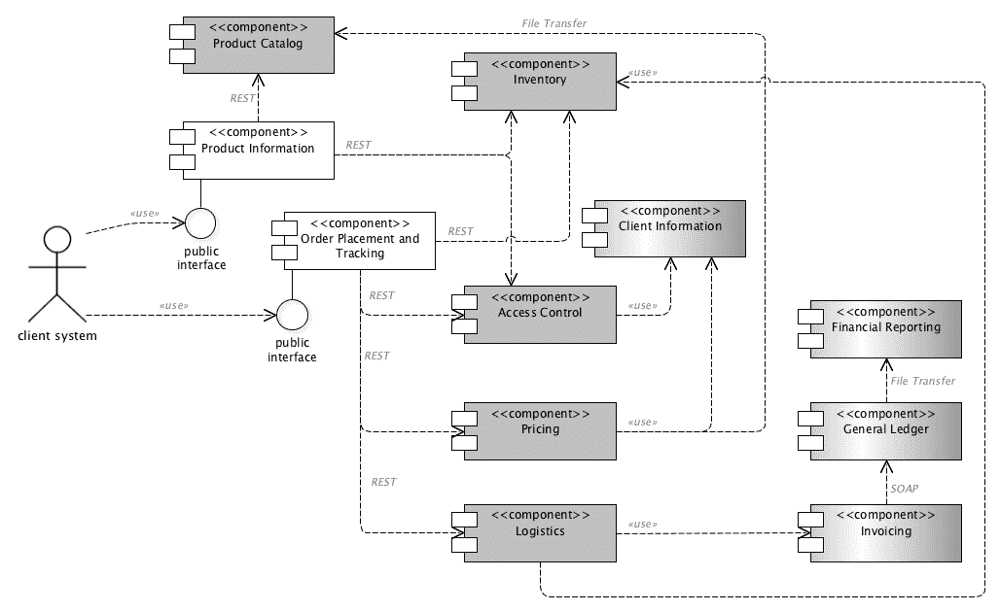
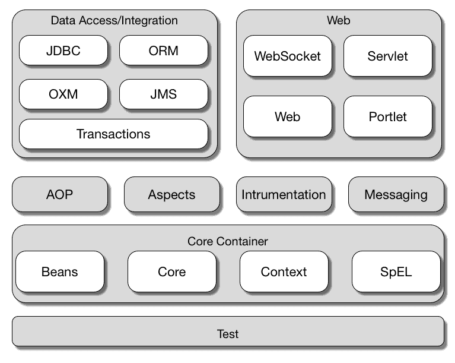
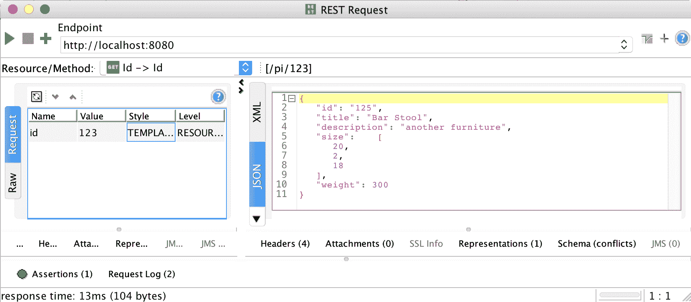

# 使用 REST 构建商业 Web 应用

我们一直在玩，但 Java 不是玩具。我们希望使用 Java 来实现真正的、严肃的、商业的和专业的。在这一章中，我们将这样做。我们将要看的例子不是我们在前三章中所看到的，只是有趣的东西，比如 Mastermind，而是一个真正的商业应用。实际上，这不是一个真实的应用。你不应该指望书中有这样的东西。它太长了，教育不够。但是，我们将在本章中开发的应用可以扩展，并且可以作为实际应用的核心，以防您决定这样做。

在上一章中，我们创建了 Servlet。为此，我们使用了 Servlet 规范，并手工实现了 Servlet。这是你现在很少做的事。在本章中，我们将使用一个现成的框架。这次，我们将使用 Spring，它是 Java 商业应用中使用最广泛的框架，我敢说它是事实上的标准。它将完成上一章中我们必须完成的所有繁琐工作（至少是为了理解和学习 Servlet 的工作原理）。我们还将使用 Spring 进行依赖注入（为什么要使用两个框架，而一个框架可以完成所有工作？），还有 Tomcat。

在前一章中，我们使用 Guice 作为 DI 框架，Jetty 作为 Servlet 容器。对于一些项目，这些都是非常好的选择。对于其他项目，其他框架做得更好。为了有机会查看本书中的不同工具，我们将使用不同的框架，尽管我们将展示的所有示例都可以通过仅使用 Tomcat 和 Spring 来创建。

我们将开发的商业应用将是一个针对经销商的订购系统。我们将提供给用户的界面将不是一个 Web 浏览器可消费的 HTML/JavaScript/CSS 界面。相反，它将是一个 REST 接口。用户将自行开发与我们的系统通信的应用，并为不同的产品下订单。应用的结构将是一个微服务架构，除了标准的 Chrome 开发工具特性之外，我们还将使用 SoapUI 来测试应用。

# MyBusiness 网上商店

想象一下，我们有一个庞大的贸易和物流公司。货架上有上万种不同的产品；数百辆卡车带着新的货物来到我们的仓库，数百辆卡车为我们的客户送货。为了管理这些信息，我们有一个库存系统，它每分钟、每小时、每天跟踪货物，以便我们知道仓库里实际有什么。我们为客户提供服务，而无需人工管理仓库信息。以前，有电话，传真机，甚至电传。今天，我们使用的只是互联网和网络服务。我们不为客户提供网站。我们从未在想象中的业务中直接为最终用户服务，但现在，我们有一个子公司，我们作为一个独立的公司开始这样做。他们有一个网站，完全独立于我们。他们只是我们数百个注册合作伙伴中的一个，他们每个人都使用 Web 服务界面来查看我们拥有的产品、订购产品和跟踪订单状态。

# 业务架构示例

我们的合作伙伴也是具有自动化管理的大型公司，在多台机器上运行多个程序。我们对他们的架构和使用的技术不感兴趣，但我们希望与他们的业务相结合。我们希望以一种不需要任何人际互动的方式为他们提供服务，以便政府向我们任何一方订货。为此，提供了一个 Web 服务接口，无论他们使用什么 IT 基础设施，都可以使用它。

在我们这边，正如我们想象的例子，我们最近用 microservice 架构替换了我们的单片应用，尽管系统中仍然有一些基于 SOAP 的解决方案，但是大多数后端模块使用 HTTPS 和 REST 协议进行通信。一些模块仍然依赖于每天使用 FTP 进行的异步文件传输，FTP 是从 Unix 作业开始的。总账系统是用 COBOL 语言编写的。幸运的是，我们不需要对付这些恐龙。

这个结构是一个虚构的设置，但一个现实的。我编写并描述这些部分是为了让您了解如何在大型企业中看到混合技术。我在这里描述的是一个非常简单的设置。有些公司的系统中有一千多个软件模块，使用不同的技术和完全不同的接口，所有这些模块都相互连接。这并不是因为他们喜欢这种混乱，而是因为经过 30 年的持续发展，这种混乱才变得如此。新技术来了，旧技术也消失了。业务发生了变化，如果你想保持竞争力，就不能固守旧技术。同时，您无法立即替换整个基础结构。其结果是，我们看到相当老的技术仍然在运行，而且主要是新技术。旧技术得到及时推广。它们不会永远呆在这里，而且，当恐龙出现在我们面前时，我们有时会感到惊讶。

我们必须处理我们将要开发的两个前端组件。具体如下：

*   **产品信息**
*   **下单跟踪**

在下面的图片中，您可以看到我们将要看到的结构的架构 UML 图。我们将只与前端组件进行交互，但如果我们有更大的了解，这有助于了解它们的功能和作用：



**产品信息**提供单个产品的信息，也可以根据查询条件提供产品列表。**下单跟踪**提供了客户下单的功能，也可以让我们的客户查询过去订单的状态。

要提供产品信息，我们需要访问保存实际产品详细信息的**产品目录**模块。

**产品目录**可以执行许多其他任务，这就是为什么它是一个单独的模块。例如，它可以有一个工作流和批准引擎，让产品管理员输入产品数据，让经理检查和批准数据。审批通常是一个复杂的过程，考虑到打字错误和法律问题（我们不想交易未经许可的毒品、爆炸物等），并检查货物来源的质量和审批状态。许多复杂的任务使它成为后端模块。在大型企业应用中，前端系统除了为外部服务的基本功能外，很少做其他任何事情。但这对我们有好处；我们可以专注于我们必须提供的服务。这对建筑也有好处。这与面向对象编程中的单一责任原则相同。

**产品信息**模块还要咨询**门禁**模块，看某个产品能不能送到实际客户手中，再跟库存一起看有没有剩余的产品，这样我们才不会提供一个缺货的产品。

**下单跟踪**模块还需要访问**产品库存**和**访问控制**模块，检查订单是否可以完成。同时，它还需要来自**定价**模块的服务，该模块可以计算订单的价格，以及来自**物流**模块的服务，该模块触发从库存位置收集货物并将货物发送给客户。**物流**也与发票有关联，发票与**总账**有关联，但这些只是在图片上显示信息的旅行并没有到此为止。有许多其他模块运行公司，所有这些都不是我们目前感兴趣的。

# 微服务

上一章中描述的架构不是一个干净的微服务架构。在任何事业中，你都不会遇到一个纯粹的人。它更像是我们在一个真正的公司里遇到的东西，从单片到微型服务。

当应用以许多小型服务的形式开发时，我们将讨论微服务架构，这些服务使用一些简单的 API（通常通过 HTTP 和 REST）相互通信。这些服务实现业务功能，可以独立部署。在大多数情况下，希望服务部署是自动化的。

各个服务可以使用不同的编程语言开发，可以使用不同的数据存储，并且可以在不同的操作系统上运行；因此，它们彼此高度独立。它们可以而且通常是由不同的团队开发的。重要的要求是它们相互协作；因此，一个服务实现的 API 可以被构建在它之上的其他服务使用。

微服务架构并不是所有架构中的圣杯。它对单片架构的一些问题给出了不同的答案，在大多数情况下，这些答案在使用现代工具时效果更好。这些应用还需要测试和调试。性能必须得到管理，错误和问题必须得到解决。不同之处在于，各个组件之间没有强耦合，这样，开发、部署和测试就可以沿着不同的技术进行分离。由于微服务架构在实践中沿着网络协议将模块分开，调试可能需要更多与网络相关的工作。这可能是好的，也可能是坏的，或者两者兼而有之。然而，对于开发商来说，优势是显而易见的。他们可以独立地在较小的单元上工作，并且可以更快地看到工作的结果。

在开发单片应用的单个模块时，只有在部署整个应用时才能看到结果。在大型应用的情况下，这可能很少见。在开发单片电路的大型公司中，一个典型的部署周期是每隔几个月，比如说三个月，但是一年只发布两次甚至一次的情况并不少见。开发微服务时，只要新模块没有破坏它提供给我们的网络接口和其他模块使用的网络接口，只要它准备好并经过测试，就可以部署它。

如果你想阅读更多关于微服务的文章，第一个也是最真实的来源是 [martinfowler 的文章](http://www.martinfowler.com/articles/microservices.html)。请注意，此页面引用了微服务资源指南，其中列出了许多微服务信息资源。

# 服务接口设计

在本节中，我们将设计要实现的两个接口。在设计界面时，我们首先关注功能。格式和协议稍后提供。接口，一般来说，应该是简单的，同时，适应未来的变化。这是一个困难的问题，因为我们看不到未来。商业、物流和所有其他专家可能会看到未来世界的某些部分将如何变化，以及它将对公司的运营，特别是我们为合作伙伴提供的接口带来什么影响。

界面的稳定性是最重要的，因为合作伙伴是外部实体。我们无法重构它们使用的代码。当我们在代码中更改 Java 接口时，编译器将在所有应该遵循更改的代码位置抱怨。如果是在我们的领域之外使用的接口，情况并非如此。即使我们在 *GitHub* 上发布为开源的 Java 接口，我们也应该做好准备，如果我们以不兼容的方式更改库，用户也会面临问题。在这种情况下，他们的软件将不会编译和与我们的图书馆一起工作。如果是订购系统，这意味着他们不会从我们那里订购，我们很快就会倒闭。

这就是为什么接口应该简单的原因之一。虽然这通常适用于生活中的大多数事情，但对于接口来说却是极其重要的。为合作伙伴提供方便的特性是很有诱惑力的，因为它们易于实现。但是，从长远来看，这些特性可能会变得非常昂贵，因为它们需要维护；它们应该保持向后兼容。从长远来看，他们可能得不到成本那么多。

要访问产品信息，我们需要两个函数。其中一个列出特定产品，另一个返回特定产品的详细信息。如果它是 Java API，则如下所示：

```java
List<ProductId> query(String query);
ProductInformation byId(ProductId id);
```

类似地，订单安排可能类似于以下代码所示：

```java
OrderId placeOrder(Order order);
```

我们通过 Web 服务接口在应用中提供这些函数；更具体地说，REST 使用 JSON。我们将更详细地讨论这些技术，以及 Spring 框架和模型-视图-控制器设计模式，但首先，让我们看看产品信息控制器，以了解我们的程序将是什么样子：

```java
package packt.java11.mybusiness.productinformation;
import ...
@RestController
public class ProductInformationController {
    private final ProductLookup lookup;

    public ProductInformationController(
            @Autowired ProductLookup lookup) {
        this.lookup = lookup;
    }

    @RequestMapping("/pi/{productId}")
    public ProductInformation getProductInformation(
            @PathVariable String productId) {
        return lookup.byId(productId);
    }

    @RequestMapping("/query/{query}")
    public List<String> lookupProductByTitle(
            @PathVariable String query,
            HttpServletRequest request) {
        return lookup.byQuery(query)
                .stream().map(s -> "/pi/" + s)
                .collect(Collectors.toList());
    }
}
```

如果将 Servlet 的代码与前面的代码进行比较，您会发现这要简单得多。我们不需要处理`HttpServletRequest`对象，不需要调用 API 来获取参数，也不需要创建 HTML 输出并将其写入响应。框架就是这样做的。我们对`@RestController`类进行注释，告诉 Spring 这是一个利用 RESTWeb 服务的控制器；因此，它将从我们默认返回的对象创建一个 **JSON** 响应。我们不需要关心对象到 *JSON* 的转换，尽管如果确实需要的话我们可以。对象将使用类中使用的字段名和返回的实例的字段值自动转换为 *JSON*。如果对象包含比普通的`String`、`int`和`double`值更复杂的结构，那么转换器将为嵌套结构和最常见的数据类型做好准备。

为了在 Servlet 上有不同的代码处理和不同的 URL，我们需要做的就是用`@RequestMapping`注释方法，提供 URL 的路径部分。映射字符串中的`{productId}`符号可读且易于维护。Spring 只是从那里切下值，然后按照`@PathVariable`注释的要求，将其放入`productId`变量中。

控制器中未实现产品的实际查找。这不是控制器的功能。控制器只决定调用什么业务逻辑和使用什么视图。业务逻辑在服务类中实现。这个服务类的一个实例被注入到`lookup`字段中。这种注射也是由弹簧完成的。我们要做的实际工作是调用业务逻辑，这一次，因为我们只有一个，是相当容易的。

如果没有更多关于框架为我们做了什么的细节，大多数这些东西看起来都很神奇。因此，在继续之前，我们将先看看构建块 JSON、REST、MVC 和一些 Spring 框架。

# JSON 文件

**JSON** 代表 **JavaScript 对象表示法**。在[官方 JSON 网站](http://www.json.org/)上定义。这是一种文本表示法，与 JavaScript 中定义对象文本的方式相同。对象表示以`{`字符开始，以`}`字符结束。中间的文本定义了表单`string : value`中对象的字段。字符串是字段的名称，由于 JSON 希望语言不可知，因此它允许任何字符作为字段名称的一部分，因此该字符串（以及 JSON 中的任何字符串）应以`"`字符开头和结尾。

这可能看起来很奇怪，在大多数情况下，当您开始使用 JSON 时，很容易忘记并编写`{ myObject : "has a string"}`而不是正确的`{ "myObject" : "has a string" }`符号。

逗号分隔字段。也可以使用 JSON 格式的数组。它们分别以`[`和`]`字符开头和结尾，并且包含逗号分隔的值。对象字段或数组中的值可以是字符串、数字、对象、数组或常量之一，`true`、`false`和`null`。

一般来说，JSON 是一种非常简单的表示法，用于描述可以存储在对象中的数据。使用文本编辑器编写和阅读都很容易，因此调试使用 JSON 的通信比调试使用复杂格式的通信更容易。在我们将在本章中使用的库中，可以很容易地找到将 JSON 转换为 Java 对象的方法，反之亦然。程序的源代码中还提供了一个示例 JSON 对象，该对象描述了我们示例代码中的产品，如下所示：

```java
{"id":"125","title":"Bar Stool",
 "description":"another furniture",
 "size":[20.0,2.0,18.0],"weight":300.0}
```

请注意，JSON 的格式化不需要新行，但同时，这也是可能的。程序生成的 JSON 对象通常是紧凑的，没有格式化。当我们使用文本编辑器编辑一个对象时，我们倾向于像在 Java 编程中一样格式化字段的缩进。

# 休息

**REST** 协议没有确切的定义。它代表**表述性状态转移**，对于一个从未听说过它的人来说，这可能并不意味着什么。当我们编写 RestAPI 时，我们使用 HTTP（S）协议。我们向服务器发送简单的请求，然后得到我们编写的简单答案。这样，Web 服务器的客户端也是一个程序（顺便说一下，浏览器也是一个程序），它使用来自服务器的响应。因此，响应的格式不是使用 CSS 的 HTML 格式，也不是通过 **JavaScript** 的客户端函数来丰富的，而是一些数据描述格式，比如 JSON。REST 没有对实际的格式设置限制，但是现在，JSON 是使用最广泛的格式。

描述 REST 的 wiki 页面位于[这个页面](https://en.wikipedia.org/wiki/Representational_state_transfer)。

REST 接口通常很简单。HTTP 请求几乎总是使用`GET`方法。它还使 REST 服务的测试变得简单，因为没有什么比从浏览器发出一个`GET`请求更容易的了。幼儿能做到。`POST`只有当服务在服务器上执行某些事务或更改时，才使用请求，这样，请求是向服务器发送数据，而不是获取一些数据。

在我们的应用中，我们将使用`GET`方法来查询产品列表并获取有关产品的信息，并且我们将只使用`POST`来订购产品。为这些请求提供服务的应用将在 Servlet 容器中运行。您已经学习了如何在不使用框架的情况下创建裸 Servlet。在本章中，我们将使用 Spring 框架，它从开发人员那里卸载了许多任务。Servlet 编程中有许多程序构造在大多数情况下都是相同的。它们被称为样板代码。Spring 框架使用模型-视图-控制器设计模式来开发 Web 应用；因此，在讨论 Spring 之前，我们将对其进行简要介绍。

# 模型视图控制器

**模型视图控制器**（**MVC**）是一种设计模式。设计模式是编程构造的简单结构，给出如何解决特定问题的提示。设计模式一词是在 Erich Gamma、Richard Helm、Ralph Johnson 和 John Vlissides 所著的《设计模式，可重用面向对象软件的元素》一书中提出并正式描述的。本书将设计模式定义为具有*名称*、*问题*和*解决方案*的结构。*名称*描述了模式，并给出了开发人员社区在谈论这些模式时可以使用的词汇表。不同的开发人员使用相同的语言术语以便相互理解是很重要的。*问题*描述了这种情况，即可以应用模式的设计问题。*解决方案*描述类和对象以及它们之间的关系，这有助于一个好的设计。

其中之一是 MVC，它适用于 Web 应用的编程，但通常可以用于任何具有用户界面的应用。在我们的例子中，我们没有经典的用户界面，因为客户端也是一个程序；不过，MVC 可以而且是一个很好的选择：


MVC 模式，顾名思义，有三个部分：模型、视图和控制器。这种分离遵循单一责任原则，要求每个不同的责任有一个部分。控制器负责处理系统的输入，并决定使用什么模型和视图。它控制执行，但通常不执行任何业务逻辑。模型执行业务逻辑并包含数据。视图将模型数据转换为客户端可以使用的表示形式。

MVC 是一种广泛使用的设计模式，它直接由 Spring 支持。当您创建一个 Web 应用时，您可以通过使用注释对框架中内置的控制器进行编程。基本上就是配置它。您可以对视图进行编程，但更有可能使用内置到框架中的视图。您将希望以 **XML**、**JSON** 或 **HTML** 格式向客户端发送数据。如果你很有异国情调，你可能会想发送 **YAML**，但一般来说，就是这样。您不希望实现需要在服务器上编程的新格式，因为它是新的，所以也需要在客户端上编程。

我们创建了模型，这一次，我们还编写了程序。毕竟，这是业务逻辑。框架可以为我们做很多事情，主要是对大多数应用来说都是一样的，但对业务逻辑来说却不一样。业务逻辑是将我们的代码与其他程序区别开来的代码。这就是我们要规划的。

另一方面，这正是我们喜欢做的，关注业务代码，避免框架提供的所有样板文件。

既然我们知道了什么是 **JSON**、**REST**，以及通用的模型-视图-控制器设计模式，那么让我们看看 Spring 是如何管理它们的，以及如何将这些技术付诸实施。

# 弹簧骨架

Spring 框架是一个包含多个模块的巨大框架。该框架的第一个版本是在 2003 年发布的，从那时起，已经有四个主要版本提供了新的和增强的特性。目前，Spring 是实际使用的企业框架，可能比法律标准 EJB3.0 更广泛。

Spring 支持依赖注入、**面向切面编程**（**AOP**）、对 **SQL** 和 **NoSQL** 数据库的持久化等传统方式和对象关系映射方式。它具有事务支持、消息传递、Web 编程和许多其他特性。您可以使用 **XML** 配置文件、注释或 Java 类来配置它。

# 春天的建筑

弹簧不是整体的。你可以使用它的一部分，或者只使用一些功能。您可以包含一些您需要的 Spring 模块，而忽略其他模块。一些模块依赖于其他模块，Gradle、Maven 或其他一些构建工具处理依赖关系。

下图显示了版本 4 的 Spring 框架的模块：



Spring 自第一次发布以来一直在不断发展，它仍然被认为是一个现代框架。框架的核心是一个依赖注入容器，类似于我们在前面一章中看到的容器。随着框架的发展，它还支持 AOP 和许多其他企业功能，例如面向消息的模式和通过模型视图控制器实现的 Web 编程，不仅支持 Servlet，还支持 Portlet 和 WebSocket。由于 Spring 针对企业应用领域，因此它还支持以多种不同的方式处理数据库。支持 JDBC 使用模板、**对象关系映射**（**ORM**），以及事务管理。

在这个示例程序中，我们将使用一个相当新的模块 SpringBoot。这个模块使得编写和运行应用非常容易，假设许多程序的配置通常是相同的。它包含一个嵌入的 Servlet 容器，它为默认设置进行配置，并在可能的情况下配置 Spring，以便我们可以关注编程方面，而不是 Spring 配置。

# 弹簧芯

核心模块的中心元素是上下文。当 Spring 应用启动时，容器需要一个上下文，容器可以在其中创建不同的 bean。这对于任何依赖注入容器来说都是非常普遍和正确的。如果我们以编程方式创建两个不同的上下文，它们可能在同一个 JVM 中彼此独立地存在。如果有一个 bean 被声明为单例，因此它应该只有一个实例，那么当我们需要它时，容器将为上下文创建一个实例。表示上下文的对象引用了我们已经创建的对象。但是，如果有多个上下文，他们将不知道 JVM 中有另一个已经有实例的上下文，容器将为另一个上下文创建一个新的单例 bean 实例。

通常，我们不会在一个程序中使用多个上下文，但是在一个 JVM 中存在多个上下文的例子有很多。当不同的 Servlet 运行在同一个 Servlet 容器中时，它们运行在同一个 JVM 中，由类加载器分隔，并且它们可以各自使用 Spring。在这种情况下，上下文将属于 Servlet，并且每个 Servlet 都有一个新的上下文。

在上一章中，我们使用了 Guice。Spring 上下文类似于 Guice 注入器。在上一章中，我有点作弊，因为我正在编程 Guice 为每个请求创建一个新的注入器。这远不是最佳的，Guice 提供了一个可以处理 Servlet 环境的注入器实现。作弊的原因是我想把更多的精力放在 DI 架构的基础上，我不想通过引入一个复杂的（更复杂的）注入器实现来使代码复杂化。

Spring 上下文行为由接口`ApplicationContext`定义。这个接口有两个扩展和许多实现。`ConfigurableApplicationContext`扩展`ApplicationContext`，定义设置器，`ConfigurableWebApplicationContext`定义 Web 环境中需要的方法。当我们编写 Web 应用时，通常不需要直接干扰上下文。该框架以编程方式配置 Servlet 容器，它包含用于创建上下文和调用方法的 Servlet。这是为我们创建的所有样板代码。

上下文跟踪已创建的 bean，但不创建它们。要创建 bean，我们需要 bean 工厂或至少一个工厂。Spring 中的 bean 工厂是实现接口`BeanFactory`的类。这是 Spring 中 bean 工厂类型层次结构的最顶层接口。bean 只是一个对象，所以 bean 工厂只是创建一个类的新实例。但是，它还必须将这个新对象注册到上下文中，bean 还应该有一个名称，即`String`。这样，程序和其中的 Spring 就可以通过名称引用 bean。

在 Spring 中，可以用几种不同的方式配置不同的 bean。最古老的方法是创建一个描述不同 bean 的 XML 文件，指定名称、创建 bean 必须实例化的类，以及 bean 需要注入其他 bean 才能创建的字段。

这种方法背后的动机是，通过这种方式，bean 布线和配置可以完全独立于应用代码。它成为一个可以单独维护的配置文件。

例如，我们可能有一个在多个不同环境中工作的大型应用。在我们的示例中，可以通过多种方式访问库存数据。在一种环境中，清单可以通过调用 SOAP 服务来获得。在另一个环境中，可以在 SQL 数据库中访问数据。在第三种环境中，它可以在一些 NoSQL 存储中使用。这些访问中的每一个都实现为一个单独的类，实现一个公共的库存访问接口。应用代码只依赖于接口，而容器提供了一个或另一个实现。

当 bean 连接的配置是 XML 格式时，那么只需要编辑这个 XML 文件，并且代码可以从实现适合特定环境的接口开始。

下一种可能是使用注释配置 bean。在大多数情况下，使用 Spring 的原因是将对象创建与功能分离。在这种情况下，bean 可能只有一个实现。仍然使用 Spring，实际代码使用为依赖注入提供的框架更干净。另一方面，外部 XML 将将配置从需要配置的代码中移开。在这种情况下，可以控制 bean 创建和注入的注释作为代码中的声明工作。

当只有一个实现是冗余的时，XML 配置。为什么我要在 XML 配置中指定我希望通过实现该接口的程序的单个类获得该接口的实例？这是非常明显的，而且不能以任何其他方式，因此这是实现接口的唯一类。我们不喜欢键入不提供新信息的内容。

为了表示类可以用作 bean，并可能提供名称，我们可以使用`@Component`注释。我们不需要提供名称作为参数。在这种情况下，名称将是一个空字符串，但是如果我们不引用它，为什么还要有一个名称呢？Spring 扫描类路径上的所有类并识别已注释的类，它知道这些类是用于 bean 创建的候选类。当一个组件需要注入另一个 bean 时，可以使用`@Autowired`或`@Inject`对该字段进行注释。`@Autowired`注释是弹簧注释，在`@Inject`注释标准化之前就已经存在。如果要在 Spring 容器之外使用代码，建议使用标准注释。在功能上，它们是等价的。

在我们的代码中，当 Spring 创建一个`ProductInformationController`组件的实例时，它似乎需要一个`ProductLookup`的实例。这是一个接口，因此，Spring 开始寻找实现这个接口的类，然后创建它的一个实例，可能首先创建其他 bean，然后容器注入它，设置字段。您可以决定注释字段的设置器而不是字段本身。在这种情况下，Spring 将调用设置器，即使设置器是`private`。可以通过构造器参数注入依赖项。设置器、字段注入和构造器注入之间的主要区别在于，在使用构造器注入的情况下，不能创建没有依赖关系的 bean。当 bean 被实例化时，它应该并且将要注入所有其他 bean，以便它依赖于使用构造器注入。同时，需要通过设置器注入或直接注入到字段中的依赖项可以稍后由容器在实例化类和准备 bean 之间的某个时间实例化。

在构造器代码变得比简单的依赖项设置更复杂之前，或者在依赖项变得更复杂之前，这种细微的差异可能看起来并不有趣或重要。对于复杂的构造器，代码应该注意对象没有完全创建。这通常适用于任何构造器代码，但对于依赖项注入容器创建的 bean，通过直接字段访问或通过设置器注入注入依赖项，这一点更为重要。建议使用构造器注入来确保存在依赖项。如果程序员犯了一个错误，忘记了对象没有完全初始化，并在构造器或方法中使用它，而方法本身是从构造器中调用的，那么依赖关系就已经存在了。此外，使用构造器初始化依赖项并声明那些字段`final`更简洁、结构更完善。

另一方面，构造器注入也有其缺点。

如果不同的对象相互依赖，并且依赖关系图中有一个环，那么如果使用构造器依赖关系，Spring 将很困难。当类`A`需要类`B`反过来作为最简单的圆时，如果依赖注入是构造器依赖，那么`A`和`B`都不能没有他者而创建。在这样的情况下，不能使用构造器注入，应该将循环分解为至少一个依赖项。在这种情况下，塞特注射是不可避免的。

当存在可选依赖项时，设置器注入也可能更好。在大多数情况下，一个类可能不需要同时使用它的所有依赖项。有些类可以使用数据库连接或 NoSQL 数据库句柄，但不能同时使用两者。尽管这也可能是一种代码味道，可能是 OO 设计糟糕的标志，但它可能会发生。这可能是一个深思熟虑的决定，因为纯 OO 设计会导致太深的对象层次结构和太多的类，超出可维护的限制。如果是这种情况，那么使用设置器注入可以更好地处理可选的依赖关系。有的配置设置，有的留有默认值，通常是`null`。

最后但同样重要的是，我们可以使用 Java 类来配置容器，以防注释不够。例如，在我们的代码库中，`ProductLookup`接口有多种实现。（如果您不知道，请不要担心；我还没有告诉您）有一个`ResourceBasedProductLookup`类从包中读取属性文件，主要用于测试应用，还有一个`RestClientProductLookup`，它是一个类似于产品的接口实现。如果我除了用`@Autowired`注释`lookup`字段外，没有其他配置，Spring 将不知道使用哪个实现，并在启动时向用户奖励以下错误消息：

```java
Error starting ApplicationContext. To display the auto-configuration report re-run your application with 'debug' enabled.
2023-11-03 07:25:01.217 ERROR 51907 --- [  restartedMain] o.s.b.d.LoggingFailureAnalysisReporter   :  

***************************
APPLICATION FAILED TO START
***************************

Description:

Parameter 0 of constructor in packt.java9.by.example.mybusiness.productinformation.ProductInformationController required a single bean, but 2 were found:
        - resourceBasedProductLookup: defined in file [/.../sources/ch07/productinformation/build/classes/main/packt/java9/by/example/mybusiness/productinformation/lookup/ResourceBasedProductLookup.class]
        - restClientProductLookup: defined in file [/.../sources/ch07/productinformation/build/classes/main/packt/java9/by/example/mybusiness/productinformation/lookup/RestClientProductLookup.class]

Action:

Consider marking one of the beans as @Primary, updating the consumer to accept multiple beans, or using @Qualifier to identify the bean that should be consumed
```

这是一个相当不言自明的错误消息；它告诉我们很多。现在，我们可以用 XML 来配置 bean，但同时，我们也可以用 Java 来配置它。

许多开发人员并不是第一次明白这一点。我也不明白。整个 XML 配置是将配置与代码分开。它创造了这样一种可能性：系统管理员更改配置，可以自由选择某个接口的一个或其他实现，将应用连接在一起。现在，Spring 告诉我最好还是回到编程方式？

同时，多年来我都听到有人担心 XML 实际上并不比 Java 代码好。XML 编写本质上是编程，除了工具和 IDE 支持对 XML 的支持不如对 Java 代码的支持（后者近年来开发了很多，尽管这是针对 SpringXML 配置的）。

要理解从 XML 返回 Java 代码的概念，我们必须回到 XML 配置方式的纯粹原因和目的。

SpringXML 配置的主要优点不是格式不是编程的，而是配置代码与应用代码分离。如果我们用 Java 编写配置，并将这些配置类保持在最低限度，并且它们保持原样，那么应用与配置代码的分离仍然存在。我们只是将配置的格式从 XML 更改为 Java。优点很多。其中一个是，在编辑时，IDE 可以识别类的名称，我们可以用 Java 自动完成（注意，在一些 IDE 中使用 XML 来利用插件的一些扩展时，这也起作用）。对于 Java，IDE 支持无处不在。Java 比 XML 更具可读性。好吧，这是一个品味的问题，但是我们大多数人更喜欢 Java 而不是 XML。

系统管理员还可以编辑 Java 代码。当他们编辑 XML 配置时，通常必须从 JAR 或 WAR 文件中提取它，编辑它，然后再次打包存档。在 Java 编辑的情况下，他们还必须发出一个`gradle war`命令或类似的命令。对于在服务器上运行 Java 应用的系统管理员来说，这不应该是一个阻碍。再说一遍，这不是 Java 编程。它只是编辑一些 Java 代码文件并替换一些类名文本和字符串常量。

我们在示例应用代码中遵循这种方法。我们在应用中有两个配置文件：一个用于本地部署和测试，另一个用于生产。`@Profile`注释指定配置应该使用哪个概要文件。在执行代码时，可以在命令行上将概要文件指定为系统属性，如下所示：

```java
$ gradle -Dspring.profiles.active=local bootRun
```

配置类用`@Configuration`注释。豆子工厂的方法被注释为`@Bean`：

```java
package packt.java11.mybusiness.productinformation;

import ...

@Configuration
@Profile("local")
public class SpringConfigurationLocal {

    @Bean
    @Primary
    public ProductLookup productLookup() {
        return new ResourceBasedProductLookup();
    }

    @Bean
    public ProductInformationServiceUrlBuilder urlBuilder() {
        return null;
    }
}
```

bean 工厂只返回实现了`ProductLookup`接口的`ResourceBasedProductLookup`类的一个新实例。当没有可依赖的外部服务时，此实现可用于运行应用进行本地测试。这个实现从打包到 JAR 应用的本地资源文件中读取产品数据。

配置的生产版本差别不大，但正如预期的那样，还有一些东西需要配置：

```java
package packt.java11.mybusiness.productinformation;
import ...
@Configuration
@Profile("production")
public class SpringConfiguration {

    @Bean
    @Primary
    public ProductLookup productLookup() {
        return new RestClientProductLookup(urlBuilder());
    }

    @Bean
    public ProductInformationServiceUrlBuilder urlBuilder() {
        return new ProductInformationServiceUrlBuilder("http://localhost");
    }
}
```

这个版本的`ProductLookup`服务类使用外部 REST 服务来检索它将呈现给客户端的数据。为此，它需要这些服务的 URL。通常应该配置这样的 URL。在我们的示例中，我们实现了一个可以动态计算这些 URL 的解决方案。我试图虚构一个现实生活中可能需要的情境，但所有的推理都被扭曲了，我放弃了。真正的原因是，通过这种方式，我们可以看到包含需要注入另一个 bean 的 bean 的代码。现在需要注意的是，`ProductInformationServiceUrlBuilder`实例 bean 的定义方式与`ProductLookup`bean 相同，当需要注入`ProductLookup`bean 的构造器时，使用的是它的定义 bean 方法，而不是直接使用下面的表达式：

```java
new ProductInformationServiceUrlBuilder("http://localhost");
```

后者可能有效，但不是在所有情况下都有效，我们不应该使用它。基于这些原因，我们将在下一节讨论 AOP 和 Spring 时返回。

另外，请注意，不需要定义接口来定义 bean。bean 方法返回的类型也可以是类。上下文将使用适合所需类型的方法，如果有多个合适的类型，并且配置不够精确，正如我们所看到的，容器将记录一个错误，并且不会工作。

在服务于本地概要文件的配置中，我们将为`ProductInformationServiceBuilder`创建一个`null`值。这是因为当我们使用本地测试时不需要它。另外，如果调用这个类中的任何方法，它将是一个错误。应尽快检测到错误；因此，`null`值是一个简单合理的选择。一个更好的选择是，如果调用了任何方法，bean 都会抛出一个特定的异常。这样，您就可以看到一个特定的异常，以及被测试代码想要调用的方法，而不是空指针异常。

`ProductInformationServiceUrlBuilder`类非常简单：

```java
package packt.java11.mybusiness.productinformation;

public class ProductInformationServiceUrlBuilder {
    private final String baseUrl;

    public ProductInformationServiceUrlBuilder(String baseUrl) {
        this.baseUrl = baseUrl;
    }

    public String url(String service) {
        final String serviceUrl;
        switch (service) {
            case "pi":
                serviceUrl = baseUrl + ":8081/product/{id}";
                break;
            case "query":
                serviceUrl = baseUrl + ":8081/query/{query}";
                break;
            case "inventory":
                serviceUrl = baseUrl + ":8083/inventory/{id}";
                break;
            default:
                serviceUrl = null;
                break;
        }
        return serviceUrl;
    }
}
```

这个 bean 还需要一个构造器参数，我们在配置中使用了字符串常量。这清楚地表明，可以使用一个简单的对象初始化一些依赖项（什么会阻止我们？毕竟它是纯 Java，但它可能会阻碍某些 Spring 特性的工作。

# 服务类别

我们有两个服务班。这些类为控制器提供数据并实现业务逻辑，不管它们有多简单。其中一个服务类实现对基于 REST 的服务的调用，而另一个服务类从属性文件中读取数据。后者可用于在应用脱机时对其进行测试。在生产环境中使用调用 REST 服务的服务。它们都实现了`ProductLookup`接口：

```java
package packt.java11.mybusiness.productinformation;
import java.util.List;
public interface ProductLookup {
    ProductInformation byId(String id);
    List<String> byQuery(String query);
}
```

`ResourceBasedProductLookup`将整个数据库存储在一个名为`products`的地图中。当调用其中一个服务方法时，它将从属性文件中填充。`private`方法`loadProducts`在每个服务方法启动时都会被调用，但只有在尚未加载的情况下才会加载数据：

```java
package packt.java11.mybusiness.productinformation.lookup;
import ...

@Service
public class ResourceBasedProductLookup implements ProductLookup {
```

该类使用`@Service`进行注释。此注释实际上等同于`@Component`注释。这只是同一注释的替代名称。Spring 还处理`@Component`注释，因此，如果使用`@Component`注释对注释接口进行注释，那么该注释还可以用来表示类是 Spring 组件。如果您想要更好的可读性，您可以编写自己的注释接口，声明类不是简单的组件，而是其他一些特殊类型。

例如，启动 IDE 并导航到`ResourceBasedProductLookup`类中的`fromProperties()`方法：

```java
private ProductInformation fromProperties(Properties properties) {
    final ProductInformation pi = new ProductInformation();
    pi.setTitle(properties.getProperty("title"));
    pi.setDescription(properties.getProperty("description"));
    pi.setWeight(Double.parseDouble(properties.getProperty("weight")));
    pi.getSize()[0] = Double.parseDouble(properties.getProperty("width"));
    pi.getSize()[1] = Double.parseDouble(properties.getProperty("height"));
    pi.getSize()[2] = Double.parseDouble(properties.getProperty("depth"));
    return pi;
}
```

`fromProperties()`方法创建`ProductInformation`实例，并用`Properties`对象中给出的参数填写。

`Properties`类是一种古老而广泛使用的类型。虽然有更多的现代格式和类，但它仍然被广泛使用，您很可能会遇到这个类。这就是我们在这里使用它的原因。

`ProductInformation`是一个简单的“数据传输对象”（DTO），其中不包含逻辑-仅包含字段，设置器和获取器。 它还包含一个常量`emptyProductInformation`，其中包含对具有空值的类的实例的引用。

`Properties`对象类似于`Map`对象。它包含分配给`String`键的`String`值。我们将在示例中看到，有一些方法可以帮助程序员从所谓的属性文件中加载一个`Properties`对象。这样的文件通常有`.properties`扩展名，它包含以下格式的键值对：

```java
key=value
```

例如，`123.properties`文件包含以下内容：

```java
id=123
title=Fundamentals of Java18.9
description=a new book to learn Java11
weight=300
width=20
height=2
depth=18
```

`properties`文件用于存储简单的配置值，并且几乎只用于包含特定于语言的常量。这是一个非常扭曲的用法，因为`properties`文件是 **ISO Latin-1** 编码的文件，如果您需要使用一些特殊的 UTF-8 字符，您必须使用`uXXXX`格式或使用 native2ascii 转换器程序来键入它们。不能简单地将它们保存为 UTF-8。不过，这是该格式用于程序国际化的特定于语言的字符串的文件（也缩写为 i18n，因为国际化一词的起始 i 和最后 n 之间有 18 个字符）。

为了得到`Properties`对象，我们必须读取项目中的文件，并将它们打包成 JAR 文件。春季班`PathMatchingResourcePatternResolver`帮助我们这样做。

天哪，是的，我知道！当我们使用 Spring 时，我们必须习惯这些长名称。无论如何，这种长而描述性的名称在企业环境中被广泛使用，并且需要它们来解释类的功能。

我们声明在测试期间包含所有产品的地图：

```java
final private Map<String, ProductInformation> products = new HashMap<>();
```

关键是产品 ID，在我们的示例中是一个字符串。这些值是我们使用`fromProperties`方法填充的`ProductInformation`对象。

下一个字段表示产品未加载：

```java
private boolean productsAreNotLoaded = true;
```

新手程序员通常使用名为`productsAreLoaded`的相反值，默认设置为`false`。在这种情况下，我们将读取一个值的唯一位置将否定该值，`if`命令的主分支将成为不执行任何操作部分。两者都不是最佳实践。

```java
private void loadProducts() {
    if (productsAreNotLoaded) {
        try {
            Resource[] resources =
                new PathMatchingResourcePatternResolver()
                    .getResources("classpath:products/*.properties");
            for (Resource resource : resources) {
                loadResource(resource);
            }
            productsAreNotLoaded = false;
        } catch (IOException ex) {
            log.error("Test resources can not be read", ex);
        }
    }
}
```

`getResources()`方法返回`products`目录下类路径上的所有资源（文件），扩展名为`.properties`

```java
private void loadResource(Resource resource) throws IOException {
    final int dotPos = resource.getFilename().lastIndexOf('.');
    final String id = resource.getFilename().substring(0, dotPos);
    Properties properties = new Properties();
    properties.load(resource.getInputStream());
    final ProductInformation pi = fromProperties(properties);
    pi.setId(id);
    products.put(id, pi);
}
```

产品 ID 由文件名提供。这是使用简单的字符串操作计算的，切断了扩展名。`Resource`还可以提供一个输入流，`Properties`类的`load`方法可以使用它一次加载所有属性。最后，我们将新的`ProductInformation`对象保存在地图中。

我们还有一个特别的`noProduct`列表是空的。当我们要搜索产品时，如果没有用于查询的产品，则返回：

```java
private static final List<String> noProducts = new LinkedList<>();
```

产品查找服务只是从`Map`中获取一个产品并返回它，如果它不存在，则返回一个空产品：

```java
@Override
public ProductInformation byId(String id) {
    loadProducts();
    if (products.containsKey(id)) {
        return products.get(id);
    } else {
        return ProductInformation.emptyProductInformation;
    }
}
```

查询要复杂一些。它实现了按标题搜索产品。现实生活中的实现可能实现更复杂的逻辑，但此版本仅用于本地测试；因此，按标题搜索就足够了：

```java
@Override
public List<String> byQuery(String query) {
    loadProducts();
    List<String> pis = new LinkedList<>();
    StringTokenizer st = new StringTokenizer(query, "&=");
    while (st.hasMoreTokens()) {
        final String key = st.nextToken();
        if (st.hasMoreTokens()) {
            final String value = st.nextToken();
            log.debug("processing {}={} query", key, value);
            if (!"title".equals(key)) {
                log.error("Search by title is allowed only");
                return noProducts;
            }
            for (String id : products.keySet()) {
                log.error("key: {} value:{} id:{}", key, value, id);
                ProductInformation pi = products.get(id);
                if (pi.getTitle().startsWith(value)) {
                    pis.add(id);
                }
            }
        }
    }
    return pis;
}
```

实现生产函数的服务类要简单得多。奇怪，但在大多数情况下，测试代码比生产代码更复杂：

```java
package packt.java11.mybusiness.productinformation.lookup;

import ...
@Component
public class RestClientProductLookup implements ProductLookup {
    private static Logger log = LoggerFactory.getLogger(RestClientProductLookup.class);

    final private ProductInformationServiceUrlBuilder piSUBuilder;

    public RestClientProductLookup(ProductInformationServiceUrlBuilder piSUBuilder) {
        this.piSUBuilder = piSUBuilder;
    }
```

构造器用于注入 URL 构建器 bean，这是该类的所有辅助代码。其余为`byId()`和`byQuery()`两种服务方式。首先，我们看一下`byId()`方法：

```java
@Override
public ProductInformation byId(String id) {
    var uriParameters = new HashMap<String, String>();
    uriParameters.put("id", id);
    var rest = new RestTemplate();
    var amount =
        rest.getForObject(piSUBuilder.url("inventory"),
            InventoryItemAmount.class,
            uriParameters);
    log.info("amount {}.", amount);
    if (amount.getAmount() > 0) {
        log.info("There items from {}. We are offering", id);
        return rest.getForObject(piSUBuilder.url("pi"),
            ProductInformation.class,
            uriParameters);
    } else {
        log.info("There are no items from {}. Amount is {}", id, amount);
        return ProductInformation.emptyProductInformation;
    }
}
```

`byId()`方法首先调用库存服务，查看库存中是否有产品。这个 REST 服务返回一个格式为`{ amount : nnn }`的 JSON；因此，我们需要一个具有`int amount`字段、一个设置器和一个获取器的类（非常简单，这里不列出它）。

弹簧`RestTemplate`提供了一种方便的方式访问休息服务。它所需要的只是 URL 模板，一种用于转换结果的类型，以及一个包含参数的`Map`对象。URL 模板字符串可以以与 Spring 控制器中的请求映射相同的方式包含参数，参数的名称介于`{`和`}`字符之间。模板类提供了访问 REST 服务的简单方法。它自动执行封送、发送参数和取消封送，接收响应。如果是`GET`请求，则不需要封送。数据位于请求 URL 中，并且`{xxx}`占位符被映射中的值替换，这些值作为第三个参数提供。大多数格式都可以随时使用联合国封送。在我们的应用中，REST 服务发送 JSON 数据，并在响应`Content-Type`HTTP 头中指示。`RestTemplate`将 JSON 转换为作为参数提供的类型。如果服务器决定以 XML 发送响应，也会在 HTTP 头`RestTemplate`中显示，该消息头将自动处理这种情况。事实上，看看代码，我们无法分辨响应是如何编码的。这也是一个好的，因为它使客户灵活，同时，我们不需要处理这样的技术细节。我们可以集中精力于业务逻辑。

同时，该类还提供封送处理或其他一些功能的配置参数，以便它自动需要这些参数。例如，您可以提供封送处理方法，但我建议您使用默认情况下可用的方法。在大多数情况下，当开发人员认为需要这些函数的特殊版本时，他们的代码的原始设计是有缺陷的。

业务逻辑非常简单。我们首先询问存货是否有某种产品在库存。如果有（大于零），则查询产品信息服务并返回详细信息。如果没有，则返回一个空记录。

另一项服务更简单。它只调用基础服务并返回结果：

```java
@Override
public List<String> byQuery(String query) {
    var uriParameters = new HashMap<String, String>();
    uriParameters.put("query", query);
    var rest = new RestTemplate();
    return rest.getForObject(piSUBuilder.url("query"), List.class, uriParameters);
}
```

# 编译和运行应用

我们使用`gradle`编译并运行应用。由于应用没有任何特定的配置，这些配置不会出现在大多数类似的应用中，因此使用 Spring 引导是明智的。SpringBoot 使创建和运行 Web 应用变得非常简单。我们需要一个 Java 标准的`public static void main`方法，通过 Spring 启动应用：

```java
package packt.java11.mybusiness.productinformation;

import ...

@SpringBootApplication(scanBasePackageClasses = SpringScanBase.class)
public class Application {

    public static void main(String[] args) {
        SpringApplication.run(Application.class, args);
    }
}
```

这个方法除了启动`StringApplication`类的`run`方法外什么都不做。它传递原始参数和应用所在的类。Spring 使用这个类来读取注释。`@SpringBootApplication`注释表示该类是一个 Spring 引导应用，并提供参数来配置包含该应用的包。为此，您可以提供包含类的包的名称，但也可以在基包中提供包含 Spring 必须知道的所有类的类。您可能无法使用注解参数的类版本，因为根包不能包含任何类，只能包含子包。同时，将根包的名称提供为`String`不会在编译期间显示任何打字错误或未对齐。一些 *IDE* 可能会识别出参数应该是一个包名，或者在重构或重命名包时，它可能会扫描程序的字符串以查找包名，并为您提供支持，但这只是更多的启发式方法。通常的做法是创建一个占位符类，如果根包中没有类，则该类不在根包中执行任何操作。此类可用于指定`scanBasePackageClasses`作为注释参数，而不是需要`String`的`scanBasePackages`。在我们的示例中，有一个空接口`SpringScanBase`作为占位符。

Spring 扫描类路径上的所有类，识别它可以解释的组件和字段注释，并在需要时使用这些知识来创建 bean 而不进行配置。

注意，JDK 中包含的抽象类`ClassLoader`没有提供任何类扫描方法。由于 Java 环境和框架可以实现它们自己的`ClassLoaders`，所以一些实现可能（但不太可能）不提供`URLClassLoader`提供的扫描功能。`URLClassLoader`是类加载功能的非抽象实现，是 *JDK* 和`ClassLoader`的一部分。我们将在后面的章节中讨论类加载机制的复杂性。

`gradle`构建文件包含通常的内容。它指定了存储库、Java 插件和 Spring 引导的 IDE。它还指定在构建期间生成的 JAR 文件的名称。最重要的部分是依赖项列表：

```java
buildscript {
    repositories {
        mavenCentral()
    }
    dependencies {
        classpath("org.springframework.boot:spring-boot-gradle-plugin:1.4.1.RELEASE")
    }
}

apply plugin: 'java'
apply plugin: 'eclipse'
apply plugin: 'idea'
apply plugin: 'spring-boot'

jar {
    baseName = 'packt-ch07-microservice'
    version =  '1.0.0'
}

repositories {
    mavenCentral()
}

bootRun {
    systemProperties System.properties
}

sourceCompatibility = 1.10
targetCompatibility = 1.10

dependencies {
    compile("org.springframework.boot:spring-boot-starter-web")
    compile("org.springframework.boot:spring-boot-devtools")
    compile("org.springframework:spring-aop")
    compile("org.springframework:spring-aspects")
    testCompile("org.springframework.boot:spring-boot-starter-test")
}
```

我们依赖于 Spring 引导包、一些测试包、AOP 支持（我们很快就会看到这些），以及 Spring 引导开发工具。

SpringBootDevTools 使 Web 应用在重新编译时可以重新启动，而无需重新启动内置的 Tomcat 服务器。假设我们使用以下命令行启动应用：

```java
gradle -Dspring.profiles.active=production bootRun
```

Gradle 启动应用。每当它看到它运行的类被修改时，就会重新加载它们，我们可以在几秒钟内测试修改后的应用。

`-Dspring.profiles.active=production`参数指定生产配置文件应该是活动的。为了能够使用这个命令行参数，我们还需要构建文件中的`bootRun{}`配置闭包。

# 测试应用

应用应该为它所拥有的每个类都进行单元测试，可能除了不包含任何功能的 DTO 类。设置器和获取器是由 IDE 创建的，而不是由程序员输入的，因此不太可能出现任何错误。如果存在与这些类相关的错误，则更可能是无法通过使用单元测试发现的集成问题。由于我们在前面的章节中详细讨论了单元测试，因此我们将在这里更多地关注集成测试和应用测试。

# 集成测试

集成测试与单元测试非常相似，在大多数情况下，新手程序员声称他们在实际执行集成测试时执行单元测试。

集成测试驱动代码，但不要单独测试单个类（单元），模拟类可能使用的所有内容。相反，它们测试了执行测试所需的大多数类的功能。这样，集成测试将测试这些类是否能够协同工作，不仅满足它们自己的规范，而且还确保这些规范能够一起工作。

在集成测试中，模拟外部世界（如外部服务）和对数据库的访问。这是因为集成测试应该在集成服务器上运行，在执行单元测试的同一环境中，这些外部接口可能不可用。在大多数情况下，使用内存中的 SQL 模拟数据库，使用一些模拟类模拟外部服务。

Spring 提供了一个很好的环境来执行这样的集成测试。在我们的项目中，我们有一个示例集成测试：

```java
package packt.java11.mybusiness.productinformation;

import ...

@RunWith(SpringRunner.class)
@SpringBootTest(classes = Application.class)
@AutoConfigureMockMvc
@ActiveProfiles("local")
public class ProductInformationControllerTest {

    @Autowired
    private MockMvc mockMvc;

    @Test
    public void noParamGreetingShouldReturnDefaultMessage() throws Exception {

        this.mockMvc.perform(get("/pi")).andDo(print())
            .andExpect(status().isNotFound());
    }

    @Test
    public void paramGreetingShouldReturnTailoredMessage() throws Exception {

        this.mockMvc.perform(get("/pi/123"))
            .andDo(print()).andExpect(status().isOk())
            .andExpect(jsonPath("$.title").value("Book Java9 by Example"));
    }

}
```

这远不是一个完整和成熟的集成测试。有很多情况还没有经过测试，但在这里，这是一个很好的例子。为了获得对 Spring 环境的所有支持，我们必须使用`SpringRunner`类。`@RunWith`注释由 JUnit 框架处理；所有其他注释都是针对 Spring 的。当 JUnit 框架看到有一个`@RunWith`注释和一个指定的运行器类时，它将启动该类而不是标准的运行器。`SpringRunner`为测试设置 Spring 上下文并处理注释。

`@SpringBootTest`指定我们需要测试的应用。这有助于 Spring 读取该类和该类上的注释，识别要扫描的包。

`@AutoConfigureMockMvc`告诉 Spring 配置模型-视图-控制器框架的一个模拟版本，它可以在没有 Servlet 容器和 Web 协议的情况下执行。使用它，我们可以测试我们的 REST 服务，而不必真正进入网络。

`@ActiveProfiles`告诉 Spring 活动的配置文件是本地的，Spring 必须使用注释`@Profile("local")`所表示的配置。这是一个使用`.properties`文件而不是外部 HTTP 服务的版本；因此，这适合于集成测试。

测试在模拟框架内执行`GET`请求，在控制器中执行代码，并使用模拟框架和 Fluent API 以非常可读的方式测试返回值。

请注意，使用属性文件并基于属性文件实现服务有点过分。我创建它是为了能够在没有任何真正的备份服务的情况下以交互方式启动应用。考虑以下命令-`gradle -Dspring.profiles.active=local bootRun`。如果我们发出前面的命令，那么服务器将使用此本地实现启动。如果我们只以集成测试为目标，那么服务类的本地实现应该在`test`目录下，并且应该简单得多，主要是对任何预期的请求只返回常量响应，如果出现任何非预期的请求则抛出错误。

# 应用测试

考虑以下命令：

```java
gradle -Dspring.profiles.active=production bootRun
```

如果我们启动应用，发出前面的命令并启动浏览器到 URL`http://localhost:8080/pi/123`，我们将在浏览器屏幕上得到一条庞大的错误消息。哎哟。。。

上面写着类似的东西。这是因为我们的代码想连接到备份服务，但我们还没有。要在这个级别上测试应用，我们应该创建备份服务，或者至少创建一些模拟它们的东西。最简单的方法是使用 SoapUI 程序。

SoapUI 是一个 Java 程序，可从[这个页面](https://www.soapui.org/)获得。有一个开源版本和免费版本，还有一个商业版本。就我们而言，免费版本就足够了。我们可以用最简单的单击转发方式安装它，因为它有一个安装向导。之后，我们可以启动它并使用图形用户界面。

我们将创建一个新的测试项目 CatalogAndInventory，并在其中设置两个 REST 模拟服务 CatalogAndInventory，如下面的屏幕截图所示：


对于每个模拟服务，我们设置要匹配的请求以及响应。响应的内容是文本，可以在用户界面的文本字段中键入。重要的是不要忘记将响应的媒体类型设置为`application/json`（默认为 XML）：


在启动服务之前，我们必须将端口号（通过单击齿轮）设置为服务器上可用的端口号。由于 8080 由 Tomcat 服务器使用并由 Gradle 执行，而 8082 由 SoapUI 用于列出当前正在运行的模拟服务，因此我将目录设置为监听端口 8081，清单设置为监听端口 8083。您还可以在`ProductInformationServiceUrlBuilder`类的列表中看到这些端口号。

soapUI 将项目保存在一个 XML 文件中，您可以在 GitHub 的`project`目录中使用它。

启动模拟服务后，按“刷新”时，浏览器屏幕上的错误消息将消失：


我们看到的正是我们在 SoapUI 中输入的内容。

现在，如果我将库存模拟服务更改为返回 0 而不是 100，就像在原始版本中一样，我得到的是以下空记录：

```java
{"id":"","title":"","description":"","size":[0.0,0.0,0.0],"weight":0.0}
```

即使在这个级别上，测试也可以自动化。现在，我们在玩，用浏览器，这是一个很好的东西。不知何故，当有一个程序真的在做某件事的时候，我感觉自己在做某件事，我可以看到浏览器窗口中有一些响应。然而，过了一段时间，这会变得很无聊，手动测试应用是否仍在工作是很麻烦的。对于那些没有改变的功能来说，这尤其令人厌烦。事实上，它们确实奇迹般地改变了多次，即使我们不去碰影响它们的代码。我们确实接触了影响函数的代码，但我们没有意识到。糟糕的设计，糟糕的编码，也许我们只是忘记了，但它发生了。回归检验是不可避免的。

虽然浏览器测试用户界面也可以自动化，但这次，我们使用的是一个 REST 服务，我们可以测试 SoapUI 的用途。我们已经安装了这个工具，我们已经启动了它，并且在其中运行了一些模拟服务。下一步是将一个新的 REST 服务从 URI 添加到项目中，并指定 URL`http://localhost:8080/pi/{id}`，方法与我们为 Spring 所做的完全相同：


当我们在项目中定义了 REST 服务时，我们可以在套件中创建一个新的测试套件和一个测试用例。然后，我们可以在测试用例中添加一个步骤，使用参数`123`调用 REST 服务，如果我们修改默认值，它与参数的名称相同，在本例中为`id`。我们可以使用窗口左上角的绿色三角形运行测试步骤，因为我们已经运行了测试应用和 SoapUI 模拟服务，所以我们应该得到 JSON 的答案。我们必须在响应端选择 JSON；否则，SoapUI 会尝试将响应解释为 XML，而且由于我们有一个 JSON 响应，因此不会产生太多的结果。我们看到的是以下窗口：



这和我们在浏览器中看到的反应是一样的。当我们给计算机编程时，没有奇迹。有时，我们不明白发生了什么，有些事情是如此复杂，他们似乎是一个奇迹，但他们实际上不是。对我们所不知道的一切都有一个解释。在这种情况下，我们当然知道发生了什么，但是为什么在 SoapUI 的屏幕上看到 JSON 比在浏览器上看到更好呢？原因是 SoapUI 可以执行断言，在某些情况下，还可以根据 REST 调用的结果执行进一步的测试步骤，最终结果是简单的 YES 或 NO。测试正常，或者失败。

要添加断言，请单击窗口左下角的断言文本。正如您在前面的屏幕截图中看到的，我已经添加了一个将返回的 JSON 的`"title"`字段与文本`"Bar Stool"`进行比较的截图。当我们添加断言时，它建议的默认值是实际返回的值，这只是一个非常方便的特性。

在此之后，再次运行整个测试套件将运行所有测试用例（我们只有一个）和所有测试步骤，一个接一个（同样，我们只有一个），最后它将在 UI 上显示一个绿色的完成条，如下面的屏幕截图所示：


这不是 SoapUI 所能做的一切。这是一个开发良好的测试工具，已经在市场上多年。SoapUI 可以测试 SOAP 服务和 REST 服务，并且可以处理 JMS 消息。您可以在调用或单独的测试中使用这些调用、循环和断言创建多个步骤的测试，如果其他所有操作都失败，您可以通过使用 Groovy 语言创建编程步骤或使用 Java 创建扩展来做任何事情。

# Servlet 筛选器

到现在为止，服务应该很好，任何人都可以查询我们产品的详细信息。这可能是个问题。产品的细节不一定是公开信息。我们必须确保只向有资格查看数据的合作伙伴提供数据。

为了确保这一点，我们在请求中需要一些东西来证明请求来自合作伙伴。这些信息通常是密码或其他一些秘密。它可以放入`GET`请求参数或 HTTP 请求头中。最好把它放在标题里，因为信息是保密的，任何人都看不见。

GET 参数是 URL 的一部分，浏览器历史会记住这一点。将这些信息输入浏览器位置窗口、复制/粘贴并通过聊天频道或电子邮件发送也非常容易。这样，应用的用户如果没有受过这样的教育，也不关心安全性，可能会泄露机密信息。尽管对 HTTP 标头中发送的信息进行同样的处理并非不可能，但这种情况不太可能发生。如果信息在邮件头中，并且有人通过电子邮件发送了这些信息，他们可能知道自己在做什么；他们是自愿跨越安全边界的，而不是简单的疏忽。

为了沿着 HTTP 请求发送认证信息，Spring 提供了一个安全模块，可以使用注释和配置 XML 和/或类轻松配置该模块。这一次，我们将以不同的方式引入 Servlet 过滤器。

我们将要求供应商将`X-PartnerSecret`标题插入请求。这是一个非标准头，因此必须有`X-`前缀。遵循此方法还提供了额外的安全特性。这样，我们可以防止用户使用简单的浏览器访问服务。至少，需要额外的插件，可以插入自定义头或其他程序，如 SoapUI。这样，它将确保我们的合作伙伴将以编程方式使用接口，或者如果他们需要临时测试接口，只有具有一定技术水平的用户才能这样做。这对于控制支持成本非常重要。

由于每个服务都必须检查这个秘密，所以最好不要在每个服务控制器中插入检查代码。即使我们正确地创建代码，并将对机密的检查考虑到一个单独的类中，断言机密存在并且正确的方法调用也必须插入到每个控制器中。控制器执行服务；检查客户端的真实性是一个基础设施问题。它们是不同的关注点，因此，它们必须分开。

Servlet 标准为我们提供的最好的方法是通过 Servlet 过滤器。如果配置了过滤器，Servlet 过滤器是由 Servlet 容器在 Servlet 自身之前调用的类。过滤器可以在 Servlet 容器的`web.xml`配置文件中配置，也可以在使用 SpringBoot 时使用注释进行配置。过滤器不仅获取作为参数的请求和响应，而且还获取第三个`FilterChain`类型的参数，该参数应用于调用 Servlet 或链中的下一个过滤器。

可以定义多个过滤器，它们会被链接起来。过滤器可自行决定是否调用链中的下一个过滤器：


我们将 Servlet 过滤器放入应用的`auth`子包中：

```java
package packt.java11.mybusiness.productinformation.auth;

import ...

@Component
public class AuthFilter implements Filter {
    public static final int NOT_AUTHORIZED = 401;
    private static Logger log = LoggerFactory.getLogger(AuthFilter.class);

    @Override
    public void init(FilterConfig filterConfig)
        throws ServletException {
    }

    @Override
    public void doFilter(ServletRequest request,
                         ServletResponse response,
                         FilterChain chain)
        throws IOException, ServletException {

        HttpServletRequest httpRequest = (HttpServletRequest) request;
        final String secret = httpRequest.getHeader("X-PartnerSecret");
        log.info("Partner secret is {}", secret);
        if (true || "packt".equals(secret)) {
            chain.doFilter(request, response);
        } else {
            HttpServletResponse httpResponse = (HttpServletResponse) response;
            httpResponse.sendError(NOT_AUTHORIZED);
        }
    }

    @Override
    public void destroy() {
    }
}
```

过滤器实现了`Filter`接口，定义了三种方法。在我们的例子中，我们没有在过滤器中考虑任何参数，也没有分配任何要释放的资源；因此，`init`和`destroy`方法都是空的。滤波器的主要工作是`doFilter`方法。它有三个参数，其中两个与 Servlet 的参数相同，第三个是`FilterChain`。

请求转换为`HttpServletRequest`，通过`getHeader`方法可以访问`X-PartnerSecret`头。如果在这个头字段中发送的值是好的，我们将调用链中的下一个值。在我们的应用中，没有更多的过滤器被配置；因此，链中的下一个过滤器是 Servlet。如果秘密是不可接受的，那么我们就不打电话给下一个。相反，我们将未授权的 HTTP 错误返回给客户端。

在这个应用中，秘密非常简单。这是常量字符串`packt`。这其实不是什么大秘密，尤其是现在这本书已经出版了。一个真实的应用需要一些更隐秘、更鲜为人知的东西。很可能每个合伙人都会使用不同的秘密，而且秘密必须不时地改变。

当我们的程序处理的 Servlet 中存在错误条件时，使用 HTTP 错误处理机制是一种很好的做法。我们不需要发回状态码为 *200 OK* 的消息，例如用 JSON 格式解释认证不成功，而是发回 *401*。这由标准定义，不需要任何进一步的解释或文件。

我们的程序还剩下一件事，那就是审计日志记录。

# 审计日志和 AOP

我们已经登录了我们的示例代码，为此，我们使用了 slf4j，我们在上一章中介绍了它。日志记录或多或少是开发人员的决定，支持技术级别的操作。在这里，我们还谈到了一些句子审计日志。这种类型的日志记录通常在功能需求中明确要求。

通常，AOP 将代码功能的不同方面分离为单独的代码片段，并相互独立地实现它们。这是一个非常单一的责任原则。这次，它的实现方式不仅是不同功能单独实现的，而且我们可以将它们连接在一起。这是单独定义的。在其他部分分别编码并获得 Spring 配置之前和之后执行什么？我们已经看到类似的东西了。类需要正确操作的依赖关系在单独的段（XML 或 Java 代码）中定义。对于 AOP，同样使用 Spring 也不奇怪。方面在配置文件或类中配置。

审计日志记录是一个典型的方面，我们将以它为例。有许多主题可以使用方面来实现，其中一些甚至值得通过这种方式实现。

我们不希望在每个需要审计日志的业务方法或类中实现审计日志代码。相反，我们实现了一个通用方面并配置了连接，以便每当调用需要审计日志记录的 bean 方法时，Spring 就会调用审计日志记录。

对于 AOP，我们还应该了解其他一些重要的术语，特别是如何在 Spring 中配置 AOP。

首先也是最重要的是方面。这是我们想要实现的功能，在我们的示例中是审计日志记录。

连接点是调用方面时的执行点。在 Java 中使用全面方面解决方案修改生成的类的字节码时，连接点几乎可以是任何东西。它可以是对字段的访问，读或写；它可以是对方法的调用或异常抛出。在 Spring 的情况下，不会修改类字节码；因此，Spring 无法识别对字段的访问或抛出的异常。使用 Spring，调用方法时总是使用连接点。

一条建议是如何在连接点调用方面。它可以在建议前，建议后，或周围的建议。如果通知在前面，则在调用方法之前调用方面。当通知在之后时，在调用方法之后调用方面。Around 意味着在方法调用之前调用方面，方面也有一个参数来调用方法，并且在方法调用之后仍然执行一些操作。这样，环绕建议与 Servlet 过滤器非常相似。

在方法调用之前调用事先通知，在它返回之后，框架将调用该方法。方面无法阻止调用原始方法。唯一的例外是当方面抛出异常时。

事后通知也受例外情况的影响。返回后的通知可以在方法返回时调用。只有当方法抛出异常时才调用抛出后通知。最后，在异常或返回的情况下调用事后通知。

切入点是一个特殊的字符串表达式，用于标识连接点。切入点表达式可以匹配零个、一个或多个连接点。当方面与切入点表达式相关联时，框架将知道连接点以及何时何地调用方面。换句话说，切入点是一个字符串，它告诉您何时以及为哪个方法调用方面。

尽管 AOP 的 Spring 实现不使用 AspectJ，也不修改为类创建的字节码，但它支持切入点表达式语言。尽管这种表达式语言提供了比 Spring 实现的更多的特性，但它是一种成熟的、广泛使用和接受的用于描述切入点的表达式语言，发明新的东西是没有意义的。

*序言*是向已经存在的类型添加方法或字段，并在运行时添加。Spring 允许此 AOP 功能向现有类型添加接口，并以建议类的形式添加接口的实现。在我们的示例中，我们不使用此功能。

*目标对象*是方面建议的对象。这是包含关于方面的方法的 bean，即在调用方面之前或之后。

那只是一组浓缩的定义，就像在数学书中一样。如果你读到这篇文章还没明白，别担心。我第一次读的时候也不明白。这就是为什么我们有下面的例子，在这些例子之后，我们刚刚讨论的内容将更有意义：

```java
package packt.java11.mybusiness.productinformation;

import ...
@Configuration
@Aspect
public class SpringConfigurationAspect {
    private static Logger log = LoggerFactory.getLogger("AUDIT_LOG");

    @Around("execution(* byId(..))")
    public ProductInformation byIdQueryLogging(ProceedingJoinPoint jp) throws Throwable {
        log.info("byId query is about to run");
        ProductInformation pi = (ProductInformation) jp.proceed(jp.getArgs());
        log.info("byId query was executed");
        return pi;
    }

    @Around("execution(* url(..))")
    public String urlCreationLogging(ProceedingJoinPoint jp) throws Throwable {
        log.info("url is to be created");
        var url = (String) jp.proceed(jp.getArgs());
        log.info("url created was " + url);
        return url;
    }
}
```

该类用`@Configuration`注释进行注释，以便 Spring 知道该类包含配置。`@Aspect`注释表示此配置还可以包含方面定义。方法上的`@Around`注释给出了通知的类型，注释的参数字符串是切入点表达式。如果通知类型不同，则应使用注释之一，`@Before`、`@After`、`@AfterReturning`或`@AfterThrowing`。

在我们的示例中，我们使用`@Around`方面来演示最复杂的场景。我们记录了目标方法在方法执行前后的执行情况，还通过`ProceedingJoinPoint`对象调用了原始方法。因为这两个对象返回了不同的类型，并且我们希望以不同的方式记录，所以我们定义了两个方面方法。

建议注释的参数是切入点字符串。在这种情况下，它是一个简单的。第一个`execution(* byId(..))`表示，对于任何名为`byId`且具有任何参数的方法的任何执行，都应该调用方面。第二种方法非常相似，只是方法的名称不同。这些是简单的切入点表达式，但在大量使用 AOP 的大型应用中，它们可能非常复杂。

Spring 中的切入点表达式语法主要遵循 AspectJ 使用的语法。该表达式采用**切点指示符**（**PCD**）的概念，通常执行。后面是定义要截取的方法的模式。一般格式如下：

```java
execution(modifiers-pattern? ret-type-pattern declaring-type-pattern?name-pattern(param-pattern) throws-pattern?)
```

除返回型零件外，所有其他零件都是可选的。例如，我们可以编写以下内容：

```java
execution(public * *(..))
```

这将拦截所有的`public`方法。以下表达式截取名称以`set`字符开头的所有方法：

```java
execution(* set*(..))
```

我们可以用`*`这个字符来开玩笑，就像在 Windows 的命令行或 Unix Shell 中使用它一样。参数匹配定义要复杂一些。`(..)`表示任何参数，`()`表示没有参数，`(*)`表示任何类型的参数。最后一个参数也可以在参数较多时使用，例如，`(*,Integer)`表示有两个参数，第二个参数是`Integer`，我们只是不关心第一个参数的类型。

切入点表达式可以更复杂，将匹配表达式与`&&`（and）和`||`（or）逻辑运算符连接在一起，或者使用`!`（否定）一元运算符。

使用`@Pointcut()`注释，配置可以定义切入点，将注释放在方法上。例如，考虑以下因素：

```java
@Pointcut("execution(* packt.java.9.by.example.service.*.*(..))")  
public void businessService() {}
```

它将为在`packt.java.9.by.example.service`包的任何类中实现的任何方法定义一个连接点。这只是定义切入点表达式并将其赋给名称`businessService`，该名称由方法的名称给出。稍后，我们可以在方面注释中引用此表达式，例如：

```java
@After("businessService()")
```

请注意，使用此方法纯粹是为了它的名称。Spring 不调用此方法。它仅用于借用其上定义的表达式的名称，该表达式使用了`@Pointcut`注释。需要某种东西（例如方法）来放置此注释，既然方法有名称，为什么不使用它呢？春天来了。当它扫描配置类并看到注释时，它会在其内部结构中将其分配给方法的名称，当使用该名称（连同括号，以使模仿方法调用的新手程序员感到困惑）时，它会查找该名称的表达式。

AspectJ 定义了其他指示符。Spring AOP 可以识别其中的一些，但是它抛出了`IllegalArgumentException`，因为 Spring 只实现方法执行切入点。另一方面，AspectJ 还可以拦截 PCD 正在初始化的对象创建，例如。除了执行之外，一些其它 PCD 可以限制执行 PCD。例如，PCD，`within`可以用来限制方面连接属于某些包中类的点，或者`@target`PCD 可以用来限制对象中的方法匹配，这些对象的注释在切入点表达式中的关键字`@target`之后在`(`和`)`之间给出。

Spring 使用的 PCD 在 AspectJ 中并不存在。这是一颗豆子。您可以定义一个包含`bean(name pattern)`的切入点表达式，将连接点限制为指定 bean 中的方法执行。模式可以是全名，也可以像几乎所有匹配的 PCD 表达式一样，`*`可以是小丑角色。

# 基于动态代理的 AOP

当 SpringAOP 第一次出现在 Java 程序员面前时，它看起来很神奇。我们如何有一个变量`classX`并调用该对象上的方法？相反，它在方法执行之前或之后执行某些方面，甚至在其周围执行某些方面，以拦截调用。

Spring 使用的技术称为动态代理。当我们有一个实现接口的对象时，我们可以创建另一个对象——代理对象——也实现该接口，但是每个方法实现都调用一个名为处理器的不同对象，实现 JDK 接口`InvocationHandler`。当代理对象上调用接口方法时，它将在处理程序对象上调用以下方法：

```java
public Object invoke(Object target, Method m, Object[] args)
```

此方法可以自由执行任何操作，甚至可以使用原始或修改的参数调用目标对象上的原始方法：


当我们手头没有要代理的类实现的接口时，我们不能使用 JDK 方法。幸运的是，有广泛使用的库，比如`cglib`，Spring 也使用这些库来做类似的事情。`Cglib`可以创建一个代理对象来扩展原始类并实现其方法，以类似于 JDK 版本对接口方法的方式调用 handler 对象的 invoke 方法。

这些技术在运行时创建类并将其加载到 Java 内存中，它们是非常深入的技术工具。它们是高级主题。我并不是说当我还是一个 Java 程序员新手的时候不要玩它们。毕竟，会发生什么？Java不是一把上膛的枪。然而，重要的是，当你不了解一些细节或者一开始有些东西不起作用时，不要失去兴趣。或者第二个。或者第三。。。继续游泳。

Spring 中的 AOP 实现通过为目标对象生成代理对象来工作，处理程序调用我们在 Spring 配置中定义的方面。这就是您不能将方面放在`final`类或`final`方法上的原因。此外，您不能在`private`或`protected`方法上配置方面。原则上，`protected`方法可以被代理，但这不是一个好的实践，因此 Spring AOP 不支持它。类似地，不能将方面放在不是 SpringBean 的类上。它们是由代码直接创建的，而不是通过 Spring 创建的，并且在创建对象时没有机会返回代理而不是原始对象。简单地说，如果不要求 Spring 创建对象，它就不能创建自定义对象。我们最不想做的就是执行这个程序，看看方面是如何执行的。审计日志的实现非常简单。我们使用标准日志，这对于审计日志的实际应用来说是不够的。我们所做的唯一特殊的事情是使用一个由名称`AUDIT_LOG`而不是类名称标识的记录器。在大多数日志框架中，这是对日志记录器的合法使用。尽管我们通常使用类来标识记录器，但是使用字符串来标识记录器是绝对可能的。在我们的日志记录中，这个字符串也将被打印在控制台的日志行中，并且它将在视觉上突出。

考虑以下命令：

```java
gradle -Dspring.profiles.active=production bootRun
```

如果我们用前面的命令启动应用，为项目启动 SoapUI，启动模拟服务，并执行测试，我们将看到 Aspects 在控制台上打印的以下日志行：

```java
2023-10-07 23:42:07.559  INFO 74643 --- [nio-8080-exec-1] o.a.c.c.C.[Tomcat].[localhost].[/]       : Initializing Spring FrameworkServlet 'dispatcherServlet'
2023-10-07 23:42:07.567  INFO 74643 --- [nio-8080-exec-1] o.s.web.servlet.DispatcherServlet        : FrameworkServlet 'dispatcherServlet': initialization started
2023-10-07 23:42:07.626  INFO 74643 --- [nio-8080-exec-1] o.s.web.servlet.DispatcherServlet        : FrameworkServlet 'dispatcherServlet': initialization completed in 59 ms
2023-10-07 23:42:07.629  INFO 74643 --- [nio-8080-exec-1] p.j.b.e.m.p.auth.AuthFilter              : Partner secret is packt
2023-10-07 23:42:07.655  INFO 74643 --- [nio-8080-exec-1] AUDIT_LOG                                : byId query is about to run
2023-10-07 23:42:07.666  INFO 74643 --- [nio-8080-exec-1] AUDIT_LOG                                : url is to be created
2023-10-07 23:42:07.691  INFO 74643 --- [nio-8080-exec-1] AUDIT_LOG                                : url created was http://localhost:8083/inventory/{id}
2023-10-07 23:42:07.715  INFO 74643 --- [nio-8080-exec-1] p.j.b.e.m.p.l.RestClientProductLookup    : amount {id: 123, amount: 100}.
2023-10-07 23:42:07.716  INFO 74643 --- [nio-8080-exec-1] p.j.b.e.m.p.l.RestClientProductLookup    : There items from 123\. We are offering
2023-10-07 23:42:07.716  INFO 74643 --- [nio-8080-exec-1] AUDIT_LOG                                : url is to be created
2023-10-07 23:42:07.716  INFO 74643 --- [nio-8080-exec-1] AUDIT_LOG                                : url created was http://localhost:8081/product/{id}
2023-10-07 23:42:07.725  INFO 74643 --- [nio-8080-exec-1] AUDIT_LOG                                : byId query was executed
```

# 总结

在本章中，我们构建了一个支持企业对企业事务的简单业务应用。我们使用事实上的标准企业框架 Spring 提供的特性，在微服务（几乎）架构中实现了 REST 服务。回顾这一章，令人惊讶的是，我们编写的代码很少，实现了所有的功能，这是很好的。开发所需的代码越少越好。这证明了框架的威力。

我们讨论了微服务、HTTP、REST、JSON，以及如何使用 MVC 设计模式使用它们。我们学习了 Spring 是如何构建的，有哪些模块，依赖注入在 Spring 中是如何工作的，甚至还涉及了 AOP。这一点非常重要，因为与 AOP 一起，我们发现了 Spring 是如何使用动态代理对象工作的，当您需要调试 Spring 或其他使用类似解决方案的框架时，这一点非常有价值（还有一些是经常使用的）。

我们开始用一个简单的浏览器来测试我们的代码，但是在那之后，我们意识到使用一个专业的测试工具来测试 REST 服务更好，为此，我们使用了 SoapUI，并用 REST 测试步骤和模拟服务构建了一个简单的 REST 测试套件。

了解到所有这些之后，没有什么可以阻止我们使用非常现代和先进的 Java 技术来扩展这个应用，例如反射（我们在讨论 JDK 动态代理时已经讨论过反射）、Java 流、Lambda 表达式和服务器端的脚本。