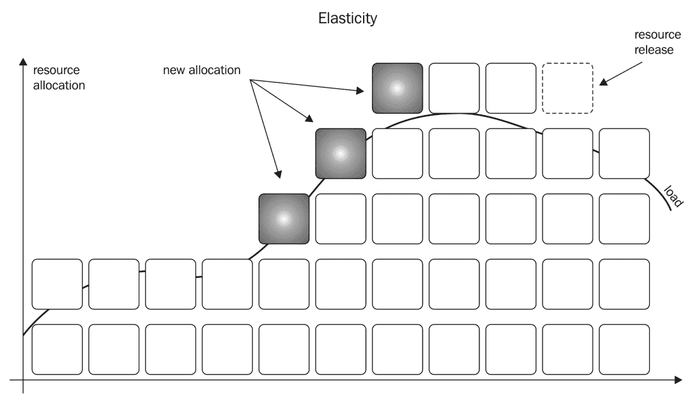
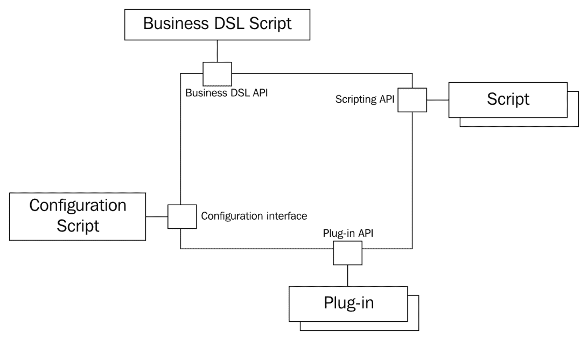
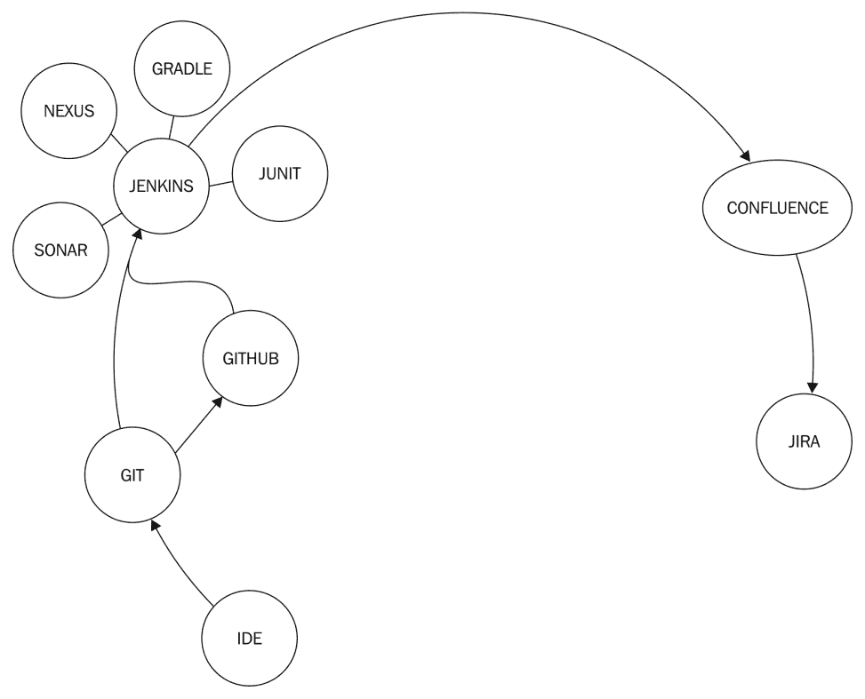

# 使用反应式编程构建会计应用

在本章中，我们将开发一个示例程序，该程序执行我们为其创建订单处理代码的公司的库存管理部分。不要期望一个完全开发的，随时可用的，专业的应用。另外，不要指望我们会进入会计和簿记的细节。这不是我们的目标。我们将更加关注所讨论的编程技术-*“反应式编程”*。对不起，朋友们，我知道记账和会计很有趣，但这本书不适合这些话题。

反应式编程是一个古老的概念（那么，在计算机科学中什么是古老的？）最近出现在 Java 中的方法。Java9 是第一个支持标准 JDK 中反应式编程的版本。用一句话概括一下，反应式编程更多地关注数据流，而较少关注实现如何处理数据流。您可能还记得，这也是从描述*如何做*到描述*我们想做什么*的一步。

读完本章之后，您将了解什么是反应式编程，以及 Java 中有哪些工具可以使用。您还将了解反应式编程的好处，以及将来何时以及如何利用这一原则，因为将有越来越多的框架支持 Java 中的反应式编程。在本章中，您将了解以下主题：

*   一般反应式编程
*   Java 中的反应流
*   如何以反应式的方式实现我们的示例代码

# 反应式是什么？

有反应式编程、反应式系统和反应式流。这是三个相互关联的不同事物。三者都被称为*反应式*，这并非没有道理。

反应式编程是一种类似于面向对象编程和函数式编程的编程范式。**反应式系统**是一种系统设计，它为某些类型的信息系统如何设计为反应式系统设定了一定的目标和技术约束。这与反应式编程原理有很多相似之处。**反应流**是一组接口定义，有助于实现与反应式系统相似的编码优势，可用于创建反应式系统。反应流接口是 JDK9 的一部分。它们有 Java 和其他语言版本。

我们将在单独的章节中讨论这些问题；在这些章节的末尾，您应该更好地理解为什么它们中的每一个都被称为*反应式*。

# 反应式程序设计

反应式编程是一种范式，它更多地关注计算过程中的数据流向，而不是如何计算结果。这个问题最好描述为几个依赖于另一个输出的计算，但是如果几个计算可以独立于另一个执行，那么反应式编程就可能出现。作为一个简单的例子，我们可以使用`f1`、`f2`、`f3`、`f4`和`f5`作为简单的计算步骤，通过一些给定的`b`、`c`、`e`和`f`值来计算`h`的值：

```java
a = f1(b,c) 
d = f2(e,f) 
k = f3(e,c) 
g = f4(b,f,k) 
h = f5(d,a,g)
```

如果我们用常规的方式用 Java 编写这些方法，那么方法`f1`到`f5`将被一个接一个地调用。如果我们有多个处理器并且能够使执行并行，那么我们也可以并行执行一些方法。当然，这是假设这些方法是纯粹的计算方法，不会改变环境的状态，这样，它们就可以彼此独立地执行。例如，`f1`、`f2`和`f3`可以彼此独立地执行。`f4`功能的执行取决于`f3`的输出，`f5`的执行取决于`f1`、`f2`、`f4`的输出。

如果我们有两个处理器，我们可以一起执行`f1`和`f2`，然后执行`f3`，然后执行`f4`，最后执行`f5`。这是四个步骤。如果我们把前面的计算不是命令而是作为表达式，而不是表达式，而是计算是如何相互依赖的，那么我们就不规定实际的执行顺序，环境可以决定一起计算`f1`和`f3`，然后`f2`和`f4`，最后`f5`保存一步。这样，我们可以集中精力于数据流，让反应环境在其上运行，而不需要额外的约束：


这是一种非常简单的反应式编程方法。表达式形式的计算描述给出了数据流，但在解释中，我们仍然假设计算是同步执行的。如果计算是在连接到网络的不同机器上的不同处理器上执行的，那么计算可能不同步，也不需要同步。如果环境是异步的，那么响应程序可以异步执行。不同的计算`f1`到`f4`可能在不同的机器上实现和部署。在这种情况下，计算出的值通过网络从一个发送到另一个，并且每次输入发生变化时节点都执行计算。这与使用简单积木创建的老式模拟计算机非常相似，计算是使用模拟信号完成的。

该程序被实现为一个电子电路，当输入端的输入电压或电流（通常是电压）发生变化时，模拟电路以光速跟随它，结果出现在输出端。在这种情况下，信号的传播受到导线上光速和有线模块中模拟电路速度的限制，这种速度非常快，可能超过数字计算机。

当我们谈论数字计算机时，*信号*的传播是数字的，这种方式需要从一个计算节点发送到另一个计算节点，无论是 JVM 中的某个对象还是网络上的某个程序。如果以下任一情况适用，则节点必须执行其计算：

*   输入中的某些值已更改
*   需要计算的输出

如果输入没有改变，那么结果最终应该与上次相同；因此，不需要再次执行计算，这将是一种资源浪费。如果不需要计算结果，则不需要执行计算，即使结果与上一个结果不相同。没人在乎。

为了适应这种情况，反应式环境实现了两种传播值的方法。节点可以从其他模块的输出中提取值。这将确保不执行不需要的计算。这些模块可以将它们的输出推送到依赖它们的下一个模块。此方法将确保只有更改的值才会触发计算。某些环境可能会实现混合解决方案。

当系统中的值发生更改时，更改会传播到其他节点，这些节点会再次将更改传播到另一个节点，依此类推。如果我们把计算依赖性想象成一个有向图，那么变化沿着连接的节点向变化值的传递闭包方向移动。数据可以与所有值一起从一个节点输出到另一个节点输入，或者只有变化可以移动。第二种方法更复杂，因为它需要更改的数据和描述更改内容的元信息。另一方面，当数据的输出和输入集是巨大的，并且只有一小部分被改变时，增益可能是显著的。当一些节点很有可能不改变许多不同输入的输出时，仅计算和传播实际的变化增量也很重要。在这种情况下，尽管改变了输入值，但改变传播可以在没有实际改变的节点处停止。这可以在某些网络中节省大量计算。

在数据传播的配置中，有向无环图可以用程序的代码来表示；它可以配置，甚至可以在代码执行过程中动态地设置和更改。当程序代码包含图的结构时，路由和依赖关系是相当静态的。要更改数据传播，必须更改、重新编译和部署程序的代码。如果有多个网络节点程序，这甚至可能需要多个部署，这些部署应小心提供，以避免在不同节点上运行不同的不兼容版本。在某些配置中描述图形时，应该有类似的注意事项。在这种情况下，当仅改变图的布线时，可能不需要编译程序，但是在网络执行的情况下在不同节点上具有兼容配置的负担仍然存在。

让图形动态变化也不能解决这个问题。设置和结构更加灵活，同时也更加复杂。沿着图的边缘传播的数据不仅可以包含计算数据，还可以包含驱动图中变化的数据。很多时候，这导致了一个非常灵活的模型，称为**高阶反应式编程**。

反应式编程有很多好处，但同时，对于简单的问题来说，它可能非常复杂，有时过于复杂。当要解决的问题可以很容易地用数据图和简单的数据传播来描述时，就要考虑这个问题。我们可以将问题的描述和不同块的执行顺序分开。这与我们在上一章中讨论的考虑是一样的。我们更多地描述*做什么*部分，而较少描述*如何做*部分。

另一方面，当反应式系统决定执行顺序、发生了什么变化以及这些变化应如何反映在其他块的输出上时，它应该在不知道它正在解决的问题的核心的情况下这样做。在某些情况下，基于原始问题手动编码执行顺序可以执行得更好。

这类似于内存管理问题。在现代运行时环境中，比如 JVM、Python 运行时、Swift 编程，甚至 Golang，都有一些自动化的内存管理。当用 C 语言编程时，程序员可以完全控制内存分配和内存释放。在实时应用中，性能和响应时间是最重要的，没有办法让自动垃圾收集器花费时间并不时延迟执行。在这种情况下，可以对 C 代码进行优化，以便在需要时分配内存；在可能的情况下，有资源用于分配和释放内存，并且有时间来管理内存。这些程序比使用垃圾收集器为相同目的创建的程序性能更好。尽管如此，我们在大多数应用中不使用 C，因为我们可以负担自动内存收集所需的额外资源。尽管可以通过手动管理内存来编写速度更快的代码，但自动化代码比普通程序员使用 C 语言编写的代码要快，而且编程错误的频率也要低得多。

正如在使用自动内存管理时需要注意的一些问题一样，我们必须注意反应环境中的一些问题，而在手动编码的情况下，这些问题是不存在的。不过，我们使用了反应式方法来实现其好处。

最重要的问题是避免依赖关系图中的循环。尽管编写计算的定义是绝对完美的，但反应式系统可能无法处理这些定义。一些反应式系统可能在一些简单的情况下解决循环冗余，但这是一个额外的功能，我们通常只能避免。考虑以下计算：

```java
a = b + 3 
b = 4 / a
```

这里，`a`依赖于`b`，所以当`b`改变时，计算`a`。然而，`b`也依赖于`a`，重新计算，这样系统就进入了一个无限循环。前面的例子看起来很简单，但这是一个好例子的特点。现实生活中的问题并不简单，在分布式环境中，有时很难找到循环冗余。

另一个问题称为**故障**。考虑以下定义：

```java
a = b + 3 
q = b + a
```

当参数`b`改变时，例如从`3`改变为`6`，则`a`的值将从`6`改变为`9`，从而`q`将从`9`改变为`15`。这很简单。然而，基于对变更的识别的执行命令可以首先将`q`的值从`9`改变为`12`，然后在第二步骤中将其修改为`15`。如果负责计算`q`的计算节点将`b`中的变化识别为`b`值变化的结果，则会发生这种情况。在短时间内，`q`的值将是`12`，这与前一个值不匹配，也与更改的状态不匹配。此值只是系统中的一个小故障，在输入更改后发生，并且在系统中输入没有任何进一步更改的情况下消失：


如果你曾经学过逻辑电路的设计，那么**静电危害**可能会敲响警钟。它们是完全相同的现象。

反应式编程还假设计算是无状态的。执行计算的各个节点在实践中可能具有某种状态，并且在大多数情况下，它们确实具有这种状态。在某些计算中有一个状态本身并不是邪恶的。然而，调试有状态的东西要比调试无状态和功能性的东西复杂得多。

它也是反应式环境的一个重要辅助工具，允许它基于计算是功能性的这一事实执行不同的优化。如果节点有一个状态，那么计算可能无法自由地重新安排，因为结果可能取决于实际的求值顺序。这些系统可能不是真正的*反应式*，或者，至少，这可能是有争议的。

# 反应式系统

**反应式系统**[在反应宣言中定义](http://www.reactivemanifesto.org/)。宣言的创建者意识到，随着技术的变化，需要在企业计算中开发新的系统模式，以利用新技术并产生更好的结果。宣言设想的系统如下：

*   响应式
*   可恢复
*   弹性
*   消息驱动

前三个特性是用户价值；最后一个特性更像是获取价值的技术方法。

# 响应式

如果系统以可靠的方式给出结果，那么它就是*响应式的*。如果你跟我说话，我会回答你的问题，或者，至少，告诉你我不知道答案或者我不能理解这个问题。是的，得到答案会更好，但是如果一个系统不能给你答案，它仍然会给你一些回报。如果您有十年前的客户端操作系统和一些旧计算机的经验，您可以理解这一点。得到一个旋转沙漏是令人沮丧的。你只是不知道这个系统是在帮你找到答案，还是完全冻结了。

反应式系统必须响应。应及时作出答复。实际计时取决于实际系统。如果系统运行在一艘向木星另一侧的宇宙飞船上运行，可能需要毫秒、秒甚至数小时。重要的是系统应保证响应时间的一些*软*上限。这并不一定意味着系统应该是一个实时解决方案，这是一个更严格的要求。

响应性的优势不仅在于用户在电脑前不会变得紧张。毕竟，这些服务中的大多数都是由其他主要相互通信的服务使用的。真正的优点是错误发现更可靠。如果反应式系统元素变得不响应，那么它肯定是一个错误情况，应该在正常操作范围之外对其进行处理（更换故障的通信卡，重新启动系统等等）。我们越早识别错误状态，修复它就越便宜。我们越能识别问题的所在，我们就越少地花费时间和金钱来定位错误。响应性不是速度，而是关于更好的操作和更好的质量。

# 可恢复的

**可恢复的系统**即使有错误，也要继续工作。好吧，没什么错误。那将是奇迹，或者是胡说八道！错误通常是错误。如果末日来临，正如我们所知，世界末日已经结束，即使是有弹性的系统也不会有响应。然而，对于较小的中断，可能有一些方法可以使系统具有弹性。

如果只有一个磁盘出现故障、断电或出现编程错误，有些技术可能会有所帮助。系统可能会被复制，因此当其中一个实例停止响应时，其他实例可能会承担失败实例的任务并继续工作。容易出错的系统可能在空间或时间上相互隔离。当一个地点发生地震或洪水时，另一个地点仍可能继续工作。如果不同的组件不需要实时通信，并且消息以可靠的方式存储和转发，那么这不是问题，即使这两个系统永远不可能同时可用。他们仍然可以通过接收消息，执行他们应该执行的任务，然后发送结果消息来进行合作。

必须解决系统中的错误，即使系统保持响应。错误不会影响弹性系统的响应能力，但弹性水平会降低，应该恢复。

# 弹性的

**弹性**表示系统正在适应负载。我们可以有一个巨大的系统，有许多处理器能够满足最大的预期需求，但这不是弹性的，因为需求不是恒定的，而且在大多数情况下，小于最大值，所以这样一个系统的资源是空闲的。这会浪费时间、CPU 周期和能源，从而产生生态足迹：



在云上运行系统可以避免这种损失。云只不过是一些人为多个应用（甚至是多个公司）操作的许多计算机，每个计算机只租用它真正需要的 CPU 周期，而且只在它需要的时候租用。在其他时候，当负载较小时，CPU 和电力可以由其他人使用。由于不同的应用和不同的公司有不同的峰值时间，因此该模型的资源损失较小。有许多问题需要解决，如数据隔离和信息保护，防止窃听，但这些主要是解决。秘密服务公司不会从云服务租用资源来运行计算（也许，他们会做一些其他的用途），一些其他偏执的公司也可能不这样做，但大多数公司会这样做。即使考虑到所有可能的副作用，它也更有效，因此更便宜。

弹性意味着分配的资源遵循或更确切地说是预期需求。当系统预期到更高的容量需求时，它会分配更多的资源，在非高峰时间，它会释放资源，以便其他云客户可以使用它。

弹性还假设系统是可伸缩的。弹性和可伸缩性这两件事密切相关，但并不相同。*可扩展性*意味着应用可以适应更高的负载，分配更多的资源。可伸缩性并不关心这种分配是在一个专门用于应用的计算中心中静态购买和驱动巨大的计算机机箱，还是按需从云中动态分配资源。可伸缩性仅仅意味着如果需求翻倍，那么资源也可以成倍地满足需求。如果所需资源中的乘法因子与需求中的乘法因子相同或不大于需求中的乘法因子，则应用是可伸缩的。如果我们需要更多的资源来满足需求，或者如果我们不能满足需求，即使需求只是适度增长，那么应用是不可伸缩的。弹性应用总是可伸缩的；否则，它们就不能是弹性的。

# 消息驱动

反应式系统是**消息驱动**，不是因为我们需要消息驱动系统，而是因为消息驱动系统是那些可以同时提供响应性、弹性和弹性的系统。

消息驱动架构意味着信息在断开连接的组件之间传输。一个组件发送一条消息，然后*忘记了*它。它不会等待其他组件对消息执行操作。当消息被发送时，代表发送组件的所有任务都被执行，并且处理这些任务所需的所有资源都被释放，从而消息被释放并准备好用于下一个任务。

*消息驱动*并不一定意味着*联网*。消息可以在同一台机器内的对象、线程和进程之间传递。另一方面，如果消息传递架构的接口设计良好，那么如果基础结构发生变化，则不需要修改组件，以前在线程之间传递的消息现在必须以 IP 包的形式穿越海洋。

发送消息使得在空间和时间上隔离发送者和接收器成为可能，正如我们所描述的，这是一种弹性的手段。接收方可以在消息到达后的一段时间内在有资源的情况下提取消息。然而，响应性要求这个时间不是在遥不可及的遥远未来，而是在有限的距离内。如果无法成功处理该消息，则另一条消息可能会发出错误信号。错误消息不是我们期望的结果，但它仍然是一个响应，并且系统仍然对它提供的所有好处做出响应。

# 背压

消息处理具有适当的消息接口和实现，支持**背压**。当组件不能或几乎不能处理更多消息时，背压是一种减轻组件负担的方法。消息可以排队等待处理，但现实生活中的队列没有无限的容量，反应式系统不应该丢失不受控制的消息。背压将组件的负载信号发送给消息生产者，要求他们减少产量。它就像一根水管。如果你开始关闭管道的出口，管道内的压力开始向后增加，水源迫使它输送的水越来越少。

背压是处理负载的一种有效方法，因为它将负载处理移到真正能够处理负载的部件上。在老式的排队系统中，有一个队列存储项目，直到接收项目的组件能够使用它们，完成其工作。如果对负载的大小和队列的最大大小有一个明确的限制，那么队列设计就是好的。如果队列已满，则无法传递项目，系统将暂停。

施加背压有点不同。为了优化性能和确保响应性，仍然可以在组件前面使用队列。产品的生产者仍然可以将生产的产品放入队列中，然后重新开始履行自己的职责，而不需要等到消费者能够处理产品。正如我们前面提到的，这是脱钩。看到队列已满或几乎已满，也可以作为一个非常简单的背压。如果有人说队列完全没有这个功能，那就不对了。有时，只需查看队列的容量以及队列中的项目，就足以确定是否需要减轻队列所属接收器的负载。但是制作者做这个，而不是接收器，这是一个重要的问题。

生产者发现接受者没有跟上供给的步伐，但是生产者没有任何关于原因的信息，不知道原因不能预测未来的行为。从接受者到制作者有一个背压信息通道，这使得故事更细粒度。

生产者可能会看到，比如排队有 10 个插槽，认为没有问题；生产者决定在接下来的 150ms 内再交付 8 个项目，一个项目通常需要 10 毫秒的时间来处理、给予或带走；因此，预计在 100 毫秒以内处理，这正好比要求的 200 毫秒最大值要好。生产方只知道一个项目通常需要 10 毫秒的时间才能加工。另一方面，接收方看到，进入队列的最后一个项目需要大量处理，因此，本身需要 200 毫秒。要发出信号，它可以通过背压告诉生产者在进一步通知之前不要交付新项目。接收人知道这些项目本来可以很好地装入队列中，但不会及时处理。使用这些信息，生产者将向云控制发出一些命令，分配另一个处理，并将接下来的 8 个项目发送到新的接收器，让旧的接收器完成它必须处理的繁琐工作，而这远远高于平均项。

背压使您可以通过接收程序创建的信息来辅助数据加载控制，这些接收程序拥有关于处理项目的最多信息。

# 反应流

**反应流**作为一项倡议启动，通过使用背压调节数据推送来提供异步模式下处理数据流的标准。项目原址为[这个页面](http://www.reactive-streams.org/)。

反应流现在在 JDK9 中的`java.util.concurrent`包中实现。

反应流定义的目的是定义一个接口，该接口可以以完全异步的方式处理所生成数据的传播，而不需要在接收端缓冲所创建的无限数据。当数据在流中创建并可供处理时，获取数据的 worker 必须足够快以处理生成的所有数据。容量应足够高，以处理最高产量。一些中间缓冲区可以处理峰值，但是如果没有控制，当用户达到其最大容量时停止或延迟生产，系统将失败。反应式系统接口旨在提供一种支持背压的方法。背压是一个向数据生产者发出信号，要求其放慢甚至停止生产，使其达到适合消费者的水平的过程。接口定义的每个调用都是异步的，这样一个部分的性能就不会受到其他部分执行延迟的影响。

该倡议的目的并不是确定生产和消费之间数据传输的方式。它关注于接口，为程序提供一个清晰的结构，并提供一个能与所有实现一起工作的 API。

# Java 中的反应式编程

Java 不是一种反应式语言。然而，这并不意味着我们不能用 Java 创建反应式程序。有些库支持不同的反应式编程方法。我应该提到，Akka 框架和 ReactiveX 也适用于其他语言。在 Java9 中，JDK 开始支持反应式编程，为此提供了一些类和接口。我们现在将重点介绍这些特性。

JDK 包含`java.util.concurrent.Flow`类，该类包含相关接口和一些支持流控制程序的静态方法。此类支持的模型基于`Publisher`、`Subscriber`和`Subscription`。

作为一个非常简单的解释，`Publisher`接受`Subscriber`的订阅。当数据可用时，`Subscriber`获取它订阅的数据。这些接口集中在通信的数据流控制的核心，它们有点抽象，所以它们是接口。然而，一开始理解它们的工作原理可能并不简单。

`Publisher`接口定义`subscribe()`方法。这是这个接口定义的唯一方法，这是因为这是唯一一个可以询问*真正的*发布者的方法。你可以订阅这些出版物。方法的参数是订阅出版物的`Subscriber`：

```java
void subscribe(Flow.Subscriber<? super T> subscriber)
```

JDK 中有一个现成的`Publisher`类，我们将在后面讨论。当调用`Publisher`的`subscribe()`方法时，必须决定用户是否可以获得订阅。通常，订阅是被接受的，但是实现可以自由地拒绝订阅尝试。例如，如果已经对实际订户执行了订阅，并且`Publisher`实现不允许来自同一订户的多个订阅，则`Publisher`可以拒绝订阅。

方法的实现要求调用`subscriber`的`onError()`方法，参数为`Throwable`。对于多个订阅，似乎`IllegalStateException`是合适的，因为 JDK 文档目前定义了。

如果订阅成功，`Publisher`需要调用`subscriber`的`onSubscribe()`方法。此方法的参数是一个`Subscription`对象（实现接口`Subscription`的类的实例）。这样，`Publisher`通知`Subscriber`订阅请求被接受，并且还传递一个对象来管理订阅。

将订阅管理为一个抽象可以想象为一个复杂的任务，但是在反应流的情况下，它非常简单。订阅者所能做和应该做的就是设置它当前可以接收的项目数，并且可以取消订阅。

为什么`Publisher`要回调`Subscriber`的`onSubscribe`方法？为什么它不直接返回订阅或者抛出一些错误呢？产生这种复杂行为的原因是，调用`subscribe()`方法的可能不是`Subscriber`。就像在现实生活中一样，我可以订阅一本杂志并支付一年的费用作为圣诞礼物。（这是我写这部分书的季节）在我们的代码中，一些负责向谁通知某些数据更改的布线组件呼叫`subscribe`，而不一定是用户。`Subscriber`只负责订户应该负责的最小的事情。另一个原因是整个方法是异步的。当我们订阅某些东西时，订阅可能不会立即可用并准备就绪。可能有一些长时间运行的进程需要在订阅可用之前完成，而调用`subscribe`的调用方不需要等待进程完成。当订阅准备就绪时，它将被传递给订阅服务器，传递给真正需要它的实体。

`Subscriber`接口定义了`onSubscribe()`、`onError()`（我们已经讨论过）、`onComplete()`和`onNext()`方法。

在这些接口的定义中，订户从`Publisher`或`Publisher`通过推送将此任务委托给的其他对象获取项目是很重要的。订户不需要去*报摊*取下一期，有人调用`onNext`方法直接将该期交给它。

这也产生了这样的后果，除非`Subscriber`手中有一些控制，否则`Publisher`可能会用项目淹没`Subscriber`。不是每个`Subscriber`都能处理无限的项目。`Subscriber`在订阅时得到一个`Subscription`对象，这个对象可以用来控制项目对象的流程。

`Publisher`创建`Subscription`对象，接口定义了`cancel`和`request`两种方法。`Subscriber`应调用`cancel()`方法，通知`Publisher`不应交付更多项目。订阅已取消。`request(long n)`方法指定用户准备通过后续调用`onNext()`方法最多获取`n`项：


如果订阅者已经调用了`request()`方法，则指定的号码被添加到订阅计数器中。换句话说，指定的`long`值并不反映订户的实际状态。它是一个*增量*，增加一些由`Publisher`维护的计数器，这些计数器统计可以传递的项目的数量，将`long`参数的值相加，并在每个传递到`Subscriber`的项目上减少*一*。最常用的方法是每次`Subscriber`处理完请求后调用`request(1)`。

如果使用`Long.MAX_VALUE`参数调用`request()`方法，`Publisher`可以只发送它可以发送的任何项，而不进行计数和限制。这实际上是关闭背压机制。

该规范还提到，对`cancel`的调用并不一定意味着将不再交付问题。尽最大努力取消。就像在现实生活中一样，当你把你的邮件发送到日报上并打算取消订阅时，出版商不会在邮递员把邮件发送到你的邮箱之前派一个代理来阻止他们。如果在取消通知到达出版商时，有些东西已经在路上了，那么它将继续前进。如果`Publisher`已经启动了一些无法合理停止的异步进程，那么`onNext()`方法将与一些元素一起调用。

`Publisher`和`Subscriber`接口有一个通用参数`T`。这是`Publisher`接口发布的项目类型，`Subscriber`接口在`onNext()`方法中获取的项目类型。更确切地说，`Subscriber`接口可以有一个`R`类型，它是`T`的一个超类；因此，它与`Publisher`接口兼容。例如，如果`Publisher`发布`Long`值，则`Subscriber`接口可以接受`onNext()`方法的参数中的`Long`、`Number`或`Object`，具体取决于实现`Subscriber`的类的声明。

`Flow`类还包含一个`Processor`接口，该接口扩展了`Publisher`和`Subscriber`。这个接口将由类实现，这些类也接受数据并将数据发送到反应流中的其他组件。这些元素在反应流程序中非常常见，因为许多执行某些任务的元素从其他反应流元素获得要处理的项；因此，它们是`Subscriber`，同时，它们在完成任务后发送；因此，它们是`Publisher`。

# 实现库存

现在我们已经讨论了很多技术和编程方法，现在是时候实现一些示例代码了。我们将实现库存，在我们的应用中保持使用反应流。例如，清单将非常简单。它是一个`Map<Product,InventoryItem>`，用于保存每个产品的项数。实际的映射是`ConcurrentHashMap`，`InventoryItem`类要比`Long`数字复杂一些，以便正确处理并发问题。当我们设计一个建立在响应流上的程序时，我们不需要处理太多的并发锁定，但是我们仍然应该意识到代码运行在多线程环境中，如果我们不遵循一些规则，可能会表现出奇怪的行为。

`Inventory`类的代码相当简单，因为它只处理一个映射：

```java
package packt.java11.mybusiness.inventory;

import ...

@Component
public class Inventory {
    private final Map<Product, InventoryItem> inventory =
            new ConcurrentHashMap<>();

    private InventoryItem getItem(Product product) {
        inventory.putIfAbsent(product, new InventoryItem());
        return inventory.get(product);
    }

    public void store(Product product, long amount) {
        getItem(product).store(amount);
    }

    public void remove(Product product, long amount)
            throws ProductIsOutOfStock {
        if (getItem(product).remove(amount) != amount)
            throw new ProductIsOutOfStock(product);
    }
}
```

维护类的库存项目要复杂一些，因为这是我们处理一点并发性的级别，或者至少，这是我们必须注意的类：

```java
package packt.java11.mybusiness.inventory;

import java.util.concurrent.atomic.AtomicLong;

public class InventoryItem {
    private final AtomicLong amountOnStock =
            new AtomicLong(0);

    void store(long n) {
        amountOnStock.accumulateAndGet(n,
                (stock, delta) -> stock + delta);
    }

    long remove(long delta) {
        class ClosureData {
            long actNr;
        }
        var d = new ClosureData();
        amountOnStock.accumulateAndGet(delta,
                (stock, n) ->
                        stock >= n ?
                                stock - (d.actNr = n) :
                                stock - (d.actNr = 0));
        return d.actNr;
    }
}
```

当我们把产品加入存货时，我们没有限制。储存架是非常巨大的，我们没有模型，他们可能会得到充分和库存可能无法容纳更多的项目。然而，当我们想从存储库中删除项目时，我们必须处理这样一个事实：产品中可能没有足够的项目。在这种情况下，我们不会从存储库中删除任何项。我们为顾客提供完全满意的服务，否则根本不提供服务。

为了维护库存中的项目数量，我们使用了`AtomicLong`。这个类有`accumulateAndGet()`方法。这个方法得到一个参数和一个在我们的代码中作为 Lambda 提供的参数。此代码由`accumulateAndGet()`方法调用，以计算股票的新价值。如果有足够的项目，那么我们将删除请求的项目数。如果没有足够的存货，我们就去掉零。方法返回实际返回的项数。因为这个数字是在 Lambda 内部计算出来的，所以它必须从 Lambda 中逃逸出来。为此，我们使用方法内部定义的`ClosureData`。

请注意，例如，在 Groovy 中，我们可以简单地使用一个`Long d`变量并在闭包内更改该变量。可以说，Groovy 将 Lambda 调用为闭包。在 Java 中，我们不能这样做，因为我们可以从方法内部访问的变量应该是有效的`final`。然而，这只不过是属于闭包环境的更显式的表示法。`ClosureData d`对象是`final`，与类具有的字段相反，可以在 Lambda 中修改该字段。

本章中我们真正感兴趣的最有趣的课程是`InventoryKeeper`。此类实现了`Subscriber`接口，能够使用订单维护库存：

```java
package packt.java11.mybusiness.inventory;

import ...

public class InventoryKeeper implements Flow.Subscriber<Order> {
    private static final Logger log = LoggerFactory.getLogger(InventoryKeeper.class);
    private static final long WORKERS = 3;
    private final Inventory inventory;
    private Flow.Subscription subscription = null;
    private ExecutorService service = Executors.newFixedThreadPool((int) WORKERS);

    public InventoryKeeper(@Autowired Inventory inventory) {
        this.inventory = inventory;
    }

    @Override
    public void onSubscribe(Flow.Subscription subscription) {
        log.info("onSubscribe was called");
        subscription.request(3);
        this.subscription = subscription;
    }

    @Override
    public void onNext(Order order) {
        service.submit(() -> {
                    log.info("Thread {}", Thread.currentThread().getName());
                    for (final var item : order.getItems()) {
                        try {
                            inventory.remove(item.getProduct(), item.getAmount());
                            log.info("{} items removed from stock", item.getAmount());
                        } catch (ProductIsOutOfStock exception) {
                            log.error("Product out of stock");
                        }
                    }
                    subscription.request(1);
                }
        );
    }

    @Override
    public void onError(Throwable throwable) {
        log.info("onError was called for {}", throwable);
    }

    @Override
    public void onComplete() {
        log.info("onComplete was called");
    }
}
```

订阅对象后调用`onSubscribe()`方法。订阅将传递给对象，并存储在字段中。由于用户在以后的呼叫中需要这个订阅，所以当处理传入`onNext`的项目并且可以接受新的项目时，字段是存储这个对象的好地方。在这个方法中，我们还将初始请求设置为三项。实际值只是说明性的。企业环境应该能够配置这样的参数：

```java
private ExecutorService service =  
                   Executors.newFixedThreadPool((int) WORKERS);
```

代码中最重要的部分是`onNext()`方法。它所做的实际上是检查订单的所有项目，然后从库存中删除项目的数量。如果有些商品缺货，它会记录一个错误。这是无聊的部分。有趣的是，它是通过一个执行器服务来实现的。这是因为对`onNext`的调用应该是异步的。出版者打电话给`onNext`送货，但我们不能让它等待实际处理。当邮递员带来你最喜欢的杂志时，你不会马上开始阅读，而是让邮递员等待你的签名认可。在`onNext()`中，您所要做的就是获取下一个订单，并确保这将在适当的时候得到处理。

此代码中的实际实现使用了三个线程的`ThreadPool`。此外，所需项目的数量为 3 件。这是一个逻辑上的巧合，每个线程在一个项目上工作。它不需要像那样，即使在大多数情况下是这样。如果这有意义的话，没有什么能阻止我们在同一个项目上创建更多的线程。反之亦然。可以创建一个线程来处理多个项目。这些代码可能会更复杂，而这些复杂执行模型的整体思想是使编码和逻辑更简单，将多线程、编码和实现问题转移到框架中，并将重点放在应用代码中的业务逻辑上。但我不能说，可能没有一个订阅者在多个项目上处理多个线程的例子，这些线程混杂在一起。

我们在本章中要看的最后一段代码是单元测试，它通过一些示例来驱动代码：

```java
@Test
public void testInventoryRemoval() throws InterruptedException {
    Inventory inventory = new Inventory();
    try (SubmissionPublisher<Order> p = new SubmissionPublisher<>();) {
```

我们使用 JDK 类`SubmissionPublisher`创建`Publisher`，该类通过为我们提供多线程功能而整洁地实现了这个接口，没有太多麻烦：

```java
p.subscribe(new InventoryKeeper(inventory));
```

我们创建一个库存保管器，然后订阅发布者。因为还没有出版物，这并不能开始交付任何东西，但它在订阅者和发布者之间建立了一种纽带，告诉他们无论何时提交产品，订阅者都想要它。

之后，我们创建产品并将其存储在库存中，总共 20 件，我们还创建了一个订单，希望交付 10 件产品。我们将多次执行这个命令。这有点简化，但对于测试，没有理由创建单独的订单对象，这些对象在项目列表中具有相同的产品和相同的数量：

```java
Product product = new Product();
inventory.store(product, 20);
OrderItem item = new OrderItem();
item.setProduct(product);
item.setAmount(10);
Order order = new Order();
List<OrderItem> items = new LinkedList<>();
items.add(item);
order.setItems(items);
```

毕竟，这件事已经完成了，我们向`Publisher`提交了 10 次订单。这意味着同一产品有 10 个订单，每个订单要 10 件，总共 100 件。这是 100 件，我们只有 20 件。我们应该预期的是，只有前两个订单将得到满足，其余订单将被拒绝，这就是我们执行此代码时实际发生的情况：

```java
for (int i = 0; i < 10; i++)
    p.submit(order);
log.info("All orders were submitted");
```

所有订单发布后，我们等待半秒钟，以便其他线程有时间执行，然后我们完成：

```java
    for (int j = 0; j < 10; j++) {
        log.info("Sleeping a bit...");
        Thread.sleep(50);
    }
}//try( p )
```

请注意，这不是常规的单元测试文件。这是一些测试代码，我还建议您执行、调试和查看不同的日志输出。

# 总结

在这短短的一章中，我们了解了反应式编程、反应式系统和反应式流。我们讨论了它们之间可能导致混淆的相似之处和不同之处。我们特别关注 Java 反应流（在 Java9 中引入），它们实际上与`Stream`类和方法无关。

在本章的后半部分，我们讨论了一个使用反应流的非常简单的示例。

在阅读了本章之后，您已经学到了很多关于 Java 语言和编程的知识。我们没有详细介绍 Java 的所有细节，因为这在一本书中是不可能的。我敢说，地球上，或者说地球周围的轨道上，无论人类在哪里，都没有人知道 Java 的一切。然而，到现在为止，我们已经知道了足够的知识，可以开始在企业环境中编写代码，并且在退休之前，甚至退休之后，我们可以不断地学习更多的知识。剩下的是一点编程。在上一句中，我用了*编码*这个词来区分。编码与编程不同。编码是编程专业中使用的一种技术。在最后一章中，我们将看到编程的各个方面，以及如何以专业的方式进行编程。这在介绍性的书中很少涉及，但我很高兴我们能在这个问题上与出版商达成一致。这样，你就可以完成这本书，不仅用你从这本书中学到的知识，而且用一种远见，展望未来的道路，你将走上山坡的顶端。你将知道你可以继续学习的主题、领域和科目。

# 将 Java 知识提升到专业水平

到目前为止，您已经了解了专业 Java 开发人员所需的最重要的领域和主题。我们仍然要讨论的是一些话题，这些话题将引导您从初级开发人员变成高级开发人员。不过，阅读本章并不能使任何人成为高级开发人员。前几章是我们走过的路。这一章只是地图。如果前面的每一章都涵盖了编码到达港口的旅程中几英里的短距离步行，那么这一章就是发现新大陆的航海图。

我们将简要介绍一些非常深入和高级的专业领域，例如创建 Java 代理、编译时注释处理、多语言编程、一些架构设计、工具和团队协作的技术。我们将提供这些地区的品尝者。现在，你有足够的知识来理解这些话题的重要性，尝一尝就会对未来几年的自我发展产生胃口，或者，至少，我的意图是让你这个读者沉迷其中。

# Java 深层技术

在本节中，我们将介绍三种技术：

*   Java 代理
*   多语言程序设计
*   注解处理

对于 Java 专业人士来说，了解它们不是必须的。对他们的了解是非常重要的。Java 代理主要用于开发环境和操作中。它们是与已经运行的 JVM 交互的复杂运行时技术。注释处理是另一个领域。注释处理器被插入 Java 编译器。多语言编程处于中间地位。它是 JVM 编程，就像用 Java 编程一样，但是使用不同的语言，或者，也许，不同的语言和 Java 一起使用。甚至包括许多语言，比如 Jython、Groovy、Clojure 和 Java。

我们将讨论这些技术，以便您了解它们是什么，以及在何处查找更多信息，以防您想了解更多。

# Java 代理

Java 代理是由 Java 运行时以特殊方式加载的 Java 程序，可以用来干扰加载类的字节码，从而改变它们。它们可用于执行以下操作：

*   列出或记录，并在运行时报告加载的类
*   修改这些类，以便这些方法将包含额外的代码来报告运行时行为
*   支持调试器在开发人员修改源代码时更改类的内容

例如，该技术用于来自 [**JRebel** 和 **XRebel** 产品](https://zeroturnaround.com/)。

尽管 Java 代理在 Java 的深层细节中工作，但它们并不神奇。它们有点复杂，您需要对 Java 有深入的了解，但是任何能用 Java 编程的人都可以编写 Java 代理。所需要的是，该类（即代理）具有一些预定义的方法，这些方法与代理的其他类一起打包到一个 JAR 文件中，并且具有一个`META-INF/MANIFEST.MF`文件，该文件定义实现`premain()`和/或`agentmain()`方法的类的名称，以及一些其他字段。

详细而精确的参考文件是 *JDK JavaDoc* 的一部分，可在[`java.lang.instrument`包](https://docs.oracle.com/javase/8/docs/technotes/guides/instrumentation/index.html)的文件中获得。

使用 Java 代理启动 Java 应用时，命令行必须包含以下选项：

```java
-javaagent:jarpath[=options]
```

这里，`jarpath`指向包含代理类和清单文件的 JAR 文件。类必须有一个名为`premain`或`agentmain`的方法。它可能有一个或两个参数。在初始化 JVM 之后，JVM 首先尝试调用双参数版本：

```java
public static void premain(String agentArgs, Instrumentation inst);
```

如果不存在两个参数版本，则使用一个参数版本，这与两个参数版本基本相同，但忽略了`inst`参数，我认为，这并没有太大意义，因为 Java 代理没有`Instrumentation`对象不能做太多事情：

```java
public static void premain(String agentArgs);
```

`agentArgs`参数是在命令行上作为选项传递的字符串。第二个参数`Instrumentation`提供了注册类转换器的方法，这些类转换器可以修改类字节码，并提供了在运行时要求 JVM 执行类的重新定义或重新转换的方法。

Java 应用也可以在程序启动后加载代理。在这种情况下，不能在 Java 应用的主方法之前调用代理，因为此时它已经启动了。为了区分这两种情况，JVM 在这种情况下调用了`agentmain`。请注意，`premain`或`agentmain`是为代理调用的，而不是两者都调用。单个代理可以同时实现这两个功能，这样它就能够执行在启动时加载的、在命令行上指定的或在 JVM 启动后加载的任务。

如果使用了`agentmain`，则其参数与`premain`相同。

`premain()`和`agentmain()`之间有一个重要的区别。如果在启动期间无法加载代理，例如，如果找不到代理，如果 JAR 文件不存在，如果类没有`premain()`方法，或者如果它抛出异常，JVM 将中止。如果代理是在 JVM 启动后加载的（本例中使用的是`agentmain`），那么如果代理出现错误，JVM 不会中止。

这种方法是相当合理的。假设有一个在 TomcatServlet 容器上运行的服务器应用。新版本启动后，系统进入停机维护期。如果新版本无法启动，因为代理的行为不好，最好不要启动。调试情况并修复它，或将应用回滚到旧版本并调用更长的修复会话所造成的损害，可能比启动应用并且没有适当的代理功能要小。如果应用仅在没有代理的情况下启动，则可能无法立即识别次优操作。另一方面，当稍后附加代理时，应用已经在运行。将代理附加到已运行的应用以从已运行的实例获取信息。停止已经运行的实例并使其失败，特别是在操作环境中，比不连接代理更具破坏性。无论如何，它可能不会被忽视，因为最有可能连接的代理是由操作人员使用的。

`premain`或`agentmain`代理获取一个`Instrumentation`对象作为第二个参数。这个对象实现了几个方法。其中之一是：

```java
void addTransformer(ClassFileTransformer transformer)
```

代理实现了转换器，它有`transform()`方法签名：

```java
byte[] transform(Module module, ClassLoader loader, 
                 String className, 
                 Class<?> classBeingRedefined, 
                 ProtectionDomain protectionDomain, 
                 byte[] classfileBuffer) 
throws IllegalClassFormatException
```

当类被加载或被转换时，JVM 调用这个方法。该方法获取类对象本身，但更重要的是，它获取包含类的字节码的字节数组。该方法应返回转换类的字节码。修改字节码需要了解字节码是如何构建的以及类文件的结构。有一些库可以帮助实现这一点，比如 [Javassist](http://www.javassist.org/) 或 [ASM](http://asm.ow2.org/)。不过，在熟悉字节码的结构之前，我不会开始编码。

代理在单独的线程中运行，并且可能与用户或文件系统交互，并且基于在任何时候的一些外部观察，可以调用以下方法来使用注册的转换器执行类的重新传输：

```java
void retransformClasses(Class<?>... classes)
```

代理还可以调用以下方法，该方法将重新定义作为参数给定的类：

```java
void redefineClasses(ClassDefinition... definitions)
```

`ClassDefinition`类只是`Class`和`byte[]`对。这将通过 JVM 的类维护机制重新定义类。

注意，这些方法和 Java 代理与 JVM 的深层、低级部分交互。这也产生了这样的结果：很容易破坏整个 JVM。字节码不会被检查，与加载类时不同，因此，如果它中有错误，结果可能不仅是异常，而且可能是 JVM 的崩溃。此外，重新定义和转换也不应改变类的结构。它们不应该更改继承占用、添加、重命名或删除方法，也不应更改方法的签名，字段也是如此。

另外，请注意，已经创建的对象不会受到更改的影响；它们仍将使用类的旧定义，并且只会影响新实例。

# 多语言程序设计

多语言编程是一种在同一应用中使用不同编程语言的技术。这种方法不仅适用于应用的不同部分在不同环境中运行的情况。例如，客户端使用 JavaScript、CSS 和 HTML 在浏览器中执行，而服务器被编程为在 Java 的 Tomcat 环境中运行。这是一个不同的故事，通常，当有人谈论多语言编程时，这不是典型的用例。

当在服务器上运行的应用部分地用 Java 和其他语言运行时，我们可以称之为 polyglot 编程。例如，我们用 Java 创建了订单处理应用，一些基于订单包含的产品特定代码检查订单正确性的代码是用 JavaScript 编写的。它响了吗？我们已经在本书中演示了 JDK 的脚本 API。这是真正的多语言编程，即使我们没有提到它的方式。

运行编译后的 Java 代码的 JVM 是不同语言编译器的一个非常好的目标，因此，有许多语言可以为它编译。当 JVM 运行一个类的字节码时，它不知道源语言是什么，也不关心；编译器是由字节码创建的，它只是执行它。

我们可以使用不同的语言，比如 Jython、Groovy 和 Scala，举几个流行的为 JVM 编译的语言。我们可以用一种语言编写一个类，用另一种语言编写另一个类。当它们被放在一个 JAR、WAR 或 EAR 文件中时，运行时系统只会运行它们。

我们什么时候使用多语言编程？

# 多语言配置

通常，当我们想要创建一个更灵活和可配置的应用时，我们转向多语言编程。在许多实例中安装的应用（通常在不同的客户站点上）都有一些配置。这些配置可以是 XML 文件、属性文件和 INI 文件（这些文件来自 Windows）。随着程序的发展，这些静态配置的可能性达到了极限。应用开发人员很快就会发现，他们需要配置一个使用这些技术描述起来很麻烦的功能。配置文件开始变大，读取和解释配置文件的代码变得太大。优秀的开发人员必须意识到这一点，在配置文件和处理它们的代码变得不可管理之前，必须实现一些脚本配置、多语言编程：



优秀的开发人员团队在开发他们的配置语言和该语言的解释器时，可能会达到这样的程度。它可以基于 XML，也可以是任何其他语言。毕竟，写一门语言很有趣，我自己也写过几次。然而，其中大多数都是业余爱好，而不是专业项目。通常，在制作另一种语言时没有客户价值。最好使用现有的。

在配置方面，Groovy 是一种非常方便的语言，它支持复杂的闭包、元类语法和实现。这样，该语言非常适合创建特定于领域的语言。因为 Groovy 是编译到 JVM 的，所以 Groovy 类可以直接从 Java 调用，而读取配置实际上是调用从配置文件编译的类。编译可以在应用构建期间进行，但是在配置的情况下，在应用启动期间进行编译更有意义。我们已经看到，脚本 API 的 Groovy 实现或 Groovy 提供的特殊 API 绝对能够做到这一点。

我们在书中见过这样的例子吗？这可能会让您感到惊讶，但实际上我们已经多次使用 Groovy 来描述配置。*Gradle* 构建文件就是主要在 Groovy 中开发的 Groovy DSL，用于支持项目的构建配置。

# 多语言脚本

配置不是 PolyPlot 编程的唯一应用。配置在程序启动时执行，配置数据随后用作静态数据。我们可以在应用的执行期间执行脚本，而不仅仅是在应用启动期间。这可以用于向程序用户提供额外功能，安装时使用相同的应用，但提供不同的脚本。

最早提供这种脚本功能的应用之一是 Emacs 编辑器。应用的核心是用 C 语言编写的，它包含一个 Lisp 解释器，用户可以编写脚本，这些脚本是在编辑器环境中执行的。工程程序 AutoCAD 也使用 Lisp 解释器来实现类似的目的。为什么使用 Lisp 来实现这个目的？Lisp 有非常简单的语法，因此，很容易解析 Lisp 代码。同时，该语言功能强大，当时有开源的 Lisp 解释器（至少一个）。

为了获得这种灵活性，应用通常提供插件 API，开发人员可以使用这些 API 来扩展应用。这就需要开发人员设置编码工具，包括 IDE、构建工具和持续集成，即专业的编程环境。当插件要解决的任务很简单时，开销就太大了。在这种情况下，脚本解决方案更方便。

脚本不是万能的。当扩展应用的脚本变得太复杂时，就意味着编写脚本的可能性太大了。然而，要从一个孩子手里夺回一个玩具是很困难的。如果用户习惯了脚本的可能性，那么如果我们发布的应用的下一个版本没有提供这种可能性，他们就不会接受。因此，评估脚本功能在我们的应用中的可能用途是非常重要的。脚本，更一般地说，我们的程序的任何功能，都不会按我们预期的方式使用。它们将被用于任何可能的用途。当涉及到滥用某个功能时，用户可能会超出想象。最好事先考虑限制脚本编写的可能性，或者限制脚本的运行时间，或者限制程序同意使用的脚本的大小。如果这些限制设置合理，并且用户理解并接受这些限制，那么除了脚本功能之外，还必须考虑插件结构。

应用的安全性，包括插件或脚本扩展，也非常重要。脚本或插件与核心应用运行在同一个 JVM 上。一些脚本语言在脚本周围提供了一个围栏，限制了对核心应用对象和类的访问，但这是一个例外。通常，脚本以与核心应用相同的权限运行，这样它们就可以做任何事情。因此，应该以与核心应用相同的方式信任脚本。对于应用的非特权用户，脚本安装或修改不应该是可能的。这样的操作几乎总是留给系统管理员。

如果一个没有特权的用户可以上传一个脚本到服务器，然后让它执行，我们就在应用中打开了一个安全漏洞。由于访问限制是由应用强制执行的，因此使用不受控制的脚本很容易覆盖这些限制。黑客可以轻松地访问其他用户的数据（他们无权访问），并读取和修改我们的数据库。

# 业务 DSL

当应用的代码可以分为业务代码和技术代码时，也可能出现多语言编程。业务代码包含我们实际为其编写应用的顶级业务逻辑，这是包含客户付费的逻辑的代码。技术代码支持在业务 DSL 中编码的算法。

大多数企业应用都包含这两种类型的代码，但许多应用并没有将它们分开。这将导致一个包含重复代码的单片应用。当您觉得在需要持久性或联网时正在编写相同类型的代码，并且在编写某些业务规则时又在编写相同类型的代码时，这种代码气味表明这两种代码类型没有分开。DSL 和脚本并不是一根魔杖，也不能解决所有源于不正确的应用结构的问题。在这种情况下，必须首先重构代码以分离业务逻辑和基础结构代码，实现 DSL 和支持它的业务 API 并将业务代码重写到 DSL 中只是第二步。这样一个项目的每一步都为应用提供了价值，即使它从未涉及到 DSL 和脚本，投入的精力也不会白费。

业务 DSL 脚本非常类似于可插入脚本，只是这次不是应用调用脚本来执行一些特殊的扩展功能。相反，DSL 代码通过它提供的业务 API 调用应用。提供 API 和使用 DSL 的优势在于，实现业务逻辑的代码可以摆脱技术细节，可以非常抽象，并且通过这种方式，可以更接近于问题的业务级描述，而不仅仅是程序代码。即使是商人也能理解业务 DSL，尽管在实际例子中这不是一个目标，但他们甚至可以编写代码。

在维也纳理工大学，我们也使用了类似的方法，使半导体模拟更适用于半导体设计工程师。核心计算代码是用 Fortran 语言编写的，Fortran 是一种处理大量仿真数据输入和输出的 C 语言框架，它嵌入了执行这些程序的 XLISP 解释器。Lisp 代码包含了仿真配置数据，当要对许多配置点执行仿真时，还可以包含简单的循环。它是多语言编程，只是当时没这么叫。

# 多语言的问题

多功能编程不仅仅是优势。在跳进这个方向之前，开发人员必须考虑很多事情。

为应用使用另一种语言需要知识。找到能用所用语言编写代码的人最终要比找到只懂 Java 的开发人员困难得多。（如果核心应用语言不是 Java，这也是事实。）不同的语言需要不同的思维方式，通常需要不同的人。团队还应该有一些精通两种语言的成员，如果大多数人对另一种语言至少了解一点，这也是一个优势。

支持 Java 的工具集非常出色。与其他语言相比，构建工具、集成开发环境、库、调试可能性和日志框架都非常好。Polyglot 开发也需要对其他语言的支持，这可能不如对 Java 的支持那么先进。通常，调试 DSL 解决方案确实是一个问题，IDE 支持也可能滞后。

当我们用 Java 编程时，我们常常想当然地认为 IDE 读取库的元数据，每当我们需要调用一个方法或引用一个类时，IDE 都会给出最好的建议。也可以支持 XML 和属性文件，IDE 可能知道一些最常用的框架，例如 *Spring*，并且理解将类名作为超链接处理的 XML 配置，即使类名在某些属性字符串中也是如此。

对于其他语言来说，这远没有这么容易。对于拥有广泛用户基础的语言，工具支持可能是很好的，但是如果您选择了一种外来语言，就只能靠自己了。语言越有异国情调，你得到的支持就越少。

您可以创建一个工具来支持 DSL。使用[这样的工具并不难做到](http://www.eclipse.org/Xtext/)。在这种情况下，您被绑定到 *Eclipse*，这可能是问题，也可能不是问题。你可以选择一种特殊的语言，例如，*Kotlin*，它得到了 *IntelliJ* 的广泛支持，因为同一家公司也支持这种语言和 IDE，但同样，你购买了一种特殊的技术，如果必须的话，更换这种技术的成本可能会很高。这不仅适用于语言，也适用于开发中包含的任何技术。当你选择一个，你应该考虑到支持和成本下车，如果或当它开始死亡。

# 注解处理

我们已经非常详细地讨论了注释。您可能还记得，我们使用以下注释定义了注释接口：

```java
@Retention(RetentionPolicy.RUNTIME)
```

这告诉 Java 编译器保留注释并将其放入 JVM 代码中，以便代码可以在运行时使用反射来访问它。默认值为`RetentionPolicy.CLASS`，这意味着注释进入字节码，但 JVM 不使其可用于运行时系统。如果我们使用`RetentionPolicy.SOURCE`，注释甚至不会进入类文件。在这种情况下，只有一种可能对注释编译时执行任何操作。

我们如何编写在编译时运行的代码？Java 支持注释处理器的概念。如果编译器的类路径上有一个类实现了`javax.annotation.processing.Processor`接口，编译器将调用实现的方法一次或多次，传递编译器实际处理的源文件的信息。这些方法将能够访问已编译的方法、类或任何注释，以及触发处理器调用的注释。但是，重要的是，此访问与运行时中的访问不同。注释处理器访问的既不是已编译的类，也不是已加载的类，也就是说，当代码使用反射时，它是可用的。此时源文件正在编译中；因此，描述代码的数据结构实际上是编译器的结构，我们将在下一个示例中看到。

注释处理器被称为一次或多次。它被多次调用的原因是编译器使注释处理器能够根据它在部分编译的源代码中看到的内容生成源代码。如果注释处理器生成 Java 源文件，编译器必须编译新的源代码，并可能再次编译一些已经编译的文件。这个新的编译阶段需要注释处理器支持，直到没有更多的循环执行。

注释处理器一个接一个地执行，它们在同一组源文件上工作。无法指定注释处理器执行的顺序；因此，两个处理器一起工作时应该执行它们的任务，无论它们以什么顺序被调用。另外，请注意这些代码在编译器内部运行。如果注释处理器抛出异常，编译过程可能会失败。因此，只有当存在无法恢复的错误并且注释处理器确定在该错误之后的编译无法完成时，才应该从注释处理器抛出异常。

当编译器进入执行注释处理器的阶段时，它会查看实现`javax.annotation.processing.Processor`接口的类，并创建这些类的实例。这些类必须有一个公共的无参数构造器。为了简化处理器的执行并仅为处理器可以处理的注释调用处理器，接口包含两个方法：

*   `getSupportedSourceVersion()`：返回注解处理器可以支持的最新版本
*   `getSupportedAnnotationTypes()`：返回一组`String`对象，其中包含此处理器可以处理的注释的完全限定类名

如果注释处理器是为 Java1.8 创建的，那么它可以与 Java9 一起工作，但也可能不工作。如果它声明支持的最新版本是 1.8，那么 Java9 环境中的编译器将不会调用它。最好不要调用注释处理器，而不是调用它并破坏编译过程，这甚至可能创建已编译但错误的代码。

对于注释处理器，这些方法返回的值相当稳定。注释处理器将返回它可以处理的相同源版本，并返回相同的注释集。因此，以声明的方式在源代码中定义这些值是明智的。

这可以在扩展`javax.annotation.processing.AbstractProcessor`类而不是直接实现`Processor`接口时完成。这个抽象类实现了这些方法。它们都从注释中获取信息，这样我们就可以修饰扩展抽象类的类。例如，`getSupportedAnnotationTypes()`方法查看`SupportedAnnotationTypes`注释并返回注释中列出的注释类型字符串数组。

现在，这是一个有点扭曲的大脑，也可能是混乱的开始。我们正在编译时执行注释处理器。但是编译器本身是一个 Java 应用，这样，时间就是编译器内部运行的代码的运行时间。`AbstractProcessor`的代码使用反射方法将`SupportedAnnotationTypes`注释作为运行时注释进行访问。这里面没有魔法。JDK9 中的方法如下：

```java
public Set<String> getSupportedAnnotationTypes() { 
    SupportedAnnotationTypes sat = this.getClass()
                      .getAnnotation(SupportedAnnotationTypes.class); 
    if  (sat == null) { 
        ... error message is sent to compiler output ... 
        return Collections.emptySet(); 
    } 
    else 
        return arrayToSet(sat.value()); 
}
```

（为了简洁起见，对代码进行了编辑。在 Java11 中，代码要复杂一些，因为它处理 Java9 中引入的模块，但结构基本相同。）

为了看一个例子，我们将看一看 polyglot 注释处理器的代码。我们非常简单的注释处理器将处理一个简单的注释，`com.javax0.scriapt.CompileScript`，它可以指定一个脚本文件。注释处理器将加载脚本文件并使用 Java9 的脚本接口执行它。

几年前，我将此代码作为演示代码开发；它可以从 GitHub 获得 Apache 许可证。因此，类的包被保留。

注释处理器包含两个代码文件。一个是处理器将处理的注释本身：

```java
@Retention(RetentionPolicy.SOURCE) 
@Target(ElementType.TYPE) 
public @interface CompileScript { 
    String value(); 
    String engine() default ""; 
}
```

如您所见，在编译之后，该注释不会进入类文件；因此，在运行时不会有任何跟踪，因此任何类源都可能偶尔使用该注释。注释的`Target`为`ElementType.TYPE`表示该注释只能应用于那些类型为`class`、`interface`、`enum`的 Java9 语言构造。

注释有两个参数。该值应该指定脚本文件的名称，引擎可以定义该文件中脚本的类型。我们将创建的实现将尝试从文件扩展名中识别脚本的类型，但是如果有人想将一些 Groovy 代码嵌入到具有`.jy`扩展名的文件中（通常用于 Jython），那就这样吧。

处理器扩展了`AbstractProcessor`，通过这种方式，继承了一些方法，但牺牲了类中使用的一些注释：

```java
package com.javax0.scriapt; 
import ... 
@SupportedAnnotationTypes("com.javax0.scriapt.CompileScript") 
@SupportedSourceVersion(SourceVersion.RELEASE_11) 
public class Processor extends AbstractProcessor {
```

不需要实现`getSupportedAnnotationTypes()`和`getSupportedSourceVersion()`方法。它们被类上注释的使用所取代。我们在这个处理器中只支持一个注释，即我们在前面列出的源文件中定义的注释，并且我们准备管理源代码，直到 Java 版本 11。我们必须覆盖的唯一方法是`process()`：

```java
@Override
public boolean process(final Set<? extends TypeElement> annotations,
                       final RoundEnvironment roundEnv) {
    for (final var element : roundEnv.getRootElements()) {
        processClass(element);
    }
    return false;
}
```

此方法获取两个参数。第一个是为其调用的注释集。二是圆环境。因为处理器可以被多次调用，不同的调用可能有不同的环境。每次调用都在其中，`RoundEnvironment`参数是一个对象，可以用来获取给定回合的信息。它可用于获取为其调用此注释的回合的根元素。在我们的例子中，这将是一组具有`CompileScript`注释的类元素。我们迭代这个集合，对于每个类，我们调用`processClass()`方法。请参见下一个代码段：

```java
private static void processClass(final AnnotatedConstruct element) {
    for (final var ann : element.getAnnotationMirrors()) {
        processAnnotation(ann);
    }
}
```

正如我们已经提到的，实际的注释在编译时不可用。因此，我们只能得到注释的编译时镜像。它具有`AnnotationMirror`类型，可用于获取注释的实际类型，以及注释的值。注释的类型在编译时可用。编译器需要它；否则，它无法编译注释。这些值可以从注释本身获得。我们的`processAnnotation()`方法将得到的每个注释作为一个参数进行处理：

```java
private static void processAnnotation(final AnnotationMirror mirror) {
    final var script = FromThe.annotation(mirror).getStringValue();
    final var engine = FromThe.annotation(mirror).getStringValue("engine");
    execute(script, engine);
}
```

我们的`@CompileScript`注释定义了两个参数。第一个值是脚本文件名，第二个值是脚本引擎名称。如果未指定第二个，则将空字符串设置为默认值。注释的每一次调用`execute()`方法：

```java
private static void execute(final String scriptFileName, final String engineName) {
    final var manager = new ScriptEngineManager();
    final ScriptEngine engine;
    if (engineName != null && !engineName.isEmpty()) {
        engine = manager.getEngineByName(engineName);
    } else {
        final var ext = getExtensionFrom(scriptFileName);
        engine = manager.getEngineByExtension(ext);
    }
    try (final var reader = new FileReader(new File(scriptFileName), StandardCharsets.UTF_8)) {
        engine.eval(reader);
    } catch (final IOException | ScriptException e) {
        throw new RuntimeException(e);
    }
}
```

该方法尝试基于文件名加载脚本，并尝试基于给定名称实例化脚本引擎。如果没有指定名称，则使用文件扩展名来标识脚本引擎。默认情况下，JavaScript 引擎位于类路径上，因为它是 JDK 的一部分。如果正在使用任何其他基于 JVM 的脚本引擎，那么它必须在类路径或模块路径上可用。

类的最后一个方法是一个简单的脚本操作方法，没有什么特别的。它只是删掉文件扩展名，以便根据扩展字符串识别引擎：

```java
private static String getExtensionFrom(final String scriptFileName) {
    final int extPos = scriptFileName.lastIndexOf('.');
    return extPos == -1 ? "" : scriptFileName.substring(extPos + 1);
}
```

为了完整起见，我们有这个类的右括号：

```java
}
```

# 企业编程

当一个专业人员为一个企业工作时，他们并不是一个人工作。我们需要与很多人、开发人员以及其他同事合作。企业的 IT 部门越老，企业就越大，人们扮演的角色就越专业。您将遇到业务分析师、项目经理、测试工程师、构建工程师、主题专家、测试人员、架构师、scrum 大师和自动化工程师等角色。其中一些角色可能重叠；每个人可能都有特定的职责，而在其他情况下，有些角色甚至可能更专业。有些角色技术性很强，需要的业务相关知识较少；另一些则更面向业务。

作为一个有这么多人和这么多不同角色的团队工作并不简单。对于新手开发人员来说，任务的复杂性可能是难以承受的，如果没有操作的所有成员或多或少遵循的明确策略，就无法完成任务。也许你的经验会表明，它往往是少而不是多，但这是一个不同的故事。

对于开发人员的合作方式，有成熟的行业实践。它们支持**软件开发生命周期**（**SDLC**），使用瀑布、敏捷或以某种方式混合使用这两种模型。在下面的部分中，我们将研究在每个软件开发组织中使用的或至少应该使用的工具和技术。这些是：

*   控制检查源代码的代码质量的静态代码分析工具
*   源代码版本控制，它存储源代码的所有版本，并帮助获取开发过程的任何旧版本的源代码
*   软件版本控制，以保持一定的秩序，我们如何识别不同的版本，并不会迷失其中
*   代码审查和工具，有助于查明测试未发现的错误，并帮助知识共享
*   以知识为基础的工具，用于记录调查结果
*   问题跟踪工具，记录错误、客户问题和其他必须处理的任务
*   外部产品和库的选择过程和考虑因素
*   使软件保持一致状态并在错误传播到其他版本或其他代码之前立即报告错误的连续集成，这取决于错误代码的开发方式
*   版本管理，它跟踪软件的不同版本
*   一个代码存储库，存储编译和打包的工件

下图显示了这些任务中使用最广泛的工具：



# 静态代码分析

静态代码分析工具像编译器一样读取代码并对其进行分析，但是它们不进行编译，而是试图找出其中的错误或错误。不是语法错误。为此，我们已经有了 Java 编译器。错误，例如在循环外使用循环变量，这可能是绝对有效的，但通常是不好的样式，而且这种用法通常来自一个简单的错误。他们还检查代码是否遵循我们设置的样式规则。

静态代码分析器有助于识别代码中许多小而明显的错误。有时，他们很烦人，警告一些可能不是真正的问题。在这种情况下，最好对程序进行稍微不同的编码，而不是因为我们希望静态代码分析在没有警告的情况下运行。我们不应该因为工具而修改代码。如果我们以这样一种方式编写代码，它通过了一个质量检查工具，而不是因为这样更好，那么我们是在为工具服务，而不是为我们服务的工具。

更改代码以通过代码分析的原因是，如果代码不违反编码样式，那么代码很可能对普通程序员更容易阅读。您或其他团队成员可以是优秀的程序员，即使它使用了一个特殊的构造，他们也非常理解代码。但是，对于将来维护代码的所有程序员，您不能这么说。代码寿命很长。我在 50 年前写的一些节目上工作。他们仍然在运行，由年轻的专业人员维护；他们甚至在代码开发时都没有出生。很容易发生，当您编写代码时，维护代码的人还没有出生。您无法了解他们的能力和编码实践。您能做的最好的事情就是准备平均值，这正是静态代码分析工具所要做的。

这些工具执行的检查没有硬连接到工具中。工具中的一些特殊语言描述了规则，可以删除这些规则，也可以添加其他规则，还可以修改规则。这样，您就可以适应您工作的企业的编码标准。不同的规则可以分为装饰性的、次要的、主要的和关键的。化妆品的东西主要是警告，我们并不真正关心他们，即使它是很好的解决这些问题。有时候，这些小事可能预示着一个非常大的问题。在检查被宣布为失败之前，我们可以为次要错误和主要错误的数量设置限制，也可以为严重错误设置限制。在最后一种情况下，这个极限通常为零。如果编码错误看起来很严重，那么最好不要在代码中出现任何错误。

最常用的工具是 **Checkstyle**、**FindBugs** 和 **PMD**。这些工具的执行通常是自动化的，虽然它们可以从 IDE 或开发人员的命令行执行，但它们的主要用途是在**持续集成**（**CI**）服务器上。在构建过程中，这些工具在 CI 服务器上配置为运行，并且可以配置为在静态代码分析因某些限制而失败时中断构建。执行静态代码分析通常是编译和单元测试执行之后、实际打包之前的下一步。

[**Sonar**](https://www.sonarqube.org/) 是静态代码分析工具之外的特殊工具。SonarQube 维护以前检查的历史记录，支持单元测试代码覆盖率，并且可以报告质量随时间的变化。这样，您可以看到代码样式错误的质量、覆盖率和不同限定条件的数量是如何变化的。通常，当临近发布日期时，代码质量会随着人们的匆忙而降低。这是非常糟糕的，因为这是大多数错误应该被消除的时候。有一个关于质量的统计数据可能有助于在看到质量之前就看到趋势，从而改变实践，从而使代码的可维护性失控。

# 源代码版本控制

源代码版本控制系统存储不同版本的源代码。如今，我们无法想象没有它的专业软件开发。情况并非总是如此，但免费在线存储库的可用性鼓励了爱好开发人员使用一些版本控制，当这些开发人员后来为企业工作时，显然使用这些系统是必须的。

有许多不同的版本控制系统。最广泛使用的是 Git。以前广泛使用的版本控制是 **SVN**，甚至在此之前还有 **CVS**。这些东西现在越来越少用了。我们可以看到 **SVN** 是 **CVS** 的继承者，Git 是 **SVN** 的继承者。除此之外，还有其他版本控制系统，如 **Mercurial**、**Bazaar** 或 **Visual Studio Team Services**。有关可用工具的全面列表，[请访问维基百科页面](https://en.wikipedia.org/wiki/List_of_version_control_software)。

我打赌你会首先遇到 Git，在为企业编程时很有可能遇到 SVN。水星可能会出现在你的实践中，但目前存在的任何其他水星都是非常罕见的，被用于特定的区域，或者只是灭绝。

版本控制系统允许开发团队以有组织的方式将软件的不同版本存储在维护的存储器上（以可靠的方式定期备份）。这对于不同的目的很重要。

不同版本的软件可以部署到不同的实例。如果我们为客户开发软件，并且我们有许多客户希望与我们做一笔了不起的生意，那么不同的客户可能有不同的版本。这不仅是因为有些客户不愿意为升级付费，而且我们也不想免费提供新版本。通常，客户方面产生的成本会在很长一段时间内阻止升级。软件产品不能在孤立的环境中独立工作。不同的客户端有不同的集成环境；软件与不同的应用通信。在企业环境中引入新版本时，必须测试它是否能与它必须合作的所有系统一起工作。这个测试需要很多的努力和金钱。如果新版本比旧版本提供的新特性或其他价值不能证明成本合理，那么部署新版本将是一种浪费。我们的软件有一个新版本并不意味着旧版本不可用。

如果客户端有一些 bug，那么我们在该版本中修复 bug 是至关重要的。为此，bug 必须在开发环境中重现，这最终意味着该版本的源代码必须可供开发人员使用。

这确实需要客户数据库包含对安装在客户站点上的软件产品的不同版本的引用。更为复杂的是，一个客户在不同的系统中一次可能有多个版本，而且可能有不同的许可证，因此问题比最初看起来更复杂。如果我们不知道客户的版本，我们就有麻烦了。由于为客户和现实生活注册版本的数据库可能会不同步，软件产品在启动时会记录其版本。在本章中，我们有一个关于版本控制的单独部分。

如果在客户端的版本中修复了 bug，那么在部署之后，客户端的事件可能会得到解决。不过，如果该版本不是该软件的前一版本，问题仍然存在。在旧版本的软件中引入的 bug 修复可能仍然潜伏在更高版本或更早版本中。开发团队必须确定哪些版本与客户端相关。例如，一个旧版本不再安装在任何客户端的站点上，就不值得进行调查。之后，必须对相关版本进行调查，以检查它们是否显示出错误。这只能在我们有源代码版本的情况下完成。如果导致错误的代码是在以后的版本中引入的，则某些旧版本可能没有错误。一些新版本也可能对这个 bug 免疫，因为这个 bug 已经在以前的版本中修复了，或者仅仅是因为导致这个 bug 的代码在 bug 出现之前就已经被重构了。有些 bug 甚至可能影响特定的版本，而不是一系列的产品。错误修复可能应用于不同的版本，它们可能需要稍微不同的修复。所有这些都需要一个维护的源版本存储库。

即使我们没有拥有不同版本的不同客户，我们开发的软件也很可能不止一个版本。主要版本的开发即将结束，因此，团队中负责测试和 bug 修复的一部分将重点放在这些活动上。同时，下一版本的特性开发仍在继续。实现下一版本功能的代码不应进入即将发布的版本。新代码可能非常新鲜，未经测试，并可能引入新的错误。在释放过程中引入冻结时间是很常见的。例如，可能禁止实现即将发布的版本的任何新特性。这称为功能冻结。

修订控制系统处理这些冻结期，维护代码的不同分支。该版本将保存在一个分支中，用于以后版本的版本将保存在另一个分支中。当发行版发布时，应用于它的 bug 修复也应该传播到较新的版本；否则，下一个版本可能会包含在上一个版本中已经修复的 bug。为此，发布分支与正在进行的分支合并。因此，版本控制系统维护一个版本图，其中每个版本的代码是图中的一个节点，更改是顶点。

Git 在这个方向上走得很远。它非常支持分支创建和合并，以至于开发人员为他们创建的每个更改创建单独的分支，然后在特性开发完成后将其与主分支合并。这也为代码评审提供了一个很好的机会。进行功能开发或 bug 修复的开发人员在 GitHub 应用中创建一个拉取请求，并请求另一个开发人员检查更改并执行拉取。这是一种应用于代码开发的四眼原则。

有些版本控制系统将存储库保存在服务器上，任何更改都会到达服务器。这样做的好处是，任何提交的更改都会进入定期备份的服务器磁盘，因此是安全的。由于服务器端的访问是受控制的，因此发送到服务器的任何代码都不能在没有跟踪的情况下回滚。所有版本，甚至错误的版本，都存储在服务器上。这可能是法律要求的。另一方面，如果提交需要网络访问和服务器交互，那么它可能会很慢，从长远来看，这将促使开发人员不要频繁提交他们的更改。更改在本地计算机上保留的时间越长，丢失部分代码的风险就越大，并且随着时间的推移，合并变得越来越困难。为了解决这种情况，Git 分发了存储库，提交发生在本地存储库上，这与服务器上的远程存储库完全相同。当一个存储库将更改推送到另一个存储库时，存储库是同步的。这鼓励开发人员频繁地提交到存储库，提供简短的提交消息，这有助于跟踪对代码所做的更改。

一些旧版本的控制系统支持文件锁定。这样，当开发人员签出代码文件时，其他人就不能处理同一段代码。这从本质上避免了代码合并期间的冲突。多年来，这种方法似乎不适合开发方法。合并问题比签出和遗忘的文件问题要小。SVN 支持文件锁定，但这并不是真正的严重问题，也不会阻止某个开发人员将更改提交给其他人锁定的文件。这与其说是真正的锁定，不如说是一个建议。

源代码存储库非常重要，但不应与发行版存储库混淆，发行版存储库以二进制形式存储已编译的代码发行版。源代码和版本存储库一起工作。

# 软件版本控制

软件版本控制很神奇。想想不同版本的 Windows 或者《星球大战》电影。嗯，后者不是真正的软件版本控制，但它表明这个问题是非常普遍的。对于 Java，版本控制并没有那么复杂。首先，我们现在使用的 Java 版本是 9。之前的版本是 1.8，之后是 1.7，以此类推，一直到 1.0。Java 的早期版本被称为 Oak，但这是历史。毕竟，谁能说出 Java2 是什么？

幸运的是，当我们创建一个 Java 应用时，情况更简单。从 Java1.3 时代起，[Oracle 就提出了一个关于如何版本 JARs 的建议](http://docs.oracle.com/javase/7/docs/technotes/guides/extensions/versioning.html)。

本文档区分规范版本和实现版本。如果 JAR 内容的规范发生了变化，那么代码的行为必须与之前的行为有所不同；规范版本应该发生变化。如果规范没有改变，但实现却改变了（例如，当我们修复一个 bug 时），那么实现版本就改变了。

在实践中，没有人使用这个方案，尽管至少在理论上，将实现版本和规范版本分开是一个绝妙的想法。我甚至敢打赌，您的大多数同事从未听说过这种版本控制。我们在实践中使用的是语义版本控制。

[语义版本控制](http://semver.org/)将规范和实现版本混合到一个单一版本号三元组中。这个三胞胎的格式是`mmp`，即：

*   `m`：主要版本号
*   `m`：次要版本号
*   `p`：补丁号

说明书上说这些数字从零开始，然后增加一。如果主数字为零，则表示软件仍在开发中。在这种状态下，API 是不稳定的，并且可能在没有新的主要版本号的情况下发生更改。当软件发布时，主版本号变为 1。后来，当应用（库）的 API 与以前的版本不同，并且应用与以前的版本不向后兼容时，它必须增加。当更改只影响实现但更改很重要时，次要版本号会增加；甚至 API 也可能在更改，但以向后兼容的方式进行更改。修补程序版本会在某些 bug 修复后增加，但更改不是主要的，API 也不会更改。如果前面的三元组中的任何版本号增加，则次要版本和修补程序级别必须重置为零：主要版本号增加将重置次要版本和修补程序版本；次要版本号增加将重置修补程序编号。

这样，语义版本控制将保留规范版本的三元组的第一个元素。次要版本是规范和实现版本的混合。补丁版本更改显然是实现版本更改。

除此之外，语义版本控制允许我们附加一个预发布的字符串，比如`-RC1`和`-RC2`。它还允许附加元数据，例如加号后面的日期，例如，`+20160120`作为日期。

语义版本控制的使用帮助那些使用软件的人容易地发现兼容的版本，并查看哪个版本更旧，哪个版本更新。

# 代码评审

当我们以专业的方式创建程序时，它是在团队中完成的。在编程方面，除了作为一种爱好或配合教程之外，没有一个人的表演。这不仅是因为团队合作更有效，还因为一个人很脆弱。如果你独自一人工作，被公共汽车撞了，或者你中了彩票，失去了从事这个项目的能力或动力，你的客户就有麻烦了。那不专业。专业项目应该对任何成员脱落都有弹性。

团队合作需要合作，合作的一种形式是代码评审。这是一个开发人员或一组开发人员读取其他团队成员编写的部分代码的过程。这项活动有直接收益：

*   阅读代码的开发人员获得更多关于代码的知识；他们学习代码。这样，如果创建代码的开发人员出于任何原因离开了流程，其他人可以以最小的问题继续工作。
*   编码样式可以对齐。开发人员，甚至是老年人，都需要小心地注意编码错误。可能存在错误或编码风格冲突。编码风格很重要，因为代码的可读性越高，就越不可能有未被注意到的错误，同样重要的是，对于团队来说，编码风格是相同的。所有团队成员应使用相同的样式。看一个与我写的代码风格不同的代码有点难以理解和理解。这些差异可能会分散读者的注意力，团队成员必须能够阅读代码。代码属于团队而不是单个开发人员。任何团队成员都应该知道代码并能够修改它。
*   在代码审查期间，可以发现很多 bug。查看代码并试图理解其工作原理的各方可能偶尔会发现代码结构中的错误，否则很难通过测试发现这些错误。如果您愿意，代码复查是最白盒测试。人们的思维方式不同，不同的思维方式会捕捉到不同的错误。

代码审查可以在线和离线进行。它可以在团队或点对点中完成。

大多数团队遵循 GitHub 支持的代码审查过程，这是最简单的。对代码的更改将提交到分支，并且不会直接与代码合并，而是在 Web 界面上创建一个拉请求。本地策略可能要求其他开发人员执行拉取。Web 界面将突出显示更改，我们可以向更改的代码添加注释。如果注释是重要的，那么请求拉取的原始开发人员应该修改代码以回答注释并再次请求拉取。这样可以确保至少有两个开发人员看到任何更改；知识是共享的。

反馈是点对点的。它不是一个高级教师，而是一个初级教师。这需要一个不同的频道。GitHub 中的评论不适合这个目的；至少，有更好的渠道，比如面对面交谈。评语可以是从大四到大三，也可以是从大三到大四。在这项工作中，以及在对代码质量进行反馈时，高年级学生和低年级学生是平等的。

最简单的，也许是最常见的评论是以下-我可以看到`Xyz.java`在修改中发生了变化，但我没有看到`XyzTest.java`发生变化。这几乎是对合并的即时拒绝。如果开发了一个新特性，就必须创建单元测试来测试该特性。如果一个 bug 被修复了，就必须创建单元测试来防止 bug 再次出现。我个人也收到过很多次这样的评论，甚至是来自大三的学生。其中一个告诉我，“我们知道你只是在考验我们，如果我们敢于给出反馈的话。”天知道，我没有。他们不相信。有一种情况，`Xyz.java`中的更改不需要跟随`XyzTest.java`中的更改—当更改不更改类的功能时，它只更改非功能特性，例如性能。

虽然 ChangeReview 和 GitHub 在开发过程中是很好的工具，但是当需要检查更大的代码块时，它可能并不合适。在这种情况下，必须使用其他工具，如 **FishEye**。在这个工具中，我们可以选择要检查的源文件，即使它们最近没有更改。我们还可以选择评审人和截止日期。评论类似于 GitHub。最后，这种类型的代码评审以一个代码评审会议结束，在这个会议上，开发人员将亲自收集并讨论代码。

在组织这样的会议时，一个有管理他人经验的人来主持这些会议是很重要的。关于样式的代码和讨论会变得非常个人化。同时，在参加这样的会议时，要注意不要涉及个人隐私。有足够多的参与者可能不知道这一点或纪律性较差。

如果不先使用联机工具审阅代码，则不要参加审阅会议。当你发表评论时，语言应该是非常礼貌的，因为我已经提到过。最后，调解人应该能够区分重要和不太重要的问题，并停止任何关于琐事的辩论。不知何故，不太重要的问题更敏感。我个人并不关心如何格式化制表符大小，如果它是两个或四个空格，文件是否应该只包含空格或制表符字符是否允许，但人们往往喜欢在这些问题上浪费时间。

在代码评审会议期间，最重要的问题是我们是专业人士。我今天可能会回顾并评论你的代码，但是明天，情况正好相反，我们必须作为一个团队一起工作。

# 知识库

知识库在几年前还是个时髦词。一些公司在宣传 wiki 技术的理念，但没有人使用它。今天，知识库的情况完全不同了。所有企业都使用某种 wiki 实现来共享知识。它们大多使用合流，但也有其他可用的 wiki 解决方案，商业和免费的。

知识库存储的信息，作为一个开发人员，您可以写在一个纸质笔记本上，以供以后参考，例如，开发服务器的 IP 地址、安装 JAR 文件的目录、要使用的命令、收集的库以及使用它们的原因。主要的区别在于，您以格式化的方式将其写入 wiki 中，其他开发人员可以立即使用它。编写这些页面对开发人员来说有点负担，而且一开始需要一些自律。以开发服务器的 IP 地址和安装目录为例，您不仅要编写服务器的 IP 地址，还要编写一些文本来解释信息是什么，因为其他人可能无法理解。在 wiki 系统中以一个好的名称放置包含信息的页面，将其链接到其他页面，或者在页面树中找到页面的适当位置，也是一项工作。如果你用的是纸质笔记本，你只要在书的第一页上写下 IP 地址和目录，你就会记住所有其他的。

当同事不需要自己查找信息时，wiki 方法会带来好处；您可以更轻松地查找信息，因为其他同事也在知识库中记录了他们的发现，几个月后，您可以找到自己记录的信息。在纸质笔记本的情况下，您可以翻页查找 IP 地址，您可能记得，也可能不记得哪个是主服务器，哪个是辅助服务器。您甚至可能会忘记有两个服务器（或者它是一个双集群？）。

要查看可用 wiki 软件的长列表，请访问[这个页面](https://en.wikipedia.org/wiki/Comparison_of_wiki_software)。

# 问题跟踪

问题跟踪系统跟踪问题、错误和其他任务。创建第一个问题跟踪系统是为了维护 bug 列表以及 bug 修复过程的状态，以确保识别和记录的 bug 不会被遗忘。后来，这些软件解决方案被开发出来，成为成熟的问题跟踪工具，是每个企业不可避免的项目管理工具。

最广泛使用的问题跟踪应用是 Jira，但是在[页面](https://en.wikipedia.org/wiki/Comparison_of_issue-tracking_systems)上，您可以找到许多其他应用。

问题跟踪应用最重要的特性是，它必须以可编辑的方式详细记录问题。它必须记录记录问题的人，以防在问题处理过程中需要更多的信息。问题的根源很重要。同样，问题必须分配给负责人，负责问题处理的进度。

现代问题跟踪系统提供复杂的访问控制、工作流管理、关系管理以及与其他系统的集成。

访问控制只允许与某个问题有关的人访问该问题，因此其他人无法更改问题的状态，甚至无法读取该问题附带的信息。

问题可能会根据问题类型经历不同的工作流步骤—可能报告或复制错误、分析根本原因、开发或测试修复、创建修补程序、与下一版本合并或发布在版本中的修复。这是一个简单的工作流，具有几个状态。

关系管理允许我们在问题之间设置不同的关系，并允许用户沿着这些关系从一个问题导航到另一个问题。例如，客户端报告一个 bug，并且该 bug 被标识为与另一个已经修复的 bug 相同。在这种情况下，通过原来的工作流程为同一个 bug 创建一个新的补丁是很疯狂的。相反，问题得到一个指向原始问题的关系，并将状态设置为关闭。

与其他系统的集成也有助于保持一致的开发状态。版本控制可能要求，对于每个提交，提交消息都包含对描述代码修改支持的需求、bug 或更改的问题的引用。问题可以通过 Web 链接链接到知识库文章或敏捷项目管理软件工具。

# 测试

当我们谈到单元测试时，我们已经讨论了测试。单元测试在敏捷开发中是非常重要的，它有助于保持代码干净并减少错误的数量。但这并不是您在企业开发中看到的唯一类型的测试。

# 测试类型

执行测试有很多原因，但至少有两个原因我们必须提到。一种是寻找 bug，并尽可能多地创建无错误代码。另一个是证明应用是可用的，并且可以用于它本来的目的。从企业的角度来看，它很重要，并且考虑了很多单元测试没有考虑的方面。虽然单元测试集中在一个单元上，因此是指出错误所在的一个非常好的工具，但是当发现来自模块间错误接口的 bug 时，它是完全不可用的。单元测试模拟外部模块，从而测试单元是否按预期工作。但是，如果此期望中存在错误，并且其他模块的行为方式与单元测试模拟不同，则不会发现错误。

为了发现这个级别上的错误，也就是单元测试之上的下一个级别，我们必须使用集成测试。在集成测试期间，我们测试各个单元如何协同工作。当我们用 Java 编程时，单元通常是类；因此，集成测试将测试不同类如何协同工作。虽然人们对 Java 编程中的单元测试有一个共识（或多或少），但在集成测试的情况下就不是这样了。

在这方面，可以模拟外部依赖，例如通过网络或数据库层可以访问的其他模块，或者可以在集成测试期间使用一些测试实例来设置。争论的焦点不是这些部分是否应该被模仿，而是术语。模拟一些组件，例如数据库，既有优点也有缺点。与任何模拟一样，缺点是设置模拟的成本以及模拟的行为与实际系统不同的事实。这种差异可能导致系统中仍然存在一些 bug，并潜伏在系统中，直到稍后的测试案例，或者，上帝禁止，生产被使用。

集成测试通常以类似于单元测试的方式实现自动化。然而，它们通常需要更多的时间来执行。这就是为什么这些测试不会在每次源代码更改时执行。通常，会创建一个单独的 Maven 或 Gradle 项目，该项目依赖于应用 JAR，并且只包含集成测试代码。这个项目通常是每天编制和执行的。

可能发生的情况是，日常执行的频率不足以及时发现集成问题，但是更频繁地执行集成测试仍然是不可行的。在这种情况下，集成测试用例的子集被更频繁地执行，例如，每小时执行一次。这种类型的测试称为烟雾测试。下图显示了不同测试类型的位置：


当应用在完全设置的环境中进行测试时，这种测试称为系统测试。这样的测试应该能够发现在以前的测试阶段中潜伏和覆盖的所有集成缺陷。不同类型的系统测试也可以发现非功能性问题。功能测试和性能测试都是在这个级别上完成的。

功能测试检查应用的功能。它确保应用按预期运行，或者至少具有值得在生产环境中安装的功能，并且可以节省成本或增加利润。在现实生活中，程序几乎从不提供任何需求文档中所设想的所有功能，但是如果程序可以正常使用，那么假设没有安全问题或其他问题，就值得安装。

如果应用中有很多函数，那么函数测试可能会花费很多。在这种情况下，一些公司会进行健全性测试。此测试不检查应用的全部功能，只检查一个子集，以确保应用达到最低质量要求，并且值得在功能测试上花钱。

在设计应用时，可能有一些测试用例是不可预见的，因此在功能测试计划中没有测试用例。这可能是一些奇怪的用户行为，例如用户在没有人认为可能的情况下按下屏幕上的按钮。用户，即使是仁慈的，也可能碰巧按下或触摸任何东西，并将所有可能的不切实际的输入输入到系统中。特别测试试图弥补这一不足。在即席测试期间，测试人员会尝试所有可能的方法来使用他们在执行测试时所能想到的应用。

这也与发现系统漏洞时的安全测试（也称为渗透测试）有关。这些是由在安全领域拥有核心专业知识的专业人员执行的特殊类型的测试。开发人员通常不具备这种专业知识，但至少，开发人员应该能够讨论在这样的测试中发现的问题，并修改程序以修复安全漏洞。这在互联网应用中是非常重要的。

性能测试检查应用在合理的环境中是否能够处理用户在系统上施加的预期负载。负载测试模拟攻击系统的用户并测量响应时间。如果响应时间合适，即低于最大负载下所需的最大值，则测试通过；否则，测试失败。如果负载测试失败，则不一定是软件错误。应用可能需要更多或更快的硬件。负载测试通常只以有限的方式测试应用的功能，并且只测试对应用造成读取负载的用例场景。

许多年前，我们在测试一个响应时间必须为 2 秒的 Web 应用。负载测试是非常简单的问题`GET`请求，因此在同一时间最多有 10000 个请求处于活动状态。我们从 10 个客户端开始，然后一个脚本将并发用户增加到 100 个，然后增加到 1000 个，然后每分钟增加 1000 个。这样，负载测试长达 12 分钟。脚本打印了平均响应时间，我们准备在周五下午 4:40 执行负载测试。平均响应时间从几毫秒开始，随着负载增加到 5000 个并发用户，平均响应时间上升到 1.9 秒，然后随着负载增加到 10000 个用户，平均响应时间下降到 1 秒。你可以理解人们在星期五下午的态度，因为我们满足了要求而感到高兴。我的同事们愉快地去度周末了。我留下来做了更多的测试，因为当负载增加到 5000 以上时，响应时间会减少，这一现象让我很烦恼。首先，我复制了测量结果，然后开始查看日志文件。晚上 7 点，我已经知道原因了。当负载超过 5000 时，Apache 服务器管理的连接开始耗尽，Web 服务器开始发回 500 个内部错误代码。这是 Apache 可以非常有效地做到的。它很快就告诉你，你不能得到服务。当负载为 10000 个并发用户时，70% 的响应已经有 500 个错误。平均值下降了，但用户实际上没有得到服务。我重新配置了 Apache 服务器，这样它就可以为所有请求提供服务，并将每个请求转发给我们的应用，只是为了了解应用在最大负载下的响应时间大约为 10 秒。晚上 10 点左右，当我妻子第三次打电话给我的手机时，我也知道在 JVM 选项中的 Tomcat 启动文件中应该设置多大的内存，以便在 10000 个并发用户的情况下获得所需的 2 秒响应时间。

压力测试是一种你也可能面临的性能测试。这种类型的测试会增加系统的负载，直到无法处理负载为止。该测试应确保系统可以自动或手动从极端负载中恢复，但在任何情况下都不会执行不应该执行的操作。例如，烘焙系统永远不应提交未确认的事务，无论负载有多大。如果负荷太高，面团应该生的，但不应该烤额外的面包。

层次结构顶部最重要的测试是用户验收测试。这通常是一种官方测试，购买软件的客户执行测试，如果执行成功，则支付软件的价格。因此，这在职业发展中是极其重要的。

# 测试自动化

测试可以自动化。自动化测试不是一个问题，只是是否值得这样做。单元测试和集成测试是自动化的，随着时间的推移，越来越多的测试自动化，随着我们向**用户验收测试**（**UAT**）的方向前进，越来越多的测试自动化。UAT 不可能是自动化的。毕竟，此测试检查应用和用户之间的集成。虽然用户作为一个外部模块，可以在较低的级别上使用自动化来模拟，但是我们应该达到集成测试在没有模拟的情况下进行的级别。

有许多工具可以帮助测试自动化。如今，测试自动化的障碍是这样做的工具的成本、学习和开发测试的成本，以及对自动化测试没有发现某些错误的担心。

的确，用一个程序做错事比不用它容易。这几乎适用于任何情况，而不仅仅是测试。我们仍然使用程序，不然你为什么要读这本书？有些错误可能不会在自动功能测试过程中被发现，否则会使用手动测试被发现。同时，当同一个开发人员第一百次执行同一个测试时，很容易出错。自动化测试永远不会做到这一点。最重要的是，自动化测试的成本不是运行一次测试成本的 100 倍。

我们在这本书中使用了测试自动化工具。**SoapUI** 是一个帮助您创建可以自动执行的测试的工具。其他值得一看的测试工具有 **Cucumber**、**concorsion**、**Fintnesse** 和 **JBehave**。[这里有一个很好的工具比较](https://www.qatestingtools.com/)。

# 黑盒和白盒

你可能听过很多次测试是黑盒测试。这仅仅意味着测试不知道**被测系统**（**SUT**）是如何实现的。测试仅依赖于为外部世界导出的 SUT 接口。在量表的另一端，白盒测试测试 SUT 的内部工作，并在很大程度上依赖于实现：


这两种方法各有优缺点。我们应该使用一种方法，或者两种方法的混合，当它最符合测试需要的目的时。如果实现发生变化，不依赖于实现的黑盒测试不需要改变。如果被测系统的接口发生变化，测试也应发生变化。如果实现发生变化，白盒测试可能需要更改，即使接口保持不变。白盒测试的优点是，通常创建这样的测试更容易，而且测试更有效。

为了两全其美，系统被设计成可测试的。不过，要小心。它通常意味着被测试系统内部的功能被传播到接口。这样，测试将只使用接口，因此可以声明为黑盒，但这没有帮助。如果被测试系统的内部工作发生了变化，测试必须遵循它。唯一的区别是，如果接口也发生更改，您可以将其称为黑盒测试。这不能节省任何工作。相反，它增加了我们必须检查依赖于接口的所有模块，如果它们也需要任何更改。

我并不是说我们不应该注意创建可测试的系统。通常，使系统可测试会产生更干净、更简单的代码。然而，如果代码变得更混乱、更长，因为我们想让它成为可测试的，那么我们可能就走错了路。

# 选择库

为企业编程，甚至为中等规模的项目编程，都离不开外部库的使用。在 Java 世界中，我们使用的大多数库都是开源的，而且或多或少是免费的。当我们购买图书馆时，通常有一个由采购部门执行的标准流程。在这种情况下，有一个关于如何选择供应商和库的书面策略。在“自由”软件的情况下，他们通常不关心，尽管他们应该关心。在这种情况下，选择过程主要取决于 IT 部门，因此，在选择图书馆之前，即使图书馆是免费的，也要知道要考虑的要点。

在上一段中，我把“免费”放在引号之间。这是因为没有软件是真正免费的。没有什么像他们说的那样是免费的午餐。您已经听过很多次了，但是对于您将要选择的开放源代码库或框架来说，这可能并不明显。任何购买或实现的主要选择因素是成本、价格。如果软件是免费的，这意味着你不需要为软件支付预付费。然而，集成和使用它是有成本的。支持要花钱。有人可能会说，这种支持是社区支持，也是免费的。问题是，你花在寻找一个能帮助你克服错误的变通方法上的时间仍然是金钱。这是你的时间，或者如果你是一个经理，这是你所在部门的专业人员的时间，你为他们的时间买单，或者，如果你没有解决问题的内部专业知识，外部承包商会给你一大笔账单。

因为自由软件没有价格标签，所以我们必须考虑其他在选择过程中很重要的因素。归根结底，它们都会以某种方式影响成本。有时，标准改变成本的方式并不明显，也不容易计算。但是，对于每一个库，我们都可以根据技术决策设置禁止级别，并且我们可以根据每个标准比较库的优劣。

# 适合目的

这也许是最重要的因素。其他因素可能会因重要性的大小而引起争论，但如果一个图书馆不适合我们的目的，那么不管怎样，这肯定不是可以选择的。在许多情况下，这可能是显而易见的，但您可能会惊讶地发现，有多少次我看到一个产品被选中，因为它是其他项目中某个人的最爱，而且该库被迫用于新项目中，尽管要求完全不同。

# 许可证

许可证是一个重要问题，因为并非所有免费软件都是免费的。一些许可证允许免费使用业余爱好项目和教育，但要求您购买软件，以专业，利润为导向的使用。

最广泛使用的许可证及其解释（以及许可证的全文）可在[**开放源码倡议**](https://opensource.org/licenses)下找到。它列出了九个不同的许可证，为了使情况更复杂一些，这些许可证有不同的版本。

最古老的许可证之一是代表 GNU 的**通用公共许可证**（**GPL**）。本许可证包含以下句子：

“例如，如果你分发这样一个节目的副本，不管是免费的还是收费的，你必须把你获得的同样的自由传递给接收器。您必须确保他们也能接收或获取源代码。”

如果您为营利性企业创建软件，而公司打算销售软件，则可能无法使用 GPL 许可软件中的任何代码行。这意味着你需要传递你自己的源代码，这可能不是最好的销售策略。另一方面，Apache 许可证对您的公司可能是合适的。这是你的律师应该决定的。

尽管这是律师的工作，但有一点我们开发人员必须意识到并密切关注。有时，这些库包含来自其他项目的代码，它们的许可证（如广告所示）可能不是真正的许可证。库可以在 Apache 许可下分发，但包含 GPL 许可的代码。这显然违反了 GPL 许可，这是由一些开源开发人员犯下的。你为什么会在意？通过一个想象的情境来解释。

为企业开发软件。假设这家公司是世界上最大的汽车制造商之一，或者是最大的银行、制药公司等等。GPL 软件的所有者寻求对滥用其软件的补救措施。他们会起诉拥有 20 万美元财富的软件开发者 JohnDoe，还是你的公司，声称你没有及时检查代码的许可证？他们当然不会在没有金子的地方挖金子。起诉你工作的公司可能不会成功，但肯定不是你或公司任何人想要的好程序。

作为软件专业人士，我们能做些什么？

我们必须使用知名度高、用途广泛的图书馆。我们可以检查库的源代码，看看是否有复制的代码。一些包名可能提供线索。你可以用谷歌搜索部分源代码来找到匹配的。最后但同样重要的是，该公司可以订阅为图书馆提供类似研究的服务。

# 文档

文档是一个重要方面。如果文档不合适，就很难学会如何使用这个库。一些团队成员可能已经知道这个库，但是，对于较新的团队成员来说，情况可能并非如此。我们应该考虑一下我们的同事，他们应该是普通的程序员，因为他们必须学会使用库。因此，文档很重要。

当我们谈到文档时，我们不仅要考虑到 *JavaDoc* 参考文档，还要考虑到教程和书籍（如果有的话）。

# 有活力的项目

重要的是不要选择一个不存在的库来使用。请查看库的路线图、上一次发布版本的时间以及提交的频率。如果图书馆不存在，我们应该考虑不使用它。图书馆在一个环境中工作，环境也在变化。库可以连接到数据库。新版本的数据库可能会提供新的特性，只有在库被修改以适应这些新特性的情况下，才能提供更好的性能。该库通过 HTTP 进行通信；它是否支持新的 2.0 版本的协议？如果没有其他变化的话，Java 环境的版本会随着时间的推移而改变，我们使用的库迟早会跟随它来利用新特性。

不能保证一个活着的图书馆永远活着。然而，一个已经死了的图书馆肯定不会复活。

即使这个项目目前还活着，也有一些要点可能会给图书馆的未来带来一些提示。如果开发它的公司是成熟的，财务稳定，并且图书馆是以合理的商业模式开发的，那么项目死亡的风险就很低。如果有很多公司使用这个库，那么即使原来的团队停止工作或者原来的融资结构发生变化，这个项目也很可能继续存在。然而，这些只是小因素，并不是确凿的事实。没有保证，告诉未来更像是一门艺术而不是一门科学。

# 成熟度

成熟度与之前的标准相似。一个项目在刚开始的时候很可能还活着，但是如果它还处于初级阶段，我们最好不要将库用于大型项目。当一个项目处于早期阶段时，代码中可能会有很多 bug，API 可能会发生根本性的变化，而且可能只有少数公司依赖于代码。这也意味着社区支持度较低。

当然，如果所有的项目都只选择成熟的开源代码，那么任何开源项目都不会达到成熟状态。我们应该评估这个项目的重要性。项目是否对业务至关重要？项目是否会成为关键业务？

如果这个项目不是业务关键型的，公司就有能力发明一个新的不那么成熟的库。如果没有成熟的库来实现这个目的，这可能是合理的，因为您将要使用的技术相对较新。在这种情况下，公司的项目可能也是新的，还不是业务关键型的。我们希望，经过一段时间后，它将是业务关键型的，但到那时，库将变得成熟，或者可能刚刚消亡，我们可以在项目变得过于昂贵而无法切换之前选择一个竞争解决方案。

判断一个库的成熟度总是很困难的，必须与我们想要使用该库的项目的成熟度和重要性保持一致。

# 用户数

如果图书馆是活的、成熟的，但用户不多，那就错了。如果图书馆好的话，人们为什么不用呢？如果一个库或框架的用户数量很低，并且用户中没有大公司，那么它可能不是一个好的库或框架。如果没有人使用它，这可能表明我们对其他标准的评估可能不合适。

还要注意的是，如果图书馆只有少数用户，社区的知识也很匮乏，我们可能无法得到社区的支持。

# “我喜欢”的因素

最后但并非最不重要的一点是，“我喜欢”这个因素非常重要。问题不在于你是否喜欢这个库，而在于开发人员有多喜欢它。开发人员会喜欢一个易于使用和有趣的库，这将导致低成本。如果这个库很难使用，而开发人员又不喜欢它，那么他们就不会学习如何将它使用到高质量所需的级别，只会学习到所需的级别。最终的结果将是次优的软件。

# 持续集成和部署

持续集成意味着每当新版本被推送到源代码存储库时，持续集成服务器就会启动，将代码拉到其磁盘上，并开始构建。它首先编译代码，运行单元测试，启动静态代码分析工具，如果一切顺利，打包一个快照版本并将其部署到开发服务器上。

CI 服务器具有可用于创建版本的 Web 界面。在这种情况下，根据本地业务需要和相应创建的策略，部署甚至可以转到测试服务器或生产服务器。

自动化构建和部署过程与任何其他自动化具有相同的优点重复的任务可以在没有人工干预的情况下执行，这是乏味的，因此，如果由人工完成，则容易出错。突出的优点是，如果源代码中存在可以通过自动构建过程发现的错误，那么它将被发现。新手开发人员说，在本地构建代码更便宜、更容易，开发人员无论如何都会这样做，如果已经检查了构建过程，那么就将代码推送到服务器上。这在一定程度上是正确的。在将代码发送到中央回购之前，开发人员必须检查代码是否具有良好的质量和良好的构建。然而，这并不总是能够实现的。某些错误可能不会在本地环境中显示。

可能会发生这样的情况：一个开发人员意外地使用了比所支持的版本更新的 Java，并使用了新版本的新特性。企业一般不使用最新技术。他们倾向于使用经过验证、拥有众多用户和成熟的版本。今年，在 2018 年 9 月即将发布 Java11 的时候，大型企业仍然使用 Java1.6 和 1.7。由于 Java9、10 和 11 有许多新特性，实现起来并不容易，因此我预计采用该技术可能比采用 Java9.8 花费更长的时间，后者为我们提供了函数式编程和 Lambda。

也可能会发生这样的情况：一个新的库被添加到构建的依赖项中，并且将它添加到构建文件（`pom.xml`或`build.gradle`中的开发人员可以在本地机器上毫无问题地使用它。这并不意味着该库已正式添加到项目中，而且它可能在中央代码库（Artifactory、Nexus 或代码库的其他实现）中不可用。这个库可能只存在于开发人员的本地存储库中，而且他们可能认为既然代码已经编译，构建就可以了。

一些大型组织对不同的项目使用不同的代码库。图书馆在经过仔细的检查和决定后进入这些资料库。有些图书馆可能到达那里，而另一些图书馆可能无法到达。拥有不同存储库的原因可能有很多。一个项目是为对一个开源项目有不同政策的客户开发的。如果企业为自己开发代码，可能会出现库被淘汰或不再受支持的情况，并且只能用于旧的项目。维护版本可能不需要替换库，但新项目可能不允许使用正在消亡的软件库。

CI 服务器可以在一台计算机上运行，也可以在多台计算机上运行。如果它服务于许多项目，那么可以将它设置为一个中央服务器，其中有许多代理在不同的机器上运行。当必须启动构建过程时，中央服务器将此任务委托给其中一个代理。代理可能有不同的负载，运行几个不同的构建进程，并且可能有不同的硬件配置。构建过程可能对处理器的速度或可用内存有要求。有些代理可能会为较小的项目运行更简单的构建，但无法执行大型项目的构建，或者执行某些测试仍需要大量内存的小型项目的构建。

当构建失败时，构建服务器会向开发人员发送电子邮件，向代码库发送最后更新的人有义务毫不延迟地修复 bug。这鼓励开发人员频繁地提交。更改越小，出现构建问题的可能性就越小。BuildServerWeb 界面可以用来查看项目的实际状态，哪个项目无法生成，哪个项目刚刚好。如果生成失败，则在生成的行中有一个红色标志，如果生成正常，则该标志为绿色。

通常，这些报告会使用一个巨大的显示器持续地显示在一台旧机器上，这样每个开发人员或任何进入房间的人都可以看到构建的实际状态。你甚至可以购买一些特殊的硬件，它们有红、黄、绿三色的指示灯来跟踪构建的状态，并在构建失败时发出响铃。

# 发布管理

开发软件意味着不断变化的代码库。并不是每个版本的软件都应该安装在生产中。大多数版本都会被推送到一个完成一半的分支上的存储库中。有些版本仅用于测试，有些版本将在生产中安装，即使只有其中的一部分将最终投入生产。

几乎所有的时候，发布都遵循我们在前面一节中讨论的语义版本控制。仅用于测试的版本通常在版本号的末尾有`-SNAPSHOT`修饰符。例如，`1.3.12-SNAPSHOT`版本是曾经调试过的版本，将成为`1.3.12`版本。快照版本不是确定的版本。他们是当时的代码。由于快照版本从未在生产环境中安装，因此不需要为维护而复制快照版本。因此，快照版本不会不断增加。有时，他们可能会改变，但这是一个罕见的例外。

可能我们正在修复一个 bug，`1.3.12-SNAPSHOT`，在开发过程中，我们更改了太多的代码，以至于我们决定在发布时必须是`1.4.0`，所以我们将快照重命名为`1.4.0-SNAPSHOT`。这是一个罕见的病例。通常，发布创建会从`1.3.12-SNAPSHOT`创建`1.4.0`版本，因为在创建发布时会决定新的发布号。

当发布过程开始时，通常从 CI 服务器的 Web 界面开始，创建发布的开发人员必须指定发布版本。这通常与没有`-SNAPSHOT`后缀的快照版本相同。构建过程不仅创建构建，还标记它正在使用的源代码存储库版本，并将打包的程序（工件）加载到代码存储库中。稍后可以使用该标记访问用于创建发行版的源代码的确切版本。如果某个特定版本中有一个 bug，那么必须在开发人员机器上签出这个版本，以重现 bug 并找到根本原因。

如果某个版本的生成失败，可以回滚该版本，也可以跳过该版本号并将其记为失败的版本生成。现有版本不能有两个版本。源代码是该版本的唯一源代码，生成的代码必须是任何存储中的源代码。同一个源代码的后续编译可能会产生稍微不同的代码，例如，如果使用不同版本的 Java 来创建后一个版本。即使在这种情况下，构建服务器首先创建的版本也是属于发行版的版本。当一个 bug 被复制并且代码被从完全相同的源代码重新编译时，它已经是一个快照版本了。同一源代码版本可能有多个版本，例如，使用 1.5 到 1.8 的 Java 版本和版本 9 编译，但单个版本始终属于完全相同的源代码。

如果在 QA 检查期间本应是发布版本的版本失败了，那么必须创建一个新的版本，并且必须将失败的版本记录下来。市场营销用来命名不同版本的版本不应该与我们使用的技术版本号相关。通常是这样，而且会引起很多头痛。如果你意识到这两件事是完全不同的，一件不必和另一件做任何事，生活就会变得简单。看看 Windows 操作系统或 Java 的不同版本。作为市场营销，Java 先使用 1.0，然后使用 1.1，但 Java1.2 被宣传为 Java2，代码仍然包含 1.2（现在，7 个主要版本之后，也变成了 9，而不是 1.9）

发布管理的最后一部分是部署应该注册版本号。公司必须知道哪个版本安装在哪个服务器上，哪个客户端。

# 代码存储库

代码存储库存储库并帮助管理不同库的依赖关系。很久以前，当 Java 项目使用 ANT 作为构建工具并且没有后来添加的 Ivy 依赖管理时，项目所需的库被下载到源代码中，通常是下载到`lib`库中。如果一个库需要另一个库，那么这些库也会被手动下载和存储，直到已经下载的库所需要的所有库都被复制到源代码树中。

这是大量的手工工作，而且，库代码存储在源代码存储库中，有很多副本。编译后的库不是源代码，与源代码存储库无关。可以自动化的手工工作必须自动化。这不是因为开发人员懒惰（是的，我们是，我们必须是），而是因为手工工作容易出错，因此成本高昂。

这是 Apache Ivy 发明的时候，Maven 跟随 ANT 已经支持了存储库管理。库是在目录和支持的元数据中构造的，这些元数据描述了与其他库的依赖关系。幸运的是，Gradle 没有发明自己的代码库。相反，它支持 Maven 和 Ivy 存储库。

使用存储库，构建工具会自动下载所需的库。如果库有新版本，开发人员只需在生成配置中更新所需库的版本，然后所有任务（包括下载该版本所需的其他库的所有新版本）都会自动完成。

# 更进一步

在这一点上，您有很多信息可以帮助您成为企业级 Java 开发人员。你有一个可以建立的知识基础。要成为一名专业的 Java 开发人员还有很长的路要走。有很多文档要读，有很多代码要扫描和理解，还有很多代码要写，直到你可以自称是一个专业的 Java 开发人员。你可能会面临多年的继续教育。好的是，即使在那之后，你也可以继续你的旅程，你可以教育自己，因为作为一个专业的 Java 开发人员很少是一个人们退休的工作。不，不！不是因为他们死了！相反，有经验的专业软件开发人员开始越来越少地编写代码，并以不同的方式支持开发过程，这将更多地利用他们的经验。他们可以成为业务分析师、项目经理、测试工程师、主题专家、架构师、scrum 大师、自动化工程师等等。这是一张熟悉的单子吗？是的，这些人是你作为一个开发人员将要与之合作的人。他们中的许多人可能是从开发人员开始的。下图显示了这些角色的相对位置：


让我们更详细地了解一下这些角色在企业开发中的作用：

*   业务分析师与客户端合作，创建开发人员开发代码所需的文档、规范、用例和用户案例。
*   项目经理管理项目，并帮助团队与其他团队合作完成任务，关心开发人员不能处理的所有项目事务，或者不必要地浪费他们应该花在编码上的时间。
*   主题专家在了解业务需求方面更为先进，因此成为一名开发人员有点罕见，但如果你所从事的行业是以技术为导向的，那么成为一名开发人员可能并非不可能。
*   测试工程师控制 QA 过程；他们不仅了解测试方法和测试需求，而且还了解开发过程，这样他们就可以支持 bug 修复，而不仅仅是识别它们，这是很糟糕的。
*   架构师与 BAs 合作，为应用和代码设计一个高级结构，并以一种有助于开发人员专注于他们必须执行的实际任务的方式记录它。架构师还负责解决方案的使用技术、解决方案和结构，这些技术、解决方案和结构符合目的，经得起未来考验，而且价格合理。
*   Scrum 伙伴帮助开发团队遵循敏捷方法，并指导团队控制管理和解决问题。

作为一名软件开发人员，你可以选择许多不同的未来道路，我只列出了你现在在企业中可以找到的一些职位。随着技术的发展，我可以想象在 20 年后，软件开发人员将教授和管理人工智能系统，这就是我们所说的编程。谁知道呢？

# 总结

朝这个方向走是个不错的选择。成为一名 Java 开发人员并成为一名高级开发人员是一项在未来 10 到 20 年甚至更长时间内都能获得丰厚回报的职业。同时，我个人觉得这项技术很吸引人，也很有趣，经过 10 多年的 Java 编程和 35 年的编程，我仍然每天学习新的东西。

在本书中，您学习了 Java 编程的基础知识。我还提到了一些问题，建议了一些方向，并警告您注意一些与 Java 无关的陷阱。但是，我们也做了学习 Java 语言、基础设施、库、开发工具和 Java 网络的功课。您还了解了仅随 Java8 和 Java9 提供的最新方法，例如 Java 中的函数式编程、流和反应式编程。现在您可以开始作为 Java 开发人员工作了。下一步是什么？去寻找编程和 Java 的乐趣吧！