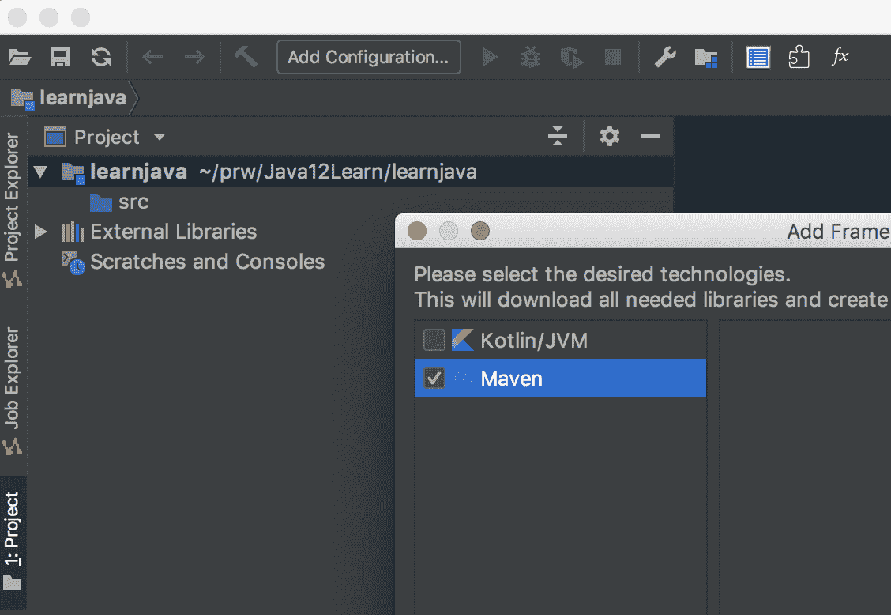
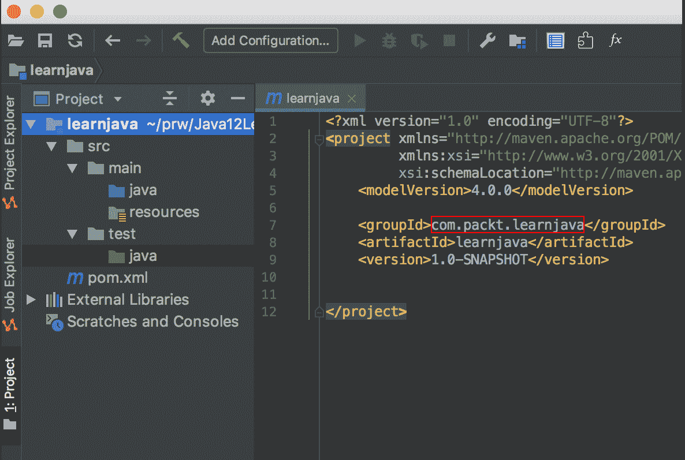
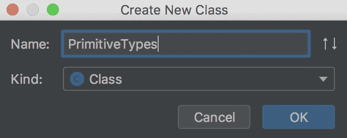
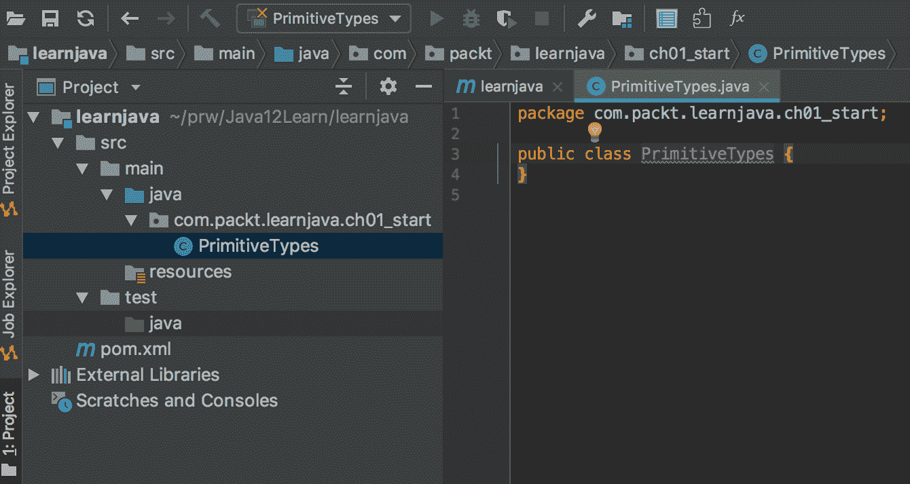
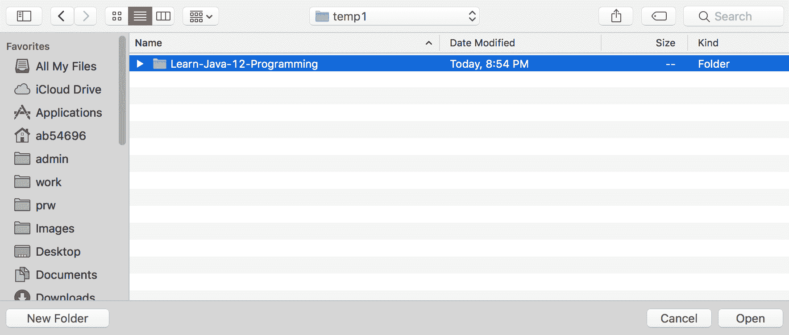
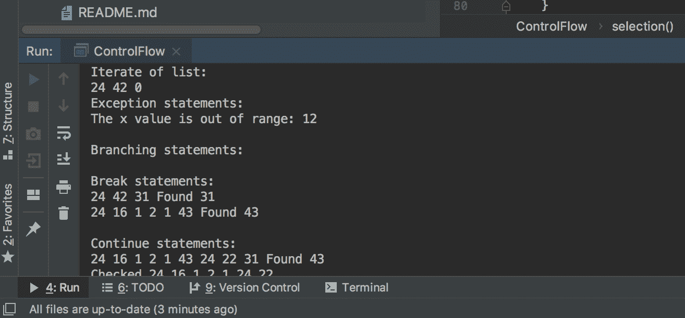

# Java12 入门

本章介绍如何开始学习 Java12 和 Java。我们将从基础知识开始，首先解释什么是 Java 及其主要术语，然后介绍如何安装必要的工具来编写和运行（执行）程序。在这方面，Java12 与以前的 Java 版本没有太大区别，因此本章的内容也适用于旧版本。

我们将描述并演示构建和配置 Java 编程环境的所有必要步骤。这是最低限度，你必须在电脑上，以开始编程。我们还描述了基本的 Java 语言构造，并用可以立即执行的示例加以说明。

学习编程语言或任何语言的最好方法就是使用它，本章将指导读者如何使用 Java 实现这一点。本章涵盖的主题包括：

*   如何安装和运行 Java
*   如何安装并运行**集成开发环境**（**IDE**）
*   Java 原始类型和运算符
*   字符串类型和字面值
*   标识符和变量
*   Java 语句

# 如何安装和运行 Java

当有人说“Java”时，他们的意思可能完全不同：

*   **Java 程序设计语言**：一种高级程序设计语言，允许以人类可读的格式表达意图（程序），并将其翻译成计算机可执行的二进制代码
*   **Java 编译器**：一种程序，它能读取用 Java 编程语言编写的文本，并将其翻译成字节码，由 **Java 虚拟机**（**JVM**）解释成计算机可执行的二进制代码
*   **Java 虚拟机**（**JVM**）：一种程序，它读取已编译的 Java 程序，并将其解释为计算机可执行的二进制代码
*   **Java 开发工具包**（**JDK**）：程序（工具和工具）的集合，包括 Java 编译器、JVM 和支持库，允许编译和执行用 Java 语言编写的程序

下一节将引导读者完成 Java12 的 JDK 的安装以及基本的相关术语和命令

# 什么是 JDK？我们为什么需要它？

正如我们已经提到的，JDK 包括一个 Java 编译器和 JVM。编译器的任务是读取一个包含用 Java 编写的程序文本的`.java`文件（称为**源代码**），并将其转换（编译）为存储在`.class`文件中的字节码。然后 JVM 可以读取`.class`文件，将字节码解释为二进制代码，并将其发送到操作系统执行。编译器和 JVM 都必须从命令行显式调用

为了支持`.java`文件编译及其字节码的执行，JDK 安装还包括标准 Java 库 **Java 类库**（**JCL**）。如果程序使用第三方库，则在编译和执行过程中必须存在该程序。它必须从调用编译器的同一命令行中引用，然后在 JVM 执行字节码时引用。另一方面，JCL 不需要显式地引用。假设标准 Java 库位于 JDK 安装的默认位置，因此编译器和 JVM 知道在哪里找到它们

如果您不需要编译 Java 程序，只想运行已经编译的`.class`文件，可以下载安装 **Java 运行时环境**（**JRE**）。例如，它由 JDK 的一个子集组成，不包括编译器。

有时，JDK 被称为**软件开发工具包**（**SDK**），它是一组软件工具和支持库的总称，这些工具和库允许创建使用某种编程语言编写的源代码的可执行版本。因此，JDK 是一个用于 Java 的 SDK。这意味着可以将 JDK 称为 SDK。

您还可能听到与 JDK 相关的术语 **Java 平台**和 **Java 版本**。典型的平台是允许开发和执行软件程序的操作系统。由于 JDK 提供了自己的操作环境，因此也被称为平台。**版**是为特定目的组装的 Java 平台（JDK）的变体。有五个 Java 平台版本，如下所示：

*   **Java 平台标准版**（**Java SE**）：包括 JVM、JCL 等工具和工具。
*   **Java 平台企业版**（**Java EE**）：这包括 Java SE、服务器（为应用提供服务的计算机程序）、JCL 和其他库、代码示例、教程以及用于开发和部署大规模、多层和安全网络应用的其他文档。
*   **Java 平台微型版**（**Java ME**）：这是 Java SE 的一个子集，有一些专门的库，用于为手机、个人数字助理、电视机顶盒、打印机、传感器等嵌入式和移动设备开发和部署 Java 应用。JavaME 的一个变体（有自己的 JVM 实现）称为 **AndroidSDK**。它是由 Google 为 Android 编程开发的。
*   **Java Card**：它是 Java 版本中最小的一个，用于在小型嵌入式设备（如智能卡）上开发和部署 Java 应用。它有两个版本：**Java Card Classic Edition**，用于智能卡，基于 ISO7816 和 ISO14443 通信；以及 **Java Card Connected Edition**，支持 Web 应用模型和 TCP/IP 作为基本协议，运行在高端安全微控制器上。

所以，**安装 Java 就意味着安装 JDK**，这也意味着**在其中一个版本上安装 Java 平台**，在本书中，我们只讨论和使用 JavaSE。

# 安装 Java SE

所有最近发布的 JDK 都列在 Oracle 官方页面上：[www.oracle.com/technetwork/java/javase/overview/index.html](https://www.oracle.com/technetwork/java/javase/overview/index.html)（我们将其称为**安装主页**，以供进一步参考）。

以下是安装 Java SE 需要遵循的步骤：

1.  找到要查找的 JavaSE 版本的链接（本例中是 JavaSE12）并单击它。
2.  您将看到各种链接，其中之一是安装说明。或者，您可以通过单击下载选项卡访问此页面。
3.  单击标题为 OracleJDK 的下载链接。
4.  一个新的屏幕将提供一个单选按钮和指向各种 JDK 安装程序的链接列表，供您选择接受或拒绝许可协议。
5.  阅读许可协议并做出决定。如果您不接受它，就不能下载 JDK。如果您接受许可协议，您可以从可用列表中选择 JDK 安装程序。
6.  您需要选择适合您的操作系统的安装程序和您熟悉的格式（扩展名）。
7.  如果有疑问，请返回安装主页，选择下载选项卡，然后单击**安装说明**链接。
8.  按照与您的操作系统相对应的步骤进行操作。
9.  当您计算机上的`java -version`命令显示正确的 Java 版本时，JDK 安装成功，如下面的屏幕截图所示：


# 命令、工具和工具

如果按照安装说明进行操作，您可能已经注意到目录下给出的链接（JDK 的已安装目录结构）。它将带您进入一个页面，该页面描述已安装的 JDK 在您的计算机上的位置以及 JDK 根目录的每个目录的内容。`bin`目录包含构成 Java 命令、工具和工具的所有可执行文件。如果目录`bin`没有自动添加到环境变量`PATH`，请考虑手动添加，这样您就可以从任何目录启动 Java 可执行文件。

在上一节中，我们已经演示了`Java`命令`java -version`。其他可用 Java 可执行文件（命令、工具、和工具）[可以在 JavaSE 文档中找到](https://www.oracle.com/technetwork/java/javase/documentation/index.html)。点击链接 Java 平台标准版技术文档站点，然后点击下一页的链接工具参考。您可以通过单击每个可执行工具的链接来了解其更多信息。

您还可以使用以下选项之一在计算机上运行列出的每个可执行文件：`-?`、`-h`、`--help`或`-help`。它将显示可执行文件及其所有选项的简要说明。

最重要的 Java 命令如下：

*   `javac`：根据`.java`文件中定义了多少 Java 类，读取`.java`文件，编译并创建一个或多个相应的`.class`文件。
*   `java`：执行`.class`文件。

这些命令使编程成为可能。每个 Java 程序员都必须很好地理解自己的结构和功能。但是，如果您对 Java 编程不熟悉，并且使用 IDE（请参阅“如何安装和运行 IDE”一节），则不需要立即掌握这些命令。一个好的 IDE 通过在每次更改时自动编译一个`.java`文件来隐藏它们。它还提供了一个图形元素，可以在每次单击它时运行程序。

另一个非常有用的 Java 工具是`jcmd`。它有助于与当前运行的任何 Java 进程（JVM）进行通信和诊断，并且有许多选项。但是在最简单的形式中，没有任何选项，它列出了当前运行的所有 Java 进程及其**进程 ID**（**PID**）。您可以使用它来查看是否已经运行了 Java 进程。如果有，那么可以使用提供的 PID 终止这样的进程。

# 如何安装和运行 IDE

曾经只是一个专门的编辑器，允许像 Word 编辑器检查英语句子的语法一样检查书面程序的语法，逐渐演变成一个**集成开发环境**（**IDE**）。它的主要功能在名称上。它集成了在一个**图形用户界面**（**GUI**）下编写、编译和执行程序所需的所有工具。利用 Java 编译器的强大功能，IDE 可以立即识别语法错误，然后通过提供上下文相关的帮助和建议来帮助提高代码质量

# 选择 IDE

Java 程序员可以使用几种 IDE，如 **NetBeans**、**Eclipse**、**IntelliJ IDEA**、**BlueJ**、**DrJava**、**JDeveloper**、**JCreator**、**jEdit**、**JSource**、**jCRASP** 和 **jEdit** 等等。最流行的是 NetBeans、Eclipse 和 IntelliJ IDEA。

NetBeans 开发始于 1996 年，是布拉格查尔斯大学的一个 JavaIDE 学生项目。1999 年，该项目和围绕该项目创建的公司被 Sun Microsystems 收购。在甲骨文收购 Sun Microsystems 之后，NetBeans 成为了开源软件，许多 Java 开发人员也为这个项目做出了贡献。它与 JDK8 捆绑在一起，成为 Java 开发的官方 IDE。2016 年，Oracle 将其捐赠给了 Apache 软件基金会。

有一个用于 Windows、Linux、Mac 和 Oracle Solaris 的 NetBeans IDE。它支持多种编程语言，并可以扩展插件。NetBeans 只与 JDK8 捆绑在一起，但是 netbeans8.2 也可以与 JDK9 一起工作，并使用 JDK9 引入的特性，例如 Jigsaw。在[上 netbeans.apache.org](https://netbeans.apache.org/)，您可以阅读更多关于 NetBeans IDE 的信息，并下载最新版本，截至本文撰写之时，该版本为 11.0。

Eclipse 是使用最广泛的 JavaIDE。向 IDE 添加新特性的插件列表在不断增长，因此无法列举 IDE 的所有功能。EclipseIDE 项目从 2001 年开始作为开源软件开发。一个非营利性的、成员支持的企业 Eclipse 基金会在 2004 创建，目的是提供基础设施（版本控制系统、代码审查系统、构建服务器、下载站点等等）和结构化的过程。基金会 30 多岁的员工中，没有一个人在从事 150 个 Eclipse 支持的项目。

EclipseIDE 插件的数量和种类之多对初学者来说是一个挑战，因为您必须找到解决相同或类似特性的不同实现的方法，这些实现有时可能是不兼容的，并且可能需要深入的调查以及对所有依赖项的清楚理解。尽管如此，eclipseIDE 还是非常流行，并且有可靠的社区支持。您可以阅读有关 eclipseIDE 的内容，并从[下载最新版本 www.eclipse.org/ide](http://www.eclipse.org/ide/)。

IntelliJ 有两个版本：付费版和免费社区版。付费版一直被评为最佳 Java IDE，但社区版也被列为三大主要 Java IDE 之一。开发该 IDE 的 JetBrains 软件公司在布拉格、圣彼得堡、莫斯科、慕尼黑、波士顿和新西伯利亚设有办事处。IDE 以其深刻的智能而闻名，即“在每一个上下文中都给出相关的建议：即时而巧妙的代码完成、动态的代码分析和可靠的重构工具”，[正如作者在其网站上描述产品时所说](https://www.jetbrains.com/idea/)。在“安装和配置 IntelliJ IDEA”部分，我们将引导您完成 IntelliJ IDEA 社区版的安装和配置。

# 安装和配置 IntelliJ IDEA

下载并安装 IntelliJ IDEA 需要遵循以下步骤：

1.  从[下载 IntelliJ 社区版安装程序 www.jetbrains.com/idea/download](http://www.jetbrains.com/idea/download)。
2.  启动安装程序并接受所有默认值。
3.  在安装选项屏幕上选择.java。我们假设您已经安装了 JDK，所以您不必检查下载和安装 JRE 选项。
4.  最后一个安装屏幕有一个复选框 Run IntelliJ IDEA，您可以选中它来自动启动 IDE。或者，您可以不选中该复选框，并在安装完成后手动启动 IDE。
5.  当 IDE 第一次启动时，它会询问您是否要导入 IntelliJ IDEA 设置。如果您以前没有使用过 IntelliJ IDEA 并且希望重用设置，请选中“不导入设置”复选框。
6.  下面的一两个屏幕询问您是否接受 JetBrains 隐私政策，以及您是否愿意支付许可证费用，还是愿意继续使用免费社区版或免费试用版（这取决于您获得的特定下载）。
7.  以您喜欢的方式回答问题，如果您接受隐私策略，CustomizeIntelliJ IDEA 屏幕将要求您选择一个主题，白色（IntelliJ）或黑色（Darcula）。

8.  如果提供了“全部跳过”和“设置默认值”以及“下一步：默认插件”按钮，请选择“下一步：默认插件”，因为它将为您提供预先配置 IDE 的选项。
9.  在任务屏幕上显示“调整”想法时，请为以下三个选项选择“自定义…”链接，每次一个：

10.  如果您决定更改设置值，您可以稍后通过从最顶部的菜单文件、Windows 上的设置或 Linux 和 MacOS 上的首选项进行选择。

# 创建项目

在开始编写程序之前，您需要创建一个项目。在 IntelliJ IDEA 中创建项目有几种方法，对于任何 IDE 都是一样的，如下所示：

1.  创建新项目：这将从头开始创建一个新项目。
2.  导入项目：这允许从文件系统读取现有的源代码。
3.  打开：这允许从文件系统读取现有项目。
4.  从版本控制签出：这允许从版本控制系统读取现有项目。

在本书中，我们将仅使用 IDE 提供的一系列引导步骤来引导您完成第一个选项。另外两个选项要简单得多，不需要额外的解释。一旦您学会了如何从头开始创建一个新项目，在 IDE 中创建项目的其他方法将非常简单。

首先单击“创建新项目”链接，然后按以下步骤继续操作：

1.  为项目 SDK 选择一个值（Java 版本 12，如果您已经安装了 JDK12），然后单击“下一步”。
2.  不要选中“创建项目模板”（如果选中，IDE 会生成一个固定程序`Hello world`和类似的程序，我们不需要），然后单击“下一步”。

3.  在“项目位置”字段中选择所需的项目位置（这是新代码将驻留的位置）。
4.  在“项目名称”字段中输入您喜欢的任何内容（例如，本书中代码的项目名为`learnjava`，然后单击`Finish`按钮。
5.  您将看到以下项目结构：


6.  右键单击项目名称（`learnjava`），从下拉菜单中选择添加框架支持。在以下弹出窗口中，选择 Maven：



7.  Maven 是一个项目配置工具。它的主要功能是管理项目依赖关系。我们稍后再谈。现在，我们将使用它的另一个职责，使用三个属性来定义和保持项目代码标识：

主要目标是使一个项目的身份在世界上所有项目中独一无二。为了避免`groupId`冲突，约定要求从相反的组织域名开始构建。例如，如果一个公司的域名是`company.com`，那么它的项目的组 ID 应该以`com.company`开头。这就是为什么在本书的代码中，我们使用了`groupId`值`com.packt.learnjava`。

我们开始吧。在弹出的“添加框架支持”窗口中，单击〖确定〗按钮，系统将弹出一个新生成的`pom.xml`文件，如下所示：


同时，在屏幕右下角会弹出另一个小窗口：


单击“启用自动导入”链接。这将使编写代码更容易：您将开始使用的所有新类都将自动导入。我们将在适当的时候讨论类导入

现在让我们输入`groupId`、`artifactId`和`version`值：


现在，如果有人想在他们的应用中使用您的项目代码，他们会通过显示的三个值引用它，Maven（如果他们使用它）会将它引入（当然，如果您将您的项目上传到公共共享的 Maven 存储库中）。在[这个页面](https://maven.apache.org/guides/)上阅读更多关于 Maven 的信息。

`groupId`值的另一个功能是定义保存项目代码的文件夹树的根目录。我们打开`src`文件夹，您将看到下面的目录结构：



`main`下的`java`文件夹保存应用代码，`test`下的`java`文件夹保存测试代码。

让我们使用以下步骤创建第一个程序：

1.  右键点击`java`，选择新建，点击打包：


2.  在提供的新包窗口中，键入`com.packt.learnjava.ch01_start`如下：


3.  单击 OK，您应该会在左侧面板中看到一组新文件夹，其中最后一个是`com.packt.learnjava.ch01_start`：


4.  右键单击它，选择“新建”，然后单击“Java 类”：


5.  在提供的输入窗口中，键入`PrimitiveTypes`：



6.  单击 OK，您将看到在包`com.packt.learnjava.ch01_start`包中创建的第一个 Java 类`PrimitiveTypes`：



包反映了文件系统中 Java 类的位置。我们将在第二章“Java 面向对象编程”中讨论。现在，为了运行一个程序，我们创建了一个`main()`方法。如果存在，可以执行此方法并将其作为应用的入口点。它有一定的格式，如下所示：


它必须具有以下属性：

*   `public`：可从包外自由进入
*   `static`：应该能够在不创建所属类的对象的情况下被调用

还应包括以下内容：

*   返回`void`（无）。
*   接受一个`String`数组作为输入，或者像我们所做的那样接受`varargs`。我们将在第二章“Java 面向对象编程（OOP）”中讨论`varargs`。现在，只需说`String[] args`和`String... args`定义了本质上相同的输入格式

我们在“执行来自于命令行的例子”部分中解释了如何使用命令行来运行主类。[您可以在 Oracle 官方文档中阅读更多关于 Java 命令行参数的信息](https://docs.oracle.com/javase/tutorial/essential/environment/cmdLineArgs.html)。也可以运行 IntelliJ IDEA 中的示例。

注意下面截图中左边的两个绿色三角形。点击其中任何一个，就可以执行`main()`方法。例如，让我们显示`Hello, world!`。

为此，请在`main()`方法内键入以下行：

```
System.out.println("Hello, world!");
```

然后，单击其中一个绿色三角形：


您应该在终端区域获得如下输出：


从现在开始，每次讨论代码示例时，我们都将使用`main()`方法以相同的方式运行它们。在进行此操作时，我们将不捕获屏幕截图，而是将结果放在注释中，因为这样的样式更容易遵循。例如，以下代码显示了以前的代码演示在这种样式下的外观：

```
System.out.println("Hello, world!");     //prints: Hello, world!
```

可以在代码行右侧添加注释（任意文本），该行的右键以双斜杠`//`分隔。编译器不读取此文本，只保留它的原样。注释的存在不会影响性能，并用于向人类解释程序员的意图。

# 导入项目

在本节中，我们将演示使用本书的源代码将现有代码导入 IntelliJ IDEA 的过程。我们假设您已经在你的电脑上安装了 [Maven](https://maven.apache.org/install.html) 也安装了 [Git](https://gist.github.com/derhuerst/1b15ff4652a867391f03)，可以使用。我们还假设您已经安装了 JDK12，正如在 JavaSE 的“安装”一节中所描述的那样。

要使用本书的代码示例导入项目，请执行以下步骤：

1.  [转到源库](https://github.com/PacktPublishing/Learn-Java-12-Programming)，点击克隆或下载链接，如下图所示：


2.  单击克隆或下载链接，然后复制提供的 URL：


3.  在计算机上选择要放置源代码的目录，然后运行以下 Git 命令：


4.  新建`Learn-Java-12-Programming`文件夹，如下图所示：


或者，您可以使用前面屏幕截图上显示的链接下载 ZIP 将源代码下载为一个`.zip`文件，而不是克隆。将下载的源代码解压到计算机上希望放置源代码的目录中，然后通过从名称中删除后缀`-master`来重命名新创建的文件夹，确保文件夹的名称为`Learn-Java-12-Programming`。

5.  新的`Learn-Java-12-Programming`文件夹包含 Maven 项目以及本书中的所有源代码。现在运行 IntelliJ IDEA 并单击最顶部菜单中的“文件”，然后单击“新建”和“从现有源项目…”：


6.  选择步骤 4 中创建的`Learn-Java-12-Programming`文件夹，点击打开按钮：



7.  接受默认设置并单击以下每个屏幕上的“下一步”按钮，直到出现显示已安装 JDK 列表和“完成”按钮的屏幕：


8.  选择`12`并点击“完成”。您将看到项目导入到 IntelliJ IDEA 中：


9.  等待右下角出现以下小窗口：


您可能不想等待并继续执行步骤 12。当窗口稍后弹出时，只需执行步骤 10 和 11。如果错过此窗口，您可以随时单击事件日志链接，系统将向您显示相同的选项。

10.  单击它；然后单击“添加为 Maven”项目链接：


11.  每当出现以下窗口时，请单击启用自动导入：


您可能不想等待并继续执行步骤 12。当窗口稍后弹出时，只需执行步骤 11。如果错过此窗口，您可以随时单击事件日志链接，系统将向您显示相同的选项。

12.  选择项目结构符号，它是以下屏幕截图右侧的第三个：


13.  如果列出了主模块和测试模块，请通过高亮显示它们并单击减号（`-`）来删除它们，如下屏幕所示：


14.  下面是模块的最终列表：


15.  单击右下角的“确定”返回项目。单击左窗格中的“Learn-Java-12-Programming”，继续在源代码树中向下，直到看到以下类列表：


16.  单击右窗格中的绿色箭头并执行所需的任何类。在“运行”窗口中可以看到的结果类似于以下内容：



# 从命令行执行示例

要从命令行执行示例，请执行以下步骤：

1.  转到“导入项目”部分“步骤 4”中创建的`Learn-Java-12-Programming`文件夹`pom.xml`文件所在位置，运行`mvn clean package`命令：


2.  选择要运行的示例。例如，假设要运行`ControlFlow.java`，请运行以下命令：

```
java -cp target/learnjava-1.0-SNAPSHOT.jar:target/libs/* \
com.packt.learnjava.ch01_start.ControlFlow
```

您将看到以下结果：


3.  如果要运行`ch05_stringsIoStreams`包中的示例文件，请使用不同的包和类名运行相同的命令：

```
java -cp target/learnjava-1.0-SNAPSHOT.jar:target/libs/* \
com.packt.learnjava.ch05_stringsIoStreams.Files
```

如果您的计算机有 Windows 系统，请使用以下命令作为一行：

```
java -cp target\learnjava-1.0-SNAPSHOT.jar;target\libs\* com.packt.learnjava.ch05_stringsIoStreams.Files
```

请注意，Windows 命令具有不同的斜杠和分号（`;`）作为类路径分隔符。

4.  结果如下：


5.  这样，您就可以运行任何包含`main()`方法的类。将执行`main()`方法的内容。

# Java 原始类型和运算符

有了所有主要的编程工具，我们就可以开始把 Java 作为一种语言来讨论了。语言语法由 Java 语言规范定义，您可以在[这个页面](https://docs.oracle.com/javase/specs)上找到。每次你需要澄清的时候，请不要犹豫参考它。这并不像很多人想象的那么令人畏惧

Java 中的所有值都分为两类：`reference`类型和`primitive`类型。我们从基本类型和运算符开始，作为任何编程语言的自然入口点，在本章中，我们还将讨论一种称为`String`的引用类型（参见“字符串类型和字面值”部分）

所有的原始类型都可以分为两类：`boolean`类型和`numeric`类型。

# 布尔型

Java 中只有两个`boolean`类型值：`true`和`false`。这样的值只能分配给一个`boolean`类型的变量，例如：

```
boolean b = true;
```

`boolean`变量通常用于控制流语句中，我们将在“Java 语句”一节中讨论。下面是一个例子：

```
boolean b = x > 2;
if(b){ 
    //do something
}
```

在代码中，我们将`x > 2`表达式的求值结果赋给`b`变量。如果`x`的值大于`2`，则`b`变量得到赋值`true`。然后执行大括号内的代码`{}`。

# 数字类型

**Java 数字类型**形成两组：整数型（`byte`、`char`、`short`、`int`、`long`）和浮点型（`float`和`double`）。

# 整数类型

整数类型消耗的内存量如下：

*   `byte`：8 位
*   `char`：16 位
*   `short`：16 位
*   `int`：32 位
*   `long`：64 位

`char`类型是一个无符号整数，它可以保存 0 到 65535 之间的值（称为**码位**）。它表示一个 Unicode 字符，这意味着有 65536 个 Unicode 字符。以下是构成 Unicode 字符基本拉丁列表的三条记录：

| **码位** | **Unicode 转义** | **可打印符号** | **说明** |
| --- | --- | --- | --- |
| `33` | `\u0021` | `!` | 感叹号 |
| `50` | `\u0032` | `2` | 数字二 |
| `65` | `\u0041` | `A` | 拉丁文大写字母 A |

下面的代码演示了`char`类型的属性：

```
char x1 = '\u0032';
System.out.println(x1);  //prints: 2

char x2 = '2';
System.out.println(x2);  //prints: 2
x2 = 65;
System.out.println(x2);  //prints: A

char y1 = '\u0041';
System.out.println(y1);  //prints: A

char y2 = 'A';
System.out.println(y2);  //prints: A
y2 = 50;
System.out.println(y2);  //prints: 2

System.out.println(x1 + x2);  //prints: 115
System.out.println(x1 + y1);  //prints: 115

```

代码示例的最后两行解释了为什么将`char`类型视为整数类型，因为`char`值可以用于算术运算。在这种情况下，每个`char`值由其代码点表示。

其他整数类型的取值范围如下：

*   `byte`：从`-128`到`127`包括
*   `short`：从`-32,768`到`32,767`包括
*   `int`：从`-2.147.483.648`到`2.147.483.647`包括
*   `long`：从`-9,223,372,036,854,775,808`到`9,223,372,036,854,775,807`包括

始终可以从相应的 Java 常量中检索每个原始类型的最大值和最小值，如下所示：

```
System.out.println(Byte.MIN_VALUE);      //prints: -128
System.out.println(Byte.MAX_VALUE);      //prints:  127
System.out.println(Short.MIN_VALUE);     //prints: -32768
System.out.println(Short.MAX_VALUE);     //prints:  32767
System.out.println(Integer.MIN_VALUE);   //prints: -2147483648
System.out.println(Integer.MAX_VALUE);   //prints:  2147483647
System.out.println(Long.MIN_VALUE);      //prints: -9223372036854775808
System.out.println(Long.MAX_VALUE);      //prints:  9223372036854775807
System.out.println((int)Character.MIN_VALUE); //prints: 0
System.out.println((int)Character.MAX_VALUE); //prints: 65535

```

最后两行中的构造`(int)`是**转换操作符**用法的一个示例。它强制将值从一种类型转换为另一种类型，但这种转换并不总是保证成功。从我们的示例中可以看到，某些类型允许比其他类型更大的值。但是程序员可能知道某个变量的值永远不会超过目标类型的最大值，而转换操作符是程序员将自己的观点强加给编译器的方式。否则，如果没有转换运算符，编译器将引发错误，并且不允许赋值。但是，程序员可能会弄错，值可能会变大。在这种情况下，将在执行期间引发运行时错误。

但有些类型原则上不能转换为其他类型，或者至少不能转换为所有类型。例如，`boolean`类型值不能转换为整型值。

# 浮点类型

这组原始类型中有两种类型，`float`和`double`：

*   `float`：32 位
*   `doubele`：64 位

其正最大和最小可能值如下：

```
System.out.println(Float.MIN_VALUE);  //prints: 1.4E-45
System.out.println(Float.MAX_VALUE);  //prints: 3.4028235E38
System.out.println(Double.MIN_VALUE); //prints: 4.9E-324
System.out.println(Double.MAX_VALUE); //prints: 1.7976931348623157E308

```

最大和最小负值与刚才显示的值相同，只是前面有一个减号（`-`。因此，实际上，`Float.MIN_VALUE`和`Double.MIN_VALUE`不是最小值，而是对应类型的精度。对于每种浮点类型，零值可以是`0.0`或`-0.0`

浮点型的特点是有一个点（`.`），它将数字的整数部分和小数部分分开。默认情况下，在 Java 中，带点的数字被假定为`double`类型。例如，假设以下为双精度值：

```
42.3
```

这意味着以下赋值会导致编译错误：

```
float f = 42.3;
```

要表示您希望将其视为`float`类型，需要添加`f`或`F`。例如，以下分配不会导致错误：

```
float f = 42.3f;
float d = 42.3F;

double a = 42.3f;
double b = 42.3F;

float x = (float)42.3d;
float y = (float)42.3D;

```

正如您可能已经从示例中注意到的，`d`和`D`表示`double`类型。但我们能够将它们转换成`float`型，因为我们确信`42.3`完全在`float`型可能值的范围内。

# 基本类型的默认值

在某些情况下，即使程序员不想这样做，也必须给变量赋值。我们将在第 2 章、“Java 面向对象编程（OOP）”中讨论这种情况。在这种情况下，默认的原始类型值如下所示：

*   `byte`、`short`、`int`和`long`类型具有默认值`0`。
*   `char`类型的默认值为`\u0000`，代码点为`0`
*   `float`和`double`类型具有默认值`0.0`。
*   `boolean`类型有默认值`false`。

# 原始类型的字面值

值的表示称为**字面值**。`boolean`类型有两个文本：`true`和`false`。`byte`、`short`、`int`、`long`整数类型的字面值默认为`int`类型：

```
byte b = 42;
short s = 42;
int i = 42;
long l = 42;
```

另外，为了表示一个`long`类型的文本，您可以在后面加上字母`l`或`L`：

```
long l1 = 42l;
long l2 = 42L;
```

字母`l`很容易与数字 1 混淆，因此为此使用`L`（而不是`l`）是一种好的做法。

到目前为止，我们已经用十进制表示整数字面值。同时，`byte`、`short`、`int`和`long`类型的字面值也可以用二进制（以 2 为基数，数字 0-1）、八进制（以 8 为基数，数字 0-7）和十六进制（以 16 为基数，数字 0-9 和 a-f）数制表示。二进制字面值以`0b`（或`0B`开头，后跟二进制表示的值。例如，小数点`42`表示为`101010 = 2^0*0 + 2^1*1 + 2^2*0 + 2^3 *1  + 2^4 *0  + 2^5 *1`（我们从右边`0`开始）。八进制字面值以`0`开头，后跟八进制表示的值，因此`42`表示为`52 = 8^0*2+ 8^1*5`。十六进制字面值以`0x`（或`0X`开头），后跟以十六进制表示的值。因此，`42`被表示为`2a = 16^0*a + 16^1*2`，因为在十六进制系统中，`a`到`f`（或`A`到`F`）的符号映射到十进制值`10`到`15`。下面是演示代码：

```
int i = 42;
System.out.println(Integer.toString(i, 2));       // 101010
System.out.println(Integer.toBinaryString(i));    // 101010
System.out.println(0b101010);                     // 42

System.out.println(Integer.toString(i, 8));       // 52
System.out.println(Integer.toOctalString(i));     // 52
System.out.println(052);                          // 42

System.out.println(Integer.toString(i, 10));       // 42
System.out.println(Integer.toString(i));           // 42
System.out.println(42);                            // 42

System.out.println(Integer.toString(i, 16));       // 2a
System.out.println(Integer.toHexString(i));        // 2a
System.out.println(0x2a);                          // 42

```

如您所见，Java 提供了将十进制系统值转换为具有不同基的系统的方法。所有这些数值表达式都称为字面值。

数字字面值的一个特点是对人友好。如果数字较大，可以将其分成三个部分，用下划线（`_`符号）分隔。例如，请注意以下事项：

```
int i = 354_263_654;
System.out.println(i);  //prints: 354263654

float f = 54_436.98f;
System.out.println(f);  //prints: 54436.98

long l = 55_763_948L;
System.out.println(l);  //prints: 55763948

```

编译器忽略嵌入的下划线符号。

`char`型字面值分为两种：**单字符**或**转义序列**。在讨论数字类型时，我们看到了`char`型字面值的示例：

```
char x1 = '\u0032';
char x2 = '2';
char y1 = '\u0041';
char y2 = 'A';

```

如您所见，字符必须用单引号括起来

转义序列以反斜杠（`\`）开头，后跟字母或其他字符。以下是转义序列的完整列表：

*   `\b`：退格`BS`、Unicode 转义`\u0008`
*   `\t`：水平制表符`HT`、Unicode 转义符`\u0009`
*   `\n`：换行`LF`、Unicode 转义`\u000a`
*   `\f`：表单馈送`FF`、Unicode 转义`\u000c`
*   `\r`：回车`CR`，Unicode 转义`\u000d`
*   `\"`：双引号`"`，Unicode 转义`\u0022`
*   `\'`：单引号`'`，Unicode 转义`\u0027`
*   `\\`：反斜杠`\`、`Unicode escape \u005c`

在八个转义序列中，只有最后三个用符号表示。如果无法以其他方式显示此符号，则使用它们。例如，请注意以下事项：

```
System.out.println("\"");   //prints: "
System.out.println('\'');   //prints: '
System.out.println('\\');   //prints: \

```

其余部分更多地用作控制代码，用于指示输出设备执行某些操作：

```
System.out.println("The back\bspace");     //prints: The bacspace
System.out.println("The horizontal\ttab"); //prints: The horizontal   tab
System.out.println("The line\nfeed");      //prints: The line
                                           //        feed
System.out.println("The form\ffeed");      //prints: The form feed
System.out.println("The carriage\rreturn");//prints: return

```

如您所见，`\b`删除前一个符号，`\t`插入制表符空间，`\n`断开线开始新符号，`\f`迫使打印机弹出当前页，继续在另一页顶部打印，`/r`重新启动当前行。

# 新的紧凑数字格式

`java.text.NumberFormat`类以各种格式表示数字。它还允许根据所提供的格式（包括区域设置）调整格式。称为**压缩**或**短数字格式**。

它以特定于语言环境的可读形式表示一个数字。例如，请注意以下事项：

```
NumberFormat fmt = NumberFormat.getCompactNumberInstance(Locale.US, 
                                            NumberFormat.Style.SHORT);
System.out.println(fmt.format(42_000));          //prints: 42K
System.out.println(fmt.format(42_000_000));      //prints: 42M

NumberFormat fmtP = NumberFormat.getPercentInstance();
System.out.println(fmtP.format(0.42));          //prints: 42%

```

如您所见，要访问此功能，您必须获取`NumberFormat`类的特定实例，有时还需要基于区域设置和提供的样式。

# 运算符

Java 中有 44 个运算符，如下表所示：

| **运算符** | **说明** |
| --- | --- |
| `+``-``*``/``%` | 算术一元和二元运算符 |
| `++``--` | 递增和递减一元运算符 |
| `==``!=` | 相等运算符 |
| `<``>``<=``>=` | 关系运算符 |
| `!``&``&#124;` | 逻辑运算符 |
| `&&``&#124;&#124;``?:` | 条件运算符 |
| `=``+=``-=``*=``/=``%=` | 分配运算符 |
| `&=``&#124;=``^=``<<=``>>=``>>>=` | 赋值运算符 |
| `&``&#124;``~``^``<<``>>``>>>` | 位操作符 |
| `->``::` | 箭头和方法引用运算符 |
| `new` | 实例创建操作符 |
| `.` | 字段访问/方法调用运算符 |
| `instanceof` | 类型比较运算符 |
| （目标类型） | 铸造操作工 |

我们将不描述不常用的赋值运算符`&=`、`|=`、`^=`、`<<=`、`>>=`、`>>>=`和位运算符。您可以在 [Java 规范](https://docs.oracle.com/javase/specs)中了解它们。箭头`->`和方法引用`::`运算符将在第 14 章、“函数式编程”中描述。实例创建操作符`new`、字段访问/方法调用操作符`.`和类型比较操作符`instanceof`将在第 2 章、“Java 面向对象编程（OOP）”中讨论。至于`cast`运算符，我们已经在“整数类型”一节中描述过了。

# 算术一元（`+`和`-`）和二元运算符（`+`、`-`、`*`、`/`和`%`）

大多数算术运算符和正负号（**一元**运算符）我们都很熟悉。模运算符`%`将左操作数除以右操作数，并返回余数，如下所示：

```
int x = 5;
System.out.println(x % 2);   //prints: 1

```

另外值得一提的是，Java 中两个整数的除法会丢失小数部分，因为 Java 假定结果应该是整数 2，如下所示：

```
int x = 5;
System.out.println(x / 2);   //prints: 2
```

如果需要保留结果的小数部分，请将其中一个操作数转换为浮点类型。以下是实现这一目标的几种方法：

```
int x = 5;
System.out.println(x / 2.);           //prints: 2.5
System.out.println((1\. * x) / 2);     //prints: 2.5
System.out.println(((float)x) / 2);   //prints: 2.5
System.out.println(((double) x) / 2); //prints: 2.5
```

# 递增和递减一元运算符（`++`和`--`）

`++`运算符将整型的值增加`1`，而`--`运算符将整型的值减少`1`，如果放在变量前面（前缀），则在返回变量值之前将其值更改 1。但是当放在变量后面（后缀）时，它会在返回变量值后将其值更改为`1`。以下是几个例子：

```
int i = 2;
System.out.println(++i);   //prints: 3
System.out.println(i);     //prints: 3
System.out.println(--i);   //prints: 2
System.out.println(i);     //prints: 2
System.out.println(i++);   //prints: 2
System.out.println(i);     //prints: 3
System.out.println(i--);   //prints: 3
System.out.println(i);     //prints: 2

```

# 相等运算符（`==`和`!=`)

`==`运算符表示**等于**，而`!=`运算符表示**不等于**。它们用于比较同一类型的值，如果操作数的值相等，则返回`boolean`值`true`，否则返回`false`。例如，请注意以下事项：

```
int i1 = 1;
int i2 = 2;
System.out.println(i1 == i2);        //prints: false
System.out.println(i1 != i2);        //prints: true
System.out.println(i1 == (i2 - 1));  //prints: true
System.out.println(i1 != (i2 - 1));  //prints: false

```

但是，在比较浮点类型的值时，尤其是在比较计算结果时，要小心。在这种情况下，使用关系运算符（`<`、`>`、`<=`和`>=`）更可靠，因为例如，除法`1/3`会产生一个永无止境的小数部分`0.33333333...`，并最终取决于精度实现（这是一个复杂的主题，超出了本书的范围）。

# 关系运算符（`<`、`>`、`<=`和`>=`）

**关系运算符**比较值并返回一个`boolean`值。例如，观察以下情况：

```
int i1 = 1;
int i2 = 2;
System.out.println(i1 > i2);         //prints: false
System.out.println(i1 >= i2);        //prints: false
System.out.println(i1 >= (i2 - 1));  //prints: true
System.out.println(i1 < i2);         //prints: true
System.out.println(i1 <= i2);        //prints: true
System.out.println(i1 <= (i2 - 1));  //prints: true
float f = 1.2f;
System.out.println(i1 < f);          //prints: true
```

# 逻辑运算符（`!`，`&`和`|`）

逻辑运算符的定义如下：

*   如果操作数是`false`，则`!`二进制运算符返回`true`，否则返回`false`。
*   如果两个操作数都是`true`，`&`二进制运算符返回`true`。
*   如果至少有一个操作数是`true`，则`|`二进制运算符返回`true`。

举个例子：

```
boolean b = true;
System.out.println(!b);    //prints: false
System.out.println(!!b);   //prints: true
boolean c = true;
System.out.println(c & b); //prints: true
System.out.println(c | b); //prints: true
boolean d = false;
System.out.println(c & d); //prints: false
System.out.println(c | d); //prints: true
```

# 条件运算符（`&&`、`||`和`?:`)

`&&`和`||`运算符产生的结果与我们刚才演示的`&`和`|`逻辑运算符相同：

```
boolean b = true;
boolean c = true;
System.out.println(c && b); //prints: true
System.out.println(c || b); //prints: true
boolean d = false;
System.out.println(c && d); //prints: false
System.out.println(c || d); //prints: true

```

不同之处在于`&&`和`||`运算符并不总是求值第二个操作数，例如，在`&&`运算符的情况下，如果第一个操作数是`false`，则不求值第二个操作数，因为整个表达式的结果无论如何都是`false`。类似地，在`||`运算符的情况下，如果第一个操作数是`true`，则整个表达式将被清楚地求值为`true`，而不求值第二个操作数。我们可以用以下代码来演示：

```
int h = 1;
System.out.println(h > 3 & h++ < 3);  //prints: false
System.out.println(h);                //prints: 2
System.out.println(h > 3 && h++ < 3); //prints: false
System.out.println(h);                //prints: 2
```

`? :`运算符称为**三元运算符**。它计算一个条件（在符号`?`之前），如果结果是`true`，则将第一个表达式（在`?`和`:`符号之间）计算的值赋给变量；否则，将第二个表达式（在`:`符号之后）计算的值赋给变量：

```
int n = 1, m = 2;
float k = n > m ? (n * m + 3) : ((float)n / m); 
System.out.println(k);           //prints: 0.5
```

# 赋值运算符（`=`，`+=`，`-=`，`*=`，`/=`和`%=`）

`=`运算符只是将指定的值赋给一个变量：

```
x = 3;
```

其他赋值运算符在赋值前计算新值：

*   `x += 42`将表达式`x = x + 42`的结果赋给`x`。
*   `x -= 42`将表达式`x = x - 42`的结果赋给`x`。
*   `x *= 42`将表达式`x = x * 42`的结果赋给`x`。
*   `x /= 42`将表达式`x = x / 42`的结果赋给`x`。
*   `x %= 42`赋值表达式`x = x + x % 42`的剩余部分。

以下是这些运算符的工作方式：

```
float a = 1f;
a += 2;
System.out.println(a); //prints: 3.0
a -= 1;
System.out.println(a); //prints: 2.0
a *= 2;
System.out.println(a); //prints: 4.0
a /= 2;
System.out.println(a); //prints: 2.0
a %= 2;
System.out.println(a); //prints: 0.0
```

# 字符串类型和字面值

我们刚刚描述了 Java 语言的基本值类型。Java 中的所有其他值类型都属于一类**引用类型**。每个引用类型都是一个比值更复杂的构造。它由**类**来描述，该类用作创建**对象**的模板，该对象是包含在该类中定义的值和方法（处理代码）的存储区域。一个对象是由`new`操作符创建的。我们将在第 2 章"Java 面向对象编程"中更详细地讨论类和对象

在本章中，我们将讨论一种称为`String`的引用类型。它由`java.lang.String`类表示，正如您所看到的，它属于 JDK 最基本的包`java.lang`。我们之所以在早期引入`String`类，是因为它在某些方面的行为与原始类型非常相似，尽管它是一个引用类型。

之所以称为引用类型，是因为在代码中，我们不直接处理此类型的值。引用类型的值比原始类型的值更复杂。它称为对象，需要更复杂的内存分配，因此引用类型变量包含内存引用。它指向对象所在的内存区域，因此得名。

当引用类型变量作为参数传递到方法中时，需要特别注意引用类型的这种性质。我们将在第 3 章、“Java 基础”中详细讨论。现在，关于`String`，我们将看到`String`作为引用类型如何通过只存储一次每个`String`值来优化内存使用。

# 字符串常量

`String`类表示 Java 程序中的字符串。我们见过好几根这样的弦。例如，我们看到了`Hello, world!`。那是一个`String`字。

字面值的另一个例子是`null`。任何引用类都可以引用文本`null`。它表示不指向任何对象的引用值。在`String`类型的情况下，显示如下：

```
String s = null;
```

但是由双引号（`"abc"`、`"123"`、`"a42%$#"`括起来的字符组成的文本只能是`String`类型。在这方面，`String`类作为引用类型，与原始类型有一些共同点。所有的`String`字面值都存储在一个称为**字符串池**的专用内存段中，两个字面值的拼写相同，表示池中的相同值：

```
String s1 = "abc";
String s2 = "abc";
System.out.println(s1 == s2);    //prints: true
System.out.println("abc" == s1); //prints: true

```

JVM 作者选择了这样的实现来避免重复和提高内存使用率。前面的代码示例看起来很像带有原始类型的操作，不是吗？但是，当使用`new`操作符创建`String`对象时，新对象的内存分配在字符串池之外，因此两个`String`对象或任何其他对象的引用总是不同的：

```
String o1 = new String("abc");
String o2 = new String("abc");
System.out.println(o1 == o2);    //prints: false
System.out.println("abc" == o1); //prints: false

```

如有必要，可以使用`intern()`方法将用`new`运算符创建的字符串值移动到字符串池：

```
String o1 = new String("abc");
System.out.println("abc" == o1);          //prints: false
System.out.println("abc" == o1.intern()); //prints: true

```

在前面的代码中，`intern()`方法试图将新创建的`"abc"`值移动到字符串池中，但发现那里已经存在这样一个文本，因此它重用了字符串池中的文本。这就是上例中最后一行中的引用相等的原因。

好消息是，您可能不需要使用`new`操作符创建`String`对象，而且大多数 Java 程序员从不这样做。但是当`String`对象作为输入传递到您的代码中，并且您无法控制其来源时，仅通过引用进行比较可能会导致错误的结果（如果字符串具有相同的拼写，但是由`new operator`创建的）。这就是为什么，当需要通过拼写（和大小写）使两个字符串相等时，为了比较两个字面值或`String`对象，`equals()`方法是更好的选择：

```
String o1 = new String("abc");
String o2 = new String("abc");
System.out.println(o1.equals(o2));       //prints: true
System.out.println(o2.equals(o1));       //prints: true
System.out.println(o1.equals("abc"));    //prints: true
System.out.println("abc".equals(o1));    //prints: true
System.out.println("abc".equals("abc")); //prints: true
```

我们将很快讨论`equals()`和`String`类的其他方法。

使`String`文本和对象看起来像原始值的另一个特性是，可以使用算术运算符`+`添加它们：

```
String s1 = "abc";
String s2 = "abc";
String s = s1 + s2;
System.out.println(s);              //prints: abcabc
System.out.println(s1 + "abc");     //prints: abcabc
System.out.println("abc" + "abc");  //prints: abcabc

String o1 = new String("abc");
String o2 = new String("abc");
String o = o1 + o2;
System.out.println(o);              //prints: abcabc
System.out.println(o1 + "abc");     //prints: abcabc 
```

没有其他算术运算符可以应用于`String`文本或对象。

最后，Java12 引入了一个新的`String`文本，称为**原始字符串字面值**。它允许保留缩进和多行，而无需在引号中添加空格。例如，程序员将如何在 Java12 之前添加缩进并使用`\n`断行：

```
String html = "<html>\n" +
              "    <body>\n" +
              "             <p>Hello World.</p>\n" +
              "    </body>\n" +
              "</html>\n";
```

下面是 Java12 如何实现相同的结果：

```
String html = `<html>
                   <body>
                       <p>Hello World.</p>
                   </body>
               </html>
              `;
```

如您所见，原始字符串文本由一个或多个包含在反引号`` ` ``（`\u0060`）中的字符组成，也称为**反引号**或**重音符号**。

# 字符串不变性

由于所有的`String`文本都可以共享，JVM 作者确保，一旦存储，`String`变量就不能更改。它不仅有助于避免从代码的不同位置同时修改相同值的问题，而且还可以防止未经授权修改通常表示用户名或密码的`String`值。

下面的代码看起来像一个`String`值修改：

```
String str = "abc";
str = str + "def";
System.out.println(str);       //prints: abcdef
str = str + new String("123");
System.out.println(str);      //prints: abcdef123

```

但是，在幕后，原始的`"abc"`字面值仍然完好无损。相反，创建了一些新的文本：`"def"`、`"abcdef"`、`"123"`、`"abcdef123"`。为了证明这一点，我们执行了以下代码：

```
String str1 = "abc";
String r1 = str1;
str1 = str1 + "def";
String r2 = str1;
System.out.println(r1 == r2);      //prints: false
System.out.println(r1.equals(r2)); //prints: false

```

如您所见，`r1`和`r2`变量表示不同的记忆，它们所指的对象的拼写也不同。

我们将在第 5 章中进一步讨论字符串、“字符串、输入/输出和文件”。

# 标识符和变量

从我们的学校时代起，我们就有了一个直观的理解变量是什么。我们认为它是一个代表值的名称。我们用诸如`x`加仑水或`n`英里的距离等变量来解决问题，以及类似的问题。在 Java 中，变量的名称称为**标识符**，可以通过某些规则构造。使用标识符，可以声明（定义）变量并初始化变量。

# 标识符

[根据 Java 语言规范](https://docs.oracle.com/javase/specs)，标识符（变量名）可以是表示字母、数字 0-9、美元符号（`$`）或下划线（`_`的 Unicode 字符序列。

其他限制如下：

*   标识符的第一个符号不能是数字。
*   标识符的拼写不能与关键字相同（参见第 3 章“Java 基础”中的 Java 关键字）。
*   它不能拼写为`boolean`字面值`true`或`false`或字面值`null`。
*   而且，由于 Java9，标识符不能只是下划线（`_`。

以下是一些不寻常但合法的标识符示例：

```
$
_42
αρετη
String
```

# 变量声明（定义）和初始化

变量有名称（标识符）和类型。通常，它指的是存储值的存储器，但是可以不指任何内容（`null`）或者根本不指任何内容（那么它就不会被初始化）。它可以表示类属性、数组元素、方法参数和局部变量。最后一种是最常用的变量

在使用变量之前，必须声明并初始化它。在其他一些编程语言中，变量也可以被*定义*，因此 Java 程序员有时会使用*定义*这个词作为*声明*的同义词，这并不完全正确。

以下是术语回顾和示例：

```
int x;      //declartion of variable x
x = 1;      //initialization of variable x
x = 2;      //assignment of variable x
```

初始化和赋值看起来是一样的。区别在于它们的顺序：第一个赋值称为**初始化**。没有初始化，就不能使用变量。

声明和初始化可以组合在一个语句中。例如，请注意以下事项：

```
float $ = 42.42f;
String _42 = "abc";
int αρετη = 42;
double String = 42.;
```

# 类型推断变量

在 Java10 中，引入了一种类型保持器`var`。Java 语言规范对其定义如下：“`var`不是关键字，而是具有特殊含义的标识符，作为局部变量声明的类型。

在实际应用中，它可以让编译器计算出声明变量的类型，如下所示：

```
var x = 1;

```

在前面的示例中，编译器可以合理地假设`x`具有原始类型`int`。

你可以猜到，要做到这一点，光靠一个声明是不够的：

```
var x;    //compilation error
```

也就是说，在没有初始化的情况下，编译器无法在使用`var`时找出变量的类型。

# Java 语句

“Java 语句”是可以执行的最小构造。它描述一个动作，以分号（`;`结束。我们已经看到许多声明。例如，这里有三种说法：

```
float f = 23.42f;
String sf = String.valueOf(f);
System.out.println(sf);

```

第一行是声明语句和赋值语句的组合。第二行也是一个声明语句，它与赋值语句和方法调用语句相结合。第三行只是一个方法调用语句。

以下是 Java 语句类型列表：

*   只有一个符号`;`（分号）的空语句
*   一个类或接口声明语句（我们将在第 2 章、"Java 面向对象编程"中讨论）
*   局部变量声明语句：`int x;`
*   同步声明：这超出了本书的范围
*   表达式语句
*   控制流语句

表达式语句可以是以下语句之一：

*   方法调用语句：`someMethod();`
*   赋值声明：`n = 23.42f;`
*   对象创建语句：`new String("abc");`
*   一元递增或递减语句：`++x ;`或`--x;`或`x++;`或`x--;`

我们将在“表达式语句”部分中详细讨论表达式语句。

控制流语句可以是以下语句之一：

*   选择语句：`if-else`或`switch-case`
*   迭代语句：`for`或`while`或`do-while`
*   异常处理语句：`throw`或`try-catch`或`try-catch-finally`
*   分支语句：`break`或`continue`或`return`

我们将在“控制流语句”一节中详细讨论控制语句。

# 表达式语句

**表达式语句**由一个或多个表达式组成。表达式通常包含一个或多个运算符。可以对其求值，这意味着它可以生成以下类型之一的结果：

*   变量：例如`x = 1`。
*   值：例如`2*2`。

*   如果表达式是对返回`void`的方法的调用，则不返回任何东西。这种方法据说只产生副作用：例如`void someMethod()`

考虑以下表达式：

```
x = y++; 
```

前面的表达式将值赋给`x`变量，并且具有将`1`添加到`y`变量的值的副作用。

另一个例子是打印一行的方法：

```
System.out.println(x); 
```

`println()`方法不返回任何内容，并且具有打印某些内容的副作用。
根据其形式，表达式可以是以下表达式之一：

*   主要表达式：文本、新对象创建、字段或方法访问（调用）
*   一元运算符表达式：例如`x++`
*   二元运算符表达式：例如`x*y`
*   三元运算符表达式：例如`x > y ? true : false`
*   一个 Lambda 表达式：`x -> x + 1`（见第 14 章、“函数式编程”）

如果表达式由其他表达式组成，则括号通常用于清楚地标识每个表达式。这样，更容易理解和设置表达式的优先级。

# 控制流语句

当一个 Java 程序被执行时，它是一个语句一个语句地执行的。有些语句必须根据表达式求值的结果有条件地执行。这种语句被称为**控制流语句**，因为在计算机科学中，控制流（或控制流）是执行或求值单个语句的顺序。

控制流语句可以是以下语句之一：

*   选择语句：`if-else`或`switch-case`
*   迭代语句：`for`或`while`或`do-while`
*   异常处理语句：`throw`或`try-catch`或`try-catch-finally`
*   分支语句：`break`或`continue`或`return`

# 选择语句

选择语句基于表达式求值，有四种变体：

*   `if (expr) {do sth}`
*   `if (expr) {do sth} else {do sth else}`
*   `if (expr) {do sth} else if {do sth else} else {do sth else}`
*   `switch case`语句

以下是`if`语句的示例：

```
if(x > y){
    //do something
}

if(x > y){
    //do something
} else {
    //do something else
}

if(x > y){
    //do something
} else if (x == y){
    //do something else
} else {
    //do something different
}
```

`switch...case`语句是`if...else`语句的变体：

```
switch(x){
    case 5:               //means: if(x = 5)
        //do something 
        break;
    case 7:             
        //do something else
        break;
    case 12:
        //do something different
        break;
    default:             
        //do something completely different
        //if x is not 5, 7, or 12
}
```

如您所见，`switch...case`语句根据变量的值派生执行流。`break`语句允许退出`switch...case`语句。否则，将执行以下所有案件。

在 Java12 中，在预览模式中引入了一个新特性—一个不太详细的`switch...case`语句：

```
void switchDemo1(int x){
    switch (x) {
        case 1, 3 -> System.out.print("1 or 3");
        case 4    -> System.out.print("4");
        case 5, 6 -> System.out.print("5 or 6");
        default   -> System.out.print("Not 1,3,4,5,6");
    }
    System.out.println(": " + x);
}
```

如您所见，它使用箭头`->`，而不使用`break`语句。要利用此功能，您必须向`javac`和`java`命令添加一个`--enable-preview`选项。如果从 IDE 运行示例，则需要将此选项添加到配置中。在 IntelliJ IDEA 中，该选项应添加到两个配置屏幕：编译器和运行时：

1.  打开“首选项”屏幕并将其作为 LearnJava 模块的编译选项，如下屏幕所示：


2.  在最顶部的水平菜单上选择“运行”：


3.  单击编辑配置。。。并将 VM 选项添加到将在运行时使用的 ControlFlow 应用：


如前所述，我们已经添加了`--enable-preview`选项，并使用不同的参数执行了`switchDemo1()`方法：

```
switchDemo1(1);    //prints: 1 or 3: 1
switchDemo1(2);    //prints: Not 1,3,4,5,6: 2
switchDemo1(5);    //prints: 5 or 6: 5

```

你可以从注释中看到结果。

如果在每种情况下都要执行几行代码，您可以在代码块周围加上大括号`{}`，如下所示：

```
switch (x) {
    case 1, 3 -> { 
                    //do something
                 }
    case 4    -> {
                    //do something else 
                 }
    case 5, 6 -> System.out.println("5 or 6");
    default   -> System.out.println("Not 1,3,4,5,6");
}
```

java12`switch...case`语句甚至可以返回一个值。例如，这里的情况是，必须根据`switch...case`语句结果分配另一个变量：

```
void switchDemo2(int i){
    boolean b = switch(i) {
        case 0 -> false;
        case 1 -> true;
        default -> false;
    };
    System.out.println(b);
}
```

如果我们执行`switchDemo2()`方法，结果如下：

```
switchDemo2(0);    //prints: false
switchDemo2(1);    //prints: true
switchDemo2(2);    //prints: false

```

这看起来是一个很好的改进，如果这个特性被证明是有用的，它将作为一个永久的特性包含在未来的 Java 版本中。

# 迭代语句

**迭代语句**可以是以下三种形式之一：

*   `while`语句
*   `do..while`语句
*   `for`语句，也称为**循环语句**

`while`语句如下：

```
while (boolean expression){
      //do something
}
```

下面是一个具体的例子：

```
int n = 0;
while(n < 5){
 System.out.print(n + " "); //prints: 0 1 2 3 4 
 n++;
}
```

在一些例子中，我们使用了不给另一条线馈电的`print()`方法，而不是`println()`方法（在其输出端不添加换行控制）。`print()`方法在一行中显示输出。

`do...while`语句的形式非常相似：

```
do {
    //do something
} while (boolean expression)
```

它不同于`while`语句，总是在计算表达式之前至少执行一次语句块：

```
int n = 0;
do {
    System.out.print(n + " ");   //prints: 0 1 2 3 4
    n++;
} while(n < 5);

```

如您所见，当表达式在第一次迭代时为`true`时，它的行为方式相同。但如果表达式的计算结果为`false`，则结果不同：

```
int n = 6;
while(n < 5){
    System.out.print(n + " ");   //prints: 
    n++;
}

n = 6;
do {
    System.out.print(n + " ");   //prints: 6
    n++;
} while(n < 5);

```

`for`语句语法如下：

```

for(init statements; boolean expression; update statements) {
 //do what has to be done here
}
```

以下是`for`语句的工作原理：

*   `init`语句初始化一些变量。
*   使用当前变量值来计算`boolean expression`：如果是`true`，则执行语句块，否则退出`for`语句。
*   `update statements`更新变量，用这个新值重新计算`boolean expression`：如果为`true`，则执行语句块，否则退出`for`语句。
*   除非退出，否则重复最后一步。

如你所见，如果你不小心，你会进入一个无限循环：

```
for (int x = 0; x > -1; x++){
    System.out.print(x + " ");  //prints: 0 1 2 3 4 5 6 ...
}
```

因此，必须确保布尔表达式保证最终退出循环：

```
for (int x = 0; x < 3; x++){
    System.out.print(x + " ");  //prints: 0 1 2
}
```

以下示例演示了多个初始化和更新语句：

```
for (int x = 0, y = 0; x < 3 && y < 3; ++x, ++y){
    System.out.println(x + " " + y);
}
```

以下是前面`for`语句的变体，用于演示目的：

```
for (int x = getInitialValue(), i = x == -2 ? x + 2 : 0, j = 0;
 i < 3 || j < 3 ; ++i, j = i) {
 System.out.println(i + " " + j);
}
```

如果`getInitialValue()`方法像`int getInitialValue(){ return -2; }`一样实现，那么前面的两条`for`语句产生完全相同的结果。

要对值数组进行迭代，可以使用数组索引：

```
int[] arr = {24, 42, 0};
for (int i = 0; i < arr.length; i++){
    System.out.print(arr[i] + " ");  //prints: 24 42 0
}
```

或者，您可以使用更紧凑的形式的`for`语句来产生相同的结果，如下所示：

```
int[] arr = {24, 42, 0};
for (int a: arr){
    System.out.print(a + " ");  //prints: 24 42 0
}
```

最后一个表单对于如下所示的集合特别有用：

```
List<String> list = List.of("24", "42", "0");
for (String s: list){
    System.out.print(s + " ");  //prints: 24 42 0
}
```

我们将在第 6 章、“数据结构、泛型和流行工具”中讨论集合。

# 异常处理语句

在 Java 中，有称为**异常**的类，它们表示中断正常执行流的事件。它们的名字通常以`Exception`结尾：`NullPointerException`、`ClassCastException`、`ArrayIndexOutOfBoundsException`等等。

所有异常类都扩展了`java.lang.Exception`类，而`java.lang.Exception`类又扩展了`java.lang.Throwable`类（我们将在第 2 章“Java 面向对象编程（OOP）”中解释这意味着什么）。这就是为什么所有异常对象都有一个共同的行为。它们包含有关异常情况的原因及其起源位置（源代码行号）的信息。

每个异常对象可以由 JVM 自动生成（抛出），也可以由应用代码使用关键字`throw`自动生成（抛出）。如果一个代码块抛出异常，您可以使用一个`try-catch`或`try-catch-finally`构造来捕获抛出的异常对象，并将执行流重定向到另一个代码分支。如果周围的代码没有捕获异常对象，它将从应用传播到 JVM 并强制它退出（并中止应用执行）。因此，在所有可能引发异常的地方使用`try-catch`或`try-catch-finally`是一种很好的做法，您不希望应用中止执行。

以下是异常处理的典型示例：

```
try {
    //x = someMethodReturningValue();
    if(x > 10){
        throw new RuntimeException("The x value is out of range: " + x);
    }
    //normal processing flow of x here
} catch (RuntimeException ex) {
    //do what has to be done to address the problem
}
```

在前面的代码段中，`x > 10`的情况下不执行`normal processing flow`。相反，`do what has to be done`块将被执行。但是在`x <= 10`的情况下，`normal processing flow`块将运行，`do what has to be done`块将被忽略。

有时，不管是否抛出/捕获了异常，都必须执行代码块。不必在两个地方重复相同的代码块，您可以将其放入一个`finally`块中，如下所示：

```
try {
    //x = someMethodReturningValue();
    if(x > 10){
        throw new RuntimeException("The x value is out of range: " + x);
    }
    //normal processing flow of x here
} catch (RuntimeException ex) {
   System.out.println(ex.getMessage());   
                             //prints: The x value is out of range: ...
   //do what has to be done to address the problem
} finally {
   //the code placed here is always executed
}
```

我们将在第 4 章、“处理”中更详细地讨论异常处理。

# 分支语句

**分支语句**允许中断当前执行流，并从当前块后的第一行或控制流的某个（标记的）点继续执行。

分支语句可以是以下语句之一：

*   `break`
*   `continue`
*   `return`

我们已经看到了`break`在`switch-case`语句中的用法。下面是另一个例子：

```
String found = null;
List<String> list = List.of("24", "42", "31", "2", "1");
for (String s: list){
    System.out.print(s + " ");         //prints: 24 42 31
    if(s.contains("3")){
        found = s;
        break;
    }
}
System.out.println("Found " + found);  //prints: Found 31

```

如果我们需要找到包含`"3"`的第一个列表元素，我们可以在`condition s.contains("3")`被求值为`true`后立即停止执行。其余的列表元素将被忽略。

在更复杂的场景中，使用嵌套的`for`语句，可以设置一个标签（带有`:`列），指示必须退出哪个`for`语句：

```
String found = null;
List<List<String>> listOfLists = List.of(
        List.of("24", "16", "1", "2", "1"),
        List.of("43", "42", "31", "3", "3"),
        List.of("24", "22", "31", "2", "1")
);
exit: for(List<String> l: listOfLists){
    for (String s: l){
        System.out.print(s + " ");      //prints: 24 16 1 2 1 43
        if(s.contains("3")){
            found = s;
            break exit;
        }
    }
}
System.out.println("Found " + found);  //prints: Found 43

```

我们已经选择了标签名`exit`，但我们也可以称它为任何其他名称。

`continue`语句的工作原理类似，如下所示：

```

String found = null;
List<List<String>> listOfLists = List.of(
                List.of("24", "16", "1", "2", "1"),
                List.of("43", "42", "31", "3", "3"),
                List.of("24", "22", "31", "2", "1")
);
String checked = "";
cont: for(List<String> l: listOfLists){
        for (String s: l){
           System.out.print(s + " "); //prints: 24 16 1 2 1 43 24 22 31
           if(s.contains("3")){
               continue cont;
           }
           checked += s + " ";
        }
}
System.out.println("Found " + found);  //prints: Found 43
System.out.println("Checked " + checked);  
                                //prints: Checked 24 16 1 2 1 24 22
```

它与`break`不同，它告诉`for`语句中的哪一个继续，而不是仅仅退出。
`return`语句用于返回方法的结果：

```
String returnDemo(int i){
    if(i < 10){
        return "Not enough";
    } else if (i == 10){
        return "Exactly right";
    } else {
        return "More than enough";
    }
}
```

如您所见，一个方法中可以有几个`return`语句，每个语句在不同的情况下返回不同的值。如果方法不返回任何内容（`void`），则不需要`return`语句，尽管为了更好的可读性，经常使用`return`语句，如下所示：

```
void returnDemo(int i){
    if(i < 10){
        System.out.println("Not enough");
        return;
    } else if (i == 10){
        System.out.println("Exactly right");
        return;
    } else {
        System.out.println("More than enough");
        return;
    }
}
```

语句是 Java 编程的构造块。它们就像英语中的句子，是可以付诸行动的完整的意图表达。它们可以被编译和执行。编程就是用语句来表达行动计划。

至此，Java 基础知识的解释就结束了。

恭喜你度过难关！

# 总结

本章向您介绍了令人兴奋的 Java 编程世界。我们从解释主要术语开始，然后解释了如何安装必要的工具、JDK 和 IDE，以及如何配置和使用它们。

有了适当的开发环境，我们为读者提供了 Java 作为编程语言的基础知识。我们已经描述了 Java 基本类型，`String`类型及其文本。我们还定义了什么是标识符，什么是变量，最后描述了 Java 语句的主要类型。通过具体的代码示例说明了讨论的所有要点。

在下一章中，我们将讨论 Java 的面向对象方面。我们将介绍主要概念，解释什么是类，什么是接口，以及它们之间的关系。术语*重载*、*覆盖*、*隐藏*也将在代码示例中定义和演示，以及`final`关键字的用法。

# 测验

1.  JDK 代表什么？

2.  JCL 代表什么？

3.  JavaSE 代表什么？

4.  IDE 代表什么？

5.  Maven 的功能是什么？

6.  什么是 Java 原始类型？

7.  什么是 Java 原始类型？

8.  什么是*字面值*？

9.  以下哪项是字面值？

10.  以下哪些是 Java 操作符？

11.  下面的代码段打印什么？

```
int i = 0; System.out.println(i++);
```

12.  下面的代码段打印什么？

```
boolean b1 = true;
 boolean b2 = false;
 System.out.println((b1 & b2) + " " + (b1 && b2));
```

13.  下面的代码段打印什么？

```
int x = 10;
 x %= 6;
 System.out.println(x);
```

14.  以下代码段的结果是什么？

```
System.out.println("abc" - "bc");

```

15.  下面的代码段打印什么？

```
System.out.println("A".repeat(3).lastIndexOf("A"));
```

16.  正确的标识符是什么？

17.  下面的代码段打印什么？

```
for (int i=20, j=-1; i < 23 && j < 0; ++i, ++j){
         System.out.println(i + " " + j + " ");
 }
```

18.  下面的代码段打印什么？

```
int x = 10;
try {
    if(x++ > 10){
        throw new RuntimeException("The x value is out of range: " + x);
    }
    System.out.println("The x value is within the range: " + x);
} catch (RuntimeException ex) {
    System.out.println(ex.getMessage());
}
```

19.  下面的代码段打印什么？

```
int result = 0;
List<List<Integer>> source = List.of(
        List.of(1, 2, 3, 4, 6),
        List.of(22, 23, 24, 25),
        List.of(32, 33)
);
cont: for(List<Integer> l: source){
    for (int i: l){
        if(i > 7){
            result = i;
            continue cont;
        }
     }
}
System.out.println("result=" + result); 
```

20.  从以下选项中选择所有正确的语句：

21.  从以下选项中选择所有正确的 Java 语句类型：