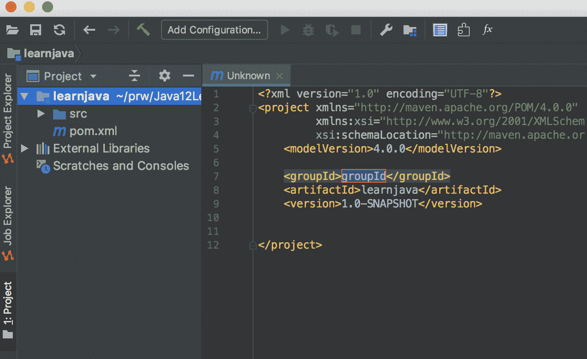
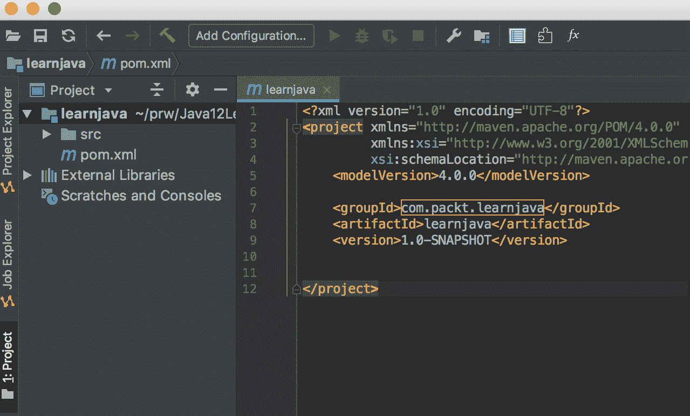
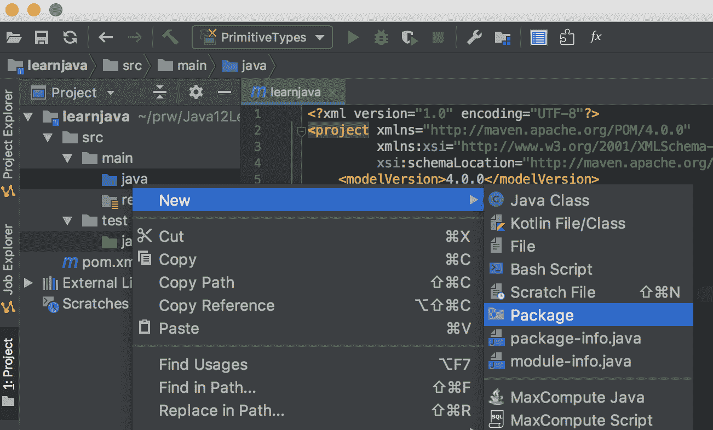
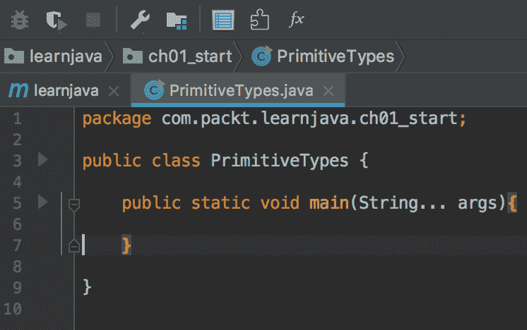
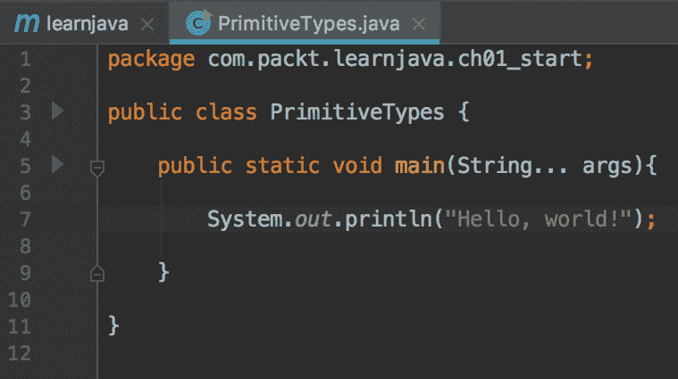
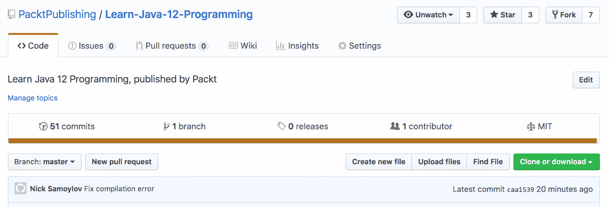
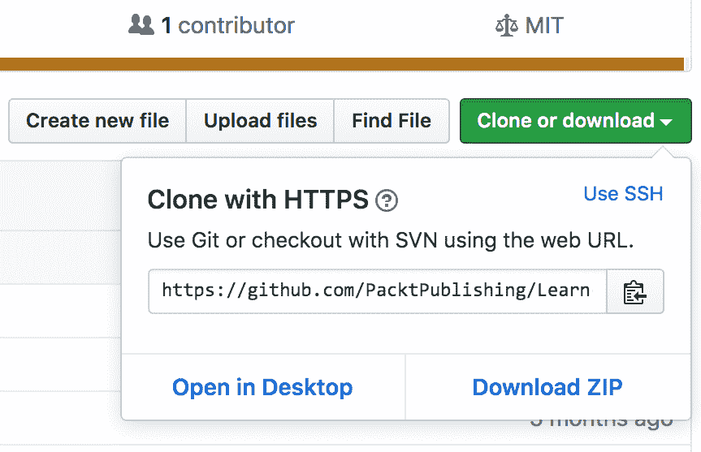
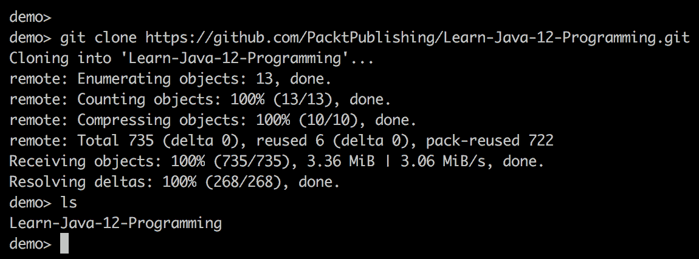
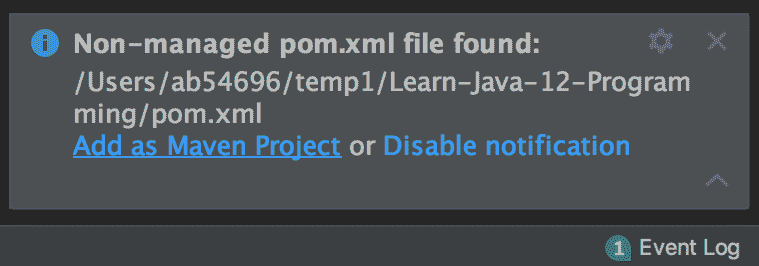

# Java 12 开始

本章是关于如何一般开始学习 Java 12 和 Java。 我们将首先解释 Java 是什么及其主要术语，然后如何安装必要的工具来编写和运行（执行）程序。 在这方面，Java 12 与前一个 Java 版本的不同之处不大，因此本章的内容也适用于旧版本。

我们将描述并演示构建和配置 Java 编程环境的所有必要步骤。 这是您必须在计算机上的最小值，以便开始编程。 我们还描述了基本的 Java 语言构造，并用可以立即执行的示例说明它们。

学习编程语言或任何语言的最佳方法是使用它，这章指导读者与 Java 如何执行此操作。 本章涵盖的主题包括以下内容：

*   如何安装和运行 java
*   如何安装和运行**集成开发环境**（ **IDE** ）
*   Java 原始类型和运营商
*   字符串类型和文字
*   标识符和变量
*   Java 陈述

# 如何安装和运行 java

当有人说“ *java* 时，他们可能意味着完全不同的东西：

*   **Java 编程语言**：一种允许意图（程序）以以人类可读格式表示的高级编程语言，这些格式可以被转换为计算机可执行的二进制代码
*   **java 编译器**：可以读取用 Java 编程语言编写的文本的程序，并将其转换为可以由 **Java 虚拟机**（ **JVM** 解释的字节码。 ）通过计算机可执行的二进制代码
*   **Java 虚拟机**（ **JVM** ）：读取编译的 Java 程序的程序，并将其解释为计算机可由计算机可执行的二进制代码
*   **Java 开发套件**（ **JDK** ）：程序（工具和实用程序）的集合，包括 Java 编译器，JVM 和支持库，允许编译和执行编写的程序 Java 语言

以下部分通过安装 Java 12 的 JDK 和基本相关术语和命令来遍历读者。

# 什么是 JDK 以及我们为什么需要它？

正如我们已经提到的那样，JDK 包含 Java 编译器和 JVM。 编译器的任务是读取一个`.java`文件，其中包含用 java 编写的程序的文本（称为**源代码**）并将其转换（编译）它进入存储在`.class`文件中的字节码中 。 然后，JVM 可以读取`.class`文件，将字节码解释为二进制代码，并将其发送到操作系统以进行执行。 编译器和 JVM 都必须从命令行显式调用。

为了支持`.java`文件编译及其字节码执行，JDK 安装还包括名为 **Java 类库**（ **JCL** ）的标准 Java 库。 如果程序使用第三方库，则必须在编译和执行期间存在。 它必须从相同的命令行引用，当通过 JVM 执行字节码时稍后调用编译器。 另一方面，JCL 不需要明确提及。 假设标准 Java 库驻留在 JDK 安装的默认位置，因此编译器和 JVM 知道在哪里找到它们。

如果您不需要编译 Java 程序并且希望仅运行已经编译的`.class`文件，可以下载并安装 **Java Runtime 环境**（ **JRE** ）。 例如，它由 JDK 的子集组成，不包含编译器。

有时，JDK 被称为**软件开发套件**（ **SDK** ），这是一系列软件工具和支持库的一般名称，允许创建可执行版本 使用某种编程语言编写的源代码。 所以，JDK 是 Java 的 SDK。 这意味着可以调用 JDK SDK。

您还可以听到术语 **Java 平台**和 **Java Edition** 与 JDK 相关。 典型平台是一个操作系统，允许开发和执行软件程序。 由于 JDK 提供了自己的操作环境，因此它也被称为平台。 **版本**是​​针对特定目的组装的 Java 平台（JDK）的变体。 以下列出了五个 Java 平台版本：

*   **Java 平台标准版**（ **Java SE** ）：这包括 JVM，JCL 和其他工具和实用程序。
*   **Java 平台企业版**（ **Java EE** ）：这包括 Java SE，服务器（为应用程序提供服务的计算机程序），JCL 和其他库，代码样本，教程和其他 开发和部署大规模，多层和安全网络应用程序的文档。
*   **Java 平台微版**（ **Java ME** ）：这是 Java SE 的子集，其中一些专门的库用于开发和部署嵌入式和移动设备的 Java 应用程序，如手机，个人数字助理 ，电视机顶面盒，打印机，传感器和类似。 Java ME（带有自己的 JVM 实现）的变化称为 **Android SDK** 。 它是由 Google 开发的 Android 编程。
*   **Java Card** ：它是 java 版本中最小的，旨在开发和部署 Java 应用程序，进入小型嵌入式设备，如智能卡。 它有两个版本： **Java Card Classic Edition** ，用于智能卡，基于 ISO7816 和 ISO14443 通信，以及支持 Web 应用程序模型和 TCP / IP 的 **Java Carded Edition** 。 基本协议并在高端安全微控制器上运行。

因此，**安装 Java 意味着安装 JDK** ，这也意味着**在其中一个列出的版本上安装 Java 平台**。 在这本书中，我们将谈论并仅使用 Java SE。

# 安装 Java SE

最近发布的 jdks 列在官方 Oracle 页面上： [www.oracle.com/technetwork/java/javase/overview/index.html](https://www.oracle.com/technetwork/java/javase/overview/index.html) （我们将称之为**安装主页**为了进一步的参考）。

以下是安装 Java SE 需要遵循的步骤：

1.  找到您正在寻找的 Java SE 版本的链接（在这种情况下 java se 12），然后单击它。
2.  您将提供各种链接，其中一个链接是安装说明。 或者，您可以通过单击“下载”选项卡来获取此页面。
3.  单击标题 Oracle JDK 下的下载链接。
4.  新屏幕将为您提供使用单选按钮接受或拒绝许可协议的选项，以及与各种 JDK 安装程序的链接列表。
5.  阅读许可协议并作出决定。 如果您不接受，则无法下载 JDK。 如果接受许可协议，则可以从可用列表中选择 JDK 安装程序。
6.  您需要选择适合您的操作系统的安装程序以及您熟悉的格式（扩展）。
7.  如果有疑问，请返回安装主页，选择“下载”选项卡，然后单击**安装说明**链接。
8.  按照与操作系统对应的步骤操作。
9.  当计算机上的`java -version`命令显示正确的 Java 版本时，可以成功安装 JDK，如以下屏幕截图所示：


# 命令，工具和实用程序

如果您按照安装说明，您可能已经注意到目录下给出的链接（安装的 JDK 的目录结构）。 它为您带来了一个页面，该页面描述了计算机上已安装的 JDK 的位置以及 JDK 根目录的每个目录的内容。 `bin`目录包含构成 Java 命令，工具和实用程序的所有可执行文件。 如果目录`bin`自动添加到环境变量`PATH`，请考虑手动执行此操作，以便您可以从任何目录启动 Java。

在上一节中，我们已经演示了`Java`命令`java -version`。 可以在 Java SE 文档中找到其他可用 Java 可执行文件（命令，工具和实用程序）列表（ [https://www.oracle.com/technetwork/java/javase/documentation/index.html](https://www.oracle.com/technetwork/java/javase/documentation/index.html) ）通过单击“链接 Java 平台标准版技术文档网站”，然后单击下一页的链接工具引用。 单击其链接您可以了解有关每个可执行工具的更多信息。

您还可以使用以下选项之一运行计算机上的每个列出的可执行文件：`-?`，`-h`，`--help`或`-help`。 它将显示简要说明可执行文件和其所有选项。

最重要的 Java 命令如下：

*   `javac`：这读取了`.java`文件，编译它，并根据`.java`文件中定义了多少个 Java 类，创建一个或多个对应的`.class`文件。
*   `java`：这执行了一个`.class`文件。

这些是使编程成为可能的命令。 每个 Java 程序员都必须对其结构和能力有了很好的理解。 但是，如果您是 Java 编程和使用 IDE 的新手（请参阅*如何安装和运行 IDE* 部分），则无需立即掌握这些命令。 每次对其进行更改时，良好的 IDE 会通过编译`.java`文件，通过编译`.java`文件来隐藏它们。 它还提供了一个图形元素，每次单击它时运行程序。

另一个非常有用的 Java 工具是`jcmd`。 它有助于与当前运行的 Java 进程（JVM）的任何诊断和诊断进行沟通和诊断，并且具有许多选项。 但是，它在其最简单的形式下，没有任何选项，它列出了所有当前运行的 Java 进程及其**进程 ID** （ **PIDS** ）。 您可以使用它来查看您是否有遥控的 Java 进程。 如果您有，则可以使用提供的 PID 杀死此类进程。

# 如何安装和运行 IDE

曾经只是一个专业编辑器，允许检查写入程序的语法，同样地单词编辑器检查英语句子的语法逐渐发展到**集成开发环境**（]）。 它以名称为主要功能。 它集成了写作，编译，然后在一个**图形用户界面**（ **gui** ）下执行程序所需的所有工具。 使用 Java 编译器的权力，IDE 立即标识语法错误，然后通过提供上下文相关的帮助和建议，有助于提高代码质量。

# 选择 IDE

有几个 IDE 可用于 Java 程序员，如 **NetBeans** ， **Eclipse** ， **Intellij Idea** ， **Bluej** ， **Drjava** ， **JDeveloper** ， **JCreator** ， **JEDIT** ， **JSource** ， **JCRASP** ，和 **JEDIT** ，命名几个。 最受欢迎的是 NetBeans，Eclipse 和 Intellij Idea。

NetBeans 开发于 1996 年开始于布拉格查尔斯大学的 Java IDE 学生项目。 1999 年，该项目和该项目创建的公司被 Sun Microsystems 收购。 在 Oracle 收购 Sun Microsystems 之后，NetBeans 成为开源，许多 Java 开发人员都为该项目做出了贡献。 它与 JDK 8 捆绑在一起，成为 Java 开发的官方 IDE。 2016 年，Oracle 捐赠给 Apache 软件基金会。

Windows，Linux，Mac 和 Oracle Solaris 有一个 NetBeans IDE。 它支持多种编程语言，可以使用插件扩展。 NetBeans 仅与 JDK 8 捆绑在一起，但 NetBeans 8.2 也可以使用 JDK 9，并使用 JDK 9 引入的功能，例如拼图锯。 在 [netbeans.apache.org](https://netbeans.apache.org/) 上，您可以了解有关 NetBeans IDE 的更多信息，并下载最新版本，截至本写作的时间为 11.0。

Eclipse 是最广泛使用的 Java IDE。 为 IDE 添加新功能的插件列表不断增长，因此无法枚举所有 IDE 的功能。 自 2001 年以来，Eclipse IDE 项目已成为开源软件。 非营利性的成员支持的公司 Eclipse Foundation 于 2004 年创建，目标是提供基础架构（版本控制系统，代码审查系统，构建服务器，下载站点等）和结构化进程。 该基金会的三十件员工都没有开展 150 个 eclipse 支持的项目中的任何一个项目。

Eclipse IDE 插件的纯粹号码和各种为初学者创造了一定的挑战，因为您必须在相同的不同实现或类似的功能的不同实现方面找到您的方式，可以在可能不兼容，并且可能需要深度调查 清楚地了解所有依赖项。 尽管如此，Eclipse IDE 非常受欢迎，并具有扎实的社区支持。 您可以阅读关于 Eclipse IDE 并从 [www.eclipse.org/ide](http://www.eclipse.org/ide/) 下载最新版本。

Intellij Ideo 有两个版本：付费和一个免费的社区版本。 付费版本始终如一地排名为最佳 Java IDE，但社区版本也列在三个领先的 Java IDE 中。 JetBrains 软件公司开发 IDE 在布拉格，圣彼得堡，莫斯科，慕尼黑，波士顿和新西伯利亚的办事处。 IDE 以其深度智能而闻名，即“*在每个上下文中提供相关建议：即时和巧妙的代码完成，在飞行代码分析和可靠的重构工具*，”如作者所说的同时 描述其网站上的产品（ [www.jetbrains.com/idea](https://www.jetbrains.com/idea/) ）。 在*中安装和配置 Intellij Idea* 部分，我们将通过 Intellij IDEA 社区版的安装和配置来。

# 安装和配置 Intellij Idea

这些是您需要遵循的步骤，以便下载并安装 Intellij Idea：

1.  从 [www.jetbrains.com/idea/download](http://www.jetbrains.com/idea/download) 下载 Intellij Community Edition 的安装程序。
2.  启动安装程序并接受所有默认值。
3.  在安装选项屏幕上选择.java。 我们假设您已经安装了 JDK，因此您不检查下载并安装 JRE 选项。
4.  最后一个安装屏幕有一个复选框运行 Intellij Indion，您可以自动检查以启动 IDE。 或者，在安装完成后，您可以将复选框未选中并手动启动 IDE。
5.  当 IDE 首次启动时，它会询问您是否要导入 Intellij Idea 设置。 如果您之前没有使用 IntelliJ IDEN，请选中“不导入设置”复选框，并希望重用设置。
6.  以下屏幕或两个询问您是否接受 JetBrains 隐私政策以及是否要支付许可或更愿意继续使用免费的社区版或免费试用（这取决于您获得的特定下载）。
7.  回答任何您更喜欢的问题，如果您接受隐私政策，则定制 Intellij Idea 屏幕要求您选择主题，白色（Intellij）或 Dark（Darcula）。

8.  提供按钮时跳过全部并设置默认值，然后选择默认值，选择下一个：默认插件，因为它将让您选择事先配置 IDE。
9.  在对任务屏幕上呈现调谐构想时，选择以下三个的自定义...链接：

10.  如果您决定更改集合值，则可以通过从最顶层的菜单文件中选择以下方式，在 Windows 和 Linux 和 MacOS 上的首选项上设置。

# 创建一个项目

在开始编写程序之前，您需要创建一个项目。 有几种方法可以在 Intellij Ideag 中创建一个项目，这对任何 IDE 都是一样的，如下：

1.  创建新项目：从头开始创建一个新项目。
2.  导入项目：这允许从文件系统中读取现有源代码。
3.  打开：这允许从文件系统中读取现有项目。
4.  从版本控制中退出：这允许从版本控制系统读取现有项目。

在本书中，我们将通过仅使用 IDE 提供的导游序列来步行才能使用第一个选项。 另外两个选项更简单，不需要其他解释。 一旦您学习了从头开始创建一个新项目，其他方式可以在 IDE 中提出一个项目将非常容易。

首先单击“创建新项目”链接并继续如下进行：

1.  为项目 SDK 选择一个值（如果已安装 JDK 12，则为 Java 版本 12），然后单击“下一步”。
2.  请勿从模板中检查创建项目（如果选中，IDE 会生成一个罐头程序`Hello world`和类似，我们不需要），然后单击“下一步”。

3.  在项目位置字段中选择所需的项目位置（这是您的新代码驻留的位置）。
4.  在项目名称字段中输入您喜欢的任何内容（例如，本书中的代码项目称为`learnjava`），然后单击`Finish`按钮。
5.  您将看到以下项目结构：


6.  右键单击项目名称（`learnjava`），然后从下拉菜单中选择添加框架支持。 在以下弹出窗口中，选择 Maven：


7.  Maven 是一个项目配置工具。 其主要功能是管理项目依赖项。 我们很快就会谈论它。 目前，我们将使用其他责任，使用三个属性来定义和保持项目代码标识：

主要目标是使项目的所有项目的身份成为世界上所有项目中的独特之处。 为了帮助避免`groupId` clash，“约定”要求您开始将其从组织域名以反向构建。 例如，如果公司具有域名`company.com`，则其项目的组 ID 应以`com.company`开头。 这就是为什么在本书中的代码，我们使用`groupId`值`com.packt.learnjava`。

让我们设置它。 单击弹出窗口上的“确定”添加框架支持，您将新生成的`pom.xml`文件如下：



与此同时，在屏幕的右下角，另一个小窗口将弹出：


单击“启用自动导入”链接。 这将使写入代码更轻松：您将开始使用的所有新类将自动导入。 我们将在适当时期讨论课堂进口。

现在让我们输入`groupId`，`artifactId`和`version`值：



现在，如果有人想在其应用程序中使用项目代码，他们将通过显示的三个值和 maven（如果您使用它）将其引用（如果您在公开共享的 Maven 中载 当然是存储库。 阅读更多关于 [https://maven.apache.org/guides](https://maven.apache.org/guides/) 的 Maven。

`groupId`值的另一个函数是定义保存项目代码的文件夹树的根目录。 让我们打开`src`文件夹; 您将看到它下面的以下目录结构：


`main`下的`java`文件夹将保存应用程序代码，而`test`下的`java`文件夹将保存测试代码。

让我们使用以下步骤创建我们的第一个程序：

1.  右键单击`java`，选择“新建”，然后单击“包”：



2.  在“新的”软件包“窗口中，键入`com.packt.learnjava.ch01_start`，如下所示：


3.  单击确定，您应该在左侧面板中看到新文件夹集，其中最后一个是`com.packt.learnjava.ch01_start`：


4.  右键单击它，选择“新建”，然后单击“Java 类”：


5.  在提供的输入窗口中，键入`PrimitiveTypes`：


6.  单击“确定”，您将看到在包中创建的第一个 Java 类`PrimitiveTypes` `com.packt.learnjava.ch01_start`包：


包反映了文件系统中的 Java 类位置。 我们将在 [](02.html)中讨论它，， *java 面向对象编程（OOP）*。 现在，为了运行程序，我们创建了`main()`方法。 如果存在，可以执行此方法并用作应用程序中的入口点。 它具有一定的格式，如下：



它必须具有以下属性：

*   `public`：从包外自由访问
*   `static`：应该能够被调用而不创建它所属的类的对象

它也应该如下：

*   返回`void`（没有）。
*   接受`String`数组作为输入或`varargs`。 我们将在 [](https://cdp.packtpub.com/learn_java_12_programming/wp-admin/post.php?post=24&action=edit#post_25) ， *Java 面向对象编程（OOP）*中讨论`varargs`。 目前，足以说`String[] args`和`String... args`定义基本相同的输入格式。

我们解释了如何使用*执行示例中的命令行从命令行*部分来运行主类。 您可以在官方 Oracle 文档中了解有关 Java 命令行参数的更多信息： [https://docs.oracle.com/javase/tutorial/esential/environment/cmdlineargs.html](https://docs.oracle.com/javase/tutorial/essential/environment/cmdLineArgs.html) 。 还可以通过 Intellij Idea 运行示例。

请注意以下屏幕截图中的两个绿色三角形。 通过单击其中任何一个，您可以执行`main()`方法。 例如，让我们显示`Hello, world!`。

要执行此操作，请在`main()`方法内键入以下行：

```
System.out.println("Hello, world!");
```

然后，单击其中一个绿色三角形：



您应该在终端区域中获取以下输出，如下所示：


从现在开始，每次我们要讨论代码示例时，我们将通过使用`main()`方法以相同的方式运行它们。 在这样做的同时，我们将不会捕获屏幕截图，但将结果放在评论中，因为这种样式更容易遵循。 例如，以下代码显示以前的代码演示如何看待此样式：

```
System.out.println("Hello, world!");     //prints: Hello, world!
```

可以将由双斜线`//`分隔的代码行右侧添加注释（任何文本）。 编译器没有读取此文本，只需保留它。 评论的存在不会影响性能，并用于解释程序员意图对人类。

# 导入项目

在本节中，我们将通过使用本书的源代码来展示将现有代码导入 Intellij Idea 的过程。 我们假设您在计算机上安装了 maven（ [https://maven.apache.org/install.html](https://maven.apache.org/install.html) ），并且您有 git（ [https://gist.github.com/ 也安装了 derhuerst / 1b15ff4652a867391f03](https://gist.github.com/derhuerst/1b15ff4652a867391f03) ，可以使用它。 我们还假设您已安装 JDK 12，如*安装 Java SE* 部分中所述。

要使用本书的代码示例导入项目，请按照下列步骤操作：

1.  转到源存储库（ [https://github.com/packtpublishing/learn-java-12-programming](https://github.com/PacktPublishing/Learn-Java-12-Programming) ），然后单击克隆或下载链接，如以下屏幕截图所示：



2.  单击克隆或下载链接，然后复制提供的 URL：



3.  选择计算机上的目录，您希望放置源代码，然后运行以下 git 命令：


4.  创建了一个新的`Learn-Java-12-Programming`文件夹，如以下屏幕截图所示：



或者，您可以使用前面的屏幕截图上显示的链接下载 zip 将源作为`.zip`文件下载作为`.zip`文件。 未下载的源在计算机上的目录中，您希望放置源代码，然后通过从名称中删除后缀“-master”来重命名新创建的文件夹，确保文件夹的名称是`Learn-Java-12-Programming` 。

5.  New `Learn-Java-12-Programming`文件夹包含本书的所有源代码的 Maven 项目。 现在运行 Intellij Idea 并在最顶层菜单中单击文件，然后在现有源中的新和项目...：


6.  选择在步骤 4 中创建的`Learn-Java-12-Programming`文件夹，然后单击“打开”按钮：


7.  接受默认设置，然后单击以下每个屏幕上的下一个按钮，直到到达显示已安装的 jdks 列表的屏幕和完成按钮：


8.  选择`12`，然后单击“完成”。 您将看到导入您的 Intellij Idea 的项目：


9.  等到以下小窗口显示在右下角：


您可能不想等待并继续执行步骤 12.只需执行步骤 10 和 11“窗口以后弹出。 如果您错过了此窗口，请在稍后随时单击事件日志链接，您将呈现相同的选项。

10.  点击它; 然后单击“添加为 Maven 项目”链接：



11.  随时下列窗口显示，单击“启用自动导入：


您可能不想等待并继续执行步骤 12.只需执行窗口稍后弹出步骤 11。 如果您错过了此窗口，请在稍后随时单击事件日志链接，您将呈现相同的选项。

12.  选择项目结构符号，这是以下屏幕截图右侧的第三个符号：


13.  如果您有列出的主要和测试模块，请通过突出显示它们并单击“减号（`-`）删除，如下屏幕所示：


14.  以下是如何查看的最终模块列表：


15.  单击右下角的“确定”，然后返回项目。 单击左窗格中的 Learn-Java-12 编程，然后继续在源区中卸下，直到看到以下类列表：


16.  单击右窗格中的绿色箭头，然后执行您想要的任何类。 在运行窗口中将能够看到的结果类似于以下内容：


# 从命令行执行示例

要从命令行执行示例，请按照下列步骤操作：

1.  转到*中创建的`Learn-Java-12-Programming`文件夹在*中导入项目*部分，其中`pom.xml`文件位于，并运行`mvn clean package`命令：*


2.  选择您要运行的示例。 例如，假设您想要运行`ControlFlow.java`，请运行以下命令：

```
java -cp target/learnjava-1.0-SNAPSHOT.jar:target/libs/* \
com.packt.learnjava.ch01_start.ControlFlow
```

您将看到以下结果：


3.  如果您想从`ch05_stringsIoStreams`包运行示例文件，请使用其他包和类名运行相同的命令：

```
java -cp target/learnjava-1.0-SNAPSHOT.jar:target/libs/* \
com.packt.learnjava.ch05_stringsIoStreams.Files
```

如果您的计算机有 Windows 系统，请使用以下命令作为一行：

```
java -cp target\learnjava-1.0-SNAPSHOT.jar;target\libs\* com.packt.learnjava.ch05_stringsIoStreams.Files
```

请注意，Windows 命令具有与类路径分隔符不同的斜杠和分号（`;`）。

4.  结果将如下：


5.  这样，您可以运行其中具有`main()`方法的任何类。 将执行`main()`方法的内容。

# Java 原始类型和运营商

通过所有主要的编程工具到位，我们可以开始谈论 Java 作为一种语言。 语言语法由 Java 语言规范定义，您可以在 [https://docs.oracle.com/javase/specs](https://docs.oracle.com/javase/specs) 上找到。 每次需要澄清时都不要犹豫。 当许多人认为，这并不令人生畏。

Java 中的所有值分为两类：`reference`类型和`primitive`类型。 我们从原始类型和运营商开始作为任何编程语言的自然入口点。 在本章中，我们还将讨论一个名为`String`的引用类型（请参阅*字符串类型和文字*部分）。

所有原始类型都可以分为两组：`boolean`类型和`numeric`类型。

# 布尔类型

Java 中只有两个`boolean`类型值：`true`和`false`。 这种值只能分配给`boolean`类型的变量，例如：

```
boolean b = true;
```

A `boolean`变量通常用于控制流程语句，我们将在 *Java 语句*部分中讨论。 这是一个例子：

```
boolean b = x > 2;
if(b){ 
    //do something
}
```

在代码中，我们分配给`b`变量`x > 2`表达式的评估结果。 如果`x`的值大于`2`，`b`变量获取分配的值`true`。 然后执行括号内的代码`{}`。

# 数字类型

**java** **数字**形成两组：整体类型（`byte`，`char`，`short`，`int`，`long`，`long`）和浮点类型（`float`和`double`）。

# 整体类型

积分类型消耗以下内存量：

*   `byte`：8 位
*   `char`：16 位
*   `short`：16 位
*   `int`：32 位
*   `long`：64 位

`char`类型是一个无符号整数，可以从 0 到 65,535 包含一个值（称为**代码**）的值。 它表示 Unicode 字符，这意味着有 65,536 个 Unicode 字符。 以下是三个记录表格形成 Unicode 字符的基本拉丁列表：

| **代码点** | **unicode 逃生** | **可打印符号** | **描述** |
| `33` | `\u0021` | `!` | 感叹号 |
| `50` | `\u0032` | `2` | 数字二 |
| `65` | `\u0041` | `A` | 拉丁大写字母 a |

以下代码演示了`char`类型的属性：

```
char x1 = '\u0032';
System.out.println(x1);  //prints: 2

char x2 = '2';
System.out.println(x2);  //prints: 2
x2 = 65;
System.out.println(x2);  //prints: A

char y1 = '\u0041';
System.out.println(y1);  //prints: A

char y2 = 'A';
System.out.println(y2);  //prints: A
y2 = 50;
System.out.println(y2);  //prints: 2

System.out.println(x1 + x2);  //prints: 115
System.out.println(x1 + y1);  //prints: 115

```

代码示例的最后两行解释了为什么`char`类型被视为积分类型，因为可以在算术运算中使用`char`值。 在这种情况下，每个`char`值由其代码点表示。

其他整数类型的值范围如下：

*   `byte`：从`-128`到`127`包容性
*   `short`：从`-32,768`到`32,767`包容性
*   `int`：从`-2.147.483.648`到`2.147.483.647`包容性
*   `long`：从`-9,223,372,036,854,775,808`到`9,223,372,036,854,775,807`包容性

您可以始终从相应的 Java 常量检索每个原始类型的最大值和最小值，如下所示：

```
System.out.println(Byte.MIN_VALUE);      //prints: -128
System.out.println(Byte.MAX_VALUE);      //prints:  127
System.out.println(Short.MIN_VALUE);     //prints: -32768
System.out.println(Short.MAX_VALUE);     //prints:  32767
System.out.println(Integer.MIN_VALUE);   //prints: -2147483648
System.out.println(Integer.MAX_VALUE);   //prints:  2147483647
System.out.println(Long.MIN_VALUE);      //prints: -9223372036854775808
System.out.println(Long.MAX_VALUE);      //prints:  9223372036854775807
System.out.println((int)Character.MIN_VALUE); //prints: 0
System.out.println((int)Character.MAX_VALUE); //prints: 65535

```

在最后两行中的构造`(int)`是**铸造操作员**使用的示例。 在此情况下，它迫使将价值从一种类型转换为另一个类型的情况下，当并不总是保证成功的情况下。 您可以从我们的示例中看到，某些类型允许比其他类型更大的值。 但程序员可能知道某个变量的值永远不会超过目标类型的最大值，并且演员操作员是程序员可以强制他们对编译器的看法的方式。 否则，在没有演员运算符的情况下，编译器会引发错误，并且不会允许分配。 然而，程序员可能会被误，并且该值可能变得更大。 在这种情况下，在执行时间期间将提出运行时错误。

有类型的类型，原则上不能施放到其他类型，或者至少至少为所有类型的类型。 例如，`boolean`类型值不能投射到积分类型值。

# 浮点类型

这组原始类型中有两种类型，`float`和`double`：

*   `float`：32 位
*   `doubele`：64 位

它们的积极最大和最低可能值如下：

```
System.out.println(Float.MIN_VALUE);  //prints: 1.4E-45
System.out.println(Float.MAX_VALUE);  //prints: 3.4028235E38
System.out.println(Double.MIN_VALUE); //prints: 4.9E-324
System.out.println(Double.MAX_VALUE); //prints: 1.7976931348623157E308

```

最大和最小负值与刚刚示出的最大值相同，仅在其前面的负符号（`-`）。 因此，有效地，值`Float.MIN_VALUE`和`Double.MIN_VALUE`不是最小值，而是相应类型的精度。 对于每个浮点类型，零值可以是`0.0`或`-0.0`。

浮点类型的特殊功能是存在点（`.`），其分离数量的整数和分数部分。 默认情况下，在 Java 中，假定具有点的数字是`double`类型。 例如，假设以下内容是一个双重值：

```
42.3
```

这意味着以下赋值会导致编译错误：

```
float f = 42.3;
```

要指示您希望被视为`float`类型，您需要添加`f`或`F`。 例如，以下作业不会导致错误：

```
float f = 42.3f;
float d = 42.3F;

double a = 42.3f;
double b = 42.3F;

float x = (float)42.3d;
float y = (float)42.3D;

```

由于您可能已经注意到了示例中，`d`和`D`表示`double`类型。 但我们能够将它们投入`float`类型，因为我们相信`42.3`在可能的`float`类型值的范围内很好。

# 原始类型的默认值

在某些情况下，即使程序员不想这样做，必须分配一个值。 我们将讨论[第 2 章](02.html)， *Java 面向对象编程（OOP）*中的这种情况。 此类情况下的默认原始类型值如下：

*   `byte`，`short`，`int`和`long`类型具有默认值`0`。
*   `char`类型具有默认值`\u0000`，其中代码点`0`。
*   `float`和`double`类型具有默认值`0.0`。
*   `boolean`类型具有默认值`false`。

# 原始类型的文字

值的表示称为**文字**。 `boolean`类型有两个文字：`true`和`false`。 `byte`，`short`，`int`和`long`积分类型的文字具有默认情况下的`int`类型：

```
byte b = 42;
short s = 42;
int i = 42;
long l = 42;
```

此外，为了指示`long`类型的文字，您可以将字母`l`或`L`附加到最后：

```
long l1 = 42l;
long l2 = 42L;
```

字母`l`可以很容易地与数字 1 混淆，因此使用`L`（而不是`l`），为此目的是一个很好的做法。

到目前为止，我们在十进制数字系统中表达了整体文字。 同时，`byte`，`short`，`int`和`long`类型的文字也可以在二进制（基座 2，数字 0-1），八进制（基座 8，数字 0-7）中表示 ，和十六进制（基本 16，数字 0-9 和 AF）编号系统。 二进制文字以`0b`（或`0B`）开始，然后在二进制系统中表达的值。 例如，十进制`42`表示为`101010 = 2^0*0 + 2^1*1 + 2^2*0 + 2^3 *1  + 2^4 *0  + 2^5 *1`（我们从右`0`开始）。 八进制文字以`0`开头，然后在八进制系统中表达的值，因此`42`表示为`52 = 8^0*2+ 8^1*5`。 十六进制文字以`0x`（或`0X`）开始，然后在十六进制系统中表达的值。 因此，`42`表示为`2a = 16^0*a + 16^1*2`，因为在十六进制系统中，符号`a`（或`A`到`F`）映射到十进制值`10`至`15`。 以下是演示码：

```
int i = 42;
System.out.println(Integer.toString(i, 2));       // 101010
System.out.println(Integer.toBinaryString(i));    // 101010
System.out.println(0b101010);                     // 42

System.out.println(Integer.toString(i, 8));       // 52
System.out.println(Integer.toOctalString(i));     // 52
System.out.println(052);                          // 42

System.out.println(Integer.toString(i, 10));       // 42
System.out.println(Integer.toString(i));           // 42
System.out.println(42);                            // 42

System.out.println(Integer.toString(i, 16));       // 2a
System.out.println(Integer.toHexString(i));        // 2a
System.out.println(0x2a);                          // 42

```

如您所见，Java 提供了将十进制系统值转换为具有不同基础的系统的方法。 所有这些数字值表达式称为文字。

数字文字的一个特征使他们成为人性化的。 如果数字很大，则可以将其分解为由下划线（`_`）标志分隔的三级。 例如，观察以下内容：

```
int i = 354_263_654;
System.out.println(i);  //prints: 354263654

float f = 54_436.98f;
System.out.println(f);  //prints: 54436.98

long l = 55_763_948L;
System.out.println(l);  //prints: 55763948

```

编译器忽略嵌入的下划线标志。

`char`类型有两种文字：**单个字符**或**转义序列**。 在讨论数字类型时，我们已经看到了`char`类型文字的示例：

```
char x1 = '\u0032';
char x2 = '2';
char y1 = '\u0041';
char y2 = 'A';

```

如您所见，该角色必须用单引号括起来。

转义序列以反斜杠（`\`）开始，后跟字母或其他字符。 以下是转义序列的完整列表：

*   `\b`：Backspace `BS`，Unicode Escape `\u0008`
*   `\t`：卧式标签`HT`，Unicode 逃生`\u0009`
*   `\n`：线饲料`LF`，Unicode Escape `\u000a`
*   `\f`：表单饲料`FF`，Unicode 逃生`\u000c`
*   `\r`：回车返回`CR`，Unicode 逃生`\u000d`
*   `\"`：双引号`"`，Unicode Escape `\u0022`
*   `\'`：单引号`'`，Unicode 逃生`\u0027`
*   `\\`：反斜杠`\`，`Unicode escape \u005c`

从八个转义序列，只有最后三个由符号表示。 当此符号无法以其他方式显示它们时使用它们。 例如，观察以下内容：

```
System.out.println("\"");   //prints: "
System.out.println('\'');   //prints: '
System.out.println('\\');   //prints: \

```

其余的用途作为指示输出设备执行某些操作的控制代码：

```
System.out.println("The back\bspace");     //prints: The bacspace
System.out.println("The horizontal\ttab"); //prints: The horizontal   tab
System.out.println("The line\nfeed");      //prints: The line
                                           //        feed
System.out.println("The form\ffeed");      //prints: The form feed
System.out.println("The carriage\rreturn");//prints: return

```

如您所见，`\b`删除先前的符号，`\t`插入选项卡空间，`\n`打破行并开始新的线，`\f`强制打印机弹出当前页面并继续打印 顶部另一个，`/r`重新开始当前的行。

# 新的紧凑号格式

`java.text.NumberFormat`类以各种格式提出数字。 它还允许将格式调整为包括本地的提供的格式。 我们在这里提到了它，因为在 Java 12 中添加了这个类的新功能。它被称为 **compact** 或 **short** 编号格式。

它代表了语境特异性人类可读形式的一个数字。 例如，观察以下内容：

```
NumberFormat fmt = NumberFormat.getCompactNumberInstance(Locale.US, 
                                            NumberFormat.Style.SHORT);
System.out.println(fmt.format(42_000));          //prints: 42K
System.out.println(fmt.format(42_000_000));      //prints: 42M

NumberFormat fmtP = NumberFormat.getPercentInstance();
System.out.println(fmtP.format(0.42));          //prints: 42%

```

如您所见，要访问此功能，您必须获取`NumberFormat`类的特定实例，有时基于区域设置和提供的样式。

# 运营商

Java 中有 44 个运算符，如下表所列：

| **运算符** | **描述** |
| `+` `-` `*` `/` `%` | 算术机构和二元运算符 |
| `++` `--` | 增量和减少机构 |
| `==` `!=` | 平等运营商 |
| `<` `>` `<=` `>=` | 关系运营商 |
| `!` `&` `&#124;` | 逻辑运营商 |
| `&&` `&#124;&#124;` `?:` | 条件运营商 |
| `=` `+=` `-=` `*=` `/=` `%=` | 分配运营商 |
| `&=` `&#124;=` `^=` `<<=` `>>=` `>>>=` | 分配运营商 |
| `&` `&#124;` `~` `^` `<<` `>>` `>>>` | 按位运算符 |
| `->` `::` | 箭头和方法参考运营商 |
| `new` | 实例创建运算符 |
| `.` | 现场访问/方法调用运算符 |
| `instanceof` | 类型比较运算符 |
| （目标类型） | 演员运营商 |

我们不会描述非典型使用的分配运算符`&=`，`|=`，`^=`，`<<=`，`>>=`，`>>>=`和按位运算符。 您可以在 Java 规范中读取它们（ [https://docs.oracle.com/javase/specs](https://docs.oracle.com/javase/specs) ）。 箭头`->`和方法参考`::`操作符将在[第 14 章](13.html)，*功能编程*中描述。 实例创建运算符`new`，现场访问/方法调用操作员`.`和类型比较运算符`instanceof`将在 [](02.html) ， *java 面向对象编程（OOP ）*。 至于`cast`操作员，我们已经在*积分类型*部分中描述了它。

# 算术机构（+和 - ）和二进制运算符（+， - ，*，/和％）

大多数算术运算符和正负符号（ **Unary** 运营商）对我们非常熟悉。 模数算子`%`，通过右手操作数划分左手操作数并返回剩余部分，如下所示：

```
int x = 5;
System.out.println(x % 2);   //prints: 1

```

它还值得一提的是，Java 中的两个整数值的划分失去了分数部分，因为 Java 假设结果应该是两个整数，如下所示：

```
int x = 5;
System.out.println(x / 2);   //prints: 2
```

如果需要保留结果的分数部分，请将其中一个操作数转换为浮点类型。 以下是少数方法来实现它：

```
int x = 5;
System.out.println(x / 2.);           //prints: 2.5
System.out.println((1\. * x) / 2);     //prints: 2.5
System.out.println(((float)x) / 2);   //prints: 2.5
System.out.println(((double) x) / 2); //prints: 2.5
```

# 递增和减少一元运算符（++和 - ）

`++`操作员通过`1`增加积分类型的值，而`--`操作员通过`1`降低。 如果在（前缀）之前（前缀）变量，它会在返回变量值之前将其值更改为 1。 但是当放置（postfix）之后的变量时，它在返回变量值后，它会通过`1`更改其值。 这里有一些例子：

```
int i = 2;
System.out.println(++i);   //prints: 3
System.out.println(i);     //prints: 3
System.out.println(--i);   //prints: 2
System.out.println(i);     //prints: 2
System.out.println(i++);   //prints: 2
System.out.println(i);     //prints: 3
System.out.println(i--);   //prints: 3
System.out.println(i);     //prints: 2

```

# 平等运营商（==和！=）

`==`操作员表示**等于**，而`!=`操作员表示**不等于**。 它们用于比较相同类型的值并返回`boolean`值`true`如果操作数的值等于或`false`。 例如，观察以下内容：

```
int i1 = 1;
int i2 = 2;
System.out.println(i1 == i2);        //prints: false
System.out.println(i1 != i2);        //prints: true
System.out.println(i1 == (i2 - 1));  //prints: true
System.out.println(i1 != (i2 - 1));  //prints: false

```

但是，谨慎行事，同时比较浮点类型的值，特别是在比较计算结果时。 在这种情况下，使用关系运算符（`<`，`>`，`<=`和`>=`），因为例如，除法`1/3`，导致永无止境的分数部分`0.33333333...`和 最终取决于精确实现（超出本书范围的复杂主题）。

# 关系运算符（，<=, and > =）

**关系运算符**比较值并返回`boolean`值。 例如，观察以下内容：

```
int i1 = 1;
int i2 = 2;
System.out.println(i1 > i2);         //prints: false
System.out.println(i1 >= i2);        //prints: false
System.out.println(i1 >= (i2 - 1));  //prints: true
System.out.println(i1 < i2);         //prints: true
System.out.println(i1 <= i2);        //prints: true
System.out.println(i1 <= (i2 - 1));  //prints: true
float f = 1.2f;
System.out.println(i1 < f);          //prints: true
```

# 逻辑运算符（！，＆和|）

逻辑运算符可以定义如下：

*   如果操作数是`false`，则`!`二进制运算符返回`true`，否则`false`。
*   如果两个操作数都是`true`，则`&`二进制运算符返回`true`。
*   如果至少一个操作数是`true`，则`|`二进制运算符返回`true`。

这是一个例子：

```
boolean b = true;
System.out.println(!b);    //prints: false
System.out.println(!!b);   //prints: true
boolean c = true;
System.out.println(c & b); //prints: true
System.out.println(c | b); //prints: true
boolean d = false;
System.out.println(c & d); //prints: false
System.out.println(c | d); //prints: true
```

# 条件运算符（&&，||和？:)

`&&`和`||`操作员会产生与`&`和`|`逻辑运算符相同的结果，我们刚才显示：

```
boolean b = true;
boolean c = true;
System.out.println(c && b); //prints: true
System.out.println(c || b); //prints: true
boolean d = false;
System.out.println(c && d); //prints: false
System.out.println(c || d); //prints: true

```

不同之处在于`&&`和`||`操作员并不总是评估第二操作数。 例如，在`&&`操作员的情况下，如果第一个操作数是`false`，则不评估第二操作数，因为整个表达式的结果是`false`。 类似地，在`||`操作员的情况下，如果第一个操作数是`true`，则将清楚地评估对`true`的整个表达式，而无需评估第二操作数。 我们可以在以下代码中演示它：

```
int h = 1;
System.out.println(h > 3 & h++ < 3);  //prints: false
System.out.println(h);                //prints: 2
System.out.println(h > 3 && h++ < 3); //prints: false
System.out.println(h);                //prints: 2
```

`? :`操作员称为**三元运算符**。 它评估一个条件（在符号`?`之前），如果它导致`true`，则分配给由第一表达式计算的值（在`?`和`:`标志之间）; 否则，它会分配第二个表达式计算的值（在`:`标志之后）：

```
int n = 1, m = 2;
float k = n > m ? (n * m + 3) : ((float)n / m); 
System.out.println(k);           //prints: 0.5
```

# 赋值运算符（=，+ =， - =，* =，/ =和％=）

`=`运算符只将指定的值分配给变量：

```
x = 3;
```

在分配它之前，其他赋值运算符计算新值：

*   `x += 42`分配给`x`表达式`x = x + 42`的结果。
*   `x -= 42`分配给`x`表达式`x = x - 42`的结果。
*   `x *= 42`分配给`x`表达式`x = x * 42`的结果。
*   `x /= 42`分配给`x`表达式`x = x / 42`的结果。
*   `x %= 42`为表达式的剩余部分分配`x = x + x % 42`。

以下是这些运营商如何工作：

```
float a = 1f;
a += 2;
System.out.println(a); //prints: 3.0
a -= 1;
System.out.println(a); //prints: 2.0
a *= 2;
System.out.println(a); //prints: 4.0
a /= 2;
System.out.println(a); //prints: 2.0
a %= 2;
System.out.println(a); //prints: 0.0
```

# 字符串类型和文字

我们刚刚描述了 Java 语言的原始值类型。 Java 中的所有其他值类型属于**参考类型**。 每个引用类型都是一个比仅值更复杂的构造。 它由 A **类**描述，其用作用于创建**对象**的模板，该存储器区域包含在类中定义的值和方法（处理代码）。 `new`运算符创建一个对象。 我们将在[第 2 章](02.html)， *java 面向对象编程（OOP）*中更详细地讨论类和对象。

在本章中，我们将讨论一个称为`String`的引用类型之一。 它由`java.lang.String`类表示，属于您可以看到的，所以对最多的 JDK，`java.lang`的基础包。 我们早期介绍`String`课程的原因是，尽管是参考类型，但它在一些与原始类型相似的方面的行为。

引用类型所谓的，因为，在代码中，我们不会直接处理此类型的值。 引用类型的值比原始类型值更复杂。 它被称为一个对象，需要更复杂的内存分配，因此引用类型变量包含内存参考。 它将*（参考）*指向对象所在的内存区域，因此名称。

当将参考型变量传递到作为参数的方法时，参考类型的这种性质需要特别注意。 我们将在[第 3 章](03.html)， *Java 基础*中更详细地讨论它。 目前，与`String`相关，我们将看到`String`是如何参考类型有助于通过仅存储一次`String`值来优化内存使用。

# 字符串文字

`String`类表示 Java 程序中的字符串。 我们看到了几个这样的琴弦。 例如，我们已经看过`Hello, world!`。 这是一个`String`文字。

文字的另一个例子是`null`。 任何参考类都可以参考文字`null`。 它表示不指向任何对象的参考值。 在`String`类型的情况下，它看起来如下：

```
String s = null;
```

但是由包含在双引号（`"abc"`，`"123"`，`"123"`，`"a42%$#"`）中包含的字符组成的文字只能是`String`类型。 在这方面，`String`类是参考类型，具有与原始类型共同的共同点。 所有`String`文字存储在名为**字符串池**的专用内存部分中，两个文字同样拼写为表示池中的相同值：

```
String s1 = "abc";
String s2 = "abc";
System.out.println(s1 == s2);    //prints: true
System.out.println("abc" == s1); //prints: true

```

JVM 作者选择了这样的实现，以避免重复并提高内存使用情况。 以前的代码示例看起来非常像原始类型的操作，不是吗？ 但是当使用`new`运算符创建`String`对象时，新对象的内存被分配在字符串池外，因此两个`String`对象的引用或任何其他对象都是不同的：

```
String o1 = new String("abc");
String o2 = new String("abc");
System.out.println(o1 == o2);    //prints: false
System.out.println("abc" == o1); //prints: false

```

如有必要，可以使用`intern()`方法将使用`new`运算符创建的字符串值移动到字符串池：

```
String o1 = new String("abc");
System.out.println("abc" == o1);          //prints: false
System.out.println("abc" == o1.intern()); //prints: true

```

在上一个代码中，`intern()`方法尝试将新创建的`"abc"`值移动到字符串池中，但发现已经存在这样的文字，因此它从字符串池中重用了文字。 这就是为什么前面的例子中的最后一行中的引用相等。

好消息是您可能不需要使用`new`运算符创建`String`对象，大多数 Java 程序员永远不会这样做。 但是当一个`String`对象作为输入传递到代码时，并且您无法控制其原点，只有引用的比较可能会导致结果不正确（如果字符串具有相同的拼写但是由`new operator`创建） 。 这就是为什么，当需要拼写（和案例）的两个字符串的平等时，为了比较两个文字或`String`对象，`equals()`方法是更好的选择：

```
String o1 = new String("abc");
String o2 = new String("abc");
System.out.println(o1.equals(o2));       //prints: true
System.out.println(o2.equals(o1));       //prints: true
System.out.println(o1.equals("abc"));    //prints: true
System.out.println("abc".equals(o1));    //prints: true
System.out.println("abc".equals("abc")); //prints: true
```

我们将很快讨论`equals()`和`String`课程的其他方法。

使`String`文字和对象看起来像原始值的另一个功能是可以使用算术运算符`+`来添加它们：

```
String s1 = "abc";
String s2 = "abc";
String s = s1 + s2;
System.out.println(s);              //prints: abcabc
System.out.println(s1 + "abc");     //prints: abcabc
System.out.println("abc" + "abc");  //prints: abcabc

String o1 = new String("abc");
String o2 = new String("abc");
String o = o1 + o2;
System.out.println(o);              //prints: abcabc
System.out.println(o1 + "abc");     //prints: abcabc 
```

没有其他算术运算符可以应用于`String`文字或对象。

最后，使用 Java 12 引入了一个新的`String`文字`String`原始字符串文字。它允许保留缩进和多行，而无需在引号中添加白色空间。 例如，这里是程序员如何在 Java 12 之前添加缩进并使用`\n`来打破行：

```
String html = "<html>\n" +
              "    <body>\n" +
              "             <p>Hello World.</p>\n" +
              "    </body>\n" +
              "</html>\n";
```

以下是 Java 12 的结果如何实现：

```
String html = `<html>
                   <body>
                       <p>Hello World.</p>
                   </body>
               </html>
              `;
```

正如您所看到的，原始字符串文字由括在反向点（```）（`\u0060`）中包含的一个或多个字符组成，也称为 **backquote** 或**口音墓穴** 。

# 绳子无情

由于所有`String`文字可以共享，JVM 作者确保一旦存储，无法更改`String`变量。 它不仅有助于避免从代码的不同位置的同时修改的并并发修改的问题，而且还可以防止未经授权修改`String`值，这通常表示用户名或密码。

以下代码看起来像`String`值修改：

```
String str = "abc";
str = str + "def";
System.out.println(str);       //prints: abcdef
str = str + new String("123");
System.out.println(str);      //prints: abcdef123

```

但是，在幕后，原始`"abc"`文字仍然完好无损。 相反，创建了一些新的文字：`"def"`，`"abcdef"`，`"123"`，`"abcdef123"`。 要证明它，我们已执行以下代码：

```
String str1 = "abc";
String r1 = str1;
str1 = str1 + "def";
String r2 = str1;
System.out.println(r1 == r2);      //prints: false
System.out.println(r1.equals(r2)); //prints: false

```

如您所见，`r1`和`r2`变量指的是不同的存储器，以及他们所指的对象也拼写不同。

我们将更多地讨论 [第 5 章](05.html)，*字符串，输入/输出和文件*中的字符串。

# 标识符和变量

从我们的上学日，我们对某种变量有意思。 我们认为它是代表价值的名称。 我们解决了使用这种变量作为`x`的水或距离的`n`的问题和类似的问题。 在 Java 中，变量的名称称为**标识符**，可以由某些规则构造。 使用标识符，可以声明变量（定义）并初始化。

# 确认

根据 Java 语言规范（ [https://docs.oracle.com/javase/specs](https://docs.oracle.com/javase/specs) ），标识符（变量名称）可以是表示字母，数字 0-9 的一系列 Unicode 字符， 一美元符号（`$`）或下划线（`_`）。

其他限制如下：

*   标识符的第一个符号不能是数字。
*   标识符不能具有与关键字相同的拼写（请参阅 [中的 java 关键字](03.html)[第 3 章](03.html)， *java 基础*）。
*   它不能拼写为`boolean`文字`true`或`false`和或作为文字`null`。
*   并且，由于 Java 9，标识符不能只是一个下划线（`_`）。

以下是一些异常但标识符的法律示例：

```
$
_42
αρετη
String
```

# 变量声明（定义）和初始化

变量具有名称（标识符）和类型。 通常，它指的是存储值的存储器，但是可以引用任何（`null`）或者根本不引用任何内容（然后它未初始化）。 它可以表示类属性，数组元素，方法参数和局部变量。 最后一个是最常用的变量。

在使用变量之前，必须声明并初始化。 在其他一些编程语言中，变量也可以是*定义*，因此 Java 程序员有时使用 Word [Htg2]定义作为*声明的同义词，*不完全正确 。

以下是术语审查：

```
int x;      //declartion of variable x
x = 1;      //initialization of variable x
x = 2;      //assignment of variable x
```

初始化和分配看起来相同。 差异在于它们的顺序：第一个分配称为**初始化**。 没有初始化，无法使用变量。

声明和初始化可以在单个语句中组合。 例如，观察以下内容：

```
float $ = 42.42f;
String _42 = "abc";
int αρετη = 42;
double String = 42.;
```

# 持有人的类型是

在 Java 10 中，引入了一种类型的持有者`var`。 Java 语言规范定义如下：“`var` *不是关键字，而是具有特殊含义的标识符作为局部变量声明*的类型。”

实际上，它允许编译器弄清楚声明变量的类型，如下所示：

```
var x = 1;

```

在前面的示例中，编译器可以合理地假设`x`具有原始类型`int`。

您可以猜到，实现这一目标，就自己的声明不足：

```
var x;    //compilation error
```

也就是说，如果没有初始化，编译器无法弄清任何使用`var`时变量的类型。

# Java 陈述

a **java 语句**是可以执行的最小构造。 它描述了一种动作并以分号（`;`）结尾。 我们已经看到了许多陈述。 例如，这里有三个陈述：

```
float f = 23.42f;
String sf = String.valueOf(f);
System.out.println(sf);

```

第一行是与分配语句相结合的声明语句。 第二行也是一个声明语句，与分配语句和方法调用语句相结合。 第三行只是一种方法调用语句。

以下是 Java 语句类型列表：

*   一个只有一个符号`;`（分号）的空陈述
*   类或界面声明语句（我们将在[中讨论它第 2 章](02.html)， *Java 面向对象编程（OOP）*）
*   局部变量声明语句：`int x;`
*   同步声明：这超出了本书的范围
*   表达式声明
*   控制流陈述

表达式语句可以是以下之一：

*   方法调用陈述：`someMethod();`
*   分配声明：`n = 23.42f;`
*   创建对象语句：`new String("abc");`
*   一元增量或减少陈述：`++x ;`或`--x;`或`x++;`或`x--;`

我们将更多地讨论*表达式语句*部分中的表达式语句。

控制流语句可以是以下之一：

*   选择陈述：`if-else`或`switch-case`
*   迭代语句：`for`或`while`或`do-while`
*   例外处理声明：`throw`或`try-catch`或`try-catch-finally`
*   分支陈述：`break`或`continue`或`return`

我们将详细介绍*控制流语句*部分中的控制语句。

# 表达式陈述

**表达式语句**包括一个或多个表达式。 表达式通常包括一个或多个操作员。 可以评估它，这意味着它可以产生以下类型之一的结果：

*   例如，变量：`x = 1`。
*   例如，值：`2*2`。

*   没有，当表达式是返回`void`的方法的调用时。 据说这种方法仅产生副作用：`void someMethod()`，例如

考虑以下表达式：

```
x = y++; 
```

前面的表达式为`x`变量分配值，并具有将`1`添加到`y`变量的值的副作用。

另一个例子是打印一行的方法：

```
System.out.println(x); 
```

`println()`方法没有任何返回并具有打印的副作用。
通过其形式，表达式可以是以下之一：

*   主要表达式：文字，新对象创建，字段或方法访问（调用）
*   例如，一元操作员表达式：`x++`，例如
*   二进制操作员表达式：`x*y`，例如
*   例如，三元算子表达式：`x > y ? true : false`，例如
*   Lambda 表达式：`x -> x + 1`（见[第 14 章](13.html)，*功能编程*）

如果表达式由其他表达式组成，则括号通常用于清楚地识别每个表达式。 这样，更容易理解和设置表达式优先级。

# 控制流程陈述

执行 Java 程序时，它将通过语句执行语句。 根据表达式评估的结果，必须有条件地执行一些陈述。 此类陈述称为**控制流语句**，因为在计算机科学中，控制流（或控制流程）是执行或评估各个语句的顺序。

控制流语句可以是以下之一：

*   选择陈述：`if-else`或`switch-case`
*   迭代语句：`for`或`while`或``do-while``
*   例外处理声明：`throw`或`try-catch`或`try-catch-finally`
*   分支陈述：`break`或`continue`或`return`

# 选择陈述

选择语句基于表达式评估，并具有四个变体：

*   `if`（表达）{做某事}
*   `if`（表达式）{做某事} `else` {做别的}
*   `if`（表达式）{做某事} `else if` {做别的} `else` {做别的}
*   `switch`案例声明

以下是`if`陈述的示例：

```
if(x > y){
    //do something
}

if(x > y){
    //do something
} else {
    //do something else
}

if(x > y){
    //do something
} else if (x == y){
    //do something else
} else {
    //do something different
}
```

a `switch...case`陈述是`if...else`声明的变体：

```
switch(x){
    case 5:               //means: if(x = 5)
        //do something 
        break;
    case 7:             
        //do something else
        break;
    case 12:
        //do something different
        break;
    default:             
        //do something completely different
        //if x is not 5, 7, or 12
}
```

如您所见，`switch...case`语句根据变量的值攻击执行流。 `break`语句允许退出`switch...case`语句。 否则，将执行以下所有情况。

在 Java 12 中，以预览模式引入一个新功能 - 以较少的详细格式介绍`switch...case`语句：

```
void switchDemo1(int x){
    switch (x) {
        case 1, 3 -> System.out.print("1 or 3");
        case 4    -> System.out.print("4");
        case 5, 6 -> System.out.print("5 or 6");
        default   -> System.out.print("Not 1,3,4,5,6");
    }
    System.out.println(": " + x);
}
```

正如您所看到的，它使用箭头`->`，不使用`break`语句。 要利用此功能，您必须为`javac`和`java`命令添加`--enable-preview`选项。 如果从 IDE 运行示例，则需要将此选项添加到配置中。 在 Intellij Idea 中，应将选项添加到两个配置屏幕：编译器和运行时：

1.  打开首选项屏幕并将其作为 LearnJava 模块的编译选项放在以下屏幕中所示：


2.  选择在最顶层的水平菜单上运行：


3.  单击“编辑配置”...并将 VM 选项添加到 ControlFlow 应用程序，该应用程序将在运行时使用：


我们已添加`--enable-preview`选项，正如我们刚才描述的那样，并使用不同参数执行`switchDemo1()`方法：

```
switchDemo1(1);    //prints: 1 or 3: 1
switchDemo1(2);    //prints: Not 1,3,4,5,6: 2
switchDemo1(5);    //prints: 5 or 6: 5

```

您可以从评论中查看结果。

如果在每种情况下必须执行几行代码，则可以刚刚将括号`{}`，围绕代码块，如下所示：

```
switch (x) {
    case 1, 3 -> { 
                    //do something
                 }
    case 4    -> {
                    //do something else 
                 }
    case 5, 6 -> System.out.println("5 or 6");
    default   -> System.out.println("Not 1,3,4,5,6");
}
```

Java 12 `switch...case`语句甚至可以返回值。 例如，这里是必须基于`switch...case`语句结果分配另一个变量的情况：

```
void switchDemo2(int i){
    boolean b = switch(i) {
        case 0 -> false;
        case 1 -> true;
        default -> false;
    };
    System.out.println(b);
}
```

如果我们执行`switchDemo2()`方法，结果将如下：

```
switchDemo2(0);    //prints: false
switchDemo2(1);    //prints: true
switchDemo2(2);    //prints: false

```

它看起来像一个很好的改善。 如果此功能将被证明是有用的，它将包含在未来的 Java 版本中作为永久性功能。

# 迭代陈述

**迭代语句**可以是以下三种形式中的一种：

*   a `while`陈述
*   a `do...while`陈述
*   A `for`语句，也称为**循环语句**

a `while`语句看起来如下：

```
while (boolean expression){
      //do something
}
```

以下是一个具体示例：

```
int n = 0;
while(n < 5){
 System.out.print(n + " "); //prints: 0 1 2 3 4 
 n++;
}
```

在一些示例中，而不是`println()`方法，我们使用不馈送另一行的`print()`方法（在其输出结束时不添加线路进给控制）。 `print()`方法在一行中显示输出。

`do...while`陈述具有非常相似的形式：

```
do {
    //do something
} while (boolean expression)
```

在评估表达式之前，它通过始终执行一次语句块来与`while`语句不同。

```
int n = 0;
do {
    System.out.print(n + " ");   //prints: 0 1 2 3 4
    n++;
} while(n < 5);

```

如您所见，在第一次迭代时表达式`true`时，它的行为方式相同。 但如果表达式评估到`false`，结果是不同的：

```
int n = 6;
while(n < 5){
    System.out.print(n + " ");   //prints: 
    n++;
}

n = 6;
do {
    System.out.print(n + " ");   //prints: 6
    n++;
} while(n < 5);

```

`for`语句语法如下：

```

for(init statements; boolean expression; update statements) {
 //do what has to be done here
}
```

以下是`for`语句的工作原理：

*   `init`语句初始化某些变量。
*   使用当前变量值进行评估`boolean expression`：如果`true`，则执行语句块，否则`for`语句退出。
*   `update statements`更新变量，并且使用此新值再次评估`boolean expression`：如果为 true，则执行语句块，否则`for`语句退出。
*   除非退出，否则重复最后一步。

正如您所看到的，如果您不小心，您可以进入无限循环：

```
for (int x = 0; x > -1; x++){
    System.out.print(x + " ");  //prints: 0 1 2 3 4 5 6 ...
}
```

因此，您必须确保布尔表达保证最终退出循环：

```
for (int x = 0; x < 3; x++){
    System.out.print(x + " ");  //prints: 0 1 2
}
```

以下示例演示了多个初始化和更新语句：

```
for (int x = 0, y = 0; x < 3 && y < 3; ++x, ++y){
    System.out.println(x + " " + y);
}
```

这里是用于演示的前`for`语句的变体：

```
for (int x = getInitialValue(), i = x == -2 ? x + 2 : 0, j = 0;
 i < 3 || j < 3 ; ++i, j = i) {
 System.out.println(i + " " + j);
}
```

如果`getInitialValue()`方法像`int getInitialValue(){ return -2; }`一样，则前面的两个`for`语句会产生完全相同的结果。

要遍历一系列值，可以使用数组索引：

```
int[] arr = {24, 42, 0};
for (int i = 0; i < arr.length; i++){
    System.out.print(arr[i] + " ");  //prints: 24 42 0
}
```

或者，您可以使用更紧凑的形式的`for`语句，这些语句产生相同的结果，如下所示：

```
int[] arr = {24, 42, 0};
for (int a: arr){
    System.out.print(a + " ");  //prints: 24 42 0
}
```

最后一个表单尤其有用，如此所示：

```
List<String> list = List.of("24", "42", "0");
for (String s: list){
    System.out.print(s + " ");  //prints: 24 42 0
}
```

我们将讨论[第 6 章](06.html)，*数据结构，泛型和流行实用程序*中的集合。

# 例外处理陈述

在 Java 中，有一个名为**异常**的类，它表示破坏正常执行流的事件。 它们通常具有以*异常结尾的名称*：`NullPointerException`，`ClassCastException`，`ArrayIndexOutOfBoundsException`，命名几个。

所有异常类都扩展了`java.lang.Exception`类，反而扩展了`java.lang.Throwable`类（我们将解释在 [](02.html) 中的这种方式， *Java 面向对象编程（OOP））*。 这就是为什么所有异常对象都有共同行为。 它们包含有关卓越条件的原因和其起始位置的信息（源代码的行号）。

使用关键字`throw`，可以通过 JVM 或应用程序代码自动生成（抛出）每个异常对象。 如果代码块抛出异常，则可以使用`try-catch`或`try-catch-finally`构造来捕获抛出的异常对象，并将执行流重定向到另一个代码分支。 如果周围的代码不捕获异常对象，则它将所有方式从应用程序传播到 JVM 中并强制退出（并中止应用程序执行）。 因此，在可以提出异常的所有位置使用`try-catch`或`try-catch-finally`是一种很好的做法，您不希望您的应用程序中止执行。

以下是异常处理的典型示例：

```
try {
    //x = someMethodReturningValue();
    if(x > 10){
        throw new RuntimeException("The x value is out of range: " + x);
    }
    //normal processing flow of x here
} catch (RuntimeException ex) {
    //do what has to be done to address the problem
}
```

在前面的代码片段中，在`x > 10`的情况下，不会执行`normal processing flow`。 相反，将执行`do what has to be done`块。 但在`x <= 10`的情况下，将运行`normal processing flow`块，并且将忽略`do what has to be done`块。

有时，无论如何都必须执行代码块，无论是否抛出异常/捕获。 而不是在两个地方重复相同的代码块，而是可以将其放在`finally`块中，如下所示：

```
try {
    //x = someMethodReturningValue();
    if(x > 10){
        throw new RuntimeException("The x value is out of range: " + x);
    }
    //normal processing flow of x here
} catch (RuntimeException ex) {
   System.out.println(ex.getMessage());   
                             //prints: The x value is out of range: ...
   //do what has to be done to address the problem
} finally {
   //the code placed here is always executed
}
```

我们将在[第 4 章](04.html)，*异常处理*中更详细地讨论异常处理。

# 分支陈述

**分支语句**允许断开当前执行流程和执行在当前块之后的第一行或从控制流的某个（标记）点形成第一行。

分支陈述可以是以下之一：

*   `break`
*   `continue`
*   `return`

我们已经看到了`break`在`switch-case`陈述中使用了。 这是另一个例子：

```
String found = null;
List<String> list = List.of("24", "42", "31", "2", "1");
for (String s: list){
    System.out.print(s + " ");         //prints: 24 42 31
    if(s.contains("3")){
        found = s;
        break;
    }
}
System.out.println("Found " + found);  //prints: Found 31

```

如果我们需要找到包含`"3"`的第一个列表元素，我们只能在`condition s.contains("3")`到`true`时停止执行。 剩余列表元素被忽略。

在更复杂的方案中，嵌套`for`语句，可以设置标签（使用`:`列），该列表示必须退出哪些`for`语句：

```
String found = null;
List<List<String>> listOfLists = List.of(
        List.of("24", "16", "1", "2", "1"),
        List.of("43", "42", "31", "3", "3"),
        List.of("24", "22", "31", "2", "1")
);
exit: for(List<String> l: listOfLists){
    for (String s: l){
        System.out.print(s + " ");      //prints: 24 16 1 2 1 43
        if(s.contains("3")){
            found = s;
            break exit;
        }
    }
}
System.out.println("Found " + found);  //prints: Found 43

```

我们选择了标签名称`exit`，但我们也可以称之为任何其他名称。

`continue`陈述类似地运作，如下：

```

String found = null;
List<List<String>> listOfLists = List.of(
                List.of("24", "16", "1", "2", "1"),
                List.of("43", "42", "31", "3", "3"),
                List.of("24", "22", "31", "2", "1")
);
String checked = "";
cont: for(List<String> l: listOfLists){
        for (String s: l){
           System.out.print(s + " "); //prints: 24 16 1 2 1 43 24 22 31
           if(s.contains("3")){
               continue cont;
           }
           checked += s + " ";
        }
}
System.out.println("Found " + found);  //prints: Found 43
System.out.println("Checked " + checked);  
                                //prints: Checked 24 16 1 2 1 24 22
```

它通过讲述哪个`break`与继续进行哪个`break`而不是刚刚退出。
a `return`语句用于从方法返回结果：

```
String returnDemo(int i){
    if(i < 10){
        return "Not enough";
    } else if (i == 10){
        return "Exactly right";
    } else {
        return "More than enough";
    }
}
```

如您所见，可以在方法中有几个`return`语句，每个方法在不同的情况下返回不同的值。 如果该方法返回任何内容（`void`），则不需要返回语句，尽管它经常用于更好的可读性，如下所示：

```
void returnDemo(int i){
    if(i < 10){
        System.out.println("Not enough");
        return;
    } else if (i == 10){
        System.out.println("Exactly right");
        return;
    } else {
        System.out.println("More than enough");
        return;
    }
}
```

语句是 Java 编程的构建块。 它们就像英语中的句子一样，可以采取行动的完整表达。 它们可以编译和执行。 编程正在表达陈述中的行动计划。

有了这个，结束了 Java 基础知识的解释。

恭喜贯穿它！

# 概括

本章向您介绍了 Java 编程的令人兴奋的世界。 我们开始解释主要术语，然后解释了如何安装必要的工具，JDK 和 IDE 以及如何配置和使用它们。

通过发展环境，我们将读者提供了 Java 的基础知识作为编程语言。 我们描述了 Java 原始类型，`String`类型和文字。 我们还定义了标识符是什么，并且通过 Java 语句的主要类型的描述描述了什么变量和完成。 特定代码示例说明了讨论的所有要点。

在下一章中，我们将讨论 Java 面向对象的方面。 我们将介绍主要概念，解释一个类是，接口是什么，以及它们之间的关系。 术语*过载*，*覆盖*和*还将在代码示例中定义和演示，以及使用`final`关键字的使用。*

# 测验

1.  JDK 代表什么？

2.  JCL 代表什么？

3.  Java SE 代表什么？

4.  IDE 代表什么？

5.  什么是 maven 的功能？

6.  什么是 Java 原始类型？

7.  什么是 Java 原始类型？

8.  什么是*文字*？

9.  以下哪项是文字？

10.  以下哪项是 Java 运算符？

11.  以下代码片段打印是什么？

```
int i = 0; System.out.println(i++);
```

12.  以下代码片段打印是什么？

```
boolean b1 = true;
 boolean b2 = false;
 System.out.println((b1 & b2) + " " + (b1 && b2));
```

13.  以下代码片段打印是什么？

```
int x = 10;
 x %= 6;
 System.out.println(x);
```

14.  以下代码片段的结果是什么？

```
System.out.println("abc" - "bc");

```

15.  以下代码片段打印是什么？

```
System.out.println("A".repeat(3).lastIndexOf("A"));
```

16.  什么是正确的标识符？

17.  以下代码片段打印是什么？

```
for (int i=20, j=-1; i < 23 && j < 0; ++i, ++j){
         System.out.println(i + " " + j + " ");
 }
```

18.  以下代码片段打印是什么？

```
int x = 10;
try {
    if(x++ > 10){
        throw new RuntimeException("The x value is out of range: " + x);
    }
    System.out.println("The x value is within the range: " + x);
} catch (RuntimeException ex) {
    System.out.println(ex.getMessage());
}
```

19.  以下代码片段打印是什么？

```
int result = 0;
List<List<Integer>> source = List.of(
        List.of(1, 2, 3, 4, 6),
        List.of(22, 23, 24, 25),
        List.of(32, 33)
);
cont: for(List<Integer> l: source){
    for (int i: l){
        if(i > 7){
            result = i;
            continue cont;
        }
     }
}
System.out.println("result=" + result); 
```

20.  从以下选项中选择所有正确的语句：

21.  从以下内容中选择所有正确的 Java 语句类型：