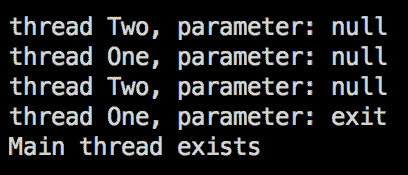
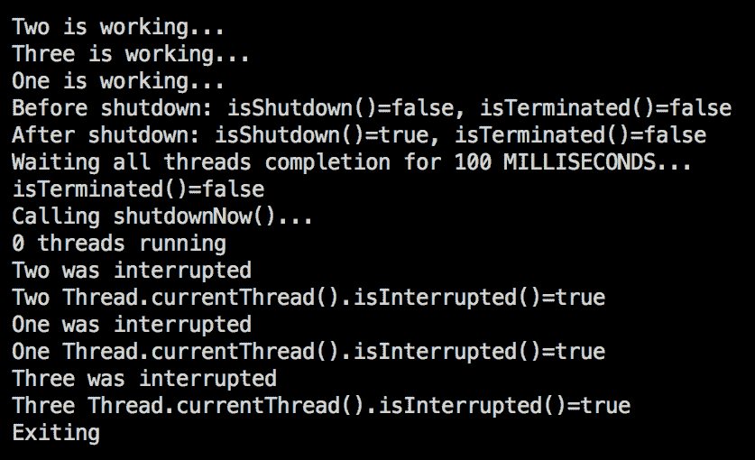
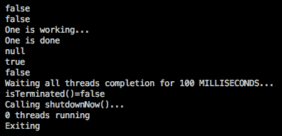
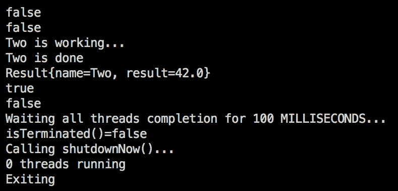
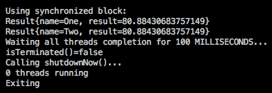

# 多线程和并发处理

在本章中，我们将讨论通过使用同时处理数据的工人（线程）来提高 Java 应用程序性能的方法。 我们将解释 Java 线程的概念并展示其使用情况。 我们还将讨论并行和并发处理之间的区别以及如何避免由共享资源的并发修改引起的不可预测结果。

本章将介绍以下主题：

*   线程 VS 过程
*   用户线程 vs 守护程序
*   扩展课程线程
*   实现界面`Runnable`
*   扩展线程 VS 实现`Runnable`
*   使用线程池
*   从线程获取结果
*   并行 VS 并发处理
*   并发修改相同资源

# 线程 VS 过程

Java 有两个执行过程和线程单位。 A **过程**通常代表整个 JVM，尽管应用程序可以使用`java.lang.ProcessBuilder`创建另一个进程。 但由于多进程案例超出本书的范围，我们将专注于第二个执行单位，即**线程**，其类似于一个过程，但从其他线程孤立 需要更少的资源来执行。

一个过程可以有许多线程运行，并且至少一个名为**主线程**的线程 - 启动应用程序的线程 - 我们在每个示例中使用它。 线程可以共享资源，包括内存和打开文件，允许更好的效率。 但它具有更高的非预期相互干扰甚至阻止执行的风险。 这就是需要编程技能和对并发技术的理解。

# 用户线程 vs 守护程序

有一种称为守护程序的特定线程。

守护进程有一个古希腊的原产地意义*神灵或超自然是神灵和人类之间的性质，*和*内在或伴随的精神或鼓舞力*。

在计算机科学中，术语**守护程序**具有更平凡的使用，并应用于作为后台过程运行的计算机程序，而不是在交互式用户的直接控制下。 这就是为什么 Java 中有以下两种类型的线程：

*   用户线程（默认）由应用程序发起（主线程是这样的示例）
*   在支持用户线程活动的后台工作的守护程序线程

这就是为什么所有守护程序线程在最后一个用户线程退出后立即退出或在未处理的异常之后被 JVM 终止。

# 扩展课程线程

创建线程的一种方法是扩展`java.lang.Thread`类并覆盖其`run()`方法。 例如：

```
class MyThread extends Thread {
    private String parameter;
    public MyThread(String parameter) {
        this.parameter = parameter;
    }
    public void run() {
        while(!"exit".equals(parameter)){
            System.out.println((isDaemon() ? "daemon" : "  user") +
              " thread " + this.getName() + "(id=" + this.getId() +
                                      ") parameter: " + parameter);
            pauseOneSecond();
        }
        System.out.println((isDaemon() ? "daemon" : "  user") +
          " thread " + this.getName() + "(id=" + this.getId() +
                                  ") parameter: " + parameter);
    }
    public void setParameter(String parameter) {
        this.parameter = parameter;
    }
}
```

如果未覆盖`run()`方法，则线程无效。 在我们的示例中，线程每秒打印其名称和其他属性，只要参数不等于 String `"exit"`; 否则退出。 `pauseOneSecond()`方法如下所示：

```
private static void pauseOneSecond(){
    try {
        TimeUnit.SECONDS.sleep(1);
    } catch (InterruptedException e) {
        e.printStackTrace();
    }
}
```

我们现在可以使用`MyThread`类来运行两个线程 - 一个用户线程和一个守护程序线程：

```
public static void main(String... args) {
    MyThread thr1 = new MyThread("One");
    thr1.start();
    MyThread thr2 = new MyThread("Two");
    thr2.setDaemon(true);
    thr2.start();
    pauseOneSecond();
    thr1.setParameter("exit");
    pauseOneSecond();
    System.out.println("Main thread exists");
}
```

如您所见，主线程创建其他两个线程，暂停一秒，在用户线程上设置参数`exit`，暂停另一秒钟，最后，退出（`main()`方法完成其执行）。

如果我们运行前面的代码，我们会看到类似于以下屏幕截图的内容（线程`id`在不同的操作系统中可能不同）：


前面的屏幕截图显示守护程序线程一旦上次用户线程（我们的示例中的主线程）退出。

# 实现界面 Runnable.

创建线程的第二种方法是使用实​​现`java.lang.Runnable`的类。 以下是这种类的示例，它几乎与`MyThread`类具有几乎与其相同的功能：

```
class MyRunnable implements Runnable {
    private String parameter, name;
    public MyRunnable(String name) {
        this.name = name;
    }
    public void run() {
        while(!"exit".equals(parameter)){
            System.out.println("thread " + this.name + 
                               ", parameter: " + parameter);
            pauseOneSecond();
        }
        System.out.println("thread " + this.name +
                              ", parameter: " + parameter);
    }
    public void setParameter(String parameter) {
        this.parameter = parameter;
    }
}
```

不同之处在于，没有`isDaemon()`方法，`getId()`或任何其他外箱方法。 `MyRunnable`类可以是实现`Runnable`界面的任何类，因此我们无法打印线程是否为守护程序。 这就是为什么我们添加了`name`属性，所以我们可以识别线程。

我们可以使用`MyRunnable`类来创建类似于我们使用的线程`MyThread`类：

```
public static void main(String... args) {
    MyRunnable myRunnable1 = new MyRunnable("One");
    MyRunnable myRunnable2 = new MyRunnable("Two");

    Thread thr1 = new Thread(myRunnable1);
    thr1.start();
    Thread thr2 = new Thread(myRunnable2);
    thr2.setDaemon(true);
    thr2.start();
    pauseOneSecond();
    myRunnable1.setParameter("exit");
    pauseOneSecond();
    System.out.println("Main thread exists");
}
```

以下屏幕截图证明了`MyRunnable`类的行为类似于`MyThread`类的行为：



守护程序线程（命名为`Two`）退出后最后一个用户线程 - 完全是如何与`MyThread`类发生的。

# 扩展线程 VS 实现可逃性

`Runnable`的实现具有优势（在某些情况下唯一可能的选项）允许实现扩展另一个类。 当您希望向现有类添加线程行为时，它特别有用。 实现`Runnable`允许更灵活的使用。 但否则，与`Thread`类的扩展相比，功能不差异。

`Thread`类有几个构造函数允许设置线程名称和所属的组。 分组线程有助于在许多并行运行的线程的情况下管理它们。 `Thread`类还具有多种方法，提供有关线程状态，其属性的信息，并允许控制其行为。

如上所见，线程的 ID 是自动生成的。 它无法更改，但可以在线程终止后重复使用。 另一方面，几个线程可以设置相同的名称。

也可以以编程方式以`Thread.MIN_PRIORITY`和`Thread.MAX_PRIORITY`之间的值以编程方式设置执行优先级。 值越小，允许线程运行的时间越多，这意味着它具有更高的优先级。 如果未设置，则优先级值默认为`Thread.NORM_PRIORITY`。

线程的状态可以具有以下值之一：

*   `NEW`：当线程尚未开始时
*   `RUNNABLE`：执行线程时
*   `BLOCKED`：当线程被阻止并等待显示器锁定时
*   `WAITING`：当线程无限期地等待另一个线程来执行特定的动作
*   `TIMED_WAITING`：当线程等待另一个线程来执行最多等待时间的动作
*   `TERMINATED`：当线程退出时

线程和任何对象的内容也可以使用`wait()`，`notify()`基类的方法`wait()`，`notify()`和`notifyAll()`互相交谈。 但是线程行为的这一方面超出了本书的范围。

# 使用线程池

每个线程都需要资源 - **cpu** 和**存储器**。 这意味着必须控制线程数，并且一种方法是创建一个固定数量的它们 - 一个池。 此外，创建一个对象会引起某些应用可能很重要的开销。

在本节中，我们将研究`Executor`界面及其在`java.util.concurrent`包中提供的实现。 它们封装了线程管理，并最大限度地减少了应用程序开发人员在编写与线程生命周期相关的代码上的时间。

`java.util.concurrent`包中定义了三个`Executor`接口：

*   基础`Executor`接口：它只有一个`void execute(Runnable r)`方法。

*   `ExecutorService` interface：它扩展了`Executor`并添加了四组方法，用于管理工作线程和执行程序本身的生命周期：
    *   `submit()`在队列中放置`Runnable`或`Callable`对象的方法（`Callable`允许 worker 线程返回值）; 返回`Future`界面的对象，可用于访问`Callable`返回的值，并管理工作线程的状态
    *   `invokeAll()`方法在队列中放置接口`Callable`对象的方法进行执行; 当所有工作线程完成时，返回`Future`对象的`List`（还有一个带超时的`invokeAll()`方法）
    *   `invokeAny()`方法在队列中放置接口`Callable`对象的方法进行执行; 返回任何已完成的 Working 线程的`Future`对象（还有一个带时间超载的`invokeAny()`方法）
    *   管理工作线程状态和服务本身的方法如下：
        *   `shutdown()`：防止新的工作线程提交给服务。
        *   `shutdownNow()`：中断未完成的每个工作线程。 应该写入工作线程，以便定期检查其自己的状态（例如，使用`Thread.currentThread().isInterrupted()`）并优雅地关闭自己; 否则，即使在调用`shutdownNow()`之后，它也会继续运行。
        *   `isShutdown()`：检查执行器是否已启动关闭。
        *   `awaitTermination(long timeout, TimeUnit timeUnit)`：等待，直到所有工作线程在关闭请求后完成执行，或者发生超时，或者当前线程被中断，首先发生这种情况。
        *   `isTerminated()`：检查启动关闭后是否已完成所有工作线程。 除非首先调用`shutdown()`或`shutdownNow()`，否则它永远不会返回`true`。

*   `ScheduledExecutorService`接口：它扩展了`ExecutorService`并添加了允许调度工作线程的执行（一次性和周期性的方法的方法。

可以使用`java.util.concurrent.ThreadPoolExecutor`或`java.util.concurrent.ScheduledThreadPoolExecutor`类创建`ExecutorService`的基于池的实现。 还有一个`java.util.concurrent.Executors`工厂类，涵盖了大部分实际情况。 因此，在编写 Worker 线程的池创建的自定义代码之前，我们强烈推荐使用`java.util.concurrent.Executors`类的以下工厂方法来研究：

*   `newCachedThreadPool()`创建一个线程池，该池根据需要根据需要添加新线程，除非存在以前创建的空闲线程; 已空闲 60 秒的线程将从池中删除
*   `newSingleThreadExecutor()`创建`ExecutorService`（pool）实例，其顺序执行工作线程
*   `newSingleThreadScheduledExecutor()`创建一个单线程执行器，可以调度在给定延迟之后运行或定期执行
*   `newFixedThreadPool(int nThreads)`创建一个线程池，可重用固定数量的工作线程; 如果在所有工作线程仍在执行时提交了新任务，则将放入队列中，直到有工作线程可用
*   `newScheduledThreadPool(int nThreads)`创建一个固定大小的线程池，其可以调度在给定延迟之后运行，或者定期执行
*   `newWorkStealingThreadPool(int nThreads)`创建使用*工作窃取`ForkJoinPool`使用的线程池的线程池，在 Worker 线程生成其他线程的情况下特别有用，例如在递归算法中; 它还适应指定的 CPU 数，您可以设置更高或低于计算机上的实际 CPU 数*

工作窃取算法

工作窃取算法允许完成分配任务的线程来帮助其他仍然忙于其分配的其他任务。 例如，请参阅官方 Oracle Java 文档中的 fork /加入实现的描述（ [https://docs.oracle.com/javase/tutorial/esential/concurrency/forkjoin.html](https://docs.oracle.com/javase/tutorial/essential/concurrency/forkjoin.html) ）。

这些方法中的每一种都具有超载版本，允许传递在用于在需要时创建新线程的`ThreadFactory`。 让我们看看如何在代码样本中工作。 首先，我们运行另一个版本的`MyRunnable`类：

```
class MyRunnable implements Runnable {
    private String name;
    public MyRunnable(String name) {
        this.name = name;
    }
    public void run() {
        try {
            while (true) {
                System.out.println(this.name + " is working...");
                TimeUnit.SECONDS.sleep(1);
            }
        } catch (InterruptedException e) {
            System.out.println(this.name + " was interrupted\n" +
                this.name + " Thread.currentThread().isInterrupted()="
                            + Thread.currentThread().isInterrupted());
        }
    }
}
```

我们不能使用`parameter`属性告知线程停止执行，因为线程生命周期现在将由`ExecutorService`控制，并且它通过调用`interrupt()`线程方法来实现它的方式。 另外，请注意，我们创建的线程具有无限循环，因此它永远不会停止执行，直到强制（通过调用`interrupt()`方法）。 让我们写下以下的代码：

1.  创造一个三个线程的池
2.  确保池不接受更多线程
3.  等待固定的时间段，让所有线程完成他们所做的事情
4.  停止（中断）没有完成他们所做的线的线程
5.  出口

以下代码执行前面列表中描述的所有操作：

```
ExecutorService pool = Executors.newCachedThreadPool();
String[] names = {"One", "Two", "Three"};
for (int i = 0; i < names.length; i++) {
    pool.execute(new MyRunnable(names[i]));
}
System.out.println("Before shutdown: isShutdown()=" + pool.isShutdown() 
                           + ", isTerminated()=" + pool.isTerminated());
pool.shutdown(); // New threads cannot be added to the pool
//pool.execute(new MyRunnable("Four"));    //RejectedExecutionException
System.out.println("After shutdown: isShutdown()=" + pool.isShutdown() 
                           + ", isTerminated()=" + pool.isTerminated());
try {
    long timeout = 100;
    TimeUnit timeUnit = TimeUnit.MILLISECONDS;
    System.out.println("Waiting all threads completion for "
                                + timeout + " " + timeUnit + "...");
    // Blocks until timeout, or all threads complete execution,
    // or the current thread is interrupted, whichever happens first.
    boolean isTerminated = pool.awaitTermination(timeout, timeUnit);
    System.out.println("isTerminated()=" + isTerminated);
    if (!isTerminated) {
        System.out.println("Calling shutdownNow()...");
        List<Runnable> list = pool.shutdownNow();
        System.out.println(list.size() + " threads running");
        isTerminated = pool.awaitTermination(timeout, timeUnit);
        if (!isTerminated) {
            System.out.println("Some threads are still running");
        }
        System.out.println("Exiting");
    }
} catch (InterruptedException ex) {
    ex.printStackTrace();
}
```

尝试在`pool.shutdown()`之后将另一个线程添加到池中，称为**生成** `java.util.concurrent.RejectedExecutionException`。

前面代码的执行产生以下结果：


注意前面的屏幕截图中的`Thread.currentThread().isInterrupted()=false`消息。 线程被中断了。 我们知道它是因为线程得到了`InterruptedException`。 为什么`isInterrupted()`方法返回`false`？ 这是因为在接收到中断消息后立即清除线程状态。 我们现在提到它，因为它是一些程序员错误的来源。 例如，如果主线程观看`MyRunnable`线程并在其上调用`isInterrupted()`，则返回值将是`false`，在线程中断之后可能会误导。

因此，在另一个线程可以监视`MyRunnable`线程的情况下，必须更改`MyRunnable`的实现（注意`catch`块中的调用方式）如何调用）：

```
class MyRunnable implements Runnable {
   private String name;
   public MyRunnable(String name) {
      this.name = name;
   }
   public void run() {
      try {
         while (true) {
             System.out.println(this.name + " is working...");
             TimeUnit.SECONDS.sleep(1);
         }
      } catch (InterruptedException e) {
         Thread.currentThread().interrupt();
         System.out.println(this.name + " was interrupted\n" +
           this.name + " Thread.currentThread().isInterrupted()="
                       + Thread.currentThread().isInterrupted());
      }
   }
}
```

现在，如果我们再次使用相同的`ExecutorService`池运行此线程，结果将是：



如您所见，现在`isInterrupted()`方法返回的值是`true`，并对应于发生的情况。 要公平，在许多应用程序中，一旦线程中断，它不会再次检查其状态。 但是设置正确的状态是一个很好的做法，尤其是在那些您不是创建线程的更高级别代码的作者的情况下。

在我们的示例中，我们使用了一个缓存的线程池根据需要创建新线程，或者如果可用，则重用已使用的线程，但完成其作业并返回到池进行新分配。 我们没有担心创造的太多线程，因为我们的演示应用程序最多有三个工人线程，因此它们很短。

但是，在应用程序没有的情况下，它可能需要的工作线程的固定限制，它可能需要或没有好方法来预测线程可能需要多少内存或者可以执行多长时间，在工作者线程上设置天花板 计数防止应用程序性能的意外劣化，内存不足，或者耗尽工作线程使用的任何其他资源。 如果线程行为是非常不可预测的，则单个线程池可能是唯一的解决方案，其中可选择使用自定义线程池执行器。 但在大多数情况下，固定尺寸的线程池执行器是应用需求和代码复杂性之间的良好实际妥协（本节早期，我们列出了由`Executors`出厂类创建的所有可能的池类型）。

将池的大小设置得太低可能剥夺应用程序有效地利用可用资源的机会。 因此，在选择池大小之前，建议使用一些时间监控应用程序，以确定应用程序行为的特征。 实际上，必须在整个应用程序的生命周期中重复循环部署监视器调整，以便容纳并利用代码或执行环境中发生的更改。

您考虑到的第一个特征是系统中的 CPU 数量，因此线程池大小至少可以与 CPU 的计数一样大。 然后，您可以监视应用程序，并查看每个线程与 CPU 的时间和使用其他资源的时间（例如 I / O 操作）的时间。 如果没有使用 CPU 的时间与线程的总执行时间相当，那么您可以通过以下比率增加池大小：时间 CPU 未使用除以总执行时间。 但是，在另一个资源（磁盘或数据库）不是线程之间的争用的主题的情况下。 如果后者是这种情况，那么您可以使用该资源而不是 CPU 作为划分因子。

假设应用程序的工人线程不是太大或太长的执行，并且属于典型工作线程的主流群，在合理短的时间内完成工作，可以通过添加（圆形向上）来增加池大小 ）期望响应时间的比率和线程使用 CPU 或其他最具争议资源的时间。 这意味着，通过相同的期望响应时间，线程越少使用 CPU 或另一个同时访问的资源，池大小应该是更大的。 如果有争议的资源有自己改进并发访问权限的能力（如数据库中的连接池），请首先考虑利用该功能。

如果在不同情况下运行的同时运行的线程数发生在运行时发生变化，则可以使池大小动态并创建一个具有新尺寸的新池（在所有线程完成后关闭旧池）。 在添加或删除可用资源后，也可能需要重新计算新池的大小。 例如，您可以使用`Runtime.getRuntime().availableProcessors()`以基于可用 CPU 的当前计数以编程方式调整池大小。

如果 jdk 与 jdk 的即用的线程池执行器实现实现了特定应用程序的需要，请在从头编写线程管理代码之前，尝试首先使用`java.util.concurrent.ThreadPoolExecutor`类。 它有几个过载的构造函数。

为了让您了解其功能，这里是具有最大数量的构造函数：

```
ThreadPoolExecutor (int corePoolSize, 
                    int maximumPoolSize, 
                    long keepAliveTime, 
                    TimeUnit unit, 
                    BlockingQueue<Runnable> workQueue, 
                    ThreadFactory threadFactory, 
                    RejectedExecutionHandler handler)
```

前面构造函数的参数如下：

*   `corePoolSize`是保持在池中的线​​程数，即使它们是空闲的，除非用`true`值调用`allowCoreThreadTimeOut(boolean value)`方法
*   `maximumPoolSize`是池中允许的最大线程数
*   `keepAliveTime`：当线程数大于核心时，这是超出空闲线程的最长时间将在终止之前等待新任务
*   `unit`是`keepAliveTime`参数的时间单位
*   `workQueue`是用于在执行之前持有任务的队列; 此队列将仅包含`execute()`方法提交的`Runnable`对象
*   `threadFactory`是在 executor 创建新线程时使用的工厂
*   `handler`是在禁止执行时使用的处理程序，因为达到了线程界限和队列容量

在创建`ThreadPoolExecutor`类的对象之外，还可以通过相应的 Somter 设置除`workQueue`之外的前一个构造函数参数中的每一个，从而允许更灵活性和动态调整现有池特性。

# 从线程获取结果

在我们的例子中，到目前为止，我们使用`ExecutorService`接口的`execute()`方法来启动线程。 实际上，这种方法来自`Executor`基础界面。 同时，`ExecutorService`界面具有其他方法（使用主题池部分中列出了可以启动线程并返回线程执行结果的池。

带回线程执行结果的对象是类型`Future` -an 接口，具有以下方法：

*   `V get()`：块直到线程完成; 返回结果（如果可用）
*   `V get(long timeout, TimeUnit unit)`：块直到线程饰面或提供的超时为 Up; 返回结果（如果有）
*   `boolean isDone()`：返回`true`如果线程已完成
*   `boolean cancel(boolean mayInterruptIfRunning)`：试图取消线程的执行; 返回`true`如果成功; 返回`false`在线程通常在调用方法时正常完成
*   `boolean isCancelled()`：如果在正常完成之前取消线程执行，则返回`true`

备注*如果可用*在`get()`方法的描述中，也意味着结果并不总是原则上可用的，即使在没有参数的`get()`方法时也是如此。 这一切都取决于用于生产`Future`对象的方法。 以下是`ExecutorService`返回`Future`对象的所有方法的列表：

*   `Future<?> submit(Runnable task)`：提交线程（任务）以执行; 返回代表任务的`Future`; `get()`返回`Future`对象的方法返回`null`; 例如，让我们使用仅工作 100 毫秒的`MyRunnable`类：

```
class MyRunnable implements Runnable {
   private String name;
   public MyRunnable(String name) {
     this.name = name;
   }
   public void run() {
     try {
         System.out.println(this.name + " is working...");
         TimeUnit.MILLISECONDS.sleep(100);
         System.out.println(this.name + " is done");
     } catch (InterruptedException e) {
         Thread.currentThread().interrupt();
         System.out.println(this.name + " was interrupted\n" +
           this.name + " Thread.currentThread().isInterrupted()="
                       + Thread.currentThread().isInterrupted());
     }
   }
}
```

并且，根据上一节的代码示例，让我们创建一个关闭池的方法，如有必要，请终止所有线程：

```
void shutdownAndTerminate(ExecutorService pool){
   try {
      long timeout = 100;
      TimeUnit timeUnit = TimeUnit.MILLISECONDS;
      System.out.println("Waiting all threads completion for "
                             + timeout + " " + timeUnit + "...");
      //Blocks until timeout or all threads complete execution, 
      //  or the current thread is interrupted, 
      //  whichever happens first.
      boolean isTerminated = 
                        pool.awaitTermination(timeout, timeUnit);
      System.out.println("isTerminated()=" + isTerminated);
      if (!isTerminated) {
          System.out.println("Calling shutdownNow()...");
          List<Runnable> list = pool.shutdownNow();
          System.out.println(list.size() + " threads running");
          isTerminated = pool.awaitTermination(timeout, timeUnit);
          if (!isTerminated) {
             System.out.println("Some threads are still running");
          }
          System.out.println("Exiting");
      }
   } catch (InterruptedException ex) {
      ex.printStackTrace();
   }
}
```

我们将在`finally`块中使用前面的`shutdownAndTerminate()`方法，以确保没有留下正在运行的线程。 以下是我们要执行的代码：

```
ExecutorService pool = Executors.newSingleThreadExecutor();

Future future = pool.submit(new MyRunnable("One"));
System.out.println(future.isDone());         //prints: false
System.out.println(future.isCancelled());    //prints: false
try{
    System.out.println(future.get());        //prints: null
    System.out.println(future.isDone());     //prints: true
    System.out.println(future.isCancelled());//prints: false
} catch (Exception ex){
    ex.printStackTrace();
} finally {
    shutdownAndTerminate(pool);
}
```

您可以在此屏幕截图上看到此代码的输出：



如预期的那样，`Future`对象的`get()`方法返回`null`，因为`run()`的`Runnable`的方法不会返回任何内容。 我们可以从返回的`Future`回来的只是任务完成的信息。

*   `Future<T> submit(Runnable task, T result)`：提交线程（任务）以执行; 返回一个`Future`表示与提供的`result`中的任务表示在其中; 例如，我们将根据结果使用以下类：

```
class Result {
    private String name;
    private double result;
    public Result(String name, double result) {
        this.name = name;
        this.result = result;
    }
    @Override
    public String toString() {
        return "Result{name=" + name +
                ", result=" + result + "}";
    }
}
```

以下代码演示了`submit()`方法返回的`Future`返回默认结果：

```
ExecutorService pool = Executors.newSingleThreadExecutor();
Future<Result> future = pool.submit(new MyRunnable("Two"), 
                                        new Result("Two", 42.));
System.out.println(future.isDone());          //prints: false
System.out.println(future.isCancelled());     //prints: false
try{
    System.out.println(future.get());         //prints: null
    System.out.println(future.isDone());      //prints: true
    System.out.println(future.isCancelled()); //prints: false
} catch (Exception ex){
    ex.printStackTrace();
} finally {
    shutdownAndTerminate(pool);
}
```

如果我们执行前面的代码，则输出将如下：



如预期的那样，`Future`的`get()`方法将传递作为参数的对象返回。

*   `Future<T> submit(Callable<T> task)`：提交线程（任务）以执行; 返回一个`Future`表示`Callable`界面的`V call()`方法生成和返回的结果; 这是唯一的`Callable`方法界面。 例如：

```
class MyCallable implements Callable {
   private String name;
   public MyCallable(String name) {
        this.name = name;
   }
   public Result call() {
      try {
         System.out.println(this.name + " is working...");
         TimeUnit.MILLISECONDS.sleep(100);
         System.out.println(this.name + " is done");
         return new Result(name, 42.42);
      } catch (InterruptedException e) {
         Thread.currentThread().interrupt();
         System.out.println(this.name + " was interrupted\n" +
           this.name + " Thread.currentThread().isInterrupted()="
                       + Thread.currentThread().isInterrupted());
      }
      return null;
   }
```

前面代码的结果如下：


如您所见，`Future`的`get()`方法返回`MyCallable`类的`call()`方法生成的值

*   `List<Future<T>> invokeAll(Collection<Callable<T>> tasks)`：执行所提供的集合的所有`Callable`任务; 返回由执行的`Callable`对象产生的结果的`Futures`列表
*   `List<Future<T>> invokeAll(Collection<Callable<T>>`：执行所提供的集合的所有`Callable`任务; 返回`Futures`的列表，由执行的`Callable`对象或超时到期结果，以首先发生的方式
*   `T invokeAny(Collection<Callable<T>> tasks)`：执行所提供的集合的所有`Callable`任务; 返回成功完成的结果（意味着，不抛出异常），如果有的话
*   `T invokeAny(Collection<Callable<T>> tasks, long timeout, TimeUnit unit)`：执行所提供的集合的所有`Callable`任务; 返回成功完成的结果（意味着，不抛出异常），如果此类可在提供的超时到期之前可用

如您所见，有很多方法可以从线程中获取结果。 您选择的方法取决于应用程序的特定需求。

# 并行 VS 并发处理

当我们听到同时执行的工作线程时，我们会自动假设他们实际上执行它们并行编程的操作。 只有在我们看在这样的系统的罩之后，我们认识到，只有当线程被不同的 CPU 执行线程时，才能实现这种并行处理。 否则，它们时间 - 共享相同的处理能力。 我们认为他们在同一时间工作，因为他们使用的时隙非常短，我们在日常生活中使用的时间单位的一小部分。 当线程共享相同的资源时，在计算机科学中，我们表示他们同时执行。

# 并发修改相同资源

两个或多个线程修改相同的值，而其他线程读取它是一个并发访问问题之一的最常规描述。 Subtler 问题包括**螺纹干扰**和**内存一致性**错误，这两种错误都会产生意外结果，看似良好的代码碎片。 在本节中，我们将展示这种情况和避免它们的方法。

乍一看，解决方案似乎非常简单：只允许一次一个线程修改/访问资源而这就是它。 但是如果访问需要很长时间，它会创建一个瓶颈，可能会消除具有许多并行工作的线程的优势。 或者，如果一个线程阻止访问一个资源，同时等待访问另一个资源，并且第二线程阻止访问第二资源的访问，同时等待访问第一资源，它会创建一个称为**死锁**的问题。 这些是程序员在使用多个线程时遇到的可能挑战的两个非常简单的示例。

首先，我们将重现由相同值的并发修改引起的问题。 让我们创建一个`Calculator`界面：

```
interface Calculator {
    String getDescription();
    double calculate(int i);
}
```

我们将使用`getDescription()`方法来捕获实现的描述。 这是第一个实现：

```
class CalculatorNoSync implements Calculator{
    private double prop;
    private String description = "Without synchronization";
    public String getDescription(){ return description; }
    public double calculate(int i){
        try {
            this.prop = 2.0 * i;
            TimeUnit.MILLISECONDS.sleep(i);
            return Math.sqrt(this.prop);
        } catch (InterruptedException e) {
            Thread.currentThread().interrupt();
            System.out.println("Calculator was interrupted");
        }
        return 0.0;
    }
}
```

如您所见，`calculate()`方法为`prop`属性分配新值，然后为其他（我们通过调用`sleep()`方法）进行模拟），然后计算分配给[的值的平方根 htg3]财产。 `"Without synchronization"`描述描述了每次`calculate()`方法的`prop`属性的值正在调用 - 没有任何协调或**同步**，因为在协调的情况下调用 当它们同时修改相同资源时，在线程之间。

我们现在将在两个线程之间共享此对象，这意味着`prop`属性将更新和同时使用。 所以需要某种线程同步`prop`属性，但我们已经决定我们的第一个实施不这样做。

以下是我们将在执行每个`Calculator`实现时使用的方法，我们将创建：

```
void invokeAllCallables(Calculator c){
    System.out.println("\n" + c.getDescription() + ":");
    ExecutorService pool = Executors.newFixedThreadPool(2);
    List<Callable<Result>> tasks = List.of(new MyCallable("One", c), 
                                           new MyCallable("Two", c));
    try{
        List<Future<Result>> futures = pool.invokeAll(tasks);
        List<Result> results = new ArrayList<>();
        while (results.size() < futures.size()){
            TimeUnit.MILLISECONDS.sleep(5);
            for(Future future: futures){
                if(future.isDone()){
                    results.add((Result)future.get());
                }
            }
        }
        for(Result result: results){
            System.out.println(result);
        }
    } catch (Exception ex){
        ex.printStackTrace();
    } finally {
        shutdownAndTerminate(pool);
    }
}
```

如您所见，前面的方法执行以下操作：

*   打印通过 in `Calculator`实现的描述
*   为两个线程创建固定尺寸的池
*   创建两个`Callable`任务的列表 - 以下`MyCallable`类的对象：

```
class MyCallable implements Callable<Result> {
    private String name;
    private Calculator calculator;
    public MyCallable(String name, Calculator calculator) {
        this.name = name;
        this.calculator = calculator;
    }
    public Result call() {
        double sum = 0.0;
        for(int i = 1; i < 20; i++){
            sum += calculator.calculate(i);
        }
        return new Result(name, sum);
    }
}
```

*   任务列表已传递到池的`invokeAll()`方法，其中通过调用`call()`方法执行每个任务; 每个`call()`方法将传递的`Calculator`对象的`calculate()`方法应用于从 1 到 20 的 19 个数字中的每一个并总结结果; 结果总和在`Result`对象内返回以及`MyCallable`对象的名称

*   每个`Result`对象最终返回在`Future`对象内
*   然后，`invokeAllCallables()`方法在`Future`对象的列表中迭代，如果任务完成，则检查它们中的每一个; 完成任务时，结果将添加到`List<Result> results`
*   完成所有任务后，然后`invokeAllCallables()`方法打印`List<Result> results`的所有元素并终止池

以下是我们从我们的运行之一获得的结果：


每次运行前面的代码时，实际数字略有不同，但任务`One`的结果永远不会等于任务的结果`Two`。 这是因为在设置`prop`字段的值和`calculate()`方法中返回其平方根之间的时期，另一个线程被管理到为`prop`分配不同的值。 这是线程干扰的情况。

有几种方法可以解决这个问题。 我们从原子变量开始作为实现对属性的线程安全并发访问的方法。 然后我们还将演示两种线程同步方法。

# 原子变量

**原子变量**是才能仅在其当前值与预期的值匹配时更新。 在我们的情况下，如果通过另一个线程更改，则表示不应使用`prop`值。

`java.util.concurrent.atomic`包具有十几个类，支持此逻辑：`AtomicBoolean`，`AtomicInteger`，`AtomicReference`和`AtomicIntegerArray`，命名为几个。 这些类中的每一个都有许多方法可用于不同的同步需求。 检查每个类的 Online API 文档（ [https://docs.oracle.com/en/java/javase/12/docs/api/java.base/java/util/concurrent/atomic/package- 摘要.ht](https://docs.oracle.com/en/java/javase/12/docs/api/java.base/java/util/concurrent/atomic/package-summary.html) [ml](https://docs.oracle.com/en/java/javase/12/docs/api/java.base/java/util/concurrent/atomic/package-summary.html) ）。 对于演示，我们将仅使用所有这些方法：

*   `V get()`：返回当前值
*   `boolean compareAndSet(V expectedValue, V newValue)`：如果当前值通过运算符（`==`）将值设置为`newValue` `expectedValue`; 如果成功或`false`如果实际值不等于预期值，则返回`true`

以下是如何使用`AtomicReference`类来解决`Calculator`对象的`prop`属性的情况下使用这两种方法来解决`prop`对象的干扰问题：

```
class CalculatorAtomicRef implements Calculator {
    private AtomicReference<Double> prop = new AtomicReference<>(0.0);
    private String description = "Using AtomicReference";
    public String getDescription(){ return description; }
    public double calculate(int i){
        try {
            Double currentValue = prop.get();
            TimeUnit.MILLISECONDS.sleep(i);
            boolean b = this.prop.compareAndSet(currentValue, 2.0 * i);
            //System.out.println(b);    //prints: true for one thread 
                                        //and false for another thread
            return Math.sqrt(this.prop.get());
        } catch (InterruptedException e) {
            Thread.currentThread().interrupt();
            System.out.println("Calculator was interrupted");
        }
        return 0.0;
    }
}
```

如您所见，前面的代码确保`prop`属性的`currentValue`在线程睡眠时不会更改。 以下是我们运行`invokeAllCallables(new CalculatorAtomicRef())`时产生的消息的屏幕截图：


现在由线程产生的结果是相同的。

以下类`java.util.concurrent`包提供同步支持：

*   `Semaphore`：限制可以访问资源的线程数
*   `CountDownLatch`：允许一个或多个线程等待，直到在其他线程中执行的一组操作完成
*   `CyclicBarrier`：允许一组线程等待彼此达到共同的阻挡点
*   `Phaser`：提供更灵活的屏障形式，可用于控制多个线程之间的相位计算
*   `Exchanger`：允许两个线程在会集合点处交换对象，并在几个管道设计中有用

# 同步方法

解决问题的另一种方法是使用同步方法。 以下是使用这种解决线程干扰方法的`Calculator`接口的另一个实现：

```
class CalculatorSyncMethod implements Calculator {
    private double prop;
    private String description = "Using synchronized method";
    public String getDescription(){ return description; }
    synchronized public double calculate(int i){
        try {
            this.prop = 2.0 * i;
            TimeUnit.MILLISECONDS.sleep(i);
            return Math.sqrt(this.prop);
        } catch (InterruptedException e) {
            Thread.currentThread().interrupt();
            System.out.println("Calculator was interrupted");
        }
        return 0.0;
    }
}
```

我们刚刚在`calculate()`方法前面添加了`synchronized`关键字。 现在，如果我们运行`invokeAllCallables(new CalculatorSyncMethod())`，两个线程的结果总是相同的：


这是因为另一个线程无法进入同步方法，直到当前线程（已经输入的方法）退出它。 这可能是最简单的解决方案，但如果该方法需要很长时间，这种方法可能会导致性能下降。 在这种情况下，可以使用同步块，该块仅在原子操作中仅包裹多行代码。

# 同步块

以下是用于解决线程干扰问题的同步块的示例：

```
class CalculatorSyncBlock implements Calculator {
    private double prop;
    private String description = "Using synchronized block";
    public String getDescription(){
        return description;
    }
    public double calculate(int i){
        try {
            //there may be some other code here
            synchronized (this) {
                this.prop = 2.0 * i;
                TimeUnit.MILLISECONDS.sleep(i);
                return Math.sqrt(this.prop);
            }
        } catch (InterruptedException e) {
            Thread.currentThread().interrupt();
            System.out.println("Calculator was interrupted");
        }
        return 0.0;
    }
}
```

如您所见，同步块会在`this`对象上获取锁，该对象由两个线程共享，并仅在线程退出块后释放它。 在我们的演示代码中，块涵盖了方法的所有代码，因此性能没有差异。 但是，想象方法中有更多的代码（我们评论了`there may be some other code here`的位置）。 如果是这种情况，则代码的同步部分较小，因此具有较少的机会成为瓶颈。

如果我们运行`invokeAllCallables(new CalculatorSyncBlock())`，结果如下：



正如您所看到的，结果与前两个示例完全相同。 在`java.util.concurrent.locks`封装中组装了不同需求和具有不同行为的不同类型的锁。

Java 中的每个对象继承了来自基础对象的`wait()`，`notify()`和`notifyAll()`方法。 这些方法还可用于控制线程的行为及其对锁的访问。

# 并发集合

解决并发性的另一种方法是使用从`java.util.concurrent`包中的线程安全集合。 在选择要使用的集合之前，请阅读 *javadoc* （ [https://docs.oracle.com/en/java/javase/12/docs/api/index.html](https://docs.oracle.com/en/java/javase/12/docs/api/index.html) ） 要查看收集的限制是否可接受您的应用程序。 以下是这些集合的列表和一些建议：

*   `ConcurrentHashMap<K,V>`：支持检索的完整并发性和高预期的更新并发; 在并发要求非常苛刻时使用它，并且需要允许锁定写入操作但不需要锁定元素。
*   `ConcurrentLinkedQueue<E>`：基于链接节点的线程安全队列; 采用有效的非阻塞算法。
*   `ConcurrentLinkedDeque<E>`：基于链接节点的并发队列; 当许多线程共享对公共集合的访问时，都是适当的选择。
*   `ConcurrentSkipListMap<K,V>`：并发`ConcurrentNavigableMap`接口实现。
*   `ConcurrentSkipListSet<E>`：基于`ConcurrentSkipListMap`的并发`NavigableSet`实现。 根据 *javadoc* ，`ConcurrentSkipListMap`，`ConcurrentSkipListMap`，*，*提供包含，添加和删除操作及其变体的预期平均日志（n）时间成本。 升序有序视图和其迭代器比下降率更快*; 当您需要以某个顺序快速迭代时使用它们时使用它们。*
*   `CopyOnWriteArrayList<E>`：`ArrayList`的线程安全变体，其中通过制作底层阵列的新副本来实现所有突变操作（添加，设置等）; 根据 *javadoc* ，`CopyOnWriteArrayList`类*通常的昂贵，但可能比遍历遍历突变突变时的替代方案更有效，并且当您不能或不想要时都很有用 同步遍历，但需要排除并发线程之间的干扰*; 当您不需要在不同位置添加新元素时使用它，并且不需要排序; 否则，使用`ConcurrentSkipListSet`。
*   `CopyOnWriteArraySet<E>`：一个用于所有操作的内部`CopyOnWriteArrayList`的集合。

*   `PriorityBlockingQueue`：当自然秩序是可接受的时，它是一个更好的选择，并且您需要快速地增加元素，并从队列的头部快速移除元素; 阻止**意味着当检索元素时，队列等待在队列时等待空间在队列中可用时变为非空。**
*   `ArrayBlockingQueue`，`LinkedBlockingQueue`和`LinkedBlockingDeque`具有固定尺寸（有界）; 其他队列无限制。

使用这些和类似的特征和建议与指南一样，但在实现功能之前和之后执行全面的测试和性能测量。 要演示其中一些集合能力，让我们使用`CopyOnWriteArrayList<E>`。 首先，让我们来看看`ArrayList`在尝试同时修改它时的行为方式：

```
List<String> list = Arrays.asList("One", "Two");
System.out.println(list);
try {
    for (String e : list) {
        System.out.println(e);  //prints: One
        list.add("Three");      //UnsupportedOperationException
    }
} catch (Exception ex) {
    ex.printStackTrace();
}
System.out.println(list);       //prints: [One, Two]

```

正如预期的那样，尝试在它迭代时修改列表生成异常，并且列表保持未修改。

现在，让我们在同样的情况下使用`CopyOnWriteArrayList<E>`：

```
List<String> list = 
             new CopyOnWriteArrayList<>(Arrays.asList("One", "Two"));
System.out.println(list);
try {
    for (String e : list) {
        System.out.print(e + " "); //prints: One Two
        list.add("Three");         //adds element Three
    }
} catch (Exception ex) {
    ex.printStackTrace();
}
System.out.println("\n" + list);   //prints: [One, Two, Three, Three]

```

该代码的输出产生如下：


如您所见，列表已被修改，而无需异常，但不是当前迭代的副本。 这是您可以在需要时使用的行为。

# 解决内存一致性错误

内存一致性错误可以在多线程环境中具有多种形式和原因。 它们在`java.util.concurrent`封装的 *javadoc* 中讨论了它们。 在这里，我们只会提到最常见的情况，这是由于缺乏可见性而引起的。

当一个线程更改属性值时，另一个图片可能无法立即看到更改，并且无法使用同步关键字以获取原始类型。 在这种情况下，请考虑使用`volatile`关键字进行属性; 它保证了不同线程之间的读/写可见性。

并发问题不易解决。 这就是为什么越来越多的开发人员现在采取更激进的方法并不奇怪。 它们更喜欢在一组无状态操作中处理数据。 我们将看到[第 13 章](13.html)，*功能编程*和[第 14 章](14.html)， *Java 标准流*中这样的代码的示例。 似乎 Java 和许多现代语言和计算机系统都在这种方向发展。

# 概括

在本章中，我们讨论了多线程处理，组织它的方法，避免由共享资源的并发修改引起的不可预测结果。 我们已经显示了读者如何使用线程池创建线程并执行它们。 我们还表明了如何从已成功完成的线程中提取结果，并讨论并行处理之间的差异和并行处理。

在下一章中，我们将提供更深入了解 JVM，其结构和流程的读者，并详细讨论了使内存溢出的垃圾收集过程。 到本章末尾，读者将知道什么构成 Java 应用程序执行，JVM 中的 Java 进程，JVM，垃圾收集以及 JVM 如何工作。

# 测验

1.  选择所有正确的陈述：
    1.  JVM 过程可以具有主线程
    2.  主线程是主要过程
    3.  一个过程可以发射另一个进程
    4.  线程可能会启动另一个线程

2.  选择所有正确的陈述：
    1.  守护程序是用户线程
    2.  在第一个用户线程完成后退出守护程序线程
    3.  最后一个用户线程完成后守护程序线程退出
    4.  主线程是用户线程

3.  选择所有正确的陈述：
    1.  所有线程都具有`java.lang.Thread`作为基类
    2.  所有线程都延伸`java.lang.Thread`
    3.  所有线程都实现`java.lang.Thread`
    4.  守护程序线程不会扩展`java.lang.Thread`

4.  选择所有正确的陈述：
    1.  任何类都可以实现`Runnable`界面
    2.  `Runnable`界面实现是一个线程
    3.  线程使用`Runnable`接口实现
    4.  `Runnable`界面只有一种方法

5.  选择所有正确的陈述：
    1.  线程名称必须是唯一的
    2.  线程 ID 自动生成
    3.  可以设置线程名称
    4.  可以设置线程优先级

6.  选择所有正确的陈述：
    1.  线程池执行线程
    2.  线程池重用线程
    3.  某些线程池可以具有固定的线程计数
    4.  某些线程池可以具有无限制的线程计数

7.  选择所有正确的陈述：
    1.  `Future`对象是从线程获取结果的唯一方法
    2.  `Callable`对象是从线程获取结果的唯一方法
    3.  `Callable`对象允许从线程获取结果
    4.  `Future`对象表示一个线程

8.  选择所有正确的陈述：
    1.  并行处理可以并行完成
    2.  并行处理只有计算机上可用的几个 CPU 或核心
    3.  并行处理是并发处理
    4.  没有多个 CPU，并发处理是不可能的

9.  选择所有正确的陈述：
    1.  并发修改始终导致不正确的结果
    2.  原子变量免受并发修改的保护
    3.  原子变量保护属性​​免受螺纹干扰
    4.  原子变量是保护属性免受并发修改的唯一方法

10.  选择所有正确的陈述：
    1.  同步方法是避免线程干扰的最佳方法
    2.  `synchronized`关键字可以应用于任何方法
    3.  同步方法可以创建处理瓶颈
    4.  同步方法易于实现

11.  选择所有正确的陈述：
    1.  同步块仅在小于方法时都是有道理的
    2.  同步块需要共享锁定
    3.  每个 Java 对象都可以提供锁定
    4.  同步块是避免线程干扰的最佳方法

12.  选择所有正确的陈述：
    1.  使用并发集合是优选的，而不是使用非并发彼此
    2.  使用并发系列会引发一些开销
    3.  不是每个并发系列都适合每个并发处理方案
    4.  可以通过调用`Collections.makeConcurrent()`方法创建并发集合

13.  选择所有正确的陈述：
    1.  避免内存一致性错误的唯一方法是声明`volatile`变量
    2.  使用`volatile`关键字保证所有线程的值更改的可见性
    3.  避免并发性的方法之一是避免任何国家管理
    4.  无状态实用程序方法不能具有并发问题