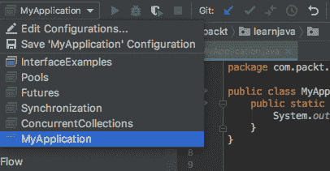
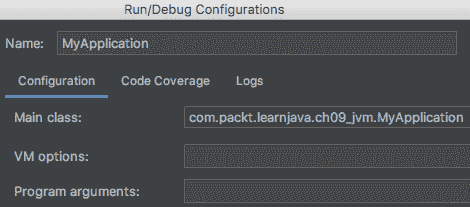
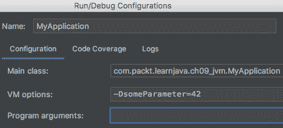

# JVM 结构和垃圾收集

本章提供了读者概述 **Java 虚拟机**（ **JVM** ）结构和行为，这些结构和行为比您可能期望的更复杂。

JVM 只是根据编码逻辑的说明执行程序。 它还发现并加载到应用程序请求的`.class`文件中，验证它们，解释字节码（即，它将它们转换为特定于平台的二进制代码），并将生成的二进制代码传递给中央处理器（ 或处理器）执行。 除了应用程序线程之外，它使用多个服务线程。 其中一个服务线程，称为**垃圾收集**（ **gc** ）执行从未使用对象释放内存的重要任务。

阅读本章后，读者更好地了解 Java 应用程序执行，JVM，GC 中的 Java 进程以及 JVM 如何工作。

本章将介绍以下主题：

*   Java 应用程序执行
*   Java 流程
*   JVM 结构
*   垃圾收集

# Java 应用程序执行

在更深入地进入 JVM 工作原理，让我们回顾如何运行应用程序，记住以下语句用作同义词：

*   运行/执行/启动主类
*   运行/执行/启动主要方法
*   运行/执行/启动/启动应用程序
*   运行/执行/启动/启动 JVM 或 Java 进程

还有几种方法可以做到这一点。 在[第 1 章](01.html)，*使用 java 12* ，我们向您展示了如何使用 intellij 思想运行`main(String[])`方法。 在本章中，我们只会重复一些已经说过的东西，并添加了对您有用的其他变化。

# 使用 IDE

任何 IDE 允许运行`main()`方法。 在 Intellij Idea 中，它可以三种方式完成：

*   单击`main()`方法名称旁边的绿色三角形：


*   执行了使用绿色三角形的`main()`方法至少一次，类的名称将添加到下拉菜单（在顶线上，到绿色三角形的左侧）：



选择它，然后单击菜单右侧的绿色三角形：


*   打开“运行”菜单，然后选择类的名称。 选择几个不同的选项：


在上一个屏幕截图中，您还可以看到编辑配置的选项....它可以用于在开始和其他选项中设置传递给`main()`方法的程序参数：



VM 选项字段允许设置`java`命令选项。 例如，如果输入`-Xlog:gc`，则 IDE 将形成以下`java`命令：

```
java -Xlog:gc -cp . com.packt.learnjava.ch09_jvm.MyApplication
```

`-Xlog:gc`选项需要显示 GC 日志。 我们将在下一节中使用此选项来展示 GC 如何工作。 `-cp .`选项（ **cp** 代表 **classpath** 表示该类位于从当前目录启动的文件树的文件夹中（输入命令的文件 ）。 在我们的情况下，`.class`文件位于`com/packt/learnjava/ch09_jvm`文件夹中，其中`com`是当前目录的子文件夹。 类路径可以包括许多位置，其中 JVM 必须查找应用程序执行所需的`.class`文件。

对于此演示，让我们设置 VM 选项，如下所示：



程序参数字段允许在`java`命令中设置参数。 例如，让我们在此字段中设置`one two three`：


此设置将导致以下`java`命令：

```
java -DsomeParameter=42 -cp . \
       com.packt.learnjava.ch09_jvm.MyApplication one two three
```

我们可以在`main()`方法中读取这些参数：

```
public static void main(String... args){
    System.out.println("Hello, world!"); //prints: Hello, world!
    for(String arg: args){
        System.out.print(arg + " ");     //prints: one two three
    }
    String p = System.getProperty("someParameter");
    System.out.println("\n" + p);        //prints: 42
}
```

“编辑配置”屏幕上的另一种可能的设置在“环境变量”字段中：


这是设置可以使用`System.getenv()`从应用程序访问的环境变量的方法。 例如，让我们设置环境变量`x`和`y`如下：


如果如前面的屏幕截图所示，则可以不仅在`main()`方法中，但使用`System.getenv("varName")`方法在应用程序中的任何位置，可以读取`x`和`y`的值。 在我们的情况下，可以如下检索`x`和`y`的值：

```
String p = System.getenv("x");
System.out.println(p);                  //prints: 42
p = System.getenv("y");
System.out.println(p);                  //prints: 43

```

`java`命令也可以在编辑配置屏幕上设置其他参数。 我们鼓励您在该屏幕上花一些时间并查看可能的选项。

# 使用具有类的命令行

现在让我们从命令行运行`MyApplication`。 要提醒您，主类外观如下：

```
package com.packt.learnjava.ch09_jvm;
public class MyApplication {
    public static void main(String... args){
        System.out.println("Hello, world!"); //prints: Hello, world!
        for(String arg: args){
            System.out.print(arg + " ");     //prints all arguments
        }
        String p = System.getProperty("someParameter");
        System.out.println("\n" + p);    //prints someParameter set
                                         // as VM option -D
    }
}
```

首先，必须使用`javac`命令编译。 命令行看起来如下所示（如果您在项目的根目录中打开终端窗口，则在`pom.xml`所在的文件夹中）：

```
javac src/main/java/com/packt/learnjava/ch09_jvm/MyApplication.java
```

这适用于 Linux 型平台。 在 Windows 上，命令看起来类似：

```
javac src\main\java\com\packt\learnjava\ch09_jvm\MyApplication.java
```

编译的`MyApplication.class`文件与`MyApplication.java`放在同一文件夹中。 现在我们可以使用`java`命令执行编译类：

```
java -DsomeParameter=42 -cp src/main/java \
           com.packt.learnjava.ch09_jvm.MyApplication one two three
```

请注意，`-cp`指向文件夹`src/main/java`（路径相对于当前文件夹），其中主类的包开始。 结果是：


如果应用程序使用位于不同文件夹中的其他`.class`文件，则可以在`-cp`选项之后列出到这些文件夹（相对于当前文件夹）的所有路径，由冒号分离（`:`）。 例如：

```
java -cp src/main/java:someOtherFolder/folder \
                        com.packt.learnjava.ch09_jvm.MyApplication
```

请注意，使用`-cp`选项列出的文件夹可以包含任意数量的`.class`文件。 这样，JVM 可以找到它需要的东西。 例如，让我们在其中的`ExampleClass`课程中创建一个子包`example`，其中：

```
package com.packt.learnjava.ch09_jvm.example;
public class ExampleClass {
    public static int multiplyByTwo(int i){
        return 2 * i;
    }
}
```

现在让我们在`MyApplication`类中使用它：

```
package com.packt.learnjava.ch09_jvm;
import com.packt.learnjava.ch09_jvm.example.ExampleClass;
public class MyApplication {
    public static void main(String... args){
        System.out.println("Hello, world!"); //prints: Hello, world!
        for(String arg: args){
            System.out.print(arg + " ");    
        }
        String p = System.getProperty("someParameter");
        System.out.println("\n" + p);  //prints someParameter value

        int i = ExampleClass.multiplyByTwo(2);
        System.out.println(i);               
    }
}
```

我们将使用相同的`MyApplication` class 与之前使用相同的`javac`命令：

```
javac src/main/java/com/packt/learnjava/ch09_jvm/MyApplication.java
```

结果是以下错误：


这意味着编译器找不到`ExampleClass.class`文件。 我们需要编译它并放在类路径上：

```
javac src/main/java/com/packt/learnjava/ch09_jvm/example/ExampleClass.java
javac -cp src/main/java \
 src/main/java/com/packt/learnjava/ch09_jvm/MyApplication.java
```

正如您所看到的，我们已添加`ExampleClass.class`的位置，该位置是`src/main/java`，对类路径。 现在我们可以执行`MyApplication.class`：

```
java -cp src/main/java com.packt.learnjava.ch09_jvm.MyApplication
```

结果如下：


无需列出包含 **Java 类库**（ **JCL** ）类的文件夹。 JVM 知道在哪里找到它们。

# 使用带 jar 文件的命令行

将文件夹中的编译文件保存为`.class`文件并不总是方便，尤其是当同一框架的许多编译文件属于不同的包时，并且分为单个库。 在这种情况下，编译的`.class`文件通常在`.jar`文件中一起存档在一起。 这种存档的格式与`.zip`文件的格式相同。 唯一的区别是`.jar`文件还包括一个清单文件，其中包含描述存档的元数据（我们将更多地讨论下一节中的清单）。

要演示如何使用它，请使用以下命令，让我们使用`ExampleClass.class`文件和其他`.jar`文件中的`.jar`文件与`MyApplication.class`一起创建`.jar`文件：

```
cd src/main/java
jar -cf myapp.jar com/packt/learnjava/ch09_jvm/MyApplication.class
jar -cf example.jar \
 com/packt/learnjava/ch09_jvm/example/ExampleClass.class
```

请注意，我们需要在文件夹中运行`jar`命令，其中包含`.class`文件的包。

现在我们可以按如下方式运行应用程序：

```
java -cp myapp.jar:example.jar \
 com.packt.learnjava.ch09_jvm.MyApplication
```

`.jar`文件位于当前文件夹中。 如果我们想从另一个文件夹执行应用程序（让我们返回根目录，`cd ../../..`），命令应该如下所示：

```
java -cp src/main/java/myapp.jar:src/main/java/example.jar \
 com.packt.learnjava.ch09_jvm.MyApplication
```

请注意，每个`.jar`文件必须单独列出类路径。 只需指定所有`.jar`文件所在的文件夹（与`.class`文件的情况一样）不够好。 如果文件夹仅包含`.jar`文件，则所有这些文件都可以包含在类路径中，如下所示：

```
java -cp src/main/java/* com.packt.learnjava.ch09_jvm.MyApplication
```

如您所见，通配符符号必须在文件夹名称后添加。

# 使用具有可执行 jar 文件的命令行

可以避免在命令行中指定主类。 相反，我们可以创建一个可执行的`.jar`文件。 它可以通过放置主类的名称 - 您需要运行的名称，并包含`main()`方法 - 进入清单文件。 以下是步骤：

1.  创建文本文件，`manifest.txt`（名称实际上无关紧要，但此名称使得意图清除），其中包含以下行：

```
 Main-Class: com.packt.learnjava.ch09_jvm.MyApplication 
```

结肠（`:`）后必须有一个空间，并且必须在最后有一个看不见的换行符符号，因此请确保已按下*输入*键，光标已跳转到开头 下一行。

2.  执行命令：

```
cd src/main/java 
jar -cfm myapp.jar manifest.txt com/packt/learnjava/ch09_jvm/*.class \ 
 com/packt/learnjava/ch09_jvm/example/*.class

```

注意`jar`命令选项（`fm`）的序列和以下文件的序列：`myapp.jar manifest.txt`。 它们必须是相同的，因为`f`代表文件，`jar`命令将创建，而`m`代表清单源。 如果您将选项包含为`mf`，则必须将文件列为`manifest.txt myapp.jar`。

3.  现在我们可以使用以下命令运行应用程序：

```
java -jar myapp.jar 
```

创建可执行文件`.jar`文件的另一种方法是更容易的：

```
jar cfe myjar.jar com.packt.learnjava.ch09_jvm.MyApplication \
 com/packt/learnjava/ch09_jvm/*.class       \ 
 com/packt/learnjava/ch09_jvm/example/*.class
```

此命令为自动生成具有指定的主类名称的清单：选项`c`代表**创建一个新的存档**，选项`f`表示**归档文件名**，以及选项`e` 表示**应用程序入口点**。

# Java 流程

正如您可能已经猜到的那样，JVM 对 Java 语言和源代码的任何东西都不了解。 它只知道如何阅读字节码。 它从`.class`文件中读取字节码和其他信息，将字节（解释）转换为特定于当前平台的二进制代码指令序列（其中 JVM 正在运行），并将结果的二进制代码传递给执行它的微处理器 。 在谈论这种转变时，程序员通常将其称为 **java** **处理**，或只是**过程**。

JVM 通常称为 **JVM 实例**。 即，由于每次执行`java`命令，启动了一个新的 JVM 实例，专用于将特定应用程序运行为具有自己的分配内存的单独进程（内存的大小被设置为默认值或传递） 作为命令选项）。 在此 Java 进程中，多个线程正在运行，每个线程都有自己的分配内存。 有些是由 JVM 创建的服务线程; 其他是由应用程序创建和控制的应用程序线程。

这是执行编译代码的 JVM 的大图片。 但是，如果您仔细观察并读取 JVM 规范，则会发现 Word *处理与 JVM 相关的*也用于描述 JVM 内部过程。 JVM 规范标识了在 JVM 内部运行的其他几个进程，程序员通常未提及，除了可能**类加载过程**。

这是因为大多数情况下，我们可以在不知道内部 JVM 进程的任何内容的情况下成功编写和执行 Java 程序。 但是，偶尔，对 JVM 的内部工作的一些普遍了解有助于确定某些问题的根本原因。 这就是为什么在本节中，我们将在 JVM 内部发生的所有进程提供简短的概述。 然后，在以下部分中，我们将更详细地讨论 JVM 的内存结构和其功能的其他方面，这些方面可能对程序员有用。

有两个子系统运行所有 JVM 内部进程：

*   **classloader** ：读取`.class`文件，并使用类相关的数据填充 JVM 内存中的方法区域：
    *   静态字段
    *   方法字节码
    *   描述类的类元数据
*   **执行引擎**：使用以下执行字节码：
    *   对象实例化的堆区域
    *   Java 和 Native 方法堆栈，用于跟踪调用的方法
    *   一个回收内存的垃圾收集过程

在主 JVM 过程中运行的进程包括以下内容：

*   ClassLoader 执行的进程包括以下内容：
    *   班级装载
    *   类链接
    *   类初始化
*   执行引擎执行的进程包括以下内容：
    *   班级实例化
    *   方法执行
    *   垃圾收集
    *   应用终止

JVM 架构

JVM 架构可以描述为具有两个子系统： **classloader** 和**执行引擎**，它使用运行时数据存储区域运行服务进程和应用程序线程 作为方法区域，堆和应用程序线程堆栈。 **线程**是轻量级过程，需要比 JVM 执行过程更少的资源分配。

该列表可能会为您提供这些进程顺序执行的印象。 在某种程度上，如果我们只是谈论一个课程，这是真的。 在加载之前无法使用类进行任何操作。 在完成所有先前的进程完成后，才能开始执行方法。 但是，例如，GC 不会在使用对象停止后立即发生（参见*垃圾收集*部分）。 此外，应用程序可以在未处理的异常或其他错误发生时退出任何时间。

仅由 JVM 规范调节 ClassLoader 进程。 执行引擎实现主要由每个供应商自行决定。 它基于语言语义和实现作者设置的性能目标。

执行引擎的进程处于未被 JVM 规范监控的域。 有常识，传统，已知和经过验证的解决方案，以及可以指导 JVM 供应商的实施决策的 Java 语言规范。 但没有单一的监管文件。 好消息是，最受欢迎的 JVMS 使用类似的解决方案，或者至少是它看起来如何看待高水平。

考虑到这一点，让我们更详细地讨论先前列出的七个过程中的每一个。

# 班级装载

根据 JVM 规范，加载阶段包括由其名称（在类路径上列出的位置中的名称中找到`.class`文件，并在内存中创建其表示。

要加载的第一类是在命令行中传递的一类，其中包含`main(String[])`方法。 ClassLoader 读取`.class`文件，解析它，并使用静态字段和方法字节填充方法区域。 它还创建了描述类的`java.lang.Class`的实例。 然后，ClassLoader 链接类（请参阅 *class 链接*部分），初始化它（请参阅*初始化*部分），然后将其传递给执行引擎以运行其字节码。

`main(String[])`方法是应用程序的入口门。 如果它调用另一个类的方法，则必须在类路径上找到该类，加载，初始化，并且只能执行其方法。 如果是这一点 - 刚加载 - 方法调用另一个类的方法，必须找到，加载和初始化该类。 等等。 这就是 Java 应用程序如何开始和进入。

`main(String[])`方法

每个类都可以具有`main(String[])`方法，通常是。 这种方法用于独立运行该类作为用于测试或演示的独立应用程序。 这种方法的存在不会使类主要。 仅当在`java`命令行中或在`.jar`文件清单中识别时，该类仅成为主要。

据说，让我们继续讨论加载过程。

如果您在`java.lang.Class`的 API 中，您将不会在那里看到公共构造函数。 ClassLoader 自动创建其实例，并且顺便说一下，它是可以在任何 Java 对象上调用的`getClass()`方法返回的同一个实例。

它不携带类静态数据（在方法区域中维护），也不是状态值（它们位于执行期间创建的对象）。 它不包含方法字节码（它们也存储在方法区域中）。 相反，`Class`实例提供描述类的元数据 - 它的名称，包，字段，构造函数，方法签名等。 元数据不仅适用于 JVM，还可用于应用程序。

ClassLoader 在内存中创建并由执行引擎维护的所有数据都称为的**二进制表示。**

如果`.class`文件具有错误或不粘附到某种格式，则该过程终止。 这意味着已经通过加载过程执行了对加载的类格式及其字节码的一些验证。 在下一步进程的开头后，若要在下次进程的开头遵循以下验证，称为**类链接**。

这是加载过程的高级描述。 它执行三个任务：

*   查找和读取`.class`文件
*   将其根据内部数据结构解析为方法区域
*   使用类元数据创建`java.lang.Class`的实例

# 类链接

根据 JVM 规范，链接解析了加载类的引用，因此可以执行类的方法。

这是链接过程的高级描述。 它执行三个任务：

1.  **验证类或接口**的二进制表示：

虽然 JVM 可以合理地期望`.class`文件由 Java 编译器生成，但所有指令都满足语言的约束和要求，但无法保证已知的编译器实现或根本编译器生成 。

这就是为什么链接过程的第一步是验证的原因。 它确保类的二进制表示是结构上正确的，这意味着以下意味着以下：

2.  **制备方法区域中的静态场**：

成功完成验证后，在方法区域中创建接口或类（静态）变量，并初始化为其类型的默认值。 其他类型的初始化，例如由程序员和静态初始化块指定的显式分配，被推迟到名为**初始化**的过程（参见*初始化*部分）。

3.  **解决指向方法区域的具体参考的符号引用**：

如果加载的字节码引用其他方法，接口或类，则符号引用被解析为指向该方法区域的具体引用，该方法由分辨率处理完成。 如果尚未加载已引用的接口和类，则 ClassLoader 会根据需要找到它们并加载。

# 类初始化

根据 JVM 规范，通过执行类初始化方法来完成初始化。 即，当执行程序员定义的初始化（在静态块和静态分配中）时，除非在另一个类的请求中已经初始化了类。

此语句的最后一部分是重要的，因为可以通过不同（已加载的）方法多次请求该类，并且由于 JVM 进程由不同的线程执行，并且可以同时访问同一类。 因此，需要**协调**（也是在不同线程之间的**同步**），这基本上使 JVM 实现复杂化。

# 班级实例化

这一步可能永远不会发生。 从技术上讲，由`new`运算符触发的实例化过程是执行的第一步。 如果`main(String[])`方法（静态）仅使用其他类的静态方法，则实例化从未发生。 这就是为什么可以合理地将此过程标识为与执行分开。

此外，此活动具有非常特定的任务：

*   在堆区域中分配对象（其状态）的内存
*   将实例字段初始化为默认值
*   为 Java 和本机方法创建线程堆栈

执行在准备好第一个方法（不是构造函数）时启动。 对于每个应用程序线程，创建专用运行时堆栈，其中在堆栈帧中捕获每个方法调用。 例如，如果发生异常，我们会在调用`printStackTrace()`方法时从当前堆栈帧获取数据。

# 方法执行

当`main(String[])`方法开始执行时，创建第一个应用程序线程（称为**主线程**）。 它可以创建其他应用程序线程。

执行引擎读取字节码，解释它们，并将二进制代码发送到微处理器以进行执行。 它还保持了一系列次数以及每个方法的频率。 如果计数超过某个阈值，则执行引擎使用称为**的编译器即时**（ **jit** ）编译器，该编译器将该方法编译成本机代码。 这样，下次调用方法时，它将准备好没有解释。 它大大提高了代码性能。

当前正在执行的指令以及下一个指令的地址在**程序计数器**（ **PC** ）寄存器中保持。 每个线程都有自己的专用 PC 寄存器。 它还提高了性能并跟踪执行。

# 垃圾收集

**垃圾收集器**（ **gc** ）运行识别未再引用的对象的进程，并且可以从内存中删除。

有一个 Java 静态方法`System.gc()`，可以以编程方式使用，以触发 GC，但无法保证立即执行。 每个 GC 循环都会影响应用程序性能，因此 JVM 必须在内存可用性和快速执行字节码之间的能力之间保持平衡。

# 应用终止

有几种方法可以以编程方式终止应用程序（和 JVM 停止或退出）：

*   没有错误状态代码的正常终止
*   由于未处理的异常异常终止
*   强制编程退出，有或没有错误状态代码

如果没有异常和无限循环，`main(String[])`方法将在返回语句或执行最后一个语句之后完成。 一旦发生这种情况，主应用程序线程将控制流传递给 JVM，并且 JVM 也停止执行。 这是幸福的结束，许多应用程序在现实生活中享受它。 除了我们展示异常或无限循环时，我们大多数示例都已成功退出。

但是，还有其他方式可以退出 Java 应用程序，其中一些非常优雅 - 其他人不是那么多。 如果主应用程序线程创建了子线程，或者换句话说，程序员都有写入其他线程的书面代码，即使是优雅的退出也可能不容易。 这一切都取决于创建的子线程类型。

如果其中任何一个是用户线程（默认值），则即使在主线程退出后，JVM 实例也继续运行。 只有在完成所有用户线程后，JVM 实例停止。 主线程可以请求子用户线程完成。 但直到它退出，JVM 继续运行。 这意味着应用程序仍在运行。

但是，如果所有子线程都是守护程序线程，或者没有子线程运行，但 JVM 实例一旦主应用程序线程退出，就会停止运行。

应用程序如何在异常的情况下退出，取决于代码设计。 在[第 4 章](04.html)，*异常处理*中，我们已经触及了这一点，同时讨论了例外处理的最佳实践。 如果线程在`main(String[])`或类似的高级别方法中捕获了在 try-catch 块中的所有例外，那么它取决于应用程序（以及编写代码的程序员）来决定如何最好地继续 - 尝试 要更改输入数据并重复生成异常的代码块，请记录错误并继续，或退出。

如果另一方面，异常仍然未处理并传播到 JVM 代码中，则线程（发生异常）停止执行和退出。 接下来会发生什么，取决于线程的类型和一些其他条件。 以下是四种可能的选项：

*   如果没有其他线程，则 JVM 停止执行并返回错误代码和堆栈跟踪
*   如果带有未处理异常的线程不是主要的线程，则其他线程（如果存在）继续运行
*   如果主线程抛出未处理的异常，并且子线程（如果存在）是守护进程，则它们也退出
*   如果至少有一个用户的子线程，则 JVM 继续运行，直到所有用户线程退出

还有方法方式地强制应用程序停止：

*   `System.exit(0);`
*   `Runtime.getRuntime().exit(0);`
*   `Runtime.getRuntime().halt(0);`

所有这些方法都强制 JVM 停止执行任何线程并退出作为参数（示例中的参数）（`0`）的状态代码：

*   零表示正常终止
*   非零值表示终止异常

如果 java 命令由某些脚本或其他系统启动，则状态代码的值可用于有关下一步的决策的自动化。 但这已经在应用程序和 Java 代码之外。

前两种方法具有相同的功能，因为这是如何实现`System.exit()`：

```
public static void exit(int status) { 
    Runtime.getRuntime().exit(status); 
}
```

要查看 IDE 中的源代码，请单击该方法。

当某些线程调用`Runtime`或`System`类的`exit()`方法或`Runtime`类的`halt()`方法时，JVM 退出，安全管理器允许退出或停止操作。 `exit()`和`halt()`之间的差异是`halt()`立即强制执行 JVM 出口，而`exit()`执行可以使用`Runtime.addShutdownHook()`方法可以设置的其他动作。 但主流程序员很少使用所有这些选项。

# JVM 结构

JVM 结构可以根据存储器中的运行时数据结构而描述，并且就使用运行时数据的两个子系统 - ClassLoader 和执行引擎。

# 运行时数据区域

JVM 存储器的每个运行时数据区域属于两类之一：

*   **共享区域**，包括以下内容：
    *   **方法区域**：类元数据，静态字段和方法字节码
    *   **堆区域**：对象（状态）
*   **非共享区域**专用于特定应用程序线程，其中包括以下内容：
    *   **Java Stack** ：当前和呼叫者帧，每帧保持 Java 状态（不是本机）方法调用：
        *   局部变量的值
        *   方法参数值
        *   中间计算的操作数值（操作数堆栈）
        *   方法返回值（如果有）
    *   **pc 寄存器**：执行的下一个指令
    *   **本机方法堆栈**：本机方法调用的状态

我们已经讨论过，程序员在使用引用类型时必须小心，除非需要完成，否则不会修改对象本身。 在多线程应用程序中，如果可以在线程之间传递对对象的引用，则由于同一数据的并发修改的可能性，必须要特别仔细。 然而，在光亮的一面，这种共享区域可以是并且通常用作线程之间的通信方法。

# ClassLoaders.

ClassLoader 执行以下三个功能：

*   读取`.class`文件
*   填充方法区域
*   初始化程序员未初始化的静态字段

# 执行引擎

执行引擎执行以下操作：

*   实例化堆区域中的物体
*   使用编程器编写的初始化器初始化静态和实例字段
*   添加/删除框架框架和 java 堆栈
*   使用下一个执行的 PC 寄存器更新 PC 寄存器
*   维护本机方法堆栈
*   保持方法调用和编译流行的计数
*   最终确定对象
*   运行垃圾收集
*   终止应用程序

# 垃圾收集

自动内存管理是 JVM 的一个重要方面，可从以便以编程方式进行维护程序员。 在 Java 中，清除内存并允许重用的过程称为**垃圾收集**。

# 响应性，吞吐量和阻止世界

GC 的有效性影响了两个主要应用特征 - **响应性**和**吞吐量**：

*   **响应性**：这是通过应用程序响应的速度（将必要的数据带来必要数据）的快速来衡量; 例如，网站返回页面的快速或桌面应用程序的快速响应事件的快速。 响应时间越小，用户体验越好。
*   **吞吐量**：这表示应用程序可以在一个单位时间内完成的工作量; 例如，Web 应用程序可以服务多少请求，或者数据库可以支持多少笔交易。 数量越大，应用程序可能会产生的值越多，它可以支持的用户请求越多。

同时，GC 需要移动数据，这在允许数据处理时不可能完成，因为参考将要改变。 这就是为什么 GC 需要在一段时间内停止应用程序线程执行一段时间，称为**停止 - 世界** *。* 这些时期的时间越长，GC 更快的工作是其作业，并且应用程序冻结持续时间越长，这可能最终会增加足够大，以影响应用程序的响应能力和吞吐量。

幸运的是，可以使用 Java 命令选项调整 GC 行为，但这在本书的范围之外。 我们将专注于 GC 检查堆中的 GC 的主要活动的高级视图，并删除任何线程堆栈中没有引用的对象。

# 物体年龄和世代

基本 GC 算法确定*每个对象的*多大。 术语**年龄**是指物体存活的收集循环的数量。

当 JVM 启动时，堆为空，分为三个部分：

*   年轻一代
*   老年人或终身一代
*   持有标准区域或更大的 50％的物体的有力区域

年轻一代有三个领域：

*   伊甸园
*   Survivor 0（S0）
*   Survivor 1（S1）

新创建的对象放在伊甸园中。 当它填满时，次要 GC 进程开始。 它删除了未加注的和圆形的引用对象，并将其他物体移动到 S1 区域。 在下一个次要收集期间，S0 和 S1 切换角色。 引用的对象从 EDEN 和 S1 到 S0 移动。

在每个次要集合中，已达到某个年龄的对象被移动到旧一代。 由于该算法，旧一代包含比特定年龄较大的对象。 这个区域比年轻一代更大，因为这一点，这里的垃圾收集更昂贵，并且不像年轻一代那样经常发生。 但最终检查了它（经过几个小集合）。 删除未引用的对象，内存已碎片整理。 这种旧一代的清洁被认为是一个主要的系列。

# 当停止世界是不可避免的

旧代中的一些物体集合同时完成，有些是使用 STOP-The-World 暂停完成的。 这些步骤包括以下内容：

1.  **初始标记**：标记可能有旧代中对象的引用的幸存区（根区域）。 这是使用 STOP-The-World 暂停完成的。
2.  **扫描**：搜索幸存者地区以引用旧代。 这同时完成，而应用程序继续运行。
3.  **并发标记**：将实时对象标记在整个堆上。 这同时完成，而应用程序继续运行。
4.  **备注**：完成实时对象的标记。 这是使用 STOP-The-World 暂停完成的。
5.  **清理**：计算实时对象的年龄，并释放区域（使用停止 - 世界）并将其返回给免费列表。 这同时完成。

前面的序列可能与年轻一代的疏散相互作用，因为大多数物体都是短暂的，并且更容易通过扫描年轻的一代更频繁地释放很多内存。 还有一个混合阶段（当 G1 收集的区域时，在年轻人和旧世代的垃圾中已经标记为大多数垃圾）和有时的分配（当大物体被移动到或从高处理区域抽空时）。

为了帮助 GC 调整，JVM 为垃圾收集器，堆大小和运行时编译器提供平台依赖默认选择。 但幸运的是，JVM 供应商一直在提高和调整 GC 过程，因此大多数应用程序都与默认的 GC 行为一样精细。

# 概括

在本章中，读者已经了解了如何使用 IDE 或命令行执行 Java 应用程序。 现在，您可以编写自己的应用程序并以最适合给定环境的方式启动它们。 关于 JVM 结构及其进程的知识 - 类加载，链接，初始化，执行，垃圾收集和应用程序终止 - 为您提供了对应用程序的执行和透明度的更好地控制 JVM 的性能和当前状态。

在下一章中，我们将讨论和演示如何在 Java 应用程序中管理 - 在数据库中管理 - 插入，读取，更新和删除 - 数据。 我们还将提供 SQL 语言和基本数据库操作的简短介绍：如何连接到数据库，如何创建数据库结构，如何使用 SQL 编写数据库表达式，以及如何执行它们。

# 测验

1.  选择所有正确的陈述：
    1.  IDE 在不编译它的情况下执行 Java 代码
    2.  IDE 使用已安装的 Java 执行代码
    3.  IDE 在不使用 Java 安装的情况下检查代码
    4.  IDE 使用 Java 安装的编译器

2.  选择所有正确的陈述：
    1.  应用程序使用的所有类都必须在 CLASSPATH 上列出
    2.  应用程序使用的所有类的位置必须在类路径上列出
    3.  如果它位于类路径上列出的文件夹中，则编译器可以找到类
    4.  主包的类不需要在类路径上列出

3.  选择所有正确的陈述：
    1.  应用程序使用的所有`.jar`文件必须在类路径上列出
    2.  应用程序使用的所有`.jar`文件的位置必须在类路径上列出
    3.  只有在类路径上列出的`.jar`文件中时，才能找到一个类
    4.  每个类都可以具有`main()`方法

4.  选择所有正确的陈述：
    1.  每个有清单的`.jar`文件是可执行文件
    2.  如果`java`命令使用`-jar`选项，则忽略类路径选项
    3.  每个`.jar`文件有一个清单
    4.  可执行文件`.jar`是具有清单的 ZIP 文件

5.  选择所有正确的陈述：
    1.  类加载和链接可以在不同的类上并行工作
    2.  Class Loading 将类移动到执行区域
    3.  类链接连接两个类
    4.  类链接使用内存引用

6.  选择所有正确的陈述：
    1.  类初始化为实例属性分配值
    2.  每次课程由另一个类引用时都会发生类初始化
    3.  类初始化为静态属性分配值
    4.  类初始化为`java.lang.Class`的实例提供数据

7.  选择所有正确的陈述：
    1.  类实例化可能永远不会发生
    2.  类实例化包括对象属性初始化
    3.  类实例化包括堆上的内存分配
    4.  类实例化包括执行构造函数代码

8.  选择所有正确的陈述：
    1.  方法执行包括二进制代码生成
    2.  方法执行包括源代码编译
    3.  方法执行包括重用仲裁程序生成的二进制代码
    4.  方法执行计数调用每个方法的次数

9.  选择所有正确的陈述：
    1.  垃圾收集在调用`System.gc()`方法后立即启动
    2.  应用程序可以终止或没有错误代码
    3.  申请一旦抛出异常就会退出
    4.  主线程是用户线程

10.  选择所有正确的陈述：
    1.  JVM 具有在所有线程上共享的内存区域
    2.  JVM 具有跨线程不共享的内存区域
    3.  类元数据在所有线程中共享
    4.  方法参数值不在线程中共享

11.  选择所有正确的陈述：
    1.  ClassLoader 填充方法区域
    2.  ClassLoader 在堆上分配内存
    3.  ClassLoader 写信给`.class`文件
    4.  ClassLoader 解析方法引用

12.  选择所有正确的陈述：
    1.  执行引擎在堆上分配内存
    2.  执行引擎终止应用程序
    3.  执行引擎运行垃圾收集
    4.  执行引擎初始化程序员未初始化的静态字段

13.  选择所有正确的陈述：
    1.  数据库可以支持的每秒交易数量是吞吐量测量
    2.  当垃圾收集器停止应用程序时，它被称为停止 - 全部
    3.  网站返回数据的速度是多么慢
    4.  垃圾收集器清除作业的 CPU 队列

14.  选择所有正确的陈述：
    1.  物体年龄由它创建以来的秒数
    2.  较旧的对象，它将从内存中删除越多
    3.  清洁旧一代是一个主要系列
    4.  将一个对象从年轻一代的一个区域移动到年轻一代的另一个区域是一个次要的集合

15.  选择所有正确的陈述：
    1.  可以通过设置`javac`命令的参数来调整垃圾收集器
    2.  可以通过设置`java`命令的参数来调整垃圾收集器
    3.  垃圾收集器与自己的逻辑工作，无法根据集合参数更改其行为
    4.  清洁旧一代区域需要停止世界暂停