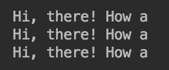
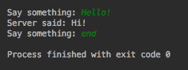
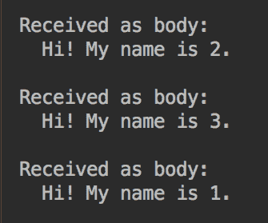
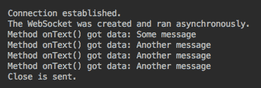

# 网络编程

在本章中，我们将描述和讨论最流行的网络协议——**用户数据报协议**（**UDP**）、**传输控制协议**（**TCP**）、**超文本传输协议**（**HTTP**）和 **WebSocket**——以及来自 **Java 类库**（**JCL**）的支持。我们将演示如何使用这些协议以及如何用 Java 代码实现客户机——服务器通信。我们还将回顾基于**统一资源定位器**（**URL**）的通信和最新的 **Java HTTP 客户端 API**。

本章将讨论以下主题：

*   网络协议
*   基于 UDP 的通信
*   基于 TCP 的通信
*   UDP 与 TCP 协议
*   基于 URL 的通信
*   使用 HTTP 2 客户端 API

# 网络协议

网络编程是一个广阔的领域。**互联网协议**（**IP**）套件由四层组成，每层都有十几个协议：

*   **链路层**：客户端物理连接到主机时使用的一组协议，三个核心协议包括**地址解析协议**（**ARP**）、**反向地址解析协议**（**RARP**），以及**邻居发现协议**（**NDP**）。
*   **互联网层**：一组由 IP 地址指定的用于将网络包从发起主机传输到目的主机的互联方法、协议和规范。这一层的核心协议是**互联网协议版本 4**（**IPv4**）和**互联网协议版本 6**（**IPv6**），IPv6 指定了一种新的数据包格式，并为点式 IP 地址分配 128 位，而 IPv4 是 32 位。IPv4 地址的一个例子是`10011010.00010111.11111110.00010001`，其结果是 IP 地址为`154.23.254.17`。
*   **传输层**：一组主机对主机的通信服务。它包括 TCP，也称为 TCP/IP 协议和 UDP（我们稍后将讨论）；这一组中的其他协议有**数据报拥塞控制协议**（**DCCP**）和**流控制传输协议**（**SCTP**）。
*   **应用层**：通信网络中主机使用的一组协议和接口方法。包括 **Telnet**、**文件传输协议**（**FTP**）、**域名系统**（**DNS**）、**简单邮件传输协议**（**SMTP**），**轻量级目录访问协议**（**LDAP**）、**超文本传输协议**（**HTTP**）、**超文本传输协议安全**（**HTTPS**）、**安全外壳**（**SSH**）。

链路层是最底层；它由互联网层使用，而互联网层又由传输层使用。然后，应用层使用该传输层来支持协议实现。

出于安全原因，Java 不提供对链路层和互联网层协议的访问。这意味着 Java 不允许您创建自定义传输协议，例如，作为 TCP/IP 的替代方案。因此，在本章中，我们将只回顾传输层（TCP 和 UDP）和应用层（HTTP）的协议。我们将解释并演示 Java 如何支持它们，以及 Java 应用程序如何利用这种支持。

Java 用`java.net`包的类支持 TCP 和 UDP 协议，而 HTTP 协议可以用`java.net.http`包的类在 Java 应用程序中实现（这是 Java11 引入的）。

TCP 和 UDP 协议都可以使用*套接字*在 Java 中实现。套接字由 IP 地址和端口号的组合标识，它们表示两个应用程序之间的连接。

# 基于 UDP 的通信

UDP 协议是由 davidp.Reed 在 1980 年设计的。它允许应用程序使用简单的无连接通信模型发送名为**数据报**的消息，并使用最小的协议机制（如校验和）来保证数据完整性。它没有握手对话框，因此不能保证消息传递或保持消息的顺序。它适用于丢弃消息或混淆顺序而不是等待重传的情况。

数据报由`java.net.DatagramPacket`类表示。此类的对象可以使用六个构造器中的一个来创建；以下两个构造器是最常用的：

*   `DatagramPacket(byte[] buffer, int length)`：此构造器创建一个数据报包，用于接收数据包；`buffer`保存传入的数据报，`length`是要读取的字节数。
*   `DatagramPacket(byte[] buffer, int length, InetAddress address, int port)`：创建一个数据报数据包，用于发送数据包；`buffer`保存数据包数据，`length`为数据包长度，`address`保存目的 IP 地址，`port`为目的端口号。

一旦构建，`DatagramPacket`对象公开了以下方法，这些方法可用于从对象中提取数据或设置/获取其属性：

*   `void setAddress(InetAddress iaddr)`：设置目的 IP 地址。
*   `InetAddress getAddress()`：返回目的地或源 IP 地址。
*   `void setData(byte[] buf)`：设置数据缓冲区。
*   `void setData(byte[] buf, int offset, int length)`：设置数据缓冲区、数据偏移量、长度。
*   `void setLength(int length)`：设置包的长度。
*   `byte[] getData()`：返回数据缓冲区
*   `int getLength()`：返回要发送或接收的数据包的长度。
*   `int getOffset()`：返回要发送或接收的数据的偏移量。
*   `void setPort(int port)`：设置目的端口号。
*   `int getPort()`：返回发送或接收数据的端口号。

一旦创建了一个`DatagramPacket`对象，就可以使用`DatagramSocket`类来发送或接收它，该类表示用于发送和接收数据包的无连接套接字。这个类的对象可以使用六个构造器中的一个来创建；以下三个构造器是最常用的：

*   `DatagramSocket()`：创建一个数据报套接字并将其绑定到本地主机上的任何可用端口。它通常用于创建发送套接字，因为目标地址（和端口）可以在包内设置（参见前面的`DatagramPacket`构造器和方法）。
*   `DatagramSocket(int port)`：创建一个数据报套接字，绑定到本地主机的指定端口。当任何本地机器地址（称为**通配符地址**）足够好时，它用于创建一个接收套接字。
*   `DatagramSocket(int port, InetAddress address)`：创建一个数据报套接字，绑定到指定的端口和指定的本地地址，本地端口必须在`0`和`65535`之间。它用于在需要绑定特定的本地计算机地址时创建接收套接字。

`DatagramSocket`对象的以下两种方法最常用于发送和接收消息（或包）：

*   `void send(DatagramPacket p)`：发送指定的数据包。
*   `void receive(DatagramPacket p)`：通过用接收到的数据填充指定的`DatagramPacket`对象的缓冲区来接收数据包。指定的`DatagramPacket`对象还包含发送方的 IP 地址和发送方机器上的端口号。

让我们看一个代码示例；下面是接收到消息后退出的 UDP 消息接收器：

```java
public class UdpReceiver {
   public static void main(String[] args){
        try(DatagramSocket ds = new DatagramSocket(3333)){
            DatagramPacket dp = new DatagramPacket(new byte[16], 16);
            ds.receive(dp);
            for(byte b: dp.getData()){
                System.out.print(Character.toString(b));
            }
        } catch (Exception ex){
            ex.printStackTrace();
        }
    }
}
```

如您所见，接收器正在监听端口`3333`上本地机器的任何地址上的文本消息（它将每个字节解释为一个字符）。它只使用一个 16 字节的缓冲区；一旦缓冲区被接收到的数据填满，接收器就打印它的内容并退出。

以下是 UDP 消息发送器的示例：

```java
public class UdpSender {
    public static void main(String[] args) {
        try(DatagramSocket ds = new DatagramSocket()){
            String msg = "Hi, there! How are you?";
            InetAddress address = InetAddress.getByName("127.0.0.1");
            DatagramPacket dp = new DatagramPacket(msg.getBytes(), 
                                        msg.length(), address, 3333);
            ds.send(dp);
        } catch (Exception ex){
            ex.printStackTrace();
        }
    }
}
```

如您所见，发送方构造了一个包含消息、本地机器地址和与接收方使用的端口相同的端口的数据包。在构造的包被发送之后，发送方退出。

我们现在可以运行发送器，但是如果没有接收器运行，就没有人能收到消息。所以，我们先启动接收器。它在端口`3333`上监听，但是没有消息传来—所以它等待。然后，我们运行发送方，接收方显示以下消息：


因为缓冲区比消息小，所以只接收了部分消息—消息的其余部分丢失。我们可以创建一个无限循环，让接收器无限期地运行：

```java
while(true){
    ds.receive(dp);
    for(byte b: dp.getData()){
        System.out.print(Character.toString(b));
    }
    System.out.println();
}
```

通过这样做，我们可以多次运行发送器；如果我们运行发送器三次，则接收器将打印以下内容：



如您所见，所有三条消息都被接收；但是，接收器只捕获每条消息的前 16 个字节

现在让我们将接收缓冲区设置为大于消息：

```java
DatagramPacket dp = new DatagramPacket(new byte[30], 30);

```

如果我们现在发送相同的消息，结果如下：


为了避免处理空的缓冲区元素，可以使用`DatagramPacket`类的`getLength()`方法，该方法返回消息填充的缓冲区元素的实际数量：

```java
int i = 1;
for(byte b: dp.getData()){
    System.out.print(Character.toString(b));
    if(i++ == dp.getLength()){
        break;
    }
}
```

上述代码的结果如下：


这就是 UDP 协议的基本思想。发送方将消息发送到某个地址和端口，即使在该地址和端口上没有*监听*的套接字。它不需要在发送消息之前建立任何类型的连接，这使得 UDP 协议比 TCP 协议更快、更轻量级（TCP 协议要求您首先建立连接）。通过这种方式，TCP 协议将消息发送到另一个可靠性级别—通过确保目标存在并且消息可以被传递。

# 基于 TCP 的通信

TCP 由**国防高级研究计划局**（**DARPA**）于 1970 年代设计，用于**高级研究计划局网络**（**ARPANET**）。它是对 IP 的补充，因此也被称为 TCP/IP。TCP 协议，甚至其名称，都表明它提供了可靠的（即，错误检查或控制的）数据传输。它允许在 IP 网络中按顺序传递字节，广泛用于 web、电子邮件、安全 shell 和文件传输

使用 TCP/IP 的应用程序甚至不知道套接字和传输细节之间发生的所有握手，例如网络拥塞、流量负载平衡、复制，甚至一些 IP 数据包丢失。传输层的底层协议实现检测这些问题，重新发送数据，重建发送数据包的顺序，并最小化网络拥塞

与 UDP 协议不同，基于 TCP/IP 的通信侧重于准确的传输，而牺牲了传输周期。这就是为什么它不用于实时应用程序，比如 IP 语音，在这些应用程序中，需要可靠的传递和正确的顺序排序。然而，如果每一位都需要以相同的顺序准确地到达，那么 TCP/IP 是不可替代的

为了支持这种行为，TCP/IP 通信在整个通信过程中维护一个会话。会话由客户端地址和端口标识。每个会话都由服务器上表中的一个条目表示。它包含有关会话的所有元数据：客户端 IP 地址和端口、连接状态和缓冲区参数。但是这些细节通常对应用程序开发人员是隐藏的，所以我们在这里不再详细讨论。相反，我们将转向 Java 代码。

与 UDP 协议类似，Java 中的 TCP/IP 协议实现使用套接字。但是基于 TCP/IP 的套接字不是实现 UDP 协议的`java.net.DatagramSocket`类，而是由`java.net.ServerSocket`和`java.net.Socket`类表示。它们允许在两个应用程序之间发送和接收消息，其中一个是服务器，另一个是客户端。

`ServerSocket`和`SocketClass`类执行非常相似的任务。唯一的区别是，`ServerSocket`类有`accept()`方法，*接受来自客户机的请求*。这意味着服务器必须先启动并准备好接收请求。然后，连接由客户机启动，客户机创建自己的套接字来发送连接请求（来自`Socket`类的构造器）。然后服务器接受请求并创建一个连接到远程套接字的本地套接字（在客户端）。

建立连接后，数据传输可以使用 I/O 流进行，如第 5 章、“字符串、输入/输出和文件”所述。`Socket`对象具有`getOutputStream()`和`getInputStream()`方法，提供对套接字数据流的访问。来自本地计算机上的`java.io.OutputStream`对象的数据似乎来自远程机器上的`java.io.InputStream`对象。

现在让我们仔细看看`java.net.ServerSocket`和`java.net.Socket`类，然后运行它们的一些用法示例。

# 这个 java.net.ServerSocket 班

`java.net.ServerSocket`类有四个构造器：

*   `ServerSocket()`：这将创建一个不绑定到特定地址和端口的服务器套接字对象。需要使用`bind()`方法绑定套接字。
*   `ServerSocket(int port)`：创建绑定到所提供端口的服务器套接字对象。`port`值必须在`0`和`65535`之间。如果端口号被指定为值`0`，这意味着需要自动绑定端口号。默认情况下，传入连接的最大队列长度为`50`。
*   `ServerSocket(int port, int backlog)`：提供与`ServerSocket(int port)`构造器相同的功能，允许您通过`backlog`参数设置传入连接的最大队列长度。
*   `ServerSocket(int port, int backlog, InetAddress bindAddr)`：这将创建一个服务器套接字对象，该对象类似于前面的构造器，但也绑定到提供的 IP 地址。当`bindAddr`值为`null`时，默认接受任何或所有本地地址的连接。

`ServerSocket`类的以下四种方法是最常用的，它们是建立套接字连接所必需的：

*   `void bind(SocketAddress endpoint)`：将`ServerSocket`对象绑定到特定的 IP 地址和端口。如果提供的地址是`null`，则系统会自动获取一个端口和一个有效的本地地址（以后可以使用`getLocalPort()`、`getLocalSocketAddress()`和`getInetAddress()`方法检索）。另外，如果`ServerSocket`对象是由构造器创建的，没有任何参数，那么在建立连接之前需要调用此方法或下面的`bind()`方法。
*   `void bind(SocketAddress endpoint, int backlog)`：其作用方式与前面的方法类似，`backlog`参数是套接字上挂起的最大连接数（即队列的大小）。如果`backlog`值小于或等于`0`，则将使用特定于实现的默认值。
*   `void setSoTimeout(int timeout)`：设置调用`accept()`方法后套接字等待客户机的时间（毫秒）。如果客户端没有调用并且超时过期，则抛出一个`java.net.SocketTimeoutException`异常，但`ServerSocket`对象仍然有效，可以重用。`0`的`timeout`值被解释为无限超时（在客户端调用之前，`accept()`方法阻塞）。
*   `Socket accept()`：这会一直阻塞，直到客户端调用或超时期限（如果设置）到期。

该类的其他方法允许您设置或获取`Socket`对象的其他属性，它们可以用于更好地动态管理套接字连接。您可以参考该类的联机文档来更详细地了解可用选项。

以下代码是使用`ServerSocket`类的服务器实现的示例：

```java
public class TcpServer {
  public static void main(String[] args){
    try(Socket s = new ServerSocket(3333).accept();
      DataInputStream dis = new DataInputStream(s.getInputStream());
      DataOutputStream dout = new DataOutputStream(s.getOutputStream());
      BufferedReader console = 
                  new BufferedReader(new InputStreamReader(System.in))){
      while(true){
         String msg = dis.readUTF();
         System.out.println("Client said: " + msg);
         if("end".equalsIgnoreCase(msg)){
             break;
         }
         System.out.print("Say something: ");
         msg = console.readLine();
         dout.writeUTF(msg);
         dout.flush();
         if("end".equalsIgnoreCase(msg)){
             break;
         }
      }
    } catch(Exception ex) {
      ex.printStackTrace();
    }
  }
}
```

让我们浏览前面的代码。在 try with resources 语句中，我们基于新创建的 socket 创建了`Socket`、`DataInputStream`和`DataOutputStream`对象，并创建了`BufferedReader`对象从控制台读取用户输入（我们将使用它输入数据）。在创建套接字时，`accept()`方法会阻塞，直到客户端尝试连接到本地服务器的端口`3333`

然后，代码进入无限循环。首先，它使用`DataInputStream`的`readUTF()`方法，将客户端发送的字节读取为以修改的 UTF-8 格式编码的 Unicode 字符串。结果以`"Client said: "`前缀打印。如果接收到的消息是一个`"end"`字符串，那么代码退出循环，服务器程序退出。如果消息不是`"end"`，则控制台上显示`"Say something: "`提示，`readLine()`方法阻塞，直到用户键入内容并点击`Enter`

服务器从屏幕获取输入，并使用`writeUtf()`方法将其作为 Unicode 字符串写入输出流。正如我们已经提到的，服务器的输出流连接到客户机的输入流。如果客户机从输入流中读取数据，它将接收服务器发送的消息。如果发送的消息是`"end"`，则服务器退出循环并退出程序。如果不是，则再次执行循环体。

所描述的算法假设客户端只有在发送或接收到`"end"`消息时才退出。否则，如果客户机随后尝试向服务器发送消息，则会生成异常。这说明了我们前面提到的 UDP 和 TCP 协议之间的区别–TCP 基于在服务器和客户端套接字之间建立的会话。如果一方掉下来，另一方马上就会遇到错误。

现在让我们回顾一个 TCP 客户机实现的示例。

# 这个 java.net.Socket 班

`java.net.Socket`类现在应该是您熟悉的了，因为它是在前面的示例中使用的。我们使用它来访问连接的套接字的输入和输出流。现在我们将系统地回顾`Socket`类，并探讨如何使用它来创建 TCP 客户机。`Socket`类有四个构造器：

*   `Socket()`：这将创建一个未连接的套接字。它使用`connect()`方法将此套接字与服务器上的套接字建立连接。
*   `Socket(String host, int port)`：创建一个套接字并将其连接到`host`服务器上提供的端口。如果抛出异常，则无法建立到服务器的连接；否则，可以开始向服务器发送数据。
*   `Socket(InetAddress address, int port)`：其作用方式与前面的构造器类似，只是主机作为`InetAddress`对象提供。
*   `Socket(String host, int port, InetAddress localAddr, int localPort)`：这与前面的构造器的工作方式类似，只是它还允许您将套接字绑定到提供的本地地址和端口（如果程序在具有多个 IP 地址的机器上运行）。如果提供的`localAddr`值为`null`，则选择任何本地地址。或者，如果提供的`localPort`值是`null`，则系统在绑定操作中拾取自由端口。
*   `Socket(InetAddress address, int port, InetAddress localAddr, int localPort)`：其作用方式与前面的构造器类似，只是本地地址作为`InetAddress`对象提供。

下面是我们已经使用过的`Socket`类的以下两种方法：

*   `InputStream getInputStream()`：返回一个表示源（远程套接字）的对象，并将数据（输入数据）带入程序（本地套接字）。

*   `OutputStream getOutputStream()`：返回一个表示源（本地套接字）的对象，并将数据（输出）发送到远程套接字。

现在让我们检查一下 TCP 客户端代码，如下所示：

```java
public class TcpClient {
  public static void main(String[] args) {
    try(Socket s = new Socket("localhost",3333);
      DataInputStream dis = new DataInputStream(s.getInputStream());
      DataOutputStream dout = new DataOutputStream(s.getOutputStream());
      BufferedReader console = 
                  new BufferedReader(new InputStreamReader(System.in))){
         String prompt = "Say something: ";
         System.out.print(prompt);
         String msg;
         while ((msg = console.readLine()) != null) {
             dout.writeUTF( msg);
             dout.flush();
             if (msg.equalsIgnoreCase("end")) {
                 break;
             }
             msg = dis.readUTF();
             System.out.println("Server said: " +msg);
             if (msg.equalsIgnoreCase("end")) {
                 break;
             }
             System.out.print(prompt);
         }
    } catch(Exception ex){
          ex.printStackTrace();
    }
  }
}
```

前面的`TcpClient`代码看起来与我们回顾的`TcpServer`代码几乎完全相同。唯一主要的区别是`new Socket("localhost", 3333)`构造器试图立即与`"localhost:3333"`服务器建立连接，因此它期望`localhost`服务器启动并监听端口`3333`，其余与服务器代码相同。

因此，我们需要使用`ServerSocket`类的唯一原因是允许服务器在等待客户机连接到它的同时运行；其他一切都可以使用`Socket`类来完成。

`Socket`类的其他方法允许您设置或获取 socket 对象的其他属性，它们可以用于更好地动态管理 socket 连接。您可以阅读该类的在线文档，以更详细地了解可用选项。

# 运行示例

现在让我们运行`TcpServer`和`TcpClient`程序。如果我们先启动`TcpClient`，我们得到的`java.net.ConnectException`带有连接被拒绝的消息。所以，我们先启动`TcpServer`程序。当它启动时，不显示任何消息，而是等待客户端连接。因此，我们启动`TcpClient`并在屏幕上看到以下消息：


我们打招呼！点击`Enter`：


现在让我们看看服务器端屏幕：


我们打嗨！在服务器端屏幕上点击`Enter`：


在客户端屏幕上，我们看到以下消息：


我们可以无限期地继续此对话框，直到服务器或客户端发送消息 end。让客户去做；客户说结束然后退出：



然后，服务器执行以下操作：


这就是我们在讨论 TCP 协议时想要演示的全部内容。现在让我们回顾一下 UDP 和 TCP 协议之间的区别。

# UDP 与 TCP 协议

UDP 和 TCP/IP 协议的区别如下：

*   UDP 只发送数据，不管数据接收器是否启动和运行。这就是为什么 UDP 比许多其他使用多播分发的客户端更适合发送数据。另一方面，TCP 要求首先在客户端和服务器之间建立连接。TCP 客户机发送一个特殊的控制消息；服务器接收该消息并用确认消息进行响应。然后，客户机向服务器发送一条消息，确认服务器确认。只有这样，客户机和服务器之间的数据传输才有可能
*   TCP 保证消息传递或引发错误，而 UDP 不保证，并且数据报数据包可能丢失。
*   TCP 保证在传递时保留消息的顺序，而 UDP 不保证。
*   由于提供了这些保证，TCP 比 UDP 慢
*   此外，协议要求标头与数据包一起发送。TCP 数据包的头大小是 20 字节，而数据报数据包是 8 字节。UDP 标头包含`Length`、`Source Port`、`Destination Port`、`Checksum`，TCP 标头除了 UDP 标头外，还包含`Sequence Number`、`Ack Number`、`Data Offset`、`Reserved`、`Control Bit`、`Window`、`Urgent Pointer`、`Options`、`Padding`
*   有基于 TCP 或 UDP 协议的不同应用程序协议。基于 **TCP** 的协议有 **HTTP**、**HTTPS**、**Telnet**、**FTP** 和 **SMTP**。基于 **UDP** 的协议有**动态主机配置协议**（**DHCP**）、**域名系统**（**DNS**）、**简单网络管理协议**（**SNMP**），**普通文件传输协议**（**TFTP**）、**引导协议**（**BOOTP**），以及早期版本的**网络文件系统**（**NFS**）。

我们可以用一句话来描述 UDP 和 TCP 之间的区别：UDP 协议比 TCP 更快、更轻量级，但可靠性更低。就像生活中的许多事情一样，你必须为额外的服务付出更高的代价。但是，并非所有情况下都需要这些服务，因此请考虑手头的任务，并根据您的应用程序需求决定使用哪种协议。

# 基于 URL 的通信

如今，似乎每个人都对 URL 有了一些概念；那些在电脑或智能手机上使用浏览器的人每天都会看到 URL。在本节中，我们将简要解释组成 URL 的不同部分，并演示如何以编程方式使用 URL 从网站（或文件）请求数据或向网站发送（发布）数据。

# URL 语法

一般来说，URL 语法遵循具有以下格式的**统一资源标识符**（**URI**）的语法：

```java
scheme:[//authority]path[?query][#fragment]
```

方括号表示组件是可选的。这意味着 URI 将至少由`scheme:path`组成。`scheme`分量可以是`http`、`https`、`ftp`、`mailto`、`file`、`data`或其他值。`path`组件由一系列由斜线（`/`分隔的路径段组成。以下是仅由`scheme`和`path`组成的 URL 的示例：

```java
file:src/main/resources/hello.txt
```

前面的 URL 指向本地文件系统上的一个文件，该文件相对于使用此 URL 的目录。我们将很快演示它的工作原理。

`path`组件可以是空的，但是这样 URL 看起来就没用了。然而，空路径通常与`authority`结合使用，其格式如下：

```java
[userinfo@]host[:port]
```

唯一需要的授权组件是`host`，它可以是 IP 地址（例如`137.254.120.50`）或域名（例如`oracle.com`）。

`userinfo`组件通常与`scheme`组件的`mailto`值一起使用，因此`userinfo@host`表示电子邮件地址。

如果省略，`port`组件将采用默认值。例如，如果`scheme`值为`http`，则默认`port`值为`80`，如果`scheme`值为`https`，则默认`port`值为`443`。

URL 的可选`query`组件是由分隔符（`&`分隔的键值对序列：

```java
key1=value1&key2=value2
```

最后，可选的`fragment`组件是 HTML 文档的一部分的标识符，这样浏览器就可以将该部分滚动到视图中。

需要指出的是，Oracle 的在线文档使用的术语略有不同：

*   `protocol`代替`scheme`
*   `reference`代替`fragment`
*   `file`代替`path[?query][#fragment]`
*   `resource`代替`host[:port]path[?query][#fragment]`

因此，从 Oracle 文档的角度来看，URL 由`protocol`和`resource`值组成。

现在让我们看看 Java 中 url 的编程用法。

# 这个 java.net.URL 班

在 Java 中，URL 由`java.net.URL`类的一个对象表示，该对象有六个构造器：

*   `URL(String spec)`：从 URL 创建一个`URL`对象作为字符串。
*   `URL(String protocol, String host, String file)`：根据提供的`protocol`、`host`、`file`（`path`、`query`的值，以及基于提供的`protocol`值的默认端口号，创建一个`URL`对象。
*   `URL(String protocol, String host, int port, String path)`：根据提供的`protocol`、`host`、`port`、`file`（`path`、`query`的值创建`URL`对象，`port`值为`-1`表示需要根据提供的`protocol`值使用默认端口号。
*   `URL(String protocol, String host, int port, String file, URLStreamHandler handler)`：这与前面的构造器的作用方式相同，并且允许您传入特定协议处理程序的对象；所有前面的构造器都自动加载默认处理程序。
*   `URL(URL context, String spec)`：这将创建一个`URL`对象，该对象扩展提供的`URL`对象或使用提供的`spec`值覆盖其组件，该值是 URL 或其某些组件的字符串表示。例如，如果两个参数中都存在方案，`spec`中的方案值将覆盖`context`和其他许多参数中的方案值。
*   `URL(URL context, String spec, URLStreamHandler handler)`：它的作用方式与前面的构造器相同，另外还允许您传入特定协议处理程序的对象。

创建后，`URL`对象允许您获取基础 URL 的各个组件的值。`InputStream openStream()`方法提供对从 URL 接收的数据流的访问。实际上，它被实现为`openConnection.getInputStream()`。`URL`类的`URLConnection openConnection()`方法返回一个`URLConnection`对象，其中有许多方法提供与 URL 连接的详细信息，包括允许向 URL 发送数据的`getOutputStream()`方法。

让我们看一看代码示例；我们首先从一个`hello.txt`文件中读取数据，这个文件是我们在第 5 章中创建的本地文件，“字符串、输入/输出和文件”。文件只包含一行：“你好！”；下面是读取它的代码：

```java
try {
   URL url = new URL("file:src/main/resources/hello.txt");
   System.out.println(url.getPath());    // src/main/resources/hello.txt
   System.out.println(url.getFile());    // src/main/resources/hello.txt
   try(InputStream is = url.openStream()){
      int data = is.read();
      while(data != -1){
          System.out.print((char) data); //prints: Hello!
          data = is.read();
      }            
   }
} catch (Exception e) {
    e.printStackTrace();
}
```

在前面的代码中，我们使用了`file:src/main/resources/hello.txt`URL。它基于相对于程序执行位置的文件路径。程序在我们项目的根目录中执行。首先，我们演示了`getPath()`和`getFile()`方法，返回的值没有区别，因为 URL 没有`query`组件值。否则，`getFile()`方法也会包括它。我们将在下面的代码示例中看到这一点。

前面代码的其余部分打开文件中的输入数据流，并将传入的字节打印为字符。结果显示在内联注释中。

现在，让我们演示 Java 代码如何从指向互联网上源的 URL 读取数据。让我们用一个`Java`关键字来调用谷歌搜索引擎：

```java
try {
   URL url = new URL("https://www.google.com/search?q=Java&num=10");
   System.out.println(url.getPath()); //prints: /search
   System.out.println(url.getFile()); //prints: /search?q=Java&num=10
   URLConnection conn = url.openConnection();
   conn.setRequestProperty("Accept", "text/html");
   conn.setRequestProperty("Connection", "close");
   conn.setRequestProperty("Accept-Language", "en-US");
   conn.setRequestProperty("User-Agent", "Mozilla/5.0");
   try(InputStream is = conn.getInputStream();
    BufferedReader br = new BufferedReader(new InputStreamReader(is))){
      String line;
      while ((line = br.readLine()) != null){
         System.out.println(line);
      }
   }
} catch (Exception e) {
  e.printStackTrace();
}
```

在这里，我们提出了`https://www.google.com/search?q=Java&num=10`URL，并在进行了一些研究和实验后要求属性。没有保证它总是有效的，所以如果它不返回我们描述的相同数据，不要感到惊讶。此外，它是一个实时搜索，因此结果可能随时变化

前面的代码还演示了由`getPath()`和`getFile()`方法返回的值之间的差异。您可以在前面的代码示例中查看内联注释。

与使用文件 URL 的示例相比，Google search 示例使用了`URLConnection`对象，因为我们需要设置请求头字段：

*   `Accept`告诉服务器调用者请求什么类型的内容（`understands`。
*   `Connection`通知服务器收到响应后，连接将关闭。
*   `Accept-Language`告诉服务器调用者请求哪种语言（`understands`）。
*   `User-Agent`告诉服务器关于呼叫者的信息；否则，Google 搜索引擎（[www.google.com](https://www.google.com/)响应 403（禁止）HTTP 代码。

上一个示例中的其余代码只是读取来自 URL 的输入数据流（HTML 代码），然后逐行打印它。我们捕获了结果（从屏幕上复制），[将其粘贴到在线 HTML 格式化程序中](https://jsonformatter.org/html-pretty-print)，然后运行它。结果显示在以下屏幕截图中：


如您所见，它看起来像是一个典型的带有搜索结果的页面，只是在左上角没有返回 HTML 的 *Google* 图像。

类似地，也可以向 URL 发送（发布）数据；下面是一个示例代码：

```java
try {
    URL url = new URL("http://localhost:3333/something");
    URLConnection conn = url.openConnection();
    //conn.setRequestProperty("Method", "POST");
    //conn.setRequestProperty("User-Agent", "Java client");
    conn.setDoOutput(true);
    OutputStreamWriter osw =
            new OutputStreamWriter(conn.getOutputStream());
    osw.write("parameter1=value1&parameter2=value2");
    osw.flush();
    osw.close();

    BufferedReader br =
       new BufferedReader(new InputStreamReader(conn.getInputStream()));
    String line;
    while ((line = br.readLine()) != null) {
        System.out.println(line);
    }
    br.close();
} catch (Exception e) {
    e.printStackTrace();
}
```

前面的代码要求在端口`3333`上的`localhost`服务器上运行一个服务器，该服务器可以用`"/something"`路径处理`POST`请求。如果服务器没有检查方法（是`POST`还是其他 HTTP 方法）并且没有检查`User-Agent`值，则不需要指定任何方法。因此，我们对设置进行注释，并将它们保留在那里，只是为了演示如何在需要时设置这些值和类似的值。

注意，我们使用了`setDoOutput()`方法来指示必须发送输出；默认情况下，它被设置为`false`。然后，让输出流将查询参数发送到服务器

前面代码的另一个重要方面是在打开输入流之前必须关闭输出流。否则，输出流的内容将不会发送到服务器。虽然我们显式地这样做了，但是更好的方法是使用 try with resources 块，它保证调用`close()`方法，即使在块中的任何地方引发了异常。

以下是上述示例的更好版本：

```java
try {
    URL url = new URL("http://localhost:3333/something");
    URLConnection conn = url.openConnection();
    //conn.setRequestProperty("Method", "POST");
    //conn.setRequestProperty("User-Agent", "Java client");
    conn.setDoOutput(true);
    try(OutputStreamWriter osw =
                new OutputStreamWriter(conn.getOutputStream())){
        osw.write("parameter1=value1&parameter2=value2");
        osw.flush();
    }
    try(BufferedReader br =
      new BufferedReader(new InputStreamReader(conn.getInputStream()))){
        String line;
        while ((line = br.readLine()) != null) {
            System.out.println(line);
        }
    }
} catch (Exception ex) {
    ex.printStackTrace();
}
```

为了演示这个示例是如何工作的，我们还创建了一个简单的服务器，它监听`localhost`的端口`3333`，并分配了一个处理程序来处理`"/something"`路径中的所有请求：

```java
public static void main(String[] args) throws Exception {
    HttpServer server = HttpServer.create(new InetSocketAddress(3333),0);
    server.createContext("/something", new PostHandler());
    server.setExecutor(null);
    server.start();
}
static class PostHandler implements HttpHandler {
    public void handle(HttpExchange exch) {
       System.out.println(exch.getRequestURI());   //prints: /something
       System.out.println(exch.getHttpContext().getPath());///something
       try(BufferedReader in = new BufferedReader(
                new InputStreamReader(exch.getRequestBody()));
           OutputStream os = exch.getResponseBody()){
           System.out.println("Received as body:");
           in.lines().forEach(l -> System.out.println("  " + l));

           String confirm = "Got it! Thanks.";
           exch.sendResponseHeaders(200, confirm.length());
           os.write(confirm.getBytes());
        } catch (Exception ex){
            ex.printStackTrace();
        }
    }
}
```

为了实现服务器，我们使用了 JCL 附带的`com.sun.net.httpserver`包的类。为了证明 URL 没有参数，我们打印 URI 和路径。它们都有相同的`"/something"`值；参数来自请求的主体。

请求处理完成后，服务器发回消息“收到！谢谢。”让我们看看它是怎么工作的；我们先运行服务器。它开始监听端口`3333`并阻塞，直到请求带有`"/something"`路径。然后，我们执行客户端并在服务器端屏幕上观察以下输出：


如您所见，服务器成功地接收到参数（或任何其他消息）。现在它可以解析它们并根据需要使用它们。

如果我们查看客户端屏幕，将看到以下输出：


这意味着客户端从服务器接收到消息并按预期退出。注意，我们示例中的服务器不会自动退出，必须手动关闭。

`URL`和`URLConnection`类的其他方法允许您设置/获取其他属性，并且可以用于客户机-服务器通信的更动态的管理。在`java.net`包中还有`HttpUrlConnection`类（以及其他类），它简化并增强了基于 URL 的通信。您可以阅读`java.net`软件包的在线文档，以便更好地了解可用的选项。

# 使用 HTTP 2 客户端 API

HTTP 客户端 API 是在 Java9 中引入的，作为`jdk.incubator.http`包中的孵化 API，在 Java11 中被标准化并转移到`java.net.http`包中，它是一个比`URLConnection`API 更丰富、更易于使用的替代品。除了所有与连接相关的基本功能外，它还使用`CompletableFuture`提供非阻塞（异步）请求和响应，并支持 http1.1 和 http2。

HTTP 2 为 HTTP 协议添加了以下新功能：

*   以二进制格式而不是文本格式发送数据的能力；二进制格式的解析效率更高，更紧凑，并且不易受到各种错误的影响。
*   它是完全多路复用的，因此允许使用一个连接同时发送多个请求和响应。
*   它使用头压缩，从而减少了开销。
*   如果客户端指示它支持 HTTP2，它允许服务器将响应推送到客户端的缓存中。

包包含以下类：

*   `HttpClient`：用于同步和异步发送请求和接收响应。可以使用带有默认设置的静态`newHttpClient()`方法创建实例，也可以使用允许您自定义客户端配置的`HttpClient.Builder`类（由静态`newBuilder()`方法返回）。一旦创建，实例是不可变的，可以多次使用。
*   `HttpRequest`：创建并表示一个 HTTP 请求，其中包含目标 URI、头和其他相关信息。可以使用`HttpRequest.Builder`类（由静态`newBuilder()`方法返回）创建实例。一旦创建，实例是不可变的，可以多次发送。
*   `HttpRequest.BodyPublisher`：从某个源（比如字符串、文件、输入流或字节数组）发布主体（对于`POST`、`PUT`、`DELETE`方法）。
*   `HttpResponse`：表示客户端发送 HTTP 请求后收到的 HTTP 响应。它包含源 URI、头、消息体和其他相关信息。创建实例后，可以多次查询实例。
*   `HttpResponse.BodyHandler`：接受响应并返回`HttpResponse.BodySubscriber`实例的函数式接口，可以处理响应体。
*   `HttpResponse.BodySubscriber`：接收响应体（字节）并将其转换为字符串、文件或类型。

`HttpRequest.BodyPublishers`、`HttpResponse.BodyHandlers`和`HttpResponse.BodySubscribers`类是创建相应类实例的工厂类。例如，`BodyHandlers.ofString()`方法创建一个`BodyHandler`实例，将响应正文字节作为字符串进行处理，`BodyHandlers.ofFile()`方法创建一个`BodyHandler`实例，将响应正文保存在文件中。

您可以阅读`java.net.http`包的在线文档，以了解有关这些类和其他相关类及接口的更多信息。接下来，我们将看一看并讨论一些使用 httpapi 的示例。

# 阻止 HTTP 请求

以下代码是向 HTTP 服务器发送`GET`请求的简单 HTTP 客户端的示例：

```java
HttpClient httpClient = HttpClient.newBuilder()
     .version(HttpClient.Version.HTTP_2) // default
     .build();
HttpRequest req = HttpRequest.newBuilder()
     .uri(URI.create("http://localhost:3333/something"))
     .GET()                            // default
     .build();
try {
 HttpResponse<String> resp = 
          httpClient.send(req, BodyHandlers.ofString());
 System.out.println("Response: " + 
               resp.statusCode() + " : " + resp.body());
} catch (Exception ex) {
   ex.printStackTrace();
}
```

我们创建了一个生成器来配置一个`HttpClient`实例。但是，由于我们只使用了默认设置，因此我们可以使用以下相同的结果：

```java
HttpClient httpClient = HttpClient.newHttpClient();
```

为了演示客户机的功能，我们将使用与我们已经使用的相同的`UrlServer`类。作为提醒，这就是它如何处理客户的请求并用`"Got it! Thanks."`响应：

```java
try(BufferedReader in = new BufferedReader(
            new InputStreamReader(exch.getRequestBody()));
    OutputStream os = exch.getResponseBody()){
    System.out.println("Received as body:");
    in.lines().forEach(l -> System.out.println("  " + l));

    String confirm = "Got it! Thanks.";
    exch.sendResponseHeaders(200, confirm.length());
    os.write(confirm.getBytes());
    System.out.println();
} catch (Exception ex){
    ex.printStackTrace();
}
```

如果启动此服务器并运行前面的客户机代码，服务器将在其屏幕上打印以下消息：


客户端没有发送消息，因为它使用了 HTTP`GET`方法。不过，服务器会做出响应，客户端屏幕会显示以下消息：


在服务器返回响应之前，`HttpClient`类的`send()`方法被阻塞

使用 HTTP`POST`、`PUT`或`DELETE`方法会产生类似的结果；现在让我们运行以下代码：

```java
HttpClient httpClient = HttpClient.newBuilder()
        .version(Version.HTTP_2)  // default
        .build();
HttpRequest req = HttpRequest.newBuilder()
        .uri(URI.create("http://localhost:3333/something"))
        .POST(BodyPublishers.ofString("Hi there!"))
        .build();
try {
    HttpResponse<String> resp = 
                   httpClient.send(req, BodyHandlers.ofString());
    System.out.println("Response: " + 
                        resp.statusCode() + " : " + resp.body());
} catch (Exception ex) {
    ex.printStackTrace();
}
```

如您所见，这次客户机在那里发布消息 Hi！，服务器屏幕显示以下内容：


在服务器返回相同响应之前，`HttpClient`类的`send()`方法被阻塞：


到目前为止，演示的功能与我们在上一节中看到的基于 URL 的通信没有太大区别。现在我们将使用 URL 流中不可用的`HttpClient`方法。

# 非阻塞（异步）HTTP 请求

`HttpClient`类的`sendAsync()`方法允许您向服务器发送消息而不阻塞。为了演示它的工作原理，我们将执行以下代码：

```java
HttpClient httpClient = HttpClient.newHttpClient();
HttpRequest req = HttpRequest.newBuilder()
        .uri(URI.create("http://localhost:3333/something"))
        .GET()   // default
        .build();
CompletableFuture<Void> cf = httpClient
        .sendAsync(req, BodyHandlers.ofString())
        .thenAccept(resp -> System.out.println("Response: " +
                             resp.statusCode() + " : " + resp.body()));
System.out.println("The request was sent asynchronously...");
try {
    System.out.println("CompletableFuture get: " +
                                cf.get(5, TimeUnit.SECONDS));
} catch (Exception ex) {
    ex.printStackTrace();
}
System.out.println("Exit the client...");
```

与使用`send()`方法（返回`HttpResponse`对象）的示例相比，`sendAsync()`方法返回`CompletableFuture<HttpResponse>`类的实例。如果您阅读了`CompletableFuture<T>`类的文档，您将看到它实现了`java.util.concurrent.CompletionStage`接口，该接口提供了许多可以链接的方法，并允许您设置各种函数来处理响应。

下面是在`CompletionStage`界面中声明的方法列表：`acceptEither`、`acceptEitherAsync`、`acceptEitherAsync`、`applyToEither`、`applyToEitherAsync`、`applyToEitherAsync`、`handle`、`handleAsync`、`handleAsync`、`runAfterBoth`、`runAfterBothAsync`、`runAfterBothAsync`、`runAfterEither`、`runAfterEitherAsync`、`runAfterEitherAsync`、`thenAccept`、`thenAcceptAsync`、`thenAcceptAsync`、`thenAcceptBoth`、`thenAcceptBothAsync`，`thenAcceptBothAsync`、`thenApply`、`thenApplyAsync`、`thenApplyAsync`、`thenCombine`、`thenCombineAsync`、`thenCombineAsync`、`thenCompose`、`thenComposeAsync`、`thenComposeAsync`、`thenRun`、`thenRunAsync`、`thenRunAsync`、`whenComplete`、`whenCompleteAsync`、`whenCompleteAsync`。

我们将在第 13 章、“函数式编程”中讨论函数以及如何将它们作为参数传递。现在，我们只需要提到，`resp -> System.out.println("Response: " + resp.statusCode() + " : " + resp.body())`构造表示与以下方法相同的功能：

```java
void method(HttpResponse resp){
    System.out.println("Response: " + 
                             resp.statusCode() + " : " + resp.body());
}
```

`thenAccept()`方法将传入的功能应用于链的前一个方法返回的结果。

返回`CompletableFuture<Void>`实例后，前面的代码打印异步发送的请求…消息并在`CompletableFuture<Void>`对象的`get()`方法上阻塞。这个方法有一个重载版本`get(long timeout, TimeUnit unit)`，有两个参数，`TimeUnit unit`和`long timeout`指定了单元的数量，指示该方法应该等待`CompletableFuture<Void>`对象表示的任务完成多长时间。在我们的例子中，任务是向服务器发送消息并获取响应（并使用提供的函数进行处理）。如果任务没有在分配的时间内完成，`get()`方法被中断（栈跟踪被打印在 catch 块中）。

`Exit the client...`消息应该在 5 秒内（在我们的例子中）或者在`get()`方法返回之后出现在屏幕上。

如果我们运行客户端，服务器屏幕会再次显示以下消息，并阻止 HTTP`GET`请求：


客户端屏幕显示以下消息：


如您所见，请求是异步发送的…消息在服务器返回响应之前出现。这就是异步调用的要点；向服务器发送的请求已发送，客户端可以继续执行任何其他操作。传入的函数将应用于服务器响应。同时，您可以传递`CompletableFuture<Void>`对象，并随时调用它来获得结果。在我们的例子中，结果是`void`，所以`get()`方法只是表示任务已经完成

我们知道服务器返回消息，因此我们可以使用`CompletionStage`接口的另一种方法来利用它。我们选择了`thenApply()`方法，它接受一个返回值的函数：

```java
CompletableFuture<String> cf = httpClient
                .sendAsync(req, BodyHandlers.ofString())
                .thenApply(resp -> "Server responded: " + resp.body());

```

现在`get()`方法返回`resp -> "Server responded: " + resp.body()`函数产生的值，所以它应该返回服务器消息体；让我们运行下面的代码，看看结果：


现在，`get()`方法按预期返回服务器的消息，它由函数表示并作为参数传递给`thenApply()`方法。

同样，我们可以使用 HTTP`POST`、`PUT`或`DELETE`方法发送消息：

```java
HttpClient httpClient = HttpClient.newHttpClient();
HttpRequest req = HttpRequest.newBuilder()
        .uri(URI.create("http://localhost:3333/something"))
        .POST(BodyPublishers.ofString("Hi there!"))
        .build();
CompletableFuture<String> cf = httpClient
        .sendAsync(req, BodyHandlers.ofString())
        .thenApply(resp -> "Server responded: " + resp.body());
System.out.println("The request was sent asynchronously...");
try {
    System.out.println("CompletableFuture get: " +
                                cf.get(5, TimeUnit.SECONDS));
} catch (Exception ex) {
    ex.printStackTrace();
}
System.out.println("Exit the client...");

```

与上一个示例的唯一区别是，服务器现在显示接收到的客户端消息：


客户端屏幕显示与`GET`方法相同的消息：


异步请求的优点是可以快速发送，而不需要等待每个请求完成。HTTP 2 协议通过多路复用来支持它；例如，让我们发送三个请求，如下所示：

```java
HttpClient httpClient = HttpClient.newHttpClient();
List<CompletableFuture<String>> cfs = new ArrayList<>();
List<String> nums = List.of("1", "2", "3");
for(String num: nums){
    HttpRequest req = HttpRequest.newBuilder()
           .uri(URI.create("http://localhost:3333/something"))
           .POST(BodyPublishers.ofString("Hi! My name is " + num + "."))
           .build();
    CompletableFuture<String> cf = httpClient
           .sendAsync(req, BodyHandlers.ofString())
           .thenApply(rsp -> "Server responded to msg " + num + ": "
                              + rsp.statusCode() + " : " + rsp.body());
    cfs.add(cf);
}
System.out.println("The requests were sent asynchronously...");
try {
    for(CompletableFuture<String> cf: cfs){
        System.out.println("CompletableFuture get: " + 
                                          cf.get(5, TimeUnit.SECONDS));
    }
} catch (Exception ex) {
    ex.printStackTrace();
}
System.out.println("Exit the client...");

```

服务器屏幕显示以下消息：



注意传入请求的任意序列；这是因为客户机使用一个`Executors.newCachedThreadPool()`线程池来发送消息。每个消息都由不同的线程发送，池有自己的使用池成员（线程）的逻辑。如果消息的数量很大，或者每个消息都占用大量内存，那么限制并发运行的线程数量可能是有益的

`HttpClient.Builder`类允许您指定用于获取发送消息的线程的池：

```java
ExecutorService pool = Executors.newFixedThreadPool(2);
HttpClient httpClient = HttpClient.newBuilder().executor(pool).build();
List<CompletableFuture<String>> cfs = new ArrayList<>();
List<String> nums = List.of("1", "2", "3");
for(String num: nums){
    HttpRequest req = HttpRequest.newBuilder()
          .uri(URI.create("http://localhost:3333/something"))
          .POST(BodyPublishers.ofString("Hi! My name is " + num + "."))
          .build();
    CompletableFuture<String> cf = httpClient
          .sendAsync(req, BodyHandlers.ofString())
          .thenApply(rsp -> "Server responded to msg " + num + ": "
                              + rsp.statusCode() + " : " + rsp.body());
    cfs.add(cf);
}
System.out.println("The requests were sent asynchronously...");
try {
    for(CompletableFuture<String> cf: cfs){
        System.out.println("CompletableFuture get: " + 
                                           cf.get(5, TimeUnit.SECONDS));
    }
} catch (Exception ex) {
    ex.printStackTrace();
}
System.out.println("Exit the client...");

```

如果我们运行前面的代码，结果将是相同的，但是客户端将只使用两个线程来发送消息。随着消息数量的增加，性能可能会慢一些（与上一个示例相比）。因此，正如软件系统设计中经常出现的情况一样，您需要在使用的内存量和性能之间取得平衡。

与 executor 类似，可以在`HttpClient`对象上设置其他几个对象，以配置连接来处理认证、请求重定向、cookies 管理等。

# 服务器推送功能

与 HTTP1.1 相比，HTTP2 协议的第二个（在多路复用之后）显著优点是，如果客户端指示它支持 HTTP2，则允许服务器将响应推送到客户端的缓存中。以下是利用此功能的客户端代码：

```java
HttpClient httpClient = HttpClient.newHttpClient();
HttpRequest req = HttpRequest.newBuilder()
        .uri(URI.create("http://localhost:3333/something"))
        .GET()
        .build();
CompletableFuture cf = httpClient
        .sendAsync(req, BodyHandlers.ofString(), 
                (PushPromiseHandler) HttpClientDemo::applyPushPromise);

System.out.println("The request was sent asynchronously...");
try {
    System.out.println("CompletableFuture get: " + 
                                          cf.get(5, TimeUnit.SECONDS));
} catch (Exception ex) {
    ex.printStackTrace();
}
System.out.println("Exit the client...");

```

注意`sendAsync()`方法的第三个参数，它是一个处理来自服务器的推送响应的函数。如何实现此功能由客户机开发人员决定；下面是一个可能的示例：

```java
void applyPushPromise(HttpRequest initReq, HttpRequest pushReq,
      Function<BodyHandler, CompletableFuture<HttpResponse>> acceptor) {
  CompletableFuture<Void> cf = acceptor.apply(BodyHandlers.ofString())
      .thenAccept(resp -> System.out.println("Got pushed response " 
                                                       + resp.uri()));
  try {
        System.out.println("Pushed completableFuture get: " + 
                                         cf.get(1, TimeUnit.SECONDS));
  } catch (Exception ex) {
        ex.printStackTrace();
  }
  System.out.println("Exit the applyPushPromise function...");
}
```

这个函数的实现并没有什么作用。它只是打印出 push 源的 URI。但是，如果需要的话，它可以用于从服务器接收资源（例如，支持提供的 HTML 的图像），而不需要请求它们。该解决方案节省了往返请求-响应模型，缩短了页面加载时间，并可用于页面信息的更新。

您可以找到许多发送推送请求的服务器的代码示例；所有主流浏览器也都支持此功能。

# WebSocket 支持

HTTP 基于请求-响应模型。客户机请求资源，而服务器对此请求提供响应。正如我们多次演示的那样，客户机启动通信。没有它，服务器就不能向客户端发送任何内容。为了克服这个限制，这个想法首先在 HTML5 规范中作为 TCP 连接引入，并在 2008 年设计了 WebSocket 协议的第一个版本。

它在客户机和服务器之间提供全双工通信通道。建立连接后，服务器可以随时向客户端发送消息。与 JavaScript 和 HTML5 一起，WebSocket 协议支持允许 web 应用程序呈现更动态的用户界面。

WebSocket 协议规范将 WebSocket（`ws`）和 WebSocket Secure（`wss`）定义为两种方案，分别用于未加密和加密连接。该协议不支持分段，但允许在“URL 语法”部分中描述的所有其他 URI 组件。

所有支持客户机 WebSocket 协议的类都位于`java.net`包中。要创建客户端，需要实现`WebSocket.Listener`接口，接口有以下几种方法：

*   `onText()`：接收到文本数据时调用
*   `onBinary()`：接收到二进制数据时调用
*   `onPing()`：收到 ping 消息时调用
*   `onPong()`：收到 pong 消息时调用
*   `onError()`：发生错误时调用
*   `onClose()`：收到关闭消息时调用

此接口的所有方法都是`default`。这意味着您不需要实现所有这些功能，而只需要实现客户端为特定任务所需的功能：

```java
class WsClient implements WebSocket.Listener {
    @Override
    public void onOpen(WebSocket webSocket) {
        System.out.println("Connection established.");
        webSocket.sendText("Some message", true);
        Listener.super.onOpen(webSocket);
    }
    @Override
    public CompletionStage onText(WebSocket webSocket, 
                                     CharSequence data, boolean last) {
        System.out.println("Method onText() got data: " + data);
        if(!webSocket.isOutputClosed()) {
            webSocket.sendText("Another message", true);
        }
        return Listener.super.onText(webSocket, data, last);
    }
    @Override
    public CompletionStage onClose(WebSocket webSocket, 
                                       int statusCode, String reason) {
        System.out.println("Closed with status " + 
                                 statusCode + ", reason: " + reason);
        return Listener.super.onClose(webSocket, statusCode, reason);
    }
}
```

服务器也可以用类似的方式实现，但是服务器实现超出了本书的范围，为了演示前面的客户机代码，我们将使用`echo.websocket.org`网站提供的 WebSocket 服务器。它允许 WebSocket 连接并将接收到的消息发回；这样的服务器通常称为**回送服务器**。

我们希望我们的客户端在建立连接后发送消息。然后，它将从服务器接收（相同的）消息，显示它，并发回另一条消息，依此类推，直到它被关闭。以下代码调用我们创建的客户端：

```java
HttpClient httpClient = HttpClient.newHttpClient();
WebSocket webSocket = httpClient.newWebSocketBuilder()
    .buildAsync(URI.create("ws://echo.websocket.org"), new WsClient())
    .join();
System.out.println("The WebSocket was created and ran asynchronously.");
try {
    TimeUnit.MILLISECONDS.sleep(200);
} catch (InterruptedException ex) {
    ex.printStackTrace();
}
webSocket.sendClose(WebSocket.NORMAL_CLOSURE, "Normal closure")
         .thenRun(() -> System.out.println("Close is sent."));
```

前面的代码使用`WebSocket.Builder`类创建`WebSocket`对象。`buildAsync()`方法返回`CompletableFuture`对象。`CompletableFuture`类的`join()`方法在完成时返回结果值，或者抛出异常。如果没有生成异常，那么正如我们已经提到的，`WebSocket`通信将继续，直到任何一方发送**关闭**消息。这就是为什么我们的客户机等待 200 毫秒，然后发送**关闭**消息并退出。如果运行此代码，将看到以下消息：



如您所见，客户机的行为符合预期。为了结束我们的讨论，我们想提到的是，所有现代 web 浏览器都支持 WebSocket 协议。

# 摘要

本章向读者介绍了最流行的网络协议：UDP、TCP/IP 和 WebSocket。讨论通过使用 JCL 的代码示例进行了说明。我们还回顾了基于 URL 的通信和最新的 javahttp2 客户端 API。

下一章将概述 javagui 技术，并演示使用 JavaFX 的 GUI 应用程序，包括带有控制元素、图表、CSS、FXML、HTML、媒体和各种其他效果的代码示例。读者将学习如何使用 JavaFX 创建 GUI 应用程序。

# 测验

1.  列出应用层的五个网络协议
2.  说出传输层的两个网络协议。
3.  哪个 Java 包包含支持 HTTP 协议的类？
4.  哪个协议是基于交换数据报的？
5.  数据报是否可以发送到没有服务器运行的 IP 地址？
6.  哪个 Java 包包含支持 UDP 和 TCP 协议的类？
7.  TCP 代表什么？
8.  TCP 和 TCP/IP 协议之间有什么共同点？
9.  如何识别 TCP 会话？
10.  说出`ServerSocket`和`Socket`功能之间的一个主要区别。
11.  TCP 和 UDP 哪个更快？
12.  TCP 和 UDP 哪个更可靠？
13.  说出三个基于 TCP 的协议。
14.  以下哪项是 URI 的组件？选择所有适用的选项：

15.  `scheme`和`protocol`有什么区别？
16.  URI 和 URL 有什么区别？
17.  下面的代码打印什么？

```java
  URL url = new URL("http://www.java.com/something?par=42");
  System.out.print(url.getPath());  
  System.out.println(url.getFile());   
```

18.  列举两个 HTTP2 具有的、HTTP1.1 没有的新特性。
19.  `HttpClient`类的完全限定名是什么？
20.  `WebSocket`类的完全限定名是什么？
21.  `HttpClient.newBuilder().build()`和`HttpClient.newHttpClient()`有什么区别？
22.  `CompletableFuture`类的完全限定名是什么？