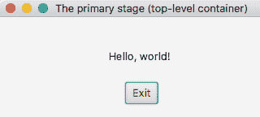
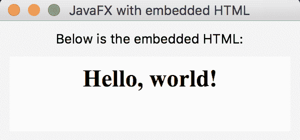
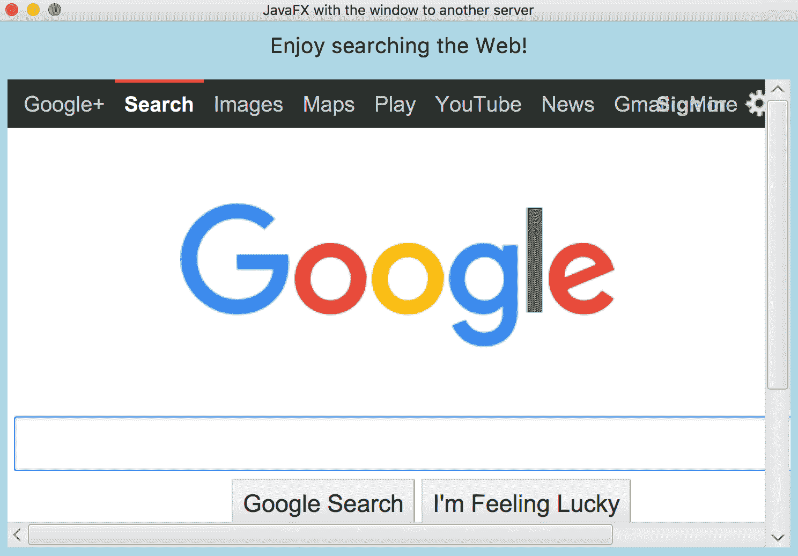
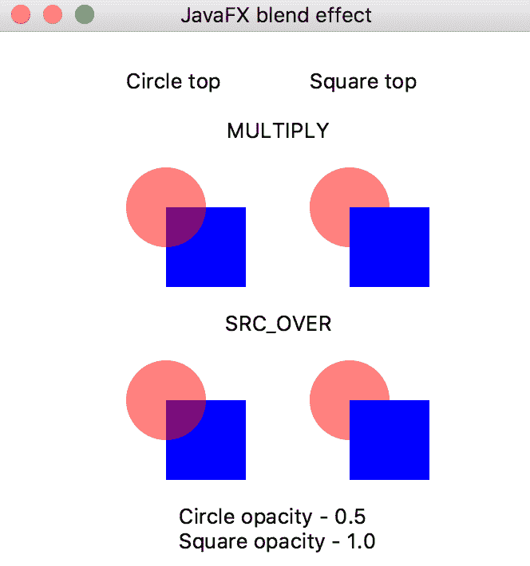

# Java GUI Programming

本章概述了 Java **图形用户界面**（ **GUI** ）技术，并演示了 JavaFx 套件如何用于创建 GUI 应用程序。 最新版本的 JavaFX 不仅提供了许多有用的功能，还允许保留和嵌入遗留过程和样式。

本章将介绍以下主题：

*   Java GUI technologies
*   javafx 基础知识
*   你好 javafx.
*   控制元素
*   图表
*   应用 CSS.
*   使用 fxml.
*   嵌入 HTML.
*   播放媒体
*   添加效果

# Java GUI technologies

名称 **Java Foundation 类**（ **JFC** ）可能是很多混乱的源泉。 它意味着*在 Java* 基础上的类，而实际上，JFC 仅包含与 GUI 相关的类和接口。 要精确，JFC 是三个框架的集合：**抽象窗口工具包**（ **awt** ），swing 和 java 2d。

JFC 是 **Java 类库的一部分**（ **JCL** ），尽管 JFC 名称仅在 1997 年作为 JCL 的一部分开始。 当时，Netscape 开发了一个称为 **Internet Foundation 类**的 GUI 库（ **IFC** ）和 Microsoft 创建了**应用程序基础类**（ **AFC** ） GUI 发展也。 因此，当 Sun Microsystems 和 Netscape 决定形成一个新的 GUI 库时，它们是*遗传*这个词 *Foundation* 并创建 JFC。 框架摆幅从 AWT 中取出了 Java GUI 编程，并成功地使用了近二十年。

将一个新的 GUI 编程工具包 JCAAFX 添加到 JCL 中的 JCL 中。它被从 Java 11 中的 JCL 删除，此后，除了 JDK 之外，它还驻留为公司 Gluon 作为可下载模块支持的开源项目。 javafx 使用稍微不同的方法来 GUI 编程而不是 AWT 和 Swing。 它呈现出更符合和更简单的设计，并且有很好的机会成为一个获胜的 Java GUI 编程工具包。

# javafx 基础知识

纽约，伦敦，巴黎和莫斯科等城市有很多剧院，而且居住在那里的人几乎每周几乎都会听到新的比赛和制作。 它使它们不可避免地熟悉剧院术语，其中术语*阶段*，*场景*和*事件*最常使用。 这三个术语也在 javafx 应用结构的基础上。

拥有所有其他组件的 JavaFX 中的顶级容器由`javafx.stage.Stage`类表示。 因此，您可以说，在 JavaFx 应用程序中，一切都发生在舞台上。 从用户的角度来看，它是一个显示区域或窗口，其中所有控件和组件都执行其操作（如剧院中的演员）。 而且，与剧院中的演员类似，它们在场景的上下文中执行它，由`javafx.scene.Scene`类表示。 因此，像剧院中的播放一样，javafx 应用程序是由一次在`Stage`对象中呈现的`Scene`对象组成。 每个`Scene`对象包含一个图形，它定义了名为**节点**的场景 actors 的位置，在 javafx 中：控件，布局，组，形状等。 他们每个人都延伸了抽象类`javafx.scene.Node`。

一些节点控件与事件相关联：例如，检查按钮或复选框。 可以通过与相应控制元素相关联的事件处理程序来处理这些事件。

JavaFX 应用程序的主类必须扩展有几种生命周期方法的抽象类`java.application.Application`。 我们在调用序列中列出它们：`launch()`，`init()`，`notifyPreloader()`，`start()`，`stop()`。 它看起来很少见。 但是，最可能，您需要仅实现一种方法`start()`，其中构建和执行实际的 GUI。 所以，我们将审查只为完整性的所有方法：

*   `static void launch(Class<? extends Application> appClass, String... args)`：启动应用程序，通常由主要方法调用; 在调用`Platform.exit()`或所有应用程序窗口关闭之前，不会返回; `appClass`参数必须是`Application`的公共子类，具有公共 No-Argument 构造函数
*   `static void launch(String... args)`：与前面的方法相同，假设`Application`的公共子类是立即封闭的类; 这是最常用于启动 javafx 应用程序的方法; 我们也将在我们的例子中使用它
*   `void init()`：在加载`Application`类后调用此方法; 它通常用于某种资源初始化; 默认实施没有; 我们不会使用它
*   `void notifyPreloader(Preloader.PreloaderNotification info)`：可以用来在初始化需要很长时间时显示进展; 我们不会使用它
*   `abstract void start(Stage primaryStage)`：我们将实施的方法; 在`init()`方法返回之后，它在系统准备好完成主作工作后调用; `primaryStage`参数是应用程序将呈现其场景
    的阶段
*   `void stop()`：当申请应该停止时调用它; 可用于释放资源; 默认实施没有; 我们不会使用它

javafx 工具包的 API 可以在线找到（ [https://openjfx.io/javadoc/11/](https://openjfx.io/javadoc/11/) ）。 就像这种写作一样，最新版本是 11\. Oracle 也提供了广泛的文档和代码示例（ [https://docs.oracle.com/javafx/2/](https://docs.oracle.com/javafx/2/) ）。 该文档包括 Scene Builder（开发工具）的描述和用户手册，提供了可视布局环境，并允许您快速设计 JavaFx 应用程序的用户界面而不编写任何代码。 此工具可能对创建复杂和复杂的 GUI 非常有用，并且许多人一直这样做。 但是，在本书中，我们将专注于 javafx 代码写入而不使用此工具。

为了能够这样做，首先需要三个步骤：

1.  将以下依赖添加到`pom.xml`文件：

```
<dependency>
   <groupId>org.openjfx</groupId>
   <artifactId>javafx-controls</artifactId>
   <version>11</version>
</dependency>
<dependency>
   <groupId>org.openjfx</groupId>
   <artifactId>javafx-fxml</artifactId>
   <version>11</version>
</dependency>
```

2.  从 [https://gluonhq.com/products/javafx/](https://gluonhq.com/products/javafx) 下载 javafx sdk for of 您的操作系统，并将其解压缩在任何目录中。
3.  假设您将 javafx sdk 解压缩到`/path/JavaFX/`文件夹中，将以下选项添加到 Java 命令上，该命令将在 Linux 平台上启动 JavaFX 应用程序：

```
--module-path /path/JavaFX/lib -add-modules=javafx.controls,javafx.fxml
```

在 Windows 上，相同的选项如下所示：

```
--module-path C:\path\JavaFX\lib -add-modules=javafx.controls,javafx.fxml
```

“/ path / javavafx /”和“c：\ path \ javafx \”是您需要通过包含 javafx sdk 的文件夹的实际路径来替换的占位符。

假设应用程序的主类是`HelloWorld`，在 IntelliJ 的情况下，请按如下方式输入`VM options`字段中的前面的选项：


必须将这些选项添加到源代码包`ch12_gui`的`HelloWorld`，`BlendEffect`和`OtherEffects`类的运行/调试配置中。 如果您更喜欢不同的 IDE 或具有不同的操作系统，您可以查找有关如何将其设置为`openjfx.io`文档（ [https://openjfx.io/openjfx-docs/#introduction](https://openjfx.io/openjfx-docs/#introduction) 的建议。

要从命令行中运行`HelloWorld`，`BlendEffect`和`OtherEffects`类，请在项目根目录（其中`pom.xml`文件所在的 Linux 平台上使用以下命令）：

```
mvn clean package

java --module-path /path/javaFX/lib --add-modules=javafx.controls,javafx.fxml -cp target/learnjava-1.0-SNAPSHOT.jar:target/libs/* com.packt.learnjava.ch12_gui.HelloWorld

java --module-path /path/javaFX/lib --add-modules=javafx.controls,javafx.fxml -cp target/learnjava-1.0-SNAPSHOT.jar:target/libs/* com.packt.learnjava.ch12_gui.BlendEffect

java --module-path /path/javaFX/lib --add-modules=javafx.controls,javafx.fxml -cp target/learnjava-1.0-SNAPSHOT.jar:target/libs/* com.packt.learnjava.ch12_gui.OtherEffects
```

在 Windows 上，相同的命令看起来如下：

```
mvn clean package

java --module-path C:\path\JavaFX\lib --add-modules=javafx.controls,javafx.fxml -cp target\learnjava-1.0-SNAPSHOT.jar;target\libs\* com.packt.learnjava.ch12_gui.HelloWorld

java --module-path C:\path\JavaFX\lib --add-modules=javafx.controls,javafx.fxml -cp target\learnjava-1.0-SNAPSHOT.jar;target\libs\* com.packt.learnjava.ch12_gui.BlendEffect

java --module-path C:\path\JavaFX\lib --add-modules=javafx.controls,javafx.fxml -cp target\learnjava-1.0-SNAPSHOT.jar;target\libs\* com.packt.learnjava.ch12_gui.OtherEffects
```

`HelloWorld`，`BlendEffect`和`OtherEffects`类中的每一个都有几种`start()`方法：`start1()`，`start2()`等。运行课程后，将`start()`重命名为`start1()`和 `start1()`到`start()`并再次运行上述命令。 然后将`start()`重命名为`start2()`和`start2()`到`start()`并再次运行上述命令。 等等，直到执行所有`start()`方法。 这样，您将看到本章所有示例的结果。

这就是 javafx 的高级别视图。 有了这个，我们迈出了最令人兴奋的（对于任何程序员）部分：编写代码。

# 你好 javafx.

这是`HelloWorld` javafx 应用程序，显示文本你好，世界！ 并退出：

```
import javafx.application.Application;
import javafx.application.Platform;
import javafx.scene.control.Button;
import javafx.scene.layout.Pane;
import javafx.scene.text.Text;
import javafx.scene.Scene;
import javafx.stage.Stage;

public class HelloWorld extends Application {
    public static void main(String... args) {
        launch(args);
    }
    @Override
    public void start(Stage primaryStage) {
        Text txt = new Text("Hello, world!");
        txt.relocate(135, 40);

        Button btn = new Button("Exit");
        btn.relocate(155, 80);
        btn.setOnAction(e:> {
            System.out.println("Bye! See you later!");
            Platform.exit();
        });

        Pane pane = new Pane();
        pane.getChildren().addAll(txt, btn);

        primaryStage.setTitle("The primary stage (top-level container)");
        primaryStage.onCloseRequestProperty()
               .setValue(e:> System.out.println("Bye! See you later!"));
        primaryStage.setScene(new Scene(pane, 350, 150));
        primaryStage.show();
    }
}
```

如您所见，通过调用静态方法`Application.launch(String... args)`来启动应用程序。 `start(Stage primaryStage)`方法创建一个`Text`节点，消息 Hello，World！ 位于绝对位置 135（水平）和 40（垂直）。 然后它创建另一个节点`Button`，其中文本出口位于绝对位置 155（水平）和 80（垂直）。 分配给按钮的动作（点击时），打印再版！ 回头见！ 在屏幕上并强制使用`Platform.exit()`方法退出应用程序。 这两个节点被添加为子节点到允许绝对定位的布局窗格。

`Stage`对象分配了主级（顶级容器）标题。 它还分配了单击窗口上角中的关闭窗口符号（x 按钮）的动作。 此符号显示在 Linux 系统的左侧，右侧在 Windows 系统上。

在创建动作时，我们使用了一个 Lambda 表达式，我们将在[第 13 章](13.html)，*功能编程*中讨论。

创建的布局窗格设置在`Scene`对象上。 场景尺寸设置为 350 水平，垂直 150。 场景对象放在舞台上。 然后通过调用`show()`方法来显示阶段。

如果我们运行上述应用程序，将弹出以下窗口：



单击按钮或上角的 X 按钮导致显示的预期消息：


但是如果在单击 X 按钮后需要做其他事情并关闭窗口关闭，则可以将`stop()`方法的实现添加到`HelloWorld`类。 例如，它可以如下所示：

```
@Override
public void stop(){
    System.out.println("Doing what has to be done before closing");
}
```

如果您所做的，那么，在单击 X 按钮后，显示屏将显示：


此示例为您提供了 javafx 如何工作的感觉。 从现在开始，在审查 JavaFX 功能时，我们将仅在`start()`方法中呈现代码。

该工具包具有大量的包，每个包都有许多类，以及具有许多方法的每个类。 我们没有机会讨论所有这些。 相反，我们将概述 javafx 功能的所有主要领域，并以最简单和最简单的方式展示它。

# 控制元素

**控制元素**包含在`javafx.scene.control`包中（ [https://openjfx.io/javadoc/11/javavavavavavavavavavavavavavafx.controls/javafx/sumene/control/package-summary.html](https://openjfx.io/javadoc/11/javafx.controls/javafx/scene/control/package-summary.html) ）。 其中有超过 80 个，包括按钮，文本字段，复选框，标签，菜单，进度条和滚动条以命名为数少。 正如我们已经提到的那样，每个控制元素是`Node`的子类，其具有 200 多种方法。 所以，你可以想象如何使用 javafx 建立丰富和微调的 GUI。 但是，本书的范围允许我们只涵盖几个元素及其方法。

我们已经看到了一个按钮。 现在让我们使用标签和文本字段来创建一个带有输入字段的简单表单（名字，姓氏和年龄）和`submit`按钮。 我们将按步骤建立。 所有以下代码片段都是`start()`方法的顺序部分。

首先，让我们创建控件：

```
Text txt = new Text("Fill the form and click Submit");
TextField tfFirstName = new TextField();
TextField tfLastName = new TextField();
TextField tfAge = new TextField();
Button btn = new Button("Submit");
btn.setOnAction(e:> action(tfFirstName, tfLastName, tfAge));
```

您可以猜到，文本将用作表单说明。 其余的是非常简单的，看起来非常类似于我们在`HelloWolrd`示例中所看到的。 `action()`是作为以下方法实现的函数：

```
void action(TextField tfFirstName, 
                TextField tfLastName, TextField tfAge ) {
    String fn = tfFirstName.getText();
    String ln = tfLastName.getText();
    String age = tfAge.getText();
    int a = 42;
    try {
        a = Integer.parseInt(age);
    } catch (Exception ex){}
    fn = fn.isBlank() ? "Nick" : fn;
    ln = ln.isBlank() ? "Samoylov" : ln;
    System.out.println("Hello, " + fn + " " + ln + ", age " + a + "!");
    Platform.exit();
}
```

此函数接受三个参数（`javafx.scene.control.TextField`对象），然后获取提交的输入值并仅打印它们。 该代码确保始终有一些可用于打印的默认值，并且输入非数值的年龄不会破坏应用程序。

通过控制和行动到位，然后使用类`javafx.scene.layout.GridPane`将它们放入网格布局：

```
GridPane grid = new GridPane();
grid.setAlignment(Pos.CENTER);
grid.setHgap(15);
grid.setVgap(5);
grid.setPadding(new Insets(20, 20, 20, 20));
```

`GridPane`布局窗格具有从可以设置节点的单元格的行和列。 节点可以跨越列和行。 `setAlignment()`方法将网格的位置设置为场景的中心（默认位置是场景的左上角）。 `setHgap()`和`setVgap()`方法在列（水平）和行之间（垂直）在列之间设置间隔（以像素）。 `setPadding()`方法沿网格窗格的边界添加了一些空间。 `Insets()`对象按顶部，右侧，底部和留下的顺序设置值（以像素为单位）。

现在我们将将创建的节点放在相应的小区中（以两列排列）：

```
int i = 0;
grid.add(txt,    1, i++, 2, 1);
GridPane.setHalignment(txt, HPos.CENTER);
grid.addRow(i++, new Label("First Name"), tfFirstName);
grid.addRow(i++, new Label("Last Name"),  tfLastName);
grid.addRow(i++, new Label("Age"), tfAge);
grid.add(btn,    1, i);
GridPane.setHalignment(btn, HPos.CENTER);
```

`add()`方法接受三个或五个参数：

*   节点，列索引，行索引
*   节点，列索引，行索引，跨度有多少列，跨度有多少行

列和行指数从`0`开始。

`setHalignment()`方法设置单元中节点的位置。 枚举`HPos`有值：`LEFT`，`RIGHT`，`CENTER`。 方法`addRow(int i, Node... nodes)`接受行索引和节点的 varargs。 我们使用它来放置`Label`和`TextField`对象。

`start()`方法的其余部分与`HellowWorld`示例非常相似（仅标题和大小已更改）：

```
primaryStage.setTitle("Simple form example");
primaryStage.onCloseRequestProperty()
        .setValue(e -> System.out.println("Bye! See you later!"));
primaryStage.setScene(new Scene(grid, 300, 200));
primaryStage.show();
```

如果我们运行刚刚实现的`start()`方法，结果将如下：


我们可以如下填充数据，例如：


单击“提交”按钮后，将显示以下消息，并存在应用程序：


为帮助可视化布局，特别是在更复杂的设计的情况下，可以使用网格方法`setGridLinesVisible(boolean v)`使网格线可见。 它有助于了解细胞是如何对齐的。 我们可以将以下行添加到我们的示例：

```
grid.setGridLinesVisible(true);

```

我们再次运行，结果如下：


如您所见，现在明确概述布局，有助于可视化设计。

`javafx.scene.layout`包包括 24 个布局类，如`Pane`（我们在`HelloWorld`示例中看到它），`StackPane`（允许我们覆盖节点），`FlowPane`（允许节点的位置流动 窗口的大小更改），`AnchorPane`（保留相对于其锚点的节点位置），以命名几个。 `VBox`布局将在下一节*图表*中进行说明。

# 图表

javafx 为`javafx.scene.chart`包中的数据可视化提供了以下图表组件：

*   `LineChart`：在系列中的数据点之间添加一条线; 通常用于随着时间的推移呈现趋势
*   `AreaChart`：类似于`LineChart`，但填充连接数据点和轴之间的线之间的区域; 通常用于比较累积的总数随着时间的推移
*   `BarChart`：将数据呈现为矩形条; 用于可视化离散数据
*   `PieChart`：将一个圆圈分为段（填充有不同颜色），每个段表示值的总量的比例; 我们将在本节中展示它
*   `BubbleChart`：将数据显示为称为**气泡**的二维椭圆形状，允许呈现三个参数
*   `ScatterChart`：介绍 AS-IS 系列中的数据点; 用于识别群集的存在（数据相关）

以下示例演示了测试结果如何呈现为饼图。 每个段代表成功的测试数量，失败或忽略：

```
Text txt = new Text("Test results:");

PieChart pc = new PieChart();
pc.getData().add(new PieChart.Data("Succeed", 143));
pc.getData().add(new PieChart.Data("Failed" ,  12));
pc.getData().add(new PieChart.Data("Ignored",  18));

VBox vb = new VBox(txt, pc);
vb.setAlignment(Pos.CENTER);
vb.setPadding(new Insets(10, 10, 10, 10));

primaryStage.setTitle("A chart example");
primaryStage.onCloseRequestProperty()
        .setValue(e:> System.out.println("Bye! See you later!"));
primaryStage.setScene(new Scene(vb, 300, 300));
primaryStage.show();

```

我们已经创建了两个节点 - `Text`和`PieChart` - 放置在`VBox`布局的小区中，将它们设置在列中，一个上方另一个。 我们在`VBox`窗格的边缘周围添加了 10 个像素的填充。 请注意，VBOX 扩展了`Node`和`Pane`类，因为其他窗格也是如此。 我们还使用`setAlignment()`方法将窗格放在场景中心。 其余的与所有其他先前的示例相同，除了场景标题和大小。

如果我们运行前面的示例，结果将如下：


`PieChart`类以及任何其他图表都具有许多其他方法，其可以以用户友好的方式呈现更复杂和动态的数据。

# 应用 CSS.

默认情况下，javafx 使用分发 jar 文件附带的样式表。 要覆盖默认样式，可以使用`getStylesheets()`方法将样式表添加到场景：

```
scene.getStylesheets().add("/mystyle.css");
```

`mystyle.css`文件必须放入`src/main/resources`文件夹中。 让我们执行它并将`mystyle.css`文件添加到`HelloWorld`示例：

```
#text-hello {
  :fx-font-size: 20px;
   -fx-font-family: "Arial";
   -fx-fill: red;
}
.button {
   -fx-text-fill: white;
   -fx-background-color: slateblue;
}
```

正如您所看到的，我们希望以某种方式拟合具有 ID `text-hello`的按钮节点和`Text`节点。 我们还必须通过将 ID 添加到`Text`元素和样式表文件到场景来修改 HelloWorld 示例：

```
Text txt = new Text("Hello, world!");
txt.setId("text-hello");
txt.relocate(115, 40);

Button btn = new Button("Exit");
btn.relocate(155, 80);
btn.setOnAction(e -> {
    System.out.println("Bye! See you later!");
    Platform.exit();
});

Pane pane = new Pane();
pane.getChildren().addAll(txt, btn);

Scene scene = new Scene(pane, 350, 150);
scene.getStylesheets().add("/mystyle.css");

primaryStage.setTitle("The primary stage (top-level container)");
primaryStage.onCloseRequestProperty()
        .setValue(e -> System.out.println("\nBye! See you later!"));
primaryStage.setScene(scene);
primaryStage.show();

```

如果我们现在运行此代码，结果将如下：


或者，可以在任何将用于覆盖文件样式表的任何节点上设置内联样式，默认为默认值。 让我们将以下行添加到最新版本的`HelloWorld`示例：

```

btn.setStyle("-fx-text-fill: white; -fx-background-color: red;");
```

如果我们再次运行示例，结果将如下：


通过 javafx CSS 参考指南（ [https://docs.oracle.com/javafx/2/api/javafx/scene/doc-files/cssref.html](https://docs.oracle.com/javafx/2/api/javafx/scene/doc-files/cssref.html) ）来了解品种和 定制样式可能的选项。

# 使用 fxml.

**fxml** 是一种基于 XML 的语言，允许构建用户界面并独立维护（就查看和 viseSy 或其他演示相关的更改）的应用程序（业务）逻辑。 使用 FXML，您可以设计用户界面，甚至没有编写一行 Java 代码。

FXML 没有架构，但其功能反映了用于构建场景的 JavaFX 对象的 API。 这意味着您可以使用 API​​文档来了解 FXML 结构中允许的标记和属性。 大多数时候，JavaFx 类可以用作标签及其属性作为属性。

除了 FXML 文件（视图）外，控制器（Java 类）还可用于处理模型并组织页面流。 该模型包括由视图和控制器管理的域对象组成。 它还允许使用 CSS 样式和 JavaScript 的所有功能。 但在本书中，我们将只能展示基本的 FXML 功能。 您可以在 FXML 介绍中找到的其余部分（ [https://docs.oracle.com/javafx/2/api/javafx/fxml/doc-files/introduction_to_fxml.html](https://docs.oracle.com/javafx/2/api/javafx/fxml/doc-files/introduction_to_fxml.html) ）和在线提供的许多良好教程 。

为了演示 FXML 使用情况，我们将重现我们在*控制元素*部分中创建的简单表单，然后通过添加页面流来增强它。 以下是我们的表单与名字，姓氏和年龄的表单如何在 FXML 中表达：

```
<?xml version="1.0" encoding="UTF-8"?>
<?import javafx.scene.Scene?>
<?import javafx.geometry.Insets?>
<?import javafx.scene.text.Text?>
<?import javafx.scene.control.Label?>
<?import javafx.scene.control.Button?>
<?import javafx.scene.layout.GridPane?>
<?import javafx.scene.control.TextField?>
<Scene fx:controller="com.packt.learnjava.ch12_gui.HelloWorldController"
       xmlns:fx="http://javafx.com/fxml"
       width="350" height="200">
    <GridPane alignment="center" hgap="15" vgap="5">
        <padding>
            <Insets top="20" right="20" bottom="20" left="20"/>
        </padding>
        <Text id="textFill" text="Fill the form and click Submit"
              GridPane.rowIndex="0" GridPane.columnSpan="2">
            <GridPane.halignment>center</GridPane.halignment>
        </Text>
        <Label text="First name"
               GridPane.columnIndex="0" GridPane.rowIndex="1"/>
        <TextField fx:id="tfFirstName"
                   GridPane.columnIndex="1" GridPane.rowIndex="1"/>
        <Label text="Last name"
               GridPane.columnIndex="0" GridPane.rowIndex="2"/>
        <TextField fx:id="tfLastName"
                   GridPane.columnIndex="1" GridPane.rowIndex="2"/>
        <Label text="Age"
               GridPane.columnIndex="0" GridPane.rowIndex="3"/>
        <TextField fx:id="tfAge"
                   GridPane.columnIndex="1" GridPane.rowIndex="3"/>
        <Button text="Submit"
                GridPane.columnIndex="1" GridPane.rowIndex="4"
                onAction="#submitClicked">
            <GridPane.halignment>center</GridPane.halignment>
        </Button>
    </GridPane>
</Scene>
```

正如您所看到的，它表达了已熟悉的所需场景结构，并指定了控制类`HelloWorldController`，我们很快就会看到。 正如我们已经提到的那样，标签匹配我们一直使用的类名，仅使用 Java 构造相同的 GUI。 我们将把`helloWorld.fxml`文件放入`resources`文件夹中。

现在让我们来看看使用前面`HelloWorld`文件的`start()`方法实现：

```
try {
  FXMLLoader lder = new FXMLLoader();
  lder.setLocation(new URL("file:src/main/resources/helloWorld.fxml"));
  Scene scene = lder.load();

  primaryStage.setTitle("Simple form example");
  primaryStage.setScene(scene);
  primaryStage.onCloseRequestProperty()
          .setValue(e -> System.out.println("\nBye! See you later!"));
  primaryStage.show();
} catch (Exception ex){
    ex.printStackTrace();
}
```

`start()`方法只加载`helloWorld.fxml`文件并设置舞台，后者完全按照我们之前的示例完成。 现在让我们看看`HelloWorldController`课程。 如果需要，我们可以启动只有以下内容的应用程序：

```
public class HelloWorldController {
    @FXML
    protected void submitClicked(ActionEvent e) {
    }
}
```

表格将出现，但按钮只能做到。 这就是我们的意思，同时谈论用户界面开发，独立于应用程序逻辑。 注意`@FXML`注释。 它使用其 ID 绑定到 FXML 标记的方法和属性。 以下是全控制器实现的外观：

```
@FXML
private TextField tfFirstName;
@FXML
private TextField tfLastName;
@FXML
private TextField tfAge;
@FXML
protected void submitClicked(ActionEvent e) {
    String fn = tfFirstName.getText();
    String ln = tfLastName.getText();
    String age = tfAge.getText();
    int a = 42;
    try {
        a = Integer.parseInt(age);
    } catch (Exception ex) {
    }
    fn = fn.isBlank() ? "Nick" : fn;
    ln = ln.isBlank() ? "Samoylov" : ln;
    System.out.println("Hello, " + fn + " " + ln + ", age " + a + "!");
    Platform.exit();
}
```

它应该看起来非常熟悉大部分。 唯一的区别是我们不是直接（如前所述）引用字段及其值，但使用标记为注释`@FXML`的绑定。 如果现在运行`HelloWorld`类，页面的外观和行为将与我们在*控制元素*部分中描述的页面完全相同。

现在让我们添加另一个页面并修改代码，使控制器在单击`Submit`按钮之后，将提交的值发送到另一个页面并关闭表单。 为了简单，新页面将仅介绍收到的数据。 这里它的 FXML 如何看：

```
<?xml version="1.0" encoding="UTF-8"?>
<?import javafx.scene.Scene?>
<?import javafx.geometry.Insets?>
<?import javafx.scene.text.Text?>
<?import javafx.scene.layout.GridPane?>

<Scene fx:controller="com.packt.lernjava.ch12_gui.HelloWorldController2"
       xmlns:fx="http://javafx.com/fxml"
       width="350" height="150">
    <GridPane alignment="center" hgap="15" vgap="5">
        <padding>
            <Insets top="20" right="20" bottom="20" left="20"/>
        </padding>
        <Text fx:id="textUser"
              GridPane.rowIndex="0" GridPane.columnSpan="2">
            <GridPane.halignment>center</GridPane.halignment>
        </Text>
        <Text id="textDo" text="Do what has to be done here"
              GridPane.rowIndex="1" GridPane.columnSpan="2">
            <GridPane.halignment>center</GridPane.halignment>
        </Text>
    </GridPane>
</Scene>
```

如您所见，页面只有两个只读的`Text`字段。 第一个（用`id="textUser"`）将显示从上一页传递的数据。 第二个将显示消息执行此处必须在此处完成的内容。 这不是很复杂的，但它展示了如何组织数据和页面的流程。

新页面使用不同的控制器，如下所示：

```
package com.packt.learnjava.ch12_gui;
import javafx.fxml.FXML;
import javafx.scene.text.Text;
public class HelloWorldController2 {
    @FXML
    public Text textUser;
}
```

您可能猜到的是，公共领域`textUser`必须通过第一个控制器`HelloWolrdController`填充该值。 我们开始做吧。 我们修改`submitClicked()`方法如下：

```
@FXML
protected void submitClicked(ActionEvent e) {
    String fn = tfFirstName.getText();
    String ln = tfLastName.getText();
    String age = tfAge.getText();
    int a = 42;
    try {
        a = Integer.parseInt(age);
    } catch (Exception ex) {}
    fn = fn.isBlank() ? "Nick" : fn;
    ln = ln.isBlank() ? "Samoylov" : ln;
    String user = "Hello, " + fn + " " + ln + ", age " + a + "!";
    //System.out.println("\nHello, " + fn + " " + ln + ", age " + a + "!");
    //Platform.exit();

    goToPage2(user);
    Node source = (Node) e.getSource();
    Stage stage = (Stage) source.getScene().getWindow();
    stage.close();
}
```

而不是仅仅打印提交的（或默认的）数据并从应用程序退出（参见两行注释出来），我们调用`goToPage2()`方法并将提交的数据作为参数传递。 然后我们从事件中提取引用当前窗口的阶段并关闭它。

`goToPage2()`方法如下所示：

```
try {
  FXMLLoader lder = new FXMLLoader();
  lder.setLocation(new URL("file:src/main/resources/helloWorld2.fxml"));
  Scene scene = lder.load();

  HelloWorldController2 c = loader.getController();
  c.textUser.setText(user);

  Stage primaryStage = new Stage();
  primaryStage.setTitle("Simple form example. Page 2.");
  primaryStage.setScene(scene);
  primaryStage.onCloseRequestProperty()
            .setValue(e -> {
                System.out.println("Bye! See you later!");
                Platform.exit();
            });
  primaryStage.show();
} catch (Exception ex) {
    ex.printStackTrace();
}
```

它加载`helloWorld2.fxml`文件，从中提取控制器对象，并将其设置为传递的值。 其余的是您现在已经多次看到的相同阶段配置。 唯一的区别是添加到标题中。

如果我们现在执行`HelloWorld`类，我们将看到熟悉的表单并用数据填写它：


单击“提交”按钮后，将关闭此窗口，将出现新的窗口：


我们单击左上角（或在 Windows 右上角）中的 X 按钮，查看我们之前看到的相同消息：


与预期工作相同的阶段动作功能和`stop()`方法。

有了这个，我们总结了我们的 FXML 演示文稿并转移到将 HTML 添加到 JavaFX 应用程序的下一个主题。

# 嵌入 HTML.

要将 HTML 添加到 JavaFx 很容易。 您所要做的就是使用提供一个窗口的`javafx.scene.web.WebView`类，其中添加的 HTML 在浏览器中发生类似地呈现。 `WebView`类使用开源浏览器引擎 WebKit，因此支持完全浏览功能。

与所有其他 JavaFX 组件一样，`WebView`类扩展了`Node`类，可以在 Java 代码中处理。 此外，它还具有自己的属性和方法，允许将浏览器窗口调整为包含的应用程序，通过设置窗口大小（max，min，首选高度和宽度），字体缩放，缩放速率，添加 CSS，启用上下文（ 右键单击）菜单和类似。 `getEngine()`方法返回与它相关联的`javafx.scene.web.WebEngine`对象。 它提供了加载 HTML 页面的能力，导航它们，将不同的样式应用于加载的页面，以访问其浏览历史记录和文档模型，并执行 JavaScript。

要开始使用`javafx.scene.web`包，必须先采取两个步骤：

1.  将以下依赖添加到`pom.xml`文件：

```
<dependency>
 <groupId>org.openjfx</groupId>
 <artifactId>javafx-web</artifactId>
 <version>11.0.2</version>
</dependency>

```

`javafx-web`的版本通常与 Java 版本保持同步，但在此编写版本 12 的`javafx-web`尚未发布时，我们使用最新的可用版本 11.0.2。

2.  由于`javafx-web`使用已从 Java 9 删除的软件包`com.sun.*`（ [https://docs.oracle.com/javase/9​​/migrate/toc.htm#jsmig-guid-f7696e02-a1fb -4d5a -b1f2-89e7007d4096](https://docs.oracle.com/javase/9/migrate/toc.htm#JSMIG-GUID-F7696E02-A1FB-4D5A-B1F2-89E7007D4096) ），用于从 Java 9+访问`com.sun.*`软件包，除了`--module-path`和`--add-modules`之外，还可以在 *JavaFx 基础*部分中描述 RUN / Debug 配置`ch12_gui`包的类`HtmlWebView`：

```
--add-exports javafx.graphics/com.sun.javafx.sg.prism=ALL-UNNAMED 
--add-exports javafx.graphics/com.sun.javafx.scene=ALL-UNNAMED 
--add-exports javafx.graphics/com.sun.javafx.util=ALL-UNNAMED 
--add-exports javafx.base/com.sun.javafx.logging=ALL-UNNAMED 
--add-exports javafx.graphics/com.sun.prism=ALL-UNNAMED 
--add-exports javafx.graphics/com.sun.glass.ui=ALL-UNNAMED 
--add-exports javafx.graphics/com.sun.javafx.geom.transform=ALL-UNNAMED 
--add-exports javafx.graphics/com.sun.javafx.tk=ALL-UNNAMED 
--add-exports javafx.graphics/com.sun.glass.utils=ALL-UNNAMED 
--add-exports javafx.graphics/com.sun.javafx.font=ALL-UNNAMED 
--add-exports javafx.graphics/com.sun.javafx.application=ALL-UNNAMED 
--add-exports javafx.controls/com.sun.javafx.scene.control=ALL-UNNAMED 
--add-exports javafx.graphics/com.sun.javafx.scene.input=ALL-UNNAMED 
--add-exports javafx.graphics/com.sun.javafx.geom=ALL-UNNAMED 
--add-exports javafx.graphics/com.sun.prism.paint=ALL-UNNAMED 
--add-exports javafx.graphics/com.sun.scenario.effect=ALL-UNNAMED 
--add-exports javafx.graphics/com.sun.javafx.text=ALL-UNNAMED 
--add-exports javafx.graphics/com.sun.javafx.iio=ALL-UNNAMED
--add-exports javafx.graphics/com.sun.scenario.effect.impl.prism=ALL-UNNAMED
--add-exports javafx.graphics/com.sun.javafx.scene.text=ALL-UNNAMED
```

要从命令行执行类`HtmlWebView`，请使用以下命令：

```
mvn clean package

java --module-path /path/javaFX/lib --add-modules=javafx.controls,javafx.fxml --add-exports javafx.graphics/com.sun.javafx.sg.prism=ALL-UNNAMED --add-exports javafx.graphics/com.sun.javafx.scene=ALL-UNNAMED --add-exports javafx.graphics/com.sun.javafx.util=ALL-UNNAMED --add-exports javafx.base/com.sun.javafx.logging=ALL-UNNAMED --add-exports javafx.graphics/com.sun.prism=ALL-UNNAMED --add-exports javafx.graphics/com.sun.glass.ui=ALL-UNNAMED --add-exports javafx.graphics/com.sun.javafx.geom.transform=ALL-UNNAMED --add-exports javafx.graphics/com.sun.javafx.tk=ALL-UNNAMED --add-exports javafx.graphics/com.sun.glass.utils=ALL-UNNAMED  --add-exports javafx.graphics/com.sun.javafx.font=ALL-UNNAMED  --add-exports javafx.graphics/com.sun.javafx.application=ALL-UNNAMED --add-exports javafx.controls/com.sun.javafx.scene.control=ALL-UNNAMED --add-exports javafx.graphics/com.sun.javafx.scene.input=ALL-UNNAMED --add-exports javafx.graphics/com.sun.javafx.geom=ALL-UNNAMED  --add-exports javafx.graphics/com.sun.prism.paint=ALL-UNNAMED  --add-exports javafx.graphics/com.sun.scenario.effect=ALL-UNNAMED --add-exports javafx.graphics/com.sun.javafx.text=ALL-UNNAMED --add-exports javafx.graphics/com.sun.javafx.iio=ALL-UNNAMED --add-exports javafx.graphics/com.sun.scenario.effect.impl.prism=ALL-UNNAMED --add-exports javafx.graphics/com.sun.javafx.scene.text=ALL-UNNAMED  -cp target/learnjava-1.0-SNAPSHOT.jar:target/libs/* com.packt.learnjava.ch12_gui.HtmlWebView
```

在 Windows 上，相同的命令看起来如下：

```
mvn clean package

java --module-path C:\path\JavaFX\lib --add-modules=javafx.controls,javafx.fxml --add-exports javafx.graphics/com.sun.javafx.sg.prism=ALL-UNNAMED --add-exports javafx.graphics/com.sun.javafx.scene=ALL-UNNAMED --add-exports javafx.graphics/com.sun.javafx.util=ALL-UNNAMED --add-exports javafx.base/com.sun.javafx.logging=ALL-UNNAMED --add-exports javafx.graphics/com.sun.prism=ALL-UNNAMED --add-exports javafx.graphics/com.sun.glass.ui=ALL-UNNAMED --add-exports javafx.graphics/com.sun.javafx.geom.transform=ALL-UNNAMED --add-exports javafx.graphics/com.sun.javafx.tk=ALL-UNNAMED --add-exports javafx.graphics/com.sun.glass.utils=ALL-UNNAMED  --add-exports javafx.graphics/com.sun.javafx.font=ALL-UNNAMED  --add-exports javafx.graphics/com.sun.javafx.application=ALL-UNNAMED --add-exports javafx.controls/com.sun.javafx.scene.control=ALL-UNNAMED --add-exports javafx.graphics/com.sun.javafx.scene.input=ALL-UNNAMED --add-exports javafx.graphics/com.sun.javafx.geom=ALL-UNNAMED  --add-exports javafx.graphics/com.sun.prism.paint=ALL-UNNAMED  --add-exports javafx.graphics/com.sun.scenario.effect=ALL-UNNAMED --add-exports javafx.graphics/com.sun.javafx.text=ALL-UNNAMED --add-exports javafx.graphics/com.sun.javafx.iio=ALL-UNNAMED --add-exports javafx.graphics/com.sun.scenario.effect.impl.prism=ALL-UNNAMED --add-exports javafx.graphics/com.sun.javafx.scene.text=ALL-UNNAMED  -cp target\learnjava-1.0-SNAPSHOT.jar;target\libs\* com.packt.learnjava.ch12_gui.HtmlWebView
```

类`HtmlWebView`也包含几种`start()`方法。 按照 *javafx 基础*部分中所述，重命名并执行它们。

我们现在看一些例子。 我们创建一个新的应用程序`HtmlWebView`，并使用 VM 选项`--module-path`，`--add-modules`和`--add-exports`为其设置 VM 选项。 现在我们可以编写和执行使用`WebView`类的代码。

首先，这是如何将简单的 HTML 添加到 JavaFX 应用程序中：

```
WebView wv = new WebView();
WebEngine we = wv.getEngine();
String html = "<html><center><h2>Hello, world!</h2></center></html>";
we.loadContent(html, "text/html");
Scene scene = new Scene(wv, 200, 60);
primaryStage.setTitle("My HTML page");
primaryStage.setScene(scene);
primaryStage.onCloseRequestProperty()
            .setValue(e -> System.out.println("Bye! See you later!"));
primaryStage.show();
```

前面的代码创建一个`WebView`对象，获取`WebEngine`对象从它，使用所获取的`WebEngine`对象加载 html，在场景上设置`WebView`对象，并配置舞台。 `loadContent()`方法接受两个字符串：内容及其 MIME 类型。 内容字符串可以在代码中构建，也可以从读取`.html`文件中创建。

如果我们运行前面的示例，结果将如下：


如有必要，您可以在同一窗口中显示其他 javafx 节点以及`WebView`对象。 例如，让我们在嵌入式 HTML 上方添加一个`Text`节点：

```
Text txt = new Text("Below is the embedded HTML:");

WebView wv = new WebView();
WebEngine we = wv.getEngine();
String html = "<html><center><h2>Hello, world!</h2></center></html>";
we.loadContent(html, "text/html");

VBox vb = new VBox(txt, wv);
vb.setSpacing(10);
vb.setAlignment(Pos.CENTER);
vb.setPadding(new Insets(10, 10, 10, 10));

Scene scene = new Scene(vb, 300, 120);
primaryStage.setScene(scene);
primaryStage.setTitle("JavaFX with embedded HTML");
primaryStage.onCloseRequestProperty()
            .setValue(e -> System.out.println("Bye! See you later!"));
primaryStage.show();
```

如您所见，`WebView`对象未直接在场景上设置，但在布局对象以及`txt`对象上。 然后，在场景上设置布局对象。 前面代码的结果如下：



使用更复杂的 HTML 页面，可以使用`load()`方法直接从文件加载它。 要演示此方法，让我们在`resources`文件夹中使用以下内容创建`form.htm`文件：

```
<!DOCTYPE html>
<html lang="en">
<head>
    <meta charset="UTF-8">
    <title>The Form</title>
</head>
<body>
<form action="http://server:port/formHandler" metrod="post">
    <table>
        <tr>
            <td><label for="firstName">Firts name:</label></td>
            <td><input type="text" id="firstName" name="firstName"></td>
        </tr>
        <tr>
            <td><label for="lastName">Last name:</label></td>
            <td><input type="text" id="lastName" name="lastName"></td>
        </tr>
        <tr>
            <td><label for="age">Age:</label></td>
            <td><input type="text" id="age" name="age"></td>
        </tr>
        <tr>
            <td></td>
            <td align="center">
                <button id="submit" name="submit">Submit</button>
            </td>
        </tr>
    </table>
</form>
</body>
</html>
```

此 HTML 呈现类似于我们在`Using FXML`部分中创建的表单。 单击`Submit`按钮后，表单数据将发布到服务器到`\formHandler` URI。 要在 JavaFx 应用程序内呈现此表单，可以使用以下代码：

```
Text txt = new Text("Fill the form and click Submit");

WebView wv = new WebView();
WebEngine we = wv.getEngine();
File f = new File("src/main/resources/form.html");
we.load(f.toURI().toString());

VBox vb = new VBox(txt, wv);
vb.setSpacing(10);
vb.setAlignment(Pos.CENTER);
vb.setPadding(new Insets(10, 10, 10, 10));

Scene scene = new Scene(vb, 300, 200);

primaryStage.setScene(scene);
primaryStage.setTitle("JavaFX with embedded HTML");
primaryStage.onCloseRequestProperty()
            .setValue(e -> System.out.println("Bye! See you later!"));
primaryStage.show();

```

如您所见，与我们的其他示例的区别在于我们现在使用`File`类及其`toURI()`方法直接访问`src/main/resources/form.html`文件中的 HTML，而不首先将内容转换为字符串。 结果看起来如下：


当您需要从 javafx 应用程序发送请求或发布数据时，此解决方案非常有用。 但是当您希望填充用户的表单已在服务器上可用时，您只能从 URL 加载它。 例如，让我们在 javafx 应用程序中加入 Google 搜索。 我们可以通过将`load()`方法的参数值更改为我们想要加载的页面的 URL 来完成：

```
Text txt = new Text("Enjoy searching the Web!");

WebView wv = new WebView();
WebEngine we = wv.getEngine();
we.load("http://www.google.com");

VBox vb = new VBox(txt, wv);
vb.setSpacing(20);
vb.setAlignment(Pos.CENTER);
vb.setStyle("-fx-font-size: 20px;-fx-background-color: lightblue;");
vb.setPadding(new Insets(10, 10, 10, 10));

Scene scene = new Scene(vb,750,500);
primaryStage.setScene(scene);
primaryStage.setTitle("JavaFX with the window to another server");
primaryStage.onCloseRequestProperty()
        .setValue(e -> System.out.println("Bye! See you later!"));
primaryStage.show();

```

我们还向布局添加了一种样式，以增加字体并将颜色添加到后台，因此我们可以看到嵌入呈现 HTML 的区域的轮廓。 运行此示例时，会出现以下窗口：


在此窗口中，您可以执行通常通过浏览器访问的搜索的所有方面。

并且，正如我们已提及的那样，您可以缩小到呈现页面。 例如，如果我们将`wv.setZoom(1.5)`行添加到前一个示例，则结果将如下：



同样，我们可以从文件中设置字体甚至样式的规模：

```
wv.setFontScale(1.5);
we.setUserStyleSheetLocation("mystyle.css");
```

但请注意，我们在`WebView`对象上设置字体缩放，而我们在`WebEngine`对象中设置样式。

我们还可以使用`WebEngine` class 方法`getDocument()`访问（和操纵）加载页面的 DOM 对象：

```
Document document = we.getDocument();
```

我们还可以访问浏览历史记录，获取当前索引，然后向后移动历史记录：

```
WebHistory history = we.getHistory();  
int currInd = history.getCurrentIndex(); 
history.go(-1);
history.go( 1);
```

并且对于历史的每个条目，我们可以提取其 URL，标题或上次访问的日期：

```
WebHistory history = we.getHistory();
ObservableList<WebHistory.Entry> entries = history.getEntries();
for(WebHistory.Entry entry: entries){
    String url = entry.getUrl();
    String title = entry.getTitle();
    Date date = entry.getLastVisitedDate();
}

```

阅读`WebView`和`WebEngine`类的文档，以获取更多关于如何利用其功能的想法。

# 播放媒体

将图像添加到 JavaFx 应用程序的场景不需要`com.sun.*`包，因此不需要*中列出的`--add-export` VM 选项添加 HTML* 部分。 但是，无论如何都没有受伤，所以离开`--add-export`选项，如果你已经添加了它们。

使用类`javafx.scene.image.Image`和`javafx.scene.image.ImageView`可以将图像包含在场景中。 要演示如何执行此操作，我们将使用位于`resources`文件夹中的 packt logo `packt.png`。 这是它的代码：

```
Text txt = new Text("What a beautiful image!");

FileInputStream input = 
               new FileInputStream("src/main/resources/packt.png");
Image image = new Image(input);
ImageView iv = new ImageView(image);

VBox vb = new VBox(txt, iv);
vb.setSpacing(20);
vb.setAlignment(Pos.CENTER);
vb.setPadding(new Insets(10, 10, 10, 10));

Scene scene = new Scene(vb, 300, 200);
primaryStage.setScene(scene);
primaryStage.setTitle("JavaFX with embedded HTML");
primaryStage.onCloseRequestProperty()
        .setValue(e -> System.out.println("Bye! See you later!"));
primaryStage.show();

```

如果我们运行前面的代码，结果将如下：


当前支持的图像格式是 BMP，GIF，JPEG 和 PNG。 通过`Image`和`ImageView`类的 API（ [https://openjfx.io/javadoc/11/javavavavavavavavavavavavavavavavavavavavavavavavavavavavavafx.package-summary.html](https://openjfx.io/javadoc/11/javafx.graphics/javafx/scene/image/package-summary.html) ）到 了解图像可以根据需要格式化和调整图像的许多方式。

现在让我们看看如何在 javafx 应用程序中使用其他媒体文件。 播放音频或电影文件需要*中列出的`--add-export` VM 选项添加 HTML* 部分。

当前支持的编码如下：

*   **AAC** ：高级音频编码音频压缩
*   **H.264 / AVC** ：H.264 / MPEG-4 部分 10 / **AVC** （**高级视频编码**）视频压缩
*   **mp3** ：原料 mpeg-1,2 和 2.5 音频; 层 I，II 和 III
*   **pcm** ：未压缩，原始音频样本

您可以在 API 文档中查看支持的协议，媒体容器和元数据标记的更详细描述（ [https://openjfx.io/javadoc/11/javavavavavavavavavavavavavavavavavafx.media/javafx/scene/media/package- summary.html](https://openjfx.io/javadoc/11/javafx.media/javafx/scene/media/package-summary.html) ）。

以下三个类允许构建可以添加到场景的媒体播放器：

```
javafx.scene.media.Media;
javafx.scene.media.MediaPlayer;
javafx.scene.media.MediaView;
```

`Media`类代表媒体的来源。 `MediaPlayer`类提供了控制媒体播放的所有方法：`play(),` `stop()`，`pause()`，`setVolume()`和类似。 您还可以指定应播放介质的次数。 `MediaView`类扩展了`Node`类，可以添加到场景中。 它提供了媒体播放器播放的媒体的视图。 它负责媒体外观。

对于演示，让我们添加到`HtmlWebView`应用程序的另一个版本的`start()`方法，它播放在`resources`文件夹中的`jb.mp3`文件：

```
Text txt1 = new Text("What a beautiful music!");
Text txt2 = new Text("If you don't hear music, turn up the volume.");

File f = new File("src/main/resources/jb.mp3");
Media m = new Media(f.toURI().toString());
MediaPlayer mp = new MediaPlayer(m);
MediaView mv = new MediaView(mp);

VBox vb = new VBox(txt1, txt2, mv);
vb.setSpacing(20);
vb.setAlignment(Pos.CENTER);
vb.setPadding(new Insets(10, 10, 10, 10));

Scene scene = new Scene(vb, 350, 100);
primaryStage.setScene(scene);
primaryStage.setTitle("JavaFX with embedded media player");
primaryStage.onCloseRequestProperty()
        .setValue(e -> System.out.println("Bye! See you later!"));
primaryStage.show();

mp.play();
```

注意如何基于源文件构建`Media`对象; 然后基于`Media`对象构建`MediaPlayer`对象，然后设置为`MediaView`类构造函数的属性。 `MediaView`对象在场景上设置以及两个`Text`对象。 我们使用`VBox`对象提供布局。 最后，在舞台上设置场景并且阶段变得可见（在`show()`方法完成后），在`MediaPlayer`对象上调用`play()`方法。 默认情况下，播放媒体一次。

如果我们执行前面的代码，将出现以下窗口，并且将播放`jb.m3`文件：


我们可以添加控件来停止，暂停和调整卷，但它需要更多的代码，并且不适用于本书的预期大小。 您可以在 Oracle 在线文档中找到有关如何在 Oracle 在线文档中进行的指南（ [https://docs.oracle.com/javafx/2/media/jfxpub-media.htm](https://docs.oracle.com/javafx/2/media/jfxpub-media.htm) ）。

可以类似地播放`sea.mp4`电影文件：

```
Text txt = new Text("What a beautiful movie!");

File f = new File("src/main/resources/sea.mp4");
Media m = new Media(f.toURI().toString());
MediaPlayer mp = new MediaPlayer(m);
MediaView mv = new MediaView(mp);

VBox vb = new VBox(txt, mv);
vb.setSpacing(20);
vb.setAlignment(Pos.CENTER);
vb.setPadding(new Insets(10, 10, 10, 10));

Scene scene = new Scene(vb, 650, 400);
primaryStage.setScene(scene);
primaryStage.setTitle("JavaFX with embedded media player");
primaryStage.onCloseRequestProperty()
        .setValue(e -> System.out.println("Bye! See you later!"));
primaryStage.show();

mp.play();
```

唯一的区别是显示此特定剪辑的完整帧所需的场景的不同大小。 在几次试验和错误调整后，我们弄清楚了必要的大小。 或者，我们可以使用`MediaView`方法`autosize()`，`preserveRatioProperty()`，`setFitHeight()`，`setFitWidth()`，`fitWidthProperty()`，`fitHeightProperty()`，以及调整嵌入式窗口的大小并匹配 场景自动。 如果我们执行前面的示例，将弹出以下窗口并播放剪辑：


我们甚至可以并行播放 - 音频和视频文件，从而提供带有原声带的电影：

```
Text txt1 = new Text("What a beautiful movie and sound!");
Text txt2 = new Text("If you don't hear music, turn up the volume.");

File fs = new File("src/main/resources/jb.mp3");
Media ms = new Media(fs.toURI().toString());
MediaPlayer mps = new MediaPlayer(ms);
MediaView mvs = new MediaView(mps);

File fv = new File("src/main/resources/sea.mp4");
Media mv = new Media(fv.toURI().toString());
MediaPlayer mpv = new MediaPlayer(mv);
MediaView mvv = new MediaView(mpv);

VBox vb = new VBox(txt1, txt2, mvs, mvv);
vb.setSpacing(20);
vb.setAlignment(Pos.CENTER);
vb.setPadding(new Insets(10, 10, 10, 10));

Scene scene = new Scene(vb, 650, 500);
primaryStage.setScene(scene);
primaryStage.setTitle("JavaFX with embedded media player");
primaryStage.onCloseRequestProperty()
        .setValue(e -> System.out.println("Bye! See you later!"));
primaryStage.show();

mpv.play();
mps.play();

```

可以这样做，因为每个玩家被自己的线程执行。

有关`javafx.scene.media`包的更多信息，请在线阅读 API 和 Developer Guide：

*   [https://openjfx.io/javadoc/11/javafx.media/javafx/scene/media/package-summary.html](https://openjfx.io/javadoc/11/javafx.media/javafx/scene/media/package-summary.html)
*   [https://docs.oracle.com/javafx/2/media/jfxpub-media.htm](https://docs.oracle.com/javafx/2/media/jfxpub-media.htm)

# 添加效果

`javafx.scene.effects`包包含许多类，允许向节点添加各种效果：

*   `Blend`：使用预定义的`BlendMode` s 之一组合两个源（通常是图像）的像素
*   `Bloom`：使输入图像更亮，使其似乎发光
*   `BoxBlur`：将模糊添加到图像中
*   `ColorAdjust`：允许调整色调，饱和度，亮度和与图像对比度
*   `ColorInput`：呈现填充给定`Paint`的矩形区域
*   `DisplacementMap`：将每个像素按指定距离移位
*   `DropShadow`：渲染内容背后给定内容的阴影
*   `GaussianBlur`：使用特定（高斯）方法添加模糊
*   `Glow`：使输入图像看起来发光
*   `InnerShadow`：在框架内创建阴影
*   `Lighting`：模拟内容的光源; 使平面物体看起来更加现实
*   `MotionBlur`：模拟运动中看到的给定内容
*   `PerspectiveTransform`：将内容转换为视角看到的
*   `Reflection`：呈现出实际输入内容以下的输入的反射版本
*   `SepiaTone`：产生棕褐色调效果，类似于古董照片的外观
*   `Shadow`：用模糊边缘创建内容的单色重复

所有效果共享父项 - 抽象类`Effect`。 `Node`类具有`setEffect(Effect e)`方法，这意味着可以将任何效果添加到任何节点中。 这是对节点的应用效果的主要方式 - 在舞台上产生场景的演员（如果我们回忆起在本章的开头推出的类比）。

唯一的例外是`Blend`效果，这使得其使用比使用其他效果更复杂。 除了使用`setEffect(Effect e)`方法之外，一些`Node`类儿童还具有`setBlendMode(BlendMode bm)`方法，该方法允许在重叠时调节图像如何彼此混合。 因此，可以以不同的方式设置不同的混合效果，以彼此覆盖并产生可能难以调试的意外结果。 这就是使`Blend`效应使用更复杂的原因，这就是为什么我们将如何开始概述`Blend`效果如何使用。

有四个方面可以调节两个图像重叠的区域的外观（我们在我们的示例中使用两个图像来使其更加简单，但在实践中，许多图像可以重叠）：

*   ***透明度*属性**的值：这定义了通过图像可以看到多少; 不透明度值 0.0 表示图像完全透明，而不透明度值 1.0 则表示可以看到其背后的内容。
*   **每种颜色的α值和强度**：这使颜色的透明度定义为 0.0-1.0 或 0-255 的双值。
*   **由`enum BlendMode`值定义的混合模式：d** 在每个颜色的模式，透明度和 alpha 值上过上一个，结果也可能取决于添加图像的序列 到现场; 第一添加图像称为**底部输入**，而第二个重叠图像的第二个被称为**顶部输入**; 如果顶部输入完全不透明，则底部输入被顶部输入隐藏。

基于不透明度，颜色的 alpha 值，颜色的数值（强度）和混合模式来计算重叠区域的结果外观，并且可以是以下之一：

*   `ADD`：从顶部输入的颜色和 alpha 组件添加到底部输入的颜色和 alpha 组件
*   `BLUE`：底部输入的蓝色分量用顶部输入的蓝色组件替换为; 其他颜色组件不受影响
*   `COLOR_BURN`：底部输入颜色分量的倒数由顶部输入颜色分量划分，然后所有这些都被反转以产生所得到的颜色
*   `COLOR_DODGE`：底部输入颜色分量由顶部输入颜色组件的倒数除以产生所得到的颜色
*   `DARKEN`：选择来自两个输入的颜色组件的较暗以产生产生的颜色
*   `DIFFERENCE`：从较浅的位置中减去来自两个输入的颜色组件的较暗，以产生所得到的颜色
*   `EXCLUSION`：来自两个输入的颜色组件乘以和加倍，然后从底部输入颜色组件的总和中减去，以产生所得到的颜色
*   `GREEN`：底部输入的绿色分量用顶部输入的绿色成分替换; 其他颜色组件不受影响
*   `HARD_LIGHT`：输入颜色组件乘以或筛选，取决于顶部输入颜色
*   `LIGHTEN`：选择来自两个输入的颜色组件的较浅组件以产生产生的颜色
*   `MULTIPLY`：来自第一输入的颜色组件乘以第二输入的颜色组件
*   `OVERLAY`：取决于底部输入颜色，输入颜色组件要么乘以或筛选
*   `RED`：底部输入的红色分量用顶部输入的红色组件替换为; 其他颜色组件不受影响
*   `SCREEN`：来自两个输入的颜色组件反转，彼此乘以，并且再次倒置该结果以产生所得到的颜色
*   `SOFT_LIGHT`：根据顶部输入颜色，输入颜色组件要么变暗或变暗
*   `SRC_ATOP`：底部输入内部的顶部输入的一部分与底部输入混合
*   `SRC_OVER`：顶部输入在底部输入上混合

要演示`Blend`效果，让我们创建一个名为`BlendEffect`的另一个应用程序。 它不需要`com.sun.*`包，因此不需要`--add-export` VM 选项。 只有`--module-path`和`--add-modules`选项，在 *JavaFX 基本原理*部分中，必须设置用于编译和执行。

本书的范围不允许我们展示所有可能的组合，因此我们将创建一个红色圆圈和蓝色广场：

```
Circle createCircle(){
    Circle c = new Circle();
    c.setFill(Color.rgb(255, 0, 0, 0.5));
    c.setRadius(25);
    return c;
}

Rectangle createSquare(){
    Rectangle r = new Rectangle();
    r.setFill(Color.rgb(0, 0, 255, 1.0));
    r.setWidth(50);
    r.setHeight(50);
    return r;
}
```

我们使用`Color.rgb(int red, int green, int blue, double alpha)`方法来定义每个图中的颜色。 但还有更多的方式来做。 有关更多详细信息，请阅读`Color`类 API 文档（ [https://openjfx.io/javadoc/11/javavavavafx.graphics/javafx/scene/paint/color.html](https://openjfx.io/javadoc/11/javafx.graphics/javafx/scene/paint/Color.html) ）。

要重叠创建的圆和正方形，我们将使用`Group`节点：

```
Node c = createCircle();
Node s = createSquare();
Node g = new Group(s, c);

```

在前面的代码中，广场是底部输入。 我们还将创建一个小组，其中广场是顶级输入：

```
Node c = createCircle();
Node s = createSquare();
Node g = new Group(c, s);
```

区分是重要的，因为我们将圆圈定义为半透明，而广场完全不透明。 我们将在所有示例中使用相同的设置。

让我们比较两种模式`MULTIPLY`和`SRC_OVER`。 我们将使用`setEffect()`方法将它们设置在组上，如下所示：

```
Blend blnd = new Blend();
blnd.setMode(BlendMode.MULTIPLY);
Node c = createCircle();
Node s = createSquare();
Node g = new Group(s, c);
g.setEffect(blnd);
```

对于每种模式，我们创建了两组，一个有顶部输入一个圆圈，另一个有顶部输入一个正方形，我们将四个创建的组放在`GridPane`布局中（有关详细信息，请参阅源代码）。 如果我们运行`BlendEffect`应用程序，结果将是这样的：


如预期的那样，当正方形在顶部（右侧的两个图像）时，重叠区域完全由不透明广场采取。 但是，当圆圈是顶部输入（左侧的两个图像）时，重叠区域有些可见并基于混合效果计算。

但是，如果我们在组上直接设置相同的模式，结果将略有不同。 让我们运行相同的代码，但使用该组上的模式设置：

```
Node c = createCircle();
Node s = createSquare();
Node g = new Group(c, s);
g.setBlendMode(BlendMode.MULTIPLY);
```

如果我们再次运行应用程序，结果将如下所示：



如您所见，圆圈的红颜色略有变化，Modes `MULTIPLY`和`SRC_OVER`之间没有区别。 这是将节点添加到我们在部分开始时所提到的场景的序列的问题。

结果也根据效果设置的节点而变化。 例如，而不是设置对该组的影响，让我们仅在圈子上设置融合效果：

```
Blend blnd = new Blend();
blnd.setMode(BlendMode.MULTIPLY);
Node c = createCircle();
Node s = createSquare();
c.setEffect(blnd);
Node g = new Group(s, c);
```

我们运行应用程序并查看以下内容：


右侧的两个图像保持与所有先前示例中的相同，但左侧的两个图像显示了重叠区域的新颜色。 现在让我们在方形上设置相同的混合效果而不是圆圈，如下所示：

```
Blend blnd = new Blend();
blnd.setMode(BlendMode.MULTIPLY);
Node c = createCircle();
Node s = createSquare();
s.setEffect(blnd);
Node g = new Group(s, c);
```

结果将稍微改变，并将如下屏幕截图所示：


`MULTIPLY`和`SRC_OVER`模式之间没有区别，但红色的颜色不同于我们在圆圈上设置效果。

我们可以使用以下代码再次更改方法并仅在圆上直接设置混合效果模式：

```
Node c = createCircle();
Node s = createSquare();
c.setBlendMode(BlendMode.MULTIPLY);

```

结果再次变化：


将 Blend 模式设置在正方形上仅删除`MULTIPLY`和`SRC_OVER`模式之间的差异：


为避免混淆并使混合的结果更加可预测，您必须观看节点被添加到场景中的序列，并且应用了混合效果的方式的一致性。

在本书提供的源代码中，您将找到`javafx.scene.effects`包中包含的所有效果的示例。 它们都是通过并排的比较来证明。 这是一个例子：


为方便起见，提供了暂停和继续按钮，允许您暂停演示并查看在混合效果上设置的不透明度值的结果。

为了演示所有其他效果，我们创建了另一个名为`OtherEffects`的应用程序，也不需要`com.sun.*`包，因此不需要`--add-export` VM 选项。 所证明的效果包括`Bloom`，`BoxBlur`，`ColorAdjust`，`DisplacementMap`，`DisplacementMap`，`Glow`，`com.sun.*`，`Lighting`，`MotionBlur`，`MotionBlur`，`PerspectiveTransform`，`Reflection`，`ShadowTone` `SepiaTone`和`SepiaTone`。 我们使用了两个图像来展示应用每个效果的结果，Packt 徽标和山湖视图：

```
FileInputStream inputP = 
                   new FileInputStream("src/main/resources/packt.png");
Image imageP = new Image(inputP);
ImageView ivP = new ImageView(imageP);

FileInputStream inputM = 
                  new FileInputStream("src/main/resources/mount.jpeg");
Image imageM = new Image(inputM);
ImageView ivM = new ImageView(imageM);
ivM.setPreserveRatio(true);
ivM.setFitWidth(300);
```

我们还添加了两个允许您暂停并继续演示的两个按钮（它迭代效果和参数的值）：

```
Button btnP = new Button("Pause");
btnP.setOnAction(e1 -> et.pause());
btnP.setStyle("-fx-background-color: lightpink;");

Button btnC = new Button("Continue");
btnC.setOnAction(e2 -> et.cont());
btnC.setStyle("-fx-background-color: lightgreen;");

```

`et`对象是`EffectsThread`线程的对象：

```
EffectsThread et = new EffectsThread(txt, ivM, ivP);

```

该线程通过效果的列表，创建相应的效果 10 次（具有 10 个不同的效果'参数值），每次在每个图像上设置创建的`Effect`对象，然后睡一秒钟以给您一个 审查结果的机会：

```
public void run(){
    try {
        for(String effect: effects){
            for(int i = 0; i < 11; i++){
                double d = Math.round(i * 0.1 * 10.0) / 10.0;
                Effect e = createEffect(effect, d, txt);
                ivM.setEffect(e);
                ivP.setEffect(e);
                TimeUnit.SECONDS.sleep(1);
                if(pause){
                    while(true){
                        TimeUnit.SECONDS.sleep(1);
                        if(!pause){
                            break;
                        }
                    }
                }
            }
        }
        Platform.exit();
    } catch (Exception ex){
        ex.printStackTrace();
    }
}
```

我们将展示如何在下次创建各种效果，并在截图下进行效果结果。 要展示结果，我们使用了`GridPane`布局：

```
GridPane grid = new GridPane();
grid.setAlignment(Pos.CENTER);
grid.setVgap(25);
grid.setPadding(new Insets(10, 10, 10, 10));

int i = 0;
grid.add(txt,    0, i++, 2, 1);
GridPane.setHalignment(txt, HPos.CENTER);
grid.add(ivP,    0, i++, 2, 1);
GridPane.setHalignment(ivP, HPos.CENTER);
grid.add(ivM,    0, i++, 2, 1);
GridPane.setHalignment(ivM, HPos.CENTER);
grid.addRow(i++, new Text());
HBox hb = new HBox(btnP, btnC);
hb.setAlignment(Pos.CENTER);
hb.setSpacing(25);
grid.add(hb,    0, i++, 2, 1);
GridPane.setHalignment(hb, HPos.CENTER);

```

最后，创建的`GridPane`对象传递给场景，从而在我们之前的示例中逐步放置在您熟悉的舞台上：

```
Scene scene = new Scene(grid, 450, 500);
primaryStage.setScene(scene);
primaryStage.setTitle("JavaFX effect demo");
primaryStage.onCloseRequestProperty()
            .setValue(e3 -> System.out.println("Bye! See you later!"));
primaryStage.show();
```

以下屏幕截图描绘了 10 个参数值中的 1 的效果的示例。 在每个屏幕截图下，我们从创建此效果的`createEffect(String effect, double d, Text txt)`方法中呈现代码片段：


```
//double d = 0.9;
txt.setText(effect + ".threshold: " + d);
Bloom b = new Bloom();
b.setThreshold(d);
```


```
// double d = 0.3;
int i = (int) d * 10;
int it = i / 3;
txt.setText(effect + ".iterations: " + it);
BoxBlur bb = new BoxBlur();
bb.setIterations(i);

```


```
double c = Math.round((-1.0 + d * 2) * 10.0) / 10.0;      // 0.6
txt.setText(effect + ": " + c);
ColorAdjust ca = new ColorAdjust();
ca.setContrast(c);

```


```
double h = Math.round((-1.0 + d * 2) * 10.0) / 10.0;     // 0.6
txt.setText(effect + ": " + h);
ColorAdjust ca1 = new ColorAdjust();
ca1.setHue(h);

```


```
double st = Math.round((-1.0 + d * 2) * 10.0) / 10.0;    // 0.6
txt.setText(effect + ": " + st);
ColorAdjust ca3 = new ColorAdjust();
ca3.setSaturation(st);

```


```
int w = (int)Math.round(4096 * d);  //819
int h1 = (int)Math.round(4096 * d); //819
txt.setText(effect + ": " + ": width: " + w + ", height: " + h1);
DisplacementMap dm = new DisplacementMap();
FloatMap floatMap = new FloatMap();
floatMap.setWidth(w);
floatMap.setHeight(h1);
for (int k = 0; k < w; k++) {
    double v = (Math.sin(k / 20.0 * Math.PI) - 0.5) / 40.0;
    for (int j = 0; j < h1; j++) {
        floatMap.setSamples(k, j, 0.0f, (float) v);
    }
}
dm.setMapData(floatMap);

```


```
double rd = Math.round((127.0 * d) * 10.0) / 10.0; // 127.0
System.out.println(effect + ": " + rd);
txt.setText(effect + ": " + rd);
DropShadow sh = new DropShadow();
sh.setRadius(rd);
```


```
double rad = Math.round(12.1 * d *10.0)/10.0;      // 9.7
double off = Math.round(15.0 * d *10.0)/10.0;      // 12.0
txt.setText("InnerShadow: radius: " + rad + ", offset:" + off);
InnerShadow is = new InnerShadow();
is.setColor(Color.web("0x3b596d"));
is.setOffsetX(off);
is.setOffsetY(off);
is.setRadius(rad);

```


```
double sS = Math.round((d * 4)*10.0)/10.0;      // 0.4
txt.setText(effect + ": " + sS);
Light.Spot lightSs = new Light.Spot();
lightSs.setX(150);
lightSs.setY(100);
lightSs.setZ(80);
lightSs.setPointsAtX(0);
lightSs.setPointsAtY(0);
lightSs.setPointsAtZ(-50);
lightSs.setSpecularExponent(sS);
Lighting lSs = new Lighting();
lSs.setLight(lightSs);
lSs.setSurfaceScale(5.0);

```


```
double r = Math.round((63.0 * d)*10.0) / 10.0;      // 31.5
txt.setText(effect + ": " + r);
MotionBlur mb1 = new MotionBlur();
mb1.setRadius(r);
mb1.setAngle(-15);

```


```
// double d = 0.9;
txt.setText(effect + ": " + d); 
PerspectiveTransform pt =
        new PerspectiveTransform(0., 1\. + 50.*d, 310., 50\. - 50.*d,
                   310., 50\. + 50.*d + 1., 0., 100\. - 50\. * d + 2.);

```


```
// double d = 0.6;
txt.setText(effect + ": " + d);
Reflection ref = new Reflection();
ref.setFraction(d);

```


```
// double d = 1.0;
txt.setText(effect + ": " + d);
SepiaTone sep = new SepiaTone();
sep.setLevel(d);

```

本演示的完整源代码提供了本书，可在 GitHub 中提供。

# 概括

在本章中，读者被引入 JavaFx 套件，其主要功能以及如何使用它来创建 GUI 应用程序。 涵盖的主题包括 Java GUI 技术，JavaFX 控制元素，图表，使用 CSS，FXML，嵌入 HTML，播放介质和添加效果。

下一章专用于功能规划。 它概述了 JDK 附带的功能接口，解释了 Lambda 表达式，以及如何在 Lambda 表达式中使用功能界面。 它还解释并演示了如何使用方法引用。

# 测验

1.  javafx 中的顶级内容容器是什么？
2.  JavaFx 中所有场景参与者的基类是什么？
3.  命名 javafx 应用程序的基类。
4.  什么是必须实施的 JavaFX 应用程序的方法？
5.  必须通过主要方法调用哪种`Application`方法来执行 javafx 应用程序？
6.  执行 javafx 应用程序需要哪两个 VM 选项？
7.  使用上角中的 x 按钮关闭 JavaFx 应用程序窗口时调用`Application`方法？
8.  哪个类必须用于嵌入 HTML？
9.  名称必须用于播放媒体的三个类。
10.  播放媒体所需的 VM 选项是什么？
11.  名称五个 javafx 效果。