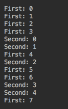
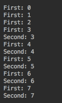
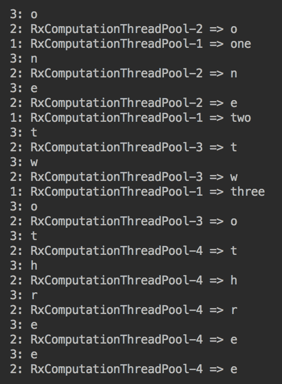
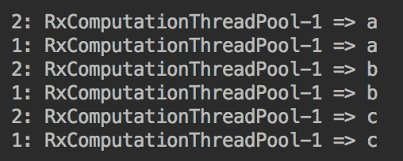

# 反应式程序设计

在本章中，读者将被介绍到**反应式宣言**和反应式编程的世界。我们从定义和讨论主要的相关概念开始—异步、非阻塞和响应。利用它们，我们定义并讨论了反应式编程，主要的反应式框架，并对 **RxJava** 进行了详细的讨论。

本章将讨论以下主题：

*   异步处理
*   非阻塞 API
*   反应式–响应迅速、弹性十足、富有弹性、信息驱动
*   反应流
*   RxJava 公司

# 异步处理

**异步**是指请求者立即得到响应，但结果不存在。相反，请求者等待结果发送给他们，或者保存在数据库中，或者，例如，作为允许检查结果是否准备好的对象呈现。如果是后者，请求者会周期性地调用这个对象的某个方法，当结果就绪时，使用同一对象上的另一个方法检索它。异步处理的优点是请求者可以在等待时做其他事情。

在第 8 章“多线程和并发处理”中，我们演示了如何创建子线程。这样的子线程然后发送一个非异步（阻塞）请求，并等待其返回而不做任何操作。同时，主线程继续执行并定期调用子线程对象，以查看结果是否就绪。这是最基本的异步处理实现。事实上，当我们使用并行流时，我们已经使用了它。

在幕后创建子线程的并行流操作将流分解为多个段，并将每个段分配给一个专用线程进行处理，然后将所有段的部分结果聚合为最终结果。在上一章中，我们甚至编写了执行聚合任务的函数。提醒一下，这个函数被称为一个**组合器**。

让我们用一个例子来比较顺序流和并行流的性能。

# 顺序流和并行流

为了演示顺序处理和并行处理之间的区别，让我们设想一个从 10 个物理设备（传感器）收集数据并计算平均值的系统。以下是从由 ID 标识的传感器收集测量值的`get()`方法：

```java
double get(String id){
    try{
        TimeUnit.MILLISECONDS.sleep(100);
    } catch(InterruptedException ex){
        ex.printStackTrace();
    }
    return id * Math.random();
}
```

我们设置了 100 毫秒的延迟来模拟从传感器收集测量值所需的时间。至于得到的测量值，我们使用`Math.random()`方法。我们将使用方法所属的`MeasuringSystem`类的对象来调用这个`get()`方法

然后我们要计算一个平均值，以抵消单个设备的误差和其他特性：

```java
void getAverage(Stream<Integer> ids) {
    LocalTime start = LocalTime.now();
    double a = ids.mapToDouble(id -> new MeasuringSystem().get(id))
                  .average()
                  .orElse(0);
    System.out.println((Math.round(a * 100.) / 100.) + " in " +
          Duration.between(start, LocalTime.now()).toMillis() + " ms");
}
```

注意我们如何使用`mapToDouble()`操作将 IDs 流转换为`DoubleStream`，以便应用`average()`操作。`average()`操作返回一个`Optional<Double>`对象，我们调用它的`orElse(0)`方法，该方法返回计算值或零（例如，如果测量系统无法连接到它的任何传感器并返回一个空流）

`getAverage()`方法的最后一行打印结果以及计算结果所用的时间。在实际代码中，我们将返回结果并将其用于其他计算。但是，为了演示，我们只是打印出来。

现在我们可以比较顺序流处理和并行处理的性能：

```java
List<Integer> ids = IntStream.range(1, 11)
                             .mapToObj(i -> i)
                             .collect(Collectors.toList());
getAverage(ids.stream());          //prints: 2.99 in 1030 ms
getAverage(ids.parallelStream());  //prints: 2.34 in  214 ms

```

如果运行此示例，结果可能会有所不同，因为您可能还记得，我们将收集的测量值模拟为随机值。

如您所见，并行流的处理速度是顺序流的处理速度的五倍。结果是不同的，因为每次测量产生的结果都略有不同

虽然在幕后，并行流使用异步处理，但这并不是程序员在谈论请求的异步处理时所考虑的。从应用程序的角度来看，它只是并行（也称为并发）处理。它比顺序处理要快，但是主线程必须等到所有的调用都被发出并且数据被检索出来。如果每个调用至少需要 100 毫秒（在我们的例子中是这样），那么所有调用的处理就不能在更短的时间内完成。

当然，我们可以创建一个子线程，让它进行所有调用，并等待调用完成，而主线程则执行其他操作。我们甚至可以创建一个这样做的服务，所以应用程序只需告诉这样的服务必须做什么，然后继续做其他事情。稍后，主线程可以再次调用服务并获得结果或在某个商定的位置获取结果。

这将是程序员们谈论的真正的异步处理。但是，在编写这样的代码之前，让我们先看看位于`java.util.concurrent`包中的`CompletableFuture`类。它完成了所描述的一切，甚至更多。

# 使用 CompletableFuture 对象

使用`CompletableFuture`对象，我们可以通过从`CompletableFuture`对象得到结果，将请求单独发送到测量系统。这正是我们在解释什么是异步处理时描述的场景。让我们在代码中演示一下：

```java
List<CompletableFuture<Double>> list = 
     ids.stream()
        .map(id -> CompletableFuture.supplyAsync(() -> 
                                       new MeasuringSystem().get(id)))
        .collect(Collectors.toList());
```

`supplyAsync()`方法不会等待对测量系统的调用返回。相反，它会立即创建一个`CompletableFuture`对象并返回它，以便客户可以在以后的任何时候使用该对象来检索测量系统返回的值：

```java
LocalTime start = LocalTime.now();
double a = list.stream()
               .mapToDouble(cf -> cf.join().doubleValue())
               .average()
               .orElse(0);
System.out.println((Math.round(a * 100.) / 100.) + " in " +
     Duration.between(start, LocalTime.now()).toMillis() + " ms"); 
                                               //prints: 2.92 in 6 ms
```

也有一些方法允许检查是否返回了值，但这并不是本演示的重点，演示如何使用`CompletableFuture`类来组织异步处理。

创建的`CompletableFuture`对象列表可以存储在任何地方，并且处理速度非常快（在本例中为 6 毫秒），前提是已经收到测量结果。在创建`CompletableFuture`对象列表和处理它们之间，系统没有阻塞，可以做其他事情。

`CompletableFuture`类有许多方法，并支持其他几个类和接口。例如，可以添加固定大小的线程池以限制线程数：

```java
ExecutorService pool = Executors.newFixedThreadPool(3);
List<CompletableFuture<Double>> list = ids.stream()
        .map(id -> CompletableFuture.supplyAsync(() -> 
                         new MeasuringSystem().get(id), pool))
        .collect(Collectors.toList());

```

有许多这样的池用于不同的目的和不同的性能。但这一切并没有改变整个系统的设计，所以我们省略了这些细节。

如您所见，异步处理的功能非常强大。异步 API 还有一个变体，称为**非阻塞 API**，我们将在下一节中讨论。

# 非阻塞 API

非阻塞 API 的客户机希望能够快速返回结果，也就是说，不会被阻塞很长时间。因此，非阻塞 API 的概念意味着一个高度响应的应用程序。它可以同步或异步地处理请求—这对客户端并不重要。但实际上，这通常意味着应用程序使用异步处理，这有助于提高吞吐量和性能。

术语**非阻塞**与`java.nio`包一起使用。**非阻塞输入/输出**（**NIO**）支持密集的输入/输出操作。它描述了应用程序的实现方式：它不为每个请求指定一个执行线程，而是提供多个轻量级工作线程，这些线程以异步和异步方式进行处理同时

# java.io 文件包装与 java.nio 文件包裹

向外部存储器（例如硬盘驱动器）写入数据和从外部存储器（例如硬盘驱动器）读取数据的操作要比仅在存储器中进行的操作慢得多。`java.io`包中已经存在的类和接口工作得很好，但偶尔会成为性能瓶颈。创建新的`java.nio`包是为了提供更有效的 I/O 支持。

`java.io`的实现是基于 I/O 流处理的，如前所述，即使后台发生某种并发，基本上也是一个阻塞操作。为了提高速度，引入了基于对内存中的缓冲区进行读写的`java.nio`实现。这样的设计使得它能够将填充/清空缓冲区的缓慢过程与快速读取/写入缓冲区的过程分离开来。

在某种程度上，它类似于我们在`CompletableFuture`用法示例中所做的。在缓冲区中有数据的另一个优点是，可以检查数据，沿着缓冲区往返，这在从流中顺序读取时是不可能的。它在数据处理过程中提供了更大的灵活性。此外，`java.nio`实现引入了另一个中间过程，称为**通道**，用于与缓冲区之间的批量数据传输。

读取线程从一个通道获取数据，只接收当前可用的数据，或者什么都不接收（如果通道中没有数据）。如果数据不可用，线程可以执行其他操作，而不是保持阻塞状态，例如，读取/写入其他通道，就像我们的`CompletableFuture`示例中的主线程可以自由执行测量系统从传感器读取数据时必须执行的操作一样。

这样，几个工作线程就可以服务于多个 I/O 进程，而不是将一个线程专用于一个 I/O 进程。这种解决方案被称为**非阻塞 I/O**，后来被应用到其他进程中，最突出的是事件循环中的*事件处理*，也称为**运行循环**。

# 事件/运行循环

许多非阻塞系统基于**事件**（或**运行**）循环—一个持续执行的线程。它接收事件（请求、消息），然后将它们分派给相应的事件处理程序（worker）。事件处理程序没有什么特别之处。它们只是程序员专用于处理特定事件类型的方法（函数）。

这种设计被称为**反应器设计模式**。围绕处理并发事件和服务请求而构建，并命名为**反应式编程**和**反应式系统**，即对事件做出反应并对其进行并发处理。

基于事件循环的设计广泛应用于操作系统和图形用户界面中。它在 Spring5 的 SpringWebFlux 中可用，并用 JavaScript 及其流行的执行环境实现节点.JS. 最后一个使用事件循环作为其处理主干。工具箱 Vert.x 也是围绕事件循环构建的。

在采用事件循环之前，为每个传入请求分配一个专用线程，这与我们演示的流处理非常相似。每个线程都需要分配一定数量的非请求特定的资源，因此一些资源（主要是内存分配）被浪费了。然后，随着请求数量的增长，CPU 需要更频繁地将上下文从一个线程切换到另一个线程，以允许或多或少地并发处理所有请求。在负载下，切换上下文的开销足以影响应用程序的性能。

实现事件循环解决了这两个问题。它避免了为每个请求创建一个专用线程，并在处理请求之前一直保留该线程，从而消除了资源浪费。有了事件循环，每个请求只需分配更小的内存就可以捕获其细节，这使得在内存中保留更多的请求成为可能，以便它们可以并发处理。由于上下文大小的减小，CPU 上下文切换的开销也变得更小了。

非阻塞 API 是实现请求处理的方式。它使系统能够处理更大的负载，同时保持高度的响应性和弹性。

# 反应式

术语**反应式**通常用于反应式编程和反应式系统的上下文中。反应式编程（也称为 Rx 编程）基于异步数据流（也称为**反应式流**）。介绍为 Java 的**反应式扩展**（**RX**），又称 [**RxJava**](http://reactivex.io)。后来，RX 支持被添加到了 java9 的`java.util.concurrent`包中。它允许`Publisher`生成一个数据流，而`Subscriber`可以异步订阅该数据流。

反应流和标准流（也称为位于`java.util.stream`包中的 **java8 流**）之间的一个主要区别是，反应流的源（发布者）以自己的速率将元素推送到订户，而在标准流中，新元素仅在前一个元素被推送之后才被推送和发射已处理

如您所见，即使没有这个新的 API，我们也可以通过使用`CompletableFuture`异步处理数据。但是在编写了几次这样的代码之后，您注意到大多数代码只是管道，所以您会觉得必须有一个更简单、更方便的解决方案。这就是[反应流倡议](https://www.reactive-streams.org/)的方式，工作范围定义如下：

“反应流的范围是找到最小的接口，方法和协议集，以描述实现目标所需的必要操作和实体–具有无阻塞背压的异步数据流。”

术语**无阻塞背压**是指异步处理的问题之一：在不需要停止（阻塞）数据输入的情况下，协调传入数据的速率与系统处理它们的能力。解决办法是通知消息来源，消费者很难跟上输入。此外，处理应该以比仅仅阻塞流更灵活的方式对传入数据的速率的变化作出反应，因此名称为*反应式*。

已经有几个库实现了 ReactiveStreamsAPI：[RxJava](http://reactivex.io)、[Reactor](https://projectreactor.io)、[Akka](https://akka.io/docs) 和 [Vertx](https://vertx.io/) 是最有名的。使用 RxJava 或另一个异步流库构成了“反应式编程”。它实现了[反应宣言](https://www.reactivemanifesto.org)中宣布的目标：构建*响应*、*弹性*、*弹性*、*消息驱动*的反应系统。

# 响应式

这个词似乎是不言自明的。及时作出反应的能力是任何系统的基本素质之一。有很多方法可以实现。即使是由足够多的服务器和其他基础设施支持的传统阻塞 API，也可以在不断增长的负载下实现良好的响应。

反应式编程有助于减少硬件的使用。它是有代价的，因为被动代码需要改变我们对控制流的思考方式。但过了一段时间，这种新的思维方式就和其他熟悉的技能一样自然了。

我们将在下面几节中看到许多反应式编程的例子。

# 有弹性的

失败是不可避免的。硬件崩溃、软件有缺陷、接收到意外数据或采用了未经测试的执行路径—这些事件中的任何一个或它们的组合都可能随时发生。*弹性*是系统在意外情况下继续交付预期结果的能力。

例如，可以使用可部署组件和硬件的冗余、系统各部分的隔离以降低多米诺效应的可能性、设计具有自动可更换部件的系统、发出警报以便合格人员能够进行干预。我们还讨论了分布式系统作为设计弹性系统的一个很好的例子。

分布式架构消除了单点故障。此外，将系统分解为许多专门的组件，这些组件使用消息相互通信，可以更好地调整最关键部分的重复，并为它们的隔离和潜在故障的遏制创造更多的机会。

# 弹性的

承受最大可能负载的能力通常与**可伸缩性**有关。但是，在变化的载荷下，而不仅仅是在增长的载荷下，保持相同性能特征的能力被称为**弹性**。

弹性系统的客户不应注意到空闲周期和峰值负载周期之间的任何差异。非阻塞的反应式实现风格促进了这种质量。此外，将程序分解为更小的部分，并将它们转换为可以独立部署和管理的服务，这样就可以对资源分配进行微调。

这种小型服务被称为微服务，它们中的许多一起可以组成一个既可伸缩又有弹性的反应式系统。我们将在下面的部分和下一章更详细地讨论这种架构。

# 消息驱动

我们已经确定组件隔离和系统分布是帮助保持系统响应性、弹性和弹性的两个方面。松散和灵活的连接也是支持这些品质的重要条件。反应式系统的异步特性并没有给设计者留下其他选择，而是在消息上构建组件之间的通信。

它在每个部件周围创造了一个喘息的空间，如果没有这个空间，系统将是一个紧密耦合的整体，容易出现各种问题，更不用说维护的噩梦了。

在下一章中，我们将研究可用于将应用程序构建为使用消息进行通信的松散耦合微服务集合的架构样式。

# 反应流

Java9 中引入的反应流 API 由以下四个接口组成：

```java
@FunctionalInterface
public static interface Flow.Publisher<T> {
    public void subscribe(Flow.Subscriber<T> subscriber);
}
public static interface Flow.Subscriber<T> {
    public void onSubscribe(Flow.Subscription subscription);
    public void onNext(T item);
    public void onError(Throwable throwable);
    public void onComplete();
}
public static interface Flow.Subscription {
    public void request(long numberOfItems);
    public void cancel();
}
public static interface Flow.Processor<T,R>
              extends Flow.Subscriber<T>, Flow.Publisher<R> {
}
```

一个`Flow.Subscriber`对象可以作为参数传递到`Flow.Publisher<T>`的`subscribe()`方法中。然后发布者调用订阅者的`onSubscribe()`方法，并将`Flow.Subsctiption`对象作为参数传递给它。现在订阅者可以调用订阅对象上的`request(long numberOfItems)`向发布者请求数据。这就是**拉取模式**的实现方式，它让订户决定何时请求另一个项目进行处理。订阅者可以通过调用订阅时的`cancel()`方法取消对发布者服务的订阅。

作为回报，发布者可以通过调用订阅者的`onNext()`方法将新项目传递给订阅者。当不再有数据到来时（源中的所有数据都已发出），发布者调用订阅者的`onComplete()`方法。另外，通过调用订阅者的`onError()`方法，发布者可以告诉订阅者它遇到了问题

`Flow.Processor`接口描述了一个既可以充当订阅者又可以充当发布者的实体。它允许创建此类处理器的链（管道），以便订阅者可以从发布者接收项目，对其进行转换，然后将结果传递给下一个订阅者或处理器。

在推送模式中，发布者可以在没有来自订户的任何请求的情况下呼叫`onNext()`。如果处理速度低于项目发布速度，订阅者可以使用各种策略来缓解压力。例如，它可以跳过项目或为临时存储创建一个缓冲区，希望项目生产速度会减慢，订户能够赶上

这是 reactivestreams 计划为支持具有非阻塞背压的异步数据流而定义的最小接口集。如您所见，它允许订阅者和发布者相互交谈并协调传入数据的速率，从而为我们在“反应式”部分讨论的背压问题提供了多种解决方案。

有许多方法可以实现这些接口。目前，在 JDK9 中，只有一个接口的实现：`SubmissionPublisher`类实现了`Flow.Publisher`。原因是这些接口不应该由应用程序开发人员使用。它是一个**服务提供者接口**（**SPI**），由反应流库的开发人员使用。如果需要的话，可以使用已经实现了我们已经提到的 reactivestreamsAPI 的现有工具箱之一：RxJava、Reactor、Akka Streams、Vert.x 或任何其他您喜欢的库。

# RxJava 公司

我们将使用 [**RxJava2.2.7**](http://reactivex.io) 在我们的例子中。可以通过以下依赖项将其添加到项目中：

```java
<dependency>
    <groupId>io.reactivex.rxjava2</groupId>
    <artifactId>rxjava</artifactId>
    <version>2.2.7</version>
</dependency>
```

我们首先比较一下使用`java.util.stream`包和`io.reactivex`包实现相同功能的两个实现。示例程序将非常简单：

*   创建整数流`1`、`2`、`3`、`4`、`5`。
*   只过滤偶数（`2`和`4`。
*   计算每个过滤数字的平方根。
*   计算所有平方根的和。

下面是如何使用`java.util.stream`包实现的：

```java
double a = IntStream.rangeClosed(1, 5)
                    .filter(i -> i % 2 == 0)
                    .mapToDouble(Double::valueOf)
                    .map(Math::sqrt)
                    .sum();
System.out.println(a);          //prints: 3.414213562373095

```

使用 RxJava 实现的相同功能如下所示：

```java
Observable.range(1, 5)
          .filter(i -> i % 2 == 0)
          .map(Math::sqrt)
          .reduce((r, d) -> r + d)
          .subscribe(System.out::println);   //prints: 3.414213562373095

```

RxJava 基于`Observable`对象（扮演`Publisher`角色）和`Observer`，订阅`Observable`并等待数据发出。

相比之下，对于`Stream`功能，`Observable`具有显著不同的功能。例如，流一旦关闭，就不能重新打开，`Observable`对象可以再次使用。举个例子：

```java
Observable<Double> observable = Observable.range(1, 5)
        .filter(i -> i % 2 == 0)
        .doOnNext(System.out::println)    //prints 2 and 4 twice
        .map(Math::sqrt);
observable
        .reduce((r, d) -> r + d)
        .subscribe(System.out::println);  //prints: 3.414213562373095
observable
        .reduce((r, d) -> r + d)
        .map(r -> r / 2)
        .subscribe(System.out::println);  //prints: 1.7071067811865475

```

在前面的示例中，您可以从注释中看到，`doOnNext()`操作被调用了两次，这意味着可观察对象发出了两次值，每个处理管道一次：


如果我们不想让`Observable`运行两次，我们可以通过添加`cache()`操作来缓存它的数据：

```java
Observable<Double> observable = Observable.range(1,5)
        .filter(i -> i % 2 == 0)
        .doOnNext(System.out::println)  //prints 2 and 4 only once
        .map(Math::sqrt)
        .cache();
observable
        .reduce((r, d) -> r + d)
        .subscribe(System.out::println); //prints: 3.414213562373095
observable
        .reduce((r, d) -> r + d)
        .map(r -> r / 2)
        .subscribe(System.out::println);  //prints: 1.7071067811865475

```

如您所见，相同的`Observable`的第二次使用利用了缓存的数据，因此允许更好的性能：


RxJava 提供了如此丰富的功能，我们无法在本书中详细地回顾它。相反，我们将尝试介绍最流行的 API。API 描述了可使用`Observable`对象调用的方法。此类方法通常也称为**操作**（与标准 java8 流的情况一样）或**操作符**（主要用于反应流）。我们将使用这三个术语、方法、操作和运算符作为同义词

# 可观察类型

谈到 rxjava2api（请注意，它与 rxjava1 有很大的不同），我们将使用可以在[这个页面](http://reactivex.io/RxJava/2.x/javadoc/index.html)中找到的在线文档。

观察者订阅接收来自可观察对象的值，该对象可以表现为以下类型之一：

*   **阻塞**：等待结果返回
*   **非阻塞**：异步处理发射的元素
*   **冷**：根据观察者的要求发射一个元素
*   **热**：无论观察者是否订阅，发射元件

可观察对象可以是`io.reactivex `包的以下类别之一的对象：

*   `Observable<T>`：可以不发射、一个或多个元素；不支持背压。
*   `Flowable<T>`：可以不发射、一个或多个元素；支持背压。
*   `Single<T>`：可以发出一个元素或错误；背压的概念不适用。
*   `Maybe<T>`：表示延迟计算；可以不发出值、一个值或错误；背压的概念不适用。
*   `Completable`：表示没有任何值的延迟计算；表示任务完成或错误；背压的概念不适用。

这些类中的每一个的对象都可以表现为阻塞、非阻塞、冷或热可观察。它们的不同之处在于可以发出的值的数量、延迟返回结果的能力或仅返回任务完成标志的能力，以及它们处理背压的能力。

# 阻塞与非阻塞

为了演示这种行为，我们创建了一个可观察的对象，它发出五个连续整数，从`1`开始：

```java
Observable<Integer> obs = Observable.range(1,5);
```

`Observable`的所有阻塞方法（操作符）都以“阻塞”开头，所以`blockingLast()`是阻塞操作符之一，阻塞管道直到最后一个元素被释放：

```java
Double d2 = obs.filter(i -> i % 2 == 0)
               .doOnNext(System.out::println)  //prints 2 and 4
               .map(Math::sqrt)
               .delay(100, TimeUnit.MILLISECONDS)
               .blockingLast();
System.out.println(d2);                        //prints: 2.0
```

在本例中，我们只选择偶数，打印所选元素，然后计算平方根并等待 100 毫秒（模拟长时间运行的计算）。此示例的结果如下所示：


相同功能的非阻塞版本如下所示：

```java
List<Double> list = new ArrayList<>();
obs.filter(i -> i % 2 == 0)
   .doOnNext(System.out::println)  //prints 2 and 4
   .map(Math::sqrt)
   .delay(100, TimeUnit.MILLISECONDS)
   .subscribe(d -> {
        if(list.size() == 1){
            list.remove(0);
        }
        list.add(d);
   });
System.out.println(list);          //prints: []

```

我们使用`List`对象来捕获结果，因为您可能还记得，lambda 表达式不允许使用非 final 变量。

如您所见，结果列表为空。这是因为执行管道计算时没有阻塞（异步）。因此，由于 100 毫秒的延迟，控件同时转到打印列表内容的最后一行，该行仍然是空的。我们可以在最后一行前面设置延迟：

```java
try {
    TimeUnit.MILLISECONDS.sleep(200);
} catch (InterruptedException e) {
    e.printStackTrace();
}
System.out.println(list);   //prints: [2.0]
```

延迟必须至少为 200ms，因为管道处理两个元素，每个元素的延迟为 100ms。现在，如您所见，该列表包含一个期望值`2.0`

这基本上就是阻塞运算符和非阻塞运算符之间的区别。其他表示可观察对象的类也有类似的阻塞运算符。下面是阻塞`Flowable`、`Single`和`Maybe`的示例：

```java
Flowable<Integer> obs = Flowable.range(1,5);
Double d2 = obs.filter(i -> i % 2 == 0)
        .doOnNext(System.out::println)  //prints 2 and 4
        .map(Math::sqrt)
        .delay(100, TimeUnit.MILLISECONDS)
        .blockingLast();
System.out.println(d2);                 //prints: 2.0

Single<Integer> obs2 = Single.just(42);
int i2 = obs2.delay(100, TimeUnit.MILLISECONDS).blockingGet();
System.out.println(i2);                 //prints: 42

Maybe<Integer> obs3 = Maybe.just(42); 
int i3 = obs3.delay(100, TimeUnit.MILLISECONDS).blockingGet(); 
System.out.println(i3);                 //prints: 42 

```

`Completable`类具有允许设置超时的阻塞运算符：

```java
(1) Completable obs = Completable.fromRunnable(() -> {
            System.out.println("Running...");       //prints: Running...
            try {
                TimeUnit.MILLISECONDS.sleep(200);
            } catch (InterruptedException e) {
                e.printStackTrace();
            }
    });                                           
(2) Throwable ex = obs.blockingGet();
(3) System.out.println(ex);                               //prints: null

//(4) ex = obs.blockingGet(15, TimeUnit.MILLISECONDS);
//                                java.util.concurrent.TimeoutException: 
//               The source did not signal an event for 15 milliseconds.

(5) ex = obs.blockingGet(150, TimeUnit.MILLISECONDS);
(6) System.out.println(ex);                               //prints: null

(7) obs.blockingAwait();
(8) obs.blockingAwait(15, TimeUnit.MILLISECONDS);
```

上述代码的结果显示在以下屏幕截图中：


第一条运行消息来自第 2 行，响应阻塞`blockingGet()`方法的调用。第一条空消息来自第 3 行。第 4 行抛出异常，因为超时设置为 15 毫秒，而实际处理设置为 100 毫秒延迟。第二条 Run 消息来自第 5 行，响应于`blockingGet()`方法调用。这一次，超时被设置为 150 毫秒，也就是超过 100 毫秒，并且该方法能够在超时结束之前返回。

最后两行（7 和 8）演示了有无超时的`blockingAwait()`方法的用法。此方法不返回值，但允许可观察管道运行其过程。有趣的是，即使将超时设置为小于管道完成所需时间的值，它也不会因异常而中断。显然，它是在管道处理完成之后开始等待的，除非它是一个稍后将被修复的缺陷（文档对此并不清楚）。

尽管存在阻塞操作（我们将在下面的章节中讨论每种可观察的类型时对这些操作进行更多的回顾），但是它们仅在不可能仅使用非阻塞操作实现所需功能的情况下使用。反应式编程的主要目的是努力以非阻塞方式异步处理所有请求

# 冷还是热

到目前为止，我们看到的所有示例都只演示了一个可观察的*冷*，即那些仅在处理前一个值已经被处理之后，才应处理管道的请求提供下一个值的示例。下面是另一个例子：

```java
Observable<Long> cold = Observable.interval(10, TimeUnit.MILLISECONDS);
cold.subscribe(i -> System.out.println("First: " + i));
pauseMs(25);
cold.subscribe(i -> System.out.println("Second: " + i));
pauseMs(55);

```

我们已经使用方法`interval()`创建了一个`Observable`对象，该对象表示每个指定间隔（在我们的例子中，每 10ms）发出的序列号流。然后我们订阅创建的对象，等待 25ms，再次订阅，再等待 55ms，`pauseMs()`方法如下：

```java
void pauseMs(long ms){
    try {
        TimeUnit.MILLISECONDS.sleep(ms);
    } catch (InterruptedException e) {
        e.printStackTrace();
    }
}
```

如果我们运行前面的示例，输出将如下所示：



正如您所看到的，每个管道都处理了冷可观察到的辐射的每个值。

为了将*冷*可观察物转换成*热*可观察物，我们使用`publish()`方法将可观察物转换成延伸`Observable`的`ConnectableObservable`对象：

```java
ConnectableObservable<Long> hot = 
         Observable.interval(10, TimeUnit.MILLISECONDS).publish();
hot.connect();
hot.subscribe(i -> System.out.println("First: " + i));
pauseMs(25);
hot.subscribe(i -> System.out.println("Second: " + i));
pauseMs(55);

```

如您所见，我们必须调用`connect()`方法，以便`ConnectableObservable`对象开始发出值。输出如下所示：



输出显示第二个管道没有收到前三个值，因为它订阅了后面的可观察值。因此，可观察物发出的值与观察者处理它们的能力无关。如果处理落后，并且新的值不断出现，而之前的值还没有完全处理完，`Observable`类将它们放入缓冲区。如果这个缓冲区足够大，JVM 可能会耗尽内存，因为正如我们已经提到的，`Observable`类没有背压管理的能力。

在这种情况下，`Flowable`类是可观察的更好的候选对象，因为它确实具有处理背压的能力。举个例子：

```java
PublishProcessor<Integer> hot = PublishProcessor.create();
hot.observeOn(Schedulers.io(), true)
   .subscribe(System.out::println, Throwable::printStackTrace);
for (int i = 0; i < 1_000_000; i++) {
    hot.onNext(i);
}
```

`PublishProcessor`类扩展了`Flowable`，并有`onNext(Object o)`方法强制它发出传入的对象。在调用它之前，我们已经使用`Schedulers.io()`线程订阅了 observate。我们将在“多线程（Scheduler）”部分讨论调度器。

`subscribe()`方法有几个重载版本。我们决定使用一个接受两个`Consumer`函数的函数：第一个处理传入的值，第二个处理由任何管道操作引发的异常（类似于`Catch`块）。

如果我们运行前面的示例，它将成功打印前 127 个值，然后抛出`MissingBackpressureException`，如下面的屏幕截图所示：


异常中的消息提供了一个线索：`Could not emit value due to lack of requests`。显然，这些值的发射率高于消耗率，内部缓冲区只能保存 128 个元素。如果我们增加延迟（模拟更长的处理时间），结果会更糟：

```java
PublishProcessor<Integer> hot = PublishProcessor.create();
hot.observeOn(Schedulers.io(), true)
   .delay(10, TimeUnit.MILLISECONDS)
   .subscribe(System.out::println, Throwable::printStackTrace);
for (int i = 0; i < 1_000_000; i++) {
    hot.onNext(i);
}
```

即使是前 128 个元素也无法通过，输出只有`MissingBackpressureException`

为了解决这个问题，必须制定背压策略。例如，让我们删除管道无法处理的每个值：

```java
PublishProcessor<Integer> hot = PublishProcessor.create();
hot.onBackpressureDrop(v -> System.out.println("Dropped: "+ v))
   .observeOn(Schedulers.io(), true)
   .subscribe(System.out::println, Throwable::printStackTrace);
for (int i = 0; i < 1_000_000; i++) {
    hot.onNext(i);
}
```

注意，策略必须在`observeOn()`操作之前设置，因此它将被创建的`Schedulers.io()`线程拾取。

输出显示许多发出的值被丢弃。下面是一个输出片段：


我们将在“操作符”一节中相应操作符的概述中讨论其他背压策略。

# 可任意处理的

请注意，`subscribe()`方法实际上返回一个`Disposable`对象，可以查询该对象来检查管道处理是否已完成（并已处理）：

```java
Observable<Integer> obs = Observable.range(1,5);
List<Double> list = new ArrayList<>();
Disposable disposable =
     obs.filter(i -> i % 2 == 0)
        .doOnNext(System.out::println)     //prints 2 and 4
        .map(Math::sqrt)
        .delay(100, TimeUnit.MILLISECONDS)
        .subscribe(d -> {
            if(list.size() == 1){
                list.remove(0);
            }
            list.add(d);
        });
System.out.println(list);                    //prints: []
System.out.println(disposable.isDisposed()); //prints: false
try {
    TimeUnit.MILLISECONDS.sleep(200);
} catch (InterruptedException e) {
    e.printStackTrace();
}
System.out.println(disposable.isDisposed());  //prints: true
System.out.println(list);                     //prints: [2.0]
```

还可以强制处理管道，从而有效地取消处理：

```java
Observable<Integer> obs = Observable.range(1,5);
List<Double> list = new ArrayList<>();
Disposable disposable =
     obs.filter(i -> i % 2 == 0)
        .doOnNext(System.out::println)       //prints 2 and 4
        .map(Math::sqrt)
        .delay(100, TimeUnit.MILLISECONDS)
        .subscribe(d -> {
            if(list.size() == 1){
                list.remove(0);
            }
            list.add(d);
        });
System.out.println(list);                    //prints: []
System.out.println(disposable.isDisposed()); //prints: false
disposable.dispose();
try {
    TimeUnit.MILLISECONDS.sleep(200);
} catch (InterruptedException e) {
    e.printStackTrace();
}
System.out.println(disposable.isDisposed()); //prints: true
System.out.println(list);                    //prints: []
```

如您所见，通过添加对`disposable.dispose()`的调用，我们已经停止了处理：列表内容，即使经过 200 毫秒的延迟，仍然是空的（前面示例的最后一行）。

这种强制处理方法可以用来确保没有失控的线程。每个创建的`Disposable`对象都可以按照`finally`块中释放资源的相同方式进行处理。`CompositeDisposable`类帮助以协调的方式处理多个`Disposable`对象。

当`onComplete`或`onError`事件发生时，管道自动处理。

例如，您可以使用`add()`方法，将新创建的`Disposable`对象添加到`CompositeDisposable`对象中。然后，必要时，可以对`CompositeDisposable`对象调用`clear()`方法。它将删除收集的`Disposable`对象，并对每个对象调用`dispose()`方法。

# 创建可观察的

在我们的示例中，您已经看到了一些创建可观察对象的方法。在`Observable`、`Flowable`、`Single`、`Maybe`和`Completable`中还有许多其他工厂方法。但并不是所有下列方法都可以在这些接口中使用（参见注释；*所有*表示所有列出的接口都有它）：

*   `create()`：通过提供完整实现（all）创建一个`Observable`对象
*   `defer()`：每次订阅一个新的`Observer`时创建一个新的`Observable`对象（all）
*   `empty()`：创建一个空的`Observable`对象，该对象在订阅后立即完成（除`Single`外的所有对象）
*   `never()`：创建一个`Observable`对象，它不发射任何东西，也不做任何事情；甚至不完成（all）
*   `error()`：创建一个`Observable`对象，该对象在订阅时立即发出异常（all）
*   `fromXXX()`：创建一个`Observable`对象，其中`XXX`可以为`Callable`、`Future`（全部）、`Iterable`、`Array`、`Publisher`（`Observable`和`Flowable`、`Action`、`Runnable`（`Maybe`和`Completable`）；这意味着它基于提供的函数或对象创建一个`Observable`对象
*   `generate()`：创建一个冷`Observable`对象，该对象基于提供的函数或对象生成值（仅限`Observable`和`Flowable`）
*   `range(), rangeLong(), interval(), intervalRange()`：创建一个`Observable`对象，该对象发出连续的`int`或`long`值，这些值受指定范围的限制或不受指定时间间隔的限制（仅限`Observable`和`Flowable`）
*   `just()`：根据提供的对象或一组对象（除`Completable`外的所有对象）创建一个`Observable`对象
*   `timer()`：创建一个`Observable`对象，该对象在指定的时间之后发出`0L`信号（all），然后完成`Observable`和`Flowable`的操作

还有许多其他有用的方法，如`repeat()`、`startWith()`等。我们只是没有足够的空间来列出它们。[参考在线文档](http://reactivex.io/RxJava/2.x/javadoc/index.html)。

让我们看一个`create()`方法用法的例子。`Observable`的`create()`方法如下：

```java
public static Observable<T> create(ObservableOnSubscribe<T> source)
```

传入的对象必须是函数式接口`ObservableOnSubscribe<T>`的实现，它只有一个抽象方法`subscribe()`：

```java
void subscribe(ObservableEmitter<T> emitter)
```

`ObservableEmitter<T>`接口包含以下方法：

*   `boolean isDisposed()`：如果处理管道被处理或发射器被终止，则返回`true`
*   `ObservableEmitter<T> serialize()`：提供基类`Emitter`中`onNext()`、`onError()`、`onComplete()`调用使用的序列化算法
*   `void setCancellable(Cancellable c)`：在这个发射器上设置`Cancellable`实现（只有一个方法`cancel()`的函数式接口）
*   `void setDisposable(Disposable d)`：在这个发射器上设置`Disposable`实现（有`isDispose()`和`dispose()`两种方法的接口）
*   `boolean tryOnError(Throwable t)`：处理错误条件，尝试发出提供的异常，如果不允许发出则返回`false`

为了创建一个可观察的接口，所有前面的接口可以实现如下：

```java
ObservableOnSubscribe<String> source = emitter -> {
    emitter.onNext("One");
    emitter.onNext("Two");
    emitter.onComplete();
};
Observable.create(source)
          .filter(s -> s.contains("w"))
          .subscribe(v -> System.out.println(v),
                     e -> e.printStackTrace(),
                     () -> System.out.println("Completed"));
pauseMs(100); 
```

让我们更仔细地看一下前面的例子。我们创建了一个`ObservableOnSubscribe`函数`source`并实现了发射器：我们让发射器在第一次调用`onNext()`时发出一个，在第二次调用`onNext()`时发出两个，然后再调用`onComplete()`。我们将`source`函数传递到`create()`方法中，并构建管道来处理所有发出的值。

为了让它更有趣，我们添加了`filter()`操作符，它只允许进一步传播具有`w`字符的值。我们还选择了具有三个参数的`subscribe()`方法版本：函数`Consumer onNext`、`Consumer onError`和`Action onComplete`。第一个在每次到达方法的下一个值时调用，第二个在发出异常时调用，第三个在源发出`onComplete()`信号时调用。在创建管道之后，我们暂停了 100 毫秒，以便让异步进程有机会完成。结果如下：


如果我们从发射器实现中删除行`emitter.onComplete()`，则只会显示消息 2。

这些是如何使用`create()`方法的基础。如您所见，它允许完全定制。在实践中，它很少被使用，因为有许多更简单的方法来创建一个可观察的。我们将在以下几节中对它们进行回顾。

您将在本章其他部分的示例中看到其他工厂方法的示例。

# 运算符

在每一个可观察的接口中，`Observable`、`Flowable`、`Single`、`Maybe`或`Completable`都有成百上千（如果我们计算所有重载版本）的操作符可用

在`Observable`和`Flowable`中，方法的数量超过 500 个。这就是为什么在本节中，我们将提供一个概述和几个例子，帮助读者浏览可能的选项迷宫。

为了帮助了解全局，我们将所有操作符分为十类：转换、过滤、组合、从 XXX 转换、异常处理、生命周期事件处理、实用程序、条件和布尔、背压和可连接。

请注意，这些不是所有可用的运算符。您可以在[在线文档](http://reactivex.io/RxJava/2.x/javadoc/index.html)中看到更多信息。

# 转化

这些运算符转换可观察对象发出的值：

*   `buffer()`：根据提供的参数或使用提供的函数将发出的值收集到 bundle 中，并定期一次发出一个 bundle
*   `flatMap()`：基于当前可观察对象生成可观察对象，并将其插入到当前流中，这是最流行的操作符之一
*   `groupBy()`：将当前`Observable`分为若干组可观察对象（`GroupedObservables`个对象）
*   `map()`：使用提供的函数转换发出的值
*   `scan()`：将所提供的函数应用于每个值，并结合先前将相同函数应用于先前值所产生的值
*   `window()`：发出一组类似于`buffer()`但作为可观察值的值，每个值都发出原始可观察值的一个子集，然后以`onCompleted()`结束

下面的代码演示了`map()`、`flatMap()`和`groupBy()`的用法：

```java
Observable<String> obs = Observable.fromArray("one", "two");

obs.map(s -> s.contains("w") ? 1 : 0)
   .forEach(System.out::print);              //prints: 01

List<String> os = new ArrayList<>();
List<String> noto = new ArrayList<>();
obs.flatMap(s -> Observable.fromArray(s.split("")))
        .groupBy(s -> "o".equals(s) ? "o" : "noto")
        .subscribe(g -> g.subscribe(s -> {
            if (g.getKey().equals("o")) {
                os.add(s);
            } else {
                noto.add(s);
            }
        }));
System.out.println(os);                  //prints: [o, o]
System.out.println(noto);                //prints: [n, e, t, w]
```

# 过滤

以下运算符（及其多个重载版本）选择哪些值将继续流经管道：

*   `debounce()`：仅当指定的时间跨度已过而可观察到的对象未发出另一个值时才发出一个值
*   `distinct()`：仅选择唯一值
*   `elementAt(long n)`：只在流中指定的`n`位置发出一个值
*   `filter()`：仅发出符合指定条件的值
*   `firstElement()`：仅发射第一个值
*   `ignoreElements()`：不发数值，只有`onComplete()`信号通过
*   `lastElement()`：仅发出最后一个值
*   `sample()`：发出指定时间间隔内发出的最新值
*   `skip(long n)`：跳过第一个`n`值
*   `take(long n)`：只发出第一个`n`值

以下是刚刚列出的一些运算符的用法示例：

```java
Observable<String> obs = Observable.just("onetwo")
        .flatMap(s -> Observable.fromArray(s.split("")));
// obs emits "onetwo" as characters           
obs.map(s -> {
            if("t".equals(s)){
               NonBlockingOperators.pauseMs(15);
            }
            return s;
        })
        .debounce(10, TimeUnit.MILLISECONDS)
        .forEach(System.out::print);               //prints: eo
obs.distinct().forEach(System.out::print);         //prints: onetw
obs.elementAt(3).subscribe(System.out::println);   //prints: t
obs.filter(s -> s.equals("o"))
   .forEach(System.out::print);                    //prints: oo
obs.firstElement().subscribe(System.out::println); //prints: o
obs.ignoreElements().subscribe(() -> 
       System.out.println("Completed!"));          //prints: Completed!
Observable.interval(5, TimeUnit.MILLISECONDS)
   .sample(10, TimeUnit.MILLISECONDS)
   .subscribe(v -> System.out.print(v + " "));     //prints: 1 3 4 6 8 
pauseMs(50);

```

# 结合

以下运算符（及其多个重载版本）使用多个源可观测值创建新的可观测值：

*   `concat(src1, src2)`：创建一个`Observable`发出`src1`的所有值，然后将`src2`的所有值全部释放出来
*   `combineLatest(src1, src2, combiner)`：创建一个`Observable`，该值由两个源中的任何一个发出，并使用提供的函数组合器将每个源发出的最新值组合起来
*   `join(src2, leftWin, rightWin, combiner)`：根据`combiner`函数，将`leftWin`和`rightWin`时间窗内两个可见光发射的值合并
*   `merge()`：将多个观测值合并为一个观测值，与`concat()`不同的是，它可以对多个观测值进行交织，而`concat()`从不对不同观测值的发射值进行交织
*   `startWith(T item)`：在从可观察源发出值之前，添加指定值
*   `startWith(Observable<T> other)`：在从源可观测值发出值之前，将指定可观测值的值相加
*   `switchOnNext(Observable<Observable> observables)`：创建一个新的`Observable`，该新的`Observable`发出指定可观测值的最近发出的值
*   `zip()`：使用提供的函数组合指定的可观察值

以下代码演示了其中一些运算符的使用：

```java
Observable<String> obs1 = Observable.just("one")
                      .flatMap(s -> Observable.fromArray(s.split("")));
Observable<String> obs2 = Observable.just("two")
                      .flatMap(s -> Observable.fromArray(s.split("")));
Observable.concat(obs2, obs1, obs2)
          .subscribe(System.out::print);             //prints: twoonetwo
Observable.combineLatest(obs2, obs1, (x,y) -> "("+x+y+")")
          .subscribe(System.out::print);          //prints: (oo)(on)(oe)
System.out.println();
obs1.join(obs2, i -> Observable.timer(5, TimeUnit.MILLISECONDS),
                i -> Observable.timer(5, TimeUnit.MILLISECONDS),
              (x,y) -> "("+x+y+")").subscribe(System.out::print); 
                          //prints: (ot)(nt)(et)(ow)(nw)(ew)(oo)(no)(eo)
Observable.merge(obs2, obs1, obs2)
          .subscribe(System.out::print);             //prints: twoonetwo
obs1.startWith("42")
    .subscribe(System.out::print); //prints: 42one
Observable.zip(obs1, obs2, obs1,  (x,y,z) -> "("+x+y+z+")")
          .subscribe(System.out::print);       //prints: (oto)(nwn)(eoe) 
```

# 从 XXX 转换

这些运算符非常简单。以下是`Observable`类的 from XXX 操作符列表：

*   `fromArray(T... items)`：从 varargs 创建`Observable`
*   `fromCallable(Callable<T> supplier)`：从`Callable`函数创建`Observable`
*   `fromFuture(Future<T> future)`：从`Future`对象创建`Observable`
*   `fromFuture(Future<T> future, long timeout, TimeUnit unit)`：从`Future`对象创建`Observable`，超时参数应用于`future`
*   `fromFuture(Future<T> future, long timeout, TimeUnit unit, Scheduler scheduler)`：从`Future`对象创建`Observable`，超时参数应用于`future`和调度程序（建议使用`Schedulers.io()`，请参阅“多线程（调度程序）”部分）
*   `fromFuture(Future<T> future, Scheduler scheduler)`：从指定调度程序上的`Future`对象创建一个`Observable`（`Schedulers.io()`推荐，请参阅“多线程（调度程序）”部分）
*   `fromIterable(Iterable<T> source)`：从 iterable 对象创建`Observable`（例如`List`）
*   `fromPublisher(Publisher<T> publisher)`：从`Publisher`对象创建`Observable`

# 异常处理

`subscribe()`操作符有一个重载版本，它接受处理管道中任何地方引发的异常的`Consumer<Throwable>`函数。它的工作原理类似于包罗万象的`try-catch`块。如果您将这个函数传递给`subscribe()`操作符，您可以确定这是所有异常结束的唯一地方。

但是，如果您需要在管道中间处理异常，以便值流可以由引发异常的操作符之后的其他操作符恢复和处理，那么以下操作符（及其多个重载版本）可以帮助您：

*   `onErrorXXX()`：捕捉到异常时恢复提供的序列；XXX 表示运算符的操作：`onErrorResumeNext()`、`onErrorReturn()`或`onErrorReturnItem()`
*   `retry()`：创建一个`Observable`，重复源发出的排放；如果调用`onError()`，则重新订阅源`Observable`

演示代码如下所示：

```java
Observable<String> obs = Observable.just("one")
                     .flatMap(s -> Observable.fromArray(s.split("")));
Observable.error(new RuntimeException("MyException"))
          .flatMap(x -> Observable.fromArray("two".split("")))
          .subscribe(System.out::print,
           e -> System.out.println(e.getMessage())//prints: MyException
          );
Observable.error(new RuntimeException("MyException"))
          .flatMap(y -> Observable.fromArray("two".split("")))
          .onErrorResumeNext(obs)
          .subscribe(System.out::print);          //prints: one
Observable.error(new RuntimeException("MyException"))
          .flatMap(z -> Observable.fromArray("two".split("")))
          .onErrorReturnItem("42")
          .subscribe(System.out::print);          //prints: 42

```

# 生命周期事件处理

这些操作符在管道中任何位置发生的特定事件上都被调用。它们的工作方式类似于“处理”部分中描述的操作符。

这些操作符的格式是`doXXX()`，其中 XXX 是事件的名称：`onComplete`、`onNext`、`onError`等。并不是所有的课程都有，有些课程在`Observable`、`Flowable`、`Single`、`Maybe`或`Completable`上略有不同。但是，我们没有空间列出所有这些类的所有变体，我们的概述将局限于`Observable`类的生命周期事件处理操作符的几个示例：

*   `doOnSubscribe(Consumer<Disposable> onSubscribe)`：当观察者订阅时执行
*   `doOnNext(Consumer<T> onNext)`：当源可观测调用`onNext`时，应用提供的`Consumer`功能
*   `doAfterNext(Consumer<T> onAfterNext)`：将提供的`Consumer`功能推送到下游后应用于当前值
*   `doOnEach(Consumer<Notification<T>> onNotification)`：对每个发出的值执行`Consumer`函数
*   `doOnEach(Observer<T> observer)`：为每个发出的值及其发出的终端事件通知一个`Observer`
*   `doOnComplete(Action onComplete)`：在源 observable 生成`onComplete`事件后，执行提供的`Action`函数
*   `doOnDispose(Action onDispose)`：管道被下游处理后执行提供的`Action`功能
*   `doOnError(Consumer<Throwable> onError)`：发送`onError`事件时执行
*   `doOnLifecycle(Consumer<Disposable> onSubscribe, Action onDispose)`：对相应的事件调用相应的`onSubscribe`或`onDispose`函数
*   `doOnTerminate(Action onTerminate)`：当源可观测对象生成`onComplete`事件或引发异常（`onError`事件）时，执行提供的`Action`函数
*   `doAfterTerminate(Action onFinally)`：在源可观测对象生成`onComplete`事件或引发异常（`onError`事件）后，执行提供的`Action`函数
*   `doFinally(Action onFinally)`：在源 observable 生成`onComplete`事件或引发异常（`onError`事件）或下游处理管道后，执行提供的`Action`函数

下面是演示代码：

```java
Observable<String> obs = Observable.just("one")
            .flatMap(s -> Observable.fromArray(s.split("")));

obs.doOnComplete(() -> System.out.println("Completed!")) 
        .subscribe(v -> {
            System.out.println("Subscribe onComplete: " + v);
        });        
pauseMs(25);
```

如果我们运行此代码，输出将如下所示：


您还将在“多线程（调度程序）”部分中看到这些运算符用法的其他示例。

# 公用事业

可以使用各种有用的操作符（及其多个重载版本）来控制管道行为：

*   `delay()`：将排放延迟一段时间
*   `materialize()`：创建一个`Observable`，它表示发出的值和发送的通知
*   `dematerialize()`：反转`materialize()`运算符的结果
*   `observeOn()`：指定`Observer`应遵守`Observable`的`Scheduler`（螺纹）（见“多线程（调度程序）”部分）
*   `serialize()`：强制序列化发出的值和通知
*   `subscribe()`：订阅一个 observable 的排放和通知；各种重载版本接受用于各种事件的回调，包括`onComplete`、`onError`；只有在调用`subscribe()`之后，值才开始流经管道
*   `subscribeOn()`：使用指定的`Scheduler`异步订阅`Observer`到`Observable`（参见“多线程（调度程序）”部分）
*   `timeInterval(), timestamp()`：将发出值的`Observable<T>`转换为`Observable<Timed<T>>`，然后相应地发出两次发射之间经过的时间量或时间戳
*   `timeout()`：重复源`Observable`的发射；如果在指定的时间段后没有发射，则生成错误
*   `using()`：创建一个与`Observable`一起自动处理的资源；工作方式类似于 try with resources 构造

下面的代码包含一些在管道中使用的操作符的示例：

```java
Observable<String> obs = Observable.just("one")
                     .flatMap(s -> Observable.fromArray(s.split("")));
obs.delay(5, TimeUnit.MILLISECONDS)
   .subscribe(System.out::print);                          //prints: one
pauseMs(10);
System.out.println(); //used here just to break the line
Observable source = Observable.range(1,5);
Disposable disposable = source.subscribe();
Observable.using(
  () -> disposable,
  x -> source,
  y -> System.out.println("Disposed: " + y) //prints: Disposed: DISPOSED
)
.delay(10, TimeUnit.MILLISECONDS)
.subscribe(System.out::print);                          //prints: 12345
pauseMs(25);
```

如果我们运行所有这些示例，输出将如下所示：


如您所见，管道完成后，会将处理后的信号发送给`using`操作符（第三个参数），因此我们作为第三个参数传递的`Consumer`函数可以处理管道使用的资源

# 条件与布尔

以下运算符（及其多个重载版本）允许评估一个或多个可观察值或发射值，并相应地更改处理逻辑：

*   `all(Predicate criteria)`：返回`Single<Boolean>`和`true`值，如果所有发出的值都符合提供的条件
*   `amb()`：接受两个或多个源观测值，并仅从第一个开始发射的源观测值发射值
*   `contains(Object value)`：如果被观察物发出所提供的值，则返回`Single<Boolean>`和`true`
*   `defaultIfEmpty(T value)`：如果源`Observable`没有发出任何东西，则发出提供的值
*   `sequenceEqual()`：如果提供的源发出相同的序列，则返回`Single<Boolean>`和`true`；重载版本允许提供用于比较的相等函数
*   `skipUntil(Observable other)`：丢弃发出的值，直到提供的`Observable other`发出值为止
*   `skipWhile(Predicate condition)`：只要所提供的条件保持`true`，则丢弃发射值
*   `takeUntil(Observable other)`：在提供的`Observable other`发出值之后丢弃发出的值
*   `takeWhile(Predicate condition)`：在提供的条件变成`false`后丢弃发射值

此代码包含几个演示示例：

```java
Observable<String> obs = Observable.just("one")
                  .flatMap(s -> Observable.fromArray(s.split("")));
Single<Boolean> cont = obs.contains("n");
System.out.println(cont.blockingGet());             //prints: true
obs.defaultIfEmpty("two")
   .subscribe(System.out::print);                   //prints: one
Observable.empty().defaultIfEmpty("two")
          .subscribe(System.out::print);            //prints: two

Single<Boolean> equal = Observable.sequenceEqual(obs, 
                                 Observable.just("one"));
System.out.println(equal.blockingGet());            //prints: false

equal = Observable.sequenceEqual(Observable.just("one"), 
                                 Observable.just("one"));
System.out.println(equal.blockingGet());           //prints: true

equal = Observable.sequenceEqual(Observable.just("one"), 
                                 Observable.just("two"));
System.out.println(equal.blockingGet());           //prints: false

```

# 背压

我们在“冷与热”一节讨论并论证了**背压**效应和可能的下降策略。另一种策略如下：

```java
Flowable<Double> obs = Flowable.fromArray(1.,2.,3.);
obs.onBackpressureBuffer().subscribe();
//or
obs.onBackpressureLatest().subscribe();
```

缓冲策略允许定义缓冲区大小，并提供在缓冲区溢出时可以执行的函数。最新的策略告诉值生产者暂停（当消费者不能及时处理发出的值时），并根据请求发出下一个值。

背压操作器仅在`Flowable`类中可用。

# 可连接

此类运算符允许连接可观察对象，从而实现更精确控制的订阅动态：

*   `publish()`：将`Observable`对象转换为`ConnectableObservable`对象
*   `replay()`：返回一个`ConnectableObservable`对象，该对象在每次订阅新的`Observer`时重复所有发出的值和通知
*   `connect()`：指示`ConnectableObservable`开始向订户发送值
*   `refCount()`：将`ConnectableObservable`转换为`Observable`

我们已经演示了`ConnectableObservable`如何在“冷与热”部分工作。`ConnectiableObservable`和`Observable`之间的一个主要区别是`ConnectableObservable`在调用其`connect`操作符之前不会开始发出值。

# 多线程（调度程序）

默认情况下，RxJava 是单线程的。这意味着源 observable 及其所有操作符都会通知调用了`subscribe()`操作符的同一线程上的观察者。

这里有两个操作符，`observeOn()`和`subscribeOn()`，允许将单个操作的执行移动到不同的线程。这些方法以一个`Scheduler`对象作为参数，该对象调度要在不同线程上执行的各个操作。

`subscribeOn()`操作符声明哪个调度器应该发出这些值。
`observeOn()`操作符声明哪个调度器应该观察和处理值。

`Schedulers`类包含工厂方法，这些方法创建具有不同生命周期和性能配置的`Scheduler`对象：

*   `computation()`：基于有限的线程池创建一个调度程序，其大小为可用处理器的数量；它应该用于 CPU 密集型计算；使用`Runtime.getRuntime().availableProcessors()`避免使用比可用处理器更多的此类调度程序；否则，由于线程上下文切换的开销，性能可能会下降
*   `io()`：基于用于 I/O 相关工作的无边界线程池创建调度程序，例如当与源的交互本质上是阻塞的时，通常使用文件和数据库；否则避免使用它，因为它可能会旋转太多线程，并对性能和内存使用产生负面影响
*   `newThread()`：每次创建一个新线程，不使用任何池；创建线程的成本很高，所以您应该知道使用它的原因
*   `single()`：创建一个基于单个线程的调度器，该线程按顺序执行所有任务；在执行顺序很重要时非常有用
*   `trampoline()`：创建以先进先出方式执行任务的调度器；用于执行递归算法
*   `from(Executor executor)`：根据提供的执行器（线程池）创建一个调度程序，允许控制线程的最大数量及其生命周期。我们在第 8 章、“多线程和并发处理”中讨论了线程池。为了提醒您，以下是我们讨论过的池：

```java
          Executors.newCachedThreadPool();
          Executors.newSingleThreadExecutor();
          Executors.newFixedThreadPool(int nThreads);
          Executors.newScheduledThreadPool(int poolSize);
          Executors.newWorkStealingPool(int parallelism);

```

如您所见，`Schedulers`类的一些其他工厂方法由这些线程池中的一个提供支持，并充当线程池声明的一个更简单、更简短的表达式。为了使示例更简单和更具可比性，我们将只使用一个`computation()`调度器。让我们看看 RxJava 中并行/并发处理的基础知识。

以下代码是将 CPU 密集型计算委派给专用线程的示例：

```java
Observable.fromArray("one","two","three")
          .doAfterNext(s -> System.out.println("1: " + 
                 Thread.currentThread().getName() + " => " + s))
          .flatMap(w -> Observable.fromArray(w.split(""))
                           .observeOn(Schedulers.computation())
              //.flatMap(s -> {             
              //      CPU-intensive calculations go here
              // }  
                .doAfterNext(s -> System.out.println("2: " + 
                         Thread.currentThread().getName() + " => " + s))
          )
          .subscribe(s -> System.out.println("3: " + s));
pauseMs(100);

```

在本例中，我们决定从每个发出的单词创建一个子字符流，并让一个专用线程处理每个单词的字符。此示例的输出如下所示：


如您所见，主线程用于发出单词，每个单词的字符由专用线程处理。请注意，尽管在本例中，`subscribe()`操作的结果顺序与单词和字符发出的顺序相对应，但在实际情况中，每个值的计算时间将不相同，因此不能保证结果将以相同的顺序出现。

如果需要，我们也可以把每个单词放在一个专用的非主线程上，这样主线程就可以自由地做其他可以做的事情。例如，

```java
Observable.fromArray("one","two","three")
        .observeOn(Schedulers.computation())
        .doAfterNext(s -> System.out.println("1: " + 
                         Thread.currentThread().getName() + " => " + s))
        .flatMap(w -> Observable.fromArray(w.split(""))
                .observeOn(Schedulers.computation())
                .doAfterNext(s -> System.out.println("2: " + 
                         Thread.currentThread().getName() + " => " + s))
        )
        .subscribe(s -> System.out.println("3: " + s));
pauseMs(100);
```

该示例的输出如下：



如您所见，主线程不再发出单词。

在 rxjava2.0.5 中，引入了一种新的更简单的并行处理方法，类似于标准 java8 流中的并行处理。使用`ParallelFlowable`可以实现如下相同的功能：

```java
ParallelFlowable src = 
                     Flowable.fromArray("one","two","three").parallel();
src.runOn(Schedulers.computation())
   .doAfterNext(s -> System.out.println("1: " + 
                        Thread.currentThread().getName() + " => " + s))
   .flatMap(w -> Flowable.fromArray(((String)w).split("")))
   .runOn(Schedulers.computation())
   .doAfterNext(s -> System.out.println("2: " + 
                        Thread.currentThread().getName() + " => " + s))
   .sequential()
   .subscribe(s -> System.out.println("3: " + s));
pauseMs(100);

```

如您所见，`ParallelFlowable`对象是通过将`parallel()`操作符应用于常规的`Flowable`而创建的。然后，`runOn()`操作符告诉创建的可观察对象使用`computation()`调度器来发送值。请注意，不再需要在`flatMap()`操作符中设置另一个调度程序（用于处理字符）。它可以设置在它的外部-只是在主管道中，这使得代码更简单。结果如下：


至于`subscribeOn()`运算符，其在管道中的位置不起任何作用。不管它放在哪里，它仍然告诉可观察的调度器应该发出值。举个例子：

```java
Observable.just("a", "b", "c")
          .doAfterNext(s -> System.out.println("1: " + 
                         Thread.currentThread().getName() + " => " + s))
          .subscribeOn(Schedulers.computation())
          .subscribe(s -> System.out.println("2: " + 
                        Thread.currentThread().getName() + " => " + s));
pauseMs(100);
```

结果如下：



即使我们改变`subscribeOn()`操作符的位置，如下面的例子所示，结果也不会改变：

```java
Observable.just("a", "b", "c")
          .subscribeOn(Schedulers.computation())
          .doAfterNext(s -> System.out.println("1: " + 
                         Thread.currentThread().getName() + " => " + s))
          .subscribe(s -> System.out.println("2: " + 
                         Thread.currentThread().getName() + " => " + s));
pauseMs(100);
```

最后，这是两个运算符的示例：

```java
Observable.just("a", "b", "c")
          .subscribeOn(Schedulers.computation())
          .doAfterNext(s -> System.out.println("1: " + 
                       Thread.currentThread().getName() + " => " + s))
          .observeOn(Schedulers.computation())
          .subscribe(s -> System.out.println("2: " + 
                      Thread.currentThread().getName() + " => " + s));
pauseMs(100);

```

结果现在显示使用了两个线程：一个用于订阅，另一个用于观察：


这就结束了我们对 RxJava 的简短概述，RxJava 是一个巨大的、仍在增长的库，有很多可能性，其中许多我们在本书中没有足够的篇幅来回顾。我们鼓励您尝试并学习它，因为反应式编程似乎是现代数据处理的发展方向。

# 摘要

在本章中，读者了解了什么是反应式编程及其主要概念：异步、非阻塞、响应式等等。简单地介绍和解释了反应流，以及 RxJava 库，这是第一个支持反应编程原则的可靠实现。

在下一章中，我们将讨论微服务作为创建反应系统的基础，并将回顾另一个成功支持反应式编程的库：我们将用它来演示如何构建各种微服务。

# 测验

1.  选择所有正确的语句：

2.  不使用线程池就可以使用`CompletableFuture`吗？
3.  `java.nio`中的`nio`代表什么？
4.  `event`循环是唯一支持非阻塞 API 的设计吗？
5.  RxJava 中的`Rx`代表什么？
6.  **Java 类库**（**JCL**）的哪个 Java 包支持反应流？
7.  从以下列表中选择可以表示反应流中可观察到的所有类：
    1.  `Flowable`
    2.  `Probably`
    3.  `CompletableFuture`
    4.  `Single`

8.  您如何知道`Observable`类的特定方法（运算符）是阻塞的？
9.  冷和热之间的区别是什么？
10.  `Observable`的`subscribe()`方法返回`Disposable`对象。当对这个对象调用`dispose()`方法时会发生什么？
11.  选择创建`Observable`对象的所有方法的名称：

12.  说出两个变换的`Observable`操作符。
13.  说出两个过滤`Observable`操作符。
14.  列举两种背压处理策略。
15.  指定两个允许向管道处理添加线程的`Observable`操作符。