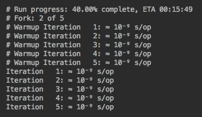
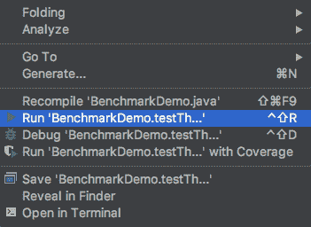

# Java Microbenchmark Marness

在本章中，读者将被引入 **Java Microbenchmark Marks** （ **JMH** ）项目，该项目允许测量各种代码性能特征。 如果性能是您的应用程序的一个重要问题，则此工具可以帮助您识别具有精确达到方法级别的瓶颈。 使用它，读者将不仅可以测量代码的平均执行时间和其他性能值（例如吞吐量），而是以受控的方式执行 - 有或没有 JVM 优化，预热运行， 等等。

除理论知识外，读者还有机会使用实际演示和建议运行 JMH。

本章将介绍以下主题：

*   什么是 JMH？
*   创建 JMH 基准
*   运行基准
*   使用 IDE 插件
*   JMH 基准参数
*   JMH 使用例子

# 什么是 JMH？

根据字典，**基准测试**是*的标准或参考点，其可以进行比较或评估*。 在编程中，它是比较应用程序性能的方法，或者只是方法。 **micro preface** 专注于后者 - 较小的代码片段而不是整体应用。 JMH 是用于测量单个方法性能的框架。

这可能看起来非常有用。 我们不能只在循环中运行一千或一十一次的方法，测量花了多长时间，然后计算方法性能的平均值？ 我们可以。 问题是，JVM 是一个比仅执行代码的机器更复杂的程序。 它具有优化算法，专注于使应用程序代码尽可能快地运行。

例如，让我们来看看以下课程：

```
class SomeClass {
    public int someMethod(int m, int s) {
        int res = 0;
        for(int i = 0; i < m; i++){
            int n = i * i;
            if (n != 0 && n % s == 0) {
                res =+ n;
            }
        }
        return res;
    }
}
```

我们填充了`someMethod()`方法，代码没有多大意义，但保持该方法忙碌。 要测试此方法的性能，请将代码复制为某些测试方法并将其运行在循环中：

```
public void testCode() {
   StopWatch stopWatch = new StopWatch();
   stopWatch.start();
   int xN = 100_000;
   int m = 1000;
   for(int x = 0; i < xN; x++) {
        int res = 0;
        for(int i = 0; i < m; i++){
            int n = i * i;
            if (n != 0 && n % 250_000 == 0) {
                res += n;
            }
        }
    }
    System.out.println("Average time = " + 
                             (stopWatch.getTime() / xN /m) + "ms");
}
```

但是，JVM 将看到`res`结果永远不会使用并限定为**死代码**（从未执行的代码部分）。 那么，为什么要打扰这个代码？

可能会惊讶地看到算法的显着复杂或简化不会影响性能。 也就是说，在每种情况下，实际上都没有执行代码。

您可以更改测试方法并假装通过返回它来使用结果：

```
public int testCode() {
   StopWatch stopWatch = new StopWatch();
   stopWatch.start();
   int xN = 100_000;
   int m = 1000;
   int res = 0;
   for(int x = 0; i < xN; x++) {
        for(int i = 0; i < m; i++){
            int n = i * i;
            if (n != 0 && n % 250_000 == 0) {
                res += n;
            }
        }
    }
    System.out.println("Average time = " + 
                             (stopWatch.getTime() / xN / m) + "ms");
 return res;
}
```

这可能会说服 JVM 每次执行代码，但它无法保证。 JVM 可能会注意到计算到计算中的输入不会改变，并且该算法每次运行都会产生相同的结果。 由于代码基于恒定输入，因此该优化称为**常量折叠**。 这种优化的结果是该代码可以仅执行一次并且每次运行都假设相同的结果，而无需实际执行代码。

实际上，基准测试通常在方法周围构建，而不是代码块。 例如，测试代码可能如下所示：

```
public void testCode() {
   StopWatch stopWatch = new StopWatch();
   stopWatch.start();
   int xN = 100_000;
   int m = 1000;
   SomeClass someClass = new SomeClass();
   for(int x = 0; i < xN; x++) {
        someClass.someMethod(m, 250_000);
    }
    System.out.println("Average time = " + 
                             (stopWatch.getTime() / xN / m) + "ms");
}
```

但即使这段代码也易于我们刚刚描述的相同 JVM 优化。

JMH 是为了帮助避免这种情况和类似的缺陷。 在 *JMH 使用示例*部分中，我们将向您展示如何使用 JMH 来解决死者代码和常量折叠优化，使用`@State`注释和`Blackhole`对象。

此外，JMH 允许测量不仅测量平均执行时间，还可以测量吞吐量和其他性能特征。

# 创建 JMH 基准

要开始使用 JMH，必须将以下依赖项添加到`pom.xml`文件中：

```
<dependency>
    <groupId>org.openjdk.jmh</groupId>
    <artifactId>jmh-core</artifactId>
    <version>1.21</version>
</dependency>
<dependency>
    <groupId>org.openjdk.jmh</groupId>
    <artifactId>jmh-generator-annprocess</artifactId>
    <version>1.21</version>
</dependency>

```

第二个`.jar`文件`annprocess`的名称，提供了 JMH 使用注释的提示。 如果你猜到了，你是正确的。 以下是用于测试算法性能的基准测试的示例：

```
public class BenchmarkDemo {
    public static void main(String... args) throws Exception{
        org.openjdk.jmh.Main.main(args);
    }
    @Benchmark
    public void testTheMethod() {
        int res = 0;
        for(int i = 0; i < 1000; i++){
            int n = i * i;
            if (n != 0 && n % 250_000 == 0) {
                res += n;
            }
        }
    }
}
```

请注意`@Benchmark`注释。 它讲述了必须测量此方法性能的框架。 如果运行前面的`main()`方法，您将看到类似于以下内容的输出：



这只是一个广泛输出的一个段，包括在不同条件下的多个迭代，目标是避免或抵消 JVM 优化。 它还考虑了运行代码一次并多次运行它之间的区别。 在后一种情况下，JVM 使用正常的编译器开始，该编译器将经常使用的字节码代码编译为本机二进制代码，甚至没有读取字节码。 预热循环服务于此目的 - 执行代码而不测量其性能作为干燥运行，即*升温* JVM。

还有其他方法可以告诉 JVM 将哪种方法直接编译和使用作为二进制，每次编译方法，并提供类似的指令以禁用某些优化。 我们很快就会谈谈这一点。

让我们现在看看如何运行基准。

# 运行基准

正如您可能猜到的那样，运行基准的一种方法只是为了执行`main()`方法。 它可以直接使用`java`命令或使用 IDE 完成。 我们在[第 1 章](01.html)中讨论了它，*使用 java 12* 。 然而，使用 IDE 插件运行基准的更容易和更便捷的方法。

# 使用 IDE 插件

所有主要的 Java 支持 IDE 都有这样的插件。 我们将演示如何在麦斯科斯计算机上安装 Intellij 的插件，但它同样适用于 Windows 系统。

以下是以下步骤：

1.  要开始安装插件，请按住*命令*命令*键和逗号（*，*），也只需单击顶部水平菜单中的扳手符号（使用 hover 文本首选项）：*


2.  它将在左窗格中使用以下菜单打开一个窗口：


3.  选择插件，如前面的屏幕截图所示，并使用以下顶部水平菜单观察窗口：


4.  选择 Marketplace，在“市场输入”字段中的“搜索插件”中键入 *JMH* ，然后按*输入*。 如果您有 Internet 连接，它将向您展示 JMH 插件符号，类似于此屏幕截图中显示的符号：


5.  单击“安装”按钮，然后，在重新启动 IDE 后，再次单击它：


6.  IDE 重新启动后，已准备好使用插件。 现在，您不仅可以运行`main()`方法，还可以选择并选择要执行的哪种基准方法，如果您有几种方法`@Benchmark` annotation。 要执行此操作，请从“运行”下拉菜单中选择“运行...：


7.  它将带上一个可以运行的方法选择的窗口：


8.  选择要运行的那个，它将被执行。 运行一次方法后，您只能右键单击它并从弹出菜单执行它：



9.  您还可以使用每个菜单项右侧显示的快捷方式。

现在让我们查看可以传递给基准的参数。

# JMH 基准参数

有许多基准参数允许微调手头任务的特定需求的测量。 我们只会介绍主要的。

# 模式

第一组参数定义了特定基准的性能方面（模式）必须测量：

*   `Mode.AverageTime`：测量平均执行时间
*   `Mode.Throughput`：通过在迭代中调用基准方法来测量吞吐量
*   `Mode.SampleTime`：采样执行时间，而不是平均; 允许我们推断分发，百分位数等
*   `Mode.SingleShotTime`：测量单个方法调用时间; 允许测试冷启动而不连续地调用基准方法

这些参数可以在注释`@BenchmarkMode`中指定。 例如：

```
@BenchmarkMode(Mode.AverageTime)
```

可以组合多种模式：

```
@BenchmarkMode({Mode.Throughput, Mode.AverageTime, Mode.SampleTime, Mode.SingleShotTime}
```

也可以要求所有这些：

```
@BenchmarkMode(Mode.All)
```

所描述的参数和我们将要在本章稍后讨论本章的所有参数可以设置在方法和/或类级别。 方法级别设置值覆盖了类级值。

# 输出时间单位

用于呈现结果的时间单位可以使用`@OutputTimeUnit`注释来指定：

```
@OutputTimeUnit(TimeUnit.NANOSECONDS)
```

可能的时间单位来自`java.util.concurrent.TimeUnit`枚举。

# 迭代

另一组参数定义用于预热和测量的迭代。 例如：

```
@Warmup(iterations = 5, time = 100, timeUnit = TimeUnit.MILLISECONDS)
@Measurement(iterations = 5, time = 100, timeUnit = TimeUnit.MILLISECONDS)
```

# 叉

在运行多个测试时，`@Fork`注释允许您将每个测试设置为在单独的过程中运行。 例如：

```
@Fork(10)
```

传递的参数值表示 JVM 可以分叉的次数才能分叉。 默认值为`-1`。 如果没有它，可以混合测试的性能，如果使用几个在测试中实现相同的接口，并且它们相互影响。

`warmups`参数是可以设置的另一个，以指示该基准测试必须在不收集测量的情况下执行多少次：

```
@Fork(value = 10, warmups = 5)
```

它还允许您将 Java 选项添加到`java`命令行。 例如：

```
@Fork(value = 10, jvmArgs = {"-Xms2G", "-Xmx2G"})
```

JMH 参数的完整列表和如何使用它们的示例（`openjdk`项目）（ [http://hg.odenjdk.java.net/code-tools/jmh/file/tip/jmh- 样品/ SRC / MAIN / JAVA / ORG / OPENJDK / JMH / SAMPLES](http://hg.openjdk.java.net/code-tools/jmh/file/tip/jmh-samples/src/main/java/org/openjdk/jmh/samples) ）。 例如，我们没有提及`@Group`，`@GroupThreads`，`@Measurement`，`@Setup`，`@Threads`，`@Timeout`，`@TearDown`或`@Warmup`。

# JMH 使用例子

让我们现在运行一些测试并比较它们。 首先，我们运行以下测试方法：

```
@Benchmark
@BenchmarkMode(Mode.All)
@OutputTimeUnit(TimeUnit.NANOSECONDS)
public void testTheMethod0() {
    int res = 0;
    for(int i = 0; i < 1000; i++){
        int n = i * i;
        if (n != 0 && n % 250_000 == 0) {
            res += n;
        }
    }
}
```

正如您所看到的，我们已经要求测量所有性能特征并在呈现结果时使用纳秒。 在我们的系统上，测试执行需要大约 20 分钟，最终结果摘要看起来像这样：


现在让我们如下更改测试：

```
@Benchmark
@BenchmarkMode(Mode.All)
@OutputTimeUnit(TimeUnit.NANOSECONDS)
public void testTheMethod1() {
    SomeClass someClass = new SomeClass();
    int i = 1000;
    int s = 250_000;
    someClass.someMethod(i, s);
}
```

如果我们现在运行`testTheMethod1()`，结果将略有不同：


结果在采样和单次运行时大多是不同的。 您可以使用这些方法并更改预热的分叉和数量。

# 使用@state 注释

此 JMH 功能允许您隐藏来自 JVM 的数据源，从而防止死亡代码优化。 您可以将类添加为输入数据的源，如下所示：

```
@State(Scope.Thread)
public static class TestState {
    public int m = 1000;
    public int s = 250_000;
}

@Benchmark
@BenchmarkMode(Mode.All)
@OutputTimeUnit(TimeUnit.NANOSECONDS)
public int testTheMethod3(TestState state) {
    SomeClass someClass = new SomeClass();
    return someClass.someMethod(state.m, state.s);
}
```

`Scope`值用于在测试之间共享数据。 在我们的情况下，只有一个测试使用`TestCase`类对象，我们无需共享。 否则，该值可以设置为`Scope.Group`或`Scope.Benchmark`，这意味着我们可以将 Setter 添加到`TestState`类中，并在其他测试中读/修改它。

当我们运行此版本的测试时，我们得到以下结果：


数据再次更改。 请注意，执行的平均时间增加了三倍，表示未应用更多的 JVM 优化。

# 使用黑洞对象

此 JMH 功能允许模拟结果使用，从而防止 JVM 折叠常量优化：

```
@Benchmark
@BenchmarkMode(Mode.All)
@OutputTimeUnit(TimeUnit.NANOSECONDS)
public void testTheMethod4(TestState state, Blackhole blackhole) {
    SomeClass someClass = new SomeClass();
    blackhole.consume(someClass.someMethod(state.m, state.s));
}
```

正如您所看到的，我们刚刚添加了一个参数`Blackhole`对象，并在其上称为`consume()`方法，从而假装使用测试方法的结果。

当我们运行此版本的测试时，我们得到以下结果：


这一次，结果看起来不是不同的。 显然，即使在添加`Blackhole`使用之前也被中和恒定的折叠优化。

# 使用@compilercontrol 注释

另一种调整基准的方法是告诉编译器编译，内联（或不），并从代码中排除（或不）特定方法。 例如，考虑以下类：

```
class SomeClass{
     public int oneMethod(int m, int s) {
        int res = 0;
        for(int i = 0; i < m; i++){
            int n = i * i;
            if (n != 0 && n % s == 0) {
                res = anotherMethod(res, n);
            }
        }
        return res;
    }

    @CompilerControl(CompilerControl.Mode.EXCLUDE)
    private int anotherMethod(int res, int n){
        return res +=n;
    }

}
```

假设我们有兴趣如何`anotherMethod()`编译/内联影响性能，我们可以将`CompilerControl`模式设置为以下内容：

*   `Mode.INLINE`：强制这种方法内联
*   `Mode.DONT_INLINE`：为避免这种方法内联
*   `Mode.EXCLUDE`：避免此方法编译

# 使用@param 注释

有时，有必要为不同的输入数据设置相同的基准测试。 在这种情况下，`@Param`注释非常有用。

`@Param` is a standard Java annotation used by various frameworks, for example, JUnit. It identifies an array of parameter values. The test with the `@Param` annotation will be run as many times as there are values in the array. Each test execution picks up a different value from the array.

这是一个例子：

```
@State(Scope.Benchmark)
public static class TestState1 {
    @Param({"100", "1000", "10000"})
    public int m;
    public int s = 250_000;
}

@Benchmark
@BenchmarkMode(Mode.All)
@OutputTimeUnit(TimeUnit.NANOSECONDS)
public void testTheMethod6(TestState1 state, Blackhole blackhole) {
    SomeClass someClass = new SomeClass();
    blackhole.consume(someClass.someMethod(state.m, state.s));
}
```

`testTheMethod6()`基准将与参数`m`的每个列出的值一起使用。

# 谨慎一句话

所描述的线束带走了测量性能的程序员的大部分担忧。 然而，几乎不可能涵盖 JVM 优化，简档共享以及 JVM 实现的类似方面的所有情况，特别是如果我们考虑到 JVM 代码的发展并与另一个实现的不同之处。 JMH 的作者通过与测试结果一起打印以下警告来承认这一事实：


分析器的描述及其用法可以在`openjdk`项目中找到（ [http://hg.odenjdk.java.net/code-tools/jmh/file/tip/jmh-samples/src/main / java / org / OpenJDK / JMH / Samples](http://hg.openjdk.java.net/code-tools/jmh/file/tip/jmh-samples/src/main/java/org/openjdk/jmh/samples) ）。 在相同的样本中，您将根据注释遇到 JMH 生成的代码的描述。

如果您想真正深入了解您的代码执行和测试的细节，则无法更好的方法来执行生成的代码。 它描述了所有步骤和决策 JMH，以便运行所请求的基准。 您可以在`target/generated-sources/annotations`中找到生成的代码。

本书的范围不允许进入太多关于如何阅读的细节，但这不是很困难，特别是如果您只从一个简单的测试一个方法的情况下开始。 我们祝你在这努力中一切顺利。

# 概括

在本章中，读者已经了解了 JMH 工具，并且能够将其用于类似于他们在编程应用程序时遇到的实际情况。 读者已经学会了如何创建和运行基准，如何设置基准参数，以及如果需要，如何安装 IDE 插件。 我们还提供了进一步阅读的实际建议和参考资料。

在下一章中，读者将被引入设计和编写应用程序代码的有用实践。 我们将讨论 Java 习语，实现和使用，并为实现`equals()`，`hashCode()`，`compareTo()`和`clone()`方法提供建议。 我们还将讨论`StringBuffer`和`StringBuilder`类的使用情况，如何捕获异常，最佳设计实践和其他经过验证的编程实践。

# 测验

1.  选择所有正确的语句：

2.  命名使用 JMH 开始所需的两个步骤。
3.  名称可以运行四种方式 JMH。
4.  使用 JMH 使用（测量）的两个模式（性能特征）的名称。
5.  名称两个可用于呈现 JMH 测试结果的时间单位。
6.  如何在 JMH 基准之间共享数据（结果，状态）？
7.  How 如何使用枚举的值列表运行参数的基准？

8.  如何强制或关闭方法的编译？
9.  JVM 如何关闭 JVM 的常量折叠优化？
10.  如何以编程方式提供 Java 命令选项以运行特定的基准？