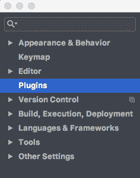
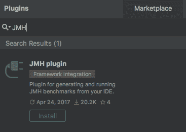
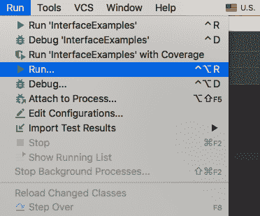

# Java 微基准线束

在本章中，读者将介绍一个允许测量各种代码性能特征的 **Java 微基准线束**（**JMH**）项目。如果性能是应用程序的一个重要问题，那么这个工具可以帮助您识别瓶颈，精确到方法级别。使用它，读者不仅能够测量代码的平均执行时间和其他性能值（例如吞吐量），而且能够以一种受控的方式进行测量，不管是否有 JVM 优化、预热运行等等。

除了理论知识，读者还将有机会使用实际的演示示例和建议来运行 JMH。

本章将讨论以下主题：

*   什么是吉咪？
*   创建 JMH 基准
*   运行基准测试
*   使用 IDE 插件
*   JMH 基准参数
*   JMH 使用示例

# 什么是吉咪？

根据字典，**基准**是*一个标准或参照点，可以对事物进行比较或评估*。在编程中，它是比较应用程序性能的一种方法，或者只是比较方法。**微基准**关注的是后者较小的代码片段，而不是整个应用程序。JMH 是衡量单个方法性能的框架。

这似乎非常有用。我们能不能不只是在一个循环中运行一个方法一千次或十万次，测量它所用的时间，然后计算方法性能的平均值？我们可以。问题是 JVM 是一个比代码执行机器复杂得多的程序。它的优化算法专注于使应用程序代码尽可能快地运行。

例如，让我们看看下面的类：

```java
class SomeClass {
    public int someMethod(int m, int s) {
        int res = 0;
        for(int i = 0; i < m; i++){
            int n = i * i;
            if (n != 0 && n % s == 0) {
                res =+ n;
            }
        }
        return res;
    }
}
```

我们用代码填充了`someMethod()`方法，这些代码没有多大意义，但使方法保持忙碌。要测试此方法的性能，很有可能将代码复制到某个测试方法中并在循环中运行：

```java
public void testCode() {
   StopWatch stopWatch = new StopWatch();
   stopWatch.start();
   int xN = 100_000;
   int m = 1000;
   for(int x = 0; i < xN; x++) {
        int res = 0;
        for(int i = 0; i < m; i++){
            int n = i * i;
            if (n != 0 && n % 250_000 == 0) {
                res += n;
            }
        }
    }
    System.out.println("Average time = " + 
                             (stopWatch.getTime() / xN /m) + "ms");
}
```

但是，JVM 将看到从未使用过`res`结果，并将计算限定为**死代码**（从未执行的代码部分）。那么，为什么还要执行这些代码呢？

您可能会惊讶地发现，算法的显著复杂性或简化并不影响性能。这是因为，在每种情况下，代码都不是实际执行的

您可以更改测试方法，并通过返回它来假装使用了结果：

```java
public int testCode() {
   StopWatch stopWatch = new StopWatch();
   stopWatch.start();
   int xN = 100_000;
   int m = 1000;
   int res = 0;
   for(int x = 0; i < xN; x++) {
        for(int i = 0; i < m; i++){
            int n = i * i;
            if (n != 0 && n % 250_000 == 0) {
                res += n;
            }
        }
    }
    System.out.println("Average time = " + 
                             (stopWatch.getTime() / xN / m) + "ms");
 return res;
}
```

这可能会说服 JVM 每次都执行代码，但不能保证。JVM 可能会注意到，输入到计算中的数据并没有改变，这个算法每次运行都会产生相同的结果。因为代码是基于常量输入的，所以这种优化称为**常量折叠**。此优化的结果是，此代码可能只执行一次，并且每次运行都假定相同的结果，而不实际执行代码。

但实际上，基准测试通常是围绕一个方法而不是一块代码构建的。例如，测试代码可能如下所示：

```java
public void testCode() {
   StopWatch stopWatch = new StopWatch();
   stopWatch.start();
   int xN = 100_000;
   int m = 1000;
   SomeClass someClass = new SomeClass();
   for(int x = 0; i < xN; x++) {
        someClass.someMethod(m, 250_000);
    }
    System.out.println("Average time = " + 
                             (stopWatch.getTime() / xN / m) + "ms");
}
```

但即使是这段代码也容易受到我们刚才描述的 JVM 优化的影响。

JMH 的创建是为了帮助避免这种情况和类似的陷阱。在“JMH 用法示例”部分，我们将向您展示如何使用 JMH 来解决死代码和常量折叠优化问题，使用`@State`注释和`Blackhole`对象。

此外，JMH 不仅可以测量平均执行时间，还可以测量吞吐量和其他性能特性。

# 创建 JMH 基准

要开始使用 JMH，必须将以下依赖项添加到`pom.xml`文件中：

```java
<dependency>
    <groupId>org.openjdk.jmh</groupId>
    <artifactId>jmh-core</artifactId>
    <version>1.21</version>
</dependency>
<dependency>
    <groupId>org.openjdk.jmh</groupId>
    <artifactId>jmh-generator-annprocess</artifactId>
    <version>1.21</version>
</dependency>

```

第二个`.jar`文件`annprocess`的名称提示 JMH 使用注释。如果你这么猜的话，你是对的。以下是为测试算法性能而创建的基准的示例：

```java
public class BenchmarkDemo {
    public static void main(String... args) throws Exception{
        org.openjdk.jmh.Main.main(args);
    }
    @Benchmark
    public void testTheMethod() {
        int res = 0;
        for(int i = 0; i < 1000; i++){
            int n = i * i;
            if (n != 0 && n % 250_000 == 0) {
                res += n;
            }
        }
    }
}
```

请注意`@Benchmark`注释。它告诉框架必须测量此方法的性能。如果您运行前面的`main()`方法，您将看到类似于以下内容的输出：


这只是包含不同条件下的多次迭代的广泛输出的一部分，目的是避免或抵消 JVM 优化。它还考虑了一次运行代码和多次运行代码之间的差异。在后一种情况下，JVM 开始使用即时编译器，它将经常使用的字节码编译成本地二进制代码，甚至不读取字节码。预热周期就是为了达到这个目的而执行的，代码在没有测量其性能的情况下就被作为一个空运行来执行，这个空运行会使 JVM 升温。

还有一些方法可以告诉 JVM 编译哪个方法并直接作为二进制文件使用，每次编译哪个方法，以及提供类似的指令来禁用某些优化。我们将很快讨论这个问题。

现在让我们看看如何运行基准测试。

# 运行基准测试

正如您可能已经猜测的，运行基准的一种方法就是执行`main()`方法。可以直接使用`java`命令或使用 IDE 完成。我们在第 1 章、“从 Java12 开始”中讨论了它。然而，有一种更简单、更方便的方法来运行基准：使用 IDE 插件。

# 使用 IDE 插件

所有主要的支持 Java 的 IDE 都有这样一个插件。我们将演示如何使用安装在 MacOS 计算机上的 IntelliJ 插件，但它同样适用于 Windows 系统。

以下是要遵循的步骤：

1.  要开始安装插件，请同时按`Cmd`键和逗号（`,`），或者只需单击顶部水平菜单中的扳手符号（带有悬停文本首选项）：


2.  它将在左窗格中打开一个包含以下菜单的窗口：



3.  选择“插件”，如前面的屏幕截图所示，并观察具有以下顶部水平菜单的窗口：


4.  选择“市场”，在“市场”输入框的“搜索插件”中输入`JMH`，然后按`Enter`。如果您有互联网连接，它将显示一个 JMH 插件符号，类似于此屏幕截图中显示的符号：



5.  单击“安装”按钮，然后在它变为“重新启动 IDE”后，再次单击它：


6.  IDE 重新启动后，插件就可以使用了。现在，您不仅可以运行`main()`方法，而且如果您有几个带有`@Benchmark`注释的方法，还可以选择要执行的基准测试方法。要执行此操作，请从“运行”下拉菜单中选择“运行…”：



7.  它将弹出一个窗口，其中包含可运行的方法选择：


8.  选择一个你想运行的，它将被执行。至少运行一次方法后，只需右键单击它并从弹出菜单中执行它：


9.  也可以使用每个菜单项右侧显示的快捷方式。

现在让我们回顾一下可以传递给基准的参数。

# JMH 基准参数

有许多基准参数允许为手头任务的特定需要微调度量。我们只介绍主要的。

# 模式

第一组参数定义了特定基准必须测量的性能方面（模式）：

*   `Mode.AverageTime`：测量平均执行时间
*   `Mode.Throughput`：通过在迭代中调用基准方法来测量吞吐量
*   `Mode.SampleTime`：采样执行时间，而不是平均执行时间；允许我们推断分布、百分位数等
*   `Mode.SingleShotTime`：测量单个方法调用时间；允许在不连续调用基准方法的情况下测试冷启动

这些参数可以在注释`@BenchmarkMode`中指定。例如：

```java
@BenchmarkMode(Mode.AverageTime)
```

可以组合多种模式：

```java
@BenchmarkMode({Mode.Throughput, Mode.AverageTime, Mode.SampleTime, Mode.SingleShotTime}
```

也可以要求所有人：

```java
@BenchmarkMode(Mode.All)
```

所描述的参数以及我们将在本章后面讨论的所有参数都可以在方法和/或类级别进行设置。方法级别集值重写类级别值。

# 输出时间单位

用于呈现结果的时间单位可以使用`@OutputTimeUnit`注释指定：

```java
@OutputTimeUnit(TimeUnit.NANOSECONDS)
```

可能的时间单位来自`java.util.concurrent.TimeUnit`枚举。

# 迭代

另一组参数定义了用于预热和测量的迭代。例如：

```java
@Warmup(iterations = 5, time = 100, timeUnit = TimeUnit.MILLISECONDS)
@Measurement(iterations = 5, time = 100, timeUnit = TimeUnit.MILLISECONDS)
```

# 分叉

在运行多个测试时，`@Fork`注释允许您将每个测试设置为在单独的进程中运行。例如：

```java
@Fork(10)
```

传入的参数值指示 JVM 可以分叉到独立进程的次数。默认值为`-1`，如果在测试中使用多个实现同一接口的类，并且这些类相互影响，那么如果没有它，测试的性能可能是混合的。

`warmups`参数是另一个参数，可以设置为指示基准必须执行多少次而不收集测量值：

```java
@Fork(value = 10, warmups = 5)
```

它还允许您向`java`命令行添加 Java 选项。例如：

```java
@Fork(value = 10, jvmArgs = {"-Xms2G", "-Xmx2G"})
```

JMH 参数的完整列表以及如何使用它们的示例可以在[`openjdk`项目](http://hg.openjdk.java.net/code-tools/jmh/file/tip/jmh-samples/src/main/java/org/openjdk/jmh/samples)中找到。例如，我们没有提到`@Group`、`@GroupThreads`、`@Measurement`、`@Setup`、`@Threads`、`@Timeout`、`@TearDown`或`@Warmup`。

# JMH 使用示例

现在让我们运行一些测试并比较它们。首先，我们运行以下测试方法：

```java
@Benchmark
@BenchmarkMode(Mode.All)
@OutputTimeUnit(TimeUnit.NANOSECONDS)
public void testTheMethod0() {
    int res = 0;
    for(int i = 0; i < 1000; i++){
        int n = i * i;
        if (n != 0 && n % 250_000 == 0) {
            res += n;
        }
    }
}
```

如您所见，我们要求度量所有性能特征，并在呈现结果时使用纳秒。在我们的系统上，测试执行大约需要 20 分钟，最终结果摘要如下所示：


现在我们将测试更改为：

```java
@Benchmark
@BenchmarkMode(Mode.All)
@OutputTimeUnit(TimeUnit.NANOSECONDS)
public void testTheMethod1() {
    SomeClass someClass = new SomeClass();
    int i = 1000;
    int s = 250_000;
    someClass.someMethod(i, s);
}
```

如果我们现在运行`testTheMethod1()`，结果会略有不同：


在采样和单次运行方面，结果相差较大。你可以玩这些方法，并改变分叉和数量的热身

# 使用@State 注释

这个 JMH 特性允许您对 JVM 隐藏数据源，从而防止死代码优化。您可以添加一个类作为输入数据的源，如下所示：

```java
@State(Scope.Thread)
public static class TestState {
    public int m = 1000;
    public int s = 250_000;
}

@Benchmark
@BenchmarkMode(Mode.All)
@OutputTimeUnit(TimeUnit.NANOSECONDS)
public int testTheMethod3(TestState state) {
    SomeClass someClass = new SomeClass();
    return someClass.someMethod(state.m, state.s);
}
```

`Scope`值用于在测试之间共享数据。在我们的例子中，只有一个测试使用了`TestCase`类对象，我们不需要共享。否则，该值可以设置为`Scope.Group`或`Scope.Benchmark`，这意味着我们可以在`TestState`类中添加设置器，并在其他测试中读取/修改它。

当我们运行此版本的测试时，得到以下结果：


数据又变了。注意，平均执行时间增加了三倍，这表明没有应用更多的 JVM 优化。

# 使用黑洞对象

这个 JMH 特性允许模拟结果使用情况，从而防止 JVM 进行优化：

```java
@Benchmark
@BenchmarkMode(Mode.All)
@OutputTimeUnit(TimeUnit.NANOSECONDS)
public void testTheMethod4(TestState state, Blackhole blackhole) {
    SomeClass someClass = new SomeClass();
    blackhole.consume(someClass.someMethod(state.m, state.s));
}
```

如您所见，我们刚刚添加了一个参数`Blackhole`对象，并在其上调用了`consume()`方法，从而假装使用了测试方法的结果。

当我们运行此版本的测试时，得到以下结果：


这一次，结果看起来没什么不同。显然，即使在添加`Blackhole`用法之前，恒定折叠优化也被中和了

# 使用`@CompilerControl`注释

调整基准测试的另一种方法是告诉编译器编译、内联（或不内联）和从代码中排除（或不排除）特定方法。例如，考虑以下类：

```java
class SomeClass{
     public int oneMethod(int m, int s) {
        int res = 0;
        for(int i = 0; i < m; i++){
            int n = i * i;
            if (n != 0 && n % s == 0) {
                res = anotherMethod(res, n);
            }
        }
        return res;
    }

    @CompilerControl(CompilerControl.Mode.EXCLUDE)
    private int anotherMethod(int res, int n){
        return res +=n;
    }

}
```

假设我们对方法`anotherMethod()`编译/内联如何影响性能感兴趣，我们可以将其`CompilerControl`模式设置为：

*   `Mode.INLINE`：强制此方法内联
*   `Mode.DONT_INLINE`：为了避免这种方法内联
*   `Mode.EXCLUDE`：为了避免这种方法编译

# 使用`@Param`注释

有时，有必要对不同的输入数据集运行相同的基准测试。在这种情况下，`@Param`注释非常有用。

`@Param` is a standard Java annotation used by various frameworks, for example, JUnit. It identifies an array of parameter values. The test with the `@Param` annotation will be run as many times as there are values in the array. Each test execution picks up a different value from the array.

举个例子：

```java
@State(Scope.Benchmark)
public static class TestState1 {
    @Param({"100", "1000", "10000"})
    public int m;
    public int s = 250_000;
}

@Benchmark
@BenchmarkMode(Mode.All)
@OutputTimeUnit(TimeUnit.NANOSECONDS)
public void testTheMethod6(TestState1 state, Blackhole blackhole) {
    SomeClass someClass = new SomeClass();
    blackhole.consume(someClass.someMethod(state.m, state.s));
}
```

`testTheMethod6()`基准将与参数`m`的每个列出的值一起使用。

# 一句警告

所描述的工具消除了程序员度量性能的大部分顾虑。然而，几乎不可能涵盖 JVM 优化、概要文件共享和 JVM 实现的类似方面的所有情况，特别是如果我们考虑到 JVM 代码在不同的实现之间不断发展和不同的话。JMH 的作者通过打印以下警告以及测试结果来确认这一事实：


剖面仪的说明及其用法见[`openjdk`项目](http://hg.openjdk.java.net/code-tools/jmh/file/tip/jmh-samples/src/main/java/org/openjdk/jmh/samples)。在相同的示例中，您将看到 JMH 基于注释生成的代码的描述。

如果您想深入了解代码执行和测试的细节，没有比研究生成的代码更好的方法了。它描述了 JMH 为运行所请求的基准测试所做的所有步骤和决策。您可以在`target/generated-sources/annotations`中找到生成的代码。

这本书的范围不允许进入如何阅读它的太多细节，但它不是很难，特别是如果你从一个简单的案例开始只测试一个方法。我们祝你在这一努力中一切顺利。

# 总结

在本章中，读者了解了 JMH 工具，并能够将其用于特定的实际案例，类似于他们在编程应用程序时遇到的那些案例。读者已经学习了如何创建和运行基准，如何设置基准参数，以及如何在需要时安装 IDE 插件。我们也提供了实用的建议和参考资料供进一步阅读。

在下一章中，读者将介绍设计和编写应用程序代码的有用实践。我们将讨论 Java 习惯用法、它们的实现和用法，并提供实现`equals()`、`hashCode()`、`compareTo()`和`clone()`方法的建议。我们还将讨论`StringBuffer`和`StringBuilder`类的用法之间的区别、如何捕获异常、最佳设计实践以及其他经验证的编程实践。

# 测验

1.  选择所有正确的语句：

2.  列出开始使用 JMH 所需的两个步骤。
3.  说出运行 JMH 的四种方法。
4.  列出两种可以与 JMH 一起使用（测量）的模式（性能特征）。
5.  列出两个可用于显示 JMH 测试结果的时间单位。
6.  如何在 JMH 基准之间共享数据（结果、状态）？
7.  如何告诉 JMH 使用枚举的值列表为参数运行基准测试？

8.  如何强制或关闭方法的编译？
9.  如何关闭 JVM 的常量折叠优化？
10.  如何以编程方式为运行特定基准测试提供 Java 命令选项？