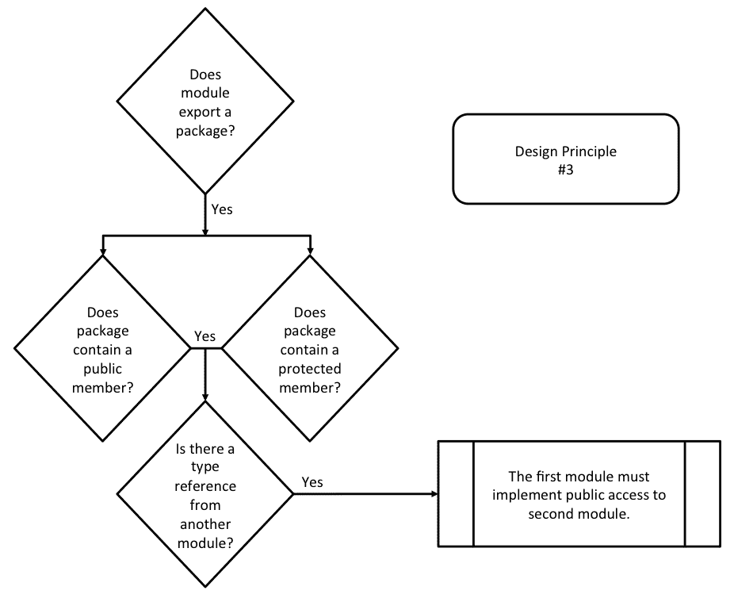
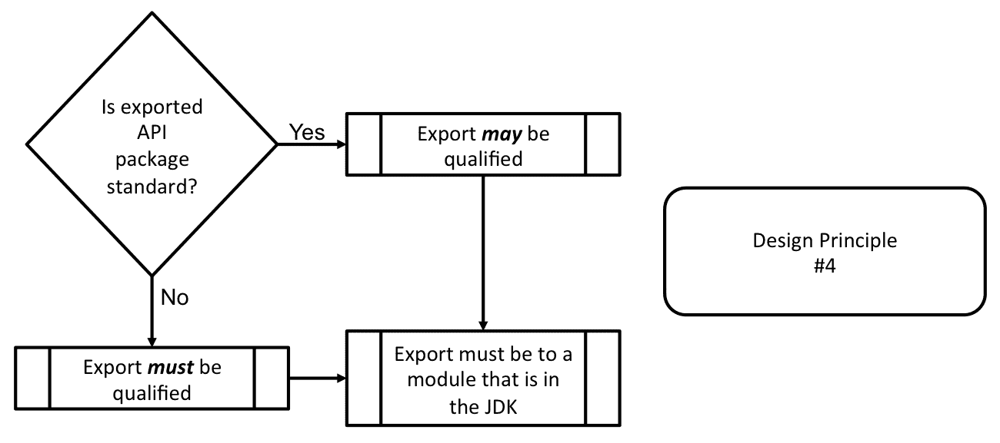
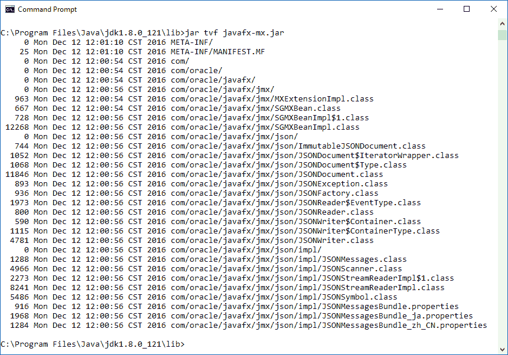
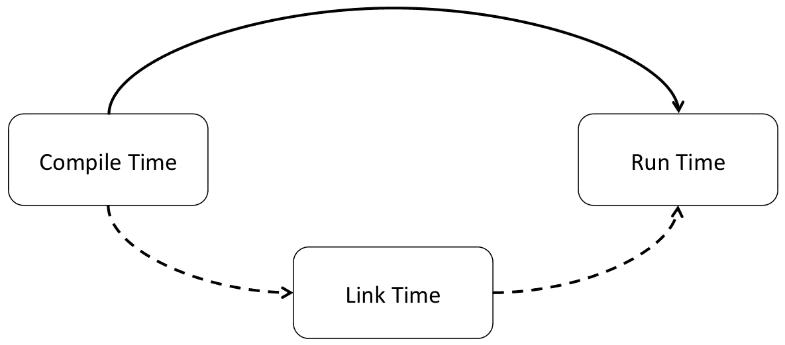
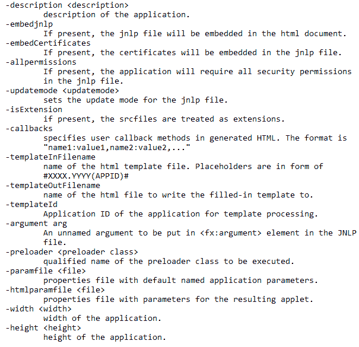
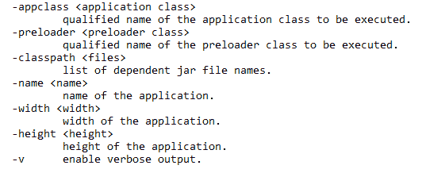
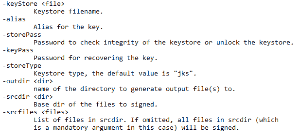

# 用 Java11 构建模块化应用

在最后一章中，我们讨论了 Java 平台在变量处理器方面的最新变化，以及它们与原子工具包的关系。我们还讨论了贬值警告，以及在特定情况下抑制贬值警告的原因。研究了与项目 Coin 相关的变化，以及导入语句处理、推断局部变量和线程局部握手。我们通过查看堆分配、根证书、动态类文件常量以及 JavaEE 和 CORBA 模块的删除，进一步探讨了 Java 语言的变化。

在本章中，我们将研究由 projectjigsaw 指定的 Java 模块的结构，深入探讨如何将 Jigsaw 项目作为 Java 平台的一部分来实现。我们还将回顾 Java 平台与模块化系统相关的关键内部更改。

我们将研究以下主题：

*   模块化底漆
*   模块化 JDK
*   模块化运行时映像
*   模块系统
*   模块化 Java 应用打包
*   Java 链接器
*   封装大多数内部 API

# 技术要求

本章及后续章节主要介绍 Java11，Java 平台的**标准版**（**SE**）可从 [Oracle 官方下载网站](http://www.oracle.com/technetwork/java/javase/downloads/index.html)下载。

IDE 软件包就足够了。来自 JetBrains 的 IntelliJ IDEA 用于与本章和后续章节相关的所有编码。IntelliJ IDEA 的社区版可从[网站](https://www.jetbrains.com/idea/features/)下载。

# 模块化入门

我们可以将术语**模块化**定义为计算机软件的一种设计或构造。这种类型的软件设计涉及一组模块，这些模块共同构成了整个系统。例如，房子可以作为一个单一的结构或以模块化的方式建造，其中每个房间都是独立建造的，并连接起来形成一个家。通过这个类比，您可以有选择地添加模块或不添加模块来创建您的家庭。

模块的集合，在我们的类比中，成为你家的设计。您的设计不需要使用每个模块，只需要使用您想要的模块。因此，例如，如果有地下室和奖励房间模块，而您的设计不包括这些模块化房间，则这些模块不用于构建您的家。另一种选择是，每个家庭都包括每个房间，而不仅仅是使用的房间。这当然是浪费。让我们看看这和软件有什么关系。

这个概念可以应用于计算机架构和软件系统。我们的系统可以由几个组件组成，而不是一个庞然大物系统。正如您可能想象的那样，这为我们提供了一些特定的好处：

*   我们应该能够扩展 Java 应用以在小型设备上运行
*   我们的 Java 应用将更小
*   我们的模块化代码可以更有针对性
*   更多地使用面向对象编程模型
*   还有其他封装的机会
*   我们的代码将更高效
*   Java 应用将提高性能
*   降低了整个系统的复杂性
*   测试和调试更容易
*   代码维护更容易

Java 向模块化系统的转变是必要的，原因有几个。以下是 Java9 之前的 Java 平台导致在当前 Java 平台中创建模块化系统的主要条件：

*   **Java 开发工具包**（**JDK**）实在太大了。这使得很难支持小型设备。即使在下一节讨论的紧凑配置文件中，支持一些小型设备充其量也是困难的，在某些情况下是不可能的
*   由于 JDK 过大，我们的 Java 应用很难支持真正优化的性能。在这种情况下，越小越好
*   **Java 运行时环境**（**JRE**）太大，无法有效地测试和维护我们的 Java 应用。这将导致耗时、低效的测试和维护操作
*   **Java 存档**（**JAR**）文件也太大。这使得支持小型设备成了问题
*   由于 JDK 和 JRE 都是包罗万象的，所以安全性非常令人担忧，例如，Java 应用未使用的内部 API，由于公共访问修饰符的性质，仍然可用
*   最后，我们的 Java 应用太大了。

模块化系统具有以下要求：

*   必须有一个公共接口，以允许所有连接模块之间的互操作性
*   必须支持隔离和连接测试
*   编译时操作必须能够识别正在使用的模块
*   必须有对模块的运行时支持

模块概念最初是在 Java9 中引入的；它是一个命名的数据和代码集合。具体而言，Java 模块是以下内容的集合：

*   包装
*   班级
*   接口
*   代码
*   数据
*   资源

成功实现的关键在于，模块在其模块化声明中是自我描述的。模块名必须是唯一的，并且通常使用反向域名架构。下面是一个示例声明：

```java
module com.three19.irisScan { }
```

模块声明包含在`module-info.java`文件中，该文件应位于模块的`root`文件夹中。正如人们所料，这个文件被编译成一个`module-info.class`文件，并将被放在适当的输出目录中。这些输出目录是在模块源代码中建立的

在下一节中，我们将研究 Java 平台在模块化方面的具体变化。

# 模块化 JDK

JEP-200 的核心目标是使用 **Java 平台模块系统**（**JPMS**）对 JDK 进行模块化。在 Java9 之前，我们对 JDK 的熟悉包括对其主要组件的了解：

*   JRE
*   解释器（Java）
*   编译器（Javac）
*   档案员（罐子）
*   文档生成器（Javadoc）

模块化 JDK 的任务是将其分解为可在编译时或运行时组合的组件。模块化结构基于以下在 Java8 中作为紧凑概要文件建立的模块概要文件。下表详细介绍了这三种配置文件：

*   **紧凑配置文件 1**：

| `java.io` | `java.lang.annotation` | `java.lang.invoke` |
| `java.lang.ref` | `java.lang.reflect` | `java.math` |
| `java.net` | `java.nio` | `java.nio.channels` |
| `java.nio.channels.spi` | `java.nio.charset` | `java.nio.charset.spi` |
| `java.nio.file` | `java.nio.file.attribute` | `java.nio.file.spi` |
| `java.security` | `java.security.cert` | `java.security.interfaces` |
| `java.security.spec` | `java.text` | `java.text.spi` |
| `java.time` | `java.time.chrono` | `java.time.format` |
| `java.time.temporal` | `java.time.zone` | `java.util` |
| `java.util.concurrent` | `java.util.concurrent.atomic` | `java.util.concurrent.locks` |
| `java.util.function` | `java.util.jar` | `java.util.logging` |
| `java.util.regex` | `java.tuil.spi` | `java.util.stream` |
| `java.util.zip` | `javax.crypto` | `javax.crypto.interfaces` |
| `javax.crypto.spec` | `javax.net` | `javax.net.ssl` |
| `javax.script` | `javax.security.auth` | `javax.security.auth.callback` |
| `javax.security.auth.login` | `javax.security.auth.spi` | `javax.security.auth.spi` |
| `javax.security.auth.x500` | `javax.security.cert` |  |

*   **紧凑配置文件 2**：

| `java.rmi` | `java.rmi.activation` | `java.rmi.drc` |
| `java.rmi.registry` | `java.rmi.server` | `java.sql` |
| `javax.rmi.ssl` | `javax.sql` | `javax.transaction` |
| `javax.transaction.xa` | `javax.xml` | `javax.xml.database` |
| `javax.xml.namespace` | `javax.xml.parsers` | `javax.xml.stream` |
| `javax.xml.stream.events` | `javax.xml.stream.util` | `javax.xml.transform` |
| `javax.xml.transform.dom` | `javax.xml.transform.sax` | `javax.xml.transform.stax` |
| `java.xml.transform.stream` | `javax.xml.validation` | `javax.xml.xpath` |
| `org.w3c.dom` | `org.w3c.dom.bootstrap` | `org.w3c.dom.events` |
| `org.w3c.dom.ls` | `org.xml.sax` | `org.xml.sax.ext` |
| `org.xml.sax.helpers` |  |  |

*   **紧凑配置文件 3**：

| `java.lang.instrument` | `java.lang.management` | `java.security.acl` |
| `java.util.prefs` | `javax.annotation.processing` | `javax.lang.model` |
| `javax.lang.model.element` | `javax.lang.model.type` | `javax.lang.model.util` |
| `javax.management` | `javax.management.loading` | `javax.management.modelmbean` |
| `javax.management.monitor` | `javax.management.openmbean` | `javax.management.relation` |
| `javax.management.remote` | `javax.management.remote.rmi` | `javax.management.timer` |
| `javax.naming` | `javax.naming.directory` | `javax.naming.event` |
| `javax.naing.ldap` | `javax.naming.spi` | `javax.security.auth.kerberos` |
| `javax.security.sasl` | `javax.sql.rowset` | `javax.sql.rowset.serial` |
| `javax.sql.rowset.spi` | `javax.tools` | `javax.xml.crypto` |
| `javax.xml.crypto.dom` | `javax.xml.crypto.dsig` | `javax.xml.crypto.dsig.dom` |
| `javax.xml.crypto.dsig.keyinfo` | `javax.xml.crypto.dsig.spec` | `org.ieft.jgss` |

这三个紧凑的模块概要文件代表了当前 Java 平台中标准化模块化系统的基础。标准化的有效性取决于以下六个原则：

*   所有 JCP 管理的模块都必须以字符串`java`开头。因此，如果正在开发一个关于空间实用程序的模块，它的名称应该是`java.spatial.util`。

**JCP** 是指 **Java 社区流程**。 JCP 允许开发人员为 Java 创建技术规范。 您可以在 [JCP 官方网站](https://www.jcp.org/en/home/index)上了解有关 JCP 的更多信息并成为会员 

*   非 JCP 模块被认为是 JDK 的一部分，它们的名称必须以字符串`jdk`开头。
*   确保方法调用链接正常工作。下面的流程图最好地说明了这一点：



正如您在前面的流程图中所看到的，它只适用于导出包的模块。

*   第四个原则处理标准模块中使用的标准和非标准 API 包。以下流程图说明了本原则契约的实施情况：



*   第五个设计原则是标准模块可以依赖于多个非标准模块。虽然允许这种依赖关系，但不允许对非标准模块进行隐含的可读性访问
*   最终的设计原则确保非标准模块不会导出标准 API 包。

# 模块化源代码

如前所述，Jigsaw 项目的目标是模块化。设想的标准模块化系统将应用于 JavaSE 平台和 JDK。除了提高效率外，模块化转换还将带来更好的安全性和易维护性。JEP-201 中详细介绍的增强集中在 JDK 源代码重组上。让我们仔细看看。

重新组织 JDK 的源代码是一项重要的任务，并通过以下目标子集完成：

*   向 JDK 开发人员提供洞察和熟悉新的 Java9 模块化系统的信息。所以，这个目标是针对 JDK 的开发人员，而不是主流开发人员
*   确保在整个 JDK 构建过程中建立和维护模块化边界
*   第三个目标是确保未来的增强，特别是 Jigsaw 项目，能够轻松地集成到新的模块化系统中。

这种源代码重组的重要性怎么强调都不为过。Java9 之前的源代码组织已经有 20 年的历史了。这种过期的 JDK 源代码重组将使代码更易于维护。让我们看一下 JDK 源代码之前的组织结构，然后检查更改。

# 模块化前的 JDK 源代码组织

JDK 是代码文件、工具、库等的汇编。下图概述了 JDK 组件：


前面的图中 JDK 组件的预模块化组织将在下面的七个小节中详细介绍。

# 开发工具

开发工具位于`\bin`目录中。这些工具包括七个大的分类，每一个都将在后面的章节中详细介绍。

# 部署

这是一组用于帮助部署 Java 应用的工具：

*   `appletviewer`：该工具使您能够运行和调试 Java 小程序，而无需使用 Web 浏览器。
*   `extcheck`：该工具允许您在 JAR 文件中查找冲突。
*   `jar`：该工具用于创建和操作 JAR 文件。JAR 文件是 Java 存档文件。
*   `java`：这是 Java 应用启动器。
*   `javac`：这是 Java 编译器。
*   `javadoc`：该工具生成 API 文档。
*   `javah`：这个工具允许您编写本机方法；它生成 C 头文件。
*   `javap`：该工具反汇编类文件。
*   `javapackager`：用于 Java 应用的签名和打包，包括 JavaFX。
*   `jdb`：这是 Java 调试器。
*   `jdeps`：这是一个 Java 类依赖的分析器。
*   `pack200`：将 JAR 文件压缩成`pack200`文件的工具。使用这个工具的压缩比令人印象深刻。
*   `unpack200`：此工具解压`pack200`文件，生成 JAR 文件。

# 国际化

如果您对创建可本地化的应用感兴趣，以下工具可能会派上用场：

*   `native2ascii`：该工具从普通文本创建 Unicode 拉丁 1

# 监控

用于提供 JVM 性能数据的监视工具包括：

*   `jps`：这是 JVM 进程状态工具（`jps`）。它提供了特定系统上热点 JVM 的列表。
*   `jstat`：JVM 统计监控工具。它从具有热点 JVM 的机器收集日志数据和性能信息。
*   `jstatd`：这是`jstat`守护程序工具。它运行一个 RMI 服务器应用来监视热点 JVM 操作。

# RMI 

**RMI** 工具是**远程方法调用**工具。它们帮助开发人员创建通过网络运行的应用，包括互联网：

*   `rmic`：该工具可以为网络上的对象生成存根和骨架
*   `rmiregistry`：这是一个远程对象的注册服务
*   `rmid`：此工具是 RMI 的激活系统守护程序
*   `serialver`：此工具返回类`serialVersionUID`值

# 安全

这组安全工具使开发人员能够创建可在开发人员的计算机系统以及远程系统上实施的安全策略：

*   `keytool`：管理安全证书和密钥库
*   `jarsigner`：该工具生成并验证用于创建/打开 JAR 文件的 JAR 签名
*   `policytool`：这个工具有一个图形用户界面，帮助开发人员管理他们的安全策略文件

# 故障排除

这些实验性的故障排除工具对于非常具体的故障排除非常有用。它们是实验性的，因此没有得到官方的支持：

*   `jinfo`：此工具提供特定进程、文件或服务器的配置信息
*   `jhat`：这是一个堆转储工具。它实例化了一个 Web 服务器，以便可以用浏览器查看堆
*   `jmap`：显示进程、文件或服务器的堆和共享对象内存映射
*   `jsadebugd`：这是 Java 的可服务性代理调试守护进程。它充当进程或文件的调试服务器
*   `jstack`：这是一个 Java 栈跟踪工具，为进程、文件或服务器提供线程栈跟踪

# Web 服务

这组工具提供了一个实用工具，可与 **Java Web Start** 和其他 Web 服务一起使用：

*   `javaws`：这是一个启动 JavaWebStart 的命令行工具。
*   `schemagen`：该工具为 Java 架构生成模式。这些模式用于 XML 绑定。
*   `wsgen`：该工具用于生成可移植的 JAX-WS 工件。
*   `wsimport`：这个工具用于导入可移植的 JAX-WS 工件。
*   `xjc`：这是用于 XML 绑定的绑定编译器。

# JavaFX 工具

JavaFX 工具位于几个不同的地方，包括`\bin`、`\man`和`\lib`目录。

# Java 运行时环境

JRE 位于`\jre`目录中。主要内容包括 JVM 和类库。

# 源代码

JDK 的源代码是 Java9 之前的版本，具有以下基本组织架构：

```java
source code / [shared, OS-specific] / [classes / native] / Java API package name / [.file extension]
```

我们再仔细看看。在源代码之后，我们有两个选择。如果代码是跨平台的，那么它是一个共享目录；否则，它是特定于操作系统的。例如：

```java
src/share/...
src/windows/...
```

接下来，我们有`classes`目录或本地语言目录。例如：

```java
src/share/classes/...
src/share/classes/java/...
```

接下来，我们有 JavaAPI 包的名称，后跟文件扩展名。文件扩展名依赖于`.java`、`.c`等内容。

# 库

`\lib`目录包含`\bin`目录中一个或多个开发工具所需的类库。以下是典型 Java8`\lib`目录中的文件列表：


查看目录列表并不能提供很好的细粒度洞察力。我们可以使用以下命令列出任何一个`.jar`文件中包含的类：`jar tvf fileName.jar`。例如，下面是在命令行执行`jar tvf javafx-mx.jar`生成的类列表：



# C 头文件

`/include`目录包含 C 头文件。这些文件主要支持以下内容：

*   **Java 本机接口（JNI）**：用于本机代码编程支持，JNI 用于将 Java 本机方法和 JVM 嵌入到本机应用中。
*   **JVM 工具接口（JVM TI）**：用于对运行 JVM 的应用进行状态检查和执行控制的工具。

# 数据库

ApacheDerby 关系数据库存储在`/db`目录中。您可以在以下站点了解有关 Java DB 的更多信息：

*   <http://docs.oracle.com/javadb/support/overview.html>
*   <http://db.apache.org/derby/manuals/#docs_10.11>

# JDK 源代码重组

在上一节中，您了解到 Java9 之前的源代码组织模式如下：

```java
source code / [shared, OS-specific] / [classes / native] / Java API package name / [.file extension]
```

在当前的 Java 平台中，我们有一个模块化的模式。该模式如下：

```java
source code / module / [shared, OS-specific] / [classes / native / configuration] / [ package / include / library ] / [.file extension]
```

新模式中有一些不同之处，最明显的是模块名。在共享或 OS 特定目录之后，有类目录、用于 C 或 C++ 源文件的本机目录或配置目录。这种看似基本的组织模式更改会导致更易于维护的代码库。

# 模块化运行时映像

Java9 中引入的 Java 模块化系统需要更改运行时映像以实现兼容性。这些更改的好处包括以下方面的增强：

*   维修性
*   性能
*   安全

这些更改的核心是用于资源命名的新 URI 模式。这些资源包括模块和类。

**统一资源标识符**（**URI**）与**统一资源定位器**（**URL**）相似，它标识某物的名称和位置。对于 URL，某物是网页；对于 URI，它是资源。

 **JEP-220 有五个主要目标，这些目标将在下面的章节中详细介绍。

# 采用运行时格式

为 Java9 创建了一个运行时格式，以供存储类和其他资源文件采用。此格式适用于以下情况下存储的类和资源：

*   当新的运行时格式比 Java9Jar 之前的格式具有更高的效率（时间和空间）时。

**JAR** 文件是 **Java 归档**文件。这是一种基于传统 ZIP 格式的压缩文件格式。

*   当存储的类和其他资源可以单独隔离和加载时。
*   当 JDK 和库类和资源可以存储时。这也包括应用模块。
*   当它们被设计成促进未来增强的方式时。这要求它们具有可扩展性、文档化和灵活性。

# 运行时映像重构

Java 中有两种类型的运行时映像：JDK 和 JRE。从 Java9 开始，这两种图像类型都被重新构造，以区分用户可以使用和修改的文件和开发人员及其应用可以使用但不能修改的内部文件。

在 Java9 之前的 JDK 构建系统同时生成了 JRE 和 JDK。JRE 是 Java 平台的完整实现。JDK 包括 JRE 以及其他工具和库。Java9 中一个显著的变化是 JRE 子目录不再是 JDK 映像的一部分。进行此更改的部分原因是为了确保两种图像类型（JDK 和 JRE）具有相同的图像结构。有了共同和重组的结构，未来的变革将更有效地结合起来。

如果您在 Java9 之前创建了针对特定结构的自定义插件，那么您的应用可能无法在 Java9 中工作。如果您显式地寻址`tools.jar`，这也是正确的。

下图提供了 Java9 发布前每个图像内容的高级视图：


Java9 运行时映像如下图所示。如图所示，完整的 JDK 映像包含与模块化运行时映像相同的目录以及`demo`、`sample`、`man`，并且包括目录：


JRE 和 JDK 映像之间不再有区别。在当前的 Java 平台上，JDK 映像是一个 JRE 映像，它包含一整套开发工具。

# 支持常见操作

开发人员有时必须编写代码来执行需要访问运行时映像的操作。Java9 包括对这些常见操作的支持。由于 JDK 和 JRE 运行时映像结构的重新构造和标准化，这是可能的。

# 剥夺 JDK 类

当前的 Java 平台允许对单个 JDK 类进行特权撤销。此更改增强了系统安全性，因为它确保 JDK 类只接收系统操作所需的权限。

# 保留现有行为

JEP-220 的最终目标是确保现有的课程不会受到负面影响。这是指不依赖于内部 JDK 或 JRE 运行时映像的应用。

# 模块系统

您会记得，创建模块化系统是为了为 Java 程序提供可靠的配置和强大的封装。这个实现的关键是链接时间的概念。如这里所示，链接时间是编译时和运行时之间的一个可选阶段。此阶段允许将适当的模块组装到优化的运行时映像中。

这在一定程度上是由于 JLink 链接工具的缘故，您将在本章后面详细了解该工具：



# 模块路径

重要的是要组织模块，以便它们可以很容易地定位。模块路径（模块组件或目录的序列）提供了搜索所使用的组织结构。依次搜索这些路径组件，返回包含模块的第一个路径组件。

模块及其路径不应被视为与包或类路径相同。他们确实是不同的，有更高水平的忠诚。关键的区别在于，对于类路径，将搜索单个组件。模块路径搜索返回完整的模块。这种类型的搜索可以通过按显示顺序搜索以下路径，直到返回模块：

*   编译模块路径
*   升级模块路径
*   系统模块
*   应用模块路径

让我们简要回顾一下这些路径。编译模块路径仅在编译时适用，并且包含模块定义。升级模块路径具有已编译的模块定义。系统模块是内置的，包括 JavaSE 和 JDK 模块。最后一个路径，即应用模块路径，包含来自应用模块和库模块的已编译模块定义。

# 访问控制边界冲突

作为一个专业的开发人员，您总是希望您的代码是安全的、可移植的和无 bug 的，这需要严格遵守 Java 构造，比如封装。在某些情况下，比如白盒测试，您需要打破 JVM 要求的封装。此授权允许跨模块访问。

为了允许破坏封装，您可以在模块声明中添加一个`add-exports`选项。以下是您将使用的语法：

```java
module com.three19.irisScan
{
  - - add-exports <source-module>/<package> = <target-module>
  (, <target-module> )*
}
```

让我们仔细看看前面的语法。`<source-module>`和`<targetmodule>`是模块名，`<package>`是包名。使用`add-exports`选项允许我们违反访问控制边界。

关于使用`add-exports`选项有两条规则：

*   它可以在一个模块中多次使用
*   每次使用必须是`<source-module>`和`<targetmodule>`的唯一配对

除非绝对必要，否则不建议使用`add-exports`选项。它的使用允许对库模块的内部 API 进行危险的访问。这种类型的使用使您的代码依赖于内部 API 而不会改变，这是您无法控制的。

# 运行时

热点虚拟机为`jmod`和`jlink`命令行工具实现`<options>`。

以下是`jmod`命令行工具的`<options>`列表：


以下是`jlink`命令行工具的`<options>`列表：


# 模块化 Java 应用打包

Java9 以及 Java10 和 Java11 的最大改进之一是由 **Java 打包器**生成的运行时二进制文件的大小。这在一定程度上是由于 **Java 链接器**的缘故，这将在下一节中介绍。在当前的 Java11 中，JavaPackager 的工作流程基本上与 Java8 中的相同。您将在本节后面看到，工作流中添加了新工具。

Java 打包器只创建 JDK 应用。对 Java 打包器的这一更改旨在简化并提高生成运行时映像的过程的效率。因此，Java 打包器将只为与其关联的 SDK 版本创建运行时映像。

# Java 链接器的高级研究

在 Java9 中引入 Java 链接器工具`jlink`之前，运行时映像创建包括复制整个 JRE。然后，移除未使用的组件。简单地说，`jlink`促进了只使用所需模块创建运行时映像。`jlink`被 Java 打包器用来生成嵌入式运行时映像。

# Java 打包器选项

Java 打包器的语法如下：

```java
javapackager -command [-options]
```

可以使用五种不同的命令（`-command`。具体描述如下：

| **命令** | **说明** |
| `-createbss` | 此命令用于将文件从 CSS 转换为二进制文件。 |
| `-createjar` | 这个命令与其他参数一起使用，创建一个 JAR 归档文件。 |
| `-deploy` | 此命令用于生成 Java 网络启动协议（JNLP）和 HTML 文件。 |
| `-makeall` | 此命令结合了`-createjar`、`-deploy`和编译步骤。 |
| `-signJar` | 这个命令创建并签署一个 JAR 文件。 |

`-createbss`命令的`[-options]`包括：


`-createjar`命令的`[-options]`包括：


`-deploy`命令的第一组`[-options]`包括：


`-deploy`命令的剩余`[-options]`集合包括以下内容：



`-makeall`命令的`[-options]`包括：



`-signJar`命令的`[-options]`包括：



Java 打包器分为两个模块：

*   `jdk.packager`
*   `jdk.packager.services`

# Java 链接器

Java 链接器，通常称为 JLink，是一个创建自定义运行时映像的工具。该工具收集相应的模块及其依赖项，然后对它们进行优化以创建映像。这代表了 Java 的一个重大变化，它将在 Java9 的发行版中实现。在 Java 链接器工具 JLink 可用之前，运行时映像创建包括最初复制整个 JRE。在随后的步骤中，将删除未使用的组件。在当前的 Java 平台中，`jlink`只创建需要的模块的运行时映像。`jlink`由 Java 打包器生成嵌入式运行时映像。

如前一节所示，最近对 Java 平台的更改导致链接时成为编译时和运行时之间的可选阶段。正是在这个阶段，适当的模块被组装成一个优化的运行时映像。

JLink 是一个命令行链接工具，它允许创建包含较小 JDK 模块子集的运行时映像。这将导致更小的运行时映像。以下语法由四个组件组成`jlink`命令、选项、模块路径和输出路径：

```java
$ jlink <options> ---module-path <modulepath> --output <path>
```

以下是可与`jlink`工具一起使用的选项列表，以及每个选项的简要说明：


模块路径告诉链接器在哪里可以找到模块。链接器不会使用分解的模块或 JAR/JMOD 文件。

输出路径只是通知链接器保存自定义运行时映像的位置。

# 封装大多数内部 API

JEP-260 的实现使 Java 平台更加安全。JEP 的核心目标是封装大多数内部 API。具体来说，JDK 的大多数内部 API 在默认情况下不再可访问。目前，被认为是关键和广泛使用的内部 API 仍然可以访问。在将来，我们很可能会看到替代它们的功能，届时，默认情况下，这些内部 API 将无法访问。

那么，为什么这种改变是必要的呢？有一些广泛使用的 API 是不稳定的，在某些情况下是不标准的。不受支持的 API 不应访问 JDK 的内部详细信息。因此，JEP-260 提高了 Java 平台的安全性，一般来说，您不应该在开发项目中使用不受支持的 API。

上述关键 API（JDK 内部）如下所示：

*   `sun.misc`
*   `sun.misc.Unsafe`
*   `sun.reflect.Reflection`
*   `sun.reflect.ReflectionFactory.newConstrutorForSerialization`

上述关键的内部 API 在当前 Java 平台中仍然可以访问。它们可以通过`jdk.unsupported`JDK 模块访问。完整的 JRE 和 JDK 映像将包含`jdk.unsupported`模块。

您可以使用 Java 依赖性分析工具`jdeps`来帮助确定 Java 程序是否依赖于 JDK 内部 API。

这是一个有趣的变化。在未来的 Java 版本中，默认情况下，当前可访问的内部 API 可能无法访问。

# 总结

在本章中，我们检查了 Jigsaw 项目指定的 Java 模块的结构，并深入了解了如何实现 Jigsaw 项目以改进 Java 平台。我们还回顾了 Java 平台与模块化系统相关的关键内部更改。我们的回顾从模块化入门开始，从好处和需求的角度了解了 Java 的模块化系统。

我们探讨了构成 JDK 的七个主要工具类别。正如我们所了解的，Java 中的模块化还扩展到运行时映像，从而提高了可维护性、性能和安全性。链接时间的概念是作为编译时和运行时之间的可选阶段引入的。在本章的结尾，我们介绍了 Java 链接器以及 Java 如何封装内部 API。

在下一章中，我们将探讨如何将现有的应用迁移到当前的 Java 平台。我们将研究手动和半自动迁移过程。

# 问题

1.  导致 Java 平台模块化的主要因素是什么？
2.  模块化系统的四个强制性要求是什么？
3.  Java 模块是哪六个组件的集合？
4.  所有 JCP 管理的模块都以什么前缀开头？
5.  JDK 的七个主要组件是什么？
6.  模块化运行时映像有什么好处？
7.  模块化运行时映像中有哪些目录？
8.  完整 JDK 映像中有哪些目录？
9.  编译时和运行时之间的可选阶段是什么？
10.  Java 打包器创建的二进制文件比以前的 Java 版本小是什么原因？

# 进一步阅读

此处列出的参考资料将帮助您深入了解本章中介绍的概念：

*   [《学习 Java9——模块化编程》](https://www.packtpub.com/application-development/learning-java-9-%E2%80%93-modular-programming-video)。
*   [《使用 Java9 逐步学习 JShell》](https://www.packtpub.com/application-development/learn-jshell-java-9-step-step-video)。