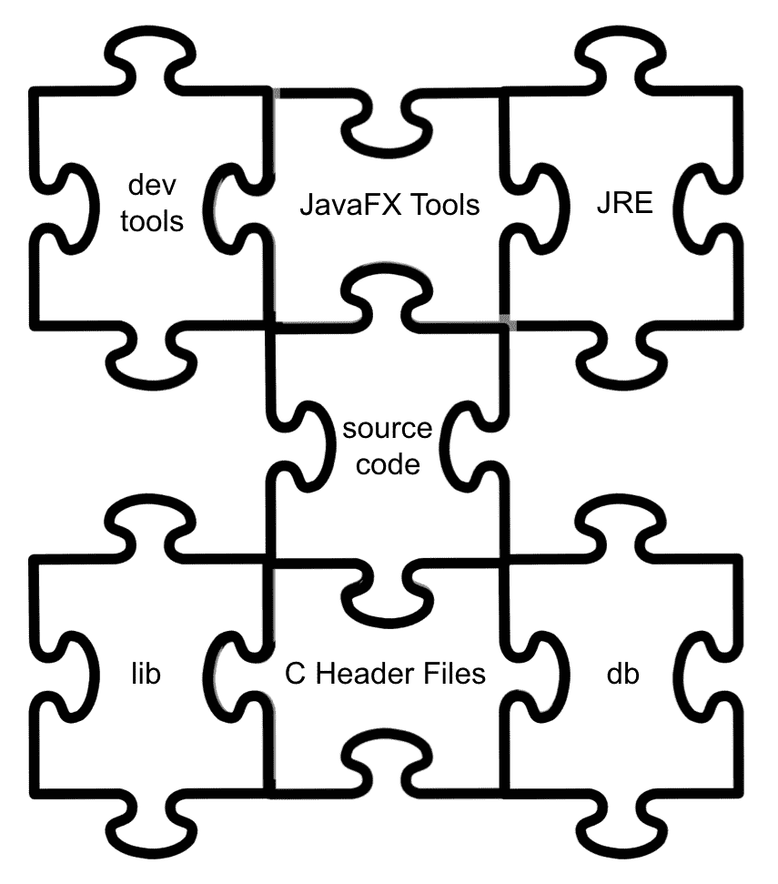
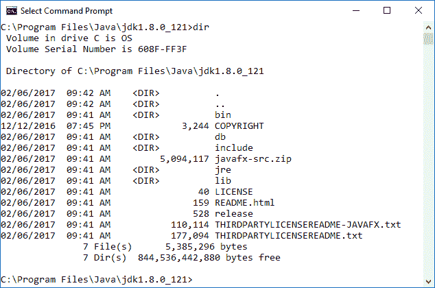
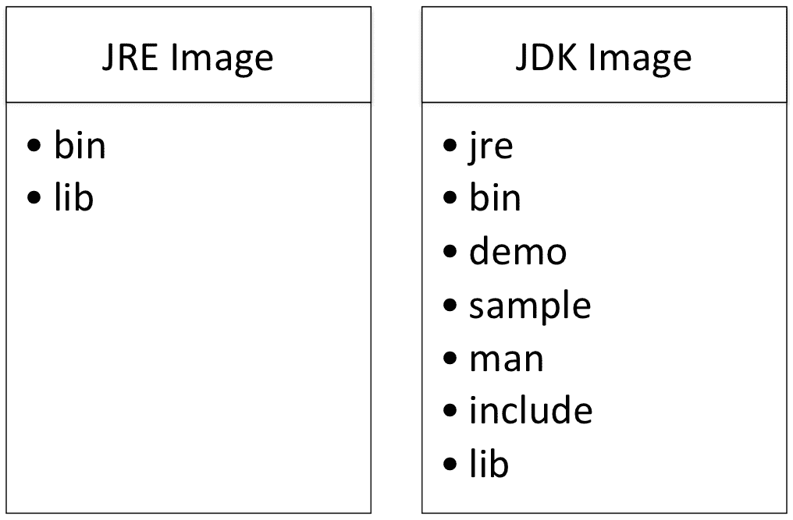
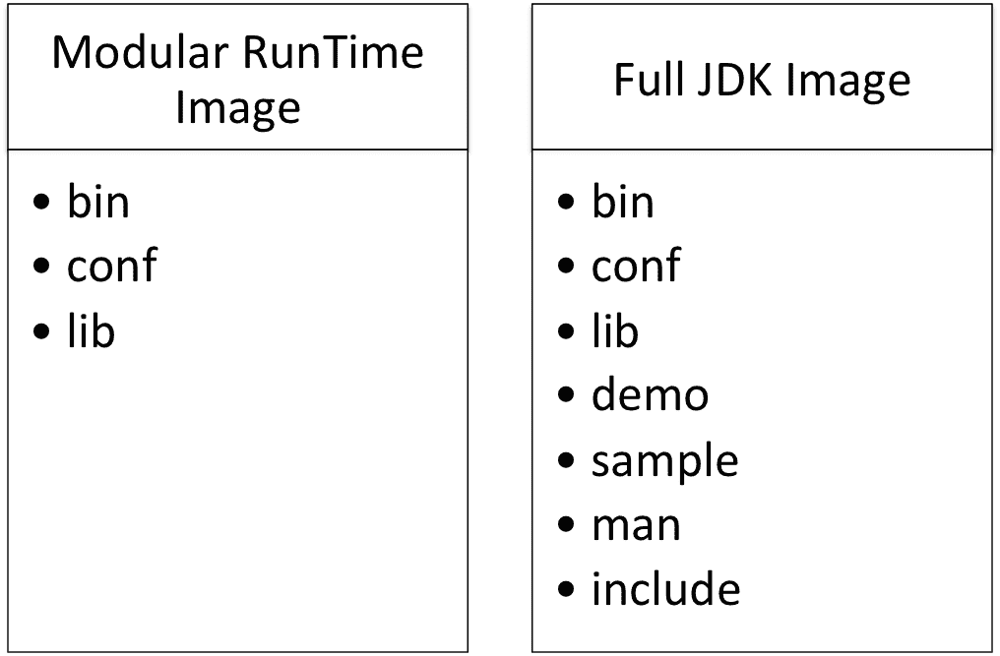
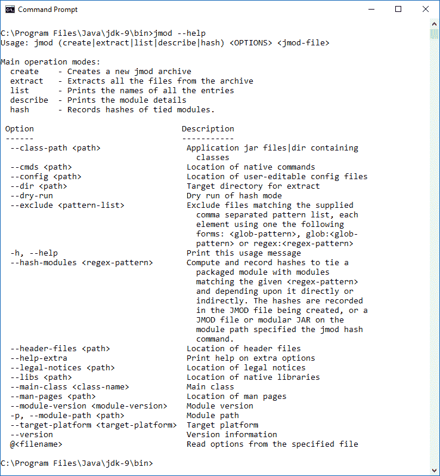
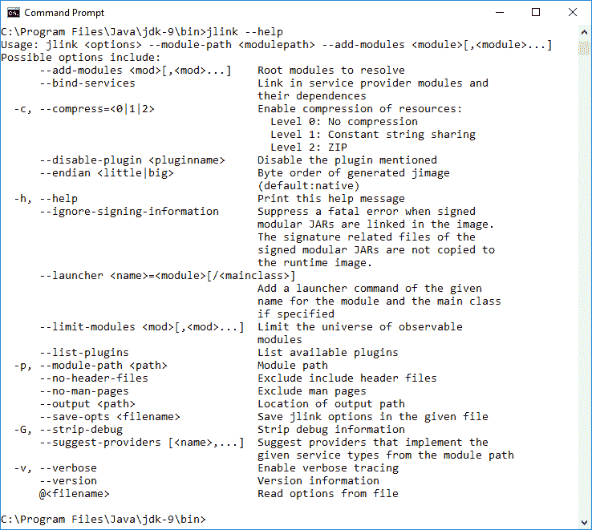
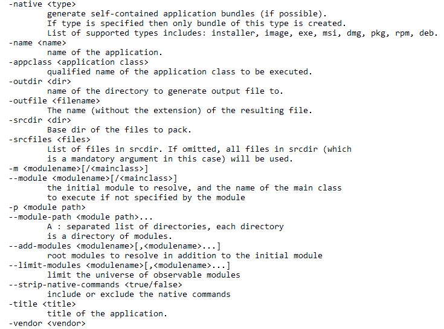

# 使用 Java 11 构建模块化应用程序

在最后一章中，我们介绍了对 java 平台的最新更改，了解变量处理程序以及它们与原子工具包相关的。 我们还涵盖了折旧警告以及为什么在特定情况下被抑制。 项目硬币相关的更改是探索的，以及导入语句处理，推断局部变量和线程局部握手。 我们进一步探讨变为带有一看堆分配，根证书，动态类文件常量和去除 Java EE 和 CORBA 组件的 Java 语言。

在本章中，我们将检查项目拼图指定的 Java 模块的结构。 我们将深入潜入项目拼图的方式作为 Java 平台的一部分实现。 我们还将审查 Java 平台的关键内部更改，因为它们与模块化系统相关。

我们将查看以下主题：

*   一个模块化的第一
*   模块化的 JDK.
*   模块化运行时映像
*   模块系统
*   模块化 Java 应用程序包装
*   Java Linker.
*   封装大多数内部 API

# 技术要求

本章和后续章节具有 Java 11\. Java 平台的**标准版**（ **SE** ）可以从 Oracle 的官方下载站点下载（ [http://www.oracle .com / technetwork / java / javase / downloads / index.html](http://www.oracle.com/technetwork/java/javase/downloads/index.html) ）。

IDE 软件包就足够了。 来自 JetBrains 的 Intellij Idea 用于与本章相关的所有编码以及随后的章节。 可以从网站下载 Intellij Idea 的社区版本（ [https://www.jetbrains.com/idea/features/）](https://www.jetbrains.com/idea/features/)。

# 一个模块化的第一

我们可以将术语**模块化**定义为计算机软件的上下文中的设计或构造类型。 这种类型的软件设计涉及一组共同构成整体的模块。 例如，可以作为单一结构或以模块化方式构建房屋，其中每个房间独立构造并连接到创建房屋。 通过这种类比，您可以在创建您的家中选择性地添加或不添加模块。

模块的集合，在我们的类比中成为您家的设计。 您的设计不需要使用每个模块，只有您想要的模块。 因此，例如，如果有地下室和奖励室模块，并且您的设计不包括那些模块化房间，那些模块不用于构建您的家。 替代方案是每个家庭都将包括每个房间，而不仅仅是使用的房间。 当然，这将是浪费的。 让我们看看与软件相关联。

该概念可以应用于计算机架构和软件系统。 我们的系统可以由几个组件组成而不是一个庞大的系统。 正如您所能想象的那样，这为我们提供了一些特定的好处：

*   我们应该能够扩展我们的 Java 应用程序来在小型设备上运行
*   我们的 Java 应用程序将更小
*   我们的模块化代码可以更具目标
*   增加使用面向对象的编程模型
*   封装有额外的机会
*   我们的代码将更高效
*   Java 应用程序将增加性能
*   整体系统复杂性降低
*   测试和调试更容易
*   代码维护更容易

有几个原因，需要转移到 Java 的模块化系统。 以下是 Java 平台之前 Java 平台的主要条件导致当前 Java 平台中的模块化系统的创建：

*   **Java 开发套件**（ **JDK** ）太大。 这使得难以支持小型设备。 即使在下一节中讨论的紧凑型材，也是最困难的支持，在某些情况下，也是不可能的。
*   由于超大的 JDK，很难支持我们的 Java 应用程序真正优化的性能。 在这种情况下，更小更好。
*   **Java 运行时环境**（ **JRE** ）太大而无法有效地测试和维护我们的 Java 应用程序。 这导致耗时，低效的测试和维护操作。
*   **java 存档**（ **jar** ）文件也太大了。 这使得支持小型设备有问题。
*   因为 JDK 和 JRE 都是全包，所以安全性很大。 例如，Java 应用程序未使用的内部 API 仍然可用，这是由于公共访问修饰符的性质。
*   最后，我们的 Java 应用程序不必要地大。

模块化系统具有以下要求：

*   必须有一个公共接口来允许所有连接模块之间的互操作性
*   必须支持隔离和连接的测试
*   编译时间操作必须能够识别使用哪些模块
*   模块必须有运行时支持

模块概念首先在 Java 9 中引入; 它是一个命名的数据和代码集合。 具体来说，Java 模块是以下内容的集合：

*   包
*   班级
*   界面
*   代码
*   数据
*   资源

成功实现的关键，模块在模块化声明中自述。 模块名称必须是唯一的，通常使用反向域名模式。 以下是一个示例声明：

```
module com.three19.irisScan { }
```

模块声明包含在`module-info.java`文件中，该文件应该在模块的`root`文件夹中。 由于人们可能期望，此文件将被编译为`module-info.class`文件，并将放在相应的输出目录中。 这些输出目录是在模块源代码中建立的。

在下一节中，我们将在模块化方面查看对 Java 平台的特定更改。

# 模块化的 JDK.

JEP-200 的核心目标是使用 **Java 平台模块系统**（ **JPMS** ）模块化 JDK。 在 Java 9 之前，我们对 JDK 的熟悉包括对其主要组成部分的认识：

*   jre.
*   翻译（Java）
*   编译器（Javac）
*   归档者（​​罐子）
*   文档生成器（Javadoc）

模块化 JDK 的任务是将其分解成在编译时或运行时组合的组件。 模块化结构基于以下模块化配置文件，该配置文件在 Java 8 中建立了紧凑型材。三个配置文件中的每一个都在以下表中详述：

*   **紧凑型材 1** ：

| `java.io` | `java.lang.annotation` | `java.lang.invoke` |
| `java.lang.ref` | `java.lang.reflect` | `java.math` |
| `java.net` | `java.nio` | `java.nio.channels` |
| `java.nio.channels.spi` | `java.nio.charset` | `java.nio.charset.spi` |
| `java.nio.file` | `java.nio.file.attribute` | `java.nio.file.spi` |
| `java.security` | `java.security.cert` | `java.security.interfaces` |
| `java.security.spec` | `java.text` | `java.text.spi` |
| `java.time` | `java.time.chrono` | `java.time.format` |
| `java.time.temporal` | `java.time.zone` | `java.util` |
| `java.util.concurrent` | `java.util.concurrent.atomic` | `java.util.concurrent.locks` |
| `java.util.function` | `java.util.jar` | `java.util.logging` |
| `java.util.regex` | `java.tuil.spi` | `java.util.stream` |
| `java.util.zip` | `javax.crypto` | `javax.crypto.interfaces` |
| `javax.crypto.spec` | `javax.net` | `javax.net.ssl` |
| `javax.script` | `javax.security.auth` | `javax.security.auth.callback` |
| `javax.security.auth.login` | `javax.security.auth.spi` | `javax.security.auth.spi` |
| `javax.security.auth.x500` | `javax.security.cert` |  |

*   **紧凑型材 2** ：

| `java.rmi` | `java.rmi.activation` | `java.rmi.drc` |
| `java.rmi.registry` | `java.rmi.server` | `java.sql` |
| `javax.rmi.ssl` | `javax.sql` | `javax.transaction` |
| `javax.transaction.xa` | `javax.xml` | `javax.xml.database` |
| `javax.xml.namespace` | `javax.xml.parsers` | `javax.xml.stream` |
| `javax.xml.stream.events` | `javax.xml.stream.util` | `javax.xml.transform` |
| `javax.xml.transform.dom` | `javax.xml.transform.sax` | `javax.xml.transform.stax` |
| `java.xml.transform.stream` | `javax.xml.validation` | `javax.xml.xpath` |
| `org.w3c.dom` | `org.w3c.dom.bootstrap` | `org.w3c.dom.events` |
| `org.w3c.dom.ls` | `org.xml.sax` | `org.xml.sax.ext` |
| `org.xml.sax.helpers` |  |  |

*   **紧凑型材 3** ：

| `java.lang.instrument` | `java.lang.management` | `java.security.acl` |
| `java.util.prefs` | `javax.annotation.processing` | `javax.lang.model` |
| `javax.lang.model.element` | `javax.lang.model.type` | `javax.lang.model.util` |
| `javax.management` | `javax.management.loading` | `javax.management.modelmbean` |
| `javax.management.monitor` | `javax.management.openmbean` | `javax.management.relation` |
| `javax.management.remote` | `javax.management.remote.rmi` | `javax.management.timer` |
| `javax.naming` | `javax.naming.directory` | `javax.naming.event` |
| `javax.naing.ldap` | `javax.naming.spi` | `javax.security.auth.kerberos` |
| `javax.security.sasl` | `javax.sql.rowset` | `javax.sql.rowset.serial` |
| `javax.sql.rowset.spi` | `javax.tools` | `javax.xml.crypto` |
| `javax.xml.crypto.dom` | `javax.xml.crypto.dsig` | `javax.xml.crypto.dsig.dom` |
| `javax.xml.crypto.dsig.keyinfo` | `javax.xml.crypto.dsig.spec` | `org.ieft.jgss` |

三个紧凑的模块配置文件代表当前 Java 平台中标准化模块化系统的基础。 本标准化的有效性依赖于以下六项原则：

*   所有 JCP 管理模块都必须以字符串`java`开头。 因此，如果正在开发出现空间实用程序上的模块，则它将具有诸如`java.spatial.util`之类的名称。

**JCP** refers to the **Java Community Process**. JCP allows developers to create technical specifications for Java. You can learn more about JCP and become a member at the official JCP website at [https://www.jcp.org/en/home/index](https://www.jcp.org/en/home/index).

*   非 JCP 模块被视为 JDK 的一部分，它们的名称必须以字符串`jdk`开头。
*   确保方法调用链接正确。 这最好用以下流程图说明：


正如您在前面的流程图中看到的，它只适用于导出包的模块。

*   第四个原则涉及标准模块中使用的标准和非标准 API 包。 以下流程图说明了该原则的契约的实现：


*   第五种设计原则是标准模块可以取决于多于一个非标准模块。 允许此依赖项，暗示对非标准模块的可读性访问不是。
*   最终设计原理确保非标准模块不导出标准 API 包。

# 模块化源代码

如前所述，Project Jigsaw 的目标是模块化。 设想的标准模块化系统将应用于 Java SE 平台和 JDK。 除了效率收益外，模块化偏移将导致更好的安全性和易于维护性。 JEP-201 中详述的增强专注于 JDK 源代码重组。 让我们仔细看看。

重新组织 JDK 的源代码是一项重要任务，并通过以下目标子集完成：

*   提供 JDK 开发人员的洞察力和熟悉新的 Java 9 模块化系统。 因此，这一目标是针对 JDK 的开发人员，而不是主流开发商。
*   确保在整个 JDK 构建过程中建立并维护模块化边界。
*   第三个目标是确保未来的增强功能，特别是与项目拼图，可以轻松集成到新的模块化系统中。

这种源代码重组的重要性不能夸大。 java 前 9 个源代码组织为 20 岁。 此逾期 JDK 源代码重组将使代码更容易维护。 让我们来看看 JDK 源代码的上一个组织，然后检查更改。

# 模块化前的 JDK 源代码组织

JDK 是代码文件，工具，库等的编译。 下图提供了 JDK 组件的概述：



前图中的 JDK 组件的预先模块化组织在接下来的七个小节中详述。

# 开发工具

开发工具位于`\bin`目录中。 这些工具包括七个广泛分类，每个分类在后续部分中详细说明。

# 部署

这是一组旨在帮助部署 Java 应用程序的工具：

*   `appletviewer`：此工具使您能够运行和调试 Java applet 而无需 Web 浏览器。
*   `extcheck`：此工具允许您在 JAR 文件中查找冲突。
*   `jar`：此工具用于创建和操作 JAR 文件。 JAR 文件是 Java 归档文件。
*   `java`：这是 Java 应用程序启动器。
*   `javac`：这是 Java 编译器。
*   `javadoc`：此工具生成 API 文档。
*   `javah`：此工具允许您编写本机方法; 它生成 C 头文件。
*   `javap`：此工具拆卸类文件。
*   `javapackager`：用于签名和打包 Java 应用程序，包括 JavaFX。
*   `jdb`：这是 Java 调试器。
*   `jdeps`：这是一个用于 Java 类依赖性的分析器。
*   `pack200`：这是一个将 JAR 文件压缩到`pack200`文件中的工具。 使用此工具的压缩比令人印象深刻。
*   `unpack200`：此工具解压缩`pack200`文件，导致 JAR 文件。

# 国际化

如果您有兴趣创建可本地化的应用程序，则以下工具可能会派上用场：

*   `native2ascii`：此工具从正常文本创建 Unicode Latin-1

# 监测

用于提供 JVM 性能数据的监控工具包括以下内容：

*   `jps`：这是 JVM 进程状态工具（`jps`）。 它提供了特定系统上的热点 JVMS 列表。
*   `jstat`：这是 JVM 统计监控工具。 它从具有热点 JVM 的机器收集日志数据和性能信息。
*   `jstatd`：这是`jstat`守护程序工具。 它运行 RMI Server 应用程序，用于监控 Hotspot JVM 操作。

# rmi.

**RMI** 工具是**远程方法调用**工具。 它们帮助开发人员创建通过网络运营的应用程序以包含 Internet：

*   `rmic`：此工具可以在网络上生成存根和骨架
*   `rmiregistry`：这是远程对象的注册表服务
*   `rmid`：此工具是 RMI 的激活系统守护程序
*   `serialver`：此工具返回类`serialVersionUID`值

# 安全

这组安全工具赋予开发人员创建可以在开发人员计算机系统以及远程系统上强制执行的安全策略：

*   `keytool`：此工具管理安全证书和密钥库
*   `jarsigner`：此工具生成并验证 jar 签名以创建/打开 jar 文件
*   `policytool`：此工具具有图形用户界面，可帮助开发人员管理其安全策略文件

# 故障排除

这些实验故障排除工具对于非常具体的故障排除是有用的。 它们是实验性的，因此，没有正式支持：

*   `jinfo`：此工具提供特定流程，文件或服务器的配置信息
*   `jhat`：这是一个堆转储工具。 它实例化了一个 Web 服务器，以便可以用浏览器查看堆
*   `jmap`：从过程，文件或服务器中显示堆和共享对象存储器映射
*   `jsadebugd`：这是 Java 的 Serviceability Agent 调试守护程序。 它充当进程或文件的调试服务器
*   `jstack`：这是一个 Java Stack 跟踪工具，为进程，文件或服务器提供一个线程堆栈跟踪

# 网页服务

这组工具提供了一个可以与 **Java Web Start** 和其他 Web 服务一起使用的实用程序：

*   `javaws`：这是一个启动 Java Web Start 的命令行工具。
*   `schemagen`：此工具为 Java 架构生成模式。 这些模式用于 XML 绑定。
*   `wsgen`：此工具用于生成便携式的 JAX-WS 工件。
*   `wsimport`：此工具用于导入便携式 JAX-WS 工件。
*   `xjc`：这是用于 XML 绑定的绑定编译器。

# javafx 工具

JavaFx 工具位于包括`\bin`，`\man`和`\lib`目录的几个不同的地方。

# Java 运行时环境

JRE 位于`\jre`目录中。 密钥内容包括 JVM 和类库。

# 源代码

JDK 的源代码 Pre-Java 9 具有以下基本组织架构：

```
source code / [shared, OS-specific] / [classes / native] / Java API package name / [.file extension]
```

让我们看看这有点近。 在源代码之后，我们有两个选项。 如果代码是跨平台，那么它是一个共享目录; 否则，它是特定于操作系统的。 例如：

```
src/share/...
src/windows/...
```

接下来，我们有类目录或母语目录。 例如：

```
src/share/classes/...
src/share/classes/java/...
```

接下来，我们有 Java API 包的名称，后跟文件扩展名。 文件扩展依赖于内容，例如`.java`，`.c`等。

# 图书馆

`\lib`目录包含`\bin`目录中的一个或多个开发工具所需的类库。 以下是典型 Java 8 `\lib`目录中的文件列表：



查看目录列表不提供较大的粒度洞察力。 我们可以列出包含以下命令中的任何`.jar`文件中的类：`jar tvf fileName.jar`。 例如，这是在命令行处执行`jar tvf javafx-mx.jar`生成的类列表：


# c 头文件

`/include`目录包含 C 头文件。 这些文件主要支持以下内容：

*   **Java 本机接口（JNI）**：这用于本机代码编程支持。 JNI 用于将 Java 本机方法和 JVM 嵌入到本机应用程序中。
*   **JVM 工具接口（JVM TI）**：这是由运行 JVM 运行的应用程序的状态检查和执行控制的工具使用。

# 数据库

Apache Derby 关系数据库存储在`/db`目录中。 您可以在以下网站上了解有关 Java DB 的更多信息：

*   [http://docs.oracle.com/javadb/support/overview.html](https://docs.oracle.com/javadb/support/overview.html)
*   [http://db.apache.org/derby/manuals/#docs_10.11](http://db.apache.org/derby/manuals/#docs_10.11)

# JDK 源代码重组

在上一节中，您了解到，Java 9 源代码组织架构如下：

```
source code / [shared, OS-specific] / [classes / native] / Java API package name / [.file extension]
```

在当前的 Java 平台中，我们有一个模块化模式。 那个模式如下：

```
source code / module / [shared, OS-specific] / [classes / native / configuration] / [ package / include / library ] / [.file extension]
```

新架构存在一些差异，值得注意的是模块名称。 在共享或操作系统特定目录之后，存在类目录，C 或 C ++源文件的本机目录或配置目录。 这个看似基本的组织模式改变导致更加可维护的代码基础。

# 模块化运行时映像

Java 的模块化系统在 Java 9 中引入，需要更改运行时图像以进行兼容性。 这些变化的好处包括以下领域的增强：

*   可维护性
*   表现
*   安全

这些变化的核心是用于资源命名的新 URI 模式。 这些资源包括模块和类。

a **统一资源标识符**（ **URI** **）**类似于 **url** （**统一资源定位器**） 识别某事物的名称和位置。 对于 URL，某事是网页; 对于 URI，它是一种资源。

JEP-220 有五个主要目标，这些主要目标在以下部分详述。

# 采用运行时格式

为 Java 9 创建运行时格式，以便通过存储的类和其他资源文件采用。 此格式适用于以下情况下的存储类和资源：

*   当新的运行时格式具有比 Pre-Java 9 jar 格式具有更大的效率（时间和空间）时。

a **jar** 文件是 **java 存档**文件。 这是一种基于传统 ZIP 格式的压缩文件格式。

*   存储类和其他资源可以单独隔离和加载。
*   当可以存储 JDK 和库类和资源时。 这也包括应用程序模块。
*   当他们设计以促进未来的增强的方式时。 这需要它们可扩展，记录和灵活。

# 运行时映像重组

Java 中有两种类型的运行时图像：JDK 和 JRE。 以 Java 9 开头，这些图像类型都被重组以区分可以由用户使用和修改的文件之间的文件，以便由开发人员及其应用程序未修改的内部文件。

JDK 构建系统在 Java 9 之前，产生了 JRE 和 JDK。 JRE 是 Java 平台的完整实现。 JDK 包括 JRE 以及其他工具和库。 Java 9 中的值得注意的变化是 JRE 子目录不再是 JDK 图像的一部分。 部分地，该更改部分地进行了确保两种图像类型（JDK 和 JRE）具有相同的图像结构。 具有共同且重组的结构，将更有效地集成未来的变化。

如果您在 java 9 之前创建了自定义插件，该应用程序地满足特定结构，您的应用可能无法在 Java 9 中工作。如果您显式寻址`tools.jar`，这也是如此。

下图提供了 Java 9 释放之前的每个图像的内容的高级视图：



Java 9 运行时图像在下图中示出。 如图所示，完整的 JDK 图像包含与模块化运行时图像相同的目录以及`demo`，`sample`，`man`，以及目录：



JRE 和 JDK 图像之间不再有区别。 使用当前的 Java 平台，JDK 映像是包含一整套 Dev 工具的 JRE 映像。

# 支持共同的操作

开发人员偶尔必须编写执行需要访问运行时映像的操作的代码。 Java 9 包括对这些常用操作的支持。 由于重组和标准化的 JDK 和 JRE 运行时图像结构，这是可能的。

# 剥夺 jdk 课程

当前的 Java 平台允许对单个 JDK 类的权限撤销。 此更改加强系统安全性，因为它确保了 JDK 类仅接收系统操作所需的权限。

# 保留现有行为

Jep-220 的最终目标是确保现有课程没有负面影响。 这是指在内部 JDK 或 JRE 运行时图像上没有依赖性的应用程序。

# 模块系统

您将记住，模块化系统是创建的，为 Java 程序提供可靠的配置和强大的封装。 此实现的关键是链接时间的概念。 如这里所示，链路时间是编译时间和运行时之间的可选阶段。 该阶段允许将适当的模块组装成优化的运行时图像。

这是可能的，部分是由于 JLink 链接工具，您将在本章稍后了解更多内容：


# 模块路径

组织模块很重要，以便它们很容易找到。 模块路径，模块组件或目录序列提供了搜索使用的组织结构。 按顺序搜索这些路径组件，返回包括模块的第一路径组件。

模块及其路径不应被视为与包或类路径相同。 它们确实不同，具有更大的保真度。 关键区别在于，使用类路径，搜索单数组件。 模块路径搜索返回完整的模块。 通过在呈现的顺序中搜索以下路径，可以通过返回模块来搜索此类搜索：

*   编译模块路径
*   升级模块路径
*   系统模块
*   应用模块路径

让我们简要介绍这些路径中的每一个。 编译模块路径仅适用于编译时并包含模块定义。 升级模块路径具有编译的模块定义。 系统模块内置并包含 Java SE 和 JDK 模块。 最终路径，应用程序模块路径具有来自应用程序模块的编译模块定义以及库模块。

# 访问控制边界违规

作为专业开发人员，您始终希望您的代码是安全的，便携和错误的，这需要严格遵守封装的 Java 构造。 有些场合，例如使用白盒测试，您需要打破 JVM 任务的封装。 此授权允许交叉模块访问。

要允许打破封装，可以在模块声明中添加`add-exports`选项。 以下是您将使用的语法：

```
module com.three19.irisScan
{
  - - add-exports <source-module>/<package> = <target-module>
  (, <target-module> )*
}
```

让我们仔细看看前面的语法。 `<source-module>`和`<targetmodule>`是模块名称，而`<package>`是包的名称。 使用`add-exports`选项允许我们违反访问控制边界。

使用`add-exports`选项有两条规则：

*   它可以在模块中多次使用
*   每次使用必须是`<source-module>`和`<targetmodule>`的唯一配对

不建议使用`add-exports`选项，除非绝对必要。 其使用允许危险访问库模块的内部 API。 此类使用使您的代码依赖于内部 API 不更改，这超出了您的控件。

# 运行

热点虚拟机实现`jmod`和`jlink`命令行工具的`<options>`。

以下是`jmod`命令行工具的`<options>`列表：



以下是`jlink`命令行工具的`<options>`列表：



# 模块化 Java 应用程序包装

Java 9 的巨大改进之一和持久的 Java 10 和 11 是由 **Java Packager** 生成的运行时二进制文件的大小。 由于 **Java Linker** ，这是可能的，这是下一节中介绍的。 Java Packager 的工作流程在当前 Java 11 中基本上仍然相同，因为它在 Java 8 中存在。如上所示，在本节稍后会看到，添加到工作流程的新工具。

Java Packager 仅创建 JDK 应用程序。 此更改 Java Packager 旨在简化并使生成运行时更有效的过程的过程。 因此，Java Packager 只会为其与之关联的 SDK 版本创建运行时图像。

# 高级外观 java 链接器

在 Java Linker 工具之前，在 Java 9 中引入的`jlink`，运行时图像创建包括复制整个 JRE。 然后，删除未使用的组件。 简单地说，`jlink`有助于仅使用所需的模块创建运行时图像。 Java Packager 使用`jlink`以生成嵌入式运行时图像。

# Java Packager 选项

Java Packager 的语法如下：

```
javapackager -command [-options]
```

可以使用五种不同的命令（`-command`）。 它们描述如下：

| **命令** | **描述** |
| `-createbss` | 此命令用于将 CSS 的文件转换为二进制文件。 |
| `-createjar` | 此命令以及其他参数一起使用，创建 JAR 归档文件。 |
| `-deploy` | 此命令用于生成 Java 网络启动协议（JNLP）和 HTML 文件。 |
| `-makeall` | 此命令组合`-createjar`，`-deploy`和编译步骤。 |
| `-signJar` | 此命令创建并签署 JAR 文件。 |

`-createbss`命令的`[-options]`包括以下内容：


`-createjar`命令的`[-options]`包括以下内容：


`-deploy`命令的第一组`[-options]`包括以下内容：



`-deploy`命令的剩余`[-options]`集合包括以下内容：


`-makeall`命令的`[-options]`包括以下内容：


`-signJar`命令的`[-options]`包括以下内容：


Java Packager 分为两个模块：

*   `jdk.packager`
*   `jdk.packager.services`

# Java Linker.

Java 链接器通常称为 jlink，是创建以创建自定义运行时图像的工具。 此工具与其依赖项一起收集相应的模块，然后优化它们以创建图像。 这代表了 Java 的大大变化，java 9.在 Java Linker 工具，JLink 可用之前，运行时图像创建最初复制整个 JRE。 在随后的步骤中，除去未使用的组件。 在当前的 Java 平台中，`jlink`只使用所需的模块创建运行时映像。 Java Packager 使用`jlink`以生成嵌入式运行时图像。

如前一节所示，Java 平台最近的更改导致链接时间作为编译时间和运行时之间的可选阶段。 在此阶段，适当的模块组装成优化的运行时图像。

JLink 是一个命令行链接工具，允许创建包含较小的 JDK 模块子集的运行时图像。 这导致较小的运行时图像。 以下语法由四个组件 - `jlink`命令，选项，模块路径和输出路径组成：

```
$ jlink <options> ---module-path <modulepath> --output <path>
```

以下是可以与`jlink`工具一起使用的选项列表以及每个的简要说明：


模块路径告诉链接器在哪里找到模块。 链接器不会使用分解模块或 jar / jmod 文件。

输出路径只是通知链接器在其中保存自定义运行时映像。

# 封装大多数内部 API

已实施 Jep-260 以使 Java 平台更安全。 本九首九首核心的目标是封装大多数内部 API。 具体而言，默认情况下，大多数 JDK 的内部 API 不再可访问。 目前，视为批判性和广泛使用的内部 API 仍然可以访问。 将来，我们可能会看到替换它们的功能，而且在此，默认情况下无法访问这些内部 API。

那么，为什么这种变化是必要的？ 有一些广泛使用的 API 不稳定，在某些情况下，不标准化。 不支持的 API 不应该访问 JDK 的内部详细信息。 因此，JEP-260 导致 Java 平台的安全性增加。 一般来说，您不应该在您的开发项目中使用不受支持的 API。

上述关键 API（JDK 内部）如下：

*   `sun.misc`
*   `sun.misc.Unsafe`
*   `sun.reflect.Reflection`
*   `sun.reflect.ReflectionFactory.newConstrutorForSerialization`

上述关键内部 API 仍然可以在当前的 Java 平台中访问。 它们将可以使用`jdk.unsupported` JDK 模块访问。 全 JRE 和 JDK 图像将包含`jdk.unsupported`模块。

您可以使用 Java 依赖性分析工具`jdeps`，帮助确定您的 Java 程序是否对 JDK 内部 API 有任何依赖项。

这是一个有趣的观看变化。 默认在未来的 Java 版本中，默认情况下可能无法访问当前访问的内部 API。

# 概括

在本章中，我们检查了项目拼图指定的 Java 模块的结构，并深入了解项目拼图驱动的实施方式，以改善 Java 平台。 我们还审核了 Java 平台的关键内部更改，因为它们与模块化系统相关。 我们的评论开始使用模块化底漆，在那里我们在福利和要求方面了解了 Java 的模块化系统。

我们探索了构成 JDK 的七个主要工具类别。 正如我们所学到的，Java 中的模块化也扩展到运行时图像，导致更易于的可维护性，更好的性能和增加的安全性。 链接时间的概念被引入编译时和运行时之间的可选阶段。 我们通过查看 Java 链接器以及 Java 如何封装内部 API 的章节。

在下一章中，我们将探讨如何将现有应用程序迁移到当前的 Java 平台。 我们将查看手动和半自动迁移过程。

# 问题

1.  导致 Java 平台模块化的主要贡献因素是什么？
2.  模块化系统的四个强制要求是什么？
3.  Java 模块是哪个六个组件的集合？
4.  所有 JCP 治理的模块都开始了哪些前缀？
5.  JDK 的七个主要组成部分是什么？
6.  模块化运行时图像有哪些好处？
7.  哪些目录位于模块化运行时映像？
8.  哪些目录位于完整的 JDK 图像中？
9.  编译时间和运行时之间的可选阶段是什么？
10.  Java Packager 创建的二进制文件是什么意义的小于以前的 Java 版本中的？

# 进一步阅读

这里列出的参考将帮助您深入了解本章中提供的概念：

*   *学习 Java 9 - 模块化编程*，在[https://www.packtpub.com/application-development/learning-java-9- --Modular 编程 - 视频](https://www.packtpub.com/application-development/learning-java-9-%E2%80%93-modular-programming-video)。
*   *使用 Java 9 - 逐步*学习 Jshell，在[https://www.packtpub.com/application-development/learn-jshell-java-9- Step -step-video](https://www.packtpub.com/application-development/learn-jshell-java-9-step-step-video) 。