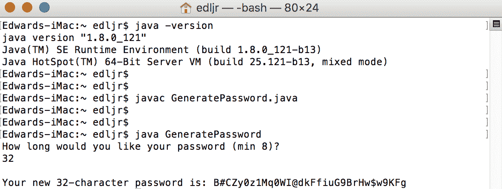
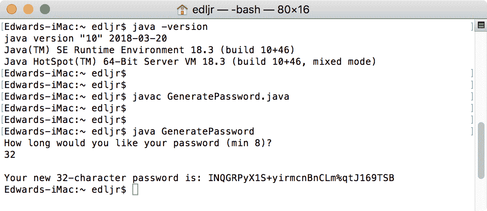
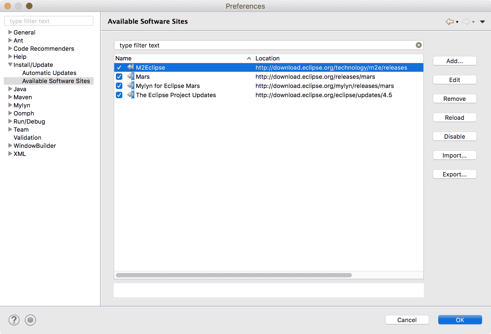
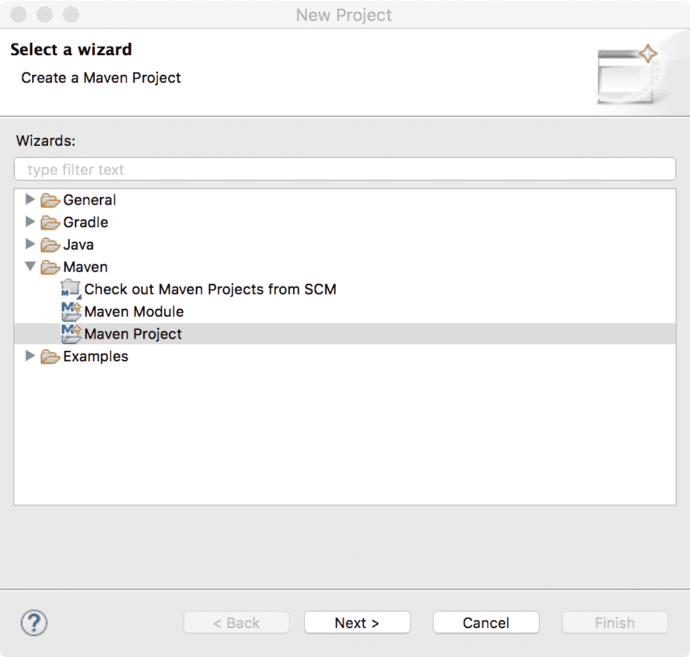

# 将应用迁移到 Java11

在前一章中，我们仔细研究了项目 Jigsaw 指定的 Java 模块的结构，并研究了如何实现项目 Jigsaw 来改进 Java 平台。我们还回顾了 Java 平台的关键内部更改，并特别关注新的模块化系统。我们从一个模块化入门开始，在这里我们了解了 Java 的模块化系统的好处和需求。接下来，我们将探讨 JDK 的模块化，包括如何重新组织源代码。我们还研究了 JDK 的七个主要工具类别，并了解到 Java 模块化扩展到运行时映像，从而提高了可维护性、更好的性能和提高了安全性。引入**链路时间**的概念，作为编译时间与运行时之间的可选阶段。我们在结束这一章时，将介绍 Java 链接器以及 Java 如何封装内部 API。

在本章中，我们将探讨如何将现有的应用迁移到当前的 Java 平台。我们将研究手动和半自动迁移过程。本章旨在为您提供一些见解和过程，使您的非模块化 Java 代码能够在当前的 Java 平台上工作。

我们将在本章讨论的主题如下：

*   Jigsaw 项目快速回顾
*   模块如何适应 Java 环境
*   迁移规划
*   Oracle 的建议
*   部署
*   有用的工具

# 技术要求

本章及后续章节介绍 Java11。Java 平台的**标准版**（**SE**）可从 [Oracle 官方下载网站](http://www.oracle.com/technetwork/java/javase/downloads/index.html)下载。

一个**集成开发环境**（**IDE**）软件包就足够了。来自 JetBrains 的 IntelliJ IDEA 用于与本章和后续章节相关的所有编码。IntelliJ IDEA 的社区版可从[网站](https://www.jetbrains.com/idea/features/)下载。

本章的源代码可以在 [GitHub 的 URL](https://github.com/PacktPublishing/Mastering-Java-11-Second-Edition) 上找到。

# Jigsaw 项目快速回顾

Jigsaw 项目是一个 Java 项目，它包含了对 Java 平台的几个更改建议。正如您在前面几章中所读到的，Java9 中对 Java 平台最重要的更改涉及到模块和模块化。转移到 Java 模块的计划是由 Jigsaw 项目推动的。对模块化的需求源于 Java 的两大挑战：

*   类路径
*   JDK 公司

接下来，我们将回顾这两个挑战，并了解如何使用当前的 Java 平台解决和克服它们。

# 类路径

在 Java9 之前，类路径是有问题的，也是开发人员痛苦的根源。这一点在众多的开发者论坛上表现得很明显，幸运的是，Oracle 对此给予了关注。下面是类路径可能有问题的几个实例；下面是两个主要的例子：

*   第一种情况涉及在开发计算机上有两个或多个版本的库。Java 系统以前处理这个问题的方式是不一致的。在类加载过程中使用了哪个库并不容易辨别。这导致了不希望的缺乏特异性，而没有足够的关于加载哪个库的细节
*   第二种情况是使用类加载器的最高级功能。通常情况下，这种类型的类加载器的使用会导致最多的错误和 bug。这些错误和 bug 并不总是很容易被发现，并且会给开发人员带来很多额外的工作。

在 Java9 之前，类路径几乎总是非常长的。在最近的一次演示中，Oracle 共享了一个包含 110 个 JAR 文件的类路径。这类笨拙的类路径很难检测到冲突，甚至很难确定是否缺少任何内容，如果缺少，可能缺少什么。将 Java 平台重新设想为一个模块化的系统使得这些类路径问题成为过去。

模块通过提供可靠的配置来解决 Java9 之前的类路径问题。

# JDK 的整体性

自 1995 年以来，Java 以一种令人印象深刻的方式不断发展，随着每一步的发展，JDK 都变得越来越大。与 Java8 一样，JDK 已经变得非常庞大。在 Java9 之前，由于 JDK 的整体性，存在一些问题，包括以下问题：

*   因为 JDK 太大了，它不适合非常小的设备。在一些开发部门，这就足够找到解决软件工程问题的非 Java 解决方案了
*   过大的 JDK 导致了浪费。在设备、网络和云上运行时，它在处理和内存方面是浪费的。这源于这样一个事实：即使只需要 JDK 的一小部分，也会加载整个 JDK
*   虽然 Java 平台在运行时有很好的性能，但是从负载和启动时间来看，启动性能还有很多需要改进的地方
*   大量的内部 API 也是一个难点。因为有太多的内部 API 存在并且被开发人员使用，所以系统很难进化
*   内部 API 的存在使得 JDK 很难实现安全性和可伸缩性。由于存在如此多的内部依赖关系，隔离安全性和可伸缩性问题是非常困难的。

解决 JDK 整体问题的答案是模块。Java9 引入了该模块及其自己的模块化系统。对平台的一个重大更新是只编译所需的模块，而不是编译整个 JDK。这一模块化系统涵盖了整个这本书。

模块通过提供强大的封装解决了 Java9JDK 之前的单片问题。

# 模块如何适应 Java 环境

如下图所示，包由类和接口组成，模块由包组成。模块是包的容器。这是 Java 模块化系统的基本前提，在一个非常高的层次上。重要的是将模块视为模块化系统的一部分，而不是简单地将其视为包之上的新抽象级别，如下图所示：


所以，模块是 Java9 的新成员，正如您所料，它们需要声明才能使用。一个模块的声明包括它具有依赖关系的其他模块的名称。它还为其他依赖于它的模块导出包，模块化声明可以说是开始使用 Java 开发时需要解决的最重要的模块化问题。举个例子：

```java
module com.three19.irisScan {
  // modules that com.three19.irisScan depends upon
  requires com.three19.irisCore;
  requires com.three19.irisData;

  // export packages for other modules that are 
  // dependent upon com.three19.irisScan
  exports com.three19.irisScan.biometric;
}
```

在编程 Java 应用时，模块声明将被放置在`module-info.java`文件中。一旦这个文件完成，您只需运行 Java 编译器 Javac，生成`module-info.class`Java 类文件。您完成此任务的方式与当前将`.java`文件编译为`.class`文件的方式相同

您还可以创建模块化 JAR 文件，将您的`module-info.class`文件放在其根目录下，这代表了极大的灵活性。

接下来，让我们回顾一下有关 Java 模块的三个重要概念：

*   基本模块
*   可靠的配置
*   强封装

# 基本模块

Java 模块概念的核心是理解基本模块。在编程 Java 应用或移植使用旧版本 Java 编程的现有应用时，必须使用基本模块（`java.base`）。每个模块都需要`java.base`模块，因为它定义了关键的或基础的 Java 平台 API

以下是`java.base`模块的内容：

```java
module java.base {
  exports java.io;
  exports java.lang;
  exports java.lang.annotation;
  exports java.lang.invoke;
  exports java.lang.module;
  exports java.lang.ref;
  exports java.lang.reflect;
  exports java.math;
  exports java.net;
  exports java.net.spi;
  exports java.nio;
  exports java.nio.channels;
  exports java.nio.channels.spi;
  exports java.nio.charset;
  exports java.nio.charset.spi;
  exports java.nio.file;
  exports java.nio.file.attribute;
  exports java.nio.file.spi;
  exports java.security;
  exports java.security.aci;
  exports java.security.cert;
  exports java.security.interfaces;
  exports java.security.spec;
  exports java.text;
  exports java.text.spi;
  exports java.time;
  exports java.time.chrono;
  exports java.time.format;
  exports java.time.temporal;
  exports java.time.zone;
  exports java.util;
  exports java.util.concurrent;
  exports java.util.concurrent.atomic;
  exports java.util.concurrent.locks; 
  exports java.util.function;
  exports java.util.jar;
  exports java.util.regex;
  exports java.util.spi;
  exports java.util.stream;
  exports java.util.zip;
  exports java.crypto;
  exports java.crypto.interfaces;
  exports java.crytpo.spec;
  exports java.net;
  exports java.net,ssi;
  exports java.security.auth;
  exports java.security.auth.callbak;
  exports java.security.auth.login;
  exports java.security.auth.spi;
  exports java.security.auth.x500;
  exports java.security.cert;
}
```

如您所见，`java.base`模块不需要任何模块，它导出了许多包。将这些导出的列表放在手边是很有用的，这样当您开始使用 Java 平台创建应用时，就可以知道哪些是可用的。

您会注意到，在上一节中，我们没有在`com.three19.irisScan`模块的声明中包含所需的`java.base`：代码行。更新后的代码如下所示，现在包括所需的`java.base`代码行：

```java
module com.three19.irisScan {
  // modules that com.three19.irisScan depends upon
  requires java.base; // optional inclusion
  requires com.three19.irisCore;
  requires com.three19.irisData;

  // export packages for other modules that are 
  // dependent upon com.three19.irisScan
  exports com.three19.irisScan.biometric;
}
```

如果您没有在模块声明中包含所需的代码行`java.base`，Java 编译器将自动包含它。

# 可靠的配置

正如本章前面提到的，模块为我们的 Java 应用提供了可靠的配置，解决了 Java 平台早期版本中的类路径问题。

Java 读取和解释模块声明，使模块可读。这些可读模块允许 Java 平台确定是否有任何模块丢失，是否声明了重复的库，或者是否存在任何其他冲突。在 Java 版本 9、10 和 11 中，编译器或运行时将生成和输出非常特定的错误消息。以下是编译时错误的示例：

```java
src/com.three19.irisScan/module-info.java: error: module not found:
com.three19.irisScan
requires com.three19.irisCore;
```

下面是一个运行时错误的例子，如果没有找到模块`com.three19.isrisCore`，但是`com.three19.irisScan`应用需要该模块，则会发生该错误：

```java
Error occurred during initialization of VM java.lang.module.ResolutionException: Module com.three19.irisCore not found, required by com.three19.irisScan app
```

# 强封装

在本章前面，您已经了解到 Java 的强封装解决了整体 JDK 问题。

封装是 OOP 的核心概念，它保护对象不受外部代码的影响。**强**封装的特性是指封装的良好编程实现。

在 Java 中，封装是由`module-info.java`文件中的信息驱动的。这个文件中的信息让 Java 知道哪些模块依赖于其他模块，以及每个模块输出什么。这强调了确保我们的`moduleinfo-java`文件正确配置的重要性。在模块化之前，让我们看一个用标准 Java 代码编写的示例：


在前面的例子中，`com.three19.irisScan`模块有一个供内部使用的`irisScanner`包和一个`irisScanResult`类。如果`com.three19.access`应用试图导入并使用`irisScanResult`类，Java 编译器将产生以下错误消息：

```java
src/com.three19.access/com/three19/access/Main.java: error: irisScanResult is not accessible because package com.three19.irisScanner.internal is not exported private irisSanResult scan1 = new irisScanResult();
```

如果编译器没有捕捉到此错误（可能性很小），则会发生以下运行时错误：

```java
Exception in thread "main" java.lang.IllegalAccessError: class com.three19.access.Main (in module: com.three19.access) cannot access class com.three19.irisScanner.internal.irisScanResult (in module: com.three19.irisScan), com.three19.irisScanner.internal is not exported to com.three19.access.
```

详细的错误消息将使调试和故障排除更加容易。

# 迁移规划

如果您正在维护使用 Java8 或更早版本构建的 Java 应用，则应该考虑将应用更新到现代 Java 平台。由于 PostJava8 平台与早期版本有很大不同，因此迁移应用时需要有目的的方法。提前计划，考虑最可能遇到的问题是谨慎的。在我们研究这些问题之前，让我们在下一节测试一个简单的 Java 应用。

# 测试一个简单的 Java 应用

下面的代码由一个 Java 类组成，`GeneratePassword`。此类提示用户输入所需的密码长度，然后根据用户请求的长度生成密码。如果用户要求长度小于 8，则将使用默认长度 8。这段代码是用 Java SE 1.7 JRE 系统库编写的：

```java
/*
* This is a simple password generation app
*/

import java.util.Scanner;
public class GeneratePassword {

  public static void main(String[] args) {

  // passwordLength int set up to easily change the schema
  int passwordLength = 8; //default value
  Scanner in = new Scanner(System.in);
  System.out.println("How long would you like your password (min 8)?");

  int desiredLength;
  desiredLength = in.nextInt();

  // Test user input
  if (desiredLength >8) {
    passwordLength = desiredLength;
  }

  // Generate new password
  String newPassword = createNewPassword(passwordLength);

  // Prepare and provide output
  String output = "\nYour new " + passwordLength + "-character password 
  is: ";
  System.out.println(output + newPassword);
  }

  public static String createNewPassword(int lengthOfPassword) {
    // Start with an empty String
    String newPassword = "";
    // Populate password
    for (int i = 0; i < lengthOfPassword; i++) {
      newPassword = newPassword + 
        randomizeFromSet("aAbBcCdDeEfFgGhHiIjJkKlLmMnNoOpPqQrR
        sStTuUvVwWxXyYzZ0123456789+-*/?!@#$%");
    }
    return newPassword;
  }

  public static String randomizeFromSet(String characterSet) {
  int len = characterSet.length();
  int ran = (int)(len * Math.random());
  return characterSet.substring(ran, ran + 1);
  }
}
```

在下面的屏幕截图中，我们在运行 Java8 的 Mac 上测试了`GeneratePassword`应用。如您所见，我们首先查询 Java 以验证当前版本。在这个测试中，使用了 Java`1.8.0_121`。接下来，我们使用`javac`实用程序编译`GeneratePassword`Java 文件。最后，我们运行应用：



从前面的测试中可以看到，`GeneratePassword.java`被成功编译，生成了`GeneratePassword.class`文件。应用是使用`java GeneratePassword`命令运行的。提示用户输入所需的密码长度，并输入了`32`。然后，应用成功地生成了一个 32 个字符的随机密码，并提供了相应的输出

这个测试证明了这个示例应用使用 JDK1.8 可以成功地工作。接下来，让我们使用 JDK10 测试相同的应用：



如您所见，我们清楚地演示了 Java9 之前的应用有可能在 Java10 上成功运行，而无需进行任何修改。这是一个简单的案例研究，具有一个非常基本的 Java 程序。当然，这是最好的情况，不能假设。您需要测试应用，以确保它们在当前 Java 平台上按预期运行。

在下一节中，我们将回顾在使用新的 Java 平台测试 Java9 之前的应用时可能遇到的一些潜在问题。

# 潜在的迁移问题

本节介绍的潜在迁移问题包括直接访问 JRE、访问内部 API、访问内部 JAR、jarURL 废弃、扩展机制和 JDK 的模块化。让我们看看每一个潜在的迁移问题。

# JRE

创建 Java 的模块化系统使得开发工具和实用工具的数量和位置得到了一些简化。一个这样的例子是 JDK 对 JRE 的使用。在所有 Java9 之前的版本中，Java 平台都将 JDK 和 JRE 作为两个独立的组件包含在内。从 Java9 开始，这些组件已经组合在一起。这是一个重要的变化，开发人员应该非常清楚。如果您有一个专门指向 JRE 目录的应用，则需要进行更改以避免出现问题。JRE 内容如下：


# 访问内部 API

当前的 Java 平台封装了内部 API，以提高用 Java 编写的平台和应用的安全性。与以前版本的 Java 平台不同，用 Java9、10 或 11 编写的应用将不具有对 JDK 内部 API 的默认访问权限。Oracle 已经确定一些内部 API 是关键的，这些 API 仍然可以通过 JDK 模块访问。

上述关键 API（JDK 内部）如下所示：

*   `sun.misc`
*   `sun.misc.Unsafe`
*   `sun.reflect.Reflection`
*   `sun.reflect.ReflectionFactory.newConstrutorForSerialization`

如果您有实现任何`sun.*`或`com.sun.*`包的 pre-Java9 应用，那么将应用迁移到当前 Java 平台时可能会遇到问题。为了解决这个问题，您应该检查您的类文件以使用`sun.*`和`com.sun.*`包。或者，您可以使用 Java 依赖性分析工具`jdeps`来帮助确定您的 Java 程序是否对 JDK 内部 API 有任何依赖性。

`jdeps`工具是 Java 依赖性分析工具；它可以用来帮助确定 Java 程序是否对 JDK 内部 API 有任何依赖性。

# 访问内部 Jar

从版本 9 开始，Java 不允许访问内部 Jar，如`lib/ant-javax.jar`、`lib/dt.jar`和`lib`目录中列出的其他 Jar，如下所示：


这里需要注意的关键是，如果您的 Java 应用依赖于`lib`文件夹中的这些工具之一，那么您需要相应地修改代码。

建议您在开始使用 Java10 和 Java11 之后测试 IDE，以确保 IDE 得到更新并正式支持最新版本的 Java。如果您使用多个 IDE 进行 Java 开发，请测试每一个 IDE 以避免意外。

# JAR URL 废弃

JAR 文件 URL 在 Java9 之前被一些 API 用来标识运行时映像中的特定文件。这些 URL 包含一个带有两条路径的`jar:file:`前缀，一条路径指向`jar`，另一条路径指向`jar`中的特定资源文件。以下是 Java9 JAR 之前的 URL 的语法：

```java
jar:file:<path-to-jar>!<path-to-file-in-jar>
```

随着 Java 模块化系统的出现，容器将容纳资源文件，而不是单独的 JAR。访问资源文件的新语法如下：

```java
jrt:/<module-name>/<path-to-file-in-module>
```

一个新的 URL 模式`jrt`现在已经就位，用于命名运行时映像中的资源。这些资源包括类和模块。新的模式允许在不给运行时映像带来安全风险的情况下识别资源。这种增强的安全性确保运行时映像的形式和结构保持隐藏。新架构如下：

```java
jrt:/[$MODULE[/$PATH]]
```

有趣的是，`jrt`URL 的结构决定了它的含义，这表明该结构可以采用几种形式之一。以下是三个不同的`jrt`URL 结构示例：

*   `jrt:/$MODULE/$PATH`：此结构提供对`$MODULE`参数指定模块内的`$PATH`参数标识的资源文件的访问
*   `jrt:/$MODULE`：该结构可参照`$MODULE`参数指定模块内的所有资源文件
*   `jrt:/`：此结构提供对运行时映像中所有资源文件的引用

如果您已经存在使用 API 返回的 URL 实例的代码，那么您应该不会有任何问题。另一方面，如果您的代码依赖于`jar`URL 结构，则会出现问题。

# 扩展机制

Java 平台以前有一个扩展机制，使开发人员能够为所有应用提供定制 API。如下图所示，扩展是 Java 平台的插件或附加组件。默认情况下，每个扩展中的 API 和类都自动可用：


如图所示，Java 应用可以访问 Java 平台和扩展，而不需要类路径。此功能在 Java8 中已被弃用，并且在当前版本的 Java 中不再存在。

# JDK 的模块化

到目前为止，您已经对 Java 的模块化有了明确的认识。Java 和另一种面向对象编程语言中的一句老话是*一切都是一个类*。现在，*一切都是一个模块*是一句新的格言。有三种类型的模块，如下所述：

| **模块类型** | **说明** |
| 自动 | 当一个 JAR 被放置在一个新的模块路径上时，就会自动创建模块。 |
| 显式/命名 | 这些模块是通过编辑`module-info.java`文件手动定义的。 |
| 未命名 | 当 JAR 被放置在类路径上时，将创建未命名的模块。 |

从 8 或更早版本迁移应用时，应用及其库将成为未命名的模块。因此，您需要确保所有模块都在模块路径中

另一件需要注意的是，运行时映像不会包含整个 JDK，相反，它只包含应用所需的模块。值得回顾一下 JDK 是如何在 Java 中模块化的。下表包含当前 JDK 的 API 规范：

| `jdk.accessibility` | `jdk.attach` | `jdk.charsets` | `jdk.compiler` |
| `jdk.crypto.cryptoki` | `jdk.crypto.ec` | `jdk.dynalink` | `jdk.editpad` |
| `jdk.hotspot.agent` | `jdk.httpserver` | `jdk.incubator.httpclient` | `jdk.jartool` |
| `jdk.javadoc` | `jdk.jcmd` | `jdk.jconsole` | `jdk.jdeps` |
| `jdk.jdi` | `jdk.jdwp.agent` | `jdk.jlink` | `jdk.jshell` |
| `jdk.jsobject` | `jdk.jstatd` | `jdk.localedata` | `jdk.management` |
| `jdk.management.agent` | `jdk.naming.dns` | `jdk.naming.rmi` | `jdk.net` |
| `jdk.pack` | `jdk.packager.services` | `jdk.policytool` | `jdk.rmic` |
| `jdk.scripting.nashorn` | `jdk.sctp` | `jdk.security.auth` | `jdk.security.jgss` |
| `jdk.snmp` | `jdk.xml.dom` | `jdk.zipfs` |  |

下表包含 Java SE 的 API 规范：

| `java.activation` | `java.base` | `java.compiler` | `java.corba` |
| `java.datatransfer` | `java.desktop` | `java.instrument` | `java.logging` |
| `java.management` | `java.management.rmi` | `java.naming` | `java.prefs` |
| `java.rmi` | `java.scripting` | `java.se` | `java.se.ee` |
| `java.security.jgss` | `java.security.sasl` | `java.sql` | `java.sql.rowset` |
| `java.transaction` | `java.xml` | `java.xml.bind` | `java.xml.crypto` |
| `java.xml.ws` | `java.xml.ws.annotation` |  |  |

记住，默认情况下，所有应用都可以访问模块路径中的`java.base`。

下表包含 Java 中 JavaFX 的 API 规范：

| `javafx.base` | `javafx.controls` | `javafx.fxml` | `javafx.graphics` |
| `javafx.media` | `javafx.swing` | `javafx.web` |  |

有两个附加模块：

*   `java.jnlp`定义 **JNLP** 的 API（简称 **Java 网络启动协议**）。
*   `java.smartcardio`定义 Java 智能卡输入/输出的 API。

有关这些模块的详细信息，请访问 Oracle 的 Java® 平台，[Java 标准版开发套件版本 10 API规范网站](http://docs.oracle.com/javase/10/docs/api/overview-summary.html)。

# Oracle 的建议

Oracle 在不断更新 Java 平台方面做得很好，他们对从旧版本迁移到新 JDK 的见解值得回顾。在本节中，我们将介绍准备步骤、打破封装、对运行时映像的更改、已删除的工具和 API 等组件、对垃圾收集的更改以及部署。

# 准备步骤

Oracle 提供了一个五步流程，帮助开发人员将 Java 应用从 Java9 以前的版本迁移到现代版本 9、10 或 11。以下列出了这些步骤，随后的部分将介绍这些步骤：

1.  获取 JDK 早期访问构建
2.  重新编译前运行程序
3.  更新第三方库和工具
4.  编译应用
5.  在你的代码上运行`jdeps`

# 获取 JDK 早期访问构建

如果您是在 Java11（18.9）正式发布之前阅读本书，[那么您可以从以下链接获得 JDK11 早期访问构建](http://jdk.java.net/11/)。

早期版本可用于 Windows（32 和 64）、MacOS（64）、Linux（32 和 64）以及各种 Linux ARM、Solaris 和 Alpine Linux 版本。

在正式发布 Java11 之前花点时间测试 Java9 应用并迁移它们，这将有助于确保依赖于 Java 应用的服务不会出现任何停机。

您可以从以下链接下载版本 9 和 10：

*   <http://jdk.java.net/9/>
*   <http://jdk.java.net/10/>

# 重新编译前运行程序

如本章前面所述，您现有的 Java 应用有可能在 Java11 平台上运行而不进行修改。因此，在进行任何更改之前，请尝试在 Java9 平台上运行当前的应用。如果您的应用在 Java11 上运行得很好，那就太好了，但是您的工作还没有完成。回顾下面的三个部分：更新第三方库和工具、编译应用以及在代码上运行`jdeps`。

# 更新第三方库和工具

第三方库和工具可以帮助扩展我们的应用并缩短开发时间。对于 Java 兼容性，确保您使用的每个第三方库和工具都与 JDK 的最新版本兼容并支持它是很重要的。在 Java11 上运行应用并不能为您提供所需的洞察力级别，以确保您不会遇到兼容性问题。建议您查看每个库和工具的官方网站，以验证与 JDK18.9 的兼容性和支持。

如果您使用的库或工具的版本确实支持 JDK18.9，请下载并安装它。如果您发现一个还不支持 JDK18.9，请考虑找一个替代品。

在我们的上下文中，工具包括 IDE。NetBeans、Eclipse 和 IntelliJ 都有支持 JDK11 的 IDE 版本。这些网站的链接如下：

*   [**NetBeans**](http://bits.netbeans.org/download/trunk/nightly/latest/)
*   [**Eclipse**](http://www.eclipse.org/downloads/packages/release/oxygen/m2)
*   [**Intelij**](https://www.jetbrains.com/idea/download/#section=windows)

# 编译应用

下一步是使用 JDK 的`javac`编译应用。这一点很重要，即使您的应用可以很好地与最新的 JDK 配合使用。您可能不会收到编译器错误，但也要注意警告。以下是您的应用可能无法使用新 JDK 编译的最常见原因，假设它们在 Java9 之前编译良好。

首先，如本章前面所述，大多数 JDK 的内部 API 在默认情况下是不可访问的。您的指示将是运行时或编译时的`IllegalAccessErrors`错误。您需要更新代码，以便使用可访问的 API

Java9 之前的应用可能无法使用 JDK18.9 编译的第二个原因是，如果将下划线字符用作单个字符标识符。根据 Oracle 的说法，这种做法在 Java8 中生成警告，在 Java9、10 和 11 中生成错误。让我们看一个例子。下面的 Java 类实例化了一个名为`_`的`Object`，并向控制台输出一条单数消息：

```java
public class Underscore {
  public static void main(String[] args) {
    Object _ = new Object();
    System.out.println("This ran successfully.");
  }
}
```

当我们用 Java8 编译这个程序时，我们收到一个警告，在 Java SE 8 之后的版本中可能不支持使用`_`作为标识符：


正如您在下面的屏幕截图中看到的，这只是一个警告，应用运行正常：


现在让我们尝试使用 JDK9 编译同一个类：


如您所见，使用下划线作为单个字符标识符仍然只会导致警告而不是错误。应用已成功运行。这个测试是在 JDK9 还处于早期版本时运行的。

在 Java10 和 Java11 中，使用`_`作为标识符是非法的。下面的屏幕截图显示了编译`Underscore.java`应用的尝试：


您的预 Java9 编程应用不使用 JDK9、10 或 11 编译的第三个潜在原因是您使用的是`-source`和`-target`编译器选项。让我们看一下 Java9 之前和 Java10 之后的`-source`和`-target`编译器选项。

# Java9 之前的源和目标选项

`-source`选项指定 Java SE 版本，并具有以下可接受的值：

| **值** | **说明** |
| 1.3 | `javac`不支持 JavaSE1.3 之后引入的特性。 |
| 1.4 | `javac`接受具有 JavaSE1.4 中引入的语言特性的代码。 |
| 1.5 或 5 | `javac`接受具有 JavaSE1.5 中引入的语言特性的代码。 |
| 1.6 或 6 | `javac`将编码错误报告为错误而不是警告。值得注意的是，JavaSE1.6 没有引入新的语言特性。 |
| 1.7 或 7 | `javac`接受具有 JavaSE1.7 中引入的语言特性的代码。如果不使用`-source`选项，这是默认值。 |

`-target`选项告诉`javac`目标 JVM 的版本。`-target`选项的可接受值为：`1.1`、`1.2`、`1.3`、`1.4`、`1.5`或`5`、`1.6`或`6`和`1.7`或`7`。如果未使用`-target`选项，则默认 JVM 目标取决于与`-source`选项一起使用的值。以下是`-source`值及其相关`-target`的表格：

| `-source`**值** | **默认**`-target` |
| 未指明 | 1.7 |
| 1.2 | 1.4 |
| 1.3 | 1.4 |
| 1.4 | 1.4 |
| 1.5 或 5 | 1.7 |
| 1.6 或 6 | 1.7 |
| 1.7 | 1.7 |

# Java10 和 Java11 的源和目标选项

在 Java9 中，支持的值如下所示：

| **支持值** | **备注** |
| 11 | 当 JDK11 发布时，这很可能成为默认值。 |
| 10 | 从 JDK10 开始，这是默认值，不应指定任何值。 |
| 9 | 将支持设置为 1.9。 |
| 8 | 将“支持”设置为 1.8。 |
| 7 | 将支持设置为 1.7。 |
| 6 | 将 support 设置为 1.6，并生成一个警告（不是错误）来指示 JDK6 已废弃。 |

# 在代码上运行`jdeps`

`jdeps`类依赖性分析工具对 Java 来说并不新鲜，但对于开发人员来说，它可能从未像 Java 模块化系统的出现那样重要。将应用迁移到 Java9、10 或 11 的一个重要步骤是运行`jdeps`工具来确定应用及其库的依赖关系。如果您的代码依赖于任何内部 API，`jdeps`工具可以很好地建议替换。

以下屏幕截图显示了使用`jdeps`分析仪时可用的选项：


当您使用`jdeps -help`命令时，您还会看到模块相关的分析选项、过滤依赖项的选项和过滤要分析的类的选项。

让我们看一个例子。下面是一个名为`DependencyTest`的简单 Java 类：

```java
import sun.misc.BASE64Encoder; 

public class DependencyTest {
  public static void main(String[] args) throws InstantiationException, 
    IllegalAccessException {
    BASE64Encoder.class.newInstance();
    System.out.println("This Java app ran successfully.");
  }
}
```

现在让我们使用`javac`使用 Java8 编译这个类：


如您所见，Java8 成功地编译了类并运行了应用。编译器确实给了我们一个警告。现在让我们看看当我们尝试使用 Java9 编译这个类时会发生什么：


在本例中，对于 Java9，编译器给了我们两个警告，而不是一个。第一个警告针对`import sun.misc.BASE64Encoder`；语句，第二个警告针对`BASE64Encoder.class.newInstance()`；方法调用。如您所见，这些只是警告而不是错误，因此成功编译了`DependencyTest.java`类文件。

接下来，让我们运行应用：


现在我们可以清楚地看到，Java9 将不允许我们运行应用。接下来，让我们使用`jdeps`分析器工具运行一个依赖性测试。我们将使用以下命令行语法-`jdeps DependencyTest.class`：


如您所见，我们有三个依赖项：`java.io`、`java.lang`和`sun.misc`。在这里，我们建议用`rt.jar`替换我们的`sun.misc`依赖关系。

作为最后的测试，我们将尝试使用 Java10 编译`DependencyTest`：


在这里，我们看到我们根本无法编译应用。JDK10 和 11 都提供了相同的错误。

# 破坏封装

当前的 Java 平台比以前的版本更安全，部分原因是模块化重组导致了封装的增加。也就是说，您可能需要突破模块化系统的封装。

正如您在本章前面所读到的，大多数内部 API 都是强封装的。如前所述，在更新源代码时，您可能会寻找替换 API。当然，这并不总是可行的。您可以在运行时使用`--add-opens`选项、使用`--add-exports`选项和`--permit-illegal-access`命令行选项来采取另外三种方法。让我们看看每一个选项。

# `--add-opens`选项

您可以使用`--add-opens`运行时选项来允许您的代码访问非公共成员。这可以称为**深反射**。进行这种深度反思的图书馆能够访问所有成员，包括私人和公共。要授予这种类型的代码访问权限，可以使用`--add-opens`选项。语法如下：

```java
--add-opens <module>/<package>=<target-module>(,<target-module>)*
```

这允许给定的模块打开指定的包。使用此选项时，编译器不会产生任何错误或警告。

# `--add-exports`选项

您可以使用`--add-exports`来破坏封装，这样您就可以使用默认为不可访问的内部 API。语法如下：

```java
--add-exports <source-module>/<package>=<target-module>(,<target-module>)*
```

这个命令行选项允许`<target-module>`中的代码访问`<source-module>`包中的类型。

另一种破坏封装的方法是使用 JAR 文件的清单。举个例子：

```java
--add-exports:java.management/sun.management
```

只有在认为绝对必要的情况下才应使用`--add-exports`命令行选项。除短期解决方案外，不建议使用此选项。常规使用它的危险在于，对引用的内部 API 的任何更新都可能导致代码无法正常工作。

# `--permit-illegal-access`选项

打破封装的第三个选择是使用`--permit-illegal-access`选项。当然，谨慎的做法是与第三方库创建者核实是否有更新的版本。如果这不是一个选项，那么您可以使用`--permit-illegal-access`非法访问要在类路径上实现的操作。由于这里的操作非常非法，每次发生这些操作时，您都会收到警告。

# 运行时映像更改

在 JDK 和 JRE 方面，当前的 Java 与 Java8 和更早的版本有很大的不同。这些变化大多与模块化有关，并已在其他章节中介绍。还有一些事情你应该考虑。

# Java 版本模式

在 Java9 中，Java 平台版本的显示方式发生了变化。以下是 Java8 版本格式的示例：


现在让我们看看 Java9 是如何报告其版本的：


如您所见，对于 Java9，版本模式是`$MAJOR.$MINOR.$SECURITY.$PATCH`。这与以前的 Java 版本有明显的不同。只有当您有解析由`java -version`命令和选项返回的字符串的代码时，这才会影响您的应用。

最后，让我们看看 Java10（18.3）如何报告其版本：


对于 Java10、11，在可预见的将来，版本模式是`$YY.$MM`。这是从 Java10 开始的变化。如果您有任何代码来计算由`java -version`命令和选项返回的内容，则可能需要更新代码。

# JDK 和 JRE 的布局

文件在 JDK 和 JRE 中的组织方式在 Java 的新版本中发生了变化。花时间熟悉新的文件系统布局是值得的。下面的屏幕截图显示了 JDK 的`/bin`文件夹的文件结构：


以下是`\lib`文件夹的布局：


# 删除了什么？

Java 平台新版本的另一个变化是许多平台组件被删除。以下部分是最重要的组成部分。

值得注意的是，`rt.jar`和`tools.jar`以及`dt.jar`已经被移除。这些 JAR 文件包含类和其他资源文件，并且都位于`/lib`目录中。

已删除认可的标准覆盖机制。在 Java 中，如果检测到这个机制，`javac`和`java`都将退出。该机制用于应用服务器覆盖一些 JDK 组件。在 Java 中，可以使用可升级的模块来实现相同的结果。

如本章前面所述，*延伸机制*也已拆除。

以下列出的 API 以前已被废弃，已被删除，在当前 Java 平台中不可访问。删除这些 API 是 Java 平台模块化的结果：

*   `apple.applescript`
*   `com.apple.concurrent`
*   `com.sun.image.codec.jpeg`
*   `java.awt.dnd.peer`
*   `java.awt.peer`
*   `java.rmi.server.disableHttp`
*   `java.util.logging.LogManager.addPropertyChangeListener`
*   `java.util.logging.LogManager.removePropertyChangeListener`
*   `java.util.jar.Pack200.Packer.addPropertyChangeListener`
*   `java.util.jar.Pack200.Packer.removePropertyChangeListener`
*   `java.util.jar.Pack200.Unpacker.addPropertyChangeListener`
*   `java.util.jar.Pack200.Unpacker.removePropertyChangeListener`
*   `javax.management.remote.rmi.RMIIIOPServerImpl`
*   `sun.misc.BASE64Encoder`
*   `sun.misc.BASE64Decoder`
*   ``sun.rmi.transport.proxy.connectTimeout``
*   `sun.rmi.transport.proxy.eagerHttpFallback`
*   `sun.rmi.transport.proxy.logLevel`
*   `sun.rmi.transport.tcp.proxy`

下列列出的工具已被删除。在每种情况下，该工具以前都被贬低，或其功能被更好的替代品取代：

*   `hprof`
*   `java-rmi.cgi`
*   `java-rmi.exe`
*   `JavaDB`
*   `jhat`
*   `native2ascii`

Java 中删除的另外两个内容如下：

*   AppleScript 引擎。这台发动机被视为无法使用，未经更换就报废了。
*   Windows 32 位客户端虚拟机。JDK9 确实支持 32 位服务器 JVM，但不支持 32 位客户端 VM。这一变化的重点是提高 64 位系统的性能。

# 更新的垃圾回收

垃圾收集一直是 Java 声名鹊起的原因之一。在 Java9 中，**垃圾优先**（**G1**）垃圾收集器现在是 32 位和 64 位服务器上的默认垃圾收集器。在 Java8 中，默认的垃圾收集器是并行垃圾收集器。Oracle 报告说，有三种垃圾收集组合将禁止您的应用在 Java9 中启动。这些组合如下：

*   新建+CMS
*   增量 CMS
*   新+旧

我们将在第 7 章“利用默认的 G1 垃圾回收器”中深入了解 Java9 垃圾回收。

# 部署应用

在部署应用时，从 Java8 或更早版本迁移到当前 Java 平台时，有三个问题需要注意。这些问题包括 JRE 版本选择、序列化小程序和 JNLP 更新。

**JNLP** 是 **Java 网络启动协议**的首字母缩写，本章后面的部分将对此进行介绍。

# 选择 JRE 版本

在 Java9、10 和 11 之前，开发人员可以在启动应用时请求 JRE 版本，而不是正在启动的版本。这可以通过命令行选项或正确的 JAR 文件清单配置来实现。由于我们通常部署应用的方式，JDK9 中已经删除了这个特性。以下是三种主要方法：

*   活动安装程序
*   使用 JNLP 的 **Java Web Start** 
*   本机操作系统打包系统

# 序列化 Applet

Java 不再支持将 Applet 作为序列化对象进行部署。过去，Applet 被部署为序列化对象，以补偿压缩速度慢和 JVM 性能问题。在当前的 Java 平台上，压缩技术是先进的，JVM 具有良好的性能。

如果尝试将小程序部署为序列化对象，则在启动小程序时，对象属性和参数标记将被忽略。从 Java9 开始，您可以使用标准部署策略部署小程序。

# JNLP 更新

JNLP 用于使用 Web 服务器上的资源在桌面客户端上启动应用。JNLP 客户端包括 JavaWebStart 和 Java 插件软件，因为它们能够启动远程托管的 Applet。该协议有助于启动 RIA。

**RIAs**（简称**富互联网应用**），当使用 JNLP 启动时，可以访问各种 JNLP API，在用户许可的情况下，可以访问用户的桌面。

JNLP 规范在 Java9 中进行了更新。以下章节详细介绍了四个具体更新。

# 嵌套资源

以前支持将组件扩展与 Java 或 J2SE 元素中的嵌套资源一起使用，但规范中没有对此进行说明。规范现在已经更新以反映这种支持。先前的规范如下：

*不能将 Java 元素指定为资源的一部分。*

更新后的规范内容如下：

组件扩展中的 Java 元素不会控制所使用的 Java 版本，但可以使用包含嵌套资源元素的 Java 版本，并且只有在使用与第 4.6 节中指定的给定版本匹配的 Java 版本时，才可以使用这些资源。

这个特定的更改确保扩展 JLP 文件必须具有 Java 或 J2SE 资源，并且这些资源不会指定使用什么 JRE。使用指定版本时允许嵌套资源。

# FX XML 扩展

在使用 JNLP 时，创建一个 JNLP 文件。下面是一个例子：

```java
<?xml version="1.0" encoding="UTF-8"?>
<jnlp spec="1.0+" codebase="" href="">
  <information>
    <title>Sample/title>
    <vendor>The Sample Vendor</vendor>
    <icon href="sample-icon.jpg"/>
    <offline-allowed/>
  </information>
  <resources>
    <!-- Application Resources -->
    <j2se version="1.6+"
    href="http://java.sun.com/products/autodl/j2se"/>
    <jar href="Sample-Set.jar" main="true" />
  </resources>
  <application-desc
    name="Sample Application"
    main-class="com.vendor.SampleApplication"
    width="800"
    height="500">
    <argument>Arg1</argument>
    <argument>Arg2</argument>
    <argument>Arg3</argument>
  </application-desc>
  <update check="background"/>
</jnlp>
```

对`<application-desc>`元素作了两处修改。首先，可选的`type`属性被添加到可以注释的应用类型中。默认类型是`Java`，因此如果您的程序是 Java 应用，则不需要包含`type`属性

或者，您可以指定`Java`作为您的类型，如下所示：

```java
<application-desc
  name="Another Sample Application"
  type="Java" main-class="com.vendor.SampleApplication2"
  width="800"
  height="500">
  <argument>Arg1</argument>
  <argument>Arg2</argument>
  <argument>Arg3</argument>
</application-desc>
```

我们可以指示其他应用类型包括`JavaFX`，如下所示：

```java
<application-desc
  name="A Great JavaFX Application"
  type="JavaFX" main-class="com.vendor.GreatJavaFXApplication"
  width="800"
  height="500">
  <argument>Arg1</argument>
  <argument>Arg2</argument>
  <argument>Arg3</argument>
</application-desc>
```

如果您指出 JNLP 客户端不支持的应用类型，那么您的应用启动将失败。有关 JNLP 的更多信息，[请参阅官方文档](https://docs.oracle.com/javase/7/docs/technotes/guides/javaws/developersguide/faq.html)。

`<application-desc>`元素的第二个变化是增加了`param`子元素。这允许我们使用`value`属性提供参数的名称及其值。下面是 JNLP 文件的`<application-desc`元素在包含`param`子元素和`value`属性的情况下的外观示例。

此示例显示了三组参数：

```java
<application-desc
  name="My JRuby Application"
  type="JRuby"
  main-class="com.vendor.JRubyApplication"
  width="800"
  height="500">
  <argument>Arg1</argument>
  <argument>Arg2</argument>
  <argument>Arg3</argument>
  <param name="Parameter1" value="Value1"/>
  <param name="Parameter2" value="Value2"/>
  <param name="Parameter3" value="Value3"/>
</application-desc>
```

如果应用`type`是 Java，那么您使用的任何`param`子元素都将被忽略。

# JNLP 文件语法

JNLP 文件语法现在完全符合 XML 规范。在 Java9 之前，您可以使用`&`创建复杂的比较。标准 XML 不支持这一点。您仍然可以在 JNLP 文件中创建复杂的比较。现在您将使用`&amp`；而不是`&`。

# 数字版本比较

JNLP 规范已经更改，以反映数字版本元素与非数字版本元素的比较方式。在更改之前，版本元素是通过 ASCII 值按字典顺序进行比较的。在当前的 Java 平台和 JNLP 规范发生变化的情况下，元素仍然是按 ASCII 值按字典顺序进行比较的。当两个弦的长度不同时，这种变化就很明显了。在新的比较中，较短的字符串将填充前导零以匹配较长字符串的长度。

词典比较使用基于字母顺序的数学模型。

# 有用的工具

本节重点介绍三种工具，它们可以帮助您将应用迁移到当前的 Java 平台。

# Java 环境 - jEnv

如果您在使用 Linux 或 MacOS 的计算机上开发，您可能会考虑使用 **jEnv**，一种开源 Java 环境管理工具。这是一个命令行工具，所以不要期望 GUI。[您可以在以下网址下载该工具](https://github.com/gcuisinier/jenv)。

以下是 Linux 的安装命令：

```java
$ git clone https://github.com/gcuisinier/jenv.git ~/.jenv
```

要使用 MacOS 和自制软件进行下载，请使用以下命令：

```java
$ brew install jenv
```

也可以使用 Bash 在 Linux 或 MacOS 上安装，如下所示：

```java
$ echo 'export PATH="$HOME/.jenv/bin:$PATH"' >> ~/.bash_profile
$ echo 'eval "$(jenv init -)"' >> ~/.bash_profile
```

或者，您可以使用 **Zsh** 在 Linux 或 MacOS 上安装，如下所示：

```java
$ echo 'export PATH="$HOME/.jenv/bin:$PATH"' >> ~/.zshrc
$ echo 'eval "$(jenv init -)"' >> ~/.zshrc
```

安装了 **jEnv** 之后，您需要在您的系统上配置它，如下所示。您需要修改脚本以反映您的实际路径：

```java
$ jenv add /Library/Java/JavaVirtualMachines/JDK17011.jdk/Contents/Home
```

您需要为系统上的每个版本的 JDK 重复`jenv add`命令。通过每个`jenv add`命令，您将收到特定 JDK 版本已添加到 jEnv 的确认，如下所示：

```java
$ jenv add /System/Library/Java/JavaVirtualMachines/1.6.0.jdk/Contents/Home
oracle64-1.6.0.39 added

$ jenv add /Library/Java/JavaVirtualMachines/JDK17011.jdk/Contents/Home
oracle64-1.7.0.11 added
```

您可以通过在命令提示符下使用`$ jenv versions`来检查添加到 jEnv 中的 JDK 版本。这将产生一个输出列表。

下面是三个附加的 jEnv 命令：

*   `jenv global <version>`：设置全局版本
*   `jenv local <version>`：设置本地版本
*   `jenv shell <version>`：设置 Shell 的实例版本

# Maven

Maven 是一个开源工具，可用于构建和管理基于 Java 的项目。它是 **Apache Maven 项目**的一部分。如果您还没有使用 Maven 并且进行了大量 Java 开发，那么您可能会被以下 Maven 目标所吸引：

*   简化构建过程
*   提供统一的构建系统
*   提供优质项目信息
*   提供最佳实践开发指南
*   允许透明地迁移到新功能

[你可以在这个网站上阅读更多关于 Maven 目标的细节](https://maven.apache.org/what-is-maven.html)。要下载 Maven，[请访问以下网站](https://maven.apache.org/download.cgi)。[此处提供了 Windows、MacOS、Linux 和 Solaris 的安装说明](https://maven.apache.org/install.html)。

Maven 可以与 Eclipse（M2Eclipse）、JetBrains IntelliJ IDEA 和 netbeansIDE 集成。例如，M2Eclipse IDE 提供了与 Apache Maven 的丰富集成，并具有以下特性：

*   您可以从 Eclipse 中启动 Maven 构建
*   您可以管理 Eclipse 构建路径的依赖关系
*   您可以很容易地解析 Maven 依赖关系（您可以直接从 Eclipse 执行此操作，而不必安装本地 Maven 存储库）
*   您可以自动下载所需的依赖项（从远程 Maven 存储库）
*   您可以使用软件向导创建新的 Maven 项目，创建`pom.xml`文件，并为普通 Java 项目启用 Maven 支持
*   您可以对 Maven 的远程存储库执行快速的依赖性搜索

# 获取 Eclipse IDE

要获得 M2EclipseIDE，必须首先安装 Eclipse。步骤如下：

1.  Start by opening your current Eclipse IDE. Next, select Preferences | Install/Update | Available Software Sites, as shown in the following screenshot:


2.  The next task is to add the M2Eclipse repository site to your list of Available Software Sites. To accomplish this, click the Add button and enter values in the Name and Location text input boxes. For Name, enter something to help you remember that M2Eclipse is available at this site. For Location, enter the URL: [http://download.eclipse.org/technology/m2e/releases](http://download.eclipse.org/technology/m2e/releases). Then, click the OK button:


3.  You should now see the M2Eclipse site listed in your list of Available Software Sites, as shown in the following screenshot. Your final step is to click the OK button:



4.  Now, when you start a new project, you will see Maven Project as an option:



# 总结

在本章中，我们探讨了将现有应用迁移到当前 Java 平台时可能涉及的问题。我们研究了手动和半自动迁移过程，本章为您提供了一些见解和过程，使您的 Java8 代码能够在新的 Java 平台上工作。具体来说，我们对项目 Jigsaw 进行了快速回顾，研究了模块如何适应 Java 环境，提供了迁移规划的技巧，共享了 Oracle 关于迁移的建议，以及可以在开始时使用的共享工具。

在下一章中，我们将详细介绍 JavaShell 和 JShellAPI。我们将演示 JShellAPI 和 JShell 工具以交互方式评估 Java 编程语言的声明、语句和表达式的能力。我们将演示此命令行工具的特性和用法。

# 问题

1.  用新的模块化 Java 平台解决的类路径有什么问题？
2.  模块化系统是在哪个版本的 Java 中引入的？
3.  模块化系统解决了什么主要问题？
4.  总是需要哪个模块？
5.  是什么驱动了 Java 中的封装？
6.  哪个模块提供对关键内部 API 的访问？
7.  可以编辑哪个文件来标识显式命名的模块？
8.  什么是 JNLP？
9.  下划线作为单个字符标识符的意义是什么？
10.  哪三个命令行选项可以用来打破封装？

# 进一步阅读

此处列出的参考资料将帮助您深入了解本章中介绍的概念：

*   [《Maven 速成课》](https://www.packtpub.com/application-development/maven-crash-course-video)。