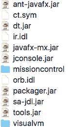
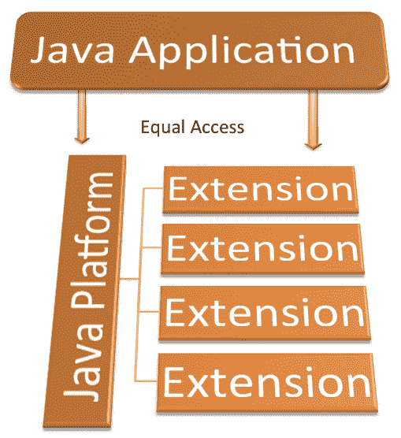
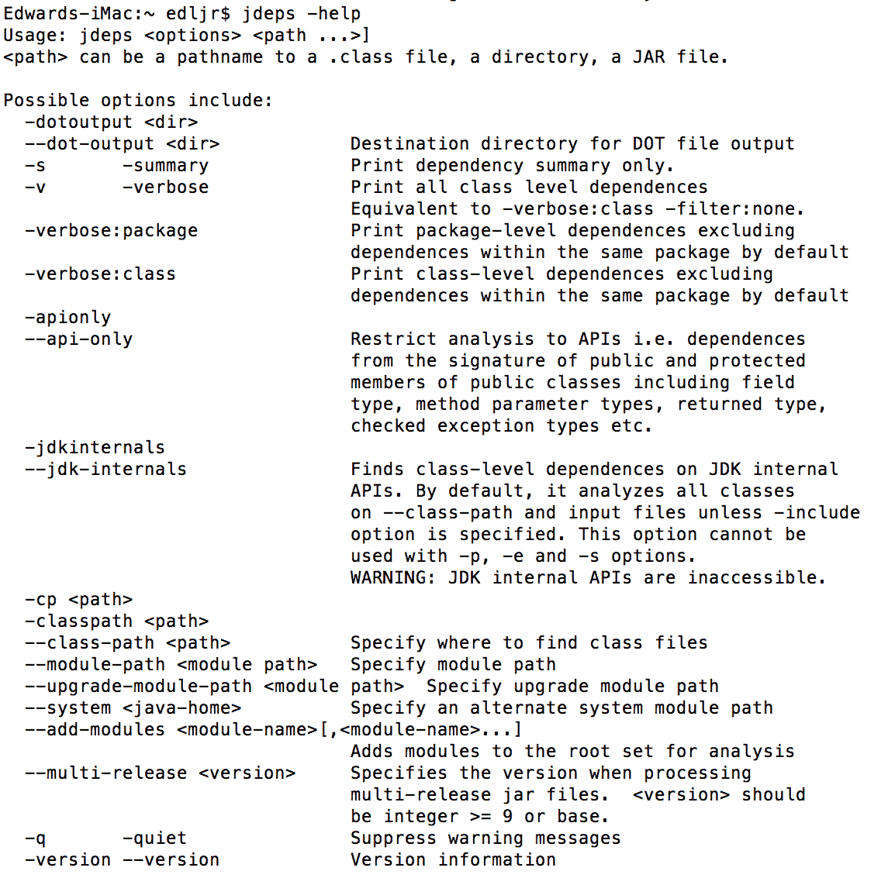

# 将应用程序迁移到 Java 11

在上一章中，我们仔细查看了项目拼图指定的 Java 模块的结构，并检查了项目拼图的实施方式如何改进 Java 平台。 我们还审核了 Java 平台的关键内部更改，并在新的模块化系统上专注于特定的专注。 我们从模块化底漆开始，在那里我们在益处和要求方面了解了 Java 的模块化系统。 接下来，我们探讨了 JDK 的模块化，包括查看源代码如何重新组织的模块。 我们还探索了 JDK 的七个主要工具类别，并了解到 Java 模块化扩展到运行时图像，从而导致更可维护性，性能更好，更高的安全性。 **链路时间**的概念被引入编译 - 时间和运行时之间的可选阶段。 我们通过查看 Java 链接器以及 Java 如何封装内部 API 的章节。

在本章中，我们将探索如何将我们现有的应用程序迁移到当前的 Java 平台。 我们将查看手动和半自动迁移过程。 本章旨在为您提供洞察力和流程，以获取使用当前 Java 平台的非模块化 Java 代码。

我们将在本章中介绍的主题是以下内容：

*   对项目拼图的快速审查
*   模块如何适合 Java 景观
*   迁移计划
*   来自 Oracle 的建议
*   部署
*   有用的工具

# 技术要求

本章和随后的章节，功能 Java 11\. Java 平台的**标准版**（ **SE** ）可以从 Oracle 的官方下载站点下载（ [http：// www .oracle.com / technetwork / java / javase / downloads / index.html](http://www.oracle.com/technetwork/java/javase/downloads/index.html) ）。

**集成开发环境**（ **IDE** ）软件包就足够了。 来自 JetBrains 的 Intellij Idea 用于与本章相关的所有编码以及随后的章节。 可以从网站下载 Intelatij Idea 的社区版本（ [https://www.jetbrains.com/idea/features/](https://www.jetbrains.com/idea/features/) ）。

本章的源代码在 URL（ [https://github.com/packtpublishing/mastering-java-11-secondition](https://github.com/PacktPublishing/Mastering-Java-11-Second-Edition) [）上提供。](https://github.com/PacktPublishing/Mastering-Java-11-Second-Edition)

# 对项目拼图的快速审查

Project jigsaw 是 Java 项目，它包含了 Java 平台的几种更改建议。 正如您在早期章节中阅读的那样，Java 9 中的 Java 平台的最重要变化涉及模块和模块化。 Project jigsaw 驱动的举办 java 模块的倡议。 模块化的需求源于与 Java 的两个主要挑战：

*   班级
*   jdk.

接下来，我们将审查这两个挑战，并了解他们如何通过当前的 Java 平台解决和克服它们。

# 班级

在 Java 9 之前，类路径存在问题，并且开发人员痛苦的来源。 这在众多开发商论坛中是明显的，幸运的是，甲骨文正在关注。 以下是类路径可能有问题的几个实例; 以下是两个主要情况：

*   第一个案例涉及在开发计算机上拥有两个或更多个版本的库。 以前由 Java 系统处理的方式不一致。 在课堂加载过程中使用了哪个库不易辨别。 这导致了不希望的缺乏特异性 - 关于加载了哪个图书馆的细节没有足够的细节。
*   第二种情况是锻炼类装载机的最先进的功能。 通常，这种类型的类装载机使用导致最严重的错误和错误。 这些并不总是易于检测，导致开发人员额外的工作。

在 Java 9 之前，类路径几乎总是非常漫长。 在最近的演示文稿中，Oracle 共享包含 110 个 JAR 文件的类路径。 这种类型的笨重的类路​​径使得难以检测冲突甚至确定是否有任何缺失，如果是的话，可能缺少什么。 作为模块化系统的重新设想 Java 平台使这些类路径发出了过去的事情。

模块通过提供可靠的配置，通过提供可靠的配置来解决 java 9 类 P 类 Partion。

# JDK 的单片性质

自 1995 年以来，Java 以令人印象深刻的方式在令人印象深刻的时尚中发展，并且每个进化步骤，JDK 增长了更大。 与 Java 8 一样，JDK 已经过分庞大。 在 Java 9 之前，有几个有问题的问题源于 JDK 的单片性质，包括以下内容：

*   因为 JDK 非常大，所以它不适合非常小的设备。 在某些开发部门中，这是为软件工程问题找到非 Java 解决方案的原因。
*   超大的 JDK 导致浪费。 在设备，网络和云上运行时，它在处理和内存方面是浪费的。 这源于整个 JDK 加载的事实，即使只需要 JDK 的小子集。
*   虽然 Java 平台在运行时具有很大的性能，但在负载和发射时间方面，启动性能留下了很大的要求。
*   大量的内部 API 也是一个痛点。 因为有很多内部 API 存在并且由开发人员使用，因此系统难以发展。
*   内部 API 的存在使得难以使 JDK 安全和可扩展。 具有如此多的内部依赖项，隔离安全性和可扩展性问题过于问题。

JDK 的单片困境的答案是模块。 Java 9 引入了模块及其自己的模块化系统。 平台的一个很好的更新之一是，只有所需的模块都被编译，而不是整个 JDK。 这本模块化系统介绍。

模块通过提供强封装来解决 Java 9 JDK 单片问题。

# 模块如何适合 Java 景观

从下图中可以看出，包由类和接口组成，并且模块由包组成。 模块是包装的容器。 这是 Java 的模块化系统非常高的基本前提。 作为模块化系统的一部分查看模块并不仅仅是作为上面的软件包的新级别的抽象级别非常重要，因为下图表明：


因此，模块是 Java 9 的新功能，并且如您所期望的那样，他们需要在使用之前声明。 模块的声明包括其具有依赖项的其他模块的名称。 它还为具有依赖关系的其他模块导出包。 模块化声明可以说是在您开始使用 Java 开发时解决的最重要的模块化问题。 这是一个例子：

```
module com.three19.irisScan {
  // modules that com.three19.irisScan depends upon
  requires com.three19.irisCore;
  requires com.three19.irisData;

  // export packages for other modules that are 
  // dependent upon com.three19.irisScan
  exports com.three19.irisScan.biometric;
}
```

在编程 Java 应用程序时，您的模块声明将放在`module-info.java`文件中。 完成此文件后，您只需运行 Javac，Java 编译器，以生成`module-info.class` Java 类文件。 您以与您当前将`.java`文件编译为`.class`文件的方式相同的方式完成此任务。

您还可以在其根目录中创建具有`module-info.class`文件的模块化 JAR 文件。 这代表了良好的灵活性。

接下来，让我们回顾关于 Java 模块的三个重要概念：

*   基础模块
*   可靠的配置
*   强封装

# 基础模块

Java 模块概念的核心是理解基本模块。 在编程 Java 应用程序或移植使用旧版本的 Java 编程的现有应用程序时，必须使用基本模块（`java.base`）。 每个模块都需要`java.base`模块，因为它定义了关键或创建的 Java 平台 API。

以下是`java.base`模块的内容：

```
module java.base {
  exports java.io;
  exports java.lang;
  exports java.lang.annotation;
  exports java.lang.invoke;
  exports java.lang.module;
  exports java.lang.ref;
  exports java.lang.reflect;
  exports java.math;
  exports java.net;
  exports java.net.spi;
  exports java.nio;
  exports java.nio.channels;
  exports java.nio.channels.spi;
  exports java.nio.charset;
  exports java.nio.charset.spi;
  exports java.nio.file;
  exports java.nio.file.attribute;
  exports java.nio.file.spi;
  exports java.security;
  exports java.security.aci;
  exports java.security.cert;
  exports java.security.interfaces;
  exports java.security.spec;
  exports java.text;
  exports java.text.spi;
  exports java.time;
  exports java.time.chrono;
  exports java.time.format;
  exports java.time.temporal;
  exports java.time.zone;
  exports java.util;
  exports java.util.concurrent;
  exports java.util.concurrent.atomic;
  exports java.util.concurrent.locks; 
  exports java.util.function;
  exports java.util.jar;
  exports java.util.regex;
  exports java.util.spi;
  exports java.util.stream;
  exports java.util.zip;
  exports java.crypto;
  exports java.crypto.interfaces;
  exports java.crytpo.spec;
  exports java.net;
  exports java.net,ssi;
  exports java.security.auth;
  exports java.security.auth.callbak;
  exports java.security.auth.login;
  exports java.security.auth.spi;
  exports java.security.auth.x500;
  exports java.security.cert;
}
```

如您所见，`java.base`模块不需要任何模块，并且它导出众多包。 拥有这些导出的列表可以很有用，因此您可以在使用 Java 平台开始创建应用程序时知道您可以使用的内容。

您会注意到，在上一节中，我们不包括所需的`java.base`：我们的`com.three19.irisScan`模块声明中的代码行。 更新的代码如下所示，现在包括所需的`java.base`代码行：

```
module com.three19.irisScan {
  // modules that com.three19.irisScan depends upon
  requires java.base; // optional inclusion
  requires com.three19.irisCore;
  requires com.three19.irisData;

  // export packages for other modules that are 
  // dependent upon com.three19.irisScan
  exports com.three19.irisScan.biometric;
}
```

如果您不包含所需的`java.base`; 模块声明中的代码行，Java 编译器将自动包含它。

# 可靠的配置

如本章前面的提示，模块提供了我们 Java 应用程序的可靠配置，该应用程序在早期版本的 Java 平台中解决了类路径问题。

Java 读取并解释模块化声明，使模块可读。 这些可读模块允许 Java 平台来确定是否缺少任何模块，是否有重复的库声明，或是否有任何其他冲突。 在 Java 中，版本 9,10 和 11，将由编译器或运行时生成和输出非常特定的错误消息。 以下是编译时错误的示例：

```
src/com.three19.irisScan/module-info.java: error: module not found:
com.three19.irisScan
requires com.three19.irisCore;
```

以下是未找到模块`com.three19.isrisCore`的运行时错误的示例，但是`com.three19.irisScan`应用程序要求：

```
Error occurred during initialization of VM java.lang.module.ResolutionException: Module com.three19.irisCore not found, required by com.three19.irisScan app
```

# 强封装

本章早些时候，您阅读了 Java 的强封装补救了单片 JDK 问题。

封装，核心 OOP 概念，保护来自外部代码的对象。 **强**封装的表征是指封装的良好编程的实现。

在 Java 中，封装由`module-info.java`文件中的信息驱动。 此文件中的信息允许 Java 知道哪些模块取决于其他模块以及它们中的每一个导出。 这会强调确保正确配置`moduleinfo-java`文件的重要性。 让我们来看看模块化之前用标准 Java 代码编写的示例：


在前面的示例中，`com.three19.irisScan`模块具有用于内部使用的`irisScanner`封装和`irisScanResult`类。 如果`com.three19.access`应用程序尝试导入和使用`irisScanResult`类，则 Java Compiler 将生成以下错误消息：

```
src/com.three19.access/com/three19/access/Main.java: error: irisScanResult is not accessible because package com.three19.irisScanner.internal is not exported private irisSanResult scan1 = new irisScanResult();
```

如果编译器不会捕获此错误，这将是非常不可能的，则会发生以下运行时错误：

```
Exception in thread "main" java.lang.IllegalAccessError: class com.three19.access.Main (in module: com.three19.access) cannot access class com.three19.irisScanner.internal.irisScanResult (in module: com.three19.irisScan), com.three19.irisScanner.internal is not exported to com.three19.access.
```

详细错误消息将使调试和排除更容易。

# 迁移计划

如果您要使用 Java 8 或更早版本构建的 Java 应用程序，您应该考虑将应用程序更新到现代 Java 平台。 由于 java 后 8 个平台与早期版本的显着差异，因此在迁移您的应用程序时需要有目的的方法。 提前计划并考虑您最有可能遇到的问题是谨慎的。 在我们查看这些问题之前，让我们在下一节中测试一个简单的 Java 应用程序。

# 测试一个简单的 Java 应用程序

以下代码包括单个 Java 类`GeneratePassword`。 此类提示用户提供所需的密码长度，然后基于用户的请求的长度生成密码。 如果用户要求短于八个长度，则将使用八个默认长度。 此代码是用 Java SE 1.7 JRE 系统库写的：

```
/*
* This is a simple password generation app
*/

import java.util.Scanner;
public class GeneratePassword {

  public static void main(String[] args) {

  // passwordLength int set up to easily change the schema
  int passwordLength = 8; //default value
  Scanner in = new Scanner(System.in);
  System.out.println("How long would you like your password (min 8)?");

  int desiredLength;
  desiredLength = in.nextInt();

  // Test user input
  if (desiredLength >8) {
    passwordLength = desiredLength;
  }

  // Generate new password
  String newPassword = createNewPassword(passwordLength);

  // Prepare and provide output
  String output = "\nYour new " + passwordLength + "-character password 
  is: ";
  System.out.println(output + newPassword);
  }

  public static String createNewPassword(int lengthOfPassword) {
    // Start with an empty String
    String newPassword = "";
    // Populate password
    for (int i = 0; i < lengthOfPassword; i++) {
      newPassword = newPassword + 
        randomizeFromSet("aAbBcCdDeEfFgGhHiIjJkKlLmMnNoOpPqQrR
        sStTuUvVwWxXyYzZ0123456789+-*/?!@#$%");
    }
    return newPassword;
  }

  public static String randomizeFromSet(String characterSet) {
  int len = characterSet.length();
  int ran = (int)(len * Math.random());
  return characterSet.substring(ran, ran + 1);
  }
}
```

在以下屏幕截图中，我们在运行 Java 8 上测试`GeneratePassword`应用程序。如您所见，我们首先查询 Java 以验证当前版本。 在此测试中，使用 Java `1.8.0_121`。 接下来，我们使用`javac`实用程序编译`GeneratePassword` Java 文件。 最后，我们运行应用程序：


您可以从前面的测试中看到，`GeneratePassword.java`与结果成功编译`GeneratePassword.class`文件。 应用程序使用`java GeneratePassword`命令运行。 提示用户输入所需的密码长度，并输入`32`。 然后，应用程序成功生成了 32 个字符的随机密码并提供了适当的输出。

此测试演示示例应用程序使用 JDK 1.8 成功地运行。 接下来，让我们使用 JDK 10 测试相同的应用程序：


正如您所看到的，我们清楚地表明，java 前 9 个应用程序有可能在 Java 10 上成功运行，而无需进行任何修改。 这是一个简单的案例研究，并具有非常基本的 Java 程序。 当然，这是最好的情况，并且无法假设。 您将希望测试应用程序以确保在当前 Java 平台上按预期运行。

在下一节中，我们将在使用新的 Java 平台测试您的 java 9 应用程序时，您可能会审核您可能遇到的一些潜在问题。

# 潜在的迁移问题

本节中的潜在迁移问题包括直接访问 JRE，访问内部 API，访问内部 JAR，JAR URL 折旧，扩展机制和 JDK 的模块化。 让我们来看看这些潜在的迁移问题中的每一个。

# jre.

创建 Java 的模块化系统是关于开发和实用工具的数量和位置的一些简化。 一个这样的例子是 JDK 的 JRE 消耗。 在所有 Pre-Java 9 版本中，Java 平台包括 JDK 和 JRE 作为两个单独的组件。 从 Java 9 开始，这些组件已组合。 这是一个重要的变化，并且开发商应该敏锐地意识到。 如果您有一个专门指向 JRE 目录的应用程序，则需要更改以避免问题。 JRE 内容如下所示：


# 访问内部 API.

当前的 Java 平台封装内部 API，以提高在 Java 中编写的平台和应用程序的安全性。 与以前版本的 Java 平台不同，您在 Java 9,10 或 11 中编程的应用程序不会默认访问 JDK 内部 API。 Oracle 已将某些内部 API 标识为关键 - 这些 API 仍然可以通过`jdk.unsupported` JDK 模块访问。

上述关键 API（JDK 内部）如下：

*   `sun.misc`
*   `sun.misc.Unsafe`
*   `sun.reflect.Reflection`
*   `sun.reflect.ReflectionFactory.newConstrutorForSerialization`

如果您有 java 9 应用程序，它可以实现任何`sun.*`或`com.sun.*`包，则可能会遇到将应用程序迁移到当前 Java 平台的问题。 要解决此问题，您应该查看您的类文件以用于使用`sun.*`和`com.sun.*`包。 或者，您可以使用 Java 依赖性分析工具`jdeps`，以帮助确定您的 Java 程序是否对 JDK 内部 API 有任何依赖项。

`jdeps`工具是 Java 依赖性分析工具; 它可用于帮助确定您的 Java 程序是否对 JDK 内部 API 有任何依赖项。

# 访问内部罐子

从版本 9 开始，Java 不允许访问`lib/ant-javax.jar`，`lib/ant-javax.jar`，`lib/dt.jar`和其他人中列出的内部 jar：



以下是要注意的关键是，如果您有依赖于驻留在`lib`文件夹中的这些工具之一的 Java 应用程序，则需要相应地修改代码。

建议您在使用 Java 10 和 11 开始以确保 IDE 更新并正式支持最新版本的 Java 后测试您的 IDE。 如果您对 Java 开发使用多个 IDE，请测试每个，以避免惊喜。

# jar URL 折旧

JAR 文件 URL 在 Java 9 之前，某些 API 使用以识别运行时图像中的特定文件。 这些 URL 包含一个`jar:file:`前缀，其中两个路径为 1 到`jar`，一个到`jar`中的特定资源文件。 以下是 Pre-Java 9 jar URL 的语法：

```
jar:file:<path-to-jar>!<path-to-file-in-jar>
```

随着 Java 的模块化系统的出现，容器将占用资源文件而不是单个罐子。 访问资源文件的新语法如下：

```
jrt:/<module-name>/<path-to-file-in-module>
```

现在，新的 URL 架构`jrt`，现在已经到达运行时映像中的资源。 这些资源包括类和模块。 新架构允许识别资源而不向运行时图像引入安全风险。 这种增加的安全性可确保运行时图像的形式和结构仍然隐藏。 以下是新架构：

```
jrt:/[$MODULE[/$PATH]]
```

有趣的是，`jrt` URL 的结构决定了其含义，表明该结构可以采用多种形式之一。 以下是不同`jrt` URL 结构的三个示例：

*   `jrt:/$MODULE/$PATH`：此结构提供对使用`$PATH`参数标识的资源文件的访问，在使用`$MODULE`参数指定的模块中
*   `jrt:/$MODULE`：此结构提供对使用`$MODULE`参数指定的模块中的所有资源文件的参考
*   `jrt:/`：此结构提供对运行时图像中的所有资源文件的参考

如果您有采用 API 返回的 URL 实例的预先存在的代码，则不应存在任何问题。 另一方面，如果您的代码依赖于`jar` URL 结构，则会遇到问题。

# 延期机制

Java 平台以前有一个扩展机制，使开发人员能够为所有应用程序提供自定义 API。 您可以从下图中看到，扩展名为 Java 平台的排序或附加组件。 默认情况下，每个扩展的 API 和类别都可自动使用：



如图所示，Java 应用程序都可以访问 Java 平台和扩展，而无需类路径。 此功能在 Java 8 中已弃用，并且在当前版本的 Java 中不再存在。

# JDK 的模块化

到目前为止，您对 Java 的模块化具有坚定了解。 Java 的旧格式和另一种面向对象的编程语言，是*一切都是一个类*。 现在，*一切都是一个模块*是一个新的格言。 有三种类型的模块，如图所示：

| **模块类型** | **描述** |
| 自动的 | 当 jar 放置在新的模块路径上时，会自动创建模块。 |
| 显式/命名 | 通过编辑`module-info.java`文件来手动定义这些模块。 |
| 未命名 | 当 jar 放置在类路径上时，会创建未命名的模块。 |

从 8 或更早版本迁移您的应用程序时，您的应用程序及其库成为未命名的模块。 因此，您需要确保所有模块都在模块路径中。

另一件事要知道的是您的运行时图像不会包含整个 JDK。 相反，它只包含您的应用程序所需的模块。 值得审查 JDK 如何在 Java 中模块化。 下表包含当前 JDK 的 API 规范：

| `jdk.accessibility` | `jdk.attach` | `jdk.charsets` | `jdk.compiler` |
| `jdk.crypto.cryptoki` | `jdk.crypto.ec` | `jdk.dynalink` | `jdk.editpad` |
| `jdk.hotspot.agent` | `jdk.httpserver` | `jdk.incubator.httpclient` | `jdk.jartool` |
| `jdk.javadoc` | `jdk.jcmd` | `jdk.jconsole` | `jdk.jdeps` |
| `jdk.jdi` | `jdk.jdwp.agent` | `jdk.jlink` | `jdk.jshell` |
| `jdk.jsobject` | `jdk.jstatd` | `jdk.localedata` | `jdk.management` |
| `jdk.management.agent` | `jdk.naming.dns` | `jdk.naming.rmi` | `jdk.net` |
| `jdk.pack` | `jdk.packager.services` | `jdk.policytool` | `jdk.rmic` |
| `jdk.scripting.nashorn` | `jdk.sctp` | `jdk.security.auth` | `jdk.security.jgss` |
| `jdk.snmp` | `jdk.xml.dom` | `jdk.zipfs` |  |

下表包含 Java SE 的 API 规范：

| `java.activation` | `java.base` | `java.compiler` | `java.corba` |
| `java.datatransfer` | `java.desktop` | `java.instrument` | `java.logging` |
| `java.management` | `java.management.rmi` | `java.naming` | `java.prefs` |
| `java.rmi` | `java.scripting` | `java.se` | `java.se.ee` |
| `java.security.jgss` | `java.security.sasl` | `java.sql` | `java.sql.rowset` |
| `java.transaction` | `java.xml` | `java.xml.bind` | `java.xml.crypto` |
| `java.xml.ws` | `java.xml.ws.annotation` |  |  |

请记住，默认情况下，所有应用程序都可以访问`java.base`，因为默认情况下它位于模块路径中。

下表包含 Java 中的 JavaFX 的 API 规范：

| `javafx.base` | `javafx.controls` | `javafx.fxml` | `javafx.graphics` |
| `javafx.media` | `javafx.swing` | `javafx.web` |  |

有两种额外的模块：

*   `java.jnlp`定义 **JNLP** 的 API（ **Java 网络发射协议**）。
*   `java.smartcardio`定义 Java 智能卡输入/输出的 API。

有关任何这些模块的详细信息，请访问 Oracle 的*Java®平台，标准版 Java 开发套件版本 10 API 规范*网址： [http://docs.oracle.com/javase/10/docs/ api / overview-summary.html](http://docs.oracle.com/javase/10/docs/api/overview-summary.html) 。

# 来自 Oracle 的建议

Oracle 在不断更新 Java 平台方面做得很好。 他们对从旧版本迁移到新 JDK 的见解是值得审查的。 在本节中，我们将查看准备步骤，破坏封装，对运行时映像的更改，诸如已删除的工具和 API 等组件，更改为垃圾收集和部署。

# 准备步骤

Oracle 提供了一个五步过程，帮助开发人员将其 Java 应用程序从 java 9 版本迁移到现代版本，9,10 或 11.这些步骤如下所示，然后在后续部分中介绍：

1.  获取 JDK 早期访问构建
2.  在重新编译之前运行您的程序
3.  更新第三方库和工具
4.  编译您的应用程序
5.  在代码上运行`jdeps`

# 获取 JDK 早期访问构建

如果您在 Java 11（18.9）之前读这本书（18.9）是正式发布的，那么您可以从此链接获取 JDK 11 早期访问版本： [http://jdk.java.net/11/](http://jdk.java.net/11/) 。

早期发布版本可用于 Windows（32 和 64），MacOS（64），Linux（32 和 64）和各种 Linux Arm，Solaris 和 Alpine Linux 版本。

花时间测试 java 9 的应用程序，并在 Java 11 正式发布之前让它们迁移，有助于确保您不验证依赖 Java 应用程序的服务的任何停机时间。

您可以从以下链接下载版本 9 和 10：

*   [http://jdk.java.net/9/](http://jdk.java.net/9/)
*   [http://jdk.java.net/10/](http://jdk.java.net/10/)

# 在重新编译之前运行您的程序

如本章前面所示，您的现有 Java 应用程序将在没有修改 Java 11 平台上运行的可能性。 因此，在进行任何更改之前，请尝试在 Java 9 平台上运行当前应用程序。 如果您的应用程序在 Java 11 上运作良好，那么您的工作并不完整。 在更新第三方库和工具，编译应用程序以及在代码上运行`jdeps`的下一个三个部分。

# 更新第三方库和工具

第三方库和工具可以帮助扩展我们的应用程序并缩短开发时间。 对于 Java 兼容性，重要的是要确保您使用的每个第三方库和工具兼容并支持最新版本的 JDK。 在 Java 11 上运行您的应用程序将不会为您提供所需的洞察级别，以确保您没有兼容性问题。 建议您查看每个库和工具的官方网站，以验证兼容 JDK 18.9 的兼容性和支持。

如果您使用的库或工具确实有一个支持 JDK 18.9 的版本，请下载并安装它。 如果您发现一个尚未支持 JDK 18.9 的人，请考虑找到替代品。

在我们的上下文中，工具包括 IDE。 NetBeans，Eclipse 和 Intellij 都拥有支持 JDK 11 的 IDE 版本。提供给这些站点的链接如下：

*   **netbeans** ： [http://bits.netbeans.org/download/trunk/teartly/latest/](http://bits.netbeans.org/download/trunk/nightly/latest/)
*   **eclipse** ： [http://www.eclipse.org/downloads/packages/release/oxygen/m2](http://www.eclipse.org/downloads/packages/release/oxygen/m2)
*   **Intellij** ： [https://www.jetbrains.com/idea/download/#section=windows](https://www.jetbrains.com/idea/download/#section=windows)

# 编译您的应用程序

您的下一步是使用 JDK 的`javac`编译应用程序。 这很重要，即使您的应用程序与最新的 JDK 工作正常。 您可能不会收到编译器错误，而是看待警告。 以下是您的应用程序可能无法使用新 JDK 编译的最常见原因，假设它们在 Java 9 之前编译精细。

首先，如本章前面所示，默认情况下，大多数 JDK 的内部 API 无法访问。 您的指示将是运行时或编译时的`IllegalAccessErrors`错误。 您需要更新代码，以便您使用的是访问 API。

第二种原因，您的 Java 9 应用程序可能无法使用 JDK 18.9 编译，如果您使用下划线字符作为单个字符标识符。 根据 Oracle，这种做法在 Java 8 中生成警告，Java 9,10 和 11 中的错误。我们来看看一个例子。 以下 Java 类实例化一个名为`_`的`Object`并将单个消息打印到控制台：

```
public class Underscore {
  public static void main(String[] args) {
    Object _ = new Object();
    System.out.println("This ran successfully.");
  }
}
```

当我们使用 Java 8 编译此程序时，我们会收到警告，即 Java SE 8 之后的版本可能不支持使用`_`作为标识符的警告：


正如您可以在以下屏幕截图中看到的那样，这只是一个警告，并且应用程序运行正常：


现在让我们尝试使用 JDK 9 编译相同的类：


如您所见，使用下划线作为单个字符标识符仍然导致警告而不是错误。 应用程序已成功运行。 当 JDK 9 仍在早期释放时运行此测试。

使用 Java 10 和 11，使用`_`作为标识符是非法的。 以下屏幕截图显示尝试编译`Underscore.java`应用程序：


如果您使用的是使用`-source`和`-target`编译器选项，则使用 JDK 9,10 或 11 编译的第三个潜在原因不编译 JDK 9,10 或 11。 让我们来看看`-source`和`-target`编译器选项 pre-java 9 和 Java 10。

# 预先 java 9 -source 和-target 选项

`-source`选项指定 Java SE 版本，并具有以下可接受的值：

| **值** | **描述** |
| 1.3 | `javac`不支持 Java SE 1.3 后引入的功能。 |
| 1.4 | `javac`接受 Java SE 1.4 中引入的语言功能的代码。 |
| 1.5 或 5. | `javac`接受 Java SE 1.5 中引入的语言功能的代码。 |
| 1.6 或 6. | `javac`将编码错误报告为错误而不是警告。 注意，Java SE 1.6 没有引入新的语言功能。 |
| 1.7 或 7. | `javac`接受 Java SE 1.7 中引入的语言功能的代码。 如果未使用`-source`选项，则这是默认值。 |

`-target`选项告诉`javac`将哪个版本的 JVM 为目标。 `-target`选项的可接受值是：`1.1`，`1.2`，`1.3`，`1.4`，`1.4`，`1.6`，`1.6`或`6`和`1.7`或`7` 。 如果未使用`-target`选项，则默认的 JVM 目标取决于`-source`选项所使用的值。 以下是`-source`值，其关联`-target`：

| `-source` **值** | **默认** `-target` |
| 未指明 | 1.7 |
| 1.2 | 1.4 |
| 1.3 | 1.4 |
| 1.4 | 1.4 |
| 1.5 或 5. | 1.7 |
| 1.6 或 6. | 1.7 |
| 1.7 | 1.7 |

# Java 10 和 11 -source 和-target 选项

在 Java 9 中，支持的值如下所示：

| **支持的值** | **备注** |
| 11 | 当释放 JDK 11 时，这可能会成为默认值。 |
| 10 | 由于 JDK 10，这是默认值，不应指定值。 |
| 9 | 将支持设置为 1.9。 |
| 8 | 将支持设置为 1.8。 |
| 7 | 设置支持 1.7。 |
| 6 | 将支持设置为 1.6，并生成警告（不是错误）以指示折旧 JDK 6。 |

# 在代码上运行 jdeps

`jdeps`类依赖性分析工具对 Java 来说并不是新的，但也许对开发人员来说，而不是随着 Java 的模块化系统的出现。 将应用程序迁移到 Java 9,10 或 11 的一个重要步骤是运行`jdeps`工具以确定您的应用程序及其库的依赖关系。 如果您的代码在任何内部 API 上具有依赖关系，则`jdeps`工具确实很好地建议替换。

以下屏幕截图显示使用`jdeps`分析器时可用的选项：



使用`jdeps -help`命令时，您还将看到模块依赖性分析选项，选择依赖性和选项的选项，以将要分析的类进行过滤。

让我们来看看一个例子。 这是一个名为`DependencyTest`的简单 Java 类：

```
import sun.misc.BASE64Encoder; 

public class DependencyTest {
  public static void main(String[] args) throws InstantiationException, 
    IllegalAccessException {
    BASE64Encoder.class.newInstance();
    System.out.println("This Java app ran successfully.");
  }
}
```

现在让我们使用`javac`使用 java 8 编译此类类：


如您所见，Java 8 成功编译了类和应用程序。 编译器确实给了我们一个`DependencyTest.java:6: warning: BASE64Encoder is internal proprietary API and may be removed in a future release`警告。 现在让我们看看当我们尝试使用 Java 9 编译此类时会发生什么：


在这种情况下，使用 Java 9，编译器给了我们两个警告而不是一个警告。 第一个警告是`import sun.misc.BASE64Encoder`; 声明和`BASE64Encoder.class.newInstance()`的第二个声明; 方法调用。 正如您所看到的，这些只是警告而不是错误，因此`DependencyTest.java`类文件已成功编译。

接下来，让我们运行应用程序：


现在我们可以清楚地看到 Java 9 不允许我们运行应用程序。 接下来，让我们使用`jdeps`分析工具进行依赖性测试。 我们将使用以下命令行语法 - `jdeps DependencyTest.class`：


如您所见，我们有三个依赖项：`java.io`，`java.lang`和`sun.misc`。 在这里，我们有建议用`rt.jar`替换我们的`sun.misc`依赖性。

对于最终测试，我们将尝试使用 Java 10 编译`DependencyTest`：


在这里，我们看到我们根本无法编译应用程序。 JDK 10 和 11 都提供相同的错误。

# 打破封装

由于部分，当前的 Java 平台比其前任版本更安全，因此，由于模块化重组导致的封装增加。 已经说，您可能需要突破模块化系统的封装。 通过 Java 9,10 和 11 允许通过这些访问控制边界进行断开。

在本章前面阅读时，大多数内部 API 都被强烈封装。 如前所述，您可能会在更新源代码时查找替换 API。 当然，这并不总是可行的。 您可以在运行时使用三种额外的方法使用`--add-opens`选项; 采用`--add-exports`选项; 和`--permit-illegal-access`命令行选项。 让我们来看看这些选项中的每一个。

# --add-opens 选项

您可以使用`--add-opens`运行时选项允许您的代码访问非公共成员。 这可以称为**深反射**。 这种深层反思的图书馆能够访问所有成员，私人和公众。 要授予此类访问代码，请使用`--add-opens`选项。 这是语法：

```
--add-opens <module>/<package>=<target-module>(,<target-module>)*
```

这允许给定模块打开指定的包。 使用时，编译器不会产生任何错误或警告。

# --add-exports 选项

您可以使用`--add-exports`打破封装，以便您可以使用默认值无法访问的内部 API。 这是语法：

```
--add-exports <source-module>/<package>=<target-module>(,<target-module>)*
```

此命令行选项在`<target-module>`中提供对`<source-module>`包中的类型的代码。

打破封装的另一种方法是 jar 文件的清单。 这是一个例子：

```
--add-exports:java.management/sun.management
```

仅在视为绝对必要时才应使用`--add-exports`命令行选项。 除了短期解决方案之外，不建议使用此选项。 通常使用它的危险是引用内部 API 的任何更新都可能导致您的代码无法正常工作。

# - - ermit-Illegal-Access 选项

用于打破封装的第三个选项是使用`--permit-illegal-access`选项。 当然，要与第三方图书馆创建者检查是否有更新版本是谨慎的。 如果这不是一个选项，则使用`--permit-illegal-access`以在类路径上获取非法访问操作。 由于此处的违法行为显着，您将在每次发生其中一个操作时接收警告。

# 运行时图像更改

目前的 Java 与 Java 8 和更早的 JDK 和 JRE 有显着不同。 这些变化中的大部分与模块化有关，并已被其他章节涵盖。 你应该考虑更多的事情。

# Java 版模式

使用 Java 9，显示 Java 平台版本的版本已更改。 以下是 Java 8 版本格式的示例：


现在让我们看看 Java 9 如何报告其版本：


与 Java 9 一起看，版本架构是`$MAJOR.$MINOR.$SECURITY.$PATCH`。 这与以前版本的 Java 不同。 如果您有解析`java -version`命令和选项返回的字符串的代码，这将仅影响您的应用程序。

最后，让我们看看 Java 10（18.3）如何报告其版本：


使用 Java 10,11 和可预见的未来，版本模式是`$YY.$MM`。 这是 Java 10 开始的更改。如果您有任何代码，请评估`java -version`命令和选项返回的内容，您可能需要更新代码。

# JDK 和 JRE 的布局

如何在 JDK 中组织文件，JRE 在新版本的 Java 中更改。 值得一时间熟悉新的文件系统布局。 以下屏幕截图显示了 JDK `/bin`文件夹的文件结构：


以下是`\lib`文件夹的布局：


# 什么已被删除？

新版本的 Java 平台的另一个更改领域是许多平台组件已被删除。 以下部分代表最重要的组件。

值得注意的是，已经去除`rt.jar`和`tools.jar`和`dt.jar`。 这些 JAR 文件包含类和其他资源文件，并且都驻留在`/lib`目录中。

已删除了认可的标准覆盖机制。 在 Java 中，如果它们检测到该机制，则均退出`javac`和`java`。 该机制用于应用程序服务器来覆盖一些 JDK 组件。 在 Java 中，您可以使用可升级模块来实现相同的结果。

如前所述本章所涵盖的，*扩展机制*也已被删除。

之前列出的 API 先前折旧并已被删除，并且无法在当前 Java 平台中访问。 删除这些 API 是 Java 平台模块化的结果：

*   `apple.applescript`
*   `com.apple.concurrent`
*   `com.sun.image.codec.jpeg`
*   `java.awt.dnd.peer`
*   `java.awt.peer`
*   `java.rmi.server.disableHttp`
*   `java.util.logging.LogManager.addPropertyChangeListener`
*   `java.util.logging.LogManager.removePropertyChangeListener`
*   `java.util.jar.Pack200.Packer.addPropertyChangeListener`
*   `java.util.jar.Pack200.Packer.removePropertyChangeListener`
*   `java.util.jar.Pack200.Unpacker.addPropertyChangeListener`
*   `java.util.jar.Pack200.Unpacker.removePropertyChangeListener`
*   `javax.management.remote.rmi.RMIIIOPServerImpl`
*   `sun.misc.BASE64Encoder`
*   `sun.misc.BASE64Decoder`
*   ``sun.rmi.transport.proxy.connectTimeout``
*   `sun.rmi.transport.proxy.eagerHttpFallback`
*   `sun.rmi.transport.proxy.logLevel`
*   `sun.rmi.transport.tcp.proxy`

已删除以下列出的工具。 在每种情况下，该工具先前被折旧或其功能通过更好的替代方案取代：

*   `hprof`
*   `java-rmi.cgi`
*   `java-rmi.exe`
*   `JavaDB`
*   `jhat`
*   `native2ascii`

java 中已删除的两个额外的东西如下：

*   AppleScript 引擎。 该发动机被认为是不可用的，并且没有替换就被丢弃了。
*   Windows 32 位客户端虚拟机。 JDK 9 确实支持 32 位服务器 JVM，但不是 32 位客户端 VM。 这种变化是专注于 64 位系统的性能增加。

# 更新了垃圾收集

垃圾收集是 Java 的伟大声称之一。 在 Java 9 中，**垃圾 - 首先**（ **G1** ）垃圾收集器现在是 32 个和 64 位服务器上的默认垃圾收集器。 在 Java 8 中，默认的垃圾收集器是并行垃圾收集器。 Oracle 报告说，有三种垃圾收集组合将禁止您的申请从 Java 9 开始。这些组合如下：

*   缝合+ CMS.
*   增量 CMS
*   Parnev + Serialold.

我们将深入了解[第 7 章](07.html)，*，利用默认 G1 垃圾收集器*，深入了解 Java 9 垃圾收集。

# 部署您的应用程序

在从 Java 8 或更早版本迁移到当前 Java 平台时，您应该了解三个问题，当您部署应用程序时，您应该在迁移到当前 Java 8 或更早版本时。 这些问题是 JRE 版本选择，序列化小程序和 JNLP 的更新。

**JNLP** is the acronym for **Java Network Launch Protocol** and is covered in a later section of this chapter.

# 选择您的 JRE 版本

在 Java 9,10 和 11 之前，开发人员可以要求在启动应用程序时启动的版本以外的 JRE 版本。 这可以通过命令行选项或具有适当的 JAR 文件清单配置来完成。 此功能已在 JDK 9 中删除，因为我们通常会部署应用程序。 以下是三个主要方法：

*   积极安装人员
*   **Java Web 启动**使用 JNLP
*   本机 OS 包装系统

# 序列化小程序

Java 不再支持将小程序部署为序列化对象的能力。 过去，将 applet 部署为序列化对象，以补偿缓慢的压缩和 JVM 性能问题。 使用当前的 Java 平台，先进的压缩技术，JVM 具有很大的性能。

如果您尝试将 applet 部署为序列化对象，则当您的 applet 启动时，将简单地忽略对象属性和参数标记。 从 Java 9 开始，您可以使用标准部署策略部署您的 applet。

# JNLP 更新

JNLP 用于使用 Web 服务器上的资源在桌面客户端上启动应用程序。 JNLP 客户端包括 Java Web Start 和 Java 插件软件，因为它们能够启动远程托管的 applet。 该协议是启动 rias 的工具。

**rias** （**很短的 Internet 应用程序**），当用 JNLP 启动时，可以访问各种 JNLP API，通过用户权限，可以访问用户的桌面。

在 Java 9 中更新了 JNLP 规范。以下各节详细介绍了四个特定的更新。

# 嵌套资源

先前支持使用 Java 或 J2SE 元素中的嵌套资源的组件扩展的能力但未记录在规范中。 现在已更新规范以反映此支持。 以前的规范如下阅读：

*No Java elements can be specified as part of the resources.*

更新的规范现在读取如下：

组件扩展中的 Java 元素将无法管理使用哪个版本的 Java，但可以使用包含嵌套资源元素，然后只有在使用与第 4.6 节中指定的 java 版本匹配的 Java 版本时，才可以使用这些资源。

此特定更改可确保扩展 JLP 文件必须具有 Java 或 J2SE 资源，并且这些资源不会指示使用的 JRE。 使用指定版本时允许嵌套资源。

# FX XML 扩展名

使用 JNLP 时，您会创建 JNLP 文件。 以下是一个例子：

```
<?xml version="1.0" encoding="UTF-8"?>
<jnlp spec="1.0+" codebase="" href="">
  <information>
    <title>Sample/title>
    <vendor>The Sample Vendor</vendor>
    <icon href="sample-icon.jpg"/>
    <offline-allowed/>
  </information>
  <resources>
    <!-- Application Resources -->
    <j2se version="1.6+"
    href="http://java.sun.com/products/autodl/j2se"/>
    <jar href="Sample-Set.jar" main="true" />
  </resources>
  <application-desc
    name="Sample Application"
    main-class="com.vendor.SampleApplication"
    width="800"
    height="500">
    <argument>Arg1</argument>
    <argument>Arg2</argument>
    <argument>Arg3</argument>
  </application-desc>
  <update check="background"/>
</jnlp>
```

对`<application-desc>`元素进行了两个变化。 首先，已添加可选的`type`属性在可以注释的应用程序类型中添加。 默认类型为`Java`，因此如果您的程序是 Java 应用程序，则不需要包含`type`属性。

或者，您可以指定`Java`作为类型，如下所示：

```
<application-desc
  name="Another Sample Application"
  type="Java" main-class="com.vendor.SampleApplication2"
  width="800"
  height="500">
  <argument>Arg1</argument>
  <argument>Arg2</argument>
  <argument>Arg3</argument>
</application-desc>
```

我们可以指示其他应用程序类型包含`JavaFX`，如下所示：

```
<application-desc
  name="A Great JavaFX Application"
  type="JavaFX" main-class="com.vendor.GreatJavaFXApplication"
  width="800"
  height="500">
  <argument>Arg1</argument>
  <argument>Arg2</argument>
  <argument>Arg3</argument>
</application-desc>
```

如果指示 JNLP 客户端不支持的应用程序类型，则应用程序启动将失败。 有关 JNLP 的更多信息，您可以咨询官方文档： [https://docs.oracle.com/javase/7/docs/technotes/guides/javaws/developersguide/faq.html](https://docs.oracle.com/javase/7/docs/technotes/guides/javaws/developersguide/faq.html) 。

对`<application-desc>`元素的第二个变化是添加`param`子元素。 这允许我们使用`value`属性提供参数名称及其值。 以下是 JNLP 文件如何使用`param`子元素和`value`属性一起查找的`<application-desc`元素。

此示例显示了三组参数：

```
<application-desc
  name="My JRuby Application"
  type="JRuby"
  main-class="com.vendor.JRubyApplication"
  width="800"
  height="500">
  <argument>Arg1</argument>
  <argument>Arg2</argument>
  <argument>Arg3</argument>
  <param name="Parameter1" value="Value1"/>
  <param name="Parameter2" value="Value2"/>
  <param name="Parameter3" value="Value3"/>
</application-desc>
```

如果应用程序`type`是 java，那么您使用的任何`param`子元素都将被忽略。

# JNLP 文件语法

JNLP 文件语法现在完全符合 XML 规范。 在 Java 9 之前，您可以使用`&`来创建复杂的比较。 标准 XML 不支持。 您仍然可以在 JNLP 文件中创建复杂的比较。 现在你将使用`&amp`; 而不是`&`。

# 数字版本比较

JNLP 规范已更改为反映如何将数字版本元素与非数字版本元素进行比较。 在此之前，通过 ASCII 值对版本进行了比较了版本元素。 使用当前的 Java 平台和此 JNLP 规范更改，元素仍然通过 ASCII 值进行词典。 当两个字符串具有不同的长度时，变化是明显的。 在新比较中，较短的串将填充带有前导零以匹配较长串的长度。

词典比较使用基于字母顺序的数学模型。

# 有用的工具

本节突出了三种工具，可以帮助促进将应用程序迁移到当前的 Java 平台。

# Java 环境 - jenv.

如果您在使用 Linux 或 MacOS 的计算机上开发，您可能会考虑使用 **JENV** ，这是一个开源 Java 环境管理工具。 这是一个命令行工具，所以不要指望 GUI。 您可以在此 URL 下载该工具： [https://github.com/gcuisinier/jenv](https://github.com/gcuisinier/jenv) 。

以下是 Linux 的安装命令：

```
$ git clone https://github.com/gcuisinier/jenv.git ~/.jenv
```

要使用 Homebrew 使用 MacOS 下载，请使用此命令：

```
$ brew install jenv
```

您还可以使用 BASH 安装在 Linux 或 MacOS 上，如下所示：

```
$ echo 'export PATH="$HOME/.jenv/bin:$PATH"' >> ~/.bash_profile
$ echo 'eval "$(jenv init -)"' >> ~/.bash_profile
```

或者，您可以使用 **ZSH** 在 Linux 或 MacOS 上安装，如下所示：

```
$ echo 'export PATH="$HOME/.jenv/bin:$PATH"' >> ~/.zshrc
$ echo 'eval "$(jenv init -)"' >> ~/.zshrc
```

在安装 **JENV** 之后，您需要在系统上配置它，如此所示。 您需要修改脚本以反映您的实际路径：

```
$ jenv add /Library/Java/JavaVirtualMachines/jdk17011.jdk/Contents/Home
```

您将想要对系统上的每个版本的 JDK 重复`jenv add`命令。 使用每个`jenv add`命令，您将收到确认特定的 JDK 版本被添加到 JENV，如下所示：

```
$ jenv add /System/Library/Java/JavaVirtualMachines/1.6.0.jdk/Contents/Home
oracle64-1.6.0.39 added

$ jenv add /Library/Java/JavaVirtualMachines/jdk17011.jdk/Contents/Home
oracle64-1.7.0.11 added
```

您可以在命令提示符下使用`$ jenv versions`查看您添加到 JENV 的 JDK 版本的内容。 这将导致输出列表。

以下是三个额外的 Jenv 命令：

*   `jenv global <version>`：这集合了全球版本
*   `jenv local <version>`：这集合了本地版本
*   `jenv shell <version>`：这为 shell 设置了实例版本

# Maven.

Maven 是一个开源工具，可用于构建和管理基于 Java 的项目。 它是 **apache maven 项目**的一部分。 如果您尚未使用 Maven 而且您做了很多 Java 开发，您可能会被以下 Maven 目标诱导：

*   使构建过程变得简单
*   提供统一的构建系统
*   提供质量项目信息
*   提供最佳实践的指导
*   允许透明迁移到新功能

您可以阅读更多关于本网站的每个 Maven 目标的细节： [https://maven.apache.org/what-is-maven.html](https://maven.apache.org/what-is-maven.html) 。 要下载 maven，请访问此站点： [https://maven.apache.org/download.cgi](https://maven.apache.org/download.cgi) 。 此处提供了 Windows，MacOS，Linux 和 Solaris 的安装说明： [https://maven.apache.org/install.html](https://maven.apache.org/install.html) 。

Maven 可以与 Eclipse（M2Eclipse）集成，Jetbrains Intellij Ideag 和 NetBeans IDE。 作为示例，M2Eclipse IDE 提供了与 Apache Maven 的丰富集成，并拥有以下功能：

*   您可以从 Eclipse 中启动 Maven Builds
*   您可以管理 Eclipse 构建路径的依赖项
*   您可以轻松解决 Maven 依赖项（您可以直接从 Eclipse 执行此操作，而不必安装本地 Maven 存储库）
*   您可以自动下载所需的依赖项（来自远程 Maven 存储库）
*   您可以使用软件向导创建新的 Maven 项目，创建`pom.xml`文件，并为您的普通 Java 项目启用 Maven 支持
*   使用可以执行 Maven 的远程存储库的快速依赖性搜索

# 获取 M2ECLIPSE IDE

要获取 M2Eclipse IDE，您必须首先安装 Eclipse。 以下是步骤：

1.  首先打开当前的 Eclipse IDE。 接下来，选择首选项| 安装/更新| 可用的软件站点，如下屏幕截图所示：


2.  下一个任务是将 M2Eclipse 存储库站点添加到可用软件站点的列表中。 要完成此操作，请单击“添加”按钮，然后输入名称和位置文本输入框中的值。 对于名称，输入某些内容，以帮助您记住此网站可用的 M2Eclipse。 对于位置，输入 URL： [http://download.eclipse.org/technology/m2e/relaess](http://download.eclipse.org/technology/m2e/releases) 。 然后，单击“确定”按钮：


3.  您现在应该看到可用软件站点列表中列出的 M2Eclipse 站点，如下屏幕截图所示。 您的最后一步是单击“确定”按钮：


4.  现在，当您开始新项目时，您将看到 Maven Project 作为选项：


# 概括

在本章中，我们探讨了将现有应用程序迁移到当前 Java 平台的潜在问题。 我们研究了手动和半自动迁移过程。 本章为您提供了洞察和流程，让您的 Java 8 代码与新 Java 平台一起使用。 具体而言，我们对项目拼图进行了快速审查，查看了模块如何适应 Java 横向，为迁移规划的提示提供了迁移规划的提示，从 Oracle 有关迁移的共享建议，以及您可以使用的共享工具，以便在您开始时帮助您。

在下一章中，我们将仔细查看 Java Shell 和 JShell API。 我们将演示 JShell API 和 JShell 工具的能力以互动评估 Java 编程语言的声明，语句和表达方式。 我们将演示此命令行工具的功能和使用。

# 问题

1.  对新模块化 Java 平台解决的类路径有问题是什么？
2.  在哪个版本的 Java 是介绍的模块化系统？
3.  模块化系统解决了什么主要问题？
4.  始终需要哪个模块？
5.  驱动器在 java 中封装的是什么？
6.  哪个模块提供对关键内部 API 的访问？
7.  可以编辑哪个文件以识别明确命名的模块？
8.  什么是 JNLP？
9.  下划线作为单个字符标识符的重要性是什么？
10.  三个命令行选项可用于打破封装？

# 进一步阅读

此处列出的参考将帮助您深入进入本章中提供的概念：

*   *maven 崩溃课程*，可在 [https://www.packtpub.com/application-development/maven-crash-course-video](https://www.packtpub.com/application-development/maven-crash-course-video) 。