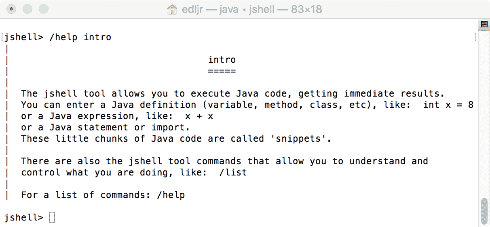
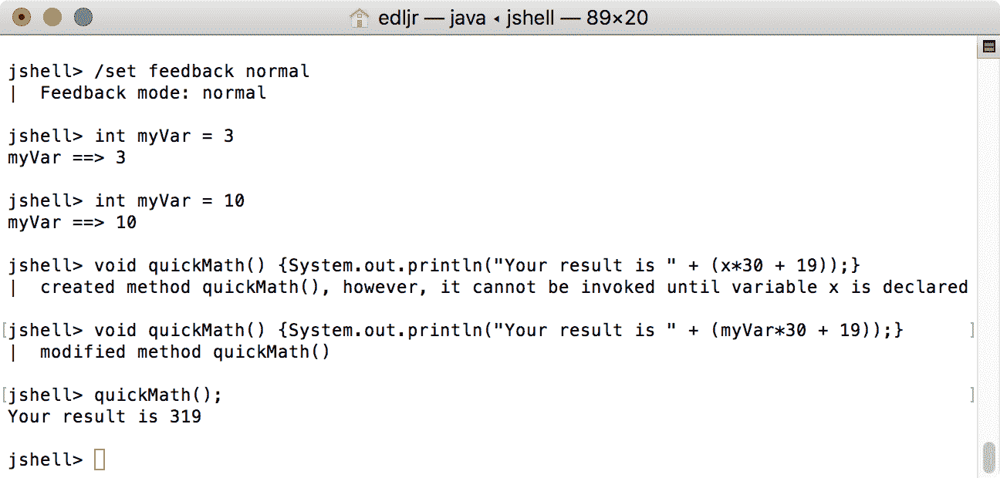
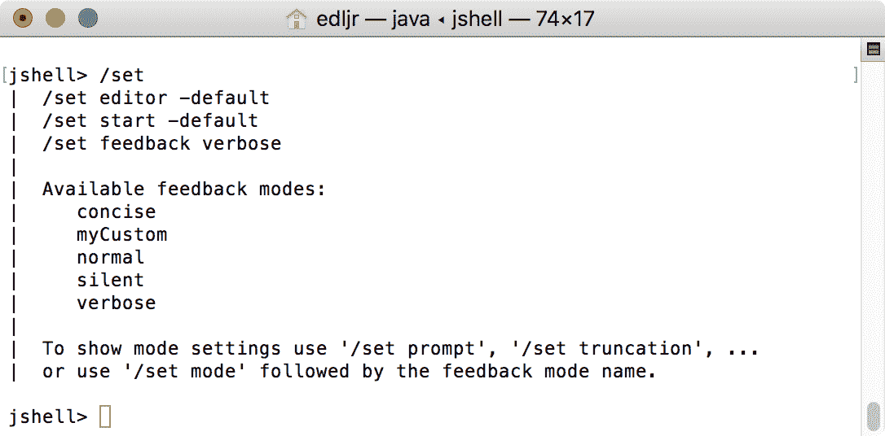

# 用 java shell 试验

在上一章中，我们探讨了如何将 java 前 9 个应用程序迁移到新的 Java 平台。 我们检查了几个问题，可能导致您当前的应用程序在 Java 9 上运行时遇到问题。我们开始审查项目拼图，然后查看模块如何适合新的 Java 平台。 我们为您提供了洞察力和流程，以获取使用 Java 9,10 或 11 的 Java 8 代码。具体来说，我们为迁移规划的提示提供了迁移规划，从 Oracle 的共享建议有关迁移，以及您可以使用的共享工具来帮助您 你开始 java 18.x.

在本章中，我们将首次查看新的命令行， **read-emp-print 循环**（也称为 **rect** ）工具在 Java 中，[HTG4 java shell （ **jshell** ）。 我们将首先介绍有关工具，Rept Concept 的一些介绍性信息，并进入可以与 JShell 一起使用的命令和命令行选项。 我们将采取从业者对我们对 JShell 的审核的方法，并包括您可以自己尝试的例子。

本章将介绍以下主题：

*   什么是 jshell？
*   Jshell 入门
*   JShell 的实际用途
*   使用脚本

# 技术要求

本章具有 Java 11\. Java 平台的**标准版**（ **SE** ）可以从 Oracle 的官方下载站点下载（ [http://www.oracle.com/ technetwork / java / javase / downloads / index.html](http://www.oracle.com/technetwork/java/javase/downloads/index.html) ）。

IDE 软件包就足够了。 来自 JetBrains 的 Intellij Idea 用于与本章相关的所有编码以及随后的章节。 可以从网站下载 Intellij Idea 的社区版本（ [https://www.jetbrains.com/idea/features/](https://www.jetbrains.com/idea/features/) ）。

本章的源代码在 URL（ [https://github.com/packtpubltpublisht/mastering-java-11-secondition](https://github.com/PacktPublishing/Mastering-Java-11-Second-Edition) ）上提供。

# 了解 jshell.

**jshell** 是 Java 平台相对较新的重要工具。 它被介绍了 JDK 9.它是一个交互式求建工具，用于评估以下 Java 编程语言组件 - 声明，语句和表达式。 它有自己的 API，以便外部应用程序使用它。

**Read-Eval-Print Loop** is often referred to as **REPL**, taking the first letter from each word in the phrase. It is also known as a language shell or interactive top level.

JShell 的引入是 **JDK 增强建议**（ **JEP** ）222。以下是 java shell 命令行工具方面的陈述目标：

*   促进快速调查
*   促进快速编码
*   提供编辑历史记录

以前列出的快速调查和编码包括陈述和表达。 令人印象深刻地，这些陈述和表达式不需要成为方法的一部分。 此外，变量和方法不需要成为类的一部分，使得该工具尤其是动态。

此外，包含以下列出的功能，使 JShell 更容易使用，并尽可能使用 JShell 使用 Jshell：

*   标签完成
*   用于终止分号的自动完成
*   进口自动完成
*   定义自动完成

# Jshell 入门

**jshell** 是位于`/bin`文件夹中的命令行工具。 此工具的语法如下：

```
jshell <options> <load files>
```

您可以在以下屏幕截图中看到，有几个选项可以与此工具一起使用：


您已经看到了`-h`选项，我们使用`jshell -h`执行。 这提供了 jshell 选项的列表。

要登录您的 JShell，您只需使用`jshell`命令。 您将看到命令窗口中的提示相应更改：


退出 shell 和输入`/exit`一样简单。 在 JShell 内部，您可以输入以下任何命令：

| **命令** | **功能** |
| `/drop` | 使用此命令删除`name`或`id`引用的源条目。这是语法：`/drop <name or id>` |
| `/edit` | 使用此命令，可以使用`name`或`id`参考编辑源条目。这是语法：`/edit <name or id>` |
| `/env` | 此功能强大的命令允许您查看或更改评估上下文。这是语法：`/env [-class-path <path>]  [-module-path <path>]  [-add-modules <modules>]` |
| `/exit` | 此命令用于退出 JShell。 语法只是`/exit`，没有任何可用的选项或参数。 |
| `/history` | 历史命令提供了您所键入的历史记录。 语法只是`/history`，没有任何可用的选项或参数。 |
| `/<id>` | 此命令用于通过引用`id`重新运行上一个代码段。这是语法：`/<id>`您也可以通过引用 *<sup>TH</sup>* 与`/-<n>`进行运行特定代码段。 |
| `/imports` | 您可以使用此命令列出导入的项目。 语法是`/imports`，它不接受任何选项或参数。 |
| `/list` | 此命令将列出您键入的源。这是语法：`/list [<name or id> &#124; -all &#124; -start]` |
| `/methods` | 此命令列出所有声明的方法以及它们的签名。这是语法：`/methods [<name or id> &#124; -all &#124; -start]` |
| `/open` | 使用此命令，您可以将文件打开作为源输入。这是语法：`/open <file>` |
| `/reload` | `reload`命令为您提供了重置和重播相关历史的能力。这是语法：`/reload [-restore] [-quiet] [-class-path <path>] [-module-path <path>]` |
| `/reset` | 此命令重置 JShell。这是语法：`/reset [-class-path <path>] [-module-path <path>] [-add-modules <modules]` |
| `/save` | 此命令将代码段源保存到您指定的文件。这是语法：`/save [-all &#124; -history &#124; -start] <file>` |
| `/set` | 此命令用于设置 JShell 配置信息。这是语法：`/set editor &#124; start &#124; feedback &#124; mode &#124; prompt &#124; truncation &#124; format` |
| `/types` | 此命令只列出已声明的类型。这是语法：`/types [<name or id> &#124; -all &#124; -start]` |
| `/vars` | 此命令列出所有已声明的变量以及它们的值。这是语法：`/vars [<name or id> &#124; -all &#124; -start]` |
| `/!` | 此命令将重新运行最后一段。 语法只是`/!` |

几个以前列出的命令使用术语 **snippet** 。 在 Java 和 Jshell 的上下文中，段是以下内容之一：

*   `ClassDeclaration`
*   `Expression`
*   `FieldDeclaration`
*   `ImportDeclaration`
*   `InterfaceDeclaration`
*   `MethodDeclaration`

在 jshell 中输入`/help`或`/?`命令提供了可以在 shell 中使用的命令和语法的完整列表。 此列表如下：


鼓励您尝试 jshell 命令。 您可以使用前面的屏幕截图提醒自己的正确语法。

如果您仍然是 JShell 的新功能，`/help`命令可能特别有用。 正如您在下面的屏幕截图中看到的，我们只需输入`/help intro`命令就可以获得 Jshell 介绍：



如果您经常发现自己使用 JShell，您可能会受益于以下一个或多个列出的快捷方式。 这些可以在 JShell 在 Jshell 使用`/help shortcuts`命令中的任何时间列出：


通过使用`/help`命令，可以在 JShell 中获取附加帮助，然后是您想要其他帮助的命令。 例如，输入`/help reload`提供有关`/reload`命令的详细信息。 此信息如下提供：


# JShell 的实际用途

无论您是新的或经验丰富的开发人员还是 java 新的新开发人员，您都必然会找到非常有用的 jshell。 在本节中，我们将研究 JShell 的一些实际用途。 具体来说，我们将涵盖以下内容：

*   反馈模式
*   列出您的资产
*   在 jshell 中编辑

# 反馈模式

命令行工具通常提供相对稀疏的反馈，以努力不受屏幕，否则，它可能会成为开发人员的滋扰。 JShell 还有几种反馈模式，除了为开发人员提供创建自己的自定义模式的能力之外。

如您所见，在以下屏幕截图中，有四种反馈模式：`concise`，`normal`，`silent`和`verbose`。 我们可以在没有任何参数的情况下输入`/set feedback`命令以列出反馈模式，并识别当前反馈模式。 第一行输出（参见下面的屏幕截图）显示将用于设置反馈模式的命令行命令和参数集：


我们可以通过在推出 Jshell 时，在第一次输入 jshell 时，我们可以决定我们要输入的模式。 以下是命令行选项：

| **command-line 命令和选项** | **反馈模式** |
| `jshell -q` | `concise` |
| `jshell -n` | `normal` |
| `jshell -s` | `silent` |
| `jshell -v` | `verbose` |

您会注意到我们使用`-q`来`concise`模式而不是`-c`。 `-c`选项具有`-c<flag>`语法，用于将`<flag>`传递给编译器。 有关这些标志的其他信息，请参阅本章的*中列出的资源*。**

查看反馈模式之间的差异的最佳方法是使用示例。 从`normal`模式开始，我们将执行命令行命令来完成以下有序反馈演示：

1.  创建一个变量。
2.  更新变量的值。
3.  创建一种方法。
4.  更新方法。
5.  运行方法。

要启动第一次测试，我们将在`jshell>`提示符下执行`/set feedback normal`命令，该提示符将 JShell 反馈模式设置为`normal`。 进入`normal`反馈模式后，我们将进入运行我们的演示的必要命令：



进入`normal`反馈模式后，我们输入`int myVar = 3`并收到`myVar ==> 3`作为反馈。 在我们的下一个命令中，我们更改了相同变量的值并收到了新值的相同输出。 我们的下一个语句`void quickMath() {System.out.println("Your result is " + (x*30 + 19));}`，使用未声明的变量，并且您将看到生成的两部分反馈 - 一个部分，指示创建该方法，另一部分通知您无法调用该方法，直到未划分的变量 被宣布为。 接下来，我们更改了包含`myVar`变量的方法，并报告了该方法的修改。 我们的最后一步是使用`quickMath();`运行该方法，结果是我们预期的。

让我们在`concise`模式下尝试相同的反馈演示：


您可以从前面的屏幕截图看，`concise`反馈模式为我们提供了更少的反馈。 我们创建并修改了变量并收到了无反馈。 当我们创建具有未释录变量的方法时，我们收到了在`normal`模式中所做的相同反馈。 我们在没有确认或其他反馈的情况下更新了该方法。

我们的下一次使用反馈演示将在`silent`模式中：


当我们输入`silent`反馈模式时，正如您在上述屏幕截图中看到的，JShell 提示符从`jshell>`更改为`->`。 当我们创建`myVar`变量时，没有提供反馈，修改`myVar`变量，或创建`quickMath()`方法。 我们有意创建了`quickMath()`方法来使用未命中变量。 因为我们在`silent`反馈模式中，我们没有被告知该方法具有未释录的变量。 基于此缺乏反馈，我们运行了该方法，未提供任何输出或反馈。 接下来，我们更新了包含`myVar`声明变量的方法，然后运行该方法。

`silent`反馈模式可能看起来毫无意义，因为没有提供反馈，但此模式存在很大的实用程序。 使用`silent`模式可能适用于流水线或仅当您想要最小化终端输出量时。 您可以包含具有隐式`System.out.println`命令的特定的，条件输出，作为一个例子。

我们的最后一次使用反馈演示在`verbose`反馈模式中。 此反馈模式，正如您假设其名称，提供最多的反馈量。 以下是我们的测试结果：


在我们的反馈演示中，当使用`verbose`反馈模式时，我们会收到更大的反馈以及用于反馈的更好格式。

# 创建自定义反馈模式

虽然无法修改内部反馈模式（`normal`，`concise`，`concise`和`verbose`），但您可以创建自己的自定义反馈模式。 此过程中的第一步是复制现有模式。 以下示例演示如何使用`/set mode myCustom verbose -command`命令字符串将`verbose`模式复制到`myCustom`模式：


我们使用`-command`选项以确保我们会收到命令反馈。 您可以使用`/set`命令以及以下屏幕截图中列出的选项之一进行各种更改反馈模式：



例如，让我们通过截断设置，该截断设置要求在每个输出线上显示有多少个字符。 使用`/set truncation`命令，如下屏幕截图所示，显示当前截断设置：


如您所见，我们的`myCustom`反馈模式具有`80`的截断。 我们将使用`/set truncation myCustom 60`命令将其更改为`60`，然后使用`/set truncation`命令进行验证：


正如您在上一屏幕截图中看到的，我们`myCustom`反馈模式的截断根据我们使用`/set truncation myCustom 60` JShell 命令，从`verbose`模式为`80`模式为`60`。

# 列出您的资产

有一些 jshell 命令可以方便地列出您创建的资产。 使用前一节中的反馈演示，我们执行了`/vars`，`/methods`和`/list`命令，以便分别提供变量，方法和所有来源列表：


我们还可以使用`/list -all`命令和选项组合来查看 jshell 导入的包。 正如您在下面的屏幕截图中看到的，JShell 导入了多个软件包，使我们在 shell 内的工作更方便，保存我们的时间在我们的方法中导入这些标准包：


如果您只想列出启动导入，可以使用`/list -start`命令和选项组合。 您可以在以下屏幕截图中看到，每个启动导入都有一个`s`前缀，数值订购：


# 在 jshell 编辑

jshell 不是一个全功能的文本编辑器，但是在 shell 中可以做几件事。 本节为您提供编辑技术，分为修改文本，基本导航，历史导航和高级编辑命令。

# 修改文本

默认文本编辑/条目模式使您键入的文本将显示在当前光标位置。 当您想删除文本时，您可以使用多种选项。 这是一个完整的列表：

| **删除动作** | **PC 键盘组合** | **MAC 键盘组合** |
| 删除当前光标位置处的字符 | *删除* | *删除* |
| 删除光标左侧的字符 | *backspace* | *删除* |
| 将文本从光标位置删除到行的结尾 | *ctrl* + *k* | *cmd* + *k* |
| 将文本从光标位置删除到当前字的末尾 | *alt* + *d* | *alt* + *d* |
| 从光标位置删除到上一个空格 | *ctrl* + *w* | *cmd* + *w* |
| 粘贴到光标位置最近删除的文本 | *ctrl* + *y* | *cmd* + *y* |
| 当使用 *ctrl* + y （或 c *md + y* 时，您将能够使用 *ALT + Y* 键盘组合通过先前删除的文本来循环 | *alt* + *y* | *alt* + *y* |

# 基本导航

虽然 JShell 内的导航控制类似于大多数命令行编辑器，但有一个基本的导航控件列表有助于：

| **键** / **键组合** | **导航动作** |
| 左箭头 | 向后移动一个角色 |
| 右箭头 | 向前移动一个角色 |
| 向上箭头 | 通过历史向上移动一行 |
| 向下箭头 | 通过历史向前移动一行 |
| 返回 | 输入（提交）当前行 |
| *ctrl* + *a* （ *cmd* + *在 macintosh 上的* | 跳到当前行的开头 |
| *ctrl* + *e* （ *cmd* + *e* 在 macintosh 上） | 跳到当前行的末端 |
| *alt* + *b* | 跳下一句话 |
| *alt* + *f* | 跳到一句话 |

# 历史导航

jshell 记得您输入的代码段和命令。 它维护了此历史，以便您可以重用您已输入的片段和命令。 要循环通过片段和命令，可以按住 *Ctrl* 键（C *MD* 在 Macintosh 上），然后使用向上和向下箭头键，直到您看到所需的片段或命令 。

# 高级编辑命令

有几种编辑选项可用，以便您可以包含搜索功能，宏创建和使用等。 JShell 的编辑器基于 Jline2，一个用于解析控制台输入和编辑的 Java 库。 您可以在此处了解有关 Jline2 的更多信息： [https://github.com/jline/jline2//wiki/jline-2.x-wiki](https://github.com/jline/jline2/wiki/JLine-2.x-Wiki.) 。

# 使用脚本

到目前为止，您已将数据直接从键盘中输入 JShell。 您现在有能力使用 JShell 脚本，这些脚本是 jshell 命令和片段的序列。 该格式与其他脚本格式相同，每行一个命令。

在本节中，我们将查看启动脚本，检查如何加载脚本，如何保存脚本，然后通过 JShell 查看高级脚本。

# 启动脚本

每次启动 JShell 时，都会加载启动脚本。 每次使用`/reset`，`/reload`和`/env`命令时也会发生这种情况。

默认情况下，JShell 使用`DEFAULT`启动脚本。 如果要使用不同的启动脚本，则仅需要使用`/set start <script>`命令。 这是一个例子：

```
/set start MyStartupScript.jsh
```

或者，您可以在命令提示符下使用 jshell `start MyStartupScript.jsh`命令启动 jshell 并加载`MyStartupScript.jsh` jshell 启动脚本。

使用`/set start <script>`命令使用`-retain`选项时，您将在下次启动 JShell 时告诉 JShell 使用新的启动脚本。

# 加载脚本

可以使用以下方法之一完成加载 JShell 中的脚本：

*   您可以使用`/open`命令以及脚本的名称作为参数。 例如，如果我们的脚本名称为`MyScript`，我们将使用`/open MyScript`。
*   加载脚本的第二个选项是在命令提示符下使用`jshell MyScript.jsh`命令。 这将启动 jshell 并加载`MyScript.jsh` jshell 脚本。

# 保存脚本

除了在外部编辑器中创建 JShell 脚本外，我们也可以在 JShell 环境中创建它们。 采用此方法时，您需要使用`/save`命令保存脚本。 您可以在以下屏幕截图中看到，`/save`命令至少需要一个文件名参数：


`/save`命令有三种选择：

*   `-all`选项可用于将所有片段的源保存到指定的文件。
*   `-history`选项保存了自 jshell 启动以来您输入的所有命令和片段的顺序历史记录。 jshell 执行此操作的能力通知您，它维护您输入的所有内容的历史记录。
*   `-start`选项将当前启动定义保存到指定的文件。

# 使用 jshell 高级脚本

jshell 的极限是什么？ 您可以使用此工具进行如此多，您几乎只能受到您的想象和编程能力的限制。

让我们来看看一个高级代码库，可以用于从 jshell 脚本编译和运行 Java 程序：

```
import java.util.concurrent.*
import java.util.concurrent.*
import java.util.stream.*
import java.util.*

void print2Console(String thetext) {
  System.out.println(thetext);
  System.out.println("");
}

void runSomeProcess(String... args) throws Exception {
  String theProcess = 
   Arrays.asList(args).stream().collect(Collectors.joining(" "));
  print2Console("You asked me to run: '"+theProcess+"'");
  print2Console("");
  ProcessBuilder compileBuilder = new ProcessBuilder(args).inheritIO();
   Process compileProc = compileBuilder.start();
   CompletableFuture<Process> compileTask = compileProc.onExit();
   compileTask.get();
}

print2Console("JShell session launched.")
print2Console("Preparing to compile Sample.java. . . ")

// run the Java Compiler to complete Sample.java
runSomeProcess("javac", "Sample.java")
print2Console("Compilation complete.")
print2Console("Preparing to run Sample.class...")

// run the Sample.class file
runSomeProcess("java", "Sample")
print2Console("Run Cycle compete.")

// exit JShell
print2Console("JShell Termination in progress...)
print2Console("Session ended.")

/exit
```

正如您可以使用此脚本所看到的，我们创建了一个`runSomeProcess()`方法，您可以用来显式编译和运行外部 Java 文件。 鼓励您自己在自己身上进行实验，以便您熟悉该过程。

# 概括

在本章中，我们检查了 JShell，Java 的 Repl 命令行工具。 我们从有关该工具的介绍信息开始，并在求文概念中仔细观察。 我们花了大量时间审查 jshell 命令和命令行选项。 我们的覆盖范围包括反馈模式，资产列表和在外壳中编辑的实用指南。 我们还获得了与脚本一起使用的经验。

在下一章中，我们将查看 Java 的默认垃圾收集器。 具体来说，我们将查看默认的垃圾收集，折旧的垃圾收集组合，并检查垃圾收集日志记录。

# 问题

1.  什么是求求？
2.  什么是 jshell？
3.  你能说出 jshell 最近的四个功能，使其使用更多的时间效率？
4.  Jshell 在哪里位于计算机的文件系统中？
5.  你如何退出 jshell？
6.  jshell 命令您将用什么来列出所有声明的变量及其相应的值？
7.  如何获取可以与 JShell 一起使用的命令和语法的完整列表？
8.  如何在特定 JShell 命令中获取详细的帮助？
9.  什么是反馈模式？
10.  什么是默认反馈模式？

# 进一步阅读

以下书是一个有关 JShell 更多信息的好来源：

*   *java 9 与 jshell，*在 [https://www.packtpub.com/application-development/java-9-jshell](https://www.packtpub.com/application-development/java-9-jshell) 。