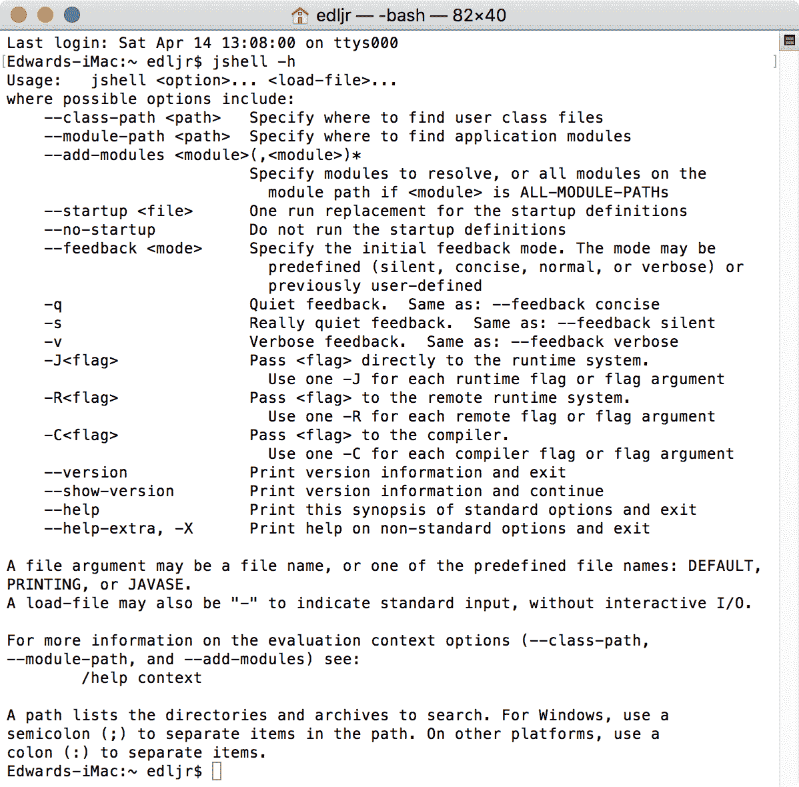
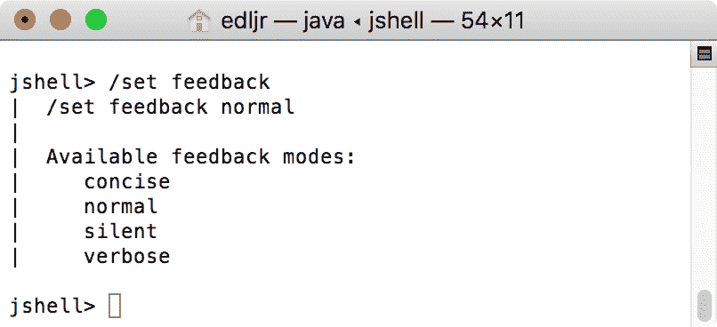
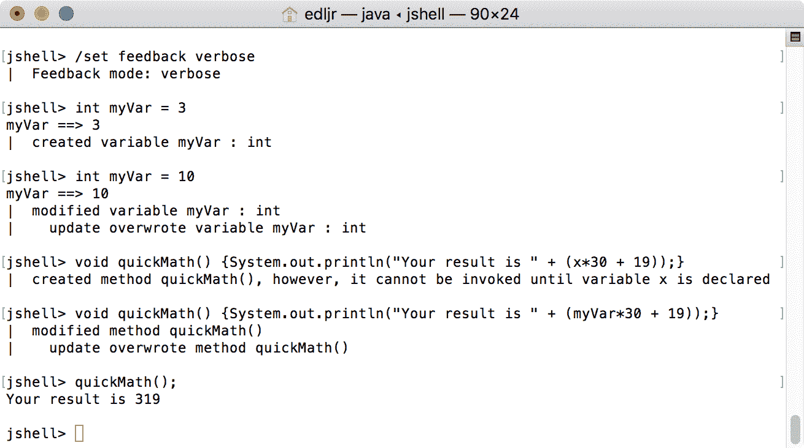
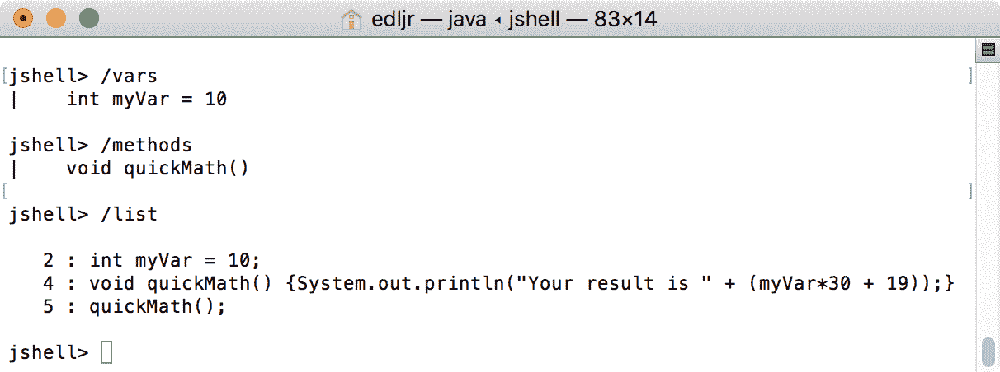
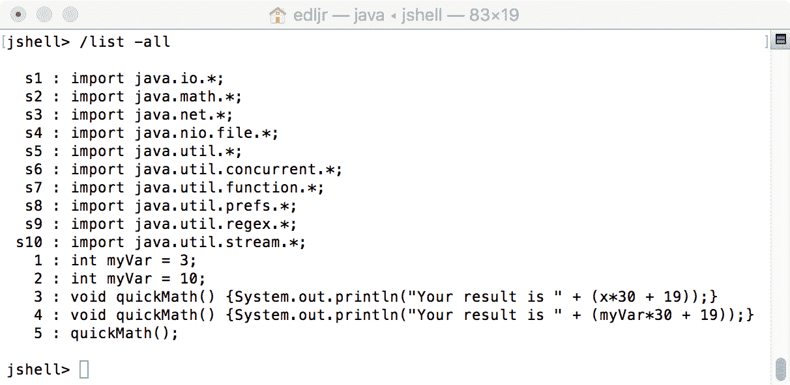
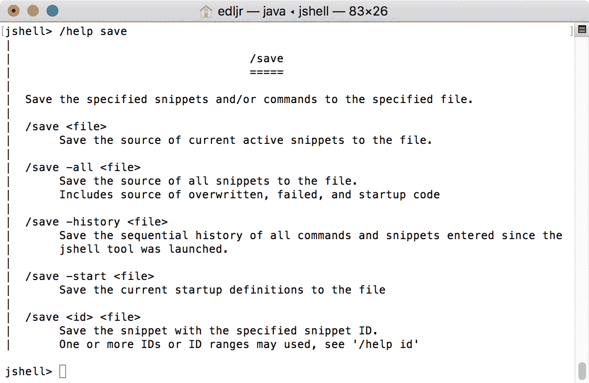

# 试用 Java Shell

在上一章中，我们探讨了如何将 Java9 之前的应用程序迁移到新的 Java 平台。我们研究了在 Java9 上运行时可能导致当前应用程序出现问题的几个问题。我们首先回顾了 Jigsaw 项目，然后研究了模块如何适应新的 Java 平台。我们为您提供了一些见解和过程，使您的 Java8 代码能够与 Java9、10 或 11 一起工作。具体来说，我们提供了迁移规划的技巧、Oracle 关于迁移的共享建议，以及可以用来帮助您开始使用 Java18.x 的共享工具。

在本章中，我们将首先介绍新的命令行，**Read Eval Print Loop**（也称为**REPL**工具，以及**Java Shell**（**JShell**）。我们将首先回顾一些关于这个工具的介绍性信息，REPL 概念，然后讨论可以与 JShell 一起使用的命令和命令行选项。我们将采用实践者的方法来回顾 JShell，并包括您可以自己尝试的示例。

本章将讨论以下主题：

*   什么是地狱？
*   JShell 入门
*   JShell 的实际应用
*   使用脚本

# 技术要求

本章以 Java 11 为特色，Java 平台的**标准版**（**SE**）可从 Oracle 官方下载网站（[下载 http://www.oracle.com/technetwork/java/javase/downloads/index.html](http://www.oracle.com/technetwork/java/javase/downloads/index.html)）。

IDE 软件包就足够了。来自 JetBrains 的 IntelliJ IDEA 用于与本章和后续章节相关的所有编码。IntelliJ IDEA 的社区版可从网站（[下载 https://www.jetbrains.com/idea/features/](https://www.jetbrains.com/idea/features/)）。

本章的源代码可以在 GitHub 的 URL（[上找到 https://github.com/PacktPublishing/Mastering-Java-11-Second-Edition](https://github.com/PacktPublishing/Mastering-Java-11-Second-Edition)）。

# 了解 JShell

**JShell**是 Java 平台上比较新的一个重要工具。它是在 jdk9 中引入的。它是一个交互式 REPL 工具，用于评估以下 Java 编程语言组件声明、语句和表达式。它有自己的 API，因此可以被外部应用程序使用。

**Read-Eval-Print Loop** is often referred to as **REPL**, taking the first letter from each word in the phrase. It is also known as a language shell or interactive top level.

JShell 的引入是**JDK 增强建议**（**JEP**）222 的结果。以下是本 JEP 关于 Java Shell 命令行工具的既定目标：

*   促进快速调查
*   便于快速编码
*   提供编辑历史记录

前面列出的快速调查和编码包括语句和表达式。令人印象深刻的是，这些语句和表达式不需要是方法的一部分。此外，变量和方法不需要是类的一部分，这使得这个工具特别动态。

此外，还包括以下列出的功能，以使 JShell 更易于使用，并使您使用 JShell 的时间尽可能节省时间：

*   制表符完成
*   语句结尾分号的自动完成
*   导入的自动完成
*   定义的自动完成

# JShell 入门

**JShell**是位于`/bin`文件夹中的命令行工具。此工具的语法如下：

```
jshell <options> <load files>
```

正如您在下面的屏幕截图中看到的，有几个选项可用于此工具：



您已经看到了我们使用`jshell -h`执行的`-h`选项。这提供了 JShell 选项的列表。

要登录 JShell，只需使用`jshell`命令即可。您将看到命令窗口中的提示会相应更改：


退出 shell 就像进入`/exit`一样简单。进入 JShell 后，可以输入以下任何命令：

| **命令** | **功能** |
| `/drop` | 使用此命令删除被`name`或`id`引用的源条目。语法如下：`/drop <name or id>` |
| `/edit` | 使用此命令，您可以使用`name`或`id`引用编辑源条目语法如下：`/edit <name or id>` |
| `/env` | 这个强大的命令允许您查看或更改评估上下文语法如下：`/env [-class-path <path>]  [-module-path <path>]  [-add-modules <modules>]` |
| `/exit` | 此命令用于退出 JShell。语法是简单的`/exit`，没有任何可用的选项或参数。 |
| `/history` | history 命令提供您所键入内容的历史记录。语法是简单的`/history`，没有任何可用的选项或参数。 |
| `/<id>` | 此命令用于通过引用`id`重新运行以前的代码段。语法如下：`/<id>`您也可以使用`/-<n>`引用*n<sup>th</sup>*前面的代码段来运行特定的代码段。 |
| `/imports` | 可以使用此命令列出导入的项目。语法为`/imports`，不接受任何选项或参数。 |
| `/list` | 此命令将列出您键入的源代码。语法如下：`/list [<name or id> &#124; -all &#124; -start]` |
| `/methods` | 此命令列出所有声明的方法及其签名。语法如下：`/methods [<name or id> &#124; -all &#124; -start]` |
| `/open` | 使用此命令，可以打开一个文件作为源输入。语法如下：`/open <file>` |
| `/reload` | `reload`命令提供重置和重放相关历史的功能。语法如下：`/reload [-restore] [-quiet] [-class-path <path>] [-module-path <path>]` |
| `/reset` | 此命令重置 JShell。语法如下：`/reset [-class-path <path>] [-module-path <path>] [-add-modules <modules]` |
| `/save` | 此命令将代码段源保存到您指定的文件中。语法如下：`/save [-all &#124; -history &#124; -start] <file>` |
| `/set` | 此命令用于设置 JShell 配置信息。语法如下：`/set editor &#124; start &#124; feedback &#124; mode &#124; prompt &#124; truncation &#124; format` |
| `/types` | 这个命令只列出声明的类型。语法如下：`/types [<name or id> &#124; -all &#124; -start]` |
| `/vars` | 此命令列出所有声明的变量及其值。语法如下：`/vars [<name or id> &#124; -all &#124; -start]` |
| `/!` | 此命令将重新运行最后一个代码段。语法很简单`/!` |

前面列出的几个命令使用术语**片段**。在 Java 和 JShell 的上下文中，代码段如下所示：

*   `ClassDeclaration`
*   `Expression`
*   `FieldDeclaration`
*   `ImportDeclaration`
*   `InterfaceDeclaration`
*   `MethodDeclaration`

在 JShell 中输入`/help`或`/?`命令提供了一个完整的命令列表和可以在 shell 中使用的语法。该清单如下：


我们鼓励您尝试使用 JShell 命令。您可以使用前面的屏幕截图来提醒自己正确的语法。

如果您还不熟悉 JShell，`/help`命令会特别有用。在下面的屏幕截图中可以看到，我们只需输入`/help intro`命令，就可以获得 JShell 的简介：


如果您发现自己经常使用 JShell，那么您可能会受益于下面列出的一个或多个快捷方式。可以随时从 JShell 中使用`/help shortcuts`命令列出这些内容：


在 JShell 中，可以使用`/help`命令，然后使用需要额外帮助的命令来获得额外的帮助。例如，输入`/help reload`提供有关`/reload`命令的详细信息。该信息提供如下：


# JShell 的实际应用

无论您是一个新的或经验丰富的开发人员，还是刚刚接触 Java，您一定会发现 JShell 非常有用。在本节中，我们将介绍 JShell 的一些实际用途。具体来说，我们将介绍以下内容：

*   反馈模式
*   列出你的资产
*   在 JShell 中编辑

# 反馈模式

命令行工具通常提供相对稀疏的反馈，以避免屏幕过于拥挤，否则，可能会对开发人员造成麻烦。除了让开发人员能够创建自己的自定义模式之外，JShell 还有几种反馈模式。

如您所见，在下面的截图中，有四种反馈模式：`concise`、`normal`、`silent`、`verbose`。我们可以输入不带任何参数的`/set feedback`命令来列出反馈模式以及识别当前的反馈模式。输出的第一行（请参见下面的屏幕截图）显示用于设置反馈模式的命令行命令和参数集：



我们可以通过在启动 JShell 时包含一个选项来决定第一次进入 JShell 时要进入的模式。以下是命令行选项：

| **命令行命令和选项** | **反馈方式** |
| `jshell -q` | `concise` |
| `jshell -n` | `normal` |
| `jshell -s` | `silent` |
| `jshell -v` | `verbose` |

您会注意到我们使用`-q`来表示`concise`模式，而不是`-c`。`-c`选项具有`-c<flag>`语法，用于将`<flag>`传递给编译器。有关这些标志的更多信息，请参阅本章*进一步阅读*部分中列出的参考资料。

回顾反馈模式之间的差异最好的方法是使用示例。从`normal`模式开始，我们将执行命令行命令来完成以下有序反馈演示：

1.  创建一个变量。
2.  更新变量的值。
3.  创建一个方法。
4.  更新方法。
5.  运行方法。

为了开始我们的第一个测试，我们将在`jshell>`提示符处执行`/set feedback normal`命令，这将 JShell 反馈模式设置为`normal`。进入`normal`反馈模式后，我们将输入必要的命令来运行演示：


进入`normal`反馈模式后，我们进入`int myVar = 3`，收到`myVar ==> 3`作为反馈。在下一个命令中，我们更改了相同变量的值，并用新值接收相同的输出。我们的下一个语句`void quickMath() {System.out.println("Your result is " + (x*30 + 19));}`使用了一个未声明的变量，您将看到由两部分组成的反馈，一部分指示方法已创建，另一部分通知您在声明未声明的变量之前无法调用该方法。接下来，我们改变了我们的方法以包含`myVar`变量，并且反馈报告该方法被修改。我们的最后一步是使用`quickMath();`运行该方法，结果与我们预期的一样

让我们在`concise`模式下尝试同样的反馈演示：


从前面的截图中可以看到，`concise`反馈模式为我们提供的反馈更少。我们创建和修改了变量，没有收到反馈，当我们用未声明的变量创建方法时，我们收到的反馈与我们在`normal`模式下的反馈相同。我们在没有确认或其他反馈的情况下更新了方法。

我们下次使用反馈演示将在`silent`模式下进行：


当我们进入`silent`反馈模式时，正如您在前面的屏幕截图中看到的，JShell 提示从`jshell>`变为`->`。当我们创建`myVar`变量、修改`myVar`变量或创建`quickMath()`方法时，没有提供反馈。我们故意创建`quickMath()`方法来使用未声明的变量。因为我们处于`silent`反馈模式，所以我们没有被告知该方法有未声明的变量。基于这种缺乏反馈的情况，我们运行了这个方法，没有得到任何输出或反馈。接下来，我们更新了该方法以包含`myVar`声明的变量，然后运行该方法。

`silent`反馈模式似乎没有任何反馈，但这种模式有很大的实用价值。使用`silent`模式可能适合管道输送，或者仅当您想最小化终端输出量时。例如，您可以使用隐式`System.out.println`命令包含特定的条件输出。

我们最后一次使用反馈演示是在`verbose`反馈模式下。这个反馈模式，正如你从它的名字所假设的，提供了最多的反馈。以下是我们的测试结果：



在我们的反馈演示中，当使用`verbose`反馈模式时，我们会收到更多的反馈以及更好的反馈格式。

# 创建自定义反馈模式

内部反馈模式（`normal`、`concise`、`silent`、`verbose`不可修改，可自行创建自定义反馈模式。此过程的第一步是复制现有模式。下面的示例演示如何使用`/set mode myCustom verbose -command`命令字符串将`verbose`模式复制到`myCustom`模式：


我们使用了`-command`选项来确保接收到命令反馈。您可以使用`/set`命令和以下屏幕截图中列出的选项之一对反馈模式进行各种更改：


作为一个例子，让我们浏览一下 truncation 设置，该设置要求在每个输出行上显示多少个字符。使用`/set truncation`命令，如下面的屏幕截图所示，显示当前的截断设置：


如您所见，我们的`myCustom`反馈模式截断了`80`。我们用`/set truncation myCustom 60`命令将其改为`60`，然后用`/set truncation`命令进行验证：


正如您在上一个屏幕截图中看到的，基于我们使用的`/set truncation myCustom 60`JShell 命令，我们的`myCustom`反馈模式的截断成功地从`verbose`模式继承的`80`更改为`60`。

# 列出你的资产

有几个 JShell 命令可以方便地列出您创建的资产。使用上一节的反馈演示，我们执行了`/vars`、`/methods`和`/list`命令，分别提供变量、方法和所有源的列表：



我们还可以使用`/list -all`命令和选项组合来查看 JShell 导入了哪些包。正如您在下面的屏幕截图中看到的，JShell 导入了几个包，使我们在 shell 中的工作更加方便，从而节省了我们在方法中导入这些标准包的时间：



如果您只想列出启动导入，可以使用`/list -start`命令和选项组合。正如您在下面的屏幕截图中看到的，每个启动导入都有一个`s`前缀，并按数字顺序排列：


# 在 JShell 中编辑

JShell 不是一个全功能的文本编辑器，但是您可以在 shell 中做一些事情。本节为您提供编辑技术，分为修改文本、基本导航、历史导航和高级编辑命令。

# 修改文本

默认的文本编辑/输入模式使您键入的文本显示在当前光标位置。当您想删除文本时，有几个选项可供选择。以下是完整的列表：

| **删除动作** | **PC 键盘组合** | **Mac 键盘组合** |
| 删除当前光标位置的字符 | *删除* | *删除* |
| 删除光标左侧的字符 | *退格* | *删除* |
| 删除从光标位置到行尾的文本 | *Ctrl*+*K* | *命令*+*K* |
| 删除从光标位置到当前单词末尾的文本 | *Alt*+*D* | *alt*+*D* |
| 从光标位置删除到上一个空白处 | *Ctrl*+*W* | *命令*+*W* |
| 在光标位置粘贴最近删除的文本 | *Ctrl*+*Y* | *命令*+*Y* |
| 当使用*Ctrl*+*Y*（或 Macintosh 上的 c*md+Y*时，您将能够使用*Alt+Y*键盘组合循环浏览先前删除的文本 | *Alt*+*Y* | *alt*+*Y* |

# 基本导航

虽然 JShell 中的导航控件与大多数命令行编辑器类似，但有一个基本导航控件列表是很有帮助的：

| **键**/**键组合** | **导航动作** |
| 向左箭头 | 向后移动一个字符 |
| 向右箭头 | 向前移动一个字符 |
| 向上箭头 | 在历史中向上移动一行 |
| 向下箭头 | 沿着历史向前移动一行 |
| 返回 | 输入（提交）当前行 |
| *Ctrl*+*A*（*cmd*+*A*在 Macintosh 上） | 跳到当前行的开头 |
| *Ctrl*+*E*（*cmd*+*E*在 Macintosh 上） | 跳到当前行的末尾 |
| *Alt*+*B* | 退一步说 |
| *Alt*+*F* | 向前跳一个字 |

# 历史导航

JShell 会记住您输入的代码段和命令。它维护此历史记录，以便您可以重用已输入的代码段和命令。要循环浏览代码段和命令，可以按住*Ctrl*键（Macintosh 上的 c*md*，然后使用上下箭头键，直到看到所需的代码段或命令。

# 高级编辑命令

还有几个编辑选项可用，以便您可以包括搜索功能、宏创建和使用等。JShell 的编辑器基于 JLine2，这是一个用于解析控制台输入和编辑的 Java 库。您可以在这里了解更多关于 JLine2 的信息：[https://github.com/jline/jline2/wiki/jline-2.x-wiki](https://github.com/jline/jline2/wiki/JLine-2.x-Wiki.)。

# 使用脚本

到目前为止，您已经从键盘将数据直接输入 JShell。现在您可以使用 JShell 脚本了，它是一系列 JShell 命令和代码段。该格式与其他脚本格式相同，每行一条命令。

在本节中，我们将介绍启动脚本，研究如何加载脚本，如何保存脚本，最后介绍使用 JShell 编写高级脚本。

# 启动脚本

每次启动 JShell 时，都会加载启动脚本。每次使用`/reset`、`/reload`和`/env`命令时也会发生这种情况。

默认情况下，`DEFAULT`启动脚本由 JShell 使用。如果你想使用不同的启动脚本，你只需要使用`/set start <script>`命令。举个例子：

```
/set start MyStartupScript.jsh
```

或者，您可以在命令提示符处使用 JShell`start MyStartupScript.jsh`命令来启动 JShell 并加载`MyStartupScript.jsh`JShell 启动脚本。

当您使用带有`-retain`选项的`/set start <script>`命令时，您告诉 JShell 在下次启动 JShell 时使用新的启动脚本。

# 正在加载脚本

在 JShell 中加载脚本可以通过以下方法之一完成：

*   您可以使用`/open`命令和脚本名称作为参数。例如，如果我们的脚本名是`MyScript`，我们将使用`/open MyScript`。
*   加载脚本的第二个选项是在命令提示符处使用`jshell MyScript.jsh`命令。这将启动 JShell 并加载`MyScript.jsh`JShell 脚本。

# 保存脚本

除了在外部编辑器中创建 JShell 脚本之外，我们还可以在 JShell 环境中创建它们。采用这种方法时，您需要使用`/save`命令保存脚本。在下面的屏幕截图中可以看到，`/save`命令至少需要一个文件名参数：



使用`/save`命令有三个可用选项：

*   `-all`选项可用于将所有代码段的源代码保存到指定的文件中。
*   `-history`选项保存自 JShell 启动以来输入的所有命令和代码段的连续历史记录。JShell 执行此操作的能力告诉您，它维护您输入的所有内容的历史记录。
*   `-start`选项将当前启动定义保存到指定的文件中。

# 使用 JShell 编写高级脚本

JShell 的极限是什么？有这么多你可以做这个工具，你几乎只限于你的想象力和编程能力。

让我们看看一个高级代码库，它可以用来从 JShell 脚本编译和运行 Java 程序：

```
import java.util.concurrent.*
import java.util.concurrent.*
import java.util.stream.*
import java.util.*

void print2Console(String thetext) {
  System.out.println(thetext);
  System.out.println("");
}

void runSomeProcess(String... args) throws Exception {
  String theProcess = 
   Arrays.asList(args).stream().collect(Collectors.joining(" "));
  print2Console("You asked me to run: '"+theProcess+"'");
  print2Console("");
  ProcessBuilder compileBuilder = new ProcessBuilder(args).inheritIO();
   Process compileProc = compileBuilder.start();
   CompletableFuture<Process> compileTask = compileProc.onExit();
   compileTask.get();
}

print2Console("JShell session launched.")
print2Console("Preparing to compile Sample.java. . . ")

// run the Java Compiler to complete Sample.java
runSomeProcess("javac", "Sample.java")
print2Console("Compilation complete.")
print2Console("Preparing to run Sample.class...")

// run the Sample.class file
runSomeProcess("java", "Sample")
print2Console("Run Cycle compete.")

// exit JShell
print2Console("JShell Termination in progress...)
print2Console("Session ended.")

/exit
```

正如您在这个脚本中看到的，我们创建了一个`runSomeProcess()`方法，您可以使用它显式编译和运行外部 Java 文件。我们鼓励你自己尝试一下，这样你就可以熟悉这个过程了。

# 摘要

在本章中，我们研究了 Java 的 REPL 命令行工具 JShell，我们从有关该工具的介绍性信息开始，并仔细地研究了 REL 概念。我们花了相当长的时间来查看 JShell 命令和命令行选项。我们的报道包括反馈模式、资产清单和 shell 中编辑的实用指南。我们还获得了脚本工作经验

在下一章中，我们将介绍 Java 的默认垃圾收集器。具体来说，我们将查看默认的垃圾收集、已折旧的垃圾收集组合，并检查垃圾收集日志记录。

# 问题

1.  什么是 REPL？
2.  什么是地狱？
3.  您能说出 JShell 的四个最新特性，这些特性使其使用更加高效？
4.  JShell 在您的计算机文件系统中的位置是什么？
5.  你怎么离开地狱？
6.  您将使用哪个 JShell 命令列出所有声明的变量及其对应的值？
7.  如何获得可以与 JShell 一起使用的命令和语法的完整列表？
8.  如何获得有关特定 JShell 命令的详细帮助？
9.  什么是反馈模式？
10.  什么是默认的反馈模式？

# 进一步阅读

下面这本书是了解 JShell 的好资料：

*   *Java 9 和 JShell，*在[上提供 https://www.packtpub.com/application-development/java-9-jshell](https://www.packtpub.com/application-development/java-9-jshell)。