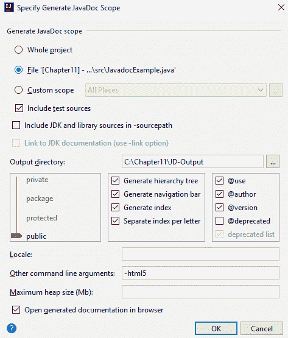
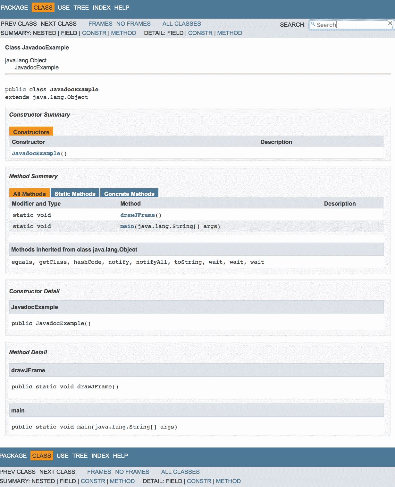
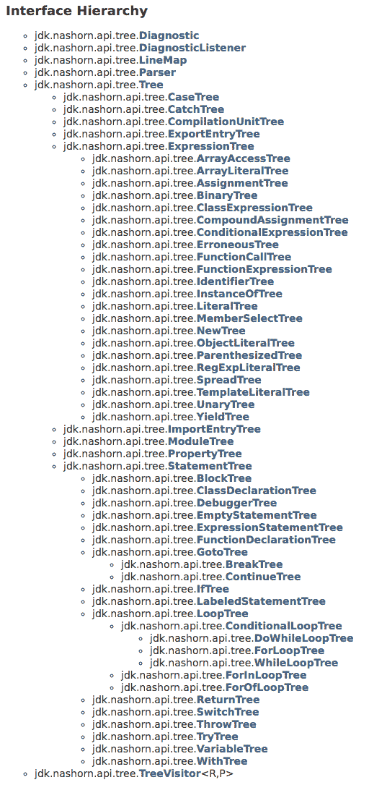
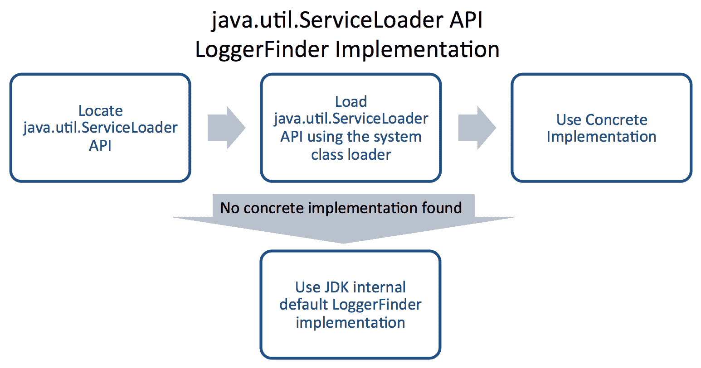

# 新工具和工具增强功能

在上一章中，我们学习了如何使用`StackWalker`API，并检查了示例代码片段以加强我们的理解。我们对 API 的详细审查包括不同的使用场景、选项和信息。我们探讨了 API 的复杂性和类用法的共享细节。在本章的结尾，我们介绍了与`StackWalker`API 相关的性能问题。

在本章中，我们将介绍十几种与现代 Java 平台相关的工具和工具增强。这些特色的变化将涵盖广泛的工具和 API 的更新，这些工具和 API 旨在简化 Java 开发，增强创建优化 Java 应用的能力。

更具体地说，我们将审查以下主题：

*   HTTP 客户端
*   Javadoc 和 Doclet API
*   mJRE 变更
*   JavaScript 解析器
*   多个发布 JAR 文件
*   Java 级 JVM 编译器接口
*   TIFF 支持
*   平台日志记录
*   XML 目录
*   收藏
*   特定于平台的桌面功能
*   增强的方法处理
*   强化折旧
*   本机头生成工具（`javah`）

# 技术要求

本章介绍 Java11，Java 平台的**标准版**（**SE**）可从 [Oracle 官方下载网站](http://www.oracle.com/technetwork/java/javase/downloads/index.html)下载。

IDE 软件包就足够了。来自 JetBrains 的 IntelliJ IDEA 用于与本章和后续章节相关的所有编码。IntelliJ IDEA 的社区版可从[网站](https://www.jetbrains.com/idea/features/)下载。

本章的源代码可以在 [GitHub 的 URL](https://github.com/PacktPublishing/Mastering-Java-11-Second-Edition) 上找到。

# 使用 HTTP 客户端

在本节中，我们将回顾 Java 的**超文本传输协议**（**HTTP**）客户端，从旧的 Java9 之前的客户端开始，然后深入到作为当前 Java 平台一部分的新 HTTP 客户端。最后，我们将看看当前 HTTP 客户端的局限性。需要这种方法来支持对变化的理解。

# 前 Java9HTTP 客户端

JDK1.1 版引入了支持 HTTP 特定特性的`HttpURLConnection`API。这是一个健壮的类，包含以下字段：

| 

*   `chunkLength`
*   `fixedContentLength`

*   `HTTP_ACCEPTED`
*   `HTTP_BAD_GATEWAY`
*   `HTTP_BAD_METHOD`
*   `HTTP_BAD_REQUEST`
*   `HTTP_CLIENT_TIMEOUT`
*   `HTTP_CONFLICT`
*   `HTTP_CREATED`
*   `HTTP_ENTITY_TOO_LARGE`
*   `HTTP_FORBIDDEN`
*   `HTTP_GONE`
*   `HTTP_INTERNAL_ERROR`

 | 

*   `HTTP_LENGTH_REQUIRED`
*   `HTTP_MOVED_PERM`

*   `HTTP_MULT_CHOICE`
*   `HTTP_NO_CONTENT`
*   `HTTP_NOT_ACCEPTABLE`
*   `HTTP_NOT_AUTHORITATIVE`
*   `HTTP_NOT_FOUND`
*   `HTTP_NOT_IMPLEMENTED`
*   `HTTP_NOT_MODIFIED`
*   `HTTP_OK`
*   `HTTP_PARTIAL`
*   `HTTP_PAYMENT_REQUIRED`
*   `HTTP_PRECON_FAILED`

 | 

*   `HTTP_PROXY_AUTH`
*   `HTTP_REQ_TOO_LONG`

*   `HTTP_SEE_OTHER`
*   `HTTP_SERVER_ERROR`
*   `HTTP_UNAUTHORIZED`
*   `HTTP_UNAVAIABLE`
*   `HTTP_UNSUPPORTED_TYPE`
*   `HTTP_USE_PROXY`
*   `HTTP_VERSION`
*   `instanceFollowRedirects`
*   `method`
*   `responseCode`
*   `responseMessage`

 |

从前面的字段列表中可以看到，已经有了对 HTTP 的强大支持。除了构造器之外，还有大量可用的方法，包括以下方法：

*   `disconnect()`
*   `getErrorStream()`
*   `getFollowRedirects()`
*   `getHeaderField(int n)`
*   `getHeaderFieldDate(String name, long Default)`
*   `getHeaderFieldKey(int n)`
*   `getInstanceFollowRedirects()`
*   `getPermission()`
*   `getRequestMethod()`
*   `getResponseCode()`
*   `getResponseMessage()`
*   `setChunkedStreamingMode(int chunklen)`
*   `setFixedLengthStreamingMode(int contentLength)`
*   `setFixedlengthStreamingMode(long contentLength)`
*   `setFollowRedirects(boolean set)`
*   `setInstanceFollowRedircts(boolean followRedirects)`
*   `setRequestMethod(String method)`
*   `usingProxy()`

前面列出的类方法是继承自`java.net.URLConnection`类和`java.lang.Object`类的方法的补充。

原来的 HTTP 客户端存在一些问题，这些问题使得它适合用新的 Java 平台进行更新。这些问题如下：

*   基本的`URLConnection`API 已经失效了一些协议，比如 Gopher 和 FTP，这些年来成为了一个日益严重的问题
*   `HttpURLConnection`API 早于 HTTP1.1，过于抽象，使其不易使用
*   HTTP 客户端的文档记录严重不足，使得 API 令人沮丧，难以使用
*   客户端一次只能在一个线程上运行
*   由于 API 早于 HTTP1.1，并且缺乏足够的文档，因此维护起来非常困难

现在我们知道以前的 HTTP 客户端有什么问题了，让我们看看当前的 HTTP 客户端。

# Java11HTTP 客户端

为现代 Java 平台创建新的 HTTP 客户端有几个相关的目标，java9、10 和 11 提供了这些目标。下表列出了主要目标。这些目标分为易用性、核心功能、附加功能和性能等大类：

| 易用性 | 

*   原料药 90%
*   美国石油协会
*   包含一个简单的阻塞模式。
*   原料药

 |
| 核心能力 | 

*   支持 HTTPS/TLS
*   支持 HTTP/2
*   第七章
*   支持标准/通用认证机制
*   提供头接收事件通知
*   提供响应体收到事件通知
*   提供错误事件通知

 |
| 附加功能 | 

*   握 API 可握
*   前网络 API

协同进行安全检查 |
| 性能 | 

*   HTTP/1.1：
    *   美国石油学会
    *   ApacheHttpClient、Netty 和 Jetty.HTTP/2

*   ：
    *   恋必须超过 HTTP/1.1
    *   美国石油学会，奈蒂防波堤防波堤防波堤防波堤防波堤防波堤防波堤防波堤防波堤防波堤防波堤防波堤防波堤防波堤防波堤防波堤防波堤防波堤防波堤防波堤防波堤防波堤防波堤防波堤防波堤防波堤防波堤防波堤防波堤防波堤防波堤防波堤防波堤防波堤防波堤防波堤防波堤防波堤防波堤防波堤防波堤防波堤防波堤
    *   阿帕奇 HttpClient、Netty 和 Jetty

*   避免运行计时器线程。

 |

# HTTP 客户端 API 的限制

HTTP 客户端 API 有一些故意的缺点。虽然这听起来可能有悖常理，但新的 API 并不打算完全取代当前的`HttpURLConnection`API。相反，新的 API 最终将取代当前的 API。

下面的代码片段提供了如何实现`HttpURLConnect`类以在 Java 应用中打开和读取 URL 的示例：

```java
/*
import statements
*/

public class HttpUrlConnectionExample {
  public static void main(String[] args) {
    new HttpUrlConnectionExample();
  }

  public HttpUrlConnectionExample() {
    URL theUrl = null;
    BufferedReader theReader = null;
    StringBuilder theStringBuilder;

    // put the URL into a String
    String theUrl = "https://www.packtpub.com/";

    // here we are creating the connection
    theUrl = new URL(theUrl);
    HttpURLConnection theConnection = (HttpURLConnection)
      theUrl.openConnection();

    theConnection.setRequestedMethod("GET");

    // add a delay
    theConnection.setReadTimeout(30000); // 30 seconds
    theConnection.connect();

    // next, we can read the output
    theReader = new BufferedReader(
      new InputStreamReader(theConnection.getInputStream()));
    theStringBuilder = new StringBuilder();

    // read the output one line at a time
    String theLine = null;
    while ((theLine = theReader.readLine() != null) {
      theStringBUilder.append(line + "\n");
    }

    // echo the output to the screen console
    System.out.println(theStringBuilder.toString());

    // close the reader
    theReader.close();
  }
}
. . .
```

为了简洁起见，前面的代码不包括异常处理。

以下是新 API 的一些特定限制：

*   并非所有与 HTTP 相关的功能都受支持。据估计，大约 10% 的 HTTP 协议没有被 API 公开。
*   标准/通用认证机制仅限于基本认证。
*   新 API 的首要目标是使用的简单性，这意味着性能改进可能无法实现。当然，不会出现性能下降，但也不太可能出现压倒性的改进。
*   不支持对请求进行筛选。
*   不支持对响应进行筛选。
*   新的 API 不包括可插入的连接缓存。
*   缺乏通用的升级机制。

# 了解 Javadoc 和 Doclet API

Javadoc 和 Doclet API 密切相关。Javadoc 是一个文档工具，DocletAPI 提供了一些功能，以便我们可以检查嵌入在库和程序源代码级别的 Javadoc 注释。在本节中，我们将回顾 DocletAPI（Java9 之前）的早期状态，然后探讨在当前 Java 平台中引入 DocletAPI 的更改。最后，我们将回顾 Javadoc。

# Java9 之前的 Doclet API

Java9 DocletAPI 之前的版本，或者`com.sun.javadoc`包，使我们能够查看源代码中的 Javadoc 注释。调用 Doclet 是通过使用`start`方法完成的。此方法的签名为`public static boolean start(RootDoc root)`。我们将使用`RootDoc`实例作为程序结构信息的容器。

为了调用 Javadoc，我们需要传递以下信息：

*   程序包名称
*   源文件名（用于类和接口）
*   访问控制选项可以是以下选项之一：
*   `package`
*   `private`
*   `protected`
*   `public`

当前面列出的项目用于调用`javadoc`时，提供一个文档集作为过滤列表。如果我们的目标是获得一个全面的、未经过滤的列表，我们可以使用`allClasses(false)`。

让我们回顾一个示例 Doclet：

```java
// Mandatory import statement
import com.sun.javadoc.*;

// We will be looking for all the @throws documentation tags
public class AllThrowsTags extends Doclet {

  // This is used to invoke the Doclet.
  public static boolean start(Rootdoc myRoot) {
    // "ClassDoc[]" here refers to classes and interfaces.
    ClassDoc[] classesAndInterfaces = myRoot.classesAndInterfaces();
    for (int i = 0; i < classesAndInterfaces.length; ++i) {
      ClassDoc tempCD = classesAndInterfaces[i];
      printThrows(tempCD.contructors());
      printThrows(tempCD.methods());
    }
    return true;
  }

  static void printThrows(ExecutableMemberDoc[] theThrows) {
    for (int i = 0; i < theThrows.length; ++i) {
      ThrowsTag[] throws = theThrows[i].throwsTags();
      // Print the "qualified name" which will be 
      // the class or interface name
      System.out.println(theThrows[i].qualifiedName());
      // A loop to print all comments with the 
      // Throws Tag that belongs to the previously
      // printed class or interface name
      for (int j = 0; j < throws.length; ++j) {
        // A println statement that calls three 
        // methods from the ThrowsTag Interface: 
        // exceptionType(), exceptionName(),
        // and exceptionComment().
        System.out.println("--> TYPE: " + 
          throws[j].exceptionType() +
          " | NAME: " + throws[j].exceptionName() +
          " | COMMENT: " + throws[j].exceptionComment());
      }
    }
  }
}
```

正如您通过完整注释的代码所看到的，访问`javadoc`内容相对容易。在前面的示例中，我们将通过在命令行中使用以下代码来调用`AllThrows`类：

```java
javadoc -doclet AllThrowsTags -sourcepath <source-location> java.util
```

我们的结果输出将由以下结构组成：

```java
<class or interface name>
TYPE: <exception type> | NAME: <exception name> | COMMENT: <exception comment>
TYPE: <exception type> | NAME: <exception name> | COMMENT: <exception comment>
TYPE: <exception type> | NAME: <exception name> | COMMENT: <exception comment>
<class or interface name>
TYPE: <exception type> | NAME: <exception name> | COMMENT: <exception comment>
TYPE: <exception type> | NAME: <exception name> | COMMENT: <exception comment>
```

# API 枚举

API 由一个枚举`LanguageVersion`组成，它提供 Java 编程语言版本。此枚举的常量是`Java_1_1`和`Java_1_5`。

# API 类

`Doclet`类提供了一个如何创建类来启动 Doclet 的示例。它包含一个空的`Doclet()`构造器和以下方法：

*   `languageVersion()`
*   `optionLength(String option)`
*   `start(RootDoc root)`
*   `validOptions(String[][] options, DocErrorReporter reporter)`

# API 接口

Doclet API 包含以下列出的接口。接口名称是不言自明的。有关其他详细信息，请参阅文档：

| 

*   `AnnotatedType`
*   `AnnotationDesc`
*   `AnnotationDesc.ElementValuePair`
*   `AnnotationTypeDoc`
*   `AnnotationTypeElementDoc`
*   `AnnotationValue`

*   `ConstructorDoc`

 | 

*   `DoCErrorReporter`
*   `ExecutableMemberDoc`
*   `FieldDoc`
*   `MemberDoc`
*   `MethodDoc`
*   `PackageDoc`

*   `ParameterizedType`

 | 

*   `ProgramElementDoc`
*   `RootDoc`
*   `SeeTag`
*   `SerialFieldTag`
*   `SourcePosition`
*   `Tag`

*   `Type`

*   `WildcardType`

 |

# 现有 Doclet API 的问题

先前存在的 Doclet API 存在几个问题，这些问题增加了对新 Doclet API 的需求：

*   它不适合于测试或并发使用。这源于它对静态方法的实现。
*   API 中使用的语言模型有几个限制，并且随着每次 Java 升级而变得更麻烦。
*   API 效率低下，主要是因为它大量使用子字符串匹配。
*   没有提及任何评论的具体位置。这使得诊断和故障排除变得困难。

# Java9 的 Doclet API

既然您已经很好地掌握了 Java9 之前存在的 Doclet API，那么让我们看看 Java9 平台已经做了哪些更改并交付了哪些更改。新的 Doclet API 在`jdk.javadoc.doclet`包中。

在较高级别上，Doclet API 的更改如下：

*   更新`com.sun.javadoc`Doclet API 以利用几个 JavaSE 和 JDKapi
*   更新`com.sun.tools.doclets.standard.Standard`Doclet 以使用新的 API
*   支持用于创建自定义`javadoc`标记的更新的 Taglet API

除上述更改外，新 API 还使用以下两个 API：

*   编译器树 API
*   语言模型 API

让我们在下面的部分中探讨每一个问题。

# 编译器树 API

编译树 API 在`com.sun.source.doctree`包中。它提供了几个接口来记录源代码级别的注释。这些 API 表示为**抽象语法树**（**AST**）。

有两个枚举，如下所示：

*   `AttributeTree.ValueKind`，具有以下常数：
*   `DOUBLE`
*   `EMPTY`
*   `SINGLE`
*   `UNQUOTED`

*   `DocTree.Kind`，具有以下常数：
*   `ATTRIBUTE`
*   `AUTHOR`
*   `CODE`
*   `COMMENT`
*   `DEPRECATED`
*   `DOC_COMMENT`
*   `DOC_ROOT`
*   `END_ELEMENT`
*   `ENTITY`
*   `ERRONEOUS`
*   `EXCEPTION`
*   `IDENTIFIER`
*   `INHERIT_DOC`
*   `LINK`
*   `LINK_PLAIN`
*   `LITERAL`
*   `OTHER`
*   `PARAM`
*   `REFERENCE`
*   `RETURN`
*   `SEE`
*   `SERIAL`
*   `SERIAL_DATA`
*   ``SERIAL_FIELD``
*   `SINCE`
*   `START_ELEMENT`
*   `TEXT`
*   `THROWS`
*   `UNKNOWN_BLOCK_TAG`
*   `UNKNOWN_INLINE_TAG`
*   `VALUE`
*   `VERSION`

`com.sun.source.doctree`包包含几个接口。具体见下表：

| **接口名称** | **扩展** | **所用于的树节点** | **非继承方法** |
| `AttributeTree` | `DocTree` | HTML 元素 | `getName(), getValue(), getValueKind()` |
| `AuthorTree` | `BlockTagTree, DocTree` | `@author`块标签 | `getName()` |
| `BlockTagTree` | `DocTree` | 不同类型的块标记的基类 | `getTagName()` |
| `CommentTree` | `DocTree` | 带有以下 HTML 标记的嵌入式 HTML 注释-`<!--text-->` | `getBody()` |
| `DeprecatedTree` | `BlockTagTree` | `@deprecated`块标签 | `getBody()` |
| `DocCommentTree` | `DocTree` | 正文块标记 | `getBlockTags(), getBody(), getFirstSentence()` |
| `DocRootTree` | `InlineTagTree` | `@docroot`内联标签 | 不适用 |
| `DocTree` | 不适用 | 所有用户的通用接口 | `accept(DocTreeVisitor<R,D>visitor,Ddata), getKind()` |
| `DocTreeVisitor<R,P>` | 药方： | `R`=访问者方法的返回类型；`P`=附加参数的类型 | `visitAttribute(AttributeTree node, P p)`、`visitAuthor(AuthorTree node, P p)`、`visitComment(CommentTree node, P p)`、`visitDeprecated(DeprecatedTree node, P p)`、`visitDocComment(DocCommentTree node, P p)`、`visitDocRoot(DocRootTree node, P p)`、`visitEndElement(EndElementTree node, P p)`、`visitEntity(EntityTree node, P p)`、`visitErroneous(ErroneousTree node, P p)`、`visitIdentifier(IdentifierTree node, P p)`、`visitInheritDoc(InheritDocTree node, P p)`、`visitLink(LinkTree node, P p)`、`visitLiteral(LiteralTree node, P p)`、`visitOther(DocTree node, P p)`、`visitParam(ParamTree node, P p)`、`visitReference(ReferenceTree node, P p)`、`visitReturn(ReturnTree node, P p)`、`visitSee(SeeTree node, P p)`、`visitSerial(SerialTree node, P p)`、`visitSerialData(SerialDataTree node, P p)`、`visitSerialField(SerialFieldTree node, P p)`、`visitSince(SinceTree node, P p)`、`visitStartElement(StartElementTree node, P p)`、`visitText(TextTree node, P p)`、`visitThrows(ThrowsTree node, P p)`、`visitUnknownBlockTag(UnknownBlockTagTree node, P p)`，`visitUnknownInlineTag(UnknownInlineTagTree node, P p), visitValue(ValueTree node, P p), visitVersion(VersionTree node, P p) ` |
| `EndElementTree` | `DocTree` | HTML 元素`</name>`的结尾 | `getName()` |
| `EntityTree` | `DocTree` | HTML 实体 | `getName()` |
| `ErroneousTree` | `TextTree` | 这是用于格式错误的文本 | `getDiagnostic()` |
| `IdentifierTree` | `DocTree` | 注释中的标识符 | `getName()` |
| `InheritDocTree` | `InlineTagTree` | `@inheritDoc`内联标签 | 不适用 |
| `InlineTagTree` | `DocTree` | 内联标记的公共接口 | `getTagName()` |
| `LinkTree` | `InlineTagTree` | `@link`或`@linkplan`内联标签 | `getLabel(), getReference()` |
| `LiteralTree` | `InlineTagTree` | `@literal`或`@code`内联标签 | `getBody()` |
| `ParamTree` | `BlockTagTree` | `@param`块标签 | `getDescription(), getName(), isTypeParameter()` |
| `ReferenceTree` | `DocTree` | 用于引用 Java 语言元素 | `getSignature()` |
| `ReturnTree` | `BlockTagTree` | `@return`块标签 | `getDescription()` |
| `SeeTree` | `BlockTagTree` | `@see`块标签 | `getReference()` |
| `SerialDataTree` | `BlockTagTree` | `@serialData`块标签 | `getDescription()` |
| `SerialFieldTree` | `BlockTagTree` | `@serialData`块标签和`@serialField`字段名称和说明 | `getDescription(), getName(), getType()` |
| `SerialTree` | `BlockTagTree` | `@serial`块标签 | `getDescription()` |
| `SinceTree` | `BlockTagTree` | `@since`块标签 | `getBody()` |
| `StartElementTree` | `DocTree` | HTML 元素`< name [attributes] [/] >`的开头 | `getAttributes(), getName(), isSelfClosing()` |
| `TextTree` | `DocTree` | 纯文本 | `getBody()` |
| `ThrowsTree` | `BlockTagTree` | `@exception`或`@throws`块标签 | `getDescription(), getExceptionname()` |
| `UnknownBlockTagTree` | `BlockTagTree` | 无法识别的内联标记 | `getContent()` |
| `UnknownInlineTagTree` | `InlineTagTree` | 无法识别的内联标记 | `getContent()` |
| `ValueTree` | `InlineTagTree` | `@value`内联标签 | `getReference()` |
| `VersionTree` | `BlockTagTree` | `@version`块标签 | `getBody()` |

# 语言模型 API

语言模型 API 在`java.lang.model`包中。它包括用于语言处理和语言建模的包和类。它由以下组件组成：

*   `AnnotatedConstruct`接口
*   `SourceVersion`枚举
*   `UnknownEntityException`例外

下面三节将进一步探讨这些语言模型 API 组件中的每一个。

# `AnnotatedConstruction`接口

`AnnotatedConstruction`接口为语言模型 API 提供了一个可注释的构造，该 API 自版本 1.8 以来一直是 Java 平台的一部分。适用于元素（接口`Element`）或类型（接口`TypeMirror`）的构造，每个构造的注释不同，如下表所示：

| **构造类型** | **接口** | **注释** |
| `element` | `Element` | 宣言 |
| `type` | `TypeMirror` | 基于类型名的使用 |

`AnnotatedConstruction`接口有三种方式：

*   `getAnnotation(Class<A> annotationType)`：返回构造的注解类型
*   `getAnnotationMirrors()`：此方法返回构造上的注释列表
*   `getAnnotationsByType(Class<A> annotationType)`：此方法返回构造的相关注释

# `SourceVersion`枚举

`SourceVersion`枚举由以下常量组成：

*   `RELEASE_0`
*   `RELEASE_1`
*   `RELEASE_2`
*   `RELEASE_3`
*   `RELEASE_4`
*   `RELEASE_5`
*   `RELEASE_6`
*   `RELEASE_7`
*   `RELEASE_8`
*   `RELEASE_9`

预计随着 Java 平台的正式发布，`SourceVersion`枚举将更新为包含`RELEASE_10`和`RELEASE_11`。

此枚举还包含以下几种方法：

**方法名称**：`isIdentifier`：

```java
public static boolean isIdentifier(CharSequence name)
```

如果参数字符串是 Java 标识符或关键字，则返回`true`。

**方法名称**：`isKeyword`：

```java
public static boolean isKeyword(CharSequence s)
```

如果给定的`CharSequence`是文本或关键字，则此方法返回`true`。

**方法名称**：`isName`：

```java
public static boolean isName(CharSequence name)
```

如果`CharSequence`是有效名称，则返回`true`。

**方法名称**：`latest`：

```java
public static SourceVersion latest()
```

此方法返回用于建模的最新源版本。

**方法名称**：`latestSupported`：

```java
public static SourceVersion latestSupported()
```

此方法返回可完全支持建模的最新源代码版本。

**方法名称**：`valueOf`：

```java
public static SourceVersion valueOf(String name)
```

此方法基于提供的参数字符串返回枚举常量。

您应该知道，`value(String name)`方法抛出两个异常：`IllegalArgumentException`和`NullPointerException`。

**方法名称**：`values`：

```java
public static SourceVersion[] values()
```

此方法返回枚举常量的数组。

# 未知元素异常

`UnknownEntityException`类扩展了`RuntimeException`，是未知异常的超类。类构造器如下所示：

```java
protected UnknownEntityException(String message)
```

构造器使用作为字符串参数提供的消息创建一个新的`UnknownEntityException`实例。该方法不接受其他参数。

这个类没有自己的方法，但是从`java.lang.Throwable`和`class.java.lang.Object`类继承方法，如下所示：

`java.lang.Throwable`类方法如下：

*   `addSuppressed()`
*   `fillInStackTrace()`
*   `getCause()`
*   `getLocalizedMessage()`
*   `getMessage()`
*   `getStackTrace()`
*   `getSuppressed()`
*   `initCause()`
*   `printStackTrace()`
*   `setStackTrace()`
*   `toString()`

`java.lang.Object`类方法如下：

*   `clone()`
*   `equals()`
*   `finalize()`
*   `getClass()`
*   `hashCode()`
*   `notify()`
*   `notifyAll()`
*   `wait()`

# 使用 HTML5 JavaDoc

Javadoc 工具已针对现代 Java 平台（定义为 Java9 及更高版本）进行了更新。除了 HTML4 之外，它还可以生成 HTML5 标记输出。Javadoc 工具提供了对 HTML4 和 HTML5 的支持。从 Java10 开始，HTML5 是默认的输出标记格式。

下面的简短 Java 应用只是生成一个由`319`高的`319`宽的帧。这里显示的是没有任何 Javadoc 标记的，我们将在本节后面讨论：

```java
import javax.swing.JFrame;
import javax.swing.WindowConstants;

public class JavadocExample {

  public static void main(String[] args) {
    drawJFrame();
  }

  public static void drawJFrame() {
    JFrame myFrame = new JFrame("Javadoc Example");
    myFrame.setSize(319,319);
    myFrame.setDefaultCloseOperation(
      WindowConstants.EXIT_ON_CLOSE);
    myFrame.setVisible(true);
  }
}
```

完成包或类后，可以使用 Javadoc 工具生成 Javadoc，可以从命令行或 IDE 中运行位于 JDK`/bin`目录中的 Javadoc 工具。每个 IDE 处理 Javadoc 生成的方式都不同。例如，在 Eclipse 中，您可以从下拉菜单中选择“项目”，然后选择“生成 JavaDoc”。在 IntelliJ IDEA IDEA 中，选择“工具”下拉菜单，然后选择“生成 JavaDoc”。

下面的截图显示了生成 Javadoc 功能的 IntelliJ IDEA 接口。如您所见，`-html5`命令行参数已包含：



生成 Javadoc

单击“确定”按钮时，您将看到一系列状态消息，如以下示例所示：

```java
"C:\Program Files\Java\jdk-9\bin\javadoc.exe" -public -splitindex -use -author -version -nodeprecated -html5 @C:\Users\elavi\AppData\Local\Temp\javadoc1304args.txt -d C:\Chapter11\JDOutput
Loading source file C:\Chapter11\src\JavadocExample.java...
Constructing Javadoc information...
Standard Doclet version 9
Building tree for all the packages and classes...
Generating C:\Chapter11\JD-Output\JavadocExample.html...
Generating C:\Chapter11\JD-Output\package-frame.html...
Generating C:\Chapter11\JD-Output\package-summary.html...
Generating C:\Chapter11\JD-Output\package-tree.html...
Generating C:\Chapter11\JD-Output\constant-values.html...
Generating C:\Chapter11\JD-Output\class-use\JavadocExample.html...
Generating C:\Chapter11\JD-Output\package-use.html...
Building index for all the packages and classes...
Generating C:\Chapter11\JD-Output\overview-tree.html...
Generating C:\Chapter11\JD-Output\index-files\index-1.html...
Generating C:\Chapter11\JD-Output\index-files\index-2.html...
Generating C:\Chapter11\JD-Output\index-files\index-3.html...
Building index for all classes...
Generating C:\Chapter11\JD-Output\allclasses-frame.html...
Generating C:\Chapter11\JD-Output\allclasses-frame.html...
Generating C:\Chapter11\JD-Output\allclasses-noframe.html...
Generating C:\Chapter11\JD-Output\allclasses-noframe.html...
Generating C:\Chapter11\JD-Output\index.html...
Generating C:\Chapter11\JD-Output\help-doc.html...
javadoc exited with exit code 0
```

一旦 Javadoc 工具退出，就可以查看 Javadoc 了。以下是基于先前提供的代码生成的内容的屏幕截图。如您所见，它的格式与 Oracle 的正式 Java 文档的格式相同：



Javadoc 示例

当我们生成 Javadoc 时，创建了多个文档，如以下屏幕截图中提供的目录树所示：


Javadoc 目录树

您还可以添加 Javadoc 工具识别的可选标记。此处提供了这些标签：

*   `@author`
*   `@code`
*   `@deprecated`
*   `@docRoot`
*   `@exception`
*   ``@inheritDoc``
*   `@link`
*   ``@linkplain``
*   `@param`
*   `@return`
*   `@see`
*   `@serial`
*   `@serialData`
*   `@serialField`
*   `@since`
*   `@throws`
*   `@value`
*   `@version`

有关如何为 Javadoc 工具编写文档注释的更多信息，[请访问 Oracle 的官方说明](http://www.oracle.com/technetwork/articles/java/index-137868.html)。

# Javadoc 搜索

在 Java9 之前，标准 Doclet 生成的 API 文档页面很难导航。除非您非常熟悉这些文档页面的布局，否则您可能会使用基于浏览器的查找功能来搜索文本，这被认为是笨拙和次优的。

当前平台包括一个搜索框作为 API 文档的一部分。此搜索框由标准 Doclet 授予，可用于搜索文档中的文本。这为开发人员提供了极大的便利，可能会改变我们对 Doclet 生成的文档的使用。

通过新的 Javadoc 搜索功能，我们可以搜索以下索引组件：

*   模块名称
*   程序包名称
*   类型
*   成员
*   使用新的`@index`内联标签索引的术语/短语

# 引入案例搜索

Javadoc 搜索功能通过使用驼峰大小写搜索提供了一个很好的快捷方式。例如，我们可以搜索`openED`来找到`openExternalDatabase()`方法。

# 对多 JRE 功能的更改

**mJRE**（简称**多重 JRE**）特性以前用于指定启动应用的特定 JRE 版本或版本范围。我们可以通过命令行选项`-version`或者通过 JAR 文件清单中的一个条目来实现这一点。以下流程图说明了根据我们的选择所发生的情况：


多 JRE 流

这个功能是在 JDK5 中引入的，在该版本或 JDK9 之前的任何后续版本中都没有完整的文档记录。

现代平台引入了以下具体变化：

*   已删除 mJRE 功能。
*   现在，只要使用`-version`命令行选项，启动器就会产生错误。这是一个终端错误，处理将无法继续。
*   在 Java9 中，如果 JAR 的清单中有一个`-version`条目，就会产生一个警告。警告不会停止执行。
*   在 Java10 和 Java11 中，清单文件中存在一个`-version`条目将导致终端错误。

# JavaScript 解析器

Java 平台最近的一个变化是为 Nashorn 的 ECMAScript AST 创建了一个 API。在本节中，我们将分别介绍 Nashorn、ECMAScript，然后介绍解析器 API。

# 犀牛

Oracle Nashorn 是 Oracle 用 Java 开发的 JVM 的 JavaScript 引擎。它是与 Java8 一起发布的，旨在为开发人员提供一个高效、轻量级的 JavaScript 运行时引擎。使用这个引擎，开发人员能够在 Java 应用中嵌入 JavaScript 代码。在 Java8 之前，开发人员可以访问 Netscape 创建的 JavaScript 引擎。该引擎于 1997 年推出，由 Mozilla 维护。

Nashorn 既可以用作命令行工具，也可以用作 Java 应用中的嵌入式解释器。让我们看看这两个例子

Nashorn 是德语中犀牛的意思。这个名字来源于 Mozilla 基金会的 Rhino JavaScript 引擎。据说犀牛起源于一本书封面上的动物图片。把这个放在有趣的事实下面。

# 使用 Nashorn 作为命令行工具

Nashorn 可执行文件`jjs.exe`位于`\bin`文件夹中。要访问它，您可以导航到该文件夹，或者，如果您的系统路径设置正确，您可以通过在系统的终端/命令提示符窗口中输入`jjs`命令来启动 Shell：


Nashorn 可执行文件的位置

在这里，您可以看到一个打开的终端窗口，它首先检查 Java 的版本，然后使用`jjs -version`命令启动 Nashorn shell。在本例中，Java 和 Nashorn 的版本都是 1.8.0.121。或者，我们可以简单地用`jjs`命令启动 Nashorn，Shell 将在没有版本标识的情况下打开：


用`jjs`命令启动 Nashorn

接下来，让我们创建一个简短的 JavaScript 并使用 Nashorn 运行它。考虑以下具有三行简单输出的简单 JavaScript 代码：

```java
var addtest = function() {
  print("Simple Test");
  print("This JavaScript program adds the 
    numbers 300 and 19.");
  print("Addition results = " + (300 + 19));
}
addtest();
```

为了让 Java 运行这个 JavaScript 应用，我们将使用`jjs addtest.js`命令。下面是输出：


用 Java 运行 JavaScript

你可以对纳索恩做很多事。在终端/命令提示符窗口中，我们可以使用`-help`选项执行`jjs`，以查看命令行命令的完整列表：


`-help`组件

如您所见，使用`-scripting`选项使我们能够通过使用 Nashorn 作为文本编辑器来创建脚本。使用 Nashorn 时，有几个内置函数非常有用：

*   `echo()`：类似于`System.out.print()`Java 方法
*   `exit()`：这是纳索恩的出口
*   `load()`：从给定路径或 URL 加载脚本
*   `print()`：类似于`System.out.print()`Java 方法
*   `readFull()`：读取文件的内容
*   `readLine()`：读取`stdin`中的一行
*   `quit()`：这是纳索恩的出口

# 使用 Nashorn 作为嵌入式解释器

与将 Nashorn 用作命令行工具相比，Nashorn 更常用的用法是将其用作嵌入式解释器。`javax.script`API 是公共的，可以通过`nashorn`标识符访问。下面的代码演示了如何在 Java 应用中访问 Nashorn、定义 JavaScript 函数和获取结果：

```java
// required imports
import javax.script.ScriptEngine;
import javax.script.ScriptEngineManager;

public class EmbeddedAddTest {

  public static void main(String[] args) 
    throws Throwable {
    // instantiate a new ScriptEngineManager
    ScriptEngineManager myEngineManager =
      new ScriptEngineManager();

    // instantiate a new Nashorn ScriptEngine
    ScriptEngine myEngine = myEngineManager.
      getEngineByName("nashorn");

    // create the JavaScript function
    myEngine.eval("function addTest(x, y) 
      { return x + y; }");

    // generate output including a call to the 
    // addTest function via the engine
    System.out.println("The addition results are:
      " + myEngine.eval("addTest(300, 19);"));
  }
}
```

以下是控制台窗口中提供的输出：


控制台输出

这是一个简单的例子，让您了解嵌入使用 Nashorn 的可能性。甲骨文的官方文档中有大量的例子。

# ECMAScript 脚本

**ECMA**（简称**欧洲计算机制造商协会**）成立于 1961 年，是一个信息系统和通信系统的标准组织。今天，ECMA 继续制定标准并发布技术报告，以帮助标准化消费电子、信息系统和通信技术的使用方式。ECMA 有 400 多项标准，其中大部分已被采用。

你会注意到 ECMA 并不是用所有的大写字母拼写的，因为它不再被认为是首字母缩写。1994 年**欧洲计算机制造商协会**正式更名为 **ECMA**。

ECMAScript（也称为 ES）创建于 1997 年，是一种脚本语言规范。JavaScript 实现了此规范，包括以下内容：

*   互补技术
*   图书馆
*   脚本语言语法
*   语义学

# 分析器 API

Java 平台最近的一个变化是为 Nashorn 的 ECMAScript 抽象语法树提供了特定的支持。新 API 的目标是提供以下内容：

*   表示 Nashorn 语法树节点的接口
*   创建可以用命令行选项配置的解析器实例的能力
*   用于与 AST 节点接口的访问者模式 API
*   使用 API 的测试程序

新的 API`jdk.nashorn.api.tree`是为了允许将来对 Nashorn 类进行更改而创建的。在新的解析器 API 之前，IDEs 使用 Nashorn 的内部 AST 表示进行代码分析。根据 Oracle 的说法，`jdk.nashorn.internal.ir`包的使用阻止了 Nashorn 内部类的现代化。

下面是新的`jdk.nashorn.api.tree`包的类层次结构：


`jdk.nashorn.api.tree`类层次结构

下图说明了新 API 的复杂性，具有完整的接口层次结构：



Nashorn 接口层次结构

`jdk.nashorn.api.tree`包的最后一个组件是枚举层次结构，如下所示：


枚举层次结构

# 多个发布 JAR 文件

JAR 文件格式已经在 Java 平台中进行了扩展，现在允许在一个 JAR 文件中存在多个版本的类文件。类版本可以特定于 Java 发布版本。这种增强允许开发人员使用一个 JAR 文件来存放多个版本的软件

JAR 文件增强包括以下内容：

*   支持`JarFile`API
*   支持标准类装入器

对 JAR 文件格式的更改导致了对核心 Java 工具的必要更改，以便它们能够解释新的多版本 JAR 文件。这些核心工具包括：

*   `javac`
*   `javap`
*   `jdeps`

最后，新的 JAR 文件格式支持模块化，这是现代 Java 平台的关键特性。对 JAR 文件格式的更改并没有导致相关工具或进程的性能降低。

# 识别多版本 JAR 文件

多版本 JAR 文件将有一个新属性，`Multi-Release: true`。该属性将位于 JAR`MANIFEST.MF`主节中

标准 JAR 文件和多版本 JAR 文件的目录结构不同。下面是一个典型的 JAR 文件结构：


Javadoc 目录树

下图显示了新的多版本 JAR 文件结构，其中包含 Java8 和 Java9 的特定于 Java 版本的类文件：


JAR 文件结构

# 相关 JDK 更改

为了支持新的多版本 JAR 文件格式，必须对 JDK 进行一些更改。这些变化包括：

*   `URLClassLoader`是基于 JAR 的，经过修改，可以从指定的版本中读取类文件。
*   新的基于模块的类加载器是 Java9 的新成员，它可以从指定的版本读取类文件。
*   修改了`java.util.jar.JarFile`类，以便从多版本 JAR 文件中选择适当的类版本。
*   jarURL 方案的协议处理程序被修改，以便它从多版本 JAR 文件中选择适当的类版本。
*   Java 编译器`javac`是用来读取类文件的已识别版本的，这些版本识别是通过使用`JavacFileManager`API 和`ZipFileSystem`API 的`-target`和`-release`命令行选项来完成的。
*   为了利用`JavacFileManager`API 和`ZipFileSystem`API 的变化，对以下工具进行了修改：
*   `javah`：生成 C 头文件和源文件
*   `schemagen`：这是 Java 类中名称空间的模式生成器
*   `wsgen`：这是 Web 服务部署的解析器

*   更新了`javap`工具以支持新的版本控制模式。
*   修改了`jdeps`工具以支持新的版本控制模式。
*   JAR 打包工具集也相应地更新了。该工具集由`pack200`和`unpack200`组成。
*   当然，JAR 工具得到了增强，因此可以创建多版本 JAR 文件。

所有相关文档都已更新，以支持建立和支持新的多版本 JAR 文件格式所涉及的所有更改。

# Java 级 JVM 编译器接口

基于 Java 的 **JVM 编译器接口**（**JVMCI**）允许 Java 编译器（必须是用 Java 编写的）被 JVM 用作动态编译器。

JVMCI 需求背后的原因是，它将是一个高度优化的编译器，不需要低级语言特性。一些 JVM 子系统需要低级功能，比如垃圾收集和字节码解释。所以，JVMCI 是用 Java 编写的，而不是用 C 或 C++ 编写的。这提供了 Java 一些最强大功能的附带好处，例如：

*   异常处理
*   既免费又健壮的 IDE
*   内存管理
*   运行时扩展性
*   同步
*   单元测试支持

由于 JVMCI 是用 Java 编写的，因此可以说维护起来更容易。

JVMCI API 有三个主要组件：

*   虚拟机数据结构访问
*   安装已编译代码及其元数据
*   使用 JVM 的编译系统

JVMCI 实际上在某种程度上存在于 Java8 中。JVMCIAPI 只能通过在引导类路径上处理代码的类加载器进行访问。在 Java9 中，这种情况发生了变化。它在当前的 Java 平台上仍然是实验性的，但是更容易访问。为了启用 JVMCI，必须使用以下一系列命令行选项：

```java
-XX:+UnlockExperimentalVMOptions -XX:+EnableJVMCI -XX:+UseJVMCICompiler -Djvmci.Compiler=<name of compiler>
```

Oracle 将 JVMCI 保持在 Java9 中的实验性，以允许进一步的测试，并为开发人员提供最高级别的保护。

# `BeanInfo`注释

`@beaninfo`Javadoc 标签已经被更合适的注释所取代。此外，这些新注释现在在运行时被处理，这样就可以动态生成`BeanInfo`类。Java 的模块化导致了这种变化。自定义`BeanInfo`类的创建已经简化，客户端库已经模块化。

为了充分把握这一变化，我们将在进一步讨论本 JEP 之前回顾`JavaBean`、`BeanProperty`和`SwingContainer`。

# `JavaBean`

`JavaBean`是一个 Java 类。与其他 Java 类一样，`JavaBean`是可重用代码。它们在设计上是独特的，因为它们将多个对象封装成一个对象。`JavaBean`类必须遵循三个约定：

*   构造器不应接受任何参数
*   它必须是可序列化的
*   它的属性必须包含更改器和访问器方法

下面是一个例子`JavaBean`类：

```java
public class MyBean implements java.io.Serializable {

  // instance variables
  private int studentId;
  private String studentName;

  // no-argument constructor
  public MyBean() {
  }

  // mutator/setter
  public void setStudentId(int theID) {
    this.studentId = theID;
  }

  // accessor/getter
  public int getStudentId() {
    return studentId;
  }

  // mutator/setter
  public void setStudentName(String theName) {
    this.studentName = theName;
  }

  // accessor/getter
  public String getStudentName(){
    return studentName;
  }
}
```

访问`JavaBean`类就像使用更改器和访问器方法一样简单。这对您来说可能并不新鲜，但很可能您不知道您创建的那些经过仔细编码的类被称为`JavaBean`类。

# `BeanProperty`

`BeanProperty`是注释类型。我们使用这个注释来指定一个属性，这样我们就可以自动生成`BeanInfo`类。这是一个相对较新的 Java 注释，从 Java9 开始

`BeanProperty`注释具有以下可选元素：

*   `boolean bound`
*   `String description`
*   `String[] enumerationValues`
*   `boolean expert`
*   `boolean hidden`
*   `boolean preferred`
*   `boolean required`
*   `boolean visualUpdate`

# 旋转容器

`SwingContainer`是注释类型。我们使用这个注释来指定与 Swing 相关的属性，这样我们就可以自动生成`BeanInfo`类。

`SwingContainer`注释具有以下可选元素：

*   `String delegate`
*   `boolean value`

现在我们已经复习了`JavaBean`、`BeanProperty`和`SwingContainer`，让我们来看看`BeanInfo`类。

# `BeanInfo`类

在大多数情况下，`BeanInfo`类是在运行时自动生成的。例外是`Swing`类。这些类基于`@beaninfo`Javadoc 标记生成`BeanInfo`类。这是在编译时完成的，而不是在运行时。从 Java9 开始，`@beaninfo`标记被`@interface JavaBean`、`@interface BeanProperty`和`@interface SwingContainer`注释所取代。

这些新注释用于根据前面部分中提到的可选元素设置相应的属性。例如，下面的代码片段设置了`SwingContainer`的属性：

```java
package javax.swing;

public @interface SwingContainer {
  boolean value() default false;
  String delegate() default "";
}
```

这为我们提供了三个好处：

*   在`Bean`类中指定属性要容易得多，而不必创建单独的`BeanInfo`类
*   我们将能够删除自动生成的类
*   使用这种方法，客户端库更容易模块化

# TIFF 支持

图像输入/输出插件已经为现代 Java 平台进行了扩展，包括对 TIFF 图像格式的支持。`ImageIO`类扩展了`Object`类，是 JavaSE 的一部分。这个类包含几种编码和解码图像的方法。以下是静态方法列表：

| **方法** | **返回值** |
| `createImageInputStream(Object input)` | `ImageInputStream` |
| `createImageOutputStream(Object output)` | `ImageOutputStream` |
| `getCacheDirectory()` | `CacheDirectory`的当前值 |
| `getImageReader(ImageWriter writer)` | `ImageReader` |
| `getImageReaders(Object input)` | 当前`ImageReaders`的迭代器 |
| `getImageReadersByFormatName(String formatName)` | 具有指定格式名的当前`ImageReaders`的迭代器 |
| `getImageReadersByMIMEType(String MIMEType)` | 指定 MIME 类型的当前`ImageReaders`的迭代器 |
| `getImageReadersBySuffix(String fileSuffix)` | 具有指定后缀的当前`ImageReaders`的迭代器 |
| `getImageTranscoders(ImageReader reader)` | 当前`ImageTranscoders`的迭代器 |
| `getImageWriter(ImageReader reader)` | `ImageWriter` |
| `getImageWriters(ImageTypeSpecifier type, String formatName)` | 当前`ImageWriters`的迭代器，可以编码到指定类型 |
| `getImageWritersByFormatName(String formatName)` | 具有指定格式名的当前`ImageWriters`的迭代器 |
| `getImageWritersByMIMEType(String MIMEType)` | 指定 MIME 类型的当前`ImageWriters`的迭代器 |
| `getImageWritersBySuffix(String fileSuffix)` | 具有指定后缀的当前`ImageWriters`的迭代器 |
| `getReaderFileSuffixes()` | 具有当前读取器可以理解的文件后缀的字符串数组 |
| `getReaderFormatNames()` | 具有当前读取器可以理解的格式名称的字符串数组 |
| `getReaderMIMETypes()` | 具有当前读取器可以理解的 MIME 类型的字符串数组 |
| `getUseCache()` | `UseCache`值 |
| `getWriterFileSuffixes()` | 当前写入程序可以理解的文件后缀的字符串数组 |
| `getWriterFormatNames()` | 具有当前编写器可以理解的格式名称的字符串数组 |
| `getWriterMIMETypes()` | 具有当前编写器可以理解的 MIME 类型的字符串数组 |
| `read(File input)` | `BufferedImage`与`ImageReader` |
| `read(ImageInputStream stream)` | 带`ImageInputStream`和`ImageReader`的`BufferedImage` |
| `read(InputStream input)` | 带`InputStream`和`ImageReader`的`BufferedImage` |
| `read(URL input)` | `BufferedImage`与`ImageReader` |

还有一些静态方法不返回值或布尔值：

| **方法** | **说明** |
| `scanForPlugins()` | 执行以下操作：

*   扫描应用类路径以查找插件
*   加载插件服务提供程序类
*   在 IORegistry 中注册服务提供程序实例

 |
| `setCacheDirectory(File cacheDirectory)` | 这是缓存文件的存储位置。 |
| `setUseCache(boolean useCache)` | 此方法切换缓存是否基于磁盘。这适用于`ImageInputStream`和`ImageOutputStream`实例。 |
| `write(RenderedImage im, String formatName, File output)` | 将图像写入指定的文件。 |
| `write(RenderedImage im, String formatName, ImageOutputStream output)` | 将图像写入`ImageOutputStream`。 |
| `write(RenderedImage im, String formatName, OutputStream output)` | 将图像写入`OutputStream`。 |

从提供的方法中可以看出，图像输入/输出框架为我们提供了使用图像编解码器的方便方法。从 Java7 开始，`javax.imageio`实现了以下图像格式插件：

*   骨形态发生蛋白
*   GIF 格式
*   JPEG 格式
*   巴布亚新几内亚
*   WBMP 公司

如您所见，TIFF 不在图像文件格式列表中。TIFF 是一种常见的文件格式，2001 年，MacOS 随着 MacOSX 的发布，广泛使用了这种格式

当前的 Java 平台包括用于 TIFF 的`ImageReader`和`ImageWriter`插件。这些插件是用 Java 编写的，并被捆绑在新的`javax.imageio.plugins.tiff`包中。

# 平台日志记录

现代 Java 平台包括一个日志 API，它使平台类能够记录消息，并提供相应的服务来操作日志。在我们深入了解日志 API 和服务的新特性之前，让我们回顾一下 Java7 中引入的`java.util.logging.api`。

# `java.util.logging`包

`java.util.logging`包包括类和接口，这些类和接口共同构成了 Java 的核心日志功能。创建此功能的目的如下：

*   最终用户和系统管理员的问题诊断
*   现场服务工程师的问题诊断
*   开发组织的问题诊断

如您所见，主要目的是支持远程软件的维护。

`java.util.logging`包有两个接口：

*   `public interface Filter`：
*   目的：提供对记录数据的细粒度控制
*   方法：`isLoggable(LogRecord record)`

*   `public interface LoggingMXBean`：
*   用途：这是日志设备的管理界面
*   方法：
    *   `getLoggerLevel(String loggerName)`
    *   `getLoggerNames()`
    *   `getparentLoggerName(String loggerName)`
    *   `setLoggerLevel(String loggerName, String levelName)`

下表提供了`java.util.logging`包类，并简要说明了每个类在日志功能和管理方面提供的内容：

| **类** | **定义** | **说明** |
| `ConsoleHandler` | `public class ConsoleHandler extends StreamHandler` | 将日志记录发布到`System.err` |
| `ErrorManager` | `public class ErrorManager extends Object` | 用于在日志记录期间处理错误 |
| `FileHandler` | `public class FileHandler extends StreamHandler` | 文件记录 |
| `Formatter` | `public abstract class Formatter extends Object` | 用于格式化`LogRecords` |
| `Handler` | `public abstract class Handler extends Object` | 导出`Logger`消息 |
| `Level` | `public class Level extends Object implements Serializable` | 控制日志记录级别。级别从高到低依次为严重级别、警告级别、信息级别、配置级别、精细级别、精细级别和精细级别 |
| `Logger` | `public class Logger extends Object` | 记录消息 |
| `LoggingPermission` | `public final class LoggingPermission extends BasicPermission` | `SecurityManager`支票 |
| `LogManager` | `public class LogManager` | 用于维护记录器和日志服务之间的共享状态 |
| `LogRecord` | `public class LogRecord extends Object implements Serializable` | 在处理程序之间传递 |
| `MemoryHandler` | `public class MemoryHandler extends Handler` | 内存中的缓冲请求 |
| `SimpleFormatter` | `public class SimpleFormatter extends Formatter` | 提供人类可读的`LogRecord`元数据 |
| `SocketHandler` | `public class SocketHandler extends StreamHandler` | 网络日志处理程序 |
| `StreamHandler` | `public class StreamHandler extends Handler` | 基于流的日志处理程序 |
| `XMLFormatter` | `public class XMLFormatter extends Formatter` | 将日志格式化为 XML |

接下来，让我们回顾一下现代 Java 平台中发生了哪些变化。

# 登录现代 Java 平台

在 Java9 之前，有多种日志模式可用，包括`java.util.logging`、`SLF4J`和`Log4J`。后两种是第三方框架，它们有单独的外观和实现组件。这些模式已经在当前的 Java 平台中得到了复制。

`java.base`模块已更新以处理日志记录功能，不依赖`java.util.logging`API。它有一个独立的外观和实现组件。这意味着，当使用第三方框架时，JDK 只需要提供实现组件并返回与请求日志框架一起工作的平台日志记录器。

如下图所示，我们使用`java.util.ServiceLoader`API 加载`LoggerFinder`实现。如果在使用系统类加载器时找不到具体实现，JDK 将使用默认实现：



`ServiceLoader` API 的`LoggerFinder`实现

# XML 目录

现代 Java 平台包括一个标准的 XMLCatalogAPI，以支持 OasisXMLCatalogs 标准 v1.1。新的 API 定义了目录和目录解析抽象，以便 JAXP 处理器可以使用它们。在本节中，我们将了解以下内容：

*   OasisXML 目录标准
*   JAXP 处理器
*   早期的 XML 目录
*   当前 XML 目录

# OasisXML 目录标准

**XML**（**可扩展标记语言**）目录是由目录项组成的 XML 文档。每个条目将一个标识符与另一个位置配对。OASIS 是一个非盈利的财团，其使命是推进开放标准。他们在 2005 年发布了 XML 目录标准 1.1 版。本标准有两个基本用例：

*   将外部标识符映射到 URI 引用
*   将 URI 引用映射到另一个 URI 引用

下面是一个示例 XML 目录条目：

```java
<public publicId="-//Packt Publishing Limited//Mastering Java9//EN" uri="https://www.packtpub.com/application-development/mastering-java-9"/>
```

[完整的 oasisXML 目录标准可以在官方网站上找到](https://www.oasis-open.org/committees/download.php/14809/xml-catalogs.html)。

# JAXP 处理器

用于 XML 处理的 JavaAPI 称为 JAXP。顾名思义，这个 API 用于解析 XML 文档。有四个相关接口：

*   **DOM**：文档对象模型解析
*   **SAX**：用于 XML 解析的简单 API
*   **StAX**：用于 XML 解析的流式 API
*   **XSLT**：转换 XML 文档的接口

# 早期的 XML 目录

自从 JDK6 以来，Java 平台就有了一个内部目录解析器。由于没有公共 API，因此使用外部工具和库来访问其功能。进入现代 Java 平台，即版本 9、10 和 11，我们的目标是使内部目录解析器成为一个标准 API，以便通用和易于支持。

# 当前 XML 目录

Java9 提供的新的 XML 目录 API 遵循 OASISXML 目录标准 v1.1。以下是特性和功能亮点：

*   执行`EntityResolver`。
*   执行`URIResolver`。
*   可以通过`CatalogManager`创建 XML 目录。
*   `CatalogManager`将用于创建`CatalogResolvers`。
*   将遵循 OASIS 打开目录文件语义：
*   将外部标识符映射到 URI 引用
*   将 URI 引用映射到另一个 URI 引用

*   `CatalogResolvers`将实现 JAXP`EntityResolver`接口。
*   `CatalogResolvers`将实现 JAXP`URIResolver`接口。
*   SAX`XMLFilter`将由解析器支持。

因为新的 XML 目录 API 是公共的，所以 Java9 之前的内部目录解析器已经被删除，因为它不再是必需的。

# 集合

Java 编程语言不支持集合文本。将此功能添加到 Java 平台是在 2013 年提出的，并在 2016 年重新进行了讨论，但它只是作为一个研究建议而被公开，并不是为了将来的实现。

Oracle 对集合字面值的定义是[**一种语法表达式形式，其计算结果是聚合类型，例如数组、列表或映射**](http://openjdk.java.net/jeps/186)。

当然，直到 Java9 发布。据报道，在 Java 编程语言中实现集合文字具有以下好处：

*   性能改进
*   提高安全性
*   样板代码缩减

即使没有加入研究小组，我们对 Java 编程语言的了解也会给我们带来更多好处：

*   编写较短代码的能力
*   编写节省空间代码的能力
*   使集合文本不可变的能力

让我们看两个案例，一个是使用现代 Java 平台之前的集合，另一个是使用新 Java 平台中对集合文本的新支持。

# 使用现代 Java 平台之前的集合

下面是一个示例，说明如何在现代 Java 平台之前创建自己的集合。第一个类定义了`PlanetCollection`的结构。它包含以下组件：

*   单个实例变量
*   单参数构造器
*   一种变异/设置方法
*   访问器/获取器方法
*   打印对象的方法

下面是实现前面列出的构造器和方法的代码：

```java
public class PlanetCollection {

  // Instance Variable
  private String planetName;

  // constructor
  public PlanetCollection(String name) {
    setPlanetName(name);
  }

  // mutator
  public void setPlanetName(String name) {
    this.planetName = name;
  }

  // accessor
  public String getPlanetName() {
    return this.planetName;
  }

  public void print() {
    System.out.println(getPlanetName());
  }
}
```

现在，让我们看看填充集合的驱动程序类：

```java
import java.util.ArrayList;

public class OldSchool {

  private static ArrayList<PlanetCollection> 
    myPlanets = new ArrayList<>();

  public static void main(String[] args) {
    add("Earth");
    add("Jupiter");
    add("Mars");
    add("Venus");
    add("Saturn");
    add("Mercury");
    add("Neptune");
    add("Uranus");
    add("Dagobah");
    add("Kobol");

    for (PlanetCollection orb : myPlanets) {
      orb.print();
    }
  }

  public static void add(String name) {
    PlanetCollection newPlanet = 
      new PlanetCollection(name);
    myPlanets.add(newPlanet);
  }
}
```

以下是此应用的输出：


旧学校班级产出

不幸的是，这段代码非常冗长。我们在静态初始化器块中填充集合，而不是使用字段初始化器。还有其他方法填充我们的列表，但它们都比应该的更冗长。这些其他方法还有其他问题，比如需要创建额外的类、使用晦涩的代码和隐藏的引用。

现在，让我们看看这个问题的解决方案，它是由现代 Java 平台提供的，我们将在下一节中介绍它的新特性。

# 使用新集合文字

为了纠正创建集合时当前所需代码的冗长性，我们需要用于创建集合实例的库 API。请看上一节前面的代码片段，然后考虑以下可能的重构：

```java
PlanetCollection<String> myPlanets = Set.of(
  "Earth",
  "Jupiter",
  "Mars",
  "Venus",
  "Saturn",
  "Mercury",
  "Neptune",
  "Uranus",
  "Dagobah",
  "Kobol");
```

这段代码是高度可读的，而不是冗长的。

新的实现将包括以下接口上的静态工厂方法：

*   `List`
*   `Map`
*   `Set`

因此，我们现在可以创建不可修改的`List`集合、`Map`集合和`Set`集合实例。它们可以用以下语法实例化：

*   `List.of(a, b, c, d, e);`
*   `Set.of(a, b, c, d, e);`
*   `Map.of();`

`Map`集合将有一组固定参数。

# 特定于平台的桌面功能

现代 Java 平台包括一个公共 API，它使我们能够编写能够访问特定于平台的桌面功能的应用。这些功能包括与任务栏/工作台交互以及监听应用和系统事件。

MacOSX`com.apple.eawt`包是一个内部 API，从 Java9 开始，就不能再访问了。为了支持 Java 的嵌入式平台特定的桌面特性，`apple.applescript`类被删除而不进行替换。它们在 Java9、10 或 11 中不可用。

新 API 已添加到`java.awt.Desktop`类中，并提供以下内容：

*   它创建了一个公共 API 来替换`com.apple.{east,eio}`中的功能。
*   它确保了 OSX 开发人员不会丢失功能。为此，当前的 Java 平台替换了以下软件包：
*   `com.apple.eawt`
*   `com.apple.eio`

*   除了 OS X 之外，它还为开发人员提供了一套近乎通用的平台（即 Windows 和 Linux）功能。这些通用功能包括：
*   带有事件监听器的登录/注销处理程序
*   带有事件监听器的屏幕锁处理程序
*   任务栏/停靠操作包括以下内容：
*   请求用户注意
*   指示任务进度
*   动作快捷方式

# 增强的方法处理

现代 Java 平台包括增强的方法句柄，作为改进以下列出的类的一种方法，以便通过改进的优化简化常见用法：

*   `MethodHandle`班
*   `MethodHandles`班
*   `MethodHandles.Lookup`班

前面的类都是`java.lang.invoke`包的一部分，该包已针对现代 Java 平台进行了更新。这些改进是通过使用`MethodHandle`组合、`for`循环和`try...finally`块的查找细化实现的。

在本节中，我们将了解以下内容：

*   增强的原因
*   查找函数
*   论元处理
*   附加组合

# 增强的原因

这种增强源于开发人员的反馈，以及使`MethodHandle`、`MethodHandles`和`MethodHandles.Lookup`类更易于使用的愿望，还有添加额外用例的呼吁。

这些变化带来了以下好处：

*   在使用`MethodHandle`API 时启用精度
*   实例化缩减
*   增加了 JVM 编译器优化

# 查找函数

有关查找函数的更改包括：

*   `MethodHandles`现在可以绑定到接口中的非抽象方法
*   LookupAPI 允许从不同的上下文进行类查找

`MethodHandles.Lookup.findSpecial(Class<?> refs, String name, MethodType type, Class<?> specialCaller)`类已被修改，以允许在接口上定位超级可调用方法。

另外，在`MethodHandles.Lookup`类中增加了以下方法：

*   `Class<?> findClass(String targetName)`
*   `Class<?> accessClass(Class<?> targetClass)`

# 论元处理

最近进行了三次更新以改进`MethodHandle`参数处理。这些变化如下：

*   使用`foldArguments(MethodHandle target, MethodHandle combinator)`的参数折叠以前没有位置参数：
    *   使用`MethodHandle.asCollector(Class<?> arrayType, int arrayLength)`方法的参数集合以前不支持将参数集合到数组中，但尾部元素除外。这一点已经改变，现在有一个额外的`asCollector`方法来支持该功能。

*   在参数集合的反向方法中，使用`MethodHandle.asSpreader(Class<?> arrayType, int arrayLength)`方法的参数扩展将尾部数组的内容扩展到多个参数。已修改参数扩展，以支持在方法签名的任何位置扩展数组。

下一节将提供更新的`asCollector`和`asSpreader`方法的新方法定义。

# 附加组合

添加了以下附加组合以支持`java.lang.invoke`包的`MethodHandle`、`MethodHandles`和`MethodHandles.Lookup`类的易用性和优化：

*   通用循环抽象：
*   `MethodHandle loop(MethodHandle[] . . . clauses)`
*   `While`回路：
*   `MethodHandle whileLoop(MethodHandle init, MethodHandle pred, MethodHandle body)`
*   `Do...while`回路：
*   `MethodHandle doWhileLoop(MethodHandle init, MethodHandle body, MethodHandle pred)`
*   计数循环：
*   `MethodHandle countedLoop(MethodHandle iterations, MethodHandle init, MethodHandle body)`
*   数据结构迭代：
*   `MethodHandle iteratedLoop(MethodHandle iterator, MethodHandle init, MethodHandle body)`
*   `Try...finally`块：
*   `MethodHandle tryFinally(MethodHandle target, MethodHandle cleanup)`

*   参数处理：
*   论点传播：
    *   `MethodHandle asSpreader(int pos, Class<?> arrayType, int arrayLength)`
*   参数集合：
    *   `MethodHandle asCollector(int pos, Class<?> arrayType, int arrayLength)`
*   参数折叠：
    *   `MethodHandle foldArguments(MethodHandle target, int pos, MethodHandle combiner)`

# 强化折旧

有两种表达反对意见的工具：

*   `@Deprecated`注释
*   `@deprecated`Javadoc 标签

这些工具分别在 JavaSE5 和 JDK1.1 中引入。`@Deprecated`注释的目的是注释那些不应该使用的程序组件，因为它们被认为是危险的和/或有更好的选择。这就是预期用途，实际用途各不相同，而且由于警告只在编译时提供，因此几乎没有理由忽略带注释的代码。

增强的弃用工作是为了向开发人员提供关于规范文档中 API 的预期配置的更清晰的信息。这方面的工作还产生了一个分析程序使用不推荐的 API 的工具。

为了支持信息的保真度，以下组件被添加到`java.lang.Deprecated`注释类型中：

*   `forRemoval()`：
*   返回布尔值`true`，如果 API 元素已被安排在将来删除
*   如果 API 元素未被指定为将来删除，但已弃用，则返回布尔值`false`
*   默认为`false`

*   `since()`：
*   返回包含版本号或版本号的字符串，此时指定的 API 被标记为已弃用

# `@Deprecated`注释的真正含义

当一个 API 或 API 中的方法已标记有`@Deprecated`注释时，通常存在以下一个或多个条件：

*   API 中存在错误，没有计划修复这些错误
*   使用 API 可能会导致错误
*   API 已被另一个 API 替换
*   API 是实验性的

# 本机头生成工具（`javah`）

Java 头工具（`javah`是用 Java8 引入 Java 平台的。它为开发人员提供了编写本机头的能力。从 Java10 开始，`javah`工具被 Java 编译器（`javac`中包含的功能所取代

开发人员不使用`javah`，而只使用`javac -h`。

# 总结

在本章中，我们介绍了有关现代平台的几个升级。这些更新涵盖了广泛的工具和 API 更新，使使用 Java 进行开发变得更容易，并为我们生成的程序提供了更大的优化可能性。我们回顾了新的 HTTP 客户端、对 Javadoc 和 Doclet API 的更改、新的 JavaScript 解析器、JAR 和 JRE 更改、新的 Java 级 JVM 编译器接口、对 TIFF 图像的新支持、平台日志记录、XML 目录支持、集合以及新的平台特定桌面功能。我们还研究了方法处理和弃用注释的增强功能。

在下一章中，我们将讨论并发增强，我们的主要关注点是对`Flow`类 API 提供的反应式编程的支持。我们还将探讨额外的并发增强。

# 问题

1.  升级 HTTP 客户端的主要原因是什么？
2.  列出新的 HTTP 客户端 API 的限制。
3.  使用`javadoc`必须传递哪三个组件？
4.  命名一个或多个属于 Doclet 类的方法（构造器除外）。
5.  编译器树 API 中的枚举是什么？
6.  Javadoc 工具的默认输出是什么？
7.  纳索恩是什么？
8.  什么是 ECMAScript？
9.  说出两个主要的 JAR 文件增强。
10.  `JavaBean`的三个约定是什么？

# 进一步阅读

以下是您可以参考的信息列表：

*   《Docker 基础》【综合课程】在[这个页面](https://www.packtpub.com/virtualization-and-cloud/docker-fundamentals-integrated-course)提供。
*   《Java9：构建健壮的模块化应用》，可在[这个页面](https://www.packtpub.com/application-development/java-9-building-robust-modular-applications)获得。