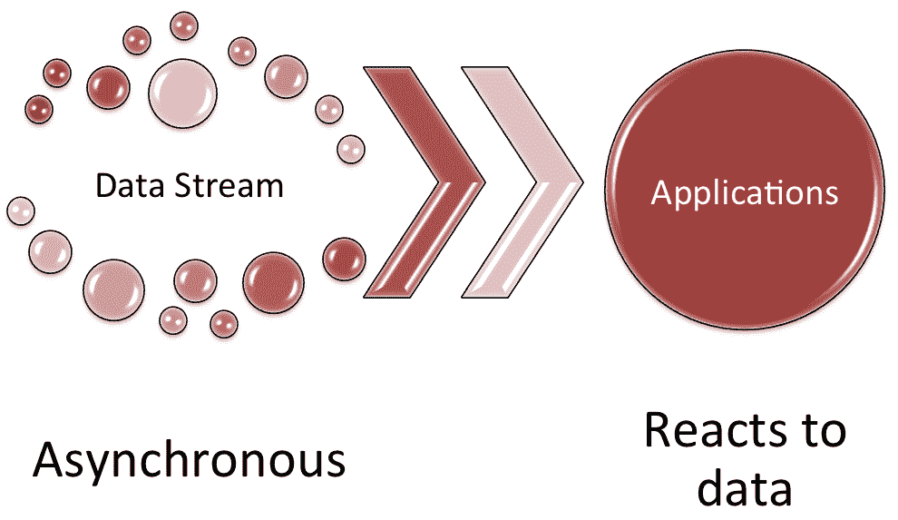
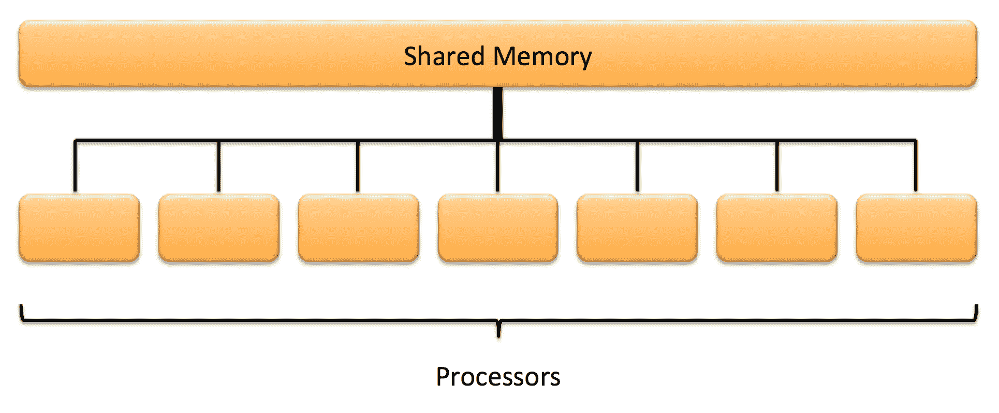

# 并发增强

在上一章中，我们为现代 Java 平台介绍了几种增强功能。 这些增强功能为 API 表示广泛的工具和更新，以便使用 Java 更轻松地开发，为我们的 Java 应用程序具有更大的优化可能性。 我们查看了新的 HTTP 客户端，更改了 javadoc 和 doclet api，新的 JavaScript 解析器，JAR 和 JRE 更改，新的 Java 级 JVM 编译器界面，对 TIFF 图像的新支持，平台记录，XML 目录支持，集合， 和新的平台特定的桌面功能。 我们还研究了对方法处理和弃用注释的增强功能。

在本章中，我们将介绍 Java 平台的并发增强功能。 我们的主要焦点将在对反应性编程的支持下，由`Flow ` API 提供的并发增强。 首次在 Java 9 中发布的无功编程，仍然是 Java 10 和 11 的重要特征。我们还将探索额外的并发增强功能。

更具体地说，我们将涵盖以下主题：

*   反应规划
*   `Flow` api
*   其他并发更新
*   旋转等待提示

# 技术要求

本章和后续章节，功能 Java 11.可以从 Oracle 的官方网站下载 Java 平台的 SE（ [http://www.oracle.com/technetwork/java/javase/downloads/index.html](http://www.oracle.com/technetwork/java/javase/downloads/index.html) ）。

集成开发环境（IDE）软件包就足够了。 来自 JetBrains 的 Intellij Idea 用于与本章相关的所有编码以及随后的章节。 可以从网站下载 Intellij Idea 的社区版本（ [https://www.jetbrains.com/idea/features/](https://www.jetbrains.com/idea/features/) ）。

# 反应规划

反应性编程是当应用程序发生在异步数据流时的发生时。 下图说明了此流程：



反应性编程流程

无功编程不是一个仅用于学术界的幻想软件工程术语。 事实上，它是一种编程模型，可以导致更大的效率，而不是更常见的方法，以便在内存中迭代数据的应用程序迭代。

有反应性编程更多。 首先，让我们考虑数据流由发布者以异步方式提供给订户。

数据流是字符串的二进制输入/输出和原始数据类型。 `DataInput`接口用于输入流，`DataOutput `接口用于输出流。

处理器或一系列处理器，可用于在没有发布者或订阅者涉及的情况下转换数据流。 在以下示例中，**处理器**在没有**出版商**或**用户**参与的数据流上工作，甚至意识：


处理器 - 用户关系

除了更高的效率外，无功规划还代表了几个额外的福利，这突出显示如下：

*   代码库可能不那么详细，使其成为：
*   更容易编码
*   更容易维护
*   更容易阅读

*   流处理导致记忆效率
*   这是各种编程应用的解决方案
*   需要写入少的样板代码，因此开发时间可以专注于编程核心功能
*   以下类型的编程需要更少的时间和代码：
*   并发
*   低级线程
*   同步

# 无功规范标准化

软件开发的许多方面都有标准，无功编程没有逃脱这一点。 有一个**反应流**主动标准化异步流处理。 在 Java 的上下文中，特定的焦点是 JVM 和 JavaScript。

反应流倡议旨在解决管理数据流在线程之间交换的问题问题。 当您将从上一节中召回时，处理器的想法取决于出版商或接收者没有影响。 此无影响授权规定不需要以下内容：

*   数据缓冲
*   数据翻译
*   转换

标准的基本语义定义了数据流元素传输的调节。 该标准专门与 Java 9 平台交付。 反应流包括一个库，它将帮助开发人员在`org.reactivestreams`和`java.util.concurrent.Flow`命名空间之间转换。

对反应性编程成功的关键和反应流标准化是理解相关术语：

| **术语** | **描述** |
| 要求 | 需求是指订户的更多元素的请求，以及引用尚未由发布者履行的所要求的元素总数。 |
| 要求 | 需求还指的是出版商未履行的要素总数。 |
| 外部同步 | 线程安全的外部访问协调。 |
| 无障碍 | 如果他们在没有重计算要求的情况下快速执行，则据说方法是非阻碍的。 非阻塞方法不会延迟订户的线程执行。 |
| 诺 | NOP 执行是执行，可以在不影响调用线程的情况下重复调用。 |
| 响应性 | 该术语是指组件的响应能力。 |
| 正常返回 | 返回通常是指在没有错误时 - 正常情况。 `onError`方法是标准允许的唯一方式通知用户失败。 |
| 信号 | 以下方法之一：

*   `cancel()`
*   `onComplete()`

*   ]
*   `request()`

 |

在以下部分中，我们将在 Java 平台中查看`Flow` API，因为它们对应于反应流规范。

# 流动 API.

`Flow`类是`java.util.concurrent`包的一部分。 它有助于开发人员在其应用中纳入反应性编程。 该类具有一种方法，`defaultBufferSize()`和四个接口。

`defaultBufferSize()`方法是一种静态方法，返回发布和订阅缓冲的默认缓冲区大小。 其默认值为`256`，它返回为`int`。

让我们看看四个接口。

# flow.publisher 界面

`Flow.Publisher`接口是功能界面。 a `Publisher`是发送给订阅者的数据的生产者：

```
@FunctionalInterface
public static interface Flow.Publisher<T>
```

此功能界面可以用作 Lambda 表达式分配目标。 它只需要一个参数 - 订阅的项目类型`<T>`。 它有一种方法，即`void subscribe(Flow.Subscriber subscriber)`。

# flow.subscriber 界面

`Flow.Subscriber`界面用于接收消息，此处显示其实现：

```
public static interface Flow.Subscriber<T>
```

该接口设置为接收消息。 它只需要一个参数 - 订阅的项目类型`<T>`。 它具有以下方法：

*   `void onComplete()`
*   `void onError(Throwable throwable)`
*   `void onNext(T item)`
*   `void onSubscribe(Flow.Subscription subscription)`

# flow.subscription 接口

`Flow.Subscription`接口可确保只有订阅者接收请求的内容。 此外，正如您在此处看到的那样，可以随时取消订阅：

```
public static interface Flow.Subscription
```

此接口不采用任何参数，并且是控制`Flow.Publisher`和`Flow.Subscriber`的实例之间的消息的链接。 它具有以下方法：

*   `void cancel()`
*   `void request(long n)`

# flow.processor 接口

`Flow.Processor`界面可以作为`Subscriber`和`Publisher`。 此处提供了实施：

```
static interface Flow.Processor<T,R> extends Flow.Subscriber<T>, Flow.Publisher<R>
```

此接口需要两个参数 - 订阅的项目类型`<T>`和已发布的项目类型`<R>`。 它没有自己的方法，但是从`java.util.concurrent.Flow.Publisher`继承了以下方法：

```
void subscribe(Flow.Subscriber<? super T> subscriber)
```

`Flow.Processor`还从`java.util.concurrent.Flow.Subscriber`接口继承以下方法：

*   `void onComplete()`
*   `void onError(Throwable throwable)`
*   `void onNext(T item)`
*   `void onSubscribe(Flow.Subscription subscription)`

# 示例实施

在任何给定的反应性编程的实现中，我们将具有`Subscriber`，其请求数据和`Publisher`，它提供数据。 首先，让我们来看看样本`Subscriber`实现：

```
import java.util.concurrent.Flow.*;

public class packtSubscriber<T> implements Subscriber<T> {

  private Subscription theSubscription;

  // We will override the four Subscriber interface methods
  @Override
  public void onComplete() {
    System.out.println("Data stream ended");
  }

  @Override
  public void onError(Throwable theError) {
    theError.printStackTrace();
  }

  @Override
  public void onNext(T theItem) {
    System.out.println("Next item received: " + theItem);
    theSubscription.request(19); // arbitrary number 
  }

  @Override
  public void onSubscribe(Subscription theSubscription) {
    this.theSubscription = theSubscription;
    theSubscription.request(19);
  }
}
```

如您所见，实现`Subscriber`并不困难。 繁重的工作是由`Subscriber`和`Publisher`之间的处理器完成的。 让我们来看看`Publisher`将数据流发布到订阅者的示例实现：

```
import java.util.concurrent.SubsmissionPublisher;
. . .
// First, let's create a Publisher instance
SubmissionPublisher<String> packtPublisher = 
  newSubmissionPublisher<>();

// Next, we will register a Subscriber
PacktSubscriber<String> currentSubscriber = 
  new PacktSubscriber<>();
packtPublisher.subscribe(currentSubscriber);

// Finally, we will publish data to the Subscriber 
// and close the publishing effort
System.out.println("||---- Publishing Data Stream ----||");
. . .
packtPublisher.close();
System.out.println("||---- End of Data Stream Reached ----||");
```

# 其他并发更新

最近增强了 Java 平台以改善并发性的使用。 在本节中，我们将简要探讨 Java 并发的概念，并查看 Java 平台的相关增强功能，包括：

*   Java 并发
*   支持反应溪流
*   `CompletableFuture` API 增强功能

# Java 并发

在本节中，我们将开始简要说明并发性，然后查看系统配置，涵盖 Java 线程，最后查看并发改进。

# 并发解释说明

自 20 世纪 60 年代以来一直存在并发处理。 在那些形成年份中，我们已经拥有允许多个进程共享单个处理器的系统。 这些系统更清楚地定义为伪并行系统，因为它只出现在同时执行多个进程。 至今，我们的计算机仍然以这种方式运行。 20 世纪 60 年代与当天之间的差异是我们的计算机可以具有多个 CPU，每个 CPU 都有多个核心，更好地支持并发性。

并发和并行性通常用作可互换的术语。 并发是当多个进程重叠时，虽然开始和停止时间可能不同。 当任务启动，运行和停止同时发生并行方式发生并行性。

# 系统配置

需要考虑几种不同的处理器配置。 本节具有两个常见配置。 第一个配置是共享内存的配置，此处说明：



共享内存配置

如您所见，共享内存系统配置有多个处理器，所有处理器都共享公共系统内存。 第二个特色系统配置是分布式内存系统：


分布式内存系统

使用分布式存储器系统，每个处理器都有自己的存储器，每个处理器都与其他处理器完全链接，使分布式系统完全链接。

# Java 线程

Java 中的一个线程是程序执行，内置于 JVM 中。 `Thread`类是`java.lang`包的一部分（`java.lang.Thread`）。 线程具有控制符合 JVM 执行它们的顺序的优先级。 虽然概念很简单，但实施不是。 让我们开始仔细看看`Thread`课程。

`Thread`类有一个嵌套类：

*   `public static enum Thread.State`

与`Thread`类相关也是如下界面：

*   `public static interface Thread.UncaughtExceptionHandler`

管理线程优先级有三个类变量：

*   `public static final int MAX_PRIORITY`
*   `public static final int MIN_PRIORITY`
*   `public static final int NORM_PRIORITY`

`Thread`类有八个构造函数，所有这些构造函数都分配了一个新的`Thread`对象。 以下是构造函数签名：

*   `public Thread()`
*   `public Thread(Runnable target)`
*   `public Thread(Runnable target, String name)`
*   `public Thread(String name)`
*   `public Thread(ThreadGroup group, Runnable target)`
*   `public Thread(ThreadGroup group, Runnable target, String name)`
*   `public Thread(ThreadGroup group, Runnable target, String name, long stackSize)`
*   `public Thread(ThreadGroup group, String name)`

`Thread`类还有 43 种方法，其中六种已经弃用。 此处列出了剩余的方法，保存用于访问者和突变符，该访问器和突变者单独列出。 您可以有关这些方法中的每种方法的详细信息，可以查阅文档：

*   `public static int activeCount()`
*   `public final void checkAccess()`
*   `protected Object clone() throws CloneNotSupportedException`
*   `public static Thread currentThread()`
*   `public static void dumpStack()`
*   `public static int enumerate(Thread[] array)`
*   `public static boolean holdsLock(Object obj)`
*   `public void interrupt()`
*   `public static boolean interrupted()`
*   `public final boolean isAlive()`
*   `public final boolean isDaemon()`
*   `public boolean isInterrupted()`
*   加入方法：
*   `public final void join() throws InterruptedException`
*   `public final void join(long millis) throws InterruptedException`
*   `public final void join(long millis, int nano) throws InterruptedException`

*   `public void run()`
*   睡眠方法：
*   `public static void sleep(long mills) throws InterruptedException`
*   `public static void sleep(long mills, int nano) throws InterruptedException`

*   `public void start()`
*   `public String toString()`
*   `public static void yield()`

以下是`Thread`类的访问者/ getters 和 mutators / setter 列表：

*   存放器/ getters：
*   `public static Map<Thread, StackTraceElement[]> getAllStacktraces()`
*   `public ClassLoader getContextClassLoader()`
*   `public static Thread.UncaughtExceptionHandler getDefaultUncaughtExceptionHandler()`
*   `public long getId()`
*   `public final String getName()`
*   `public final int getPriority()`
*   `public StackTraceElement[] getStackTrace()`
*   `public Thread.State getState()`
*   `public final ThreadGroup getThreadGroup()`
*   `public Thread.UncaughtExceptionHandler getUncaughtExceptionHandler()`

*   变异符号/定居者：
*   `public void setContextClassLoader(ClassLoader cl)`
*   `public final void setDaemon(boolean on)`
*   `public static void setDefaultUncaughtExceptionHandler(Thread.UncaughtExceptionHandler eh)`
*   `public final void setName(String name)`
*   `public final void setPriority(int newPriority)`
*   `public void setUncaughtExceptionHandler(Thread.UncaughtException Handler eh)`

在 Java 中，并发通常称为多线程。 如前所述，管理线程，尤其是多线程，需要控制良好的保险费。 Java 几种技术，包括使用锁。 可以锁定代码段以确保只有单个线程可以在任何给定时间执行该代码。 我们可以使用`synchronized`关键字锁定类和方法。 以下是如何锁定整个方法的示例：

```
public synchronized void protectedMethod() {
  . . .
}
```

以下代码段演示如何在方法中使用`synchronized`关键字锁定代码块：

```
. . .
public class unprotectedMethod() {
  . . .
  public int doSomething(int tValue) {
    synchronized (this) {
      if (tValue != 0) {
        // do something to change tValue
        return tValue;
      }
    }
  }
}
```

# 并发改进

在我们的 Java 应用程序中使用多个线程的能力大大提高了效率，并利用了现代计算机的增加的处理能力。 Java 中的线程在我们的并发控制中提供了很大的粒度。

线程位于 Java 的并发功能的核心。 我们可以通过定义`run`方法并实例化`Thread`对象来在 Java 中创建一个线程。 有两种方法可以完成这组任务。 我们的第一个选项是扩展`Thread`类并覆盖`Thread.run()`方法。 这是该方法的一个例子：

```
. . .
class PacktThread extends Thread {
  . . .
  public void run() {
    . . .
  }
}
. . .
Thread varT = new PacktThread();
. . .
// This next line is start the Thread by 
// executing the run() method.
varT.start();
. . .
```

第二种方法是创建一个实现`Runnable`接口的类，并将类的实例传递给`Thread`的构造函数。 这是一个例子：

```
. . .
class PacktRunner implements Runnable {
  . . .
  public void run() {
    . . .
  }
}
. . .
PacktRunner varR = new PacktRunner();
Thread varT = new Thread(varR);
. . .
// This next line is start the Thread by 
// executing the run() method.
varT.start();
. . .
```

这两种方法都同样适用，您使用哪一个被认为是开发人员的选择。 当然，如果您正在寻找额外的灵活性，那么第二种方法可能是一个更好的使用。 您可以尝试两种方法来帮助您做出决定。

# 完全的 Future API 增强功能

`CompletableFuture<T>`类是`java.util.concurrent`包的一部分。 此类扩展了`Object`类和实现`Future<T>`和`CompletionStage<T>`接口。 此类用于注释可以完成的线程。 我们可以使用`CompletableFuture`类代表未来的结果。 使用完整方法时，可以完成将来的结果。

重要的是要意识到，如果多个线程尝试同时完成（完成或取消），则只有一个将失败。 让我们来看看班级，然后看看增强功能。

# 课程细节

`CompletableFuture<T>`类具有标记异步任务的一个嵌套类：

```
public static interface CompletableFuture.AsynchronousCompletionTask
```

`CompletableFuture<T>`类的构造函数必须与提供的构造函数签名同步。 它也不能采取任何论点。 该类具有以下方法，这些方法由他们返回的内容组织起来：

返回`CompletionStage`：

*   `public CompletableFuture<Void> acceptEither(CompletionStage<? extends T> other, Consumer<? super T> action)`
*   `public CompletableFuture<Void> acceptEitherAsync(CompletionStage<? extends T> other, Consumer<? super T> action)`
*   `public CompletableFuture<Void> acceptEitherAsync(CompletionStage<? extends T> other, Consumer<? super T> action, Executor executor)`
*   `public <U> CompletableFuture<U> applyToEither(CompletionStage<? extends T> other, Function<? super T, U> fn)`
*   `public <U> CompletableFuture<U> applyToEitherAsync(CompletionStage<? extends T> other, Function<? super T, U> fn)`
*   `public <U> CompletableFuture<U> applyToEitherAsync(CompletionStage<? extends T> other, Function<? super T, U> fn, Executor executor)`
*   `public static <U> CompletedStage<U> completedStage(U value)`
*   `public static <U> CompletionStage<U> failedStage(Throwable ex)`
*   ``public <U> CompletableFuture<U> handle(BiFunction<? super T, Throwable, ? extends U> fn)``
*   `public <U> CompletableFuture<U> handleAsync(BiFunction<? super T, Throwable, ? extends U> fn)`
*   `public <U> CompletableFuture<U> handleAsync(BiFunction<? super T, Throwable, ? extends U> fn, Executor executor)`
*   `public CompletionStage<T> minimalCompletionStage()`
*   `public CompletableFuture<Void> runAfterBoth(CompletionStage<?> other, Runnable action)`
*   `public CompletableFuture<Void> runAfterBothAsync(CompletionStage<?> other, Runnable action)`
*   `public CompletableFuture<Void> runAfterBothAsync(CompletionStage<?> other, Runnable action, Executor executor)`
*   `public CompletableFuture<Void> runAfterEither(CompletionStage<?> other, Runnable action)`
*   `public CompletableFuture<Void> runAfterEitherAsync(CompletionStage<?> other, Runnable action)`
*   `public CompletableFuture<Void> runAfterEitherAsync(CompletionStage<?> other, Runnable action, Executor executor)`
*   `public CompletableFuture<T> whenComplete(BiConsumer<? super T, ? super Throwable> action)`
*   `public CompletableFuture<T> whenCompleteAsync(BiConsumer<? super T, ? super Throwable> action)`
*   `public CompletableFuture<T> whenCompleteAsync(BiConsumer<? super T, ? super Throwable> action, Executor executor)`

这些方法返回`CompletionStage`：

*   `public CompletableFuture<Void> thenAccept(Consumer<? super T> action)`
*   `public CompletableFuture<Void> thenAcceptAsync(Consumer<? super T> action)`
*   ``public CompletableFuture<Void> thenAcceptAsync(Consumer<? super T> action, Executor executor)``
*   `public <U> CompletableFuture<Void> thenAcceptBoth(CompletionStage<? extends U> other, BiConsumer<? super T, ? super U> action)`
*   `public <U> CompletableFuture<Void> thenAcceptBothAsync(CompletionStage<? extends U> other, BiConsumer<? super T, ? super U> action)`
*   `public <U> CompletableFuture<Void> thenAcceptBothAsync(CompletionStage<? extends U> other, BiConsumer<? super T, ? super U> action, Executor executor)`
*   `public <U> CompletableFuture<U> thenApply(Function<? super T, ? extends U> fn)`
*   `public <U> CompletableFuture<U> thenApplyAsync(Function<? super T, ? extends U> fn)`
*   `public <U> CompletableFuture<U> thenApplyAsync(Function<? super T, ? extends U> fn, Executor executor)`
*   `public <U, V> CompletableFuture<V> thenCombine(CompletionStage<? extends U> other, BiFunction<? super T, ? super U, ? extends V> fn)`
*   `public <U, V> CompletableFuture<V> thenCombineAsync(CompletionStage<? extends U> other, BiFunction<? super T, ? super U, ? extends V> fn)`
*   `public <U, V> CompletableFuture<V> thenCombineAsync(CompletionStage<? extends U> other, BiFunction<? super T, ? super U, ? extends V> fn, Executor executor)`
*   `public <U> CompletableFuture<U> thenCompose(Function<? super T, ? extends CompletionStage<U>> fn)`
*   `public <U> CompletableFuture<U> thenComposeAsync(Function<? super T, ? extends CompletionStage<U>> fn)`
*   `public <U> CompletableFuture<U> thenComposeAsync(Function<? super T, ? extends CompletionStage<U>> fn, Executor executor)`
*   `public CompletableFuture<Void> thenRun(Runnable action)`
*   `public CompletableFuture<Void>thenRunAsync(Runnable action)`
*   `public CompletableFuture<Void>thenRunAsync(Runnable action, Executor executor)`

这些方法返回`CompletableFuture`：

*   `public static CompletableFuture<Void> allOf(CompletableFuture<?>...cfs)`
*   `public static CompletableFuture<Object> anyOf(CompletableFuture<?>... cfs)`
*   `public CompletableFuture<T> completeAsync(Supplier<? extends T> supplier, Executor executor)`
*   `public CompletableFuture<T> completeAsync(Supplier<? extends T> supplier)`
*   `public static <U> CompletableFuture<U> completedFuture(U value)`
*   `public CompletableFuture<T> completeOnTimeout(T value, long timeout, TimeUnit unit)`
*   `public CompletableFuture<T> copy()`
*   `public CompletableFuture<T> exceptionally(Function<Throwable, ? extends T> fn)`
*   `public static <U> CompletableFuture<U> failedFuture(Throwable ex)`
*   `public <U> CompletableFuture<U> newIncompeteFuture()`
*   `public CompletableFuture<T> orTimeout(long timeout, TimeUnit unit)`
*   `public static ComletableFuture<Void> runAsync(Runnable runnable)`
*   `public static CompletableFuture<Void> runAsync(Runnable runnable, Executor executor)`
*   `public static <U> CompletableFuture<U> supplyAsync(Supplier<U> supplier)`
*   `public static <U> CompletableFuture<U> supplyAsync(Supplier<U. supplier, Executor executor)`
*   `public CompletableFuture<T> toCompletableFuture()`

这些方法返回`Executor`：

*   `public Executor defaultExecutor()`
*   `public static Executor delayedExecutor(long delay, Timeunit unit, Executor executor)`
*   `public static Executor delayedExecutor(long delay, Timeunit unit)`

这些方法返回`boolean`：

*   `public boolean cancel(boolean mayInterruptIfRunning)`
*   `public boolean complete(T value)`
*   `public boolean completeExceptionally(Throwable ex)`
*   `public boolean isCancelled()`
*   `public boolean isCompletedExceptionally()`
*   `public boolean isDone()`

没有返回类型：

*   `public void obtrudeException(Throwable ex)`
*   `public void obtrudeValue(T value)`

其他方法：

*   `public T get(long timeout, TimeUnit unit) throws InterruptedException, ExecutionException, TimeoutException`
*   `public T get() throws InterruptedException, ExecutionException`
*   `public T getNow(T valueIfAbsent)`
*   `public int getNumberOfDependents()`
*   `public T join()`
*   `public String toString()`

# 增强

`CompletableFuture<T>`类收到以下增强功能作为当前 Java 平台的一部分：

*   添加了基于时间的增强功能：
*   这使得能够基于失效的时间完成
*   现在也支持延迟执行

*   对子类的显着增强：
    *   扩展`CompletableFuture`更容易
    *   子类支持替代默认执行器

具体地，在 Java 9 中添加以下方法：

*   `newIncompleteFuture()`
*   `defaultExecutor()`
*   `copy()`
*   `minimalCompletionStage()`
*   `completeAsync()`
*   `orTimeout()`
*   `completeOnTimeout()`
*   `delayedExecutor()`
*   `completedStage()`
*   `failedFuture()`
*   `failedStage()`

# 旋转等待提示

通过并发，我们需要确保等待执行的线程实际执行。 旋转等待的概念是一个不断检查真实条件的过程。 Java 平台具有 API，允许 Java 代码发出暗示当前正在执行的旋转环路。

虽然这不是每个 Java 开发人员将使用的功能，但它对低级编程非常有用。 提示系统仅发出提示指示并执行其他操作。 添加这些提示的理由包括以下假设：

*   使用旋转提示时可以提高旋转环路的动作时间
*   使用旋转提示将减少线程到线程延迟
*   CPU 功耗将减少
*   硬件线程将更快地执行

该提示功能将包含在一个新的`onSpinWait()`方法中作为`java.lang.Thread`类的一部分。 以下是实现`onSpinWait()`方法的示例：

```
. . .
volatile boolean notInReceiptOfEventNotification
. . .
while ( notInReceiptOfEventNotification ); {
  java.lang.Thread.onSpinWait();
}
// Add functionality here to read and process the event
. . .
```

# 概括

在本章中，我们涵盖了 Java 平台的并发增强功能。 我们深入了解并发，都是核心 Java 概念，并以 java 提供的目的。 我们还探索了支持反应性编程的`Flow`类 API。 此外，我们还探讨了并发增强和新的自旋等待提示。

在下一章中，我们将突出显示 Java 平台的安全增强功能以​​及实际示例。

# 问题

1.  什么是反应性编程？
2.  什么是数据流？
3.  使用反应性编程的主要好处是什么？
4.  无功规划的无影响授权的规定是什么？
5.  什么包是`Flow`课程的一部分？
6.  列出`Flow`类的四个接口。
7.  什么是并发？
8.  并发和并行性之间的区别是什么？
9.  解释共享内存系统配置。
10.  解释分布式内存系统配置。

# 进一步阅读

以下是您可以参考的信息列表：

*   *用 Java 9* 的反应性编程，在 [https://www.packtpub.com/application-development/reactive-programming-java-9](https://www.packtpub.com/application-development/reactive-programming-java-9) 。
*   *java 9 并发 - 高级元素[视频]* ，可在 [https://www.packtpub.com/application-development/java-9-concurrency-advings-eascings-video](https://www.packtpub.com/application-development/java-9-concurrency-advanced-elements-video) 。