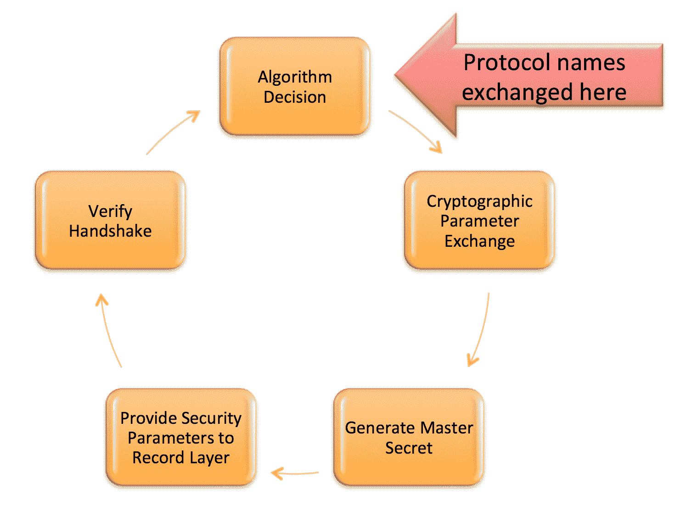
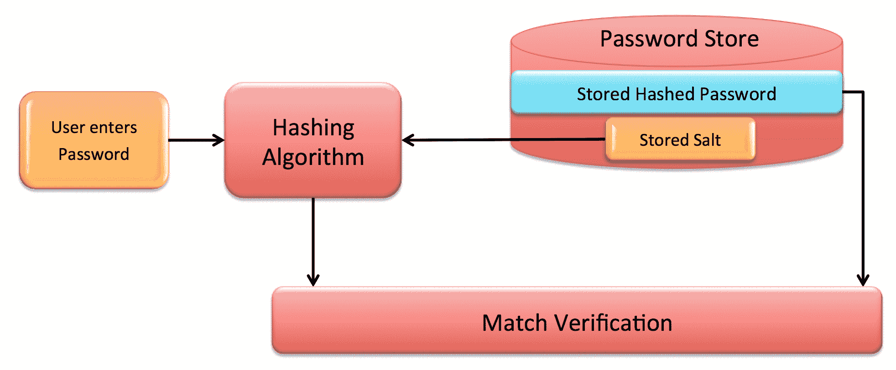

# 安全增强

在最后一章中，我们涵盖了现代 Java 平台的并发增强。 我们深入了解并发性，无论是核心概念，都是 Java 的一系列增强。 我们还探索了支持反应性编程的`Flow`类 API。 此外，我们还探讨了 Java 的并发增强和旋转等待提示。

在本章中，我们将研究最近对 JDK 的几个更改，涉及安全性。 这些变化的大小并不反映其重要性。 现代 Java 平台的安全增强能够为开发人员提供更高的能力，可以编写和维护比以前更安全的应用程序。

更具体地说，我们将在本章中审核以下主题：

*   数据报传输层安全
*   创建 PKCS12 密钥库
*   提高安全应用程序性能
*   TLS 应用层协议协商扩展
*   利用 CPU Ghash 和 RSA 说明
*   用于 TLS 的 OCSP 装订
*   基于 DRBG 的`SecureRandom`实现

# 技术要求

本章和随后的章节具有 Java 11\. Java 平台的**标准版**（ **SE** ）可以从 Oracle 的官方网站下载（ [http://www.oracle。 com / technetwork / java / javase / downloads / index.html](http://www.oracle.com/technetwork/java/javase/downloads/index.html) ）。

IDE 软件包就足够了。 来自 JetBrains 的 Intellij Idea 用于与本章相关的所有编码以及随后的章节。 可以从网站上下载 Intexij Idea 的社区版本（ [https://www.jetbrains.com/idea/features/](https://www.jetbrains.com/idea/features/) ）。

# 数据报传输层安全

**数据报传输层安全**（ **DTLS** ）是通信协议。 该协议为基于数据报的应用程序提供了一层安全性。 DTLS 允许安全通信，基于**传输层安全**（ **TLS** ）协议。 嵌入式安全性有助于确保消息不伪造，篡改或窃听。

让我们回顾相关术语：

*   **通信协议**：一组规则，用于控制如何传输信息。
*   **数据报**：结构化转移单元。
*   **窃听**：侦听在传输中的数据包时未被发现。
*   **伪造**：用伪造的发件人传输数据包。
*   **网络数据包**：用于传输的格式化数据单元。
*   **篡改**：发件人在发送时和预期接收器接收之前的数据包之后的改变。
*   **TLS 协议**：最常见的网络安全协议。 例如，它使用 IMPA 和 POP 进行电子邮件。

最近的 DTLS Java 增强功能旨在为 DTL 的版本 1.0 和 1.2 创建 API。

在以下部分中，我们将查看每个 DTL 版本，1.0 和 1.2，然后查看对 Java 平台所做的更改。

# DTLS 协议版本 1.0

DTLS 协议版本 1.0 成立于 2006 年，为数据报协议提供通信安全性。 以下是其基本特征：

*   允许客户端/服务器应用程序在不允许的情况下进行通信：
*   窃听
*   篡改
*   消息伪造

*   基于 TLS 协议
*   提供安全保障
*   保留了 DLS 协议的数据报语义

下图说明了**传输层**适合于 **SSL / TLS** 协议层的总模式以及每层的协议：


SSL / TLS 协议层

DTLS 协议版本 1.0 提供了主要覆盖范围的详细规格，如下：

*   Ciphers：
*   反重放块密码
*   新密码套件
*   标准（或 null）流密码

*   拒绝服务对策
*   握手：
*   消息格式
*   协议
*   可靠性

*   消息：
*   碎片和重新组装
*   丢失不敏感的消息传递
*   尺寸
*   超时和重传
*   数据包丢失

*   **路径最大转换单元（PMTU）**发现
*   记录层
*   记录有效载荷保护
*   重新排序
*   重播检测
*   传输层映射

# DTLS 协议版本 1.2

DTLS 协议版本 1.2 已于 2012 年 1 月发布，受 **Internet Engineching Task Force** （ **IETF** ）。 本节共享代码示例，说明版本 1.2 中的更改。

以下代码说明了 TLS 1.2 握手消息标题。 此格式支持：

*   消息碎片化
*   消息丢失
*   重新排序：

```
// Copyright (c) 2012 IETF Trust and the persons identified 
// as authors of the code. All rights reserved.

struct 
{
  HandshakeType msg_type;
  uint24 length;
  uint16 message_seq; // New field
  uint24 fragment_offset; // New field
  uint24 fragment_length; // New field
  select (HandshakeType)
  {
    case hello_request: HelloRequest;
    case client_hello: ClientHello;
    case hello_verify_request: HelloVerifyRequest; // New type
    case server_hello: ServerHello;
    case certificate:Certificate;
    case server_key_exchange: ServerKeyExchange;
    case certificate_request: CertificateRequest;
    case server_hello_done:ServerHelloDone;
    case certificate_verify: CertificateVerify;
    case client_key_exchange: ClientKeyExchange;
    case finished: Finished;
  } body;
} Handshake;
```

本节中呈现的代码来自 DTLS 协议文档，并根据 IETF 的*法律规定与 IETF 文档*的法律规定重新发布。

记录层包含要发送到记录的信息。 信息在`DTLSPlaintext`结构内部开始，然后在握手发生后，记录被加密，并且有资格通过通信流发送。 记录图层格式在 1.2 版本中使用新字段，并使用`// New field`注释，如下所示，如下所示：

```
// Copyright (c) 2012 IETF Trust and the persons identified
// as authors of the code. All rights reserved.

struct
{
  ContentType type;
  ProtocolVersion version;
  uint16 epoch; // New field
  uint48 sequence_number; // New field
  uint16 length;
  opaque fragment[DTLSPlaintext.length];
} DTLSPlaintext;

struct
{
  ContentType type;
  ProtocolVersion version;
  uint16 epoch; // New field
  uint48 sequence_number; // New field
  uint16 length;
  opaque fragment[DTLSCompressed.length];
} DTLSCompressed;

struct
{
  ContentType type;
  ProtocolVersion version;
  uint16 epoch; // New field
  uint48 sequence_number; // New field
  uint16 length;
  select (CipherSpec.cipher_type)
  {
    case block: GenericBlockCipher;
    case aead: GenericAEADCipher; // New field
  } fragment;
} DTLSCiphertext;
```

最后，这是更新的握手协议：

```
// Copyright (c) 2012 IETF Trust and the persons identified
// as authors of the code. All rights reserved.

enum {
  hello_request(0), client_hello(1),
  server_hello(2),
  hello_verify_request(3), // New field
  certificate(11), server_key_exchange (12),
  certificate_request(13), server_hello_done(14),
  certificate_verify(15), client_key_exchange(16),
  finished(20), (255) } HandshakeType;

  struct {
    HandshakeType msg_type;
    uint24 length;
    uint16 message_seq; // New field
    uint24 fragment_offset; // New field
    uint24 fragment_length; // New field
    select (HandshakeType) {
      case hello_request: HelloRequest;
      case client_hello: ClientHello;
      case server_hello: ServerHello;
      case hello_verify_request: HelloVerifyRequest; // New field
      case certificate:Certificate;
      case server_key_exchange: ServerKeyExchange;
      case certificate_request: CertificateRequest;
      case server_hello_done:ServerHelloDone;
      case certificate_verify: CertificateVerify;
      case client_key_exchange: ClientKeyExchange;
      case finished: Finished;
    } body; } Handshake;

  struct {
    ProtocolVersion client_version;
    Random random;
    SessionID session_id;
    opaque cookie<0..2^8-1>; // New field
    CipherSuite cipher_suites<2..2^16-1>;
    CompressionMethod compression_methods<1..2^8-1>; } ClientHello;

 struct {
    ProtocolVersion server_version;
    opaque cookie<0..2^8-1>; } HelloVerifyRequest;
```

# DTLS 在 Java 中支持

Java 的 DTLS API 的实现是独立的和轻量级的。 API 的设计注意事项如下：

*   读取超时不会被管理
*   该实现将为每个包装/未包装操作使用单个 TLS 记录
*   应用程序不是 API，将需要：
*   确定超时值
*   组装无序应用数据

DTL 是一种协议，用于在数据传递到传输层协议之前从应用层保护数据。 DTL 是加密和发送实时数据的好解决方案。 注意应谨慎行使，以便我们在申请的实施中没有引入漏洞。 以下是某些用于在 Java 应用程序中实现 DTL 的某些安全注意事项：

*   实现 DTLS v1.2，因为这是 Java 支持的最新版本。
*   避免 **RIVEST-SHAMIR-ADLEMAN** （ **RSA** ）加密。 如果必须使用 RSA，则为私钥添加额外的安全性，因为这是 RSA 的弱点。
*   使用**椭圆曲线 diffie-hellman** 时使用 192 位或更多次或更多位（ **ecdh** ）匿名密钥协议协议。 192 位值基于 A **国家标准和技术研究所**（ **NIST** ）推荐。
*   强烈建议使用**经过相关数据**（**（ **aead** ），加密形式的加密。 AEAD 为正在加密和解密的数据提供真实性，机密性和完整性保证。**
*   始终在实现握手重新协商时实现`renegotiation_info`扩展。
*   在所有 Java 应用程序中建立**前进保密**（ **FS** ）功能，使用通信协议。 实现 FS 确保过去的会话加密密钥不会在长期加密密钥泄露时不受损害。 理想情况下，**完美的前向保密**（ **pfs** ），其中每个密钥仅对单个会话有效，将用于呼叫传输数据的最大安全性的 Java 应用程序中。

# 创建 PKCS12 密钥库

Java 平台为密钥库提供了更高的安全性。 在默认创建 PKCS12 密钥库之前，我们将首先查看密钥库的概念，查看`KeyStore`类，然后查看 Java 平台的最新更新。

# 密钥库底漆

`KeyStore`的概念相对简单。 它基本上是一个数据库文件或数据存储库文件，它存储公钥证书和私钥。 `KeyStore`将存储在`/jre/lib/security/cacerts`文件夹中。 正如您在下一节中看到的，此数据库由 Java 的`java.security.KeyStore`类方法管理。

`KeyStore`的功能包括以下内容：

*   包含以下输入类型之一：
*   私钥
*   公共关键证书

*   每个条目的唯一别名字符串名称
*   每个键的密码保护

# Java KeyStore（JKS）

`java.security.KeyStore`类是加密密钥和证书的存储设施。 此类扩展`java.lang.Object`，如下所示：

```
public class KeyStore extends Object
```

由`KeyStore`管理有三种类型的条目，每个条目都实现了`KeyStore.Entry`接口，由`KeyStore`类提供的三个接口之一。 条目实现在下表中定义：

| **实现** | **描述** |
| `KeyStore.PrivateKeyEntry` | 包含它可以以受保护格式存储的`PrivateKey`。包含公钥的证书链。 |
| `KeyStore.SecretKeyEntry` | 包含它可以以受保护格式存储的`SecretKey`。 |
| `KeyStore.TrustedCertifcateEntry` | 包含来自外部源的单个公钥`Certificate`。 |

自版本 1.2 以来，此类是 Java 平台的一部分。 它有一个构造函数，三个接口，六个子类和几种方法。 构造函数定义如下：

```
protected KeyStore(KeyStoreSpi keyStoresSpi, Provider provider, String type)
```

`KeyStore`类包含以下接口：

*   `public static interface KeyStore.Entry`：此接口用作`KeyStore`条目类型的标记，并不包含任何方法。
*   `public static interface KeyStore.LoadStoreParameter`：此接口用作负载和存储参数的标记，并具有以下方法返回 NULL，或用于保护`KeyStore`数据的参数：
    *   `getProtectionParameter()`
*   `public static interface KeyStore.ProtectionParameter`：此接口用作`KeyStore`保护参数的标记，不包含任何方法。

`java.security.KeyStore`类还包含六个嵌套类，每个类中的每一个都在后续部分中检查。

`KeyStoreSpi`类定义了密钥库的**服务提供商接口**（ **SPI** ）。

# 了解 keyStore.Builder.

当您想要推迟`KeyStore`的实例化时，使用`KeyStore.Builder`类：

```
public abstract static class KeyStore.Builder extends Object
```

此类提供了用于实例化`KeyStore`对象的必要信息。 该类具有以下方法：

*   `public abstract KeyStore getKeyStore() throws KeyStoreException`。
*   `public abstractKeyStore.ProtectionParameter getProjectionParameter(String alias) throws KeyStoreException`。
*   `newInstance`的三个选项：
*   `public static KeyStore.Builder newInstance(KeyStore keyStore, KeyStore.ProtectionParameter protectionParameter)`
*   `public static KeyStore.Builder newInstance(String type, Provider provider, File file, KeyStore.ProtectionParameter protection)`
*   `public static KeyStore.Builder newInstance(String type, Provider provider, KeyStore.ProtectionParameter protection)`

# CallbackHandlerProtection 类

`KeyStore.CallbackHandlerProtection`类定义如下：

```
public static class KeyStore.CallbackHandlerProtection extends Object implements KeyStore.ProtectionParameter
```

此类提供`ProtectionParameter`封装`CallbackHandler`并具有以下方法：

```
public CallbackHandler getCallbackHandler()
```

# passwordprotection 类

`KeyStore.PasswordProtection`类定义如下：

```
public static class KeyStore.PasswordProtection extends Object implements KeyStore.ProtectionParameter, Destroyable
```

此呼叫提供了基于密码的`ProtectionParameter`的实现。 此类具有以下方法：

*   `public void destroy() throws DestroyFailedException`：此方法清除密码
*   `public char[] getPassword()`：返回对密码的引用
*   `public boolean isDestroyed()`：如果密码已清除，则返回 true

# privateKeyEntry 类

`KeyStore.PrivateKeyEntry`类定义如下：

```
public static final class KeyStore.PrivateKeyEntry extends Object implements KeyStore.Entry
```

这将创建一个包含`PrivateKey`和相应的`Certificate`链的条目。 此类具有以下方法：

*   `public Certificate getCertificate()`：从`Certificate`链中返回最终实体`Certificate`
*   `public Certificate[] getCertificateChain()`：将`Certificate`链作为`Certificates`返回
*   `public PrivateKey getPrivateKey()`：从当前条目返回`PrivateKey`
*   `public String toString()`：返回`PrivateKeyEntry`作为`String`

# secretKeyEntry 类

`KeyStore.SecretKeyEntry`类定义如下：

```
public static final class KeyStore.SecretKeyEntry extends Object implements KeyStore.Entry
```

此类包含`SecretKey`并具有以下方法：

*   `public SecretKey getSecretKey()`：返回条目的`SecretKey`
*   `public String toString()`：返回`SecretKeyEntry`作为`String`

# TrustedCertificateEntry 类

`KeyStore.TrustedCertificateEntry`类定义如下：

```
public static final class KeyStore.TrustedCertificateEntry extends Object implements KeyStore.Entry
```

此类包含可信的`Certificate`并具有以下方法：

*   `public Certificate getTrustedCertificate()`：返回条目的信任`Certificate`
*   `public String toString()`：返回条目的受信任`Certificate`作为`String`

使用此类的关键是理解其流程。 首先，我们必须使用`getInstance`方法加载`KeyStore`。 接下来，我们必须请求访问`KeyStore`实例。 然后，我们必须获得访问，以便我们可以读取和写入`Object`：


密钥库负载 - 请求访问模式

以下代码片段显示负载请求访问实现：

```
. . .
try {
  // KeyStore implementation will be returned for the default type
  KeyStore myKS = KeyStore.getInstance(KeyStore.getDefaultType());

  // Load
  myKS.load(null, null);

  // Instantiate a KeyStore that holds a trusted certificate
  TrustedCertificateEntry myCertEntry =
    new TrustedCertificateEntry(generateCertificate());

  // Assigns the trusted certificate to the "packt.pub" alias
  myKS.setCertificateEntry("packt.pub", 
    myCertEntry.getTrustedCertificate());

  return myKS;
  }
  catch (Exception e) {
    throw new AssertionError(e);
  }
}
. . .
```

# PKCS12 默认在 Java 9,10 和 11 中

在 Java 9 之前，默认`KeyStore`类型为 **java keystore** （ **jk** ）。 当前的 Java 平台使用 PKC 作为默认的`KeyStore`类型，更具体地，PKCS12。

**PKCS** is an acronym for **Public Key Cryptography Standards**.

与 JKS 相比，PKCS 的变更提供了更强的加密算法。 正如您所期望的那样，JDK 9,10 和 11 仍然与 JKS 兼容以支持以前开发的系统。

# 提高安全应用程序性能

现代 Java 平台包括安装安全管理器的应用程序时的性能改进。 安全管理人员可能导致处理开销并低于理想的应用程序性能。

这是一个令人印象深刻的事业，因为当前 CPU 在运行安全管理人员时，估计会导致 10-15％的性能下降。 完全删除 CPU 开销是不可行的，因为需要一些 CPU 处理来运行安全管理器。 已经说，目标是尽可能减少开销百分比。

这项努力导致以下优化，每个都详细说明在后续部分：

*   安全策略执行
*   许可评估
*   哈希码
*   包检查算法

# 安全策略执行

JDK 使用`ConcurrentHashMap`进行映射`ProtectionDomain`至`PermissionCollection`。 `ConcurrentHashMap`通常用于应用中的高并发性。 它具有以下特征：

*   线程安全
*   输入地图不需要同步
*   快速阅读
*   写作使用锁
*   没有对象级锁定
*   锁定非常粒度

`ConcurrentHashMap`类定义如下：

```
public class ConcurrentHashMap<K, V> extends AbstractMap<K, V> implements ConcurrentMap<K, V>, Serializable
```

在前面的类定义中，`K`是指由散列映射维护的键类型，`V`表示映射值的类型。 有一个`KeySetView`子类和几种方法。

有三个与强制安全策略 - `ProtectionDomain`，`PermissionCollection`和`SecureClassLoader`相关的额外类别相关：

*   `ProtectionDomain`类用于封装一组类，以便可以授予域的权限。
*   `PermissionCollection`类表示权限对象的集合。
*   扩展`ClassLoader`类的`SecureClassLoader`类为定义类别的额外功能，具有系统策略检索的权限。 在 Java 中，此类使用`ConcurrentHashMap`来提高安全性。

# 许可评估

在许可评估类别下，制定了三种优化：

*   `identifyPolicyEntries`列表以前具有同步的策略提供程序代码。 此代码已被删除，在 Java 9,10 或 11 中不可用。
*   `PermissionCollection`条目现在存储在`ConcurrentHashMap`中。 它们以`Permission`类中之前被存储为`HashMap`。
*   权限现在存储在`PermissionCollection`的子类中的并发集合中。

# java.security.codesource 包

哈希码是一个对象生成的数字，其存储在散列表中，以便快速存储和检索。 Java 中的每个对象都有一个哈希码。 以下是哈希代码的一些特征和规则：

*   在运行过程中的相同对象是相同的哈希代码
*   哈希代码可以在执行周期之间发生变化
*   哈希代码不应用作键

Java 平台包括`java.security.CodeSource`的修改`hashCode`方法以优化 DNS 查找。 这些可以是处理器密集型的，因此代码源 URL 的字符串版本用于计算哈希代码。

`CodeSource`类定义如下：

```
public class CodeSource extends Object implements Serializable
```

此类具有以下方法：

*   `public boolean equals(Object obj)`：如果对象相等，则返回 true。 这会覆盖`Object`类中的等于方法。
*   `public final Certificate[] getCertificates()`：返回一系列证书。
*   `public final CodeSigner[] getCodeSigners()`：返回与`CodeSource`关联的代码符号数组。
*   `public final URL getLocation()`：返回 URL。
*   `public int hashCode()`：返回当前对象的哈希码值。
*   `public boolean implies(CodeSource codesource)`：如果给定的代码源符合以下条件，则返回 true：
    *   不是空的
    *   对象的证书不是 null
    *   对象的位置不是 null
*   `public String toString()`：返回一个字符串，其中包含有关`CodeSource`的信息，包括位置和证书。

# 包检查算法

Java 最近的性能改进，在使用安全管理器运行应用程序时，以`java.lang.SecurityManager`包增强功能的形式。 更具体地，修改了`checkPackageAccess`方法的包检查算法。

`java.lang.SecurityManager`类允许应用程序在特定操作上实现安全策略。 此类的`public void checkPackageAccess(String pkg)`方法从`getProperty()`方法接收逗号分隔的限制包列表。 如这里所示，根据评估，`checkPackageAccess`方法可以抛出两个例外中的一个：


CheckPackageAccess 方法的例外情况

# TLS 应用层协议协商扩展

最近已经增强了`javax.net.ssl`包，以便它支持**传输层安全**（ **TLS** ） **ALPN** （**应用层协议协商** ）扩展。 此扩展允许对 TLS 连接的应用程序协议协商。

# TLS Alpn Extension.

ALPN 是一个 TLS 扩展，可用于协商在使用安全连接时实现哪些协议。 ALPN 代表了谈判协议的有效手段。 如下图所示，TLS 握手有五个基本步骤：


TLS 握手的五个步骤

# javax.net.ssl 包

`java.net.ssl`包包含与安全套接字包相关的类。 这允许我们以 SSL 为例，以便可靠地检测引入网络字节流的错误。 它还提供了加密数据的能力，并提供客户端和服务器的身份验证。

此包包含以下接口：

*   `public interface HandshakeCompletedListener extends EventListener`
*   `public interface HostnameVerifier`
*   `public interface KeyManager`
*   `public interface ManagerFactoryParameters`
*   `public interface SSLSession`
*   `public interface SSLSessionBindingListener extends EventListener`
*   `public interface SSLSessionContext`
*   `public interace TrustManager`
*   `public interface X509KeyManager extends KeyManager`
*   `public interface X509TrustManager extends TrustManager`

`java.net.ssl`封装还具有以下子类：

*   `public class CertPathTrustManagerParameters extends Object implements ManagerFactoryParameters`
*   `public abstract class ExtendedSSLSession extends Object implements SSLSession`
*   `public class HandshakeCompleteEvent extends EventObject`
*   `public abstract class HttpsURLConnection extends HttpURLConnection`
*   `public class KeyManagerFactory extends Object`
*   `public abstract class KeyManagerFactorySpi`
*   `public class KeyStoreBuilderParameters extends Object implements ManagerFactoryParameters`
*   ``public class SSLContext extends Object``
*   `public abstract class SSLContextSpi extends Object`
*   `public abstract class SSLEngine extends Object`
*   `public class SSLEngineResult extends Object`
*   `public class SSLParameters extends Object`
*   `public final class SSLPermission extends BasicPermission`
*   `public abstract class SSLServerSocket extends ServerSocket`
*   `public abstract class SSLServerSocketFactory extends ServerSocketFactory`
*   `public class SSLSessionBindingEvent extends EventObject`
*   `public abstract class SSLSocket extends Socket`
*   `public abstract class SSLSocketFactory extends SocketFactory`
*   `public class TrustManagerFactory extends Object`
*   `public abstract class TrustManagerFactorySpi extends Object`
*   `public abstract class X509ExtendedKeyManager extends Object implements X509KeyManager`
*   `public abstract class X509ExtendedTrustManager extends Object implements x509TrustManager`

# java.net.ssl 包扩展

Java 平台中的`java.net.ssl`包的变更使其使其现在支持 TLS ALPN 扩展。 这种变化的主要好处如下：

*   TLS 客户端和服务器现在可以使用多个应用程序层协议，这可能或可能不使用相同的传输层端口
*   ALPN 扩展允许客户端优先考虑 IT 支持的应用程序层协议
*   服务器可以为 TLS 连接选择客户端协议
*   支持 http / 2

之前的例证先前呈现为 TLS 握手的五个基本步骤。 更新为 Java 9 并在此稿呈现，以下图示指示协议名称在客户端和服务器之间共享：



TLS 握手：共享协议名称

一旦客户端的应用层协议列表收到，服务器就可以选择服务器的首选交叉点和外部扫描初始明文`ClientHellos`并选择 ALPN 协议。 应用程序服务器将执行以下操作之一：

*   选择任何受支持的协议
*   决定 ALPN 值（远程提供和本地支持）是互斥的
*   忽略 ALPN 扩展

关于 ALPN 扩展的其他关键行为如下：

*   服务器可以改变连接参数
*   在 SSL / TLS 握手启动后，应用程序可以查询尚未选择 ALPN 值是否已被选中
*   在 SSL / TLS 握手结束后，应用程序可以查看使用哪种协议

`ClientHello`是 TLS 握手中的第一条消息。 它具有以下结构：

```
struct {
  ProtocolVersion client_version;
  Random random;
  SessionID session_id;
  CipherSuite cipher_suites<2..2^16-1>;
  CompressionMethod compression_methods<1..2^8-1>;
  Extension extensions<0..2^16-1>;
} ClientHello;
```

# 利用 CPU Ghash 和 RSA 说明

现代 Java 平台包括提高加密操作的性能，特别是 Ghash 和 RSA。 通过利用最新的 SPARC 和英特尔 X64 CPU 指令，在 Java 中实现了这种性能改进。

此增强功能不需要新的或修改的 API 作为 Java 平台的一部分。

# 哈希

**Galois Hash** （ **GHAHH** ）和 **RSA** 是密码系统散列算法。 哈希是从一串文本生成的固定长度字符串或数字。 算法，更具体地说，散列算法，使得所得哈希不能反向设计。 我们使用散列来存储用盐生成的密码。

在密码学中，盐是随机数据用作散列函数的输入来生成密码。 盐有助于防止彩虹桌攻击和词典攻击。

以下图形说明了哈希工作原理的基础：


哈希概述

如您所见，**散列算法**用明文和**盐**送入，导致新的哈希密码和**盐**被存储。 以下是具有示例输入/输出的相同图形，以演示功能：


哈希和盐功能

验证过程，如下图所示，从用户输入纯文本密码。 散列算法采用纯文本并将其与存储的盐重新振动。 然后，将生成的哈希密码与存储的次数进行比较：



哈希匹配验证

# 用于 TLS 的 OCSP 装订

**在线证书状态协议**（ **ocsp** ）装订是检查数字证书的撤销状态的方法。 用于确定 SSL 证书的有效性的 OCSP 装订方法被评估为安全且快速。 通过允许 Web 服务器提供关于其有机证书的有效信息而不是从证书的发布供应商请求验证信息的漫长过程来实现确定速度。

OCSP 订书机先前被称为 TLS 证书状态请求扩展。

# OCSP 装订底漆

OCSP 装订过程涉及多个组件和有效性检查。 以下图形说明了 OCSP 装订过程：


哈希匹配验证

如您所见，该过程在用户尝试通过浏览器打开 SSL 加密网站时开始。 浏览器查询 Web 服务器以确保 SSL 加密的网站具有有效的证书。 Web 服务器查询证书的供应商，并提供证书状态和数字签名的时间戳。 Web 服务器占用这两个组件，将它们定向在一起，并将装订器设置为请求浏览器。 然后，浏览器可以检查时间戳的有效性，并决定是否显示 SSL 加密的网站或显示错误。

# 最近对 Java 平台的更改

**TLS 的 OCSP 装订**通过 TLS 证书状态请求扩展实现 OCSP 订书。 OSCP 装订检查 X.509 证书的有效性。

X.509 证书是使用 X509 **公钥基础结构**（ **PKI** ）的数字证书。

在 Java 9 之前，证书有效性检查（实际上，检查是否已撤销证书）并在客户端启用证书，并且具有以下效率低下：

*   OCSP 响应者性能瓶颈
*   基于多次通行证的性能下降
*   如果在客户端执行 OCSP 检查，则额外的性能劣化
*   假**失败**当浏览器不连接到 OCSP 响应者时
*   对 OCSP 响应者拒绝服务攻击的易感性

TLS 的新 OCSP 装订包括 Java 9,10 和 11 的以下系统属性更改：

*   `jdk.tls.client.enableStatusRequestExtension`：
    *   默认设置：true
    *   启用`status_request`扩展
    *   启用`status_request_v2`扩展
    *   可以从服务器处理`CertificateStatus`消息
*   `jdk.tls.server.enableStatusRequestExtension`：
    *   默认设置：false
    *   启用 OCSP 订书支持服务器端
*   `jdk.tls.stapling.responseTimeout`：
    *   默认设置：5,000 毫秒
    *   控制服务器分配的最大时间以获得 OCSP 响应
*   `jdk.tls.stapling.cacheSize`：
    *   默认设置：256
    *   控制最大的缓存条目数
    *   可以将最大零设置为零消除天花板
*   `jdk.tls.stapling.cacheLifetime`：
    *   默认设置：3,600 秒（1 小时）
    *   控制缓存响应的最大寿命
    *   可以将值设置为零，以禁用缓存的寿命
*   `jdk.tls.stapling.responderURI`：
    *   默认设置：无
    *   可以为没有**权限信息访问**（ **aia** ）扩展，可以为证书设置默认 URI
    *   除非设置`jdk.tls.stapling.Override`属性，否则不会覆盖 AIA 扩展
*   `jdk.tls.stapling.respoderOverride`：
    *   默认设置：false
    *   允许`jdk.tls.stapling.responderURI`提供的属性覆盖 AIA 扩展值
*   `jdk.tls.stapling.ignoreExtensions`：
    *   默认设置：false
    *   禁用 OCSP 扩展转发，如`status_request`或`status_request_v2` TLS 扩展中指定

客户端和服务器端 Java 实现现在支持`status_request`和`status_request_v2` TLS Hello Extensions。

# 基于 DRBG 的 SECURERANDOM 实现

在早期版本的 Java 中，就是版本 8 及更早版本，JDK 有两种方法来生成安全随机数。 一种方法，用 Java 编写，使用了基于 SHA1 的随机数生成，并不强烈。 其他方法是平台依赖性和使用预配置的库。

**确定性随机比特发生器**（ **DRBG** ）是用于生成随机数的方法。 它已被 NIST，美国商务部的分支机构批准。 DRBG 方法包括现代和更强的算法，用于生成安全随机数。

最近，实施了三种特定的 DRBG 机制。 这些机制如下所示：

*   `Hash_DRBG`
*   `HMAC_DRBG`
*   `CTR_DRBG`

您可以了解 [http://nvlpubs.nist.gov/nistpubs/specialpublications/nist.sp.800-90ar1.pdf](http://nvlpubs.nist.gov/nistpubs/SpecialPublications/NIST.SP.800-90Ar1.pdf) 的每个 DRBG 机制的细节。

以下是三个新的 API：

*   `SecureRandom`：新方法，允许使用以下可配置属性的`SecureRandom`对象的配置：
    *   播种
    *   重新训练
    *   随机生成
*   `SecureRandomSpi`：实现`SecureRandom`方法的新方法。
*   `SecureRandomParameter`：新接口，以便输入可以传递给新的`SecureRandom`方法。

# 概括

在本章中，我们看了几个小，但对涉及安全性的 JDK 的重大变化。 特色安全增强功能为开发人员提供了具有不同能力的撰写和维护实现安全性的应用程序。 更具体地说，我们涵盖了 DTL，KeyStores，提高了安全应用程序性能，TLS ALPN，利用 GHAHT 和 RSA 的 CPU 指令，用于 TLS 的 OCSP 订书，以及基于 DRBG 的`SecureRandom`实现。

在下一章中，我们将探索 Java 中使用的新命令行标志以及对各种命令行工具的更改。 我们的覆盖范围包括使用新的命令行选项和标志管理 Java 的 JVM 运行时和编译器。

# 问题

1.  什么是 DTL？
2.  什么是 tls？
3.  关于握手重新谈判的安全考虑是什么？
4.  为什么要在 Java 应用程序中建立 FS 功能？
5.  什么是`KeyStore`？
6.  `KeyStore`存储在哪里？
7.  `Builder`课程的目的是什么？
8.  `ConcurrentHashMap`的特点是什么？
9.  什么是哈希码？
10.  什么是 ghash？

# 进一步阅读

以下是您可以参考的信息列表：

*   *即时 Java 密码和身份验证安全*，可在 [https://www.packtpub.com/application-development/instant-java-password-and-authentication-security-instant](https://www.packtpub.com/application-development/instant-java-password-and-authentication-security-instant) 。