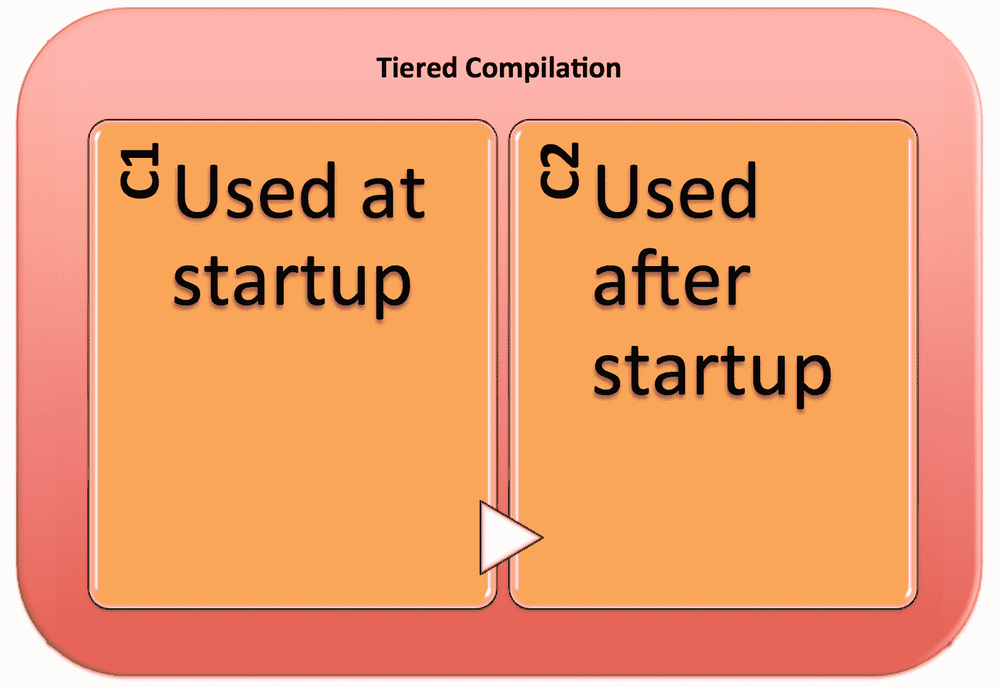

# 命令行标志

在上一章中，我们研究了 JDK 的几个安全性更改。Java 的安全增强为开发人员提供了编写和维护实现安全性的应用程序的能力。更具体地说，我们讨论了数据报传输层安全性、密钥库、提高安全应用程序性能、TLS ALPN、利用 GHASH 和 RSA 的 CPU 指令、TLS 的 OCSP 装订以及基于 DRBG 的`SecureRandom`实现。

在本章中，我们将探讨现代 Java 平台的几个变化，这些变化的共同主题是命令行标志。更具体地说，我们将介绍以下概念：

*   统一 JVM 日志记录
*   编译器控件
*   诊断命令
*   堆分析代理
*   移除 JHAT
*   命令行标志参数验证
*   为旧平台版本编译
*   基于 Java 的 JIT 编译器实验

# 技术要求

本章及后续章节主要介绍 Java 11，Java 平台的**标准版**（**SE**）可从 [Oracle 官方网站](http://www.oracle.com/technetwork/java/javase/downloads/index.html)下载。

IDE 软件包就足够了。来自 JetBrains 的 IntelliJ IDEA 用于与本章和后续章节相关的所有编码。IntelliJ IDEA 的社区版可从[网站](https://www.jetbrains.com/idea/features/)下载。

# 统一 JVM 日志记录

Java9 中引入了为 JVM 创建统一的日志模式。以下是这项工作的目标的综合清单：

*   为所有日志操作创建一组 JVM 范围的命令行选项
*   使用分类标记进行日志记录
*   允许消息具有多个标记，也称为标记集
*   要提供六个级别的日志记录：
*   错误
*   警告
*   问询处
*   调试
*   痕迹
*   发展

*   根据级别选择要记录的消息
*   要选择性地将日志记录定向到控制台或文件，请执行以下操作：
*   一次打印一行，不支持在同一行内交错
*   允许输出多行日志（非交错）
*   设置所有日志消息的格式，使其易于人阅读
*   添加装饰，如正常运行时间、级别和标记
*   与级别类似，用于选择基于装饰记录哪些消息
*   将 pre-java9`tty>print`日志转换为使用统一日志作为输出
*   允许使用`jcmd`和`MBeans`进行动态消息配置
*   允许启用和禁用单个日志消息
*   添加确定装饰打印顺序的功能

对 JVM 的统一日志记录更改可以分为以下五类：

*   命令行选项
*   装饰品
*   水平
*   输出
*   标签

让我们简单地看一下这些类别中的每一个。

# 命令行选项

新的命令行选项`-Xlog`是 Java 日志框架的关键组件。这个命令行选项有大量的参数和可能性。基本语法是`-Xlog`，后跟一个选项。

以下是正式的基本语法：

```java
-Xlog[:option]
```

下面是一个带有`all`选项的基本示例：

```java
-Xlog:all
```

以下是用于配置新的统一日志记录的广泛命令行语法：

```java
-Xlog[:option]
option := [<what>][:[<output>][:[<decorators>][:<outputoptions>]]]
'help'
'disable' 
what := <selector>[,...]
selector := <tag-set>[*][=<level>]
tag-set := <tag>[+..]
'all'
tag := name of tag
level := trace
debug
info
warning
error 
output := 'stderr'
'stdout'
[file=]<filename>
decorators := <decorator>[,...]
'none' 
decorator := time
uptime
timemillis
uptimemillis
timenanos
uptimenanos
pid
tid
level
tags
output-options := <output_option>[,...]
output-option := filecount=<file count>
filesize=<file size in kb>
parameter=value
```

以下`-Xlog`示例后面是说明：

```java
-Xlog:all
```

在前面的示例中，我们告诉 JVM 执行以下操作：

*   记录所有消息
*   使用`info`水准仪
*   向`stdout`提供输出

在本例中，所有的`warning`消息仍将输出到`stderr`。

以下示例在`debug`级别记录消息：

```java
-Xlog:gc+rt*=debug
```

在前面的示例中，我们告诉 JVM 执行以下操作：

*   记录至少带有`gc`和`rt`标记的所有消息
*   使用`debug`水准仪
*   向`stdout`提供输出

以下示例将输出推送到外部文件：

```java
-Xlog:disable - Xlog:rt=debug:rtdebug.txt
```

在前面的示例中，我们告诉 JVM 执行以下操作：

*   禁用除标记有`rt`标记的消息以外的所有消息
*   使用`debug`水准仪
*   向名为`rtdebug.txt`的文件提供输出

# 装饰品

在 Java 日志框架的上下文中，装饰是关于日志消息的元数据。以下是按字母顺序排列的可用装饰品列表：

*   `level`：与记录的消息相关联的级别
*   `pid`：PID=处理器标识符
*   `tags`：与记录的消息相关联的标签集
*   `tid`：TID=线程标识符
*   `time`：指当前日期和时间，采用 ISO-8601 格式
*   `timemillis`：当前时间（毫秒）
*   `timenanos`：当前时间（纳秒）
*   `uptime`：JVM 启动后的时间，以秒和毫秒为单位
*   `uptimemillis`：JVM 启动后的时间，以毫秒为单位
*   `uptimenanos`：JVM 启动后的时间，以纳秒为单位

装饰可以超越或包含在统一的日志输出中。无论使用哪种装饰，它们都将按以下顺序出现在输出中：

1.  `time`
2.  `uptime`
3.  `timemillis`
4.  `uptimemillis`
5.  `timenanos`
6.  `uptimenanos`
7.  `pid`
8.  `tid`
9.  `level`
10.  `tags`

# 水平

记录的消息单独与详细级别相关联。如前所述，级别为**错误**、**警告**、**信息**、**调试**、**跟踪**、**开发**。下表显示了这些级别相对于记录的信息量的详细程度是如何增加的。“开发级别”仅用于开发目的，在产品应用程序内部版本中不可用：


日志消息的详细级别

# 使用 Xlog 输出

Java 日志框架支持三种类型的输出，包括直接使用`-Xlog`命令行语法的示例：

在下面的示例中，我们向`stderr`提供输出：

```java
-Xlog:all=warning:stderr:none
```

下面的示例向`stdout`提供输出：

```java
-Xlog:all=warning:stdout:none
```

以下示例将输出写入文本文件：

```java
-Xlog:all=warning:file=logmessages.txt:none
```

# 标签

新的日志框架由一组在 JVM 中标识的标记组成。如果需要，可以在源代码中更改这些标记。标签应该是自识别的，例如用于垃圾收集的`gc`。

当多个标记组合在一起时，它们形成一个标记集。当我们通过源代码添加自己的标记时，每个标记都应该与一个标记集相关联。这将有助于确保标签保持有序，并且易于人类阅读。

# 编译器控件

控制**Java 虚拟机**（**JVM**编译器似乎是一项不必要的任务，但对于许多开发人员来说，这是测试的一个重要方面。这是通过依赖于方法的编译器标志实现的。

在本节中，我们将从 JVM 编译模式开始，然后看看可以使用 Java 平台控制的编译器。

# 编译模式

现代 Java 平台的变化包括对 JVM 编译器的细粒度控制。如下图所示，Java HotSpot JVM 有两种 JIT 编译模式**C1**和**C2**：


Java 热点 JVM 编译模式

**C1**和**C2**编译模式使用不同的编译技术，如果在同一个代码基上使用，可以产生不同的机器代码集。

# C1 编译模式

Java HotSpot VM 中的 C1 编译模式通常用于具有以下特征的应用程序：

*   快速启动
*   增加优化
*   客户端

# C2 编译模式

第二种编译模式 C2 由具有下列特征的应用程序使用：

*   长运行时
*   服务器端

# 分层编译

分层编译允许我们同时使用**C1**和**C2**编译模式。从 Java8 开始，分层编译是默认的过程。如图所示，启动时使用**C1**模式有助于提供更大的优化。然后，一旦 app 充分预热，则采用**C2**模式：



分层编译

# java11 中的编译控制

Java 承诺能够有限地控制 JVM 编译器并在运行时进行更改。这些额外的能力不会降低性能。这使得测试和测试优化更加逼真，因为我们可以运行小型编译器测试，而不必重新启动整个 JVM。

为了控制编译器操作，我们需要创建一个指令文件。这些文件包含由一组带有值的选项组成的编译器指令。指令文件基本上使用 JSON 的一个子集：


编译器指令结构

**JavaScript 对象表示法**（**JSON**格式）用于数据交换。指令文件与 JSON 有以下格式差异：

*   `int`和`doubles`是唯一支持的数字格式
*   双正斜杠（`//`）可用于注释行
*   尾随逗号（`,`可用于数组和对象中
*   不支持转义字符
*   选项名的格式为字符串，不必加引号

您可以在[这个页面](http://www.json.org)了解更多关于 JSON 的信息。

我们可以在命令行中使用以下语法添加指令文件：

```java
-XX:CompilerDirectivesFile=<file>
```

以下是指令文件的 shell 示例：

```java
[ // Open square bracket marks the start of the directives file

{ // Open curly brace marks the start of a directive block
  // A directives block that applies specifically to the C1 mode
  c1: {
        // directives go here
      },

  // A directives block that applies specifically to the C2 mode
  c2: {
        // directives go here
      },

  // Here we can put a directives that do not apply to
  // a specific compiler mode
},

{ // can have multiple directive blocks

  c1: {
        // directives go here
      }

  c2: {
        // directives go here
      }
}
] // Close square bracket marks the start of the directives file
```

# 诊断命令

在现代 Java 平台中添加了七个新的诊断命令，以增强诊断 JDK 和 JVM 的能力。

`print_codegenlist`命令打印当前排队等待编译的方法。由于 C1 和 C2 编译模式位于不同的队列上，因此需要向特定队列发出此命令。

`dump_codelist`诊断命令将打印编译方法的下列信息：

*   完整签名
*   地址范围
*   状态：
*   活着的
*   非参赛者
*   僵尸

此外，`dump_codelist`诊断命令允许将输出定向到`stdout`或指定的文件。输出可以是 XML 格式或标准文本。

`print_codeblocks`命令允许我们打印以下内容：

*   代码缓存大小
*   代码缓存列表
*   代码缓存中的块列表
*   代码块地址

`datadump_request`诊断命令向**Java 虚拟机床接口**（**JVMTI**发送转储请求。它取代了**Java 虚拟机调试接口**（**JVMDI**）和**Java 虚拟机评测接口**（**JVMPI**）。

使用`set_vmflag`命令，我们可以在 JVM 或库中设置命令行标志或选项。

`print_class_summary`诊断命令打印所有加载类的列表及其继承结构。

`print_utf8pool`命令打印所有 UTF-8 字符串常量。

# 堆分析代理

jvmti`hprof`代理最近从 Java 平台上删除了。以下是与此更改相关的关键术语：

*   **工具接口**（**TI**）：这是一个本机编程接口，允许工具控制正在 Java 虚拟机内运行的应用程序的执行。该接口还允许状态查询。这个工具的完整术语是 Java 虚拟机工具接口，或 jvmti。
*   **Heap Profiling**（**HPROF**）：这是一个内部 JDK 工具，用于分析 JVM 对 cpu 和堆的使用。开发人员最常见的暴露是崩溃后生成的文件。生成的文件包含堆转储。

Java11JDK 不包含`hprof`代理。它被删除主要是因为有更好的替代品可用。以下是它们的相关功能表：

| **HPROF 功能** | **备选方案** |
| 分配探查器
（堆=站点） | Java 可视化 |
| CPU 档案器
（CPU=样本）
（CPU=次数） | Java VisualVM
Java 飞行记录器 |
| 堆转储
（Heap=dump） | 内部 JVM 功能：

*   `GC.heap_dump(icmd <pid> GC.heap_dump)`
*   `jmap -dump`

 |

有趣的是，最初创建 HPROF 时，并不打算在生产中使用它。实际上，它只是为了测试 JVM 工具接口的代码。因此，随着现代 Java 平台的出现，HPROF 库（`libhprof.so`将不再是 JDK 的一部分。

# 移除 JHAT

**Java 堆分析工具**（**JHAT**）用于解析 Java 堆转储文件。此堆转储文件解析工具的语法如下：

```java
jhat
    [-stack <bool>]
    [-refs <bool>]
    [-port <port>]
    [-baseline <file>]
    [-debug <int>]
    [-version]
    [-h|-help]
   <file>
```

下面简要介绍与 JHAT 命令相关的选项：

| **选项** | **说明** | **违约** |
| `-J<flag>` | 这会将`<flag>`传递给运行时系统 | 不适用 |
| `-stack<bool>` | 这将切换对象分配调用栈的跟踪 | `true` |
| `-refs<bool>` | 这将切换对对象引用的跟踪 | `true` |
| `-port<port>` | 这表示 JHAT HTTP 服务器的端口 | `7000` |
| `-exclude<exclude-filename>` | 这将从可访问对象中排除指定的文件 | 不适用 |
| `-baseline<filename>` | 这将指定用于比较的基准堆转储 | 不适用 |
| `-debug<int>` | 这将设置输出的详细程度 | 不适用 |
| `-version ` | 这只是输出 JHAT 版本号 | 不适用 |
| `-h`
`-help` | 这将提供帮助文本 | 不适用 |

JHAT 从 JDK-6 开始就以实验的形式成为 Java 平台的一部分。它不受支持，被认为是过时的。从 Java9 开始，这个工具不再是 JDK 的一部分。

# 命令行标志参数验证

在本章中，您已经了解了 Java 平台中命令行标志的许多用法。一致努力确保所有带参数的 JVM 命令行标志都得到验证。这项工作的主要目标是：

*   避免 JVM 崩溃
*   提供错误消息以通知无效的标志参数

从下图中可以看到，没有尝试自动更正标志参数错误；相反，只是为了识别错误并防止 JVM 崩溃：


标志参数错误

这里提供了一个示例错误消息，指出标志参数超出范围。此错误将在 JVM 初始化期间执行的标志参数范围检查期间显示：

```java
exampleFlag UnguardOnExecutionViolation = 4 is outside the allowed range [0 . . . 3]
```

以下是一些有关 Java 平台更改的细节：

*   展开当前的`globals.hpp`源文件，以确保完整的标志默认值和允许的范围被记录
*   定义一个框架以支持将来添加新的 JVM 命令行标志：
*   这将包括值范围和值集
*   这将确保有效性检查将应用于所有新添加的命令行标志

*   修改宏表：
*   为可选范围添加最小值/最大值
*   为以下项添加约束项：
    *   确保每次标记更改时都执行约束检查
    *   当 JVM 运行时，将继续检查所有可管理的标志

# 为旧平台版本编译

Java 编译器`javac`在 Java9 中进行了更新，以确保它可以用来编译 Java 程序，以便在用户选择的旧版本 Java 平台上运行。在下面的截图中可以看到，`javac`有几个选项，包括`-source`和`-target`。以下截图中显示的`javac`来自 Java 8：


Java8 中的 javac 选项

`-source`选项用于指定编译器接受的 Java 版本。`-target`选项通知您将生成哪个版本的类文件`javac`。默认情况下，`javac`生成最新 Java 版本和平台 api 版本的类文件。当编译的应用程序使用仅在最新平台版本中可用的 API 时，这可能会导致问题。这将导致应用程序无法在较旧的平台版本上运行，尽管使用了`-source`和`-target`选项。

为了解决上述问题，Java 中提供了一个新的命令行选项，这个选项是`--release`选项，当使用这个选项时，会自动配置`javac`来生成与特定平台版本相链接的类文件。下面的屏幕截图显示了当前 Java 平台的`javac`选项。如您所见，新的`--release`选项包括：


Java18.9 中的 javac 选项

以下是新选项的语法：

```java
javac --release <release> <source files>
```

# 基于 Java 的 JIT 编译器实验

在 java10 中启用了基于 Java 的即时（Just-in-Time）编译器（**JIT**），可以作为 Linux/x64 平台的实验性 JIT 编译器。基于 Java 的 JIT 编译器被称为 Graal

做出这一更改的目的是希望通过实验可以证明将 JIT 编译器添加到 JDK 中的概念

# 摘要

在本章中，我们探讨了现代 Java 平台的一些变化，这些变化的共同主题是命令行标志。具体来说，我们讨论了统一 JVM 日志记录、编译器控制、新的诊断命令、HPROF 堆分析代理的删除、JHAT 的删除、命令行标志参数验证，以及针对旧平台版本进行编译的能力。

在下一章中，我们将重点介绍 Java 中提供的附加实用程序的最佳实践。其中包括 UTF-8、Unicode 7.0、Linux 等等。

# 问题

1.  Java9 中引入的 JVM 日志记录模式是什么？
2.  日志记录的五个类别是什么？
3.  什么是装饰品？
4.  日志中的详细程度是多少？
5.  哪一个详细级别是最高的？
6.  哪种详细程度最低？
7.  如何更改日志标记？

8.  什么用于控制 JVM？
9.  Java 热点 JVM 的 JIT 编译模式是什么？
10.  哪种编译模式具有快速启动功能？

# 进一步阅读

以下是您可以参考的信息列表：

*   《Java SE 9 整洁代码入门》【视频】在[这个页面](https://www.packtpub.com/application-development/getting-started-clean-code-java-se-9-video)提供。